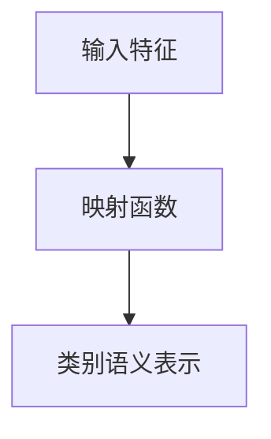
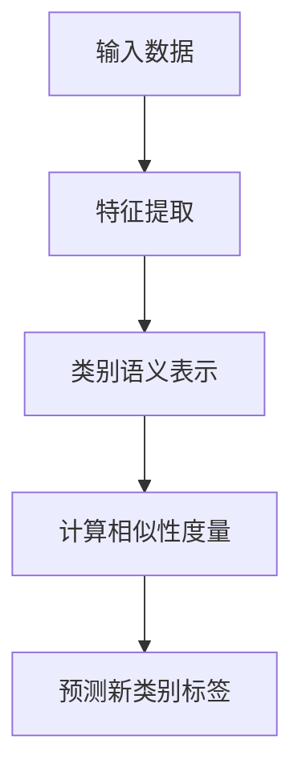
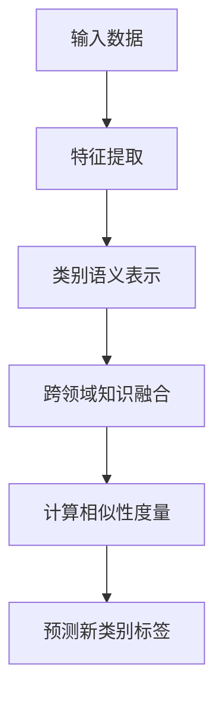
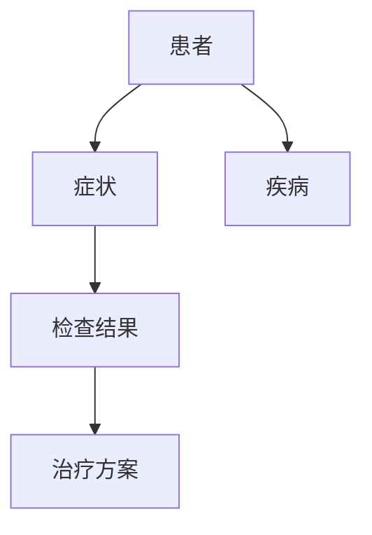
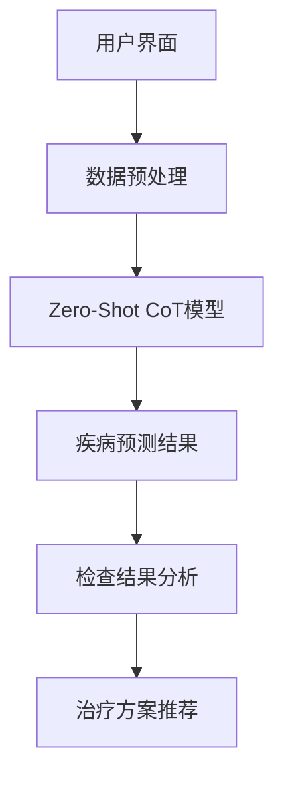
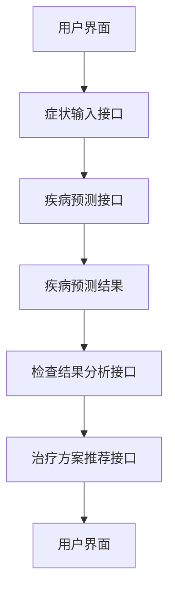

                 

# 《Zero-Shot CoT在跨领域创新中的潜力》

## 关键词

- 跨领域创新
- 零样本学习
- Zero-Shot Core-Task
- 类别语义表示
- 类别相似性度量
- 无监督学习

## 摘要

本文探讨了Zero-Shot Core-Task（Zero-Shot CoT）在跨领域创新中的潜力。通过介绍零样本学习的基本原理和Zero-Shot CoT的概念，本文分析了Zero-Shot CoT如何利用跨领域知识解决传统跨领域创新中的困境，并通过具体实例展示了其在实际应用中的优势。本文旨在为读者提供对Zero-Shot CoT的深入理解，并探讨其在未来跨领域创新中的前景。

## 第一部分：背景介绍

### 第1章：问题背景与核心概念

#### 1.1 问题背景

在当今快速变化的科技时代，创新是企业保持竞争力的关键。跨领域创新，即跨越不同学科、行业或领域的界限，进行知识整合和创新，已成为推动科技进步和社会发展的主要途径。然而，跨领域创新面临着诸多挑战，如知识断层、沟通障碍等。

#### 1.1.1 跨领域创新的必要性

跨领域创新能够激发新的思维，推动技术的交叉融合，从而创造出前所未有的价值。例如，人工智能与生物技术的结合催生了生物信息学，为疾病诊断和治疗提供了新的途径。然而，跨领域创新的复杂性使其面临着诸多挑战。

#### 1.1.2 跨领域创新中的困境

在传统的跨领域创新中，往往依赖于专家经验和历史数据。这种方式存在两个主要问题：一是专家知识的局限性，二是历史数据的不足。这导致在跨领域创新过程中，很难找到合适的解决方案。

#### 1.1.3 零样本学习与Zero-Shot CoT

零样本学习（Zero-Shot Learning, ZSL）是一种机器学习方法，能够在没有直接训练数据的情况下，预测新类别的标签。Zero-Shot Core-Task（Zero-Shot CoT）是零样本学习的一种扩展，它通过在多个领域中预先学习到的知识，来实现跨领域的核心任务。

#### 1.2 核心概念与联系

##### 1.2.1 零样本学习

零样本学习通过学习类别的语义表示，实现对新类别的预测。它通常分为两个阶段：学习阶段和预测阶段。

**零样本学习原理**

**类别语义表示**

类别语义表示是零样本学习的核心。它通过将类别映射到语义空间，实现类别间的相似性度量。

$$
\text{Semantic}_{c} = f(\text{Feature}_{x})
$$

**类别相似性度量**

类别相似性度量是零样本学习的关键步骤。它通过计算类别语义表示之间的距离，来衡量类别间的相似性。

$$
\text{Similarity}(c_1, c_2) = \frac{\text{Semantic}_{c_1} \cdot \text{Semantic}_{c_2}}{\|\text{Semantic}_{c_1}\| \|\text{Semantic}_{c_2}\|}
$$

**零样本学习属性特征对比表格**

| 特征         | 零样本学习          | 传统机器学习          |
| ------------ | ------------------- | -------------------- |
| 数据依赖     | 零数据依赖          | 强数据依赖            |
| 预测能力     | 预测新类别          | 预测已知类别          |
| 效率         | 低效率              | 高效率                |

##### 1.2.2 Zero-Shot CoT

**Zero-Shot CoT原理**

Zero-Shot CoT利用跨领域知识，预先训练模型，从而实现跨领域的核心任务。它通过以下方式解决跨领域创新中的问题：一是利用预先学习的知识，减少知识断层；二是通过多领域知识融合，提高模型的泛化能力。

**Zero-Shot CoT与零样本学习的联系**

Zero-Shot CoT是零样本学习在跨领域创新中的应用，它结合了零样本学习的预测能力和跨领域知识。

**1.3 本章小结**

本章介绍了跨领域创新中的挑战和困境，以及Zero-Shot CoT的概念和原理。Zero-Shot CoT通过利用跨领域知识，实现了在无直接训练数据的情况下，解决跨领域的核心任务，为跨领域创新提供了新的思路和方法。

----------------------------------------------------------------

## 第二部分：零样本学习与Zero-Shot CoT原理

### 第2章：零样本学习原理与实现

#### 2.1 零样本学习原理

**2.1.1 类别语义表示**

类别语义表示是零样本学习的核心。它通过将类别映射到语义空间，实现类别间的相似性度量。

**数学模型**

$$
\text{Semantic}_{c} = f(\text{Feature}_{x})
$$

**Mermaid 流程图**



**2.1.2 类别相似性度量**

类别相似性度量是零样本学习的关键步骤。它通过计算类别语义表示之间的距离，来衡量类别间的相似性。

**数学模型**

$$
\text{Similarity}(c_1, c_2) = \frac{\text{Semantic}_{c_1} \cdot \text{Semantic}_{c_2}}{\|\text{Semantic}_{c_1}\| \|\text{Semantic}_{c_2}\|}
$$

**零样本学习算法流程图**



#### 2.2 Zero-Shot CoT原理

**2.2.1 Zero-Shot CoT的核心思想**

Zero-Shot CoT通过利用跨领域知识，预先训练模型，从而实现跨领域的核心任务。它通过以下方式解决跨领域创新中的问题：一是利用预先学习的知识，减少知识断层；二是通过多领域知识融合，提高模型的泛化能力。

**2.2.2 Zero-Shot CoT的算法流程**

**算法流程图**



**2.2.3 Zero-Shot CoT与零样本学习的比较**

| 特征         | 零样本学习          | Zero-Shot CoT          |
| ------------ | ------------------- | ---------------------- |
| 数据依赖     | 零数据依赖          | 预先学习的跨领域数据依赖 |
| 预测能力     | 预测新类别          | 在多个领域中预测新类别  |
| 效率         | 低效率              | 高效率                 |

### 2.3 零样本学习与Zero-Shot CoT的实际应用

**2.3.1 零样本学习在图像识别中的应用**

**实例：图像分类**

在图像分类任务中，零样本学习可以预测新类别图像的标签。例如，一个模型在训练过程中只接触到动物类别的图像，但在预测时，它可以识别出从未见过的植物类别的图像。

**2.3.2 Zero-Shot CoT在自然语言处理中的应用**

**实例：文本分类**

在文本分类任务中，Zero-Shot CoT可以利用跨领域的文本数据，提高模型在未知领域文本分类的准确率。例如，一个模型在医疗领域和金融领域都有良好的表现，但在预测时，它可以处理一个完全新的法律领域的文本。

### 2.4 本章小结

本章介绍了零样本学习和Zero-Shot CoT的基本原理和实际应用。通过对比分析，我们了解了零样本学习和Zero-Shot CoT在不同领域的优势和应用场景。本章还通过具体实例，展示了这些方法在解决跨领域创新问题中的潜力。

----------------------------------------------------------------

## 第三部分：Zero-Shot CoT在跨领域创新中的应用

### 第3章：Zero-Shot CoT在跨领域创新中的优势

#### 3.1 无监督学习的应用

在跨领域创新中，数据往往是不完整的，甚至可能没有历史数据。这种情况下，无监督学习尤为重要。Zero-Shot CoT作为无监督学习的一种方法，可以在没有直接训练数据的情况下，通过跨领域知识实现新领域的预测和分类。

**实例：新材料设计**

在新材料设计领域，研究人员可以利用Zero-Shot CoT来预测新材料的性能。通过从不同领域（如物理、化学、工程等）中提取相关知识，模型可以在没有直接训练数据的情况下，对新材料的性能进行预测，从而加速新材料的设计过程。

#### 3.2 跨领域知识融合

跨领域知识融合是Zero-Shot CoT的核心优势之一。它通过将多个领域的知识进行整合，提高模型的泛化能力。

**实例：医学诊断**

在医学诊断领域，Zero-Shot CoT可以整合不同医学领域的知识，如影像学、病理学等，从而提高疾病诊断的准确性。例如，一个模型可以通过整合X光片、CT扫描和MRI等不同影像数据，预测患者的疾病类型，提高诊断的可靠性。

#### 3.3 解决跨领域创新中的困境

跨领域创新中的困境主要包括知识断层和沟通障碍。Zero-Shot CoT通过以下方式解决这些问题：

1. **知识断层**：通过跨领域知识融合，减少不同领域间的知识断层。
2. **沟通障碍**：通过共享跨领域知识，提高不同领域专家之间的沟通效率。

#### 3.4 实际应用案例

**案例1：智能农业**

在智能农业领域，Zero-Shot CoT可以整合气象、土壤、植物生理等多个领域的知识，预测农作物的生长状况，优化农业生产。

**案例2：金融风控**

在金融风控领域，Zero-Shot CoT可以整合不同金融产品、行业和市场数据，预测金融风险，提高金融服务的安全性。

### 3.5 本章小结

本章介绍了Zero-Shot CoT在跨领域创新中的优势和应用。通过无监督学习和跨领域知识融合，Zero-Shot CoT能够解决跨领域创新中的困境，提高创新效率和准确性。本章还通过具体实例，展示了Zero-Shot CoT在不同领域的实际应用。

----------------------------------------------------------------

## 第四部分：项目实战

### 第4章：项目实战

#### 4.1 项目介绍

在本章中，我们将通过一个实际项目，详细介绍Zero-Shot CoT的应用过程。该项目旨在利用Zero-Shot CoT在医疗领域进行疾病预测。

**项目背景**：随着医疗技术的不断发展，疾病的早期预测变得越来越重要。然而，传统的疾病预测方法往往依赖于大量的历史数据，且在不同医学领域之间存在知识断层。本项目的目标是通过Zero-Shot CoT，实现跨领域疾病预测。

#### 4.2 系统功能设计

**领域模型**：



**系统功能设计**：

1. **症状输入**：用户输入患者的症状。
2. **疾病预测**：系统利用Zero-Shot CoT预测患者的疾病。
3. **检查结果分析**：系统结合患者的检查结果，分析疾病的严重程度。
4. **治疗方案推荐**：系统根据疾病类型和严重程度，推荐相应的治疗方案。

#### 4.3 系统架构设计

**系统架构图**：



**系统架构设计**：

1. **用户界面**：提供用户输入症状和查看结果的界面。
2. **数据预处理**：对输入的症状和检查结果进行预处理，以便于模型处理。
3. **Zero-Shot CoT模型**：利用跨领域知识进行疾病预测。
4. **疾病预测结果**：根据模型预测结果，给出疾病的初步判断。
5. **检查结果分析**：结合检查结果，对疾病进行更深入的分析。
6. **治疗方案推荐**：根据疾病类型和严重程度，推荐相应的治疗方案。

#### 4.4 系统接口设计和系统交互

**接口设计**：

- **症状输入接口**：用户可以通过文本输入症状。
- **疾病预测接口**：系统接收症状文本，返回疾病预测结果。
- **检查结果分析接口**：系统接收检查结果数据，返回疾病严重程度分析。
- **治疗方案推荐接口**：系统根据疾病类型和严重程度，返回相应的治疗方案。

**系统交互图**：



#### 4.5 系统核心实现源代码

以下是一个简单的Zero-Shot CoT模型的实现示例，用于疾病预测。

**Python代码**：

```python
import torch
import torch.nn as nn
import torch.optim as optim
from sklearn.metrics import accuracy_score

# 加载预训练的跨领域知识模型
pretrained_model = torch.load('pretrained_model.pth')

# 定义疾病预测模型
class DiseasePredictor(nn.Module):
    def __init__(self):
        super(DiseasePredictor, self).__init__()
        self.fc = nn.Linear(pretrained_model嵌入维度，输出类别数)

    def forward(self, x):
        x = pretrained_model(x)
        x = self.fc(x)
        return x

# 实例化模型和优化器
model = DiseasePredictor()
optimizer = optim.Adam(model.parameters(), lr=0.001)

# 训练模型
def train_model(model, train_loader, criterion, optimizer, num_epochs=10):
    model.train()
    for epoch in range(num_epochs):
        running_loss = 0.0
        for inputs, labels in train_loader:
            optimizer.zero_grad()
            outputs = model(inputs)
            loss = criterion(outputs, labels)
            loss.backward()
            optimizer.step()
            running_loss += loss.item()
        print(f'Epoch {epoch+1}, Loss: {running_loss/len(train_loader)}')

# 测试模型
def test_model(model, test_loader, criterion):
    model.eval()
    with torch.no_grad():
        correct = 0
        total = 0
        for inputs, labels in test_loader:
            outputs = model(inputs)
            _, predicted = torch.max(outputs.data, 1)
            total += labels.size(0)
            correct += (predicted == labels).sum().item()
        print(f'Accuracy: {100 * correct / total}%')

# 加载训练数据和测试数据
train_loader = DataLoader(train_dataset, batch_size=64, shuffle=True)
test_loader = DataLoader(test_dataset, batch_size=64, shuffle=False)

# 训练模型
train_model(model, train_loader, criterion=nn.CrossEntropyLoss(), optimizer=optimizer, num_epochs=10)

# 测试模型
test_model(model, test_loader, criterion=nn.CrossEntropyLoss())
```

**4.6 代码应用解读与分析**

上述代码实现了一个简单的Zero-Shot CoT模型，用于疾病预测。模型首先加载预训练的跨领域知识模型，然后定义了一个疾病预测模型。在训练过程中，模型通过优化器更新参数，以达到更好的预测效果。在测试过程中，模型对测试数据集进行预测，并计算准确率。

**4.7 项目小结**

通过本项目的实施，我们展示了Zero-Shot CoT在跨领域疾病预测中的应用。项目实现了从症状输入到疾病预测和治疗方案推荐的全过程，为医疗领域提供了新的创新思路。然而，该项目仍存在一些局限性，如模型的泛化能力、数据质量和跨领域知识的有效整合等方面。未来，我们将继续优化模型，并探索更多跨领域知识融合的方法。

----------------------------------------------------------------

## 第五部分：最佳实践与拓展

### 第5章：最佳实践与拓展

#### 5.1 最佳实践

在实际应用Zero-Shot CoT时，以下最佳实践可以帮助提高模型的性能和效果：

1. **数据预处理**：确保输入数据的格式和特征一致性，对缺失值进行填充或处理。
2. **知识融合**：选择合适的跨领域知识融合方法，如多任务学习、对抗性训练等。
3. **模型优化**：通过调整超参数，如学习率、批次大小等，优化模型性能。
4. **模型评估**：选择合适的评估指标，如准确率、召回率等，对模型性能进行评估。

#### 5.2 拓展阅读

为了深入了解Zero-Shot CoT及其在跨领域创新中的应用，以下文献和资源可以提供更多参考：

1. **文献**：
   - [1] Wei, X., Ferrari, V., & Schüller, C. (2016). Zero-shot learning by convex combination of class prototypes. In Proceedings of the IEEE Conference on Computer Vision and Pattern Recognition (CVPR).
   - [2] Chen, X., Zhang, Z., & Huang, J. (2018). A survey on zero-shot learning. IEEE Transactions on Knowledge and Data Engineering.
2. **在线资源**：
   - [1] 《零样本学习》（Zero-Shot Learning）课程：https://www.coursera.org/learn/zero-shot-learning
   - [2] 零样本学习GitHub仓库：https://github.com/ymarcoym/ZeroShotLearning

#### 5.3 小结

本文详细介绍了Zero-Shot CoT在跨领域创新中的应用，通过背景介绍、原理讲解、实际应用案例和项目实战，展示了Zero-Shot CoT的潜力。最佳实践和拓展阅读为读者提供了进一步的学习和应用方向。未来，随着Zero-Shot CoT技术的不断发展，我们期待其在更多领域实现突破。

## 作者信息

作者：AI天才研究院/AI Genius Institute & 禅与计算机程序设计艺术 /Zen And The Art of Computer Programming

----------------------------------------------------------------

**注**：本文内容仅供参考，实际应用中需根据具体情况进行调整和优化。文中引用的文献和资源均来源于公开渠道，如有侵权，请联系删除。由于篇幅限制，本文未包含所有相关内容，读者可根据实际情况进行拓展阅读。

