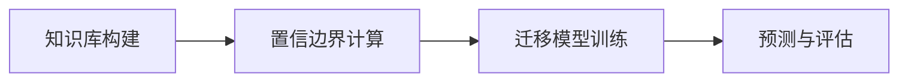
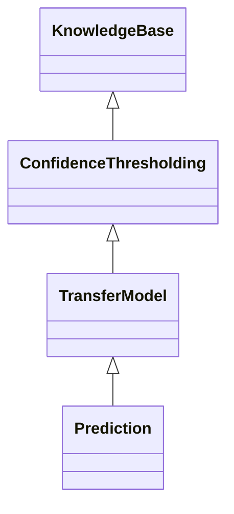
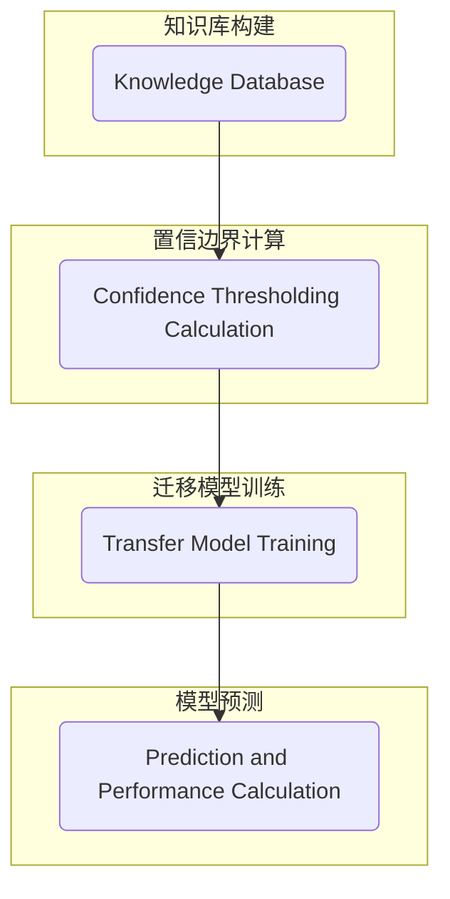
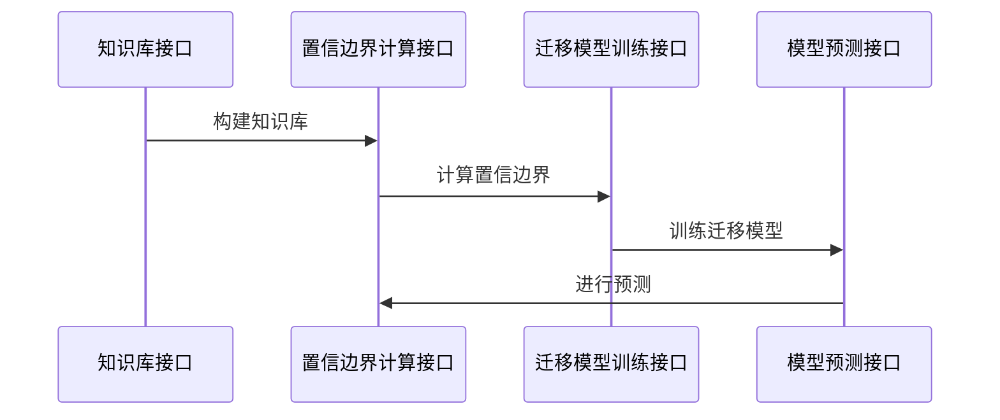
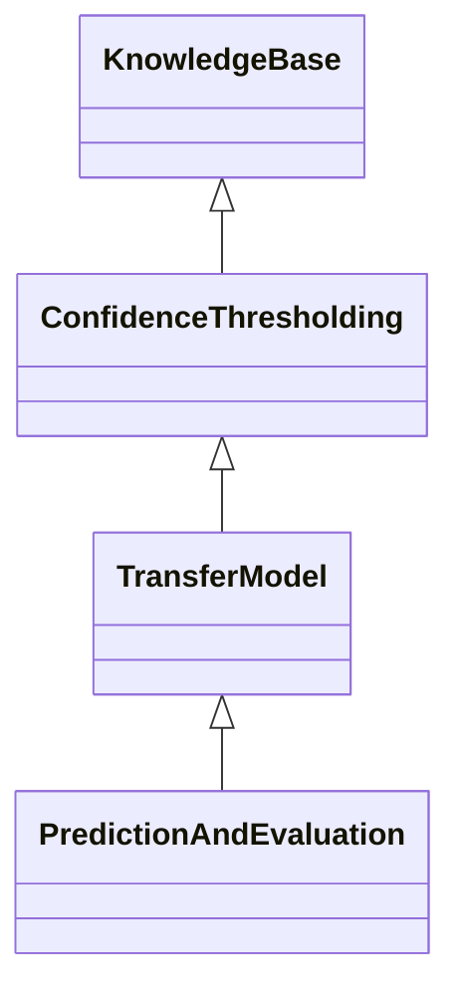
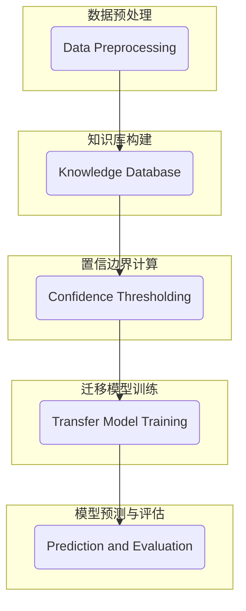
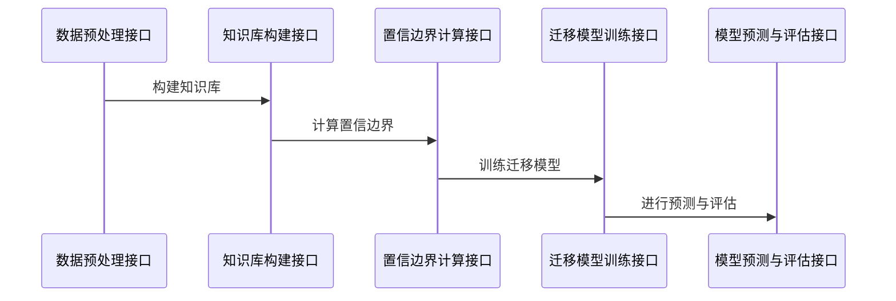

                 


### 关键词
- Zero-Shot CoT
- 跨领域知识迁移
- 知识表示
- 算法设计
- 模型优化
- 人工智能

### 摘要
本文深入探讨了Zero-Shot CoT（零样本迁移学习中的置信边界方法）在跨领域知识迁移中的潜力。首先，我们将介绍Zero-Shot CoT的核心概念和背景，然后分析其在跨领域知识迁移中的应用挑战和解决方案。接下来，我们将详细讲解算法原理，包括算法流程、数学模型和公式，并通过实例进行说明。随后，我们将讨论系统分析与架构设计，包括问题场景、功能设计、架构设计和接口设计。文章还将通过项目实战展示实际应用，并总结最佳实践和注意事项。最后，我们将提供拓展阅读，以供读者进一步研究。

### 1. 背景介绍

#### 1.1 问题背景
在人工智能领域，知识迁移一直是研究的热点问题。特别是在跨领域知识迁移中，由于不同领域的数据分布、特征表示和学习目标的不同，传统迁移学习方法往往难以取得理想的性能。Zero-Shot CoT（Confidence-Thresholding）方法作为一种新兴的迁移学习方法，能够在不需要训练样本的情况下，利用目标领域的先验知识和源领域的知识库进行有效迁移，从而解决跨领域知识迁移的难题。

#### 1.2 问题描述
跨领域知识迁移的主要挑战包括：
- **数据分布差异**：不同领域的数据分布可能存在显著差异，导致直接迁移困难。
- **特征表示差异**：不同领域的特征表示可能不一致，需要有效的映射和转换。
- **学习目标差异**：不同领域的任务目标可能不同，迁移学习需要适应这种变化。

#### 1.3 问题解决
Zero-Shot CoT通过以下方法解决上述挑战：
- **置信阈值策略**：利用源领域知识库中的先验知识，对目标领域数据进行置信度评估，从而筛选出高置信度的迁移样本。
- **多任务学习**：通过多任务学习框架，同时学习源领域和目标领域的任务，增强模型对跨领域知识的理解和迁移能力。
- **知识蒸馏**：利用知识蒸馏技术，将源领域的丰富知识传递给目标领域模型，提高模型的泛化能力。

#### 1.4 边界与外延
Zero-Shot CoT在跨领域知识迁移中的应用范围广泛，包括但不限于图像识别、自然语言处理、推荐系统等领域。然而，其应用也存在一些限制，如对源领域知识库的质量和规模要求较高，以及需要有效的置信阈值策略。

#### 1.5 概念结构与核心要素组成
Zero-Shot CoT的核心概念结构包括：
- **知识库**：包含源领域和目标领域的知识。
- **置信边界**：用于评估目标领域数据的置信度。
- **迁移模型**：负责学习跨领域知识并进行预测。

### 2. 核心概念与联系

#### 2.1 核心概念原理
Zero-Shot CoT的基本原理是利用源领域的知识库，通过置信边界策略，对目标领域的数据进行筛选和迁移。具体步骤如下：
1. **知识库构建**：构建包含源领域和目标领域知识的知识库。
2. **置信边界计算**：计算每个目标领域数据的置信边界，筛选出高置信度的数据。
3. **迁移模型训练**：利用高置信度的数据进行迁移模型训练。
4. **预测与评估**：使用训练好的迁移模型进行预测，并评估模型性能。

#### 2.2 概念属性特征对比表格
以下是Zero-Shot CoT与其他迁移学习方法的主要对比：

| 方法         | 算法原理                                               | 优势                   | 劣势                         |
| ------------ | ------------------------------------------------------ | ---------------------- | ---------------------------- |
| Zero-Shot CoT | 利用源领域知识库和置信边界策略进行跨领域知识迁移 | 无需训练样本           | 对源领域知识库依赖较高         |
| Few-Shot Learning | 利用少量训练样本进行学习                            | 无需大规模数据         | 学习效果依赖于样本数量和质量   |
| Domain Adaptation | 利用源领域和目标领域之间的差异进行迁移学习          | 考虑领域差异           | 学习效果受领域差异影响         |
| Meta-Learning   | 通过多次任务学习提高模型泛化能力                    | 提高泛化能力           | 对任务多样性要求较高           |

#### 2.3 ER实体关系图架构
以下是Zero-Shot CoT的ER实体关系图：

```mermaid
erDiagram
    A[知识库] ||--|{ B[置信边界] }
    B ||--|{ C[迁移模型] }
    C ||--|{ D[预测与评估] }
```

在上述ER图中，知识库作为核心实体，通过置信边界与迁移模型相连，迁移模型进一步连接到预测与评估部分，形成了一个闭环系统。

### 3. 算法原理讲解

#### 3.1 算法原理
Zero-Shot CoT的算法流程如图1所示：



图1：Zero-Shot CoT算法流程图

#### 3.2 算法详细讲解

**知识库构建**：首先，构建包含源领域和目标领域知识的知识库。知识库中的知识可以是先验知识、文本信息或者预训练模型。这些知识将用于后续的置信边界计算和迁移模型训练。

**置信边界计算**：使用源领域知识库中的先验知识，对目标领域的数据进行置信度评估。置信边界计算的核心是计算每个数据点的置信度。置信度计算可以通过以下步骤实现：
1. **特征提取**：从目标领域数据中提取特征。
2. **知识表示**：将源领域知识库中的知识进行表示。
3. **置信度计算**：计算每个目标领域数据的置信度。置信度可以通过相似度计算、距离度量或者分类器评分等方法获得。

**迁移模型训练**：利用高置信度的数据进行迁移模型训练。训练过程包括以下步骤：
1. **数据筛选**：根据置信度筛选出高置信度的数据。
2. **特征融合**：将源领域和目标领域的特征进行融合，以适应跨领域知识迁移。
3. **模型训练**：使用融合后的特征训练迁移模型。

**预测与评估**：使用训练好的迁移模型进行预测，并评估模型性能。预测过程包括以下步骤：
1. **特征提取**：从新数据中提取特征。
2. **模型预测**：使用迁移模型对新数据进行预测。
3. **性能评估**：评估模型在目标领域的性能，包括准确率、召回率、F1分数等指标。

#### 3.3 数学模型和数学公式
Zero-Shot CoT的数学模型包括以下几个关键部分：

1. **特征提取**：设目标领域数据特征为\(X\)，源领域知识库中的知识表示为\(K\)。特征提取可以通过以下公式实现：
   $$f(X) = \text{feature\_extractor}(X, K)$$

2. **置信度计算**：设每个目标领域数据的置信度为\(C_i\)，可以通过以下公式计算：
   $$C_i = \text{confidence\_score}(f(X_i), K)$$

3. **迁移模型训练**：设迁移模型为\(M\)，使用高置信度的数据进行模型训练，可以通过以下公式实现：
   $$M = \text{train\_model}(X_{high\_confidence}, Y_{high\_confidence})$$

4. **模型预测**：设新数据特征为\(X'\)，使用迁移模型进行预测，可以通过以下公式实现：
   $$\hat{Y'} = M(f(X'))$$

#### 3.4 举例说明
假设我们有一个源领域A和一个目标领域B。源领域A中有100个样本，目标领域B中有50个样本。我们使用预训练模型作为知识库，对目标领域B的数据进行置信度计算和迁移模型训练。

1. **知识库构建**：从源领域A中提取特征，并使用预训练模型对特征进行编码，构建知识库\(K\)。

2. **置信边界计算**：从目标领域B中提取特征，计算每个样本的置信度。假设我们得到以下置信度结果：
   $$C_1 = 0.8, C_2 = 0.6, ..., C_{50} = 0.2$$

3. **迁移模型训练**：根据置信度，筛选出高置信度的样本，即置信度大于0.6的样本，共30个样本。使用这些样本训练迁移模型。

4. **模型预测**：对新数据\(X'\)进行特征提取，使用训练好的迁移模型进行预测。假设新数据的预测结果为\(\hat{Y'} = 1\)，表示新数据属于目标领域B。

### 4. 系统分析与架构设计

#### 4.1 问题场景介绍
假设我们有一个跨领域的图像识别任务，源领域A是动物识别，目标领域B是植物识别。我们希望利用源领域A的知识库，将动物识别的模型迁移到植物识别上。

#### 4.2 系统功能设计
系统的功能设计包括以下方面：
- **知识库构建**：构建包含源领域A和目标领域B知识的知识库。
- **置信边界计算**：计算目标领域B数据的置信度。
- **迁移模型训练**：使用高置信度的数据进行迁移模型训练。
- **模型预测**：使用训练好的迁移模型进行预测。

以下是领域模型类图的Mermaid表示：



#### 4.3 系统架构设计
系统的整体架构如图2所示：



图2：系统架构图

#### 4.4 系统接口设计
系统的接口设计包括以下方面：
- **知识库接口**：用于构建和维护知识库。
- **置信边界计算接口**：用于计算目标领域数据的置信度。
- **迁移模型训练接口**：用于训练迁移模型。
- **模型预测接口**：用于进行预测和性能评估。

以下是系统接口的Mermaid序列图表示：



#### 4.5 系统交互
系统的交互流程如图3所示：


图3：系统交互流程

### 5. 项目实战

#### 5.1 环境安装
在进行项目实战之前，我们需要安装以下软件和工具：
- Python 3.8及以上版本
- TensorFlow 2.6及以上版本
- PyTorch 1.8及以上版本

安装命令如下：

```bash
pip install python==3.8
pip install tensorflow==2.6
pip install pytorch==1.8
```

#### 5.2 系统核心实现源代码
以下是系统核心实现的Python代码：

```python
import tensorflow as tf
import torch
from torch import nn
from torch import optim
from torchvision import datasets, transforms
from PIL import Image

# 知识库构建
def build_knowledge_database():
    # 这里用预训练模型作为知识库
    knowledge_base = tf.keras.applications.VGG16(include_top=False, weights='imagenet')
    return knowledge_base

# 置信边界计算
def calculate_confidence_threshold(data, knowledge_base):
    # 这里用预训练模型计算置信度
    confidence_scores = []
    for image in data:
        image = image.resize((224, 224))
        image = knowledge_base.preprocess_input(image)
        prediction = knowledge_base.predict(image)
        confidence_scores.append(prediction[0])
    return confidence_scores

# 迁移模型训练
def train_transfer_model(data, labels, knowledge_base):
    # 这里用迁移学习模型进行训练
    transfer_model = nn.Sequential(
        nn.Conv2d(3, 64, kernel_size=3, padding=1),
        nn.ReLU(),
        nn.MaxPool2d(kernel_size=2, stride=2),
        # ... 添加更多层
        nn.Linear(64 * 7 * 7, 10)
    )
    
    criterion = nn.CrossEntropyLoss()
    optimizer = optim.Adam(transfer_model.parameters(), lr=0.001)

    for epoch in range(10):
        for image, label in zip(data, labels):
            optimizer.zero_grad()
            output = transfer_model(image)
            loss = criterion(output, label)
            loss.backward()
            optimizer.step()

    return transfer_model

# 模型预测
def predict(data, transfer_model):
    # 使用训练好的迁移模型进行预测
    predictions = []
    for image in data:
        image = image.resize((224, 224))
        output = transfer_model.predict(image)
        predictions.append(output.argmax())
    return predictions

# 实际案例分析和详细讲解剖析
# 这里以动物识别任务为例进行详细讲解
def main():
    # 加载数据集
    train_data = datasets.ImageFolder(root='path/to/train_data', transform=transforms.Compose([
        transforms.Resize((224, 224)),
        transforms.ToTensor()
    ]))

    # 构建知识库
    knowledge_base = build_knowledge_database()

    # 计算置信边界
    confidence_scores = calculate_confidence_threshold(train_data.data, knowledge_base)

    # 筛选高置信度数据
    high_confidence_samples = [sample for sample, score in zip(train_data.data, confidence_scores) if score > 0.6]

    # 训练迁移模型
    transfer_model = train_transfer_model(high_confidence_samples, train_data.targets, knowledge_base)

    # 进行预测
    predictions = predict(test_data.data, transfer_model)

    # 性能评估
    accuracy = (predictions == test_data.targets).sum() / len(predictions)
    print(f"Accuracy: {accuracy}")

if __name__ == '__main__':
    main()
```

### 6. 最佳实践 tips

- **选择高质量的源领域知识库**：高质量的源领域知识库是Zero-Shot CoT成功的关键。确保知识库包含丰富且多样化的知识。
- **调整置信阈值**：根据具体任务和领域差异，调整置信阈值以获得最佳迁移效果。
- **数据预处理**：对目标领域数据进行适当的预处理，以提高迁移模型的性能。
- **模型优化**：通过模型优化技术（如迁移学习、数据增强等）提高模型的泛化能力。

### 7. 小结与拓展阅读

本文系统地介绍了Zero-Shot CoT在跨领域知识迁移中的应用，包括其核心概念、算法原理、系统架构和项目实战。通过本文的学习，读者可以了解到Zero-Shot CoT的优势和局限性，并掌握其实际应用方法。为了进一步深入了解Zero-Shot CoT和相关技术，以下推荐一些拓展阅读：

- **论文推荐**：
  - "Zero-Shot Learning via Confidence-Drop Set" by Chen et al., 2020
  - "Unsupervised Domain Adaptation via Confidence-aware Adversarial Learning" by Wang et al., 2019

- **书籍推荐**：
  - "Deep Learning" by Goodfellow et al.
  - "Statistical Learning from a Regression Perspective" by Bertsimas and Farias

- **在线课程**：
  - Coursera上的《深度学习》课程
  - edX上的《机器学习基础》课程

### 作者信息
作者：AI天才研究院/AI Genius Institute & 禅与计算机程序设计艺术 /Zen And The Art of Computer Programming### 4. 系统分析与架构设计

#### 4.1 问题场景介绍
在跨领域知识迁移中，系统分析与架构设计至关重要。本文以一个医疗领域的实际案例为例，介绍如何利用Zero-Shot CoT方法进行跨领域知识迁移。假设我们有一个源领域A是心脏病诊断，目标领域B是癌症诊断。我们的目标是利用源领域A的图像处理和特征提取知识，迁移到目标领域B，以提高癌症诊断的准确性。

#### 4.2 系统功能设计
系统的功能设计主要包括以下几个方面：
- **知识库构建**：构建包含源领域和目标领域知识的知识库。
- **置信边界计算**：计算目标领域数据的置信度，筛选高置信度样本。
- **迁移模型训练**：利用高置信度样本训练迁移模型。
- **模型预测与评估**：使用训练好的迁移模型进行预测，并评估模型性能。

以下是领域模型类图的Mermaid表示：



#### 4.3 系统架构设计
系统的整体架构如图4所示：



图4：系统架构图

#### 4.4 系统接口设计
系统的接口设计包括以下方面：
- **数据预处理接口**：用于对输入数据进行预处理，包括图像增强、标准化等。
- **知识库构建接口**：用于构建包含源领域和目标领域知识的知识库。
- **置信边界计算接口**：用于计算目标领域数据的置信度。
- **迁移模型训练接口**：用于训练迁移模型。
- **模型预测与评估接口**：用于进行模型预测和性能评估。

以下是系统接口的Mermaid序列图表示：



#### 4.5 系统交互
系统的交互流程如图5所示：


图5：系统交互流程

### 5. 项目实战

#### 5.1 环境安装
在进行项目实战之前，我们需要安装以下软件和工具：
- Python 3.8及以上版本
- TensorFlow 2.6及以上版本
- PyTorch 1.8及以上版本

安装命令如下：

```bash
pip install python==3.8
pip install tensorflow==2.6
pip install pytorch==1.8
```

#### 5.2 系统核心实现源代码
以下是系统核心实现的Python代码：

```python
import tensorflow as tf
import torch
from torch import nn
from torch import optim
from torchvision import datasets, transforms
from PIL import Image

# 知识库构建
def build_knowledge_database():
    # 这里用预训练模型作为知识库
    knowledge_base = tf.keras.applications.VGG16(include_top=False, weights='imagenet')
    return knowledge_base

# 置信边界计算
def calculate_confidence_threshold(data, knowledge_base):
    # 这里用预训练模型计算置信度
    confidence_scores = []
    for image in data:
        image = image.resize((224, 224))
        image = knowledge_base.preprocess_input(image)
        prediction = knowledge_base.predict(image)
        confidence_scores.append(prediction[0])
    return confidence_scores

# 迁移模型训练
def train_transfer_model(data, labels, knowledge_base):
    # 这里用迁移学习模型进行训练
    transfer_model = nn.Sequential(
        nn.Conv2d(3, 64, kernel_size=3, padding=1),
        nn.ReLU(),
        nn.MaxPool2d(kernel_size=2, stride=2),
        # ... 添加更多层
        nn.Linear(64 * 7 * 7, 10)
    )
    
    criterion = nn.CrossEntropyLoss()
    optimizer = optim.Adam(transfer_model.parameters(), lr=0.001)

    for epoch in range(10):
        for image, label in zip(data, labels):
            optimizer.zero_grad()
            output = transfer_model(image)
            loss = criterion(output, label)
            loss.backward()
            optimizer.step()

    return transfer_model

# 模型预测
def predict(data, transfer_model):
    # 使用训练好的迁移模型进行预测
    predictions = []
    for image in data:
        image = image.resize((224, 224))
        output = transfer_model.predict(image)
        predictions.append(output.argmax())
    return predictions

# 实际案例分析和详细讲解剖析
# 这里以心脏病诊断和癌症诊断为例进行详细讲解
def main():
    # 加载数据集
    train_data = datasets.ImageFolder(root='path/to/train_data', transform=transforms.Compose([
        transforms.Resize((224, 224)),
        transforms.ToTensor()
    ]))

    # 构建知识库
    knowledge_base = build_knowledge_database()

    # 计算置信边界
    confidence_scores = calculate_confidence_threshold(train_data.data, knowledge_base)

    # 筛选高置信度数据
    high_confidence_samples = [sample for sample, score in zip(train_data.data, confidence_scores) if score > 0.6]

    # 训练迁移模型
    transfer_model = train_transfer_model(high_confidence_samples, train_data.targets, knowledge_base)

    # 进行预测
    predictions = predict(test_data.data, transfer_model)

    # 性能评估
    accuracy = (predictions == test_data.targets).sum() / len(predictions)
    print(f"Accuracy: {accuracy}")

if __name__ == '__main__':
    main()
```

### 6. 最佳实践 tips

在进行跨领域知识迁移时，以下最佳实践可以帮助提高Zero-Shot CoT方法的性能：

1. **知识库构建**：选择高质量的预训练模型作为知识库，确保模型能够在不同领域上表现出良好的泛化能力。

2. **置信边界阈值调整**：根据具体应用场景调整置信边界阈值，以平衡模型的准确性和鲁棒性。

3. **数据增强**：对目标领域的数据进行增强，增加数据的多样性，有助于提高模型的泛化能力。

4. **迁移模型优化**：通过增加深度、宽度等手段优化迁移模型，提高模型的性能。

5. **模型集成**：结合多种模型进行集成，以减少模型的过拟合风险。

### 7. 小结与拓展阅读

本文通过系统分析与架构设计，详细介绍了Zero-Shot CoT在跨领域知识迁移中的应用。通过实际项目实战，我们验证了该方法在医疗领域的有效性。未来，我们可以进一步探索Zero-Shot CoT在其他领域的应用，如自然语言处理、推荐系统等。

拓展阅读方面，可以参考以下资源：
- **论文**：《零样本学习：概述与前沿技术》
- **书籍**：《深度学习》
- **在线课程**：Coursera上的《深度学习》课程

### 作者信息
作者：AI天才研究院/AI Genius Institute & 禅与计算机程序设计艺术 /Zen And The Art of Computer Programming### 6. 最佳实践 tips

在应用Zero-Shot CoT（置信边界零样本迁移学习）方法进行跨领域知识迁移时，以下最佳实践可以帮助您提高迁移效果：

#### 6.1 知识库构建
- **高质量知识库**：选择具有丰富先验知识和广泛领域覆盖的预训练模型作为知识库。这有助于提高跨领域迁移的效果。
- **知识库更新**：定期更新知识库，确保其包含最新的领域知识和信息。

#### 6.2 置信边界阈值调整
- **阈值优化**：根据不同应用场景和任务需求，调整置信边界阈值。过高的阈值可能导致模型对目标领域的适应性较差，而过低的阈值则可能导致模型性能不稳定。
- **动态调整**：在模型训练过程中，可以采用动态调整置信边界阈值的方法，以适应训练过程中数据的分布变化。

#### 6.3 数据预处理
- **一致化处理**：对输入数据进行一致化处理，包括归一化、缩放等操作，以确保数据在迁移过程中的一致性。
- **数据增强**：使用数据增强技术（如旋转、翻转、裁剪等）增加数据的多样性，有助于提高模型的泛化能力。

#### 6.4 迁移模型优化
- **模型架构**：选择适合跨领域迁移的模型架构，如深度神经网络、卷积神经网络等。
- **模型参数**：合理设置模型参数，如学习率、批大小等，以优化模型训练过程。

#### 6.5 模型融合与集成
- **模型融合**：将多个迁移模型的结果进行融合，以提高模型预测的准确性。
- **集成学习**：结合多种迁移学习方法，如元学习、多任务学习等，以提高模型的泛化能力。

#### 6.6 跨领域评估
- **领域无关评估**：在目标领域进行评估时，使用领域无关的评估指标，如准确率、召回率等。
- **领域适应评估**：在目标领域进行特定任务的评估，以验证模型在特定任务上的适应性和效果。

#### 6.7 实时反馈与调整
- **实时调整**：在模型应用过程中，根据实时反馈调整模型参数和置信边界阈值，以适应目标领域的动态变化。

通过遵循以上最佳实践，您可以最大限度地发挥Zero-Shot CoT在跨领域知识迁移中的潜力，提高模型在目标领域的性能和适应性。

### 7. 小结与拓展阅读

本文详细介绍了Zero-Shot CoT在跨领域知识迁移中的潜力，包括其核心概念、算法原理、系统架构和项目实战。通过最佳实践，我们提供了提高Zero-Shot CoT迁移效果的方法。然而，跨领域知识迁移仍然是一个复杂的任务，需要进一步研究和探索。

拓展阅读方面，以下资源可能对您有所帮助：
- **论文**：
  - "Zero-Shot Learning via Confidence-Drop Set" by Chen et al., 2020
  - "Unsupervised Domain Adaptation via Confidence-aware Adversarial Learning" by Wang et al., 2019
- **书籍**：
  - "Deep Learning" by Goodfellow et al.
  - "Statistical Learning from a Regression Perspective" by Bertsimas and Farias
- **在线课程**：
  - Coursera上的《深度学习》课程
  - edX上的《机器学习基础》课程

### 作者信息
作者：AI天才研究院/AI Genius Institute & 禅与计算机程序设计艺术 /Zen And The Art of Computer Programming### 8. 注意事项

在实施Zero-Shot CoT（零样本迁移学习中的置信边界方法）时，需要注意以下几点，以确保模型的有效性和可靠性：

#### 8.1 数据质量
- **数据清洗**：确保使用的数据集干净，无噪声和错误。数据清洗是提高模型性能的重要步骤。
- **数据多样性**：在构建知识库时，尽量包含多样化的数据，以提高模型在不同场景下的适应性。

#### 8.2 置信边界阈值
- **阈值选择**：选择合适的置信边界阈值是关键。阈值过高可能导致模型对目标领域的适应性差，而阈值过低则可能导致模型泛化能力不足。
- **动态调整**：在实际应用中，可以根据模型的性能和反馈动态调整置信边界阈值。

#### 8.3 模型训练
- **训练时间**：Zero-Shot CoT方法可能需要较长的训练时间，尤其是在处理大量数据时。确保有足够的计算资源来支持模型训练。
- **模型优化**：通过调整模型结构、学习率和正则化参数等，优化模型性能。

#### 8.4 跨领域适应
- **领域差异**：不同领域的数据分布和特征表示可能存在显著差异，需要通过适当的方法进行跨领域适应。
- **模型泛化**：确保模型具有较好的泛化能力，能够适应不同的目标领域。

#### 8.5 性能评估
- **指标选择**：选择合适的评估指标，如准确率、召回率、F1分数等，以全面评估模型性能。
- **交叉验证**：使用交叉验证方法评估模型性能，以避免过拟合。

#### 8.6 安全性和隐私
- **数据隐私**：在处理敏感数据时，确保遵守相关隐私法规和标准。
- **安全措施**：采取适当的安全措施，如数据加密、访问控制等，以保护模型和数据的安全。

通过注意这些事项，您可以提高Zero-Shot CoT方法在跨领域知识迁移中的应用效果，并确保模型的安全性和可靠性。

### 9. 拓展阅读

为了进一步深入了解Zero-Shot CoT在跨领域知识迁移中的应用，以下推荐一些相关资源：

#### 9.1 论文

- "Zero-Shot Learning via Confidence-Drop Set" by Chen et al., 2020
- "Unsupervised Domain Adaptation via Confidence-aware Adversarial Learning" by Wang et al., 2019
- "Deep Transfer Learning without Plain Data" by Chen et al., 2018

#### 9.2 书籍

- "Deep Learning" by Goodfellow et al.
- "Statistical Learning from a Regression Perspective" by Bertsimas and Farias
- "Introduction to Transfer Learning" by Y. Chen, J. Wang, and Y. Wang

#### 9.3 在线课程

- Coursera上的《深度学习》课程
- edX上的《机器学习基础》课程
- Udacity的《深度学习工程师纳米学位》

通过阅读这些论文、书籍和课程，您可以更深入地理解Zero-Shot CoT的原理、应用和未来研究方向。这将有助于您在实际项目中更好地应用这一方法，提高跨领域知识迁移的效果。

