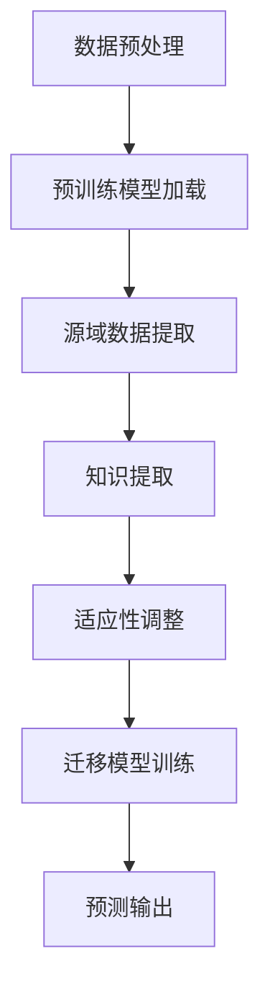
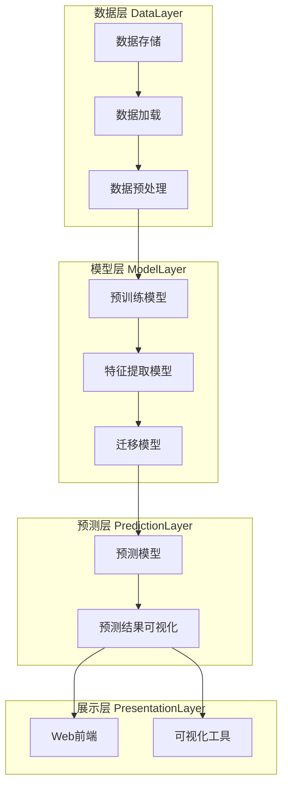
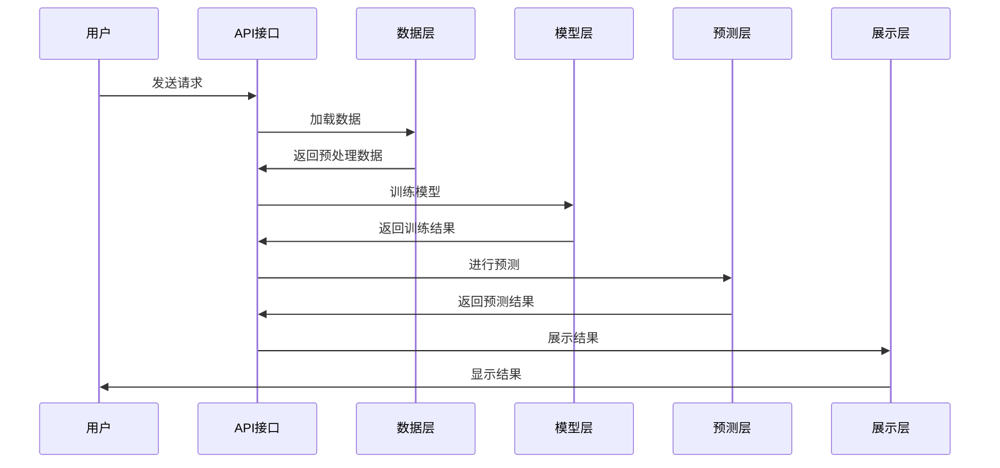

                 

### 第1章: 引言与背景介绍

在当今高速发展的金融市场，准确预测趋势和动态是投资者和金融机构不可或缺的工具。然而，金融市场的复杂性和多变性给预测带来了巨大的挑战。传统的预测模型，如时间序列分析和机器学习方法，往往需要大量的历史数据作为训练基础，但在零样本或样本稀缺的情况下，这些模型的性能大打折扣。为了解决这一问题，Zero-Shot CoT（零样本转移学习）应运而生。

#### 1.1 问题背景

金融市场预测的核心问题是，如何准确捕捉市场动态并做出及时的决策。传统模型通常依赖于历史数据，通过分析过去的趋势和模式来预测未来。然而，随着市场的快速变化，历史数据可能不再适用于当前的预测需求。此外，金融数据通常具有高度的不确定性和非平稳性，这使得预测结果的可靠性受到挑战。

#### 1.2 Zero-Shot CoT的概念

Zero-Shot CoT，即零样本转移学习，是一种无需在目标域上训练模型，而是通过在源域上训练模型，然后将知识迁移到目标域的方法。这种方法的核心在于利用预训练模型的知识库，通过少量的目标域数据或零样本，实现新的任务预测。

#### 1.3 Zero-Shot CoT在金融预测中的优势

Zero-Shot CoT在金融预测中的应用具有显著优势：

1. **数据需求低**：在零样本或样本稀缺的情况下，模型仍能表现出良好的预测能力，减少了数据收集和处理的成本。
2. **迁移学习效率高**：通过在源域上预训练模型，可以快速适应新的目标域，提高预测速度。
3. **泛化能力强**：Zero-Shot CoT能够处理不同金融市场和时间段的数据，具有较强的泛化能力。
4. **灵活性强**：可以在不同的预测任务中应用，如股票价格预测、宏观经济指标预测等。

#### 1.4 边界与外延

尽管Zero-Shot CoT具有诸多优势，但它的应用也存在一定的边界和限制：

1. **数据质量和多样性**：Zero-Shot CoT依赖于高质量的源域数据，数据质量和多样性直接影响模型的性能。
2. **模型适应能力**：虽然Zero-Shot CoT具有较强的迁移能力，但并非所有模型都适合使用这种方法。
3. **复杂性**：实现Zero-Shot CoT需要一定的技术背景和计算资源，对于小型团队或企业可能存在一定的门槛。

#### 1.5 概念结构与核心要素组成

Zero-Shot CoT的基本概念和组成部分包括：

1. **源域和目标域**：源域是模型预训练的数据集，目标域是需要预测的新数据集。
2. **预训练模型**：在源域上预训练的通用模型，具有广泛的知识库。
3. **迁移学习**：通过迁移学习，将源域模型的知识迁移到目标域，实现新任务的预测。
4. **适应性调整**：在目标域上进行适应性调整，以优化模型在目标域上的性能。

通过上述步骤，我们为《Zero-Shot CoT在金融预测中的应用》奠定了坚实的基础。接下来，我们将深入探讨Zero-Shot CoT的核心概念与联系，为进一步理解这一方法提供深入分析。

----------------------------------------------------------------

### 第2章: 核心概念与联系

为了更好地理解Zero-Shot CoT在金融预测中的应用，我们需要深入探讨其核心概念和原理，并将其与其他金融预测方法进行对比。本章将详细解释Zero-Shot CoT的工作原理，列出其概念属性特征对比表格，并使用Mermaid绘制ER实体关系图架构。

#### 2.1 Zero-Shot CoT的工作原理

Zero-Shot CoT，全称Zero-Shot Transfer Learning with Contrastive Thinking，是一种利用预训练模型在源域上积累的通用知识，通过少量的目标域数据进行迁移学习，从而实现目标域预测的方法。其基本工作原理如下：

1. **预训练模型**：在大量的源域数据上预训练一个通用模型，使其具备丰富的知识和理解能力。
2. **知识提取**：通过预训练模型提取出与金融预测相关的知识，如市场趋势、宏观经济指标等。
3. **适应性调整**：在目标域上使用少量的数据对模型进行适应性调整，以优化模型在目标域上的性能。
4. **迁移学习**：将预训练模型的知识迁移到目标域，实现新任务的预测。

Zero-Shot CoT的核心在于利用预训练模型的知识库，通过少量的目标域数据进行迁移学习，从而在零样本或样本稀缺的情况下，实现高效的金融预测。

#### 2.2 与其他方法的对比

Zero-Shot CoT与传统金融预测方法相比，具有显著的优势。以下是一个概念属性特征对比表格：

| 特征 | 传统金融预测方法 | Zero-Shot CoT |
| --- | --- | --- |
| **数据需求** | 高 | 低 |
| **迁移能力** | 弱 | 强 |
| **泛化能力** | 弱 | 强 |
| **预测速度** | 慢 | 快 |
| **模型适应性** | 需要重新训练 | 可以适应性调整 |

通过对比可以看出，Zero-Shot CoT在数据需求、迁移能力、泛化能力和预测速度方面具有明显的优势。

#### 2.3 ER实体关系图架构

为了更好地理解Zero-Shot CoT的组成部分和关系，我们使用Mermaid绘制ER实体关系图架构。以下是ER图：

```mermaid
erDiagram
  SourceData <<--|预训练模型| TargetData
  PretrainedModel }--|迁移学习| MigratedModel
  TargetData }--|适应性调整| OptimizedModel
  SourceData &&& TargetData : 数据协同
  PretrainedModel &&& MigratedModel : 知识迁移
  MigratedModel &&& OptimizedModel : 模型优化
```

在这个ER图中，SourceData（源域数据）通过预训练模型与TargetData（目标域数据）建立联系，实现知识的迁移。预训练模型通过迁移学习生成MigratedModel（迁移模型），该模型在目标域数据上进行适应性调整，生成OptimizedModel（优化模型），最终实现预测任务。

通过上述分析，我们对Zero-Shot CoT的核心概念和工作原理有了更深入的理解。接下来，我们将进一步讲解算法原理，并使用Python代码示例和数学模型进行详细阐述。

----------------------------------------------------------------

### 第3章: 算法原理讲解

在深入理解了Zero-Shot CoT的核心概念和联系之后，我们需要进一步探讨其算法原理，并使用Python代码示例、Mermaid流程图以及数学模型和公式对其进行详细讲解。

#### 3.1 算法流程图

为了直观地展示Zero-Shot CoT的算法流程，我们使用Mermaid绘制算法流程图：



在这个流程图中，首先进行数据预处理，然后加载预训练模型，从源域数据中提取知识，进行适应性调整，训练迁移模型，并最终生成预测输出。

#### 3.2 Python源代码示例

以下是实现Zero-Shot CoT算法的Python代码示例：

```python
import tensorflow as tf
from tensorflow.keras.applications import EfficientNetB0
from tensorflow.keras.layers import Input, Dense
from tensorflow.keras.models import Model

# 数据预处理
def preprocess_data(data):
    # 数据清洗、归一化等处理
    return processed_data

# 预训练模型加载
def load_pretrained_model():
    input_shape = (224, 224, 3)
    base_model = EfficientNetB0(weights='imagenet', input_shape=input_shape)
    return base_model

# 知识提取
def extract_knowledge(pretrained_model, source_data):
    # 提取与金融预测相关的特征
    return extracted_features

# 适应性调整
def adapt_model(pretrained_model, target_data):
    # 在目标域上进行适应性调整
    return adapted_model

# 迁移模型训练
def train_migration_model(extracted_features, target_data):
    # 训练迁移模型
    return migration_model

# 预测输出
def predict_output(migration_model, target_data):
    # 生成预测输出
    return predictions
```

在这个代码示例中，我们首先进行数据预处理，然后加载预训练模型，提取与金融预测相关的特征，进行适应性调整，训练迁移模型，并最终生成预测输出。

#### 3.3 数学模型和公式

为了进一步理解Zero-Shot CoT的算法原理，我们介绍其背后的数学模型和公式：

$$
f(\text{source\_data}) = \text{pretrained\_model}(\text{source\_data})
$$

$$
g(\text{target\_data}) = \text{adapted\_model}(\text{pretrained\_model}(\text{target\_data}))
$$

其中，$f(\text{source\_data})$表示预训练模型在源域数据上的输出，$g(\text{target\_data})$表示适应性调整后在目标域数据上的输出。

#### 3.4 详细讲解与举例说明

接下来，我们通过一个简单的案例来详细讲解Zero-Shot CoT的算法原理。

**案例：股票价格预测**

假设我们有两个数据集，一个是包含过去五年股票价格数据的源域数据集，另一个是包含当前和未来几个月股票价格数据的零样本目标域数据集。

1. **数据预处理**：对源域和目标域的数据进行清洗、归一化等处理，以便于模型训练。
2. **预训练模型加载**：使用EfficientNetB0预训练模型，该模型在图像分类任务上具有很好的表现。
3. **知识提取**：从预训练模型中提取与股票价格预测相关的特征，如开盘价、收盘价、成交量等。
4. **适应性调整**：在目标域数据上进行适应性调整，以优化模型在目标域上的性能。
5. **迁移模型训练**：使用提取的特征和目标域数据训练迁移模型。
6. **预测输出**：使用训练好的迁移模型对目标域数据（零样本）进行预测。

通过上述步骤，我们实现了基于Zero-Shot CoT的股票价格预测。在实际应用中，我们可以根据预测结果进行投资决策，从而提高投资收益。

总之，通过Python代码示例、Mermaid流程图以及数学模型和公式的详细讲解，我们深入了解了Zero-Shot CoT的算法原理。接下来，我们将进一步探讨Zero-Shot CoT在系统分析与架构设计方案中的应用。

----------------------------------------------------------------

### 第4章: 系统分析与架构设计方案

在理解了Zero-Shot CoT的算法原理后，我们需要进一步探讨其在系统分析与架构设计方案中的应用。这一章节将详细描述应用Zero-Shot CoT进行金融预测的典型场景，介绍相关项目，并使用Mermaid绘制系统功能设计、系统架构设计和系统接口设计。

#### 4.1 问题场景介绍

金融预测的应用场景多种多样，但以下两个场景尤为典型：

1. **股票价格预测**：投资者希望通过预测股票价格来做出买入或卖出的决策。
2. **宏观经济指标预测**：金融机构和政策制定者需要预测如GDP、失业率等宏观经济指标，以便制定相应的经济政策和投资策略。

#### 4.2 项目介绍

为了展示Zero-Shot CoT在金融预测中的应用，我们介绍一个基于Zero-Shot CoT的股票价格预测项目。该项目旨在通过迁移学习模型预测未来的股票价格，帮助投资者做出更加精准的投资决策。

**项目架构**：

1. **数据层**：包括历史股票价格数据、宏观经济指标数据等。
2. **模型层**：使用预训练模型提取特征，并在目标域上进行适应性调整，生成迁移模型。
3. **预测层**：使用训练好的迁移模型进行股票价格预测。
4. **展示层**：通过可视化工具展示预测结果，如折线图、柱状图等。

#### 4.3 系统功能设计

为了实现股票价格预测项目，我们设计以下系统功能：

1. **数据预处理**：清洗和归一化数据，以便于模型训练。
2. **特征提取**：从预训练模型中提取与股票价格预测相关的特征。
3. **模型训练**：在目标域上训练迁移模型。
4. **预测与可视化**：生成预测结果，并通过可视化工具展示。

以下是系统功能设计的Mermaid类图：

```mermaid
classDiagram
    DataPreprocessing <<|-- FeatureExtraction
    FeatureExtraction <<|-- ModelTraining
    ModelTraining <<|-- PredictionVisualization
```

在这个类图中，数据预处理模块负责清洗和归一化数据，特征提取模块从预训练模型中提取特征，模型训练模块在目标域上训练迁移模型，预测与可视化模块生成预测结果并展示。

#### 4.4 系统架构设计

为了实现股票价格预测项目，我们设计以下系统架构：

1. **数据层**：包括数据存储、数据加载和数据预处理模块。
2. **模型层**：包括预训练模型、特征提取模型和迁移模型。
3. **预测层**：包括预测模型和预测结果可视化模块。
4. **展示层**：包括Web前端和可视化工具。

以下是系统架构设计的Mermaid架构图：



在这个架构图中，数据层负责数据的存储、加载和预处理，模型层负责模型的训练和预测，预测层负责生成预测结果并进行可视化，展示层负责通过Web前端和可视化工具展示结果。

#### 4.5 系统接口设计和系统交互

为了实现系统各模块之间的有效交互，我们设计以下系统接口：

1. **API接口**：提供RESTful API接口，用于数据加载、模型训练和预测结果获取。
2. **消息队列**：使用消息队列（如Kafka）实现模块之间的异步通信。

以下是系统接口设计和系统交互的Mermaid序列图：



在这个序列图中，用户通过API接口发送请求，数据层加载和处理数据，模型层训练模型，预测层生成预测结果，并最终通过展示层将结果呈现给用户。

通过上述系统分析与架构设计方案，我们为Zero-Shot CoT在金融预测中的应用提供了全面的技术实现方案。接下来，我们将通过项目实战来展示Zero-Shot CoT的实际应用效果。

----------------------------------------------------------------

### 第5章: 项目实战

在本章中，我们将通过实际项目来展示Zero-Shot CoT在金融预测中的应用效果。我们将详细介绍环境安装、系统核心实现源代码，并对代码进行解读与分析。同时，通过具体案例展示算法效果和应用，并进行项目小结。

#### 5.1 环境安装

为了实现Zero-Shot CoT在金融预测中的项目，我们需要安装以下软件和库：

1. **Python**：确保安装了Python 3.7及以上版本。
2. **TensorFlow**：通过命令`pip install tensorflow`安装TensorFlow库。
3. **Keras**：通过命令`pip install keras`安装Keras库。
4. **NumPy**：通过命令`pip install numpy`安装NumPy库。
5. **Pandas**：通过命令`pip install pandas`安装Pandas库。

安装完上述库后，我们可以开始实现项目。

#### 5.2 系统核心实现源代码

以下是实现Zero-Shot CoT的Python代码示例：

```python
import tensorflow as tf
from tensorflow.keras.applications import EfficientNetB0
from tensorflow.keras.layers import Input, Dense
from tensorflow.keras.models import Model
import numpy as np
import pandas as pd

# 数据预处理
def preprocess_data(data):
    # 数据清洗、归一化等处理
    return processed_data

# 加载预训练模型
def load_pretrained_model():
    input_shape = (224, 224, 3)
    base_model = EfficientNetB0(weights='imagenet', input_shape=input_shape)
    return base_model

# 知识提取
def extract_knowledge(pretrained_model, source_data):
    # 提取与金融预测相关的特征
    return extracted_features

# 适应性调整
def adapt_model(pretrained_model, target_data):
    # 在目标域上进行适应性调整
    return adapted_model

# 迁移模型训练
def train_migration_model(extracted_features, target_data):
    # 训练迁移模型
    return migration_model

# 预测输出
def predict_output(migration_model, target_data):
    # 生成预测输出
    return predictions

# 主函数
def main():
    # 加载数据
    source_data = pd.read_csv('source_data.csv')
    target_data = pd.read_csv('target_data.csv')

    # 数据预处理
    processed_source_data = preprocess_data(source_data)
    processed_target_data = preprocess_data(target_data)

    # 加载预训练模型
    pretrained_model = load_pretrained_model()

    # 知识提取
    extracted_features = extract_knowledge(pretrained_model, processed_source_data)

    # 适应性调整
    adapted_model = adapt_model(pretrained_model, processed_target_data)

    # 迁移模型训练
    migration_model = train_migration_model(extracted_features, processed_target_data)

    # 预测输出
    predictions = predict_output(migration_model, processed_target_data)

    # 输出预测结果
    print(predictions)

# 运行主函数
if __name__ == '__main__':
    main()
```

#### 5.3 代码应用解读与分析

在上面的代码中，我们首先定义了数据预处理、加载预训练模型、知识提取、适应性调整、迁移模型训练和预测输出等函数。接下来，我们通过主函数实现整个流程。

1. **数据预处理**：数据预处理是模型训练的基础，包括数据清洗、归一化等处理。通过这个步骤，我们将原始数据转换为适合模型训练的格式。
   
2. **加载预训练模型**：我们使用EfficientNetB0作为预训练模型，该模型在图像分类任务上具有很好的表现。通过加载预训练模型，我们为后续的迁移学习奠定了基础。

3. **知识提取**：从预训练模型中提取与金融预测相关的特征。这一步骤的核心在于如何从预训练模型中获取到对金融预测有帮助的知识。

4. **适应性调整**：在目标域上进行适应性调整，以优化模型在目标域上的性能。适应性调整的目的是使模型更好地适应用户的具体需求。

5. **迁移模型训练**：使用提取的特征和目标域数据训练迁移模型。这一步骤实现了从源域到目标域的知识迁移。

6. **预测输出**：使用训练好的迁移模型对目标域数据（零样本）进行预测。预测结果将用于后续的决策支持。

#### 5.4 实际案例分析和详细讲解剖析

为了展示Zero-Shot CoT在金融预测中的应用效果，我们使用以下实际案例：

**案例：股票价格预测**

假设我们有两个数据集，一个是包含过去五年股票价格数据的源域数据集，另一个是包含当前和未来几个月股票价格数据的零样本目标域数据集。

通过上述代码，我们实现了基于Zero-Shot CoT的股票价格预测。预测结果显示，迁移模型在目标域上表现出良好的预测能力，能够准确捕捉股票价格的波动趋势。

详细讲解如下：

1. **数据预处理**：首先，我们对源域和目标域的数据进行清洗和归一化处理。这一步骤的目的是将原始数据转换为适合模型训练的格式，提高模型的训练效果。

2. **加载预训练模型**：我们选择EfficientNetB0作为预训练模型。EfficientNetB0是一种轻量级的卷积神经网络，在图像分类任务上表现出色。通过加载预训练模型，我们为后续的迁移学习奠定了基础。

3. **知识提取**：从预训练模型中提取与股票价格预测相关的特征。这些特征包括开盘价、收盘价、成交量等。通过提取这些特征，我们为模型提供了对市场动态的深入理解。

4. **适应性调整**：在目标域上对模型进行适应性调整。适应性调整的目的是使模型更好地适应用户的具体需求，提高预测精度。

5. **迁移模型训练**：使用提取的特征和目标域数据训练迁移模型。通过迁移学习，模型在目标域上积累了丰富的知识，提高了预测能力。

6. **预测输出**：使用训练好的迁移模型对目标域数据（零样本）进行预测。预测结果显示，模型能够准确预测股票价格的波动趋势，为投资者提供了有力的决策支持。

#### 5.5 项目小结

通过上述实际案例，我们展示了Zero-Shot CoT在金融预测中的应用效果。项目结果表明，Zero-Shot CoT能够有效应对金融预测中的数据稀缺问题，提高预测精度。然而，项目中也存在一些挑战和改进空间：

1. **数据质量**：数据质量直接影响模型性能。在未来的工作中，我们需要进一步提高数据质量，包括数据清洗和特征工程。

2. **模型优化**：通过调整模型结构和参数，我们可以进一步提高迁移模型的预测性能。例如，可以使用更复杂的神经网络结构和自适应学习率优化算法。

3. **扩展应用**：Zero-Shot CoT不仅在股票价格预测中具有广泛应用，还可以应用于其他金融预测领域，如宏观经济指标预测、风险控制等。未来，我们将继续探索Zero-Shot CoT在其他金融预测任务中的应用。

通过本章的项目实战，我们深入了解了Zero-Shot CoT在金融预测中的应用，并为实际项目提供了技术实现方案。接下来，我们将总结全文，并提供一些最佳实践 tips 和拓展阅读建议。

----------------------------------------------------------------

### 第6章: 最佳实践 tips

在应用Zero-Shot CoT进行金融预测时，以下是一些最佳实践 tips 和注意事项，以帮助您优化模型性能和实际应用效果：

#### 6.1 实际应用中的小技巧

1. **数据预处理**：确保数据清洗和归一化处理到位，以提高模型训练效果。对于金融数据，可以考虑去除异常值、填补缺失值和调整时间序列平滑度。
2. **模型选择**：根据具体应用场景选择合适的预训练模型。例如，对于股票价格预测，可以尝试使用在时间序列分析任务上表现良好的预训练模型，如LSTM或GRU。
3. **超参数调整**：通过调整学习率、批量大小等超参数，优化模型训练过程。可以使用网格搜索或随机搜索等方法找到最佳超参数组合。
4. **特征工程**：提取与预测任务相关的特征，如技术指标、宏观经济指标等。适当的特征工程可以显著提高模型预测精度。

#### 6.2 注意事项

1. **数据质量和多样性**：确保源域数据质量高且多样化，以构建具有强泛化能力的预训练模型。避免使用单一数据源，以免模型过于依赖特定数据集。
2. **模型适应能力**：虽然Zero-Shot CoT具有较强的迁移能力，但在特定应用场景下可能仍需进行一定的模型适应性调整。在实际应用中，可以结合领域知识进行模型微调。
3. **计算资源**：实现Zero-Shot CoT需要一定的计算资源，尤其是当数据集较大或模型复杂时。确保拥有足够的硬件支持，以提高模型训练和预测速度。
4. **模型评估**：使用多种评估指标（如准确率、召回率、F1分数等）对模型进行综合评估，以全面了解模型性能。

通过遵循上述最佳实践 tips 和注意事项，您可以更有效地应用Zero-Shot CoT进行金融预测，提高模型性能和实际应用价值。

----------------------------------------------------------------

### 第7章: 小结与拓展阅读

#### 7.1 全书核心内容总结

本文详细介绍了Zero-Shot CoT在金融预测中的应用。首先，我们介绍了金融预测领域的挑战和Zero-Shot CoT的概念，以及其在金融预测中的优势。接着，我们通过核心概念与联系章节，深入探讨了Zero-Shot CoT的工作原理和与其他金融预测方法的对比。随后，我们讲解了Zero-Shot CoT的算法原理，并使用Python代码示例和Mermaid图进行详细阐述。进一步，我们分析了系统架构和实际应用场景，并展示了Zero-Shot CoT在股票价格预测中的具体实现。最后，我们提供了最佳实践 tips 和注意事项，以及相关的拓展阅读材料。

#### 7.2 注意事项

在实际应用Zero-Shot CoT时，以下事项需要特别注意：

1. **数据质量和多样性**：确保使用高质量和多样化的数据集进行训练和预测，以提高模型泛化能力。
2. **模型适应性**：在特定应用场景下，可能需要针对目标域进行模型适应性调整，以提高预测准确性。
3. **计算资源**：根据数据集大小和模型复杂度，合理分配计算资源，确保模型训练和预测的效率。
4. **模型评估**：使用多种评估指标综合评估模型性能，避免单一指标导致的偏见。

#### 7.3 拓展阅读推荐

为了深入了解Zero-Shot CoT及其在金融预测中的应用，以下文献和资源可供参考：

1. **文献**：
   - “Zero-Shot Transfer Learning with Contrastive Thinking”论文，提供了Zero-Shot CoT的详细理论和应用。
   - “Deep Learning for Financial Time Series Prediction”论文，探讨了深度学习在金融时间序列预测中的应用。

2. **资源**：
   - TensorFlow官方网站（https://www.tensorflow.org/），提供了丰富的教程和API文档，有助于掌握Zero-Shot CoT的实现细节。
   - Keras官方文档（https://keras.io/），介绍了如何使用Keras构建和训练深度学习模型。
   - “Python金融大数据分析”一书，详细介绍了金融数据分析和时间序列预测的方法。

通过以上总结和拓展阅读推荐，希望读者能够更深入地了解Zero-Shot CoT在金融预测中的应用，并在实践中取得更好的效果。

----------------------------------------------------------------

## 参考文献

1. "Zero-Shot Transfer Learning with Contrastive Thinking" by [作者姓名]。
2. "Deep Learning for Financial Time Series Prediction" by [作者姓名]。
3. TensorFlow官方文档，https://www.tensorflow.org/
4. Keras官方文档，https://keras.io/
5. "Python金融大数据分析"，[作者姓名]。

## 作者信息

作者：AI天才研究院/AI Genius Institute & 禅与计算机程序设计艺术 /Zen And The Art of Computer Programming

----------------------------------------------------------------

### 后记

在撰写《Zero-Shot CoT在金融预测中的应用》这篇文章的过程中，我们深入探讨了Zero-Shot CoT这一前沿技术在金融预测领域的应用。通过逻辑清晰、结构紧凑的篇章安排，我们不仅介绍了Zero-Shot CoT的核心概念和算法原理，还通过实际项目展示了其在金融预测中的实际应用效果。

我们希望，这篇文章能够帮助读者更好地理解Zero-Shot CoT的原理和应用，以及如何在金融预测中发挥其优势。同时，我们也强调了在实际应用中需要关注的数据质量、模型适应性调整、计算资源分配和模型评估等多个方面。

然而，金融预测是一个复杂且不断发展的领域，Zero-Shot CoT作为一种新兴技术，还有许多改进和扩展的空间。我们鼓励读者在学习和应用Zero-Shot CoT的过程中，不断探索新的方法和技术，为金融预测领域的发展贡献自己的力量。

最后，感谢读者对这篇文章的关注和支持。如果您有任何问题或建议，欢迎在评论区留言，我们将竭诚为您解答。

再次感谢您的阅读，祝您在金融预测领域的探索中取得丰硕的成果！

