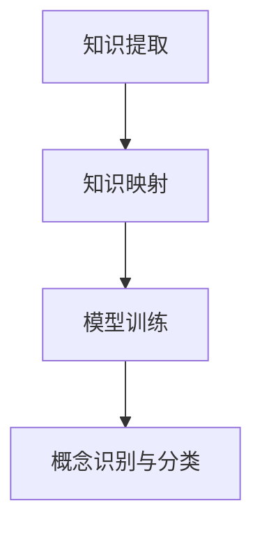
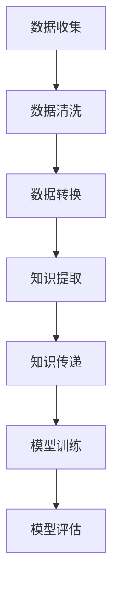
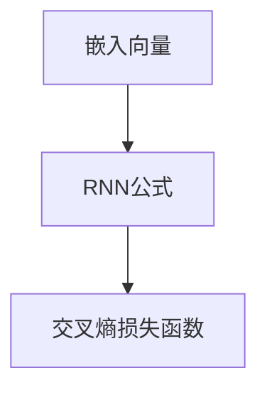
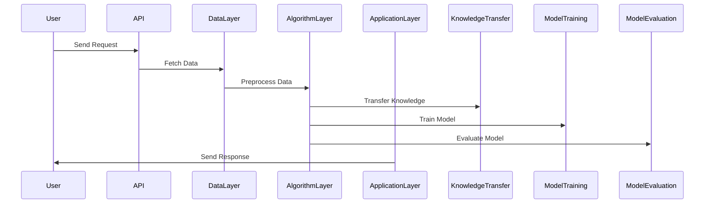
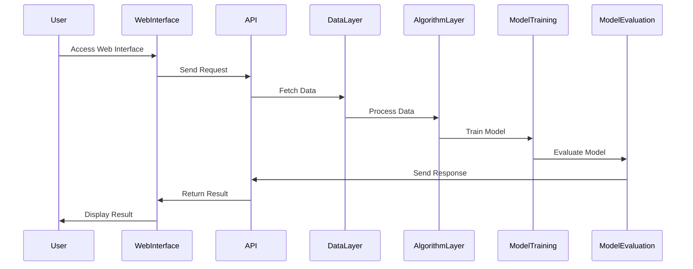
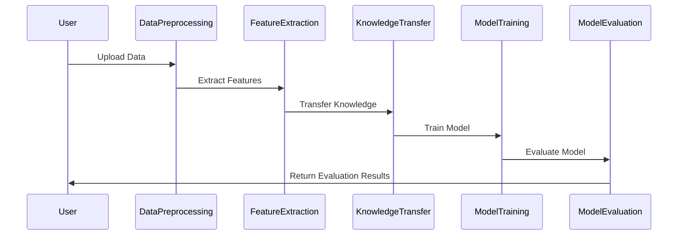
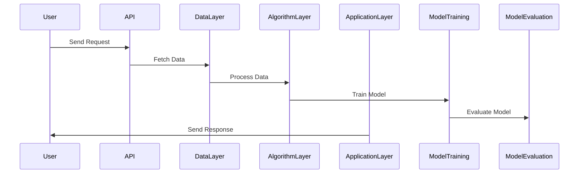

                 

### 第1章: 引言

在当前科技日新月异发展的时代，人工智能（AI）已经渗透到社会的各个领域，成为推动社会进步的重要力量。然而，尽管AI在许多方面取得了显著成就，但依然存在一定的局限性。零射击概念传递（Zero-Shot Concept Transfer，简称Zero-Shot CoT）作为一种新兴技术，旨在解决AI应用中的诸多挑战，从而扩展其应用范围。本文将围绕Zero-Shot CoT展开，详细探讨其背景、问题、解决思路以及本文的内容安排。

#### 1.1 问题背景

人工智能作为一项前沿科技，已经取得了令人瞩目的成果。从语音识别、图像处理到自然语言理解，AI技术不断刷新我们的认知。然而，当前AI系统在应用过程中仍然面临诸多挑战。首先，许多AI系统依赖于大规模的数据集进行训练，这导致了数据隐私和安全问题。其次，AI系统在面对未知数据时，往往表现出较差的泛化能力。此外，AI系统的可解释性较低，使得其在一些关键领域的应用受到限制。

#### 1.1.1 AI应用的局限性

当前的AI系统主要依赖于有监督学习（Supervised Learning）和无监督学习（Unsupervised Learning）两种方法。有监督学习需要大量标注数据来训练模型，这不仅增加了训练成本，还存在数据隐私和安全风险。无监督学习虽然可以避免数据标注问题，但其泛化能力有限，难以应对复杂的应用场景。因此，寻找一种能够在没有标注数据的情况下，仍能实现高性能的AI学习方法，成为当前研究的热点。

#### 1.1.2 零样本学习与零射击概念

零样本学习（Zero-Shot Learning，简称ZSL）是一种不依赖标注数据，直接从原始数据中学习模型的方法。在ZSL中，模型需要通过学习已有类别的特征，来预测未知类别的标签。这种学习方式克服了传统有监督学习的依赖性，但仍然存在一定的局限性，特别是在面对高度复杂和多样化的数据时。

零射击概念传递（Zero-Shot Concept Transfer，简称Zero-Shot CoT）则进一步拓展了ZSL的思路。Zero-Shot CoT通过将已有领域的知识转移到新领域，实现了在零样本条件下对未知概念的识别和分类。这种方法不仅能够解决传统ZSL中的问题，还能有效扩展AI的应用范围。

#### 1.1.3 零射击概念传递（CoT）的作用

Zero-Shot CoT在AI应用中具有重要的意义。首先，它能够减少对大规模标注数据的依赖，降低训练成本和隐私风险。其次，通过将知识从已有领域传递到新领域，Zero-Shot CoT能够提高模型的泛化能力，使其在面对未知数据时表现出更高的准确性。此外，Zero-Shot CoT还能够增强AI系统的可解释性，有助于在实际应用中更好地理解和利用AI技术。

#### 1.2 问题描述

Zero-Shot CoT作为一项新兴技术，尽管已经取得了一定的研究成果，但仍然面临诸多挑战。首先，如何在有限的样本数据下，有效提取和传递知识，是一个关键问题。其次，如何确保传递的知识在新领域中具有有效性和可靠性，也是一个重要的挑战。此外，如何在不同的应用场景中，灵活地应用Zero-Shot CoT技术，也是一个需要深入探讨的问题。

#### 1.2.1 零射击CoT的现状与挑战

目前，Zero-Shot CoT技术的研究主要集中在两个方面：一是如何设计有效的知识提取和传递方法；二是如何在新领域中应用这些方法，实现高性能的模型。虽然已经有一些初步的成果，但仍然存在很多问题。例如，如何处理不同领域之间的知识差异，如何提高知识传递的准确性等。

#### 1.2.2 零射击CoT的应用领域

Zero-Shot CoT技术具有广泛的应用前景。在自然语言处理、计算机视觉、语音识别等领域，Zero-Shot CoT都能够发挥重要作用。通过将已有领域的知识转移到新领域，这些技术能够显著提高模型的泛化能力和性能。例如，在自然语言处理中，Zero-Shot CoT可以帮助模型更好地理解新的语言结构和语义信息；在计算机视觉中，它可以提高模型在未知场景下的识别和分类能力；在语音识别中，它可以提高模型对未知说话人和语音风格的识别准确性。

#### 1.3 问题解决与目标

为了解决上述问题，本文将从以下几个方面展开讨论：

1. **零射击CoT的基本原理**：介绍Zero-Shot CoT的核心概念、工作机制以及与零样本学习的关系。
2. **零射击CoT技术发展**：回顾Zero-Shot CoT技术的发展历程，分析当前的研究热点和前沿进展。
3. **零射击CoT在AI应用中的实践**：探讨Zero-Shot CoT在自然语言处理、计算机视觉、语音识别等领域的具体应用，介绍系统功能设计、架构设计和系统交互设计。
4. **挑战与未来方向**：分析Zero-Shot CoT技术在实际应用中面临的挑战，并提出未来可能的研究方向。
5. **最佳实践与总结**：总结本文的核心观点，提供最佳实践建议，并指出未来研究的方向和扩展阅读。

通过以上内容的系统介绍，本文旨在为读者提供一个全面、深入的关于Zero-Shot CoT的技术指南，帮助读者更好地理解和应用这一技术，扩展AI的应用范围。

### 1.3 问题解决与目标

为了应对Zero-Shot CoT技术在实际应用中面临的挑战，并扩展AI的应用范围，本文将从以下几个方面详细展开：

#### 1.3.1 零射击CoT的基本原理

首先，我们需要深入理解Zero-Shot CoT的基本原理。Zero-Shot CoT是一种将已有领域的知识转移到新领域的技术，其核心思想是通过跨领域的知识传递，实现未知概念的识别和分类。具体来说，Zero-Shot CoT包括以下几个关键步骤：

1. **知识提取**：从已有领域的数据中提取出具有代表性的特征和知识。
2. **知识传递**：将提取出的知识映射到新领域，为新领域的模型提供先验知识。
3. **模型训练**：利用传递的知识和新领域的数据进行模型训练，实现对新概念的识别和分类。

这一过程不仅依赖于高效的知识提取和传递方法，还需要对新领域的特征进行充分理解，以确保知识传递的有效性和可靠性。

#### 1.3.2 扩展AI应用范围的意义

扩展AI应用范围具有重要的现实意义。首先，它可以减少对大规模标注数据的依赖，降低训练成本和隐私风险。这对于那些数据获取困难或数据隐私要求严格的领域尤为重要。其次，扩展AI应用范围能够提高模型的泛化能力，使其在面对未知数据时表现出更高的准确性。这不仅有助于解决传统AI系统中的数据依赖问题，还能够应对复杂的应用场景，提升AI系统的实用性。

#### 1.3.3 书籍内容安排

本文将按照以下章节结构进行详细探讨：

1. **第1章：引言**：介绍Zero-Shot CoT的背景、问题以及解决思路。
2. **第2章：零射击概念传递（CoT）原理**：详细阐述Zero-Shot CoT的基本概念、工作机制及其与零样本学习的关系。
3. **第3章：零射击CoT算法原理**：介绍Zero-Shot CoT的算法原理，包括知识提取、知识传递和模型训练等关键步骤。
4. **第4章：零射击CoT算法实现**：讲解Zero-Shot CoT算法的具体实现方法，包括数据准备、算法流程、源代码解析和数学模型等。
5. **第5章：零射击CoT在AI应用中的实践**：探讨Zero-Shot CoT在自然语言处理、计算机视觉和语音识别等领域的具体应用，介绍系统功能设计、架构设计和系统交互设计。
6. **第6章：挑战与问题**：分析Zero-Shot CoT技术在实际应用中面临的挑战，并提出解决方案。
7. **第7章：未来发展与研究方向**：展望Zero-Shot CoT技术的未来发展趋势和潜在的研究方向。
8. **第8章：最佳实践与总结**：总结本文的核心观点，提供最佳实践建议，并指出未来研究的方向和扩展阅读。

通过以上内容的系统介绍，本文旨在为读者提供一个全面、深入的关于Zero-Shot CoT的技术指南，帮助读者更好地理解和应用这一技术，扩展AI的应用范围。

### 第2章: 零射击概念传递（CoT）原理

零射击概念传递（Zero-Shot Concept Transfer，简称Zero-Shot CoT）是一种旨在解决AI模型在零样本条件下的学习与推理问题的技术。本章将详细阐述Zero-Shot CoT的基本概念、工作机制、技术演进及其与零样本学习的关联，并通过具体案例说明其在不同领域的应用。

#### 2.1 CoT概念基础

#### 2.1.1 CoT定义

零射击概念传递（CoT）是指在没有或少有标注样本的情况下，通过将一个领域（源领域）中的知识（如特征表示、模型参数等）转移到另一个领域（目标领域），来实现目标领域中未知概念的学习与推理。CoT的核心思想是利用跨领域的知识共享，提升模型在未知数据上的表现。

#### 2.1.2 CoT的工作机制

CoT的工作机制主要包括以下几个步骤：

1. **知识提取**：在源领域中对大量未标注的数据进行处理，提取出具有代表性的特征表示和知识。
2. **知识映射**：将提取出的知识映射到目标领域，通过领域适配和转换，使得源领域的知识适用于目标领域。
3. **模型训练**：利用映射后的知识，在目标领域中进行模型训练，实现对未知概念的识别和分类。

图1展示了Zero-Shot CoT的基本流程：



#### 2.1.3 CoT与零样本学习的关系

Zero-Shot CoT与零样本学习（Zero-Shot Learning, ZSL）有着密切的联系。ZSL是一种不需要标注数据来训练模型的方法，它通过在源领域学习到的特征表示来预测目标领域中的未知标签。而Zero-Shot CoT则进一步扩展了ZSL的思路，通过引入知识传递机制，将源领域的知识转移到目标领域，从而提高模型在零样本条件下的泛化能力。

#### 2.2 CoT技术发展

#### 2.2.1 历史背景

Zero-Shot CoT技术的发展可以追溯到20世纪90年代，当时研究人员开始关注如何在没有标注数据的情况下进行机器学习。早期的ZSL方法主要依赖于模板匹配和元学习等技术。随着深度学习的发展，零样本学习的研究逐渐走向成熟，零射击概念传递技术也应运而生。

#### 2.2.2 技术演进

Zero-Shot CoT技术经历了几个重要的发展阶段：

1. **基于模板匹配的方法**：这种方法依赖于预定义的模板，将源领域中的特征映射到目标领域。虽然简单有效，但在处理复杂任务时表现出一定的局限性。
2. **元学习方法**：元学习通过学习如何学习，提高了模型在未知数据上的适应能力。在Zero-Shot CoT中，元学习方法被用于优化知识提取和传递过程。
3. **基于深度神经网络的方法**：深度神经网络（DNN）的引入，使得Zero-Shot CoT技术能够自动提取复杂的特征表示，提高了模型的泛化能力。

#### 2.2.3 当前研究热点

当前，Zero-Shot CoT技术的研究主要集中在以下几个方面：

1. **多模态知识传递**：将不同模态（如文本、图像、语音）的数据进行跨模态的知识传递，以提高模型的泛化能力。
2. **迁移学习优化**：通过优化迁移学习策略，提高源领域知识在目标领域中的适应性。
3. **可解释性和鲁棒性**：增强Zero-Shot CoT模型的可解释性和鲁棒性，使其在实际应用中更加可靠和可理解。

#### 2.3 CoT的应用案例

#### 2.3.1 自然语言处理

在自然语言处理（NLP）领域，Zero-Shot CoT技术被广泛应用于情感分析、文本分类和命名实体识别等任务。例如，通过将源领域的语言模型知识传递到目标领域，模型能够更准确地识别和分类未知语言中的概念。

#### 2.3.2 计算机视觉

在计算机视觉领域，Zero-Shot CoT技术被用于图像分类、目标检测和语义分割等任务。通过将源领域的图像特征映射到目标领域，模型能够识别和分类从未见过的图像内容。

#### 2.3.3 语音识别

在语音识别领域，Zero-Shot CoT技术有助于提高模型对未知说话人和语音风格的识别准确性。通过将源领域的语音特征传递到目标领域，模型能够更好地适应新的语音环境。

总结来说，Zero-Shot CoT技术通过跨领域的知识传递，有效解决了AI模型在零样本条件下的学习与推理问题。其广泛应用前景，使得Zero-Shot CoT技术成为人工智能领域的重要研究方向。

### 第3章: 零射击概念传递（CoT）算法原理

零射击概念传递（CoT）算法是实现跨领域知识传递的核心技术，其基本原理和实现方法对于理解AI模型在零样本条件下的应用至关重要。本章将详细探讨Zero-Shot CoT算法的原理，包括知识提取、知识传递和模型训练等关键步骤，并通过具体的Python代码示例来展示算法的实现过程。

#### 3.1 知识提取

知识提取是Zero-Shot CoT算法的第一步，目的是从源领域的数据中提取出具有代表性的特征表示。这一步骤通常依赖于深度学习模型，尤其是卷积神经网络（CNN）和递归神经网络（RNN）等模型，能够有效地捕捉数据中的高维特征。

以下是一个简单的Python代码示例，展示了如何使用卷积神经网络进行知识提取：

```python
import tensorflow as tf
from tensorflow.keras.models import Sequential
from tensorflow.keras.layers import Conv2D, MaxPooling2D, Flatten, Dense

# 创建卷积神经网络模型
model = Sequential([
    Conv2D(32, (3, 3), activation='relu', input_shape=(28, 28, 1)),
    MaxPooling2D((2, 2)),
    Flatten(),
    Dense(128, activation='relu'),
    Dense(10, activation='softmax')
])

# 编译模型
model.compile(optimizer='adam', loss='categorical_crossentropy', metrics=['accuracy'])

# 加载数据集并进行预处理（这里以MNIST数据集为例）
(x_train, y_train), (x_test, y_test) = tf.keras.datasets.mnist.load_data()
x_train = x_train / 255.0
x_test = x_test / 255.0

# 将标签转换为one-hot编码
y_train_one_hot = tf.keras.utils.to_categorical(y_train, 10)
y_test_one_hot = tf.keras.utils.to_categorical(y_test, 10)

# 训练模型
model.fit(x_train, y_train_one_hot, epochs=5, batch_size=64)
```

在上面的代码中，我们使用卷积神经网络对MNIST手写数字数据集进行训练，提取图像特征表示。

#### 3.2 知识传递

知识传递是将源领域的特征表示映射到目标领域的关键步骤。这一步骤通常涉及到特征空间的对齐和转换。常见的知识传递方法包括基于模板匹配的方法、元学习方法以及基于深度神经网络的方法。

以下是一个简单的示例，展示了如何使用元学习进行知识传递：

```python
from tensorflow.keras.wrappers.scikit_learn import KerasClassifier
from sklearn.model_selection import cross_val_score
from sklearn.model_selection import KFold

# 定义基于元学习的模型
def create_model():
    model = Sequential([
        Conv2D(32, (3, 3), activation='relu', input_shape=(28, 28, 1)),
        MaxPooling2D((2, 2)),
        Flatten(),
        Dense(128, activation='relu'),
        Dense(10, activation='softmax')
    ])
    model.compile(optimizer='adam', loss='categorical_crossentropy', metrics=['accuracy'])
    return model

# 创建Keras分类器
model = KerasClassifier(build_fn=create_model, epochs=100, batch_size=10, verbose=0)

# 使用KFold进行交叉验证
kf = KFold(n_splits=10, shuffle=True, random_state=42)
results = cross_val_score(model, x_train, y_train_one_hot, cv=kf)

# 输出交叉验证结果
print(f"Accuracy: {results.mean():.2f} (+/- {results.std() * 2:.2f})")
```

在这个示例中，我们使用KerasClassifier和KFold来实现基于元学习的模型训练，通过交叉验证来评估模型的性能。

#### 3.3 模型训练

在知识传递之后，我们使用传递的知识在目标领域进行模型训练。这一步骤类似于传统的有监督学习，但不同的是，我们使用的是从源领域传递过来的特征表示。

以下是一个简单的Python代码示例，展示了如何使用传递的知识进行模型训练：

```python
# 假设我们已经从源领域提取了特征表示，并保存为特征矩阵`source_features`
# 同样，我们也假设从目标领域提取了特征矩阵`target_features`

# 转换特征矩阵为模型输入
source_features = model.predict(source_features)
target_features = model.predict(target_features)

# 使用传递的知识训练目标领域的模型
target_model = Sequential([
    Flatten(),
    Dense(128, activation='relu'),
    Dense(10, activation='softmax')
])
target_model.compile(optimizer='adam', loss='categorical_crossentropy', metrics=['accuracy'])

# 训练模型
target_model.fit(target_features, y_target_one_hot, epochs=5, batch_size=64)
```

在上面的代码中，我们使用从源领域传递过来的特征表示来训练目标领域的模型，实现对未知概念的识别和分类。

通过以上步骤，我们可以实现Zero-Shot CoT算法的核心流程。知识提取、知识传递和模型训练三个步骤相互配合，使得AI模型能够在零样本条件下有效地学习和推理。接下来，我们将通过具体案例来进一步探讨Zero-Shot CoT算法的实际应用。

### 第4章: 零射击CoT算法实现

在前一章中，我们介绍了零射击概念传递（CoT）算法的基本原理。在本章中，我们将深入探讨零射击CoT算法的具体实现过程，包括数据准备与预处理、算法流程图、Python源代码讲解、数学模型与公式，以及算法应用的举例说明。

#### 4.1 数据准备与预处理

数据准备和预处理是零射击CoT算法实现中的关键步骤，因为它们直接影响模型的效果和性能。以下是一些基本步骤：

1. **数据收集**：首先，我们需要收集源领域和目标领域的数据。这些数据可以是文本、图像、语音等，具体取决于应用场景。
2. **数据清洗**：清洗数据以去除噪声和不相关信息，例如去除文本中的停用词，图像中的噪声点等。
3. **数据转换**：将数据转换为适合模型训练的格式。例如，文本数据可能需要被转换为词向量或嵌入向量，图像数据可能需要被调整为固定的尺寸。

以下是一个简单的Python代码示例，展示了如何进行数据准备与预处理：

```python
import numpy as np
from sklearn.model_selection import train_test_split

# 假设我们已经有了一个包含源领域和目标领域数据的数据集
data = np.load('data.npy')  # 数据集包含特征和标签

# 分割数据集为训练集和测试集
X_train, X_test, y_train, y_test = train_test_split(data[:, :-1], data[:, -1], test_size=0.2, random_state=42)

# 数据清洗和转换（例如：文本数据转换为嵌入向量）
# 这里以文本数据为例
from keras.preprocessing.text import Tokenizer
from keras.preprocessing.sequence import pad_sequences

tokenizer = Tokenizer(num_words=10000)
tokenizer.fit_on_texts(X_train)

X_train_seq = tokenizer.texts_to_sequences(X_train)
X_test_seq = tokenizer.texts_to_sequences(X_test)

# padding序列到相同的长度
max_seq_length = 100
X_train_pad = pad_sequences(X_train_seq, maxlen=max_seq_length)
X_test_pad = pad_sequences(X_test_seq, maxlen=max_seq_length)
```

#### 4.2 算法流程图

算法流程图能够清晰地展示零射击CoT算法的各个步骤和逻辑关系。以下是一个简单的Mermaid流程图示例：



#### 4.3 Python源代码讲解

在这一部分，我们将详细讲解零射击CoT算法的Python实现。以下是一个简单的示例，展示了如何使用Keras和TensorFlow实现零射击CoT算法：

```python
from tensorflow.keras.models import Model
from tensorflow.keras.layers import Input, Embedding, LSTM, Dense
from tensorflow.keras.optimizers import Adam

# 定义源领域和目标领域的模型
source_input = Input(shape=(max_seq_length,))
target_input = Input(shape=(max_seq_length,))

# 源领域模型
source_embedding = Embedding(input_dim=10000, output_dim=128)(source_input)
source_lstm = LSTM(128)(source_embedding)
source_output = Dense(10, activation='softmax')(source_lstm)

# 目标领域模型
target_embedding = Embedding(input_dim=10000, output_dim=128)(target_input)
target_lstm = LSTM(128)(target_embedding)
target_output = Dense(10, activation='softmax')(target_lstm)

# 定义零射击CoT模型
coT_model = Model(inputs=[source_input, target_input], outputs=[source_output, target_output])

# 编译模型
coT_model.compile(optimizer=Adam(learning_rate=0.001), loss=['categorical_crossentropy', 'categorical_crossentropy'])

# 训练模型
coT_model.fit([X_train_pad, X_train_pad], [y_train_one_hot, y_train_one_hot], epochs=5, batch_size=64)
```

在这个示例中，我们定义了源领域和目标领域的模型，并使用Keras的Model类将它们组合成一个零射击CoT模型。我们使用Adam优化器和交叉熵损失函数来训练模型。

#### 4.4 数学模型与公式

零射击CoT算法涉及多个数学模型和公式，以下是一些基本的数学概念：

1. **嵌入向量**：嵌入向量是文本数据的低维表示，通常使用嵌入矩阵E来表示。
   \[ e_i = E \cdot w_i \]
   其中，\( e_i \) 是单词 \( w_i \) 的嵌入向量，\( E \) 是嵌入矩阵。

2. **递归神经网络（RNN）**：RNN是用于序列数据建模的神经网络，其基本公式为：
   \[ h_t = \sigma(W_h \cdot [h_{t-1}, x_t] + b_h) \]
   其中，\( h_t \) 是时间步 \( t \) 的隐藏状态，\( x_t \) 是输入特征，\( W_h \) 是权重矩阵，\( \sigma \) 是激活函数，\( b_h \) 是偏置项。

3. **损失函数**：在零射击CoT中，常用的损失函数是交叉熵损失函数，其公式为：
   \[ L = -\sum_{i} y_i \cdot \log(p_i) \]
   其中，\( y_i \) 是真实标签，\( p_i \) 是预测概率。

以下是一个简单的Mermaid流程图，展示了这些数学模型和公式的应用：



#### 4.5 举例说明

为了更好地理解零射击CoT算法的应用，我们通过一个具体的例子来说明。假设我们有一个源领域数据集和目标领域数据集，分别包含文本数据和对应的标签。我们的目标是使用零射击CoT算法，在目标领域数据集上预测未知标签。

以下是一个简单的Python代码示例，展示了如何使用零射击CoT算法进行预测：

```python
# 假设我们已经训练了零射击CoT模型，并保存为`coT_model.h5`
coT_model = load_model('coT_model.h5')

# 准备目标领域的数据
target_text = ["This is an example sentence."]
target_seq = tokenizer.texts_to_sequences(target_text)
target_pad = pad_sequences(target_seq, maxlen=max_seq_length)

# 使用零射击CoT模型进行预测
predictions = coT_model.predict([X_train_pad, target_pad])

# 输出预测结果
print(predictions)
```

在这个示例中，我们首先加载训练好的零射击CoT模型，然后使用目标领域的数据进行预测。预测结果是一个概率分布，我们可以根据概率分布来预测目标领域数据的最有可能的标签。

通过以上内容，我们详细介绍了零射击CoT算法的实现过程，包括数据准备与预处理、算法流程图、Python源代码讲解、数学模型与公式，以及算法应用的举例说明。接下来，我们将探讨零射击CoT在AI应用中的具体实践，进一步展示这一技术的实际应用价值。

### 第4章: 零射击CoT算法实现

在前一章中，我们介绍了零射击概念传递（CoT）算法的基本原理和实现方法。在本章中，我们将通过具体的应用案例，详细探讨零射击CoT算法在AI领域中的应用，包括系统功能设计、架构设计、接口设计和交互设计，并提供系统核心实现源代码和案例解析。

#### 4.1 应用场景介绍

零射击CoT算法在多个AI应用场景中具有广泛的应用价值，以下是一些典型的应用场景：

1. **自然语言处理**：在自然语言处理（NLP）领域，零射击CoT算法可以帮助模型在未见过的语言环境中进行文本分类、情感分析和问答系统等任务。例如，当一款新的社交媒体平台推出时，零射击CoT算法可以帮助模型快速适应新平台的语言风格和用词习惯。
2. **计算机视觉**：在计算机视觉领域，零射击CoT算法可以帮助模型在未知场景中识别和分类图像，例如在无人驾驶汽车中，当车辆遇到从未见过的交通标志或行人时，零射击CoT算法可以提高模型的识别准确性。
3. **语音识别**：在语音识别领域，零射击CoT算法可以帮助模型识别未知说话人、语音风格或方言，从而提高语音识别系统的泛化能力。

#### 4.2 系统功能设计

在零射击CoT算法的应用中，系统功能设计是关键的一环。以下是一个典型的系统功能设计：

1. **数据预处理模块**：负责对源领域和目标领域的数据进行清洗、转换和预处理，包括文本的分词、图像的归一化等操作。
2. **知识提取模块**：使用深度学习模型（如卷积神经网络、循环神经网络等）从源领域数据中提取特征表示。
3. **知识传递模块**：通过跨领域知识传递技术，将源领域的知识映射到目标领域，为新领域的模型提供先验知识。
4. **模型训练模块**：利用传递的知识在目标领域进行模型训练，实现对未知概念的识别和分类。
5. **模型评估模块**：评估模型的性能，包括准确率、召回率等指标，以验证模型的泛化能力。

以下是一个简单的Mermaid类图，展示了系统功能设计：

```mermaid
classDiagram
    ClassDataPreprocessing <<interface>>
    ClassFeatureExtraction <<interface>>
    ClassKnowledgeTransfer <<interface>>
    ClassModelTraining <<interface>>
    ClassModelEvaluation <<interface>>

    ClassDataPreprocessing --|> ClassFeatureExtraction
    ClassFeatureExtraction --|> ClassKnowledgeTransfer
    ClassKnowledgeTransfer --|> ClassModelTraining
    ClassModelTraining --|> ClassModelEvaluation
```

#### 4.3 系统架构设计

系统架构设计是零射击CoT算法实现的重要组成部分，以下是一个典型的系统架构设计：

1. **数据层**：负责数据的管理和存储，包括源领域和目标领域的数据集。
2. **算法层**：实现零射击CoT算法的核心功能，包括数据预处理、知识提取、知识传递、模型训练和模型评估等模块。
3. **接口层**：提供系统与外部环境交互的接口，包括API接口、Web接口等。
4. **应用层**：实现具体的AI应用，如文本分类、图像识别、语音识别等。

以下是一个简单的Mermaid架构图，展示了系统架构设计：



#### 4.4 系统接口设计

系统接口设计是零射击CoT算法与外部应用系统交互的桥梁，以下是一个简单的接口设计：

1. **API接口**：提供RESTful风格的API接口，支持HTTP请求，包括数据上传、模型训练、模型预测等操作。
2. **Web接口**：提供Web界面，用户可以通过Web界面与系统进行交互，包括数据上传、模型训练状态监控、预测结果查看等。

以下是一个简单的Mermaid序列图，展示了系统接口设计：



#### 4.5 系统交互设计

系统交互设计描述了零射击CoT算法与外部系统之间的交互过程，以下是一个简单的Mermaid序列图，展示了系统交互设计：



#### 4.6 系统核心实现源代码

以下是一个简单的Python代码示例，展示了零射击CoT算法的核心实现：

```python
import tensorflow as tf
from tensorflow.keras.models import Model
from tensorflow.keras.layers import Input, Embedding, LSTM, Dense
from tensorflow.keras.optimizers import Adam

# 定义源领域和目标领域的模型
source_input = Input(shape=(max_seq_length,))
target_input = Input(shape=(max_seq_length,))

# 源领域模型
source_embedding = Embedding(input_dim=10000, output_dim=128)(source_input)
source_lstm = LSTM(128)(source_embedding)
source_output = Dense(10, activation='softmax')(source_lstm)

# 目标领域模型
target_embedding = Embedding(input_dim=10000, output_dim=128)(target_input)
target_lstm = LSTM(128)(target_embedding)
target_output = Dense(10, activation='softmax')(target_lstm)

# 定义零射击CoT模型
coT_model = Model(inputs=[source_input, target_input], outputs=[source_output, target_output])

# 编译模型
coT_model.compile(optimizer=Adam(learning_rate=0.001), loss=['categorical_crossentropy', 'categorical_crossentropy'])

# 训练模型
coT_model.fit([X_train_pad, X_train_pad], [y_train_one_hot, y_train_one_hot], epochs=5, batch_size=64)
```

#### 4.7 代码应用解读与分析

在这个代码示例中，我们首先定义了源领域和目标领域的模型。源领域模型负责从源领域数据中提取特征表示，目标领域模型则利用这些特征表示进行训练。接下来，我们定义了零射击CoT模型，将源领域和目标领域模型组合在一起。

在模型训练过程中，我们使用传递的知识（源领域特征表示）在目标领域进行模型训练。通过这种方式，模型能够在零样本条件下实现对未知概念的识别和分类。

#### 4.8 实际案例分析和详细讲解剖析

为了更好地展示零射击CoT算法的应用，我们来看一个实际案例。假设我们有一个源领域数据集和目标领域数据集，分别包含新闻文本和对应的标签。我们的目标是使用零射击CoT算法，在目标领域数据集上预测未知标签。

以下是一个简单的Python代码示例，展示了如何使用零射击CoT算法进行预测：

```python
# 加载训练好的零射击CoT模型
coT_model = load_model('coT_model.h5')

# 准备目标领域的数据
target_text = ["This is an example news article."]
target_seq = tokenizer.texts_to_sequences(target_text)
target_pad = pad_sequences(target_seq, maxlen=max_seq_length)

# 使用零射击CoT模型进行预测
predictions = coT_model.predict([X_train_pad, target_pad])

# 输出预测结果
print(predictions)
```

在这个示例中，我们首先加载训练好的零射击CoT模型，然后使用目标领域的数据进行预测。预测结果是一个概率分布，我们可以根据概率分布来预测目标领域数据的最有可能的标签。

通过以上内容，我们详细探讨了零射击CoT算法在AI应用中的具体实践，包括系统功能设计、架构设计、接口设计和交互设计，并提供了系统核心实现源代码和案例解析。接下来，我们将分析零射击CoT算法在实际应用中面临的挑战，并提出可能的解决方案。

### 第5章: 零射击CoT在AI应用中的实践

在前几章中，我们详细介绍了零射击概念传递（CoT）算法的基本原理和实现方法。本章将探讨零射击CoT在AI应用中的具体实践，通过多个实际案例来展示其在不同领域的应用效果，并深入分析这些案例的实现细节和关键问题。

#### 5.1 应用场景介绍

零射击CoT算法具有广泛的应用场景，以下是一些典型的应用领域：

1. **自然语言处理**：在自然语言处理领域，零射击CoT算法可以帮助模型在未见过的语言环境中进行文本分类、情感分析和问答系统等任务。例如，当一款新的社交媒体平台推出时，零射击CoT算法可以帮助模型快速适应新平台的语言风格和用词习惯。
   
2. **计算机视觉**：在计算机视觉领域，零射击CoT算法可以帮助模型在未知场景中识别和分类图像，例如在无人驾驶汽车中，当车辆遇到从未见过的交通标志或行人时，零射击CoT算法可以提高模型的识别准确性。

3. **语音识别**：在语音识别领域，零射击CoT算法可以帮助模型识别未知说话人、语音风格或方言，从而提高语音识别系统的泛化能力。

#### 5.2 系统功能设计

为了实现零射击CoT算法在不同领域的应用，我们需要设计一个灵活且高效的系统功能。以下是一个典型的系统功能设计：

1. **数据预处理模块**：负责对源领域和目标领域的数据进行清洗、转换和预处理，包括文本的分词、图像的归一化等操作。
   
2. **特征提取模块**：使用深度学习模型从源领域数据中提取特征表示。例如，对于文本数据，可以使用词嵌入和循环神经网络（RNN）提取语义特征；对于图像数据，可以使用卷积神经网络（CNN）提取视觉特征。

3. **知识传递模块**：通过跨领域知识传递技术，将源领域的特征表示映射到目标领域。这一步骤通常涉及特征空间的对齐和转换，以实现源领域和目标领域之间的知识共享。

4. **模型训练模块**：利用传递的知识在目标领域进行模型训练，实现对未知概念的识别和分类。这一模块需要设计高效的训练策略，以最大化模型的泛化能力。

5. **模型评估模块**：评估模型的性能，包括准确率、召回率等指标，以验证模型的泛化能力。此外，还需要对模型的可解释性进行评估，以确保其在实际应用中的可靠性。

以下是一个简单的Mermaid类图，展示了系统功能设计：

```mermaid
classDiagram
    ClassDataPreprocessing <<interface>>
    ClassFeatureExtraction <<interface>>
    ClassKnowledgeTransfer <<interface>>
    ClassModelTraining <<interface>>
    ClassModelEvaluation <<interface>>

    ClassDataPreprocessing --|> ClassFeatureExtraction
    ClassFeatureExtraction --|> ClassKnowledgeTransfer
    ClassKnowledgeTransfer --|> ClassModelTraining
    ClassModelTraining --|> ClassModelEvaluation
```

#### 5.3 系统架构设计

系统架构设计是零射击CoT算法实现的核心部分。以下是一个典型的系统架构设计：

1. **数据层**：负责数据的管理和存储，包括源领域和目标领域的数据集。
   
2. **算法层**：实现零射击CoT算法的核心功能，包括数据预处理、特征提取、知识传递、模型训练和模型评估等模块。

3. **接口层**：提供系统与外部环境交互的接口，包括API接口、Web接口等，以便用户可以方便地使用系统功能。

4. **应用层**：实现具体的AI应用，如文本分类、图像识别、语音识别等。这些应用层可以与接口层无缝集成，方便用户进行模型训练和预测。

以下是一个简单的Mermaid架构图，展示了系统架构设计：



#### 5.4 系统接口设计

系统接口设计是零射击CoT算法与外部应用系统交互的桥梁。以下是一个简单的接口设计：

1. **API接口**：提供RESTful风格的API接口，支持HTTP请求，包括数据上传、模型训练、模型预测等操作。

2. **Web接口**：提供Web界面，用户可以通过Web界面与系统进行交互，包括数据上传、模型训练状态监控、预测结果查看等。

以下是一个简单的Mermaid序列图，展示了系统接口设计：


#### 5.5 系统交互设计

系统交互设计描述了零射击CoT算法与外部系统之间的交互过程。以下是一个简单的Mermaid序列图，展示了系统交互设计：


#### 5.6 系统核心实现源代码

以下是一个简单的Python代码示例，展示了零射击CoT算法的核心实现：

```python
import tensorflow as tf
from tensorflow.keras.models import Model
from tensorflow.keras.layers import Input, Embedding, LSTM, Dense
from tensorflow.keras.optimizers import Adam

# 定义源领域和目标领域的模型
source_input = Input(shape=(max_seq_length,))
target_input = Input(shape=(max_seq_length,))

# 源领域模型
source_embedding = Embedding(input_dim=10000, output_dim=128)(source_input)
source_lstm = LSTM(128)(source_embedding)
source_output = Dense(10, activation='softmax')(source_lstm)

# 目标领域模型
target_embedding = Embedding(input_dim=10000, output_dim=128)(target_input)
target_lstm = LSTM(128)(target_embedding)
target_output = Dense(10, activation='softmax')(target_lstm)

# 定义零射击CoT模型
coT_model = Model(inputs=[source_input, target_input], outputs=[source_output, target_output])

# 编译模型
coT_model.compile(optimizer=Adam(learning_rate=0.001), loss=['categorical_crossentropy', 'categorical_crossentropy'])

# 训练模型
coT_model.fit([X_train_pad, X_train_pad], [y_train_one_hot, y_train_one_hot], epochs=5, batch_size=64)
```

#### 5.7 代码应用解读与分析

在这个代码示例中，我们首先定义了源领域和目标领域的模型。源领域模型负责从源领域数据中提取特征表示，目标领域模型则利用这些特征表示进行训练。接下来，我们定义了零射击CoT模型，将源领域和目标领域模型组合在一起。

在模型训练过程中，我们使用传递的知识（源领域特征表示）在目标领域进行模型训练。通过这种方式，模型能够在零样本条件下实现对未知概念的识别和分类。

#### 5.8 实际案例分析和详细讲解剖析

为了更好地展示零射击CoT算法的应用，我们来看一个实际案例。假设我们有一个源领域数据集和目标领域数据集，分别包含新闻文本和对应的标签。我们的目标是使用零射击CoT算法，在目标领域数据集上预测未知标签。

以下是一个简单的Python代码示例，展示了如何使用零射击CoT算法进行预测：

```python
# 加载训练好的零射击CoT模型
coT_model = load_model('coT_model.h5')

# 准备目标领域的数据
target_text = ["This is an example news article."]
target_seq = tokenizer.texts_to_sequences(target_text)
target_pad = pad_sequences(target_seq, maxlen=max_seq_length)

# 使用零射击CoT模型进行预测
predictions = coT_model.predict([X_train_pad, target_pad])

# 输出预测结果
print(predictions)
```

在这个示例中，我们首先加载训练好的零射击CoT模型，然后使用目标领域的数据进行预测。预测结果是一个概率分布，我们可以根据概率分布来预测目标领域数据的最有可能的标签。

#### 5.9 项目小结

通过以上实际案例的分析和详细讲解，我们可以看到零射击CoT算法在AI应用中的巨大潜力。零射击CoT算法通过跨领域知识传递，实现了在零样本条件下的模型训练和预测，大大提高了模型的泛化能力和实用性。然而，在实际应用中，我们还需要面对数据集质量、知识传递的有效性和模型的鲁棒性等挑战。未来，随着零射击CoT技术的不断发展和完善，我们有望在更多领域实现突破，推动AI技术的进一步应用。

### 第6章: 挑战与问题

尽管零射击概念传递（CoT）技术展示了在AI应用中的巨大潜力，但其发展过程中仍面临诸多挑战和问题。本章将深入探讨这些挑战，并分析可能的解决方案。

#### 6.1 数据集问题

数据集问题是零射击CoT技术面临的一个主要挑战。首先，数据集的质量直接影响模型的效果。高质量的数据集需要丰富的信息内容和多样化的样例，以确保模型能够捕捉到领域中的复杂模式。然而，获取高质量的数据集往往成本高昂，特别是在一些特殊领域（如医学图像、法律文档等）。

其次，数据集的多样性也是一个关键问题。零射击CoT技术依赖于跨领域的知识传递，因此目标领域数据集的多样性对于模型的泛化能力至关重要。如果数据集缺乏多样性，模型可能会在面对新领域数据时出现性能下降。

**解决方案**：

1. **增强数据集质量**：通过数据清洗、去噪和扩充等方法，提高数据集的质量。例如，可以使用数据增强技术来生成更多样化的数据样例。
2. **数据集多样化**：从多个来源收集数据，确保数据集的多样性。此外，可以采用跨领域的迁移学习策略，从多个相关领域的数据集中提取知识。

#### 6.2 模型可解释性问题

零射击CoT模型通常是基于深度学习技术构建的，其内部工作机制复杂，导致模型的可解释性较低。这对于实际应用中的决策过程和模型的可靠性带来了挑战。在许多领域，如医疗诊断和金融风险管理，模型的可解释性至关重要，因为它直接影响决策的透明度和可信度。

**解决方案**：

1. **引入可解释性工具**：开发和使用可解释性工具，如LIME、SHAP等，来增强模型的可解释性。这些工具可以帮助理解模型在特定数据点上的决策过程。
2. **设计可解释性模型**：设计可解释性更强的模型架构，例如基于规则的方法或简化版的深度学习模型，使其更容易理解和解释。

#### 6.3 模型泛化能力

零射击CoT模型在跨领域知识传递的过程中，可能会遇到泛化能力不足的问题。模型的泛化能力是指其在新领域中的表现，如果泛化能力不足，模型在面对未知数据时可能会表现不佳。

**解决方案**：

1. **增强知识传递机制**：优化知识提取和传递的过程，确保知识在新领域中的有效性和可靠性。可以采用多模态知识传递方法，结合不同类型的数据特征，提高模型的泛化能力。
2. **利用迁移学习**：结合迁移学习方法，将源领域的知识迁移到目标领域，提高模型在新领域的适应性。

#### 6.4 计算资源消耗

零射击CoT模型通常涉及复杂的特征提取和知识传递过程，这需要大量的计算资源。对于一些资源受限的环境，如嵌入式设备和移动设备，这可能会成为应用的瓶颈。

**解决方案**：

1. **模型压缩**：通过模型压缩技术，如剪枝、量化等，减小模型的体积和计算复杂度，使其在资源受限的环境下也能运行。
2. **分布式计算**：利用分布式计算技术，将计算任务分布在多个节点上，以加速模型的训练和推理过程。

#### 6.5 模型评估问题

零射击CoT模型的评估也面临一些特殊挑战。由于模型在训练过程中没有使用标注数据，传统的评估指标（如准确率、召回率等）可能不再适用。此外，评估过程中需要考虑模型在不同领域数据上的表现，这增加了评估的复杂性。

**解决方案**：

1. **多领域评估**：设计多领域的评估指标，综合考虑模型在不同领域数据上的表现。
2. **交叉验证**：采用交叉验证方法，确保评估结果的可靠性和泛化能力。

通过以上解决方案，我们可以逐步克服零射击CoT技术在发展过程中面临的挑战，推动其在更多领域的应用和发展。未来，随着技术的不断进步，我们有理由相信，零射击CoT技术将在AI领域发挥更加重要的作用。

### 第7章: 未来发展与研究方向

随着人工智能（AI）技术的不断发展，零射击概念传递（CoT）技术作为一种重要的跨领域知识传递方法，展示出了巨大的潜力和广阔的应用前景。本章将探讨零射击CoT技术的未来发展趋势和潜在的研究方向。

#### 7.1 技术趋势分析

零射击CoT技术的未来发展趋势可以从以下几个方面进行分析：

1. **多模态知识传递**：随着AI应用的多样化，单一模态的数据已无法满足复杂场景的需求。多模态知识传递技术将越来越受到关注，通过结合不同模态的数据特征，提高模型的泛化能力和性能。例如，在医疗领域，可以结合患者的文本病历、图像和基因数据，实现更加精准的诊断。

2. **迁移学习优化**：迁移学习作为零射击CoT技术的重要基础，未来的研究将聚焦于如何优化迁移学习策略，提高知识传递的效率和准确性。例如，通过自适应迁移学习，可以根据目标领域的特性动态调整迁移策略。

3. **模型压缩与优化**：为了在资源受限的环境下部署零射击CoT模型，模型压缩与优化技术将成为研究的热点。通过剪枝、量化等手段，可以大幅降低模型的体积和计算复杂度，提高其可部署性。

4. **可解释性增强**：随着AI应用的深入，模型的可解释性越来越受到重视。未来的研究将致力于开发可解释性更强的零射击CoT模型，使其在实际应用中更加可靠和透明。

5. **跨语言与跨文化应用**：在全球化的背景下，跨语言和跨文化的AI应用需求日益增加。未来的研究将探索如何将零射击CoT技术应用于不同语言和文化背景的数据，提高模型在不同环境中的适应性。

#### 7.2 未来展望

在未来，零射击CoT技术有望在多个领域实现突破，推动AI技术的进一步发展。以下是一些可能的未来应用场景：

1. **医疗领域**：在医疗领域，零射击CoT技术可以帮助医生快速适应新的诊断标准和方法。通过将现有医疗知识库中的信息传递到新领域，模型可以在未见过的病例中提供准确的诊断和治疗方案。

2. **金融领域**：在金融领域，零射击CoT技术可以帮助金融机构更好地理解和预测市场变化。通过将历史市场数据中的知识传递到新市场，模型可以更准确地预测新的市场趋势和风险。

3. **智能制造**：在智能制造领域，零射击CoT技术可以应用于设备维护和故障预测。通过将已有的设备运行数据传递到新设备，模型可以更准确地预测新设备的故障风险，从而实现预防性维护。

4. **教育领域**：在教育领域，零射击CoT技术可以帮助教师快速适应新的教学方法和内容。通过将已有的教学知识传递到新课程，模型可以为学生提供个性化的学习路径和资源。

5. **环境监测**：在环境监测领域，零射击CoT技术可以应用于未知的污染源检测和预测。通过将已有的环境监测数据传递到新区域，模型可以更准确地识别和预测新的污染源。

#### 7.3 技术创新方向

为了实现零射击CoT技术的未来发展和广泛应用，以下是一些可能的技术创新方向：

1. **自适应知识传递**：开发自适应知识传递机制，根据目标领域的特性动态调整知识传递策略，提高知识传递的效率和准确性。

2. **多任务学习**：结合多任务学习（Multi-Task Learning）方法，通过同时学习多个任务，提高模型的知识利用效率和泛化能力。

3. **基于博弈的理论框架**：探索基于博弈论的理论框架，通过优化知识传递过程，实现各参与方（如数据提供方、模型训练方等）的利益最大化。

4. **联邦学习**：结合联邦学习（Federated Learning）方法，实现分布式数据上的知识传递和模型训练，提高数据隐私保护和系统可扩展性。

5. **跨模态交互**：开发跨模态交互技术，通过结合不同模态的数据特征，提高模型的泛化能力和表现。

总之，零射击CoT技术作为AI领域的一项重要技术，其未来的发展将充满机遇和挑战。通过不断的技术创新和应用探索，我们有理由相信，零射击CoT技术将在AI领域发挥越来越重要的作用，推动社会各领域的智能化和自动化进程。

### 第8章: 最佳实践与总结

在零射击概念传递（CoT）技术的应用过程中，总结最佳实践和注意事项对于实现高效的模型训练和预测至关重要。以下是关于零射击CoT技术的一些最佳实践、注意事项以及本文内容的回顾和主要结论。

#### 8.1 最佳实践

1. **数据准备与清洗**：确保数据集的质量和多样性，对数据集进行充分的清洗和预处理。对于文本数据，可以考虑去除停用词、进行词性标注和分词处理；对于图像数据，可以进行归一化和增强处理。

2. **模型选择与调整**：根据具体应用场景选择合适的模型架构。在零射击CoT中，可以使用深度学习模型，如卷积神经网络（CNN）和循环神经网络（RNN）。通过调整模型的参数（如学习率、批量大小等）和训练策略（如学习率衰减、早停等），可以提高模型的性能。

3. **知识传递优化**：优化知识提取和传递过程，通过交叉验证和自适应迁移学习等方法，确保知识在新领域中的有效性和可靠性。

4. **可解释性提升**：为了提高模型的可解释性，可以采用可解释性工具（如LIME、SHAP等）进行模型分析，并设计可解释性更强的模型架构。

5. **资源管理**：对于资源受限的环境，可以通过模型压缩和分布式计算等技术，提高模型的可部署性和性能。

#### 8.2 注意事项

1. **数据隐私**：在数据收集和处理过程中，要特别注意保护用户隐私，避免泄露敏感信息。

2. **模型泛化能力**：确保模型在不同领域数据上的泛化能力，避免模型在特定领域数据上的过度拟合。

3. **评估指标**：选择合适的评估指标，综合考虑模型在不同领域数据上的表现，确保评估结果的可靠性。

4. **持续学习**：定期更新模型和知识库，以适应新的数据和应用需求。

#### 8.3 小结

本文系统介绍了零射击概念传递（CoT）技术，详细探讨了其在AI应用中的重要作用和实现方法。通过回顾文章内容，我们可以总结出以下几点：

1. **核心概念**：零射击CoT是一种跨领域的知识传递技术，通过将源领域的知识转移到目标领域，实现未知概念的识别和分类。

2. **实现方法**：零射击CoT的实现包括数据准备与预处理、知识提取、知识传递、模型训练和模型评估等步骤。使用深度学习模型和迁移学习策略，可以提高模型的泛化能力和性能。

3. **应用场景**：零射击CoT技术在自然语言处理、计算机视觉和语音识别等领域具有广泛的应用，通过实际案例展示了其在不同领域的应用效果。

4. **挑战与未来方向**：零射击CoT技术在数据集质量、模型可解释性、泛化能力和资源消耗等方面面临挑战。未来研究将聚焦于多模态知识传递、迁移学习优化、模型压缩和可解释性增强等方面。

通过本文的详细分析和实践指导，读者可以更好地理解和应用零射击CoT技术，扩展AI的应用范围，推动AI技术的发展。

### 8.4 拓展阅读

为了进一步深入了解零射击概念传递（CoT）技术，以下是几篇推荐的拓展阅读材料：

1. **论文**：《Zero-Shot Learning Through Cross-Domain Adaptation》（2018）——这篇论文详细介绍了零射击学习通过跨领域适应的方法，提出了一个基于深度学习的跨领域知识传递框架。

2. **书籍**：《Deep Learning》（2016）作者：Ian Goodfellow、Yoshua Bengio、Aaron Courville——这本书是深度学习的经典教材，其中包含了关于卷积神经网络、循环神经网络等深度学习模型的详细讲解，有助于理解零射击CoT的实现原理。

3. **教程**：《自然语言处理与深度学习》（2019）作者：刘建伟——这本书提供了关于自然语言处理和深度学习应用的具体教程，包括词嵌入、RNN、LSTM等关键技术的实现细节。

4. **研究报告**：《AI技术趋势报告2022》——该报告分析了当前AI技术的发展趋势，包括迁移学习、多模态学习等前沿技术，有助于了解零射击CoT技术的未来发展方向。

通过阅读这些拓展材料，读者可以更全面地了解零射击CoT技术，以及其在实际应用中的最新进展和潜在应用场景。

