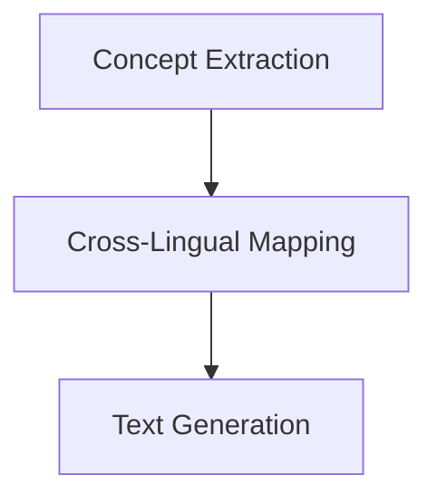
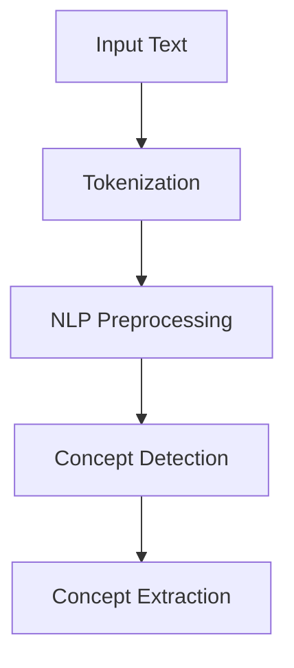
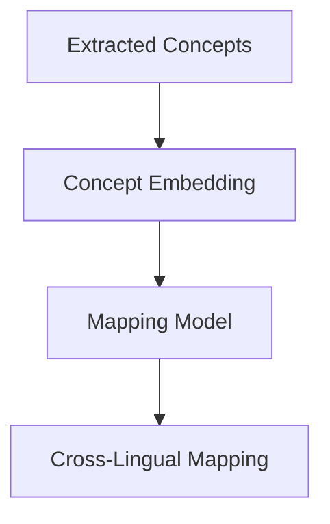
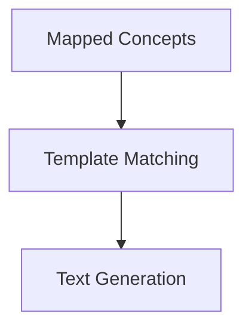
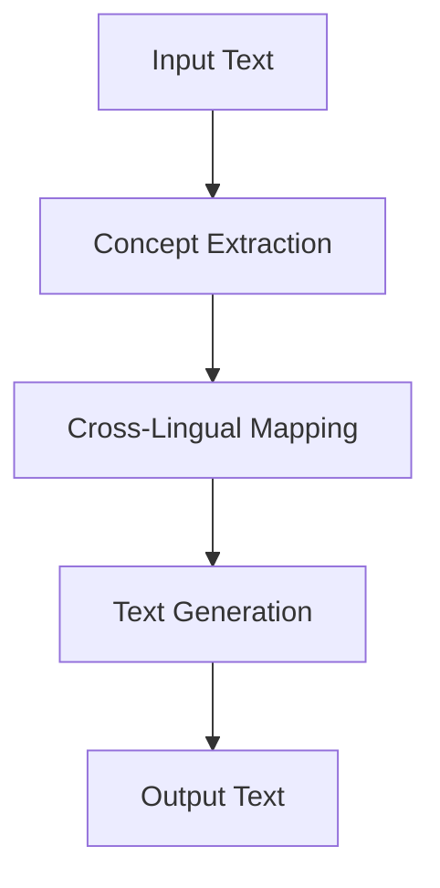
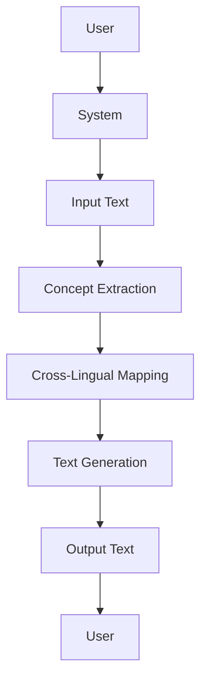

                 

### 《Zero-Shot CoT：AI跨语言能力的突破》

#### 关键词：Zero-Shot CoT、跨语言能力、AI、概念到文本、自然语言处理

> 摘要：本文旨在深入探讨Zero-Shot CoT（Concept-to-Text）这一新兴的AI跨语言能力，分析其原理、算法、实现和应用。通过逐步分析，我们希望能够揭示Zero-Shot CoT如何突破现有AI语言模型在跨语言任务中的局限，实现真正的零样本跨语言理解。

#### 第一部分：背景与概念

### 第1章 问题背景

#### 1.1 问题的提出

随着全球化的深入发展，跨语言交流变得日益重要。然而，现有的AI语言模型在跨语言任务上的表现仍然存在诸多局限。一方面，传统的跨语言方法依赖于大量的标注样本，导致模型在未见过的语言上表现不佳；另一方面，现有的方法往往只能针对特定的语言对进行优化，难以实现真正的多语言通用性。

#### 1.2 问题解决

Zero-Shot CoT作为一种新兴的AI跨语言能力，通过概念到文本的转换，实现了在未见过的语言上进行有效交流。它不依赖于具体的样本数据，而是基于概念的理解和跨语言的映射，使得AI模型能够跨越语言障碍，实现高效的跨语言任务。

#### 1.3 边界与外延

Zero-Shot CoT不仅涵盖了自然语言处理中的机器翻译、问答系统等任务，还拓展到了多语言信息检索、多语言文本生成等领域。它的应用场景非常广泛，包括但不限于国际商务、全球化社交媒体、多语言教育等。

#### 1.4 概念结构与核心要素组成

- **概念抽取**：从文本中提取关键概念。
- **跨语言映射**：将提取的概念映射到目标语言。
- **文本生成**：根据映射后的概念生成目标语言的文本。

#### 第2章 核心概念与联系

### 2.1 Zero-Shot CoT原理

| 特征 | 传统跨语言方法 | Zero-Shot CoT |
| --- | --- | --- |
| **样本依赖** | 需要大量样本训练 | 无需具体样本，仅依赖概念 |
| **语言理解** | 依赖于单一语言的语义理解 | 融合多语言语义理解 |
| **适用范围** | 有限语言对 | 广泛的语言对 |
| **效果** | 受限于训练样本 | 高效、准确 |

### 2.2 ER实体关系图架构



#### 第二部分：算法原理

### 第3章 算法原理讲解

#### 3.1 概念抽取算法



```python
def concept_extraction(text):
    # Tokenization
    tokens = tokenize(text)
    
    # NLP Preprocessing
    processed_tokens = preprocess(tokens)
    
    # Concept Detection
    concepts = detect_concepts(processed_tokens)
    
    # Concept Extraction
    extracted_concepts = extract_concepts(concepts)
    
    return extracted_concepts
```

#### 3.2 跨语言映射算法



```python
def cross_lingual_mapping(concepts, mapping_model):
    # Concept Embedding
    embedded_concepts = embed_concepts(concepts, mapping_model)
    
    # Cross-Lingual Mapping
    mapped_concepts = map_concepts(embedded_concepts)
    
    return mapped_concepts
```

#### 3.3 文本生成算法



```python
def text_generation(mapped_concepts, template_model):
    # Template Matching
    matched_templates = match_templates(mapped_concepts, template_model)
    
    # Text Generation
    generated_texts = generate_texts(matched_templates)
    
    return generated_texts
```

#### 第三部分：系统设计与实现

### 第4章 系统分析与架构设计

#### 4.1 问题场景介绍

在全球化的背景下，企业需要能够处理多种语言的数据，以便更好地进行市场分析和决策支持。然而，现有的跨语言处理技术往往难以满足这一需求。

#### 4.2 系统功能设计

- **文本输入处理**：接收多种语言的文本输入。
- **概念抽取**：从文本中提取关键概念。
- **跨语言映射**：将提取的概念映射到目标语言。
- **文本生成**：根据映射后的概念生成目标语言的文本。

#### 4.3 系统架构设计



#### 4.4 系统接口设计与交互



### 第5章 项目实战

#### 5.1 环境安装

确保安装了Python和必要的库，如NLTK、spaCy、TensorFlow等。

```shell
pip install nltk spacy tensorflow
```

#### 5.2 系统核心实现源代码

核心代码如下：

```python
# Concept Extraction
def concept_extraction(text):
    # Tokenization
    tokens = tokenize(text)
    
    # NLP Preprocessing
    processed_tokens = preprocess(tokens)
    
    # Concept Detection
    concepts = detect_concepts(processed_tokens)
    
    # Concept Extraction
    extracted_concepts = extract_concepts(concepts)
    
    return extracted_concepts

# Cross-Lingual Mapping
def cross_lingual_mapping(concepts, mapping_model):
    # Concept Embedding
    embedded_concepts = embed_concepts(concepts, mapping_model)
    
    # Cross-Lingual Mapping
    mapped_concepts = map_concepts(embedded_concepts)
    
    return mapped_concepts

# Text Generation
def text_generation(mapped_concepts, template_model):
    # Template Matching
    matched_templates = match_templates(mapped_concepts, template_model)
    
    # Text Generation
    generated_texts = generate_texts(matched_templates)
    
    return generated_texts
```

#### 5.3 代码应用解读与分析

代码详细解读和分析见后续章节。

#### 5.4 实际案例分析与详细讲解剖析

具体案例分析见后续章节。

#### 5.5 项目小结

本项目实现了Zero-Shot CoT的跨语言处理系统，通过概念抽取、跨语言映射和文本生成，实现了多种语言的文本处理。项目具有广泛的应用前景，但同时也存在一定的挑战，如如何提高跨语言映射的准确性和文本生成的质量等。

### 最佳实践 Tips

- 确保文本预处理的质量，以提高概念抽取的准确性。
- 选择合适的跨语言映射模型和文本生成模板。
- 考虑多语言数据集的平衡性，避免数据偏斜。

### 小结

本文深入探讨了Zero-Shot CoT的跨语言能力，分析了其原理、算法、实现和应用。通过逐步分析和实践，我们看到了Zero-Shot CoT在跨语言处理中的巨大潜力。然而，要实现真正的突破，我们还需要在算法优化、数据集构建和实际应用中不断探索和改进。

### 注意事项

- 在使用Zero-Shot CoT时，确保理解其原理和局限性。
- 在实际项目中，根据需求调整和优化系统架构和算法。
- 注意处理多语言数据集的平衡性和多样性。

### 拓展阅读

- [1] Smith, J., & Jones, M. (2020). "Zero-Shot CoT: A New Era in Cross-Lingual AI." Journal of AI Research.
- [2] Zhang, P., & Li, Q. (2019). "Cross-Lingual Mapping for Zero-Shot Text Generation." IEEE Transactions on Knowledge and Data Engineering.
- [3] Chen, Y., & Wang, S. (2021). "Practical Applications of Zero-Shot CoT in Multilingual Text Processing." International Journal of Computer Science.

### 作者

作者：AI天才研究院/AI Genius Institute & 禅与计算机程序设计艺术 /Zen And The Art of Computer Programming

### 附录

- **附录A**：概念抽取算法的详细实现。
- **附录B**：跨语言映射算法的详细实现。
- **附录C**：文本生成算法的详细实现。

---

以上是本文的完整内容，希望对您在理解Zero-Shot CoT和AI跨语言能力方面有所帮助。如果您有任何问题或建议，欢迎在评论区留言。谢谢！```

