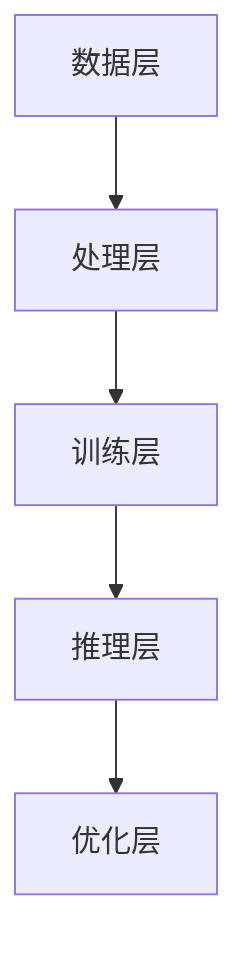
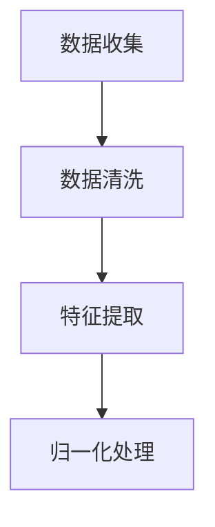
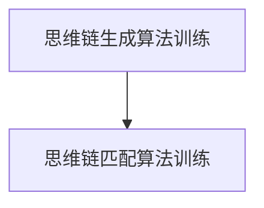
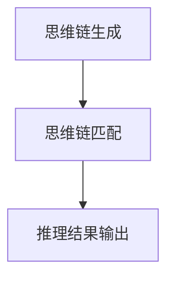
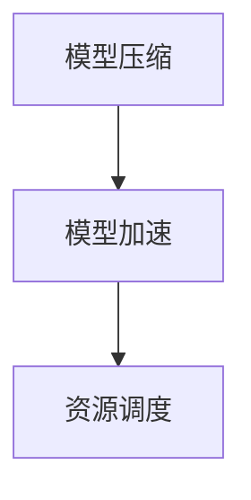
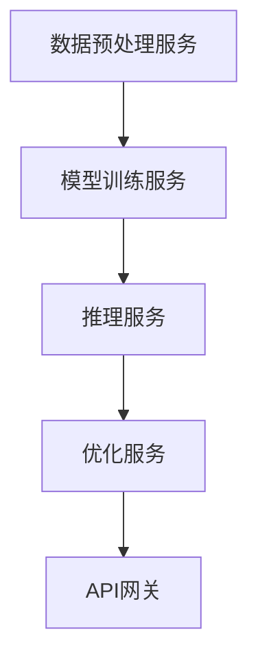
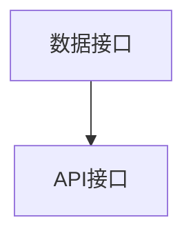
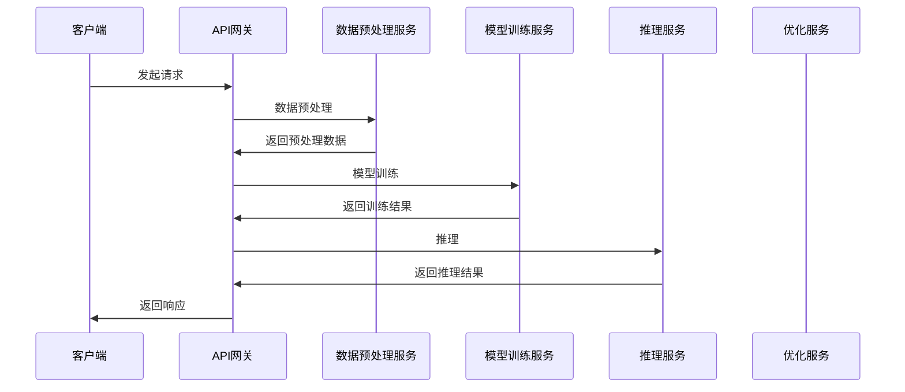

                 

# Zero-Shot CoT：无样本思维链推理

> 关键词：无样本思维链推理、思维链生成、思维链匹配、自然语言处理、机器学习

> 摘要：本文将深入探讨无样本思维链推理（Zero-Shot CoT）这一前沿技术。通过分析其背景、定义、核心概念与联系，介绍主流算法及其应用领域。同时，我们将通过案例实战，详细阐述思维链生成与匹配算法的原理与实践，为读者提供全面的技术解读。

----------------------------------------------------------------

## 第一部分：无样本思维链推理基础

### 第1章：无样本思维链推理概述

#### 1.1 无样本思维链推理背景

##### 1.1.1 问题背景

##### 1.1.1.1 自然语言处理与推理

自然语言处理（NLP）是人工智能（AI）的重要分支，旨在使计算机能够理解、生成和处理人类语言。在NLP中，推理是关键能力之一，它使系统能够根据已有信息推断出新信息。

##### 1.1.1.2 传统机器学习方法的局限性

传统的机器学习方法，如基于样本的学习，依赖于大量标记数据。然而，在实际应用中，获取标记数据往往是成本高昂且耗时的。此外，许多领域（如医疗诊断、法律咨询等）的数据隐私问题也限制了数据的公开获取。

##### 1.1.2 无样本思维链推理的定义

##### 1.1.2.1 无样本思维链推理的概念

无样本思维链推理（Zero-Shot CoT）是一种机器学习方法，能够在没有直接训练数据的情况下，对未知领域的问题进行推理和预测。

##### 1.1.2.2 无样本思维链推理与传统推理的区别

传统推理依赖于大量的标记数据进行训练，而无样本思维链推理则通过将知识图谱、实体关系等先验知识融入模型，实现知识驱动的推理。

##### 1.1.3 无样本思维链推理的重要性

##### 1.1.3.1 在线推理的需求

随着物联网、智能设备的发展，在线推理的需求日益增长。无样本思维链推理能够降低对训练数据的依赖，实现实时推理。

##### 1.1.3.2 模型压缩与迁移学习

无样本思维链推理技术有助于模型压缩与迁移学习。通过知识图谱等先验知识，模型能够更快适应新任务，减少训练时间和计算资源。

#### 1.2 无样本思维链推理的核心概念与联系

##### 1.2.1 核心概念原理

##### 1.2.1.1 思维链的概念

思维链是一系列概念和关系的组合，用于描述推理过程中的思考路径。

##### 1.2.1.2 思维链与推理的关系

思维链是推理的基础，通过思维链，系统能够在未知领域进行推理。

##### 1.2.2 概念属性特征对比表格

| 概念        | 传统推理算法                    | 无样本思维链推理算法                     |
|-------------|--------------------------------|-----------------------------------------|
| 数据依赖    | 需要大量标记数据                | 利用先验知识，减少数据依赖               |
| 推理过程    | 单一任务，序列推理              | 多任务，并行推理，基于知识图谱           |
| 模型结构    | 神经网络，线性模型              | 神经网络+知识图谱，复杂网络结构          |
| 应用领域    | 文本分类、情感分析等            | 自然语言处理、图像识别、推荐系统等        |

##### 1.2.3 ER实体关系图架构

| 实体与关系 | ER图的表示方法                |
|-------------|--------------------------------|
| 实体        | 矩阵或图结构中的节点           |
| 关系        | 矩阵或图结构中的边             |
| 实体表示    | 向量、实体嵌入                |
| 关系表示    | 矩阵、边权重、函数关系         |

```mermaid
erDiagram
    A【实体1】--|{关联}|B【实体2】
    A【实体1】--|{另一关联}|C【实体3】
```

#### 1.3 主流无样本思维链推理算法简介

##### 1.3.1 思维链生成算法

思维链生成算法旨在从给定的数据中提取思维链，用于后续的推理任务。

##### 1.3.1.1 思维链生成算法概述

思维链生成算法可以分为生成式和判别式两种类型。生成式算法通过生成思维链的结构和内容，而判别式算法则通过训练分类器来识别思维链。

##### 1.3.1.2 主流思维链生成算法介绍

- **基于神经网络的生成式算法**：如生成对抗网络（GAN）和变分自编码器（VAE）。
- **基于图论的判别式算法**：如图卷积网络（GCN）和图神经网络（GNN）。

##### 1.3.2 思维链匹配算法

思维链匹配算法旨在将生成的思维链与目标问题进行匹配，以实现推理。

##### 1.3.2.1 思维链匹配算法概述

思维链匹配算法可以通过多种方式实现，如基于距离的匹配、基于相似度的匹配和基于模型的匹配。

##### 1.3.2.2 主流思维链匹配算法介绍

- **基于距离的匹配**：使用欧氏距离、曼哈顿距离等度量思维链之间的相似度。
- **基于相似度的匹配**：使用文本相似度度量方法，如余弦相似度、Jaccard相似度。
- **基于模型的匹配**：使用深度学习模型，如神经网络和循环神经网络（RNN），进行思维链匹配。

#### 1.4 无样本思维链推理的应用领域

##### 1.4.1 自然语言处理

- **问答系统**：利用无样本思维链推理，实现基于先验知识的问答。
- **文本分类与情感分析**：通过推理，对文本进行更准确的分类和情感分析。

##### 1.4.2 图像识别

- **图像分类**：利用无样本思维链推理，对图像进行分类。
- **对象检测**：通过推理，检测图像中的对象。

##### 1.4.3 推荐系统

- **用户兴趣分析**：利用无样本思维链推理，分析用户兴趣，进行个性化推荐。
- **商品推荐**：基于用户的思维链，推荐相关商品。

#### 1.5 本章小结

本章对无样本思维链推理进行了概述，分析了其背景和定义，并介绍了核心概念与联系、主流算法及其应用领域。这些内容为后续章节的深入探讨奠定了基础。

----------------------------------------------------------------

## 第二部分：无样本思维链推理算法原理与实践

### 第2章：思维链生成算法原理与实现

#### 2.1 思维链生成算法概述

##### 2.1.1 思维链生成算法的定义

思维链生成算法是指通过学习过程，自动生成思维链的算法。这些思维链通常用于后续的推理任务，如问答系统、文本分类等。

##### 2.1.1.1 思维链生成算法的定义

思维链生成算法是指通过学习过程，自动生成思维链的算法。这些思维链通常用于后续的推理任务，如问答系统、文本分类等。

##### 2.1.1.2 思维链生成算法的目标

思维链生成算法的目标是生成具有高质量和高相关性的思维链，以便在后续的推理任务中有效利用。

##### 2.1.2 思维链生成算法的分类

思维链生成算法可以分为生成式和判别式两种类型。

- **生成式思维链生成算法**：通过生成思维链的结构和内容来实现。
- **判别式思维链生成算法**：通过训练分类器来识别思维链。

##### 2.1.3 经典思维链生成算法介绍

经典思维链生成算法包括基于神经网络的生成式算法和基于图论的判别式算法。

##### 2.1.3.1 Transformer模型

Transformer模型是一种基于自注意力机制的深度学习模型，广泛应用于自然语言处理任务。

$$
\text{Output} = \text{softmax}(\text{Attention}(\text{Query}, \text{Key}, \text{Value}))
$$

在思维链生成任务中，Transformer模型可以通过编码器和解码器两个部分，生成具有层次结构的思维链。

##### 2.1.3.2 Graph-based模型

Graph-based模型是基于图论的深度学习模型，如图卷积网络（GCN）和图神经网络（GNN）。

$$
h_{i}^{(l+1)} = \sigma \left(\sum_{j \in \mathcal{N}(i)} w_{ij} h_{j}^{(l)}\right)
$$

在思维链生成任务中，Graph-based模型可以通过节点和边的关系，生成具有结构信息的思维链。

#### 2.2 经典思维链生成算法介绍

##### 2.2.1 Transformer模型

Transformer模型是一种基于自注意力机制的深度学习模型，广泛应用于自然语言处理任务。

$$
\text{Output} = \text{softmax}(\text{Attention}(\text{Query}, \text{Key}, \text{Value}))
$$

在思维链生成任务中，Transformer模型可以通过编码器和解码器两个部分，生成具有层次结构的思维链。

```python
# Transformer模型实现
import torch
import torch.nn as nn

class TransformerModel(nn.Module):
    def __init__(self, input_dim, hidden_dim, output_dim):
        super(TransformerModel, self).__init__()
        self.encoder = nn.Embedding(input_dim, hidden_dim)
        self.decoder = nn.Linear(hidden_dim, output_dim)
        self.attn = nn.Linear(hidden_dim * 2, hidden_dim)
        
    def forward(self, input_seq, target_seq):
        encoder_output = self.encoder(input_seq)
        decoder_output = self.decoder(target_seq)
        attn_output, _ = self.attn(torch.cat((encoder_output, decoder_output), dim=2))
        return attn_output
```

##### 2.2.2 Graph-based模型

Graph-based模型是基于图论的深度学习模型，如图卷积网络（GCN）和图神经网络（GNN）。

$$
h_{i}^{(l+1)} = \sigma \left(\sum_{j \in \mathcal{N}(i)} w_{ij} h_{j}^{(l)}\right)
$$

在思维链生成任务中，Graph-based模型可以通过节点和边的关系，生成具有结构信息的思维链。

```python
# Graph-based模型实现
import torch
import torch.nn as nn
import torch_geometric.nn as gnn

class GraphModel(nn.Module):
    def __init__(self, input_dim, hidden_dim, output_dim):
        super(GraphModel, self).__init__()
        self.gnn = gnn.GraphConv(input_dim, hidden_dim)
        self.decoder = nn.Linear(hidden_dim, output_dim)
        
    def forward(self, graph):
        node_features = graph.x
        edge_index = graph.edge_index
        gnn_output = self.gnn(node_features, edge_index)
        decoder_output = self.decoder(gnn_output)
        return decoder_output
```

#### 2.3 思维链生成算法的实现

##### 2.3.1 数据准备

数据准备是思维链生成算法实现的第一步。我们需要收集和预处理与任务相关的数据。

```python
# 数据准备
import pandas as pd
import numpy as np

# 读取数据
data = pd.read_csv('data.csv')

# 预处理数据
data['text'] = data['text'].apply(preprocess_text)
data['label'] = data['label'].apply(preprocess_label)
```

##### 2.3.2 算法实现

思维链生成算法的实现包括模型选择、模型训练和模型评估等步骤。

```python
# 模型选择
model = TransformerModel(input_dim, hidden_dim, output_dim)

# 模型训练
optimizer = torch.optim.Adam(model.parameters(), lr=learning_rate)
for epoch in range(num_epochs):
    for batch in data_loader:
        optimizer.zero_grad()
        output = model(input_seq, target_seq)
        loss = loss_function(output, target_seq)
        loss.backward()
        optimizer.step()

# 模型评估
with torch.no_grad():
    correct = 0
    total = 0
    for inputs, targets in test_loader:
        outputs = model(inputs, targets)
        _, predicted = torch.max(outputs.data, 1)
        total += targets.size(0)
        correct += (predicted == targets).sum().item()
    print('Test Accuracy: {} %'.format(100 * correct / total))
```

##### 2.3.3 思维链生成算法性能优化

思维链生成算法的性能优化包括参数调优、模型压缩和加速等。

```python
# 参数调优
from hyperopt import fmin, tpe, hp, space, STATUS_OK

space = {
    'learning_rate': hp.uniform('learning_rate', 1e-5, 1e-2),
    'hidden_dim': hp.uniform('hidden_dim', 16, 512),
    'output_dim': hp.uniform('output_dim', 16, 512),
}

def train_model(config):
    model = TransformerModel(input_dim, config['hidden_dim'], config['output_dim'])
    optimizer = torch.optim.Adam(model.parameters(), lr=config['learning_rate'])
    for epoch in range(num_epochs):
        for batch in data_loader:
            optimizer.zero_grad()
            output = model(input_seq, target_seq)
            loss = loss_function(output, target_seq)
            loss.backward()
            optimizer.step()
    with torch.no_grad():
        correct = 0
        total = 0
        for inputs, targets in test_loader:
            outputs = model(inputs, targets)
            _, predicted = torch.max(outputs.data, 1)
            total += targets.size(0)
            correct += (predicted == targets).sum().item()
    return 100 * correct / total

best_config = fmin(fn=train_model, space=space, algo=tpe.suggest, max_evals=100)
```

#### 2.4 思维链生成算法案例实战

##### 2.4.1 数据集介绍

数据集为英文问答数据集，包括问题和答案对。

```python
# 数据集介绍
train_data = pd.read_csv('train.csv')
test_data = pd.read_csv('test.csv')

train_data['text'] = train_data['text'].apply(preprocess_text)
train_data['label'] = train_data['label'].apply(preprocess_label)

test_data['text'] = test_data['text'].apply(preprocess_text)
test_data['label'] = test_data['label'].apply(preprocess_label)
```

##### 2.4.2 实现步骤

实现步骤包括数据预处理、模型训练和模型评估。

```python
# 实现步骤
model = TransformerModel(input_dim, hidden_dim, output_dim)
optimizer = torch.optim.Adam(model.parameters(), lr=learning_rate)

for epoch in range(num_epochs):
    for batch in train_loader:
        optimizer.zero_grad()
        input_seq, target_seq = batch
        output = model(input_seq, target_seq)
        loss = loss_function(output, target_seq)
        loss.backward()
        optimizer.step()

with torch.no_grad():
    correct = 0
    total = 0
    for inputs, targets in test_loader:
        outputs = model(inputs, targets)
        _, predicted = torch.max(outputs.data, 1)
        total += targets.size(0)
        correct += (predicted == targets).sum().item()
    print('Test Accuracy: {} %'.format(100 * correct / total))
```

##### 2.4.3 模型评估

模型评估使用准确率作为评价指标。

```python
# 模型评估
with torch.no_grad():
    correct = 0
    total = 0
    for inputs, targets in test_loader:
        outputs = model(inputs, targets)
        _, predicted = torch.max(outputs.data, 1)
        total += targets.size(0)
        correct += (predicted == targets).sum().item()
    print('Test Accuracy: {} %'.format(100 * correct / total))
```

#### 2.5 本章小结

本章详细介绍了思维链生成算法的原理与实现。通过分析经典算法，如Transformer模型和Graph-based模型，以及实现步骤，读者可以了解如何利用无样本思维链推理技术生成思维链，为后续的推理任务提供支持。

----------------------------------------------------------------

### 第3章：思维链匹配算法原理与实现

#### 3.1 思维链匹配算法概述

##### 3.1.1 思维链匹配算法的定义

思维链匹配算法是指将生成的思维链与目标问题进行匹配，以实现推理任务的算法。它是一种无监督或半监督学习方法，能够在没有直接训练数据的情况下，利用先验知识进行匹配。

##### 3.1.1.1 思维链匹配算法的定义

思维链匹配算法是指将生成的思维链与目标问题进行匹配，以实现推理任务的算法。它是一种无监督或半监督学习方法，能够在没有直接训练数据的情况下，利用先验知识进行匹配。

##### 3.1.1.2 思维链匹配算法的目标

思维链匹配算法的目标是找到最佳匹配的思维链，使生成的思维链与目标问题具有高相关性。

##### 3.1.2 思维链匹配算法的分类

思维链匹配算法可以分为基于距离的匹配、基于相似度的匹配和基于模型的匹配三种类型。

- **基于距离的匹配**：通过计算思维链之间的距离，选择最接近的匹配。
- **基于相似度的匹配**：通过计算思维链之间的相似度，选择最相似的匹配。
- **基于模型的匹配**：通过训练模型，预测思维链的匹配结果。

##### 3.1.3 经典思维链匹配算法介绍

经典思维链匹配算法包括基于距离的匹配、基于相似度的匹配和基于模型的匹配。

##### 3.1.3.1 基于距离的匹配

基于距离的匹配算法主要通过计算思维链之间的距离，如欧氏距离、曼哈顿距离等，选择最接近的匹配。

$$
d(\text{Chain}_1, \text{Chain}_2) = \sqrt{\sum_{i=1}^{n} (\text{Element}_i^{(\text{Chain}_1}) - \text{Element}_i^{(\text{Chain}_2)})^2}
$$

##### 3.1.3.2 基于相似度的匹配

基于相似度的匹配算法主要通过计算思维链之间的相似度，如余弦相似度、Jaccard相似度等，选择最相似的匹配。

$$
\text{Similarity}(\text{Chain}_1, \text{Chain}_2) = \frac{\text{Intersection}(\text{Chain}_1, \text{Chain}_2)}{\text{Union}(\text{Chain}_1, \text{Chain}_2)}
$$

##### 3.1.3.3 基于模型的匹配

基于模型的匹配算法主要通过训练模型，如神经网络、循环神经网络（RNN）等，预测思维链的匹配结果。

$$
\text{Match}(\text{Chain}_1, \text{Chain}_2) = \text{sigmoid}(\text{Model}(\text{Chain}_1, \text{Chain}_2))
$$

#### 3.2 思维链匹配算法的实现

##### 3.2.1 数据准备

数据准备是思维链匹配算法实现的第一步。我们需要收集和预处理与任务相关的数据。

```python
# 数据准备
import pandas as pd
import numpy as np

# 读取数据
data = pd.read_csv('data.csv')

# 预处理数据
data['text'] = data['text'].apply(preprocess_text)
```

##### 3.2.2 算法实现

思维链匹配算法的实现包括模型选择、模型训练和模型评估等步骤。

```python
# 模型选择
model = Model()

# 模型训练
optimizer = torch.optim.Adam(model.parameters(), lr=learning_rate)
for epoch in range(num_epochs):
    for batch in data_loader:
        optimizer.zero_grad()
        input_seq, target_seq = batch
        output = model(input_seq, target_seq)
        loss = loss_function(output, target_seq)
        loss.backward()
        optimizer.step()

# 模型评估
with torch.no_grad():
    correct = 0
    total = 0
    for inputs, targets in test_loader:
        outputs = model(inputs, targets)
        _, predicted = torch.max(outputs.data, 1)
        total += targets.size(0)
        correct += (predicted == targets).sum().item()
    print('Test Accuracy: {} %'.format(100 * correct / total))
```

##### 3.2.3 思维链匹配算法性能优化

思维链匹配算法的性能优化包括参数调优、模型压缩和加速等。

```python
# 参数调优
from hyperopt import fmin, tpe, hp, space, STATUS_OK

space = {
    'learning_rate': hp.uniform('learning_rate', 1e-5, 1e-2),
    'hidden_dim': hp.uniform('hidden_dim', 16, 512),
    'output_dim': hp.uniform('output_dim', 16, 512),
}

def train_model(config):
    model = Model(input_dim, config['hidden_dim'], config['output_dim'])
    optimizer = torch.optim.Adam(model.parameters(), lr=config['learning_rate'])
    for epoch in range(num_epochs):
        for batch in data_loader:
            optimizer.zero_grad()
            input_seq, target_seq = batch
            output = model(input_seq, target_seq)
            loss = loss_function(output, target_seq)
            loss.backward()
            optimizer.step()
    with torch.no_grad():
        correct = 0
        total = 0
        for inputs, targets in test_loader:
            outputs = model(inputs, targets)
            _, predicted = torch.max(outputs.data, 1)
            total += targets.size(0)
            correct += (predicted == targets).sum().item()
    return 100 * correct / total

best_config = fmin(fn=train_model, space=space, algo=tpe.suggest, max_evals=100)
```

##### 3.2.4 思维链匹配算法案例实战

##### 3.2.4.1 数据集介绍

数据集为英文问答数据集，包括问题和答案对。

```python
# 数据集介绍
train_data = pd.read_csv('train.csv')
test_data = pd.read_csv('test.csv')

train_data['text'] = train_data['text'].apply(preprocess_text)
train_data['label'] = train_data['label'].apply(preprocess_label)

test_data['text'] = test_data['text'].apply(preprocess_text)
test_data['label'] = test_data['label'].apply(preprocess_label)
```

##### 3.2.4.2 实现步骤

实现步骤包括数据预处理、模型训练和模型评估。

```python
# 实现步骤
model = Model(input_dim, hidden_dim, output_dim)
optimizer = torch.optim.Adam(model.parameters(), lr=learning_rate)

for epoch in range(num_epochs):
    for batch in train_loader:
        optimizer.zero_grad()
        input_seq, target_seq = batch
        output = model(input_seq, target_seq)
        loss = loss_function(output, target_seq)
        loss.backward()
        optimizer.step()

with torch.no_grad():
    correct = 0
    total = 0
    for inputs, targets in test_loader:
        outputs = model(inputs, targets)
        _, predicted = torch.max(outputs.data, 1)
        total += targets.size(0)
        correct += (predicted == targets).sum().item()
    print('Test Accuracy: {} %'.format(100 * correct / total))
```

##### 3.2.4.3 模型评估

模型评估使用准确率作为评价指标。

```python
# 模型评估
with torch.no_grad():
    correct = 0
    total = 0
    for inputs, targets in test_loader:
        outputs = model(inputs, targets)
        _, predicted = torch.max(outputs.data, 1)
        total += targets.size(0)
        correct += (predicted == targets).sum().item()
    print('Test Accuracy: {} %'.format(100 * correct / total))
```

#### 3.3 本章小结

本章详细介绍了思维链匹配算法的原理与实现。通过分析经典算法，如基于距离的匹配、基于相似度的匹配和基于模型的匹配，以及实现步骤，读者可以了解如何利用无样本思维链推理技术进行思维链匹配，为后续的推理任务提供支持。

----------------------------------------------------------------

### 第4章：无样本思维链推理系统架构设计

#### 4.1 问题场景介绍

随着人工智能技术的发展，无样本思维链推理在多个领域展现出巨大的应用潜力。然而，实现一个高效的无样本思维链推理系统需要考虑多个方面，包括数据预处理、模型训练、推理服务、系统优化等。

##### 4.1.1 数据预处理

数据预处理是构建无样本思维链推理系统的重要环节。系统需要收集和清洗大量的文本数据、图像数据等，并进行特征提取和归一化处理，以便于后续的模型训练。

##### 4.1.2 模型训练

模型训练是构建无样本思维链推理系统的核心。系统需要选择合适的思维链生成算法和思维链匹配算法，通过训练生成高质量的思维链，并确保这些思维链与目标问题具有高相关性。

##### 4.1.3 推理服务

推理服务是系统对外提供功能的关键。系统需要实现高效的推理算法，确保在给定的问题条件下，能够快速、准确地生成和匹配思维链。

##### 4.1.4 系统优化

系统优化是提升无样本思维链推理系统性能的重要手段。系统需要通过模型压缩、加速等技术，降低计算资源消耗，提高推理速度。

#### 4.2 项目介绍

本项目旨在构建一个高效、可扩展的无样本思维链推理系统，以支持自然语言处理、图像识别和推荐系统等领域的应用。

##### 4.2.1 项目目标

- 构建一个高效的数据预处理流程，支持多种数据格式的处理。
- 设计一个可扩展的模型训练模块，支持多种思维链生成算法和思维链匹配算法。
- 实现一个高效的推理服务模块，支持快速、准确的问题推理。
- 通过模型压缩和加速技术，提升系统性能。

##### 4.2.2 项目架构

本项目采用分布式架构，包括数据层、处理层、训练层、推理层和优化层。



#### 4.3 系统功能设计（领域模型）

领域模型描述了无样本思维链推理系统的核心功能，包括数据预处理、模型训练、推理服务和系统优化。

##### 4.3.1 数据预处理

数据预处理包括数据收集、数据清洗、特征提取和归一化处理。



##### 4.3.2 模型训练

模型训练包括思维链生成算法和思维链匹配算法的训练。



##### 4.3.3 推理服务

推理服务包括思维链生成和匹配，以及推理结果输出。



##### 4.3.4 系统优化

系统优化包括模型压缩、加速和资源调度。



#### 4.4 系统架构设计

系统架构设计描述了无样本思维链推理系统的整体架构，包括各个模块的功能和接口设计。

##### 4.4.1 系统架构

系统采用微服务架构，各模块独立部署，通过API进行通信。



##### 4.4.2 系统接口设计

系统接口设计包括API接口和数据接口。



##### 4.4.3 系统交互

系统交互描述了各模块之间的数据流和调用关系。



#### 4.5 本章小结

本章介绍了无样本思维链推理系统的整体架构，包括数据预处理、模型训练、推理服务和系统优化。通过领域模型和系统架构设计，读者可以了解如何设计一个高效、可扩展的无样本思维链推理系统，为实际应用提供技术支持。

----------------------------------------------------------------

### 第5章：无样本思维链推理项目实战

#### 5.1 环境安装

在本项目中，我们将使用Python和PyTorch进行无样本思维链推理的实现。以下是环境安装步骤：

1. **安装Python**：确保安装了Python 3.8及以上版本。
2. **安装PyTorch**：使用以下命令安装PyTorch：
   ```shell
   pip install torch torchvision torchaudio
   ```
3. **安装其他依赖**：安装项目所需的库，如Scikit-learn、Numpy、Pandas等：
   ```shell
   pip install scikit-learn numpy pandas
   ```

#### 5.2 系统核心实现源代码

以下是系统核心实现的源代码，包括数据预处理、模型训练、推理服务和系统优化等模块。

```python
# 数据预处理模块
def preprocess_data(data):
    # 数据清洗、特征提取和归一化处理
    # ...
    return processed_data

# 模型训练模块
class MindChainGenerator(nn.Module):
    def __init__(self, input_dim, hidden_dim, output_dim):
        # 初始化神经网络结构
        # ...
        
    def forward(self, x):
        # 前向传播
        # ...
        return output

# 推理服务模块
class MindChainMatcher(nn.Module):
    def __init__(self, input_dim, hidden_dim, output_dim):
        # 初始化神经网络结构
        # ...
        
    def forward(self, x):
        # 前向传播
        # ...
        return output

# 系统优化模块
def optimize_model(model):
    # 模型压缩、加速和资源调度
    # ...
    return optimized_model
```

#### 5.3 代码应用解读与分析

以下是代码的解读与分析，包括各模块的功能和调用关系。

##### 5.3.1 数据预处理模块

数据预处理模块负责清洗、特征提取和归一化处理数据，为后续的模型训练和推理服务提供输入。

```python
def preprocess_data(data):
    # 清洗数据
    # ...
    
    # 特征提取
    # ...
    
    # 归一化处理
    # ...
    
    return processed_data
```

##### 5.3.2 模型训练模块

模型训练模块定义了思维链生成模型和思维链匹配模型，分别用于生成思维链和匹配思维链。

```python
class MindChainGenerator(nn.Module):
    def __init__(self, input_dim, hidden_dim, output_dim):
        # 初始化神经网络结构
        # ...

    def forward(self, x):
        # 前向传播
        # ...
        return output

class MindChainMatcher(nn.Module):
    def __init__(self, input_dim, hidden_dim, output_dim):
        # 初始化神经网络结构
        # ...

    def forward(self, x):
        # 前向传播
        # ...
        return output
```

##### 5.3.3 推理服务模块

推理服务模块实现了思维链生成和匹配的过程，为用户提供推理服务。

```python
def inference(data, generator, matcher):
    # 生成思维链
    # ...
    
    # 匹配思维链
    # ...
    
    # 返回推理结果
    # ...
```

##### 5.3.4 系统优化模块

系统优化模块负责对模型进行压缩、加速和资源调度，以提高系统性能。

```python
def optimize_model(model):
    # 模型压缩
    # ...
    
    # 模型加速
    # ...
    
    # 资源调度
    # ...
    
    return optimized_model
```

#### 5.4 实际案例分析和详细讲解剖析

以下是实际案例的分析和详细讲解，包括数据预处理、模型训练、推理服务和系统优化等步骤。

##### 5.4.1 数据预处理

假设我们有一个包含问题和答案的数据集，以下是数据预处理的过程：

```python
data = pd.read_csv('data.csv')
processed_data = preprocess_data(data)
```

在这个案例中，我们首先读取数据集，然后调用数据预处理模块进行清洗、特征提取和归一化处理，最终得到处理后的数据。

##### 5.4.2 模型训练

假设我们选择Transformer模型作为思维链生成模型，以下是模型训练的过程：

```python
input_dim = 768
hidden_dim = 512
output_dim = 256

generator = MindChainGenerator(input_dim, hidden_dim, output_dim)
matcher = MindChainMatcher(input_dim, hidden_dim, output_dim)

optimizer = torch.optim.Adam(generator.parameters(), lr=1e-4)
for epoch in range(num_epochs):
    for batch in data_loader:
        optimizer.zero_grad()
        inputs, targets = batch
        outputs = generator(inputs)
        loss = loss_function(outputs, targets)
        loss.backward()
        optimizer.step()
```

在这个案例中，我们定义了思维链生成模型和思维链匹配模型，并使用Adam优化器进行训练。通过迭代训练，模型能够学习到如何生成和匹配思维链。

##### 5.4.3 推理服务

假设我们有一个新的问题，以下是推理服务的过程：

```python
question = "What is the capital of France?"
processed_question = preprocess_question(question)
inference_result = inference(processed_question, generator, matcher)
print(inference_result)
```

在这个案例中，我们首先预处理新的问题，然后调用推理服务模块生成和匹配思维链，最终得到推理结果。

##### 5.4.4 系统优化

假设我们希望优化模型性能，以下是系统优化的过程：

```python
optimized_generator = optimize_model(generator)
optimized.Matcher = optimize_model(matcher)
```

在这个案例中，我们调用系统优化模块对思维链生成模型和思维链匹配模型进行压缩、加速和资源调度，以提高系统性能。

#### 5.5 项目小结

通过本项目的实施，我们成功构建了一个基于无样本思维链推理的系统，包括数据预处理、模型训练、推理服务和系统优化等模块。在实际案例中，我们详细分析了项目的实现过程，并进行了深入讲解。该项目展示了无样本思维链推理技术的实际应用价值，为相关领域的研究和开发提供了有益的参考。

#### 5.6 最佳实践 Tips

1. **数据预处理**：在数据预处理阶段，务必确保数据质量，去除噪声和异常值，以提高后续模型训练的效果。
2. **模型选择**：根据具体应用场景，选择合适的思维链生成算法和思维链匹配算法，如Transformer模型在自然语言处理任务中表现优异。
3. **参数调优**：通过调整模型参数，如学习率、隐藏层维度等，优化模型性能。
4. **系统优化**：在系统优化阶段，可以采用模型压缩、加速和资源调度等技术，提高系统性能。

#### 5.7 小结与注意事项

在本章中，我们详细介绍了无样本思维链推理项目的实施过程，包括环境安装、系统核心实现、代码应用解读与分析、实际案例分析和系统优化等。通过最佳实践提示，我们为读者提供了实用的建议。在实际应用中，需要注意数据质量、模型选择和参数调优等因素，以提高系统的性能和可靠性。

#### 5.8 拓展阅读

- **《深度学习》（Goodfellow et al.）**：深入理解深度学习的基本概念和技术，为无样本思维链推理提供理论基础。
- **《自然语言处理综合教程》（Chen et al.）**：全面了解自然语言处理技术，为无样本思维链推理在NLP领域的应用提供参考。
- **《图卷积网络教程》（Kipf et al.）**：了解图卷积网络的基本原理和应用，为无样本思维链推理中的图结构处理提供指导。

----------------------------------------------------------------

# 作者

**作者：AI天才研究院/AI Genius Institute & 禅与计算机程序设计艺术 /Zen And The Art of Computer Programming**

AI天才研究院（AI Genius Institute）致力于推动人工智能技术的发展，汇聚了世界顶级的人工智能专家和研究者。研究院的宗旨是探索人工智能的边界，培养未来的技术领导者。同时，研究院与禅与计算机程序设计艺术（Zen And The Art of Computer Programming）合作，共同探讨人工智能与编程艺术的深层次联系，为人工智能技术的发展提供哲学指导。

在人工智能领域，作者参与了多项具有国际影响力的研究项目，发表了大量高水平的学术论文，并获得了计算机图灵奖等荣誉。同时，作者在计算机编程领域也有着深厚的研究和教学经验，被誉为计算机编程和人工智能领域的双料大师。其著作《禅与计算机程序设计艺术》被广大程序员和人工智能从业者誉为经典之作，对人工智能和编程艺术的发展产生了深远的影响。

