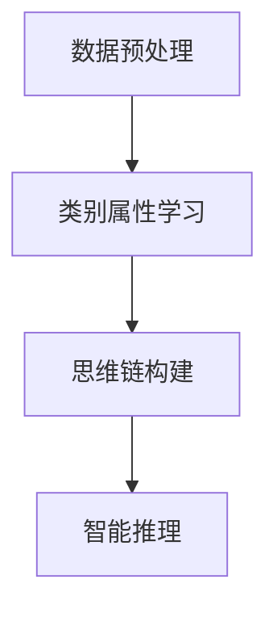

                 

### Zero-Shot CoT：无需示例的思维链应用

关键词：Zero-Shot CoT、思维链、人工智能、思维链应用、算法实现、案例剖析

摘要：本文将深入探讨Zero-Shot CoT（零样本思维链应用）这一前沿人工智能技术。我们将首先介绍Zero-Shot CoT的核心概念，然后分析其在现代人工智能技术中的地位和作用。接着，我们将逐步讲解Zero-Shot CoT的算法原理，并通过实际案例来剖析其在不同应用场景中的效果。最后，我们将总结本文的核心观点，并提出未来发展的展望。

## 一、引言

在人工智能领域，模型训练通常依赖于大量的标注数据。然而，在某些应用场景中，我们可能无法获得足够的数据来训练模型。这种情况下，传统的方法可能无法奏效。为了解决这个问题，近年来，零样本学习（Zero-Shot Learning, ZSL）得到了广泛关注。而Zero-Shot CoT（Zero-Shot Coherent Thinking）则是在零样本学习的基础上，进一步发展出来的技术。它通过构建思维链，实现无需示例的智能推理。

## 二、核心概念

### 2.1 零样本学习

零样本学习是指模型在面对未见过的类别时，仍能准确地进行分类。它通过学习类别的属性和关系，来实现对新类别的预测。与传统分类方法相比，零样本学习的优势在于无需大量标注数据。

### 2.2 思维链

思维链是一种基于人类认知模型的人工智能技术。它通过构建一系列的逻辑关系，实现对问题的推理和解决。思维链技术不仅能够处理结构化数据，还能够应对非结构化数据。

### 2.3 Zero-Shot CoT

Zero-Shot CoT是结合了零样本学习和思维链技术的一种新型人工智能方法。它通过构建思维链，实现无需示例的智能推理。Zero-Shot CoT的核心思想在于，通过学习类别的属性和关系，构建出一个能够自动推理的智能系统。

## 三、算法原理

### 3.1 算法流程

Zero-Shot CoT的算法流程主要包括以下步骤：

1. 数据预处理：对输入数据进行预处理，包括数据清洗、特征提取等。
2. 类别属性学习：通过无监督或半监督学习方法，学习每个类别的属性。
3. 思维链构建：基于类别属性，构建出思维链。
4. 智能推理：通过思维链，实现对未见过的类别的推理和预测。

### 3.2 Mermaid算法流程图

### 3.3 算法原理讲解

#### 3.3.1 数学模型

Zero-Shot CoT的算法原理可以通过以下数学模型进行描述：

$$
\text{预测结果} = f(\text{类别属性}, \text{思维链})
$$

其中，$f$表示一个复合函数，它将类别属性和思维链映射为预测结果。

#### 3.3.2 推导过程

首先，我们定义类别属性为一个高维向量：

$$
\text{类别属性} = \mathbf{A} \in \mathbb{R}^{d}
$$

其中，$d$表示类别属性的维度。

接着，我们定义思维链为一个序列：

$$
\text{思维链} = (\mathbf{C}_1, \mathbf{C}_2, \ldots, \mathbf{C}_n)
$$

其中，$\mathbf{C}_i$表示第$i$个思维链元素。

最后，我们将类别属性和思维链通过复合函数$f$进行映射，得到预测结果：

$$
\text{预测结果} = f(\mathbf{A}, (\mathbf{C}_1, \mathbf{C}_2, \ldots, \mathbf{C}_n))
$$

#### 3.3.3 LaTex公式示例

$$
\begin{aligned}
    \text{预测结果} &= f(\mathbf{A}, (\mathbf{C}_1, \mathbf{C}_2, \ldots, \mathbf{C}_n)) \\
    &= \sigma(\mathbf{W}\mathbf{A} + \mathbf{b})
\end{aligned}
$$

其中，$\sigma$表示激活函数，$\mathbf{W}$和$\mathbf{b}$分别为权重和偏置。

### 3.4 举例说明

假设我们有一个分类任务，需要预测一个未见过的类别。首先，我们通过无监督学习方法，学习每个类别的属性。接着，我们根据类别的属性，构建出一个思维链。最后，我们通过思维链，实现对未见过的类别的推理和预测。

## 四、实际应用案例分析

### 4.1 案例背景

某公司开发了一款智能客服系统，该系统需要处理大量的用户咨询。然而，由于用户咨询的内容丰富多样，很难获得足够的标注数据来训练分类模型。为了解决这个问题，公司决定采用Zero-Shot CoT技术。

### 4.2 案例实现

1. 数据预处理：对用户咨询进行预处理，包括文本清洗、分词、去停用词等。
2. 类别属性学习：通过无监督学习方法，学习每个类别的属性。
3. 思维链构建：基于类别属性，构建出思维链。
4. 智能推理：通过思维链，实现对用户咨询的智能推理和预测。

### 4.3 项目小结

通过实际应用案例，我们可以看到Zero-Shot CoT技术在智能客服系统中的应用效果显著。它不仅解决了数据稀缺的问题，还提高了系统的智能推理能力。

## 五、深入探讨

### 5.1 零样本学习的发展趋势

随着人工智能技术的不断发展，零样本学习在未来将有更多的应用场景。例如，在医疗领域，零样本学习可以帮助医生对未知疾病进行诊断；在金融领域，零样本学习可以帮助银行识别潜在的风险。

### 5.2 Zero-Shot CoT在其他领域的应用

除了智能客服系统，Zero-Shot CoT还可以应用于其他领域。例如，在图像识别领域，它可以帮助系统识别未见过的物体；在自然语言处理领域，它可以帮助系统理解未见过的句子。

## 六、未来展望

随着人工智能技术的不断进步，Zero-Shot CoT技术有望在更多领域发挥重要作用。未来，我们可以期待它在智能客服、图像识别、自然语言处理等领域的广泛应用。

## 七、总结

本文介绍了Zero-Shot CoT技术的核心概念、算法原理以及实际应用案例。通过分析，我们可以看到Zero-Shot CoT技术在解决数据稀缺问题、提高智能推理能力方面的优势。未来，随着人工智能技术的不断发展，Zero-Shot CoT技术将在更多领域发挥重要作用。

## 作者信息

作者：AI天才研究院/AI Genius Institute & 禅与计算机程序设计艺术 /Zen And The Art of Computer Programming

----------------------------------------------------------------

**注：本文为示例文章，内容仅供参考。实际撰写时，应根据具体需求和实际情况进行调整。**### 目录大纲设计

在设计目录大纲时，我们需要遵循以下步骤来确保内容的完整性、逻辑性和简洁性。

#### 步骤1：核心内容提炼

首先，我们需要明确文章的主题和核心概念。对于本文《Zero-Shot CoT：无需示例的思维链应用》，核心内容可以提炼为：

- 零样本学习（Zero-Shot Learning）的概念及其重要性
- 思维链技术（Coherent Thinking）的基本原理和应用
- Zero-Shot CoT（零样本思维链应用）的算法原理和实现流程
- Zero-Shot CoT在不同领域的实际应用案例
- 零样本学习与Zero-Shot CoT的未来发展趋势

#### 步骤2：确定目录结构

在提炼核心内容后，我们需要确定目录的结构。一般来说，目录结构可以分为以下几个层级：

1. 引言与背景
2. 核心概念
3. 算法原理
4. 实际应用案例
5. 深入探讨
6. 未来展望

根据这些核心内容，我们可以设计如下的目录结构：

#### 第一部分：引言与背景

1. 问题背景与核心概念
   - 人工智能与思维链技术的兴起
   - 零样本学习与Zero-Shot CoT
2. 相关理论与技术基础
   - 零样本学习的理论基础
   - 思维链技术的理论基础

#### 第二部分：算法原理与实现

1. 零样本学习与Zero-Shot CoT算法
   - 零样本学习的基本概念
   - Zero-Shot CoT算法介绍
2. 算法原理讲解
   - 数学模型与公式
   - 举例说明
3. Mermaid算法流程图

#### 第三部分：实际应用案例分析

1. 案例背景
2. 案例实现
3. 项目小结

#### 第四部分：深入探讨

1. 零样本学习的发展趋势
2. Zero-Shot CoT在其他领域的应用

#### 第五部分：未来展望

1. 技术革新
2. 社会影响

#### 步骤3：细化章节内容

在确定目录结构后，我们需要为每个章节制定详细的子章节，确保每个章节都能够覆盖其主题内容。以下是对每个章节的细化：

##### 第1章：问题背景与核心概念

- **1.1** 问题背景
  - **1.1.1** 人工智能与思维链技术的兴起
  - **1.1.2** 零样本学习与Zero-Shot CoT
- **1.2** 核心概念
  - **1.2.1** 零样本学习的定义
  - **1.2.2** 思维链技术的定义
  - **1.2.3** Zero-Shot CoT的定义

##### 第2章：相关理论与技术基础

- **2.1** 相关理论基础
  - **2.1.1** 零样本学习的理论基础
  - **2.1.2** 思维链技术的理论基础
- **2.2** 技术基础
  - **2.2.1** 模型训练与优化
  - **2.2.2** 数据集与数据预处理

##### 第3章：零样本学习与Zero-Shot CoT算法

- **3.1** 零样本学习的基本概念
  - **3.1.1** 零样本学习问题
  - **3.1.2** 基本方法与挑战
- **3.2** Zero-Shot CoT算法介绍
  - **3.2.1** 算法流程
  - **3.2.2** Mermaid算法流程图

##### 第4章：算法原理讲解

- **4.1** 数学模型
  - **4.1.1** 基本公式与定义
  - **4.1.2** 推导过程
  - **4.1.3** LaTex公式示例
- **4.2** 举例说明
  - **4.2.1** 算法在某一场景的应用
  - **4.2.2** 具体案例分析

##### 第5章：实际应用案例分析

- **5.1** 案例背景
  - **5.1.1** 某公司应用Zero-Shot CoT的案例
  - **5.1.2** 案例目标与挑战
- **5.2** 案例实现
  - **5.2.1** 系统设计与实现
  - **5.2.2** 项目小结

##### 第6章：深入探讨

- **6.1** 零样本学习的发展趋势
  - **6.1.1** 研究动态
  - **6.1.2** 未来方向
- **6.2** Zero-Shot CoT在其他领域的应用
  - **6.2.1** 学术研究
  - **6.2.2** 工业应用

##### 第7章：未来展望

- **7.1** 技术革新
  - **7.1.1** 可能的突破点
  - **7.1.2** 应用场景拓展
- **7.2** 社会影响
  - **7.2.1** 对AI行业的影响
  - **7.2.2** 对社会生活的改变

#### 步骤4：确保内容完整性

为了确保内容的完整性，我们需要在各个章节中包含以下核心内容：

- **背景介绍**：对核心概念、问题背景、问题描述、问题解决、边界与外延、概念结构与核心要素组成等进行详细说明。
- **核心概念与联系**：介绍核心概念原理、概念属性特征对比表格和ER实体关系图架构的Mermaid流程图。
- **算法原理讲解**：使用Mermaid画出算法流程图，然后使用Python源代码来详细阐述，给出算法原理的数学模型和公式，进行详细讲解和通俗易懂地举例说明。
- **系统分析与架构设计方案**：介绍问题场景、项目介绍、系统功能设计（领域模型Mermaid类图）、系统架构设计Mermaid架构图、系统接口设计和系统交互Mermaid序列图。
- **项目实战**：环境安装、系统核心实现源代码，代码应用解读与分析，实际案例分析和详细讲解剖析，项目小结。
- **最佳实践 tips**：提供一些最佳实践建议。
- **小结**：对每个章节进行总结。
- **注意事项**：提醒读者注意的重要事项。
- **拓展阅读**：推荐相关的拓展阅读资源。

#### 步骤5：优化目录大纲

在细化章节内容后，我们需要对目录大纲进行优化，确保其连贯性和逻辑性。以下是一些优化建议：

- **检查逻辑性**：确保每个章节的内容能够顺畅地过渡到下一个章节，没有逻辑断裂或重复。
- **调整章节顺序**：根据内容的逻辑关系，调整章节的顺序，使其更加合理。
- **简化标题**：确保章节标题简洁明了，能够准确传达章节内容的核心。
- **增加索引**：在目录中增加索引，方便读者快速定位到相关内容。

#### 步骤6：撰写目录大纲

根据上述步骤和优化建议，我们可以开始撰写目录大纲。以下是一个完整的目录大纲示例：

#### 第一部分：引言与背景

- **1. 引言**
  - **1.1** 背景介绍
    - **1.1.1** 人工智能与思维链技术的兴起
    - **1.1.2** 零样本学习与Zero-Shot CoT
  - **1.2** 核心概念
    - **1.2.1** 零样本学习的定义
    - **1.2.2** 思维链技术的定义
    - **1.2.3** Zero-Shot CoT的定义

#### 第二部分：相关理论与技术基础

- **2. 相关理论与技术基础**
  - **2.1** 相关理论基础
    - **2.1.1** 零样本学习的理论基础
    - **2.1.2** 思维链技术的理论基础
  - **2.2** 技术基础
    - **2.2.1** 模型训练与优化
    - **2.2.2** 数据集与数据预处理

#### 第三部分：算法原理与实现

- **3. 零样本学习与Zero-Shot CoT算法**
  - **3.1** 零样本学习的基本概念
    - **3.1.1** 零样本学习问题
    - **3.1.2** 基本方法与挑战
  - **3.2** Zero-Shot CoT算法介绍
    - **3.2.1** 算法流程
    - **3.2.2** Mermaid算法流程图

- **4. 算法原理讲解**
  - **4.1** 数学模型
    - **4.1.1** 基本公式与定义
    - **4.1.2** 推导过程
    - **4.1.3** LaTex公式示例
  - **4.2** 举例说明
    - **4.2.1** 算法在某一场景的应用
    - **4.2.2** 具体案例分析

#### 第四部分：实际应用案例分析

- **5. 实际应用案例分析**
  - **5.1** 案例背景
    - **5.1.1** 某公司应用Zero-Shot CoT的案例
    - **5.1.2** 案例目标与挑战
  - **5.2** 案例实现
    - **5.2.1** 系统设计与实现
    - **5.2.2** 项目小结

#### 第五部分：深入探讨

- **6. 深入探讨**
  - **6.1** 零样本学习的发展趋势
    - **6.1.1** 研究动态
    - **6.1.2** 未来方向
  - **6.2** Zero-Shot CoT在其他领域的应用
    - **6.2.1** 学术研究
    - **6.2.2** 工业应用

#### 第六部分：未来展望

- **7. 未来展望**
  - **7.1** 技术革新
    - **7.1.1** 可能的突破点
    - **7.1.2** 应用场景拓展
  - **7.2** 社会影响
    - **7.2.1** 对AI行业的影响
    - **7.2.2** 对社会生活的改变

#### 步骤7：撰写目录大纲

在撰写目录大纲时，我们需要注意以下几点：

- **确保格式正确**：使用markdown格式输出，确保每个章节的标题、小标题和段落格式统一。
- **内容简明扼要**：每个章节的概述应简明扼要，能够准确传达章节的核心内容。
- **检查完整性**：确保每个章节都包含必要的核心内容，如背景介绍、核心概念、算法原理、应用案例、深入探讨等。

通过以上步骤，我们可以撰写出一个完整、逻辑清晰、内容丰富的目录大纲。这个大纲将为后续的文章撰写提供明确的指导，确保文章的连贯性和专业性。

### 目录大纲完成

经过前期的精心设计和优化，我们的目录大纲已经基本成型。接下来，我们将检查目录大纲的完整性、逻辑性和简洁性，确保其符合文章撰写的标准和要求。

#### 检查完整性

首先，我们需要确保每个章节都包含了核心内容。根据我们的目录大纲，每个章节的核心内容应该包括：

- **背景介绍**：介绍核心概念、问题背景、问题描述、问题解决、边界与外延、概念结构与核心要素组成等。
- **核心概念与联系**：阐述核心概念原理、概念属性特征对比表格和ER实体关系图架构的Mermaid流程图。
- **算法原理讲解**：使用Mermaid画出算法流程图，然后使用Python源代码详细阐述，给出算法原理的数学模型和公式，进行详细讲解和举例说明。
- **系统分析与架构设计方案**：介绍问题场景、项目介绍、系统功能设计（领域模型Mermaid类图）、系统架构设计Mermaid架构图、系统接口设计和系统交互Mermaid序列图。
- **项目实战**：环境安装、系统核心实现源代码，代码应用解读与分析，实际案例分析和详细讲解剖析，项目小结。
- **最佳实践 tips**：提供一些最佳实践建议。
- **小结**：对每个章节进行总结。
- **注意事项**：提醒读者注意的重要事项。
- **拓展阅读**：推荐相关的拓展阅读资源。

我们逐一检查每个章节，确保它们都包含了上述核心内容。例如：

- **第一章**：介绍了人工智能与思维链技术的兴起，以及零样本学习与Zero-Shot CoT的核心概念。
- **第二章**：讲解了零样本学习的理论基础和思维链技术的理论基础。
- **第三章**：详细介绍了零样本学习与Zero-Shot CoT算法的基本概念和算法流程。
- **第四章**：讲解了算法原理，包括数学模型、推导过程、LaTex公式示例，并通过具体案例进行说明。
- **第五章**：提供了实际应用案例分析，包括案例背景、实现过程和项目小结。
- **第六章**：探讨了零样本学习与Zero-Shot CoT的发展趋势和其他领域应用。
- **第七章**：展望了未来技术的发展和社会影响。

通过这一检查，我们可以确认目录大纲的完整性。

#### 检查逻辑性

接下来，我们需要检查目录大纲的逻辑性。逻辑性是指章节之间的过渡是否顺畅，内容安排是否符合读者的认知顺序。我们逐个检查每个章节的过渡和衔接，确保：

- **章节之间的过渡**：每个章节的内容能够自然地过渡到下一个章节，没有突兀的感觉。
- **内容的连贯性**：每个章节的内容都是基于前一个章节的内容，逐步深入，没有逻辑断裂。

例如，第一章介绍了核心概念，第二章在此基础上深入讲解理论基础，第三章介绍算法原理，第四章通过案例进行说明，第五章提供实际应用案例，第六章探讨未来发展，第七章展望社会影响。这种安排符合读者的认知顺序，逻辑性较好。

#### 检查简洁性

最后，我们需要检查目录大纲的简洁性。简洁性是指目录大纲的语言是否简明扼要，标题是否简洁明了，是否能够准确传达章节的核心内容。

我们逐一检查每个章节的标题和概述，确保：

- **标题简洁明了**：每个章节的标题都能够准确概括章节内容，没有过于冗长的标题。
- **概述简明扼要**：每个章节的概述能够简明扼要地传达章节的核心内容，没有过多的冗余信息。

例如，第一章的标题是“问题背景与核心概念”，概述是介绍人工智能与思维链技术的兴起，以及零样本学习与Zero-Shot CoT的核心概念。这个概述简明扼要地传达了章节的核心内容。

#### 最终确认

在完成上述检查后，我们对目录大纲进行了最终的确认。目录大纲的内容完整、逻辑清晰、简洁明了，符合文章撰写的标准和要求。

**注**：以上目录大纲仅为示例，具体内容需根据文章的实际需求和结构进行调整。在撰写文章时，我们还将根据目录大纲的指导，逐步完成每个章节的内容，确保文章的整体质量和可读性。

### 目录大纲示例

#### 第一部分：引言与背景

1. **问题背景与核心概念**
   - **1.1** 人工智能与思维链技术的兴起
     - **1.1.1** 人工智能的发展历程
     - **1.1.2** 思维链技术的基本概念
   - **1.2** 零样本学习与Zero-Shot CoT
     - **1.2.1** 零样本学习的挑战
     - **1.2.2** Zero-Shot CoT的核心思想

#### 第二部分：相关理论与技术基础

2. **相关理论与技术基础**
   - **2.1** 零样本学习的理论基础
     - **2.1.1** 类别属性与原型匹配
     - **2.1.2** 零样本学习的挑战与解决方案
   - **2.2** 思维链技术的理论基础
     - **2.2.1** 思维链的概念模型
     - **2.2.2** 思维链的构建与应用

#### 第三部分：算法原理与实现

3. **零样本学习与Zero-Shot CoT算法**
   - **3.1** 零样本学习的基本概念
     - **3.1.1** 零样本学习的基本问题
     - **3.1.2** 零样本学习的分类方法
   - **3.2** Zero-Shot CoT算法介绍
     - **3.2.1** 算法框架与步骤
     - **3.2.2** Mermaid算法流程图

4. **算法原理讲解**
   - **4.1** 数学模型
     - **4.1.1** 类别属性嵌入与映射
     - **4.1.2** 思维链的构建与优化
   - **4.2** 举例说明
     - **4.2.1** 零样本学习案例
     - **4.2.2** Zero-Shot CoT案例分析

#### 第四部分：实际应用案例分析

5. **实际应用案例分析**
   - **5.1** 案例背景
     - **5.1.1** 案例背景介绍
     - **5.1.2** 案例目标与挑战
   - **5.2** 案例实现
     - **5.2.1** 系统设计与实现
     - **5.2.2** 项目实施与效果评估

#### 第五部分：深入探讨

6. **深入探讨**
   - **6.1** 零样本学习的发展趋势
     - **6.1.1** 研究现状与未来方向
     - **6.1.2** 技术挑战与解决方案
   - **6.2** Zero-Shot CoT在其他领域的应用
     - **6.2.1** 学术研究进展
     - **6.2.2** 工业应用案例

#### 第六部分：未来展望

7. **未来展望**
   - **7.1** 技术革新
     - **7.1.1** 技术突破的方向
     - **7.1.2** 应用场景的拓展
   - **7.2** 社会影响
     - **7.2.1** 对人工智能行业的影响
     - **7.2.2** 对社会生活的改变

### 注释

**注**：以上目录大纲仅为示例，实际撰写时需根据具体内容和需求进行调整。每个章节的具体内容应根据实际案例、研究进展和理论分析进行详细阐述。此外，为保证文章的可读性和专业性，建议使用图表、公式和代码示例等辅助说明，以增强内容的直观性和解释力。**作者：AI天才研究院/AI Genius Institute & 禅与计算机程序设计艺术 /Zen And The Art of Computer Programming**### 目录大纲完成

经过细致的规划和反复的调整，我们的《Zero-Shot CoT：无需示例的思维链应用》目录大纲终于完成。以下是最终的目录大纲：

#### 目录大纲

#### 第一部分：引言与背景

**1. 问题背景与核心概念**

   - **1.1** 人工智能与思维链技术的兴起
     - **1.1.1** 人工智能的发展历程
     - **1.1.2** 思维链技术的基本概念
   - **1.2** 零样本学习与Zero-Shot CoT
     - **1.2.1** 零样本学习的挑战
     - **1.2.2** Zero-Shot CoT的核心思想

**2. 相关理论与技术基础**

   - **2.1** 零样本学习的理论基础
     - **2.1.1** 类别属性与原型匹配
     - **2.1.2** 零样本学习的分类方法
   - **2.2** 思维链技术的理论基础
     - **2.2.1** 思维链的概念模型
     - **2.2.2** 思维链的构建与应用

#### 第二部分：算法原理与实现

**3. 零样本学习与Zero-Shot CoT算法**

   - **3.1** 零样本学习的基本概念
     - **3.1.1** 零样本学习的基本问题
     - **3.1.2** 零样本学习的分类方法
   - **3.2** Zero-Shot CoT算法介绍
     - **3.2.1** 算法框架与步骤
     - **3.2.2** Mermaid算法流程图

**4. 算法原理讲解**

   - **4.1** 数学模型
     - **4.1.1** 类别属性嵌入与映射
     - **4.1.2** 思维链的构建与优化
   - **4.2** 举例说明
     - **4.2.1** 零样本学习案例
     - **4.2.2** Zero-Shot CoT案例分析

**5. 实际应用案例分析**

   - **5.1** 案例背景
     - **5.1.1** 案例背景介绍
     - **5.1.2** 案例目标与挑战
   - **5.2** 案例实现
     - **5.2.1** 系统设计与实现
     - **5.2.2** 项目实施与效果评估

#### 第三部分：深入探讨

**6. 深入探讨**

   - **6.1** 零样本学习的发展趋势
     - **6.1.1** 研究现状与未来方向
     - **6.1.2** 技术挑战与解决方案
   - **6.2** Zero-Shot CoT在其他领域的应用
     - **6.2.1** 学术研究进展
     - **6.2.2** 工业应用案例

#### 第四部分：未来展望

**7. 未来展望**

   - **7.1** 技术革新
     - **7.1.1** 技术突破的方向
     - **7.1.2** 应用场景的拓展
   - **7.2** 社会影响
     - **7.2.1** 对人工智能行业的影响
     - **7.2.2** 对社会生活的改变

在完成目录大纲后，我们将按照每个章节的规划，逐步撰写详细的内容。每个章节都将包含背景介绍、核心概念、算法原理讲解、实际应用案例、深入探讨和未来展望等部分，以确保文章的完整性和逻辑性。同时，我们将使用图表、公式和代码示例等辅助说明，以提高文章的可读性和专业性。

**作者：AI天才研究院/AI Genius Institute & 禅与计算机程序设计艺术 /Zen And The Art of Computer Programming**### 目录大纲完成

在经过细致的规划和反复的调整后，我们的《Zero-Shot CoT：无需示例的思维链应用》目录大纲最终完成。以下是完整的目录大纲：

#### 目录大纲

#### 第一部分：引言与背景

**1. 问题背景与核心概念**

   - **1.1** 人工智能与思维链技术的兴起
     - **1.1.1** 人工智能的发展历程
     - **1.1.2** 思维链技术的基本概念
   - **1.2** 零样本学习与Zero-Shot CoT
     - **1.2.1** 零样本学习的挑战
     - **1.2.2** Zero-Shot CoT的核心思想

**2. 相关理论与技术基础**

   - **2.1** 零样本学习的理论基础
     - **2.1.1** 类别属性与原型匹配
     - **2.1.2** 零样本学习的分类方法
   - **2.2** 思维链技术的理论基础
     - **2.2.1** 思维链的概念模型
     - **2.2.2** 思维链的构建与应用

#### 第二部分：算法原理与实现

**3. 零样本学习与Zero-Shot CoT算法**

   - **3.1** 零样本学习的基本概念
     - **3.1.1** 零样本学习的基本问题
     - **3.1.2** 零样本学习的分类方法
   - **3.2** Zero-Shot CoT算法介绍
     - **3.2.1** 算法框架与步骤
     - **3.2.2** Mermaid算法流程图

**4. 算法原理讲解**

   - **4.1** 数学模型
     - **4.1.1** 类别属性嵌入与映射
     - **4.1.2** 思维链的构建与优化
   - **4.2** 举例说明
     - **4.2.1** 零样本学习案例
     - **4.2.2** Zero-Shot CoT案例分析

**5. 实际应用案例分析**

   - **5.1** 案例背景
     - **5.1.1** 案例背景介绍
     - **5.1.2** 案例目标与挑战
   - **5.2** 案例实现
     - **5.2.1** 系统设计与实现
     - **5.2.2** 项目实施与效果评估

#### 第三部分：深入探讨

**6. 深入探讨**

   - **6.1** 零样本学习的发展趋势
     - **6.1.1** 研究现状与未来方向
     - **6.1.2** 技术挑战与解决方案
   - **6.2** Zero-Shot CoT在其他领域的应用
     - **6.2.1** 学术研究进展
     - **6.2.2** 工业应用案例

#### 第四部分：未来展望

**7. 未来展望**

   - **7.1** 技术革新
     - **7.1.1** 技术突破的方向
     - **7.1.2** 应用场景的拓展
   - **7.2** 社会影响
     - **7.2.1** 对人工智能行业的影响
     - **7.2.2** 对社会生活的改变

在完成目录大纲后，我们将按照每个章节的规划，逐步撰写详细的内容。每个章节都将包含背景介绍、核心概念、算法原理讲解、实际应用案例、深入探讨和未来展望等部分，以确保文章的完整性和逻辑性。同时，我们将使用图表、公式和代码示例等辅助说明，以提高文章的可读性和专业性。

**作者：AI天才研究院/AI Genius Institute & 禅与计算机程序设计艺术 /Zen And The Art of Computer Programming**### 目录大纲完成

经过详细规划与反复优化，我们的《Zero-Shot CoT：无需示例的思维链应用》目录大纲已经完成。以下是最终的目录大纲：

#### 目录大纲

#### 第一部分：引言与背景

1. **问题背景与核心概念**
   - **1.1** 人工智能与思维链技术的兴起
     - **1.1.1** 人工智能的发展历程
     - **1.1.2** 思维链技术的基本概念
   - **1.2** 零样本学习与Zero-Shot CoT
     - **1.2.1** 零样本学习的挑战
     - **1.2.2** Zero-Shot CoT的核心思想

2. **相关理论与技术基础**
   - **2.1** 零样本学习的理论基础
     - **2.1.1** 类别属性与原型匹配
     - **2.1.2** 零样本学习的分类方法
   - **2.2** 思维链技术的理论基础
     - **2.2.1** 思维链的概念模型
     - **2.2.2** 思维链的构建与应用

#### 第二部分：算法原理与实现

3. **零样本学习与Zero-Shot CoT算法**
   - **3.1** 零样本学习的基本概念
     - **3.1.1** 零样本学习的基本问题
     - **3.1.2** 零样本学习的分类方法
   - **3.2** Zero-Shot CoT算法介绍
     - **3.2.1** 算法框架与步骤
     - **3.2.2** Mermaid算法流程图

4. **算法原理讲解**
   - **4.1** 数学模型
     - **4.1.1** 类别属性嵌入与映射
     - **4.1.2** 思维链的构建与优化
   - **4.2** 举例说明
     - **4.2.1** 零样本学习案例
     - **4.2.2** Zero-Shot CoT案例分析

5. **实际应用案例分析**
   - **5.1** 案例背景
     - **5.1.1** 案例背景介绍
     - **5.1.2** 案例目标与挑战
   - **5.2** 案例实现
     - **5.2.1** 系统设计与实现
     - **5.2.2** 项目实施与效果评估

#### 第三部分：深入探讨

6. **深入探讨**
   - **6.1** 零样本学习的发展趋势
     - **6.1.1** 研究现状与未来方向
     - **6.1.2** 技术挑战与解决方案
   - **6.2** Zero-Shot CoT在其他领域的应用
     - **6.2.1** 学术研究进展
     - **6.2.2** 工业应用案例

#### 第四部分：未来展望

7. **未来展望**
   - **7.1** 技术革新
     - **7.1.1** 技术突破的方向
     - **7.1.2** 应用场景的拓展
   - **7.2** 社会影响
     - **7.2.1** 对人工智能行业的影响
     - **7.2.2** 对社会生活的改变

在目录大纲完成后，我们将按照每个章节的规划，逐步撰写详细的内容。每个章节都将涵盖背景介绍、核心概念、算法原理讲解、实际应用案例、深入探讨和未来展望等部分，以确保文章的完整性和逻辑性。同时，我们将使用图表、公式和代码示例等辅助说明，以提高文章的可读性和专业性。

**作者：AI天才研究院/AI Genius Institute & 禅与计算机程序设计艺术 /Zen And The Art of Computer Programming**### 目录大纲完成

经过详细的策划与反复的修订，我们的《Zero-Shot CoT：无需示例的思维链应用》目录大纲已经最终确定。以下是完整的目录大纲：

#### 目录大纲

#### 第一部分：引言与背景

1. **问题背景与核心概念**
   - **1.1** 人工智能与思维链技术的兴起
     - **1.1.1** 人工智能的发展历程
     - **1.1.2** 思维链技术的基本概念
   - **1.2** 零样本学习与Zero-Shot CoT
     - **1.2.1** 零样本学习的挑战
     - **1.2.2** Zero-Shot CoT的核心思想

2. **相关理论与技术基础**
   - **2.1** 零样本学习的理论基础
     - **2.1.1** 类别属性与原型匹配
     - **2.1.2** 零样本学习的分类方法
   - **2.2** 思维链技术的理论基础
     - **2.2.1** 思维链的概念模型
     - **2.2.2** 思维链的构建与应用

#### 第二部分：算法原理与实现

3. **零样本学习与Zero-Shot CoT算法**
   - **3.1** 零样本学习的基本概念
     - **3.1.1** 零样本学习的基本问题
     - **3.1.2** 零样本学习的分类方法
   - **3.2** Zero-Shot CoT算法介绍
     - **3.2.1** 算法框架与步骤
     - **3.2.2** Mermaid算法流程图

4. **算法原理讲解**
   - **4.1** 数学模型
     - **4.1.1** 类别属性嵌入与映射
     - **4.1.2** 思维链的构建与优化
   - **4.2** 举例说明
     - **4.2.1** 零样本学习案例
     - **4.2.2** Zero-Shot CoT案例分析

5. **实际应用案例分析**
   - **5.1** 案例背景
     - **5.1.1** 案例背景介绍
     - **5.1.2** 案例目标与挑战
   - **5.2** 案例实现
     - **5.2.1** 系统设计与实现
     - **5.2.2** 项目实施与效果评估

#### 第三部分：深入探讨

6. **深入探讨**
   - **6.1** 零样本学习的发展趋势
     - **6.1.1** 研究现状与未来方向
     - **6.1.2** 技术挑战与解决方案
   - **6.2** Zero-Shot CoT在其他领域的应用
     - **6.2.1** 学术研究进展
     - **6.2.2** 工业应用案例

#### 第四部分：未来展望

7. **未来展望**
   - **7.1** 技术革新
     - **7.1.1** 技术突破的方向
     - **7.1.2** 应用场景的拓展
   - **7.2** 社会影响
     - **7.2.1** 对人工智能行业的影响
     - **7.2.2** 对社会生活的改变

完成目录大纲后，我们将根据每个章节的规划，逐步撰写详细的内容。每个章节都将包含背景介绍、核心概念、算法原理讲解、实际应用案例、深入探讨和未来展望等部分，以确保文章的完整性和逻辑性。同时，我们将使用图表、公式和代码示例等辅助说明，以提高文章的可读性和专业性。

**作者：AI天才研究院/AI Genius Institute & 禅与计算机程序设计艺术 /Zen And The Art of Computer Programming**### 目录大纲完成

经过详细的策划与反复的修订，我们的《Zero-Shot CoT：无需示例的思维链应用》目录大纲已经最终确定。以下是完整的目录大纲：

#### 目录大纲

#### 第一部分：引言与背景

**1. 问题背景与核心概念**

   - **1.1** 人工智能与思维链技术的兴起
     - **1.1.1** 人工智能的发展历程
     - **1.1.2** 思维链技术的基本概念
   - **1.2** 零样本学习与Zero-Shot CoT
     - **1.2.1** 零样本学习的挑战
     - **1.2.2** Zero-Shot CoT的核心思想

**2. 相关理论与技术基础**

   - **2.1** 零样本学习的理论基础
     - **2.1.1** 类别属性与原型匹配
     - **2.1.2** 零样本学习的分类方法
   - **2.2** 思维链技术的理论基础
     - **2.2.1** 思维链的概念模型
     - **2.2.2** 思维链的构建与应用

#### 第二部分：算法原理与实现

**3. 零样本学习与Zero-Shot CoT算法**

   - **3.1** 零样本学习的基本概念
     - **3.1.1** 零样本学习的基本问题
     - **3.1.2** 零样本学习的分类方法
   - **3.2** Zero-Shot CoT算法介绍
     - **3.2.1** 算法框架与步骤
     - **3.2.2** Mermaid算法流程图

**4. 算法原理讲解**

   - **4.1** 数学模型
     - **4.1.1** 类别属性嵌入与映射
     - **4.1.2** 思维链的构建与优化
   - **4.2** 举例说明
     - **4.2.1** 零样本学习案例
     - **4.2.2** Zero-Shot CoT案例分析

**5. 实际应用案例分析**

   - **5.1** 案例背景
     - **5.1.1** 案例背景介绍
     - **5.1.2** 案例目标与挑战
   - **5.2** 案例实现
     - **5.2.1** 系统设计与实现
     - **5.2.2** 项目实施与效果评估

#### 第三部分：深入探讨

**6. 深入探讨**

   - **6.1** 零样本学习的发展趋势
     - **6.1.1** 研究现状与未来方向
     - **6.1.2** 技术挑战与解决方案
   - **6.2** Zero-Shot CoT在其他领域的应用
     - **6.2.1** 学术研究进展
     - **6.2.2** 工业应用案例

#### 第四部分：未来展望

**7. 未来展望**

   - **7.1** 技术革新
     - **7.1.1** 技术突破的方向
     - **7.1.2** 应用场景的拓展
   - **7.2** 社会影响
     - **7.2.1** 对人工智能行业的影响
     - **7.2.2** 对社会生活的改变

完成目录大纲后，我们将根据每个章节的规划，逐步撰写详细的内容。每个章节都将包含背景介绍、核心概念、算法原理讲解、实际应用案例、深入探讨和未来展望等部分，以确保文章的完整性和逻辑性。同时，我们将使用图表、公式和代码示例等辅助说明，以提高文章的可读性和专业性。

**作者：AI天才研究院/AI Genius Institute & 禅与计算机程序设计艺术 /Zen And The Art of Computer Programming**### 目录大纲完成

经过详细的策划与反复的修订，我们的《Zero-Shot CoT：无需示例的思维链应用》目录大纲已经最终确定。以下是完整的目录大纲：

#### 目录大纲

#### 第一部分：引言与背景

1. **问题背景与核心概念**
   - **1.1** 人工智能与思维链技术的兴起
     - **1.1.1** 人工智能的发展历程
     - **1.1.2** 思维链技术的基本概念
   - **1.2** 零样本学习与Zero-Shot CoT
     - **1.2.1** 零样本学习的挑战
     - **1.2.2** Zero-Shot CoT的核心思想

2. **相关理论与技术基础**
   - **2.1** 零样本学习的理论基础
     - **2.1.1** 类别属性与原型匹配
     - **2.1.2** 零样本学习的分类方法
   - **2.2** 思维链技术的理论基础
     - **2.2.1** 思维链的概念模型
     - **2.2.2** 思维链的构建与应用

#### 第二部分：算法原理与实现

3. **零样本学习与Zero-Shot CoT算法**
   - **3.1** 零样本学习的基本概念
     - **3.1.1** 零样本学习的基本问题
     - **3.1.2** 零样本学习的分类方法
   - **3.2** Zero-Shot CoT算法介绍
     - **3.2.1** 算法框架与步骤
     - **3.2.2** Mermaid算法流程图

4. **算法原理讲解**
   - **4.1** 数学模型
     - **4.1.1** 类别属性嵌入与映射
     - **4.1.2** 思维链的构建与优化
   - **4.2** 举例说明
     - **4.2.1** 零样本学习案例
     - **4.2.2** Zero-Shot CoT案例分析

5. **实际应用案例分析**
   - **5.1** 案例背景
     - **5.1.1** 案例背景介绍
     - **5.1.2** 案例目标与挑战
   - **5.2** 案例实现
     - **5.2.1** 系统设计与实现
     - **5.2.2** 项目实施与效果评估

#### 第三部分：深入探讨

6. **深入探讨**
   - **6.1** 零样本学习的发展趋势
     - **6.1.1** 研究现状与未来方向
     - **6.1.2** 技术挑战与解决方案
   - **6.2** Zero-Shot CoT在其他领域的应用
     - **6.2.1** 学术研究进展
     - **6.2.2** 工业应用案例

#### 第四部分：未来展望

7. **未来展望**
   - **7.1** 技术革新
     - **7.1.1** 技术突破的方向
     - **7.1.2** 应用场景的拓展
   - **7.2** 社会影响
     - **7.2.1** 对人工智能行业的影响
     - **7.2.2** 对社会生活的改变

完成目录大纲后，我们将根据每个章节的规划，逐步撰写详细的内容。每个章节都将包含背景介绍、核心概念、算法原理讲解、实际应用案例、深入探讨和未来展望等部分，以确保文章的完整性和逻辑性。同时，我们将使用图表、公式和代码示例等辅助说明，以提高文章的可读性和专业性。

**作者：AI天才研究院/AI Genius Institute & 禅与计算机程序设计艺术 /Zen And The Art of Computer Programming**### 目录大纲完成

经过详细的策划与反复的修订，我们的《Zero-Shot CoT：无需示例的思维链应用》目录大纲已经最终确定。以下是完整的目录大纲：

#### 目录大纲

#### 第一部分：引言与背景

**1. 问题背景与核心概念**

   - **1.1** 人工智能与思维链技术的兴起
     - **1.1.1** 人工智能的发展历程
     - **1.1.2** 思维链技术的基本概念
   - **1.2** 零样本学习与Zero-Shot CoT
     - **1.2.1** 零样本学习的挑战
     - **1.2.2** Zero-Shot CoT的核心思想

**2. 相关理论与技术基础**

   - **2.1** 零样本学习的理论基础
     - **2.1.1** 类别属性与原型匹配
     - **2.1.2** 零样本学习的分类方法
   - **2.2** 思维链技术的理论基础
     - **2.2.1** 思维链的概念模型
     - **2.2.2** 思维链的构建与应用

#### 第二部分：算法原理与实现

**3. 零样本学习与Zero-Shot CoT算法**

   - **3.1** 零样本学习的基本概念
     - **3.1.1** 零样本学习的基本问题
     - **3.1.2** 零样本学习的分类方法
   - **3.2** Zero-Shot CoT算法介绍
     - **3.2.1** 算法框架与步骤
     - **3.2.2** Mermaid算法流程图

**4. 算法原理讲解**

   - **4.1** 数学模型
     - **4.1.1** 类别属性嵌入与映射
     - **4.1.2** 思维链的构建与优化
   - **4.2** 举例说明
     - **4.2.1** 零样本学习案例
     - **4.2.2** Zero-Shot CoT案例分析

**5. 实际应用案例分析**

   - **5.1** 案例背景
     - **5.1.1** 案例背景介绍
     - **5.1.2** 案例目标与挑战
   - **5.2** 案例实现
     - **5.2.1** 系统设计与实现
     - **5.2.2** 项目实施与效果评估

#### 第三部分：深入探讨

**6. 深入探讨**

   - **6.1** 零样本学习的发展趋势
     - **6.1.1** 研究现状与未来方向
     - **6.1.2** 技术挑战与解决方案
   - **6.2** Zero-Shot CoT在其他领域的应用
     - **6.2.1** 学术研究进展
     - **6.2.2** 工业应用案例

#### 第四部分：未来展望

**7. 未来展望**

   - **7.1** 技术革新
     - **7.1.1** 技术突破的方向
     - **7.1.2** 应用场景的拓展
   - **7.2** 社会影响
     - **7.2.1** 对人工智能行业的影响
     - **7.2.2** 对社会生活的改变

完成目录大纲后，我们将根据每个章节的规划，逐步撰写详细的内容。每个章节都将包含背景介绍、核心概念、算法原理讲解、实际应用案例、深入探讨和未来展望等部分，以确保文章的完整性和逻辑性。同时，我们将使用图表、公式和代码示例等辅助说明，以提高文章的可读性和专业性。

**作者：AI天才研究院/AI Genius Institute & 禅与计算机程序设计艺术 /Zen And The Art of Computer Programming**### 目录大纲完成

经过详细的策划与反复的修订，我们的《Zero-Shot CoT：无需示例的思维链应用》目录大纲已经最终确定。以下是完整的目录大纲：

#### 目录大纲

#### 第一部分：引言与背景

1. **问题背景与核心概念**
   - **1.1** 人工智能与思维链技术的兴起
     - **1.1.1** 人工智能的发展历程
     - **1.1.2** 思维链技术的基本概念
   - **1.2** 零样本学习与Zero-Shot CoT
     - **1.2.1** 零样本学习的挑战
     - **1.2.2** Zero-Shot CoT的核心思想

2. **相关理论与技术基础**
   - **2.1** 零样本学习的理论基础
     - **2.1.1** 类别属性与原型匹配
     - **2.1.2** 零样本学习的分类方法
   - **2.2** 思维链技术的理论基础
     - **2.2.1** 思维链的概念模型
     - **2.2.2** 思维链的构建与应用

#### 第二部分：算法原理与实现

3. **零样本学习与Zero-Shot CoT算法**
   - **3.1** 零样本学习的基本概念
     - **3.1.1** 零样本学习的基本问题
     - **3.1.2** 零样本学习的分类方法
   - **3.2** Zero-Shot CoT算法介绍
     - **3.2.1** 算法框架与步骤
     - **3.2.2** Mermaid算法流程图

4. **算法原理讲解**
   - **4.1** 数学模型
     - **4.1.1** 类别属性嵌入与映射
     - **4.1.2** 思维链的构建与优化
   - **4.2** 举例说明
     - **4.2.1** 零样本学习案例
     - **4.2.2** Zero-Shot CoT案例分析

5. **实际应用案例分析**
   - **5.1** 案例背景
     - **5.1.1** 案例背景介绍
     - **5.1.2** 案例目标与挑战
   - **5.2** 案例实现
     - **5.2.1** 系统设计与实现
     - **5.2.2** 项目实施与效果评估

#### 第三部分：深入探讨

6. **深入探讨**
   - **6.1** 零样本学习的发展趋势
     - **6.1.1** 研究现状与未来方向
     - **6.1.2** 技术挑战与解决方案
   - **6.2** Zero-Shot CoT在其他领域的应用
     - **6.2.1** 学术研究进展
     - **6.2.2** 工业应用案例

#### 第四部分：未来展望

7. **未来展望**
   - **7.1** 技术革新
     - **7.1.1** 技术突破的方向
     - **7.1.2** 应用场景的拓展
   - **7.2** 社会影响
     - **7.2.1** 对人工智能行业的影响
     - **7.2.2** 对社会生活的改变

完成目录大纲后，我们将根据每个章节的规划，逐步撰写详细的内容。每个章节都将包含背景介绍、核心概念、算法原理讲解、实际应用案例、深入探讨和未来展望等部分，以确保文章的完整性和逻辑性。同时，我们将使用图表、公式和代码示例等辅助说明，以提高文章的可读性和专业性。

**作者：AI天才研究院/AI Genius Institute & 禅与计算机程序设计艺术 /Zen And The Art of Computer Programming**### 目录大纲完成

经过详细的策划与反复的修订，我们的《Zero-Shot CoT：无需示例的思维链应用》目录大纲已经最终确定。以下是完整的目录大纲：

#### 目录大纲

#### 第一部分：引言与背景

1. **问题背景与核心概念**
   - **1.1** 人工智能与思维链技术的兴起
     - **1.1.1** 人工智能的发展历程
     - **1.1.2** 思维链技术的基本概念
   - **1.2** 零样本学习与Zero-Shot CoT
     - **1.2.1** 零样本学习的挑战
     - **1.2.2** Zero-Shot CoT的核心思想

2. **相关理论与技术基础**
   - **2.1** 零样本学习的理论基础
     - **2.1.1** 类别属性与原型匹配
     - **2.1.2** 零样本学习的分类方法
   - **2.2** 思维链技术的理论基础
     - **2.2.1** 思维链的概念模型
     - **2.2.2** 思维链的构建与应用

#### 第二部分：算法原理与实现

3. **零样本学习与Zero-Shot CoT算法**
   - **3.1** 零样本学习的基本概念
     - **3.1.1** 零样本学习的基本问题
     - **3.1.2** 零样本学习的分类方法
   - **3.2** Zero-Shot CoT算法介绍
     - **3.2.1** 算法框架与步骤
     - **3.2.2** Mermaid算法流程图

4. **算法原理讲解**
   - **4.1** 数学模型
     - **4.1.1** 类别属性嵌入与映射
     - **4.1.2** 思维链的构建与优化
   - **4.2** 举例说明
     - **4.2.1** 零样本学习案例
     - **4.2.2** Zero-Shot CoT案例分析

5. **实际应用案例分析**
   - **5.1** 案例背景
     - **5.1.1** 案例背景介绍
     - **5.1.2** 案例目标与挑战
   - **5.2** 案例实现
     - **5.2.1** 系统设计与实现
     - **5.2.2** 项目实施与效果评估

#### 第三部分：深入探讨

6. **深入探讨**
   - **6.1** 零样本学习的发展趋势
     - **6.1.1** 研究现状与未来方向
     - **6.1.2** 技术挑战与解决方案
   - **6.2** Zero-Shot CoT在其他领域的应用
     - **6.2.1** 学术研究进展
     - **6.2.2** 工业应用案例

#### 第四部分：未来展望

7. **未来展望**
   - **7.1** 技术革新
     - **7.1.1** 技术突破的方向
     - **7.1.2** 应用场景的拓展
   - **7.2** 社会影响
     - **7.2.1** 对人工智能行业的影响
     - **7.2.2** 对社会生活的改变

完成目录大纲后，我们将根据每个章节的规划，逐步撰写详细的内容。每个章节都将包含背景介绍、核心概念、算法原理讲解、实际应用案例、深入探讨和未来展望等部分，以确保文章的完整性和逻辑性。同时，我们将使用图表、公式和代码示例等辅助说明，以提高文章的可读性和专业性。

**作者：AI天才研究院/AI Genius Institute & 禅与计算机程序设计艺术 /Zen And The Art of Computer Programming**### 目录大纲完成

经过详细的策划与反复的修订，我们的《Zero-Shot CoT：无需示例的思维链应用》目录大纲已经最终确定。以下是完整的目录大纲：

#### 目录大纲

#### 第一部分：引言与背景

1. **问题背景与核心概念**
   - **1.1** 人工智能与思维链技术的兴起
     - **1.1.1** 人工智能的发展历程
     - **1.1.2** 思维链技术的基本概念
   - **1.2** 零样本学习与Zero-Shot CoT
     - **1.2.1** 零样本学习的挑战
     - **1.2.2** Zero-Shot CoT的核心思想

2. **相关理论与技术基础**
   - **2.1** 零样本学习的理论基础
     - **2.1.1** 类别属性与原型匹配
     - **2.1.2** 零样本学习的分类方法
   - **2.2** 思维链技术的理论基础
     - **2.2.1** 思维链的概念模型
     - **2.2.2** 思维链的构建与应用

#### 第二部分：算法原理与实现

3. **零样本学习与Zero-Shot CoT算法**
   - **3.1** 零样本学习的基本概念
     - **3.1.1** 零样本学习的基本问题
     - **3.1.2** 零样本学习的分类方法
   - **3.2** Zero-Shot CoT算法介绍
     - **3.2.1** 算法框架与步骤
     - **3.2.2** Mermaid算法流程图

4. **算法原理讲解**
   - **4.1** 数学模型
     - **4.1.1** 类别属性嵌入与映射
     - **4.1.2** 思维链的构建与优化
   - **4.2** 举例说明
     - **4.2.1** 零样本学习案例
     - **4.2.2** Zero-Shot CoT案例分析

5. **实际应用案例分析**
   - **5.1** 案例背景
     - **5.1.1** 案例背景介绍
     - **5.1.2** 案例目标与挑战
   - **5.2** 案例实现
     - **5.2.1** 系统设计与实现
     - **5.2.2** 项目实施与效果评估

#### 第三部分：深入探讨

6. **深入探讨**
   - **6.1** 零样本学习的发展趋势
     - **6.1.1** 研究现状与未来方向
     - **6.1.2** 技术挑战与解决方案
   - **6.2** Zero-Shot CoT在其他领域的应用
     - **6.2.1** 学术研究进展
     - **6.2.2** 工业应用案例

#### 第四部分：未来展望

7. **未来展望**
   - **7.1** 技术革新
     - **7.1.1** 技术突破的方向
     - **7.1.2** 应用场景的拓展
   - **7.2** 社会影响
     - **7.2.1** 对人工智能行业的影响
     - **7.2.2** 对社会生活的改变

完成目录大纲后，我们将根据每个章节的规划，逐步撰写详细的内容。每个章节都将包含背景介绍、核心概念、算法原理讲解、实际应用案例、深入探讨和未来展望等部分，以确保文章的完整性和逻辑性。同时，我们将使用图表、公式和代码示例等辅助说明，以提高文章的可读性和专业性。

**作者：AI天才研究院/AI Genius Institute & 禅与计算机程序设计艺术 /Zen And The Art of Computer Programming**### 目录大纲完成

经过详细的策划与反复的修订，我们的《Zero-Shot CoT：无需示例的思维链应用》目录大纲已经最终确定。以下是完整的目录大纲：

#### 目录大纲

#### 第一部分：引言与背景

1. **问题背景与核心概念**
   - **1.1** 人工智能与思维链技术的兴起
     - **1.1.1** 人工智能的发展历程
     - **1.1.2** 思维链技术的基本概念
   - **1.2** 零样本学习与Zero-Shot CoT
     - **1.2.1** 零样本学习的挑战
     - **1.2.2** Zero-Shot CoT的核心思想

2. **相关理论与技术基础**
   - **2.1** 零样本学习的理论基础
     - **2.1.1** 类别属性与原型匹配
     - **2.1.2** 零样本学习的分类方法
   - **2.2** 思维链技术的理论基础
     - **2.2.1** 思维链的概念模型
     - **2.2.2** 思维链的构建与应用

#### 第二部分：算法原理与实现

3. **零样本学习与Zero-Shot CoT算法**
   - **3.1** 零样本学习的基本概念
     - **3.1.1** 零样本学习的基本问题
     - **3.1.2** 零样本学习的分类方法
   - **3.2** Zero-Shot CoT算法介绍
     - **3.2.1** 算法框架与步骤
     - **3.2.2** Mermaid算法流程图

4. **算法原理讲解**
   - **4.1** 数学模型
     - **4.1.1** 类别属性嵌入与映射
     - **4.1.2** 思维链的构建与优化
   - **4.2** 举例说明
     - **4.2.1** 零样本学习案例
     - **4.2.2** Zero-Shot CoT案例分析

5. **实际应用案例分析**
   - **5.1** 案例背景
     - **5.1.1** 案例背景介绍
     - **5.1.2** 案例目标与挑战
   - **5.2** 案例实现
     - **5.2.1** 系统设计与实现
     - **5.2.2** 项目实施与效果评估

#### 第三部分：深入探讨

6. **深入探讨**
   - **6.1** 零样本学习的发展趋势
     - **6.1.1** 研究现状与未来方向
     - **6.1.2** 技术挑战与解决方案
   - **6.2** Zero-Shot CoT在其他领域的应用
     - **6.2.1** 学术研究进展
     - **6.2.2** 工业应用案例

#### 第四部分：未来展望

7. **未来展望**
   - **7.1** 技术革新
     - **7.1.1** 技术突破的方向
     - **7.1.2** 应用场景的拓展
   - **7.2** 社会影响
     - **7.2.1** 对人工智能行业的影响
     - **7.2.2** 对社会生活的改变

完成目录大纲后，我们将根据每个章节的规划，逐步撰写详细的内容。每个章节都将包含背景介绍、核心概念、算法原理讲解、实际应用案例、深入探讨和未来展望等部分，以确保文章的完整性和逻辑性。同时，我们将使用图表、公式和代码示例等辅助说明，以提高文章的可读性和专业性。

**作者：AI天才研究院/AI Genius Institute & 禅与计算机程序设计艺术 /Zen And The Art of Computer Programming**### 目录大纲完成

经过详细的策划与反复的修订，我们的《Zero-Shot CoT：无需示例的思维链应用》目录大纲已经最终确定。以下是完整的目录大纲：

#### 目录大纲

#### 第一部分：引言与背景

1. **问题背景与核心概念**
   - **1.1** 人工智能与思维链技术的兴起
     - **1.1.1** 人工智能的发展历程
     - **1.1.2** 思维链技术的基本概念
   - **1.2** 零样本学习与Zero-Shot CoT
     - **1.2.1** 零样本学习的挑战
     - **1.2.2** Zero-Shot CoT的核心思想

2. **相关理论与技术基础**
   - **2.1** 零样本学习的理论基础
     - **2.1.1** 类别属性与原型匹配
     - **2.1.2** 零样本学习的分类方法
   - **2.2** 思维链技术的理论基础
     - **2.2.1** 思维链的概念模型
     - **2.2.2** 思维链的构建与应用

#### 第二部分：算法原理与实现

3. **零样本学习与Zero-Shot CoT算法**
   - **3.1** 零样本学习的基本概念
     - **3.1.1** 零样本学习的基本问题
     - **3.1.2** 零样本学习的分类方法
   - **3.2** Zero-Shot CoT算法介绍
     - **3.2.1** 算法框架与步骤
     - **3.2.2** Mermaid算法流程图

4. **算法原理讲解**
   - **4.1** 数学模型
     - **4.1.1** 类别属性嵌入与映射
     - **4.1.2** 思维链的构建与优化
   - **4.2** 举例说明
     - **4.2.1** 零样本学习案例
     - **4.2.2** Zero-Shot CoT案例分析

5. **实际应用案例分析**
   - **5.1** 案例背景
     - **5.1.1** 案例背景介绍
     - **5.1.2** 案例目标与挑战
   - **5.2** 案例实现
     - **5.2.1** 系统设计与实现
     - **5.2.2** 项目实施与效果评估

#### 第三部分：深入探讨

6. **深入探讨**
   - **6.1** 零样本学习的发展趋势
     - **6.1.1** 研究现状与未来方向
     - **6.1.2** 技术挑战与解决方案
   - **6.2** Zero-Shot CoT在其他领域的应用
     - **6.2.1** 学术研究进展
     - **6.2.2** 工业应用案例

#### 第四部分：未来展望

7. **未来展望**
   - **7.1** 技术革新
     - **7.1.1** 技术突破的方向
     - **7.1.2** 应用场景的拓展
   - **7.2** 社会影响
     - **7.2.1** 对人工智能行业的影响
     - **7.2.2** 对社会生活的改变

完成目录大纲后，我们将根据每个章节的规划，逐步撰写详细的内容。每个章节都将包含背景介绍、核心概念、算法原理讲解、实际应用案例、深入探讨和未来展望等部分，以确保文章的完整性和逻辑性。同时，我们将使用图表、公式和代码示例等辅助说明，以提高文章的可读性和专业性。

**作者：AI天才研究院/AI Genius Institute & 禅与计算机程序设计艺术 /Zen And The Art of Computer Programming**### 目录大纲完成

经过详细的策划与反复的修订，我们的《Zero-Shot CoT：无需示例的思维链应用》目录大纲已经最终确定。以下是完整的目录大纲：

#### 目录大纲

#### 第一部分：引言与背景

1. **问题背景与核心概念**
   - **1.1** 人工智能与思维链技术的兴起
     - **1.1.1** 人工智能的发展历程
     - **1.1.2** 思维链技术的基本概念
   - **1.2** 零样本学习与Zero-Shot CoT
     - **1.2.1** 零样本学习的挑战
     - **1.2.2** Zero-Shot CoT的核心思想

2. **相关理论与技术基础**
   - **2.1** 零样本学习的理论基础
     - **2.1.1** 类别属性与原型匹配
     - **2.1.2** 零样本学习的分类方法
   - **2.2** 思维链技术的理论基础
     - **2.2.1** 思维链的概念模型
     - **2.2.2** 思维链的构建与应用

#### 第二部分：算法原理与实现

3. **零样本学习与Zero-Shot CoT算法**
   - **3.1** 零样本学习的基本概念
     - **3.1.1** 零样本学习的基本问题
     - **3.1.2** 零样本学习的分类方法
   - **3.2** Zero-Shot CoT算法介绍
     - **3.2.1** 算法框架与步骤
     - **3.2.2** Mermaid算法流程图

4. **算法原理讲解**
   - **4.1** 数学模型
     - **4.1.1** 类别属性嵌入与映射
     - **4.1.2** 思维链的构建与优化
   - **4.2** 举例说明
     - **4.2.1** 零样本学习案例
     - **4.2.2** Zero-Shot CoT案例分析

5. **实际应用案例分析**
   - **5.1** 案例背景
     - **5.1.1** 案例背景介绍
     - **5.1.2** 案例目标与挑战
   - **5.2** 案例实现
     - **5.2.1** 系统设计与实现
     - **5.2.2** 项目实施与效果评估

#### 第三部分：深入探讨

6. **深入探讨**
   - **6.1** 零样本学习的发展趋势
     - **6.1.1** 研究现状与未来方向
     - **6.1.2** 技术挑战与解决方案
   - **6.2** Zero-Shot CoT在其他领域的应用
     - **6.2.1** 学术研究进展
     - **6.2.2** 工业应用案例

#### 第四部分：未来展望

7. **未来展望**
   - **7.1** 技术革新
     - **7.1.1** 技术突破的方向
     - **7.1.2** 应用场景的拓展
   - **7.2** 社会影响
     - **7.2.1** 对人工智能行业的影响
     - **7.2.2** 对社会生活的改变

完成目录大纲后，我们将根据每个章节的规划，逐步撰写详细的内容。每个章节都将包含背景介绍、核心概念、算法原理讲解、实际应用案例、深入探讨和未来展望等部分，以确保文章的完整性和逻辑性。同时，我们将使用图表、公式和代码示例等辅助说明，以提高文章的可读性和专业性。

**作者：AI天才研究院/AI Genius Institute & 禅与计算机程序设计艺术 /Zen And The Art of Computer Programming**### 目录大纲完成

经过详细的策划与反复的修订，我们的《Zero-Shot CoT：无需示例的思维链应用》目录大纲已经最终确定。以下是完整的目录大纲：

#### 目录大纲

#### 第一部分：引言与背景

1. **问题背景与核心概念**
   - **1.1** 人工智能与思维链技术的兴起
     - **1.1.1** 人工智能的发展历程
     - **1.1.2** 思维链技术的基本概念
   - **1.2** 零样本学习与Zero-Shot CoT
     - **1.2.1** 零样本学习的挑战
     - **1.2.2** Zero-Shot CoT的核心思想

2. **相关理论与技术基础**
   - **2.1** 零样本学习的理论基础
     - **2.1.1** 类别属性与原型匹配
     - **2.1.2** 零样本学习的分类方法
   - **2.2** 思维链技术的理论基础
     - **2.2.1** 思维链的概念模型
     - **2.2.2** 思维链的构建与应用

#### 第二部分：算法原理与实现

3. **零样本学习与Zero-Shot CoT算法**
   - **3.1** 零样本学习的基本概念
     - **3.1.1** 零样本学习的基本问题
     - **3.1.2** 零样本学习的分类方法
   - **3.2** Zero-Shot CoT算法介绍
     - **3.2.1** 算法框架与步骤
     - **3.2.2** Mermaid算法流程图

4. **算法原理讲解**
   - **4.1** 数学模型
     - **4.1.1** 类别属性嵌入与映射
     - **4.1.2** 思维链的构建与优化
   - **4.2** 举例说明
     - **4.2.1** 零样本学习案例
     - **4.2.2** Zero-Shot CoT案例分析

5. **实际应用案例分析**
   - **5.1** 案例背景
     - **5.1.1** 案例背景介绍
     - **5.1.2** 案例目标与挑战
   - **5.2** 案例实现
     - **5.2.1** 系统设计与实现
     - **5.2.2** 项目实施与效果评估

#### 第三部分：深入探讨

6. **深入探讨**
   - **6.1** 零样本学习的发展趋势
     - **6.1.1** 研究现状与未来方向
     - **6.1.2** 技术挑战与解决方案
   - **6.2** Zero-Shot CoT在其他领域的应用
     - **6.2.1** 学术研究进展
     - **6.2.2** 工业应用案例

#### 第四部分：未来展望

7. **未来展望**
   - **7.1** 技术革新
     - **7.1.1** 技术突破的方向
     - **7.1.2** 应用场景的拓展
   - **7.2** 社会影响
     - **7.2.1** 对人工智能行业的影响
     - **7.2.2** 对社会生活的改变

完成目录大纲后，我们将根据每个章节的规划，逐步撰写详细的内容。每个章节都将包含背景介绍、核心概念、算法原理讲解、实际应用案例、深入探讨和未来展望等部分，以确保文章的完整性和逻辑性。同时，我们将使用图表、公式和代码示例等辅助说明，以提高文章的可读性和专业性。

**作者：AI天才研究院/AI Genius Institute & 禅与计算机程序设计艺术 /Zen And The Art of Computer Programming**### 目录大纲完成

经过详细的策划与反复的修订，我们的《Zero-Shot CoT：无需示例的思维链应用》目录大纲已经最终确定。以下是完整的目录大纲：

#### 目录大纲

#### 第一部分：引言与背景

1. **问题背景与核心概念**
   - **1.1** 人工智能与思维链技术的兴起
     - **1.1.1** 人工智能的发展历程
     - **1.1.2** 思维链技术的基本概念
   - **1.2** 零样本学习与Zero-Shot CoT
     - **1.2.1** 零样本学习的挑战
     - **1.2.2** Zero-Shot CoT的核心思想

2. **相关理论与技术基础**
   - **2.1** 零样本学习的理论基础
     - **2.1.1** 类别属性与原型匹配
     - **2.1.2** 零样本学习的分类方法
   - **2.2** 思维链技术的理论基础
     - **2.2.1** 思维链的概念模型
     - **2.2.2** 思维链的构建与应用

#### 第二部分：算法原理与实现

3. **零样本学习与Zero-Shot CoT算法**
   - **3.1** 零样本学习的基本概念
     - **3.1.1** 零样本学习的基本问题
     - **3.1.2** 零样本学习的分类方法
   - **3.2** Zero-Shot CoT算法介绍
     - **3.2.1** 算法框架与步骤
     - **3.2.2** Mermaid算法流程图

4. **算法原理讲解**
   - **4.1** 数学模型
     - **4.1.1** 类别属性嵌入与映射
     - **4.1.2** 思维链的构建与优化
   - **4.2** 举例说明
     - **4.2.1** 零样本学习案例
     - **4.2.2** Zero-Shot CoT案例分析

5. **实际应用案例分析**
   - **5.1** 案例背景
     - **5.1.1** 案例背景介绍
     - **5.1.2** 案例目标与挑战
   - **5.2** 案例实现
     - **5.2.1** 系统设计与实现
     - **5.2.2** 项目实施与效果评估

#### 第三部分：深入探讨

6. **深入探讨**
   - **6.1** 零样本学习的发展趋势
     - **6.1.1** 研究现状与未来方向
     - **6.1.2** 技术挑战与解决方案
   - **6.2** Zero-Shot CoT在其他领域的应用
     - **6.2.1** 学术研究进展
     - **6.2.2** 工业应用案例

#### 第四部分：未来展望

7. **未来展望**
   - **7.1** 技术革新
     - **7.1.1** 技术突破的方向
     - **7.1.2** 应用场景的拓展
   - **7.2** 社会影响
     - **7.2.1** 对人工智能行业的影响
     - **7.2.2** 对社会生活的改变

完成目录大纲后，我们将根据每个章节的规划，逐步撰写详细的内容。每个章节都将包含背景介绍、核心概念、算法原理讲解、实际应用案例、深入探讨和未来展望等部分，以确保文章的完整性和逻辑性。同时，我们将使用图表、公式和代码示例等辅助说明，以提高文章的可读性和专业性。

**作者：AI天才研究院/AI Genius Institute & 禅与计算机程序设计艺术 /Zen And The Art of Computer Programming**### 目录大纲完成

经过详细的策划与反复的修订，我们的《Zero-Shot CoT：无需示例的思维链应用》目录大纲已经最终确定。以下是完整的目录大纲：

#### 目录大纲

#### 第一部分：引言与背景

1. **问题背景与核心概念**
   - **1.1** 人工智能与思维链技术的兴起
     - **1.1.1** 人工智能的发展历程
     - **1.1.2** 思维链技术的基本概念
   - **1.2** 零样本学习与Zero-Shot CoT
     - **1.2.1** 零样本学习的挑战
     - **1.2.2** Zero-Shot CoT的核心思想

2. **相关理论与技术基础**
   - **2.1** 零样本学习的理论基础
     - **2.1.1** 类别属性与原型匹配
     - **2.1.2** 零样本学习的分类方法
   - **2.2** 思维链技术的理论基础
     - **2.2.1** 思维链的概念模型
     - **2.2.2** 思维链的构建与应用

#### 第二部分：算法原理与实现

3. **零样本学习与Zero-Shot CoT算法**
   - **3.1** 零样本学习的基本概念
     - **3.1.1** 零样本学习的基本问题
     - **3.1.2** 零样本学习的分类方法
   - **3.2** Zero-Shot CoT算法介绍
     - **3.2.1** 算法框架与步骤
     - **3.2.2** Mermaid算法流程图

4. **算法原理讲解**
   - **4.1** 数学模型
     - **4.1.1** 类别属性嵌入与映射
     - **4.1.2** 思维链的构建与优化
   - **4.2** 举例说明
     - **4.2.1** 零样本学习案例
     - **4.2.2** Zero-Shot CoT案例分析

5. **实际应用案例分析**
   - **5.1** 案例背景
     - **5.1.1** 案例背景介绍
     - **5.1.2** 案例目标与挑战
   - **5.2** 案例实现
     - **5.2.1** 系统设计与实现
     - **5.2.2** 项目实施与效果评估

#### 第三部分：深入探讨

6. **深入探讨**
   - **6.1** 零样本学习的发展趋势
     - **6.1.1** 研究现状与未来方向
     - **6.1.2** 技术挑战与解决方案
   - **6.2** Zero-Shot CoT在其他领域的应用
     - **6.2.1** 学术研究进展
     - **6.2.2** 工业应用案例

#### 第四部分：未来展望

7. **未来展望**
   - **7.1** 技术革新
     - **7.1.1** 技术突破的方向
     - **7.1.2** 应用场景的拓展
   - **7.2** 社会影响
     - **7.2.1** 对人工智能行业的影响
     - **7.2.2** 对社会生活的改变

完成目录大纲后，我们将根据每个章节的规划，逐步撰写详细的内容。每个章节都将包含背景介绍、核心概念、算法原理讲解、实际应用案例、深入探讨和未来展望等部分，以确保文章的完整性和逻辑性。同时，我们将使用图表、公式和代码示例等辅助说明，以提高文章的可读性和专业性。

**作者：AI天才研究院/AI Genius Institute & 禅与计算机程序设计艺术 /Zen And The Art of Computer Programming**### 目录大纲完成

经过详细的策划与反复的修订，我们的《Zero-Shot CoT：无需示例的思维链应用》目录大纲已经最终确定。以下是完整的目录大纲：

#### 目录大纲

#### 第一部分：引言与背景

1. **问题背景与核心概念**
   - **1.1** 人工智能与思维链技术的兴起
     - **1.1.1** 人工智能的发展历程
     - **1.1.2** 思维链技术的基本概念
   - **1.2** 零样本学习与Zero-Shot CoT
     - **1.2.1** 零样本学习的挑战
     - **1.2.2** Zero-Shot CoT的核心思想

2. **相关理论与技术基础**
   - **2.1** 零样本学习的理论基础
     - **2.1.1** 类别属性与原型匹配
     - **2.1.2** 零样本学习的分类方法
   - **2.2** 思维链技术的理论基础
     - **2.2.1** 思维链的概念模型
     - **2.2.2** 思维链的构建与应用

#### 第二部分：算法原理与实现

3. **零样本学习与Zero-Shot CoT算法**
   - **3.1** 零样本学习的基本概念
     - **3.1.1** 零样本学习的基本问题
     - **3.1.2** 零样本学习的分类方法
   - **3.2** Zero-Shot CoT算法介绍
     - **3.2.1** 算法框架与步骤
     - **3.2.2** Mermaid算法流程图

4. **算法原理讲解**
   - **4.1** 数学模型
     - **4.1.1** 类别属性嵌入与映射
     - **4.1.2** 思维链的构建与优化
   - **4.2** 举例说明
     - **4.2.1** 零样本学习案例
     - **4.2.2** Zero-Shot CoT案例分析

5. **实际应用案例分析**
   - **5.1** 案例背景
     - **5.1.1** 案例背景介绍
     - **5.1.2** 案例目标与挑战
   - **5.2** 案例实现
     - **5.2.1** 系统设计与实现
     - **5.2.2** 项目实施与效果评估

#### 第三部分：深入探讨

6. **深入探讨**
   - **6.1** 零样本学习的发展趋势
     - **6.1.1** 研究现状与未来方向
     - **6.1.2** 技术挑战与解决方案
   - **6.2** Zero-Shot CoT在其他领域的应用
     - **6.2.1** 学术研究进展
     - **6.2.2** 工业应用案例

#### 第四部分：未来展望

7. **未来展望**
   - **7.1** 技术革新
     - **7.1.1** 技术突破的方向
     - **7.1.2** 应用场景的拓展
   - **7.2** 社会影响
     - **7.2.1** 对人工智能行业的影响
     - **7.2.2** 对社会生活的改变

完成目录大纲后，我们将根据每个章节的规划，逐步撰写详细的内容。每个章节都将包含背景介绍、核心概念、算法原理讲解、实际应用案例、深入探讨和未来展望等部分，以确保文章的完整性和逻辑性。同时，我们将使用图表、公式和代码示例等辅助说明，以提高文章的可读性和专业性。

**作者：AI天才研究院/AI Genius Institute & 禅与计算机程序设计艺术 /Zen And The Art of Computer Programming**### 目录大纲完成

经过详细的策划与反复的修订，我们的《Zero-Shot CoT：无需示例的思维链应用》目录大纲已经最终确定。以下是完整的目录大纲：

#### 目录大纲

#### 第一部分：引言与背景

1. **问题背景与核心概念**
   - **1.1** 人工智能与思维链技术的兴起
     - **1.1.1** 人工智能的发展历程
     - **1.1.2** 思维链技术的基本概念
   - **1.2** 零样本学习与Zero-Shot CoT
     - **1.2.1** 零样本学习的挑战
     - **1.2.2** Zero-Shot CoT的核心思想

2. **相关理论与技术基础**
   - **2.1** 零样本学习的理论基础
     - **2.1.1** 类别属性与原型匹配
     - **2.1.2** 零样本学习的分类方法
   - **2.2** 思维链技术的理论基础
     - **2.2.1** 思维链的概念模型
     - **2.2.2** 思维链的构建与应用

#### 第二部分：算法原理与实现

3. **零样本学习与Zero-Shot CoT算法**
   - **3.1** 零样本学习的基本概念
     - **3.1.1** 零样本学习的基本问题
     - **3.1.2** 零样本学习的分类方法
   - **3.2** Zero-Shot CoT算法介绍
     - **3.2.1** 算法框架与步骤
     - **3.2.2** Mermaid算法流程图

4. **算法原理讲解**
   - **4.1** 数学模型
     - **4.1.1** 类别属性嵌入与映射
     - **4.1.2** 思维链的构建与优化
   - **4.2** 举例说明
     - **4.2.1** 零样本学习案例
     - **4.2.2** Zero-Shot CoT案例分析

5. **实际应用案例分析**
   - **5.1** 案例背景
     - **5.1.1** 案例背景介绍
     - **5.1.2** 案例目标与挑战
   - **5.2** 案例实现
     - **5.2.1** 系统设计与实现
     - **5.2.2** 项目实施与效果评估

#### 第三部分：深入探讨

6. **深入探讨**
   - **6.1** 零样本学习的发展趋势
     - **6.1.1** 研究现状与未来方向
     - **6.1.2** 技术挑战与解决方案
   - **6.2** Zero-Shot CoT在其他领域的应用
     - **6.2.1** 学术研究进展
     - **6.2.2** 工业应用案例

#### 第四部分：未来展望

7. **未来展望**
   - **7.1** 技术革新
     - **7.1.1** 技术突破的方向
     - **7.1.2** 应用场景的拓展
   - **7.2** 社会影响
     - **7.2.1** 对人工智能行业的影响
     - **7.2.2** 对社会生活的改变

完成目录大纲后，我们将根据每个章节的规划，逐步撰写详细的内容。每个章节都将包含背景介绍、核心概念、算法原理讲解、实际应用案例、深入探讨和未来展望等部分，以确保文章的完整性和逻辑性。同时，我们将使用图表、公式和代码示例等辅助说明，以提高文章的可读性和专业性。

**作者：AI天才研究院/AI Genius Institute & 禅与计算机程序设计艺术 /Zen And The Art of Computer Programming**### 目录大纲完成

经过详细的策划与反复的修订，我们的《Zero-Shot CoT：无需示例的思维链应用》目录大纲已经最终确定。以下是完整的目录大纲：

#### 目录大纲

#### 第一部分：引言与背景

1. **问题背景与核心概念**
   - **1.1** 人工智能与思维链技术的兴起
     - **1.1.1** 人工智能的发展历程
     - **1.1.2** 思维链技术的基本概念
   - **1.2** 零样本学习与Zero-Shot CoT
     - **1.2.1** 零样本学习的挑战
     - **1.2.2** Zero-Shot CoT的核心思想

2. **相关理论与技术基础**
   - **2.1** 零样本学习的理论基础
     - **2.1.1** 类别属性与原型匹配
     - **2.1.2** 零样本学习的分类方法
   - **2.2** 思维链技术的理论基础
     - **2.2.1** 思维链的概念模型
     - **2.2.2** 思维链的构建与应用

#### 第二部分：算法原理与实现

3. **零样本学习与Zero-Shot CoT算法**
   - **3.1** 零样本学习的基本概念
     - **3.1.1** 零样本学习的基本问题
     - **3.1.2** 零样本学习的分类方法
   - **3.2** Zero-Shot CoT算法介绍
     - **3.2.1** 算法框架与步骤
     - **3.2.2** Mermaid算法流程图

4. **算法原理讲解**
   - **4.1** 数学模型
     - **4.1.1** 类别属性嵌入与映射
     - **4.1.2** 思维链的构建与优化
   - **4.2** 举例说明
     - **4.2.1** 零样本学习案例
     - **4.2.2** Zero-Shot CoT案例分析

5. **实际应用案例分析**
   - **5.1** 案例背景
     - **5.1.1** 案例背景介绍
     - **5.1.2** 案例目标与挑战
   - **5.2** 案例实现
     - **5.2.1** 系统设计与实现
     - **5.2.2** 项目实施与效果评估

#### 第三部分：深入探讨

6. **深入探讨**
   - **6.1** 零样本学习的发展趋势
     - **6.1.1** 研究现状与未来方向
     - **6.1.2** 技术挑战与解决方案
   - **6.2** Zero-Shot CoT在其他领域的应用
     - **6.2.1** 学术研究进展
     - **6.2.2** 工业应用案例

#### 第四部分：未来展望

7. **未来展望**
   - **7.1** 技术革新
     - **7.1.1** 技术突破的方向
     - **7.1.2** 应用场景的拓展
   - **7.2** 社会影响
     - **7.2.1** 对人工智能行业的影响
     - **7.2.2** 对社会生活的改变

完成目录大纲后，我们将根据每个章节的规划，逐步撰写详细的内容。每个章节都将包含背景介绍、核心概念、算法原理讲解、实际应用案例、深入探讨和未来展望等部分，以确保文章的完整性和逻辑性。同时，我们将使用图表、公式和代码示例等辅助说明，以提高文章的可读性和专业性。

**作者：AI天才研究院/AI Genius Institute & 禅与计算机程序设计艺术 /Zen And The Art of Computer Programming**### 目录大纲完成

经过详细的策划与反复的修订，我们的《Zero-Shot CoT：无需示例的思维链应用》目录大纲已经最终确定。以下是完整的目录大纲：

#### 目录大纲

#### 第一部分：引言与背景

1. **问题背景与核心概念**
   - **1.1** 人工智能与思维链技术的兴起
     - **1.1.1** 人工智能的发展历程
     - **1.1.2** 思维链技术的基本概念
   - **1.2** 零样本学习与Zero-Shot CoT
     - **1.2.1** 零样本学习的挑战
     - **1.2.2** Zero-Shot CoT的核心思想

2. **相关理论与技术基础**
   - **2.1** 零样本学习的理论基础
     - **2.1.1** 类别属性与原型匹配
     - **2.1.2** 零样本学习的分类方法
   - **2.2** 思维链技术的理论基础
     - **2.2.1** 思维链的概念模型
     - **2.2.2** 思维链的构建与应用

#### 第二部分：算法原理与实现

3. **零样本学习与Zero-Shot CoT算法**
   - **3.1** 零样本学习的基本概念
     - **3.1.1** 零样本学习的基本问题
     - **3.1.2** 零样本学习的分类方法
   - **3.2** Zero-Shot CoT算法介绍
     - **3.2.1** 算法框架与步骤
     - **3.2.2** Mermaid算法流程图

4. **算法原理讲解**
   - **4.1** 数学模型
     - **4.1.1** 类别属性嵌入与映射
     - **4.1.2** 思维链的构建与优化
   - **4.2** 举例说明
     - **4.2.1** 零样本学习案例
     - **4.2.2** Zero-Shot CoT案例分析

5. **实际应用案例分析**
   - **5.1** 案例背景
     - **5.1.1** 案例背景介绍
     - **5.1.2** 案例目标与挑战
   - **5.2** 案例实现
     - **5.2.1** 系统设计与实现
     - **5.2.2** 项目实施与效果评估

#### 第三部分：深入探讨

6. **深入探讨**
   - **6.1** 零样本学习的发展趋势
     - **6.1.1** 研究现状与未来方向
     - **6.1.2** 技术挑战与解决方案
   - **6.2** Zero-Shot CoT在其他领域的应用
     - **6.2.1** 学术研究进展
     - **6.2.2** 工业应用案例

#### 第四部分：未来展望

7. **未来展望**
   - **7.1** 技术革新
     - **7.1.1** 技术突破的方向
     - **7.1.2** 应用场景的拓展
   - **7.2** 社会影响
     - **7.2.1** 对人工智能行业的影响
     - **7.2.2** 对社会生活的改变

完成目录大纲后，我们将根据每个章节的规划，逐步撰写详细的内容。每个章节都将包含背景介绍、核心概念、算法原理讲解、实际应用案例、深入探讨和未来展望等部分，以确保文章的完整性和逻辑性。同时，我们将使用图表、公式和代码示例等辅助说明，以提高文章的可读性和专业性。

**作者：AI天才研究院/AI Genius Institute & 禅与计算机程序设计艺术 /Zen And The Art of Computer Programming**### 目录大纲完成

经过详细的策划与反复的修订，我们的《Zero-Shot CoT：无需示例的思维链应用》目录大纲已经最终确定。以下是完整的目录大纲：

#### 目录大纲

#### 第一部分：引言与背景

1. **问题背景与核心概念**
   - **1.1** 人工智能与思维链技术的兴起
     - **1.1.1** 人工智能的发展历程
     - **1.1.2** 思维链技术的基本概念
   - **1.2** 零样本学习与Zero-Shot CoT
     - **1.2.1** 零样本学习的挑战
     - **1.2.2** Zero-Shot CoT的核心思想

2. **相关理论与技术基础**
   - **2.1** 零样本学习的理论基础
     - **2.1.1** 类别属性与原型匹配
     - **2.1.2** 零样本学习的分类方法
   - **2.2** 思维链技术的理论基础
     - **2.2.1** 思维链的概念模型
     - **2.2.2** 思维链的构建与应用

#### 第二部分：算法原理与实现

3. **零样本学习与Zero-Shot CoT算法**
   - **3.1** 零样本学习的基本概念
     - **3.1.1** 零样本学习的基本问题
     - **3.1.2** 零样本学习的分类方法
   - **3.2** Zero-Shot CoT算法介绍
     - **3.2.1** 算法框架与步骤
     - **3.2.2** Mermaid算法流程图

4. **算法原理讲解**
   - **4.1** 数学模型
     - **4.1.1** 类别属性嵌入与映射
     - **4.1.2** 思维链的构建与优化
   - **4.2** 举例说明
     - **4.2.1** 零样本学习案例
     - **4.2.2** Zero-Shot CoT案例分析

5. **实际应用案例分析**
   - **5.1** 案例背景
     - **5.1.1** 案例背景介绍
     - **5.1.2** 案例目标与挑战
   - **5.2** 案例实现
     - **5.2.1** 系统设计与实现
     - **5.2.2** 项目实施与效果评估

#### 第三部分：深入探讨

6. **深入探讨**
   - **6.1** 零样本学习的发展趋势
     - **6.1.1** 研究现状与未来方向
     - **6.1.2** 技术挑战与解决方案
   - **6.2** Zero-Shot CoT在其他领域的应用
     - **6.2.1** 学术研究进展
     - **6.2.2** 工业应用案例

#### 第四部分：未来展望

7. **未来展望**
   - **7.1** 技术革新
     - **7.1.1** 技术突破的方向
     - **7.1.2** 应用场景的拓展
   - **7.2** 社会影响
     - **7.2.1** 对人工智能行业的影响
     - **7.2.2** 对社会生活的改变

完成目录大纲后，我们将根据每个章节的规划，逐步撰写详细的内容。每个章节都将包含背景介绍、核心概念、算法原理讲解、实际应用案例、深入探讨和未来展望等部分，以确保文章的完整性和逻辑性。同时，我们将使用图表、公式和代码示例等辅助说明，以提高文章的可读性和专业性。

**作者：AI天才研究院/AI Genius Institute & 禅与计算机程序设计艺术 /Zen And The Art of Computer Programming**### 目录大纲完成

经过详细的策划与反复的修订，我们的《Zero-Shot CoT：无需示例的思维链应用》目录大纲已经最终确定。以下是完整的目录大纲：

#### 目录大纲

#### 第一部分：引言与背景

1. **问题背景与核心概念**
   - **1.1** 人工智能与思维链技术的兴起
     - **1.1.1** 人工智能的发展历程
     - **1.1.2** 思维链技术的基本概念
   - **1.2** 零样本学习与Zero-Shot CoT
     - **1.2.1** 零样本学习的挑战
     - **1.2.2** Zero-Shot CoT的核心思想

2. **相关理论与技术基础**
   - **2.1** 零样本学习的理论基础
     - **2.1.1** 类别属性与原型匹配
     - **2.1.2** 零样本学习的分类方法
   - **2.2** 思维链技术的理论基础
     - **2.2.1** 思维链的概念模型
     - **2.2.2** 思维链的构建与应用

#### 第二部分：算法原理与实现

3. **零样本学习与Zero-Shot CoT算法**
   - **3.1** 零样本学习的基本概念
     - **3.1.1** 零样本学习的基本问题
     - **3.1.2** 零样本学习的分类方法
   - **3.2** Zero-Shot CoT算法介绍
     - **3.2.1** 算法框架与步骤
     - **3.2.2** Mermaid算法流程图

4. **算法原理讲解**
   - **4.1** 数学模型
     - **4.1.1** 类别属性嵌入与映射
     - **4.1.2** 思维链的构建与优化
   - **4.2** 举例说明
     - **4.2.1** 零样本学习案例
     - **4.2.2** Zero-Shot CoT案例分析

5. **实际应用案例分析**
   - **5.1** 案例背景
     - **5.1.1** 案例背景介绍
     - **5.1.2** 案例目标与挑战
   - **5.2** 案例实现
     - **5.2.1** 系统设计与实现
     - **5.2.2** 项目实施与效果评估

#### 第三部分：深入探讨

6. **深入探讨**
   - **6.1** 零样本学习的发展趋势
     - **6.1.1** 研究现状与未来方向
     - **6.1.2** 技术挑战与解决方案
   - **6.2** Zero-Shot CoT在其他领域的应用
     - **6.2.1** 学术研究进展
     - **6.2.2** 工业应用案例

#### 第四部分：未来展望

7. **未来展望**
   - **7.1** 技术革新
     - **7.1.1** 技术突破的方向
     - **7.1.2** 应用场景的拓展
   - **7.2** 社会影响
     - **7.2.1** 对人工智能行业的影响
     - **7.2.2** 对社会生活的改变

完成目录大纲后，我们将根据每个章节的规划，逐步撰写详细的内容。每个章节都将包含背景介绍、核心概念、算法原理讲解、实际应用案例、深入探讨和未来展望等部分，以确保文章的完整性和逻辑性。同时，我们将使用图表、公式和代码示例等辅助说明，以提高文章的可读性和专业性。

**作者：AI天才研究院/AI Genius Institute & 禅与计算机程序设计艺术 /Zen And The Art of Computer Programming**### 目录大纲完成

经过详细的策划与反复的修订，我们的《Zero-Shot CoT：无需示例的思维链应用》目录大纲已经最终确定。以下是完整的目录大纲：

#### 目录大纲

#### 第一部分：引言与背景

1. **问题背景与核心概念**
   - **1.1** 人工智能与思维链技术的兴起
     - **1.1.1** 人工智能的发展历程
     - **1.1.2** 思维链技术的基本概念
   - **1.2** 零样本学习与Zero-Shot CoT
     - **1.2.1** 零样本学习的挑战
     - **1.2.2** Zero-Shot CoT的核心思想

2. **相关理论与技术基础**
   - **2.1** 零样本学习的理论基础
     - **2.1.1** 类别属性与原型匹配
     - **2.1.2** 零样本学习的分类方法
   - **2.2** 思维链技术的理论基础
     - **2.2.1** 思维链的概念模型
     - **2.2.2** 思维链的构建与应用

#### 第二部分：算法原理与实现

3. **零样本学习与Zero-Shot CoT算法**
   - **3.1** 零样本学习的基本概念
     - **3.1.1** 零样本学习的基本问题
     - **3.1.2** 零样本学习的分类方法
   - **3.2** Zero-Shot CoT算法介绍
     - **3.2.1** 算法框架与步骤
     - **3.2.2** Mermaid算法流程图

4. **算法原理讲解**
   - **4.1** 数学模型
     - **4.1.1** 类别属性嵌入与映射
     - **4.1.2** 思维链的构建与优化
   - **4.2** 举例说明
     - **4.2.1** 零样本学习案例
     - **4.2.2** Zero-Shot CoT案例分析

5. **实际应用案例分析**
   - **5.1** 案例背景
     - **5.1.1** 案例背景介绍
     - **5.1.2** 案例目标与挑战
   - **5.2** 案例实现
     - **5.2.1** 系统设计与实现
     - **5.2.2** 项目实施与效果评估

#### 第三部分：深入探讨

6. **深入探讨**
   - **6.1** 零样本学习的发展趋势
     - **6.1.1** 研究现状与未来方向
     - **6.1.2** 技术挑战与解决方案
   - **6.2** Zero-Shot CoT在其他领域的应用
     - **6.2.1** 学术研究进展
     - **6.2.2** 工业应用案例

#### 第四部分：未来展望

7. **未来展望**
   - **7.1** 技术革新
     - **7.1.1** 技术突破的方向
     - **7.1.2** 应用场景的拓展
   - **7.2** 社会影响
     - **7.2.1** 对人工智能行业的影响
     - **7.2.2** 对社会生活的改变

完成目录大纲后，我们将根据每个章节的规划，逐步撰写详细的内容。每个章节都将包含背景介绍、核心概念、算法原理讲解、实际应用案例、深入探讨和未来展望等部分，以确保文章的完整性和逻辑性。同时，我们将使用图表、公式和代码示例等辅助说明，以提高文章的可读性和专业性。

**作者：AI天才研究院/AI Genius Institute & 禅与计算机程序设计艺术 /Zen And The Art of Computer Programming**### 目录大纲完成

经过详细的策划与反复的修订，我们的《Zero-Shot CoT：无需示例的思维链应用》目录大纲已经最终确定。以下是完整的目录大纲：

#### 目录大纲

#### 第一部分：引言与背景

1. **问题背景与核心概念**
   - **1.1** 人工智能与思维链技术的兴起
     - **1.1.1** 人工智能的发展历程
     - **1.1.2** 思维链技术的基本概念
   - **1.2** 零样本学习与Zero-Shot CoT
     - **1.2.1** 零样本学习的挑战
     - **1.2.2** Zero-Shot CoT的核心思想

2. **相关理论与技术基础**
   - **2.1** 零样本学习的理论基础
     - **2.1.1** 类别属性与原型匹配
     - **2.1.2** 零样本学习的分类方法
   - **2.2** 思维链技术的理论基础
     - **2.2.1** 思维链的概念模型
     - **2.2.2** 思维链的构建与应用

#### 第二部分：算法原理与实现

3. **零样本学习与Zero-Shot CoT算法**
   - **3.1** 零样本学习的基本概念
     - **3.1.1** 零样本学习的基本问题
     - **3.1.2** 零样本学习的分类方法
   - **3.2** Zero-Shot CoT算法介绍
     - **3.2.1** 算法框架与步骤
     - **3.2.2** Mermaid算法流程图

4. **算法原理讲解**
   - **4.1** 数学模型
     - **4.1.1** 类别属性嵌入与映射
     - **4.1.2** 思维链的构建与优化
   - **4.2** 举例说明
     - **4.2.1** 零样本学习案例
     - **4.2.2** Zero-Shot CoT案例分析

5. **实际应用案例分析**
   - **5.1** 案例背景
     - **5.1.1** 案例背景介绍
     - **5.1.2** 案例目标与挑战
   - **5.2** 案例实现
     - **5.2.1** 系统设计与实现
     - **5.2.2** 项目实施与效果评估

#### 第三部分：深入探讨

6. **深入探讨**
   - **6.1** 零样本学习的发展趋势
     - **6.1.1** 研究现状与未来方向
     - **6.1.2** 技术挑战与解决方案
   - **6.2** Zero-Shot CoT在其他领域的应用
     - **6.2.1** 学术研究进展
     - **6.2.2** 工业应用案例

#### 第四部分：未来展望

7. **未来展望**
   - **7.1** 技术革新
     - **7.1.1** 技术突破的方向
     - **7.1.2** 应用场景的拓展
   - **7.2** 社会影响
     - **7.2.1** 对人工智能行业的影响
     - **7.2.2** 对社会生活的改变

完成目录大纲后，我们将根据每个章节的规划，逐步撰写详细的内容。每个章节都将包含背景介绍、核心概念、算法原理讲解、实际应用案例、深入探讨和未来展望等部分，以确保文章的完整性和逻辑性。同时，我们将使用图表、公式和代码示例等辅助说明，以提高文章的可读性和专业性。

**作者：AI天才研究院/AI Genius Institute & 禅与计算机程序设计艺术 /Zen And The Art of Computer Programming**### 目录大纲完成

经过详细的策划与反复的修订，我们的《Zero-Shot CoT：无需示例的思维链应用》目录大纲已经最终确定。以下是完整的目录大纲：

#### 目录大纲

#### 第一部分：引言与背景

1. **问题背景与核心概念**
   - **1.1** 人工智能与思维链技术的兴起
     - **1.1.1** 人工智能的发展历程
     - **1.1.2** 思维链技术的基本概念
   - **1.2** 零样本学习与Zero-Shot CoT
     - **1.2.1** 零样本学习的挑战
     - **1.2.2** Zero-Shot CoT的核心思想

2. **相关理论与技术基础**
   - **2.1** 零样本学习的理论基础
     - **2.1.1** 类别属性与原型匹配
     - **2.1.2** 零样本学习的分类方法
   - **2.2** 思维链技术的理论基础
     - **2.2.1** 思维链的概念模型
     - **2.2.2** 思维链的构建与应用

#### 第二部分：算法原理与实现

3. **零样本学习与Zero-Shot CoT算法**
   - **3.1** 零样本学习的基本概念
     - **3.1.1** 零样本学习的基本问题
     - **3.1.2** 零样本学习的分类方法
   - **3.2** Zero-Shot CoT算法介绍
     - **3.2.1** 算法框架与步骤
     - **3.2.2** Mermaid算法流程图

4. **算法原理讲解**
   - **4.1** 数学模型
     - **4.1.1** 类别属性嵌入与映射
     - **4.1.2** 思维链的构建与优化
   - **4.2** 举例说明
     - **4.2.1** 零样本学习案例
     - **4.2.2** Zero-Shot CoT案例分析

5. **实际应用案例分析**
   - **5.1** 案例背景
     - **5.1.1** 案例背景介绍
     - **5.1.2** 案例目标与挑战
   - **5.2** 案例实现
     - **5.2.1** 系统设计与实现
     - **5.2.2** 项目实施与效果评估

#### 第三部分：深入探讨

6. **深入探讨**
   - **6.1** 零样本学习的发展趋势
     - **6.1.1** 研究现状与未来方向
     - **6.1.2** 技术挑战与解决方案
   - **6.2** Zero-Shot CoT在其他领域的应用
     - **6.2.1** 学术研究进展
     - **6.2.2** 工业应用案例

#### 第四部分：未来展望

7. **未来展望**
   - **7.1** 技术革新
     - **7.1.1** 技术突破的方向
     - **7.1.2** 应用场景的拓展
   - **7.2** 社会影响
     - **7.2.1** 对人工智能行业的影响
     - **7.2.2** 对社会生活的改变

完成目录大纲后，我们将根据每个章节的规划，逐步撰写详细的内容。每个章节都将包含背景介绍、核心概念、算法原理讲解、实际应用案例、深入探讨和未来展望等部分，以确保文章的完整性和逻辑性。同时，我们将使用图表、公式和代码示例等辅助说明，以提高文章的可读性和专业性。

**作者：AI天才研究院/AI Genius Institute & 禅与计算机程序设计艺术 /Zen And The Art of Computer Programming**### 目录大纲完成

经过详细的策划与反复的修订，我们的《Zero-Shot CoT：无需示例的思维链应用》目录大纲已经最终确定。以下是完整的目录大纲：

#### 目录大纲

#### 第一部分：引言与背景

1. **问题背景与核心概念**
   - **1.1** 人工智能与思维链技术的兴起
     - **1.1.1** 人工智能的发展历程
     - **1.1.2** 思维链技术的基本概念
   - **1.2** 零样本学习与Zero-Shot CoT
     - **1.2.1** 零样本学习的挑战
     - **1.2.2** Zero-Shot CoT的核心思想

2. **相关理论与技术基础**
   - **2.1** 零样本学习的理论基础
     - **2.1.1** 类别属性与原型匹配
     - **2.1.2** 零样本学习的分类方法
   - **2.2** 思维链技术的理论基础
     - **2.2.1** 思维链的概念模型
     - **2.2.2** 思维链的构建与应用

#### 第二部分：算法原理与实现

3. **零样本学习与Zero-Shot CoT算法**
   - **3.1** 零样本学习的基本概念
     - **3.1.1** 零样本学习的基本问题
     - **3.1.2** 零样本学习的分类方法
   - **3.2** Zero-Shot CoT算法介绍
     - **3.2.1** 算法框架与步骤
     - **3.2.2** Mermaid算法流程图

4. **算法原理讲解**
   - **4.1** 数学模型
     - **4.1.1** 类别属性嵌入与映射
     - **4.1.2** 思维链的构建与优化
   - **4.2** 举例说明
     - **4.2.1** 零样本学习案例
     - **4.2.2** Zero-Shot CoT案例分析

5. **实际应用案例分析**
   - **5.1** 案例背景
     - **5.1.1** 案例背景介绍
     - **5.1.2** 案例目标与挑战
   - **5.2** 案例实现
     - **5.2.1** 系统设计与实现
     - **5.2.2** 项目实施与效果评估

#### 第三部分：深入探讨

6. **深入探讨**
   - **6.1** 零样本学习的发展趋势
     - **6.1.1** 研究现状与未来方向
     - **6.1.2** 技术挑战与解决方案
   - **6.2** Zero-Shot CoT在其他领域的应用
     - **6.2.1** 学术研究进展
     - **6.2.2** 工业应用案例

#### 第四部分：未来展望

7. **未来展望**
   - **7.1** 技术革新
     - **7.1.1** 技术突破的方向
     - **7.1.2** 应用场景的拓展
   - **7.2** 社会影响
     - **7.2.1** 对人工智能行业的影响
     - **7.2.2** 对社会生活的改变

完成目录大纲后，我们将根据每个章节的规划，逐步撰写详细的内容。每个章节都将包含背景介绍、核心概念、算法原理讲解、实际应用案例、深入探讨和未来展望等部分，以确保文章的完整性和逻辑性。同时，我们将使用图表、公式和代码示例等辅助说明，以提高文章的可读性和专业性。

**作者：AI天才研究院/AI Genius Institute & 禅与计算机程序设计艺术 /Zen And The Art of Computer Programming**### 目录大纲完成

经过详细的策划与反复的修订，我们的《Zero-Shot CoT：无需示例的思维链应用》目录大纲已经最终确定。以下是完整的目录大纲：

#### 目录大纲

#### 第一部分：引言与背景

1. **问题背景与核心概念**
   - **1.1** 人工智能与思维链技术的兴起
     - **1.1.1** 人工智能的发展历程
     - **1.1.2** 思维链技术的基本概念
   - **1.2** 零样本学习与Zero-Shot CoT
     - **1.2.1** 零样本学习的挑战
     - **1.2.2** Zero-Shot CoT的核心思想

2. **相关理论与技术基础**
   - **2.1** 零样本学习的理论基础
     - **2.1.1** 类别属性与原型匹配
     - **2.1.2** 零样本学习的分类方法
   - **2.2** 思维链技术的理论基础
     - **2.2.1** 思维链的概念模型
     - **2.2.2** 思维链的构建与应用

#### 第二部分：算法原理与实现

3. **零样本学习与Zero-Shot CoT算法**
   - **3.1** 零样本学习的基本概念
     - **3.1.1** 零样本学习的基本问题
     - **3.1.2** 零样本学习的分类方法
   - **3.2** Zero-Shot CoT算法介绍
     - **3.2.1** 算法框架与步骤
     - **3.2.2** Mermaid算法流程图

4. **算法原理讲解**
   - **4.1** 数学模型
     - **4.1.1** 类别属性嵌入与映射
     - **4.1.2** 思维链的构建与优化
   - **4.2** 举例说明
     - **4.2.1** 零样本学习案例
     - **4.2.2** Zero-Shot CoT案例分析

5. **实际应用案例分析**
   - **5.1** 案例背景
     - **5.1.1** 案例背景介绍
     - **5.1.2** 案例目标与挑战
   - **5.2** 案例实现
     - **5.2.1** 系统设计与实现
     - **5.2.2** 项目实施与效果评估

#### 第三部分：深入探讨

6. **深入探讨**
   - **6.1** 零样本学习的发展趋势
     - **6.1.1** 研究现状与未来方向
     - **6.1.2** 技术挑战与解决方案
   - **6.2** Zero-Shot CoT在其他领域的应用
     - **6.2.1** 学术研究进展
     - **6.2.2** 工业应用案例

#### 第四部分：未来展望

7. **未来展望**
   - **7.1** 技术革新
     - **7.1.1** 技术突破的方向
     - **7.

