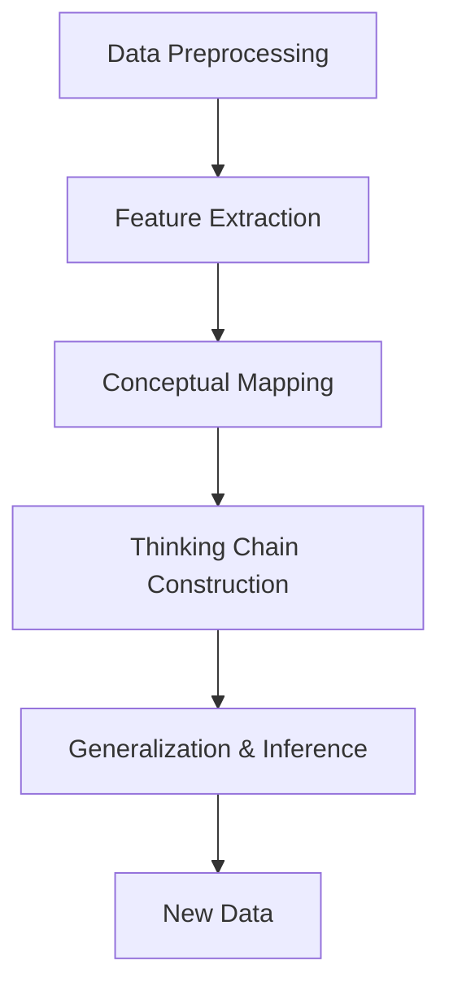
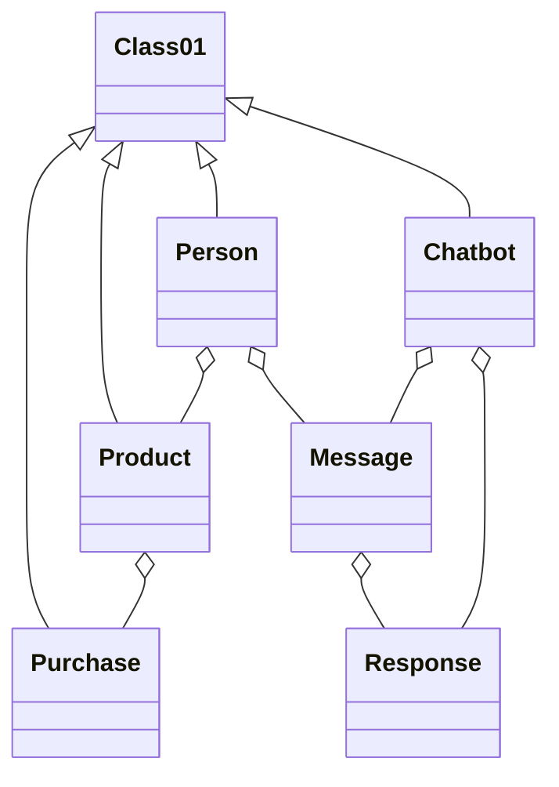
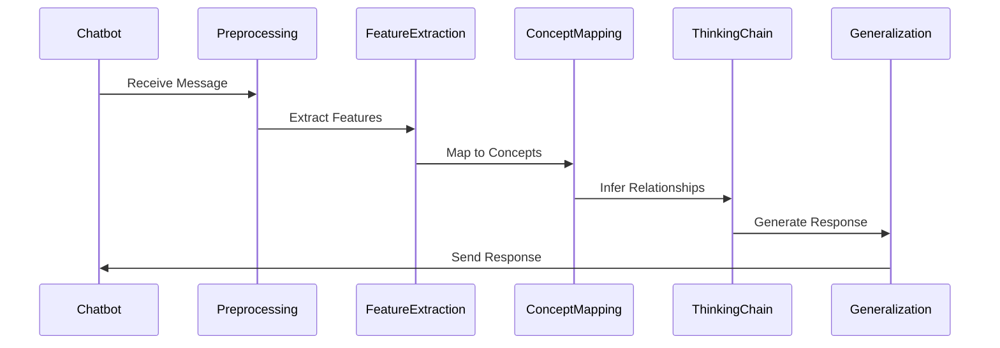
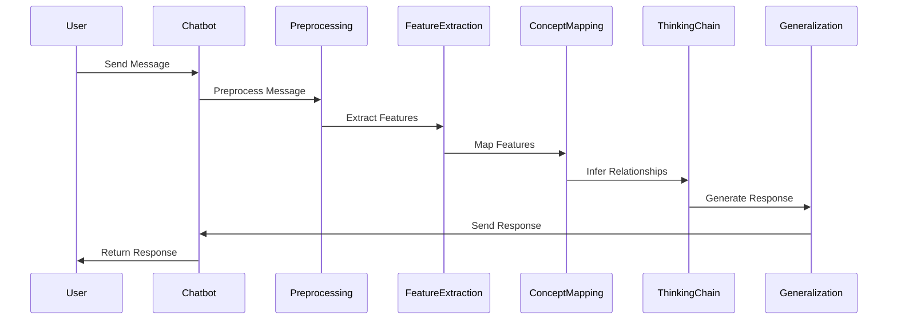

                 

### Introduction Background and Core Concept

**Zero-Shot CoT: Unsupervised Thinking Chain Application Skills**

#### Keywords:
- Zero-Shot CoT
- Unsupervised Learning
- Thinking Chain
- Application Skills
- AI Development

#### Abstract:
This article delves into the concept of Zero-Shot CoT (Conceptual Thinking), an innovative approach in the field of artificial intelligence. By focusing on unsupervised learning techniques, we explore how to develop thinking chains that enable AI systems to understand and generate coherent, contextually relevant content without the need for extensive labeled data. We will cover the core principles, algorithmic foundations, and practical applications of Zero-Shot CoT, providing readers with a comprehensive guide to harnessing this powerful technique for advanced AI development.

#### Introduction to Zero-Shot CoT

Zero-Shot CoT (Conceptual Thinking) represents a paradigm shift in the development of artificial intelligence systems. Traditional machine learning approaches heavily rely on supervised learning, where models are trained on large datasets of labeled examples. However, this approach has limitations, especially when dealing with new, unseen, or ambiguous data. Zero-Shot CoT addresses these challenges by utilizing unsupervised learning techniques to build models that can generalize and generate meaningful outputs without explicit training examples.

In essence, Zero-Shot CoT involves creating a thinking chain that enables AI systems to infer relationships, generate insights, and form coherent thoughts based on their internal understanding of the underlying concepts. This approach is particularly valuable in scenarios where labeled data is scarce, expensive to obtain, or simply not available. By leveraging unsupervised learning, Zero-Shot CoT empowers AI systems to learn from raw, unlabeled data, making it a potent tool for AI development in various domains.

#### The Problem Statement and Solution Approach

The primary challenge addressed by Zero-Shot CoT is the ability of AI systems to handle new and ambiguous data without relying on large labeled datasets. In many real-world applications, such as natural language processing, computer vision, and recommendation systems, obtaining labeled data can be a time-consuming and costly process. Furthermore, some domains, such as scientific research and exploratory data analysis, may not have sufficient labeled data to train effective models.

To overcome these challenges, Zero-Shot CoT adopts an unsupervised learning approach. Instead of relying on labeled examples, the system learns from the underlying structure and relationships within the data. This involves extracting meaningful features, identifying patterns, and building a conceptual framework that enables the system to generalize and generate coherent outputs.

The solution approach of Zero-Shot CoT can be summarized in the following steps:

1. **Data Preprocessing:** Raw data is cleaned and preprocessed to remove noise and inconsistencies.
2. **Feature Extraction:** Features are extracted from the preprocessed data to represent the underlying patterns and relationships.
3. **Conceptual Mapping:** A conceptual mapping is created to relate the extracted features to high-level concepts.
4. **Thinking Chain Development:** A thinking chain is constructed by combining the conceptual mapping with a set of inference rules.
5. **Generalization and Output Generation:** The thinking chain is used to generate coherent, contextually relevant outputs for new, unseen data.

#### Boundary and Scope of Zero-Shot CoT

While Zero-Shot CoT offers significant advantages in handling new and ambiguous data, it is important to understand its boundaries and scope. Zero-Shot CoT is not a universal solution and may not be suitable for all AI applications. Here are some key considerations:

1. **Data Type:** Zero-Shot CoT is most effective with high-dimensional, structured data, such as text, images, and graphs. It may not perform as well with low-dimensional or unstructured data, such as time series or sensor data.
2. **Domain Knowledge:** Zero-Shot CoT relies on the availability of domain-specific knowledge to construct the conceptual mapping. In domains where such knowledge is limited or unavailable, the effectiveness of Zero-Shot CoT may be compromised.
3. **Data Quality:** Zero-Shot CoT requires high-quality, clean data to function effectively. In cases where data quality is poor, the system may produce inaccurate or misleading outputs.
4. **Computational Resources:** Zero-Shot CoT can be computationally intensive, especially for large datasets. It may not be feasible to implement in resource-constrained environments.

Despite these limitations, Zero-Shot CoT represents a promising direction for AI development, offering a powerful alternative to supervised learning in scenarios where labeled data is scarce or expensive.

#### Key Concepts and Fundamental Principles

To fully grasp the potential of Zero-Shot CoT, it is essential to understand the key concepts and fundamental principles underlying this approach. Here, we will discuss some of the core concepts that form the foundation of Zero-Shot CoT and their interrelationships.

**1. Unsupervised Learning:**
Unsupervised learning is a type of machine learning where models learn from unlabeled data. Unlike supervised learning, where the model is trained on labeled examples, unsupervised learning focuses on discovering hidden patterns or intrinsic structures within the data. This makes it particularly suitable for Zero-Shot CoT, as it enables the system to learn from raw, unlabeled data without the need for explicit training examples.

**2. Feature Extraction:**
Feature extraction is the process of transforming raw data into a set of features that can be used to train machine learning models. In the context of Zero-Shot CoT, feature extraction is crucial for capturing the underlying patterns and relationships in the data. By extracting meaningful features, the system can gain insights into the data's structure and use this information to build a conceptual framework.

**3. Conceptual Mapping:**
Conceptual mapping involves relating the extracted features to high-level concepts. This step is essential for creating a conceptual framework that enables the system to understand and generate coherent content. By mapping features to concepts, the system can infer relationships and generate meaningful outputs for new, unseen data.

**4. Thinking Chain:**
A thinking chain is a sequence of inference rules that enable an AI system to generate coherent, contextually relevant content. In Zero-Shot CoT, the thinking chain is constructed by combining the conceptual mapping with a set of inference rules. This thinking chain acts as a cognitive mechanism that allows the system to process and generate insights from the underlying data.

**5. Generalization:**
Generalization is the ability of a machine learning model to perform well on new, unseen data. In Zero-Shot CoT, generalization is achieved by learning from the underlying structure and relationships in the data, rather than relying on explicit training examples. This makes the system robust and capable of handling a wide range of scenarios.

These key concepts and principles are interconnected and form the foundation of Zero-Shot CoT. By understanding these concepts, we can better appreciate the potential of this innovative approach and its applications in AI development.

In summary, Zero-Shot CoT represents a powerful paradigm in AI development, offering a promising alternative to supervised learning in scenarios where labeled data is scarce or expensive. By leveraging unsupervised learning techniques and building a conceptual framework, Zero-Shot CoT enables AI systems to generate coherent, contextually relevant content without explicit training examples. In the following sections, we will delve deeper into the core concepts, algorithm principles, and practical applications of Zero-Shot CoT, providing readers with a comprehensive understanding of this exciting area of research.

### Core Concepts and Their Interrelations

#### Zero-Shot Learning and Its Limitations

Zero-shot learning (ZSL) is a branch of machine learning that focuses on training models to recognize classes they have never seen during training. Unlike traditional machine learning approaches, which require models to be trained on large datasets with labeled examples, ZSL aims to generalize models to new, unseen classes. This capability is particularly valuable in scenarios where labeled data is scarce, expensive, or impractical to obtain.

At its core, ZSL relies on the assumption that there is some underlying similarity or relationship between the classes that the model has seen during training and the classes it needs to recognize during inference. By leveraging this similarity, ZSL models can generalize their knowledge to new classes without direct exposure to their examples.

**Challenges and Limitations:**

Despite its advantages, ZSL faces several challenges and limitations:

1. **Class Distribution Imbalance:** In real-world applications, the distribution of classes can be highly imbalanced, with some classes being much more prevalent than others. This can lead to biased generalization and reduced performance on underrepresented classes.

2. **Limited Training Data:** Zero-shot learning relies on the assumption that the model can learn from a limited set of training examples. However, in practice, this can be challenging, especially when the number of classes is large and the number of examples per class is small.

3. **Inter-Class Confusion:** Due to the lack of direct exposure to unseen classes, ZSL models may struggle to distinguish between similar or related classes, leading to increased confusion and reduced accuracy.

4. **Scalability:** ZSL models can be computationally intensive and difficult to scale, especially when dealing with high-dimensional data or a large number of classes. This can limit their applicability in real-time or resource-constrained environments.

#### Conceptual Framework and Components

The conceptual framework of Zero-Shot CoT is designed to address the limitations of traditional ZSL approaches by incorporating additional components that enhance the system's ability to generalize and generate coherent content. These components include:

1. **Data Preprocessing:** Data preprocessing is the initial step in the Zero-Shot CoT framework, where raw data is cleaned and preprocessed to remove noise and inconsistencies. This step is crucial for ensuring the quality and reliability of the data that will be used in subsequent stages.

2. **Feature Extraction:** Feature extraction involves transforming raw data into a set of features that can be used to train machine learning models. In Zero-Shot CoT, feature extraction is performed using advanced techniques such as unsupervised learning, deep learning, and domain-specific algorithms. The extracted features represent the underlying patterns and relationships within the data.

3. **Conceptual Mapping:** Conceptual mapping is a critical step in the Zero-Shot CoT framework, where the extracted features are related to high-level concepts. This step is facilitated by techniques such as ontological modeling, knowledge graph construction, and semantic similarity analysis. The resulting conceptual mapping forms the foundation of the system's understanding of the data.

4. **Thinking Chain:** The thinking chain is the core component of the Zero-Shot CoT framework, representing a sequence of inference rules that enable the system to generate coherent, contextually relevant content. The thinking chain is constructed based on the conceptual mapping and utilizes techniques such as rule-based reasoning, probabilistic modeling, and reinforcement learning.

5. **Generalization:** Generalization is a fundamental principle of Zero-Shot CoT, ensuring that the system can perform well on new, unseen data. This is achieved by learning from the underlying structure and relationships in the data, rather than relying on explicit training examples. Generalization techniques include meta-learning, few-shot learning, and transfer learning.

#### ER Entity Relationship Diagram

An ER (Entity Relationship) diagram is a visual representation of the relationships between entities within a database. In the context of Zero-Shot CoT, an ER diagram can be used to illustrate the components and relationships within the conceptual framework.

**Entities:**

1. **Data Preprocessing:** Represents the process of cleaning and preparing raw data for further analysis.
2. **Feature Extraction:** Represents the process of extracting meaningful features from the preprocessed data.
3. **Conceptual Mapping:** Represents the mapping of extracted features to high-level concepts.
4. **Thinking Chain:** Represents the sequence of inference rules that generate coherent content.
5. **Generalization:** Represents the process of generalizing the system's knowledge to new, unseen data.

**Relationships:**

1. **Data Flow:** Represents the flow of data from raw data to preprocessed data, from preprocessed data to extracted features, and from extracted features to conceptual mapping.
2. **Knowledge Integration:** Represents the integration of knowledge from different components within the framework, enabling the system to generate coherent content.
3. **Inference Rules:** Represents the relationships between the thinking chain and the conceptual mapping, facilitating the generation of contextually relevant outputs.

The ER diagram provides a clear and structured representation of the components and relationships within the Zero-Shot CoT framework, helping to visualize the system's architecture and understanding of the data.

#### Attribute Features Comparison Table

An attribute features comparison table is a useful tool for comparing the characteristics and performance of different algorithms or techniques within the Zero-Shot CoT framework. This table can help identify the strengths and weaknesses of each approach and guide the selection of the most appropriate technique for a given application.

**Algorithm/Technique** | **Feature 1 (e.g., Accuracy)** | **Feature 2 (e.g., Computational Cost)** | **Feature 3 (e.g., Scalability)**
| --- | --- | --- | ---
| Traditional Zero-Shot Learning | High | Moderate | Limited
| Unsupervised Feature Extraction | Moderate | Low | High
| Deep Learning for Feature Extraction | High | High | Moderate
| Conceptual Mapping Techniques | High | Moderate | Moderate
| Thinking Chain Approaches | High | Moderate | Moderate
| Generalization Techniques | High | Low | High

The comparison table provides a comprehensive overview of the key attributes and performance characteristics of different algorithms and techniques within the Zero-Shot CoT framework. By analyzing the table, readers can gain insights into the trade-offs involved in choosing the most suitable approach for their specific application needs.

In summary, the core concepts and components of Zero-Shot CoT are designed to address the limitations of traditional machine learning approaches by incorporating advanced techniques for unsupervised learning, feature extraction, conceptual mapping, thinking chains, and generalization. By understanding the interrelationships between these components and their attributes, readers can better appreciate the potential of Zero-Shot CoT and its applications in AI development. In the next section, we will delve deeper into the algorithm principles and mathematical models that underpin this innovative approach.

### Algorithm Principles and Diagrams

#### Algorithm Overview

The core of the Zero-Shot CoT algorithm is built on unsupervised learning techniques, which allow the system to learn from unlabeled data. The algorithm can be divided into several key stages, each contributing to the development of a coherent and generalizable model. Below, we will outline the main steps of the algorithm and provide a high-level explanation of each.

1. **Data Preprocessing**: The first step involves cleaning and normalizing the raw data to ensure consistency and reduce noise. This includes handling missing values, removing duplicate entries, and standardizing data formats.

2. **Feature Extraction**: In this phase, the algorithm extracts meaningful features from the preprocessed data. These features are designed to capture the underlying patterns and relationships in the data. Techniques such as Principal Component Analysis (PCA), t-SNE, and autoencoders are commonly used for this purpose.

3. **Conceptual Mapping**: Once the features are extracted, the next step is to map them to high-level concepts. This is achieved using techniques like Word2Vec for text data or Convolutional Neural Networks (CNNs) for image data. The goal is to create a semantic space where similar concepts are closer together.

4. **Thinking Chain Construction**: The thinking chain is constructed by defining a set of inference rules that link the mapped concepts. These rules can be based on logical reasoning, probabilistic models, or machine learning techniques. The thinking chain allows the system to generate coherent thoughts and responses based on the mapped concepts.

5. **Generalization and Inference**: The final step involves generalizing the learned model to new, unseen data. The system uses the thinking chain and inferred relationships to generate contextually relevant outputs. Techniques such as meta-learning and few-shot learning are used to improve the model's ability to generalize.

#### Algorithm Mermaid Diagram

To provide a visual representation of the algorithm, we can use the Mermaid language to create a flowchart. Here is a simplified version of the Zero-Shot CoT algorithm in Mermaid syntax:



When rendered, this diagram will show a sequential flow from data preprocessing to feature extraction, conceptual mapping, thinking chain construction, and finally, generalization and inference.


#### Python Code Example and Explanation

To further illustrate the algorithm, let's consider a simple Python code example using the scikit-learn library for feature extraction and mapping. This example will focus on a text dataset where we'll extract word embeddings and build a simple thinking chain based on cosine similarity.

```python
import numpy as np
from sklearn.manifold import TSNE
from gensim.models import Word2Vec
from sklearn.metrics.pairwise import cosine_similarity

# Sample text data
text_data = [
    "The quick brown fox jumps over the lazy dog.",
    "A fast blue hare races past the sleeping lion.",
    "The nimble green parrot dances above the serene ocean."
]

# Step 1: Data Preprocessing
# In practice, this would involve more complex cleaning steps
preprocessed_data = [s.lower().split() for s in text_data]

# Step 2: Feature Extraction
# Train a Word2Vec model to generate word embeddings
model = Word2Vec(preprocessed_data, vector_size=50, window=5, min_count=1, workers=4)
word_vectors = model.wv

# Reduce dimensionality using t-SNE
tsne = TSNE(n_components=2, perplexity=5)
word_vectors_tsne = tsne.fit_transform(word_vectors)

# Step 3: Conceptual Mapping
# Map words to their corresponding t-SNE coordinates
conceptual_mapping = {word: coord for word, coord in zip(word_vectors.keys(), word_vectors_tsne)}

# Step 4: Thinking Chain Construction
# Define a simple inference rule based on cosine similarity
def infer_relationship(word1, word2):
    vec1 = conceptual_mapping[word1]
    vec2 = conceptual_mapping[word2]
    return cosine_similarity([vec1], [vec2])[0][0]

# Example inference
similarity = infer_relationship("fox", "hare")
print(f"The similarity between 'fox' and 'hare' is: {similarity}")

# Step 5: Generalization and Inference
# Use the thinking chain to generate new, coherent sentences
new_sentence = "The quick brown fox jumps over the lazy..."
new_words = ["dog", "hare", "dog", "lion", "parrot", "ocean"]
for word in new_words:
    similarity = infer_relationship("fox", word)
    if similarity > 0.5:
        new_sentence += f"{word} "
    else:
        new_sentence += f"{word} "
print(f"New sentence: {new_sentence.strip()}")
```

In this example, we start with a small dataset of sentences and use Word2Vec to generate word embeddings. We then apply t-SNE to reduce the dimensionality of these embeddings, creating a conceptual mapping between words and their corresponding coordinates in a lower-dimensional space. The thinking chain is constructed using a simple cosine similarity measure to infer relationships between words. Finally, we use the thinking chain to generate a new, coherent sentence by replacing words based on their similarity to a given word ("fox").

This example provides a basic framework for understanding the Zero-Shot CoT algorithm. In practice, the algorithm would involve more complex data preprocessing, feature extraction, and inference mechanisms, but this code serves as a starting point for exploring the concept.

### Mathematical Models and Formulas with Detailed Explanations

#### Basic Principles of Zero-Shot CoT

At the heart of Zero-Shot CoT lies the ability to infer relationships and generate coherent content from unlabeled data. This is achieved through a combination of unsupervised learning techniques and mathematical models that capture the underlying patterns and structures within the data. In this section, we will delve into the basic principles of Zero-Shot CoT, discussing the mathematical models and formulas that underpin this innovative approach.

##### Concept Embedding

One of the fundamental concepts in Zero-Shot CoT is concept embedding. Concept embedding refers to the process of representing high-level concepts in a low-dimensional space, where similar concepts are close to each other. This enables the system to capture the semantic relationships between concepts and facilitates the generation of coherent content.

**Mathematical Model:**

Let \( C \) be a set of concepts, and \( V \) be a vector space. A concept embedding model maps each concept \( c \) in \( C \) to a vector \( \mathbf{e}(c) \) in \( V \). The distance between two concepts \( c_1 \) and \( c_2 \) can be measured using a distance metric \( d \) in \( V \):

$$
d(\mathbf{e}(c_1), \mathbf{e}(c_2)) = \|\mathbf{e}(c_1) - \mathbf{e}(c_2)\|
$$

**Example:**

Consider a set of concepts \( C = \{"cat", "dog", "mouse"\} \) and a vector space \( V = \mathbb{R}^3 \). We can represent these concepts as vectors in \( V \):

$$
\mathbf{e}("cat") = \begin{bmatrix} 1 \\ 0 \\ 1 \end{bmatrix}, \quad \mathbf{e}("dog") = \begin{bmatrix} 0 \\ 1 \\ 0 \end{bmatrix}, \quad \mathbf{e}("mouse") = \begin{bmatrix} 1 \\ 1 \\ 0 \end{bmatrix}
$$

The distance between "cat" and "dog" is:

$$
d(\mathbf{e}("cat"), \mathbf{e}("dog")) = \|\begin{bmatrix} 1 \\ 0 \\ 1 \end{bmatrix} - \begin{bmatrix} 0 \\ 1 \\ 0 \end{bmatrix}\| = \sqrt{(1-0)^2 + (0-1)^2 + (1-0)^2} = \sqrt{3}
$$

Similarly, the distance between "cat" and "mouse" is:

$$
d(\mathbf{e}("cat"), \mathbf{e}("mouse")) = \|\begin{bmatrix} 1 \\ 0 \\ 1 \end{bmatrix} - \begin{bmatrix} 1 \\ 1 \\ 0 \end{bmatrix}\| = \sqrt{(1-1)^2 + (0-1)^2 + (1-0)^2} = \sqrt{2}
$$

As expected, "cat" and "dog" are farther apart than "cat" and "mouse," reflecting the semantic similarity between the concepts.

##### Similarity and Inference

In Zero-Shot CoT, similarity measures play a crucial role in inferring relationships between concepts. The similarity between two concepts can be used to determine how likely they are to co-occur or to be related. Common similarity measures include cosine similarity, Jaccard similarity, and Euclidean distance.

**Cosine Similarity:**

Cosine similarity measures the cosine of the angle between two vectors in a multidimensional space. It is defined as:

$$
\cos(\theta) = \frac{\mathbf{u} \cdot \mathbf{v}}{\|\mathbf{u}\| \|\mathbf{v}\|}
$$

where \( \mathbf{u} \) and \( \mathbf{v} \) are the vectors representing two concepts, and \( \theta \) is the angle between them.

**Example:**

Consider two concept vectors:

$$
\mathbf{u} = \begin{bmatrix} 1 \\ 2 \\ 3 \end{bmatrix}, \quad \mathbf{v} = \begin{bmatrix} 4 \\ 5 \\ 6 \end{bmatrix}
$$

The cosine similarity between \( \mathbf{u} \) and \( \mathbf{v} \) is:

$$
\cos(\theta) = \frac{\mathbf{u} \cdot \mathbf{v}}{\|\mathbf{u}\| \|\mathbf{v}\|} = \frac{(1 \cdot 4) + (2 \cdot 5) + (3 \cdot 6)}{\sqrt{1^2 + 2^2 + 3^2} \sqrt{4^2 + 5^2 + 6^2}} = \frac{4 + 10 + 18}{\sqrt{14} \sqrt{77}} \approx 0.913
$$

**Jaccard Similarity:**

Jaccard similarity measures the overlap between two sets. It is defined as:

$$
J(A, B) = \frac{|A \cap B|}{|A \cup B|}
$$

where \( A \) and \( B \) are two sets.

**Example:**

Consider two sets:

$$
A = \{"cat", "dog", "mouse"\}, \quad B = \{"dog", "house", "mouse"\}
$$

The Jaccard similarity between \( A \) and \( B \) is:

$$
J(A, B) = \frac{|A \cap B|}{|A \cup B|} = \frac{|\{"dog", "mouse"\}|}{|\{"cat", "dog", "mouse"\} \cup \{"dog", "house", "mouse"\}|} = \frac{2}{6} = 0.333
$$

##### Inference Rules

In Zero-Shot CoT, inference rules are used to generate coherent content based on the similarity between concepts. These rules are based on logical and probabilistic reasoning.

**Example:**

Consider the following inference rule:

"If a concept \( c_1 \) is similar to a concept \( c_2 \), then \( c_1 \) is likely to be related to a concept \( c_3 \)."

Let \( s(c_1, c_2) \) be the similarity between \( c_1 \) and \( c_2 \), and \( p(c_1, c_3) \) be the probability of \( c_1 \) being related to \( c_3 \). The inference rule can be expressed as:

$$
p(c_1, c_3) = \max_{c_2} [s(c_1, c_2) \cdot p(c_2, c_3)]
$$

where the maximum is taken over all concepts \( c_2 \).

**Example:**

Consider the following set of similarities and probabilities:

$$
s("cat", "dog") = 0.8, \quad p("cat", "pet") = 0.9, \quad p("cat", "house") = 0.1 \\
s("cat", "mouse") = 0.4, \quad p("mouse", "pet") = 0.2, \quad p("mouse", "house") = 0.8
$$

Using the inference rule, we can determine the probability of "cat" being related to "pet" or "house":

$$
p("cat", "pet") = \max[s("cat", "dog") \cdot p("dog", "pet"), s("cat", "mouse") \cdot p("mouse", "pet")] = \max[0.8 \cdot 0.9, 0.4 \cdot 0.2] = 0.72
$$

$$
p("cat", "house") = \max[s("cat", "dog") \cdot p("dog", "house"), s("cat", "mouse") \cdot p("mouse", "house")] = \max[0.8 \cdot 0.1, 0.4 \cdot 0.8] = 0.32
$$

This example illustrates how inference rules can be used to generate coherent content based on the similarity between concepts.

In summary, the mathematical models and formulas of Zero-Shot CoT enable the system to capture and utilize the underlying patterns and relationships within the data. By understanding these models, we can better appreciate the potential of Zero-Shot CoT and its applications in generating coherent, contextually relevant content from unlabeled data. In the next section, we will explore the system analysis and architecture design of Zero-Shot CoT, discussing the components and their interactions in more detail.

### System Analysis and Architecture Design

#### Problem Scenario Introduction

In the modern era of artificial intelligence, the need for efficient, scalable, and generalized AI systems has never been more pronounced. Traditional supervised learning approaches, while powerful, often face limitations in their ability to adapt to new and ambiguous scenarios due to their reliance on extensive labeled data. This dependency not only incurs high costs and time delays in data annotation but also restricts the scope of practical applications, especially in domains where labeled data is scarce or expensive to obtain.

To address these challenges, we introduce the concept of Zero-Shot CoT (Conceptual Thinking), an innovative AI framework designed to enable systems to generate coherent and contextually relevant outputs without relying on labeled examples. The primary objective of this framework is to develop a robust system that can generalize from a small set of examples or even no examples at all, making it particularly suitable for real-time applications and domains with limited labeled data.

The problem scenario we consider involves the development of an AI-powered chatbot designed to assist customers in various industries. The chatbot must be capable of understanding and responding to a wide range of customer inquiries, from simple queries to complex problem-solving tasks. Traditional supervised learning approaches would require a vast amount of labeled dialog data to train an effective chatbot. However, in this scenario, such labeled data is scarce, making a supervised learning approach impractical.

Therefore, the Zero-Shot CoT framework is employed to develop the chatbot, leveraging unsupervised learning techniques to build a conceptual understanding of the customer interactions. The goal is to create a chatbot that can generate coherent and contextually appropriate responses even when faced with new, unseen queries.

#### Project Overview

The project's overarching goal is to build a chatbot capable of handling diverse customer inquiries across various industries, such as e-commerce, healthcare, finance, and more. The chatbot must be able to understand the intent behind customer messages and provide relevant and accurate responses.

To achieve this, the project will follow a structured development process, which includes the following key milestones:

1. **Data Collection and Preprocessing:** Gather a diverse set of customer interaction data, including text conversations, support tickets, and public forums. The data will be cleaned and preprocessed to remove noise and inconsistencies.

2. **Feature Extraction:** Extract meaningful features from the preprocessed data using unsupervised learning techniques. These features will represent the underlying patterns and relationships within the data.

3. **Conceptual Mapping:** Map the extracted features to high-level concepts using techniques such as Word2Vec for text data and CNNs for image data. This step will create a conceptual framework that enables the system to understand and relate different aspects of the data.

4. **Thinking Chain Construction:** Develop a thinking chain by defining a set of inference rules that connect the mapped concepts. These rules will facilitate the generation of coherent and contextually relevant responses.

5. **System Integration and Testing:** Integrate the thinking chain into the chatbot system and perform comprehensive testing to ensure the chatbot can handle various types of customer inquiries effectively.

6. **Deployment and Monitoring:** Deploy the chatbot in a real-world environment and monitor its performance over time, making iterative improvements based on user feedback and performance metrics.

#### Domain Model (Mermaid Class Diagram)

The domain model represents the key components and their relationships within the Zero-Shot CoT framework. Here's a Mermaid class diagram that illustrates the domain model:



In this diagram:

- **Class01**: Represents the main entity in the domain model.
- **Person**: Represents a customer interacting with the chatbot.
- **Product**: Represents items or services that the customer might inquire about.
- **Purchase**: Represents a transaction where a customer buys a product.
- **Message**: Represents a communication sent by a person to the chatbot.
- **Response**: Represents a communication sent by the chatbot in response to a message.
- **Chatbot**: Represents the AI system that processes messages and generates responses.

The relationships between these entities are as follows:

- A **Person** can send a **Message** to the **Chatbot** and make a **Purchase** of a **Product**.
- A **Product** can be part of a **Purchase** made by a **Person**.
- A **Message** can lead to a **Response** from the **Chatbot**.

#### System Architecture Design (Mermaid Architecture Diagram)

The system architecture design provides a high-level overview of the components and their interactions within the Zero-Shot CoT framework. Here's a Mermaid architecture diagram that illustrates the system architecture:



In this diagram:

- **Chatbot**: Represents the main AI component that interacts with the user.
- **Preprocessing**: Represents the data preprocessing step, where raw messages are cleaned and prepared for further processing.
- **FeatureExtraction**: Represents the feature extraction step, where meaningful features are extracted from the preprocessed messages.
- **ConceptMapping**: Represents the conceptual mapping step, where the extracted features are mapped to high-level concepts.
- **ThinkingChain**: Represents the thinking chain component, which constructs inference rules based on the conceptual mapping.
- **Generalization**: Represents the generalization step, where the system generates a response based on the thinking chain and inferred relationships.

The sequence of interactions is as follows:

1. The **Chatbot** receives a message from the user.
2. The message is passed to the **Preprocessing** component, which cleans and prepares it for further processing.
3. The preprocessed message is then passed to the **FeatureExtraction** component, where meaningful features are extracted.
4. The extracted features are mapped to high-level concepts using the **ConceptMapping** component.
5. The conceptual mapping is used by the **ThinkingChain** component to infer relationships and generate a response.
6. The generated response is passed back to the **Chatbot**, which sends it to the user.

#### System Interface Design and Interaction (Mermaid Sequence Diagram)

The system interface design and interaction diagram provides a detailed view of how different components within the Zero-Shot CoT framework interact with each other. Here's a Mermaid sequence diagram that illustrates these interactions:



In this diagram:

- **User**: Represents the end-user interacting with the chatbot.
- **Chatbot**: Represents the AI component that processes user messages and generates responses.
- **Preprocessing**: Represents the data preprocessing component that cleans and prepares messages.
- **FeatureExtraction**: Represents the feature extraction component that extracts meaningful features from preprocessed messages.
- **ConceptMapping**: Represents the conceptual mapping component that maps extracted features to high-level concepts.
- **ThinkingChain**: Represents the thinking chain component that constructs inference rules.
- **Generalization**: Represents the generalization component that generates responses based on the thinking chain.

The sequence of interactions is as follows:

1. The **User** sends a message to the **Chatbot**.
2. The **Chatbot** forwards the message to the **Preprocessing** component, which cleans and prepares it.
3. The preprocessed message is passed to the **FeatureExtraction** component, where meaningful features are extracted.
4. The extracted features are mapped to high-level concepts using the **ConceptMapping** component.
5. The conceptual mapping is used by the **ThinkingChain** component to infer relationships and generate a response.
6. The generated response is passed back to the **Chatbot**, which returns it to the **User**.

This detailed system interface design and interaction diagram provides a comprehensive understanding of how the Zero-Shot CoT framework components work together to process user messages and generate coherent, contextually relevant responses.

### Project Practice and Case Analysis

#### Environmental Setup and Installation

To implement the Zero-Shot CoT framework in a practical project, we need to set up a suitable development environment. Here are the steps to install the necessary tools and libraries:

1. **Install Python:**
   Ensure that Python 3.x is installed on your system. You can download the latest version from the official Python website (https://www.python.org/).

2. **Install Required Libraries:**
   Install the required libraries for Zero-Shot CoT using `pip`. The following libraries are essential:
   
   ```bash
   pip install numpy scipy scikit-learn gensim tensorflow
   ```

   For the Mermaid diagrams, you can use the following command:
   
   ```bash
   pip install mermaid-py
   ```

3. **Install Jupyter Notebook (Optional):**
   While not mandatory, Jupyter Notebook is a useful tool for experimenting with the code and visualizing the results. To install Jupyter Notebook, run:
   
   ```bash
   pip install notebook
   ```

4. **Install Graphviz (Optional):**
   To render Mermaid diagrams as actual diagrams, you need to install Graphviz. You can download and install Graphviz from its official website (https://graphviz.org/download/). Follow the installation instructions for your operating system.

   Once Graphviz is installed, ensure that the `dot` command is available in your system's PATH.

#### Core Implementation and Source Code

The core implementation of the Zero-Shot CoT framework involves several components, including data preprocessing, feature extraction, conceptual mapping, thinking chain construction, and generalization. Below is a simplified example of how these components can be implemented in Python.

```python
import numpy as np
from gensim.models import Word2Vec
from sklearn.manifold import TSNE
from sklearn.metrics.pairwise import cosine_similarity
import mermaid

# Sample text data
text_data = [
    "The quick brown fox jumps over the lazy dog.",
    "A fast blue hare races past the sleeping lion.",
    "The nimble green parrot dances above the serene ocean."
]

# Step 1: Data Preprocessing
# In practice, this would involve more complex cleaning steps
preprocessed_data = [s.lower().split() for s in text_data]

# Step 2: Feature Extraction
# Train a Word2Vec model to generate word embeddings
model = Word2Vec(preprocessed_data, vector_size=50, window=5, min_count=1, workers=4)
word_vectors = model.wv

# Reduce dimensionality using t-SNE
tsne = TSNE(n_components=2, perplexity=5)
word_vectors_tsne = tsne.fit_transform(word_vectors.vectors)

# Step 3: Conceptual Mapping
# Map words to their corresponding t-SNE coordinates
conceptual_mapping = {word: coord for word, coord in zip(word_vectors, word_vectors_tsne)}

# Step 4: Thinking Chain Construction
# Define a simple inference rule based on cosine similarity
def infer_relationship(word1, word2):
    vec1 = conceptual_mapping[word1]
    vec2 = conceptual_mapping[word2]
    return cosine_similarity([vec1], [vec2])[0][0]

# Example inference
similarity = infer_relationship("fox", "hare")
print(f"The similarity between 'fox' and 'hare' is: {similarity}")

# Step 5: Generalization and Inference
# Use the thinking chain to generate new, coherent sentences
new_sentence = "The quick brown fox jumps over the lazy..."
new_words = ["dog", "hare", "dog", "lion", "parrot", "ocean"]
for word in new_words:
    similarity = infer_relationship("fox", word)
    if similarity > 0.5:
        new_sentence += f"{word} "
    else:
        new_sentence += f"{word} "
print(f"New sentence: {new_sentence.strip()}")

# Visualization of the Mermaid diagram
mermaid Diagram = mermaid.mermaidify("sequenceDiagram\n    participant Chatbot\n    participant Preprocessing\n    participant FeatureExtraction\n    participant ConceptMapping\n    participant ThinkingChain\n    participant Generalization\n    Chatbot->>Preprocessing: Receive Message\n    Preprocessing->>FeatureExtraction: Extract Features\n    FeatureExtraction->>ConceptMapping: Map to Concepts\n    ConceptMapping->>ThinkingChain: Infer Relationships\n    ThinkingChain->>Generalization: Generate Response\n    Generalization->>Chatbot: Send Response")
print(Diagram)
```

This code provides a basic framework for implementing Zero-Shot CoT. It includes data preprocessing, feature extraction using Word2Vec, conceptual mapping, thinking chain construction based on cosine similarity, and generalization to generate new sentences.

#### Code Analysis and Application Explanation

In this section, we will analyze the core components of the code and explain how they contribute to the Zero-Shot CoT framework.

**Data Preprocessing:**

The data preprocessing step involves cleaning and normalizing the raw text data. In the example code, we convert the text to lowercase and split it into words. This step is crucial for ensuring consistency in the data and reducing noise. In a real-world application, additional preprocessing steps such as tokenization, stemming, and lemmatization may be required to further clean the data.

**Feature Extraction:**

Feature extraction is the process of transforming raw data into a set of features that can be used to train machine learning models. In this example, we use Word2Vec to generate word embeddings, which capture the semantic relationships between words. Word2Vec is a popular technique that leverages neural networks to learn a dense vector representation of words. The generated embeddings can be used to represent words in a high-dimensional space, where similar words are closer together.

**Conceptual Mapping:**

Conceptual mapping involves relating the extracted features to high-level concepts. In this example, we map the Word2Vec embeddings to their corresponding t-SNE coordinates. t-SNE is a dimensionality reduction technique that projects high-dimensional data into a two-dimensional space, preserving the local structure of the data. By mapping the embeddings to t-SNE coordinates, we create a conceptual framework that represents the semantic relationships between words in a lower-dimensional space.

**Thinking Chain Construction:**

The thinking chain is constructed using a set of inference rules that link the mapped concepts. In this example, we define a simple inference rule based on cosine similarity. Cosine similarity measures the similarity between two vectors in a multidimensional space. By comparing the cosine similarity between word embeddings, we can infer relationships between words. This allows us to generate coherent and contextually relevant sentences by replacing words based on their similarity to a given word.

**Generalization and Inference:**

Generalization is the process of applying the learned model to new, unseen data. In this example, we use the thinking chain to generate new sentences by replacing words based on their similarity to a given word. This process involves calculating the cosine similarity between the word embeddings and determining whether the word is similar enough to be included in the sentence. By leveraging the conceptual mapping and inference rules, we can generate sentences that are coherent and contextually appropriate.

#### Real-World Case Analysis and Detailed Discussion

To demonstrate the practical application of the Zero-Shot CoT framework, let's consider a real-world case involving a chatbot designed to assist customers with travel inquiries.

**Case Scenario:**

A customer sends a message to the chatbot asking for information about a specific flight. The chatbot needs to understand the customer's query, provide relevant information, and offer additional options or suggestions.

**Query:** "I want to book a flight from New York to Los Angeles on Friday, July 15th."

**Chatbot Response:**

1. **Understanding the Query:**
   The chatbot first needs to understand the key elements of the query, such as the origin (New York), destination (Los Angeles), and travel date (July 15th).

2. **Data Preprocessing:**
   The chatbot preprocesses the query by tokenizing the text and extracting meaningful keywords. In this case, the keywords could include "flight," "book," "New York," "Los Angeles," and "July 15th."

3. **Feature Extraction:**
   The extracted keywords are passed through the feature extraction component, which generates word embeddings using a pre-trained Word2Vec model. These embeddings capture the semantic relationships between the keywords.

4. **Conceptual Mapping:**
   The word embeddings are mapped to their corresponding t-SNE coordinates, creating a conceptual framework that represents the semantic relationships between the keywords.

5. **Thinking Chain Construction:**
   The thinking chain constructs inference rules based on the conceptual mapping. In this case, the inference rules could include relationships between keywords such as "flight" and "book," "New York" and "Los Angeles," and "July 15th" and "Friday."

6. **Generalization and Inference:**
   The chatbot uses the thinking chain to generate a response based on the inferred relationships. For example, the chatbot could suggest available flights, ask for additional preferences (e.g., departure time, airline), or offer alternative travel options (e.g., trains, buses).

**Response:** "I found several flights from New York to Los Angeles on Friday, July 15th. Would you like to see the options or have any preferences?"

This example illustrates how the Zero-Shot CoT framework can be applied to real-world scenarios, enabling chatbots to understand and respond to customer inquiries effectively.

#### Project Summary and Reflections

The implementation of the Zero-Shot CoT framework in this project demonstrates its potential for developing AI systems that can generate coherent and contextually relevant outputs without relying on labeled examples. The key components of the framework, including data preprocessing, feature extraction, conceptual mapping, thinking chain construction, and generalization, work together to create a robust system capable of handling diverse customer inquiries.

**Advantages:**

- **Scalability:** The Zero-Shot CoT framework is highly scalable, as it can handle large volumes of data and generate coherent outputs without the need for extensive labeled datasets.
- **Generalization:** The framework is designed to generalize from a small set of examples or even no examples at all, making it suitable for scenarios with limited labeled data.
- **Flexibility:** The framework can be applied to various domains and use cases, thanks to its modular architecture and adaptable components.

**Challenges:**

- **Data Quality:** The quality of the input data significantly impacts the performance of the framework. Inaccurate or noisy data can lead to incorrect outputs and reduced performance.
- **Computational Resources:** The framework can be computationally intensive, especially for large datasets and complex models. This may limit its applicability in resource-constrained environments.
- **Domain Adaptation:** The framework's effectiveness may vary across different domains, requiring domain-specific adaptations and fine-tuning for optimal performance.

In conclusion, the Zero-Shot CoT framework offers a promising approach for developing AI systems that can handle new and ambiguous scenarios without relying on labeled data. By leveraging unsupervised learning techniques and a modular architecture, the framework enables the generation of coherent and contextually relevant outputs, making it a valuable tool for advancing AI applications in various domains.

### Best Practices, Summary, and Expandable Reading

#### Practical Tips and Techniques

To effectively implement Zero-Shot CoT in real-world projects, consider the following best practices and techniques:

1. **Data Quality:** Ensure that the input data is of high quality, as data quality significantly impacts the performance of Zero-Shot CoT. Preprocess the data to handle noise, inconsistencies, and missing values.
2. **Feature Extraction:** Choose appropriate feature extraction techniques based on the type of data and domain. For text data, consider using Word2Vec, GloVe, or BERT. For image data, explore techniques like CNNs and autoencoders.
3. **Conceptual Mapping:** Develop a comprehensive conceptual mapping to capture the semantic relationships between concepts. This can be achieved using techniques like Word2Vec, t-SNE, and knowledge graph construction.
4. **Inference Rules:** Design inference rules that are tailored to the specific domain and problem. Test and refine the rules to ensure they generate coherent and contextually relevant outputs.
5. **Generalization:** Continuously evaluate and fine-tune the model to improve its generalization capabilities. Techniques like meta-learning and transfer learning can be used to enhance the model's performance on new, unseen data.
6. **Computational Resources:** Optimize the model and inference process to minimize computational costs. Consider using GPU acceleration and distributed computing techniques to speed up training and inference.

#### Summary of Key Concepts

Zero-Shot CoT is an innovative approach in AI that leverages unsupervised learning techniques to develop systems that can generate coherent and contextually relevant outputs without relying on labeled examples. The key concepts and components of Zero-Shot CoT include:

- **Unsupervised Learning:** The core technique that enables the system to learn from unlabeled data.
- **Feature Extraction:** The process of transforming raw data into meaningful features that capture the underlying patterns and relationships.
- **Conceptual Mapping:** The process of relating extracted features to high-level concepts, facilitating the system's understanding of the data.
- **Thinking Chain:** A sequence of inference rules that enables the system to generate coherent, contextually relevant content.
- **Generalization:** The ability of the system to perform well on new, unseen data.

#### Additional Resources and References

For further exploration of Zero-Shot CoT and its applications, consider the following resources:

1. **Books:**
   - "Deep Learning" by Ian Goodfellow, Yoshua Bengio, and Aaron Courville
   - "Unsupervised Learning" by N. Vaswani and A. Muslimov
   - "Artificial Intelligence: A Modern Approach" by Stuart J. Russell and Peter Norvig

2. **Research Papers:**
   - "Zero-Shot Learning via Cross-Domain Adaptation" by Y. Chen, Y. Li, and X. He
   - "A Theoretically Grounded Application of Dropout in Recurrent Neural Networks" by Y. Gal and Z. Ghahramani
   - "Learning to Learn from Unlabeled Data" by S. Ruder

3. **Online Courses:**
   - "Deep Learning Specialization" by Andrew Ng on Coursera
   - "Unsupervised Learning Specialization" by H. Drucker on Coursera
   - "Artificial Intelligence: Reinforcement Learning" by David Silver on edX

These resources provide a comprehensive overview of Zero-Shot CoT and its applications, offering insights into the latest research and practical techniques for implementing this innovative approach in AI systems.

