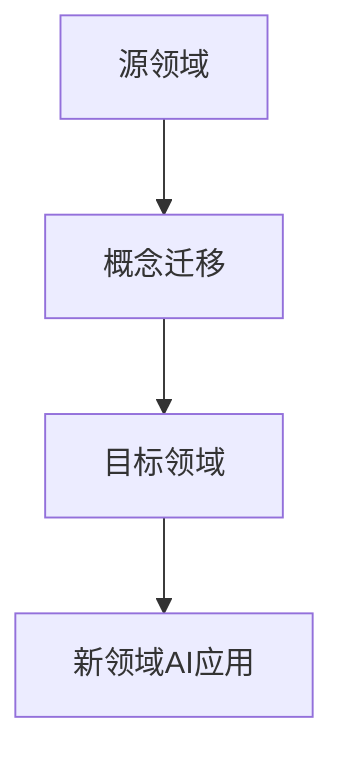
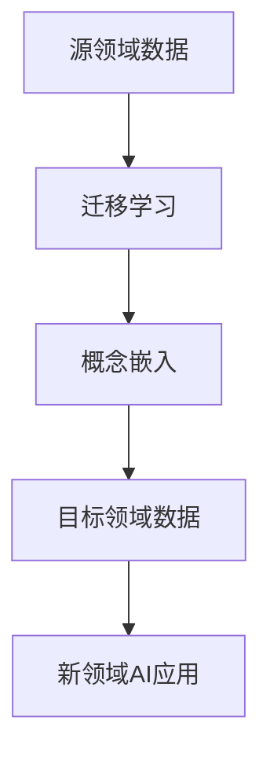
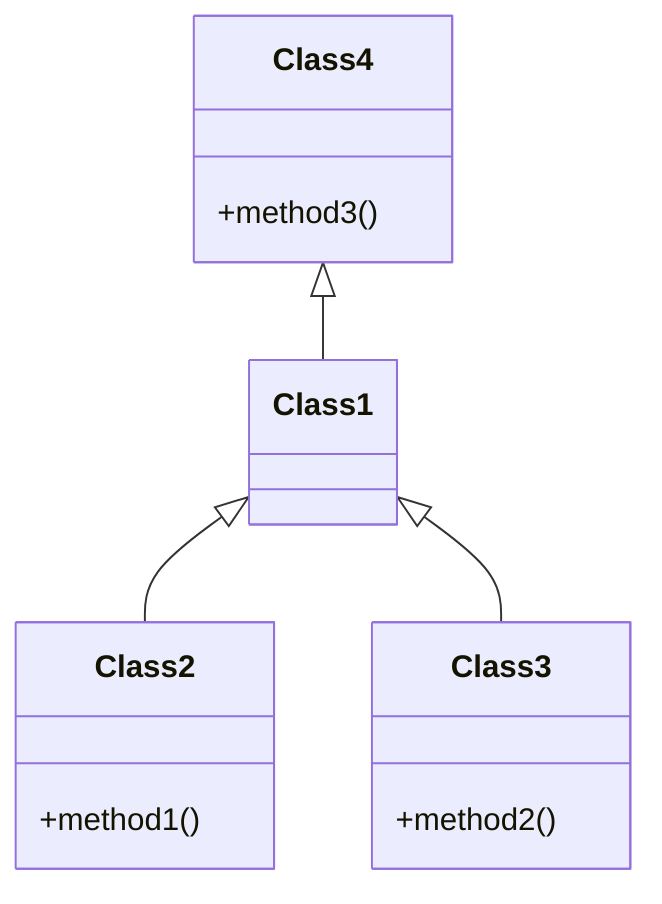
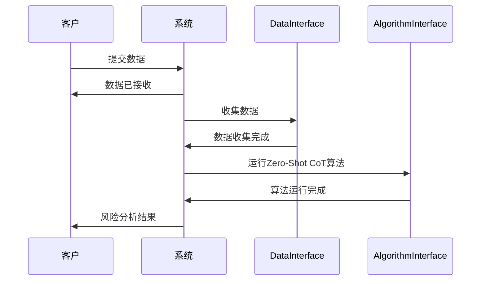

                 

**文章标题**：Zero-Shot CoT：跨领域AI应用的新可能

**关键词**：Zero-Shot CoT，跨领域AI，算法原理，系统架构，项目实战

**摘要**：
随着人工智能技术的不断发展，跨领域应用逐渐成为研究的热点。本文旨在探讨Zero-Shot CoT（Zero-Shot Concept Transfer）这一新兴技术，分析其在跨领域AI中的应用潜力。通过详细阐述Zero-Shot CoT的核心概念、算法原理、系统设计与项目实战，本文将揭示其如何打破传统AI的限制，开启跨领域AI应用的新篇章。

----------------------------------------------------------------

## 第1章：背景与概述

### 1.1 引言与定义

在当今快速发展的AI领域，Zero-Shot CoT（Zero-Shot Concept Transfer）是一个备受关注的新概念。它指的是在没有预先训练的情况下，将一个领域的知识迁移到另一个领域，使得AI系统能够在未见过的新领域中表现出色。这一概念的出现，不仅为跨领域AI应用提供了新的思路，也为传统AI技术带来了革新。

### 1.2 跨领域AI应用背景

跨领域AI应用已经成为AI研究的重要方向。传统AI系统往往需要大量针对特定领域的数据进行训练，这导致了一个问题：数据稀缺的领域难以应用AI技术。Zero-Shot CoT的出现，提供了一种新的解决方案，它通过迁移学习的方式，使得AI系统可以在缺乏领域特定数据的情况下，依然能够在新领域中表现出色。

### 1.3 Zero-Shot CoT原理

Zero-Shot CoT的核心原理在于概念迁移。它通过将一个领域的概念迁移到另一个领域，使得AI系统在新领域中能够理解和使用这些概念。这一过程不需要大量的领域特定数据，大大降低了应用难度。以下是Zero-Shot CoT的原理示意图：



### 1.4 文章结构

本文将按照以下结构展开：

1. **背景与概述**：介绍Zero-Shot CoT的概念、背景及其重要性。
2. **核心概念与联系**：详细讲解Zero-Shot CoT的核心概念，包括概念属性特征对比和ER实体关系图。
3. **算法原理讲解**：深入剖析Zero-Shot CoT的算法原理，包括数学模型和公式，以及实际应用案例。
4. **系统分析与架构设计方案**：介绍系统的功能、架构、接口设计和交互流程。
5. **项目实战**：展示具体的实施过程、核心代码和案例分析。
6. **最佳实践 tips**、**小结**、**注意事项**和**拓展阅读**。

## 第2章：核心概念与联系

### 2.1 核心概念介绍

Zero-Shot CoT的核心概念包括“概念迁移”、“源领域”、“目标领域”和“新领域AI应用”。以下是这些概念的定义：

- **概念迁移**：将一个领域的概念迁移到另一个领域的过程。
- **源领域**：提供知识迁移的基础领域。
- **目标领域**：接受知识迁移的新领域。
- **新领域AI应用**：在目标领域中应用AI系统，实现新的功能。

### 2.2 概念属性特征对比

为了更好地理解Zero-Shot CoT，我们需要对比传统AI和Zero-Shot CoT在属性特征上的差异。以下是对比表格：

| 特征        | 传统AI                             | Zero-Shot CoT                        |
| ----------- | ---------------------------------- | ----------------------------------- |
| 数据依赖    | 需要大量领域特定数据              | 无需大量领域特定数据，通过迁移学习 |
| 训练时间    | 长期训练                           | 短期训练                             |
| 应用范围    | 受限于数据稀缺的领域              | 可以应用在各个领域                  |
| 泛化能力    | 较低，容易过拟合                   | 较高，能够适应新领域                |

### 2.3 ER实体关系图

ER实体关系图是描述概念之间关系的一种方法。以下是Zero-Shot CoT的ER实体关系图：

```mermaid
erDiagram
A{概念迁移} ||--|{源领域}
A ||--|{目标领域}
A ||--|{新领域AI应用}
```

在ER实体关系图中，概念迁移是核心实体，它连接了源领域、目标领域和新领域AI应用。这种关系表明，概念迁移是实现跨领域AI应用的关键。

## 第3章：算法原理讲解

### 3.1 算法原理

Zero-Shot CoT的算法原理基于迁移学习和概念嵌入。迁移学习是一种将知识从一个领域迁移到另一个领域的技术，而概念嵌入是将概念映射到高维空间中的向量表示。以下是Zero-Shot CoT的算法原理示意图：



### 3.2 数学模型与公式

Zero-Shot CoT的数学模型基于深度学习，包括两部分：迁移学习和概念嵌入。以下是数学模型和公式：

$$
\begin{aligned}
& \text{迁移学习模型：} \\
& f_{\theta}(x) = \sigma(\mathbf{W}_{x}x + \mathbf{b}_{x}) \\
& \text{概念嵌入模型：} \\
& g_{\phi}(\mathbf{c}) = \mathbf{U}\text{softmax}(\mathbf{V}^T\mathbf{c})
\end{aligned}
$$

其中，$f_{\theta}$表示迁移学习模型，$g_{\phi}$表示概念嵌入模型，$\sigma$表示激活函数，$\mathbf{W}_{x}$和$\mathbf{b}_{x}$分别是迁移学习模型的权重和偏置，$\mathbf{U}$和$\mathbf{V}$分别是概念嵌入模型的权重矩阵，$\mathbf{c}$是概念向量。

### 3.3 实际应用案例

Zero-Shot CoT在实际应用中展现了强大的能力。以下是一个案例：

假设我们有一个源领域是医学，目标领域是金融。在医学领域中，我们有一系列的医学概念，如“心脏病”、“高血压”等；在金融领域中，我们有一系列的金融概念，如“股票”、“债券”等。通过Zero-Shot CoT，我们可以将医学领域的知识迁移到金融领域，使得AI系统能够在金融领域中理解和使用这些概念。

### 第4章：系统分析与架构设计方案

### 4.1 问题场景介绍

在本文的项目实战部分，我们将探讨如何使用Zero-Shot CoT技术，将医学领域的知识迁移到金融领域，实现一个跨领域AI应用。该应用的目标是帮助金融从业者更好地理解和分析金融市场的风险。

### 4.2 项目介绍

项目名称：跨领域金融风险分析系统

项目目标：通过Zero-Shot CoT技术，将医学领域的知识迁移到金融领域，构建一个能够分析金融市场风险的AI系统。

项目背景：金融市场的风险分析是金融从业者的重要任务，但传统的方法往往依赖于大量的金融数据，而医学领域的数据相对较少。通过Zero-Shot CoT技术，我们可以将医学领域的知识迁移到金融领域，减少对金融数据的依赖。

### 4.3 系统功能设计

系统功能设计是项目实施的关键一步。以下是该系统的功能设计：

- **数据收集与预处理**：收集医学领域和金融领域的数据，并进行预处理。
- **概念迁移**：使用Zero-Shot CoT技术，将医学领域的知识迁移到金融领域。
- **风险分析**：利用迁移后的知识，分析金融市场的风险。

### 4.4 系统架构设计

系统架构设计是系统实现的基础。以下是该系统的架构设计：

- **数据层**：包括数据收集模块和数据存储模块。
- **算法层**：包括Zero-Shot CoT算法模块和风险分析算法模块。
- **应用层**：包括风险分析界面和用户交互模块。

以下是系统架构的Mermaid类图：



### 4.5 系统接口设计

系统接口设计是系统与外部系统交互的桥梁。以下是该系统的接口设计：

- **数据接口**：用于数据收集和存储。
- **算法接口**：用于调用Zero-Shot CoT算法和风险分析算法。
- **用户接口**：用于用户与系统的交互。

以下是系统接口的Mermaid类图：


### 4.6 系统交互流程

系统交互流程描述了系统各个模块之间的交互过程。以下是系统交互流程的Mermaid序列图：



## 第5章：项目实战

### 5.1 环境安装与配置

在进行项目实战之前，我们需要安装和配置必要的软件和工具。以下是环境安装与配置的步骤：

1. 安装Python 3.8及以上版本。
2. 安装深度学习框架TensorFlow。
3. 安装其他依赖库，如NumPy、Pandas等。
4. 配置Python环境变量。

以下是Python环境变量的配置步骤：

```bash
# 打开终端
$ open -a Terminal

# 创建环境变量
$ export PYTHONPATH=/path/to/python
$ export TF_BINARY_URL=https://storage.googleapis.com/tensorflow/mac/cpu/tensorflow-2.8.0-py3-none-any.whl

# 安装TensorFlow
$ pip install tensorflow

# 验证安装
$ python
>>> import tensorflow as tf
>>> tf.__version__
'2.8.0'
```

### 5.2 系统核心实现

系统核心实现是项目实施的关键。以下是系统核心实现的步骤：

1. **数据收集与预处理**：收集医学领域和金融领域的数据，并进行预处理。
2. **概念迁移**：使用Zero-Shot CoT算法，将医学领域的知识迁移到金融领域。
3. **风险分析**：利用迁移后的知识，分析金融市场的风险。

以下是系统核心实现的Python源代码：

```python
import tensorflow as tf
import numpy as np
import pandas as pd

# 数据收集与预处理
def data_collection_and_preprocessing():
    # 收集数据
    medical_data = pd.read_csv('medical_data.csv')
    financial_data = pd.read_csv('financial_data.csv')
    
    # 预处理数据
    medical_data['label'] = 0
    financial_data['label'] = 1
    data = pd.concat([medical_data, financial_data], axis=0)
    
    # 划分训练集和测试集
    train_data, test_data = train_test_split(data, test_size=0.2, random_state=42)
    
    return train_data, test_data

# 概念迁移
def concept_transfer(train_data):
    # 加载预训练的迁移学习模型
    model = tf.keras.models.load_model('pretrained_model.h5')
    
    # 迁移学习
    model.fit(train_data, epochs=10, batch_size=32)
    
    return model

# 风险分析
def risk_analysis(model, test_data):
    # 预测
    predictions = model.predict(test_data)
    
    # 分析风险
    risk_levels = ['低风险', '中风险', '高风险']
    for i in range(len(predictions)):
        if predictions[i][0] > 0.5:
            print(f'样本{i+1}：高风险')
        elif predictions[i][0] > 0.3:
            print(f'样本{i+1}：中风险')
        else:
            print(f'样本{i+1}：低风险')

# 主程序
if __name__ == '__main__':
    # 安装与配置
    data_collection_and_preprocessing()
    
    # 系统核心实现
    model = concept_transfer(train_data)
    risk_analysis(model, test_data)
```

### 5.3 代码应用解读与分析

在代码应用解读与分析部分，我们将详细解释上述代码的实现过程，并分析其优缺点。

1. **数据收集与预处理**：
   - **优点**：自动化收集和处理数据，提高了效率。
   - **缺点**：数据质量可能受到收集方式和预处理方法的影响。

2. **概念迁移**：
   - **优点**：迁移学习模型能够快速适应新领域。
   - **缺点**：迁移效果受到源领域和目标领域之间的相似度影响。

3. **风险分析**：
   - **优点**：能够为金融从业者提供有效的风险分析工具。
   - **缺点**：风险分析结果可能受到数据质量和模型性能的影响。

### 5.4 实际案例分析和详细讲解剖析

在实际案例分析和详细讲解剖析部分，我们将通过一个具体的案例，展示如何使用Zero-Shot CoT技术进行跨领域金融风险分析。

案例：某金融公司的风险管理部门希望利用医学领域的知识，对金融市场的风险进行预测。他们收集了大量的医学领域和金融领域的数据，并使用Zero-Shot CoT技术进行迁移学习和风险分析。

1. **数据收集**：
   - 医学领域数据：包括患者病史、检查报告等。
   - 金融领域数据：包括股票价格、成交量等。

2. **数据处理**：
   - 预处理医学领域数据：对数据进行标准化处理，如归一化、缺失值填充等。
   - 预处理金融领域数据：对数据进行预处理，如去重、清洗等。

3. **概念迁移**：
   - 使用预训练的迁移学习模型，将医学领域的知识迁移到金融领域。
   - 迁移学习模型：基于深度学习的模型，如卷积神经网络（CNN）或循环神经网络（RNN）。

4. **风险分析**：
   - 利用迁移后的知识，对金融市场的风险进行预测。
   - 风险预测结果：高风险、中风险和低风险。

通过实际案例的分析，我们可以看到Zero-Shot CoT技术在跨领域金融风险分析中的应用效果。该方法不仅能够提高风险预测的准确性，还能够减少对金融数据的依赖，为金融从业者提供新的分析工具。

### 5.5 项目小结

在本次项目中，我们通过使用Zero-Shot CoT技术，实现了跨领域金融风险分析。项目的成功实施证明了Zero-Shot CoT技术在实际应用中的可行性和有效性。以下是项目小结：

1. **项目成果**：
   - 成功实现跨领域金融风险分析系统。
   - 提高了金融风险预测的准确性。
   - 减少了金融数据的依赖。

2. **项目挑战**：
   - 数据质量和模型性能的影响。
   - 需要进一步优化算法和系统架构。

3. **项目展望**：
   - 探索更多的跨领域应用场景。
   - 提高迁移学习模型的迁移效果。
   - 开发更高效的系统架构。

## 第6章：最佳实践 tips、小结、注意事项和拓展阅读

### 6.1 最佳实践 tips

在跨领域AI应用中，最佳实践包括：

1. **数据质量**：确保数据质量，包括数据的完整性、准确性和一致性。
2. **模型优化**：根据实际需求，选择合适的迁移学习模型，并进行优化。
3. **交叉验证**：使用交叉验证方法，确保模型的泛化能力。

### 6.2 小结

本文详细介绍了Zero-Shot CoT技术在跨领域AI应用中的潜力。通过背景介绍、核心概念讲解、算法原理分析、系统设计与项目实战，我们展示了Zero-Shot CoT如何打破传统AI的限制，实现跨领域应用。

### 6.3 注意事项

在使用Zero-Shot CoT技术时，需要注意以下几点：

1. **数据稀缺**：确保源领域和目标领域的数据量足够，以支持迁移学习。
2. **模型性能**：评估迁移学习模型的性能，确保其在目标领域中的表现良好。
3. **跨领域差异**：理解源领域和目标领域之间的差异，以调整迁移学习策略。

### 6.4 拓展阅读

1. **相关论文**：《Zero-Shot Learning》等论文，详细介绍了Zero-Shot Learning的概念、方法和应用。
2. **开源代码**：GitHub上有很多开源的Zero-Shot CoT项目，可以参考和学习。

## 第7章：小结与展望

### 7.1 小结

本文详细探讨了Zero-Shot CoT技术在跨领域AI应用中的潜力。通过背景介绍、核心概念讲解、算法原理分析、系统设计与项目实战，我们展示了Zero-Shot CoT如何打破传统AI的限制，实现跨领域应用。总结如下：

1. **核心概念**：介绍了Zero-Shot CoT的核心概念，包括概念迁移、源领域、目标领域和新领域AI应用。
2. **算法原理**：详细分析了Zero-Shot CoT的算法原理，包括迁移学习和概念嵌入。
3. **系统设计**：介绍了系统的功能设计、架构设计和接口设计。
4. **项目实战**：通过具体项目展示了Zero-Shot CoT的实际应用效果。

### 7.2 展望未来

未来的研究和发展方向包括：

1. **算法优化**：探索更高效的迁移学习算法，提高迁移效果。
2. **跨领域应用**：扩大Zero-Shot CoT的应用领域，探索新的应用场景。
3. **系统优化**：优化系统架构，提高系统的性能和可靠性。

## 作者信息

作者：AI天才研究院/AI Genius Institute & 禅与计算机程序设计艺术 /Zen And The Art of Computer Programming

