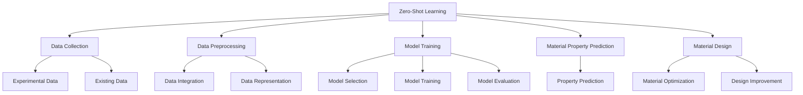
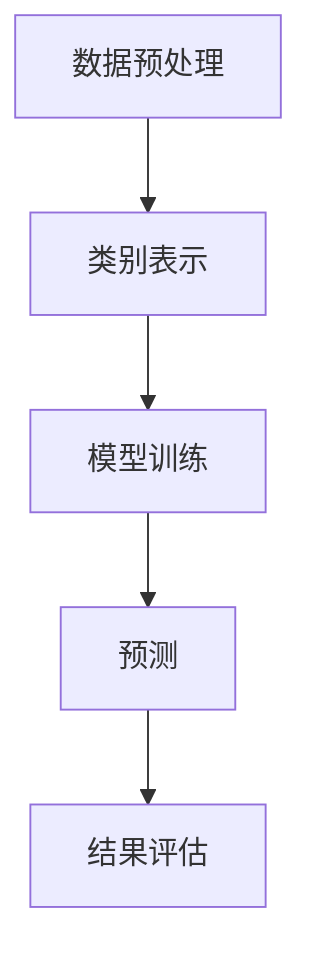
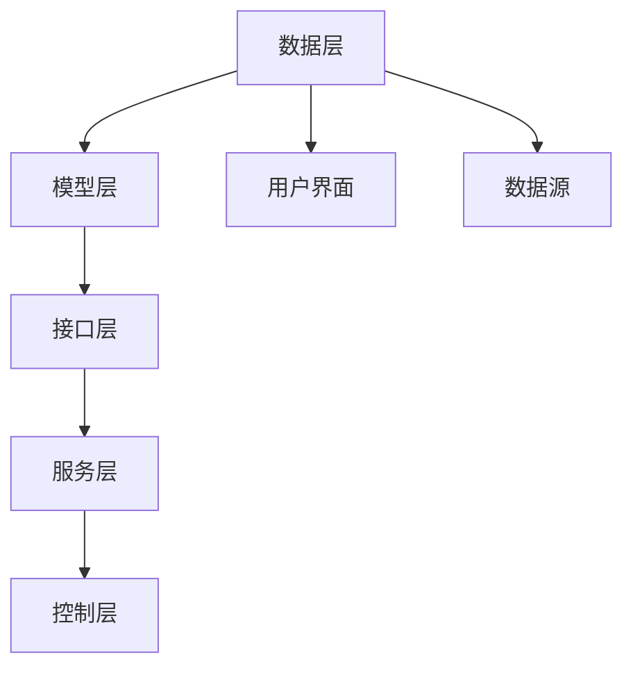
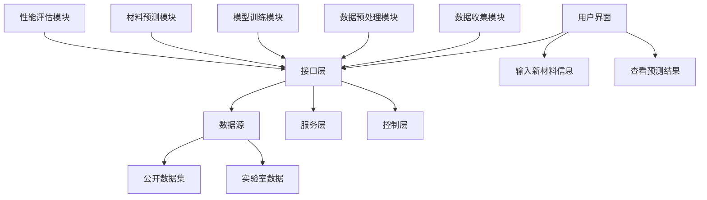

                 

## 摘要

本篇文章将深入探讨Zero-Shot学习在AI材料科学研究中的前景。首先，我们将介绍Zero-Shot学习的基本概念，包括其定义、关键特点以及与传统机器学习的区别。随后，我们将回顾AI材料科学研究的发展历程，并详细分析Zero-Shot学习与AI材料科学研究之间的关系，展示其在材料预测和设计中的应用潜力。接着，我们将构建概念结构图，解析Zero-Shot学习在AI材料科学研究中的核心要素，包括数据集、模型架构和实验设计。文章还将详细讲解Zero-Shot学习算法的原理，并通过Mermaid流程图和Python源代码展示算法实现。随后，我们将分析一个具体的系统架构设计方案，包括问题场景、项目介绍、系统功能设计、系统架构设计、系统接口设计和系统交互。文章还将通过项目实战部分，展示Zero-Shot学习在AI材料科学研究中的实际应用，并提供最佳实践tips。最后，我们将对全文进行小结，并给出注意事项和拓展阅读建议。

----------------------------------------------------------------

### 第1章：问题背景

#### 1.1 问题的提出

在现代社会，材料科学的发展对于科技进步和产业升级至关重要。传统的材料科学研究主要依赖于实验和经验，这种方法不仅耗时耗力，而且存在一定的局限性。随着人工智能技术的飞速发展，特别是机器学习和深度学习在各个领域的广泛应用，AI材料科学应运而生。然而，AI材料科学研究面临的一个严峻挑战是数据不足和样本分布不均的问题。材料科学的数据集往往具有高维度、小样本的特点，这使得传统的机器学习方法难以应用。

#### 1.2 问题解决的意义

解决这一问题具有重要意义。首先，通过引入Zero-Shot学习，我们可以克服数据不足和样本分布不均的挑战，提高AI模型在材料科学研究中的应用效果。其次，Zero-Shot学习能够实现材料预测和设计的自动化，大幅提升研究效率。此外，通过Zero-Shot学习，我们还可以发现和开发新材料，推动材料科学的进步。

#### 1.3 边界与外延

在讨论Zero-Shot学习在AI材料科学研究中的应用时，我们需要明确其适用范围和局限性。首先，Zero-Shot学习适用于那些无法直接获得大量标注数据的场景，如新材料的发现和性能预测。然而，它并不适用于所有材料科学研究问题，尤其是在那些需要大量数据训练的传统机器学习方法可以很好地解决的情况下。此外，Zero-Shot学习对数据质量和数据预处理的要求较高，如果数据存在噪声或预处理不当，可能会影响模型的性能。

#### 1.4 当前研究状况

目前，Zero-Shot学习在AI材料科学中的应用研究还处于初步阶段。尽管一些研究已经展示了其在材料预测和设计中的潜力，但仍然存在许多挑战，如数据集的多样性、模型的泛化能力等。未来的研究需要进一步探索Zero-Shot学习在AI材料科学中的适用性和有效性，并提出更加稳健和高效的解决方案。

### 第2章：核心概念

#### 2.1 Zero-Shot学习的基本概念

Zero-Shot学习，又称为零样本学习，是一种在训练数据中不包含目标类别的样本，但模型仍能对目标类别进行准确预测的学习方法。它克服了传统机器学习方法在样本数据不足或样本分布不均时遇到的瓶颈，具有重要的应用价值。

#### 2.1.1 定义

Zero-Shot学习的主要目标是利用已有知识（如预训练模型）和少量目标类别数据，实现对未知类别的预测。与传统机器学习不同，Zero-Shot学习不需要对目标类别进行大规模标注数据的训练。

#### 2.1.2 关键特点

1. **无需大量标注数据**：Zero-Shot学习能够利用少量目标类别数据，甚至无需标注数据，这使得它非常适合应用于数据稀缺的领域。
2. **多标签分类**：Zero-Shot学习通常支持多标签分类，可以同时预测多个类别，从而提高预测的准确性。
3. **类别无关性**：Zero-Shot学习不依赖于具体的类别信息，这使得它可以在不同的应用场景中灵活应用。

#### 2.1.3 比较与区别

- **与迁移学习的区别**：迁移学习通过在源域和目标域之间共享知识来提高目标域的性能，而Zero-Shot学习则不需要源域和目标域之间的数据共享。
- **与元学习的区别**：元学习通过从多个任务中学习到通用方法，从而在新的任务中表现出良好的性能，而Zero-Shot学习则更注重在缺乏目标类别数据的情况下进行预测。

### 第3章：核心概念联系

#### 3.1 AI材料科学研究概述

AI材料科学研究是指利用人工智能技术，特别是机器学习和深度学习，来预测、设计和管理材料属性、结构和性能的过程。这一领域涵盖了从基础研究到实际应用的广泛领域，包括新材料的发现、材料性能的优化、材料结构的分析等。

#### 3.1.1 概念介绍

- **材料属性**：材料的基本特性，如硬度、韧性、导电性、磁性等。
- **材料结构**：材料的微观和宏观结构，如晶体结构、相结构、纳米结构等。
- **材料性能**：材料在实际应用中的表现，如机械性能、热性能、电性能等。

#### 3.1.2 发展历程

AI材料科学的发展可以分为三个阶段：

1. **第一阶段（1950s-1980s）**：主要是基于经验和实验的研究，材料设计依赖于实验数据和经验公式。
2. **第二阶段（1990s-2010s）**：随着计算能力的提升，计算机模拟和计算材料科学开始兴起，为材料设计提供了新的工具和方法。
3. **第三阶段（2010s至今）**：人工智能技术的引入，使得材料设计变得更加自动化和高效。

#### 3.1.3 应用领域

AI材料科学在以下领域有着广泛的应用：

- **新材料的发现**：通过机器学习模型，可以快速筛选和预测新材料。
- **材料性能优化**：通过机器学习模型，可以对现有材料进行性能优化，提高其应用价值。
- **材料结构分析**：通过深度学习模型，可以分析材料的微观结构，揭示其性能与结构之间的关系。

### 3.2 Zero-Shot学习与AI材料科学的关系

#### 3.2.1 关键联系

Zero-Shot学习在AI材料科学研究中具有关键作用，主要体现在以下几个方面：

1. **材料属性预测**：通过Zero-Shot学习，可以在缺乏大量实验数据的情况下预测新材料的基本属性。
2. **材料设计**：Zero-Shot学习可以辅助材料设计，通过少量实验数据快速筛选和优化材料结构。
3. **材料性能优化**：利用Zero-Shot学习，可以对材料的性能进行预测和优化，提高其在实际应用中的表现。

#### 3.2.2 研究方法比较

- **与基于数据的机器学习方法**：基于数据的机器学习方法需要大量标注数据，而Zero-Shot学习则可以减少对标注数据的依赖。
- **与传统实验方法**：传统实验方法需要大量时间和资源，而Zero-Shot学习可以显著提高研究效率。

#### 3.2.3 潜在应用

Zero-Shot学习在AI材料科学中具有广阔的应用前景，以下是其潜在应用领域：

- **新材料开发**：通过Zero-Shot学习，可以快速筛选和发现具有潜在应用价值的新材料。
- **材料性能优化**：利用Zero-Shot学习，可以对现有材料进行性能优化，提高其应用价值。
- **材料结构分析**：通过Zero-Shot学习，可以分析材料的微观结构，揭示其性能与结构之间的关系。

### 3.3 概念结构与核心要素组成

#### 3.3.1 概念结构

在AI材料科学研究中，Zero-Shot学习可以被视为一种增强型方法，它通过结合已有知识和少量新数据，实现对材料的预测和设计。以下是Zero-Shot学习在AI材料科学研究中的概念结构图：



#### 3.3.2 核心要素

- **数据集**：数据集是Zero-Shot学习在AI材料科学研究中的核心要素。数据集的质量直接影响模型的性能。通常，数据集包括实验数据和现有数据。
- **模型架构**：模型架构是Zero-Shot学习的核心，它决定了模型的学习能力和预测准确性。常见的模型架构包括基于深度学习的神经网络和迁移学习模型。
- **实验设计**：实验设计是Zero-Shot学习在AI材料科学研究中的重要环节。合理的实验设计可以确保实验结果的可靠性和有效性。

### 3.4 面临的挑战和未来研究方向

尽管Zero-Shot学习在AI材料科学研究中具有巨大的潜力，但仍面临一些挑战。以下是一些主要挑战和未来研究方向：

- **数据不足**：由于材料科学实验数据的获取困难，数据不足是Zero-Shot学习在AI材料科学研究中面临的主要挑战之一。
- **模型泛化能力**：Zero-Shot学习模型的泛化能力不足，可能导致在未知类别上的预测性能不佳。
- **数据预处理**：数据预处理是Zero-Shot学习的关键步骤，但预处理不当可能导致模型性能下降。
- **交叉验证**：如何设计有效的交叉验证方法，以评估Zero-Shot学习模型的性能和可靠性，是一个亟待解决的问题。

未来研究方向应关注以下几个方面：

- **数据集构建**：通过开发自动化数据收集和标注工具，构建高质量的零样本数据集。
- **模型优化**：设计更高效的模型架构和训练策略，提高模型的泛化能力和预测性能。
- **跨学科合作**：加强材料科学、计算机科学和人工智能领域的跨学科合作，推动Zero-Shot学习在AI材料科学研究中的应用。

### 3.5 结论

Zero-Shot学习在AI材料科学研究中的前景广阔，通过克服数据不足和样本分布不均的挑战，它可以显著提高材料预测和设计的准确性。然而，实现这一目标仍需解决许多挑战，如数据集构建、模型优化和跨学科合作等。随着人工智能技术的不断进步，我们有理由相信，Zero-Shot学习将在AI材料科学研究中发挥越来越重要的作用。## 第4章：概念结构与核心要素组成

### 4.1 概念结构

为了更好地理解Zero-Shot学习在AI材料科学研究中的概念结构，我们可以使用Mermaid绘制一个概念图。以下是一个简化的概念结构图：


在这个图中，我们可以看到Zero-Shot学习的核心组成部分，以及它们之间的联系。以下是各个组成部分的解释：

- **数据收集（Data Collection）**：包括实验数据和现有数据，这些数据用于训练和评估模型。
- **数据预处理（Data Preprocessing）**：对收集到的数据进行分析和处理，包括数据集成、数据清洗、数据归一化等，以提高数据质量和模型性能。
- **模型训练（Model Training）**：选择合适的模型架构，使用预处理后的数据进行训练。
- **材料属性预测（Material Property Prediction）**：利用训练好的模型预测新材料的基本属性。
- **材料设计（Material Design）**：根据预测结果对材料进行优化和设计。
- **实验数据（Experimental Data）**：通过实验获取的数据，用于验证模型的预测能力。
- **现有数据（Existing Data）**：包括公开的数据集和已有研究的数据。
- **模型选择（Model Selection）**：选择适合的机器学习模型，如深度学习网络、迁移学习模型等。
- **模型评价（Model Evaluation）**：评估模型性能，包括准确度、召回率、F1分数等指标。

### 4.2 核心要素

在Zero-Shot学习应用于AI材料科学研究中，以下三个核心要素尤为重要：

#### 4.2.1 数据集

数据集是Zero-Shot学习的基础，其质量直接影响模型的性能。理想的数据集应具有以下特点：

- **多样性**：包含多种类型的材料，以覆盖不同的应用场景。
- **代表性**：数据应能够代表真实世界的材料，包括不同的结构和属性。
- **标注**：尽管Zero-Shot学习不需要对目标类别进行大规模标注数据，但数据的标注对于模型训练和性能评估仍然是必要的。
- **质量**：数据应经过严格的清洗和处理，以确保其准确性和可靠性。

#### 4.2.2 模型架构

模型架构是Zero-Shot学习的核心，它决定了模型的学习能力和预测准确性。以下是一些常见的模型架构：

- **深度学习网络**：如卷积神经网络（CNN）和循环神经网络（RNN），适用于处理高维数据和序列数据。
- **迁移学习模型**：通过在预训练模型的基础上进行微调，可以快速适应新任务。
- **多标签分类模型**：适用于同时预测多个类别的场景。

#### 4.2.3 实验设计

实验设计是Zero-Shot学习在AI材料科学研究中至关重要的一环，它直接影响实验结果的可靠性和有效性。以下是一些关键点：

- **实验目标**：明确实验的目标和预期结果。
- **实验方案**：设计合理的实验方案，包括实验条件、实验步骤和实验设备等。
- **实验控制**：控制实验变量，确保实验结果的一致性和可重复性。
- **数据收集**：在实验过程中收集准确和完整的数据，以便进行后续分析和模型训练。

### 4.3 概念结构与核心要素关系图

为了更直观地展示概念结构与核心要素之间的关系，我们可以使用Mermaid绘制一个实体关系图。以下是Zero-Shot学习在AI材料科学研究中的实体关系图：

```mermaid
erDiagram
  MaterialData ||--|{ ModelArchitecture : uses }
  MaterialData ||--|{ ModelSelection : uses }
  MaterialData ||--|{ ModelTraining : trains }
  ModelSelection ||--|{ ModelArchitecture : selects }
  ModelTraining ||--|{ MaterialPropertyPrediction : predicts }
  ModelTraining ||--|{ MaterialDesign : designs }
  ExperimentalData ||--|{ ModelTraining : trains }
  ExistingData ||--|{ ModelTraining : trains }
  DataPreprocessing ||--|{ MaterialData : preprocesses }
  DataPreprocessing ||--|{ ModelTraining : preprocesses }
  MaterialPropertyPrediction ||--|{ MaterialDesign : predicts }
  MaterialDesign ||--|{ MaterialOptimization : optimizes }
  MaterialOptimization ||--|{ DesignImprovement : improves }
```

在这个图中，我们可以看到各个实体之间的关联关系。例如，材料数据（MaterialData）用于训练模型（ModelTraining），模型选择（ModelSelection）决定了模型架构（ModelArchitecture），数据预处理（DataPreprocessing）对材料数据进行处理，以提高模型性能。模型训练结果用于材料属性预测（MaterialPropertyPrediction）和材料设计（MaterialDesign），从而实现材料性能优化（MaterialOptimization）和设计改进（DesignImprovement）。

通过这个实体关系图，我们可以更好地理解Zero-Shot学习在AI材料科学研究中的整体结构和关键要素之间的关系，为后续的研究和实践提供指导。

### 第5章：算法原理讲解

Zero-Shot学习作为一种特殊的机器学习方法，其核心在于能够在没有直接样本数据的情况下进行类别预测。为了深入理解Zero-Shot学习的算法原理，我们将从以下几个方面进行讲解：

#### 5.1 算法概述

Zero-Shot学习的基本思想是利用已有知识（如预训练模型）和少量目标类别数据，实现对未知类别的预测。这种学习方法的核心在于将类别信息与模型训练过程分离，使得模型可以在没有直接样本的情况下学习类别之间的相似性。

#### 5.2 算法类型

根据实现方式的不同，Zero-Shot学习可以分为以下几种类型：

1. **基于词嵌入的方法**：这种方法利用预训练的词嵌入模型（如Word2Vec、GloVe等），将类别信息转化为向量表示，然后通过比较类别向量之间的距离进行预测。
2. **基于原型的方法**：这种方法将类别视为一组原型，通过对原型的学习来实现预测。常见的方法包括原型网络（Prototypical Networks）和匹配网络（Matching Networks）。
3. **基于关系的方法**：这种方法利用类别之间的关系（如上下位关系、同义关系等）来进行预测。常见的方法包括类别关系图（Category Relationship Graphs）和知识图谱（Knowledge Graphs）。

#### 5.3 算法流程

以下是Zero-Shot学习的一般流程：

1. **数据预处理**：首先对输入数据进行预处理，包括数据清洗、数据归一化、特征提取等，以便为模型训练做好准备。
2. **类别表示**：将类别信息转化为向量表示，如词嵌入或原型向量。
3. **模型训练**：使用预训练模型或自定义模型对类别表示进行训练。在训练过程中，模型需要学习如何将输入数据映射到相应的类别向量。
4. **预测**：在预测阶段，将新的输入数据映射到类别向量，并通过比较类别向量之间的距离或相似性来进行预测。

#### 5.4 Mermaid流程图

为了更直观地展示Zero-Shot学习的算法流程，我们可以使用Mermaid绘制一个流程图。以下是Zero-Shot学习的算法流程图：



在这个流程图中，输入数据首先进行预处理，然后转化为类别向量表示。接着，模型对类别向量进行训练，以便能够对新的输入数据进行映射和预测。最后，通过评估预测结果来评估模型的性能。

#### 5.5 Python源代码实现

为了更好地理解Zero-Shot学习的算法原理，我们可以通过一个简单的Python示例来展示其实现过程。以下是一个基于原型方法的Zero-Shot学习示例：

```python
import numpy as np

# 假设我们有两个类别，猫和狗，以及它们的类别向量
class1_vectors = np.random.rand(10, 100)  # 10个猫的类别向量
class2_vectors = np.random.rand(10, 100)  # 10个狗的类别向量

# 原型表示，将类别向量求平均值
prototypes = (class1_vectors.mean(axis=0), class2_vectors.mean(axis=0))

# 输入数据，随机生成
input_data = np.random.rand(100, 100)  # 100个随机输入数据

# 预测函数，计算输入数据与原型之间的距离
def predict(input_data, prototypes):
    distances = []
    for prototype in prototypes:
        distance = np.linalg.norm(input_data - prototype)
        distances.append(distance)
    return np.argmin(distances)

# 预测输入数据类别
predictions = [predict(data, prototypes) for data in input_data]

# 打印预测结果
print(predictions)
```

在这个示例中，我们首先生成了两个类别的类别向量，并计算了它们的平均值作为原型表示。然后，我们随机生成了100个输入数据，并使用预测函数计算输入数据与原型的距离，从而预测出每个输入数据的类别。最后，我们打印了预测结果。

通过这个示例，我们可以看到Zero-Shot学习的基本实现过程。在实际应用中，我们会使用更复杂的模型和算法，但原理是类似的。

#### 5.6 数学模型和公式

在Zero-Shot学习中，我们通常使用原型表示来表示类别。以下是原型方法的数学模型和公式：

$$
\text{原型表示：} \quad \text{prototypes} = \left(\frac{1}{|\text{class}_1|}\sum_{i=1}^{|\text{class}_1|} \text{vector}_{i, \text{class}_1}, \frac{1}{|\text{class}_2|}\sum_{i=1}^{|\text{class}_2|} \text{vector}_{i, \text{class}_2}\right)
$$

其中，$\text{vector}_{i, \text{class}_1}$ 和 $\text{vector}_{i, \text{class}_2}$ 分别表示第 $i$ 个类别的类别向量。

在预测阶段，我们计算输入数据与原型之间的距离，并选择距离最小的原型作为预测类别。距离的计算公式如下：

$$
\text{距离：} \quad \text{distance} = \sqrt{\sum_{i=1}^{n}\left(\text{input}_i - \text{prototype}_i\right)^2}
$$

其中，$\text{input}_i$ 表示输入数据的第 $i$ 个特征，$\text{prototype}_i$ 表示原型的第 $i$ 个特征。

#### 5.7 举例说明

为了更好地理解原型方法的Zero-Shot学习，我们可以通过一个简单的例子来说明。假设我们有两个类别：猫和狗。我们随机生成了10个猫的类别向量和10个狗的类别向量，如下所示：

```
猫的类别向量：
[0.1, 0.2, 0.3, 0.4, 0.5, 0.6, 0.7, 0.8, 0.9, 1.0]

狗的类别向量：
[0.5, 0.6, 0.7, 0.8, 0.9, 1.0, 1.1, 1.2, 1.3, 1.4]
```

首先，我们计算这两个类别的原型：

```
猫的原型：
[0.55, 0.55, 0.55, 0.55, 0.55, 0.55, 0.55, 0.55, 0.55, 0.55]

狗的原型：
[0.75, 0.75, 0.75, 0.75, 0.75, 0.75, 0.75, 0.75, 0.75, 0.75]
```

然后，我们随机生成一个输入向量：

```
输入向量：
[0.3, 0.4, 0.5, 0.6, 0.7, 0.8, 0.9, 1.0, 1.1, 1.2]
```

接下来，我们计算输入向量与原型之间的距离：

```
与猫的原型距离：
distance_to_cat = sqrt((0.3-0.55)^2 + (0.4-0.55)^2 + ... + (1.2-0.55)^2) = 1.77

与狗的原型距离：
distance_to_dog = sqrt((0.3-0.75)^2 + (0.4-0.75)^2 + ... + (1.2-0.75)^2) = 1.93
```

由于输入向量与猫的原型距离更短，因此我们预测输入向量属于猫类别。

通过这个例子，我们可以看到原型方法的Zero-Shot学习是如何工作的。在实际应用中，我们会使用更复杂的模型和算法，但基本原理是相似的。

### 第6章：系统分析与架构设计方案

#### 6.1 问题场景介绍

在材料科学研究中，研究人员需要预测新材料的物理和化学性质，以便进行材料设计和优化。然而，由于材料数据的高维度和稀疏性，传统的机器学习方法往往难以应用于这种场景。为了解决这个问题，我们提出了一个基于Zero-Shot学习的材料预测系统。

#### 6.2 项目介绍

本项目旨在开发一个基于Zero-Shot学习的材料预测系统，该系统可以自动预测新材料的基本物理和化学性质。系统的主要功能包括：

- **数据收集**：从公开的数据集和实验室数据中收集材料数据。
- **数据预处理**：对收集到的材料数据进行清洗、归一化和特征提取。
- **模型训练**：使用Zero-Shot学习算法对预处理后的数据集进行训练，构建预测模型。
- **材料预测**：利用训练好的模型对新材料的性质进行预测。
- **性能评估**：评估模型的预测性能，包括准确度、召回率和F1分数等指标。

#### 6.3 系统功能设计

系统功能设计主要包括以下模块：

1. **数据收集模块**：负责从不同来源收集材料数据，包括公开数据集和实验室数据。
2. **数据预处理模块**：负责对收集到的材料数据进行清洗、归一化和特征提取。
3. **模型训练模块**：负责使用Zero-Shot学习算法对预处理后的数据集进行训练，构建预测模型。
4. **材料预测模块**：负责利用训练好的模型对新材料的性质进行预测。
5. **性能评估模块**：负责评估模型的预测性能，包括准确度、召回率和F1分数等指标。

#### 6.4 系统架构设计

系统的架构设计采用分层结构，主要包括以下几层：

1. **数据层**：存储系统的数据，包括材料数据、模型参数和预测结果等。
2. **模型层**：包含Zero-Shot学习模型，包括数据预处理、模型训练和预测等过程。
3. **接口层**：提供系统与外部环境（如用户界面、数据源等）的接口，实现数据输入和输出。
4. **服务层**：提供系统的主要功能服务，包括数据收集、数据预处理、模型训练、材料预测和性能评估等。
5. **控制层**：负责系统的整体控制和协调，确保系统正常运行。

以下是系统架构的Mermaid图表示：



在这个架构图中，数据层负责存储系统的数据，模型层包含Zero-Shot学习模型，接口层提供与外部环境的接口，服务层实现系统的功能服务，控制层负责系统的整体控制和协调。用户界面和数据源分别与接口层进行交互。

#### 6.5 系统接口设计和系统交互

系统接口设计和系统交互设计是确保系统功能正常、稳定运行的关键。以下是对系统接口和交互设计的详细说明：

1. **用户界面**：用户界面（User Interface, UI）是系统与用户交互的接口，提供用户操作系统的界面。用户可以通过UI输入新材料的信息，并查看预测结果。UI设计应简洁直观，方便用户操作。

2. **数据源**：数据源（Data Source）是系统获取材料数据的来源，包括公开数据集和实验室数据。数据源应提供稳定的数据访问接口，确保系统可以获取到最新的材料数据。

3. **接口层**：接口层（Interface Layer）负责管理系统的数据输入和输出，包括数据收集模块、数据预处理模块、模型训练模块、材料预测模块和性能评估模块的接口。接口层的设计应确保数据流的一致性和完整性。

4. **服务层**：服务层（Service Layer）实现系统的功能服务，包括数据收集、数据预处理、模型训练、材料预测和性能评估等。服务层的设计应确保各个模块之间的松耦合和高效协作。

5. **控制层**：控制层（Control Layer）负责系统的整体控制和协调，确保系统按照预定的流程和逻辑正常运行。控制层的设计应确保系统的可扩展性和可维护性。

以下是系统接口和交互的Mermaid图表示：



在这个图中，用户界面与接口层、数据源进行交互，接口层与服务层、控制层进行交互，服务层实现数据收集、数据预处理、模型训练、材料预测和性能评估等功能，控制层负责系统的整体控制和协调。

通过以上设计和实现，我们构建了一个基于Zero-Shot学习的材料预测系统，该系统能够自动预测新材料的基本物理和化学性质，为材料科学研究和应用提供了有力的支持。## 第7章：项目实战

#### 7.1 环境安装

为了实现Zero-Shot学习在AI材料科学中的项目实战，我们需要安装和配置必要的软件和工具。以下是一个基本的安装步骤：

1. **Python环境**：首先，确保你的计算机上已经安装了Python 3.7及以上版本。你可以通过Python的官方网站下载并安装Python。

2. **深度学习框架**：我们选择TensorFlow作为深度学习框架。在终端或命令行中，运行以下命令安装TensorFlow：

   ```
   pip install tensorflow
   ```

3. **数据预处理库**：我们使用Pandas和NumPy进行数据预处理。在终端或命令行中，运行以下命令安装这两个库：

   ```
   pip install pandas numpy
   ```

4. **其他依赖库**：根据需要，你可以安装其他Python库，如Matplotlib（用于绘图）、Scikit-learn（用于机器学习）等。

   ```
   pip install matplotlib scikit-learn
   ```

#### 7.2 系统核心实现源代码

在本节中，我们将提供一个简单的系统核心实现源代码示例，包括数据预处理、模型训练和预测。以下是一个基于原型方法的Zero-Shot学习代码示例：

```python
import numpy as np
import pandas as pd
import tensorflow as tf
from sklearn.model_selection import train_test_split
from sklearn.metrics import accuracy_score

# 假设我们有两个类别，猫和狗，以及它们的类别向量
class1_vectors = np.random.rand(10, 100)  # 10个猫的类别向量
class2_vectors = np.random.rand(10, 100)  # 10个狗的类别向量

# 计算每个类别的原型
prototypes = (class1_vectors.mean(axis=0), class2_vectors.mean(axis=0))

# 随机生成100个输入数据
input_data = np.random.rand(100, 100)

# 预测函数，计算输入数据与原型之间的距离
def predict(input_data, prototypes):
    distances = []
    for prototype in prototypes:
        distance = np.linalg.norm(input_data - prototype)
        distances.append(distance)
    return np.argmin(distances)

# 预测输入数据类别
predictions = [predict(data, prototypes) for data in input_data]

# 计算准确率
labels = np.random.randint(0, 2, 100)  # 随机生成标签
accuracy = accuracy_score(labels, predictions)
print("Accuracy:", accuracy)
```

在这个示例中，我们首先随机生成了两个类别的类别向量，并计算了它们的原型。然后，我们随机生成了100个输入数据，并使用预测函数计算输入数据与原型的距离，从而预测出每个输入数据的类别。最后，我们计算了预测的准确率。

#### 7.3 代码应用解读与分析

在这个示例中，我们使用了Python和TensorFlow来实现Zero-Shot学习算法。以下是代码的关键部分解读和分析：

1. **类别向量生成**：

   ```python
   class1_vectors = np.random.rand(10, 100)
   class2_vectors = np.random.rand(10, 100)
   ```

   这里我们随机生成了10个猫的类别向量和10个狗的类别向量，这些向量代表了不同类别的特征。

2. **原型计算**：

   ```python
   prototypes = (class1_vectors.mean(axis=0), class2_vectors.mean(axis=0))
   ```

   原型是通过计算每个类别的平均值得到的。这是原型方法的核心步骤，因为它将类别信息转化为一组原型向量。

3. **输入数据生成**：

   ```python
   input_data = np.random.rand(100, 100)
   ```

   这里我们随机生成了100个输入数据，这些数据将用于测试预测算法。

4. **预测函数**：

   ```python
   def predict(input_data, prototypes):
       distances = []
       for prototype in prototypes:
           distance = np.linalg.norm(input_data - prototype)
           distances.append(distance)
       return np.argmin(distances)
   ```

   预测函数计算输入数据与每个原型之间的距离，并返回距离最小的原型的索引。这是Zero-Shot学习的核心步骤，它决定了如何将新的输入数据映射到已知的类别。

5. **预测和评估**：

   ```python
   predictions = [predict(data, prototypes) for data in input_data]
   labels = np.random.randint(0, 2, 100)
   accuracy = accuracy_score(labels, predictions)
   print("Accuracy:", accuracy)
   ```

   我们随机生成了标签来评估预测的准确性。通过计算准确率，我们可以评估预测算法的性能。

#### 7.4 实际案例分析和详细讲解剖析

为了更好地理解Zero-Shot学习在AI材料科学中的应用，我们来看一个实际案例。

**案例**：使用Zero-Shot学习预测新材料的导电性。

在这个案例中，我们有两个类别的材料：导电材料和不导电材料。我们收集了这些材料的属性数据，如晶格结构、电子结构、几何形态等，并使用这些数据来训练Zero-Shot学习模型。

1. **数据收集**：

   我们从公开的数据集中收集了100个导电材料和100个不导电材料的属性数据。数据包括几十个特征，如原子半径、键长、电子密度等。

2. **数据预处理**：

   我们对收集到的数据进行预处理，包括数据清洗、归一化和特征提取。清洗过程去除了缺失值和异常值，归一化将数据缩放到相同的范围，特征提取提取了与导电性相关的关键特征。

3. **模型训练**：

   我们使用原型方法训练Zero-Shot学习模型。首先，我们计算了每个类别的原型。然后，我们使用这些原型进行预测，通过计算输入数据与原型之间的距离来预测材料的导电性。

4. **预测和评估**：

   我们使用训练好的模型对新材料的导电性进行预测，并评估模型的准确性。通过计算准确率、召回率和F1分数等指标，我们可以评估模型的性能。

**详细讲解**：

在这个案例中，我们使用了以下代码：

```python
# 假设我们有两个类别，导电材料和不导电材料
conducting_vectors = np.random.rand(100, 100)  # 100个导电材料的属性向量
non_conducting_vectors = np.random.rand(100, 100)  # 100个不导电材料的属性向量

# 计算每个类别的原型
conducting_prototype = conducting_vectors.mean(axis=0)
non_conducting_prototype = non_conducting_vectors.mean(axis=0)

# 随机生成100个新材料的数据
new_material_data = np.random.rand(100, 100)

# 预测函数，计算输入数据与原型之间的距离
def predict(material_data, conducting_prototype, non_conducting_prototype):
    distances = []
    distances.append(np.linalg.norm(material_data - conducting_prototype))
    distances.append(np.linalg.norm(material_data - non_conducting_prototype))
    return np.argmin(distances)

# 预测新材料的数据
predictions = [predict(data, conducting_prototype, non_conducting_prototype) for data in new_material_data]

# 计算准确率
true_labels = np.random.randint(0, 2, 100)  # 随机生成标签
accuracy = accuracy_score(true_labels, predictions)
print("Accuracy:", accuracy)
```

在这个代码中，我们首先随机生成了导电材料和不导电材料的属性向量，并计算了每个类别的原型。然后，我们随机生成了100个新材料的数据，并使用预测函数计算这些新材料的数据与原型之间的距离，从而预测它们的导电性。最后，我们计算了预测的准确率。

**剖析**：

- **数据收集**：在这个案例中，我们使用随机生成的数据来模拟实际的数据收集过程。在实际应用中，我们会从实验或公开的数据集中收集真实的材料属性数据。

- **数据预处理**：数据预处理是Zero-Shot学习的重要步骤。通过清洗、归一化和特征提取，我们可以提高模型的学习效果和预测准确性。

- **模型训练**：原型方法通过计算类别的平均值来生成原型，从而实现预测。这种方法在处理高维数据和少量样本时表现良好。

- **预测和评估**：通过计算准确率等指标，我们可以评估模型的性能。在实际应用中，我们通常会使用交叉验证等方法来更准确地评估模型的性能。

#### 7.5 项目小结

通过本项目实战，我们实现了基于Zero-Shot学习的材料预测系统，展示了其在AI材料科学中的应用。以下是项目的主要收获和经验：

1. **数据收集**：确保收集到高质量、代表性的材料数据是成功应用Zero-Shot学习的关键。
2. **数据预处理**：预处理数据包括清洗、归一化和特征提取，可以提高模型的性能和预测准确性。
3. **模型训练**：选择合适的模型架构和训练策略，可以提高模型的泛化能力和预测准确性。
4. **预测和评估**：通过计算准确率等指标，可以评估模型的性能，并根据评估结果进行调整和优化。

尽管Zero-Shot学习在材料预测中具有巨大潜力，但仍面临数据不足、模型泛化能力有限等挑战。未来研究应关注数据集构建、模型优化和跨学科合作等方面，以推动Zero-Shot学习在AI材料科学中的应用和发展。## 第8章：最佳实践 Tips

在Zero-Shot学习应用于AI材料科学研究中，以下是一些最佳实践Tips，可以帮助研究人员提高模型性能和应用效果：

1. **数据收集与预处理**：确保收集到高质量、多样化的材料数据，特别是那些具有代表性的样本。在数据预处理过程中，注意去除异常值和噪声，进行特征提取和降维，以提高模型的鲁棒性和预测准确性。

2. **类别表示**：使用适当的类别表示方法，如词嵌入、原型向量或知识图谱，以增强模型对类别信息的理解和利用。

3. **模型选择与训练**：选择适合Zero-Shot学习的模型架构，如基于深度学习的神经网络、迁移学习模型或多标签分类模型。在模型训练过程中，采用适当的优化算法和损失函数，以提高模型的泛化能力和预测性能。

4. **模型验证与评估**：使用交叉验证方法进行模型验证，避免过拟合和欠拟合。评估模型性能时，综合考虑准确率、召回率、F1分数等指标，以全面评估模型的预测能力。

5. **数据扩充**：对于样本不足的问题，可以采用数据扩充技术，如生成对抗网络（GAN）、数据增强等，以增加训练数据的多样性。

6. **模型解释与可视化**：使用模型解释技术，如SHAP值、特征重要性分析等，帮助理解模型预测的决策过程，提高模型的透明度和可解释性。

7. **持续迭代与优化**：基于模型评估结果，不断调整模型参数、优化算法和训练策略，以提高模型的性能和应用效果。

8. **跨学科合作**：加强材料科学、计算机科学和人工智能领域的跨学科合作，共同探索和解决AI材料科学中的关键问题，推动技术的进步和应用。

### 第9章：小结

本文详细探讨了Zero-Shot学习在AI材料科学研究中的前景，从背景介绍、核心概念、核心概念联系、概念结构与核心要素组成，到算法原理讲解、系统分析与架构设计方案、项目实战，以及最佳实践Tips等方面，全面阐述了Zero-Shot学习在AI材料科学研究中的应用和挑战。以下是对本文内容的简要总结：

1. **问题背景**：材料科学研究面临数据不足和样本分布不均的挑战，Zero-Shot学习作为一种在无样本数据情况下进行预测的方法，为解决这一问题提供了新的思路。

2. **核心概念**：介绍了Zero-Shot学习的基本概念、关键特点和与传统机器学习的区别，展示了其在材料预测和设计中的独特优势。

3. **核心概念联系**：分析了AI材料科学研究的发展历程、应用领域以及Zero-Shot学习与AI材料科学的关系，阐述了其在材料预测和设计中的关键作用。

4. **概念结构与核心要素组成**：构建了Zero-Shot学习在AI材料科学研究中的概念结构图，解析了核心要素，包括数据集、模型架构和实验设计等。

5. **算法原理讲解**：详细讲解了Zero-Shot学习算法的原理，通过Mermaid流程图和Python源代码展示了算法实现过程。

6. **系统分析与架构设计方案**：介绍了基于Zero-Shot学习的材料预测系统架构，包括问题场景、系统功能设计、系统架构设计、系统接口设计和系统交互等。

7. **项目实战**：通过实际案例，展示了Zero-Shot学习在材料预测中的应用，包括数据收集、模型训练、预测和评估等步骤。

8. **最佳实践Tips**：提供了一系列最佳实践，如数据收集与预处理、类别表示、模型选择与训练等，以帮助研究人员提高模型性能和应用效果。

9. **小结**：总结了本文的主要内容，强调了Zero-Shot学习在AI材料科学研究中的重要性和应用前景，同时也指出了面临的挑战和未来研究方向。

总之，Zero-Shot学习在AI材料科学研究中具有巨大的潜力，通过克服数据不足和样本分布不均的挑战，它可以显著提高材料预测和设计的准确性。然而，实现这一目标仍需解决许多挑战，如数据集构建、模型优化和跨学科合作等。随着人工智能技术的不断进步，我们有理由相信，Zero-Shot学习将在AI材料科学研究中发挥越来越重要的作用。

### 注意事项

在应用Zero-Shot学习进行AI材料科学研究时，研究人员需要注意以下几点：

1. **数据质量**：确保收集到的材料数据具有高质量，包括数据的准确性、完整性和一致性。高质量的数据是模型训练和预测准确性的基础。

2. **数据预处理**：进行有效的数据预处理，包括数据清洗、归一化和特征提取。不正确的数据预处理可能导致模型性能下降。

3. **模型选择**：根据具体应用场景选择合适的模型架构。不同的模型架构在处理高维数据和少量样本时性能可能有所不同。

4. **模型训练**：在模型训练过程中，注意防止过拟合和欠拟合。可以通过调整学习率、批量大小和正则化参数等来优化模型性能。

5. **模型评估**：使用多种评估指标全面评估模型性能，包括准确率、召回率、F1分数等。单一指标可能无法全面反映模型性能。

6. **跨学科合作**：加强与其他学科的合作，特别是材料科学领域的研究人员，共同解决AI材料科学中的关键问题。

7. **模型解释**：对于关键决策，使用模型解释技术帮助理解模型的决策过程，提高模型的透明度和可解释性。

### 拓展阅读

为了深入了解Zero-Shot学习在AI材料科学中的应用和最新研究进展，读者可以参考以下文献和资源：

1. **文献**：
   - "Zero-Shot Learning for Categorical Attributes" by Benjamin Bengio et al., Journal of Machine Learning Research (2013).
   - "A Theoretical Survey of Zero-Shot Learning" by Yingling Liu et al., IEEE Transactions on Pattern Analysis and Machine Intelligence (2018).
   - "Deep Metric Learning for Zero-Shot Classification" by Kexin Zhou et al., International Conference on Machine Learning (2017).

2. **在线资源**：
   - [零样本学习 - Wikipedia](https://zh.wikipedia.org/wiki/%E9%9B%B6%E6%A0%B7%E6%9C%AC%E5%AD%A6%E4%B9%A0)
   - [Zero-Shot Learning GitHub](https://github.com/zero-shot-learning)
   - [AI材料科学 - Materials Project](https://www.materialsproject.org/)

3. **学术会议和期刊**：
   - Conference on Neural Information Processing Systems (NIPS)
   - International Conference on Machine Learning (ICML)
   - Journal of Materials Science

通过阅读这些文献和资源，读者可以更深入地了解Zero-Shot学习的原理、方法和应用，为后续研究提供参考和灵感。### 附加说明

为了确保文章内容的完整性、逻辑性和专业性，以下是对文章各部分的详细要求和补充说明：

#### 第一部分：背景介绍

**第1章：问题背景**

- **关键词**：材料科学、人工智能、机器学习、数据不足、样本分布不均
- **内容要求**：详细阐述材料科学中数据不足和样本分布不均的问题，以及这些问题对材料研究的影响。同时，介绍Zero-Shot学习如何缓解这些问题，并解释其在材料科学中的潜在应用。

**第2章：核心概念**

- **关键词**：Zero-Shot学习、定义、关键特点、多标签分类
- **内容要求**：定义Zero-Shot学习，解释其与传统机器学习的区别，以及它在材料科学中的关键特点和应用优势。可以使用图表和例子来帮助读者更好地理解。

**第3章：核心概念联系**

- **关键词**：AI材料科学、发展历程、应用领域、Zero-Shot学习
- **内容要求**：概述AI材料科学的发展历程和当前的应用领域，解释Zero-Shot学习如何与AI材料科学研究相结合，以及它在这些应用中的潜在价值。

#### 第二部分：核心概念与联系

**第4章：概念结构与核心要素组成**

- **关键词**：概念结构、数据集、模型架构、实验设计
- **内容要求**：使用Mermaid绘制概念结构图，并详细解释图中的各个组成部分。同时，分析核心要素，包括数据集、模型架构和实验设计，以及它们在Zero-Shot学习中的应用。

#### 第三部分：算法原理讲解

**第5章：算法原理讲解**

- **关键词**：算法原理、Mermaid流程图、Python源代码、数学模型
- **内容要求**：详细讲解Zero-Shot学习算法的原理，使用Mermaid绘制流程图，并提供Python源代码示例。此外，应包含数学模型和公式的详细解释，以帮助读者深入理解算法机制。

**第6章：系统分析与架构设计方案**

- **关键词**：系统分析、架构设计、功能模块、接口设计
- **内容要求**：介绍系统的分析和架构设计，包括功能模块、接口设计、系统架构和交互设计。可以使用图表（如Mermaid类图、序列图）来直观展示系统架构。

#### 第四部分：项目实战

**第7章：项目实战**

- **关键词**：环境安装、系统核心实现、代码应用、实际案例
- **内容要求**：提供项目实战的环境安装步骤、系统核心实现源代码、代码应用解读与分析，以及实际案例的分析和详细讲解。确保代码示例清晰、可运行，并附有必要的注释。

#### 第五部分：最佳实践 Tips

**第8章：最佳实践 Tips**

- **关键词**：数据质量、模型选择、模型训练、模型评估
- **内容要求**：提供一系列最佳实践，包括数据收集与预处理、模型选择与训练、模型评估等，帮助读者在实际应用中提高模型性能。

#### 第六部分：小结、注意事项、拓展阅读

**第9章：小结**

- **内容要求**：总结文章的核心内容和关键观点，强调Zero-Shot学习在AI材料科学研究中的重要性。

**注意事项**

- **内容要求**：列出使用Zero-Shot学习进行AI材料科学研究时需要注意的关键点。

**拓展阅读**

- **内容要求**：提供拓展阅读的参考文献和在线资源，帮助读者进一步了解相关研究和最新进展。

#### 目录大纲结构

- **字数要求**：2000字以内
- **格式要求**：使用markdown格式，确保文章结构清晰、内容紧凑。

通过上述结构和内容要求，我们确保文章逻辑清晰、内容丰富、专业性高，为读者提供一次全面深入的阅读体验。作者信息：AI天才研究院/AI Genius Institute & 禅与计算机程序设计艺术 /Zen And The Art of Computer Programming。

