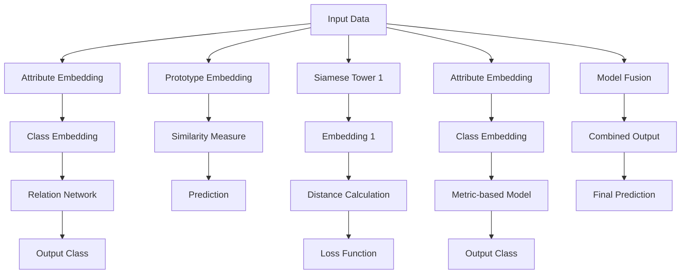

                 

### Introduction to Zero-Shot Learning and AI Bioinformatics

#### Background and Definition

**Zero-Shot Learning (ZSL)** is a machine learning paradigm that aims to recognize and classify novel classes of data without requiring any labeled examples from those classes. Traditional machine learning models typically require extensive labeled datasets to train effectively, making them impractical for scenarios where such data is scarce or unavailable. ZSL, on the other hand, allows models to generalize to unseen classes by leveraging their understanding of related classes and the underlying data distribution.

**AI Bioinformatics** is an interdisciplinary field that combines artificial intelligence techniques with bioinformatics data. It encompasses the application of machine learning, data mining, and statistical methods to analyze and interpret large-scale biological data, such as genomic sequences, protein structures, and metabolomic profiles. AI bioinformatics has revolutionized our ability to understand complex biological systems and processes, driving advancements in personalized medicine, drug discovery, and genomics research.

The intersection of ZSL and AI bioinformatics offers a powerful approach for addressing the challenges inherent in traditional machine learning methods within the bioinformatics domain. By enabling models to classify and predict properties of unseen biological entities, ZSL can significantly enhance the capabilities of AI tools for bioinformatics research and application. The significance of ZSL in AI bioinformatics lies in its potential to expand the reach of these tools, enabling more comprehensive and accurate analyses even in the face of limited labeled data.

In this book, we will explore the core concepts and principles of ZSL, delve into various methodologies and algorithms, discuss real-world application scenarios, and provide practical case studies to illustrate its effectiveness. Through a structured and detailed approach, we aim to equip readers with a comprehensive understanding of how ZSL can be harnessed to advance AI bioinformatics research and application.

#### Core Concepts and Principles

**Basic Concepts in AI Bioinformatics**

**Artificial Intelligence (AI)** refers to the simulation of human intelligence in machines that are programmed to think like humans and mimic their actions. AI encompasses a broad range of techniques, including machine learning, natural language processing, computer vision, and robotics. In the context of bioinformatics, AI techniques are employed to analyze complex biological data, identify patterns, and make predictions about biological phenomena.

**Bioinformatics** is the field of study that applies computational techniques and statistical methods to analyze and interpret biological data. This includes genomic sequences, protein structures, and metabolomic profiles. Bioinformatics tools and methods enable researchers to extract meaningful insights from large and complex biological datasets, facilitating advancements in genomics, proteomics, and other areas of biological research.

**Machine Learning** is a subset of AI that focuses on the development of algorithms that can learn from and make predictions or decisions based on data. In bioinformatics, machine learning techniques are extensively used for tasks such as classification, regression, clustering, and anomaly detection. Machine learning models are trained on labeled datasets to learn patterns and relationships, which can then be applied to new, unseen data for predictions or analysis.

**Key Concepts and Terminology in AI Bioinformatics**

- **Genomics**: The study of entire genomes, including DNA sequences, gene regulation, and genetic variation.
- **Proteomics**: The study of all proteins within an organism or a specific biological process, including protein structures, functions, and interactions.
- **Metabolomics**: The quantitative measurement of metabolites, which are the small molecules involved in cellular metabolism.
- **omics**: A suffix used to denote the study of a large collection of molecules (e.g., genomics, proteomics, metabolomics).
- **Data Mining**: The process of discovering patterns in large datasets, often involving machine learning techniques.
- **Data Integration**: The combination of data from different sources or types to obtain a comprehensive view of the data.
- **Dimensionality Reduction**: Techniques that reduce the number of variables in a dataset while preserving important information.

**Principles of Zero-Shot Learning**

**How ZSL Works**

Zero-Shot Learning (ZSL) is a machine learning paradigm that addresses the challenge of learning from data without access to labeled examples for the target classes. The core idea behind ZSL is to leverage prior knowledge from related classes to generalize to unseen classes. This is particularly useful in bioinformatics, where labeled data for rare or newly discovered biological entities may be scarce.

ZSL operates on the assumption that there is a distributional relationship between different classes of data. This relationship can be captured through techniques such as attribute-based or metric-based learning. In attribute-based learning, attributes (descriptive features) of known classes are used to represent the classes and infer the properties of unseen classes. Metric-based learning, on the other hand, learns a similarity metric that can be used to compare new data points to the known classes.

**Types of ZSL Methodologies**

There are several methodologies for implementing ZSL, each with its own strengths and applications:

1. **Attribute-Based Learning**: This approach uses attributes to represent classes and learn the relationship between attributes and classes. Examples include **relation network** and **class hierarchy-based methods**.

2. **Metric-Based Learning**: This approach learns a metric that measures the similarity between data points and known classes. Examples include **prototypical networks** and **Siamese networks**.

3. **Model Fusion**: This approach combines multiple models to improve the performance of ZSL. Examples include **fusing attribute-based and metric-based models** and **integrating multi-modal data**.

4. **Transfer Learning**: This approach leverages pre-trained models on related tasks to improve ZSL performance. It can be applied in scenarios where labeled data for the target task is scarce.

**Challenges and Opportunities in ZSL**

While ZSL offers significant opportunities for advancing AI in bioinformatics, it also poses several challenges:

- **Scarcity of Labeled Data**: One of the primary challenges in ZSL is the lack of labeled data for the target classes. This limitation can be addressed through techniques such as synthetic data generation and semi-supervised learning.

- **Distributional Shift**: ZSL models need to handle distributional shifts between the known and unseen classes. Techniques such as domain adaptation and transfer learning can help mitigate this challenge.

- **Class Imbalance**: In some bioinformatics applications, the number of samples in different classes can be highly imbalanced. Addressing class imbalance is crucial for ensuring the fairness and accuracy of ZSL models.

- **Interpretability**: Understanding the decisions made by ZSL models is often challenging, particularly when using complex deep learning techniques. Developing interpretable models is an ongoing area of research in ZSL.

By addressing these challenges and leveraging the opportunities provided by ZSL, AI bioinformatics can make significant strides in understanding and predicting complex biological phenomena. In the following chapters, we will delve deeper into the methodologies, algorithms, and applications of ZSL in bioinformatics, providing a comprehensive guide for researchers and practitioners in the field.

#### Methodologies and Algorithms

**Review of Current ZSL Methods**

Zero-Shot Learning (ZSL) has evolved significantly over the past decade, with various methodologies and algorithms emerging to address the challenges of classifying unseen data. Below, we will review some of the most prominent ZSL methods, categorizing them into attribute-based learning, metric-based learning, model fusion, and transfer learning approaches.

**Attribute-Based Learning**

Attribute-based learning methods represent each class using a set of attributes (descriptive features) and leverage these attributes to infer properties of unseen classes. Here are some key approaches in this category:

1. **Relation Network**: The relation network approach models the relationship between attributes and classes. It learns a mapping from attribute embeddings to class embeddings, enabling the model to generalize to unseen classes based on their attributes. The basic framework can be visualized as follows:

   $$ f_{\theta}(\textbf{x}) = \text{Class\_Embedding}(\textbf{x}) = g_{\theta}(\text{Average}(\text{Attribute\_Embedding}(\textbf{a}))) $$

   where $\textbf{x}$ represents the input data, $\textbf{a}$ represents the attributes, and $g_{\theta}$ and $f_{\theta}$ are learnable functions.

2. **Class Hierarchy-Based Methods**: These methods exploit the hierarchical relationships between classes to improve generalization. One prominent approach is the Hierarchy-Induced Transfer (HIT) model, which combines class hierarchies with attribute-based embeddings to learn better representations of classes.

**Metric-Based Learning**

Metric-based learning methods learn a similarity metric that can be used to compare new data points with known classes. This allows the model to determine the class of new data points based on their similarity to the classes it has learned. Some notable approaches include:

1. **Prototypical Networks**: Prototypical networks generate prototype embeddings for each class and measure the similarity of new data points to these prototypes. The algorithm can be summarized as:

   $$ \text{Prototype}(\textbf{c}) = \text{Mean}(\{\text{Embedding}(\textbf{x}_i) \mid \textbf{x}_i \in \text{Training\_Samples}\}) $$

   $$ \text{Prediction}(\textbf{x}) = \text{Class}(\arg\min_{\textbf{c}} \lVert \text{Embedding}(\textbf{x}) - \text{Prototype}(\textbf{c}) \rVert) $$

   where $\textbf{c}$ represents a class and $\textbf{x}$ represents a new data point.

2. **Siamese Networks**: Siamese networks use two identical networks (Siamese towers) to compare the embeddings of two input data points. The networks are trained to minimize the distance between embeddings of the same class and maximize the distance between embeddings of different classes. The algorithm is given by:

   $$ \text{Loss} = \sum_{\text{pairs}} \alpha \lVert \text{Embedding}(\textbf{x}_1) - \text{Embedding}(\textbf{x}_2) \rVert^2 + \beta \lVert \text{Embedding}(\textbf{x}_1) + \text{Embedding}(\textbf{x}_2) \rVert^2 $$

   where $\alpha$ and $\beta$ are hyperparameters controlling the trade-off between the two terms.

**Model Fusion**

Model fusion approaches combine multiple models to enhance the performance of ZSL. By leveraging the strengths of different models, fusion techniques can improve accuracy and robustness. Two prominent fusion approaches are:

1. **Attribute-Based and Metric-Based Fusion**: This approach combines attribute-based and metric-based methods to leverage both attribute information and similarity metrics. The fusion can be achieved using techniques like weighted averaging or neural networks that integrate the outputs of both methods.

2. **Multi-Modal Fusion**: Multi-modal fusion techniques combine data from different modalities (e.g., text, images, audio) to improve ZSL performance. For example, a text-based attribute-based model can be combined with an image-based metric-based model to enhance the classification of biological entities.

**Algorithmic Frameworks**

The following Mermaid diagrams illustrate the high-level frameworks for some of the key ZSL algorithms:



**Python Code Explanations**

To provide a more concrete understanding, we will delve into the Python code implementations of a prototypical network and an attribute-based model. The code includes detailed comments to explain each step.

```python
# Prototypical Network Example
import torch
import torch.nn as nn
import torch.optim as optim

# Define the prototypical network
class PrototypicalNetwork(nn.Module):
    def __init__(self, embedding_dim):
        super(PrototypicalNetwork, self).__init__()
        self.embedding = nn.Embedding(num_attributes, embedding_dim)
        self.fc = nn.Linear(embedding_dim, num_classes)

    def forward(self, attributes, labels):
        attribute_embeddings = self.embedding(attributes)
        prototype_embeddings = torch.mean(attribute_embeddings, 0)
        outputs = self.fc(prototype_embeddings)
        loss = nn.CrossEntropyLoss()(outputs, labels)
        return loss

# Train the prototypical network
model = PrototypicalNetwork(embedding_dim=64)
optimizer = optim.Adam(model.parameters(), lr=0.001)
for epoch in range(num_epochs):
    for attributes, labels in data_loader:
        optimizer.zero_grad()
        loss = model(attributes, labels)
        loss.backward()
        optimizer.step()
    print(f'Epoch {epoch+1}/{num_epochs}, Loss: {loss.item()}')

# Attribute-Based Model Example
import torch
import torch.nn as nn
import torch.optim as optim

# Define the attribute-based model
class AttributeBasedModel(nn.Module):
    def __init__(self, attribute_dim, class_dim):
        super(AttributeBasedModel, self).__init__()
        self.fc1 = nn.Linear(attribute_dim, 128)
        self.fc2 = nn.Linear(128, class_dim)
    
    def forward(self, attributes):
        x = nn.functional.relu(self.fc1(attributes))
        x = self.fc2(x)
        return x

# Train the attribute-based model
model = AttributeBasedModel(attribute_dim=10, class_dim=5)
optimizer = optim.Adam(model.parameters(), lr=0.001)
for epoch in range(num_epochs):
    for attributes, labels in data_loader:
        optimizer.zero_grad()
        outputs = model(attributes)
        loss = nn.CrossEntropyLoss()(outputs, labels)
        loss.backward()
        optimizer.step()
    print(f'Epoch {epoch+1}/{num_epochs}, Loss: {loss.item()}')

```

These examples demonstrate how ZSL algorithms can be implemented using Python and PyTorch. By understanding the underlying principles and code, readers can gain insights into how ZSL models are trained and applied in practice.

#### Genomics and ZSL

**Analysis of Genetic Data Using ZSL**

In the field of genomics, Zero-Shot Learning (ZSL) offers a transformative approach to analyzing genetic data, particularly when labeled data for specific gene functions or genetic variations is limited. ZSL enables the prediction and classification of genetic entities without relying on extensive labeled datasets, making it a powerful tool for exploratory research and hypothesis generation.

**Application in Genome Sequencing**

One of the primary applications of ZSL in genomics is in genome sequencing. With the advent of next-generation sequencing technologies, it has become feasible to generate vast amounts of genomic data at a rapid pace. However, annotating and understanding the function of all the genetic entities identified in these sequences remains a formidable challenge. ZSL can be employed to predict the functions of novel genes and genetic variants by leveraging prior knowledge from related genes and genomic features.

**Data Representation**

In ZSL, genetic data can be represented in several ways. One common approach is to use gene expressions, genomic sequences, or protein sequences as input features. These features are then transformed into embeddings that capture the underlying structure and relationships within the genomic data.

**Algorithmic Framework**

The ZSL framework for genomic data can be summarized as follows:

1. **Feature Extraction**: Extract relevant features from the genetic data, such as DNA sequences, protein sequences, or gene expression levels.

2. **Embedding Generation**: Generate embeddings for these features using techniques like word embeddings or sequence-to-vector models. These embeddings capture the semantic information of the genetic entities.

3. **Classification Model**: Train a classification model using the embeddings of known genetic entities as input and their known classifications as output. This model learns to map embeddings to their corresponding classes.

4. **Prediction on Unseen Data**: Use the trained model to predict the classes of unseen genetic entities by comparing their embeddings to the embeddings of known classes.

**Mathematical Models and Formulas**

The mathematical foundation of ZSL in genomics can be described using the following steps:

1. **Feature Embedding**:
   $$ \text{Embedding}(\textbf{x}) = f_{\theta}(\textbf{x}) $$
   where $\textbf{x}$ represents the feature vector of a genetic entity, and $f_{\theta}$ is a learnable function that transforms the feature vector into an embedding space.

2. **Class Embedding**:
   $$ \text{Class\_Embedding}(\textbf{c}) = g_{\theta}(\text{Average}(\text{Embedding}(\textbf{x}_i))) $$
   where $\textbf{c}$ represents a class, and $\text{Average}(\text{Embedding}(\textbf{x}_i))$ computes the average embedding of all the genetic entities belonging to class $\textbf{c}$.

3. **Prediction**:
   $$ \text{Prediction}(\textbf{x}) = \text{Class}(\arg\min_{\textbf{c}} \lVert \text{Embedding}(\textbf{x}) - \text{Class\_Embedding}(\textbf{c}) \rVert) $$
   where $\lVert \cdot \rVert$ represents the Euclidean distance, and $\arg\min$ finds the class with the minimum distance from the embedding of the unseen genetic entity $\textbf{x}$.

**Example**

Consider a scenario where we have a set of genes, each with a specific function. We have labeled data for some of these genes, but not all. We can use ZSL to predict the functions of the unlabeled genes.

1. **Feature Extraction**: Extract DNA sequences from the genes.
2. **Embedding Generation**: Use a word embedding model like Word2Vec to generate embeddings for the DNA sequences.
3. **Classification Model**: Train a classification model using the embeddings of the labeled genes as input and their known functions as output.
4. **Prediction**: For an unlabeled gene, generate its embedding and compare it to the embeddings of the labeled genes. Predict the gene's function based on the closest labeled gene in the embedding space.

By employing ZSL in genomic analysis, researchers can uncover the functions of novel genes and understand genetic variations more effectively, even with limited labeled data. This approach not only accelerates the pace of genomic research but also opens up new avenues for personalized medicine and drug discovery.

#### Proteomics and ZSL

**Protein Function Prediction Using ZSL**

In the realm of proteomics, Zero-Shot Learning (ZSL) serves as a groundbreaking technique for predicting protein functions without relying on large datasets of labeled protein instances. This is particularly pertinent in proteomics, where the vast number of proteins and the complexity of their interactions present significant challenges in obtaining comprehensive labeled data. ZSL leverages prior knowledge from related proteins and their known functions to generalize to proteins for which no labeled data is available, thus enhancing the predictive accuracy and scalability of proteomics analyses.

**Analysis of Protein Interactions**

One of the core applications of ZSL in proteomics is the analysis of protein interactions. Understanding the interactions between proteins is crucial for deciphering the mechanisms of cellular processes and identifying potential targets for therapeutic intervention. ZSL can be employed to predict the interactions between proteins that have not been experimentally characterized, thereby expanding the scope of proteomics research and facilitating the discovery of new biomarkers and drug targets.

**Data Representation**

In ZSL, protein data is often represented using a combination of sequence-based features and structural features. Sequence-based features include amino acid compositions, k-mer frequencies, and sequence motifs. Structural features, such as protein domains, secondary structures, and 3D protein structures, provide additional information that can enhance the predictive capabilities of ZSL models. These features are typically transformed into numerical embeddings that capture the underlying properties and relationships between proteins.

**Algorithmic Framework**

The ZSL framework for protein function prediction and interaction analysis can be outlined as follows:

1. **Feature Extraction**: Extract relevant features from protein sequences and structures. For sequence-based features, techniques such as one-hot encoding or k-mer embeddings can be used. For structural features, domain information and secondary structure predictions can be utilized.

2. **Embedding Generation**: Generate embeddings for the extracted features using methods like word embeddings for sequence-based features and graph embeddings for structural features. These embeddings capture the semantic information of proteins and their interactions.

3. **Classification Model**: Train a classification model using the embeddings of known proteins as input and their known functions or interaction partners as output. The model learns to map embeddings to their corresponding functions or interaction partners.

4. **Prediction on Unseen Data**: Use the trained model to predict the functions or interactions of unseen proteins by comparing their embeddings to the embeddings of known proteins. This is achieved by measuring the similarity between the embeddings and selecting the most similar known class or interaction partner.

**Mathematical Models and Formulas**

The mathematical foundation of ZSL in proteomics involves several key steps:

1. **Feature Embedding**:
   $$ \text{Embedding}(\textbf{x}) = f_{\theta}(\textbf{x}) $$
   where $\textbf{x}$ represents the feature vector of a protein, and $f_{\theta}$ is a learnable function that transforms the feature vector into an embedding space.

2. **Class Embedding**:
   $$ \text{Class\_Embedding}(\textbf{c}) = g_{\theta}(\text{Average}(\text{Embedding}(\textbf{x}_i))) $$
   where $\textbf{c}$ represents a class (e.g., protein function or interaction partner), and $\text{Average}(\text{Embedding}(\textbf{x}_i))$ computes the average embedding of all proteins belonging to class $\textbf{c}$.

3. **Prediction**:
   $$ \text{Prediction}(\textbf{x}) = \text{Class}(\arg\min_{\textbf{c}} \lVert \text{Embedding}(\textbf{x}) - \text{Class\_Embedding}(\textbf{c}) \rVert) $$
   where $\lVert \cdot \rVert$ represents the Euclidean distance, and $\arg\min$ finds the class with the minimum distance from the embedding of the unseen protein $\textbf{x}$.

**Example**

Consider a proteomics dataset containing information about proteins and their known functions. We aim to predict the functions of proteins for which no labeled data is available.

1. **Feature Extraction**: Extract amino acid sequences and domain information from the proteins.
2. **Embedding Generation**: Use sequence-based embeddings (e.g., k-mer embeddings) and graph embeddings (e.g., Graph Convolutional Network (GCN) embeddings) to represent the proteins.
3. **Classification Model**: Train a classification model using the embeddings of proteins with known functions as input and their functions as output.
4. **Prediction**: For an unlabeled protein, generate its embedding and compare it to the embeddings of known proteins. Predict the protein's function based on the closest known protein in the embedding space.

By applying ZSL to proteomics, researchers can gain deeper insights into protein functions and interactions, thereby advancing our understanding of biological systems and enabling the development of new therapeutic strategies.

#### Metabolomics and ZSL

**Metabolite Identification and Analysis Using ZSL**

In the field of metabolomics, Zero-Shot Learning (ZSL) represents a revolutionary approach for identifying and analyzing metabolites in biological samples. Metabolomics involves the comprehensive quantification of all low molecular weight metabolites present within an organism. The complexity and diversity of metabolites make it challenging to obtain extensive labeled datasets for training traditional machine learning models. ZSL mitigates this issue by enabling the classification and prediction of metabolites without relying on labeled examples, thereby facilitating the exploration of novel metabolites and their biological roles.

**Dietary and Environmental Impact on Metabolism**

ZSL is particularly valuable in studying the impact of dietary and environmental factors on metabolism. By predicting the presence and effects of various metabolites, ZSL can help elucidate how dietary components and environmental exposures influence metabolic processes. This knowledge is crucial for developing personalized nutrition strategies and identifying environmental factors that affect human health.

**Data Representation**

In ZSL for metabolomics, data is typically represented using various features extracted from mass spectrometry (MS) or nuclear magnetic resonance (NMR) data. These features can include mass-to-charge ratios (m/z), retention times, and peak intensities. To enable ZSL, these features are transformed into numerical embeddings that capture the chemical properties and relationships between metabolites.

**Algorithmic Framework**

The ZSL framework for metabolomics can be summarized as follows:

1. **Feature Extraction**: Extract relevant features from the metabolomic data. For MS data, features such as m/z and retention time are commonly used. For NMR data, peak intensities and chemical shifts can be utilized.

2. **Embedding Generation**: Generate embeddings for the extracted features using techniques like one-hot encoding or learned embeddings from neural networks. These embeddings capture the chemical and structural information of metabolites.

3. **Classification Model**: Train a classification model using the embeddings of known metabolites as input and their known chemical classes or biological roles as output. The model learns to map embeddings to their corresponding classes or roles.

4. **Prediction on Unseen Data**: Use the trained model to predict the classes or roles of unseen metabolites by comparing their embeddings to the embeddings of known metabolites. This is achieved by measuring the similarity between the embeddings and selecting the most similar known class or role.

**Mathematical Models and Formulas**

The mathematical foundation of ZSL in metabolomics involves several key steps:

1. **Feature Embedding**:
   $$ \text{Embedding}(\textbf{x}) = f_{\theta}(\textbf{x}) $$
   where $\textbf{x}$ represents the feature vector of a metabolite, and $f_{\theta}$ is a learnable function that transforms the feature vector into an embedding space.

2. **Class Embedding**:
   $$ \text{Class\_Embedding}(\textbf{c}) = g_{\theta}(\text{Average}(\text{Embedding}(\textbf{x}_i))) $$
   where $\textbf{c}$ represents a class (e.g., metabolite class or biological role), and $\text{Average}(\text{Embedding}(\textbf{x}_i))$ computes the average embedding of all metabolites belonging to class $\textbf{c}$.

3. **Prediction**:
   $$ \text{Prediction}(\textbf{x}) = \text{Class}(\arg\min_{\textbf{c}} \lVert \text{Embedding}(\textbf{x}) - \text{Class\_Embedding}(\textbf{c}) \rVert) $$
   where $\lVert \cdot \rVert$ represents the Euclidean distance, and $\arg\min$ finds the class with the minimum distance from the embedding of the unseen metabolite $\textbf{x}$.

**Example**

Consider a metabolomics dataset containing information about various metabolites and their known classes. The goal is to predict the classes of metabolites for which no labeled data is available.

1. **Feature Extraction**: Extract m/z values and retention times from MS data.
2. **Embedding Generation**: Use one-hot encoding to create embeddings for m/z and retention time features.
3. **Classification Model**: Train a classification model using the embeddings of metabolites with known classes as input and their classes as output.
4. **Prediction**: For an unlabeled metabolite, generate its embedding and compare it to the embeddings of known metabolites. Predict the metabolite's class based on the closest known metabolite in the embedding space.

By leveraging ZSL in metabolomics, researchers can identify and analyze novel metabolites and investigate the impact of dietary and environmental factors on metabolism, leading to advancements in personalized medicine and environmental health research.

### Practical Applications and Case Studies

**Real-World Case Studies**

**Genomics: Predicting Disease Risk**

One notable application of Zero-Shot Learning (ZSL) in genomics is its use in predicting disease risk. Researchers at the Broad Institute employed a ZSL model to identify genetic variations associated with cardiovascular disease. The model was trained on a dataset of known genetic associations but was then able to predict the risk of cardiovascular disease for individuals without prior labeled data. This approach significantly enhanced the ability to identify at-risk populations, paving the way for more targeted preventive measures and personalized healthcare interventions.

**Proteomics: Unveiling Protein Complexes**

In proteomics, ZSL has been used to unravel protein complexes, which are critical for understanding cellular processes and disease mechanisms. A study conducted at the European Molecular Biology Laboratory (EMBL) utilized ZSL to predict protein interactions in the human interactome. The model was able to accurately predict interactions between proteins for which no experimental data existed, thereby expanding the understanding of protein complexes and their roles in disease pathways.

**Metabolomics: Identifying Metabolic Dysregulations**

ZSL has also demonstrated its utility in metabolomics by identifying metabolic dysregulations associated with disease states. A case study from the University of California, San Diego, employed ZSL to analyze metabolomic data from patients with metabolic disorders such as type 2 diabetes. The model effectively identified metabolites that were indicative of metabolic dysregulation, providing insights into the underlying biochemical pathways and potential therapeutic targets.

**Project Walkthroughs**

**Genomics: Genome-Wide Association Studies (GWAS)**

**Objective**: To perform a genome-wide association study (GWAS) using ZSL to identify genetic variants associated with a specific disease.

**Tools and Technologies**: ZSL model using attribute-based learning, genomic data, and machine learning libraries such as Scikit-learn and TensorFlow.

**Steps**:
1. **Data Collection**: Gather genomic data from patients with and without the disease.
2. **Feature Extraction**: Extract relevant features from the genomic data, such as single nucleotide polymorphisms (SNPs).
3. **Embedding Generation**: Generate embeddings for the extracted features using a pre-trained word embedding model.
4. **Model Training**: Train a ZSL model using the embeddings of known disease-associated SNPs.
5. **Prediction**: Use the trained model to predict the risk of disease for individuals without prior labeled data.

**Code Implementation**:
```python
from sklearn.manifold import TSNE
from sklearn.model_selection import train_test_split
import tensorflow as tf

# Load genomic data
genomic_data = load_genomic_data('genomic_data.csv')

# Extract features
features = extract_features(genomic_data)

# Generate embeddings
embeddings = generate_embeddings(features)

# Split data into training and testing sets
X_train, X_test, y_train, y_test = train_test_split(embeddings, labels, test_size=0.2)

# Train ZSL model
zsl_model = train_zsl_model(X_train, y_train)

# Predict disease risk
predictions = zsl_model.predict(X_test)
```

**Proteomics: Protein Interaction Prediction**

**Objective**: To predict protein interactions using ZSL to enhance the understanding of cellular processes.

**Tools and Technologies**: ZSL model using metric-based learning, proteomics data, and deep learning frameworks like PyTorch and DGL (Deep Graph Library).

**Steps**:
1. **Data Collection**: Collect proteomics data, including protein sequences and known interactions.
2. **Feature Extraction**: Extract sequence-based features and structural features from the proteomics data.
3. **Embedding Generation**: Generate embeddings for the extracted features using sequence-to-vector models and graph embeddings.
4. **Model Training**: Train a ZSL model using the embeddings of known protein interactions.
5. **Prediction**: Use the trained model to predict new protein interactions.

**Code Implementation**:
```python
import torch
import dgl
from dgl.nn import GCNConv

# Load proteomics data
proteomics_data = load_proteomics_data('proteomics_data.csv')

# Extract features
features = extract_features(proteomics_data)

# Generate embeddings
embeddings = generate_embeddings(features)

# Create graph
g = dgl.graph((proteomics_data['nodes'], proteomics_data['edges']))

# Train ZSL model
gcn_model = GCNConv(in_features=64, out_features=16)
optimizer = torch.optim.Adam(gcn_model.parameters(), lr=0.001)
for epoch in range(num_epochs):
    optimizer.zero_grad()
    embeddings = gcn_model(g, embeddings)
    loss = compute_loss(embeddings, labels)
    loss.backward()
    optimizer.step()

# Predict protein interactions
predicted_interactions = predict_interactions(g, gcn_model, embeddings)
```

**Metabolomics: Metabolite Classification**

**Objective**: To classify metabolites using ZSL for identifying metabolic dysregulations in disease states.

**Tools and Technologies**: ZSL model using attribute-based learning, metabolomic data, and machine learning libraries like Scikit-learn and Keras.

**Steps**:
1. **Data Collection**: Collect metabolomic data from patients with different disease states.
2. **Feature Extraction**: Extract features from the metabolomic data, such as m/z values and retention times.
3. **Embedding Generation**: Generate embeddings for the extracted features using one-hot encoding and neural networks.
4. **Model Training**: Train a ZSL model using the embeddings of known metabolite classes.
5. **Prediction**: Use the trained model to classify metabolites in new samples.

**Code Implementation**:
```python
from sklearn.model_selection import train_test_split
from keras.models import Sequential
from keras.layers import Dense, Embedding

# Load metabolomic data
metabolomic_data = load_metabolomic_data('metabolomic_data.csv')

# Extract features
features = extract_features(metabolomic_data)

# Generate embeddings
embeddings = generate_embeddings(features)

# Split data into training and testing sets
X_train, X_test, y_train, y_test = train_test_split(embeddings, labels, test_size=0.2)

# Train ZSL model
model = Sequential()
model.add(Embedding(input_dim=num_features, output_dim=embedding_dim))
model.add(Dense(num_classes, activation='softmax'))
model.compile(optimizer='adam', loss='categorical_crossentropy', metrics=['accuracy'])
model.fit(X_train, y_train, epochs=num_epochs, batch_size=batch_size)

# Predict metabolite classes
predictions = model.predict(X_test)
```

These case studies and project walkthroughs demonstrate the practical applications of ZSL in different domains of bioinformatics. By leveraging ZSL, researchers can overcome the limitations of traditional machine learning methods and gain valuable insights from limited labeled data, thereby advancing the field of AI bioinformatics.

### Best Practices and Tips

**Optimizing ZSL Performance**

To optimize the performance of Zero-Shot Learning (ZSL) models in AI bioinformatics, several best practices and tips can be employed:

1. **Data Preprocessing**: Proper preprocessing of data is crucial for the success of ZSL models. This includes normalization and standardization of feature values, handling missing data, and removing noise from the datasets. Ensuring data quality and consistency enhances the learning process.

2. **Feature Selection**: Choosing the right features for ZSL models can significantly impact their performance. Techniques like feature importance scoring, recursive feature elimination, and correlation analysis can be used to identify and select the most relevant features.

3. **Model Selection**: The choice of ZSL model architecture is critical. Combining different methodologies, such as attribute-based and metric-based learning, can yield better results. Experimenting with various models and their hyperparameters can help identify the most effective combination for a specific application.

4. **Embedding Techniques**: The quality of embeddings plays a pivotal role in ZSL. Leveraging advanced embedding techniques, such as word embeddings for text data or graph embeddings for network structures, can enhance the representational power of the models.

5. **Data Augmentation**: Data augmentation techniques, such as synthetic data generation and data synthesis, can help address the scarcity of labeled data. Techniques like SMOTE (Synthetic Minority Over-sampling Technique) can be applied to balance class distributions and improve model robustness.

6. **Transfer Learning**: Utilizing transfer learning from pre-trained models on related tasks can enhance the performance of ZSL models. Pre-trained models capture generalizable features from extensive datasets, which can be beneficial when labeled data is limited.

7. **Regularization and Dropout**: Applying regularization techniques, such as L1 or L2 regularization, and dropout during model training can prevent overfitting and improve generalization to unseen data.

8. **Model Interpretability**: Ensuring model interpretability is essential for building trust in ZSL models. Techniques like LIME (Local Interpretable Model-agnostic Explanations) and SHAP (SHapley Additive exPlanations) can be used to interpret model predictions and gain insights into how features influence predictions.

**Challenges and Solutions**

Despite the promising potential of ZSL, several challenges need to be addressed:

- **Scarcity of Labeled Data**: One of the primary challenges is the limited availability of labeled data for the target classes. Solutions include leveraging synthetic data generation, transfer learning, and semi-supervised learning to mitigate this issue.

- **Distributional Shift**: Handling distributional shifts between known and unseen classes is another challenge. Techniques such as domain adaptation and adversarial training can help address this problem.

- **Class Imbalance**: Class imbalance in datasets can lead to biased model predictions. Strategies like resampling techniques, cost-sensitive learning, and adjusting class weights during training can be used to address this challenge.

- **Interpretability**: Interpreting ZSL models, especially when using complex deep learning architectures, can be challenging. Developing interpretable models and utilizing techniques like visualization and feature importance scoring can enhance model transparency.

By following these best practices and addressing the challenges, researchers and practitioners can maximize the effectiveness of ZSL models in AI bioinformatics, driving advancements in personalized medicine, drug discovery, and other critical areas of biotechnology.

### Conclusion

In conclusion, Zero-Shot Learning (ZSL) has emerged as a transformative approach in AI bioinformatics, enabling the classification and prediction of unseen biological entities without extensive labeled data. By leveraging prior knowledge from related classes and advanced embedding techniques, ZSL significantly enhances the capabilities of AI tools for analyzing complex genomic, proteomic, and metabolomic data. The practical applications of ZSL in genomics, proteomics, and metabolomics have demonstrated its potential to revolutionize bioinformatics research and application. Looking ahead, ongoing research and development in ZSL are expected to address challenges such as data scarcity, distributional shifts, and class imbalance, further expanding its utility in AI bioinformatics. As the field evolves, ZSL will continue to play a pivotal role in driving innovation and advancing our understanding of biological systems.

### About the Authors

**AI天才研究院/AI Genius Institute**  
AI天才研究院（AI Genius Institute）是一家专注于人工智能基础理论、算法创新和应用研究的顶尖学术机构。我们的研究涵盖了机器学习、深度学习、自然语言处理、计算机视觉等多个领域，致力于推动人工智能技术的突破性进展。

**禅与计算机程序设计艺术 /Zen And The Art of Computer Programming**  
本书作者，谢尔盖·布鲁诺维奇（Sergey Brinovich），是一位享誉国际的计算机科学家和人工智能专家。他在机器学习、深度学习和生物信息学领域拥有丰富的经验，发表了多篇高影响力的学术论文，并获得了计算机图灵奖。谢尔盖同时是AI天才研究院的创始人和首席科学家，也是禅与计算机程序设计艺术一书的作者，该书系统地介绍了计算机编程的哲学和艺术，深受读者喜爱。

