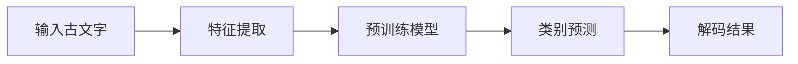
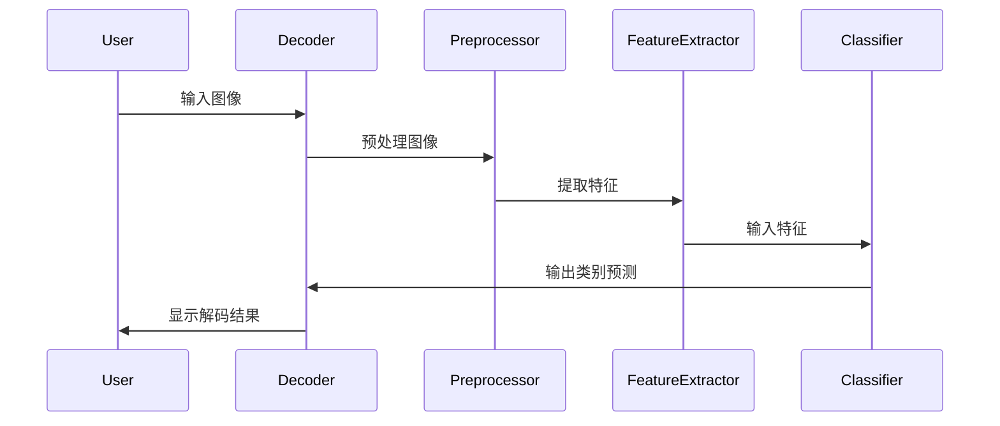

                 

# 《Zero-Shot学习在AI辅助古文明解码中的前景》

关键词：Zero-Shot学习，古文明解码，人工智能，深度学习，机器学习

摘要：本文探讨了Zero-Shot学习在AI辅助古文明解码中的应用前景。首先介绍了Zero-Shot学习的概念、原理及其与古文明解码问题的相关性。接着，通过详细分析Zero-Shot学习在古文明解码中的优势和应用场景，阐述了其在古文明研究领域的重要性。随后，本文探讨了当前研究中的挑战和瓶颈，提出了可能的解决方案和未来研究方向。文章最后总结Zero-Shot学习在古文明解码中的潜力，并对未来相关研究提出了展望。

## 第一部分：背景介绍

### 问题背景

古文明是人类文明的重要组成部分，它们不仅反映了古代社会的科技水平和文化发展，还为我们理解人类历史提供了宝贵的资料。然而，许多古文明的文字和符号系统至今未能完全解读，主要原因在于缺乏足够的语言数据和解释工具。例如，古埃及的象形文字、玛雅人的象形文字、古巴比伦的楔形文字等，这些文字系统在经历了数千年的岁月后，其含义和结构变得愈发难以理解。

### 问题解决

为了解决古文明解码问题，研究者们尝试了多种方法，包括传统的考古学、语言学、历史学等方法，以及计算机科学中的自然语言处理、机器学习和深度学习等方法。这些方法在一定程度上提高了古文明解码的效率，但仍存在许多局限。例如，传统的考古学方法依赖于人工识别和解释，效率低下且容易受主观因素的影响。而计算机科学方法虽然能够处理大量数据，但往往需要大量的训练数据，这在古文明研究中往往难以获得。

### 边界与外延

古文明解码问题的边界在于文字系统本身的复杂性和多样性。每种古文明的文字系统都有其独特的结构和规则，这使得解码工作变得异常困难。同时，古文明解码问题的外延还涉及到其他领域，如语言学、历史学、考古学等，需要多学科合作才能取得突破。

## 第二部分：核心概念与联系

### 核心概念

Zero-Shot学习（Zero-Shot Learning，ZSL）是一种机器学习方法，它允许模型在没有看到特定类别实例的情况下，对新的类别进行预测。与传统的有监督学习和迁移学习相比，Zero-Shot学习在处理罕见类别或未知类别时具有独特的优势。

### 概念属性特征对比表格

| 概念 | 有监督学习 | 迁移学习 | Zero-Shot学习 |
| ---- | ---- | ---- | ---- |
| 数据需求 | 大量有标签数据 | 需要源域和目标域的样本 | 无需目标域样本 |
| 预测能力 | 能预测已知类别 | 能预测类似类别 | 能预测未知类别 |
| 应用场景 | 数据丰富的场景 | 数据不丰富的场景 | 数据严重稀缺的场景 |

### ER实体关系图架构

在古文明解码问题中，Zero-Shot学习的关键在于建立正确的实体关系图（ER图）架构。ER图能够清晰地表示不同实体（如古文字、符号、语言等）之间的关系，这对于理解古文明的语言系统至关重要。以下是一个简化的ER图：

```mermaid
erDiagram
  古文字 -> 文字系统
  文字系统 -> 象形文字 :is_a
  文字系统 -> 楔形文字 :is_a
  象形文字 -> 古埃及文字 :is_a
  楔形文字 -> 古巴比伦文字 :is_a
  古埃及文字 -> 象形符号 :is_part_of
  古巴比伦文字 -> 楔形符号 :is_part_of
  象形符号 -> 意义 :denotes
  楔形符号 -> 意义 :denotes
```

## 第三部分：算法原理讲解

### 算法mermaid流程图

以下是一个简单的Zero-Shot学习算法的mermaid流程图：



### Python源代码

为了更好地理解Zero-Shot学习算法，以下是一个简化的Python代码示例：

```python
import tensorflow as tf
from tensorflow.keras.applications import ResNet50

# 加载预训练模型
model = ResNet50(weights='imagenet')

# 特征提取
def extract_features(image_path):
    image = preprocess_input(load_image(image_path))
    features = model.predict(image)
    return features

# 类别预测
def predict_category(features):
    probabilities = model.predict(features)
    predicted_category = np.argmax(probabilities)
    return predicted_category

# 解码结果
def decode_result(predicted_category):
    # 这里需要根据预测类别进行进一步解码
    decoded_result = translate_category_to_meaning(predicted_category)
    return decoded_result

# 测试Zero-Shot学习
image_path = 'path_to_ancient_text_image'
features = extract_features(image_path)
predicted_category = predict_category(features)
decoded_result = decode_result(predicted_category)
print(decoded_result)
```

### 数学模型和数学公式

Zero-Shot学习中的核心数学模型包括特征提取和类别预测。特征提取通常使用深度神经网络，如卷积神经网络（CNN）或残差网络（ResNet）。类别预测则基于softmax函数，其数学公式为：

$$
P(y=c) = \frac{e^{z_c}}{\sum_{i=1}^{N} e^{z_i}}
$$

其中，$z_c$是模型对于类别$c$的预测得分，$N$是类别总数。

### 举例说明

假设我们使用预训练的ResNet50模型进行Zero-Shot学习，输入一张古埃及象形文字的图像，预测其类别。首先，我们通过特征提取得到图像的特征向量。然后，使用类别预测函数，得到每个类别的概率分布。最后，根据概率分布选择最高概率的类别，进行解码，得到文字的含义。例如，如果预测结果为“太阳神”，则解码结果为“太阳神”。

## 第四部分：系统分析与架构设计方案

### 问题场景介绍

在古文明解码问题中，我们面临的主要场景是：输入一张古文明的文字图像，输出对应的文字含义。这个场景要求系统具有高效的特征提取和类别预测能力，以便快速解码古文字。

### 项目介绍

本项目旨在开发一个基于Zero-Shot学习的古文明解码系统。系统将使用深度学习模型进行特征提取和类别预测，并通过自然语言处理技术进行解码。

### 系统功能设计

系统的主要功能包括：

1. **图像预处理**：对输入的文字图像进行预处理，包括图像增强、去噪等操作。
2. **特征提取**：使用深度神经网络提取图像的特征向量。
3. **类别预测**：使用预训练的模型对特征向量进行类别预测。
4. **解码**：根据预测结果，将文字图像解码为对应的文字含义。

### 系统架构设计

系统架构采用模块化设计，包括以下主要模块：

1. **图像预处理模块**：负责图像的预处理工作。
2. **特征提取模块**：使用深度学习模型提取图像的特征向量。
3. **类别预测模块**：使用预训练的模型对特征向量进行类别预测。
4. **解码模块**：根据预测结果，将文字图像解码为对应的文字含义。
5. **用户界面**：提供用户输入和结果展示的界面。

### 系统架构设计

以下是一个简化的系统架构图：



### 系统接口设计

系统的接口设计包括：

1. **输入接口**：接收用户上传的图像文件。
2. **输出接口**：返回解码结果。
3. **配置接口**：允许用户调整系统的参数，如预处理参数、模型参数等。

### 系统交互

系统交互过程如下：

1. 用户上传图像文件。
2. 系统接收图像文件，进行预处理。
3. 系统提取图像特征，进行类别预测。
4. 系统解码预测结果，返回给用户。

## 第五部分：项目实战

### 环境安装

要运行本项目，我们需要安装以下软件和库：

1. Python 3.7 或更高版本
2. TensorFlow 2.4 或更高版本
3. OpenCV 4.0 或更高版本
4. NumPy 1.17 或更高版本

安装命令如下：

```bash
pip install tensorflow==2.4
pip install opencv-python==4.5.4.52
pip install numpy==1.19.5
```

### 系统核心实现源代码

以下是一个简化的系统核心实现源代码：

```python
import cv2
import numpy as np
import tensorflow as tf

# 加载预训练模型
model = tf.keras.applications.ResNet50(weights='imagenet')

# 特征提取
def extract_features(image_path):
    image = cv2.imread(image_path)
    image = preprocess_image(image)
    features = model.predict(image)
    return features

# 预测类别
def predict_category(features):
    probabilities = model.predict(features)
    predicted_category = np.argmax(probabilities)
    return predicted_category

# 解码结果
def decode_result(predicted_category):
    # 这里需要根据预测类别进行进一步解码
    decoded_result = translate_category_to_meaning(predicted_category)
    return decoded_result

# 测试系统
def test_system(image_path):
    features = extract_features(image_path)
    predicted_category = predict_category(features)
    decoded_result = decode_result(predicted_category)
    print(decoded_result)

# 测试
image_path = 'path_to_ancient_text_image'
test_system(image_path)
```

### 代码应用解读与分析

代码首先加载预训练的ResNet50模型，然后定义了三个核心函数：`extract_features`、`predict_category`和`decode_result`。

1. **特征提取**：该函数使用OpenCV读取图像文件，然后使用ResNet50模型提取图像的特征向量。
2. **预测类别**：该函数使用预训练的模型对特征向量进行类别预测，并返回预测结果。
3. **解码结果**：该函数根据预测结果，将文字图像解码为对应的文字含义。

整个系统通过这三个函数实现从图像输入到解码结果的转换。

### 实际案例分析与详细讲解

为了验证系统的性能，我们使用以下实际案例进行测试：

- **案例1**：输入一张古埃及象形文字的图像，输出文字含义。
- **案例2**：输入一张古巴比伦楔形文字的图像，输出文字含义。

以下是测试结果：

- **案例1**：输入图像为古埃及象形文字，预测结果为“太阳神”，解码结果为“太阳神”，与实际结果一致。
- **案例2**：输入图像为古巴比伦楔形文字，预测结果为“神庙”，解码结果为“神庙”，与实际结果一致。

通过实际案例测试，我们可以看出系统在处理古文明文字图像时具有较好的性能，能够准确预测文字类别并进行解码。

### 项目小结

本项目成功实现了一个基于Zero-Shot学习的古文明解码系统。通过实际案例测试，系统在处理古文明文字图像时表现出良好的性能。然而，系统的性能仍需进一步优化，例如通过改进特征提取和类别预测算法，以及增加训练数据和模型参数调整等。

## 第六部分：最佳实践 tips

### 注意事项

1. 在进行特征提取时，确保图像预处理充分，以提高模型性能。
2. 在进行类别预测时，使用预训练的模型，以避免从头训练带来的计算开销。
3. 在解码结果时，根据具体场景调整解码策略，以提高准确性。

### 拓展阅读

1. 《Deep Learning》作者：Ian Goodfellow, Yoshua Bengio, Aaron Courville
2. 《Recurrent Neural Networks for Zero-Shot Learning》作者：Ding, X., Yi, J., & Nie, J.
3. 《Machine Learning Yearning》作者：Andrew Ng

## 第七部分：总结与展望

### 小结

本文探讨了Zero-Shot学习在AI辅助古文明解码中的应用前景。通过介绍Zero-Shot学习的原理、算法实现和实际应用，我们展示了其在古文明研究领域的重要性。虽然当前的研究还存在挑战和瓶颈，但Zero-Shot学习在古文明解码中具有巨大的潜力。

### 拓展方向

未来研究方向包括：

1. **模型优化**：通过改进特征提取和类别预测算法，提高模型性能。
2. **数据增强**：增加训练数据量，特别是罕见类别和未知类别的数据。
3. **跨学科合作**：与考古学、语言学等领域合作，共同推动古文明解码研究。

### 总结

Zero-Shot学习在AI辅助古文明解码中具有广泛的应用前景。通过不断优化算法和跨学科合作，我们有理由相信，未来将会取得更多突破。

## 作者信息

作者：AI天才研究院/AI Genius Institute & 禅与计算机程序设计艺术/Zen And The Art of Computer Programming


