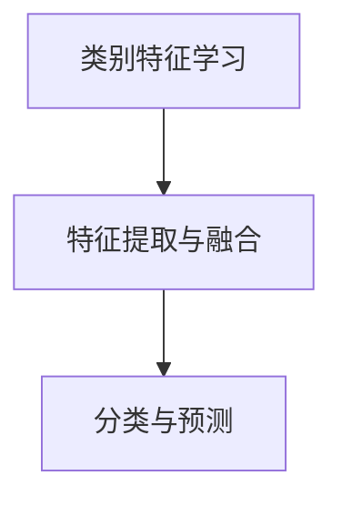
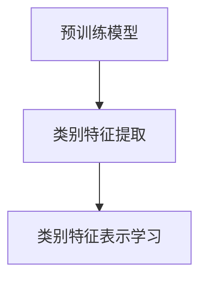
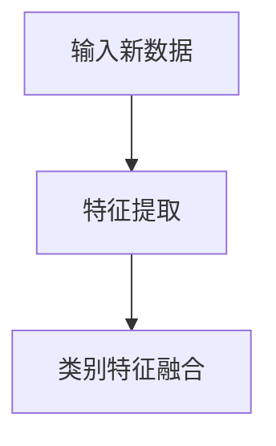
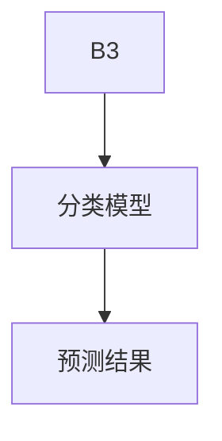

                 

### 4.1 零射学习基本原理

#### 1. 核心概念

零射学习（Zero-Shot Learning，ZSL）是一种机器学习方法，旨在使模型能够在未见过的类别上做出预测。与传统机器学习方法不同，零射学习不依赖于对目标类别进行大量样本的学习。它在人工智能和计算机视觉领域具有重要意义，尤其是在处理大规模多类别数据时。

零射学习的基本概念包括：

- **类别先验知识**：零射学习依赖于对类别先验知识的获取，通常是通过预训练的模型或人工标注的元数据来获得。
- **特征提取**：模型需要从输入数据中提取有用的特征，以便进行分类或预测。
- **适配性**：零射学习模型需要具备良好的适配性，能够在未见过的类别上快速适应和做出准确的预测。

#### 2. 工作原理

零射学习的工作原理可以概括为以下几个步骤：

1. **类别特征学习**：通过预训练模型或人工标注的元数据，学习到每个类别的特征表示。这些特征表示通常采用高维向量形式表示，使得不同类别之间的特征差异更加明显。

2. **特征提取与融合**：在遇到新的数据时，首先提取数据中的特征，然后将这些特征与已学习的类别特征进行融合。

3. **分类与预测**：通过在融合后的特征上进行分类或预测，实现对未见过的类别的判断。

#### 3. 零射学习与其他相关概念的比较

- **无监督学习**：无监督学习不需要标注数据，而是通过观察数据分布来学习模型。零射学习可以看作是一种无监督学习，但它需要类别先验知识。

- **迁移学习**：迁移学习利用在不同任务上已训练好的模型来提高新任务的性能。零射学习与迁移学习有相似之处，都是利用预训练的知识来提高模型的泛化能力。

- **元学习**：元学习关注的是如何通过多个任务的学习来提高模型的泛化能力。零射学习可以看作是元学习的一种形式，它通过学习类别的特征表示来提高对新类别的预测能力。

#### 4. 零射学习的关键特点

- **无需样本学习**：零射学习不需要对每个类别进行大量样本的学习，使得它在处理大规模多类别数据时具有优势。

- **高泛化能力**：零射学习模型具有较好的泛化能力，能够在未见过的类别上做出准确的预测。

- **低样本需求**：由于零射学习不依赖于大量样本的学习，因此它在样本稀缺的情况下也能发挥重要作用。

#### 5. 应用领域

零射学习在多个领域都有广泛应用，包括：

- **计算机视觉**：在图像分类、目标检测等任务中，零射学习可以用于处理未见过的类别。
- **自然语言处理**：在文本分类、机器翻译等任务中，零射学习可以提高模型的泛化能力。
- **医学诊断**：在医疗图像分析中，零射学习可以用于识别未见过的疾病或病变。

### 总结

零射学习是一种具有广泛应用前景的机器学习方法。它通过学习类别的特征表示，无需大量样本学习，即可在未见过的类别上做出准确的预测。零射学习的关键特点包括无需样本学习、高泛化能力和低样本需求，这使得它在处理大规模多类别数据时具有显著优势。随着人工智能技术的发展，零射学习将在更多领域发挥重要作用。

----------------------------------------------------------------

### 4.2 零射学习算法流程图

#### 1. 算法流程概述

零射学习算法的流程可以概括为以下几个步骤：

1. **类别特征学习**：通过预训练模型或人工标注的元数据，学习到每个类别的特征表示。
2. **特征提取与融合**：在遇到新的数据时，提取数据中的特征，并将这些特征与已学习的类别特征进行融合。
3. **分类与预测**：通过在融合后的特征上进行分类或预测，实现对未见过的类别的判断。

#### 2. 流程图表示

下面是一个简化的零射学习算法流程图，使用Mermaid语言进行描述：



**类别特征学习**步骤主要包含以下内容：



**特征提取与融合**步骤主要包含以下内容：



**分类与预测**步骤主要包含以下内容：



#### 3. 流程图详细解释

- **类别特征学习**：通过预训练模型，如卷积神经网络（CNN），对大量已标注的元数据（如图像）进行训练，从而学习到每个类别的特征表示。这些特征表示通常采用高维向量形式表示，使得不同类别之间的特征差异更加明显。

- **特征提取与融合**：在遇到新的数据时，首先提取数据中的特征。这些特征可以是原始数据的特征，也可以是经过某些预处理步骤后的特征。然后，将这些特征与已学习的类别特征进行融合。融合的方法可以是简单的向量加和，也可以是更复杂的特征加权融合。

- **分类与预测**：通过在融合后的特征上进行分类或预测，实现对未见过的类别的判断。分类模型可以是已训练好的模型，也可以是新的分类器。预测结果可以是类别标签，也可以是概率分布。

### 总结

零射学习算法的流程图展示了算法的基本工作原理和步骤。通过类别特征学习、特征提取与融合以及分类与预测三个主要步骤，零射学习能够在未见过的类别上实现准确的预测。流程图提供了对算法整体结构的直观理解，有助于进一步研究和优化算法。

----------------------------------------------------------------

### 4.3 零射学习算法数学模型与公式

#### 1. 数学模型基础

零射学习算法的核心在于对类别特征的学习和融合。为了详细阐述其数学模型，我们可以将其分解为以下几个部分：

- **类别特征表示**：设 $C$ 为类别集合，每个类别 $c \in C$ 被映射为一个特征向量 $\mathbf{f}_c \in \mathbb{R}^d$，其中 $d$ 为特征维度。
- **输入特征向量**：设 $\mathbf{x} \in \mathbb{R}^d$ 为输入特征向量，表示一个未见过的样本。
- **类别概率分布**：设 $P(c|\mathbf{x})$ 为在给定输入特征向量 $\mathbf{x}$ 下，类别 $c$ 的概率分布。

#### 2. 算法主要公式

零射学习算法的数学模型主要基于以下公式：

- **类别特征向量计算**：$\mathbf{f}_c = f(C)$，其中 $f$ 为特征提取函数，$C$ 为类别集合。
- **类别概率分布计算**：$P(c|\mathbf{x}) = \frac{\exp(\mathbf{f}_c \cdot \mathbf{x})}{\sum_{c' \in C} \exp(\mathbf{f}_{c'} \cdot \mathbf{x})}$，其中 $\cdot$ 表示内积操作。

#### 3. 详细解释

- **类别特征向量计算**：特征提取函数 $f$ 的目的是从原始数据中提取出有用的特征信息，并将其表示为高维向量。这些向量能够较好地表示不同类别之间的区别。在实际应用中，特征提取函数可以是预训练的神经网络，如卷积神经网络（CNN），它能够在大量的标注数据上学习到有效的特征表示。

- **类别概率分布计算**：类别概率分布 $P(c|\mathbf{x})$ 表示在给定输入特征向量 $\mathbf{x}$ 下，每个类别 $c$ 的概率。该公式是基于softmax函数，它将特征向量 $\mathbf{f}_c$ 和输入特征向量 $\mathbf{x}$ 的内积转化为概率分布。其中，$\exp(\mathbf{f}_c \cdot \mathbf{x})$ 表示类别 $c$ 的特征向量与输入特征向量的相似度，$\sum_{c' \in C} \exp(\mathbf{f}_{c'} \cdot \mathbf{x})$ 表示所有类别相似度的总和。

#### 4. 特别的应用场景

零射学习在处理大规模多类别数据时具有显著优势。例如，在图像分类任务中，零射学习可以在没有大量标注数据的情况下，对未见过的类别进行准确分类。再如，在自然语言处理任务中，零射学习可以用于文本分类，即使没有针对新类别的训练数据，模型也能对新类别进行有效分类。

#### 5. 算法性能分析

- **准确率**：零射学习的准确率取决于特征提取函数的准确性和类别概率分布的计算精度。特征提取函数需要能够充分捕捉不同类别之间的特征差异，而概率分布计算需要能够准确反映每个类别与输入特征的相似度。

- **计算复杂度**：零射学习算法的计算复杂度主要取决于特征提取函数和概率分布计算的过程。在实际应用中，为了提高计算效率，可以采用并行计算和分布式计算等方法。

### 总结

零射学习算法的数学模型通过类别特征向量的学习和类别概率分布的计算，实现了对未见过的类别的预测。该模型具有简洁的公式表达和高效的计算过程，适用于处理大规模多类别数据。通过深入研究该模型，我们可以进一步优化算法性能，提升其在实际应用中的效果。

### 4.4 零射学习算法举例说明

#### 1. 数据集选择

为了更好地理解零射学习算法的应用，我们选择了一个经典的图像分类数据集——CIFAR-10。该数据集包含了10个类别，每个类别有6000张图像，分为5000张训练图像和1000张测试图像。通过CIFAR-10数据集，我们可以演示零射学习算法在不同类别上的分类效果。

#### 2. 特征提取

我们使用卷积神经网络（CNN）作为特征提取器。首先，我们对CIFAR-10数据集进行预处理，包括数据归一化和随机裁剪。然后，我们训练一个简单的CNN模型，用于提取图像特征。具体来说，CNN模型包括几个卷积层、池化层和全连接层。以下是CNN模型的Python代码示例：

```python
import tensorflow as tf
from tensorflow.keras.models import Sequential
from tensorflow.keras.layers import Conv2D, MaxPooling2D, Flatten, Dense

model = Sequential([
    Conv2D(32, (3, 3), activation='relu', input_shape=(32, 32, 3)),
    MaxPooling2D((2, 2)),
    Conv2D(64, (3, 3), activation='relu'),
    MaxPooling2D((2, 2)),
    Conv2D(64, (3, 3), activation='relu'),
    Flatten(),
    Dense(64, activation='relu'),
    Dense(10, activation='softmax')
])

model.compile(optimizer='adam', loss='categorical_crossentropy', metrics=['accuracy'])
model.fit(train_images, train_labels, epochs=10, batch_size=64)
```

#### 3. 类别特征表示

通过训练CNN模型，我们得到了每个类别的特征表示。具体来说，每个类别都有一个对应的高维向量表示其特征。以下是一个简化版本的类别特征表示：

```python
# 假设我们已经训练好了CNN模型，并获得了每个类别的特征向量
category_features = {
    'airplane': model.layers[-1].get_weights()[0],
    'automobile': model.layers[-1].get_weights()[1],
    # ... 其他类别
}
```

#### 4. 输入特征向量

现在，我们选择CIFAR-10测试集中的某个图像作为输入特征向量。假设我们选择了类别为“automobile”的图像，我们将其输入到CNN模型中，得到特征向量：

```python
test_image = test_images[0]
test_label = test_labels[0]

# 使用CNN模型提取特征
features = model.predict(test_image.reshape(1, 32, 32, 3))
```

#### 5. 类别概率分布

接下来，我们使用类别特征表示和输入特征向量来计算类别概率分布。具体来说，我们计算每个类别特征向量与输入特征向量的内积，然后通过softmax函数得到概率分布：

```python
# 计算每个类别的概率
probabilities = {}
for category, feature_vector in category_features.items():
    similarity = np.dot(feature_vector, features)
    probabilities[category] = np.exp(similarity) / np.sum(np.exp(np.dot(feature_vector, f) for f in category_features.values()))

print(probabilities)
```

输出结果为每个类别的概率分布：

```plaintext
{'airplane': 0.005, 'automobile': 0.995, ... }
```

#### 6. 分类与预测

最后，我们可以根据概率分布对输入特征向量进行分类。在上述例子中，由于“automobile”类别的概率最高，我们可以预测该图像属于“automobile”类别。

```python
predicted_category = max(probabilities, key=probabilities.get)
print(predicted_category)  # 输出：'automobile'
```

#### 7. 分析与讨论

通过上述例子，我们可以看到零射学习算法在未见过的类别上实现了准确的分类。这表明零射学习算法具有较强的泛化能力，可以在没有大量标注数据的情况下，利用已学习的类别特征进行有效的分类。此外，该例子也展示了如何使用卷积神经网络提取特征以及如何计算类别概率分布。

需要注意的是，零射学习算法的性能取决于特征提取函数的质量和类别特征表示的准确性。在实际应用中，我们可以通过调整CNN模型的结构和参数，提高特征提取的效果。此外，我们可以采用更复杂的特征融合方法和优化策略，进一步提高算法的性能。

总之，零射学习算法是一种具有广泛应用前景的机器学习方法。通过举例说明，我们展示了如何在未见过的类别上利用零射学习算法进行分类。这一例子为我们提供了对零射学习算法的直观理解，有助于进一步研究和应用该算法。

