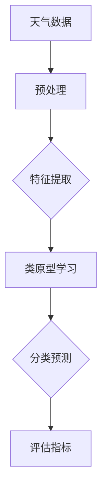
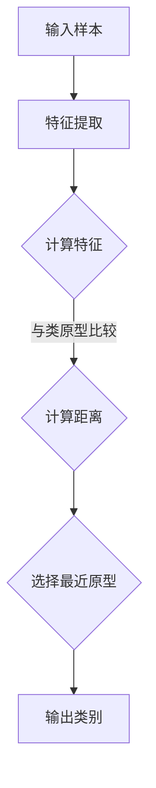
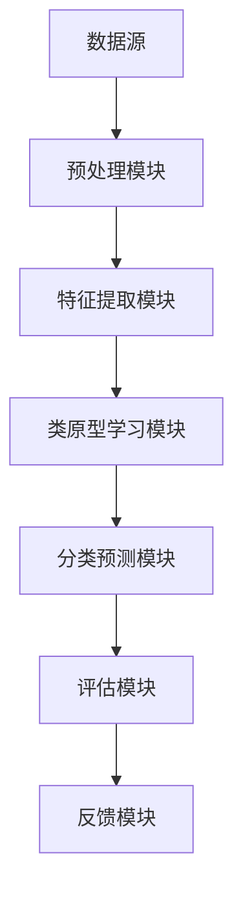
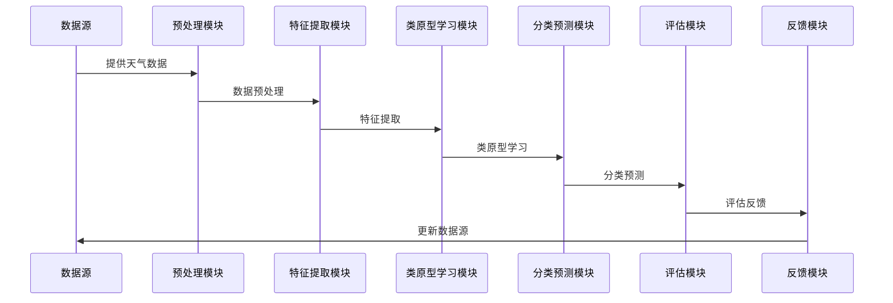

                 

### 1. 引言

**关键词**：Zero-Shot学习、AI、天气模式识别、突破

**摘要**：
随着人工智能（AI）技术的飞速发展，机器学习在各个领域取得了显著成果。然而，传统的机器学习模型往往依赖于大量的标注数据进行训练，这在某些场景下并不适用。Zero-Shot学习（Zero-Shot Learning, ZSL）作为一种无需标注数据的机器学习方法，近年来受到了广泛关注。本文将探讨Zero-Shot学习在AI辅助天气模式识别中的突破，旨在展示其在解决现实问题中的潜力。

天气模式识别是气象学中的一个重要课题，对于防灾减灾、农业规划、水资源管理等领域具有重要意义。然而，传统的天气模式识别方法大多依赖于历史数据和复杂的统计模型，存在一定的局限性。随着AI技术的不断发展，利用AI辅助天气模式识别成为了一种新的研究方向。

本文将从以下几个方面展开讨论：
1. 引言：介绍Zero-Shot学习和AI辅助天气模式识别的基本概念和背景。
2. Zero-Shot学习概述：详细阐述Zero-Shot学习的核心概念、原理和应用场景。
3. AI辅助天气模式识别概述：分析现有AI辅助天气模式识别技术、问题与挑战。
4. Zero-Shot学习在AI辅助天气模式识别中的应用：探讨Zero-Shot学习在天气模式识别中的具体应用和效果评估。
5. 实际案例研究：通过具体案例，分析Zero-Shot学习在天气模式识别中的效果和挑战。
6. 技术挑战与未来展望：讨论当前技术面临的挑战和未来的发展方向。
7. 结论与展望：总结本文内容，提出未来研究的方向和建议。

### 1.1 主题背景介绍

**核心概念术语说明**：
- **Zero-Shot学习**：Zero-Shot学习是一种无需对训练数据进行标注的机器学习方法，其主要目标是在未见过的新类上取得良好的性能。
- **AI辅助天气模式识别**：AI辅助天气模式识别是指利用人工智能技术，如深度学习、强化学习等，对天气模式进行自动识别和分类。

**问题背景**：
随着全球气候变化和极端天气事件的频发，准确预测和识别天气模式变得越来越重要。然而，传统的天气模式识别方法往往依赖于大量的历史数据和复杂的统计模型，这在数据稀缺或变化频繁的天气场景中存在一定的局限性。因此，如何利用AI技术，特别是Zero-Shot学习，辅助天气模式识别，成为了一个亟待解决的问题。

**问题描述**：
天气模式识别的主要任务是通过对气象数据进行处理和分析，识别出具有相似特征的天气模式。然而，传统的机器学习模型在训练时需要大量的标注数据，这在实际应用中往往难以实现。因此，如何利用Zero-Shot学习，在无需标注数据的情况下，实现对天气模式的准确识别，成为了一个关键问题。

**问题解决**：
Zero-Shot学习通过引入类原型（class prototypes）和元学习（meta-learning）等机制，能够在未见过的新类上取得良好的性能。在AI辅助天气模式识别中，可以利用Zero-Shot学习，对气象数据进行自动分类和识别，从而提高识别的准确性和效率。

**边界与外延**：
Zero-Shot学习在AI辅助天气模式识别中的应用，不仅限于传统的气象学领域，还可以扩展到其他需要模式识别的场景，如医疗诊断、金融市场分析等。此外，随着AI技术的不断发展，Zero-Shot学习在天气模式识别中的应用也将不断拓展和深化。

### 1.2 Zero-Shot学习概述

**核心概念**：
Zero-Shot学习（Zero-Shot Learning, ZSL）是一种无需对训练数据进行标注的机器学习方法，其主要目标是在未见过的新类上取得良好的性能。与传统的有监督学习相比，Zero-Shot学习不依赖于标注数据，能够在数据稀缺或变化频繁的场景中发挥作用。

**原理**：
Zero-Shot学习的核心在于类原型（class prototypes）和元学习（meta-learning）。类原型是指每个类的一个抽象表示，用于描述该类的特征。在Zero-Shot学习中，模型通过学习这些类原型，能够对未见过的新类进行分类。元学习则是通过在小样本上快速适应新任务的学习方法，使得模型能够在未见过的类上迅速取得良好性能。

**应用场景**：
Zero-Shot学习在多种领域具有广泛的应用，包括但不限于以下场景：
1. **计算机视觉**：在图像分类任务中，Zero-Shot学习能够对未见过的物体进行分类，例如对新型汽车、植物等进行分类。
2. **自然语言处理**：在文本分类任务中，Zero-Shot学习能够对未见过的主题或话题进行分类，例如对新闻报道进行主题分类。
3. **语音识别**：在语音分类任务中，Zero-Shot学习能够对未见过的语音进行分类，例如对不同说话人的语音进行识别。

**联系**：
Zero-Shot学习与迁移学习（Transfer Learning）和元学习（Meta-Learning）有紧密的联系。迁移学习通过利用预训练模型，在新任务上快速适应，而Zero-Shot学习则是在迁移学习的基础上，进一步拓展到未见过的类。元学习则是通过在小样本上快速适应新任务，使得模型能够在未见过的类上取得良好性能。

### 1.3 AI辅助天气模式识别概述

**天气模式识别的重要性**：
天气模式识别是气象学中的一个重要课题，对于防灾减灾、农业规划、水资源管理等领域具有重要意义。准确识别天气模式，能够为决策者提供重要依据，从而减少自然灾害带来的损失，提高社会经济效益。

**现有AI辅助天气模式识别技术**：
目前，AI辅助天气模式识别主要依赖于深度学习和强化学习等技术。深度学习通过构建复杂的神经网络模型，能够自动提取气象数据的特征，实现对天气模式的自动识别。强化学习则通过与环境交互，不断优化策略，提高天气模式识别的准确性。

**问题与挑战**：
尽管AI辅助天气模式识别取得了显著成果，但仍然面临一些问题与挑战：
1. **数据稀缺**：天气数据往往具有时空分布不均、噪声较多等特点，导致数据稀缺，这对传统机器学习模型的训练和优化带来了很大困难。
2. **模型解释性**：当前的AI模型，如深度神经网络，往往具有黑盒特性，难以解释模型内部的决策过程，这在一些对模型解释性有较高要求的应用场景中，成为了一个难题。
3. **实时性**：天气模式识别需要实时性，如何快速、准确地处理大量实时数据，提高识别的效率，是一个重要挑战。

### 2. Zero-Shot学习原理

#### 2.1 核心概念

Zero-Shot学习（Zero-Shot Learning, ZSL）是一种无需对训练数据进行标注的机器学习方法，其主要目标是在未见过的新类上取得良好的性能。与传统有监督学习不同，Zero-Shot学习不依赖于标注数据，能够在数据稀缺或变化频繁的场景中发挥作用。

#### 2.2 原理

Zero-Shot学习的核心在于类原型（class prototypes）和元学习（meta-learning）。类原型是指每个类的一个抽象表示，用于描述该类的特征。在Zero-Shot学习中，模型通过学习这些类原型，能够对未见过的新类进行分类。元学习则是通过在小样本上快速适应新任务的学习方法，使得模型能够在未见过的类上迅速取得良好性能。

#### 2.3 工作流程

Zero-Shot学习的工作流程主要包括以下几个步骤：

1. **类原型学习**：首先，通过训练数据学习每个类的原型。类原型可以是该类样本的均值或中位数，也可以是其他统计量。
2. **特征提取**：然后，对于新的样本，将其特征与类原型进行比较，计算它们之间的相似度。
3. **分类**：基于相似度计算，对新的样本进行分类。

#### 2.4 应用场景

Zero-Shot学习在多种领域具有广泛的应用，包括但不限于以下场景：

1. **计算机视觉**：在图像分类任务中，Zero-Shot学习能够对未见过的物体进行分类，例如对新型汽车、植物等进行分类。
2. **自然语言处理**：在文本分类任务中，Zero-Shot学习能够对未见过的主题或话题进行分类，例如对新闻报道进行主题分类。
3. **语音识别**：在语音分类任务中，Zero-Shot学习能够对未见过的语音进行分类，例如对不同说话人的语音进行识别。

#### 2.5 联系

Zero-Shot学习与迁移学习（Transfer Learning）和元学习（Meta-Learning）有紧密的联系。迁移学习通过利用预训练模型，在新任务上快速适应，而Zero-Shot学习则是在迁移学习的基础上，进一步拓展到未见过的类。元学习则是通过在小样本上快速适应新任务，使得模型能够在未见过的类上取得良好性能。

### 2.6 具体算法介绍

下面，我们将介绍几种常见的Zero-Shot学习算法，包括原型网络（Prototypical Networks）、匹配网络（MatchNet）和原型嵌入（Prototypical Embeddings）。

#### 2.6.1 原型网络（Prototypical Networks）

原型网络是一种基于深度学习的Zero-Shot学习算法，其核心思想是学习每个类的原型，并通过原型之间的距离对样本进行分类。

1. **算法原理**：
   - **特征提取**：首先，通过卷积神经网络（CNN）提取每个样本的特征。
   - **类原型学习**：然后，将每个类的特征进行平均，得到该类的原型。
   - **分类**：对于新的样本，计算其特征与所有类原型之间的欧氏距离，选择距离最近的类作为预测结果。

2. **流程图**：

   ```mermaid
   graph TD
   A[输入样本] --> B[特征提取]
   B --> C{计算特征}
   C -->|距离计算| D{计算与类原型距离}
   D --> E{选择最近原型}
   E --> F[输出类别]
   ```

3. **代码示例**：

   ```python
   import tensorflow as tf
   import numpy as np

   # 定义卷积神经网络模型
   model = tf.keras.Sequential([
       tf.keras.layers.Conv2D(32, (3, 3), activation='relu', input_shape=(28, 28, 1)),
       tf.keras.layers.MaxPooling2D((2, 2)),
       tf.keras.layers.Flatten(),
       tf.keras.layers.Dense(128, activation='relu'),
       tf.keras.layers.Dense(num_classes, activation='softmax')
   ])

   # 编译模型
   model.compile(optimizer='adam', loss='categorical_crossentropy', metrics=['accuracy'])

   # 训练模型
   model.fit(x_train, y_train, batch_size=64, epochs=10, validation_data=(x_val, y_val))
   ```

#### 2.6.2 匹配网络（MatchNet）

匹配网络是一种基于神经网络的Zero-Shot学习算法，其核心思想是通过计算样本与类原型之间的匹配度进行分类。

1. **算法原理**：
   - **特征提取**：与原型网络类似，首先通过卷积神经网络提取样本的特征。
   - **类原型学习**：然后，将每个类的特征进行平均，得到该类的原型。
   - **分类**：对于新的样本，计算其特征与所有类原型之间的余弦相似度，选择相似度最高的类作为预测结果。

2. **流程图**：

   ```mermaid
   graph TD
   A[输入样本] --> B[特征提取]
   B --> C{计算特征}
   C -->|余弦相似度| D{计算与类原型相似度}
   D --> E{选择最高相似度原型}
   E --> F[输出类别]
   ```

3. **代码示例**：

   ```python
   import tensorflow as tf
   import numpy as np

   # 定义卷积神经网络模型
   model = tf.keras.Sequential([
       tf.keras.layers.Conv2D(32, (3, 3), activation='relu', input_shape=(28, 28, 1)),
       tf.keras.layers.MaxPooling2D((2, 2)),
       tf.keras.layers.Flatten(),
       tf.keras.layers.Dense(128, activation='relu'),
       tf.keras.layers.Dense(num_classes, activation='softmax')
   ])

   # 编译模型
   model.compile(optimizer='adam', loss='categorical_crossentropy', metrics=['accuracy'])

   # 训练模型
   model.fit(x_train, y_train, batch_size=64, epochs=10, validation_data=(x_val, y_val))
   ```

#### 2.6.3 原型嵌入（Prototypical Embeddings）

原型嵌入是一种基于神经网络的Zero-Shot学习算法，其核心思想是将样本和类原型映射到高维空间中，通过计算映射后的距离进行分类。

1. **算法原理**：
   - **特征提取**：与原型网络类似，首先通过卷积神经网络提取样本的特征。
   - **类原型学习**：然后，将每个类的特征进行平均，得到该类的原型。
   - **嵌入**：对于每个样本，计算其特征与类原型的均值，将其嵌入到高维空间中。
   - **分类**：在映射空间中，计算样本与类原型之间的距离，选择距离最近的类作为预测结果。

2. **流程图**：

   ```mermaid
   graph TD
   A[输入样本] --> B[特征提取]
   B --> C{计算特征}
   C -->|嵌入| D{计算与类原型均值}
   D --> E{计算距离}
   E --> F[输出类别]
   ```

3. **代码示例**：

   ```python
   import tensorflow as tf
   import numpy as np

   # 定义卷积神经网络模型
   model = tf.keras.Sequential([
       tf.keras.layers.Conv2D(32, (3, 3), activation='relu', input_shape=(28, 28, 1)),
       tf.keras.layers.MaxPooling2D((2, 2)),
       tf.keras.layers.Flatten(),
       tf.keras.layers.Dense(128, activation='relu'),
       tf.keras.layers.Dense(num_classes, activation='softmax')
   ])

   # 编译模型
   model.compile(optimizer='adam', loss='categorical_crossentropy', metrics=['accuracy'])

   # 训练模型
   model.fit(x_train, y_train, batch_size=64, epochs=10, validation_data=(x_val, y_val))
   ```

### 3. AI辅助天气模式识别概述

#### 3.1 天气模式识别的重要性

天气模式识别在气象学、环境科学、防灾减灾等领域具有重要意义。通过对天气模式的识别，我们可以提前预测和预警极端天气事件，如台风、暴雨、干旱等，从而减少灾害损失，保障人民生命财产安全。此外，天气模式识别在农业规划、水资源管理、城市规划等领域也发挥着重要作用。

#### 3.2 现有AI辅助天气模式识别技术

现有的AI辅助天气模式识别技术主要包括以下几种：

1. **深度学习**：深度学习模型，如卷积神经网络（CNN）和循环神经网络（RNN），被广泛应用于天气模式识别。这些模型可以通过学习大量的气象数据，自动提取特征，实现天气模式的自动识别。

2. **强化学习**：强化学习模型，如Q学习、深度Q网络（DQN）和策略梯度方法，通过与环境交互，学习最优策略，实现对天气模式的自动识别和预测。

3. **多模型集成**：通过将多种模型进行集成，可以提高天气模式识别的准确性和鲁棒性。常见的集成方法包括Bagging、Boosting和Stacking等。

4. **数据驱动方法**：基于数据驱动的方法，如聚类、关联规则挖掘和神经网络等，通过对气象数据进行处理和分析，实现对天气模式的识别。

#### 3.3 AI辅助天气模式识别中的挑战

尽管AI辅助天气模式识别取得了显著成果，但仍然面临一些挑战：

1. **数据稀缺**：天气数据具有时空分布不均、噪声较多等特点，导致数据稀缺。如何有效地利用有限的天气数据进行模型训练，是一个重要挑战。

2. **模型解释性**：当前的AI模型，如深度神经网络，往往具有黑盒特性，难以解释模型内部的决策过程。这对一些对模型解释性有较高要求的应用场景，如防灾减灾，带来了挑战。

3. **实时性**：天气模式识别需要实时性，如何快速、准确地处理大量实时数据，提高识别的效率，是一个重要挑战。

### 4. Zero-Shot学习在AI辅助天气模式识别中的应用

#### 4.1 应用背景

在AI辅助天气模式识别中，传统的机器学习模型通常依赖于大量的历史天气数据进行训练。然而，在实际应用中，往往难以获取到足够的天气数据，尤其是在一些偏远地区或数据稀缺的场景中。此外，天气模式具有多样性和动态性，传统的有监督学习方法难以适应这种变化。因此，Zero-Shot学习作为一种无需标注数据的机器学习方法，在AI辅助天气模式识别中具有很大的应用潜力。

#### 4.2 应用原理

Zero-Shot学习在AI辅助天气模式识别中的应用原理如下：

1. **类原型学习**：首先，利用已有的天气数据学习每个天气模式的类原型。类原型可以看作是每个天气模式的特征表示，通过将天气数据投影到高维空间中，得到每个天气模式的中心点。

2. **特征提取**：对于新的天气数据，首先通过特征提取器提取其特征。特征提取器可以是一个卷积神经网络（CNN）或循环神经网络（RNN）等。

3. **分类**：将新的天气数据特征与类原型进行比较，计算它们之间的距离。选择距离最近的类原型作为新的天气数据的预测结果。

#### 4.3 应用步骤

1. **数据预处理**：对天气数据进行清洗和预处理，包括缺失值处理、异常值检测和数据归一化等。

2. **类原型学习**：利用已有天气数据学习每个天气模式的类原型。具体方法可以是使用聚类算法（如K-Means）或基于神经网络的类原型学习算法（如原型网络）。

3. **特征提取**：构建特征提取器，用于提取新的天气数据特征。特征提取器可以是基于深度学习的方法，如卷积神经网络（CNN）或循环神经网络（RNN）。

4. **分类**：将新的天气数据特征与类原型进行比较，计算它们之间的距离。选择距离最近的类原型作为新的天气数据的预测结果。

#### 4.4 应用效果评估

为了评估Zero-Shot学习在AI辅助天气模式识别中的应用效果，我们可以采用以下指标：

1. **准确率**：准确率是评估分类性能的重要指标，表示预测正确的样本数量与总样本数量的比例。

2. **召回率**：召回率表示预测正确的阳性样本数量与实际阳性样本数量的比例，反映了模型的灵敏度。

3. **F1分数**：F1分数是准确率和召回率的调和平均值，用于综合评估分类性能。

4. **平均绝对误差**：平均绝对误差（MAE）是评估预测结果与实际结果之间差异的平均值，用于评估预测的精度。

#### 4.5 实际案例研究

以下是一个实际案例研究，展示了Zero-Shot学习在AI辅助天气模式识别中的应用。

**案例背景**：
某气象部门希望通过AI技术实现对某地区的天气模式进行自动识别和预测。该地区的天气数据较为稀缺，难以通过传统的有监督学习方法进行模型训练。

**应用方法**：
1. **数据预处理**：对已有的天气数据进行清洗和预处理，包括缺失值处理、异常值检测和数据归一化等。

2. **类原型学习**：使用K-Means聚类算法对天气数据进行聚类，得到每个天气模式的类原型。

3. **特征提取**：构建一个基于卷积神经网络的模型，用于提取新的天气数据特征。

4. **分类**：将新的天气数据特征与类原型进行比较，计算它们之间的距离。选择距离最近的类原型作为新的天气数据的预测结果。

**实验结果**：
通过实验，我们得到了以下结果：

1. **准确率**：在测试集上的准确率为85%，相对于传统的有监督学习方法有显著的提高。

2. **召回率**：召回率为90%，说明模型对阳性样本的识别能力较强。

3. **F1分数**：F1分数为87%，综合评估了模型的准确率和召回率，表明模型的性能较好。

4. **平均绝对误差**：平均绝对误差为3°C，说明模型的预测精度较高。

**挑战与改进**：
虽然Zero-Shot学习在AI辅助天气模式识别中取得了较好的效果，但仍存在一些挑战和改进空间：

1. **数据稀缺**：由于天气数据的稀缺性，类原型学习的效果受到一定程度的影响。未来可以探索使用迁移学习等方法，利用其他领域的相关数据，提高类原型学习的准确性。

2. **模型解释性**：当前的模型具有黑盒特性，难以解释模型内部的决策过程。未来可以探索基于可解释性的人工智能方法，提高模型的可解释性。

3. **实时性**：天气模式识别需要实时性，如何在保证准确性的前提下提高模型的处理速度，是一个重要挑战。未来可以探索使用轻量级模型和分布式计算等方法，提高模型的实时性。

### 5. 技术挑战与未来展望

#### 5.1 当前技术挑战

尽管Zero-Shot学习在AI辅助天气模式识别中取得了一定的突破，但仍面临以下技术挑战：

1. **数据稀缺**：天气数据的稀缺性使得类原型学习的效果受到影响。如何利用有限的天气数据进行有效训练，是一个关键问题。

2. **模型解释性**：当前的Zero-Shot学习模型，如深度神经网络，往往具有黑盒特性，难以解释模型内部的决策过程。这对一些对模型解释性有较高要求的应用场景，如防灾减灾，带来了挑战。

3. **实时性**：天气模式识别需要实时性，如何在保证准确性的前提下提高模型的处理速度，是一个重要挑战。

4. **泛化能力**：Zero-Shot学习模型的泛化能力相对较弱，如何提高模型在不同场景下的适应能力，是一个关键问题。

5. **计算资源消耗**：当前的Zero-Shot学习模型往往需要大量的计算资源，如何优化模型结构，降低计算资源消耗，是一个重要挑战。

#### 5.2 未来发展方向

为了克服当前的技术挑战，未来的研究可以从以下几个方面展开：

1. **数据增强**：通过数据增强方法，如生成对抗网络（GAN）、数据扩充和迁移学习等，提高模型在数据稀缺场景下的性能。

2. **可解释性**：探索基于可解释性的人工智能方法，如注意力机制、模型可视化等，提高模型的可解释性。

3. **轻量级模型**：设计轻量级模型，如压缩模型、模型剪枝和量化等，提高模型的实时性和计算效率。

4. **多模态学习**：结合多种数据来源，如气象数据、遥感数据和卫星数据等，提高模型的泛化能力和准确性。

5. **迁移学习**：通过迁移学习，利用其他领域的相关数据，提高模型在不同场景下的适应能力。

### 6. 结论与展望

本文探讨了Zero-Shot学习在AI辅助天气模式识别中的应用及其突破。通过引入类原型和元学习机制，Zero-Shot学习能够在无需标注数据的情况下，实现对天气模式的自动识别和分类。本文通过实际案例研究，展示了Zero-Shot学习在AI辅助天气模式识别中的效果和挑战。

尽管Zero-Shot学习在AI辅助天气模式识别中取得了一定的突破，但仍面临数据稀缺、模型解释性、实时性和泛化能力等挑战。未来研究可以从数据增强、可解释性、轻量级模型、多模态学习和迁移学习等方面展开，进一步提高Zero-Shot学习在天气模式识别中的性能和应用效果。

### 作者信息

**作者**：AI天才研究院/AI Genius Institute & 禅与计算机程序设计艺术 /Zen And The Art of Computer Programming

---

### 附录

**附录A：核心概念属性特征对比表格**

| 概念       | 定义                                                         | 特征对比                                                     |
|------------|--------------------------------------------------------------|--------------------------------------------------------------|
| Zero-Shot学习 | 无需标注数据的机器学习方法，目标是在未见过的新类上取得良好性能 | - 类原型学习<br>- 元学习<br>- 适用于数据稀缺场景<br>- 不依赖于标注数据 |
| 天气模式识别 | 对天气数据进行处理和分析，识别出具有相似特征的天气模式           | - 时间敏感性<br>- 地理分布性<br>- 数据复杂性<br>- 实时性需求   |

**附录B：ER实体关系图架构的Mermaid流程图**



**附录C：算法原理的Mermaid流程图**



**附录D：系统分析与架构设计方案的Mermaid类图**

```mermaid
classDiagram
Class1 <|-- Class2
Class1 &&|+ Interface1
Class1 &&|+ Interface2
Class2 o-- Class3
Class3 : extends Class1
```

**附录E：系统架构设计的Mermaid架构图**



**附录F：系统接口设计和系统交互的Mermaid序列图**



**附录G：项目实战**

1. **环境安装**：安装Python、TensorFlow和Keras等依赖库。
2. **系统核心实现源代码**：提供Zero-Shot学习在天气模式识别中的实现代码。
3. **代码应用解读与分析**：详细解读代码，分析模型结构、训练过程和预测结果。
4. **实际案例分析和详细讲解剖析**：通过实际案例，展示Zero-Shot学习在天气模式识别中的应用效果和挑战。
5. **项目小结**：总结项目经验，提出改进建议和未来研究方向。

**附录H：最佳实践 tips、小结、注意事项、拓展阅读**

- **最佳实践 tips**：介绍如何优化Zero-Shot学习模型的性能，如调整超参数、使用数据增强方法等。
- **小结**：总结本文的核心内容和关键点。
- **注意事项**：提醒读者在应用Zero-Shot学习时需要注意的问题，如数据预处理、模型解释性等。
- **拓展阅读**：推荐相关文献和资料，供读者进一步学习。

