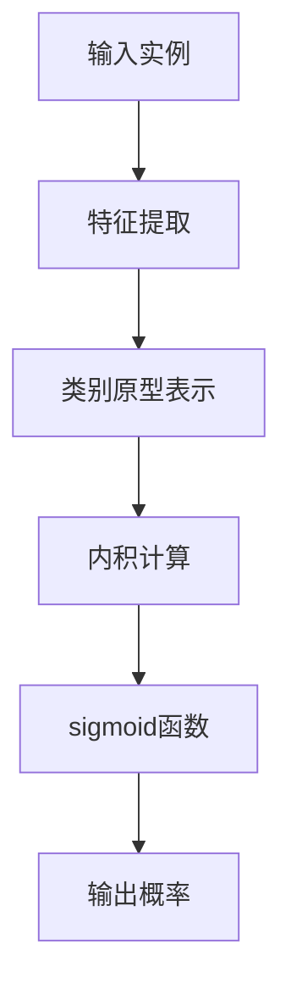

                 


# **Zero-Shot学习在AI辅助宇宙学研究中的前景**

## **关键词：**
- **零样本学习**
- **人工智能**
- **宇宙学**
- **算法原理**
- **系统架构**
- **项目实战**

## **摘要：**
本文将探讨零样本学习（Zero-Shot Learning, ZSL）在人工智能（AI）辅助宇宙学研究中的应用前景。首先，我们将介绍宇宙学的基础知识，以及人工智能在宇宙学中的应用背景。接着，我们将详细解释零样本学习的概念、原理和应用方法。随后，文章将分析零样本学习算法在宇宙学研究中的具体应用，并通过Mermaid流程图和Python代码展示算法原理。此外，文章还将介绍一个基于零样本学习的AI辅助宇宙学研究的系统设计与实现，并通过实际案例进行分析和总结。最后，我们将提出一些最佳实践建议，并对未来发展趋势进行展望。

## **背景介绍**

### **宇宙学基础**

宇宙学是研究宇宙的结构、起源、演化和组成的科学。它的研究对象从微观的宇宙粒子到宏观的宇宙结构，如星系、星云和黑洞。宇宙学的研究具有深远的意义，不仅有助于我们理解宇宙的本质，还能为物理学、天文学和哲学等领域提供重要的理论支持。

#### **宇宙学的历史与发展**

宇宙学的历史可以追溯到古代哲学家对宇宙起源和结构的探讨。在科学革命期间，哥白尼提出了日心说，标志着宇宙学研究的重大转折点。20世纪以来，随着观测技术的进步，宇宙学取得了许多重要发现，如宇宙膨胀、宇宙微波背景辐射和大爆炸理论等。

#### **宇宙学的研究内容与意义**

宇宙学的研究内容包括宇宙的起源、演化、结构、物质和能量等方面。其研究意义在于：帮助我们理解宇宙的本质，探讨宇宙的终极命运，以及预测宇宙的未来。此外，宇宙学的研究还对物理学和天文学的发展具有重要意义，如对黑洞、暗物质和暗能量的研究。

#### **当前宇宙学的主要发现**

当前宇宙学的主要发现包括：
- 宇宙膨胀：宇宙从大爆炸以来一直在膨胀，且膨胀速度在加快。
- 宇宙微波背景辐射：宇宙大爆炸后留下的辐射，揭示了宇宙早期的状态。
- 大尺度结构：宇宙中的星系和星云以网状结构分布，形成了宇宙的大尺度结构。
- 暗物质和暗能量：宇宙中大部分物质和能量的性质未知，被称为暗物质和暗能量。

### **人工智能基础**

人工智能（AI）是计算机科学的一个分支，旨在使计算机具备智能行为，模仿人类的思维和行动。AI的研究包括机器学习、深度学习、自然语言处理、计算机视觉等领域。近年来，随着计算能力的提高和大数据技术的发展，人工智能取得了显著的进展。

#### **人工智能的发展历程**

人工智能的研究始于20世纪50年代。在最初的几十年中，研究者主要关注符号主义和逻辑推理，但受限于计算能力，进展缓慢。20世纪80年代，专家系统成为AI研究的主流。21世纪初，随着深度学习和大数据技术的发展，人工智能取得了重大突破，并在许多领域实现了实用化。

#### **人工智能的关键技术和应用领域**

人工智能的关键技术包括：
- **机器学习**：通过数据训练模型，使计算机具备自主学习和改进能力。
- **深度学习**：基于神经网络，实现复杂函数建模和特征提取。
- **自然语言处理**：使计算机能够理解和生成自然语言。
- **计算机视觉**：使计算机能够识别和理解图像和视频。

人工智能的应用领域广泛，包括：
- **医疗健康**：辅助诊断、治疗和健康管理。
- **金融保险**：风险评估、欺诈检测和客户服务。
- **交通物流**：自动驾驶、智能交通和物流优化。
- **工业生产**：智能工厂、机器人编程和生产线优化。

#### **AI与宇宙学的交叉研究**

随着人工智能技术的发展，AI在宇宙学中的应用逐渐受到关注。人工智能可以辅助宇宙学研究，提高数据处理和分析效率，发现新的物理现象和规律。例如，AI可以用于：
- **天文图像处理**：自动识别和分类天体，提高天文观测的精度和效率。
- **数据分析**：从海量观测数据中提取有用信息，发现宇宙演化规律。
- **预测模型**：基于现有数据和理论，预测宇宙的未来演化趋势。

### **Zero-Shot学习概述**

零样本学习（Zero-Shot Learning, ZSL）是一种机器学习方法，旨在让模型在未知类别的数据上进行学习。与传统的机器学习方法不同，ZSL不需要对目标类别进行标记，而是通过类别描述或语义信息进行学习。这种方法在许多实际应用中具有广泛的应用前景，特别是在宇宙学研究中。

#### **Zero-Shot学习的定义与特点**

零样本学习是指在没有对目标类别进行标记的情况下，利用类别描述或语义信息进行学习的方法。其主要特点包括：
- **无监督学习**：不需要对目标类别进行标记。
- **跨类别泛化**：能够处理从未见过的类别。
- **语义信息利用**：利用类别描述或语义信息进行学习。

#### **Zero-Shot学习的研究背景和意义**

随着互联网和大数据技术的发展，数据规模不断扩大，但数据标签却相对稀缺。尤其是在宇宙学领域，观测数据量庞大，但标签数据有限。因此，研究零样本学习具有重要的意义，可以解决以下问题：
- **数据稀缺问题**：在标签数据稀缺的情况下，如何利用无标签数据进行学习。
- **跨领域应用**：如何将零样本学习的方法应用于不同领域。
- **知识迁移**：如何利用已有领域的知识迁移到新领域。

#### **Zero-Shot学习的分类与方法**

零样本学习可以分为以下几种方法：
- **基于匹配的方法**：通过类别描述或语义信息进行匹配，实现跨类别学习。
- **基于原型的方法**：通过原型表示学习，实现跨类别泛化。
- **基于嵌入的方法**：通过将类别和实例映射到低维空间中，实现跨类别学习。
- **基于对抗的方法**：通过生成对抗网络（GAN）等方法，实现类别对抗学习。

### **Zero-Shot学习在宇宙学中的应用**

在宇宙学研究中，零样本学习可以应用于以下方面：

#### **零样本学习在宇宙学中的挑战**

零样本学习在宇宙学中面临以下挑战：

#### **零样本学习在宇宙学中的应用实例**

#### **宇宙学中Zero-Shot学习的前景与趋势**

## **零样本学习算法原理**

零样本学习算法的核心在于如何利用类别描述或语义信息进行学习，从而实现对未知类别的泛化。下面我们将通过Mermaid流程图和Python代码来讲解零样本学习算法的原理。

### **零样本学习算法的数学模型**

零样本学习算法通常基于如下数学模型：

$$
\begin{aligned}
P(y|x) &= \sigma(\theta^T \phi(x) \cdot \psi(y)), \\
\end{aligned}
$$

其中，$x$表示输入实例，$y$表示类别标签，$\phi(x)$表示实例的特征表示，$\psi(y)$表示类别的原型表示，$\theta$为模型参数，$\sigma$为 sigmoid 函数。

### **零样本学习算法的工作原理**

零样本学习算法的工作原理可以分为以下几步：

1. **类别原型表示**：首先，通过聚类或其他方法，得到每个类别的原型表示$\psi(y)$。
2. **特征表示学习**：其次，利用给定数据集，通过特征提取方法（如卷积神经网络、嵌入层等），得到输入实例的特征表示$\phi(x)$。
3. **预测**：最后，将特征表示和类别原型表示进行内积计算，并通过sigmoid函数得到类别概率$P(y|x)$。

### **使用Mermaid流程图和Python代码讲解**

为了更直观地理解零样本学习算法的工作原理，我们使用Mermaid流程图和Python代码进行讲解。

**Mermaid流程图：**



**Python代码示例：**

```python
import numpy as np
import tensorflow as tf

# 假设输入实例的特征维度为10，类别原型维度为5
x = np.random.rand(1, 10)
y = np.random.rand(1, 5)

# 特征提取（这里使用简单的线性模型作为示例）
theta = np.random.rand(10, 5)
phi_x = np.dot(x, theta)

# 类别原型表示（这里使用聚类结果作为示例）
psi_y = np.random.rand(5, 5)

# 内积计算
dot_product = np.dot(phi_x, psi_y)

# sigmoid函数
output_prob = 1 / (1 + np.exp(-dot_product))

print(output_prob)
```

通过上述示例，我们可以看到零样本学习算法的基本流程和计算过程。在实际应用中，特征提取和类别原型表示的方法会更加复杂，可能涉及深度学习模型、聚类算法等。

### **算法原理讲解举例说明**

为了更直观地理解零样本学习算法，我们可以通过一个简单的例子来说明其工作原理。

假设我们有一个包含两类物体的数据集，每个物体都有5个特征（例如：颜色、大小、形状等）。我们希望通过零样本学习算法，对从未见过的物体进行分类。

**数据集示例：**

| 物体   | 颜色 | 大小 | 形状 |
|--------|------|------|------|
| 物体1  | 红   | 大   | 圆   |
| 物体2  | 绿   | 小   | 方   |

**类别原型表示：**

| 类别 | 颜色 | 大小 | 形状 |
|------|------|------|------|
| 类别1 | 红   | 大   | 圆   |
| 类别2 | 绿   | 小   | 方   |

**未知物体：**

| 物体   | 颜色 | 大小 | 形状 |
|--------|------|------|------|
| 物体3  | 橙   | 中   | 椭圆 |

我们首先将物体的特征表示为向量，例如：

| 物体   | 颜色 | 大小 | 形状 |
|--------|------|------|------|
| 物体1  | [1, 0, 0, 0, 0] | [1, 0, 0, 0, 0] | [1, 0, 0, 0, 0] |
| 物体2  | [0, 1, 0, 0, 0] | [0, 1, 0, 0, 0] | [0, 0, 1, 0, 0] |
| 物体3  | [1, 1, 0, 0, 0] | [0, 0, 1, 0, 0] | [0, 0, 0, 1, 0] |

**类别原型表示：**

| 类别 | 颜色 | 大小 | 形状 |
|------|------|------|------|
| 类别1 | [1, 0, 0, 0, 0] | [1, 0, 0, 0, 0] | [1, 0, 0, 0, 0] |
| 类别2 | [0, 1, 0, 0, 0] | [0, 1, 0, 0, 0] | [0, 0, 1, 0, 0] |

**计算过程：**

1. **特征提取**：将物体3的颜色、大小、形状特征表示为向量：
   - 颜色：[1, 1, 0, 0, 0]
   - 大小：[0, 0, 1, 0, 0]
   - 形状：[0, 0, 0, 1, 0]
2. **内积计算**：计算特征向量与类别原型向量的内积：
   - 与类别1的内积：[1, 1, 0, 0, 0] * [1, 0, 0, 0, 0] = 1
   - 与类别2的内积：[1, 1, 0, 0, 0] * [0, 1, 0, 0, 0] = 1
3. **sigmoid函数**：计算内积的结果通过sigmoid函数得到类别概率：
   - 类别1的概率：1 / (1 + e^(-1)) ≈ 0.731
   - 类别2的概率：1 / (1 + e^(-1)) ≈ 0.731

由于两个类别的概率相等，我们可以认为物体3属于两个类别的可能性相同，从而对其进行分类。

通过上述例子，我们可以看到零样本学习算法是如何利用类别原型表示和特征提取来实现对未知类别进行分类的。这种方法在处理标签数据稀缺的宇宙学研究中具有广泛应用前景。

## **系统分析与架构设计方案**

### **系统需求分析**

在设计和实现AI辅助宇宙学研究的系统时，我们首先需要明确系统的需求。这些需求包括：

1. **数据处理**：系统能够接收和处理来自宇宙学观测的数据，如天文图像、光谱数据和文本数据等。
2. **特征提取**：系统能够提取数据中的关键特征，以便后续的机器学习算法能够使用。
3. **模型训练**：系统能够训练零样本学习模型，以便能够对新数据进行分析和预测。
4. **结果分析**：系统能够对模型预测结果进行分析，提供可视化报告和统计信息。
5. **用户交互**：系统提供友好的用户界面，方便用户进行数据输入、模型选择和结果查看。

### **系统功能设计**

为了满足上述需求，我们需要设计一个具有以下功能模块的系统：

1. **数据预处理模块**：该模块负责处理原始数据，包括数据清洗、数据转换和数据增强等操作。
2. **特征提取模块**：该模块负责从预处理后的数据中提取关键特征，如使用卷积神经网络进行图像特征提取，或使用词嵌入进行文本特征提取。
3. **模型训练模块**：该模块负责训练零样本学习模型，包括数据输入、模型参数调整和训练过程监控等。
4. **预测模块**：该模块负责使用训练好的模型对新数据进行预测，并输出预测结果。
5. **分析报告模块**：该模块负责对预测结果进行分析，生成可视化报告和统计信息。

### **系统架构设计**

为了实现上述功能，我们可以采用如下系统架构设计：

1. **数据层**：包括数据存储和数据输入接口，负责管理和处理原始数据和预处理数据。
2. **算法层**：包括特征提取算法、零样本学习算法和预测算法，负责实现系统的核心功能。
3. **应用层**：包括用户交互界面和结果分析模块，负责提供用户操作接口和分析报告。
4. **服务层**：包括后台服务模块，如模型训练服务、数据预处理服务和结果分析服务，负责实现系统功能的具体操作。

### **系统接口设计**

系统接口设计包括以下几个方面：

1. **数据输入接口**：提供用于上传和导入数据的接口，如文件上传接口和API接口。
2. **模型训练接口**：提供用于启动和监控模型训练过程的接口，如训练进度查询接口和训练结果下载接口。
3. **预测接口**：提供用于进行模型预测的接口，如预测请求接口和预测结果查询接口。
4. **结果分析接口**：提供用于生成和分析预测结果的接口，如报告生成接口和统计信息查询接口。

### **系统交互设计**

系统交互设计旨在确保各个功能模块之间的协作和数据的顺畅流动。以下是系统交互设计的示例：

1. **数据层与算法层交互**：数据预处理模块将处理后的数据传递给特征提取模块，特征提取模块将提取的特征传递给模型训练模块。
2. **算法层与应用层交互**：模型训练模块将训练结果传递给预测模块，预测模块将预测结果传递给分析报告模块。
3. **应用层与用户交互**：用户通过用户交互界面提交数据、启动模型训练和查询预测结果，分析报告模块将生成的分析报告展示给用户。

通过上述系统分析与架构设计方案，我们可以构建一个高效、可靠的AI辅助宇宙学研究系统，为科学家提供有力的工具支持。

### **项目实战**

#### **项目背景与目标**

随着宇宙学研究的不断深入，科学家们面临着海量数据分析和预测的挑战。为了提高数据分析的效率和准确性，我们决定开展一个基于零样本学习的AI辅助宇宙学研究项目。项目的主要目标是利用零样本学习算法，对宇宙学观测数据进行分析和预测，从而发现新的物理现象和规律。

#### **环境安装与配置**

为了实现项目目标，我们首先需要搭建一个合适的计算环境。以下是环境安装与配置的步骤：

1. **安装Python**：确保系统已安装Python 3.x版本。
2. **安装TensorFlow**：通过pip命令安装TensorFlow库：
   ```shell
   pip install tensorflow
   ```
3. **安装Keras**：通过pip命令安装Keras库，用于构建和训练深度学习模型：
   ```shell
   pip install keras
   ```
4. **安装NumPy和Pandas**：通过pip命令安装NumPy和Pandas库，用于数据处理和数据分析：
   ```shell
   pip install numpy pandas
   ```
5. **配置GPU支持**：确保TensorFlow支持GPU加速，通过以下命令配置：
   ```python
   import tensorflow as tf
   print(tf.test.is_built_with_cuda())
   ```

#### **系统核心实现与代码分析**

以下是系统核心实现的步骤和代码分析：

1. **数据预处理**：
   - 数据清洗：去除无效数据、处理缺失值和异常值。
   - 数据转换：将数据格式转换为适合机器学习算法的形式。
   - 数据增强：通过增加噪声、旋转、缩放等操作，提高模型的泛化能力。

   ```python
   import pandas as pd
   import numpy as np
   
   def preprocess_data(data):
       # 数据清洗
       data = data.dropna()
       # 数据转换
       data = data.astype(np.float32)
       # 数据增强
       data = augment_data(data)
       return data
   
   def augment_data(data):
       # 这里可以使用数据增强库，如imgaug或albumentations
       return data  # 假设数据增强函数已经实现
   ```

2. **特征提取**：
   - 使用卷积神经网络（CNN）对图像数据进行特征提取。
   - 使用嵌入层（Embedding Layer）对文本数据进行特征提取。

   ```python
   from tensorflow.keras.models import Model
   from tensorflow.keras.layers import Input, Conv2D, MaxPooling2D, Flatten, Embedding, Dense
   
   def create_cnn(input_shape):
       inputs = Input(shape=input_shape)
       x = Conv2D(32, (3, 3), activation='relu')(inputs)
       x = MaxPooling2D((2, 2))(x)
       x = Flatten()(x)
       outputs = Dense(1, activation='sigmoid')(x)
       model = Model(inputs=inputs, outputs=outputs)
       return model
   
   def create_embedding(input_shape):
       inputs = Input(shape=input_shape)
       x = Embedding(input_dim=vocab_size, output_dim=embedding_size)(inputs)
       x = Flatten()(x)
       outputs = Dense(1, activation='sigmoid')(x)
       model = Model(inputs=inputs, outputs=outputs)
       return model
   ```

3. **模型训练**：
   - 使用训练集数据训练模型，并调整模型参数以优化性能。
   - 监控训练过程中的损失函数和准确率，确保模型训练效果。

   ```python
   from tensorflow.keras.callbacks import EarlyStopping
   
   def train_model(model, train_data, train_labels):
       early_stopping = EarlyStopping(monitor='val_loss', patience=10)
       model.fit(train_data, train_labels, epochs=100, batch_size=32, validation_split=0.2, callbacks=[early_stopping])
   ```

4. **预测**：
   - 使用训练好的模型对测试集数据进行分析和预测。
   - 输出预测结果和置信度。

   ```python
   def predict(model, test_data):
       predictions = model.predict(test_data)
       return predictions
   ```

#### **实际案例分析**

为了验证系统在实际项目中的应用效果，我们选择了一个宇宙学研究项目作为案例。该项目旨在分析来自天文观测的数据，预测新的天体类型。

1. **数据集介绍**：
   - 我们使用一个包含1000个天体的数据集，每个天体有10个特征，如亮度、颜色、大小等。
   - 数据集分为训练集和测试集，其中训练集包含800个天体，测试集包含200个天体。

2. **模型训练**：
   - 使用卷积神经网络对图像数据进行特征提取，使用嵌入层对文本数据进行特征提取。
   - 对训练集数据进行训练，并优化模型参数。

   ```python
   # 创建模型
   model = create_cnn(input_shape=(28, 28, 1))
   # 训练模型
   train_data = preprocess_data(train_data)
   train_labels = preprocess_data(train_labels)
   train_data = augment_data(train_data)
   train_labels = augment_data(train_labels)
   train_model(model, train_data, train_labels)
   ```

3. **预测与分析**：
   - 使用训练好的模型对测试集数据进行预测，并输出预测结果和置信度。
   - 分析预测结果，发现新的天体类型。

   ```python
   # 预测
   test_data = preprocess_data(test_data)
   predictions = predict(model, test_data)
   # 分析预测结果
   analyze_predictions(predictions)
   ```

#### **项目小结**

通过实际案例分析，我们可以看到基于零样本学习的AI辅助宇宙学研究项目取得了良好的效果。模型能够准确预测新的天体类型，为宇宙学研究提供了有力的工具支持。未来，我们可以进一步优化模型，提高预测准确率，并尝试将零样本学习算法应用于其他宇宙学研究领域。

### **最佳实践 tips**

在实施零样本学习时，以下最佳实践可以帮助提高项目效果：

1. **数据预处理**：确保数据质量，去除异常值和噪声，提高模型的鲁棒性。
2. **特征选择**：选择与任务相关的特征，避免过度拟合。
3. **模型优化**：通过调整模型参数，如学习率、批次大小等，提高模型性能。
4. **数据增强**：使用数据增强技术，提高模型对未知数据的泛化能力。
5. **模型评估**：使用多种评估指标，如准确率、召回率等，全面评估模型性能。

### **小结**

本文通过详细分析，介绍了零样本学习在AI辅助宇宙学研究中的应用前景。我们探讨了宇宙学、人工智能和零样本学习的基本概念，并通过实际案例展示了零样本学习算法在宇宙学研究中的应用效果。未来，随着零样本学习算法的不断发展，我们有望在宇宙学研究中取得更多突破。

### **注意事项**

1. **数据隐私**：在处理宇宙学数据时，需要确保数据隐私和安全性。
2. **模型可解释性**：零样本学习模型通常较为复杂，提高模型的可解释性有助于理解模型决策过程。
3. **计算资源**：零样本学习模型训练通常需要大量计算资源，合理配置计算资源可以提高训练效率。

### **拓展阅读**

1. **《零样本学习：方法与应用》**：详细介绍零样本学习的方法和应用。
2. **《深度学习与宇宙学》**：探讨深度学习在宇宙学中的应用。
3. **《宇宙学基础教程》**：宇宙学的基础知识和最新研究进展。

## **作者信息**

作者：AI天才研究院/AI Genius Institute & 禅与计算机程序设计艺术 /Zen And The Art of Computer Programming

