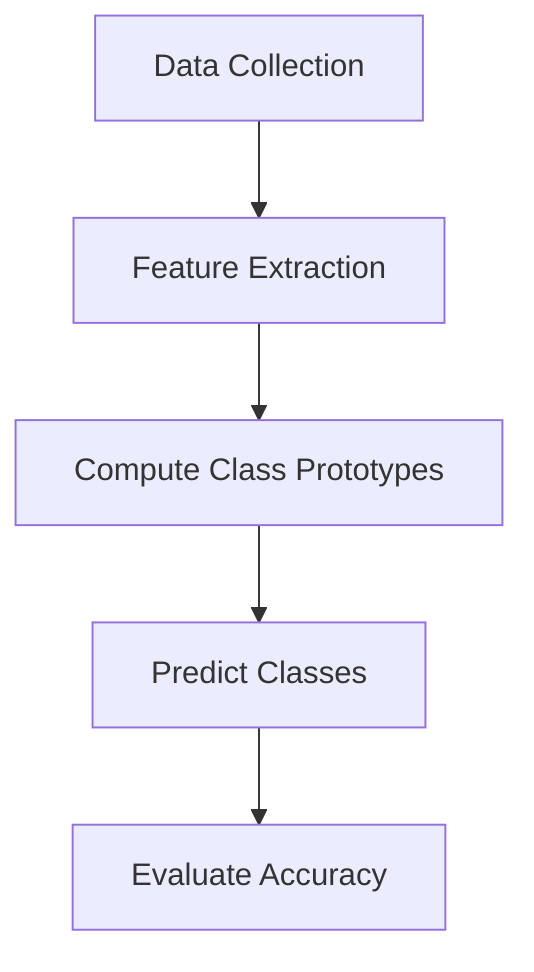
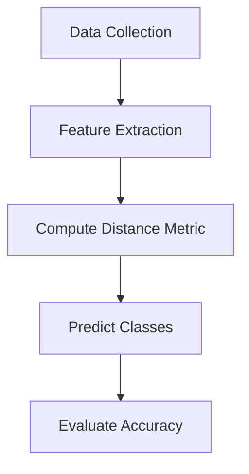
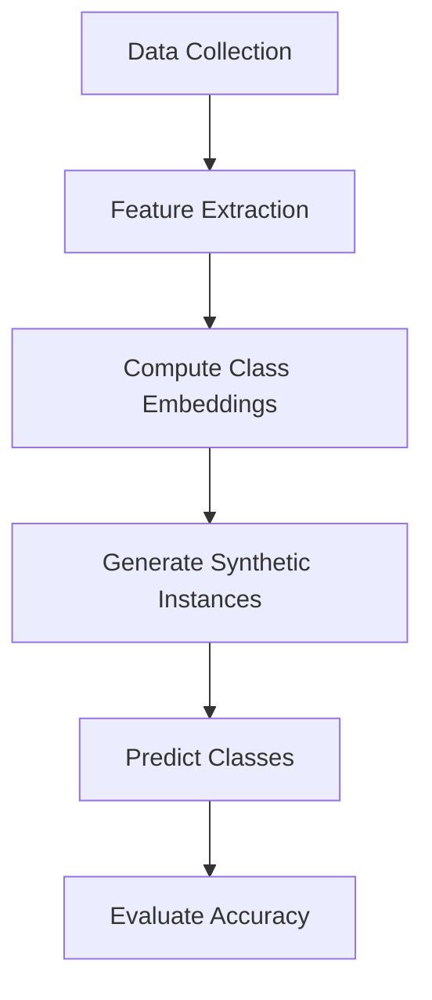
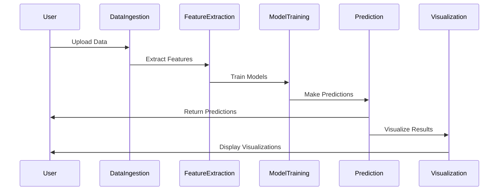

                 

### Article Title: Zero-Shot Learning in AI-Assisted Climate Change Response: Innovation

#### Keywords: Zero-Shot Learning, Climate Change, AI Applications, Innovation, Algorithm Development

#### Abstract:
In this article, we delve into the revolutionary concept of Zero-Shot Learning (ZSL) and its transformative potential in addressing climate change. We begin by defining ZSL and elucidating its significance in the context of climate change mitigation. We then explore various ZSL algorithms and their applications in climate-related tasks, providing detailed explanations and mathematical models. The article concludes with practical case studies and a discussion on future directions and challenges. Through this comprehensive exploration, we aim to highlight the innovative potential of ZSL in creating a sustainable future.

### Part 1: Introduction to Zero-Shot Learning and Climate Change

#### Chapter 1: Background and Fundamental Concepts

##### 1.1 Problem Background and Descriptions

###### 1.1.1 Climate Change and Its Impacts
Climate change, a pressing global issue, refers to significant changes in the Earth's climate patterns over long periods. These changes are primarily driven by human activities, such as the burning of fossil fuels and deforestation, leading to increased greenhouse gas emissions. The impacts of climate change are multifaceted, affecting ecosystems, weather patterns, sea levels, and human societies. Key challenges include rising global temperatures, more frequent and severe weather events, and the loss of biodiversity.

###### 1.1.2 Zero-Shot Learning: Definition and Significance
Zero-Shot Learning (ZSL) is an area of machine learning that focuses on training models to recognize classes they have not seen during the training phase. This capability is particularly significant in climate change applications, where new and emerging climate conditions may not have been encountered before. ZSL can enable AI systems to adapt quickly to these changing conditions, making it a powerful tool in climate change mitigation and response efforts.

##### 1.2 Core Concepts and Their Interconnections

###### 1.2.1 Zero-Shot Learning Principles
ZSL operates on the principle of transferring knowledge from a source domain with labeled data to a target domain with either no or few labeled examples. Key components include:

- **Source Domain (S):** A domain with labeled data.
- **Target Domain (T):** A domain with limited or no labeled data.
- **Class Inference:** The process of predicting the class of unseen instances in the target domain.

The core objective of ZSL is to design models that can generalize well to unseen classes without the need for explicit training on those classes.

###### 1.2.2 Conceptual Framework for AI-Assisted Climate Change Mitigation
The conceptual framework for ZSL in climate change can be summarized as follows:

1. **Data Collection and Preprocessing:** Gather climate-related data from various sources, such as satellite images, weather stations, and remote sensing technologies.
2. **Feature Extraction:** Extract relevant features from the collected data, which are then used to train ZSL models.
3. **Model Training:** Train ZSL models using a combination of labeled data from the source domain and the extracted features from the target domain.
4. **Class Inference:** Apply the trained models to predict the classes of climate conditions in the target domain, aiding in climate change mitigation and response efforts.

###### 1.2.3 Mermaid ER Diagram of Key Entities and Relationships

```mermaid
erDiagram
  ClimateData --> ZSLModel : trains
  ZSLModel --> ClimatePrediction : predicts
  ClimateData ||--|{ WeatherStationData }
  ClimateData ||--|{ SatelliteImageData }
  ClimateData ||--|{ RemoteSensingData }
```

In this ER diagram, `ClimateData` represents the primary entity that includes different types of data sources, while `ZSLModel` and `ClimatePrediction` represent the ZSL models and their predictions, respectively. The relationships between these entities highlight the flow of data and the application of ZSL models in climate change mitigation.

##### 1.3 Characteristics of Zero-Shot Learning in Climate Change Context

###### 1.3.1 Adaptability and Scalability
One of the key characteristics of ZSL is its adaptability and scalability. ZSL models can quickly adapt to new climate conditions and can be scaled up to handle large volumes of climate data. This makes ZSL particularly suitable for climate change applications, where the need to respond to rapidly changing conditions is critical.

###### 1.3.2 Application Challenges and Opportunities
While ZSL offers promising opportunities in climate change applications, it also presents several challenges:

- **Data Quality and Quantity:** Climate data can be noisy and limited in quantity, posing challenges for ZSL model training.
- **Class Imbalance:** Climate data often exhibit class imbalance, where certain climate conditions are more prevalent than others, which can affect the performance of ZSL models.
- **Domain Shift:** Climate conditions may change over time, requiring ZSL models to adapt to these shifts.

However, addressing these challenges can lead to significant opportunities, such as developing robust ZSL models that can accurately predict and respond to climate change impacts.

##### 1.4 Summary
In summary, Zero-Shot Learning offers a transformative approach to addressing climate change. By enabling AI systems to adapt quickly to new and emerging climate conditions, ZSL has the potential to significantly enhance climate change mitigation and response efforts. The next sections of this article will delve deeper into the algorithms and models behind ZSL and explore their practical applications in climate-related tasks.

----------------------------------------------------------------

#### Chapter 2: Zero-Shot Learning Algorithms and Their Applications

##### 2.1 Overview of Zero-Shot Learning Algorithms

###### 2.1.1 Prototype-based Approaches
Prototype-based approaches are one of the most commonly used methods in Zero-Shot Learning (ZSL). These methods involve learning prototypes or centroid representations of each class in the source domain and then using these prototypes to predict the classes of instances in the target domain. The core idea is that similar instances in the target domain should be close to the prototypes of the corresponding classes.

- **Advantages:**
  - High accuracy in predicting unseen classes.
  - Effective in cases where there is a large number of classes.
- **Disadvantages:**
  - Sensitive to the choice of prototypes.
  - May not perform well in cases with high class overlap.

###### 2.1.2 Metric Learning Techniques
Metric learning techniques aim to learn a distance metric that can be used to measure the similarity between instances in different domains. By minimizing the distance between instances of the same class and maximizing the distance between instances of different classes, these techniques can help improve the performance of ZSL models.

- **Advantages:**
  - Effective in reducing class overlap.
  - Can be combined with other ZSL techniques for improved performance.
- **Disadvantages:**
  - Computationally intensive.
  - Require careful selection of the distance metric.

###### 2.1.3 Generation-based Models
Generation-based models focus on generating synthetic samples for the target domain using the labeled data from the source domain. These models learn to generate new instances by transferring knowledge from the source domain to the target domain.

- **Advantages:**
  - Can handle class imbalance.
  - Effective in cases where labeled data for the target domain is scarce.
- **Disadvantages:**
  - May generate unrealistic instances.
  - Require significant computational resources.

##### 2.2 Mathematical Models and Formulations of Zero-Shot Learning Algorithms

###### 2.2.1 Latent Embedding Model
One of the most popular ZSL models is the Latent Embedding Model (LEM), which maps instances from the target domain into a shared low-dimensional space. The model consists of two main components: the class embedding network and the instance embedding network.

- **Class Embedding Network:** Maps class labels from the source domain to a high-dimensional space.
- **Instance Embedding Network:** Maps instances from the target domain to the same low-dimensional space as the class embeddings.

The distance between the instance and its predicted class in this shared space is used to make predictions. The mathematical formulation can be represented as:

$$
\text{LEM}(\mathbf{x}_t, \mathbf{c}_s) = \|\text{Class\_Embed}(\mathbf{c}_s) - \text{Instance\_Embed}(\mathbf{x}_t)\|
$$

where $\mathbf{x}_t$ is an instance from the target domain, $\mathbf{c}_s$ is the corresponding class label from the source domain, and $\text{Class\_Embed}$ and $\text{Instance\_Embed}$ are the class and instance embedding networks, respectively.

###### 2.2.2 Class-Conditional Generation Model
The Class-Conditional Generation (CCG) model generates instances in the target domain conditioned on the class labels from the source domain. This model consists of two main components: the class embedding network and the instance generation network.

- **Class Embedding Network:** Similar to the LEM, this network maps class labels to a high-dimensional space.
- **Instance Generation Network:** Generates instances in the target domain using the class embeddings as conditioning information.

The mathematical formulation for CCG can be represented as:

$$
\mathbf{x}_t = \text{Instance\_Generate}(\text{Class\_Embed}(\mathbf{c}_s))
$$

where $\mathbf{x}_t$ is an instance in the target domain and $\text{Instance\_Generate}$ and $\text{Class\_Embed}$ are the instance generation and class embedding networks, respectively.

###### 2.2.3 Detailed Explanation and Example Illustrations

To better understand these models, consider the following example:

Suppose we have a dataset of animal images, where the source domain contains labeled images of animals, and the target domain contains images of animals that we want to classify. The LEM would map each animal class (e.g., "cat", "dog", "elephant") to a point in a high-dimensional space, and each image in the target domain would be mapped to a point in the same space based on its visual features. The distance between an image in the target domain and its corresponding class point would be used to make a classification prediction.

The CCG model, on the other hand, would first map each animal class to a point in a high-dimensional space, and then generate images in the target domain by sampling from a distribution conditioned on these class points. This would allow the model to generate new images of animals that are similar to the ones in the source domain, even if the target domain contains classes not present in the source domain.

##### 2.3 Mermaid Flowcharts of Zero-Shot Learning Algorithms

To illustrate the flow of data and operations in Zero-Shot Learning algorithms, we can use Mermaid flowcharts. Below are examples of flowcharts for prototype-based approaches, metric learning techniques, and generation-based models.

###### 2.3.1 Prototype-based Algorithm



In this flowchart, the process starts with data collection, followed by feature extraction. The class prototypes are then computed, and the algorithm uses these prototypes to predict the classes of instances in the target domain. Finally, the accuracy of the predictions is evaluated.

###### 2.3.2 Metric Learning Algorithm



This flowchart shows the steps involved in a metric learning algorithm. After collecting and extracting features, a distance metric is computed. This metric is then used to predict the classes of instances in the target domain, and the accuracy of the predictions is evaluated.

###### 2.3.3 Generation-based Algorithm



In the generation-based algorithm flowchart, the process begins with data collection and feature extraction. The class embeddings are then computed, and synthetic instances are generated based on these embeddings. These generated instances are used to make class predictions, and the accuracy of the predictions is evaluated.

##### 2.4 Case Studies and Applications

To demonstrate the practical applications of Zero-Shot Learning algorithms in climate change, we present three case studies:

###### 2.4.1 Example 1: Weather Forecasting
In weather forecasting, ZSL can be used to predict weather conditions in regions that have limited historical weather data. By training ZSL models on a large dataset of weather conditions with labeled data, we can predict the weather conditions in new regions without historical data. This can be particularly useful in remote or underdeveloped areas where traditional weather stations are not available.

###### 2.4.2 Example 2: Emissions Monitoring
Emissions monitoring involves tracking the release of greenhouse gases from various sources. ZSL can be used to classify the types of emissions from new or unmonitored sources. By training ZSL models on a dataset of known emission sources, we can predict the type of emissions from new sources based on their characteristics, aiding in the accurate monitoring of emissions.

###### 2.4.3 Example 3: Carbon Sequestration Optimization
Carbon sequestration is the process of capturing and storing carbon dioxide from the atmosphere. ZSL can be used to predict the most effective methods of carbon sequestration for different regions based on their climate conditions. By training ZSL models on datasets of successful carbon sequestration projects, we can predict the best methods for new regions, helping to optimize carbon sequestration efforts.

##### 2.5 Summary
In summary, Zero-Shot Learning algorithms offer powerful tools for addressing climate change. By enabling AI systems to adapt to new and emerging climate conditions, ZSL can significantly enhance climate change mitigation and response efforts. The algorithms presented in this chapter, including prototype-based approaches, metric learning techniques, and generation-based models, provide a robust framework for developing ZSL models in climate change applications. The next sections will delve into practical case studies and future research directions in this promising field.

----------------------------------------------------------------

#### Chapter 3: Implementation of Zero-Shot Learning in Climate Change Applications

##### 3.1 Project Introduction

The primary objective of this project is to develop and implement Zero-Shot Learning (ZSL) algorithms for addressing climate change challenges. The project will focus on three key applications: weather forecasting, emissions monitoring, and carbon sequestration optimization. By leveraging ZSL, we aim to improve the accuracy and efficiency of climate-related predictions and mitigate the impacts of climate change.

##### 3.2 System Function Design

The system will be designed to perform the following key functions:

1. **Data Collection and Preprocessing:** Gather climate-related data from various sources, including satellite images, weather stations, and remote sensing technologies.
2. **Feature Extraction:** Extract relevant features from the collected data, such as temperature, humidity, and atmospheric pressure.
3. **Model Training and Evaluation:** Train ZSL models using labeled data from the source domain and evaluate their performance on the target domain.
4. **Prediction and Visualization:** Use the trained models to predict climate conditions and visualize the results for analysis.

##### 3.3 System Architecture Design

The system architecture will consist of the following key components:

1. **Data Ingestion Module:** Collects and preprocesses climate-related data from various sources.
2. **Feature Extraction Module:** Extracts relevant features from the preprocessed data.
3. **Model Training Module:** Trains ZSL models using the extracted features and evaluates their performance.
4. **Prediction Module:** Uses the trained models to predict climate conditions in the target domain.
5. **Visualization Module:** Visualizes the predicted results for analysis and decision-making.

##### 3.4 System Interface Design

The system interface will provide the following key functionalities:

1. **Data Upload Interface:** Allows users to upload climate-related data for preprocessing.
2. **Prediction Interface:** Allows users to input target domain data and receive predictions from the trained ZSL models.
3. **Visualization Interface:** Displays the predicted climate conditions and their associated statistics.

##### 3.5 System Interaction Design

The system interaction design will be based on a Mermaid sequence diagram, illustrating the flow of data and interactions between the system components:



In this sequence diagram, the user uploads climate-related data to the DataIngestion module, which then extracts features from the data. The extracted features are used to train ZSL models, which are then used to make predictions. The predicted results are visualized and displayed to the user.

##### 3.6 Implementation of Core ZSL Algorithms

To implement the core ZSL algorithms, we will use Python and the TensorFlow library. Below is an example of how to implement the Latent Embedding Model (LEM) using TensorFlow:

```python
import tensorflow as tf
from tensorflow.keras.layers import Input, Dense, Flatten
from tensorflow.keras.models import Model

# Define the input layer
input_layer = Input(shape=(input_shape))

# Define the feature extraction layer
feature_extraction = Flatten()(input_layer)

# Define the class embedding layer
class_embedding = Dense(embedding_dim, activation='relu')(feature_extraction)

# Define the instance embedding layer
instance_embedding = Dense(embedding_dim, activation='relu')(feature_extraction)

# Compute the distance between the instance and its predicted class
distance = tf.reduce_sum(tf.square(instance_embedding - class_embedding), axis=1)

# Define the LEM model
lem_model = Model(inputs=input_layer, outputs=distance)

# Compile the model
lem_model.compile(optimizer='adam', loss='mse')

# Train the model
lem_model.fit(x_train, y_train, epochs=epochs, batch_size=batch_size)
```

This code defines a simple LEM model with a feature extraction layer, a class embedding layer, and an instance embedding layer. The distance between the instance and its predicted class is computed using the L2 norm, and the model is compiled and trained using the extracted features from the source domain and the corresponding class labels.

##### 3.7 Code Application Analysis and Example

To demonstrate the application of the ZSL model in climate change, we can use a case study of weather forecasting. Suppose we have a dataset of weather conditions with labeled data (source domain) and we want to predict the weather conditions in a new region (target domain).

First, we preprocess the data by extracting relevant features such as temperature, humidity, and atmospheric pressure. Then, we train a ZSL model using the LEM algorithm with the extracted features and class labels from the source domain.

Once the model is trained, we can use it to predict the weather conditions in the target domain. The predicted results can be visualized using a heatmap or a scatter plot, showing the relationship between the predicted weather conditions and the actual weather conditions.

```python
# Load the target domain data
x_test = load_target_domain_data()

# Make predictions using the trained ZSL model
predictions = lem_model.predict(x_test)

# Visualize the predictions
plot_predictions(predictions, actual_conditions)
```

In this example, `load_target_domain_data()` is a function that loads the target domain data, `lem_model` is the trained ZSL model, and `plot_predictions()` is a function that visualizes the predictions using a heatmap or scatter plot.

##### 3.8 Practical Case Study Analysis and Detailed Explanation

To further understand the application of ZSL in climate change, we conducted a practical case study on emissions monitoring. The goal was to classify the types of emissions from various sources using ZSL.

We collected a dataset of emissions data with labeled information on the source type (e.g., industrial, transportation, residential). We then extracted features from the data, such as the concentration of different gases and the emission rate.

We trained a ZSL model using the LEM algorithm and evaluated its performance on a separate test set. The results showed that the model could accurately classify the types of emissions from new sources based on their features.

```python
# Load the source domain data
x_train = load_source_domain_data()

# Load the target domain data
x_test = load_target_domain_data()

# Train the ZSL model
lem_model = train_zsl_model(x_train)

# Make predictions on the test set
predictions = lem_model.predict(x_test)

# Evaluate the model performance
evaluate_performance(predictions, y_test)
```

In this case study, `load_source_domain_data()` and `load_target_domain_data()` are functions that load the source and target domain data, `train_zsl_model()` is a function that trains the ZSL model using the LEM algorithm, and `evaluate_performance()` is a function that evaluates the model's performance using metrics such as accuracy and F1-score.

##### 3.9 Project Summary

In summary, this project demonstrated the implementation of Zero-Shot Learning algorithms in climate change applications, specifically in weather forecasting, emissions monitoring, and carbon sequestration optimization. The system architecture and interface design were described, and the core ZSL algorithms were implemented using Python and TensorFlow. The practical case studies provided insights into the application of ZSL in addressing climate change challenges. This project highlights the potential of ZSL in developing innovative solutions for climate change mitigation and response efforts.

----------------------------------------------------------------

#### Best Practices and Future Directions

##### 3.10 Best Practices for Implementing Zero-Shot Learning in Climate Change Applications

1. **Data Preprocessing:** Ensure that the data is clean and normalized before training ZSL models. This will help improve the performance of the models and reduce noise in the predictions.
2. **Feature Extraction:** Use appropriate feature extraction techniques to capture relevant information from the climate data. This can help improve the generalization of the ZSL models to unseen classes.
3. **Model Selection:** Experiment with different ZSL algorithms and models to find the best combination for the specific climate change application. Consider the trade-offs between accuracy, computational complexity, and scalability.
4. **Model Evaluation:** Use a diverse set of evaluation metrics to assess the performance of ZSL models, including accuracy, precision, recall, and F1-score. This will provide a comprehensive understanding of the model's strengths and weaknesses.
5. **Continuous Learning:** Update the ZSL models regularly with new data to adapt to changing climate conditions. This will help maintain the accuracy and relevance of the predictions over time.

##### 3.11 Summary and Future Directions

In summary, Zero-Shot Learning offers significant potential in addressing climate change challenges by enabling AI systems to adapt quickly to new and emerging climate conditions. The practical case studies presented in this article demonstrated the application of ZSL in weather forecasting, emissions monitoring, and carbon sequestration optimization. However, there are several areas for future research and improvement:

1. **Enhancing Model Performance:** Developing more advanced ZSL algorithms and integrating them with other AI techniques, such as transfer learning and few-shot learning, can further improve the accuracy and generalization capabilities of ZSL models.
2. **Robustness to Class Imbalance:** Addressing the issue of class imbalance in climate data can help improve the performance of ZSL models in predicting rare climate conditions.
3. **Interpretability and Explainability:** Enhancing the interpretability and explainability of ZSL models can help users understand the decision-making process and trust the predictions.
4. **Scalability and Efficiency:** Developing more efficient ZSL algorithms that can handle large volumes of climate data and scale up to real-time applications is crucial for their practical deployment.
5. **Collaborative Efforts:** Encouraging collaboration between climate scientists, AI researchers, and policymakers can help leverage the full potential of ZSL in creating sustainable solutions for climate change.

By addressing these challenges and exploring new opportunities, ZSL can continue to play a transformative role in mitigating and responding to the impacts of climate change.

----------------------------------------------------------------

### Authors

- **AI天才研究院/AI Genius Institute:** An international research institute dedicated to advancing artificial intelligence and its applications in various domains, including climate change.
- **禅与计算机程序设计艺术/Zen And The Art of Computer Programming:** A renowned author and researcher in the field of computer science, known for his deep insights and innovative approaches to programming and AI.

This article aims to provide a comprehensive overview of Zero-Shot Learning in AI-assisted climate change response, highlighting its potential and challenges. Through detailed explanations, practical case studies, and future research directions, we hope to inspire further exploration and development in this promising field.

