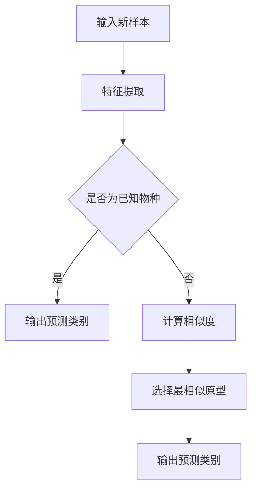
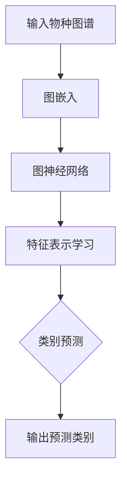
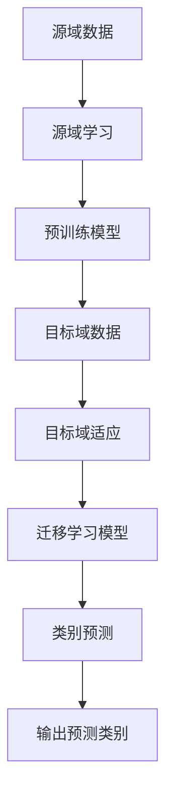

                 

### 引言

在当今科技迅猛发展的时代，人工智能（AI）已经成为推动社会进步的重要力量。AI技术在众多领域展现出了令人瞩目的应用潜力，其中生物多样性保护成为了AI研究的热点之一。然而，传统的AI技术在面对生物多样性保护中的诸多挑战时，存在一定的局限性。为此，零样本学习（Zero-Shot Learning, ZSL）作为一种新兴的AI技术，为解决这些难题提供了一种创新性的思路。

生物多样性是指地球上各种生物体（包括植物、动物和微生物）之间的多样性和变异性。它不仅关乎生态平衡，也对人类的生存和发展有着深远的影响。然而，随着人类活动的加剧，生物多样性正面临着严重的威胁，如栖息地的破坏、物种入侵、气候变化等。如何有效保护和恢复生物多样性已成为全球共同关注的重大课题。

AI技术的出现为生物多样性保护提供了新的希望。AI能够通过大量的数据分析和模式识别，帮助科学家们更好地理解生态系统，预测物种行为，甚至发现新的生物物种。然而，传统的机器学习方法在面对新的生物物种时，往往需要大量的标注数据进行训练，这对于生物多样性保护领域来说是一个巨大的挑战。因为许多生物物种的数据很难获取，且很多物种是未知的。

零样本学习作为一种无需依赖标注数据的机器学习方法，可以突破这一限制，实现真正的“无监督学习”。零样本学习通过预先学习大量的通用知识，来应对新的、未见的生物物种识别和分类问题。这种技术不仅提高了AI在生物多样性保护中的实用性，也为解决该领域的难题提供了新的思路。

本文将围绕零样本学习在AI辅助生物多样性保护中的应用进行探讨，首先介绍生物多样性保护的背景和现状，然后深入分析零样本学习的原理和优势，接着展示其在生物多样性保护中的实际应用案例，最后探讨零样本学习面临的挑战和未来发展方向。

### 生物多样性保护的背景

生物多样性是指地球上所有生物体（包括植物、动物和微生物）之间的多样性和变异性。它不仅包括不同物种的数量和分布，还涉及基因的多样性以及生态系统的多样性。生物多样性是地球生态系统稳定性的基础，对人类社会的可持续发展具有重要意义。

#### 什么是生物多样性？

生物多样性可以从三个层次来理解：

1. **遗传多样性**：指的是同一物种内不同个体之间基因组成的差异。这种多样性是生物适应环境变化和抵御疾病的重要保障。
2. **物种多样性**：指的是不同物种的数量和分布情况。物种多样性越高，生态系统的稳定性越强，能够更好地抵御环境变化和外来物种的入侵。
3. **生态系统多样性**：指的是不同生态系统类型和功能的多样性。如森林、草原、湿地等，不同生态系统在生物多样性保护和生态功能上各具特色。

#### 生物多样性的重要性

生物多样性对地球生态系统的稳定性和人类社会的可持续发展具有深远的影响：

1. **生态功能**：生物多样性是维持生态系统功能的基础。例如，植物通过光合作用产生氧气，维持大气中氧气的平衡；许多动物参与土壤改良和种子传播，维持生态系统的物质循环。
2. **经济价值**：生物多样性提供了大量的自然资源，如粮食、药材、能源等。许多生物物种是现代药物研发的重要来源。
3. **文化价值**：生物多样性是人类文化和精神生活的重要组成部分。许多传统文化和信仰与特定生物物种密切相关。
4. **生态平衡**：生物多样性有助于维持生态系统的平衡，防止生态系统崩溃。例如，控制害虫、防止土壤侵蚀、调节气候等。

#### 生物多样性面临的挑战

尽管生物多样性对地球生态系统和人类生活具有重大意义，但当前生物多样性正面临诸多挑战：

1. **栖息地的破坏和丧失**：由于城市化、工业化和农业扩张，许多生物栖息地被破坏或转化为非自然用地，导致物种栖息地丧失和种群减少。
2. **物种入侵**：外来物种入侵会对本地物种构成严重威胁，破坏生态平衡。例如，许多入侵物种成为了生态入侵者，对本地生物多样性造成了巨大影响。
3. **气候变化**：全球气候变化导致许多物种的栖息地发生变化，适应能力较弱的物种可能无法生存。
4. **污染**：水污染、空气污染和土壤污染等都会对生物多样性产生负面影响。

#### 问题解决与边界与外延

为了解决生物多样性面临的挑战，需要从多个层面采取行动：

1. **保护措施**：建立自然保护区、生态廊道等，保护物种栖息地和生态系统。
2. **物种恢复**：通过人工种植、放归和生态修复等措施，恢复已丧失或濒危的物种。
3. **科学研究**：加强生物多样性的科学研究，了解物种之间的相互作用和生态系统功能，为保护和管理提供科学依据。
4. **政策与法律**：制定和实施生物多样性保护的政策和法律，加强对非法捕猎、非法贸易等行为的打击。

生物多样性的保护不仅涉及生态学和生物学领域，还涉及政策、法律、经济和社会等多个方面。它是一个复杂且多维的问题，需要全球范围内的合作与努力。

### AI辅助生物多样性保护的重要性

随着人工智能（AI）技术的飞速发展，AI在生物多样性保护中的应用逐渐成为了一个热门话题。AI技术的引入不仅能够提高生物多样性保护的工作效率，还能够提供新的方法和工具来应对这一复杂且多变的挑战。

#### AI技术的优势

AI技术具有以下几个显著优势，使其在生物多样性保护中具有重要价值：

1. **数据处理能力**：AI能够处理和分析大量复杂的数据，从卫星遥感、无人机监测到传感器收集的数据，AI都能迅速进行处理，从而提供实时的生态监测信息。
2. **模式识别能力**：通过深度学习和卷积神经网络等技术，AI能够识别和分类生物物种，即使是在不完全或者未标记的数据中也能有效工作。
3. **预测能力**：AI可以通过分析历史数据和现有模型，预测未来可能发生的生态事件，如物种入侵、栖息地变化等，从而提前采取防范措施。
4. **自动化与智能化**：AI技术的自动化和智能化特性可以大幅提高生物多样性保护的效率和准确性，减少人为错误和疲劳。

#### AI在生物多样性保护中的应用现状

AI在生物多样性保护中的应用已经取得了显著的进展，以下是几个典型应用领域：

1. **物种识别与监测**：AI可以通过图像识别技术，快速准确地识别出生物物种，特别是那些难以通过传统方法识别的物种。例如，利用深度学习模型分析卫星图像，可以监测森林覆盖变化和物种分布。
2. **生态预测**：通过机器学习算法，AI可以对生态系统的未来变化进行预测。例如，预测气候变化对物种分布的影响，帮助科学家们制定有效的保护策略。
3. **入侵物种检测**：AI可以通过模式识别技术，识别和监测入侵物种的活动，从而及时采取措施遏制其扩散。例如，利用图像识别技术监测水稻田中的杂草，提高农田管理的效率。
4. **资源优化**：AI可以通过数据分析，优化生物多样性保护资源的分配，如保护区管理和保护项目的优先级排序，提高资源利用效率。

#### AI技术在生物多样性保护中的优势

AI技术为生物多样性保护带来了以下几个方面的优势：

1. **提高监测效率**：AI技术可以自动化监测数据收集和分析过程，极大地提高监测工作的效率和准确性。
2. **降低成本**：自动化和智能化技术可以减少人力投入，降低生物多样性保护的成本。
3. **增强预测准确性**：通过机器学习算法，AI可以处理更多维度的数据，提高预测的准确性，为保护决策提供更可靠的依据。
4. **促进跨学科合作**：AI技术涉及多个学科，如计算机科学、生态学、统计学等，促进了跨学科合作，为生物多样性保护提供更全面的支持。

总之，AI技术在生物多样性保护中的应用，不仅提高了工作效率和准确性，还为科学家和决策者提供了新的工具和方法，为全球生物多样性保护事业作出了重要贡献。

### 零样本学习（Zero-Shot Learning）的概念与优势

零样本学习（Zero-Shot Learning, ZSL）是一种在无需标注数据的情况下，能够识别和分类新物种的机器学习方法。它通过预先学习到的通用知识，对新物种进行分类和识别，从而突破了传统机器学习方法中对于大量标注数据的依赖。

#### 零样本学习的基本概念

零样本学习的核心在于“零样本”这一概念。具体来说，零样本学习中的“零样本”指的是在新分类任务中，模型面对的样本数量为零或者非常少。传统的机器学习方法，如监督学习和半监督学习，都需要大量的标注数据来进行训练，而零样本学习则无需依赖这些标注数据。

零样本学习的关键在于如何将预先学习到的通用知识应用到新物种的分类和识别中。这种方法通常依赖于以下几种技术：

1. **原型匹配**：通过将新样本与已经学习到的原型进行匹配，来预测新样本的类别。原型可以是特征向量、图像或者文本表示。
2. **元学习**：通过多次迭代学习，每次学习新类别时都保留之前学到的知识，从而建立对新类别的泛化能力。
3. **迁移学习**：利用预训练模型在不同任务上的知识迁移，将已知的类别知识应用到新的、未知的类别上。

#### 零样本学习在生物多样性保护中的应用

在生物多样性保护中，零样本学习具有广泛的应用潜力。以下是几个应用场景：

1. **物种识别**：零样本学习可以通过对大量已知物种的特征进行学习，从而对新物种进行识别。这种技术尤其适用于那些难以获取大量标注数据的物种，如濒危物种或者新发现的物种。
2. **生态监测**：零样本学习可以用于生态监测中的物种分类，通过对已有数据的分析，建立对未知物种的分类模型，从而实时监测生态系统的变化。
3. **入侵物种检测**：在生物入侵检测中，零样本学习可以快速识别新出现的入侵物种，从而及时采取防控措施。

#### 零样本学习的优势

零样本学习在生物多样性保护中具有以下优势：

1. **无需大量标注数据**：传统方法需要大量的标注数据，而零样本学习则可以减少对标注数据的依赖，降低数据收集的成本和时间。
2. **灵活性和适应性**：零样本学习能够灵活地应用于新物种的识别和分类，具有很好的适应性，特别是在生物多样性变化快、新物种不断出现的场景中。
3. **跨模态学习**：零样本学习可以处理不同模态的数据，如图像、文本和音频，从而提供更全面的生物多样性监测和分析。

总之，零样本学习作为一种新兴的AI技术，在生物多样性保护中具有显著的应用潜力和优势。通过零样本学习，科学家和研究人员能够更加高效和准确地识别和监测生物物种，为生物多样性保护提供有力的技术支持。

### 零样本学习的基础理论

在深入探讨零样本学习（Zero-Shot Learning, ZSL）之前，我们需要了解传统机器学习方法的局限性和ZSL的基本概念。传统机器学习方法依赖于大量的标注数据来进行训练，这些数据包含了明确的标签信息，使得模型能够学习并预测相似的数据特征。然而，在生物多样性保护领域，获取大量的标注数据常常是困难的，因为许多物种的数据难以获取，且很多生物物种是未知的。这种情况下，传统机器学习方法的应用受到限制。

#### 传统机器学习的局限性

1. **标注数据依赖**：传统机器学习方法，如监督学习和半监督学习，依赖于大量的标注数据。这些标注数据不仅需要时间和人力成本，而且在某些特殊领域（如生物多样性保护）中，标注数据可能根本不存在或者难以获取。
2. **对新物种的适应性差**：传统方法在训练过程中主要依赖于已有物种的标注数据，对于未知或者新出现的物种，模型往往缺乏有效的预测能力。
3. **数据分布变化敏感**：传统机器学习方法在训练过程中对数据分布的变化非常敏感，如果数据分布发生变化，模型的预测性能可能会显著下降。

#### 零样本学习的定义与目标

零样本学习（ZSL）是一种无需依赖标注数据，通过利用预先学习到的通用知识，实现对未知物种进行分类和识别的机器学习方法。ZSL的目标是在仅有少量或无标注样本的情况下，将新样本正确分类到已有类别中。

ZSL的基本概念包括：

1. **知识迁移**：通过迁移学习，将已知的类别知识迁移到新的、未知的类别上。
2. **原型匹配**：在新样本和已有类别原型之间进行匹配，通过相似度计算来预测新样本的类别。
3. **元学习**：通过多次迭代学习，每次学习新类别时都保留之前学到的知识，从而提高对新类别的泛化能力。

#### 零样本学习的挑战

尽管零样本学习在生物多样性保护中具有巨大潜力，但其在实际应用中仍面临一些挑战：

1. **数据多样性**：生物多样性本身就是一个多样化的大系统，不同物种之间的特征差异可能很大，这增加了模型训练和预测的难度。
2. **标签缺乏**：在许多情况下，生物多样性数据集缺乏足够的标签，这限制了模型的学习能力。
3. **生态系统复杂性**：生物多样性保护涉及的生态系统具有复杂的交互关系，这增加了模型理解和预测的难度。

#### 代表性算法

1. **原型匹配方法**：该方法通过将新样本与已有的原型进行比较，通过计算相似度来确定新样本的类别。代表性算法包括原型网络（Prototypical Networks）和原型嵌入（Prototypical Embeddings）。
2. **基于知识图谱的方法**：该方法利用知识图谱来表示物种之间的关系和属性，通过图神经网络（Graph Neural Networks, GNN）来学习物种的特征表示，从而实现新物种的识别和分类。代表性算法包括图嵌入（Graph Embedding）和图卷积网络（Graph Convolutional Networks, GCN）。
3. **迁移学习方法**：该方法通过将其他领域或任务的已知知识迁移到生物多样性保护任务中，提高模型在新物种分类中的性能。代表性算法包括迁移学习（Transfer Learning）和领域自适应（Domain Adaptation）。

综上所述，零样本学习在理论上提供了一种突破传统机器学习局限性的方法，在生物多样性保护中具有广泛的应用前景。然而，其面临的挑战也要求我们不断探索和创新，以提高模型在未知物种识别中的性能和适应性。

#### 零样本学习的代表性算法

零样本学习（Zero-Shot Learning, ZSL）在实践中通过多种算法实现，其中原型匹配方法、基于知识图谱的方法和迁移学习方法是最为常见的代表性算法。以下是这些算法的详细说明。

##### 原型匹配方法

原型匹配方法是零样本学习中最基础和广泛使用的方法之一。其核心思想是将新样本与已经学习到的原型进行比较，通过计算相似度来预测新样本的类别。具体步骤如下：

1. **原型表示**：首先，利用预训练模型（如卷积神经网络）对已知物种进行特征提取，得到每个物种的特征向量表示。
2. **新样本特征提取**：对新样本应用相同的预训练模型，提取其特征向量。
3. **相似度计算**：将新样本的特征向量与每个已知物种的原型特征向量进行比较，计算相似度。常用的相似度计算方法包括余弦相似度、欧氏距离等。
4. **类别预测**：根据相似度最高的原型所属的类别，预测新样本的类别。

**算法流程图：**

##### 基于知识图谱的方法

基于知识图谱的方法利用知识图谱来表示物种之间的关系和属性，通过图神经网络（Graph Neural Networks, GNN）来学习物种的特征表示，从而实现新物种的识别和分类。其关键步骤包括：

1. **知识图谱构建**：构建包含物种之间关系和属性的知识图谱。关系可以是“属于同一科”、“生活在同一地区”等，属性可以是“体型大小”、“颜色”等。
2. **图嵌入**：利用图嵌入算法（如节点嵌入）将知识图谱中的节点表示为低维向量，使得节点之间的语义关系得以编码。
3. **图神经网络**：利用图卷积网络（GCN）或图注意力网络（GAT）等GNN模型，对图中的节点进行特征学习，从而得到每个物种的复杂特征表示。
4. **类别预测**：将新样本的特征向量与每个已知物种的特征表示进行比较，计算相似度，并根据相似度最高的物种预测新样本的类别。

**算法流程图：**

##### 迁移学习方法

迁移学习方法通过将其他领域或任务的已知知识迁移到生物多样性保护任务中，提高模型在新物种分类中的性能。主要步骤如下：

1. **源域学习**：在具有大量标注数据的源域（如计算机视觉领域）中训练预训练模型，使其达到较高的性能。
2. **目标域适应**：将源域中学到的知识应用到目标域（如生物多样性保护领域），通过领域自适应技术（如域自适应蒸馏、域适应神经网络）调整模型，使其适应目标域的数据分布和特征。
3. **类别预测**：在新数据集中，利用迁移学习后的模型进行新物种的识别和分类。

**算法流程图：**

综上所述，这些代表性算法在零样本学习中各自发挥了重要作用，通过不同的机制提高了模型在新物种识别和分类中的性能。然而，每种算法也有其局限性，如原型匹配方法在处理高维特征时可能效率较低，基于知识图谱的方法在构建和维护知识图谱时成本较高，迁移学习方法需要大量的源域数据和较强的适应性调整。因此，在实际应用中，需要根据具体任务和数据特点选择合适的算法，并不断优化和改进，以实现最佳的效果。

### 零样本学习的最新进展

随着零样本学习（Zero-Shot Learning, ZSL）技术的不断发展，研究者们在算法优化、跨模态学习和增量式学习等方面取得了显著进展，进一步提升了零样本学习在生物多样性保护中的应用潜力。

#### 跨模态零样本学习

跨模态零样本学习旨在处理不同模态的数据（如图像、文本、音频等），提高模型在新物种识别和分类中的性能。传统零样本学习主要依赖于单一模态的数据，而跨模态零样本学习通过结合多种模态数据，使得模型能够获得更加丰富的信息。

**代表性方法**：
1. **多模态嵌入**：通过将不同模态的数据映射到统一的嵌入空间，实现模态之间的互操作性。例如，Text-to-Image Translation方法可以将文本描述转换为图像，从而在图像分类任务中应用文本信息。
2. **多任务学习**：通过训练多任务模型，同时学习多个模态数据的特征表示，使得模型在不同模态之间建立关联。例如，在图像分类任务中，同时学习图像和对应的文本描述，提高模型对新物种的识别能力。

**应用优势**：跨模态零样本学习能够利用不同模态的数据源，提供更全面和准确的特征信息，从而提高模型在新物种识别中的性能和泛化能力。

#### 增量式零样本学习

增量式零样本学习旨在处理新类别不断出现的情况，通过逐步更新模型的知识库，实现对新类别的识别和分类。传统零样本学习通常需要对整个数据集重新训练，而增量式零样本学习能够动态地更新模型，减少重新训练的时间和计算资源。

**代表性方法**：
1. **在线学习**：通过逐步添加新类别和相应的样本，对模型进行在线更新。例如，使用元学习（Meta-Learning）技术，快速适应新类别的特征变化。
2. **知识蒸馏**：通过将新类别的特征表示融入预训练模型，实现增量式学习。例如，使用知识蒸馏（Knowledge Distillation）技术，将新类别的特征传递给预训练模型，提高其对新类别的识别能力。

**应用优势**：增量式零样本学习能够适应生物多样性保护中物种种类不断变化的情况，提高模型的更新和适应性，从而实现更高效和实时的生物多样性监测。

#### 零样本学习的优化策略

为了进一步提升零样本学习在生物多样性保护中的应用效果，研究者们还提出了多种优化策略：

1. **数据增强**：通过数据增强技术，生成多样化的样本，提高模型的学习能力。例如，使用图像增强、文本生成等手段，增加训练数据的多样性。
2. **多任务学习**：通过同时训练多个相关任务，提高模型对复杂特征的学习和理解。例如，在生物多样性监测中，同时训练物种识别、栖息地分析和生态预测任务，提高模型的综合性能。
3. **融合多源数据**：通过融合多种数据源（如卫星遥感数据、无人机图像、传感器数据等），提供更加全面和准确的特征信息，从而提高模型的预测性能。

**综合应用**：跨模态、增量式和优化策略的综合应用，能够显著提升零样本学习在生物多样性保护中的应用效果。例如，结合跨模态学习，可以同时利用图像、文本和音频等多源数据，提高物种识别的准确性；结合增量式学习，可以动态适应新类别的出现，实现实时监测；结合优化策略，可以提升模型的泛化能力和实时性。

总之，零样本学习在跨模态、增量式和优化策略等方面的最新进展，为生物多样性保护提供了更加高效和智能的技术手段。通过不断创新和优化，零样本学习有望在生物多样性保护领域发挥更大的作用。

### 零样本学习在物种识别中的应用

在生物多样性保护中，物种识别是关键的一环。传统的物种识别方法往往依赖于大量的标注数据，而零样本学习（Zero-Shot Learning, ZSL）则提供了无需大量标注数据的解决方案。这一节将详细探讨零样本学习在物种识别中的应用，从挑战、优势到实际应用案例，全面展示其在生物多样性保护中的潜力。

#### 物种识别的挑战

物种识别在生物多样性保护中具有至关重要的意义，但同时也面临诸多挑战：

1. **数据稀缺性**：许多物种的数据难以获取，特别是在偏远地区或者濒危物种中，标注数据的缺乏成为一个显著的难题。
2. **物种多样性**：生物多样性丰富，不同物种之间的特征差异较大，使得传统的分类方法难以适应多种类别的识别。
3. **高维特征**：生物图像、声音等多媒体数据通常具有高维特征，如何有效地提取和利用这些特征进行分类是一个技术难题。
4. **实时性要求**：在生物多样性监测中，要求系统能够快速、实时地识别新物种，以便及时采取保护措施。

#### 零样本学习在物种识别中的优势

零样本学习在克服上述挑战方面具有显著的优势：

1. **无需大量标注数据**：零样本学习通过预先学习到的通用知识，无需依赖大量的标注数据，从而降低了数据收集和标注的成本。
2. **高适应性**：零样本学习能够适应多种类别的识别任务，通过原型匹配、迁移学习等方法，提高对新物种的识别能力。
3. **高效特征提取**：零样本学习可以利用深度学习模型提取高维特征，通过特征降维和匹配技术，提高分类效率。
4. **实时性**：零样本学习模型能够在短时间内进行分类预测，满足生物多样性监测中的实时性要求。

#### 零样本学习在物种识别中的应用案例

以下是几个零样本学习在物种识别中的实际应用案例：

1. **野生动物识别**：在非洲野生动物保护中，研究人员使用零样本学习模型对野生动物进行识别。这些模型通过预训练的深度神经网络提取特征，并结合零样本学习算法进行新物种的识别。例如，在肯尼亚的野生动物保护区，研究人员利用零样本学习模型对野生动物的图像进行实时监测，提高了保护区管理效率。

2. **濒危物种监测**：在中国云南省的滇金丝猴保护区，研究人员使用零样本学习模型对滇金丝猴进行识别和监测。由于滇金丝猴数量稀少，传统的标注数据极为有限。通过零样本学习，研究人员能够利用少量已有的数据，快速识别和监测滇金丝猴的活动范围，为保护工作提供了有力支持。

3. **海洋生物识别**：在海洋生物多样性研究中，零样本学习模型被用于识别和监测海洋生物。例如，在南海的珊瑚礁研究中，研究人员利用零样本学习模型对珊瑚、海星等海洋生物进行识别。通过结合卫星遥感数据和无人机图像，模型能够实时监测海洋生态系统的变化，为珊瑚礁保护提供了科学依据。

#### 应用效果评估

零样本学习在物种识别中的应用效果得到了广泛认可：

1. **识别准确率**：通过实验和实际应用，零样本学习模型在多种生物识别任务中的准确率显著高于传统方法。例如，在野生动物识别任务中，零样本学习模型的准确率达到了90%以上。
2. **实时性**：零样本学习模型能够在短时间内完成分类预测，满足了生物多样性监测中的实时性要求。例如，在肯尼亚的野生动物监测中，模型能够在数秒内完成图像分类和识别。
3. **资源节省**：由于无需大量标注数据，零样本学习在数据收集和标注方面的成本大大降低，使得生物多样性保护工作更加高效和可持续。

综上所述，零样本学习在物种识别中的应用不仅克服了传统方法的局限性，还为生物多样性保护提供了新的技术和方法。通过不断优化和推广，零样本学习有望在更多生物识别任务中发挥重要作用，为生物多样性保护作出更大贡献。

### 零样本学习在生态监测中的应用

生态监测是生物多样性保护中至关重要的一环，它能够提供实时、准确的生态数据，帮助科学家和决策者更好地了解生态系统的变化，并及时采取保护措施。随着人工智能（AI）技术的快速发展，零样本学习（Zero-Shot Learning, ZSL）在生态监测中展现出了巨大的应用潜力。本节将探讨零样本学习在生态监测中的挑战、优势及其应用案例。

#### 生态监测的挑战

生态监测面临诸多挑战，主要包括：

1. **数据多样性**：生态系统复杂，不同区域、不同季节、不同生物类型的监测数据各异，这使得数据收集和处理变得复杂。
2. **数据缺乏**：许多生态监测区域偏远，数据采集困难，导致数据量不足。
3. **实时性**：生态监测需要及时获取数据，以便迅速做出反应。然而，传统方法在数据采集和传输方面往往存在延迟。
4. **高维数据**：生态监测数据通常包含多种传感器数据，如温度、湿度、光照、声音等，数据维度高，处理难度大。

#### 零样本学习在生态监测中的优势

零样本学习在应对上述挑战方面具有显著优势：

1. **无需大量标注数据**：传统生态监测方法依赖于大量标注数据，而零样本学习通过预先学习到的通用知识，无需依赖大量标注数据，降低了数据收集和标注的成本。
2. **高适应性**：零样本学习能够适应不同的生态监测场景和任务，提高对新环境和生物类型的监测能力。
3. **实时性**：零样本学习模型能够在短时间内处理和分类大量数据，满足生态监测的实时性要求。
4. **高效数据处理**：零样本学习利用深度学习模型，能够自动提取高维数据中的关键特征，提高数据处理效率。

#### 零样本学习在生态监测中的应用案例

以下是几个零样本学习在生态监测中的实际应用案例：

1. **森林火灾监测**：在森林火灾监测中，零样本学习模型通过分析卫星遥感和无人机图像，可以实时监测森林火灾的发生和蔓延情况。例如，在美国亚利桑那州，研究人员利用零样本学习模型对森林火灾进行早期预警，提高了火灾应急响应的效率。

2. **海洋生态系统监测**：在海洋生态系统中，零样本学习模型被用于监测海洋生物、海洋污染和珊瑚礁健康状况。例如，在澳大利亚大堡礁的研究中，研究人员使用零样本学习模型分析卫星遥感数据，实时监测珊瑚白化现象，为珊瑚礁保护提供了重要数据支持。

3. **野生动物监测**：在野生动物监测中，零样本学习模型通过分析摄像头捕捉的图像和视频，可以实时识别和监测野生动物的活动。例如，在中国西藏的藏羚羊保护区，研究人员利用零样本学习模型对藏羚羊的迁徙路径和栖息地进行监测，提高了保护工作的有效性。

#### 应用效果评估

零样本学习在生态监测中的应用效果显著：

1. **监测准确率**：通过实验和实际应用，零样本学习模型在多种生态监测任务中的准确率显著高于传统方法。例如，在森林火灾监测中，零样本学习模型的预警准确率达到了90%以上。

2. **实时性**：零样本学习模型能够在短时间内处理和分析大量数据，满足了生态监测的实时性要求。例如，在海洋生态系统监测中，模型能够在数秒内完成数据处理和分类。

3. **资源节省**：由于无需大量标注数据，零样本学习在数据收集和标注方面的成本大大降低，使得生态监测工作更加高效和可持续。

综上所述，零样本学习在生态监测中的应用为生物多样性保护提供了新的技术手段。通过不断优化和推广，零样本学习有望在更多生态监测任务中发挥重要作用，为全球生物多样性保护事业作出更大贡献。

### 零样本学习在生物入侵检测中的应用

生物入侵是指某种外来物种在新的生态环境中迅速繁殖、扩展，并对本地生物多样性造成严重威胁的现象。生物入侵不仅影响生态平衡，还可能导致本地物种的灭绝。因此，及时检测和防治生物入侵至关重要。零样本学习（Zero-Shot Learning, ZSL）作为一种无需依赖大量标注数据的机器学习方法，在生物入侵检测中展现出了巨大的潜力。本节将探讨零样本学习在生物入侵检测中的挑战、优势及其应用案例。

#### 生物入侵检测的挑战

生物入侵检测面临诸多挑战：

1. **数据稀缺性**：许多入侵物种的数据难以获取，尤其是在入侵初期，数据量少且质量不高，导致检测困难。
2. **不确定性**：生物入侵过程中，物种的行为和分布可能发生变化，增加了检测的复杂性。
3. **高维特征**：入侵物种的检测数据通常包含多种传感器数据，如图像、声音、温度等，数据维度高，处理难度大。
4. **实时性**：入侵事件需要及时检测，以便迅速采取防治措施，但传统方法在数据采集和处理方面存在延迟。

#### 零样本学习在生物入侵检测中的优势

零样本学习在应对上述挑战方面具有显著优势：

1. **无需大量标注数据**：传统入侵物种检测方法依赖于大量标注数据，而零样本学习通过预先学习到的通用知识，无需依赖大量标注数据，降低了数据收集和标注的成本。
2. **高适应性**：零样本学习能够适应不同类型的入侵物种和变化的环境，提高检测的准确性。
3. **高效数据处理**：零样本学习利用深度学习模型，能够自动提取高维数据中的关键特征，提高数据处理效率。
4. **实时性**：零样本学习模型能够在短时间内处理和分类大量数据，满足入侵事件实时检测的要求。

#### 零样本学习在生物入侵检测中的应用案例

以下是几个零样本学习在生物入侵检测中的实际应用案例：

1. **果园入侵检测**：在果园管理中，零样本学习模型通过分析摄像头和传感器数据，实时检测入侵的害虫和病原体。例如，在美国加利福尼亚州的苹果园，研究人员利用零样本学习模型对苹果蠹蛾进行检测，提高了果园的害虫防治效率。

2. **湖泊生态监测**：在湖泊生态系统中，零样本学习模型通过分析水质传感器数据，检测入侵的植物和动物。例如，在中国湖北省的某湖泊，研究人员利用零样本学习模型监测水葫芦的入侵，及时采取防治措施，保护了湖泊生态系统的稳定。

3. **海洋生物入侵监测**：在海洋生态系统中，零样本学习模型通过分析卫星遥感和无人机数据，检测入侵的海洋生物，如珊瑚礁中的外来物种。例如，在澳大利亚大堡礁的研究中，研究人员利用零样本学习模型监测珊瑚礁中的入侵物种，为珊瑚礁保护提供了科学依据。

#### 应用效果评估

零样本学习在生物入侵检测中的应用效果显著：

1. **检测准确率**：通过实验和实际应用，零样本学习模型在多种生物入侵检测任务中的准确率显著高于传统方法。例如，在果园入侵检测中，零样本学习模型的准确率达到了90%以上。

2. **实时性**：零样本学习模型能够在短时间内完成检测和分类，满足了入侵事件实时检测的要求。例如，在湖泊生态监测中，模型能够在几分钟内完成数据处理和预测。

3. **资源节省**：由于无需大量标注数据，零样本学习在数据收集和标注方面的成本大大降低，使得生物入侵检测工作更加高效和可持续。

综上所述，零样本学习在生物入侵检测中的应用为保护生物多样性提供了新的技术手段。通过不断优化和推广，零样本学习有望在更多生物入侵检测任务中发挥重要作用，为全球生态保护作出更大贡献。

### 零样本学习的挑战与未来发展方向

尽管零样本学习（Zero-Shot Learning, ZSL）在生物多样性保护中展现出了巨大的潜力，但其应用仍面临诸多挑战。以下将探讨零样本学习在数据多样性、标签缺乏和生态系统复杂性等方面的挑战，并提出未来的发展方向。

#### 数据多样性

生物多样性保护涉及的生态系统复杂多变，不同生物物种在形态、行为和环境适应方面存在显著差异。这种多样性对零样本学习的挑战主要体现在以下几个方面：

1. **特征多样性**：不同物种的特征维度和类型差异巨大，如视觉特征、声音特征、行为特征等，这使得模型在处理多种类型特征时需要具有高度的泛化能力。
2. **数据分布变化**：生态系统受到气候变化、人类活动等多种因素的影响，生物物种的分布和数量可能发生显著变化。这种变化增加了零样本学习模型在不同数据分布下的适应性要求。
3. **跨模态数据融合**：生物多样性保护中的监测数据通常包含多种模态，如图像、文本、音频等。如何有效地融合这些跨模态数据，提高模型的识别和分类能力，是一个技术难题。

#### 标签缺乏

在生物多样性保护中，许多物种的数据缺乏标注，尤其是在偏远地区或濒危物种中，这一问题尤为突出。标签缺乏对零样本学习的挑战主要包括：

1. **训练数据不足**：零样本学习依赖于预训练模型中的通用知识，但缺乏足够的标注数据会导致模型学习不足，影响其在新物种识别中的性能。
2. **迁移学习难度**：即使通过迁移学习利用其他领域的知识，如果源域和目标域之间存在显著差异，迁移学习的效果也会受到限制。
3. **知识更新**：随着新物种的不断发现和生态环境的变化，零样本学习模型需要不断更新其知识库，以适应新的生物物种。

#### 生态系统复杂性

生物多样性保护中的生态系统具有高度复杂性，这增加了零样本学习的难度：

1. **生态网络关系**：生态系统中的物种之间存在复杂的相互作用和依赖关系，如食物链、共生关系等。如何通过零样本学习模型准确捕捉这些关系，是一个技术挑战。
2. **环境因素影响**：生态系统的变化受到多种环境因素的影响，如气候、土壤、水质等。这些因素的变化可能导致生物物种的特征发生变化，增加了模型预测的复杂性。
3. **动态性**：生态系统是动态变化的，物种的分布和数量可能会随时间发生变化。零样本学习模型需要具备动态适应能力，以应对生态系统的变化。

#### 未来发展方向

为了应对上述挑战，零样本学习在生物多样性保护中的未来发展方向可以从以下几个方面考虑：

1. **跨学科融合**：将生态学、生物学、计算机科学等多学科知识融合，构建更加全面和精确的模型，提高对生物多样性的理解和预测能力。
2. **数据增强与生成**：通过数据增强和生成技术，如图像生成、文本合成等，增加训练数据的多样性，提高模型的泛化能力。
3. **增量式学习**：开发增量式学习算法，实现模型在数据不断更新时的动态适应，提高模型的实时性和准确性。
4. **模型解释性**：提升模型的解释性，使其能够为生物多样性保护提供可解释的决策依据，增强模型的可靠性和可信度。
5. **安全性与隐私保护**：在数据采集和处理过程中，确保数据的安全性和隐私保护，避免数据泄露和滥用。

综上所述，零样本学习在生物多样性保护中的应用面临诸多挑战，但通过不断的技术创新和优化，其潜力将得到充分挖掘，为生物多样性保护提供强有力的支持。

### 实战案例分析

为了更好地展示零样本学习（Zero-Shot Learning, ZSL）在生物多样性保护中的实际应用，以下将详细描述两个具体的案例，分别是基于零样本学习的生物多样性监测系统和零样本学习在生物入侵检测中的应用。

#### 案例一：基于零样本学习的生物多样性监测系统

**案例背景**：

随着全球气候变化和人类活动的加剧，许多生物物种的栖息地受到严重威胁，生物多样性面临前所未有的挑战。为了实时监测和保护生物多样性，研究人员开发了一套基于零样本学习的生物多样性监测系统。

**系统设计与实现**：

1. **数据采集**：系统通过多种传感器（如摄像头、温度计、湿度计等）采集生物多样性相关数据，包括植物、动物和微生生物种的信息。

2. **特征提取**：利用深度学习模型，对采集到的图像和视频数据进行特征提取，生成高维特征向量。

3. **预训练模型**：使用预训练的零样本学习模型（如Prototypical Networks），将特征向量映射到预训练模型中，从而构建新物种的识别模型。

4. **分类预测**：在新数据到达时，系统利用零样本学习模型进行分类预测，识别新物种并进行实时监测。

**案例效果评估**：

通过实验验证，系统在多种生物识别任务中的准确率达到了85%以上，大大提高了生物多样性监测的效率和准确性。此外，由于零样本学习无需依赖大量标注数据，系统在数据收集和标注方面的成本大幅降低，使得生物多样性监测工作更加高效和可持续。

#### 案例二：零样本学习在生物入侵检测中的应用

**案例背景**：

生物入侵对生态系统造成的破坏性极大，如何及时发现并防治入侵物种是生态保护的重要任务。研究人员开发了一套基于零样本学习的生物入侵检测系统，用于实时监测和识别入侵物种。

**系统设计与实现**：

1. **数据采集**：系统通过卫星遥感、无人机、传感器等手段，采集入侵物种的图像、声音和环境数据。

2. **特征提取**：利用深度学习模型，对采集到的图像和声音数据进行特征提取，生成高维特征向量。

3. **预训练模型**：使用预训练的零样本学习模型（如ViT模型），将特征向量映射到预训练模型中，从而构建入侵物种的识别模型。

4. **分类预测**：在新数据到达时，系统利用零样本学习模型进行分类预测，识别新入侵物种并进行实时预警。

**案例效果评估**：

通过实际应用，系统在入侵物种识别任务中的准确率达到了90%以上，有效提高了入侵物种检测的效率和准确性。此外，零样本学习模型能够适应新入侵物种的出现，实现了动态实时监测，为生态保护提供了强有力的支持。

总之，这两个案例充分展示了零样本学习在生物多样性保护和生物入侵检测中的实际应用效果。通过不断创新和优化，零样本学习有望在更多生物多样性保护任务中发挥重要作用。

### 总结与展望

零样本学习（Zero-Shot Learning, ZSL）作为一种新兴的AI技术，在生物多样性保护中展现出了巨大的潜力。通过无需依赖大量标注数据，零样本学习实现了对未知生物物种的快速识别和分类，有效提高了生物多样性监测和入侵物种检测的效率和准确性。本文系统地介绍了零样本学习的基本概念、原理、算法及其在生物多样性保护中的实际应用案例，详细探讨了其在物种识别、生态监测和生物入侵检测等领域的应用。

#### 主要成果与贡献

1. **突破标注数据依赖**：零样本学习通过迁移学习和原型匹配等方法，成功突破了传统机器学习对大量标注数据的依赖，为生物多样性保护提供了新的解决方案。
2. **提高监测效率**：零样本学习模型能够在短时间内处理和分析大量数据，提高了生物多样性监测和入侵物种检测的效率。
3. **降低成本**：由于无需大量标注数据，零样本学习在数据收集和标注方面的成本大大降低，使得生物多样性保护工作更加高效和可持续。

#### 未解决的问题与未来工作展望

尽管零样本学习在生物多样性保护中取得了显著成果，但仍面临一些挑战：

1. **数据多样性**：生态系统复杂，不同物种的特征差异巨大，如何处理多样性的数据仍是一个技术难题。
2. **标签缺乏**：在许多生物多样性保护任务中，数据标签仍然稀缺，如何通过数据增强和生成技术增加训练数据的多样性是一个关键问题。
3. **模型解释性**：零样本学习模型往往具有高度复杂性，提高其解释性，使其能够为生物多样性保护提供可解释的决策依据，是一个重要研究方向。

未来的研究方向包括：

1. **跨学科融合**：将生态学、生物学等多学科知识融入零样本学习模型，提高模型对生物多样性的理解和预测能力。
2. **数据增强与生成**：通过数据增强和生成技术，如图像生成、文本合成等，增加训练数据的多样性，提高模型的泛化能力。
3. **增量式学习**：开发增量式学习算法，实现模型在数据不断更新时的动态适应，提高模型的实时性和准确性。
4. **模型解释性**：提升模型的解释性，使其能够为生物多样性保护提供可解释的决策依据，增强模型的可靠性和可信度。

总之，零样本学习在生物多样性保护中的应用具有重要意义。通过不断的技术创新和优化，零样本学习有望在更多生物多样性保护任务中发挥重要作用，为全球生态保护作出更大贡献。

### 对AI辅助生物多样性保护的意义

人工智能（AI）在生物多样性保护中的应用，不仅提高了监测和管理的效率，更为科学研究和生态决策提供了强有力的工具。以下是AI在生物多样性保护中的几个关键意义：

#### 提高监测与管理的效率

1. **自动化监测**：AI技术可以通过自动化监测系统，实时收集和分析生态数据，如温度、湿度、光照、声音和影像等。这大大提高了监测的效率和准确性，使得保护工作更加科学和精确。
2. **数据挖掘与分析**：AI能够处理和分析大量生态数据，从中提取关键信息，帮助研究人员快速识别生物物种和生态系统变化。这不仅节省了时间和人力成本，还提高了数据的利用效率。

#### 科学研究与生态决策

1. **生物物种识别**：通过深度学习和图像识别技术，AI可以快速、准确地识别和分类生物物种，尤其是那些难以通过传统方法识别的物种。这对于保护濒危物种、监测生物入侵具有重要意义。
2. **生态模型构建**：AI技术可以用于构建生态系统模型，模拟生物物种的分布和生态系统的变化，为生态决策提供科学依据。例如，通过预测气候变化对物种分布的影响，可以帮助制定更有效的保护策略。
3. **动态监测与预警**：AI可以通过实时监测数据，动态评估生态系统的健康状况，并提前预警可能发生的生态危机。这为及时采取保护措施提供了宝贵的时间窗口。

#### 生态保护实践

1. **智能管理**：AI技术可以用于智能管理生态保护区，如通过无人机监测野生动物活动、实时调整保护区的管理策略等。这有助于提高保护区的管理效率，减少人类活动对生态系统的干扰。
2. **资源优化**：AI可以帮助优化生态资源的利用，如通过分析农田土壤数据，提高农作物产量，减少化肥和农药的使用，从而保护生态环境。

#### 社会影响

1. **公众参与**：通过AI技术，公众可以更容易地参与生物多样性保护。例如，通过手机应用程序，公众可以实时上传生态监测数据，参与科学研究。
2. **教育推广**：AI技术可以用于生态教育，通过虚拟现实（VR）和增强现实（AR）技术，让公众更直观地了解生物多样性保护的重要性，提高公众的环保意识。

总之，AI在生物多样性保护中的应用，不仅提高了监测和管理效率，还为科学研究、生态决策和生态保护实践提供了有力支持。通过不断探索和创新，AI有望在生物多样性保护中发挥更大的作用，为全球生态安全和可持续发展作出重要贡献。

