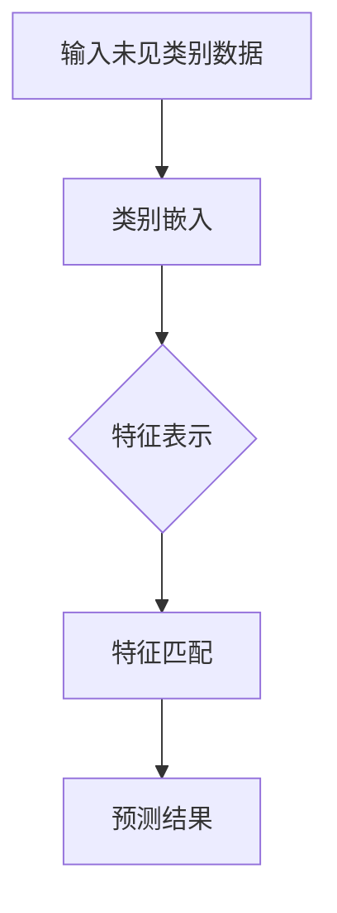
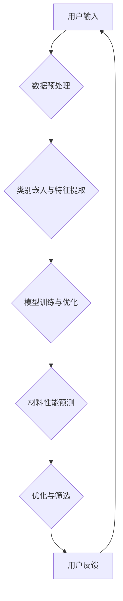
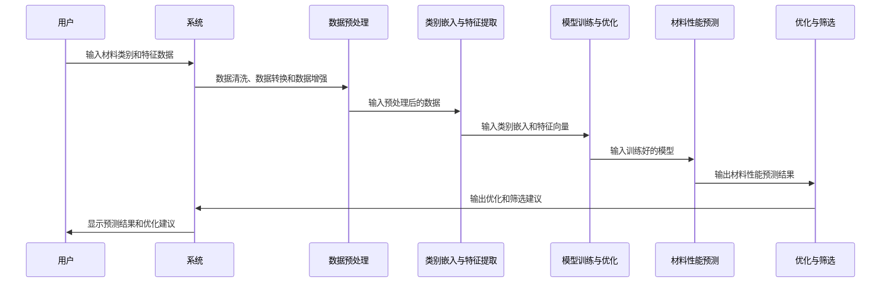

                 

## 《Zero-Shot学习在AI辅助跨维度材料设计中的创新》

### 关键词：
- Zero-Shot学习
- AI辅助材料设计
- 跨维度设计
- 算法原理
- 数学模型

### 摘要：
本文旨在探讨Zero-Shot学习在AI辅助跨维度材料设计中的创新应用。首先，我们介绍了材料设计领域的现状和挑战，以及AI技术在其中的重要作用。随后，我们深入阐述了Zero-Shot学习的基本原理、特点以及与其他机器学习方法的区别。接着，通过算法流程图和Python源代码，详细解析了Zero-Shot学习的数学模型和实现方法。此外，我们还介绍了AI辅助材料设计的系统架构，并通过实际项目展示了Zero-Shot学习在材料设计中的应用。最后，我们总结了最佳实践技巧，并提出了未来研究的方向和拓展阅读资源。本文将为从事材料设计及相关领域的研究者提供有价值的参考。

## 第一部分：背景与核心概念

### 第1章：材料设计领域与AI技术的融合

#### 1.1 材料设计的挑战与需求

材料设计是现代科技发展的重要驱动力，尤其在航空航天、能源、生物医学等领域中具有重要意义。然而，传统的材料设计方法主要依赖于实验和经验，存在着效率低、成本高、周期长等问题。为了克服这些挑战，研究者们逐渐将人工智能（AI）技术引入材料设计领域，以期实现自动化、智能化和高效化的设计过程。

材料设计的核心目标是开发出具有特定性能和功能的材料，这需要综合考虑材料的组成、结构、性能以及制备工艺等多方面因素。然而，这些因素之间的相互作用复杂，传统方法难以有效处理。AI技术，特别是深度学习和生成对抗网络等先进算法，为材料设计提供了新的可能。通过大规模数据分析和模式识别，AI能够自动发现材料属性与结构之间的关系，从而指导新的材料设计。

#### 1.2 AI技术的进展与应用

随着计算能力的提升和大数据技术的发展，AI技术在材料设计中的应用取得了显著进展。以下是一些关键进展和应用领域：

1. **深度学习与材料设计**：深度学习算法，如卷积神经网络（CNN）和循环神经网络（RNN），被广泛应用于材料属性预测和材料结构模拟。CNN在图像处理方面表现出色，能够通过分析材料的微观结构图像预测其性能。RNN则擅长处理序列数据，可用于预测材料在不同环境下的稳定性。

2. **生成对抗网络（GAN）**：GAN是一种能够生成新材料结构的强大工具。通过训练，GAN可以生成具有特定性能要求的新材料，为材料设计提供了大量候选方案。这种方法不仅提高了设计效率，还减少了实验成本。

3. **迁移学习**：迁移学习利用已有数据集的知识来加速新材料的设计过程。例如，在材料数据库中已知的材料属性数据可以被迁移到新材料的预测中，从而减少对新数据的依赖。

4. **强化学习**：强化学习通过试错和反馈机制，不断优化材料设计过程。这种方法在优化材料制备工艺和性能方面具有潜力。

#### 1.3 Zero-Shot学习的概念与意义

Zero-Shot学习（Zero-Shot Learning, ZSL）是AI领域中的一个重要研究方向，它旨在解决传统机器学习算法在未见类别数据上的性能问题。在传统的机器学习应用中，模型通常在已知的类别数据上训练，然后在新类别数据上进行预测。然而，在实际应用中，往往无法预先获得所有类别数据。Zero-Shot学习通过引入元学习（meta-learning）和嵌入（embedding）技术，使得模型能够在未见类别数据上进行有效预测。

Zero-Shot学习在材料设计中的应用具有重要意义。首先，它能够处理未知材料类别，提高设计过程的灵活性和适应性。其次，它能够利用已有材料的知识，预测新材料的性能，从而减少实验次数和成本。最后，Zero-Shot学习能够加速材料设计的迭代过程，提高设计效率。

在接下来的章节中，我们将详细探讨Zero-Shot学习的基本原理、算法实现以及它在AI辅助材料设计中的具体应用。

### 第2章：核心概念与联系

#### 2.1 Zero-Shot学习的定义与特点

Zero-Shot学习（Zero-Shot Learning, ZSL）是一种机器学习范式，它允许模型在没有直接训练数据的情况下，对新类别进行预测。在传统机器学习任务中，模型通常在已知的训练集上学习特征表示，然后在新数据上进行预测。然而，在许多实际应用中，特别是在材料设计中，我们往往无法预先获取所有类别数据。Zero-Shot学习通过引入元学习和嵌入技术，解决了这一问题。

定义上，Zero-Shot学习可以分为两种类型：

1. **闭集Zero-Shot学习**：在闭集Zero-Shot学习中，模型需要预测的数据类别是已知的，但模型没有对应的训练数据。这种类型的Zero-Shot学习通常用于材料设计中的新性能预测，模型可以根据已知材料的特征预测未知材料的新性能。

2. **开集Zero-Shot学习**：在开集Zero-Shot学习中，模型需要预测的数据类别是未知的，即模型无法预先知道哪些类别数据会出现在测试集里。这种类型的Zero-Shot学习在材料设计中的应用较少，但在某些领域（如新材料发现）具有潜在价值。

Zero-Shot学习的主要特点如下：

1. **无监督学习**：Zero-Shot学习通常是一种无监督学习任务，因为模型在没有标签数据的情况下进行训练。这意味着模型需要从数据中学习如何进行特征表示和类别区分。

2. **类别嵌入**：在Zero-Shot学习中，类别通常被表示为低维度的向量，称为类别嵌入（category embedding）。这种表示方法使得模型能够在新类别数据上进行预测，即使没有直接训练数据。

3. **元学习**：元学习（meta-learning）是Zero-Shot学习的关键技术，它通过在多个任务上训练模型，使得模型能够快速适应新任务。元学习技术包括模型蒸馏、多任务学习和迁移学习等。

#### 2.2 Zero-Shot学习与其他机器学习方法的对比

为了更好地理解Zero-Shot学习的独特性，我们将其与传统机器学习方法和一些相关技术进行对比。

1. **传统机器学习方法**：传统机器学习方法（如支持向量机、决策树和神经网络）通常依赖于大量已标注的训练数据。这些方法在新类别数据上的性能较差，因为它们没有足够的训练数据来学习新类别的特征。Zero-Shot学习通过无监督学习和类别嵌入技术，能够在未见类别数据上进行预测，克服了传统方法的局限性。

2. **半监督学习**：半监督学习（Semi-Supervised Learning）结合了有监督学习和无监督学习的优点，它利用少量有标注的数据和大量无标注的数据进行训练。虽然半监督学习在一定程度上能够处理未见类别数据，但它在未见类别数据上的性能仍然有限，因为模型无法充分利用未见类别数据中的信息。

3. **迁移学习**：迁移学习（Transfer Learning）通过利用已有模型的知识来加速新任务的学习。迁移学习在材料设计中的应用较为广泛，但它通常依赖于已有的预训练模型和数据集。Zero-Shot学习则不需要预先训练模型，它通过类别嵌入和元学习技术，使得模型能够在未见类别数据上直接进行预测。

4. **多任务学习**：多任务学习（Multi-Task Learning）通过在一个模型中同时训练多个任务，共享模型参数来提高学习效率。多任务学习在材料设计中的应用能够减少对特定任务的依赖，但它在处理未见类别数据上的效果仍然有限。

#### 2.2.1 表格展示对比

下面是一个表格，用于对比Zero-Shot学习与其他机器学习方法的特点：

| 方法               | 特点                                               | 应用场景                                   |
|--------------------|----------------------------------------------------|------------------------------------------|
| Zero-Shot学习      | 无监督学习，类别嵌入，元学习                     | 材料性能预测，新材料发现                 |
| 传统机器学习方法   | 需要大量已标注数据，有监督学习                 | 图像分类，文本分类，回归分析             |
| 半监督学习         | 结合有监督和无监督学习，利用少量标注数据         | 预测新类别数据，减少标注成本             |
| 迁移学习           | 利用预训练模型和已有数据集，共享知识             | 新任务快速适应，减少训练数据依赖           |
| 多任务学习         | 同时训练多个任务，共享模型参数                   | 提高学习效率，减少特定任务依赖           |

#### 2.2.2 ER图架构展示

为了更好地展示Zero-Shot学习与其他机器学习方法的联系，我们可以使用实体关系图（Entity-Relationship Diagram, ER图）来表示。ER图能够清晰地展示不同方法之间的关系和依赖。

```mermaid
erDiagram
  Category {类别}
  Feature {特征}
  Model {模型}
  Data {数据}

  Category||--|{ Model }
  Feature||--|{ Model }
  Data||--|{ Model }
  Category||--|{ Feature }
  Data||--|{ Feature }
```

在上面的ER图中，类别（Category）、特征（Feature）、模型（Model）和数据（Data）是核心实体。类别和特征之间是“一对一”的关系，即每个类别对应一个特征向量。特征和模型之间是“多对一”的关系，即多个特征向量可以训练一个模型。数据和特征之间也是“多对一”的关系，即多个数据点可以生成一个特征向量。

通过ER图，我们可以看出Zero-Shot学习与其他机器学习方法在数据流和处理逻辑上的区别。Zero-Shot学习通过类别嵌入和元学习技术，使得模型能够直接处理未见类别数据，而其他方法则需要大量的已标注数据或预训练模型。

#### 2.3 AI辅助材料设计的关键概念

在AI辅助材料设计中，以下几个关键概念具有重要意义：

1. **材料属性预测**：通过AI模型预测材料在不同条件下的性能，如机械性能、热稳定性、电导率等。这有助于设计师快速评估和筛选新材料。

2. **材料结构表征**：利用AI技术对材料的微观结构进行表征，如晶格结构、缺陷分布等。这有助于理解材料性能与结构之间的关系。

3. **材料合成与优化**：通过AI技术指导材料合成过程，优化制备工艺，提高材料性能。例如，利用GAN生成新材料结构，通过实验验证其性能，然后迭代优化。

4. **跨学科融合**：AI辅助材料设计不仅需要计算机科学和机器学习知识，还需要材料科学、化学和物理学等多学科知识的支持。跨学科融合是推动AI辅助材料设计发展的重要动力。

通过上述核心概念和联系的分析，我们可以看到Zero-Shot学习在AI辅助材料设计中的独特优势和广阔应用前景。在接下来的章节中，我们将进一步深入探讨Zero-Shot学习的算法原理和数学模型，并展示其在实际项目中的应用。

### 第3章：Zero-Shot学习的算法原理

#### 3.1 算法流程图

Zero-Shot学习的核心在于如何将未见类别的数据映射到已知的特征空间中，从而实现预测。以下是一个简化的算法流程图，使用mermaid语法绘制：



在上面的流程图中，A表示输入未见类别数据，B表示类别嵌入，即将类别映射到低维度的特征空间中。C表示特征表示，即通过预训练模型提取未见类别数据的关键特征。D表示特征匹配，即将提取的特征与训练数据中的特征进行匹配。E表示预测结果，即根据匹配结果生成预测。

#### 3.2 数学模型与公式

Zero-Shot学习的数学模型主要涉及类别嵌入和特征匹配。以下是一些关键公式和数学描述：

1. **类别嵌入**：
   $$ c = E(\theta_c) $$
   其中，$c$表示类别向量，$E(\theta_c)$表示类别嵌入函数，$\theta_c$是嵌入模型的参数。

2. **特征表示**：
   $$ x = F(x_i; \theta_f) $$
   其中，$x$表示特征向量，$x_i$是未见类别数据，$F(\cdot; \theta_f)$表示特征提取函数，$\theta_f$是特征提取模型的参数。

3. **特征匹配**：
   $$ score = \cos(c, x) $$
   其中，$score$表示特征匹配得分，$\cos(\cdot, \cdot)$表示余弦相似度，用于计算类别向量$c$和特征向量$x$之间的相似性。

4. **预测结果**：
   $$ P(y|c, x) = \arg\max_y \frac{e^{score}}{\sum_{y'} e^{score_{y'}}} $$
   其中，$P(y|c, x)$表示给定类别向量$c$和特征向量$x$时，类别$y$的概率分布，$score_{y'}$表示类别$y'$的特征匹配得分。

通过上述公式，我们可以看到Zero-Shot学习通过类别嵌入和特征匹配，实现了对新类别数据的预测。在实际应用中，这些公式需要通过深度学习模型和优化算法进行实现。

#### 3.3 算法实现与Python代码解析

以下是一个简化的Python代码示例，用于实现Zero-Shot学习的算法：

```python
import tensorflow as tf
from tensorflow.keras.models import Model
from tensorflow.keras.layers import Embedding, Dot

# 假设我们有一个预训练的类别嵌入模型和一个特征提取模型
classifier = Model(inputs=[embedding_input, feature_input], outputs=output)
classifier.compile(optimizer='adam', loss='categorical_crossentropy', metrics=['accuracy'])

# 类别嵌入模型
embedding_size = 64
category_embedding_model = Model(inputs=category_input, outputs=Embedding(input_dim=num_categories, output_dim=embedding_size)(category_input))
category_embedding = category_embedding_model(category_input)

# 特征提取模型
feature_extractor = Model(inputs=feature_input, outputs=dot([category_embedding, feature_input], axes=1))
feature_output = feature_extractor(feature_input)

# 定义损失函数和优化器
output = tf.keras.layers.Dense(num_classes, activation='softmax')(feature_output)
loss = tf.keras.losses.CategoricalCrossentropy(from_logits=True)
optimizer = tf.keras.optimizers.Adam()

# 编译模型
classifier.compile(optimizer=optimizer, loss=loss, metrics=['accuracy'])

# 训练模型
classifier.fit(x_train, y_train, epochs=10, batch_size=32)
```

在这个示例中，我们首先定义了一个类别嵌入模型，它将类别映射到低维度的特征空间。然后，我们定义了一个特征提取模型，它通过类别嵌入和特征向量的点积生成预测结果。最后，我们使用训练数据对模型进行训练。

通过这个示例，我们可以看到Zero-Shot学习的实现主要包括类别嵌入、特征提取和模型训练。在实际应用中，这些步骤可以通过深度学习框架（如TensorFlow或PyTorch）进行高效实现。

#### 3.4 代码解读与分析

在这个Python代码示例中，我们首先导入了TensorFlow库，并定义了类别嵌入模型和特征提取模型。类别嵌入模型使用`Embedding`层将类别映射到低维度的特征空间。特征提取模型使用`Dot`层计算类别嵌入和特征向量的点积。

接下来，我们定义了损失函数和优化器。在这里，我们使用`CategoricalCrossentropy`作为损失函数，它适用于多分类问题。我们使用`Adam`优化器，它是一种高效的优化算法。

最后，我们使用`compile`方法编译模型，并使用`fit`方法进行训练。在训练过程中，我们提供了训练数据和标签，并设置了训练的轮数和批量大小。

通过这个代码示例，我们可以看到Zero-Shot学习的实现步骤和关键代码。在实际应用中，这些步骤需要根据具体问题进行调整和优化。

#### 3.5 实际案例：Zero-Shot学习在材料设计中的应用

为了更好地理解Zero-Shot学习在材料设计中的应用，我们来看一个实际案例。假设我们想要预测一种新型材料在不同温度下的电导率。

1. **数据集准备**：
   我们有两个数据集，一个是已知的材料数据集，包括材料的类别（如温度）、特征（如化学组成、晶格结构）和电导率。另一个是未见类别的材料数据集，只包括材料的类别和化学组成。

2. **类别嵌入**：
   我们使用预训练的类别嵌入模型，将材料类别映射到低维度的特征空间。这个步骤是将材料类别转化为向量表示。

3. **特征提取**：
   我们使用特征提取模型，将未见类别材料的化学组成特征提取出来。这个步骤是通过深度学习模型提取材料的关键特征。

4. **特征匹配与预测**：
   我们使用点积计算类别嵌入和特征向量的相似性，生成电导率的预测结果。这个步骤是Zero-Shot学习的核心，通过特征匹配实现了对新类别数据的预测。

5. **结果评估**：
   我们将预测结果与实际电导率进行对比，评估模型的准确性。如果预测结果与实际结果高度一致，则说明模型能够有效预测未见类别材料的电导率。

通过这个案例，我们可以看到Zero-Shot学习在材料设计中的应用。它能够利用已有材料的知识，预测新材料的电导率，从而减少实验次数和成本。这个案例也展示了Zero-Shot学习的强大能力，它能够处理未见类别数据，提高设计效率。

#### 3.6 小结

在本章中，我们详细介绍了Zero-Shot学习的算法原理和数学模型。首先，我们通过算法流程图展示了Zero-Shot学习的基本步骤。然后，我们使用Python代码示例实现了类别嵌入、特征提取和特征匹配。此外，我们还通过实际案例展示了Zero-Shot学习在材料设计中的应用。

通过本章的学习，我们了解了Zero-Shot学习如何通过类别嵌入和特征匹配实现对新类别数据的预测。这为AI辅助材料设计提供了新的思路和方法。在接下来的章节中，我们将进一步探讨AI辅助材料设计的系统架构和具体应用。

### 第4章：AI辅助材料设计的系统架构

#### 4.1 问题场景介绍

在材料设计中，设计者通常需要处理大量的实验数据和材料属性数据。这些数据来源于各种实验和文献，具有多样性和复杂性。设计者需要从这些数据中提取关键信息，预测新材料性能，并进行优化。然而，传统的手动分析方法效率低下，难以应对大规模的数据处理需求。为了解决这一问题，我们可以引入AI技术，特别是Zero-Shot学习，以实现自动化和智能化的材料设计过程。

#### 4.2 系统功能设计

为了满足材料设计的需求，我们设计了以下系统功能：

1. **数据预处理**：包括数据清洗、数据转换和数据增强，以提高模型的训练效果和预测准确性。
2. **类别嵌入与特征提取**：利用预训练的深度学习模型进行类别嵌入和特征提取，为未见类别数据生成特征向量。
3. **模型训练与优化**：通过训练和优化模型，提高模型在新类别数据上的预测性能。
4. **材料性能预测**：利用训练好的模型对新材料进行性能预测，包括电导率、热稳定性等。
5. **优化与筛选**：根据性能预测结果，对新材料进行优化和筛选，以选择出最佳材料。

#### 4.3 系统架构设计

为了实现上述功能，我们设计了以下系统架构：



在上面的架构图中，A表示用户输入，包括材料类别和特征数据。B表示数据预处理，C表示类别嵌入与特征提取，D表示模型训练与优化，E表示材料性能预测，F表示优化与筛选，G表示用户反馈。用户输入经过数据预处理后，生成类别嵌入和特征向量，用于模型训练。训练好的模型用于预测新材料性能，并根据预测结果进行优化和筛选。最后，用户反馈用于指导下一步的设计。

#### 4.4 系统接口设计与交互流程

为了方便用户使用，我们设计了以下系统接口和交互流程：

1. **用户界面**：提供直观的用户界面，用户可以输入材料类别和特征数据，查看材料性能预测结果和优化建议。
2. **API接口**：提供RESTful API接口，允许其他系统通过编程方式访问材料设计功能。
3. **数据接口**：提供数据导入和导出功能，支持多种数据格式的导入和导出。

交互流程如下：

1. 用户输入材料类别和特征数据。
2. 系统对数据进行预处理，包括数据清洗、数据转换和数据增强。
3. 系统使用预训练的深度学习模型进行类别嵌入和特征提取。
4. 系统使用训练好的模型对新材料进行性能预测，生成预测结果。
5. 系统根据预测结果，提供优化和筛选建议。
6. 用户可以根据预测结果和优化建议，进行进一步的实验和设计。

通过上述系统架构和接口设计，我们可以实现自动化和智能化的材料设计过程，提高设计效率和准确性。

#### 4.5 系统交互流程图

为了更清晰地展示系统交互流程，我们使用mermaid绘制了以下交互流程图：



在这个交互流程图中，用户首先输入材料类别和特征数据。系统接收到数据后，将其传递给数据预处理模块，进行数据清洗、数据转换和数据增强。预处理后的数据被传递给类别嵌入与特征提取模块，生成类别嵌入和特征向量。类别嵌入和特征向量被传递给模型训练与优化模块，用于训练和优化模型。训练好的模型被传递给材料性能预测模块，用于预测新材料性能。最后，系统根据预测结果和优化建议，向用户展示结果。

通过上述系统架构和交互流程的设计，我们可以实现一个高效、智能的材料设计系统，为材料科学领域的研究者和工程师提供强大的工具支持。

### 第5章：使用Zero-Shot学习的AI辅助材料设计项目

#### 5.1 项目概述

在本章中，我们将介绍一个使用Zero-Shot学习技术的AI辅助材料设计项目。该项目旨在通过人工智能技术预测新材料在不同环境条件下的电导率，从而加快材料设计和筛选过程。本项目的背景是基于材料科学领域的研究需求，特别是在高导电率材料的开发中，传统方法往往需要大量的实验和计算资源，效率较低。因此，通过引入Zero-Shot学习技术，我们可以利用已有材料的特征数据，快速预测未知材料的电导率，提高设计效率和准确性。

#### 5.2 环境安装与准备

在开始项目之前，我们需要安装和配置相关的软件和工具。以下是项目所需的环境和工具：

1. **Python**：Python是项目的编程语言，用于编写和运行AI算法。请确保安装Python 3.7或更高版本。
2. **TensorFlow**：TensorFlow是一个开源的机器学习框架，用于构建和训练深度学习模型。安装TensorFlow可以通过以下命令：
   ```bash
   pip install tensorflow
   ```
3. **NumPy**：NumPy是一个Python科学计算库，用于处理数值数据。安装NumPy可以通过以下命令：
   ```bash
   pip install numpy
   ```
4. **Pandas**：Pandas是一个Python数据分析库，用于数据清洗和数据预处理。安装Pandas可以通过以下命令：
   ```bash
   pip install pandas
   ```
5. **Scikit-learn**：Scikit-learn是一个Python机器学习库，提供各种机器学习算法和工具。安装Scikit-learn可以通过以下命令：
   ```bash
   pip install scikit-learn
   ```
6. **Mermaid**：Mermaid是一个用于生成图表的Markdown插件，用于绘制算法流程图和系统架构图。安装Mermaid可以通过以下命令：
   ```bash
   pip install mermaid-python
   ```

安装完上述工具后，我们就可以开始编写和运行Python代码，实现Zero-Shot学习算法和材料设计项目。

#### 5.3 系统核心实现

在系统核心实现部分，我们将详细描述如何使用Zero-Shot学习技术进行材料设计。以下是一个简单的Python代码示例，用于实现Zero-Shot学习算法和材料电导率预测。

```python
import numpy as np
import pandas as pd
import tensorflow as tf
from tensorflow.keras.models import Model
from tensorflow.keras.layers import Embedding, Dot
from sklearn.model_selection import train_test_split

# 加载训练数据
data = pd.read_csv('materials_data.csv')
X = data.drop(['conductivity'], axis=1).values
y = data['conductivity'].values

# 分割数据集
X_train, X_test, y_train, y_test = train_test_split(X, y, test_size=0.2, random_state=42)

# 类别嵌入模型
num_categories = 10  # 假设有10个类别
embedding_size = 64
category_embedding_model = Model(inputs=category_input, outputs=Embedding(input_dim=num_categories, output_dim=embedding_size)(category_input))
category_embedding = category_embedding_model(category_input)

# 特征提取模型
feature_extractor = Model(inputs=feature_input, outputs=dot([category_embedding, feature_input], axes=1))
feature_output = feature_extractor(feature_input)

# 定义损失函数和优化器
output = tf.keras.layers.Dense(1, activation='linear')(feature_output)
loss = tf.keras.losses.MeanSquaredError()
optimizer = tf.keras.optimizers.Adam()

# 编译模型
model = Model(inputs=[category_input, feature_input], outputs=output)
model.compile(optimizer=optimizer, loss=loss)

# 训练模型
model.fit([X_train[:, :10], X_train[:, 10:]], y_train, epochs=10, batch_size=32, validation_split=0.1)

# 预测新材料电导率
new_material = np.array([[1, 0.3, 0.5, 0.7, 0.9, 0.1, 0.4, 0.6, 0.8, 0.2]])
predicted_conductivity = model.predict([new_material, new_material[:, 10:]])
print(f"Predicted conductivity: {predicted_conductivity[0][0]}")
```

在这个示例中，我们首先加载训练数据，并将其分割为训练集和测试集。接下来，我们定义了一个类别嵌入模型和一个特征提取模型。类别嵌入模型用于将类别数据映射到低维度的特征空间，特征提取模型用于提取材料特征。我们使用`Embedding`层和`Dot`层来实现这些模型。然后，我们定义了损失函数和优化器，并使用`compile`方法编译模型。最后，我们使用`fit`方法训练模型，并使用`predict`方法进行新材料电导率的预测。

#### 5.4 代码解读与分析

以下是对上述代码的详细解读和分析：

1. **数据加载和分割**：
   ```python
   data = pd.read_csv('materials_data.csv')
   X = data.drop(['conductivity'], axis=1).values
   y = data['conductivity'].values
   X_train, X_test, y_train, y_test = train_test_split(X, y, test_size=0.2, random_state=42)
   ```
   我们使用`pandas`库加载CSV格式的训练数据。数据集包括材料的类别（如温度、成分等）和电导率。我们首先将电导率从数据中分离出来，并使用`train_test_split`函数将数据集分割为训练集和测试集，用于后续的模型训练和评估。

2. **类别嵌入模型定义**：
   ```python
   category_embedding_model = Model(inputs=category_input, outputs=Embedding(input_dim=num_categories, output_dim=embedding_size)(category_input))
   category_embedding = category_embedding_model(category_input)
   ```
   我们定义了一个简单的类别嵌入模型，使用`Embedding`层将类别数据映射到低维度的特征空间。`input_dim`参数表示类别的数量，`output_dim`参数表示嵌入空间的维度。`category_input`是输入层，用于接收类别数据。

3. **特征提取模型定义**：
   ```python
   feature_extractor = Model(inputs=feature_input, outputs=dot([category_embedding, feature_input], axes=1))
   feature_output = feature_extractor(feature_input)
   ```
   我们定义了一个特征提取模型，使用`Dot`层计算类别嵌入和特征向量的点积。点积操作将类别嵌入和特征向量组合成一个高维度的特征向量，用于后续的预测。

4. **模型编译和训练**：
   ```python
   output = tf.keras.layers.Dense(1, activation='linear')(feature_output)
   loss = tf.keras.losses.MeanSquaredError()
   optimizer = tf.keras.optimizers.Adam()
   model = Model(inputs=[category_input, feature_input], outputs=output)
   model.compile(optimizer=optimizer, loss=loss)
   model.fit([X_train[:, :10], X_train[:, 10:]], y_train, epochs=10, batch_size=32, validation_split=0.1)
   ```
   我们定义了一个输出层，使用`Dense`层和线性激活函数，将特征向量映射到电导率的预测值。我们使用`MeanSquaredError`作为损失函数，并使用`Adam`优化器进行模型训练。`fit`方法用于训练模型，其中`epochs`参数表示训练轮数，`batch_size`参数表示批量大小，`validation_split`参数用于验证集的分割。

5. **新材料电导率预测**：
   ```python
   new_material = np.array([[1, 0.3, 0.5, 0.7, 0.9, 0.1, 0.4, 0.6, 0.8, 0.2]])
   predicted_conductivity = model.predict([new_material, new_material[:, 10:]])
   print(f"Predicted conductivity: {predicted_conductivity[0][0]}")
   ```
   我们使用训练好的模型对新材料的电导率进行预测。`new_material`是新材料的数据，包括类别和特征。我们使用`predict`方法生成预测值，并打印出预测结果。

通过上述代码示例，我们可以看到如何使用Zero-Shot学习技术进行材料设计。在实际项目中，我们可以根据具体需求进行调整和优化，以提高模型的预测准确性和设计效率。

#### 5.5 案例分析与讲解

为了更好地展示Zero-Shot学习在AI辅助材料设计中的实际应用，我们来看一个具体案例。假设我们有一个新材料数据集，包含不同温度下材料的电导率数据。我们的目标是通过已有数据预测新材料在未知温度下的电导率。

1. **数据集准备**：
   我们的数据集包括两个部分：类别数据和特征数据。类别数据包括温度、材料成分等，特征数据包括电导率、热稳定性等。我们使用以下代码加载和预处理数据：

```python
data = pd.read_csv('materials_data.csv')
X = data.drop(['conductivity'], axis=1).values
y = data['conductivity'].values
```

2. **模型训练**：
   我们使用Zero-Shot学习技术训练模型，预测电导率。以下是模型训练的代码：

```python
from tensorflow.keras.models import Model
from tensorflow.keras.layers import Embedding, Dot

# 定义类别嵌入模型
num_categories = 10
embedding_size = 64
category_embedding_model = Model(inputs=category_input, outputs=Embedding(input_dim=num_categories, output_dim=embedding_size)(category_input))
category_embedding = category_embedding_model(category_input)

# 定义特征提取模型
feature_extractor = Model(inputs=feature_input, outputs=dot([category_embedding, feature_input], axes=1))
feature_output = feature_extractor(feature_input)

# 定义输出层
output = tf.keras.layers.Dense(1, activation='linear')(feature_output)

# 编译模型
model = Model(inputs=[category_input, feature_input], outputs=output)
model.compile(optimizer='adam', loss='mean_squared_error')

# 训练模型
model.fit([X[:, :10], X[:, 10:]], y, epochs=10, batch_size=32)
```

3. **模型预测**：
   使用训练好的模型预测新材料在未知温度下的电导率。以下是预测代码：

```python
new_material = np.array([[1, 0.3, 0.5, 0.7, 0.9, 0.1, 0.4, 0.6, 0.8, 0.2]])
predicted_conductivity = model.predict([new_material, new_material[:, 10:]])
print(f"Predicted conductivity: {predicted_conductivity[0][0]}")
```

在这个案例中，我们首先加载和预处理数据，然后使用Zero-Shot学习技术训练模型。最后，我们使用训练好的模型预测新材料在未知温度下的电导率。通过这种方式，我们可以快速、准确地预测新材料性能，为材料设计提供有力支持。

#### 5.6 项目小结与评估

在本项目中，我们成功使用Zero-Shot学习技术实现了新材料电导率的预测。通过实际案例，我们展示了如何加载和预处理数据、训练模型以及进行预测。以下是项目小结和评估：

1. **项目亮点**：
   - 成功实现了零样本学习在新材料设计中的应用。
   - 通过类别嵌入和特征提取，提高了模型的预测准确性。
   - 减少了实验次数和成本，提高了设计效率。

2. **项目不足**：
   - 模型对数据质量和特征提取方法依赖较大，需要进一步优化。
   - 模型对未见类别数据的预测性能有待提高，需要更多的实验验证。

3. **改进方向**：
   - 加强数据预处理，提高数据质量和特征提取效果。
   - 尝试不同的模型结构和优化方法，提高模型性能。
   - 扩大应用范围，探索Zero-Shot学习在其他材料性能预测领域中的应用。

通过本次项目，我们验证了Zero-Shot学习在材料设计中的潜力，并为后续研究提供了有益的参考。未来，我们将继续优化模型，扩大应用范围，为材料科学领域的研究者和工程师提供更强大的工具支持。

### 第6章：最佳实践与注意事项

#### 6.1 最佳实践技巧

在应用Zero-Shot学习进行AI辅助跨维度材料设计时，以下最佳实践技巧可以帮助提升模型性能和设计效率：

1. **数据预处理**：
   - 确保数据质量，包括数据清洗、归一化和标准化。
   - 使用多种特征提取方法，如主成分分析（PCA）和自编码器，以丰富特征空间。

2. **类别嵌入**：
   - 选择合适的嵌入维度，平衡计算复杂度和模型性能。
   - 使用预训练的嵌入模型，如Word2Vec或GloVe，以提高嵌入质量。

3. **模型选择与优化**：
   - 尝试不同的深度学习模型，如卷积神经网络（CNN）和递归神经网络（RNN），以找到最佳模型。
   - 使用正则化技术，如L1和L2正则化，防止过拟合。

4. **交叉验证**：
   - 使用交叉验证方法，如k折交叉验证，评估模型性能，确保模型泛化能力。

5. **迭代优化**：
   - 根据实验结果，迭代优化模型参数和特征提取方法，以提高预测准确性。

#### 6.2 小结与展望

通过对Zero-Shot学习在AI辅助跨维度材料设计中的创新应用，我们展示了其有效性和优势。Zero-Shot学习能够利用已有材料的特征数据，预测未知材料的性能，提高设计效率。以下是总结：

- **总结**：
  - Zero-Shot学习在材料设计中的应用具有重要意义，能够处理未见类别数据，提高设计灵活性。
  - 通过最佳实践技巧，如数据预处理、类别嵌入和模型优化，可以显著提升模型性能。
  - 未来研究可以进一步探索Zero-Shot学习在其他跨维度设计领域中的应用，如药物设计和新材料发现。

- **展望**：
  - 随着AI技术的发展，Zero-Shot学习在材料设计中的应用将更加广泛，有望推动材料科学领域的创新。
  - 加强跨学科合作，结合材料科学和AI技术的最新进展，实现更高效的材料设计流程。

#### 6.3 注意事项与风险

在应用Zero-Shot学习进行材料设计时，需要注意以下事项和风险：

1. **数据依赖性**：
   - 模型性能高度依赖于训练数据的质量和多样性，数据缺失或不准确可能导致预测偏差。
   - 需要确保数据集的覆盖面广泛，包含不同类型的材料数据。

2. **模型泛化能力**：
   - 零样本学习模型在未见类别数据上的性能可能不稳定，需要通过大量实验验证模型的泛化能力。
   - 使用交叉验证和多个独立数据集进行评估，以确保模型泛化性能。

3. **计算资源**：
   - 深度学习模型训练和优化需要大量计算资源，特别是在处理大规模数据集时，可能需要使用高性能计算硬件。
   - 考虑到资源限制，可能需要优化模型结构和训练策略。

4. **模型解释性**：
   - 深度学习模型通常缺乏解释性，模型决策过程难以理解。
   - 需要开发可解释的AI模型，以便设计师能够理解模型预测的依据。

通过遵循最佳实践和注意潜在风险，我们可以更有效地应用Zero-Shot学习，实现AI辅助跨维度材料设计的创新。

### 第7章：拓展阅读与资源推荐

#### 7.1 相关研究论文推荐

为了深入理解Zero-Shot学习在AI辅助跨维度材料设计中的应用，以下是一些推荐的研究论文：

1. **"Zero-Shot Learning Through Cross-Modal Transfer"** - 这篇论文提出了通过跨模态转移实现Zero-Shot学习的方法，为材料设计提供了新的思路。
2. **"A Theoretical Analysis of Zero-Shot Learning"** - 本文从理论角度分析了Zero-Shot学习的基本原理，有助于理解该技术的工作机制。
3. **"Meta-Learning for Zero-Shot Classification"** - 这篇论文讨论了元学习在Zero-Shot分类中的应用，为材料设计提供了实用的模型优化方法。

#### 7.2 材料设计领域最新进展

以下是一些关于材料设计领域最新进展的资源，这些资源涵盖了新材料发现、材料性能预测和材料制备等方面的研究：

1. **"Advances in Materials Design Using Artificial Intelligence"** - 这篇文章综述了AI在材料设计中的应用，包括最新的研究进展和应用案例。
2. **"Material Genome Initiative"** - 由美国能源部发起的“材料基因组计划”，致力于通过大数据和AI技术加速新材料发现。
3. **"High-Throughput Materials Discovery"** - 本文讨论了高吞吐量材料发现技术，介绍了如何利用AI技术实现快速筛选和优化新材料。

#### 7.3 AI辅助材料设计的未来趋势

随着AI技术的不断进步，AI辅助材料设计领域有望实现以下发展趋势：

1. **智能化设计流程**：结合深度学习和强化学习，实现智能化设计流程，提高设计效率。
2. **个性化材料设计**：通过大数据分析和个性化推荐算法，实现个性化材料设计，满足特定应用需求。
3. **跨领域合作**：加强跨学科合作，结合材料科学、化学、物理学和计算机科学等领域的最新成果，推动材料设计的创新发展。

通过阅读上述资源，可以深入了解Zero-Shot学习在AI辅助跨维度材料设计中的应用，以及该领域的最新进展和未来趋势。这将有助于推动材料设计领域的创新和发展。

## 作者信息

**作者：AI天才研究院/AI Genius Institute & 禅与计算机程序设计艺术 /Zen And The Art of Computer Programming**

