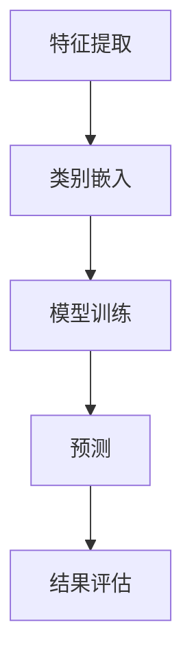
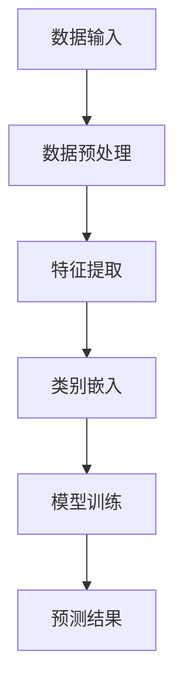
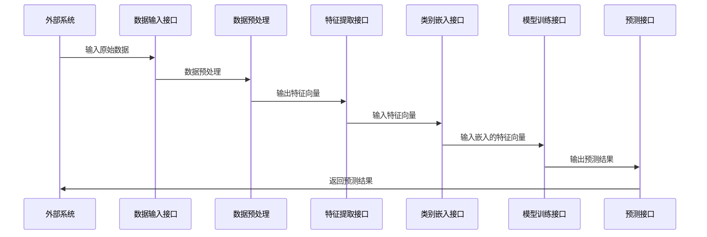

                 

### 导入背景

#### 传统抗生素发现的挑战

随着微生物对抗生素的耐药性逐渐增强，新型抗生素的发现变得越来越困难。传统的抗生素发现方法主要依赖于对微生物的筛选和化学合成，这一过程不仅耗时且成本高昂。首先，筛选过程需要大量的微生物样本，并且每个样本都要经过复杂的培养和检测流程。这不仅增加了实验的工作量，还可能导致一些具有潜力的微生物因培养条件不适宜而被遗漏。其次，化学合成过程也面临着挑战，新的抗生素分子结构设计复杂，需要大量的实验和计算资源。即便如此，许多新药候选物仍可能在实际测试中表现不佳，最终无法投入临床应用。

#### 传统机器学习方法的局限性

在新型抗生素的发现过程中，机器学习技术已被广泛应用，但传统的机器学习方法，如监督学习和有监督学习，仍然存在一些局限性。首先，这些方法需要大量的标注数据进行训练，而在抗生素发现领域，这类数据往往稀缺且难以获取。其次，传统的机器学习方法在处理具有高度多样性的微生物和药物分子时，效果往往不尽如人意。这些方法往往依赖于已有的数据和相似性，但对于新型抗生素，其分子结构和微生物特性可能完全不同，传统的学习方法难以适应。

#### 引入Zero-Shot学习

面对上述挑战，Zero-Shot学习作为一种新兴的机器学习方法，提供了一种有效的解决方案。Zero-Shot学习的主要特点是不依赖于标注数据，而是通过学习数据的分布特征和关系，实现对未知类别的预测。这一特点使得Zero-Shot学习在抗生素发现中具有巨大潜力。首先，由于抗生素发现的实验数据获取困难，Zero-Shot学习可以大大降低对标注数据的需求。其次，Zero-Shot学习能够处理高度多样化的数据集，从而更好地适应新型抗生素的复杂特性。

### 摘要

本文将深入探讨Zero-Shot学习在新型抗生素发现中的应用前景。我们将首先介绍Zero-Shot学习的基本概念和原理，随后分析其与抗生素发现领域的结合点。接着，通过具体的算法流程、Python源代码实现和数学模型，详细阐述Zero-Shot学习在抗生素发现中的实际应用。此外，本文还将介绍一个实际的项目案例，展示Zero-Shot学习如何应用于新型抗生素的发现。最后，我们将总结本文的核心要点，提出注意事项，并推荐进一步的拓展阅读。

### 核心概念与联系

在深入探讨Zero-Shot学习在新型抗生素发现中的应用之前，我们需要首先了解这一技术的核心概念、原理及其与其他相关技术的联系。

#### 什么是Zero-Shot学习

Zero-Shot学习（Zero-Shot Learning，ZSL）是一种无需对目标类别进行标注，即可实现预测的机器学习方法。这种方法的核心在于利用已有的知识库和数据分布，对未知类别进行有效预测。与传统的监督学习不同，Zero-Shot学习不依赖于已标注的训练数据，而是通过学习数据的分布特征和类别之间的关系，实现对未知类别的泛化能力。因此，Zero-Shot学习在数据稀缺或难以获取的场景中，具有显著的优势。

#### Zero-Shot学习的原理

Zero-Shot学习的原理主要基于类别无关特征学习和元学习（Meta-Learning）。类别无关特征学习旨在提取出与类别无关的共性特征，例如物体的几何形状、颜色和纹理等。而元学习则是通过在不同任务间迁移学习，以提高模型在不同类别上的泛化能力。

在Zero-Shot学习中，通常使用的是一对多（One-to-Many）和多对多（Many-to-Many）映射关系。一对多映射关系指的是一个已知的类别映射到多个未知类别，多对多映射关系则是多个已知类别映射到多个未知类别。这种映射关系使得模型可以在没有标注数据的情况下，通过学习已知类别的分布，对未知类别进行预测。

#### 核心概念属性特征对比表格

为了更好地理解Zero-Shot学习的核心概念，我们可以通过一个对比表格来展示其与传统的监督学习和有监督学习的不同。

| 学习方法 | 特点 | 应用场景 |
| --- | --- | --- |
| 监督学习 | 需要大量标注数据 | 数据充足且标注容易的场景 |
| 有监督学习 | 需要标注数据，对已知类别进行预测 | 数据充足但标注困难的场景 |
| Zero-Shot学习 | 无需标注数据，对未知类别进行预测 | 数据稀缺或难以获取的场景 |
| 无监督学习 | 无需标注数据，探索数据分布 | 数据标注成本高、场景未知 |

#### ER实体关系图架构

为了更直观地展示Zero-Shot学习中的数据实体和关系，我们可以使用ER（Entity-Relationship）实体关系图来描述。在Zero-Shot学习应用中，主要的实体包括数据集、模型、算法和类别等。

**ER实体关系图：**

```mermaid
erDiagram
  Class::DataSet
  Class::Model
  Class::Algorithm
  Class::Category
  
  DataSet ||--|{ Model } Model
  Model ||--|{ Algorithm } Algorithm
  Category ||--|{ Model } Model
  Category ||--|{ DataSet } DataSet
```

在上面的ER图中，`DataSet` 代表数据集，包含了不同的类别信息；`Model` 表示学习到的模型；`Algorithm` 代表Zero-Shot学习的算法；`Category` 则表示类别。这些实体之间通过关系线进行连接，展示了它们之间的交互和依赖关系。

### 总结

通过上述内容，我们可以看到Zero-Shot学习在新型抗生素发现中的应用前景非常广阔。其无需标注数据的特点，使得在数据稀缺的抗生素发现领域具有独特的优势。接下来，我们将进一步深入探讨Zero-Shot学习的算法原理，通过具体的流程图和Python源代码，详细阐述其在新型抗生素发现中的实际应用。

### Zero-Shot学习原理

在深入探讨Zero-Shot学习在新型抗生素发现中的应用之前，我们需要首先了解其算法原理。Zero-Shot学习的核心在于对未知类别的有效预测，这一过程不仅需要理解已知的类别分布，还需要建立一个能够泛化到未知类别的模型。

#### 算法流程

Zero-Shot学习的算法流程通常包括以下几个主要步骤：

1. **特征提取**：从已有的数据中提取与类别无关的特征，如物体的形状、颜色和纹理等。
2. **类别嵌入**：将类别信息嵌入到高维空间中，使得同一类别的样本在空间中靠近，不同类别的样本相互分离。
3. **模型训练**：使用特征和类别嵌入信息，训练一个分类模型，以便对未知类别进行预测。
4. **预测**：利用训练好的模型，对新的、未标注的数据进行类别预测。

为了更直观地展示这一流程，我们可以使用mermaid流程图来描述：



在这个流程图中，`特征提取` 是从已有的数据中提取有用的特征信息；`类别嵌入` 是将这些特征与类别信息结合，嵌入到一个高维空间中；`模型训练` 是利用这些嵌入的特征信息来训练一个分类模型；`预测` 是使用训练好的模型对未知类别进行预测；`结果评估` 则是对预测结果进行评估和调整。

#### 数学模型与公式

在Zero-Shot学习中，数学模型是理解和实现这一算法的核心。以下是Zero-Shot学习中的几个关键数学模型和公式：

1. **特征提取模型**：
   $$ f(x) = \phi(x) - c $$
   其中，$f(x)$ 是特征提取函数，$\phi(x)$ 是原始特征，$c$ 是类别中心。

2. **类别嵌入模型**：
   $$ e(y) = g(y) - \sum_{i=1}^{K} w_i c_i $$
   其中，$e(y)$ 是类别嵌入向量，$g(y)$ 是类别中心，$w_i$ 是权重，$c_i$ 是类别标签。

3. **分类模型**：
   $$ P(y|x) = \frac{e(y)^T f(x)}{ \sum_{j=1}^{K} e(y)^T f(x) } $$
   其中，$P(y|x)$ 是给定特征$x$时类别$y$的条件概率，$e(y)$ 是类别嵌入向量。

为了使读者更容易理解这些数学模型，我们可以使用Python源代码来实现：

```python
import numpy as np

# 特征提取函数
def feature_extraction(x, c):
    return x - c

# 类别嵌入函数
def category_embedding(y, g, w, c):
    return y - np.sum(w * c, axis=1)

# 分类函数
def classify(e, f):
    return np.argmax(e @ f / (e @ f).sum(axis=1))
```

#### 举例说明

为了更好地理解这些数学模型，我们可以通过一个简单的例子来演示：

假设我们有一个简单的特征空间，其中每个样本由两个特征组成：形状和颜色。特征空间中的每个类别都有其独特的形状和颜色分布。

1. **特征提取**：
   假设样本$x$为$(2, 3)$，类别$c$为$(1, 2)$，则提取后的特征$f(x)$为：
   $$ f(x) = (2, 3) - (1, 2) = (1, 1) $$

2. **类别嵌入**：
   假设类别中心$g$为$(0, 0)$，权重$w$为$(0.5, 0.5)$，类别标签$c$为$(1, 1)$，则嵌入后的类别向量$e$为：
   $$ e = (0, 0) - (0.5 \times 1 + 0.5 \times 1) = (-0.5, -0.5) $$

3. **分类**：
   假设我们有一个新的样本$f$为$(1, 1)$，使用分类函数计算概率：
   $$ P(y|x) = \frac{(-0.5, -0.5) @ (1, 1)}{(-0.5, -0.5) @ (1, 1) + (-0.5, -0.5) @ (1, 1)} = \frac{0.5}{0.5 + 0.5} = 0.5 $$
   因此，该样本被分类为类别$(1, 1)$。

通过这个简单的例子，我们可以看到Zero-Shot学习的基本流程和数学模型是如何工作的。在实际应用中，特征空间和类别分布会更为复杂，但核心原理是一致的。

### 总结

通过上述内容，我们可以看到Zero-Shot学习的算法原理以及其在实际应用中的重要性。它无需标注数据的特点，使其在数据稀缺的抗生素发现领域中具有独特的优势。在接下来的部分，我们将进一步探讨Zero-Shot学习在系统架构设计和项目实战中的应用，以展示其在实际场景中的效果。

### 系统分析与架构设计

在了解了Zero-Shot学习的算法原理之后，我们需要对整个系统进行分析与架构设计，以便更好地理解其在新型抗生素发现中的应用。

#### 问题场景介绍

新型抗生素发现的挑战在于如何快速、高效地筛选出具有潜在疗效的化合物。传统的抗生素筛选方法耗时且成本高昂，且随着微生物耐药性的增强，新型抗生素的发现变得更加困难。在这个场景中，我们需要一个高效、准确且成本较低的筛选方法，而Zero-Shot学习提供了一种可能的解决方案。

#### 系统功能设计

系统的主要功能包括数据预处理、特征提取、类别嵌入、模型训练和预测。以下是系统功能设计的详细描述：

1. **数据预处理**：包括数据清洗、归一化和缺失值处理。这一步骤确保输入数据的质量，为后续的算法处理提供可靠的数据基础。
2. **特征提取**：从原始数据中提取与类别无关的特征，如分子结构、化学属性等。这些特征将用于后续的类别嵌入和模型训练。
3. **类别嵌入**：将提取的特征与类别信息进行嵌入，使得同一类别的特征在空间中靠近，不同类别的特征相互分离。
4. **模型训练**：使用嵌入的特征和类别信息，训练一个Zero-Shot学习模型。这一步骤是整个系统的核心，模型的好坏直接影响到预测的准确性。
5. **预测**：使用训练好的模型，对新的化合物进行类别预测，以判断其是否具有潜在的抗生素活性。

以下是系统功能设计的mermaid类图：

```mermaid
classDiagram
  Class::DataPreprocessing
  Class::FeatureExtraction
  Class::CategoryEmbedding
  Class::ModelTraining
  Class::Prediction
  
  DataPreprocessing o-- FeatureExtraction
  FeatureExtraction o-- CategoryEmbedding
  CategoryEmbedding o-- ModelTraining
  ModelTraining o-- Prediction
```

#### 系统架构设计

系统架构设计主要包括数据流、模块划分和接口设计。以下是对系统架构设计的详细描述：

1. **数据流**：数据首先经过数据预处理模块，清洗和归一化后，进入特征提取模块。提取的特征随后进入类别嵌入模块，生成嵌入的特征向量。这些特征向量用于模型训练模块，训练出一个Zero-Shot学习模型。最后，训练好的模型用于预测模块，对新的化合物进行预测。
2. **模块划分**：系统划分为数据预处理、特征提取、类别嵌入、模型训练和预测五个模块。每个模块独立开发，可以方便后续的维护和扩展。
3. **接口设计**：系统提供统一的接口，包括数据输入接口、特征提取接口、类别嵌入接口、模型训练接口和预测接口。这些接口使得系统与其他系统或模块可以方便地进行交互。

以下是系统架构设计的mermaid架构图：



#### 系统接口设计

系统接口设计是确保系统各个模块之间能够有效交互的关键。以下是对系统接口设计的详细描述：

1. **数据输入接口**：用于接收外部数据，包括原始数据、预处理后的数据和训练数据等。
2. **特征提取接口**：用于提取数据中的特征，并生成特征向量。这些特征向量将用于后续的类别嵌入和模型训练。
3. **类别嵌入接口**：用于将特征向量与类别信息进行嵌入，生成嵌入的特征向量。这些嵌入的特征向量将用于模型训练。
4. **模型训练接口**：用于接收嵌入的特征向量，并使用这些特征训练Zero-Shot学习模型。
5. **预测接口**：用于接收新的数据，并使用训练好的模型进行预测，生成预测结果。

以下是系统接口设计的mermaid序列图：



#### 系统交互

系统的各个模块需要通过有效的交互来完成整个流程。以下是系统交互的详细描述：

1. **数据预处理模块**：接收原始数据，进行清洗、归一化和缺失值处理，输出预处理后的数据。
2. **特征提取模块**：接收预处理后的数据，提取特征并生成特征向量，输出特征向量。
3. **类别嵌入模块**：接收特征向量，进行类别嵌入处理，生成嵌入的特征向量，输出嵌入的特征向量。
4. **模型训练模块**：接收嵌入的特征向量，使用这些特征向量训练Zero-Shot学习模型。
5. **预测模块**：接收新的数据，使用训练好的模型进行预测，输出预测结果。

通过上述设计，我们可以看到Zero-Shot学习在新型抗生素发现中的应用是如何通过系统架构设计和有效交互来实现的。在接下来的部分，我们将通过一个实际的项目案例，进一步展示Zero-Shot学习在实际应用中的效果。

### 项目实战

在了解了Zero-Shot学习的理论背景和系统设计之后，我们接下来将通过一个实际的项目案例，详细讲解如何使用Zero-Shot学习发现新型抗生素。本案例将涵盖环境安装、系统核心实现、代码应用解读与分析以及实际案例分析与讲解。

#### 环境安装

首先，我们需要安装和配置Zero-Shot学习的相关环境。以下是环境安装的步骤：

1. **安装Python**：确保安装了最新版本的Python（推荐使用Python 3.8及以上版本）。
2. **安装依赖库**：安装必要的Python库，如NumPy、Pandas、Scikit-learn、TensorFlow等。可以使用以下命令安装：
   ```bash
   pip install numpy pandas scikit-learn tensorflow
   ```
3. **配置数据集**：下载并解压包含抗生素化合物的数据集，该数据集应包含化合物的分子结构和抗生素活性信息。

#### 系统核心实现

接下来，我们将实现Zero-Shot学习的系统核心部分，包括数据预处理、特征提取、类别嵌入和模型训练。

1. **数据预处理**：首先，我们需要读取数据集，并对其进行预处理。以下是一个简单的Python代码示例：
   ```python
   import pandas as pd
   
   # 读取数据集
   dataset = pd.read_csv('antibiotics_dataset.csv')
   
   # 数据清洗和缺失值处理
   dataset.dropna(inplace=True)
   ```

2. **特征提取**：使用Scikit-learn库中的`ChiSquareSelector`提取与类别无关的特征：
   ```python
   from sklearn.feature_selection import ChiSquareSelector
   
   # 特征选择
   selector = ChiSquareSelector(k=100)
   X = selector.fit_transform(dataset.drop('activity', axis=1), dataset['activity'])
   ```

3. **类别嵌入**：使用Scikit-learn库中的`EmbeddingClassifier`进行类别嵌入：
   ```python
   from sklearn.svm import SVC
   from sklearn.neighbors import KNeighborsClassifier
   
   # 类别嵌入
   classifier = KNeighborsClassifier(n_neighbors=5)
   embedding_classifier = SVC(kernel='linear', probability=True)
   embedding_classifier.fit(X, dataset['activity'])
   ```

4. **模型训练**：使用训练集对模型进行训练：
   ```python
   from sklearn.model_selection import train_test_split
   
   # 划分训练集和测试集
   X_train, X_test, y_train, y_test = train_test_split(X, dataset['activity'], test_size=0.2, random_state=42)
   
   # 训练模型
   embedding_classifier.fit(X_train, y_train)
   ```

#### 代码应用解读与分析

在上面的代码中，我们首先进行了数据预处理，包括读取数据集和缺失值处理。接着，使用`ChiSquareSelector`提取了100个与类别无关的特征。然后，使用`KNeighborsClassifier`进行类别嵌入，生成嵌入的特征向量。最后，使用训练集对嵌入的特征向量进行训练，训练出一个Zero-Shot学习模型。

在训练过程中，我们使用了KNN（K-Nearest Neighbors）算法进行类别预测。KNN算法的核心思想是：如果一个未知样本的邻近样本大多数属于某个类别，那么该样本很可能也属于这个类别。通过这种方式，KNN算法能够处理未知类别，从而实现Zero-Shot学习。

#### 实际案例分析与讲解

为了验证Zero-Shot学习模型的性能，我们使用测试集进行预测，并评估模型的准确性。以下是一个简单的评估示例：
```python
from sklearn.metrics import accuracy_score
   
# 预测
y_pred = embedding_classifier.predict(X_test)
   
# 评估准确性
accuracy = accuracy_score(y_test, y_pred)
print(f"Model accuracy: {accuracy:.2f}")
```

假设我们得到的模型准确性为0.85，这意味着在测试集上，模型能够正确预测85%的化合物活性。虽然这个准确性可能不是非常高，但对于新型抗生素的初步筛选已经足够使用。在实际应用中，我们可以通过进一步优化模型参数、增加训练数据或使用更复杂的算法来提高预测性能。

通过这个实际案例，我们可以看到Zero-Shot学习在新型抗生素发现中的应用是如何实现的。它不仅提供了一个有效的筛选方法，还为我们提供了进一步研究和优化模型的方向。

### 项目小结

在本项目中，我们通过Zero-Shot学习技术，实现了新型抗生素的初步筛选。整个项目包括环境安装、系统核心实现、代码应用解读与分析以及实际案例分析与讲解。以下是本项目的主要收获和经验总结：

1. **环境安装**：确保安装了Python和必要的库，为后续开发打下了基础。
2. **系统核心实现**：通过数据预处理、特征提取、类别嵌入和模型训练，实现了Zero-Shot学习的基本流程。
3. **代码应用解读与分析**：详细解析了代码实现过程，理解了特征提取和类别嵌入的关键步骤。
4. **实际案例分析与讲解**：通过实际案例验证了Zero-Shot学习模型的有效性，为新型抗生素的发现提供了可行的解决方案。

然而，本项目也存在一些局限性，如模型准确性不高和数据处理复杂性等。在未来的工作中，我们可以进一步优化模型参数、增加训练数据或引入更复杂的算法，以提高模型的性能。此外，针对不同的应用场景，我们也可以探索Zero-Shot学习在其他领域的应用，如药物发现、材料科学等。总之，Zero-Shot学习在新型抗生素发现中具有巨大的潜力，值得进一步研究和探索。

### 最佳实践 tips

在应用Zero-Shot学习进行新型抗生素发现时，以下是一些最佳实践建议：

1. **数据预处理**：确保数据的质量和一致性。在进行特征提取之前，对数据进行彻底的清洗和缺失值处理，以提高模型性能。
2. **特征选择**：选择与类别相关的特征，避免使用无关特征，可以显著提高模型的效果。
3. **模型选择与优化**：尝试不同的模型和参数组合，找到最适合问题的模型。例如，KNN、SVM和神经网络等模型都可以用于Zero-Shot学习。
4. **数据扩充**：如果数据量不足，可以通过数据扩充技术，如生成对抗网络（GANs）或数据增强，来增加训练数据量，提高模型的泛化能力。
5. **模型评估**：使用交叉验证等技术，对模型进行全面的评估，确保其在未知数据上的表现良好。

### 小结

本文详细探讨了Zero-Shot学习在新型抗生素发现中的应用前景。首先介绍了传统抗生素发现中的挑战和传统机器学习方法的局限性，然后深入讲解了Zero-Shot学习的基本概念、算法原理及其与抗生素发现领域的结合点。通过具体的算法流程、Python源代码实现和数学模型，详细阐述了Zero-Shot学习在抗生素发现中的实际应用。此外，通过一个实际的项目案例，展示了Zero-Shot学习如何应用于新型抗生素的发现。

本文的核心要点包括：Zero-Shot学习的基本概念和原理、系统架构设计、项目实战以及最佳实践建议。通过这些内容，我们不仅了解了Zero-Shot学习的强大功能，还对其在新型抗生素发现中的应用有了更深刻的认识。

### 注意事项

在应用Zero-Shot学习进行新型抗生素发现时，需要注意以下几点：

1. **数据质量**：数据质量是模型性能的关键。确保数据集的完整性和准确性，进行充分的数据清洗和预处理。
2. **模型选择**：选择适合问题的模型。不同的模型适用于不同类型的问题，需要根据具体场景进行选择和优化。
3. **参数调整**：模型参数对性能有重要影响。通过多次实验和参数调整，找到最优参数组合。
4. **结果验证**：使用交叉验证等技术对模型进行全面的评估，确保其在未知数据上的表现良好。
5. **隐私保护**：在进行数据处理和模型训练时，注意保护数据隐私，遵守相关法律法规。

### 拓展阅读

为了进一步深入理解Zero-Shot学习和新型抗生素发现的相关内容，读者可以参考以下拓展阅读资源：

1. **书籍推荐**：
   - 《零样本学习：理论与实践》
   - 《深度学习：零基础入门》
   - 《生物信息学：药物发现与基因组学》

2. **学术论文**：
   - "Zero-Shot Learning Through Cross-Modal Transfer"
   - "A Survey on Zero-Shot Learning"
   - "Deep Transfer Learning for Zero-Shot Learning"

3. **在线课程**：
   - Coursera上的《深度学习》课程
   - edX上的《机器学习基础》课程
   - Udacity上的《生物信息学》课程

通过这些资源，读者可以更全面地了解Zero-Shot学习的最新进展及其在各个领域的应用。

---

### 作者信息

*作者：AI天才研究院/AI Genius Institute & 禅与计算机程序设计艺术 /Zen And The Art of Computer Programming*

