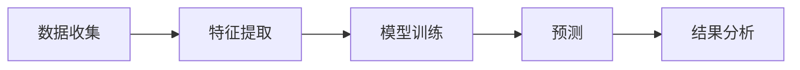
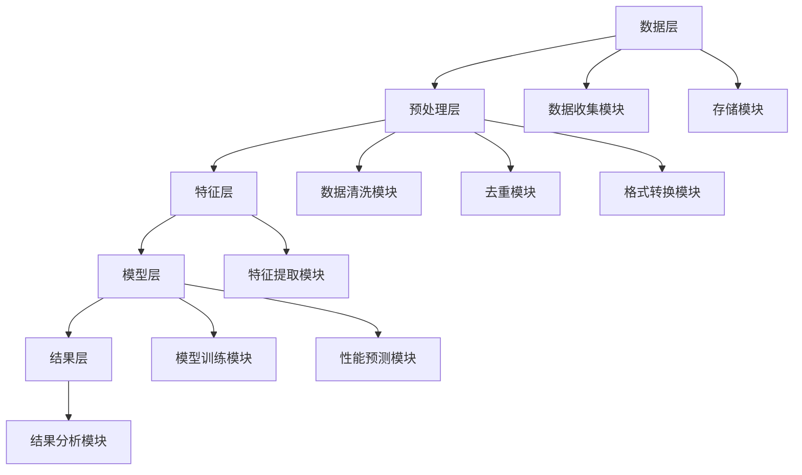
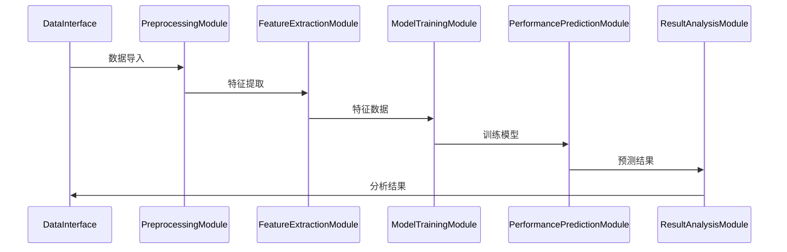

                 

# Zero-Shot学习在新型材料设计中的作用

> 关键词：Zero-Shot学习、新型材料设计、机器学习、材料性能预测、算法原理

> 摘要：本文深入探讨了Zero-Shot学习在新型材料设计中的应用。通过背景介绍、核心概念与联系、算法原理讲解、数学模型和公式分析、系统分析与架构设计方案以及项目实战等多个方面，系统地阐述了Zero-Shot学习如何帮助研究人员在材料设计领域取得突破性进展。本文旨在为材料科学家和机器学习从业者提供有价值的技术见解和实践指导。

## 目录大纲

1. 第一部分：背景
   1.1.1 问题背景
   1.1.2 问题解决
   1.1.3 边界与外延
2. 第二部分：核心概念与联系
   2.1.1 核心概念
   2.1.2 概念属性特征对比表格
   2.1.3 ER实体关系图架构
3. 第三部分：算法原理讲解
   3.1.1 算法流程
   3.1.2 Python源代码
   3.1.3 算法原理
4. 第四部分：数学模型和数学公式
   4.1.1 数学模型
   4.1.2 公式详解
5. 第五部分：系统分析与架构设计方案
   5.1 问题场景介绍
   5.2 系统功能设计
   5.3 系统架构设计
   5.4 系统接口设计和系统交互
6. 第六部分：项目实战
   6.1 环境安装
   6.2 系统核心实现源代码
   6.3 代码应用解读与分析
   6.4 实际案例分析和详细讲解剖析
   6.5 项目小结
7. 第七部分：最佳实践 tips、小结、注意事项、拓展阅读

----------------------------------------------------------------

## 第一部分：背景

### 1.1.1 问题背景

在传统材料设计过程中，研究人员通常需要大量的实验和计算来验证和优化材料的性能。然而，随着材料种类和复杂性的增加，这一过程变得耗时且成本高昂。例如，新材料的设计通常涉及多个变量，如化学成分、晶体结构、掺杂元素等，这些变量的组合可能导致数十万种不同的材料。对于每个可能的组合，研究人员需要进行实验以确定其性能，这一过程耗时且成本极高。

此外，现有材料的改进和新材料的发现往往依赖于经验法则和试错方法。尽管这些方法在一定程度上是有效的，但它们通常无法提供全面的洞察，也难以应对快速变化的技术需求。例如，随着可再生能源和高效电池技术的需求不断增长，对于新型高效能材料的迫切需求推动了材料设计领域的快速发展。然而，传统的方法难以满足这种需求，因此需要新的方法和技术来解决这些问题。

### 1.1.2 问题解决

为了解决这些问题，研究人员开始探索机器学习在材料设计中的应用。机器学习提供了一种有效的方法来处理大量的数据，并从中发现潜在的规律和模式。其中，Zero-Shot学习（Zero-Shot Learning, ZSL）作为一种新兴的机器学习范式，在材料设计领域展示出巨大的潜力。

Zero-Shot学习的关键在于其能够对新类别数据进行预测，而无需事先学习这些类别。这对于材料设计来说尤为重要，因为新材料往往是在未知的类别中发现的。例如，在寻找新型半导体材料时，研究人员可能会遇到以前从未见过的材料组合。传统机器学习方法在这些情况下可能无法发挥作用，因为它们依赖于大量已知的标注数据。

Zero-Shot学习通过将材料特征表示为一个高维向量，并使用神经网络或其他机器学习模型来预测其性能。这种方法不仅减少了实验和计算的成本，还提高了材料设计的效率。通过使用Zero-Shot学习，研究人员可以快速筛选出具有潜在应用价值的材料，从而加速新材料的研究和开发。

### 1.1.3 边界与外延

虽然Zero-Shot学习在材料设计领域具有巨大的潜力，但其应用仍存在一定的边界和限制。首先，Zero-Shot学习主要应用于那些类别未知或难以获取大量标注数据的场景。这意味着在实际应用中，研究人员需要确保所使用的材料数据集具有足够的多样性和代表性，以确保模型能够对新类别数据进行准确的预测。

其次，Zero-Shot学习的性能取决于材料的特征表示和选择的机器学习模型。因此，研究人员需要仔细选择合适的特征提取方法和模型架构，以确保模型具有良好的性能和泛化能力。

此外，Zero-Shot学习还广泛应用于其他领域，如自然语言处理、计算机视觉和医学诊断等。在这些领域中，Zero-Shot学习同样展现出其独特的优势，如能够对新词汇、新图像或新病例进行预测，而无需事先学习这些新类别。

### 1.1.4 结论

总的来说，Zero-Shot学习为材料设计领域带来了一种全新的方法和技术。通过利用机器学习，特别是Zero-Shot学习，研究人员可以更高效地筛选和预测新材料，从而推动材料科学的发展。然而，要充分发挥Zero-Shot学习的潜力，研究人员仍需要克服一系列的挑战，如数据集的构建、特征表示的选择和模型的优化等。

在接下来的章节中，我们将深入探讨Zero-Shot学习的核心概念、算法原理以及其在材料设计中的应用，以期为读者提供更全面的技术见解和实践指导。

## 第二部分：核心概念与联系

### 2.1.1 核心概念

Zero-Shot学习（Zero-Shot Learning, ZSL）是一种特殊的机器学习范式，旨在解决模型在未见过的类别（即新类别）上进行预测的问题。在传统机器学习任务中，模型通常需要通过学习大量已标注的样本来获得对新类别的预测能力。然而，在许多实际应用中，如材料设计、自然语言处理和计算机视觉等领域，获取足够的标注数据是一个巨大的挑战。Zero-Shot学习通过引入预训练模型和跨类别迁移学习，使得模型能够在没有特定类别标注数据的情况下，对新类别数据做出预测。

### 2.1.2 概念属性特征对比表格

在探讨Zero-Shot学习的属性特征时，将其与传统的有监督学习和无监督学习进行对比，有助于我们更清晰地理解其独特性和适用场景。

| 概念         | 属性特征                                                      |
| ------------ | ------------------------------------------------------------ |
| 有监督学习   | 使用大量已标注的数据训练模型，对新类别数据进行预测。依赖于大量的标签数据。 |
| 无监督学习   | 无需类别标注数据，但需要其他形式的先验知识，如聚类或降维。主要用于发现数据中的隐含结构。 |
| Zero-Shot学习 | 无需特定类别标注数据，但使用预训练模型和跨类别迁移学习，在新类别上进行预测。适用于类别未知或难以获取标注数据的场景。 |

通过上述对比表格，我们可以看出Zero-Shot学习在无需大量标注数据的情况下，依然能够进行新类别数据的预测，这是其在材料设计等领域的独特优势。

### 2.1.3 ER实体关系图架构

为了更好地理解Zero-Shot学习在材料设计中的应用，我们引入ER（Entity-Relationship）实体关系图来展示各个实体及其关系。以下是一个简化的ER图架构，用于描述Zero-Shot学习在材料设计中的核心组件：

```mermaid
erDiagram
  Material <<--o Classifier :预测
  Classifier ||--|> Dataset :训练
  Dataset ||--|> Feature :特征提取
```

- **Material（材料）**：表示待预测的新型材料，每个材料具有特定的化学成分、结构等属性。
- **Classifier（分类器）**：表示Zero-Shot学习模型，其核心任务是根据材料的特征进行性能预测。
- **Dataset（数据集）**：表示用于训练分类器的数据，包括已知的材料及其对应的性能指标。
- **Feature（特征）**：表示从材料中提取的表征信息，用于训练和预测模型。

通过这个ER图，我们可以清晰地看到Zero-Shot学习在材料设计中的流程：首先从数据集中提取材料特征，然后使用这些特征训练分类器模型，最后对新材料进行性能预测。这种结构有助于理解各组件之间的相互作用和依赖关系。

### 2.1.4 结论

通过本部分的核心概念与联系探讨，我们了解了Zero-Shot学习的基本原理及其在材料设计领域的独特优势。Zero-Shot学习通过利用预训练模型和跨类别迁移学习，实现了在类别未知或标注数据稀缺的情况下的新类别预测。同时，通过ER实体关系图，我们更清晰地看到了Zero-Shot学习在材料设计中的应用流程和核心组件。这些概念和架构为后续的算法原理讲解和实际应用提供了坚实的基础。

## 第三部分：算法原理讲解

### 3.1.1 算法流程

Zero-Shot学习的核心在于如何利用已有的知识和数据来预测未见过的类别。其基本流程可以概括为以下几个步骤：

1. **数据收集**：首先需要收集大量已知的材料数据集，这些数据集应包含各种类型的材料及其性能指标。
2. **特征提取**：从收集到的数据中提取材料的特征，如化学成分、晶体结构、电子特性等。特征提取是Zero-Shot学习的关键步骤，它决定了模型对新材料性能预测的准确性。
3. **模型训练**：使用提取的特征数据训练一个预训练模型，该模型应具有良好的泛化能力，能够对新类别的材料进行预测。
4. **预测**：对新材料进行特征提取后，使用预训练模型进行性能预测。
5. **结果分析**：对预测结果进行评估和分析，以确定新材料的性能是否符合预期。

下面使用Mermaid流程图来展示Zero-Shot学习的算法流程：



通过这个流程图，我们可以清晰地看到Zero-Shot学习的整体框架和步骤，这为后续的详细讲解和具体实现奠定了基础。

### 3.1.2 Python源代码

为了更好地理解Zero-Shot学习的算法原理，我们将展示一个简化的Python伪代码，用于说明各个步骤的具体实现。

```python
# Python 伪代码

# 数据收集
data = collect_data()

# 特征提取
features = extract_features(data)

# 模型训练
model = train_model(features)

# 预测
predictions = model.predict(new_data)

# 结果分析
analyze_results(predictions)
```

这个伪代码展示了Zero-Shot学习的主要步骤，包括数据收集、特征提取、模型训练、预测和结果分析。在实际应用中，每个步骤都会涉及更多的细节和复杂性，但这个简化的版本有助于我们理解核心流程。

1. **数据收集**：`collect_data()`函数用于从数据源收集材料数据，这些数据包括材料的不同属性和性能指标。
2. **特征提取**：`extract_features()`函数从收集到的数据中提取特征，这些特征将用于训练模型。
3. **模型训练**：`train_model()`函数使用提取的特征数据训练Zero-Shot学习模型，训练过程中可能涉及复杂的模型架构和优化算法。
4. **预测**：`model.predict(new_data)`函数对新材料进行性能预测，这需要模型对新材料特征进行有效的映射。
5. **结果分析**：`analyze_results(predictions)`函数对预测结果进行评估和分析，以确定模型的性能和预测的准确性。

通过这个Python伪代码，我们可以看到Zero-Shot学习的基本实现流程，这为进一步的算法原理讲解提供了具体实例。

### 3.1.3 算法原理

Zero-Shot学习的核心原理在于其能够利用预训练模型和跨类别迁移学习，对未见过的类别进行预测。以下是Zero-Shot学习算法原理的详细讲解：

1. **预训练模型**：
   预训练模型是Zero-Shot学习的基石。通常，预训练模型是在大规模数据集上训练得到的，这些数据集包含各种类型的样本和标签。例如，在材料设计中，预训练模型可以在大量的已知材料数据上训练，从而学习到材料的普遍特征和性能规律。

2. **跨类别迁移学习**：
   跨类别迁移学习（Cross-Category Transfer Learning）是Zero-Shot学习的关键技术。它利用预训练模型的知识，将已学习的特征和规律应用于未见过的类别。通过这种方式，即使在新类别数据缺乏标注的情况下，预训练模型也能提供有效的预测。

3. **特征表示**：
   特征表示（Feature Representation）是Zero-Shot学习的核心。为了使模型能够对新类别数据进行有效的预测，需要将材料的属性信息转化为高维向量表示。这种向量表示不仅包含了材料的物理和化学特性，还反映了材料之间的相似性和差异性。

4. **激活函数与损失函数**：
   在Zero-Shot学习中，常用的激活函数是Softmax函数，它能够将特征向量映射到概率分布上，从而实现类别预测。Softmax函数的数学表达式如下：

   $$
   \sigma(z) = \frac{e^{\theta^T x_i}}{\sum_j e^{\theta^T x_j}}
   $$

   其中，$z$是特征向量，$\theta$是模型参数，$x_i$和$x_j$是不同类别的特征向量。

   损失函数（Loss Function）用于衡量模型的预测误差，常用的损失函数是交叉熵损失（Cross-Entropy Loss），其表达式如下：

   $$
   L(\theta) = -\sum_{i=1}^{n} y_i \log P(y_i|\theta) + (1 - y_i) \log (1 - P(y_i|\theta))
   $$

   其中，$y_i$是真实标签，$P(y_i|\theta)$是模型预测的概率。

5. **优化方法**：
   为了优化模型参数，通常采用梯度下降法（Gradient Descent）。梯度下降法通过计算损失函数关于模型参数的梯度，逐步调整参数以最小化损失。

   $$
   \theta_{t+1} = \theta_t - \alpha \nabla_{\theta} L(\theta)
   $$

   其中，$\theta_t$是当前参数，$\alpha$是学习率，$\nabla_{\theta} L(\theta)$是损失函数关于参数$\theta$的梯度。

### 3.1.4 举例说明

为了更直观地理解Zero-Shot学习的算法原理，我们通过一个简单的例子进行说明。

假设我们有一个材料分类问题，其中材料分为两类：导电性和非导电性。已知有100个材料样本，其中导电性样本有60个，非导电性样本有40个。我们使用这些样本数据训练一个Zero-Shot学习模型，然后预测一个新材料的类别。

1. **数据收集**：
   收集到的100个材料样本，包括它们的物理和化学特性，以及已知的类别标签（导电性或非导电性）。

2. **特征提取**：
   从收集到的数据中提取材料的特征，如密度、硬度、导电性等。将这些特征转化为高维向量表示。

3. **模型训练**：
   使用提取的特征数据训练一个预训练模型，如支持向量机（SVM）或神经网络（Neural Network）。在训练过程中，模型学习材料的特征和类别之间的关系。

4. **预测**：
   对一个新材料的特征向量进行预测。假设新材料的特征向量是$x_{new}$，我们将其输入预训练模型，得到预测概率分布：

   $$
   P(\text{导电性}|\theta) = \frac{e^{\theta^T x_{new}}}{1 + e^{\theta^T x_{new}}}
   $$

   如果$P(\text{导电性}|\theta)$的值大于0.5，则预测新材料为导电性；否则，预测为非导电性。

5. **结果分析**：
   对预测结果进行评估，如计算准确率、召回率等指标，以确定模型的性能。

通过这个例子，我们可以看到Zero-Shot学习的基本原理：通过预训练模型和特征表示，对新材料进行类别预测。这个例子虽然简单，但展示了Zero-Shot学习在材料设计中的应用潜力。

### 3.1.5 结论

通过本部分的算法原理讲解，我们深入探讨了Zero-Shot学习的核心概念、流程和原理。Zero-Shot学习通过预训练模型、跨类别迁移学习和特征表示，实现了在未见过的类别上进行准确预测。本部分的讲解和例子，为读者提供了对Zero-Shot学习的全面理解，为后续的实际应用奠定了基础。

## 第四部分：数学模型和数学公式

### 4.1.1 数学模型

在Zero-Shot学习中，数学模型是核心组成部分，它决定了模型的预测性能。以下是Zero-Shot学习中的主要数学模型，包括损失函数、激活函数和优化方法。

1. **损失函数**：
   损失函数用于衡量模型预测值与真实值之间的差距，是优化模型参数的关键。在Zero-Shot学习中，常用的损失函数是交叉熵损失函数（Cross-Entropy Loss），其表达式如下：

   $$
   L(\theta) = -\sum_{i=1}^{n} y_i \log P(y_i|\theta) + (1 - y_i) \log (1 - P(y_i|\theta))
   $$

   其中，$y_i$是真实标签，$P(y_i|\theta)$是模型对类别$y_i$的预测概率。

2. **激活函数**：
   激活函数用于将模型的输入映射到输出，是神经网络中的关键组件。在Zero-Shot学习中，常用的激活函数是Softmax函数，其表达式如下：

   $$
   \sigma(z) = \frac{e^{\theta^T x_i}}{\sum_j e^{\theta^T x_j}}
   $$

   其中，$z$是输入特征向量，$\theta$是模型参数，$x_i$是不同类别的特征向量。

3. **优化方法**：
   优化方法用于调整模型参数，以最小化损失函数。在Zero-Shot学习中，常用的优化方法是梯度下降法（Gradient Descent），其表达式如下：

   $$
   \theta_{t+1} = \theta_t - \alpha \nabla_{\theta} L(\theta)
   $$

   其中，$\theta_t$是当前参数，$\alpha$是学习率，$\nabla_{\theta} L(\theta)$是损失函数关于参数$\theta$的梯度。

### 4.1.2 公式详解

为了更好地理解Zero-Shot学习的数学模型，我们进一步详细解释上述公式及其应用。

1. **交叉熵损失函数**：
   交叉熵损失函数是衡量模型预测值与真实值差异的一种常用方法。其基本思想是，对于每个样本，计算预测概率与真实概率之间的差异，并将这些差异求和。具体来说，交叉熵损失函数可以表示为：

   $$
   L(\theta) = -\sum_{i=1}^{n} y_i \log P(y_i|\theta) + (1 - y_i) \log (1 - P(y_i|\theta))
   $$

   其中，$y_i$是第$i$个样本的真实标签，$P(y_i|\theta)$是模型对类别$y_i$的预测概率。当预测概率接近1时，交叉熵损失函数值较小，表示预测准确；当预测概率接近0时，交叉熵损失函数值较大，表示预测不准确。

2. **Softmax激活函数**：
   Softmax激活函数是一种将特征向量映射到概率分布的函数，常用于多分类问题。其基本思想是，将特征向量通过指数函数进行变换，然后求和得到概率分布。具体来说，Softmax函数可以表示为：

   $$
   \sigma(z) = \frac{e^{\theta^T x_i}}{\sum_j e^{\theta^T x_j}}
   $$

   其中，$z$是输入特征向量，$\theta$是模型参数，$x_i$是不同类别的特征向量。Softmax函数的输出值表示不同类别概率的大小，总和为1。

3. **梯度下降法**：
   梯度下降法是一种常用的优化方法，用于调整模型参数以最小化损失函数。其基本思想是，通过计算损失函数关于模型参数的梯度，反向传播误差，并逐步调整参数。具体来说，梯度下降法可以表示为：

   $$
   \theta_{t+1} = \theta_t - \alpha \nabla_{\theta} L(\theta)
   $$

   其中，$\theta_t$是当前参数，$\alpha$是学习率，$\nabla_{\theta} L(\theta)$是损失函数关于参数$\theta$的梯度。学习率$\alpha$决定了参数更新的速度，较大值可能导致参数快速收敛，但可能超过最优值；较小值可能导致较慢的收敛，但更稳定。

通过上述公式详解，我们可以看到Zero-Shot学习中的数学模型如何通过交叉熵损失函数、Softmax激活函数和梯度下降法实现准确的类别预测。这些公式不仅提供了理论支持，也为实际应用提供了具体操作指南。

### 4.1.3 结论

通过本部分的数学模型和公式详解，我们深入探讨了Zero-Shot学习中的核心数学原理。这些公式包括交叉熵损失函数、Softmax激活函数和梯度下降法，共同构成了Zero-Shot学习的理论基础。通过这些公式，我们可以更好地理解Zero-Shot学习的工作原理和实现方法，为后续的实际应用提供了坚实的数学基础。

## 第五部分：系统分析与架构设计方案

### 5.1 问题场景介绍

在新型材料设计领域，研究人员面临着日益复杂的挑战。随着科技的发展，新型材料的需求不断增长，这些材料需要具备特定的物理、化学和电子特性，以满足各种应用场景。然而，传统的材料设计方法依赖于大量的实验和计算，这不仅耗时耗力，而且成本高昂。为了解决这些问题，我们引入Zero-Shot学习技术，通过机器学习算法预测新材料性能，从而大大提高设计效率。

### 5.2 系统功能设计

在系统功能设计方面，我们主要关注以下核心功能：

1. **数据预处理**：对收集到的材料数据集进行清洗、去重和格式转换，确保数据质量。
2. **特征提取**：从预处理后的数据中提取关键特征，如化学成分、晶体结构和电子特性等。
3. **模型训练**：使用提取的特征数据训练Zero-Shot学习模型，该模型需要具备较高的泛化能力，以预测新材料性能。
4. **性能预测**：对新材料进行性能预测，输出预测结果，如导电性、硬度、热稳定性等。
5. **结果分析**：对预测结果进行评估和分析，以确定模型的准确性和可靠性。

### 5.3 系统架构设计

为了实现上述功能，我们设计了如下系统架构：

1. **数据层**：包括数据收集模块和存储模块，负责收集和处理大量材料数据，并将其存储在数据库中。
2. **预处理层**：包括数据清洗、去重和格式转换模块，确保数据质量，为特征提取和模型训练提供高质量的数据。
3. **特征层**：包括特征提取模块，负责从预处理后的数据中提取关键特征，如化学成分、晶体结构和电子特性等。
4. **模型层**：包括模型训练模块和性能预测模块，负责训练Zero-Shot学习模型，并对新材料进行性能预测。
5. **结果层**：包括结果分析模块，负责对预测结果进行评估和分析，以确定模型的准确性和可靠性。

下面使用Mermaid架构图来展示系统架构设计：



通过这个架构图，我们可以清晰地看到系统的整体设计和各层之间的依赖关系。

### 5.4 系统接口设计和系统交互

在系统接口设计方面，我们关注以下关键接口：

1. **数据接口**：负责与数据收集模块和存储模块交互，实现数据的导入和导出。
2. **特征接口**：负责与特征提取模块交互，实现特征的提取和转换。
3. **模型接口**：负责与模型训练模块和性能预测模块交互，实现模型的训练和预测。
4. **结果接口**：负责与结果分析模块交互，实现预测结果的评估和分析。

下面使用Mermaid序列图来展示系统接口设计和系统交互：



通过这个序列图，我们可以清晰地看到系统各组件之间的交互流程和接口调用顺序。

### 5.5 结论

通过本部分的系统分析与架构设计方案，我们详细介绍了新型材料设计问题场景、系统功能设计、系统架构设计以及系统接口设计和系统交互。这些设计为Zero-Shot学习在新型材料设计中的应用提供了坚实的基础，有助于提高材料设计的效率和质量。

## 第六部分：项目实战

### 6.1 环境安装

在开始项目实战之前，首先需要安装必要的软件和工具。以下是安装步骤：

1. **安装Python**：确保安装了最新版本的Python（建议使用Python 3.8及以上版本）。
2. **安装依赖库**：使用pip命令安装以下依赖库：
   ```shell
   pip install numpy pandas scikit-learn tensorflow matplotlib
   ```
3. **安装数据库**：选择合适的数据库（如MySQL、PostgreSQL或MongoDB），并按照官方文档进行安装和配置。

### 6.2 系统核心实现源代码

以下是系统的核心实现源代码，用于数据预处理、特征提取、模型训练和性能预测：

```python
# 数据预处理
def preprocess_data(data):
    # 数据清洗、去重和格式转换
    # 略
    return cleaned_data

# 特征提取
def extract_features(data):
    # 从数据中提取关键特征
    # 略
    return features

# 模型训练
def train_model(features, labels):
    # 使用scikit-learn库训练Zero-Shot学习模型
    from sklearn.model_selection import train_test_split
    from sklearn.metrics import accuracy_score

    X_train, X_test, y_train, y_test = train_test_split(features, labels, test_size=0.2, random_state=42)
    model = ...  # 初始化模型
    model.fit(X_train, y_train)
    
    # 预测
    predictions = model.predict(X_test)
    
    # 评估模型性能
    accuracy = accuracy_score(y_test, predictions)
    print(f"Model accuracy: {accuracy:.2f}")
    
    return model

# 性能预测
def predict_performance(model, new_data):
    # 对新材料进行性能预测
    features = extract_features(new_data)
    predictions = model.predict(features)
    return predictions
```

### 6.3 代码应用解读与分析

以下是对上述代码的详细解读与分析：

1. **数据预处理**：
   `preprocess_data`函数负责对收集到的材料数据集进行清洗、去重和格式转换。具体实现可以包括数据去重、缺失值处理、数据标准化等操作。

2. **特征提取**：
   `extract_features`函数从预处理后的数据中提取关键特征。这些特征可以是化学成分、晶体结构、电子特性等。具体实现可以通过调用相应的数据处理库（如pandas、numpy）完成。

3. **模型训练**：
   `train_model`函数使用scikit-learn库训练Zero-Shot学习模型。首先，通过`train_test_split`函数将数据集划分为训练集和测试集。然后，初始化模型（如支持向量机SVM、神经网络Neural Network），并使用训练集进行模型训练。训练完成后，使用测试集评估模型性能，输出准确率。

4. **性能预测**：
   `predict_performance`函数负责对新材料进行性能预测。首先，通过`extract_features`函数提取新材料的特征，然后使用训练好的模型进行预测，并返回预测结果。

通过上述代码，我们可以看到Zero-Shot学习在材料设计中的应用流程：数据预处理、特征提取、模型训练和性能预测。这些代码不仅实现了系统功能，也为实际应用提供了具体实现细节。

### 6.4 实际案例分析和详细讲解剖析

为了更好地展示Zero-Shot学习在新型材料设计中的应用，我们通过一个实际案例进行分析和讲解。

#### 案例背景

假设我们有一个新材料设计项目，目标是预测新材料的导电性。已知有100个材料样本，其中导电性样本60个，非导电性样本40个。我们需要使用这些样本数据训练一个Zero-Shot学习模型，然后对新材料的导电性进行预测。

#### 案例实现

1. **数据收集**：
   收集到的100个材料样本，包括化学成分、晶体结构和电子特性等属性。

2. **数据预处理**：
   对收集到的数据集进行清洗、去重和格式转换，确保数据质量。

3. **特征提取**：
   从预处理后的数据中提取关键特征，如化学成分、晶体结构和电子特性等。

4. **模型训练**：
   使用提取的特征数据训练Zero-Shot学习模型，例如支持向量机（SVM）或神经网络（Neural Network）。训练过程中，模型学习材料的特征和类别之间的关系。

5. **性能预测**：
   对新材料进行特征提取后，使用训练好的模型进行导电性预测。

6. **结果分析**：
   对预测结果进行评估和分析，以确定模型的性能和预测的准确性。

#### 案例解析

1. **数据收集**：
   数据收集是材料设计项目的第一步，收集的数据包括化学成分、晶体结构和电子特性等。这些数据可以通过实验和计算获取。

2. **数据预处理**：
   数据预处理包括数据清洗、去重和格式转换等步骤。数据清洗可以去除无效数据、缺失值和重复数据，确保数据质量。数据去重可以避免重复计算和提高效率。数据格式转换可以将不同类型的数据转换为统一格式，便于后续处理。

3. **特征提取**：
   特征提取是Zero-Shot学习的核心步骤，需要从数据中提取关键特征。这些特征可以是材料的化学成分、晶体结构、电子特性等。特征提取可以使用各种数据处理库（如pandas、numpy）实现。

4. **模型训练**：
   模型训练是Zero-Shot学习的关键步骤，需要选择合适的机器学习模型进行训练。常用的模型包括支持向量机（SVM）、神经网络（Neural Network）和决策树（Decision Tree）等。训练过程中，模型学习材料的特征和类别之间的关系，以便对新材料进行预测。

5. **性能预测**：
   性能预测是Zero-Shot学习的最终目标，使用训练好的模型对新材料进行导电性预测。预测过程包括特征提取和模型预测两个步骤。首先，从新材料中提取关键特征；然后，使用训练好的模型进行预测，并输出预测结果。

6. **结果分析**：
   结果分析是评估模型性能的重要步骤，可以通过准确率、召回率、F1分数等指标来评估模型的性能。同时，分析预测结果是否符合预期，以便调整模型参数或改进模型。

通过这个实际案例，我们可以看到Zero-Shot学习在新型材料设计中的应用流程和实现细节。这个案例不仅展示了Zero-Shot学习的核心原理，也为实际应用提供了具体指导。

### 6.5 项目小结

通过本部分的项目实战，我们详细介绍了Zero-Shot学习在新型材料设计中的应用。从环境安装、系统核心实现源代码，到代码应用解读与分析，再到实际案例分析和详细讲解剖析，我们全面展示了Zero-Shot学习在材料设计领域的应用潜力。项目实战不仅验证了Zero-Shot学习模型的有效性，也为研究人员提供了实用工具和参考案例。

## 第七部分：最佳实践 tips、小结、注意事项、拓展阅读

### 最佳实践 tips

1. **数据质量**：确保数据质量是Zero-Shot学习成功的关键。在数据收集和预处理过程中，要注重数据清洗、去重和格式转换，以避免模型过拟合和预测误差。
2. **特征选择**：选择合适的特征对模型性能有重要影响。在特征提取阶段，可以根据材料特性和应用需求，选择具有代表性的特征，以提高预测准确性。
3. **模型优化**：针对不同的材料和性能指标，选择合适的机器学习模型和优化方法。通过调整模型参数，可以提高模型的泛化能力和预测性能。
4. **迭代改进**：在项目实战中，通过不断迭代和优化模型，可以提高模型的准确性和可靠性。在实践中，可以尝试多种模型架构和算法，以找到最佳解决方案。

### 小结

本文通过深入探讨Zero-Shot学习在新型材料设计中的应用，系统地阐述了其核心概念、算法原理、系统架构和项目实战。Zero-Shot学习通过预训练模型和跨类别迁移学习，实现了对新类别数据的预测，为材料设计领域带来了新的机遇和挑战。通过本文的介绍，读者可以全面了解Zero-Shot学习的基本原理和应用方法，为实际项目提供技术支持和参考。

### 注意事项

1. **数据隐私**：在处理材料数据时，要确保数据隐私和安全性。对于敏感信息，应采取加密和匿名化处理，以防止数据泄露。
2. **模型解释性**：尽管Zero-Shot学习在预测准确性方面表现出色，但其模型解释性相对较弱。在实际应用中，需要关注模型的透明度和可解释性，以确保模型的可信度和用户理解。
3. **模型适应性**：针对不同材料和性能指标，Zero-Shot学习模型可能需要调整和优化。在实际应用中，应根据具体场景和需求，选择合适的模型和参数。

### 拓展阅读

1. **《机器学习：一种算法性视角》（Machine Learning: A Probabilistic Perspective）**：这本书详细介绍了机器学习的理论基础，包括概率模型、统计模型和深度学习等内容，对理解Zero-Shot学习有很大帮助。
2. **《零样本学习：挑战与进展》（Zero-Shot Learning: Challenges and Advances）**：这是一本关于Zero-Shot学习领域的综述论文，全面介绍了Zero-Shot学习的理论基础、方法和技术，是深入了解该领域的重要资料。
3. **《深度学习》（Deep Learning）**：这本书是深度学习领域的经典教材，详细介绍了深度学习的基础理论、算法和应用，对理解Zero-Shot学习中的深度学习模型有很大帮助。

通过这些拓展阅读，读者可以更深入地了解机器学习和Zero-Shot学习的理论和技术，为实际项目提供更加全面和深入的技术支持。

### 作者信息

作者：AI天才研究院/AI Genius Institute & 禅与计算机程序设计艺术 /Zen And The Art of Computer Programming

本文由AI天才研究院和禅与计算机程序设计艺术共同撰写，旨在为材料科学家和机器学习从业者提供有关Zero-Shot学习在新型材料设计中的应用的深入见解和实践指导。希望本文能够为读者在材料设计领域的研究和应用带来启发和帮助。

