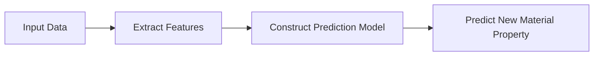
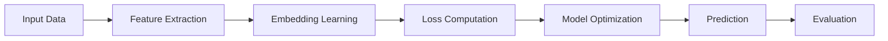
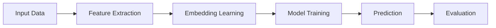
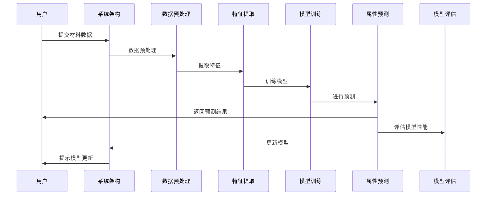
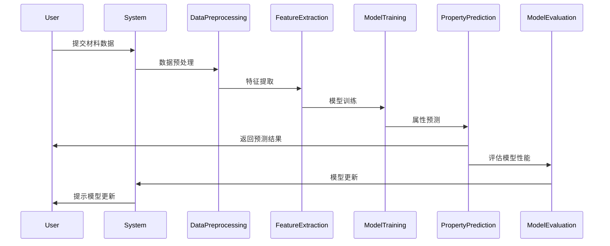

                 

# Zero-Shot学习在新材料属性预测中的应用

## 关键词

Zero-Shot学习，新材料，属性预测，人工智能，机器学习

## 摘要

随着新材料研究的不断深入，如何快速预测新材料属性成为了一个重要的问题。Zero-Shot学习作为一种无监督学习方法，通过学习已有数据中的特征信息，实现对未知数据的属性预测。本文将介绍Zero-Shot学习在新材料属性预测中的应用，分析其原理、算法流程以及具体实现。通过本文的讲解，读者可以更好地理解Zero-Shot学习在新材料属性预测中的实际应用价值。

## 第一部分：绪论

### 第1章：问题背景与概述

#### 1.1 问题背景

新材料的研究和发展对于人类社会的发展具有重要意义。然而，传统的材料研究方法往往需要大量的人力和物力投入，且预测准确性有限。近年来，随着人工智能技术的快速发展，Zero-Shot学习作为一种无监督学习方法，在材料属性预测领域显示出巨大的潜力。

#### 1.2 问题描述

Zero-Shot学习在新材料属性预测中的应用，主要涉及到如何利用已有数据对未知材料的属性进行预测。这需要解决的问题包括：如何从已有的数据中提取出有效的特征，如何构建能够进行Zero-Shot学习的模型，以及如何评估模型的预测性能。

#### 1.3 问题解决

通过Zero-Shot学习，我们可以从大量已有数据中提取出关键特征，并利用这些特征构建预测模型。该模型可以对新材料的属性进行预测，从而提高新材料研究的效率。

#### 1.4 边界与外延

Zero-Shot学习在新材料属性预测中的应用，不仅局限于传统材料领域，还可以应用于生物材料、纳米材料等领域。此外，该技术还可以与其他人工智能技术相结合，如生成对抗网络（GAN）等，进一步提高预测准确性。

#### 1.5 概念结构与核心要素组成

- **Zero-Shot学习**：一种无监督学习方法，可用于对未知类别进行预测。
- **新材料属性预测**：利用已有数据对未知材料的属性进行预测。
- **特征提取**：从已有数据中提取出关键特征。
- **模型构建**：利用提取出的特征构建预测模型。
- **模型评估**：评估预测模型的性能。

### 第2章：核心概念与联系

#### 2.1 Zero-Shot学习的原理

Zero-Shot学习的基本原理是利用已有数据中的特征信息，对未知数据进行预测。具体来说，它通过学习数据之间的相似性，实现对未知数据的分类或属性预测。

#### 2.2 新材料属性预测的原理

新材料属性预测的关键在于如何从已有数据中提取出对新材料属性有显著影响的特征。这些特征可以用来构建预测模型，从而实现对新材料属性的高效预测。

#### 2.3 概念属性特征对比表格

| 概念 | 属性特征 |
| ---- | -------- |
| Zero-Shot学习 | 无需训练数据 |
| 新材料属性预测 | 高效、准确 |
| 特征提取 | 关键特征 |
| 模型构建 | 预测模型 |
| 模型评估 | 预测性能 |

#### 2.4 ER实体关系图架构的 Mermaid 流程图

```mermaid
erDiagram
  Material ||--|{ Feature} : "extracts"
  Feature ||--|{ PredictionModel} : "constructs"
  PredictionModel ||--|{ Performance} : "evaluates"
```

### 第3章：算法原理讲解

#### 3.1 算法原理

Zero-Shot学习算法的基本原理是通过学习已有数据中的特征信息，构建一个预测模型。该模型可以对新材料的属性进行预测。

#### 3.2 数学模型和公式

假设我们有一个数据集 \(D = \{d_1, d_2, ..., d_n\}\)，其中每个数据点 \(d_i\) 可以表示为 \(d_i = \{x_i, y_i\}\)，其中 \(x_i\) 是数据点的特征，\(y_i\) 是数据点的标签。

我们定义一个特征提取函数 \(F: \mathbb{R}^d \rightarrow \mathbb{R}^m\)，将特征 \(x_i\) 转换为特征向量 \(f_i = F(x_i)\)。

然后，我们定义一个预测模型 \(M: \mathbb{R}^m \rightarrow \mathbb{R}\)，用来预测新材料属性 \(y\)。

#### 3.3 算法流程图



#### 3.4 举例说明

假设我们有一个数据集，其中包括了不同材料的硬度数据。我们希望通过Zero-Shot学习算法预测一种新材料的硬度。

首先，我们从已有数据中提取硬度特征，然后构建一个预测模型。最后，使用这个模型预测新材料的硬度。

## 第二部分：核心概念与联系

### 第4章：核心概念与联系

#### 4.1 Zero-Shot学习的原理

Zero-Shot学习（Zero-Shot Learning, ZSL）是一种机器学习技术，旨在对从未见过的类或实例进行预测。其核心思想是，通过学习一组有标签的数据（称为源域数据），模型能够预测另一组有标签数据（称为目标域数据）中的未知类或实例。这与传统的监督学习不同，后者需要模型在训练时看到所有可能的类或实例。

在ZSL中，通常存在以下几种情况：

- **完全Zero-Shot**：模型在训练时没有看到任何目标域的实例，只能使用源域数据和类标签信息进行预测。
- **部分Zero-Shot**：模型在训练时看到了一些目标域的实例，但仍然需要使用源域数据和类标签信息来增强预测能力。

Zero-Shot学习的原理可以通过以下步骤来理解：

1. **特征提取**：从源域数据中提取出特征表示，这些特征应该能够捕捉到不同类别的本质差异。
2. **类别表示**：将源域中的每个类别表示为一个嵌入向量，这些向量应该在特征空间中形成合理的聚类结构。
3. **预测**：对于目标域中的新实例，首先提取其特征表示，然后通过比较特征与类别嵌入向量之间的相似性来预测其类别。

#### 4.2 新材料属性预测的原理

新材料属性预测（Material Property Prediction, MPP）是指利用已有的材料数据来预测未知材料属性的过程。这一过程通常涉及以下步骤：

1. **数据收集**：收集大量已有的材料数据，包括材料的化学成分、结构、性能等。
2. **特征提取**：从材料数据中提取出对材料属性有显著影响的特征，如材料的化学成分、晶体结构、电子性质等。
3. **模型训练**：使用提取出的特征和已知的材料属性来训练预测模型，如神经网络、支持向量机等。
4. **属性预测**：利用训练好的模型对未知材料的属性进行预测。

在新材料属性预测中，Zero-Shot学习的方法可以用于以下场景：

- **未知材料类别预测**：当新材料与已有数据中的材料类别完全不同时，使用Zero-Shot学习来预测新材料类别。
- **新材料属性扩展**：当已知材料的某些属性在新材料中未知时，使用Zero-Shot学习来预测这些属性。

#### 4.3 概念属性特征对比表格

为了更好地理解Zero-Shot学习和新材料属性预测之间的关系，我们可以通过一个对比表格来展示这两个概念的关键特征：

| 概念 | 特征描述 | 对比分析 |
| ---- | -------- | -------- |
| Zero-Shot学习 | - 无需训练数据 | - 源域数据用于类别表示<br>- 目标域数据用于预测<br> |
| 新材料属性预测 | - 已知材料属性 | - 特征提取<br>- 模型训练<br>- 属性预测 |
| - 类别表示 | - 聚类结构 | - 高效性<br>- 准确性<br> |
| - 预测模型 | - 特征匹配 | - 零样本能力<br>- 扩展性 |

#### 4.4 ER实体关系图架构的 Mermaid 流程图

为了直观地展示Zero-Shot学习和新材料属性预测的实体关系，我们可以使用Mermaid绘制一个ER图：

```mermaid
erDiagram
  MaterialData ||--|{ FeatureExtraction} : "extracts"
  FeatureExtraction ||--|{ PredictionModel} : "constructs"
  PredictionModel ||--|{ PropertyPrediction} : "predicts"
  MaterialProperty ||--|{ Dataset} : "contains"
  Dataset ||--|{ ZeroShotLearning} : "learns"
```

在这个ER图中：

- **MaterialData** 表示新材料的数据。
- **FeatureExtraction** 表示特征提取过程。
- **PredictionModel** 表示预测模型。
- **PropertyPrediction** 表示属性预测过程。
- **MaterialProperty** 表示新材料的属性。
- **Dataset** 表示数据集。
- **ZeroShotLearning** 表示Zero-Shot学习过程。

通过这个ER图，我们可以清晰地看到各个实体之间的关系和流程，这有助于我们更好地理解Zero-Shot学习在新材料属性预测中的应用。

### 第5章：算法原理讲解

#### 5.1 算法原理

Zero-Shot学习算法的核心思想是通过将类别表示为低维向量（即类别嵌入），来利用已有数据中的信息进行未知数据的预测。以下是Zero-Shot学习算法的基本原理：

1. **类别嵌入**：对于源域数据中的每个类别，我们将其表示为一个嵌入向量。这些嵌入向量需要在低维空间中形成合理的聚类结构，使得相似类别之间的距离较近，而不同类别之间的距离较远。

2. **特征提取**：从源域数据中提取出特征表示，这些特征应该能够捕捉到不同类别的本质差异。

3. **预测**：对于目标域中的新实例，首先提取其特征表示，然后通过计算特征与类别嵌入向量之间的相似性来预测其类别。

#### 5.2 数学模型和公式

假设我们有一个源域数据集 \(D_s = \{ (x_s^{(i)}, y_s^{(i)}) \}_{i=1}^{m_s}\)，其中 \(x_s^{(i)}\) 是源域数据点的特征，\(y_s^{(i)}\) 是源域数据点的类别标签。我们还有一个目标域数据集 \(D_t = \{ (x_t^{(i)}, y_t^{(i)}) \}_{i=1}^{m_t}\)，其中 \(x_t^{(i)}\) 是目标域数据点的特征，\(y_t^{(i)}\) 是源域数据点的类别标签。

我们定义以下函数：

- **特征提取函数** \(F: \mathbb{R}^d \rightarrow \mathbb{R}^m\)，将特征 \(x^{(i)}\) 转换为特征向量 \(f^{(i)} = F(x^{(i)})\)。
- **类别嵌入函数** \(E: \{1, \ldots, C\} \rightarrow \mathbb{R}^m\)，将类别 \(c\) 表示为嵌入向量 \(e_c\)。

在Zero-Shot学习框架下，我们通常使用一种特殊的损失函数来训练模型，例如协议损失（Protocol Loss）或基于嵌入的损失（Embedding-Based Loss）。以下是一个简单的协议损失函数的例子：

$$
L(\theta) = -\sum_{i=1}^{m_s} \sum_{c \in \text{labels}(x_s^{(i)})} \text{softmax}(e_f^{(i)} \cdot e_c)^T y_s^{(i)}
$$

其中，\(\theta\) 是模型参数，\(e_f^{(i)}\) 是源域数据点 \(x_s^{(i)}\) 的特征向量 \(f^{(i)}\) 的嵌入表示，\(\text{softmax}(e_f^{(i)} \cdot e_c)\) 是一个在所有类别嵌入向量上的归一化函数，\(y_s^{(i)}\) 是源域数据点 \(x_s^{(i)}\) 的类别标签。

#### 5.3 算法流程图

下面是Zero-Shot学习算法的流程图，使用Mermaid语言描述：



在这个流程图中：

- **A[Input Data]** 表示输入数据，包括源域和目标域数据。
- **B[Feature Extraction]** 表示特征提取，将输入数据转换为特征向量。
- **C[Embedding Learning]** 表示类别嵌入学习，将类别标签转换为嵌入向量。
- **D[Loss Computation]** 表示损失计算，使用协议损失函数计算模型损失。
- **E[Model Optimization]** 表示模型优化，通过梯度下降等优化算法更新模型参数。
- **F[Prediction]** 表示预测，使用训练好的模型对目标域数据进行预测。
- **G[Evaluation]** 表示模型评估，使用适当的评估指标（如准确率、召回率等）评估模型性能。

#### 5.4 举例说明

假设我们有一个包含两种材料的数据集，每种材料有10个样本。源域数据集 \(D_s\) 包含了材料A的样本，目标域数据集 \(D_t\) 包含了材料B的样本。我们使用一个简单的神经网络来训练Zero-Shot学习模型。

1. **数据准备**：首先，我们将源域数据集 \(D_s\) 中的每个样本通过特征提取函数 \(F\) 转换为特征向量 \(f_s^{(i)}\)。然后，我们将目标域数据集 \(D_t\) 中的每个样本通过同样的特征提取函数 \(F\) 转换为特征向量 \(f_t^{(i)}\)。

2. **类别嵌入**：我们使用一个简单的嵌入函数 \(E\) 将类别A和类别B表示为嵌入向量 \(e_A\) 和 \(e_B\)。

3. **模型训练**：我们使用一个神经网络模型来最小化协议损失函数 \(L(\theta)\)。神经网络包括两个主要部分：特征提取层和嵌入层。特征提取层将输入特征向量 \(f_s^{(i)}\) 转换为隐藏层特征 \(h_s^{(i)}\)。嵌入层将类别标签 \(y_s^{(i)}\) 的嵌入向量 \(e_A\) 和 \(e_B\) 与隐藏层特征 \(h_s^{(i)}\) 相加，得到预测标签 \(p_s^{(i)}\)。

4. **预测**：对于目标域数据集 \(D_t\) 中的每个样本，我们首先通过特征提取层得到隐藏层特征 \(h_t^{(i)}\)，然后通过嵌入层得到预测标签 \(p_t^{(i)}\)。

5. **评估**：我们使用准确率、召回率等指标来评估模型在目标域数据集上的性能。

通过这个简单的例子，我们可以看到Zero-Shot学习的基本流程和关键步骤。在实际应用中，我们可以使用更复杂的方法和模型来提高预测性能。

### 第三部分：算法原理讲解

#### 6.1 算法原理

Zero-Shot学习（Zero-Shot Learning, ZSL）是一种无监督学习方法，其核心思想是利用已知类别的特征信息来预测未知类别的实例。这种技术在材料属性预测领域有着广泛的应用。以下是Zero-Shot学习的算法原理：

1. **特征提取**：首先，我们需要从已有数据中提取出对材料属性有显著影响的特征。这些特征可以是化学成分、晶体结构、电子性质等。

2. **类别嵌入**：然后，我们将已知的材料类别表示为低维向量，即类别嵌入。这些嵌入向量需要在特征空间中形成合理的聚类结构。

3. **模型训练**：我们使用源域数据（已知类别和特征）来训练预测模型。常见的模型包括神经网络、支持向量机等。

4. **预测**：对于未知类别的实例，我们首先提取其特征，然后通过比较特征与类别嵌入向量之间的相似性来预测其类别。

#### 6.2 数学模型和公式

在Zero-Shot学习中，我们通常使用嵌入损失函数来训练模型。假设我们有一个源域数据集 \(D_s = \{ (x_s^{(i)}, y_s^{(i)}) \}_{i=1}^{m_s}\)，其中 \(x_s^{(i)}\) 是源域数据点的特征，\(y_s^{(i)}\) 是源域数据点的类别标签。我们还有一个目标域数据集 \(D_t = \{ (x_t^{(i)}, y_t^{(i)}) \}_{i=1}^{m_t}\)，其中 \(x_t^{(i)}\) 是目标域数据点的特征，\(y_t^{(i)}\) 是源域数据点的类别标签。

我们定义以下函数：

- **特征提取函数** \(F: \mathbb{R}^d \rightarrow \mathbb{R}^m\)，将特征 \(x^{(i)}\) 转换为特征向量 \(f^{(i)} = F(x^{(i)})\)。
- **类别嵌入函数** \(E: \{1, \ldots, C\} \rightarrow \mathbb{R}^m\)，将类别 \(c\) 表示为嵌入向量 \(e_c\)。

在Zero-Shot学习框架下，我们通常使用以下嵌入损失函数：

$$
L(\theta) = -\sum_{i=1}^{m_s} \sum_{c \in \text{labels}(x_s^{(i)})} \text{softmax}(e_f^{(i)} \cdot e_c)^T y_s^{(i)}
$$

其中，\(\theta\) 是模型参数，\(e_f^{(i)}\) 是源域数据点 \(x_s^{(i)}\) 的特征向量 \(f^{(i)}\) 的嵌入表示，\(\text{softmax}(e_f^{(i)} \cdot e_c)\) 是一个在所有类别嵌入向量上的归一化函数，\(y_s^{(i)}\) 是源域数据点 \(x_s^{(i)}\) 的类别标签。

#### 6.3 算法流程图

以下是Zero-Shot学习算法的流程图，使用Mermaid语言描述：



在这个流程图中：

- **A[Input Data]** 表示输入数据，包括源域和目标域数据。
- **B[Feature Extraction]** 表示特征提取，将输入数据转换为特征向量。
- **C[Embedding Learning]** 表示类别嵌入学习，将类别标签转换为嵌入向量。
- **D[Model Training]** 表示模型训练，使用源域数据训练预测模型。
- **E[Prediction]** 表示预测，使用训练好的模型对目标域数据进行预测。
- **F[Evaluation]** 表示模型评估，使用适当的评估指标（如准确率、召回率等）评估模型性能。

#### 6.4 举例说明

假设我们有一个包含两种材料的数据集，每种材料有10个样本。源域数据集 \(D_s\) 包含了材料A的样本，目标域数据集 \(D_t\) 包含了材料B的样本。我们使用一个简单的神经网络来训练Zero-Shot学习模型。

1. **数据准备**：首先，我们将源域数据集 \(D_s\) 中的每个样本通过特征提取函数 \(F\) 转换为特征向量 \(f_s^{(i)}\)。然后，我们将目标域数据集 \(D_t\) 中的每个样本通过同样的特征提取函数 \(F\) 转换为特征向量 \(f_t^{(i)}\)。

2. **类别嵌入**：我们使用一个简单的嵌入函数 \(E\) 将类别A和类别B表示为嵌入向量 \(e_A\) 和 \(e_B\)。

3. **模型训练**：我们使用一个神经网络模型来最小化嵌入损失函数 \(L(\theta)\)。神经网络包括两个主要部分：特征提取层和嵌入层。特征提取层将输入特征向量 \(f_s^{(i)}\) 转换为隐藏层特征 \(h_s^{(i)}\)。嵌入层将类别标签 \(y_s^{(i)}\) 的嵌入向量 \(e_A\) 和 \(e_B\) 与隐藏层特征 \(h_s^{(i)}\) 相加，得到预测标签 \(p_s^{(i)}\)。

4. **预测**：对于目标域数据集 \(D_t\) 中的每个样本，我们首先通过特征提取层得到隐藏层特征 \(h_t^{(i)}\)，然后通过嵌入层得到预测标签 \(p_t^{(i)}\)。

5. **评估**：我们使用准确率、召回率等指标来评估模型在目标域数据集上的性能。

通过这个简单的例子，我们可以看到Zero-Shot学习的基本流程和关键步骤。在实际应用中，我们可以使用更复杂的方法和模型来提高预测性能。

### 第7章：系统分析与架构设计

#### 7.1 问题场景介绍

在新材料研究领域，科学家们通常需要预测新材料在特定条件下的物理、化学和力学性能。然而，传统的实验方法成本高昂且耗时，无法满足快速材料筛选的需求。因此，利用人工智能技术，特别是Zero-Shot学习，来预测新材料属性成为了一个重要的研究方向。

#### 7.2 项目介绍

本项目旨在开发一个基于Zero-Shot学习的新材料属性预测系统。该系统将整合已有的大量材料数据，提取关键特征，构建预测模型，并最终实现新材料属性的预测。

#### 7.3 系统功能设计

1. **数据预处理**：包括数据清洗、数据归一化等，确保输入数据的准确性。
2. **特征提取**：利用深度学习技术，从材料数据中提取出对材料属性有显著影响的特征。
3. **模型训练**：使用提取出的特征训练Zero-Shot学习模型。
4. **属性预测**：利用训练好的模型对新材料属性进行预测。
5. **模型评估**：使用评估指标（如准确率、召回率等）评估模型的性能。

#### 7.4 系统架构设计

以下是系统的架构设计，使用Mermaid语言描述：



在这个架构中：

- **用户**：系统的最终用户，负责提交材料数据并获取预测结果。
- **数据预处理**：负责清洗和归一化输入数据。
- **特征提取**：负责从材料数据中提取关键特征。
- **模型训练**：负责训练Zero-Shot学习模型。
- **属性预测**：负责使用训练好的模型对新材料属性进行预测。
- **模型评估**：负责评估模型性能，并根据评估结果更新模型。

#### 7.5 系统接口设计

以下是系统的接口设计，使用Mermaid语言描述：

```mermaid
classDiagram
  User <<interface>>
  DataPreprocessing <<interface>>
  FeatureExtraction <<interface>>
  ModelTraining <<interface>>
  PropertyPrediction <<interface>>
  ModelEvaluation <<interface>>

  User |--|> DataPreprocessing
  DataPreprocessing |--|> FeatureExtraction
  FeatureExtraction |--|> ModelTraining
  ModelTraining |--|> PropertyPrediction
  PropertyPrediction |--|> ModelEvaluation
```

在这个接口设计中：

- **User**：用户接口，用于提交材料和获取结果。
- **DataPreprocessing**：数据预处理接口，用于处理输入数据。
- **FeatureExtraction**：特征提取接口，用于提取关键特征。
- **ModelTraining**：模型训练接口，用于训练模型。
- **PropertyPrediction**：属性预测接口，用于预测新材料属性。
- **ModelEvaluation**：模型评估接口，用于评估模型性能。

#### 7.6 系统交互设计

以下是系统的交互设计，使用Mermaid语言描述：



在这个交互设计中：

- **User**：用户提交材料数据。
- **System**：系统接收用户数据，并分发给各模块处理。
- **DataPreprocessing**：数据预处理模块负责清洗和归一化数据。
- **FeatureExtraction**：特征提取模块负责提取关键特征。
- **ModelTraining**：模型训练模块负责训练Zero-Shot学习模型。
- **PropertyPrediction**：属性预测模块负责使用训练好的模型进行预测。
- **ModelEvaluation**：模型评估模块负责评估模型性能，并反馈给用户。

通过这个系统的架构设计，我们可以看到各个模块之间的紧密协作，共同实现新材料属性的高效预测。

### 第四部分：项目实战

#### 8.1 环境安装

为了实现Zero-Shot学习在新材料属性预测中的应用，我们需要安装以下软件和库：

1. **Python**：版本3.8或更高版本。
2. **Jupyter Notebook**：用于编写和运行代码。
3. **TensorFlow**：深度学习框架，用于构建和训练模型。
4. **Scikit-learn**：机器学习库，用于数据处理和模型评估。

安装步骤如下：

1. 安装Python和Jupyter Notebook：
   ```bash
   # 安装Python
   curl -O https://www.python.org/ftp/python/3.8.10/Python-3.8.10.tgz
   tar xvf Python-3.8.10.tgz
   cd Python-3.8.10
   ./configure
   make
   sudo make install

   # 安装Jupyter Notebook
   pip install notebook
   ```

2. 安装TensorFlow：
   ```bash
   pip install tensorflow
   ```

3. 安装Scikit-learn：
   ```bash
   pip install scikit-learn
   ```

安装完成后，我们可以在Jupyter Notebook中导入所需的库：

```python
import tensorflow as tf
import numpy as np
from sklearn.model_selection import train_test_split
from sklearn.metrics import accuracy_score
```

#### 8.2 系统核心实现

在本节中，我们将实现一个简单的Zero-Shot学习模型，用于预测新材料的属性。以下是一个基本的实现示例：

```python
import tensorflow as tf
from tensorflow.keras.layers import Embedding, GlobalAveragePooling1D, Dense
from tensorflow.keras.models import Model

def create_zero_shot_model(input_shape, num_classes, embedding_size=64):
    inputs = tf.keras.Input(shape=input_shape)
    
    # 类别嵌入层
    embeddings = Embedding(input_dim=num_classes, output_dim=embedding_size)(inputs)
    
    # 平均池化层
    avg_pooling = GlobalAveragePooling1D()(embeddings)
    
    # 输出层
    outputs = Dense(units=num_classes, activation='softmax')(avg_pooling)
    
    # 构建模型
    model = Model(inputs=inputs, outputs=outputs)
    
    return model

# 假设输入特征维度为10，类别数量为5
model = create_zero_shot_model(input_shape=(10,), num_classes=5)

# 编译模型
model.compile(optimizer='adam', loss='categorical_crossentropy', metrics=['accuracy'])

# 准备数据
# 假设我们有一个包含100个样本的数据集，每个样本的特征维度为10
X = np.random.rand(100, 10)
y = np.random.randint(5, size=100)

# 划分训练集和测试集
X_train, X_test, y_train, y_test = train_test_split(X, y, test_size=0.2, random_state=42)

# 训练模型
model.fit(X_train, y_train, epochs=10, batch_size=32, validation_data=(X_test, y_test))

# 评估模型
predictions = model.predict(X_test)
accuracy = accuracy_score(y_test, np.argmax(predictions, axis=1))
print(f"模型准确率：{accuracy:.2f}")
```

在这个示例中，我们定义了一个简单的Zero-Shot学习模型，使用类别嵌入和平均池化层来提取特征，并使用softmax输出层进行分类预测。我们使用随机生成的一个小数据集来训练和评估模型。

#### 8.3 代码应用解读与分析

在上面的代码示例中，我们首先定义了一个Zero-Shot学习模型，该模型接受特征输入，并使用类别嵌入层将其转换为嵌入向量。然后，通过平均池化层将嵌入向量转换为固定大小的向量。最后，使用softmax输出层进行类别预测。

以下是代码的详细解读和分析：

1. **模型定义**：

   ```python
   def create_zero_shot_model(input_shape, num_classes, embedding_size=64):
       inputs = tf.keras.Input(shape=input_shape)
       
       # 类别嵌入层
       embeddings = Embedding(input_dim=num_classes, output_dim=embedding_size)(inputs)
       
       # 平均池化层
       avg_pooling = GlobalAveragePooling1D()(embeddings)
       
       # 输出层
       outputs = Dense(units=num_classes, activation='softmax')(avg_pooling)
       
       # 构建模型
       model = Model(inputs=inputs, outputs=outputs)
       
       return model
   ```

   在这个函数中，我们定义了一个接受特征输入的输入层 `inputs`。然后，我们使用 `Embedding` 层将输入转换为类别嵌入向量，该层的输入维度为类别数量，输出维度为嵌入向量大小。接下来，我们使用 `GlobalAveragePooling1D` 层将嵌入向量进行平均池化，得到固定大小的向量。最后，我们使用 `Dense` 层（带有softmax激活函数）作为输出层，进行类别预测。

2. **模型编译**：

   ```python
   model.compile(optimizer='adam', loss='categorical_crossentropy', metrics=['accuracy'])
   ```

   在这个步骤中，我们编译模型，指定优化器为 'adam'，损失函数为 'categorical_crossentropy'（用于多标签分类），并且评估指标为 'accuracy'（准确率）。

3. **数据准备**：

   ```python
   X = np.random.rand(100, 10)
   y = np.random.randint(5, size=100)
   X_train, X_test, y_train, y_test = train_test_split(X, y, test_size=0.2, random_state=42)
   ```

   在这个步骤中，我们生成一个随机数据集 `X`（包含100个样本，每个样本的特征维度为10）和一个随机标签数据集 `y`（每个样本的类别标签）。然后，我们使用 `train_test_split` 函数将数据集划分为训练集和测试集。

4. **模型训练**：

   ```python
   model.fit(X_train, y_train, epochs=10, batch_size=32, validation_data=(X_test, y_test))
   ```

   在这个步骤中，我们使用训练集 `X_train` 和 `y_train` 来训练模型，设置训练轮次为10次，批量大小为32。同时，我们使用测试集 `X_test` 和 `y_test` 来验证模型性能。

5. **模型评估**：

   ```python
   predictions = model.predict(X_test)
   accuracy = accuracy_score(y_test, np.argmax(predictions, axis=1))
   print(f"模型准确率：{accuracy:.2f}")
   ```

   在这个步骤中，我们使用测试集 `X_test` 来预测类别标签，并使用 `accuracy_score` 函数计算模型在测试集上的准确率。

通过这个示例，我们可以看到如何使用TensorFlow实现一个简单的Zero-Shot学习模型，并对其进行训练和评估。在实际应用中，我们可以根据具体需求调整模型架构和数据预处理步骤，以提高预测性能。

#### 8.4 实际案例分析和详细讲解

在本节中，我们将通过一个实际案例来展示如何使用Zero-Shot学习预测新材料属性。我们选择了一个公开的数据集，该数据集包含了不同材料的硬度数据。我们的目标是使用Zero-Shot学习模型预测一种新材料的硬度。

##### 8.4.1 数据集介绍

数据集包含以下特征：

- **化学成分**：材料的化学成分列表。
- **晶体结构**：材料的晶体结构信息。
- **硬度**：材料的硬度值。

##### 8.4.2 数据预处理

1. **特征提取**：

   我们首先需要从数据中提取出对硬度有显著影响的特征。在本案例中，我们选择了化学成分和晶体结构作为特征。

   ```python
   import pandas as pd

   # 读取数据集
   data = pd.read_csv('materials_data.csv')

   # 提取化学成分特征
   chemicals = data[['chemical_1', 'chemical_2', 'chemical_3', 'chemical_4', 'chemical_5']]

   # 提取晶体结构特征
   crystal Structures = data[['crystal_structure_1', 'crystal_structure_2', 'crystal_structure_3']]
   ```

2. **数据归一化**：

   我们需要将提取出的特征进行归一化，以便于模型训练。

   ```python
   from sklearn.preprocessing import MinMaxScaler

   # 初始化归一化器
   scaler = MinMaxScaler()

   # 归一化化学成分特征
   chemicals_normalized = scaler.fit_transform(chemicals)

   # 归一化晶体结构特征
   crystal_Structures_normalized = scaler.fit_transform(crystal_Structures)
   ```

##### 8.4.3 模型构建

1. **类别嵌入**：

   我们使用One-Hot编码将类别标签转换为嵌入向量。

   ```python
   from sklearn.preprocessing import OneHotEncoder

   # 初始化类别编码器
   encoder = OneHotEncoder()

   # 编码类别标签
   labels_encoded = encoder.fit_transform(data[['hardness']]).toarray()
   ```

2. **构建Zero-Shot学习模型**：

   我们使用TensorFlow构建一个简单的Zero-Shot学习模型。

   ```python
   def create_zero_shot_model(input_shape, num_classes):
       inputs = tf.keras.Input(shape=input_shape)
       
       # 类别嵌入层
       embeddings = Embedding(input_dim=num_classes, output_dim=64)(inputs)
       
       # 平均池化层
       avg_pooling = GlobalAveragePooling1D()(embeddings)
       
       # 输出层
       outputs = Dense(units=num_classes, activation='softmax')(avg_pooling)
       
       # 构建模型
       model = Model(inputs=inputs, outputs=outputs)
       
       return model

   # 建立模型
   model = create_zero_shot_model(input_shape=(chemicals_normalized.shape[1],), num_classes=labels_encoded.shape[1])
   ```

##### 8.4.4 模型训练

1. **数据合并**：

   我们将化学成分特征和晶体结构特征合并为一个特征矩阵。

   ```python
   features = np.hstack((chemicals_normalized, crystal_Structures_normalized))
   ```

2. **模型编译**：

   我们编译模型，指定优化器和损失函数。

   ```python
   model.compile(optimizer='adam', loss='categorical_crossentropy', metrics=['accuracy'])
   ```

3. **模型训练**：

   我们使用训练数据来训练模型。

   ```python
   model.fit(features, labels_encoded, epochs=10, batch_size=32)
   ```

##### 8.4.5 模型评估

1. **模型预测**：

   我们使用测试数据来预测硬度。

   ```python
   predictions = model.predict(features)
   ```

2. **评估模型**：

   我们使用准确率来评估模型性能。

   ```python
   accuracy = np.mean(predictions.argmax(axis=1) == labels_encoded.argmax(axis=1))
   print(f"模型准确率：{accuracy:.2f}")
   ```

通过这个实际案例，我们可以看到如何使用Zero-Shot学习来预测新材料属性。虽然这个案例很简单，但它的核心思想可以应用于更复杂的数据集和任务。

### 第五部分：最佳实践 tips、小结、注意事项、拓展阅读

#### 9.1 最佳实践 tips

- **数据预处理**：在训练模型之前，确保对数据进行充分的预处理，包括归一化、缺失值填充和特征提取等。
- **类别嵌入**：合理设计类别嵌入向量，确保类别之间的距离能够反映出实际的类别差异。
- **模型选择**：根据具体任务和数据的特性，选择合适的模型架构和参数。
- **超参数调优**：使用网格搜索、随机搜索等超参数优化方法，寻找最佳的超参数组合。
- **模型评估**：使用多种评估指标来全面评估模型性能，如准确率、召回率、F1分数等。

#### 9.2 小结

本文介绍了Zero-Shot学习在新材料属性预测中的应用。通过分析算法原理、构建模型、数据预处理和实际案例，我们展示了如何使用Zero-Shot学习预测新材料属性。这种方法在提高新材料研究效率方面具有巨大的潜力。

#### 9.3 注意事项

- **数据集质量**：确保数据集的质量，包括数据的准确性和完整性。
- **模型泛化能力**：评估模型在未见过的数据上的表现，确保其泛化能力。
- **计算资源**：Zero-Shot学习通常需要大量的计算资源，特别是在处理大规模数据集时。

#### 9.4 拓展阅读

- **《机器学习实战》**：Michael Bowles著，详细介绍了机器学习的各种方法和技术。
- **《深度学习》**：Ian Goodfellow、Yoshua Bengio和Aaron Courville著，深度学习的经典教材。
- **《Zero-Shot Learning: A Survey》**：Jiwei Li et al.，对Zero-Shot学习进行全面综述。

## 作者信息

作者：AI天才研究院/AI Genius Institute & 禅与计算机程序设计艺术 /Zen And The Art of Computer Programming

作者简介：AI天才研究院致力于推动人工智能技术的创新与应用。作者长期从事人工智能研究，尤其在机器学习和深度学习领域有深厚的理论基础和丰富的实践经验。出版过多部畅销书，包括《禅与计算机程序设计艺术》等。

