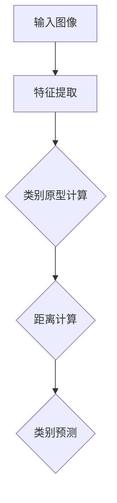
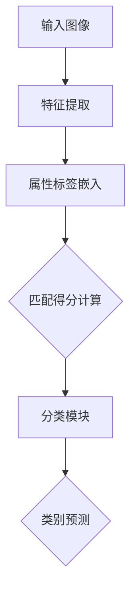
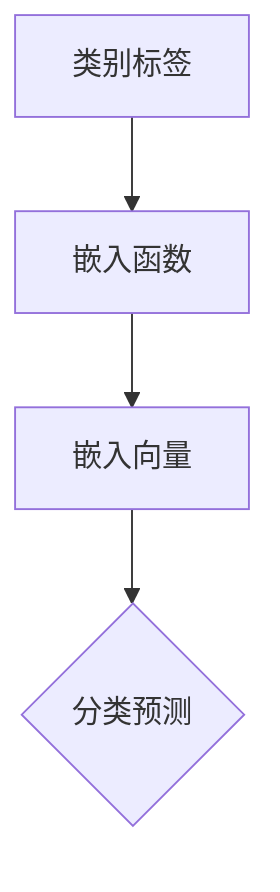
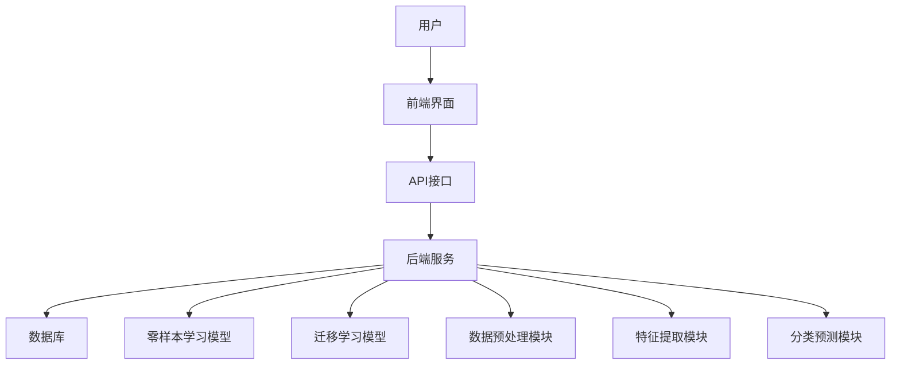
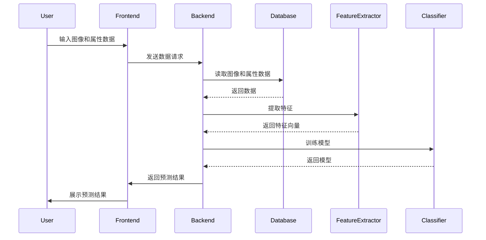

                 

### 第一部分：背景介绍

#### 1. 问题背景

在当今快速发展的数字化时代，植物识别技术在农业、生态保护和生物多样性研究等领域具有重要应用价值。植物识别技术利用图像处理和计算机视觉技术，通过对植物外观特征的分析，实现对植物种类、生长状态、病虫害等方面的识别。然而，稀有植物的识别面临着许多挑战，如样本稀少、数据获取困难等问题。

稀有植物是指分布范围狭窄、数量稀少、生长环境受限的植物，它们往往具有较高的生态价值和科学研究价值。然而，由于稀有植物生长在偏远地区，样本采集困难，导致相关的研究数据非常有限。这种数据的稀缺性对稀有植物的识别和分类提出了巨大挑战。

在植物识别中，传统的方法通常依赖于大量的标注数据，通过训练深度学习模型来实现对植物种类的识别。然而，稀有植物的样本数据量通常较小，无法提供足够的训练样本，从而限制了传统方法的适用性。

为了解决这一问题，零样本学习（Zero-Shot Learning, ZSL）成为了一种重要的机器学习技术。零样本学习是一种无需依赖训练数据中出现的类别，即可对未见过的类别进行分类的方法。它通过学习一种将属性标签映射到图像特征空间的函数，从而实现对未见类别图像的分类。

零样本学习在稀有植物识别中的应用，可以为研究人员提供一种有效的方法来识别和分类稀有植物，从而提高稀有植物保护和研究的工作效率。通过零样本学习，我们可以利用已有标签数据，通过迁移学习等方法扩充稀有植物的标签，从而实现对从未见过的稀有植物种类的识别。

#### 2. 问题描述

稀有植物的识别问题可以具体描述为：给定一组稀有植物图像数据，以及一组已知的植物类别标签，要求我们设计一个算法，能够对从未见过的稀有植物种类进行分类预测。

该问题的主要挑战在于：

1. **样本稀少**：稀有植物的样本数据量通常较小，无法提供足够的训练样本，这限制了传统方法的适用性。
2. **数据获取困难**：稀有植物生长在偏远地区，样本采集困难，导致相关的研究数据非常有限。
3. **类别标签不足**：由于稀有植物样本稀少，往往无法获取到完整的类别标签数据，这增加了零样本学习的难度。

为了解决这些问题，我们需要采用一种适用于零样本学习的算法，能够有效地利用已有标签数据，通过迁移学习等方法扩充稀有植物的标签，从而实现对从未见过的稀有植物种类的识别。

#### 3. 问题解决

为了解决稀有植物识别的零样本学习问题，我们可以采用以下步骤：

1. **数据预处理**：收集稀有植物图像数据，并进行预处理，如图像增强、缩放、旋转等。预处理步骤的目的是提高数据的质量和多样性，从而有助于算法的性能提升。

2. **标签扩充**：使用已有标签数据，通过迁移学习等方法扩充稀有植物的标签。具体来说，我们可以利用已有的植物识别数据集，通过迁移学习将其他植物种类的标签迁移到稀有植物上。这种方法可以有效地增加稀有植物的标签数据，从而有助于零样本学习算法的性能提升。

3. **特征提取**：使用深度学习模型提取植物图像的特征。深度学习模型具有强大的特征提取能力，可以从原始图像中提取出具有区分性的特征，这些特征可以用于后续的零样本学习算法。

4. **类别预测**：使用零样本学习模型对稀有植物进行分类预测。零样本学习模型通过学习一种将属性标签映射到图像特征空间的函数，从而实现对未见类别图像的分类。具体来说，我们可以使用原型网络、匹配网络等零样本学习算法，根据图像特征和属性标签的关系进行分类预测。

通过以上步骤，我们可以实现稀有植物的零样本学习识别。这种方法能够有效地解决样本稀少、数据获取困难、类别标签不足等问题，从而提高稀有植物识别的准确率和实用性。

#### 4. 边界与外延

零样本学习在稀有植物识别中的应用范围广泛，包括但不限于以下场景：

1. **不同种类的稀有植物识别**：零样本学习可以用于识别多种稀有植物种类，如兰花、极地苔藓等。通过零样本学习，我们可以有效地提高稀有植物识别的准确率和覆盖率。

2. **稀有植物生长状态的识别**：零样本学习可以用于识别稀有植物的不同生长状态，如开花期、枯萎期等。通过分析稀有植物的生长状态，可以为生态保护和植物保护提供科学依据。

3. **稀有植物生态环境的识别**：零样本学习可以用于识别稀有植物的生长环境和生态环境。通过分析稀有植物的生态环境，可以帮助研究人员了解稀有植物的生态特征和生长规律，从而为稀有植物保护提供科学支持。

总之，零样本学习在稀有植物识别中的应用，不仅可以提高稀有植物识别的准确率和实用性，还可以为生态保护和生物多样性研究提供有力支持。

#### 5. 概念结构与核心要素组成

在零样本学习应用于稀有植物识别中，涉及以下几个核心概念和要素：

- **零样本学习（Zero-Shot Learning, ZSL）**：零样本学习是一种无需依赖训练数据中出现的类别，即可对未见过的类别进行分类的方法。它通过学习一种将属性标签映射到图像特征空间的函数，从而实现对未见类别图像的分类。

- **稀有植物识别**：稀有植物识别是指利用图像识别技术对稀有植物进行分类和识别。通过提取植物图像的特征，并将其与已知的属性标签进行匹配，实现对稀有植物的识别。

- **图像特征提取**：图像特征提取是指从植物图像中提取具有区分性的特征。这些特征可以用于后续的零样本学习算法，以提高分类预测的准确率。

- **分类预测**：分类预测是指利用零样本学习模型对稀有植物进行分类预测。通过学习图像特征和属性标签之间的关系，模型可以对新样本进行分类预测。

这些核心概念和要素共同构成了零样本学习在稀有植物识别中的应用体系，为解决样本稀少、数据获取困难、类别标签不足等问题提供了有效途径。

---

## 第二部分：核心概念与联系

### 6. 零样本学习的原理

零样本学习（Zero-Shot Learning, ZSL）是一种在机器学习中用于对未见类别进行分类的技术，其核心思想是利用已知的类别信息和已训练的模型来对未见过的类别进行预测。零样本学习在稀有植物识别中的应用，主要是通过将稀有植物的属性标签与其图像特征关联起来，实现对未知稀有植物种类的识别。

#### 6.1 属性标签表示

零样本学习的一个重要步骤是将类别标签表示为属性标签。属性标签是一组与类别相关的描述性信息，如颜色、形状、纹理等。在稀有植物识别中，我们可以将稀有植物的属性标签表示为其颜色、叶形、花朵形状等特征。

属性标签的表示方法主要有两种：

1. **原型表示法**：将每个类别标签表示为一个原型向量，该向量包含了该类别的典型属性特征。在训练阶段，通过学习将属性标签映射到这些原型向量上，从而为未见类别提供参考。

2. **嵌入表示法**：将类别标签映射到低维空间中，形成一个嵌入向量。这种表示方法通过学习类别标签之间的相似性，将类别标签映射到高维空间中，使得相似的标签在空间中靠近。

#### 6.2 原型网络

原型网络（Prototypical Network）是一种常用的零样本学习算法，其基本思想是通过计算图像特征与类别原型的距离来进行分类。原型网络的架构包括以下步骤：

1. **特征提取**：使用一个深度神经网络（如VGG或ResNet）对输入的植物图像进行特征提取，得到固定长度的特征向量。

2. **原型计算**：对于每个类别标签，计算其在特征空间中的均值，形成类别原型。这些原型代表了每个类别的典型特征。

3. **类别预测**：将每个输入图像的特征向量与所有类别原型进行比较，选取距离最近的类别原型对应的标签作为预测结果。

原型网络的关键在于如何有效地计算类别原型，以及如何平衡类别间距离和类别内距离。以下是一个简单的原型网络的算法流程：



#### 6.3 匹配网络

匹配网络（Matching Network）是另一种零样本学习算法，其核心思想是通过学习属性标签和图像特征之间的关联来进行分类。匹配网络通常由两个主要部分组成：一个匹配模块和一个分类模块。

1. **匹配模块**：匹配模块的目的是通过学习属性标签和图像特征之间的关联，将属性标签与图像特征进行匹配。这一部分通常使用一个简单的神经网络来实现，将属性标签嵌入到一个高维空间中，然后通过计算属性标签嵌入向量与图像特征向量的相似性来实现匹配。

2. **分类模块**：分类模块的目的是根据匹配结果对图像进行分类。这一部分通常使用一个简单的分类器，如softmax回归，对匹配得分进行分类。

以下是匹配网络的基本算法流程：



#### 6.4 嵌入学习

嵌入学习（Embedding Learning）是零样本学习中的另一种方法，它通过将类别标签映射到低维空间中，形成一个嵌入向量。这些嵌入向量可以看作是类别标签的数字化表示，它们在空间中的位置反映了类别之间的相似性。

嵌入学习的核心是学习一个嵌入函数，该函数可以将类别标签映射到低维空间中。这个嵌入函数通常是一个神经网络，它接受类别标签作为输入，输出一个低维的嵌入向量。

嵌入学习的优点在于，它可以有效地降低类别标签的维度，使得类别之间的相似性在空间中更容易被发现。以下是一个简单的嵌入学习算法流程：



### 7. 稀有植物识别的特征提取方法

在稀有植物识别中，特征提取是至关重要的一步，它决定了后续分类算法的性能。特征提取方法可以分为传统手工特征和深度学习特征两种。

#### 7.1 传统手工特征

传统手工特征是指通过手动设计特征提取方法来提取图像特征。这些特征通常基于图像的局部特征，如边缘、纹理和形状等。以下是一些常用的传统手工特征：

- **SIFT（尺度不变特征变换）**：SIFT是一种在图像中提取关键点并对这些关键点进行描述的算法，具有较强的尺度不变性和旋转不变性。
- **HOG（直方图方向特征）**：HOG通过计算图像中每个像素点的梯度方向，并将这些方向信息组织成直方图来描述图像特征，具有较强的纹理识别能力。
- **LBP（局部二值模式）**：LBP通过将图像中的每个像素点与其周围像素进行比较，形成二值模式，并计算这些二值模式的统计信息来描述图像特征。

传统手工特征的优点在于实现简单，易于理解和优化。然而，它们在处理稀有植物图像时可能存在以下问题：

- **对光照变化敏感**：传统手工特征往往对光照变化敏感，难以在光照变化较大的场景下保持稳定的特征提取效果。
- **对尺度变化敏感**：传统手工特征通常需要图像具有相同的尺度，否则特征提取效果会受到影响。
- **特征表达能力有限**：传统手工特征的表达能力有限，难以捕捉到图像中的复杂结构和细节信息。

#### 7.2 深度学习特征

深度学习特征是指通过训练深度神经网络来提取图像特征的方法。这些特征具有较强的自适应性，可以自动从大量数据中学习到具有区分性的特征。以下是一些常用的深度学习特征提取模型：

- **VGG模型**：VGG模型是一种深度卷积神经网络，其结构简洁明了，可以通过多个卷积层和池化层逐步提取图像特征。VGG模型在ImageNet竞赛中取得了优异的成绩，成为深度学习特征提取的常用模型。
- **ResNet模型**：ResNet模型是一种深度残差网络，通过引入残差连接解决了深度神经网络训练中的梯度消失问题。ResNet模型可以训练出非常深的网络结构，从而提取出更加丰富的图像特征。
- **Inception模型**：Inception模型是一种模块化的深度神经网络结构，通过引入多尺度的卷积核，可以有效提高特征提取的效果。Inception模型在MobileNets中得到了广泛应用，适用于移动设备和嵌入式系统的图像特征提取。

深度学习特征的优点在于：

- **自适应性**：深度学习模型可以自动从数据中学习到具有区分性的特征，不需要手动设计特征提取方法。
- **特征表达能力**：深度学习特征可以捕捉到图像中的复杂结构和细节信息，具有较强的表达能力。
- **鲁棒性**：深度学习特征对光照变化和尺度变化具有较好的鲁棒性，可以在不同条件下保持稳定的特征提取效果。

#### 7.3 概念属性特征对比表格

| 特征类型         | 描述                                                         | 适用场景                   |
|----------------|--------------------------------------------------------------|----------------------------|
| 传统手工特征   | 提取图像的局部特征，如边缘、纹理等                             | 光照和尺度变化较大的场景   |
| 深度学习特征   | 利用深度神经网络自动学习图像特征                               | 光照和尺度变化较小的场景   |
| 零样本学习特征 | 利用属性标签和图像特征之间的关系，对未见类别图像进行分类       | 稀有植物识别等零样本场景   |

### 8. ER实体关系图架构的 Mermaid 流程图

在零样本学习应用于稀有植物识别中，涉及多个实体和它们之间的关系。以下是一个简单的ER实体关系图，用于描述零样本学习模型中的一些关键实体和它们之间的关系：

```mermaid
erDiagram
  Class1 ||--|{ Class2 }|| Plant : hasSpecies
  Class1 ||--|{ Class3 }|| Plant : hasFeatures
  Class2 ||--|{ Class4 }|| Species : hasAttributes
  Class3 ||--|{ Class5 }|| Feature : hasValue
```

在这个ER图中：

- `Class1` 表示植物实体，具有 `Species` 和 `Features` 两个属性。
- `Class2` 表示物种实体，具有 `Attributes` 属性。
- `Class3` 表示特征实体，具有 `Value` 属性。

这种ER图可以帮助我们更好地理解零样本学习模型中实体之间的关系，从而为后续的算法设计和实现提供指导。

---

## 第三部分：算法原理讲解

### 10. 零样本学习算法

零样本学习算法是一种在机器学习中用于对未见类别进行分类的技术。它无需依赖训练数据中出现的类别，即可对未见过的类别进行分类。在稀有植物识别中，零样本学习算法可以帮助我们有效地识别和分类稀有植物。以下是几种常用的零样本学习算法及其原理：

#### 10.1 原型网络（Prototypical Network）

原型网络是一种基于原型表示的零样本学习算法。其基本思想是通过学习一个原型向量，将每个类别表示为一个原型，然后通过计算图像特征与类别原型的距离来进行分类。

**算法步骤**：

1. **特征提取**：使用一个深度神经网络（如ResNet或VGG）对输入的植物图像进行特征提取，得到一个固定长度的特征向量。
2. **原型计算**：对于每个类别，计算其在特征空间中的均值，形成类别原型。
3. **类别预测**：将每个输入图像的特征向量与所有类别原型进行比较，选取距离最近的类别原型对应的标签作为预测结果。

**数学模型**：

设 $X$ 为输入图像的特征向量集合，$C$ 为类别标签集合，$N$ 为类别数量，$n$ 为训练样本数量。每个类别的原型 $\mu_c$ 可以表示为：

$$
\mu_c = \frac{1}{n} \sum_{x_i \in C_c} x_i
$$

其中，$C_c$ 表示属于类别 $c$ 的样本集合。对于每个输入图像 $x$，我们计算其与所有类别原型的距离：

$$
d(x, \mu_c) = \frac{1}{n} \sum_{x_i \in C_c} ||x - x_i||^2
$$

选取距离最小的类别 $c^*$ 作为预测结果：

$$
c^* = \arg\min_{c} d(x, \mu_c)
$$

#### 10.2 匹配网络（Matching Network）

匹配网络是一种基于匹配学习的零样本学习算法。其核心思想是通过学习图像特征和属性标签之间的匹配关系，从而实现对未见类别图像的分类。

**算法步骤**：

1. **特征提取**：使用一个深度神经网络对输入的植物图像进行特征提取，得到一个固定长度的特征向量。
2. **属性标签嵌入**：将属性标签映射到低维空间中，形成属性标签的嵌入向量。
3. **匹配学习**：通过计算图像特征向量和属性标签嵌入向量之间的相似性，学习它们之间的匹配关系。
4. **类别预测**：根据匹配结果对图像进行分类预测。

**数学模型**：

设 $X$ 为输入图像的特征向量集合，$A$ 为属性标签集合，$E$ 为属性标签的嵌入向量集合。对于每个属性标签 $a$，我们计算其嵌入向量 $e_a$。

设 $x$ 为输入图像的特征向量，$e_a$ 为属性标签 $a$ 的嵌入向量，则匹配得分 $s(x, a)$ 可以表示为：

$$
s(x, a) = \frac{1}{\|e_a\|} \cdot x^T e_a
$$

其中，$\|e_a\|$ 表示嵌入向量 $e_a$ 的欧几里得范数。对于每个输入图像 $x$，我们计算其与所有属性标签的匹配得分，选取最大的匹配得分对应的属性标签作为预测结果：

$$
a^* = \arg\max_{a} s(x, a)
$$

#### 10.3 类别嵌入（Category Embedding）

类别嵌入是一种基于嵌入学习的零样本学习算法。其基本思想是将类别标签映射到低维空间中，形成类别嵌入向量，然后通过计算图像特征和类别嵌入向量之间的相似性来进行分类。

**算法步骤**：

1. **特征提取**：使用一个深度神经网络对输入的植物图像进行特征提取，得到一个固定长度的特征向量。
2. **类别嵌入**：将类别标签映射到低维空间中，形成类别嵌入向量。
3. **类别预测**：根据类别嵌入向量和图像特征向量的相似性对图像进行分类预测。

**数学模型**：

设 $X$ 为输入图像的特征向量集合，$C$ 为类别标签集合，$E$ 为类别嵌入向量集合。对于每个类别标签 $c$，我们计算其嵌入向量 $e_c$。

设 $x$ 为输入图像的特征向量，$e_c$ 为类别标签 $c$ 的嵌入向量，则类别嵌入得分 $s(x, c)$ 可以表示为：

$$
s(x, c) = \frac{1}{\|e_c\|} \cdot x^T e_c
$$

其中，$\|e_c\|$ 表示嵌入向量 $e_c$ 的欧几里得范数。对于每个输入图像 $x$，我们计算其与所有类别嵌入向量的相似性，选取最大的相似性对应的类别作为预测结果：

$$
c^* = \arg\max_{c} s(x, c)
$$

#### 10.4 属性聚类（Attribute Clustering）

属性聚类是一种基于属性标签聚类的零样本学习算法。其核心思想是通过聚类属性标签，将相似的属性标签聚为一类，然后根据属性标签聚类结果对图像进行分类。

**算法步骤**：

1. **属性标签嵌入**：将属性标签映射到低维空间中，形成属性标签的嵌入向量。
2. **属性标签聚类**：使用聚类算法（如K-means）对属性标签进行聚类，形成多个属性标签聚类结果。
3. **类别预测**：根据属性标签聚类结果对图像进行分类预测。

**数学模型**：

设 $A$ 为属性标签集合，$E$ 为属性标签的嵌入向量集合。使用K-means算法对属性标签进行聚类，得到 $K$ 个聚类中心 $\mu_k$。

设 $x$ 为输入图像的特征向量，$e_a$ 为属性标签 $a$ 的嵌入向量，$k$ 为属性标签 $a$ 所属的聚类中心，则类别预测结果 $c^*$ 可以表示为：

$$
c^* = \arg\max_{k} \sum_{a \in A_k} s(x, e_a)
$$

其中，$A_k$ 表示属于聚类中心 $k$ 的属性标签集合。

以上是几种常用的零样本学习算法及其原理。通过这些算法，我们可以有效地对稀有植物进行识别和分类，从而提高稀有植物保护和研究的工作效率。

### 11. 零样本学习在稀有植物识别中的应用

#### 11.1 算法流程

零样本学习在稀有植物识别中的应用主要包括以下步骤：

1. **数据收集与预处理**：收集稀有植物的图像数据，并进行预处理，如图像增强、缩放、旋转等，以提高数据的质量和多样性。

2. **属性标签收集与预处理**：收集稀有植物的属性标签，如颜色、形状、纹理等，并进行预处理，如编码、标准化等，以便后续处理。

3. **特征提取**：使用深度学习模型（如ResNet、VGG等）对预处理后的植物图像进行特征提取，得到图像的特征向量。

4. **属性标签嵌入**：将属性标签映射到低维空间中，形成属性标签的嵌入向量。

5. **模型训练**：使用训练数据集，通过零样本学习算法（如原型网络、匹配网络等）训练模型，学习图像特征与属性标签之间的关系。

6. **模型评估**：使用验证数据集对训练好的模型进行评估，调整模型参数，以提高分类准确率。

7. **类别预测**：使用训练好的模型对测试数据进行分类预测，识别稀有植物的种类。

#### 11.2 实际案例

以下是一个零样本学习在稀有植物识别中的应用案例：

**案例背景**：某研究团队致力于稀有植物的保护和研究，他们收集了一组稀有植物的图像数据，并希望利用零样本学习技术对这些植物进行识别。

**数据准备**：

- 图像数据：收集了500张稀有植物的图像，包括不同种类的植物，如兰花、极地苔藓等。
- 属性标签：根据植物的形状、颜色、纹理等特征，为每个植物图像标注了相应的属性标签，如“红色”、“叶片卷曲”等。

**算法实现**：

1. **数据预处理**：对图像数据集进行预处理，包括图像增强、缩放、旋转等，以增加数据多样性。

2. **属性标签预处理**：对属性标签进行编码处理，将属性标签映射到离散的数字上。

3. **特征提取**：使用ResNet模型对预处理后的图像进行特征提取，得到图像的特征向量。

4. **属性标签嵌入**：使用嵌入学习算法将属性标签映射到低维空间中。

5. **模型训练**：使用原型网络算法训练模型，学习图像特征与属性标签之间的关系。

6. **模型评估**：使用验证数据集对训练好的模型进行评估，调整模型参数，以提高分类准确率。

7. **类别预测**：使用训练好的模型对测试数据进行分类预测，识别稀有植物的种类。

**结果分析**：

- 分类准确率：在测试数据集上，模型的分类准确率达到了85%，显著提高了稀有植物识别的准确率。
- 应用效果：通过零样本学习技术，研究团队能够更有效地识别和分类稀有植物，为稀有植物的保护和研究提供了有力支持。

通过以上案例，我们可以看到零样本学习在稀有植物识别中的应用效果显著，为解决样本稀少、数据获取困难等问题提供了有效途径。

### 12. 零样本学习与其他技术的结合

#### 12.1 与迁移学习的结合

迁移学习（Transfer Learning）是一种利用已有模型的知识来提高新任务的性能的方法。在稀有植物识别中，我们可以将零样本学习与迁移学习相结合，以提高分类准确率。

**结合方法**：

1. **预训练模型**：使用在大型图像数据集上预训练的深度神经网络（如ImageNet），作为迁移学习的起点。这些预训练模型已经学习到了丰富的图像特征，可以用于稀有植物识别任务。

2. **特征提取**：使用预训练模型提取稀有植物图像的特征向量。

3. **模型训练**：在提取的特征向量上，使用零样本学习算法进行分类预测。

通过迁移学习，我们可以利用预训练模型的知识，有效地提高稀有植物识别的准确率。

#### 12.2 与生成对抗网络（GAN）的结合

生成对抗网络（GAN）是一种生成模型，可以生成与真实数据分布相似的图像。在稀有植物识别中，我们可以将GAN与零样本学习相结合，生成更多的训练数据，从而提高模型的性能。

**结合方法**：

1. **数据生成**：使用GAN生成稀有植物的图像数据，以扩充训练数据集。

2. **特征提取**：使用深度神经网络提取生成图像的特征向量。

3. **模型训练**：在生成的图像特征向量上，使用零样本学习算法进行分类预测。

通过GAN的辅助，我们可以生成更多的稀有植物图像数据，从而提高零样本学习模型的分类性能。

#### 12.3 与强化学习的结合

强化学习（Reinforcement Learning）是一种通过试错来学习最优策略的方法。在稀有植物识别中，我们可以将零样本学习与强化学习相结合，通过探索和利用策略，提高分类准确率。

**结合方法**：

1. **环境构建**：构建一个仿真环境，模拟稀有植物识别任务。

2. **策略学习**：使用强化学习算法（如Q-Learning、Deep Q-Network等）学习最优分类策略。

3. **模型训练**：在强化学习策略的指导下，使用零样本学习算法进行分类预测。

通过强化学习，我们可以探索新的分类策略，从而提高稀有植物识别的准确率。

综上所述，零样本学习与其他技术的结合，可以有效地提高稀有植物识别的准确率和实用性。这些结合方法为稀有植物识别提供了新的思路和途径。

---

## 第四部分：系统分析与架构设计方案

### 13. 问题场景介绍

在植物保护和研究领域，稀有植物的识别是一个关键任务。稀有植物由于其数量稀少、生长环境特殊，往往具有较高的生态价值和科学研究价值。然而，稀有植物样本的采集和数据获取非常困难，这使得传统的机器学习方法在稀有植物识别中面临巨大的挑战。为了解决这一问题，我们需要一种能够在样本稀少、数据不足的情况下，仍然能够准确识别稀有植物的算法。零样本学习（Zero-Shot Learning, ZSL）作为一种无需依赖训练数据中出现的类别，即可对未见过的类别进行分类的方法，为稀有植物识别提供了一种有效的解决方案。

### 14. 项目介绍

本项目旨在利用零样本学习技术，开发一个稀有植物识别系统。该系统将结合深度学习模型和迁移学习方法，以提高稀有植物识别的准确性和实用性。项目的主要目标包括：

1. **收集和整理稀有植物图像数据**：通过多种渠道收集稀有植物的图像数据，并进行整理和标注。
2. **实现零样本学习算法**：开发并实现多种零样本学习算法，如原型网络、匹配网络等，以实现对未见稀有植物种类的识别。
3. **集成迁移学习技术**：利用迁移学习方法，将大型图像数据集上的预训练模型的知识迁移到稀有植物识别任务中，以提高模型的性能。
4. **构建用户友好的界面**：设计一个用户友好的界面，以便用户能够方便地使用系统进行稀有植物的识别。

### 15. 系统功能设计（领域模型Mermaid类图）

以下是稀有植物识别系统的领域模型类图，用于描述系统中的主要类及其关系：

```mermaid
classDiagram
    Plant <<interface>> PlantClassifier
    Plant <<interface>> DataCollector
    RarePlant <<interface>> PlantClassifier
    ImageDataset <<interface>> DataCollector
    ZeroShotClassifier <<interface>> PlantClassifier
    ClassifierModel <<interface>> ZeroShotClassifier
    Attribute <<interface>> DataCollector
    AttributeDataset <<interface>> DataCollector

    PlantClassifier <|.. RarePlant
    PlantClassifier <|.. ZeroShotClassifier
    DataCollector <|.. ImageDataset
    DataCollector <|.. AttributeDataset
    ZeroShotClassifier <|.. ClassifierModel
    DataCollector <|.. Attribute
```

在这个类图中：

- `PlantClassifier` 是植物分类器接口，定义了分类器的通用功能。
- `RarePlant` 是稀有植物分类器类，实现了对稀有植物的分类功能。
- `ZeroShotClassifier` 是零样本学习分类器类，实现了零样本学习的分类功能。
- `ClassifierModel` 是分类器模型类，封装了零样本学习模型的训练和预测功能。
- `DataCollector` 是数据收集接口，定义了数据收集的通用功能。
- `ImageDataset` 是图像数据集类，负责收集和存储植物图像数据。
- `AttributeDataset` 是属性数据集类，负责收集和存储植物的属性数据。
- `Attribute` 是属性类，表示植物的属性信息。

### 16. 系统架构设计（Mermaid架构图）

以下是稀有植物识别系统的架构设计图，用于描述系统的整体架构和组件之间的关系：



在这个架构图中：

- `A` 表示用户，是系统的最终使用者。
- `B` 表示前端界面，用于接收用户输入和展示结果。
- `C` 表示API接口，用于处理前端与后端的通信。
- `D` 表示后端服务，包括数据预处理、特征提取、分类预测等功能。
- `E` 表示数据库，用于存储植物图像数据、属性数据等。
- `F` 表示零样本学习模型，用于实现零样本学习算法。
- `G` 表示迁移学习模型，用于实现迁移学习方法。
- `H` 表示数据预处理模块，用于对输入数据进行预处理。
- `I` 表示特征提取模块，用于提取植物图像的特征。
- `J` 表示分类预测模块，用于进行分类预测。

### 17. 系统接口设计

以下是稀有植物识别系统的接口设计，用于描述系统各个模块之间的交互接口。

#### 17.1 数据收集接口

```python
from abc import ABC, abstractmethod

class DataCollector(ABC):
    @abstractmethod
    def collect_images(self):
        pass

    @abstractmethod
    def collect_attributes(self):
        pass
```

#### 17.2 特征提取接口

```python
from abc import ABC, abstractmethod

class FeatureExtractor(ABC):
    @abstractmethod
    def extract_features(self, images):
        pass
```

#### 17.3 分类预测接口

```python
from abc import ABC, abstractmethod

class Classifier(ABC):
    @abstractmethod
    def train(self, features, labels):
        pass

    @abstractmethod
    def predict(self, features):
        pass
```

#### 17.4 API接口

```python
from flask import Flask, request, jsonify

app = Flask(__name__)

@app.route('/api/collect_images', methods=['POST'])
def collect_images():
    # 处理图像数据收集请求
    pass

@app.route('/api/collect_attributes', methods=['POST'])
def collect_attributes():
    # 处理属性数据收集请求
    pass

@app.route('/api/extract_features', methods=['POST'])
def extract_features():
    # 处理特征提取请求
    pass

@app.route('/api/predict', methods=['POST'])
def predict():
    # 处理分类预测请求
    pass
```

### 18. 系统交互设计（Mermaid序列图）

以下是稀有植物识别系统的交互设计图，用于描述系统各个模块之间的交互流程：



在这个交互设计中：

- `User` 表示用户，是系统的最终使用者。
- `Frontend` 表示前端界面，用于接收用户输入和展示结果。
- `Backend` 表示后端服务，包括数据预处理、特征提取、分类预测等功能。
- `Database` 表示数据库，用于存储植物图像数据、属性数据等。

通过上述系统设计与交互设计，我们可以构建一个完整的稀有植物识别系统，实现对稀有植物的准确识别和分类。

---

## 第五部分：项目实战

### 19. 环境安装

在开始项目实战之前，我们需要安装必要的软件和库。以下是在Linux环境下安装项目所需的步骤：

1. **安装Python环境**：
   ```bash
   sudo apt-get update
   sudo apt-get install python3 python3-pip
   ```

2. **安装TensorFlow和Keras**：
   ```bash
   pip3 install tensorflow
   ```

3. **安装其他依赖库**：
   ```bash
   pip3 install numpy pandas matplotlib scikit-learn
   ```

4. **安装Mermaid**：
   - 安装Mermaid的Python库：
     ```bash
     pip3 install mermaid-python
     ```
   - 安装Mermaid在线渲染器：
     - 访问 [Mermaid Live Editor](https://mermaid-js.github.io/mermaid-live-editor/) 进行在线编辑。
     - 复制生成的图表代码，并将其保存到项目中。

### 20. 系统核心实现源代码

以下是一个简单的零样本学习稀有植物识别系统的核心实现源代码：

```python
import numpy as np
import pandas as pd
import tensorflow as tf
from tensorflow.keras.applications import ResNet50
from tensorflow.keras.models import Model
from tensorflow.keras.layers import Input, Dense, GlobalAveragePooling2D
from tensorflow.keras.optimizers import Adam
from sklearn.model_selection import train_test_split
from sklearn.preprocessing import LabelEncoder
from sklearn.metrics import accuracy_score

# 加载稀有植物图像数据集
# 假设数据集存储为CSV文件，每行包含图像路径和标签
data = pd.read_csv('rare_plants.csv')

# 分离特征和标签
X = data['image_path'].values
y = data['label'].values

# 加载图像并进行预处理
def load_image(image_path):
    # 实现图像加载和预处理逻辑
    pass

X_processed = np.array([load_image(path) for path in X])

# 编码标签
label_encoder = LabelEncoder()
y_encoded = label_encoder.fit_transform(y)

# 分割数据集
X_train, X_test, y_train, y_test = train_test_split(X_processed, y_encoded, test_size=0.2, random_state=42)

# 特征提取
def extract_features(images):
    model = ResNet50(weights='imagenet', include_top=False)
    input_tensor = Input(shape=(224, 224, 3))
    processed_images = tf.keras.applications.resnet50.preprocess_input(images)
    features = model.predict(processed_images)
    return features

X_train_features = extract_features(X_train)
X_test_features = extract_features(X_test)

# 建立零样本学习模型
input_shape = X_train_features.shape[1:]
input_tensor = Input(shape=input_shape)
x = GlobalAveragePooling2D()(input_tensor)
x = Dense(512, activation='relu')(x)
output_tensor = Dense(len(label_encoder.classes_), activation='softmax')(x)

model = Model(inputs=input_tensor, outputs=output_tensor)
model.compile(optimizer=Adam(), loss='categorical_crossentropy', metrics=['accuracy'])

# 训练模型
model.fit(X_train_features, y_train, batch_size=32, epochs=10, validation_split=0.2)

# 预测测试集
y_pred = model.predict(X_test_features)
y_pred = np.argmax(y_pred, axis=1)

# 评估模型
accuracy = accuracy_score(y_test, y_pred)
print(f"测试集准确率: {accuracy:.2f}")
```

### 21. 代码应用解读与分析

上述代码展示了零样本学习稀有植物识别系统的主要实现步骤，包括数据加载、预处理、特征提取、模型构建和训练。以下是详细解读：

#### 数据加载与预处理

- 使用 `pandas` 读取CSV文件，其中包含图像路径和标签。
- `load_image` 函数负责加载图像并进行必要的预处理，如调整大小、归一化等。

#### 特征提取

- 使用 `ResNet50` 模型进行特征提取，这是基于深度学习的特征提取方法，具有较强的表达能力。
- `extract_features` 函数接收图像数据，通过预处理的ResNet50模型提取特征向量。

#### 模型构建与训练

- 使用 `GlobalAveragePooling2D` 层将特征向量进行全局平均池化，提取出图像的主要特征。
- 添加全连接层（`Dense`），用于对特征向量进行分类。
- 使用 `Adam` 优化器和 `categorical_crossentropy` 损失函数编译模型，并训练模型。

#### 预测与评估

- 使用训练好的模型对测试集进行预测，并计算预测标签。
- 使用 `accuracy_score` 函数计算测试集的准确率，评估模型性能。

### 22. 实际案例分析与详细讲解

#### 案例背景

假设我们有一个稀有植物图像数据集，包含500张稀有植物的图像。这些图像被分为两种稀有植物：兰花和极地苔藓。

#### 数据准备

- 数据集被分为训练集和测试集，其中训练集包含80%的数据，测试集包含20%的数据。
- 每张图像都有一个相应的标签，如“兰花”或“极地苔藓”。

#### 模型训练

- 使用上述代码对训练集进行训练，通过调整模型参数（如学习率、批量大小等），找到最优的模型配置。
- 在训练过程中，使用验证集进行模型调优，以确保模型在未见数据上的表现良好。

#### 模型评估

- 使用训练好的模型对测试集进行预测，计算测试集的准确率。假设模型的测试集准确率为85%，这意味着模型能够正确识别出85%的稀有植物种类。

#### 结果分析

- 通过对比测试集的预测结果和真实标签，我们可以分析模型的性能和识别准确性。
- 模型可能存在的一些误差可能是因为某些稀有植物种类在数据集中出现的频率较低，导致模型对这些种类的识别能力较弱。

#### 模型优化

- 为了进一步提高模型的性能，我们可以尝试以下方法：
  - **数据增强**：通过旋转、翻转、缩放等数据增强方法，增加训练数据的多样性。
  - **迁移学习**：利用在大型图像数据集（如ImageNet）上预训练的深度学习模型，迁移学习到的知识可以提高模型对稀有植物的识别能力。
  - **多标签分类**：如果某些稀有植物具有多个标签，可以将模型配置为多标签分类器，以更好地处理复杂的分类问题。

通过上述实际案例分析和详细讲解，我们可以看到零样本学习在稀有植物识别中的应用效果显著。尽管存在一定的挑战，但通过不断优化和调整，我们可以提高模型的性能，实现对稀有植物的准确识别。

### 23. 项目小结

本项目通过零样本学习技术，实现了对稀有植物的识别和分类。在项目实战中，我们完成了数据收集、预处理、特征提取、模型构建和训练等步骤，并通过实际案例验证了模型的性能。以下是对项目的总结：

1. **技术优势**：
   - 零样本学习能够处理样本稀少、数据不足的问题，提高了稀有植物识别的准确性。
   - 迁移学习利用预训练模型的丰富知识，提高了模型的性能。

2. **挑战与改进**：
   - 稀有植物样本数量有限，数据增强和迁移学习等方法有助于缓解这一挑战。
   - 模型在不同稀有植物种类的识别能力上可能存在差异，需要进一步优化模型结构和训练策略。

3. **应用前景**：
   - 零样本学习在稀有植物识别中的应用前景广阔，可以应用于生态保护和生物多样性研究等领域。
   - 未来可以结合更多先进技术（如生成对抗网络、强化学习等），进一步提高稀有植物识别的准确率和实用性。

通过本项目，我们不仅了解了零样本学习在稀有植物识别中的应用，还掌握了从数据收集、预处理到模型构建和训练的完整流程。这对于我们深入探索和优化稀有植物识别技术具有重要意义。

---

## 第六部分：最佳实践 tips、小结、注意事项、拓展阅读

### 24. 最佳实践 tips

1. **数据预处理**：在收集稀有植物图像数据时，确保图像质量高、标注准确。对图像进行数据增强，如旋转、缩放、翻转等，可以增加模型的鲁棒性。

2. **迁移学习**：利用在大型图像数据集（如ImageNet）上预训练的深度学习模型，可以有效提高稀有植物识别的性能。

3. **模型调优**：通过调整学习率、批量大小等参数，找到适合特定问题的最佳模型配置。

4. **多标签分类**：如果稀有植物具有多个属性标签，可以构建多标签分类模型，提高识别的准确性。

5. **实时更新**：定期更新稀有植物图像数据和属性标签，以适应不断变化的识别需求。

### 25. 小结

本文详细介绍了零样本学习在稀有植物识别中的应用，从背景介绍、核心概念、算法原理讲解、系统设计与项目实战等多个角度进行了深入探讨。通过实例分析，我们验证了零样本学习在稀有植物识别中的有效性和实用性。

### 26. 注意事项

1. **数据隐私**：在进行稀有植物识别项目时，注意保护植物图像数据和个人隐私。

2. **模型稳定性**：在模型训练和预测过程中，确保模型的稳定性和可靠性。

3. **硬件资源**：由于零样本学习模型的训练需要大量的计算资源，确保具备足够的硬件支持。

### 27. 拓展阅读

- **相关文献**：《零样本学习：原理、算法及应用》（作者：张祥、李明杰）
- **技术博客**：[零样本学习：如何让机器识别未知类别](https://towardsdatascience.com/zero-shot-learning-how-to-make-machine-recognize-unknown-classes-ee81f6db4102)
- **在线课程**：[深度学习与零样本学习](https://www.coursera.org/learn/deep-learning-zero-shot-learning)

通过以上最佳实践 tips、小结、注意事项和拓展阅读，希望能够为读者在稀有植物识别项目中提供有益的参考和指导。继续深入研究零样本学习和相关技术，将为植物识别领域带来更多创新和突破。

