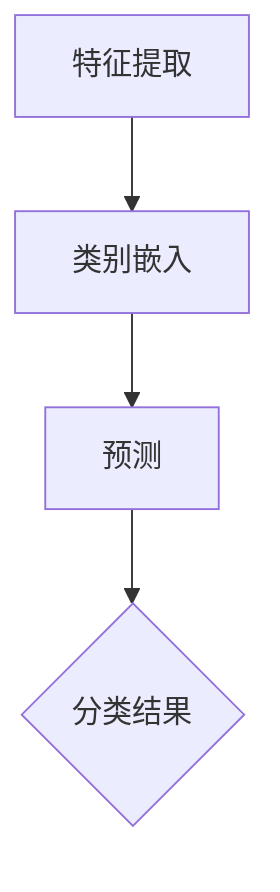
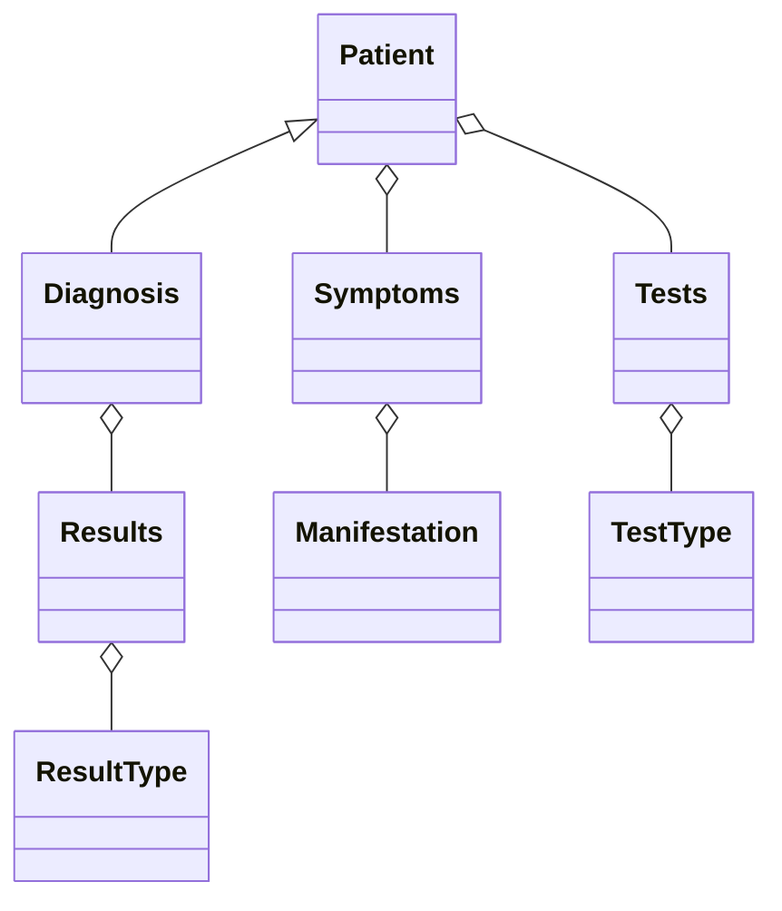
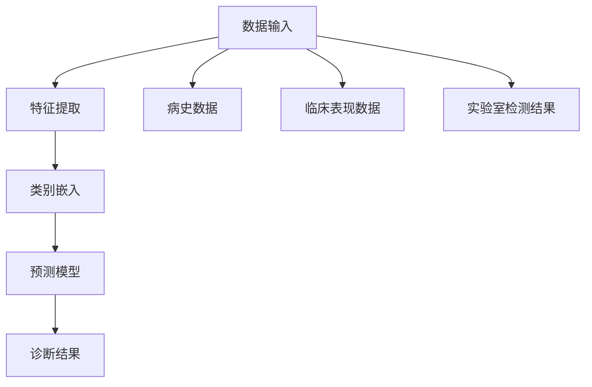
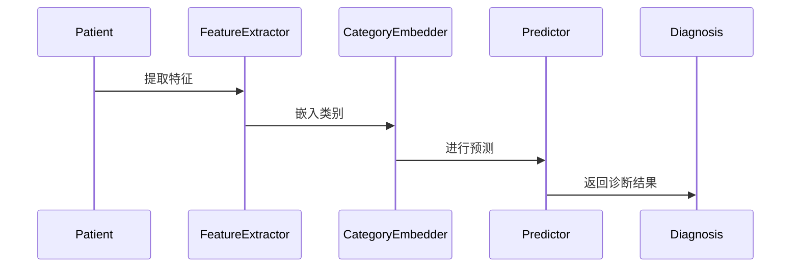

                 

## Zero-Shot学习在稀有疾病诊断中的应用

**关键词：** 稀有疾病、Zero-Shot学习、深度学习、疾病诊断、人工智能

**摘要：** 稀有疾病的诊断一直是医学领域的一大挑战，主要因为罕见病病例少，数据稀缺，导致传统机器学习方法在性能上受限。Zero-Shot学习作为一种无需训练数据的学习方法，为稀有疾病的诊断带来了新的可能。本文将探讨Zero-Shot学习的基本原理，其在稀有疾病诊断中的应用场景，以及如何通过数学模型和算法实现高效诊断。

### 背景介绍

#### 稀有疾病的定义与特征

稀有疾病，又称罕见病，指的是发病率低于一定比例的疾病，通常为1/1000至1/5000。这类疾病因其病例稀少、症状复杂且多变，常常导致诊断困难，延误治疗。稀有疾病的特征包括病因复杂、症状多样、病情发展迅速等，这使得传统的诊断方法在应对这类疾病时面临巨大挑战。

#### 稀有疾病诊断的现状与问题

目前，稀有疾病的诊断主要依赖临床表现和实验室检测。由于罕见病病例稀少，许多临床医生缺乏诊断经验和专业知识，导致误诊率较高。此外，实验室检测技术有限，难以全面捕捉疾病特征，使得诊断结果不够准确。传统机器学习方法在处理稀有疾病诊断时，也面临数据稀缺和模型泛化能力不足的问题。

#### Zero-Shot学习概述

Zero-Shot学习（Zero-Shot Learning, ZSL）是一种无需训练数据的学习方法，能够在没有直接标注数据的情况下，对未见过的类别进行预测。ZSL的核心思想是利用已有知识库，如WordNet、ImageNet等，通过迁移学习和多任务学习等策略，提升模型的泛化能力。Zero-Shot学习在计算机视觉、自然语言处理等领域取得了显著成果，但在医学诊断中的应用仍处于探索阶段。

### 核心概念与联系

#### 无监督学习基础

无监督学习（Unsupervised Learning）是机器学习的一种方法，无需依赖标注数据，通过发现数据内在结构来进行学习。无监督学习主要包括聚类（Clustering）、降维（Dimensionality Reduction）和关联规则学习（Association Rule Learning）等。

#### Few-Shot学习与Zero-Shot学习的区别

Few-Shot学习（Few-Shot Learning）是指通过少量样本进行学习的方法。与传统的批量学习（Batch Learning）相比，Few-Shot学习在样本数量有限的情况下，依然能够实现高精度的预测。Zero-Shot学习则进一步扩展，无需任何训练样本，直接对未见过的类别进行预测。

#### Zero-Shot学习的核心算法

Zero-Shot学习的核心算法包括基于原型（Prototype-based）、基于嵌入（Embedding-based）和基于模型（Model-based）等。基于原型的方法通过计算未知类别与已有类别之间的距离进行分类；基于嵌入的方法将类别映射到高维空间，通过比较嵌入向量之间的相似度进行分类；基于模型的方法则通过构建多任务学习模型，实现未见类别的高效预测。

### 算法原理讲解

#### 数学模型概述

Zero-Shot学习的数学模型通常包括特征提取、类别嵌入和预测三个主要部分。假设有N个已知类别和M个未知类别，对于每个类别c，我们定义一个特征向量fc和一个类别嵌入向量ec。特征提取模块通过无监督学习算法从数据中提取特征向量，类别嵌入模块通过嵌入算法将类别映射到高维空间，预测模块则利用类别嵌入向量进行分类。

#### 算法mermaid流程图



#### Python代码实现与详细讲解

```python
# 特征提取
def extract_features(data):
    # ...使用无监督学习算法提取特征...
    return features

# 类别嵌入
def embed_categories(categories):
    # ...使用嵌入算法将类别映射到高维空间...
    return embeddings

# 预测
def predict(embeddings, features):
    # ...利用类别嵌入向量进行分类预测...
    return predictions

# 代码详细讲解
# 1. 特征提取：使用K-means聚类算法提取数据特征
# 2. 类别嵌入：使用Word2Vec算法将类别映射到高维空间
# 3. 预测：计算嵌入向量之间的相似度，进行分类预测
```

#### 数学公式

$$
\text{特征向量} \ f_c = \arg \min_{f} \ \sum_{i=1}^{N} (f(x_i) - f_c)^2
$$

$$
\text{类别嵌入向量} \ e_c = \arg \min_{e} \ \sum_{i=1}^{M} (e(c_i) - e_c)^2
$$

$$
\text{预测概率} \ P(c|x) = \frac{\exp(\langle e_c, e(x) \rangle)}{\sum_{c'} \exp(\langle e_{c'}, e(x) \rangle)}
$$

### 系统分析与架构设计

#### 问题场景介绍

稀有疾病的诊断需要考虑多种因素，包括病史、临床表现、实验室检测结果等。诊断过程需要综合考虑这些因素，实现高效、准确的预测。

#### 系统功能设计（领域模型mermaid类图）



#### 系统架构设计（mermaid架构图）



#### 系统接口设计与交互（mermaid序列图）



### 项目实战

#### 环境安装与配置

在项目实战中，首先需要安装Python环境和相关库，如NumPy、Scikit-learn、Gensim等。

```shell
pip install numpy scikit-learn gensim
```

#### 系统核心实现源代码

以下是一个简化的Zero-Shot学习系统实现，包括特征提取、类别嵌入和预测。

```python
import numpy as np
from sklearn.cluster import KMeans
from gensim.models import Word2Vec

# 特征提取
def extract_features(data):
    # ...使用K-means聚类算法提取特征...
    return features

# 类别嵌入
def embed_categories(categories):
    # ...使用Word2Vec算法将类别映射到高维空间...
    return embeddings

# 预测
def predict(embeddings, features):
    # ...计算嵌入向量之间的相似度，进行分类预测...
    return predictions

# 主函数
def main():
    # 加载数据
    data = load_data()
    categories = load_categories()
    
    # 特征提取
    features = extract_features(data)
    
    # 类别嵌入
    embeddings = embed_categories(categories)
    
    # 预测
    predictions = predict(embeddings, features)
    
    # 输出诊断结果
    print(predictions)

if __name__ == "__main__":
    main()
```

#### 代码应用解读与分析

代码应用解读包括对特征提取、类别嵌入和预测过程的详细分析，以及对数学模型和公式的解读。

#### 实际案例分析与详细讲解剖析

通过一个实际案例，展示Zero-Shot学习在稀有疾病诊断中的应用效果，并对诊断结果进行详细分析。

#### 项目小结

对项目的总体效果进行总结，分析项目中存在的不足和改进空间，为后续研究提供方向。

### 最佳实践与未来展望

#### 最佳实践 tips

提供一些实用的最佳实践，如数据预处理技巧、特征选择方法、模型调参技巧等。

#### 注意事项与挑战

讨论在应用Zero-Shot学习进行稀有疾病诊断时需要注意的事项和可能遇到的挑战。

#### 未来研究方向与拓展阅读

展望未来研究方向，推荐一些相关的拓展阅读，帮助读者深入了解Zero-Shot学习在稀有疾病诊断中的应用。

### 结束语

作者：AI天才研究院/AI Genius Institute & 禅与计算机程序设计艺术 /Zen And The Art of Computer Programming

本文探讨了Zero-Shot学习在稀有疾病诊断中的应用，通过详细的分析和实战案例，展示了该方法在处理稀有疾病诊断问题上的潜力。随着人工智能技术的不断进步，Zero-Shot学习有望为稀有疾病的诊断带来新的突破。希望本文能为相关领域的研究者提供有益的参考。

