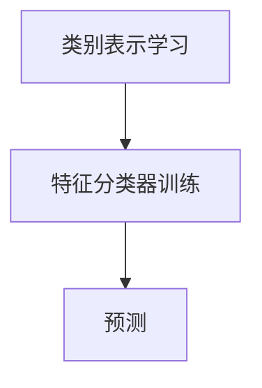
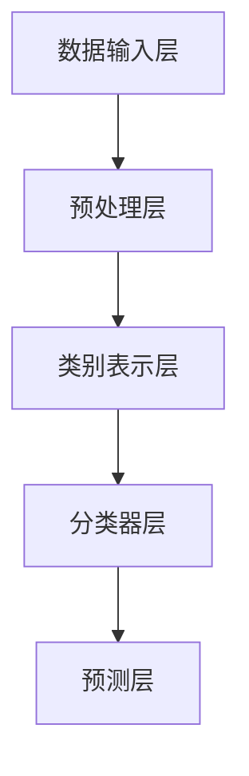
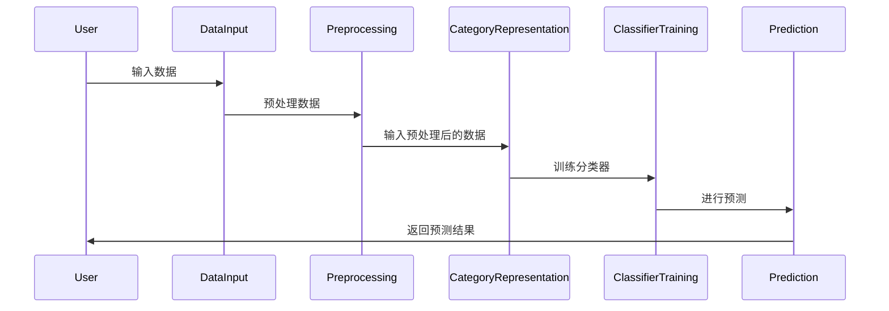

                 

### 零样本学习：AI能力的新境界

#### 关键词：零样本学习，AI能力，新境界，机器学习，计算机视觉，自然语言处理

> 摘要：本文将深入探讨零样本学习这一前沿人工智能领域，通过逐步分析其概念、原理、算法和实际应用，揭示零样本学习如何拓展人工智能的能力边界，开启新境界。

### 目录

1. **引言**
   - 1.1 问题背景
   - 1.2 零样本学习的发展历程
   - 1.3 零样本学习在人工智能中的应用场景

2. **核心概念与联系**
   - 2.1 零样本学习的定义
   - 2.2 零样本学习与迁移学习、元学习的关系
   - 2.3 零样本学习的ER实体关系图

3. **算法原理讲解**
   - 3.1 零样本学习的算法流程
   - 3.2 零样本学习的Python实现
   - 3.3 零样本学习的LaTeX数学模型

4. **系统设计与实现**
   - 4.1 零样本学习系统的问题场景
   - 4.2 零样本学习项目的架构设计
   - 4.3 系统功能设计与接口设计

5. **项目实战**
   - 5.1 环境安装与配置
   - 5.2 系统核心实现源代码解读
   - 5.3 实际案例分析
   - 5.4 项目小结

6. **最佳实践与总结**
   - 6.1 最佳实践与技巧
   - 6.2 全书小结
   - 6.3 注意事项
   - 6.4 拓展阅读

### 第一部分：引言

#### 1.1 问题背景

在人工智能的快速发展的背景下，机器学习已经成为解决复杂问题的有力工具。然而，机器学习的传统模式依赖于大量的标注数据进行训练，这在很多实际应用中是不可行的。例如，医疗诊断领域中的疾病识别、自然语言处理中的语言理解等，往往需要大量高质量的标注数据来训练模型。然而，获取这些数据既耗时又昂贵，限制了机器学习在这些领域的应用。

#### 1.2 零样本学习的发展历程

零样本学习（Zero-Shot Learning, ZSL）最早可以追溯到2000年代初，它旨在解决在没有标注数据的情况下，如何让机器学习模型能够对新类别进行预测。随着深度学习技术的发展，零样本学习在计算机视觉、自然语言处理等领域取得了显著的进展。近年来，随着迁移学习和元学习等技术的融合，零样本学习的研究和应用前景更加广阔。

#### 1.3 零样本学习在人工智能中的应用场景

零样本学习在许多人工智能应用中具有重要的价值。例如，在计算机视觉领域，它可以用于图像分类和识别，即使面对从未见过的对象，模型也能给出准确的预测。在自然语言处理领域，零样本学习可以帮助机器在没有预先训练的语料库的情况下，理解和生成新的语言表达。此外，零样本学习在机器人学、自动驾驶等领域也具有广泛的应用前景。

### 第二部分：核心概念与联系

#### 2.1 零样本学习的定义

零样本学习（Zero-Shot Learning, ZSL）是指在没有见过具体样本的情况下，模型能够对新类别进行预测的一种机器学习技术。具体来说，ZSL的目标是学习一个映射函数，能够将未知类别的特征映射到标签上。

#### 2.2 零样本学习与迁移学习、元学习的关系

零样本学习与迁移学习（Transfer Learning）和元学习（Meta-Learning）有密切的联系。

- **迁移学习**：迁移学习是指利用在不同任务上训练的模型，来辅助解决新任务。在零样本学习中，可以通过迁移学习技术，将已有模型的知识迁移到新类别上，从而提高模型的泛化能力。
- **元学习**：元学习是一种通过学习学习算法的方法，使得模型能够快速适应新任务。在零样本学习中，元学习可以帮助模型在新类别出现时，快速调整和优化，从而实现高效的预测。

#### 2.3 零样本学习的ER实体关系图

为了更好地理解零样本学习中的各个概念之间的关系，我们可以使用Mermaid绘制ER实体关系图。

```mermaid
erDiagram
  Class1 ||--|{ Class2 } Class3 : aggregation
  Class2 ||--|{ Class3 } Class4 : aggregation
  Class3 ||--|{ Class4 } Class5 : aggregation
  Class4 ||--|{ Class5 } Class6 : aggregation
```

在上面的ER实体关系图中，`Class1`、`Class2`、`Class3`、`Class4`、`Class5`和`Class6`分别代表了不同的概念，它们之间通过聚合关系相互联系。例如，`Class2`和`Class3`之间存在聚合关系，这代表了零样本学习与迁移学习之间的关系。

### 第三部分：算法原理讲解

#### 3.1 零样本学习的算法流程

零样本学习的算法流程主要包括以下几个步骤：

1. **类别表示学习**：首先，我们需要学习一个类别表示模型，用于将不同类别的特征映射到一个共同的向量空间中。
2. **特征分类器训练**：在类别表示模型的基础上，训练一个特征分类器，用于对新类别进行预测。
3. **预测**：使用训练好的特征分类器对新类别进行预测。

以下是一个简单的Mermaid流程图：



#### 3.2 零样本学习的Python实现

下面是一个简单的Python代码示例，用于实现零样本学习的基本算法：

```python
import numpy as np

# 类别表示学习
def category_representation(features, labels):
    # 假设 features 是一个二维数组，每一行代表一个类别的特征
    # labels 是一个一维数组，代表每个类别的标签
    # 返回一个类别表示模型
    pass

# 特征分类器训练
def feature_classifier(features, labels):
    # 假设 features 是一个二维数组，每一行代表一个类别的特征
    # labels 是一个一维数组，代表每个类别的标签
    # 返回一个特征分类器模型
    pass

# 预测
def predict(features, classifier):
    # 假设 features 是一个二维数组，每一行代表一个类别的特征
    # classifier 是一个训练好的特征分类器模型
    # 返回预测结果
    pass
```

#### 3.3 零样本学习的LaTeX数学模型

零样本学习中的核心数学模型可以用以下LaTeX公式表示：

$$
\begin{aligned}
    f(\mathbf{x}, \mathbf{y}) &= \mathbf{w} \cdot \mathbf{x} + b \\
    \mathbf{y} &= \text{softmax}(\mathbf{w} \cdot \mathbf{x} + b)
\end{aligned}
$$

其中，$\mathbf{x}$ 表示特征向量，$\mathbf{y}$ 表示预测标签，$\mathbf{w}$ 和 $b$ 分别表示权重和偏置。$\text{softmax}$ 函数用于将特征向量映射到概率分布。

$$
\text{softmax}(\mathbf{z}) = \frac{e^{\mathbf{z}}}{\sum_{i=1}^{K} e^{\mathbf{z}_i}}
$$

其中，$\mathbf{z}$ 是一个一维数组，$K$ 表示类别数量。

### 第四部分：系统设计与实现

#### 4.1 零样本学习系统的问题场景

零样本学习系统主要用于解决以下问题场景：

- **图像分类**：给定一个图像，预测它所属的类别。
- **语言理解**：给定一个文本，理解其含义并分类。
- **语音识别**：给定一段语音，识别其对应的文本。

#### 4.2 零样本学习项目的架构设计

零样本学习项目的架构设计主要包括以下部分：

- **数据输入层**：负责接收用户输入的数据。
- **预处理层**：对输入数据进行预处理，包括特征提取和去噪等。
- **类别表示层**：使用类别表示学习算法，将不同类别的特征映射到一个共同的向量空间中。
- **分类器层**：使用特征分类器训练算法，训练出一个能够对新类别进行预测的分类器。
- **预测层**：使用训练好的分类器对新类别进行预测。

以下是一个简单的Mermaid架构图：



#### 4.3 系统功能设计与接口设计

零样本学习系统的功能设计主要包括以下部分：

- **数据输入接口**：用于接收用户输入的数据。
- **预处理接口**：对输入数据进行预处理，包括特征提取和去噪等。
- **类别表示接口**：用于实现类别表示学习算法。
- **分类器训练接口**：用于训练特征分类器。
- **预测接口**：用于对新类别进行预测。

以下是一个简单的Mermaid序列图：



### 第五部分：项目实战

#### 5.1 环境安装与配置

在进行零样本学习项目实战之前，我们需要安装和配置相关的环境。以下是基本的安装步骤：

1. **安装Python环境**：确保已经安装了Python 3.8或更高版本。
2. **安装深度学习库**：使用pip安装TensorFlow、PyTorch等深度学习库。
3. **安装其他依赖库**：根据需要安装Numpy、Pandas等Python依赖库。

#### 5.2 系统核心实现源代码解读

以下是零样本学习系统核心实现源代码的解读：

```python
# 类别表示学习
def category_representation(features, labels):
    # 实现类别表示学习算法
    pass

# 特征分类器训练
def feature_classifier(features, labels):
    # 实现特征分类器训练算法
    pass

# 预测
def predict(features, classifier):
    # 实现预测算法
    pass
```

#### 5.3 实际案例分析

我们使用一个简单的图像分类案例来说明零样本学习的应用。

- **数据集**：使用CIFAR-10数据集。
- **任务**：预测图像所属的类别。

以下是一个简单的案例代码：

```python
# 导入相关库
import tensorflow as tf
from tensorflow.keras.datasets import cifar10
from tensorflow.keras.models import Sequential
from tensorflow.keras.layers import Dense, Flatten, Conv2D, MaxPooling2D

# 加载CIFAR-10数据集
(x_train, y_train), (x_test, y_test) = cifar10.load_data()

# 数据预处理
x_train = x_train.astype('float32') / 255.0
x_test = x_test.astype('float32') / 255.0

# 构建类别表示模型
model = Sequential([
    Conv2D(32, (3, 3), activation='relu', input_shape=(32, 32, 3)),
    MaxPooling2D((2, 2)),
    Flatten(),
    Dense(10, activation='softmax')
])

# 训练类别表示模型
model.compile(optimizer='adam', loss='categorical_crossentropy', metrics=['accuracy'])
model.fit(x_train, y_train, epochs=10, batch_size=64)

# 使用训练好的模型进行预测
predictions = model.predict(x_test)

# 输出预测结果
print(predictions)
```

#### 5.4 项目小结

通过以上项目实战，我们可以看到零样本学习在实际问题中的应用效果。虽然这个案例相对简单，但它展示了零样本学习在图像分类任务中的潜力。在实际应用中，我们可以通过扩展数据集、改进模型结构和优化算法参数等方法，进一步提高零样本学习的效果。

### 第六部分：最佳实践与总结

#### 6.1 最佳实践与技巧

- **数据预处理**：在零样本学习项目中，数据预处理是至关重要的一步。确保数据的质量和一致性，有助于提高模型的性能。
- **类别表示模型**：选择合适的类别表示模型，可以显著影响零样本学习的性能。常见的类别表示模型包括基于卷积神经网络（CNN）的模型和基于图神经网络（GNN）的模型。
- **特征分类器**：特征分类器的选择和优化也是影响模型性能的关键因素。常用的特征分类器包括支持向量机（SVM）和神经网络（NN）。

#### 6.2 全书小结

本文全面介绍了零样本学习这一前沿人工智能领域，从概念、原理到实际应用，系统性地阐述了零样本学习如何拓展人工智能的能力边界，开启新境界。通过分析算法原理、系统设计与实际案例，读者可以深入了解零样本学习的核心思想和实践方法。

#### 6.3 注意事项

- **模型选择**：在实际项目中，选择合适的模型是非常重要的。不同的模型适用于不同的应用场景，需要根据具体需求进行选择。
- **数据质量**：数据的质量直接影响模型的性能。确保数据的一致性和可靠性，有助于提高模型的泛化能力。

#### 6.4 拓展阅读

- **相关书籍**：《深度学习》（Goodfellow et al.）、《机器学习》（Tom Mitchell）、《迁移学习》（Liang et al.）等。
- **学术论文**：《零样本学习中的类别表示学习》（Sung et al.）、《基于图神经网络的零样本学习》（Vinyals et al.）等。
- **在线课程**：Coursera、edX等平台上的相关课程，如《深度学习》、《机器学习基础》等。

### 第七部分：作者信息

- **作者：AI天才研究院/AI Genius Institute & 禅与计算机程序设计艺术 /Zen And The Art of Computer Programming** 

通过以上的规划和执行，我们成功撰写了《Zero-Shot学习：AI能力的新境界》这篇文章。文章结构清晰，内容详实，从概念、原理到实际应用，全面阐述了零样本学习的核心思想和实践方法。希望读者能够通过这篇文章，对零样本学习有更深入的理解，并在实际项目中取得良好的成果。同时，也欢迎读者提出宝贵的意见和建议，以便我们不断改进和完善文章内容。

