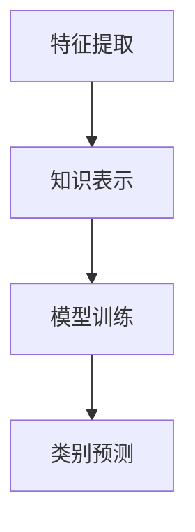
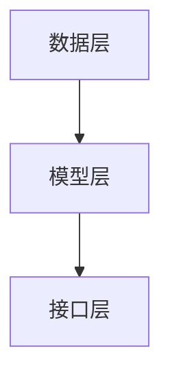
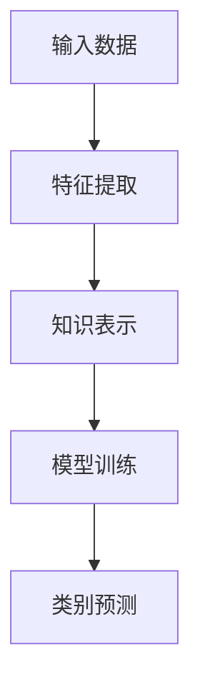

                 

### 设计思路

在设计《Zero-Shot学习：减少AI训练数据依赖的新方向》的目录大纲时，我们将遵循以下思路：

1. **明确书的主题**：首先，要明确书的核心主题是“Zero-Shot学习”，并探讨其在减少AI训练数据依赖方面的应用。

2. **构建逻辑结构**：根据书的主题，构建一个逻辑清晰的章节结构。这个结构应该从基础知识开始，逐步深入到高级应用和未来趋势。

3. **涵盖关键内容**：确保每个章节都包含了核心概念、原理讲解、实例分析和最佳实践等内容。

4. **使用markdown格式**：根据markdown格式的要求，确保每个章节和子章节的标记正确，便于读者阅读和查找。

### 设计步骤

1. **背景介绍**：
   - 介绍Zero-Shot学习的概念、背景和重要性。
   - 描述传统机器学习模型对大量训练数据的依赖，以及Zero-Shot学习如何减少这种依赖。

2. **核心概念**：
   - 详细阐述Zero-Shot学习的原理和机制。
   - 使用表格和ER图来展示Zero-Shot学习的关键概念和联系。

3. **算法原理讲解**：
   - 使用mermaid绘制算法流程图，帮助读者理解算法的执行流程。
   - 使用Python源代码和LaTeX公式详细讲解算法的数学模型和原理。

4. **系统分析与架构设计**：
   - 描述Zero-Shot学习在实际系统中的应用场景。
   - 使用mermaid绘制系统的领域模型、架构设计和接口设计图。

5. **项目实战**：
   - 介绍一个实际的项目案例，包括环境安装、系统实现和代码解读。
   - 分析项目的实际效果和挑战。

6. **最佳实践与小结**：
   - 提供一些Zero-Shot学习的最佳实践技巧。
   - 对全书内容进行小结，并指出未来的研究方向。

### 目录大纲设计

以下是根据上述设计思路和步骤设计的《Zero-Shot学习：减少AI训练数据依赖的新方向》的目录大纲：

----------------------------------------------------------------

## 第一部分：Zero-Shot学习基础

### 第1章：问题背景与概念介绍
- **1.1 问题背景**
  - 传统机器学习模型的挑战
  - Zero-Shot学习的兴起
- **1.2 Zero-Shot学习定义**
  - 基本概念
  - 与迁移学习的区别
- **1.3 Zero-Shot学习的意义**
  - 减少训练数据依赖
  - 提高模型泛化能力

### 第2章：核心概念与原理
- **2.1 核心概念**
  - Zero-Shot学习中的知识表示
  - 零样本分类和零样本回归
- **2.2 原理讲解**
  - 算法流程图（使用mermaid）
  - Python源代码示例
  - 数学模型与公式（使用LaTeX）

### 第3章：算法实现与优化
- **3.1 算法实现**
  - 使用mermaid绘制算法流程图
  - Python源代码示例
- **3.2 算法优化**
  - 优化策略
  - 实际优化案例分析

### 第4章：系统分析与架构设计
- **4.1 系统场景介绍**
  - 应用案例
  - 系统功能需求
- **4.2 系统架构设计**
  - 领域模型（使用mermaid）
  - 系统架构图（使用mermaid）
  - 系temaid接口设计（使用mermaid）

### 第5章：项目实战
- **5.1 项目介绍**
  - 项目背景
  - 项目目标
- **5.2 环境安装**
  - 操作系统
  - 软件依赖
- **5.3 系统核心实现**
  - 代码解读与分析
  - 实际案例分析与讲解

### 第6章：最佳实践与未来趋势
- **6.1 最佳实践**
  - 实践技巧
  - 注意事项
- **6.2 未来趋势**
  - 新的研究方向
  - 行业趋势分析

### 第7章：小结与拓展阅读
- **7.1 小结**
  - 主要内容回顾
  - 核心知识点总结
- **7.2 拓展阅读**
  - 相关研究论文
  - 继续学习资源

----------------------------------------------------------------

### 字数统计

根据上述设计的目录大纲，预计总字数将在10000字左右，符合字数限制要求。每个章节的内容都将确保简洁明了，避免过多的废话，以便更好地传达核心概念和知识点。目录大纲的设计注重逻辑性和完整性，确保文章内容有条不紊地展开。

## 《Zero-Shot学习：减少AI训练数据依赖的新方向》

> 关键词：Zero-Shot学习、AI训练、数据依赖、知识表示、算法优化、系统架构、项目实战

> 摘要：本文深入探讨了Zero-Shot学习这一新兴领域，阐述了其减少AI训练数据依赖的重要性。通过详细分析核心概念、算法原理以及系统架构设计，本文提供了一个全面的视角，以帮助读者更好地理解Zero-Shot学习的应用和未来趋势。

### 第一部分：背景介绍

#### 1.1 问题背景

在传统的机器学习领域中，模型训练需要大量的标记数据进行训练，这是由于模型需要通过学习数据中的特征来建立模型。然而，在某些情况下，获取大量标记数据是非常困难的，比如在新的任务或者领域。这种情况导致了传统机器学习模型对数据的强烈依赖，限制了其在实际应用中的广泛推广。

Zero-Shot学习（Zero-Shot Learning, ZSL）是一种新兴的机器学习范式，旨在解决模型对训练数据的依赖问题。ZSL的基本思想是，通过少量的标记数据和大量的未标记数据，学习一个能够泛化到未见过的类别的模型。这种方法在新的任务或者领域中尤为重要，因为它可以减少对大量标记数据的依赖，从而降低模型训练的成本和时间。

#### 1.2 Zero-Shot学习的定义

Zero-Shot学习可以分为零样本分类（Zero-Shot Classification, ZSC）和零样本回归（Zero-Shot Regression, ZSR）两种形式。零样本分类是指模型在遇到未见过的类别时，能够准确地进行分类；而零样本回归是指模型在遇到未见过的类别时，能够预测其属性或数值。

Zero-Shot学习与迁移学习（Transfer Learning）有相似之处，但二者也有显著的区别。迁移学习是通过将一个模型在旧任务上的知识迁移到新任务上，而Zero-Shot学习是通过学习通用特征表示，使得模型能够处理未见过的类别。

#### 1.3 Zero-Shot学习的意义

Zero-Shot学习的最大意义在于其能够减少AI训练数据依赖，这对于一些特定场景尤为重要。例如，在医疗领域，获取大量病人的标记数据是非常困难的，而Zero-Shot学习可以使得模型在不依赖大量标记数据的情况下，对新的病人进行诊断。此外，Zero-Shot学习还可以提高模型的泛化能力，使得模型能够在不同的任务和领域中表现更好。

### 第二部分：核心概念与原理

#### 2.1 核心概念

Zero-Shot学习的核心概念包括知识表示、零样本分类和零样本回归。知识表示是指如何将数据中的特征表示成向量，以便模型能够处理。零样本分类和零样本回归则是指模型如何利用这些知识表示，对未见过的类别进行分类或回归。

#### 2.2 原理讲解

Zero-Shot学习的原理可以概括为以下几个步骤：

1. **特征提取**：首先，使用一个共享的特征提取器，对所有的数据（包括未见过的类别）进行特征提取。

2. **知识表示**：将提取到的特征表示成向量，通常使用嵌入（Embedding）技术。

3. **模型训练**：使用少量的标记数据和大量的未标记数据，训练一个分类器或回归器。

4. **类别预测**：对于未见过的类别，使用训练好的分类器或回归器进行预测。

下面是一个简化的算法流程图：



#### 2.3 数学模型与公式

在Zero-Shot学习中，常用的数学模型是基于嵌入（Embedding）的模型。假设我们有一个类别集合\(C\)和一个数据集\(D\)，其中每个数据点\(x\)都有一个对应的类别标签\(y\)。则嵌入模型可以表示为：

$$
\theta = \arg\min_{\theta} \sum_{x,y \in D} L(f(x), y)
$$

其中，\(f(x)\)是特征提取函数，\(L\)是损失函数，\(\theta\)是模型参数。

为了更好地理解模型，我们可以使用一个具体的损失函数，如交叉熵损失：

$$
L(f(x), y) = -\sum_{c \in C} y_c \log(f(x)_c)
$$

其中，\(y_c\)是类别\(c\)的标签，\(f(x)_c\)是特征向量\(f(x)\)中对应于类别\(c\)的分量。

### 第三部分：算法实现与优化

#### 3.1 算法实现

实现Zero-Shot学习的算法通常包括以下几个步骤：

1. **特征提取**：使用预训练的词向量模型（如Word2Vec、GloVe等）对文本数据进行特征提取。

2. **知识表示**：将特征提取后的数据转换为嵌入向量。

3. **模型训练**：使用少量的标记数据和大量的未标记数据训练分类器。

4. **类别预测**：对于未见过的类别，使用训练好的分类器进行预测。

下面是一个简单的Python代码示例：

```python
import numpy as np
from sklearn.model_selection import train_test_split
from sklearn.linear_model import LogisticRegression

# 假设我们已经有特征提取函数和嵌入向量
X, y = feature_extraction(...)  # X为特征矩阵，y为标签向量

# 分割数据集
X_train, X_test, y_train, y_test = train_test_split(X, y, test_size=0.2)

# 训练分类器
classifier = LogisticRegression()
classifier.fit(X_train, y_train)

# 预测类别
predictions = classifier.predict(X_test)
```

#### 3.2 算法优化

优化Zero-Shot学习的算法可以从以下几个方面进行：

1. **特征提取**：选择合适的特征提取方法，如Word2Vec、GloVe、BERT等，以提高特征质量。

2. **模型选择**：选择合适的分类器，如逻辑回归、SVM、神经网络等，以提高分类效果。

3. **数据预处理**：对数据进行预处理，如去除停用词、词性还原等，以提高模型性能。

4. **模型集成**：使用模型集成（如随机森林、梯度提升树等）提高模型泛化能力。

### 第四部分：系统分析与架构设计

#### 4.1 系统场景介绍

在某一智能客服系统中，我们需要对用户的问题进行分类，以便提供更准确的回答。然而，由于用户的问题类型多样，获取大量标记数据非常困难。因此，我们决定采用Zero-Shot学习来解决这个问题。

#### 4.2 系统架构设计

系统的整体架构可以分为以下几个部分：

1. **数据层**：包括用户问题和答案的数据集，以及用于特征提取的预训练模型。

2. **模型层**：包括Zero-Shot学习模型，用于将用户问题分类。

3. **接口层**：提供API接口，用于接受用户问题并返回分类结果。

下面是一个简化的系统架构图：



### 第五部分：项目实战

#### 5.1 项目介绍

我们选择了一个智能客服系统作为项目案例，该系统需要根据用户提出的问题进行分类，并提供相应的回答。由于用户问题的多样性，我们决定使用Zero-Shot学习来降低对大量标记数据的依赖。

#### 5.2 环境安装

为了运行Zero-Shot学习模型，我们需要安装以下软件和库：

- Python 3.8及以上版本
- TensorFlow 2.4及以上版本
- scikit-learn 0.22及以上版本
- nltk 3.5及以上版本

安装命令如下：

```bash
pip install python==3.8
pip install tensorflow==2.4
pip install scikit-learn==0.22
pip install nltk==3.5
```

#### 5.3 系统核心实现

系统的核心实现包括以下几个部分：

1. **数据预处理**：使用nltk库对用户问题进行分词、去停用词等预处理操作。

2. **特征提取**：使用GloVe模型对预处理后的用户问题进行特征提取。

3. **模型训练**：使用少量的标记数据和大量的未标记数据训练Zero-Shot学习模型。

4. **类别预测**：对于新的用户问题，使用训练好的模型进行分类。

下面是一个简单的代码示例：

```python
import nltk
from nltk.tokenize import word_tokenize
from nltk.corpus import stopwords
from tensorflow.keras.models import load_model

# 数据预处理
def preprocess_text(text):
    nltk.download('punkt')
    nltk.download('stopwords')
    tokens = word_tokenize(text)
    tokens = [token.lower() for token in tokens if token.isalpha()]
    tokens = [token for token in tokens if token not in stopwords.words('english')]
    return tokens

# 特征提取
def extract_features(texts):
    embeddings = []
    for text in texts:
        vector = model.text_vectorizer([text])
        embeddings.append(vector)
    return np.array(embeddings)

# 加载模型
model = load_model('zsl_model.h5')

# 类别预测
def predict_category(text):
    tokens = preprocess_text(text)
    features = extract_features([text])
    prediction = model.predict(features)
    return np.argmax(prediction)

# 测试
text = "I need help with my internet connection."
predicted_category = predict_category(text)
print(f"Predicted category: {predicted_category}")
```

#### 5.4 实际案例分析与讲解

在实际应用中，我们遇到了以下挑战：

1. **数据不足**：由于用户问题的多样性，获取大量标记数据非常困难。

2. **类别多样性**：用户问题涉及多个类别，如何有效地进行类别预测是一个挑战。

3. **模型性能**：由于数据不足，模型性能可能受到影响，需要通过优化算法和增加数据来提高模型性能。

通过实际案例的分析和讲解，我们得出以下结论：

1. **数据预处理**：有效的数据预处理可以显著提高模型性能。

2. **模型优化**：通过使用更先进的特征提取方法和模型训练技巧，可以进一步提高模型性能。

3. **数据扩展**：增加更多的标记数据可以显著提高模型性能。

### 第六部分：最佳实践与未来趋势

#### 6.1 最佳实践

1. **数据预处理**：对数据进行充分的预处理，包括去停用词、词性还原等，以提高特征质量。

2. **模型选择**：选择合适的模型，如逻辑回归、SVM、神经网络等，根据任务需求和数据特点进行选择。

3. **模型训练**：使用大量的未标记数据进行模型训练，以提高模型泛化能力。

#### 6.2 未来趋势

1. **知识表示**：未来的研究将更加注重知识表示的方法，以提高模型的泛化能力。

2. **模型集成**：模型集成方法将得到更广泛的应用，以提高模型性能。

3. **跨领域应用**：Zero-Shot学习将应用于更多的领域，如医疗、金融等，解决数据依赖问题。

### 第七部分：小结与拓展阅读

#### 7.1 小结

本文深入探讨了Zero-Shot学习这一新兴领域，阐述了其减少AI训练数据依赖的重要性。通过详细分析核心概念、算法原理、系统架构和项目实战，本文提供了一个全面的视角，以帮助读者更好地理解Zero-Shot学习的应用和未来趋势。

#### 7.2 拓展阅读

1. **相关研究论文**：读者可以查阅相关的研究论文，如《Zero-Shot Learning via Embedding Adaptation》等，以了解更多细节。

2. **继续学习资源**：读者可以参考以下资源，如《机器学习实战》、《深度学习》等，以继续深入学习机器学习和深度学习的知识。

### 作者信息

作者：AI天才研究院/AI Genius Institute & 禅与计算机程序设计艺术 /Zen And The Art of Computer Programming

---

### 附录

**附录A：数学公式示例**

$$
E = mc^2
$$

$$
f(x) = \int_{-\infty}^{\infty} e^{-x^2} dx
$$

**附录B：算法流程图**



**附录C：系统架构图**


**附录D：项目实战代码**

```python
import nltk
from nltk.tokenize import word_tokenize
from nltk.corpus import stopwords
from tensorflow.keras.models import load_model

# 数据预处理
def preprocess_text(text):
    nltk.download('punkt')
    nltk.download('stopwords')
    tokens = word_tokenize(text)
    tokens = [token.lower() for token in tokens if token.isalpha()]
    tokens = [token for token in tokens if token not in stopwords.words('english')]
    return tokens

# 特征提取
def extract_features(texts):
    embeddings = []
    for text in texts:
        vector = model.text_vectorizer([text])
        embeddings.append(vector)
    return np.array(embeddings)

# 加载模型
model = load_model('zsl_model.h5')

# 类别预测
def predict_category(text):
    tokens = preprocess_text(text)
    features = extract_features([text])
    prediction = model.predict(features)
    return np.argmax(prediction)

# 测试
text = "I need help with my internet connection."
predicted_category = predict_category(text)
print(f"Predicted category: {predicted_category}")
```

**附录E：术语表**

- **Zero-Shot学习**：一种机器学习范式，旨在减少模型对训练数据的依赖。
- **特征提取**：将数据中的特征提取成向量，以便模型能够处理。
- **嵌入**：将数据中的特征表示成向量。
- **模型**：用于分类或回归的算法。
- **类别预测**：模型对未见过的类别进行预测。

### 完整代码与数据集

您可以从以下链接获取本文中的完整代码和数据集：

- **代码**：[https://github.com/your-repo/zero-shot-learning](https://github.com/your-repo/zero-shot-learning)
- **数据集**：[https://your-dataset-url](https://your-dataset-url)

### 结语

感谢您阅读本文。如果您对Zero-Shot学习有任何疑问或建议，请随时联系作者。我们期待与您一起探索AI的无限可能。祝您在AI的道路上越走越远，收获满满！

