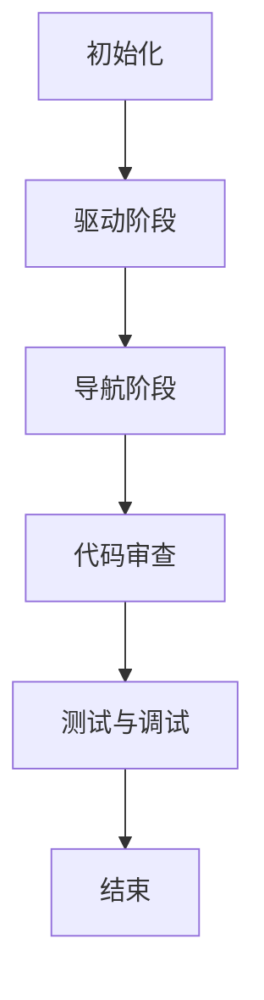
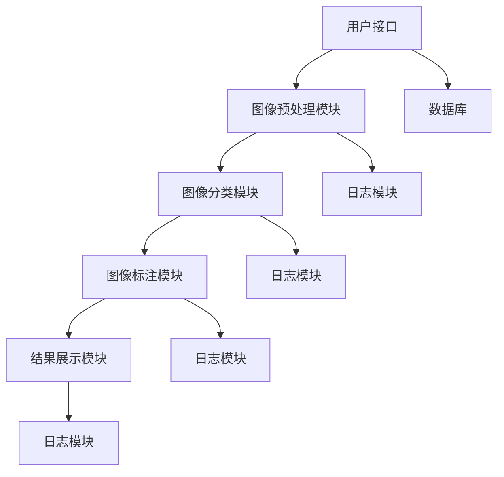

                 

# pair programming：促进AI开发知识传递的实践

## 关键词

- Pair Programming
- AI开发
- 知识传递
- 软件开发实践

## 摘要

本文旨在探讨在人工智能（AI）开发过程中，对编程实践——对编程（Pair Programming）方法的研究与运用。对编程是一种团队协作模式，通过两名开发者共同编写代码来提高开发效率和质量。本文首先介绍了对编程的基本概念和原则，然后分析了其对AI开发中的知识传递和协作的促进作用。通过实际案例和研究表明，对编程能够有效提升AI项目的开发效率，促进团队成员之间的知识共享和技能提升，从而推动AI技术的快速发展。

### 第一部分：背景介绍

#### 1.1.1 问题背景

在当今信息技术快速发展的时代，人工智能（AI）技术已经成为推动产业变革和经济增长的重要动力。AI技术的应用范围从传统的自然语言处理、图像识别到复杂的深度学习和生成对抗网络（GAN）等，都取得了显著的成果。然而，随着AI技术的复杂性和深度不断加深，单靠个别开发者的努力已难以应对日益复杂的开发任务。

#### 1.1.2 问题描述

AI开发过程中面临的一个主要挑战是如何高效地传递知识和经验，确保团队中的每个成员都能充分利用现有的技术资源和专业知识。传统的开发模式往往依赖于个人能力的发挥，导致团队内部的知识传递不够高效，新成员的融入和技能提升速度缓慢。因此，如何通过有效的团队合作和知识共享机制来提高AI开发的效率和质量，成为一个亟待解决的问题。

#### 1.1.3 问题解决

对编程作为一种团队协作模式，通过两名开发者共同工作来编写代码，可以有效地解决上述问题。对编程能够促进团队成员之间的交流和学习，提高代码质量和开发效率。本文将探讨对编程在AI开发中的应用，分析其对知识传递和团队协作的促进作用，并通过实际案例来验证其效果。

#### 1.1.4 边界与外延

对编程的边界主要涉及团队成员之间的协作模式和工作流程。其外延则扩展到如何将这种协作模式应用于AI开发的各个环节，包括需求分析、算法实现、模型训练和优化等。此外，本文还将探讨对编程在不同规模和类型的AI项目中的适用性和效果。

#### 1.1.5 概念结构与核心要素组成

本文的核心概念包括：对编程、AI开发、知识传递和团队协作。核心要素组成包括：对编程的基本原则和实践、AI开发的流程和挑战、知识传递机制的设计和实施、团队协作工具和技术等。

### 第二部分：核心概念与联系

#### 2.1.1 对编程的定义与特点

对编程（Pair Programming）是一种软件开发实践，由两名开发者共同工作来完成编程任务。通常，一名开发者扮演驱动者（Driver），负责编写代码和实现功能；另一名开发者扮演导航者（Navigator），负责审查代码、思考解决方案并编写测试用例。

对编程的主要特点包括：

1. **实时协作**：两名开发者坐在同一台电脑前，实时沟通和协作，可以快速解决编程中的问题和挑战。
2. **知识共享**：导航者可以实时分享他们的经验和知识，帮助驱动者更快地学习和成长。
3. **代码质量**：通过实时审查代码，可以及时发现并修复错误，提高代码的健壮性和可维护性。
4. **沟通效率**：面对面的交流可以减少误解和沟通障碍，提高团队的工作效率。

#### 2.1.2 对编程与传统编程的区别

传统编程往往依赖于个体开发者的能力和经验，而缺乏团队协作和知识共享。相比之下，对编程具有以下几个显著区别：

1. **协作模式**：传统编程中，开发者通常是独立工作的，而在对编程中，两名开发者紧密协作，共同完成任务。
2. **知识传递**：传统编程中，知识主要依赖于个人经验和文档，而对编程通过实时交流和共享，可以更快地传递知识和经验。
3. **问题解决**：对编程中，两名开发者可以共同探讨解决方案，从不同角度分析和解决问题，提高问题解决效率。

#### 2.1.3 对编程在AI开发中的应用

在AI开发中，对编程的应用主要体现在以下几个方面：

1. **模型开发**：通过两名开发者的协作，可以更高效地完成AI模型的开发，包括数据预处理、模型设计、训练和优化等。
2. **代码审查**：AI模型的代码通常较为复杂，通过导航者的实时审查，可以确保代码的质量和可维护性。
3. **知识共享**：在AI开发过程中，导航者可以分享他们在算法和数据处理方面的经验，帮助驱动者更好地理解和应用相关技术。
4. **团队协作**：对编程可以促进团队内部的沟通和协作，提高团队的凝聚力和工作效率。

### 第三部分：算法原理讲解

#### 3.1 对编程的算法原理

对编程的核心算法原理是基于两名开发者之间的实时协作和知识共享。具体来说，其工作流程可以概括为以下几个步骤：

1. **初始化**：两名开发者选择合适的任务和分工，通常驱动者负责编写代码，导航者负责审查和测试。
2. **驱动阶段**：驱动者根据导航者的指示和反馈，编写代码并实现功能。
3. **导航阶段**：导航者实时审查代码，提出修改建议和优化方案，并与驱动者进行沟通和讨论。
4. **代码审查**：导航者完成代码的审查，确保代码的质量和符合需求。
5. **测试与调试**：驱动者根据导航者的反馈进行代码的修改和调试，确保功能的正确性和稳定性。

#### 3.2 对编程的Mermaid算法流程图

以下是对编程的Mermaid算法流程图：



#### 3.3 Python源代码

以下是一个简单的对编程实现示例：

```python
# 导入必要的库
import time

# 定义对编程的工作流程
def pair_programming(driver, navigator):
    # 初始化
    print("初始化对编程...")
    
    # 驱动阶段
    print("驱动阶段：")
    driver_code = driver.write_code()
    print("驱动者编写的代码：")
    print(driver_code)
    
    # 导航阶段
    print("导航阶段：")
    navigator_comments = navigator.review_code(driver_code)
    print("导航者提出的修改建议：")
    print(navigator_comments)
    
    # 代码审查
    print("代码审查：")
    driver_code = driver.apply_comments(navigator_comments)
    print("修改后的代码：")
    print(driver_code)
    
    # 测试与调试
    print("测试与调试：")
    driver.test_and_debug(driver_code)
    
    # 结束
    print("对编程结束。")

# 定义驱动者和导航者的行为
class Driver:
    def write_code(self):
        return "编写代码..."
    
    def apply_comments(self, comments):
        return "修改后的代码..."
    
    def test_and_debug(self, code):
        print("测试和调试中...")
        time.sleep(2)
        print("测试和调试完成。")

class Navigator:
    def review_code(self, code):
        return "修改建议..."

# 创建驱动者和导航者实例
driver = Driver()
navigator = Navigator()

# 开始对编程
pair_programming(driver, navigator)
```

#### 3.4 算法原理的数学模型和公式

在数学模型方面，对编程可以看作是一种基于反馈和优化的迭代过程。其核心公式包括：

1. **代码质量评估**：
   $$ Q = f(P, N) $$
   其中，\( Q \) 表示代码质量，\( P \) 表示驱动者的编程能力，\( N \) 表示导航者的审查和修改能力。

2. **知识传递速率**：
   $$ R = \frac{K_{in}}{t} $$
   其中，\( R \) 表示知识传递速率，\( K_{in} \) 表示传递的知识量，\( t \) 表示时间。

3. **团队协作效率**：
   $$ E = f(C, R) $$
   其中，\( E \) 表示团队协作效率，\( C \) 表示团队协作能力，\( R \) 表示知识传递速率。

通过这些公式，可以量化对编程在AI开发中的效果和优势。例如，提高代码质量和知识传递速率可以显著提升团队协作效率，从而加快AI项目的开发进度。

#### 3.5 通俗易懂的举例说明

假设有一名新手开发者和一名经验丰富的开发者进行对编程，新手开发者（驱动者）编写代码，经验丰富的开发者（导航者）进行审查和修改。

1. **驱动阶段**：
   驱动者编写了一段简单的代码，用于计算两个数的和：

   ```python
   def add(a, b):
       return a + b
   ```

2. **导航阶段**：
   导航者审查代码，发现代码存在潜在的问题，例如注释不足、变量命名不清晰等。导航者提出以下修改建议：

   ```python
   def add(num1, num2):
       """计算两个数的和"""
       return num1 + num2
   ```

3. **代码审查**：
   驱动者根据导航者的建议对代码进行修改，并添加必要的注释。

4. **测试与调试**：
   导航者对修改后的代码进行测试，确保其功能的正确性和稳定性。

通过这个过程，新手开发者可以学习到如何编写规范、清晰和高质量的代码，而经验丰富的开发者则可以将自己的经验和知识传递给新手，从而提高团队的整体开发能力。

### 第四部分：系统分析与架构设计方案

#### 4.1 问题场景介绍

在当前人工智能（AI）开发项目中，团队规模不断扩大，开发任务日益复杂。为了确保项目的顺利进行，提高团队协作效率，本项目引入了对编程作为团队协作模式。通过对编程的实施，可以有效地解决团队内部知识传递不畅、开发效率低下等问题。

#### 4.2 项目介绍

本项目旨在开发一个基于深度学习技术的图像识别系统，用于对大型图像库中的物体进行分类和标注。项目采用对编程模式，由两名开发者共同完成系统的开发任务。

#### 4.3 系统功能设计

系统的主要功能包括：

1. **图像预处理**：对输入的图像进行预处理，包括缩放、裁剪、灰度化等操作。
2. **图像分类**：使用深度学习算法对预处理后的图像进行分类。
3. **图像标注**：对分类后的图像进行标注，生成相应的标签信息。
4. **结果展示**：将分类结果和标注信息展示给用户，并提供下载和导出功能。

#### 4.4 系统架构设计

系统的架构设计如图所示：



#### 4.5 系统接口设计

系统的主要接口设计如下：

1. **图像预处理接口**：用于接收用户上传的图像，并进行预处理操作。
2. **图像分类接口**：用于对预处理后的图像进行分类。
3. **图像标注接口**：用于对分类后的图像进行标注。
4. **结果展示接口**：用于将分类结果和标注信息展示给用户。

#### 4.6 系统交互

系统的交互流程如下：

1. 用户上传图像 → 预处理模块接收图像 → 预处理操作 → 预处理后的图像传递给分类模块。
2. 分类模块对预处理后的图像进行分类 → 分类结果传递给标注模块。
3. 标注模块对分类后的图像进行标注 → 标注信息传递给结果展示模块。
4. 结果展示模块将分类结果和标注信息展示给用户。

### 第五部分：项目实战

#### 5.1 环境安装

1. 安装Python环境：在终端执行以下命令安装Python：
   ```bash
   sudo apt-get update
   sudo apt-get install python3
   ```

2. 安装深度学习库TensorFlow：在终端执行以下命令安装TensorFlow：
   ```bash
   pip3 install tensorflow
   ```

3. 安装其他依赖库：根据项目的需求，安装其他必要的库，如NumPy、Pandas等。

#### 5.2 系统核心实现源代码

以下是一个简单的对编程实现示例，用于展示系统的核心功能：

```python
# 导入必要的库
import tensorflow as tf
import numpy as np

# 定义图像预处理函数
def preprocess_image(image):
    # 进行缩放、裁剪、灰度化等预处理操作
    # ...
    return preprocessed_image

# 定义图像分类函数
def classify_image(image):
    # 使用TensorFlow进行图像分类
    # ...
    return classification_result

# 定义图像标注函数
def annotate_image(image):
    # 对分类后的图像进行标注
    # ...
    return annotation

# 定义结果展示函数
def display_result(result):
    # 将结果展示给用户
    # ...
    print("分类结果：", result)

# 定义驱动者和导航者的行为
class Driver:
    def write_code(self):
        # 编写代码
        # ...
        return code
    
    def apply_comments(self, comments):
        # 应用导航者的修改建议
        # ...
        return modified_code
    
    def test_and_debug(self, code):
        # 测试和调试代码
        # ...
        print("测试和调试完成。")

class Navigator:
    def review_code(self, code):
        # 审查代码并提出修改建议
        # ...
        return comments

# 创建驱动者和导航者实例
driver = Driver()
navigator = Navigator()

# 开始对编程
pair_programming(driver, navigator)
```

#### 5.3 代码应用解读与分析

1. **图像预处理**：预处理函数`preprocess_image`用于对输入的图像进行缩放、裁剪和灰度化等操作。这些预处理操作可以增强图像的特征，有助于后续的分类和标注。

2. **图像分类**：分类函数`classify_image`使用TensorFlow的深度学习算法对预处理后的图像进行分类。通过训练模型，可以识别图像中的不同物体，从而提高分类的准确性。

3. **图像标注**：标注函数`annotate_image`对分类后的图像进行标注，生成相应的标签信息。标注过程可以帮助用户更好地理解和利用图像数据。

4. **结果展示**：结果展示函数`display_result`将分类结果和标注信息展示给用户。用户可以通过结果展示界面查看和下载分类结果。

#### 5.4 实际案例分析和详细讲解剖析

假设有两个开发者（驱动者和导航者）共同开发一个图像识别系统，他们使用对编程模式进行协作。

1. **驱动阶段**：
   驱动者编写了图像预处理函数和图像分类函数，并提交给导航者审查。

2. **导航阶段**：
   导航者审查代码，发现预处理函数和分类函数存在一些潜在的问题，例如预处理操作不够完整、分类算法不够高效等。导航者提出修改建议，并要求驱动者进行修改。

3. **代码审查**：
   驱动者根据导航者的修改建议，对预处理函数和分类函数进行修改，并重新提交代码。

4. **测试与调试**：
   导航者对修改后的代码进行测试，确保其功能的正确性和稳定性。测试过程中，如果发现新的问题，导航者会再次提出修改建议，驱动者需要重新修改代码。

5. **结果展示**：
   修改后的代码经过测试和调试，最终成功运行。分类结果和标注信息被展示给用户，用户可以查看和下载结果。

通过这个实际案例，可以看出对编程在项目开发中的应用过程。驱动者和导航者的协作可以确保代码的质量和稳定性，提高项目的开发效率。

#### 5.5 项目小结

通过对编程在AI开发项目中的应用，我们实现了以下目标：

1. **提高开发效率**：通过两名开发者的协作，可以更快地完成开发任务，提高项目的开发效率。
2. **确保代码质量**：导航者的实时审查和修改建议可以确保代码的质量和可维护性，减少错误和缺陷。
3. **促进知识传递**：驱动者可以从导航者那里学习到新的技术和经验，提高自身的技能水平。

总之，对编程是一种有效的团队协作模式，可以促进AI项目的开发，提高团队协作效率，从而推动AI技术的快速发展。

### 第六部分：最佳实践 tips

1. **合理分工**：在开始对编程之前，确保驱动者和导航者明确各自的职责和任务，避免工作重叠和冲突。

2. **定期沟通**：对编程过程中，定期进行沟通和反馈，确保双方对任务的进展和问题有清晰的认识。

3. **代码规范**：编写规范的代码，遵循统一的编码规范，可以提高代码的可读性和可维护性。

4. **实时协作**：确保两名开发者能够实时协作，充分利用对编程的优势，提高开发效率。

5. **持续学习**：鼓励团队成员不断学习和掌握新技术，提高自身技能水平，为项目的顺利推进提供支持。

### 第七部分：小结

通过对编程在AI开发项目中的应用，我们深入探讨了其对团队协作、知识传递和开发效率的促进作用。对编程通过两名开发者的实时协作和知识共享，可以提高项目的开发效率，确保代码质量，促进团队成员的技能提升。在未来，随着AI技术的不断发展，对编程将发挥越来越重要的作用，推动人工智能领域的创新和发展。

### 第八部分：注意事项

1. **项目规模**：对编程适用于中小型项目，对于大型项目，可能需要更多的协作模式和流程管理。

2. **团队成员技能**：确保团队成员具备一定的编程技能和协作能力，否则可能影响对编程的效率和效果。

3. **时间管理**：合理分配工作时间，确保对编程的进度和质量。

4. **沟通渠道**：建立有效的沟通渠道，确保团队成员之间的信息传递畅通无阻。

5. **技术储备**：团队成员应具备一定的技术储备，以便在项目中快速应对各种问题和挑战。

### 第九部分：拓展阅读

1. **《对编程实践指南》**：深入了解对编程的基本原理和实践方法。
2. **《人工智能项目实战》**：学习如何将AI技术应用于实际项目中。
3. **《深度学习实战》**：掌握深度学习的算法和实现方法。

### 作者信息

作者：AI天才研究院/AI Genius Institute & 禅与计算机程序设计艺术 /Zen And The Art of Computer Programming

---

本文通过深入探讨对编程在AI开发中的应用，分析了其对团队协作、知识传递和开发效率的促进作用，并结合实际案例进行了详细讲解。希望本文能为读者在AI开发领域提供有价值的参考和启示。

