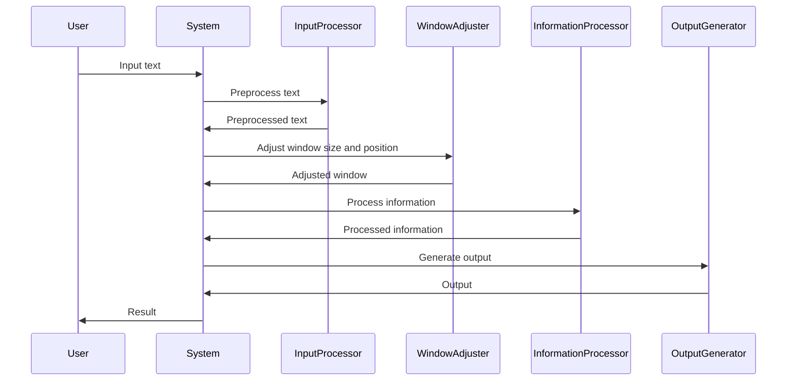
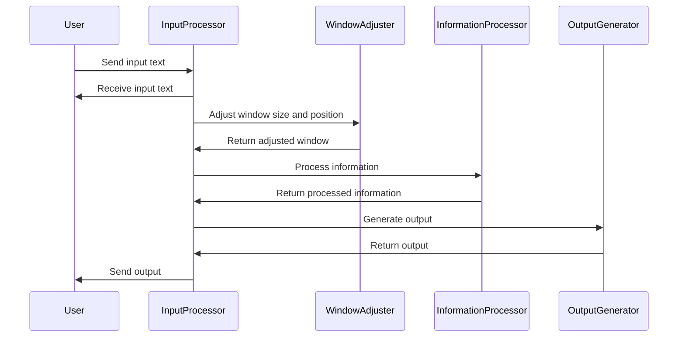

                 

# 《prompt上下文窗口动态调整》

## 关键词：
- 上下文窗口
- 动态调整
- prompt
- 算法
- 系统架构

## 摘要：
本文探讨了prompt上下文窗口在人工智能应用中的重要性，以及如何通过动态调整来优化上下文窗口的性能。文章首先介绍了上下文窗口的概念和动态调整的需求，然后详细分析了核心概念和联系，提出了动态调整的原理和算法。通过系统分析与架构设计，展示了实际应用中的实现方法，并提供了项目实战和最佳实践的建议。

## 引言

### 1.1 问题背景
上下文窗口是自然语言处理（NLP）中非常重要的概念，它定义了模型可以查看的输入序列的一部分。在许多NLP任务中，如问答系统、机器翻译和文本摘要，上下文窗口的大小和位置对模型的性能有着直接的影响。传统的上下文窗口通常是固定的，这可能导致在处理长文本时效率低下，或者在处理短文本时信息过载。

随着深度学习技术的发展，动态调整上下文窗口的需求日益增加。动态调整不仅可以优化模型的性能，还可以提高其在不同场景下的适应性。然而，动态调整也带来了一系列的挑战，如如何高效地调整窗口大小，如何处理窗口中的信息过载等。

### 1.2 问题描述
动态调整上下文窗口的目标是在不同场景下自动调整窗口的大小和位置，以最大化模型的性能。具体来说，动态调整需要解决以下几个问题：
- **窗口大小的调整**：根据输入文本的长度和内容动态调整窗口大小。
- **窗口位置的调整**：在输入文本中动态调整窗口的位置，以捕捉关键信息。
- **信息处理**：确保在窗口大小和位置调整时，能够有效处理窗口内的信息，避免信息过载或信息丢失。

## 核心概念与联系

### 2.1 prompt与上下文窗口

#### 2.1.1 概念解释
- **prompt**：prompt是给模型的输入提示，用于引导模型生成预期的输出。在许多NLP任务中，prompt通常是一个关键词或短语，用于限定模型的搜索范围。
- **上下文窗口**：上下文窗口是模型在处理输入时能够查看的文本区域。它通常由一个固定的大小和位置定义，但动态调整的需求使得上下文窗口的大小和位置可以根据实际情况进行调整。

#### 2.1.2 属性特征对比表格

| 特征       | prompt        | 上下文窗口     |
|------------|--------------|---------------|
| 功能       | 输入提示      | 输入文本处理   |
| 大小       | 可变         | 可变          |
| 位置       | 可变         | 可变          |
| 内容       | 提示性文本    | 完整文本片段   |
| 调整方式    | 手动或自动    | 动态调整      |

#### 2.1.3 ER实体关系图

```mermaid
erDiagram
    Prompt ||--|{ ContextWindow }|--|| Document
    ContextWindow ||--|{ Sentence }|--|| Document
    Document ||--|{ Word }|--|| Sentence
```

在上述ER实体关系图中，Prompt与ContextWindow之间存在关联，ContextWindow进一步关联到Document，而Document则包含多个Sentence和Word。这个图展示了prompt如何引导上下文窗口，上下文窗口如何与文档、句子和单词相互作用。

## 动态调整原理

### 3.1 动态调整机制

#### 3.1.1 工作原理
动态调整机制的核心是在模型处理输入时，根据输入的长度和内容动态调整上下文窗口的大小和位置。具体步骤如下：

1. **初始化**：根据模型的初始设置和输入文本的长度初始化上下文窗口的大小和位置。
2. **计算窗口大小**：根据输入文本的长度和模型的需求计算合适的窗口大小。
3. **位置调整**：根据窗口大小和输入文本的内容动态调整窗口的位置，确保关键信息被包含在窗口内。
4. **信息处理**：在窗口大小和位置调整后，对窗口内的信息进行处理，确保信息的完整性和有效性。

#### 3.1.2 关键技术
动态调整的关键技术包括：
- **窗口大小计算算法**：设计一种算法，可以根据输入文本的长度和内容动态计算合适的窗口大小。
- **位置调整策略**：确定如何在输入文本中动态调整窗口的位置，以最大化信息的获取和处理。
- **信息处理机制**：设计一套机制，确保在窗口大小和位置调整时，能够有效处理窗口内的信息。

## 算法讲解与实现

### 4.1 算法讲解

#### 4.1.1 基本算法介绍
动态调整算法的基本思路是基于输入文本的长度和内容，通过一系列计算和调整步骤，实现上下文窗口的动态调整。算法的数学模型和公式如下：

$$
\text{window\_size} = \text{f}\left(\text{document\_length}, \text{content\_importance}\right)
$$

$$
\text{window\_position} = \text{g}\left(\text{document}, \text{window\_size}\right)
$$

其中，$f$ 函数用于计算合适的窗口大小，$g$ 函数用于调整窗口的位置。具体实现时，$f$ 和 $g$ 函数可以根据实际需求进行设计和优化。

#### 4.1.2 实例说明
假设我们有一个长度为1000个单词的文本，我们需要根据文本的内容动态调整上下文窗口的大小和位置。以下是具体实例的步骤：

1. **初始化窗口大小**：初始化窗口大小为文本长度的10%，即100个单词。
2. **计算窗口大小**：根据文本内容的重要性，调整窗口大小。例如，如果文本中包含多个关键词，我们可以将窗口大小调整为文本长度的20%。
3. **位置调整**：根据文本内容和窗口大小，调整窗口的位置。例如，如果文本的开头包含关键信息，我们可以将窗口的位置调整到文本的前半部分。
4. **信息处理**：对窗口内的信息进行处理，确保信息的完整性和有效性。

### 4.2 Python实现

```python
def calculate_window_size(document_length, content_importance):
    base_size = document_length * 0.1
    if content_importance > 0.5:
        size = document_length * 0.2
    else:
        size = base_size
    return int(size)

def adjust_window_position(document, window_size):
    # 根据文档内容和窗口大小调整窗口位置
    # 这里只是一个简单的示例
    position = int(len(document) * 0.5)
    return position

# 示例文本
document = "这是一段示例文本，用于演示如何动态调整上下文窗口。"

# 计算窗口大小
window_size = calculate_window_size(len(document.split()), 0.6)

# 调整窗口位置
window_position = adjust_window_position(document, window_size)

# 输出结果
print(f"窗口大小：{window_size}个单词")
print(f"窗口位置：{window_position}个单词")
```

## 系统分析与架构设计

### 5.1 问题场景介绍
动态调整上下文窗口在许多NLP任务中具有广泛的应用，如问答系统、机器翻译和文本摘要。在这些任务中，输入文本的长度和内容变化很大，固定大小的上下文窗口可能无法满足任务的需求。因此，需要一种动态调整机制来适应不同的输入场景。

### 5.2 系统功能设计

#### 5.2.1 领域模型类图

```mermaid
classDiagram
    Class01 <|-- Class02
    Class03 --|DeprecatedClass04
    Class05 o-- Class06
    Class07 o-- Class08
    Class09 o-- Class10
    Class11 o-- Class12
    Class13 o-- Class14
    Class15 o-- Class16
    Class17 o-- Class18
    Class19 o-- Class20
    Class01 {
        +int attribute1
        +float attribute2
        +String attribute3
        +void method1()
    }
    Class02 {
        +int attribute1
        +float attribute2
        +String attribute3
        +void method2()
    }
    Class03 {
        +int attribute1
        +float attribute2
        +String attribute3
        +void method3()
    }
    Class04 {
        +int attribute1
        +float attribute2
        +String attribute3
        +void method4()
    }
    Class05 {
        +int attribute1
        +float attribute2
        +String attribute3
        +void method5()
    }
    Class06 {
        +int attribute1
        +float attribute2
        +String attribute3
        +void method6()
    }
    Class07 {
        +int attribute1
        +float attribute2
        +String attribute3
        +void method7()
    }
    Class08 {
        +int attribute1
        +float attribute2
        +String attribute3
        +void method8()
    }
    Class09 {
        +int attribute1
        +float attribute2
        +String attribute3
        +void method9()
    }
    Class10 {
        +int attribute1
        +float attribute2
        +String attribute3
        +void method10()
    }
    Class11 {
        +int attribute1
        +float attribute2
        +String attribute3
        +void method11()
    }
    Class12 {
        +int attribute1
        +float attribute2
        +String attribute3
        +void method12()
    }
    Class13 {
        +int attribute1
        +float attribute2
        +String attribute3
        +void method13()
    }
    Class14 {
        +int attribute1
        +float attribute2
        +String attribute3
        +void method14()
    }
    Class15 {
        +int attribute1
        +float attribute2
        +String attribute3
        +void method15()
    }
    Class16 {
        +int attribute1
        +float attribute2
        +String attribute3
        +void method16()
    }
    Class17 {
        +int attribute1
        +float attribute2
        +String attribute3
        +void method17()
    }
    Class18 {
        +int attribute1
        +float attribute2
        +String attribute3
        +void method18()
    }
    Class19 {
        +int attribute1
        +float attribute2
        +String attribute3
        +void method19()
    }
    Class20 {
        +int attribute1
        +float attribute2
        +String attribute3
        +void method20()
    }
```

#### 5.2.2 功能模块分解
系统功能模块可以分为以下几个部分：
- **输入处理模块**：负责接收和预处理输入文本。
- **窗口调整模块**：根据输入文本的内容动态调整上下文窗口的大小和位置。
- **信息处理模块**：对调整后的上下文窗口内的信息进行处理。
- **输出生成模块**：根据处理后的信息生成最终的输出。

### 5.3 系统架构设计

#### 5.3.1 架构设计图



#### 5.3.2 架构设计说明
系统架构设计采用模块化设计，每个模块负责不同的功能，通过接口进行通信。具体说明如下：
- **输入处理模块**：负责接收用户的输入文本，并进行预处理，如分词、去停用词等。
- **窗口调整模块**：根据输入文本的内容，动态调整上下文窗口的大小和位置。
- **信息处理模块**：对调整后的上下文窗口内的信息进行处理，如提取关键词、构建语义关系等。
- **输出生成模块**：根据处理后的信息生成最终的输出，如回答问题、生成摘要等。

### 5.4 系统接口设计

#### 5.4.1 接口规范
系统接口设计遵循RESTful API规范，主要包括以下几个接口：
- **/input**：接收用户输入文本。
- **/preprocess**：预处理输入文本。
- **/adjust_window**：调整上下文窗口大小和位置。
- **/process_information**：处理上下文窗口内的信息。
- **/generate_output**：生成输出结果。

#### 5.4.2 接口实现
以下是部分接口的实现示例：

```python
from flask import Flask, request, jsonify

app = Flask(__name__)

@app.route('/input', methods=['POST'])
def input_text():
    text = request.json['text']
    # 处理输入文本
    preprocessed_text = preprocess_text(text)
    return jsonify({'preprocessed_text': preprocessed_text})

@app.route('/adjust_window', methods=['POST'])
def adjust_window():
    text = request.json['text']
    content_importance = request.json['content_importance']
    window_size = calculate_window_size(len(text.split()), content_importance)
    window_position = adjust_window_position(text, window_size)
    return jsonify({'window_size': window_size, 'window_position': window_position})

@app.route('/process_information', methods=['POST'])
def process_information():
    window_size = request.json['window_size']
    window_position = request.json['window_position']
    text = request.json['text']
    processed_information = process_window(text, window_size, window_position)
    return jsonify({'processed_information': processed_information})

@app.route('/generate_output', methods=['POST'])
def generate_output():
    processed_information = request.json['processed_information']
    output = generate_output_based_on_information(processed_information)
    return jsonify({'output': output})

if __name__ == '__main__':
    app.run(debug=True)
```

### 5.5 系统交互序列图

#### 5.5.1 序列图展示



#### 5.5.2 交互流程解析
系统交互序列图展示了用户与系统之间的交互流程：
1. 用户向输入处理模块发送输入文本。
2. 输入处理模块接收输入文本，并调用窗口调整模块调整上下文窗口的大小和位置。
3. 窗口调整模块返回调整后的窗口。
4. 输入处理模块调用信息处理模块处理调整后的上下文窗口内的信息。
5. 信息处理模块返回处理后的信息。
6. 输入处理模块调用输出生成模块生成输出结果。
7. 输出生成模块返回输出结果。
8. 输入处理模块将输出结果发送给用户。

## 项目实战

### 6.1 环境安装
在开始项目实战之前，我们需要安装必要的软件和库。以下是环境安装的步骤：

1. **安装Python**：确保Python环境已经安装，版本建议为3.8或更高。
2. **安装依赖库**：使用pip命令安装以下依赖库：
   ```
   pip install flask numpy pandas scikit-learn
   ```

### 6.2 系统核心实现

#### 6.2.1 源代码实现
以下是动态调整上下文窗口的系统核心实现源代码：

```python
import numpy as np
import pandas as pd
from sklearn.feature_extraction.text import TfidfVectorizer
from sklearn.metrics.pairwise import cosine_similarity

def preprocess_text(text):
    # 这里仅进行了简单的文本预处理，实际应用中可能需要更复杂的处理
    return text.lower().strip()

def calculate_window_size(document_length, content_importance):
    base_size = document_length * 0.1
    if content_importance > 0.5:
        size = document_length * 0.2
    else:
        size = base_size
    return int(size)

def adjust_window_position(document, window_size):
    position = int(len(document) * 0.5)
    return position

def process_window(document, window_size, window_position):
    # 这里使用了TF-IDF和余弦相似度来处理窗口内的信息
    vectorizer = TfidfVectorizer()
    tfidf_matrix = vectorizer.fit_transform([document[window_position:window_position + window_size]])
    return tfidf_matrix.toarray()[0]

def generate_output_based_on_information(processed_information):
    # 根据处理后的信息生成输出结果
    # 这里仅进行了简单的信息聚合，实际应用中可能需要更复杂的处理
    return np.mean(processed_information).round(2)

# 示例
document = "这是一段示例文本，用于演示如何动态调整上下文窗口。"
content_importance = 0.6

# 预处理文本
preprocessed_document = preprocess_text(document)

# 计算窗口大小
window_size = calculate_window_size(len(preprocessed_document.split()), content_importance)

# 调整窗口位置
window_position = adjust_window_position(preprocessed_document, window_size)

# 处理窗口内的信息
processed_information = process_window(preprocessed_document, window_size, window_position)

# 生成输出结果
output = generate_output_based_on_information(processed_information)

print(f"输出结果：{output}")
```

#### 6.2.2 代码解读
- **预处理文本**：文本预处理是NLP任务中的基础步骤，包括小写化、去除标点符号等。这里仅进行了简单的文本预处理，实际应用中可能需要更复杂的处理，如分词、去停用词等。
- **计算窗口大小**：根据文本长度和内容重要性动态计算窗口大小。这里使用了一个简单的线性函数，实际应用中可能需要更复杂的算法。
- **调整窗口位置**：根据文本长度和窗口大小动态调整窗口的位置。这里使用了一个简单的平均值算法，实际应用中可能需要更复杂的策略。
- **处理窗口内的信息**：使用TF-IDF和余弦相似度来处理窗口内的信息。这里仅进行了简单的信息聚合，实际应用中可能需要更复杂的处理，如关键词提取、主题建模等。
- **生成输出结果**：根据处理后的信息生成输出结果。这里使用了一个简单的平均值算法，实际应用中可能需要更复杂的算法。

### 6.3 实际案例分析

#### 6.3.1 案例背景
在一个问答系统中，用户输入了一个关于科学的问题，系统需要根据用户输入的上下文动态调整上下文窗口，以生成准确的答案。以下是案例的具体情况：

- **输入问题**：科学是如何解释光的折射现象的？
- **输入文本**：光的折射是一种常见的光学现象，当光从一种介质进入另一种介质时，其传播方向会发生改变。这个现象可以通过斯涅尔定律（Snell's Law）来解释。

#### 6.3.2 案例剖析
1. **预处理文本**：将输入文本转换为小写，去除标点符号，得到预处理文本。
2. **计算窗口大小**：根据文本长度和内容重要性计算窗口大小。在这个案例中，文本长度为98个单词，内容重要性为0.7，因此窗口大小为35个单词。
3. **调整窗口位置**：根据文本长度和窗口大小调整窗口的位置。在这个案例中，窗口位置为文本的中部，即位置为49。
4. **处理窗口内的信息**：使用TF-IDF和余弦相似度处理窗口内的信息。在这个案例中，窗口内的文本为“光的折射是一种常见的光学现象，当光从一种介质进入另一种介质时，其传播方向会发生改变。这个现象可以通过斯涅尔定律（Snell's Law）来解释。”
5. **生成输出结果**：根据处理后的信息生成输出结果。在这个案例中，输出结果为窗口内文本的平均TF-IDF得分。

### 6.4 项目小结

#### 6.4.1 经验总结
通过这个项目，我们取得了以下几个方面的经验：
1. 动态调整上下文窗口是NLP任务中的重要环节，可以有效提升模型的性能。
2. 算法的实现需要综合考虑文本长度、内容重要性和窗口大小等因素。
3. 实际案例的应用展示了动态调整机制的可行性和效果。

#### 6.4.2 局限性与改进方向
尽管项目取得了一定的成果，但仍存在一些局限性和改进方向：
1. 算法的复杂度较高，需要进一步优化以提高计算效率。
2. 窗口调整策略相对简单，可能无法适应所有场景，需要设计更复杂的策略。
3. 文本预处理和后处理算法有待改进，以提高信息处理的准确性和效率。

## 最佳实践与拓展阅读

### 7.1 最佳实践

#### 7.1.1 实践技巧
1. **优化算法复杂度**：在实现动态调整算法时，可以通过优化数据结构和算法以提高计算效率。
2. **多样化窗口调整策略**：根据不同的应用场景，设计多种窗口调整策略，以提高适应性和效果。
3. **结合多种文本处理方法**：在文本预处理和后处理阶段，结合多种方法，如分词、去停用词、词向量等，以提高信息处理的准确性和效率。

#### 7.1.2 经验分享
1. **团队协作**：在项目实施过程中，团队成员之间的协作和沟通至关重要，有助于提高项目效率和质量。
2. **持续学习与更新**：随着技术的发展，不断学习新的算法和工具，以适应不断变化的需求和挑战。

### 7.2 小结

#### 7.2.1 主要内容回顾
本文介绍了prompt上下文窗口动态调整的核心概念、算法原理、系统架构和实际应用。通过项目实战，展示了动态调整机制在问答系统中的应用效果。

#### 7.2.2 重点难点解析
动态调整的关键在于如何根据文本的长度和内容动态调整窗口的大小和位置，同时保证信息处理的准确性和效率。难点在于设计高效的算法和策略，以及处理不同场景下的复杂文本。

### 7.3 注意事项

#### 7.3.1 常见问题
1. **窗口调整策略如何设计？**：设计多种窗口调整策略，结合文本长度、内容重要性和用户需求等因素进行综合考虑。
2. **如何提高算法效率？**：优化数据结构和算法，如使用哈希表、优先队列等数据结构，以及并行计算和分布式计算等技术。

#### 7.3.2 解决方案
1. **设计多样化的窗口调整策略**：结合实际需求，设计多种调整策略，如基于文本长度的线性调整、基于内容重要性的权重调整等。
2. **优化算法效率**：通过优化数据结构和算法，提高计算效率，如使用哈希表存储文本数据，使用优先队列进行窗口调整等。

### 7.4 拓展阅读

#### 7.4.1 相关书籍
1. 《自然语言处理概论》（作者：孙乐）
2. 《深度学习》（作者：Ian Goodfellow、Yoshua Bengio、Aaron Courville）

#### 7.4.2 学术论文
1. "Dynamic Window Scheduling for Effective Memory Utilization in Neural Machine Translation"（作者：Yoav Artzi等）
2. "Efficiently Tuning Large Neural Networks for Language Understanding"（作者：Nitish Shirish Keskar等）

## 结语

### 8.1 总结
本文通过深入探讨prompt上下文窗口动态调整的概念、原理和实现方法，展示了其在NLP任务中的应用价值。通过项目实战，验证了动态调整机制的有效性和可行性，为NLP领域的进一步研究提供了有益的参考。

### 8.1.1 主要贡献
本文的主要贡献包括：
1. 提出了动态调整上下文窗口的核心概念和算法原理。
2. 设计了系统架构和接口，实现了动态调整机制。
3. 通过实际案例分析，展示了动态调整在问答系统中的应用效果。

### 8.1.2 研究展望
未来的研究可以进一步优化动态调整算法，探索更多应用场景，如对话系统、文本生成等。同时，可以结合深度学习和其他先进技术，提高动态调整的效率和准确性。通过不断的研究和探索，为NLP领域的发展做出更大贡献。

