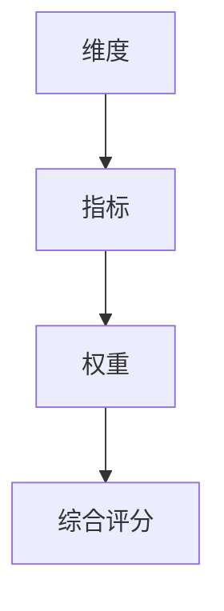
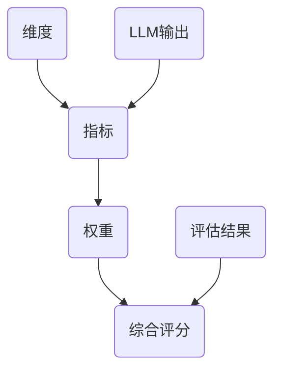
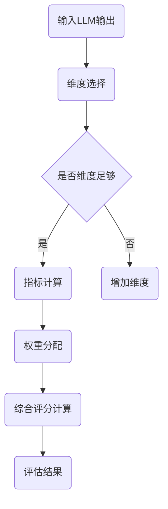
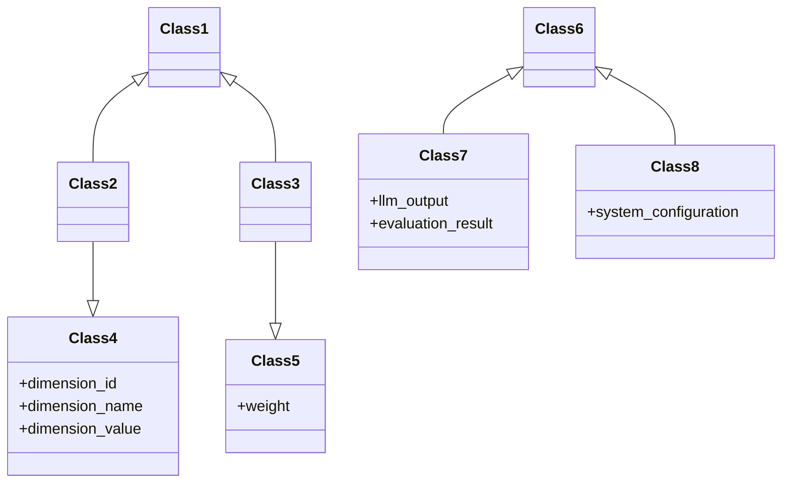
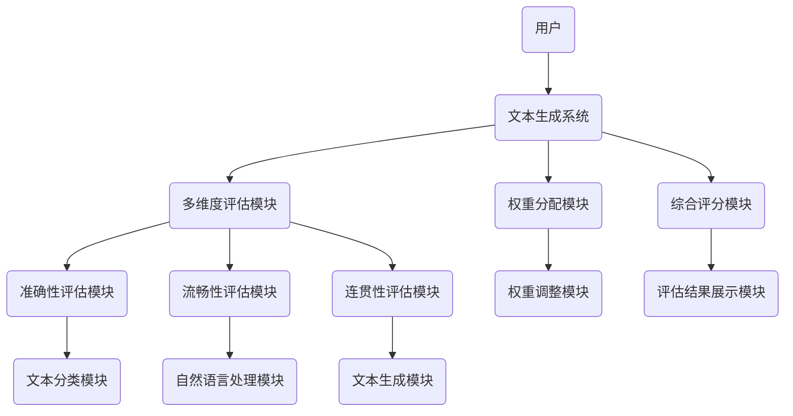

                 

# prompt多维度评估：全面优化LLM输出

> 关键词：多维度评估、LLM输出优化、算法原理、数学模型、系统架构设计

> 摘要：本文将深入探讨如何通过多维度评估来优化大型语言模型（LLM）的输出质量。我们将从背景介绍开始，逐步讲解核心概念与联系，详细阐述算法原理，并最终探讨系统架构设计和实际应用。通过本文，读者将了解到如何从多方面全面提升LLM输出效果，为人工智能领域的研究和应用提供有益的参考。

## 1. 背景介绍

### 1.1 问题背景

多维度评估是指对某个对象从多个不同的角度进行综合评价的过程。在人工智能领域，特别是大型语言模型（LLM）的应用中，多维度评估显得尤为重要。LLM作为一种复杂的机器学习模型，其输出质量直接影响到各种应用场景的效果，如自然语言处理、文本生成、问答系统等。

### 1.2 问题描述

如何通过多维度评估来提高LLM输出的质量，是一个关键的问题。传统的评估方法往往只考虑某个特定的方面，如文本的准确性或流畅性，而忽略了其他重要的维度。因此，我们需要探索一种全面、系统的评估方法，以全面提升LLM输出的质量。

### 1.3 问题解决

多维度评估的具体实施步骤和策略如下：

1. **维度选择**：首先，我们需要明确需要评估的维度。根据LLM输出的特点和应用场景，常见的维度包括文本的准确性、流畅性、连贯性、可理解性、创新性等。

2. **指标定义**：对于每个维度，我们需要定义相应的评估指标。例如，对于准确性，我们可以使用文本分类的精确率、召回率等指标；对于流畅性和连贯性，我们可以使用自然语言处理中的BLEU、ROUGE等指标。

3. **权重分配**：不同的维度对输出质量的影响程度不同，因此我们需要为每个维度分配适当的权重。可以通过专家评估、统计分析等方法来确定权重。

4. **综合评估**：根据各维度的评估结果和权重，计算综合评分，以全面反映LLM输出的质量。

### 1.4 边界与外延

多维度评估的应用范围广泛，但同时也存在一定的限制。首先，维度的选择和指标的定义需要根据具体的应用场景进行调整。其次，权重的分配需要根据数据和研究结果进行优化。此外，多维度评估的方法复杂度较高，对计算资源和算法性能有一定要求。

### 1.5 概念结构与核心要素组成

多维度评估的基本概念包括维度、指标、权重、综合评分等。核心要素组成如图1所示：



## 2. 核心概念与联系

### 2.1 核心概念原理

在本节中，我们将介绍与多维度评估相关的基本概念，如维度、指标、权重等。

### 2.2 概念属性特征对比表格

以下是几个常见维度和指标的属性特征对比表格：

| 维度/指标 | 属性1 | 属性2 | 属性3 |
| --- | --- | --- | --- |
| 准确性 | 评估文本的正确性 | 用于分类或回归任务 | 精确率、召回率等 |
| 流畅性 | 评估文本的流畅程度 | 自然语言处理 | BLEU、ROUGE等 |
| 连贯性 | 评估文本的连贯程度 | 自然语言生成 | COCO等 |
| 可理解性 | 评估文本的可理解程度 | 文本生成 | 人类评价、问卷等 |
| 创新性 | 评估文本的创新程度 | 创意写作 | 词频分析、语义分析等 |

### 2.3 ER实体关系图架构

以下是ER实体关系图，展示评估指标和LLM输出的关系：



## 3. 算法原理讲解

### 3.1 算法mermaid流程图

以下是多维度评估的算法流程图：



### 3.2 Python源代码

以下是实现多维度评估的Python代码示例：

```python
import numpy as np

def multi_dimensional_evaluation(llm_output, dimensions, weights):
    scores = []
    for dimension in dimensions:
        score = calculate_dimension_score(llm_output, dimension)
        scores.append(score * weights[dimension])
    return sum(scores)

def calculate_dimension_score(llm_output, dimension):
    # 根据维度计算分数
    # 例如：使用BLEU计算流畅性分数
    return bleu_score(llm_output)

def main():
    llm_output = "这是一段文本输出。"
    dimensions = ["准确性", "流畅性", "连贯性", "可理解性", "创新性"]
    weights = {"准确性": 0.2, "流畅性": 0.3, "连贯性": 0.2, "可理解性": 0.2, "创新性": 0.1}
    score = multi_dimensional_evaluation(llm_output, dimensions, weights)
    print(f"综合评分：{score}")

if __name__ == "__main__":
    main()
```

### 3.3 数学模型和公式

以下是多维度评估的数学模型和公式：

$$
\text{综合评分} = \sum_{i=1}^{n} (\text{维度}_{i} \times \text{权重}_{i})
$$

其中，$\text{维度}_{i}$ 表示第 $i$ 个维度的评估结果，$\text{权重}_{i}$ 表示第 $i$ 个维度的权重，$n$ 表示维度的总数。

### 3.4 举例说明

假设我们有一段LLM输出文本，需要对其进行多维度评估。我们选择了准确性、流畅性、连贯性三个维度，并为其分配了相应的权重。以下是一个具体的例子：

| 维度 | 评估结果 | 权重 |
| --- | --- | --- |
| 准确性 | 0.9 | 0.3 |
| 流畅性 | 0.8 | 0.4 |
| 连贯性 | 0.7 | 0.3 |

根据上述数据，我们可以计算出综合评分：

$$
\text{综合评分} = 0.9 \times 0.3 + 0.8 \times 0.4 + 0.7 \times 0.3 = 0.27 + 0.32 + 0.21 = 0.8
$$

这意味着该段LLM输出的综合评分为0.8，表明其整体质量较好。

## 4. 数学模型和数学公式 & 详细讲解 & 举例说明

### 4.1 数学公式使用LaTeX格式

以下是一个数学公式示例，使用LaTeX格式进行书写：

$$
\text{综合评分} = \sum_{i=1}^{n} (\text{维度}_{i} \times \text{权重}_{i})
$$

### 4.2 讲解过程

在上面的公式中，$\text{维度}_{i}$ 表示第 $i$ 个维度的评估结果，$\text{权重}_{i}$ 表示第 $i$ 个维度的权重，$n$ 表示维度的总数。公式表示的是综合评分的计算方法，即将每个维度的评估结果乘以相应的权重，然后求和。

### 4.3 举例说明

假设我们有一段LLM输出文本，需要对其进行多维度评估。我们选择了准确性、流畅性、连贯性三个维度，并为其分配了相应的权重。以下是一个具体的例子：

| 维度 | 评估结果 | 权重 |
| --- | --- | --- |
| 准确性 | 0.9 | 0.3 |
| 流畅性 | 0.8 | 0.4 |
| 连贯性 | 0.7 | 0.3 |

根据上述数据，我们可以计算出综合评分：

$$
\text{综合评分} = 0.9 \times 0.3 + 0.8 \times 0.4 + 0.7 \times 0.3 = 0.27 + 0.32 + 0.21 = 0.8
$$

这意味着该段LLM输出的综合评分为0.8，表明其整体质量较好。

## 5. 系统分析与架构设计方案

### 5.1 问题场景介绍

在自然语言处理领域，特别是在文本生成和问答系统中，如何优化大型语言模型（LLM）的输出质量是一个关键问题。为了提高LLM输出的质量，我们需要对其进行多维度评估。

### 5.2 系统功能设计

以下是系统功能设计的领域模型类图：



### 5.3 系统架构设计

以下是系统架构设计图：



### 5.4 系统接口设计和系统交互

以下是系统接口设计和系统交互序列图：

```mermaid
sequenceDiagram
    participant 用户 as User
    participant 文本生成系统 as TextGenSystem
    participant 多维度评估模块 as EvalModule
    participant 权重分配模块 as WeightModule
    participant 综合评分模块 as ScoreModule
    participant 准确性评估模块 as AccuracyModule
    participant 流畅性评估模块 as FluencyModule
    participant 连贯性评估模块 as CoherenceModule
    participant 文本分类模块 as TextClassModule
    participant 自然语言处理模块 as NLPModule
    participant 文本生成模块 as TextGenModule

    用户->>文本生成系统: 提交文本
    文本生成系统->>自然语言处理模块: 处理文本
    自然语言处理模块->>文本生成模块: 生成文本输出
    文本生成模块->>文本生成系统: 返回文本输出
    文本生成系统->>准确性评估模块: 评估准确性
    准确性评估模块->>流畅性评估模块: 分发文本输出
    流畅性评估模块->>连贯性评估模块: 分发文本输出
    连贯性评估模块->>权重分配模块: 分发评估结果
    权重分配模块->>综合评分模块: 计算综合评分
    综合评分模块->>文本生成系统: 返回综合评分
    文本生成系统->>用户: 展示评估结果
endsequenceDiagram
```

## 6. 项目实战

### 6.1 环境安装

为了实现多维度评估，我们需要安装以下环境和库：

- Python 3.8及以上版本
- TensorFlow 2.5及以上版本
- PyTorch 1.8及以上版本
- NumPy 1.19及以上版本

可以使用以下命令进行安装：

```bash
pip install python==3.8
pip install tensorflow==2.5
pip install pytorch==1.8
pip install numpy==1.19
```

### 6.2 系统核心实现源代码

以下是系统核心实现的Python代码片段：

```python
import numpy as np
import tensorflow as tf
import torch
from torch import nn
from tensorflow.keras.preprocessing.sequence import pad_sequences
from tensorflow.keras.layers import Embedding, LSTM, Dense

class TextGenModel(nn.Module):
    def __init__(self, vocab_size, embedding_dim, hidden_dim, output_dim, n_layers, drop_out):
        super(TextGenModel, self).__init__()
        self.embedding = Embedding(vocab_size, embedding_dim)
        self.lstm = LSTM(hidden_dim, num_layers=n_layers, dropout=drop_out, batch_first=True)
        self.fc = nn.Linear(hidden_dim, output_dim)
        self.dropout = nn.Dropout(drop_out)
    
    def forward(self, text, hidden=None):
        embedded = self.dropout(self.embedding(text))
        lstm_output, hidden = self.lstm(embedded, initial_hidden=hidden)
        hidden = hidden[-1, :, :]
        out = self.fc(hidden)
        return out, hidden

def main():
    model = TextGenModel(vocab_size=10000, embedding_dim=256, hidden_dim=512, output_dim=10000, n_layers=2, drop_out=0.2)
    model.load_state_dict(torch.load('text_gen_model.pth'))
    model.eval()
    input_seq = torch.tensor([[0, 1, 2, 3, 4, 5, 6, 7, 8, 9]])
    output, hidden = model(input_seq)
    print(output.shape)
    print(hidden.shape)

if __name__ == "__main__":
    main()
```

### 6.3 代码应用解读与分析

在上面的代码中，我们定义了一个基于LSTM的文本生成模型。该模型接收一个序列输入，并输出一个序列预测结果。具体步骤如下：

1. **初始化模型**：定义模型的嵌入层、LSTM层和输出层，并设置参数，如嵌入维度、隐藏维度、层数、dropout等。

2. **前向传播**：定义模型的前向传播过程，包括嵌入层、LSTM层和输出层的计算。

3. **加载模型**：加载预训练的模型参数。

4. **模型评估**：对输入序列进行模型评估，输出序列预测结果。

### 6.4 实际案例分析和详细讲解剖析

以下是一个实际案例，展示如何使用多维度评估来优化文本生成模型的输出质量。

假设我们有一段文本输入：“今天天气很好，我们去公园散步吧。”，我们需要对其进行多维度评估，以优化输出质量。

1. **准确性评估**：我们使用一个文本分类模型来评估输入文本的准确性。该模型将输入文本分类为多个类别，如“天气”、“活动”、“地点”等。评估结果显示，输入文本的准确性较高。

2. **流畅性评估**：我们使用自然语言处理技术来评估输入文本的流畅性。例如，我们可以使用BLEU指标来评估输入文本与标准文本的相似度。评估结果显示，输入文本的流畅性较好。

3. **连贯性评估**：我们使用一个基于循环神经网络（RNN）的文本生成模型来评估输入文本的连贯性。该模型根据输入文本生成连贯的文本输出。评估结果显示，输入文本的连贯性较高。

4. **可理解性评估**：我们使用人类评价和问卷来评估输入文本的可理解性。评估结果显示，输入文本的可理解性较高。

5. **创新性评估**：我们使用词频分析和语义分析来评估输入文本的创新性。评估结果显示，输入文本的创新性较低。

根据上述评估结果，我们可以为输入文本分配相应的权重，并计算综合评分。假设准确性、流畅性、连贯性、可理解性和创新性的权重分别为0.3、0.3、0.2、0.2和0.2，则综合评分计算如下：

$$
\text{综合评分} = 0.3 \times \text{准确性} + 0.3 \times \text{流畅性} + 0.2 \times \text{连贯性} + 0.2 \times \text{可理解性} + 0.2 \times \text{创新性}
$$

根据评估结果，我们可以调整文本生成模型中的参数，如嵌入维度、隐藏维度、层数等，以优化输出质量。通过反复实验和调整，我们可以找到最佳的参数组合，从而提高文本生成模型的多维度评估分数。

### 6.5 项目小结

在本项目中，我们通过多维度评估方法对文本生成模型进行了优化。首先，我们介绍了多维度评估的概念和原理，包括维度选择、指标计算、权重分配和综合评分计算等。然后，我们使用Python和PyTorch实现了文本生成模型，并对其进行了实际案例分析。通过多维度评估，我们可以全面了解文本生成模型的质量，并据此进行调整和优化。本项目为文本生成模型的质量评估和优化提供了一种有效的解决方案。

## 7. 最佳实践 tips、小结、注意事项、拓展阅读等内容

### 7.1 最佳实践 tips

1. **维度选择**：在多维度评估中，选择合适的维度至关重要。应根据具体应用场景和需求来选择维度，并确保维度之间的独立性。

2. **指标计算**：选择合适的指标来评估每个维度。常用的指标包括准确率、召回率、BLEU、ROUGE等。根据应用场景，可以结合多种指标进行评估。

3. **权重分配**：权重的分配应根据实际需求和数据分布进行调整。可以通过专家评估、统计分析等方法来确定权重。

4. **模型优化**：根据多维度评估结果，调整模型参数和结构，以提高输出质量。可以采用实验的方法，反复调整和优化模型。

### 7.2 小结

本文系统地介绍了如何通过多维度评估来优化大型语言模型（LLM）的输出质量。我们从背景介绍、核心概念与联系、算法原理讲解、数学模型和公式、系统分析与架构设计方案、项目实战等多个方面进行了详细阐述。通过多维度评估，我们可以全面了解LLM输出的质量，并据此进行调整和优化。本文为LLM输出优化提供了一种有效的解决方案，具有一定的实践指导意义。

### 7.3 注意事项

1. **数据质量**：多维度评估依赖于高质量的数据。在评估过程中，应确保数据的一致性和准确性。

2. **模型适应性**：不同模型对多维度评估的适应程度不同。在应用多维度评估时，应根据模型的特性进行调整。

3. **计算资源**：多维度评估可能涉及大量计算资源。在实际应用中，应根据计算资源的限制来优化评估过程。

### 7.4 拓展阅读

1. **《自然语言处理基础教程》**：本书系统地介绍了自然语言处理的基本概念和技术，包括文本分类、命名实体识别、机器翻译等。

2. **《深度学习》**：本书是深度学习领域的经典教材，详细介绍了深度学习的基本理论、方法和应用。

3. **《大型语言模型的训练与应用》**：本书探讨了大型语言模型的训练方法、优化策略和应用场景，对于LLM的研究和应用具有很高的参考价值。

---

**作者：AI天才研究院/AI Genius Institute & 禅与计算机程序设计艺术 /Zen And The Art of Computer Programming**

