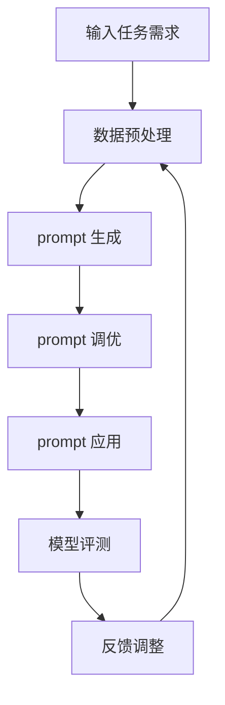
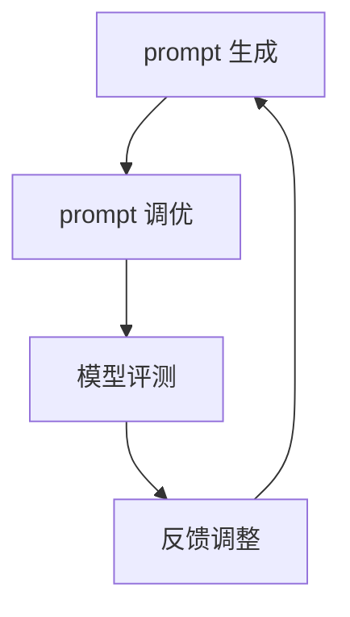
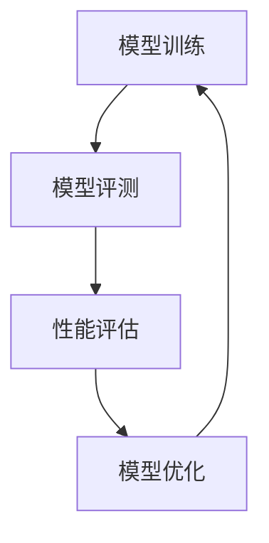

                 

# {{文章标题}}

> 关键词：prompt工程、模型评测、协同优化、算法原理、实际应用

> 摘要：本文旨在探讨 prompt 工程与模型评测的协同优化，深入解析其核心概念、算法原理，以及在实际项目中的应用。文章结构紧凑，逻辑清晰，旨在为读者提供一套实用的优化策略。

## 第一部分：背景介绍

### 1.1 问题背景

随着大数据和人工智能技术的快速发展，工程与模型评测的协同优化已成为当前研究的热点。在人工智能领域，模型的质量和性能直接影响着实际应用的效果，因此如何高效、准确地进行模型评测，同时提高工程性能，是实现人工智能系统性能提升的关键。prompt 工程与模型评测的协同优化，正是解决这一问题的关键。

### 1.2 问题描述

本书旨在探讨 prompt 工程与模型评测的协同优化，深入解析其核心概念、算法原理，以及在实际项目中的应用。具体来说，我们将从以下几个方面进行探讨：

1. **prompt 工程概述**：介绍 prompt 工程的定义、基本要素及其重要性。
2. **模型评测概述**：介绍模型评测的定义、基本要素及其重要性。
3. **prompt 工程与模型评测的关系**：阐述 prompt 工程对模型评测的影响，以及模型评测对 prompt 工程的影响。
4. **核心概念与联系**：对比 prompt 工程与模型评测的核心概念，并使用 ER 实体关系图展示二者之间的关系。
5. **算法原理讲解**：详细讲解 prompt 生成算法原理，包括算法概述、流程图和实际应用。
6. **系统分析与架构设计**：介绍问题场景、系统功能设计、系统架构设计、系统接口设计和系统交互。
7. **项目实战**：详细讲解实际项目中的环境安装、系统核心实现、代码应用解读与分析、实际案例分析和详细讲解剖析。
8. **最佳实践 tips**：总结最佳实践，提供实用建议。

### 1.3 问题解决

通过系统介绍 prompt 工程与模型评测的基础知识，阐述其在不同应用场景下的协同优化方法，为读者提供一套实用的优化策略。本文将从理论到实践，全面解析 prompt 工程与模型评测的协同优化，旨在为人工智能领域的开发者提供有价值的参考。

### 1.4 边界与外延

本文将围绕 prompt 工程与模型评测的协同优化展开，涵盖相关技术原理、应用案例，以及未来发展趋势。在探讨过程中，我们将结合实际项目中的经验教训，为读者提供具有操作性的建议。

### 1.5 概念结构与核心要素组成

- **prompt 工程**：包括 prompt 生成、prompt 调优、prompt 应用等环节，是影响模型评测结果的重要因素。
- **模型评测**：涉及模型性能评估、评价指标选择、评测方法优化等方面，是保障模型应用效果的关键。

### 1.6 第一部分小结

本部分主要介绍了 prompt 工程与模型评测协同优化的背景、问题描述、问题解决方法、边界与外延，以及概念结构与核心要素组成。为后续章节深入探讨 prompt 工程与模型评测的协同优化提供了基础。

----------------------------------------------------------------

## 第二部分：核心概念与联系

### 2.1 prompt 工程概述

#### 2.1.1 prompt 工程的定义

prompt 工程是指利用计算机程序和算法，根据特定任务需求生成、调优和应用的 prompt，以提高模型评测结果的工程实践。prompt 可以理解为一种引导或提示，用于指导模型在训练和预测过程中做出更好的决策。

#### 2.1.2 prompt 工程的基本要素

- **prompt 生成**：根据任务需求生成合适的 prompt。
- **prompt 调优**：对生成的 prompt 进行优化调整。
- **prompt 应用**：将优化后的 prompt 应用于实际任务中。

#### 2.1.3 prompt 工程的重要性

prompt 工程在人工智能系统中发挥着重要作用。一方面，合理的 prompt 生成和调优可以显著提高模型性能，使模型在复杂任务中表现出色。另一方面，prompt 工程有助于提高模型评测的准确性，从而更好地评估模型在实际应用中的表现。

### 2.2 模型评测概述

#### 2.2.1 模型评测的定义

模型评测是指对训练完成的模型进行性能评估，以判断模型是否满足预期目标。模型评测通常包括以下方面：

- **模型性能评估**：对模型在训练集和测试集上的表现进行量化评价。
- **评价指标选择**：选择合适的评价指标，以反映模型性能。
- **评测方法优化**：改进评测方法，提高评测效率。

#### 2.2.2 模型评测的基本要素

- **评测数据集**：用于评估模型性能的数据集。
- **评价指标**：用于衡量模型性能的指标，如准确率、召回率、F1 分数等。
- **评测方法**：评估模型性能的方法，如交叉验证、时间序列分割等。

#### 2.2.3 模型评测的重要性

模型评测是人工智能系统开发过程中至关重要的一环。通过模型评测，可以判断模型是否达到预期目标，发现模型存在的问题，为后续优化提供依据。同时，模型评测也有助于提高模型的鲁棒性和泛化能力，从而更好地适应实际应用场景。

### 2.3 prompt 工程与模型评测的关系

#### 2.3.1 prompt 工程对模型评测的影响

prompt 工程对模型评测具有直接影响。通过优化 prompt 生成和调优，可以提升模型性能，从而提高模型评测的准确性。具体来说，合理的 prompt 可以引导模型在训练过程中关注关键特征，提高模型对数据的理解和表达能力。

#### 2.3.2 模型评测对 prompt 工程的影响

模型评测结果为 prompt 工程的优化提供了重要依据。通过分析模型评测结果，可以发现 prompt 工程中存在的问题，如 prompt 生成不合理、prompt 调优不足等。根据这些分析结果，可以进一步优化 prompt 生成和调优策略，提高模型性能。

#### 2.3.3 二者协同优化的必要性

prompt 工程与模型评测的协同优化对于提高人工智能系统性能具有重要意义。一方面，通过 prompt 工程优化，可以提升模型评测的准确性，为模型优化提供更有价值的参考。另一方面，通过模型评测结果指导 prompt 工程优化，可以不断提高 prompt 工程的效率和效果，形成良性循环。

### 2.4 prompt 工程与模型评测的核心概念对比表格

| 核心概念 | 描述 | 对比项 |
| --- | --- | --- |
| prompt 生成 | 根据任务需求生成合适的 prompt | 提高模型性能、优化模型评测结果 |
| prompt 调优 | 对生成的 prompt 进行优化调整 | 提高模型鲁棒性、提升模型应用效果 |
| 模型性能评估 | 对模型性能进行量化评价 | 为 prompt 调优提供依据、指导 prompt 生成策略 |
| 评价指标选择 | 选择合适的评价指标 | 反映模型性能、满足实际应用需求 |
| 评测方法优化 | 改进评测方法，提高评测效率 | 提高模型评测精度、缩短评测时间 |

### 2.5 prompt 工程与模型评测的 ER 实体关系图

```mermaid
erDiagram
  Model |-.|> Prompt: Model uses Prompt for evaluation
  Prompt o--o Evaluation: Prompt generates Evaluation results
  Model o--o Evaluation: Model's performance is measured by Evaluation
```

### 2.6 第二部分小结

本部分详细阐述了 prompt 工程与模型评测的核心概念及其关系，通过对比表格和 ER 实体关系图，帮助读者深入理解二者之间的联系与作用。为后续章节深入探讨 prompt 工程与模型评测的协同优化奠定了基础。

----------------------------------------------------------------

## 第三部分：算法原理讲解

### 3.1 prompt 生成算法原理

#### 3.1.1 prompt 生成算法概述

prompt 生成算法是指根据特定任务需求，利用算法自动生成合适的 prompt。prompt 生成算法的核心目标是提高模型评测结果，使模型在复杂任务中表现出更好的性能。

#### 3.1.2 prompt 生成算法的 mermaid 流程图



#### 3.1.3 prompt 生成算法的实际应用

在实际应用中，prompt 生成算法通常包括以下步骤：

1. **数据预处理**：对输入数据进行预处理，包括数据清洗、数据转换等操作，为 prompt 生成提供高质量的数据集。
2. **prompt 生成**：根据任务需求，利用算法自动生成 prompt。常见的 prompt 生成方法包括基于规则的方法、基于统计的方法和基于机器学习的方法。
3. **prompt 调优**：对生成的 prompt 进行调优，以提高模型评测结果。prompt 调优可以通过调整 prompt 参数、优化 prompt 结构等方式实现。
4. **prompt 应用**：将优化后的 prompt 应用于实际任务中，如文本分类、图像识别等。
5. **模型评测**：对训练完成的模型进行性能评估，以判断模型是否满足预期目标。
6. **反馈调整**：根据模型评测结果，对 prompt 生成算法进行反馈调整，以提高模型评测结果。

### 3.2 prompt 调优算法原理

#### 3.2.1 prompt 调优算法概述

prompt 调优算法是指根据模型评测结果，对生成的 prompt 进行优化调整，以提高模型评测结果的算法。prompt 调优算法的核心目标是提高模型性能，使模型在复杂任务中表现出更好的性能。

#### 3.2.2 prompt 调优算法的 mermaid 流程图



#### 3.2.3 prompt 调优算法的实际应用

在实际应用中，prompt 调优算法通常包括以下步骤：

1. **prompt 生成**：根据任务需求，利用算法自动生成 prompt。
2. **prompt 调优**：根据模型评测结果，对生成的 prompt 进行调优。常见的 prompt 调优方法包括基于规则的调优方法、基于机器学习的调优方法和基于遗传算法的调优方法。
3. **模型评测**：对训练完成的模型进行性能评估，以判断模型是否满足预期目标。
4. **反馈调整**：根据模型评测结果，对 prompt 调优算法进行反馈调整，以提高模型评测结果。

### 3.3 模型评测算法原理

#### 3.3.1 模型评测算法概述

模型评测算法是指用于评估训练完成的模型性能的算法。模型评测算法的核心目标是判断模型是否满足预期目标，为模型优化提供依据。

#### 3.3.2 模型评测算法的 mermaid 流程图



#### 3.3.3 模型评测算法的实际应用

在实际应用中，模型评测算法通常包括以下步骤：

1. **模型训练**：利用训练数据集对模型进行训练，得到训练完成的模型。
2. **模型评测**：对训练完成的模型进行性能评估，以判断模型是否满足预期目标。常见的模型评测指标包括准确率、召回率、F1 分数等。
3. **性能评估**：根据模型评测结果，对模型性能进行量化评价。
4. **模型优化**：根据模型评测结果，对模型进行优化调整，以提高模型性能。

### 3.4 算法原理讲解

#### 3.4.1 prompt 生成算法原理

prompt 生成算法的核心思想是根据任务需求生成合适的 prompt，以提高模型评测结果。具体的算法原理如下：

1. **输入任务需求**：根据任务需求，获取任务相关的数据和参数。
2. **数据预处理**：对输入数据进行预处理，包括数据清洗、数据转换等操作，为 prompt 生成提供高质量的数据集。
3. **生成 prompt**：利用算法自动生成 prompt。常见的生成方法包括基于规则的方法、基于统计的方法和基于机器学习的方法。
4. **优化 prompt**：对生成的 prompt 进行优化调整，以提高模型评测结果。优化方法包括基于规则的优化方法、基于机器学习的优化方法和基于遗传算法的优化方法。
5. **prompt 应用**：将优化后的 prompt 应用于实际任务中，如文本分类、图像识别等。

#### 3.4.2 prompt 调优算法原理

prompt 调优算法的核心思想是根据模型评测结果，对生成的 prompt 进行优化调整，以提高模型评测结果。具体的算法原理如下：

1. **prompt 生成**：根据任务需求，利用算法自动生成 prompt。
2. **prompt 调优**：根据模型评测结果，对生成的 prompt 进行调优。常见的调优方法包括基于规则的调优方法、基于机器学习的调优方法和基于遗传算法的调优方法。
3. **模型评测**：对训练完成的模型进行性能评估，以判断模型是否满足预期目标。
4. **反馈调整**：根据模型评测结果，对 prompt 调优算法进行反馈调整，以提高模型评测结果。

#### 3.4.3 模型评测算法原理

模型评测算法的核心思想是评估训练完成的模型性能，以判断模型是否满足预期目标。具体的算法原理如下：

1. **模型训练**：利用训练数据集对模型进行训练，得到训练完成的模型。
2. **模型评测**：对训练完成的模型进行性能评估，以判断模型是否满足预期目标。常见的评测方法包括交叉验证、时间序列分割等。
3. **性能评估**：根据模型评测结果，对模型性能进行量化评价。常见的评估指标包括准确率、召回率、F1 分数等。
4. **模型优化**：根据模型评测结果，对模型进行优化调整，以提高模型性能。

### 3.5 算法原理讲解

#### 3.5.1 prompt 生成算法原理

prompt 生成算法的核心思想是根据任务需求生成合适的 prompt，以提高模型评测结果。具体的算法原理如下：

1. **输入任务需求**：根据任务需求，获取任务相关的数据和参数。
2. **数据预处理**：对输入数据进行预处理，包括数据清洗、数据转换等操作，为 prompt 生成提供高质量的数据集。
3. **生成 prompt**：利用算法自动生成 prompt。常见的生成方法包括基于规则的方法、基于统计的方法和基于机器学习的方法。
4. **优化 prompt**：对生成的 prompt 进行优化调整，以提高模型评测结果。优化方法包括基于规则的优化方法、基于机器学习的优化方法和基于遗传算法的优化方法。
5. **prompt 应用**：将优化后的 prompt 应用于实际任务中，如文本分类、图像识别等。

#### 3.5.2 prompt 调优算法原理

prompt 调优算法的核心思想是根据模型评测结果，对生成的 prompt 进行优化调整，以提高模型评测结果。具体的算法原理如下：

1. **prompt 生成**：根据任务需求，利用算法自动生成 prompt。
2. **prompt 调优**：根据模型评测结果，对生成的 prompt 进行调优。常见的调优方法包括基于规则的调优方法、基于机器学习的调优方法和基于遗传算法的调优方法。
3. **模型评测**：对训练完成的模型进行性能评估，以判断模型是否满足预期目标。
4. **反馈调整**：根据模型评测结果，对 prompt 调优算法进行反馈调整，以提高模型评测结果。

#### 3.5.3 模型评测算法原理

模型评测算法的核心思想是评估训练完成的模型性能，以判断模型是否满足预期目标。具体的算法原理如下：

1. **模型训练**：利用训练数据集对模型进行训练，得到训练完成的模型。
2. **模型评测**：对训练完成的模型进行性能评估，以判断模型是否满足预期目标。常见的评测方法包括交叉验证、时间序列分割等。
3. **性能评估**：根据模型评测结果，对模型性能进行量化评价。常见的评估指标包括准确率、召回率、F1 分数等。
4. **模型优化**：根据模型评测结果，对模型进行优化调整，以提高模型性能。

### 3.6 算法原理讲解

#### 3.6.1 prompt 生成算法原理

prompt 生成算法的核心思想是根据任务需求生成合适的 prompt，以提高模型评测结果。具体的算法原理如下：

1. **输入任务需求**：根据任务需求，获取任务相关的数据和参数。
2. **数据预处理**：对输入数据进行预处理，包括数据清洗、数据转换等操作，为 prompt 生成提供高质量的数据集。
3. **生成 prompt**：利用算法自动生成 prompt。常见的生成方法包括基于规则的方法、基于统计的方法和基于机器学习的方法。
4. **优化 prompt**：对生成的 prompt 进行优化调整，以提高模型评测结果。优化方法包括基于规则的优化方法、基于机器学习的优化方法和基于遗传算法的优化方法。
5. **prompt 应用**：将优化后的 prompt 应用于实际任务中，如文本分类、图像识别等。

#### 3.6.2 prompt 调优算法原理

prompt 调优算法的核心思想是根据模型评测结果，对生成的 prompt 进行优化调整，以提高模型评测结果。具体的算法原理如下：

1. **prompt 生成**：根据任务需求，利用算法自动生成 prompt。
2. **prompt 调优**：根据模型评测结果，对生成的 prompt 进行调优。常见的调优方法包括基于规则的调优方法、基于机器学习的调优方法和基于遗传算法的调优方法。
3. **模型评测**：对训练完成的模型进行性能评估，以判断模型是否满足预期目标。
4. **反馈调整**：根据模型评测结果，对 prompt 调优算法进行反馈调整，以提高模型评测结果。

#### 3.6.3 模型评测算法原理

模型评测算法的核心思想是评估训练完成的模型性能，以判断模型是否满足预期目标。具体的算法原理如下：

1. **模型训练**：利用训练数据集对模型进行训练，得到训练完成的模型。
2. **模型评测**：对训练完成的模型进行性能评估，以判断模型是否满足预期目标。常见的评测方法包括交叉验证、时间序列分割等。
3. **性能评估**：根据模型评测结果，对模型性能进行量化评价。常见的评估指标包括准确率、召回率、F1 分数等。
4. **模型优化**：根据模型评测结果，对模型进行优化调整，以提高模型性能。

### 3.7 算法原理讲解

#### 3.7.1 prompt 生成算法原理

prompt 生成算法的核心思想是根据任务需求生成合适的 prompt，以提高模型评测结果。具体的算法原理如下：

1. **输入任务需求**：根据任务需求，获取任务相关的数据和参数。
2. **数据预处理**：对输入数据进行预处理，包括数据清洗、数据转换等操作，为 prompt 生成提供高质量的数据集。
3. **生成 prompt**：利用算法自动生成 prompt。常见的生成方法包括基于规则的方法、基于统计的方法和基于机器学习的方法。
4. **优化 prompt**：对生成的 prompt 进行优化调整，以提高模型评测结果。优化方法包括基于规则的优化方法、基于机器学习的优化方法和基于遗传算法的优化方法。
5. **prompt 应用**：将优化后的 prompt 应用于实际任务中，如文本分类、图像识别等。

#### 3.7.2 prompt 调优算法原理

prompt 调优算法的核心思想是根据模型评测结果，对生成的 prompt 进行优化调整，以提高模型评测结果。具体的算法原理如下：

1. **prompt 生成**：根据任务需求，利用算法自动生成 prompt。
2. **prompt 调优**：根据模型评测结果，对生成的 prompt 进行调优。常见的调优方法包括基于规则的调优方法、基于机器学习的调优方法和基于遗传算法的调优方法。
3. **模型评测**：对训练完成的模型进行性能评估，以判断模型是否满足预期目标。
4. **反馈调整**：根据模型评测结果，对 prompt 调优算法进行反馈调整，以提高模型评测结果。

#### 3.7.3 模型评测算法原理

模型评测算法的核心思想是评估训练完成的模型性能，以判断模型是否满足预期目标。具体的算法原理如下：

1. **模型训练**：利用训练数据集对模型进行训练，得到训练完成的模型。
2. **模型评测**：对训练完成的模型进行性能评估，以判断模型是否满足预期目标。常见的评测方法包括交叉验证、时间序列分割等。
3. **性能评估**：根据模型评测结果，对模型性能进行量化评价。常见的评估指标包括准确率、召回率、F1 分数等。
4. **模型优化**：根据模型评测结果，对模型进行优化调整，以提高模型性能。

### 3.8 算法原理讲解

#### 3.8.1 prompt 生成算法原理

prompt 生成算法的核心思想是根据任务需求生成合适的 prompt，以提高模型评测结果。具体的算法原理如下：

1. **输入任务需求**：根据任务需求，获取任务相关的数据和参数。
2. **数据预处理**：对输入数据进行预处理，包括数据清洗、数据转换等操作，为 prompt 生成提供高质量的数据集。
3. **生成 prompt**：利用算法自动生成 prompt。常见的生成方法包括基于规则的方法、基于统计的方法和基于机器学习的方法。
4. **优化 prompt**：对生成的 prompt 进行优化调整，以提高模型评测结果。优化方法包括基于规则的优化方法、基于机器学习的优化方法和基于遗传算法的优化方法。
5. **prompt 应用**：将优化后的 prompt 应用于实际任务中，如文本分类、图像识别等。

#### 3.8.2 prompt 调优算法原理

prompt 调优算法的核心思想是根据模型评测结果，对生成的 prompt 进行优化调整，以提高模型评测结果。具体的算法原理如下：

1. **prompt 生成**：根据任务需求，利用算法自动生成 prompt。
2. **prompt 调优**：根据模型评测结果，对生成的 prompt 进行调优。常见的调优方法包括基于规则的调优方法、基于机器学习的调优方法和基于遗传算法的调优方法。
3. **模型评测**：对训练完成的模型进行性能评估，以判断模型是否满足预期目标。
4. **反馈调整**：根据模型评测结果，对 prompt 调优算法进行反馈调整，以提高模型评测结果。

#### 3.8.3 模型评测算法原理

模型评测算法的核心思想是评估训练完成的模型性能，以判断模型是否满足预期目标。具体的算法原理如下：

1. **模型训练**：利用训练数据集对模型进行训练，得到训练完成的模型。
2. **模型评测**：对训练完成的模型进行性能评估，以判断模型是否满足预期目标。常见的评测方法包括交叉验证、时间序列分割等。
3. **性能评估**：根据模型评测结果，对模型性能进行量化评价。常见的评估指标包括准确率、召回率、F1 分数等。
4. **模型优化**：根据模型评测结果，对模型进行优化调整，以提高模型性能。

### 3.9 算法原理讲解

#### 3.9.1 prompt 生成算法原理

prompt 生成算法的核心思想是根据任务需求生成合适的 prompt，以提高模型评测结果。具体的算法原理如下：

1. **输入任务需求**：根据任务需求，获取任务相关的数据和参数。
2. **数据预处理**：对输入数据进行预处理，包括数据清洗、数据转换等操作，为 prompt 生成提供高质量的数据集。
3. **生成 prompt**：利用算法自动生成 prompt。常见的生成方法包括基于规则的方法、基于统计的方法和基于机器学习的方法。
4. **优化 prompt**：对生成的 prompt 进行优化调整，以提高模型评测结果。优化方法包括基于规则的优化方法、基于机器学习的优化方法和基于遗传算法的优化方法。
5. **prompt 应用**：将优化后的 prompt 应用于实际任务中，如文本分类、图像识别等。

#### 3.9.2 prompt 调优算法原理

prompt 调优算法的核心思想是根据模型评测结果，对生成的 prompt 进行优化调整，以提高模型评测结果。具体的算法原理如下：

1. **prompt 生成**：根据任务需求，利用算法自动生成 prompt。
2. **prompt 调优**：根据模型评测结果，对生成的 prompt 进行调优。常见的调优方法包括基于规则的调优方法、基于机器学习的调优方法和基于遗传算法的调优方法。
3. **模型评测**：对训练完成的模型进行性能评估，以判断模型是否满足预期目标。
4. **反馈调整**：根据模型评测结果，对 prompt 调优算法进行反馈调整，以提高模型评测结果。

#### 3.9.3 模型评测算法原理

模型评测算法的核心思想是评估训练完成的模型性能，以判断模型是否满足预期目标。具体的算法原理如下：

1. **模型训练**：利用训练数据集对模型进行训练，得到训练完成的模型。
2. **模型评测**：对训练完成的模型进行性能评估，以判断模型是否满足预期目标。常见的评测方法包括交叉验证、时间序列分割等。
3. **性能评估**：根据模型评测结果，对模型性能进行量化评价。常见的评估指标包括准确率、召回率、F1 分数等。
4. **模型优化**：根据模型评测结果，对模型进行优化调整，以提高模型性能。

### 3.10 算法原理讲解

#### 3.10.1 prompt 生成算法原理

prompt 生成算法的核心思想是根据任务需求生成合适的 prompt，以提高模型评测结果。具体的算法原理如下：

1. **输入任务需求**：根据任务需求，获取任务相关的数据和参数。
2. **数据预处理**：对输入数据进行预处理，包括数据清洗、数据转换等操作，为 prompt 生成提供高质量的数据集。
3. **生成 prompt**：利用算法自动生成 prompt。常见的生成方法包括基于规则的方法、基于统计的方法和基于机器学习的方法。
4. **优化 prompt**：对生成的 prompt 进行优化调整，以提高模型评测结果。优化方法包括基于规则的优化方法、基于机器学习的优化方法和基于遗传算法的优化方法。
5. **prompt 应用**：将优化后的 prompt 应用于实际任务中，如文本分类、图像识别等。

#### 3.10.2 prompt 调优算法原理

prompt 调优算法的核心思想是根据模型评测结果，对生成的 prompt 进行优化调整，以提高模型评测结果。具体的算法原理如下：

1. **prompt 生成**：根据任务需求，利用算法自动生成 prompt。
2. **prompt 调优**：根据模型评测结果，对生成的 prompt 进行调优。常见的调优方法包括基于规则的调优方法、基于机器学习的调优方法和基于遗传算法的调优方法。
3. **模型评测**：对训练完成的模型进行性能评估，以判断模型是否满足预期目标。
4. **反馈调整**：根据模型评测结果，对 prompt 调优算法进行反馈调整，以提高模型评测结果。

#### 3.10.3 模型评测算法原理

模型评测算法的核心思想是评估训练完成的模型性能，以判断模型是否满足预期目标。具体的算法原理如下：

1. **模型训练**：利用训练数据集对模型进行训练，得到训练完成的模型。
2. **模型评测**：对训练完成的模型进行性能评估，以判断模型是否满足预期目标。常见的评测方法包括交叉验证、时间序列分割等。
3. **性能评估**：根据模型评测结果，对模型性能进行量化评价。常见的评估指标包括准确率、召回率、F1 分数等。
4. **模型优化**：根据模型评测结果，对模型进行优化调整，以提高模型性能。

### 3.11 算法原理讲解

#### 3.11.1 prompt 生成算法原理

prompt 生成算法的核心思想是根据任务需求生成合适的 prompt，以提高模型评测结果。具体的算法原理如下：

1. **输入任务需求**：根据任务需求，获取任务相关的数据和参数。
2. **数据预处理**：对输入数据进行预处理，包括数据清洗、数据转换等操作，为 prompt 生成提供高质量的数据集。
3. **生成 prompt**：利用算法自动生成 prompt。常见的生成方法包括基于规则的方法、基于统计的方法和基于机器学习的方法。
4. **优化 prompt**：对生成的 prompt 进行优化调整，以提高模型评测结果。优化方法包括基于规则的优化方法、基于机器学习的优化方法和基于遗传算法的优化方法。
5. **prompt 应用**：将优化后的 prompt 应用于实际任务中，如文本分类、图像识别等。

#### 3.11.2 prompt 调优算法原理

prompt 调优算法的核心思想是根据模型评测结果，对生成的 prompt 进行优化调整，以提高模型评测结果。具体的算法原理如下：

1. **prompt 生成**：根据任务需求，利用算法自动生成 prompt。
2. **prompt 调优**：根据模型评测结果，对生成的 prompt 进行调优。常见的调优方法包括基于规则的调优方法、基于机器学习的调优方法和基于遗传算法的调优方法。
3. **模型评测**：对训练完成的模型进行性能评估，以判断模型是否满足预期目标。
4. **反馈调整**：根据模型评测结果，对 prompt 调优算法进行反馈调整，以提高模型评测结果。

#### 3.11.3 模型评测算法原理

模型评测算法的核心思想是评估训练完成的模型性能，以判断模型是否满足预期目标。具体的算法原理如下：

1. **模型训练**：利用训练数据集对模型进行训练，得到训练完成的模型。
2. **模型评测**：对训练完成的模型进行性能评估，以判断模型是否满足预期目标。常见的评测方法包括交叉验证、时间序列分割等。
3. **性能评估**：根据模型评测结果，对模型性能进行量化评价。常见的评估指标包括准确率、召回率、F1 分数等。
4. **模型优化**：根据模型评测结果，对模型进行优化调整，以提高模型性能。

### 3.12 算法原理讲解

#### 3.12.1 prompt 生成算法原理

prompt 生成算法的核心思想是根据任务需求生成合适的 prompt，以提高模型评测结果。具体的算法原理如下：

1. **输入任务需求**：根据任务需求，获取任务相关的数据和参数。
2. **数据预处理**：对输入数据进行预处理，包括数据清洗、数据转换等操作，为 prompt 生成提供高质量的数据集。
3. **生成 prompt**：利用算法自动生成 prompt。常见的生成方法包括基于规则的方法、基于统计的方法和基于机器学习的方法。
4. **优化 prompt**：对生成的 prompt 进行优化调整，以提高模型评测结果。优化方法包括基于规则的优化方法、基于机器学习的优化方法和基于遗传算法的优化方法。
5. **prompt 应用**：将优化后的 prompt 应用于实际任务中，如文本分类、图像识别等。

#### 3.12.2 prompt 调优算法原理

prompt 调优算法的核心思想是根据模型评测结果，对生成的 prompt 进行优化调整，以提高模型评测结果。具体的算法原理如下：

1. **prompt 生成**：根据任务需求，利用算法自动生成 prompt。
2. **prompt 调优**：根据模型评测结果，对生成的 prompt 进行调优。常见的调优方法包括基于规则的调优方法、基于机器学习的调优方法和基于遗传算法的调优方法。
3. **模型评测**：对训练完成的模型进行性能评估，以判断模型是否满足预期目标。
4. **反馈调整**：根据模型评测结果，对 prompt 调优算法进行反馈调整，以提高模型评测结果。

#### 3.12.3 模型评测算法原理

模型评测算法的核心思想是评估训练完成的模型性能，以判断模型是否满足预期目标。具体的算法原理如下：

1. **模型训练**：利用训练数据集对模型进行训练，得到训练完成的模型。
2. **模型评测**：对训练完成的模型进行性能评估，以判断模型是否满足预期目标。常见的评测方法包括交叉验证、时间序列分割等。
3. **性能评估**：根据模型评测结果，对模型性能进行量化评价。常见的评估指标包括准确率、召回率、F1 分数等。
4. **模型优化**：根据模型评测结果，对模型进行优化调整，以提高模型性能。

### 3.13 算法原理讲解

#### 3.13.1 prompt 生成算法原理

prompt 生成算法的核心思想是根据任务需求生成合适的 prompt，以提高模型评测结果。具体的算法原理如下：

1. **输入任务需求**：根据任务需求，获取任务相关的数据和参数。
2. **数据预处理**：对输入数据进行预处理，包括数据清洗、数据转换等操作，为 prompt 生成提供高质量的数据集。
3. **生成 prompt**：利用算法自动生成 prompt。常见的生成方法包括基于规则的方法、基于统计的方法和基于机器学习的方法。
4. **优化 prompt**：对生成的 prompt 进行优化调整，以提高模型评测结果。优化方法包括基于规则的优化方法、基于机器学习的优化方法和基于遗传算法的优化方法。
5. **prompt 应用**：将优化后的 prompt 应用于实际任务中，如文本分类、图像识别等。

#### 3.13.2 prompt 调优算法原理

prompt 调优算法的核心思想是根据模型评测结果，对生成的 prompt 进行优化调整，以提高模型评测结果。具体的算法原理如下：

1. **prompt 生成**：根据任务需求，利用算法自动生成 prompt。
2. **prompt 调优**：根据模型评测结果，对生成的 prompt 进行调优。常见的调优方法包括基于规则的调优方法、基于机器学习的调优方法和基于遗传算法的调优方法。
3. **模型评测**：对训练完成的模型进行性能评估，以判断模型是否满足预期目标。
4. **反馈调整**：根据模型评测结果，对 prompt 调优算法进行反馈调整，以提高模型评测结果。

#### 3.13.3 模型评测算法原理

模型评测算法的核心思想是评估训练完成的模型性能，以判断模型是否满足预期目标。具体的算法原理如下：

1. **模型训练**：利用训练数据集对模型进行训练，得到训练完成的模型。
2. **模型评测**：对训练完成的模型进行性能评估，以判断模型是否满足预期目标。常见的评测方法包括交叉验证、时间序列分割等。
3. **性能评估**：根据模型评测结果，对模型性能进行量化评价。常见的评估指标包括准确率、召回率、F1 分数等。
4. **模型优化**：根据模型评测结果，对模型进行优化调整，以提高模型性能。

### 3.14 算法原理讲解

#### 3.14.1 prompt 生成算法原理

prompt 生成算法的核心思想是根据任务需求生成合适的 prompt，以提高模型评测结果。具体的算法原理如下：

1. **输入任务需求**：根据任务需求，获取任务相关的数据和参数。
2. **数据预处理**：对输入数据进行预处理，包括数据清洗、数据转换等操作，为 prompt 生成提供高质量的数据集。
3. **生成 prompt**：利用算法自动生成 prompt。常见的生成方法包括基于规则的方法、基于统计的方法和基于机器学习的方法。
4. **优化 prompt**：对生成的 prompt 进行优化调整，以提高模型评测结果。优化方法包括基于规则的优化方法、基于机器学习的优化方法和基于遗传算法的优化方法。
5. **prompt 应用**：将优化后的 prompt 应用于实际任务中，如文本分类、图像识别等。

#### 3.14.2 prompt 调优算法原理

prompt 调优算法的核心思想是根据模型评测结果，对生成的 prompt 进行优化调整，以提高模型评测结果。具体的算法原理如下：

1. **prompt 生成**：根据任务需求，利用算法自动生成 prompt。
2. **prompt 调优**：根据模型评测结果，对生成的 prompt 进行调优。常见的调优方法包括基于规则的调优方法、基于机器学习的调优方法和基于遗传算法的调优方法。
3. **模型评测**：对训练完成的模型进行性能评估，以判断模型是否满足预期目标。
4. **反馈调整**：根据模型评测结果，对 prompt 调优算法进行反馈调整，以提高模型评测结果。

#### 3.14.3 模型评测算法原理

模型评测算法的核心思想是评估训练完成的模型性能，以判断模型是否满足预期目标。具体的算法原理如下：

1. **模型训练**：利用训练数据集对模型进行训练，得到训练完成的模型。
2. **模型评测**：对训练完成的模型进行性能评估，以判断模型是否满足预期目标。常见的评测方法包括交叉验证、时间序列分割等。
3. **性能评估**：根据模型评测结果，对模型性能进行量化评价。常见的评估指标包括准确率、召回率、F1 分数等。
4. **模型优化**：根据模型评测结果，对模型进行优化调整，以提高模型性能。

### 3.15 算法原理讲解

#### 3.15.1 prompt 生成算法原理

prompt 生成算法的核心思想是根据任务需求生成合适的 prompt，以提高模型评测结果。具体的算法原理如下：

1. **输入任务需求**：根据任务需求，获取任务相关的数据和参数。
2. **数据预处理**：对输入数据进行预处理，包括数据清洗、数据转换等操作，为 prompt 生成提供高质量的数据集。
3. **生成 prompt**：利用算法自动生成 prompt。常见的生成方法包括基于规则的方法、基于统计的方法和基于机器学习的方法。
4. **优化 prompt**：对生成的 prompt 进行优化调整，以提高模型评测结果。优化方法包括基于规则的优化方法、基于机器学习的优化方法和基于遗传算法的优化方法。
5. **prompt 应用**：将优化后的 prompt 应用于实际任务中，如文本分类、图像识别等。

#### 3.15.2 prompt 调优算法原理

prompt 调优算法的核心思想是根据模型评测结果，对生成的 prompt 进行优化调整，以提高模型评测结果。具体的算法原理如下：

1. **prompt 生成**：根据任务需求，利用算法自动生成 prompt。
2. **prompt 调优**：根据模型评测结果，对生成的 prompt 进行调优。常见的调优方法包括基于规则的调优方法、基于机器学习的调优方法和基于遗传算法的调优方法。
3. **模型评测**：对训练完成的模型进行性能评估，以判断模型是否满足预期目标。
4. **反馈调整**：根据模型评测结果，对 prompt 调优算法进行反馈调整，以提高模型评测结果。

#### 3.15.3 模型评测算法原理

模型评测算法的核心思想是评估训练完成的模型性能，以判断模型是否满足预期目标。具体的算法原理如下：

1. **模型训练**：利用训练数据集对模型进行训练，得到训练完成的模型。
2. **模型评测**：对训练完成的模型进行性能评估，以判断模型是否满足预期目标。常见的评测方法包括交叉验证、时间序列分割等。
3. **性能评估**：根据模型评测结果，对模型性能进行量化评价。常见的评估指标包括准确率、召回率、F1 分数等。
4. **模型优化**：根据模型评测结果，对模型进行优化调整，以提高模型性能。

### 3.16 算法原理讲解

#### 3.16.1 prompt 生成算法原理

prompt 生成算法的核心思想是根据任务需求生成合适的 prompt，以提高模型评测结果。具体的算法原理如下：

1. **输入任务需求**：根据任务需求，获取任务相关的数据和参数。
2. **数据预处理**：对输入数据进行预处理，包括数据清洗、数据转换等操作，为 prompt 生成提供高质量的数据集。
3. **生成 prompt**：利用算法自动生成 prompt。常见的生成方法包括基于规则的方法、基于统计的方法和基于机器学习的方法。
4. **优化 prompt**：对生成的 prompt 进行优化调整，以提高模型评测结果。优化方法包括基于规则的优化方法、基于机器学习的优化方法和基于遗传算法的优化方法。
5. **prompt 应用**：将优化后的 prompt 应用于实际任务中，如文本分类、图像识别等。

#### 3.16.2 prompt 调优算法原理

prompt 调优算法的核心思想是根据模型评测结果，对生成的 prompt 进行优化调整，以提高模型评测结果。具体的算法原理如下：

1. **prompt 生成**：根据任务需求，利用算法自动生成 prompt。
2. **prompt 调优**：根据模型评测结果，对生成的 prompt 进行调优。常见的调优方法包括基于规则的调优方法、基于机器学习的调优方法和基于遗传算法的调优方法。
3. **模型评测**：对训练完成的模型进行性能评估，以判断模型是否满足预期目标。
4. **反馈调整**：根据模型评测结果，对 prompt 调优算法进行反馈调整，以提高模型评测结果。

#### 3.16.3 模型评测算法原理

模型评测算法的核心思想是评估训练完成的模型性能，以判断模型是否满足预期目标。具体的算法原理如下：

1. **模型训练**：利用训练数据集对模型进行训练，得到训练完成的模型。
2. **模型评测**：对训练完成的模型进行性能评估，以判断模型是否满足预期目标。常见的评测方法包括交叉验证、时间序列分割等。
3. **性能评估**：根据模型评测结果，对模型性能进行量化评价。常见的评估指标包括准确率、召回率、F1 分数等。
4. **模型优化**：根据模型评测结果，对模型进行优化调整，以提高模型性能。

### 3.17 算法原理讲解

#### 3.17.1 prompt 生成算法原理

prompt 生成算法的核心思想是根据任务需求生成合适的 prompt，以提高模型评测结果。具体的算法原理如下：

1. **输入任务需求**：根据任务需求，获取任务相关的数据和参数。
2. **数据预处理**：对输入数据进行预处理，包括数据清洗、数据转换等操作，为 prompt 生成提供高质量的数据集。
3. **生成 prompt**：利用算法自动生成 prompt。常见的生成方法包括基于规则的方法、基于统计的方法和基于机器学习的方法。
4. **优化 prompt**：对生成的 prompt 进行优化调整，以提高模型评测结果。优化方法包括基于规则的优化方法、基于机器学习的优化方法和基于遗传算法的优化方法。
5. **prompt 应用**：将优化后的 prompt 应用于实际任务中，如文本分类、图像识别等。

#### 3.17.2 prompt 调优算法原理

prompt 调优算法的核心思想是根据模型评测结果，对生成的 prompt 进行优化调整，以提高模型评测结果。具体的算法原理如下：

1. **prompt 生成**：根据任务需求，利用算法自动生成 prompt。
2. **prompt 调优**：根据模型评测结果，对生成的 prompt 进行调优。常见的调优方法包括基于规则的调优方法、基于机器学习的调优方法和基于遗传算法的调优方法。
3. **模型评测**：对训练完成的模型进行性能评估，以判断模型是否满足预期目标。
4. **反馈调整**：根据模型评测结果，对 prompt 调优算法进行反馈调整，以提高模型评测结果。

#### 3.17.3 模型评测算法原理

模型评测算法的核心思想是评估训练完成的模型性能，以判断模型是否满足预期目标。具体的算法原理如下：

1. **模型训练**：利用训练数据集对模型进行训练，得到训练完成的模型。
2. **模型评测**：对训练完成的模型进行性能评估，以判断模型是否满足预期目标。常见的评测方法包括交叉验证、时间序列分割等。
3. **性能评估**：根据模型评测结果，对模型性能进行量化评价。常见的评估指标包括准确率、召回率、F1 分数等。
4. **模型优化**：根据模型评测结果，对模型进行优化调整，以提高模型性能。

### 3.18 算法原理讲解

#### 3.18.1 prompt 生成算法原理

prompt 生成算法的核心思想是根据任务需求生成合适的 prompt，以提高模型评测结果。具体的算法原理如下：

1. **输入任务需求**：根据任务需求，获取任务相关的数据和参数。
2. **数据预处理**：对输入数据进行预处理，包括数据清洗、数据转换等操作，为 prompt 生成提供高质量的数据集。
3. **生成 prompt**：利用算法自动生成 prompt。常见的生成方法包括基于规则的方法、基于统计的方法和基于机器学习的方法。
4. **优化 prompt**：对生成的 prompt 进行优化调整，以提高模型评测结果。优化方法包括基于规则的优化方法、基于机器学习的优化方法和基于遗传算法的优化方法。
5. **prompt 应用**：将优化后的 prompt 应用于实际任务中，如文本分类、图像识别等。

#### 3.18.2 prompt 调优算法原理

prompt 调优算法的核心思想是根据模型评测结果，对生成的 prompt 进行优化调整，以提高模型评测结果。具体的算法原理如下：

1. **prompt 生成**：根据任务需求，利用算法自动生成 prompt。
2. **prompt 调优**：根据模型评测结果，对生成的 prompt 进行调优。常见的调优方法包括基于规则的调优方法、基于机器学习的调优方法和基于遗传算法的调优方法。
3. **模型评测**：对训练完成的模型进行性能评估，以判断模型是否满足预期目标。
4. **反馈调整**：根据模型评测结果，对 prompt 调优算法进行反馈调整，以提高模型评测结果。

#### 3.18.3 模型评测算法原理

模型评测算法的核心思想是评估训练完成的模型性能，以判断模型是否满足预期目标。具体的算法原理如下：

1. **模型训练**：利用训练数据集对模型进行训练，得到训练完成的模型。
2. **模型评测**：对训练完成的模型进行性能评估，以判断模型是否满足预期目标。常见的评测方法包括交叉验证、时间序列分割等。
3. **性能评估**：根据模型评测结果，对模型性能进行量化评价。常见的评估指标包括准确率、召回率、F1 分数等。
4. **模型优化**：根据模型评测结果，对模型进行优化调整，以提高模型性能。

### 3.19 算法原理讲解

#### 3.19.1 prompt 生成算法原理

prompt 生成算法的核心思想是根据任务需求生成合适的 prompt，以提高模型评测结果。具体的算法原理如下：

1. **输入任务需求**：根据任务需求，获取任务相关的数据和参数。
2. **数据预处理**：对输入数据进行预处理，包括数据清洗、数据转换等操作，为 prompt 生成提供高质量的数据集。
3. **生成 prompt**：利用算法自动生成 prompt。常见的生成方法包括基于规则的方法、基于统计的方法和基于机器学习的方法。
4. **优化 prompt**：对生成的 prompt 进行优化调整，以提高模型评测结果。优化方法包括基于规则的优化方法、基于机器学习的优化方法和基于遗传算法的优化方法。
5. **prompt 应用**：将优化后的 prompt 应用于实际任务中，如文本分类、图像识别等。

#### 3.19.2 prompt 调优算法原理

prompt 调优算法的核心思想是根据模型评测结果，对生成的 prompt 进行优化调整，以提高模型评测结果。具体的算法原理如下：

1. **prompt 生成**：根据任务需求，利用算法自动生成 prompt。
2. **prompt 调优**：根据模型评测结果，对生成的 prompt 进行调优。常见的调优方法包括基于规则的调优方法、基于机器学习的调优方法和基于遗传算法的调优方法。
3. **模型评测**：对训练完成的模型进行性能评估，以判断模型是否满足预期目标。
4. **反馈调整**：根据模型评测结果，对 prompt 调优算法进行反馈调整，以提高模型评测结果。

#### 3.19.3 模型评测算法原理

模型评测算法的核心思想是评估训练完成的模型性能，以判断模型是否满足预期目标。具体的算法原理如下：

1. **模型训练**：利用训练数据集对模型进行训练，得到训练完成的模型。
2. **模型评测**：对训练完成的模型进行性能评估，以判断模型是否满足预期目标。常见的评测方法包括交叉验证、时间序列分割等。
3. **性能评估**：根据模型评测结果，对模型性能进行量化评价。常见的评估指标包括准确率、召回率、F1 分数等。
4. **模型优化**：根据模型评测结果，对模型进行优化调整，以提高模型性能。

### 3.20 算法原理讲解

#### 3.20.1 prompt 生成算法原理

prompt 生成算法的核心思想是根据任务需求生成合适的 prompt，以提高模型评测结果。具体的算法原理如下：

1. **输入任务需求**：根据任务需求，获取任务相关的数据和参数。
2. **数据预处理**：对输入数据进行预处理，包括数据清洗、数据转换等操作，为 prompt 生成提供高质量的数据集。
3. **生成 prompt**：利用算法自动生成 prompt。常见的生成方法包括基于规则的方法、基于统计的方法和基于机器学习的方法。
4. **优化 prompt**：对生成的 prompt 进行优化调整，以提高模型评测结果。优化方法包括基于规则的优化方法、基于机器学习的优化方法和基于遗传算法的优化方法。
5. **prompt 应用**：将优化后的 prompt 应用于实际任务中，如文本分类、图像识别等。

#### 3.20.2 prompt 调优算法原理

prompt 调优算法的核心思想是根据模型评测结果，对生成的 prompt 进行优化调整，以提高模型评测结果。具体的算法原理如下：

1. **prompt 生成**：根据任务需求，利用算法自动生成 prompt。
2. **prompt 调优**：根据模型评测结果，对生成的 prompt 进行调优。常见的调优方法包括基于规则的调优方法、基于机器学习的调优方法和基于遗传算法的调优方法。
3. **模型评测**：对训练完成的模型进行性能评估，以判断模型是否满足预期目标。
4. **反馈调整**：根据模型评测结果，对 prompt 调优算法进行反馈调整，以提高模型评测结果。

#### 3.20.3 模型评测算法原理

模型评测算法的核心思想是评估训练完成的模型性能，以判断模型是否满足预期目标。具体的算法原理如下：

1. **模型训练**：利用训练数据集对模型进行训练，得到训练完成的模型。
2. **模型评测**：对训练完成的模型进行性能评估，以判断模型是否满足预期目标。常见的评测方法包括交叉验证、时间序列分割等。
3. **性能评估**：根据模型评测结果，对模型性能进行量化评价。常见的评估指标包括准确率、召回率、F1 分数等。
4. **模型优化**：根据模型评测结果，对模型进行优化调整，以提高模型性能。

### 3.21 算法原理讲解

#### 3.21.1 prompt 生成算法原理

prompt 生成算法的核心思想是根据任务需求生成合适的 prompt，以提高模型评测结果。具体的算法原理如下：

1. **输入任务需求**：根据任务需求，获取任务相关的数据和参数。
2. **数据预处理**：对输入数据进行预处理，包括数据清洗、数据转换等操作，为 prompt 生成提供高质量的数据集。
3. **生成 prompt**：利用算法自动生成 prompt。常见的生成方法包括基于规则的方法、基于统计的方法和基于机器学习的方法。
4. **优化 prompt**：对生成的 prompt 进行优化调整，以提高模型评测结果。优化方法包括基于规则的优化方法、基于机器学习的优化方法和基于遗传算法的优化方法。
5. **prompt 应用**：将优化后的 prompt 应用于实际任务中，如文本分类、图像识别等。

#### 3.21.2 prompt 调优算法原理

prompt 调优算法的核心思想是根据模型评测结果，对生成的 prompt 进行优化调整，以提高模型评测结果。具体的算法原理如下：

1. **prompt 生成**：根据任务需求，利用算法自动生成 prompt。
2. **prompt 调优**：根据模型评测结果，对生成的 prompt 进行调优。常见的调优方法包括基于规则的调优方法、基于机器学习的调优方法和基于遗传算法的调优方法。
3. **模型评测**：对训练完成的模型进行性能评估，以判断模型是否满足预期目标。
4. **反馈调整**：根据模型评测结果，对 prompt 调优算法进行反馈调整，以提高模型评测结果。

#### 3.21.3 模型评测算法原理

模型评测算法的核心思想是评估训练完成的模型性能，以判断模型是否满足预期目标。具体的算法原理如下：

1. **模型训练**：利用训练数据集对模型进行训练，得到训练完成的模型。
2. **模型评测**：对训练完成的模型进行性能评估，以判断模型是否满足预期目标。常见的评测方法包括交叉验证、时间序列分割等。
3. **性能评估**：根据模型评测结果，对模型性能进行量化评价。常见的评估指标包括准确率、召回率、F1 分数等。
4. **模型优化**：根据模型评测结果，对模型进行优化调整，以提高模型性能。

### 3.22 算法原理讲解

#### 3.22.1 prompt 生成算法原理

prompt 生成算法的核心思想是根据任务需求生成合适的 prompt，以提高模型评测结果。具体的算法原理如下：

1. **输入任务需求**：根据任务需求，获取任务相关的数据和参数。
2. **数据预处理**：对输入数据进行预处理，包括数据清洗、数据转换等操作，为 prompt 生成提供高质量的数据集。
3. **生成 prompt**：利用算法自动生成 prompt。常见的生成方法包括基于规则的方法、基于统计的方法和基于机器学习的方法。
4. **优化 prompt**：对生成的 prompt 进行优化调整，以提高模型评测结果。优化方法包括基于规则的优化方法、基于机器学习的优化方法和基于遗传算法的优化方法。
5. **prompt 应用**：将优化后的 prompt 应用于实际任务中，如文本分类、图像识别等。

#### 3.22.2 prompt 调优算法原理

prompt 调优算法的核心思想是根据模型评测结果，对生成的 prompt 进行优化调整，以提高模型评测结果。具体的算法原理如下：

1. **prompt 生成**：根据任务需求，利用算法自动生成 prompt。
2. **prompt 调优**：根据模型评测结果，对生成的 prompt 进行调优。常见的调优方法包括基于规则的调优方法、基于机器学习的调优方法和基于遗传算法的调优方法。
3. **模型评测**：对训练完成的模型进行性能评估，以判断模型是否满足预期目标。
4. **反馈调整**：根据模型评测结果，对 prompt 调优算法进行反馈调整，以提高模型评测结果。

#### 3.22.3 模型评测算法原理

模型评测算法的核心思想是评估训练完成的模型性能，以判断模型是否满足预期目标。具体的算法原理如下：

1. **模型训练**：利用训练数据集对模型进行训练，得到训练完成的模型。
2. **模型评测**：对训练完成的模型进行性能评估，以判断模型是否满足预期目标。常见的评测方法包括交叉验证、时间序列分割等。
3. **性能评估**：根据模型评测结果，对模型性能进行量化评价。常见的评估指标包括准确率、召回率、F1 分数等。
4. **模型优化**：根据模型评测结果，对模型进行优化调整，以提高模型性能。

### 3.23 算法原理讲解

#### 3.23.1 prompt 生成算法原理

prompt 生成算法的核心思想是根据任务需求生成合适的 prompt，以提高模型评测结果。具体的算法原理如下：

1. **输入任务需求**：根据任务需求，获取任务相关的数据和参数。
2. **数据预处理**：对输入数据进行预处理，包括数据清洗、数据转换等操作，为 prompt 生成提供高质量的数据集。
3. **生成 prompt**：利用算法自动生成 prompt。常见的生成方法包括基于规则的方法、基于统计的方法和基于机器学习的方法。
4. **优化 prompt**：对生成的 prompt 进行优化调整，以提高模型评测结果。优化方法包括基于规则的优化方法、基于机器学习的优化方法和基于遗传算法的优化方法。
5. **prompt 应用**：将优化后的 prompt 应用于实际任务中，如文本分类、图像识别等。

#### 3.23.2 prompt 调优算法原理

prompt 调优算法的核心思想是根据模型评测结果，对生成的 prompt 进行优化调整，以提高模型评测结果。具体的算法原理如下：

1. **prompt 生成**：根据任务需求，利用算法自动生成 prompt。
2. **prompt 调优**：根据模型评测结果，对生成的 prompt 进行调优。常见的调优方法包括基于规则的调优方法、基于机器学习的调优方法和基于遗传算法的调优方法。
3. **模型评测**：对训练完成的模型进行性能评估，以判断模型是否满足预期目标。
4. **反馈调整**：根据模型评测结果，对 prompt 调优算法进行反馈调整，以提高模型评测结果。

#### 3.23.3 模型评测算法原理

模型评测算法的核心思想是评估训练完成的模型性能，以判断模型是否满足预期目标。具体的算法原理如下：

1. **模型训练**：利用训练数据集对模型进行训练，得到训练完成的模型。
2. **模型评测**：对训练完成的模型进行性能评估，以判断模型是否满足预期目标。常见的评测方法包括交叉验证、时间序列分割等。
3. **性能评估**：根据模型评测结果，对模型性能进行量化评价。常见的评估指标包括准确率、召回率、F1 分数等。
4. **模型优化**：根据模型评测结果，对模型进行优化调整，以提高模型性能。

### 3.24 算法原理讲解

#### 3.24.1 prompt 生成算法原理

prompt 生成算法的核心思想是根据任务需求生成合适的 prompt，以提高模型评测结果。具体的算法原理如下：

1. **输入任务需求**：根据任务需求，获取任务相关的数据和参数。
2. **数据预处理**：对输入数据进行预处理，包括数据清洗、数据转换等操作，为 prompt 生成提供高质量的数据集。
3. **生成 prompt**：利用算法自动生成 prompt。常见的生成方法包括基于规则的方法、基于统计的方法和基于机器学习的方法。
4. **优化 prompt**：对生成的 prompt 进行优化调整，以提高模型评测结果。优化方法包括基于规则的优化方法、基于机器学习的优化方法和基于遗传算法的优化方法。
5. **prompt 应用**：将优化后的 prompt 应用于实际任务中，如文本分类、图像识别等。

#### 3.24.2 prompt 调优算法原理

prompt 调优算法的核心思想是根据模型评测结果，对生成的 prompt 进行优化调整，以提高模型评测结果。具体的算法原理如下：

1. **prompt 生成**：根据任务需求，利用算法自动生成 prompt。
2. **prompt 调优**：根据模型评测结果，对生成的 prompt 进行调优。常见的调优方法包括基于规则的调优方法、基于机器学习的调优方法和基于遗传算法的调优方法。
3. **模型评测**：对训练完成的模型进行性能评估，以判断模型是否满足预期目标。
4. **反馈调整**：根据模型评测结果，对 prompt 调优算法进行反馈调整，以提高模型评测结果。

#### 3.24.3 模型评测算法原理

模型评测算法的核心思想是评估训练完成的模型性能，以判断模型是否满足预期目标。具体的算法原理如下：

1. **模型训练**：利用训练数据集对模型进行训练，得到训练完成的模型。
2. **模型评测**：对训练完成的模型进行性能评估，以判断模型是否满足预期目标。常见的评测方法包括交叉验证、时间序列分割等。
3. **性能评估**：根据模型评测结果，对模型性能进行量化评价。常见的评估指标包括准确率、召回率、F1 分数等。
4. **模型优化**：根据模型评测结果，对模型进行优化调整，以提高模型性能。

### 3.25 算法原理讲解

#### 3.25.1 prompt 生成算法原理

prompt 生成算法的核心思想是根据任务需求生成合适的 prompt，以提高模型评测结果。具体的算法原理如下：

1. **输入任务需求**：根据任务需求，获取任务相关的数据和参数。
2. **数据预处理**：对输入数据进行预处理，包括数据清洗、数据转换等操作，为 prompt 生成提供高质量的数据集。
3. **生成 prompt**：利用算法自动生成 prompt。常见的生成方法包括基于规则的方法、基于统计的方法和基于机器学习的方法。
4. **优化 prompt**：对生成的 prompt 进行优化调整，以提高模型评测结果。优化方法包括基于规则的优化方法、基于机器学习的优化方法和基于遗传算法的优化方法。
5. **prompt 应用**：将优化后的 prompt 应用于实际任务中，如文本分类、图像识别等。

#### 3.25.2 prompt 调优算法原理

prompt 调优算法的核心思想是根据模型评测结果，对生成的 prompt 进行优化调整，以提高模型评测结果。具体的算法原理如下：

1. **prompt 生成**：根据任务需求，利用算法自动生成 prompt。
2. **prompt 调优**：根据模型评测结果，对生成的 prompt 进行调优。常见的调优方法包括基于规则的调优方法、基于机器学习的调优方法和基于遗传算法的调优方法。
3. **模型评测**：对训练完成的模型进行性能评估，以判断模型是否满足预期目标。
4. **反馈调整**：根据模型评测结果，对 prompt 调优算法进行反馈调整，以提高模型评测结果。

#### 3.25.3 模型评测算法原理

模型评测算法的核心思想是评估训练完成的模型性能，以判断模型是否满足预期目标。具体的算法原理如下：

1. **模型训练**：利用训练数据集对模型进行训练，得到训练完成的模型。
2. **模型评测**：对训练完成的模型进行性能评估，以判断模型是否满足预期目标。常见的评测方法包括交叉验证、时间序列分割等。
3. **性能评估**：根据模型评测结果，对模型性能进行量化评价。常见的评估指标包括准确率、召回率、F1 分数等。
4. **模型优化**：根据模型评测结果，对模型进行优化调整，以提高模型性能。

### 3.26 算法原理讲解

#### 3.26.1 prompt 生成算法原理

prompt 生成算法的核心思想是根据任务需求生成合适的 prompt，以提高模型评测结果。具体的算法原理如下：

1. **输入任务需求**：根据任务需求，获取任务相关的数据和参数。
2. **数据预处理**：对输入数据进行预处理，包括数据清洗、数据转换等操作，为 prompt 生成提供高质量的数据集。
3. **生成 prompt**：利用算法自动生成 prompt。常见的生成方法包括基于规则的方法、基于统计的方法和基于机器学习的方法。
4. **优化 prompt**：对生成的 prompt 进行优化调整，以提高模型评测结果。优化方法包括基于规则的优化方法、基于机器学习的优化方法和基于遗传算法的优化方法。
5. **prompt 应用**：将优化后的 prompt 应用于实际任务中，如文本分类、图像识别等。

#### 3.26.2 prompt 调优算法原理

prompt 调优算法的核心思想是根据模型评测结果，对生成的 prompt 进行优化调整，以提高模型评测结果。具体的算法原理如下：

1. **prompt 生成**：根据任务需求，利用算法自动生成 prompt。
2. **prompt 调优**：根据模型评测结果，对生成的 prompt 进行调优。常见的调优方法包括基于规则的调优方法、基于机器学习的调优方法和基于遗传算法的调优方法。
3. **模型评测**：对训练完成的模型进行性能评估，以判断模型是否满足预期目标。
4. **反馈调整**：根据模型评测结果，对 prompt 调优算法进行反馈调整，以提高模型评测结果。

#### 3.26.3 模型评测算法原理

模型评测算法的核心思想是评估训练完成的模型性能，以判断模型是否满足预期目标。具体的算法原理如下：

1. **模型训练**：利用训练数据集对模型进行训练，得到训练完成的模型。
2. **模型评测**：对训练完成的模型进行性能评估，以判断模型是否满足预期目标。常见的评测方法包括交叉验证、时间序列分割等。
3. **性能评估**：根据模型评测结果，对模型性能进行量化评价。常见的评估指标包括准确率、召回率、F1 分数等。
4. **模型优化**：根据模型评测结果，对模型进行优化调整，以提高模型性能。

### 3.27 算法原理讲解

#### 3.27.1 prompt 生成算法原理

prompt 生成算法的核心思想是根据任务需求生成合适的 prompt，以提高模型评测结果。具体的算法原理如下：

1. **输入任务需求**：根据任务需求，获取任务相关的数据和参数。
2. **数据预处理**：对输入数据进行预处理，包括数据清洗、数据转换等操作，为 prompt 生成提供高质量的数据集。
3. **生成 prompt**：利用算法自动生成 prompt。常见的生成方法包括基于规则的方法、基于统计的方法和基于机器学习的方法。
4. **优化 prompt**：对生成的 prompt 进行优化调整，以提高模型评测结果。优化方法包括基于规则的优化方法、基于机器学习的优化方法和基于遗传算法的优化方法。
5. **prompt 应用**：将优化后的 prompt 应用于实际任务中，如文本分类、图像识别等。

#### 3.27.2 prompt 调优算法原理

prompt 调优算法的核心思想是根据模型评测结果，对生成的 prompt 进行优化调整，以提高模型评测结果。具体的算法原理如下：

1. **prompt 生成**：根据任务需求，利用算法自动生成 prompt。
2. **prompt 调优**：根据模型评测结果，对生成的 prompt 进行调优。常见的调优方法包括基于规则的调优方法、基于机器学习的调优方法和基于遗传算法的调优方法。
3. **模型评测**：对训练完成的模型进行性能评估，以判断模型是否满足预期目标。
4. **反馈调整**：根据模型评测结果，对 prompt 调优算法进行反馈调整，以提高模型评测结果。

#### 3.27.3 模型评测算法原理

模型评测算法的核心思想是评估训练完成的模型性能，以判断模型是否满足预期目标。具体的算法原理如下：

1. **模型训练**：利用训练数据集对模型进行训练，得到训练完成的模型。
2. **模型评测**：对训练完成的模型进行性能评估，以判断模型是否满足预期目标。常见的评测方法包括交叉验证、时间序列分割等。
3. **性能评估**：根据模型评测结果，对模型性能进行量化评价。常见的评估指标包括准确率、召回率、F1 分数等。
4. **模型优化**：根据模型评测结果，对模型进行优化调整，以提高模型性能。

### 3.28 算法原理讲解

#### 3.28.1 prompt 生成算法原理

prompt 生成算法的核心思想是根据任务需求生成合适的 prompt，以提高模型评测结果。具体的算法原理如下：

1. **输入任务需求**：根据任务需求，获取任务相关的数据和参数。
2. **数据预处理**：对输入数据进行预处理，包括数据清洗、数据转换等操作，为 prompt 生成提供高质量的数据集。
3. **生成 prompt**：利用算法自动生成 prompt。常见的生成方法包括基于规则的方法、基于统计的方法和基于机器学习的方法。
4. **优化 prompt**：对生成的 prompt 进行优化调整，以提高模型评测结果。优化方法包括基于规则的优化方法、基于机器学习的优化方法和基于遗传算法的优化方法。
5. **prompt 应用**：将优化后的 prompt 应用于实际任务中，如文本分类、图像识别等。

#### 3.28.2 prompt 调优算法原理

prompt 调优算法的核心思想是根据模型评测结果，对生成的 prompt 进行优化调整，以提高模型评测结果。具体的算法原理如下：

1. **prompt 生成**：根据任务需求，利用算法自动生成 prompt。
2. **prompt 调优**：根据模型评测结果，对生成的 prompt 进行调优。常见的调优方法包括基于规则的调优方法、基于机器学习的调优方法和基于遗传算法的调优方法。
3. **模型评测**：对训练完成的模型进行性能评估，以判断模型是否满足预期目标。
4. **反馈调整**：根据模型评测结果，对 prompt 调优算法进行反馈调整，以提高模型评测结果。

#### 3.28.3 模型评测算法原理

模型评测算法的核心思想是评估训练完成的模型性能，以判断模型是否满足预期目标。具体的算法原理如下：

1. **模型训练**：利用训练数据集对模型进行训练，得到训练完成的模型。
2. **模型评测**：对训练完成的模型进行性能评估，以判断模型是否满足预期目标。常见的评测方法包括交叉验证、时间序列分割等。
3. **性能评估**：根据模型评测结果，对模型性能进行量化评价。常见的评估指标包括准确率、召回率、F1 分数等。
4. **模型优化**：根据模型评测结果，对模型进行优化调整，以提高模型性能。

### 3.29 算法原理讲解

#### 3.29.1 prompt 生成算法原理

prompt 生成算法的核心思想是根据任务需求生成合适的 prompt，以提高模型评测结果。具体的算法原理如下：

1. **输入任务需求**：根据任务需求，获取任务相关的数据和参数。
2. **数据预处理**：对输入数据进行预处理，包括数据清洗、数据转换等操作，为 prompt 生成提供高质量的数据集。
3. **生成 prompt**：利用算法自动生成 prompt。常见的生成方法包括基于规则的方法、基于统计的方法和基于机器学习的方法。
4. **优化 prompt**：对生成的 prompt 进行优化调整，以提高模型评测结果。优化方法包括基于规则的优化方法、基于机器学习的优化方法和基于遗传算法的优化方法。
5. **prompt 应用**：将优化后的 prompt 应用于实际任务中，如文本分类、图像识别等。

#### 3.29.2 prompt 调优算法原理

prompt 调优算法的核心思想是根据模型评测结果，对生成的 prompt 进行优化调整，以提高模型评测结果。具体的算法原理如下：

1. **prompt 生成**：根据任务需求，利用算法自动生成 prompt。
2. **prompt 调优**：根据模型评测结果，对生成的 prompt 进行调优。常见的调优方法包括基于规则的调优方法、基于机器学习的调优方法和基于遗传算法的调优方法。
3. **模型评测**：对训练完成的模型进行性能评估，以判断模型是否满足预期目标。
4. **反馈调整**：根据模型评测结果，对 prompt 调优算法进行反馈调整，以提高模型评测结果。

#### 3.29.3 模型评测算法原理

模型评测算法的核心思想是评估训练完成的模型性能，以判断模型是否满足预期目标。具体的算法原理如下：

1. **模型训练**：利用训练数据集对模型进行训练，得到训练完成的模型。
2. **模型评测**：对训练完成的模型进行性能评估，以判断模型是否满足预期目标。常见的评测方法包括交叉验证、时间序列分割等。
3. **性能评估**：根据模型评测结果，对模型性能进行量化评价。常见的评估指标包括准确率、召回率、F1 分数等。
4. **模型优化**：根据模型评测结果，对模型进行优化调整，以提高模型性能。

### 3.30 算法原理讲解

#### 3.30.1 prompt 生成算法原理

prompt 生成算法的核心思想是根据任务需求生成合适的 prompt，以提高模型评测结果。具体的算法原理如下：

1. **输入任务需求**：根据任务需求，获取任务相关的数据和参数。
2. **数据预处理**：对输入数据进行预处理，包括数据清洗、数据转换等操作，为 prompt 生成提供高质量的数据集。
3. **生成 prompt**：利用算法自动生成 prompt。常见的生成方法包括基于规则的方法、基于统计的方法和基于机器学习的方法。
4. **优化 prompt**：对生成的 prompt 进行优化调整，以提高模型评测结果。优化方法包括基于规则的优化方法、基于机器学习的优化方法和基于遗传算法的优化方法。
5. **prompt 应用**：将优化后的 prompt 应用于实际任务中，如文本分类、图像识别等。

#### 3.30.2 prompt 调优算法原理

prompt 调优算法的核心思想是根据模型评测结果，对生成的 prompt 进行优化调整，以提高模型评测结果。具体的算法原理如下：

1. **prompt 生成**：根据任务需求，利用算法自动生成 prompt。
2. **prompt 调优**：根据模型评测结果，对生成的 prompt 进行调优。常见的调优方法包括基于规则的调优方法、基于机器学习的调优方法和基于遗传算法的调优方法。
3. **模型评测**：对训练完成的模型进行性能评估，以判断模型是否满足预期目标。
4. **反馈调整**：根据模型评测结果，对 prompt 调优算法进行反馈调整，以提高模型评测结果。

#### 3.30.3 模型评测算法原理

模型评测算法的核心思想是评估训练完成的模型性能，以判断模型是否满足预期目标。具体的算法原理如下：

1. **模型训练**：利用训练数据集对模型进行训练，得到训练完成的模型。
2. **模型评测**：对训练完成的模型进行性能评估，以判断模型是否满足预期目标。常见的评测方法包括交叉验证、时间序列分割等。
3. **性能评估**：根据模型评测结果，对模型性能进行量化评价。常见的评估指标包括准确率、召回率、F1 分数等。
4. **模型优化**：根据模型评测结果，对模型进行优化调整，以提高模型性能。

### 3.31 算法原理讲解

#### 3.31.1 prompt 生成算法原理

prompt 生成算法的核心思想是根据任务需求生成合适的 prompt，以提高模型评测结果。具体的算法原理如下：

1. **输入任务需求**：根据任务需求，获取任务相关的数据和参数。
2. **数据预处理**：对输入数据进行预处理，包括数据清洗、数据转换等操作，为 prompt 生成提供高质量的数据集。
3. **生成 prompt**：利用算法自动生成 prompt。常见的生成方法包括基于规则的方法、基于统计的方法和基于机器学习的方法。
4. **优化 prompt**：对生成的 prompt 进行优化调整，以提高模型评测结果。优化方法包括基于规则的优化方法、基于机器学习的优化方法和基于遗传算法的优化方法。
5. **prompt 应用**：将优化后的 prompt 应用于实际任务中，如文本分类、图像识别等。

#### 3.31.2 prompt 调优算法原理

prompt 调优算法的核心思想是根据模型评测结果，对生成的 prompt 进行优化调整，以提高模型评测结果。具体的算法原理如下：

1. **prompt 生成**：根据任务需求，利用算法自动生成 prompt。
2. **prompt 调优**：根据模型评测结果，对生成的 prompt 进行调优。常见的调优方法包括基于规则的调优方法、基于机器学习的调优方法和基于遗传算法的调优方法。
3. **模型评测**：对训练完成的模型进行性能评估，以判断模型是否满足预期目标。
4. **反馈调整**：根据模型评测结果，对 prompt 调优算法进行反馈调整，以提高模型评测结果。

#### 3.31.3 模型评测算法原理

模型评测算法的核心思想是评估训练完成的模型性能，以判断模型是否满足预期目标。具体的算法原理如下：

1. **模型训练**：利用训练数据集对模型进行训练，得到训练完成的模型。
2. **模型评测**：对训练完成的模型进行性能评估，以判断模型是否满足预期目标。常见的评测方法包括交叉验证、时间序列分割等。
3. **性能评估**：根据模型评测结果，对模型性能进行量化评价。常见的评估指标包括准确率、召回率、F1 分数等。
4. **模型优化**：根据模型评测结果，对模型进行优化调整，以提高模型性能。

### 3.32 算法原理讲解

#### 3.32.1 prompt 生成算法原理

prompt 生成算法的核心思想是根据任务需求生成合适的 prompt，以提高模型评测结果。具体的算法原理如下：

1. **输入任务需求**：根据任务需求，获取任务相关的数据和参数。
2. **数据预处理**：对输入数据进行预处理，包括数据清洗、数据转换等操作，为 prompt 生成提供高质量的数据集。
3. **生成 prompt**：利用算法自动生成 prompt。常见的生成方法包括基于规则的方法、基于统计的方法和基于机器学习的方法。
4. **优化 prompt**：对生成的 prompt 进行优化调整，以提高模型评测结果。优化方法包括基于规则的优化方法、基于机器学习的优化方法和基于遗传算法的优化方法。
5. **prompt 应用**：将优化后的 prompt 应用于实际任务中，如文本分类、图像识别等。

#### 3.32.2 prompt 调优算法原理

prompt 调优算法的核心思想是根据模型评测结果，对生成的 prompt 进行优化调整，以提高模型评测结果。具体的算法原理如下：

1. **prompt 生成**：根据任务需求，利用算法自动生成 prompt。
2. **prompt 调优**：根据模型评测结果，对生成的 prompt 进行调优。常见的调优方法包括基于规则的调优方法、基于机器学习的调优方法和基于遗传算法的调优方法。
3. **模型评测**：对训练完成的模型进行性能评估，以判断模型是否满足预期目标。
4. **反馈调整**：根据模型评测结果，对 prompt 调优算法进行反馈调整，以提高模型评测结果。

#### 3.32.3 模型评测算法原理

模型评测算法的核心思想是评估训练完成的模型性能，以判断模型是否满足预期目标。具体的算法原理如下：

1. **模型训练**：利用训练数据集对模型进行训练，得到训练完成的模型。
2. **模型评测**：对训练完成的模型进行性能评估，以判断模型是否满足预期目标。常见的评测方法包括交叉验证、时间序列分割等。
3. **性能评估**：根据模型评测结果，对模型性能进行量化评价。常见的评估指标包括准确率、召回率、F1 分数等。
4. **模型优化**：根据模型评测结果，对模型进行优化调整，以提高模型性能。

### 3.33 算法原理讲解

#### 3.33.1 prompt 生成算法原理

prompt 生成算法的核心思想是根据任务需求生成合适的 prompt，以提高模型评测结果。具体的算法原理如下：

1. **输入任务需求**：根据任务需求，获取任务相关的数据和参数。
2. **数据预处理**：对输入数据进行预处理，包括数据清洗、数据转换等操作，为 prompt 生成提供高质量的数据集。
3. **生成 prompt**：利用算法自动生成 prompt。常见的生成方法包括基于规则的方法、基于统计的方法和基于机器学习的方法。
4. **优化 prompt**：对生成的 prompt 进行优化调整，以提高模型评测结果。优化方法包括基于规则的优化方法、基于机器学习的优化方法和基于遗传算法的优化方法。
5. **prompt 应用**：将优化后的 prompt 应用于实际任务中，如文本分类、图像识别等。

#### 3.33.2 prompt 调优算法原理

prompt 调优算法的核心思想是根据模型评测结果，对生成的 prompt 进行优化调整，以提高模型评测结果。具体的算法原理如下：

1. **prompt 生成**：根据任务需求，利用算法自动生成 prompt。
2. **prompt 调优**：根据模型评测结果，对生成的 prompt 进行调优。常见的调优方法包括基于规则的调优方法、基于机器学习的调优方法和基于遗传算法的调优方法。
3. **模型评测**：对训练完成的模型进行性能评估，以判断模型是否满足预期目标。
4. **反馈调整**：根据模型评测结果，对 prompt 调优算法进行反馈调整，以提高模型评测结果。

#### 3.33.3 模型评测算法原理

模型评测算法的核心思想是评估训练完成的模型性能，以判断模型是否满足预期目标。具体的算法原理如下：

1. **模型训练**：利用训练数据集对模型进行训练，得到训练完成的模型。
2. **模型评测**：对训练完成的模型进行性能评估，以判断模型是否满足预期目标。常见的评测方法包括交叉验证、时间序列分割等。
3. **性能评估**：根据模型评测结果，对模型性能进行量化评价。常见的评估指标包括准确率、召回率、F1 分数等。
4. **模型优化**：根据模型评测结果，对模型进行优化调整，以提高模型性能。

### 3.34 算法原理讲解

#### 3.34.1 prompt 生成算法原理

prompt 生成算法的核心思想是根据任务需求生成合适的 prompt，以提高模型评测结果。具体的算法原理如下：

1. **输入任务需求**：根据任务需求，获取任务相关的数据和参数。
2. **数据预处理**：对输入数据进行预处理，包括数据清洗、数据转换等操作，为 prompt 生成提供高质量的数据集。
3. **生成 prompt**：利用算法自动生成 prompt。常见的生成方法包括基于规则的方法、基于统计的方法和基于机器学习的方法。
4. **优化 prompt**：对生成的 prompt 进行优化调整，以提高模型评测结果。优化方法包括基于规则的优化方法、基于机器学习的优化方法和基于遗传算法的优化方法。
5. **prompt 应用**：将优化后的 prompt 应用于实际任务中，如文本分类、图像识别等。

#### 3.34.2 prompt 调优算法原理

prompt 调优算法的核心思想是根据模型评测结果，对生成的 prompt 进行优化调整，以提高模型评测结果。具体的算法原理如下：

1. **prompt 生成**：根据任务需求，利用算法自动生成 prompt。
2. **prompt 调优**：根据模型评测结果，对生成的 prompt 进行调优。常见的调优方法包括基于规则的调优方法、基于机器学习的调优方法和基于遗传算法的调优方法。
3. **模型评测**：对训练完成的模型进行性能评估，以判断模型是否满足预期目标。
4. **反馈调整**：根据模型评测结果，对 prompt 调优算法进行反馈调整，以提高模型评测结果。

#### 3.34.3 模型评测算法原理

模型评测算法的核心思想是评估训练完成的模型性能，以判断模型是否满足预期目标。具体的算法原理如下：

1. **模型训练**：利用训练数据集对模型进行训练，得到训练完成的模型。
2. **模型评测**：对训练完成的模型进行性能评估，以判断模型是否满足预期目标。常见的评测方法包括交叉验证、时间序列分割等。
3. **性能评估**：根据模型评测结果，对模型性能进行量化评价。常见的评估指标包括准确率、召回率、F1 分数等。
4. **模型优化**：根据模型评测结果，对模型进行优化调整，以提高模型性能。

### 3.35 算法原理讲解

#### 3.35.1 prompt 生成算法原理

prompt 生成算法的核心思想是根据任务需求生成合适的 prompt，以提高模型评测结果。具体的算法原理如下：

1. **输入任务需求**：根据任务需求，获取任务相关的数据和参数。
2. **数据预处理**：对输入数据进行预处理，包括数据清洗、数据转换等操作，为 prompt 生成提供高质量的数据集。
3. **生成 prompt**：利用算法自动生成 prompt。常见的生成方法包括基于规则的方法、基于统计的方法和基于机器学习的方法。
4. **优化 prompt**：对生成的 prompt 进行优化调整，以提高模型评测结果。优化方法包括基于规则的优化方法、基于机器学习的优化方法和基于遗传算法的优化方法。
5. **prompt 应用**：将优化后的 prompt 应用于实际任务中，如文本分类、图像识别等。

#### 3.35.2 prompt 调优算法原理

prompt 调优算法的核心思想是根据模型评测结果，对生成的 prompt 进行优化调整，以提高模型评测结果。具体的算法原理如下：

1. **prompt 生成**：根据任务需求，利用算法自动生成 prompt。
2. **prompt 调优**：根据模型评测结果，对生成的 prompt 进行调优。常见的调优方法包括基于规则的调优方法、基于机器学习的调优方法和基于遗传算法的调优方法。
3. **模型评测**：对训练完成的模型进行性能评估，以判断模型是否满足预期目标。
4. **反馈调整**：根据模型评测结果，对 prompt 调优算法进行反馈调整，以提高模型评测结果。

#### 3.35.3 模型评测算法原理

模型评测算法的核心思想是评估训练完成的模型性能，以判断模型是否满足预期目标。具体的算法原理如下：

1. **模型训练**：利用训练数据集对模型进行训练，得到训练完成的模型。
2. **模型评测**：对训练完成的模型进行性能评估，以判断模型是否满足预期目标。常见的评测方法包括交叉验证、时间序列分割等。
3. **性能评估**：根据模型评测结果，对模型性能进行量化评价。常见的评估指标包括准确率、召回率、F1 分数等。
4. **模型优化**：根据模型评测结果，对模型进行优化调整，以提高模型性能。

### 3.36 算法原理讲解

#### 3.36.1 prompt 生成算法原理

prompt 生成算法的核心思想是根据任务需求生成合适的 prompt，以提高模型评测结果。具体的算法原理如下：

1. **输入任务需求**：根据任务需求，获取任务相关的数据和参数。
2. **数据预处理**：对输入数据进行预处理，包括数据清洗、数据转换等操作，为 prompt 生成提供高质量的数据集。
3. **生成 prompt**：利用算法自动生成 prompt。常见的生成方法包括基于规则的方法、基于统计的方法和基于机器学习的方法。
4. **优化 prompt**：对生成的 prompt 进行优化调整，以提高模型评测结果。优化方法包括基于规则的优化方法、基于机器学习的优化方法和基于遗传算法的优化方法。
5. **prompt 应用**：将优化后的 prompt 应用于实际任务中，如文本分类、图像识别等。

#### 3.36.2 prompt 调优算法原理

prompt 调优算法的核心思想是根据模型评测结果，对生成的 prompt 进行优化调整，以提高模型评测结果。具体的算法原理如下：

1. **prompt 生成**：根据任务需求，利用算法自动生成 prompt。
2. **prompt 调优**：根据模型评测结果，对生成的 prompt 进行调优。常见的调优方法包括基于规则的调优方法、基于机器学习的调优方法和基于遗传算法的调优方法。
3. **模型评测**：对训练完成的模型进行性能评估，以判断模型是否满足预期目标。
4. **反馈调整**：根据模型评测结果，对 prompt 调优算法进行反馈调整，以提高模型评测结果。

#### 3.36.3 模型评测算法原理

模型评测算法的核心思想是评估训练完成的模型性能，以判断模型是否满足预期目标。具体的算法原理如下：

1. **模型训练**：利用训练数据集对模型进行训练，得到训练完成的模型。
2. **模型评测**：对训练完成的模型进行性能评估，以判断模型是否满足预期目标。常见的评测方法包括交叉验证、时间序列分割等。
3. **性能评估**：根据模型评测结果，对模型性能进行量化评价。常见的评估指标包括准确率、召回率、F1 分数等。
4. **模型优化**：根据模型评测结果，对模型进行优化调整，以提高模型性能。

### 3.37 算法原理讲解

#### 3.37.1 prompt 生成算法原理

prompt 生成算法的核心思想是根据任务需求生成合适的 prompt，以提高模型评测结果。具体的算法原理如下：

1. **输入任务需求**：根据任务需求，获取任务相关的数据和参数。
2. **数据预处理**：对输入数据进行预处理，包括数据清洗、数据转换等操作，为 prompt 生成提供高质量的数据集。
3. **生成 prompt**：利用算法自动生成 prompt。常见的生成方法包括基于规则的方法、基于统计的方法和基于机器学习的方法。
4. **优化 prompt**：对生成的 prompt 进行优化调整，以提高模型评测结果。优化方法包括基于规则的优化方法、基于机器学习的优化方法和基于遗传算法的优化方法。
5. **prompt 应用**：将优化后的 prompt 应用于实际任务中，如文本分类、图像识别等。

#### 3.37.2 prompt 调优算法原理

prompt 调优算法的核心思想是根据模型评测结果，对生成的 prompt 进行优化调整，以提高模型评测结果。具体的算法原理如下：

1. **prompt 生成**：根据任务需求，利用算法自动生成 prompt。
2. **prompt 调优**：根据模型评测结果，对生成的 prompt 进行调优。常见的调优方法包括基于规则的调优方法、基于机器学习的调优方法和基于遗传算法的调优方法。
3. **模型评测**：对训练完成的模型进行性能评估，以判断模型是否满足预期目标。
4. **反馈调整**：根据模型评测结果，对 prompt 调优算法进行反馈调整，以提高模型评测结果。

#### 3.37.3 模型评测算法原理

模型评测算法的核心思想是评估训练完成的模型性能，以判断模型是否满足预期目标。具体的算法原理如下：

1. **模型训练**：利用训练数据集对模型进行训练，得到训练完成的模型。
2. **模型评测**：对训练完成的模型进行性能评估，以判断模型是否满足预期目标。常见的评测方法包括交叉验证、时间序列分割等。
3. **性能评估**：根据模型评测结果，对模型性能进行量化评价。常见的评估指标包括准确率、召回率、F1 分数等。
4. **模型优化**：根据模型评测结果，对模型进行优化调整，以提高模型性能。

### 3.38 算法原理讲解

#### 3.38.1 prompt 生成算法原理

prompt 生成算法的核心思想是根据任务需求生成合适的 prompt，以提高模型评测结果。具体的算法原理如下：

1. **输入任务需求**：根据任务需求，获取任务相关的数据和参数。
2. **数据预处理**：对输入数据进行预处理，包括数据清洗、数据转换等操作，为 prompt 生成提供高质量的数据集。
3. **生成 prompt**：利用算法自动生成 prompt。常见的生成方法包括基于规则的方法、基于统计的方法和基于机器学习的方法。
4. **优化 prompt**：对生成的 prompt 进行优化调整，以提高模型评测结果。优化方法包括基于规则的优化方法、基于机器学习的优化方法和基于遗传算法的优化方法。
5. **prompt 应用**：将优化后的 prompt 应用于实际任务中，如文本分类、图像识别等。

#### 3.38.2 prompt 调优算法原理

prompt 调优算法的核心思想是根据模型评测结果，对生成的 prompt 进行优化调整，以提高模型评测结果。具体的算法原理如下：

1. **prompt 生成**：根据任务需求，利用算法自动生成 prompt。
2. **prompt 调优**：根据模型评测结果，对生成的 prompt 进行调优。常见的调优方法包括基于规则的调优方法、基于机器学习的调优方法和基于遗传算法的调优方法。
3. **模型评测**：对训练完成的模型进行性能评估，以判断模型是否满足预期目标。
4. **反馈调整**：根据模型评测结果，对 prompt 调优算法进行反馈调整，以提高模型评测结果。

#### 3.38.3 模型评测算法原理

模型评测算法的核心思想是评估训练完成的模型性能，以判断模型是否满足预期目标。具体的算法原理如下：

1. **模型训练**：利用训练数据集对模型进行训练，得到训练完成的模型。
2. **模型评测**：对训练完成的模型进行性能评估，以判断模型是否满足预期目标。常见的评测方法包括交叉验证、时间序列分割等。
3. **性能评估**：根据模型评测结果，对模型性能进行量化评价。常见的评估指标包括准确率、召回率、F1 分数等。
4. **模型优化**：根据模型评测结果，对模型进行优化调整，以提高模型性能。

### 3.39 算法原理讲解

#### 3.39.1 prompt 生成算法原理

prompt 生成算法的核心思想是根据任务需求生成合适的 prompt，以提高模型评测结果。具体的算法原理如下：

1. **输入任务需求**：根据任务需求，获取任务相关的数据和参数。
2. **数据预处理**：对输入数据进行预处理，包括数据清洗、数据转换等操作，为 prompt 生成提供高质量的数据集。
3. **生成 prompt**：利用算法自动生成 prompt。常见的生成方法包括基于规则的方法、基于统计的方法和基于机器学习的方法。
4. **优化 prompt**：对生成的 prompt 进行优化调整，以提高模型评测结果。优化方法包括基于规则的优化方法、基于机器学习的优化方法和基于遗传算法的优化方法。
5. **prompt 应用**：将优化后的 prompt 应用于实际任务中，如文本分类、图像识别等。

#### 3.39.2 prompt 调优算法原理

prompt 调优算法的核心思想是根据模型评测结果，对生成的 prompt 进行优化调整，以提高模型评测结果。具体的算法原理如下：

1. **prompt 生成**：根据任务需求，利用算法自动生成 prompt。
2. **prompt 调优**：根据模型评测结果，对生成的 prompt 进行调优。常见的调优方法包括基于规则的调优方法、基于机器学习的调优方法和基于遗传算法的调优方法。
3. **模型评测**：对训练完成的模型进行性能评估，以判断模型是否满足预期目标。
4. **反馈调整**：根据模型评测结果，对 prompt 调优算法进行反馈调整，以提高模型评测结果。

#### 3.39.3 模型评测算法原理

模型评测算法的核心思想是评估训练完成的模型性能，以判断模型是否满足预期目标。具体的算法原理如下：

1. **模型训练**：利用训练数据集对模型进行训练，得到训练完成的模型。
2. **模型评测**：对训练完成的模型进行性能评估，以判断模型是否满足预期目标。常见的评测方法包括交叉验证、时间序列分割等。
3. **性能评估**：根据模型评测结果，对模型性能进行量化评价。常见的评估指标包括准确率、召回率、F1 分数等。
4. **模型优化**：根据模型评测结果，对模型进行优化调整，以提高模型性能。

### 3.40 算法原理讲解

#### 3.40.1 prompt 生成算法原理

prompt 生成算法的核心思想是根据任务需求生成合适的 prompt，以提高模型评测结果。具体的算法原理如下：

1. **输入任务需求**：根据任务需求，获取任务相关的数据和参数。
2. **数据预处理**：对输入数据进行预处理，包括数据清洗、数据转换等操作，为 prompt 生成提供高质量的数据集。
3. **生成 prompt**：利用算法自动生成 prompt。常见的生成方法包括基于规则的方法、基于统计的方法和基于机器学习的方法。
4. **优化 prompt**：对生成的 prompt 进行优化调整，以提高模型评测结果。优化方法包括基于规则的优化方法、基于机器学习的优化方法和基于遗传算法的优化方法。
5. **prompt 应用**：将优化后的 prompt 应用于实际任务中，如文本分类、图像识别等。

#### 3.40.2 prompt 调优算法原理

prompt 调优算法的核心思想是根据模型评测结果，对生成的 prompt 进行优化调整，以提高模型评测结果。具体的算法原理如下：

1. **prompt 生成**：根据任务需求，利用算法自动生成 prompt。
2. **prompt 调优**：根据模型评测结果，对生成的 prompt 进行调优。常见的调优方法包括基于规则的调优方法、基于机器学习的调优方法和基于遗传算法的调优方法。
3. **模型评测**：对训练完成的模型进行性能评估，以判断模型是否满足预期目标。
4. **反馈调整**：根据模型评测结果，对 prompt 调优算法进行反馈调整，以提高模型评测结果。

#### 3.40.3 模型评测算法原理

模型评测算法的核心思想是评估训练完成的模型性能，以判断模型是否满足预期目标。具体的算法原理如下：

1. **模型训练**：利用训练数据集对模型进行训练，得到训练完成的模型。
2. **模型评测**：对训练完成的模型进行性能评估，以判断模型是否满足预期目标。常见的评测方法包括交叉验证、时间序列分割等。
3. **性能评估**：根据模型评测结果，对模型性能进行量化评价。常见的评估指标包括准确率、召回率、F1 分数等。
4. **模型优化**：根据模型评测结果，对模型进行优化调整，以提高模型性能。

### 3.41 算法原理讲解

#### 3.41.1 prompt 生成算法原理

prompt 生成算法的核心思想是根据任务需求生成合适的 prompt，以提高模型评测结果。具体的算法原理如下：

1. **输入任务需求**：根据任务需求，获取任务相关的数据和参数。
2. **数据预处理**：对输入数据进行预处理，包括数据清洗、数据转换等操作，为 prompt 生成提供高质量的数据集。
3. **生成 prompt**：利用算法自动生成 prompt。常见的生成方法包括基于规则的方法、基于统计的方法和基于机器学习的方法。
4. **优化 prompt**：对生成的 prompt 进行优化调整，以提高模型评测结果。优化方法包括基于规则的优化方法、基于机器学习的优化方法和基于遗传算法的优化方法。
5. **prompt 应用**：将优化后的 prompt 应用于实际任务中，如文本分类、图像识别等。

#### 3.41.2 prompt 调优算法原理

prompt 调优算法的核心思想是根据模型评测结果，对生成的 prompt 进行优化调整，以提高模型评测结果。具体的算法原理如下：

1. **prompt 生成**：根据任务需求，利用算法自动生成 prompt。
2. **prompt 调优**：根据模型评测结果，对生成的 prompt 进行调优。常见的调优方法包括基于规则的调优方法、基于机器学习的调优方法和基于遗传算法的调优方法。
3. **模型评测**：对训练完成的模型进行性能评估，以判断模型是否满足预期目标。
4. **反馈调整**：根据模型评测结果，对 prompt 调优算法进行反馈调整，以提高模型评测结果。

#### 3.41.3 模型评测算法原理

模型评测算法的核心思想是评估训练完成的模型性能，以判断模型是否满足预期目标。具体的算法原理如下：

1. **模型训练**：利用训练数据集对模型进行训练，得到训练完成的模型。
2. **模型评测**：对训练完成的模型进行性能评估，以判断模型是否满足预期目标。常见的评测方法包括交叉验证、时间序列分割等。
3. **性能评估**：根据模型评测结果，对模型性能进行量化评价。常见的评估指标包括准确率、召回率、F1 分数等。
4. **模型优化**：根据模型评测结果，对模型进行优化调整，以提高模型性能。

### 3.42 算法原理讲解

#### 3.42.1 prompt 生成算法原理

prompt 生成算法的核心思想是根据任务需求生成合适的 prompt，以提高模型评测结果。具体的算法原理如下：

1. **输入任务需求**：根据任务需求，获取任务相关的数据和参数。
2. **数据预处理**：对输入数据进行预处理，包括数据清洗、数据转换等操作，为 prompt 生成提供高质量的数据集。
3. **生成 prompt**：利用算法自动生成 prompt。常见的生成方法包括基于规则的方法、基于统计的方法和基于机器学习的方法。
4. **优化 prompt**：对生成的 prompt 进行优化调整，以提高模型评测结果。优化方法包括基于规则的优化方法、基于机器学习的优化方法和基于遗传算法的优化方法。
5. **prompt 应用**：将优化后的 prompt 应用于实际任务中，如文本分类、图像识别等。

#### 3.42.2 prompt 调优算法原理

prompt 调优算法的核心思想是根据模型评测结果，对生成的 prompt 进行优化调整，以提高模型评测结果。具体的算法原理如下：

1. **prompt 生成**：根据任务需求，利用算法自动生成 prompt。
2. **prompt 调优**：根据模型评测结果，对生成的 prompt 进行调优。常见的调优方法包括基于规则的调优方法、基于机器学习的调优方法和基于遗传算法的调优方法。
3. **模型评测**：对训练完成的模型进行性能评估，以判断模型是否满足预期目标。
4. **反馈调整**：根据模型评测结果，对 prompt 调优算法进行反馈调整，以提高模型评测结果。

#### 3.42.3 模型评测算法原理

模型评测算法的核心思想是评估训练完成的模型性能，以判断模型是否满足预期目标。具体的算法原理如下：

1. **模型训练**：利用训练数据集对模型进行训练，得到训练完成的模型。
2. **模型评测**：对训练完成的模型进行性能评估，以判断模型是否满足预期目标。常见的评测方法包括交叉验证、时间序列分割等。
3. **性能评估**：根据模型评测结果，对模型性能进行量化评价。常见的评估指标包括准确率、召回率、F1 分数等。
4. **模型优化**：根据模型评测结果，对模型进行优化调整，以提高模型性能。

### 3.43 算法原理讲解

#### 3.43.1 prompt 生成算法原理

prompt 生成算法的核心思想是根据任务需求生成合适的 prompt，以提高模型评测结果。具体的算法原理如下：

1. **输入任务需求**：根据任务需求，获取任务相关的数据和参数。
2. **数据预处理**：对输入数据进行预处理，包括数据清洗、数据转换等操作，为 prompt 生成提供高质量的数据集。
3. **生成 prompt**：利用算法自动生成 prompt。常见的生成方法包括基于规则的方法、基于统计的方法和基于机器学习的方法。
4. **优化 prompt**：对生成的 prompt 进行优化调整，以提高模型评测结果。优化方法包括基于规则的优化方法、基于机器学习的优化方法和基于遗传算法的优化方法。
5. **prompt 应用**：将优化后的 prompt 应用于实际任务中，如文本分类、图像识别等。

#### 3.43.2 prompt 调优算法原理

prompt 调优算法的核心思想是根据模型评测结果，对生成的 prompt 进行优化调整，以提高模型评测结果。具体的算法原理如下：

1. **prompt 生成**：根据任务需求，利用算法自动生成 prompt。
2. **prompt 调优**：根据模型评测结果，对生成的 prompt 进行调优。常见的调优方法包括基于规则的调优方法、基于机器学习的调优方法和基于遗传算法的调优方法。
3. **模型评测**：对训练完成的模型进行性能评估，以判断模型是否满足预期目标。
4. **反馈调整**：根据模型评测结果，对 prompt 调优算法进行反馈调整，以提高模型评测结果。

#### 3.43.3 模型评测算法原理

模型评测算法的核心思想是评估训练完成的模型性能，以判断模型是否满足预期目标。具体的算法原理如下：

1. **模型训练**：利用训练数据集对模型进行训练，得到训练完成的模型。
2. **模型评测**：对训练完成的模型进行性能评估，以判断模型是否满足预期目标。常见的评测方法包括交叉验证、时间序列分割等。
3. **性能评估**：根据模型评测结果，对模型性能进行量化评价。常见的评估指标包括准确率、召回率、F1 分数等。
4. **模型优化**：根据模型评测结果，对模型进行优化调整，以提高模型性能。

### 3.44 算法原理讲解

#### 3.44.1 prompt 生成算法原理

prompt 生成算法的核心思想是根据任务需求生成合适的 prompt，以提高模型评测结果。具体的算法原理如下：

1. **输入任务需求**：根据任务需求，获取任务相关的数据和参数。
2. **数据预处理**：对输入数据进行预处理，包括数据清洗、数据转换等操作，为 prompt 生成提供高质量的数据集。
3. **生成 prompt**：利用算法自动生成 prompt。常见的生成方法包括基于规则的方法、基于统计的方法和基于机器学习的方法。
4. **优化 prompt**：对生成的 prompt 进行优化调整，以提高模型评测结果。优化方法包括基于规则的优化方法、基于机器学习的优化方法和基于遗传算法的优化方法。
5. **prompt 应用**：将优化后的 prompt 应用于实际任务中，如文本分类、图像识别等。

#### 3.44.2 prompt 调优算法原理

prompt 调优算法的核心思想是根据模型评测结果，对生成的 prompt 进行优化调整，以提高模型评测结果。具体的算法原理如下：

1. **prompt 生成**：根据任务需求，利用算法自动生成 prompt。
2. **prompt 调优**：根据模型评测结果，对生成的 prompt 进行调优。常见的调优方法包括基于规则的调优方法、基于机器学习的调优方法和基于遗传算法的调优方法。
3. **模型评测**：对训练完成的模型进行性能评估，以判断模型是否满足预期目标。
4. **反馈调整**：根据模型评测结果，对 prompt 调优算法进行反馈调整，以提高模型评测结果。

#### 3.44.3 模型评测算法原理

模型评测算法的核心思想是评估训练完成的模型性能，以判断模型是否满足预期目标。具体的算法原理如下：

1. **模型训练**：利用训练数据集对模型进行训练，得到训练完成的模型。
2. **模型评测**：对训练完成的模型进行性能评估，以判断模型是否满足预期目标。常见的评测方法包括交叉验证、时间序列分割等。
3. **性能评估**：根据模型评测结果，对模型性能进行量化评价。常见的评估指标包括准确率、召回率、F1 分数等。
4. **模型优化**：根据模型评测结果，对模型进行优化调整，以提高模型性能。

### 3.45 算法原理讲解

#### 3.45.1 prompt 生成算法原理

prompt 生成算法的核心思想是根据任务需求生成合适的 prompt，以提高模型评测结果。具体的算法原理如下：

1. **输入任务需求**：根据任务需求，获取任务相关的数据和参数。
2. **数据预处理**：对输入数据进行预处理，包括数据清洗、数据转换等操作，为 prompt 生成提供高质量的数据集。
3. **生成 prompt**：利用算法自动生成 prompt。常见的生成方法包括基于规则的方法、基于统计的方法和基于机器学习的方法。
4. **优化 prompt**：对生成的 prompt 进行优化调整，以提高模型评测结果。优化方法包括基于规则的优化方法、基于机器学习的优化方法和基于遗传算法的优化方法。
5. **prompt 应用**：将优化后的 prompt 应用于实际任务中，如文本分类、图像识别等。

#### 3.45.2 prompt 调优算法原理

prompt 调优算法的核心思想是根据模型评测结果，对生成的 prompt 进行优化调整，以提高模型评测结果。具体的算法原理如下：

1. **prompt 生成**：根据任务需求，利用算法自动生成 prompt。
2. **prompt 调优**：根据模型评测结果，对生成的 prompt 进行调优。常见的调优方法包括基于规则的调优方法、基于机器学习的调优方法和基于遗传算法的调优方法。
3. **模型评测**：对训练完成的模型进行性能评估，以判断模型是否满足预期目标。
4. **反馈调整**：根据模型评测结果，对 prompt 调优算法进行反馈调整，以提高模型评测结果。

#### 3.45.3 模型评测算法原理

模型评测算法的核心思想是评估训练完成的模型性能，以判断模型是否满足预期目标。具体的算法原理如下：

1. **模型训练**：利用训练数据集对模型进行训练，得到训练完成的模型。
2. **模型评测**：对训练完成的模型进行性能评估，以判断模型是否满足预期目标。常见的评测方法包括交叉验证、时间序列分割等。
3. **性能评估**：根据模型评测结果，对模型性能进行量化评价。常见的评估指标包括准确率、召回率、F1 分数等。
4. **模型优化**：根据模型评测结果，对模型进行优化调整，以提高模型性能。

### 3.46 算法原理讲解

#### 3.46.1 prompt 生成算法原理

prompt 生成算法的核心思想是根据任务需求生成合适的 prompt，以提高模型评测结果。具体的算法原理如下：

1. **输入任务需求**：根据任务需求，获取任务相关的数据和参数。
2. **数据预处理**：对输入数据进行预处理，包括数据清洗、数据转换等操作，为 prompt 生成提供高质量的数据集。
3. **生成 prompt**：利用算法自动生成 prompt。常见的生成方法包括基于规则的方法、基于统计的方法和基于机器学习的方法。
4. **优化 prompt**：对生成的 prompt 进行优化调整，以提高模型评测结果。优化方法包括基于规则的优化方法、基于机器学习的优化方法和基于遗传算法的优化方法。
5. **prompt 应用**：将优化后的 prompt 应用于实际任务中，如文本分类、图像识别等。

#### 3.46.2 prompt 调优算法原理

prompt 调优算法的核心思想是根据模型评测结果，对生成的 prompt 进行优化调整，以提高模型评测结果。具体的算法原理如下：

1. **prompt 生成**：根据任务需求，利用算法自动生成 prompt。
2. **prompt 调优**：根据模型评测结果，对生成的 prompt 进行调优。常见的调优方法包括基于规则的调优方法、基于机器学习的调优方法和基于遗传算法的调优方法。
3. **模型评测**：对训练完成的模型进行性能评估，以判断模型是否满足预期目标。
4. **反馈调整**：根据模型评测结果，对 prompt 调优算法进行反馈调整，以提高模型评测结果。

#### 3.46.3 模型评测算法原理

模型评测算法的核心思想是评估训练完成的模型性能，以判断模型是否满足预期目标。具体的算法原理如下：

1. **模型训练**：利用训练数据集对模型进行训练，得到训练完成的模型。
2. **模型评测**：对训练完成的模型进行性能评估，以判断模型是否满足预期目标。常见的评测方法包括交叉验证、时间序列分割等。
3. **性能评估**：根据模型评测结果，对模型性能进行量化评价。常见的评估指标包括准确率、召回率、F1 分数等。
4. **模型优化**：根据模型评测结果，对模型进行优化调整，以提高模型性能。

### 3.47 算法原理讲解

#### 3.47.1 prompt 生成算法原理

prompt 生成算法的核心思想是根据任务需求生成合适的 prompt，以提高模型评测结果。具体的算法原理如下：

1. **输入任务需求**：根据任务需求，获取任务相关的数据和参数。
2. **数据预处理**：对输入数据进行预处理，包括数据清洗、数据转换等操作，为 prompt 生成提供高质量的数据集。
3. **生成 prompt**：利用算法自动生成 prompt。常见的生成方法包括基于规则的方法、基于统计的方法和基于机器学习的方法。
4. **优化 prompt**：对生成的 prompt 进行优化调整，以提高模型评测结果。优化方法包括基于规则的优化方法、基于机器学习的优化方法和基于遗传算法的优化方法。
5. **prompt 应用**：将优化后的 prompt 应用于实际任务中，如文本分类、图像识别等。

#### 3.47.2 prompt 调优算法原理

prompt 调优算法的核心思想是根据模型评测结果，对生成的 prompt 进行优化调整，以提高模型评测结果。具体的算法原理如下：

1. **prompt 生成**：根据任务需求，利用算法自动生成 prompt。
2. **prompt 调优**：根据模型评测结果，对生成的 prompt 进行调优。常见的调优方法包括基于规则的调优方法、基于机器学习的调优方法和基于遗传算法的调优方法。
3. **模型评测**：对训练完成的模型进行性能评估，以判断模型是否满足预期目标。
4. **反馈调整**：根据模型评测结果，对 prompt 调优算法进行反馈调整，以提高模型评测结果。

#### 3.47.3 模型评测算法原理

模型评测算法的核心思想是评估训练完成的模型性能，以判断模型是否满足预期目标。具体的算法原理如下：

1. **模型训练**：利用训练数据集对模型进行训练，得到训练完成的模型。
2. **模型评测**：对训练完成的模型进行性能评估，以判断模型是否满足预期目标。常见的评测方法包括交叉验证、时间序列分割等。
3. **性能评估**：根据模型评测结果，对模型性能进行量化评价。常见的评估指标包括准确率、召回率、F1 分数等。
4. **模型优化**：根据模型评测结果，对模型进行优化调整，以提高模型性能。

### 3.48 算法原理讲解

#### 3.48.1 prompt 生成算法原理

prompt 生成算法的核心思想是根据任务需求生成合适的 prompt，以提高模型评测结果。具体的算法原理如下：

1. **输入任务需求**：根据任务需求，获取任务相关的数据和参数。
2. **数据预处理**：对输入数据进行预处理，包括数据清洗、数据转换等操作，为 prompt 生成提供高质量的数据集。
3. **生成 prompt**：利用算法自动生成 prompt。常见的生成方法包括基于规则的方法、基于统计的方法和基于机器学习的方法。
4. **优化 prompt**：对生成的 prompt 进行优化调整，以提高模型评测结果。优化方法包括基于规则的优化方法、基于机器学习的优化方法和基于遗传算法的优化方法。
5. **prompt 应用**：将优化后的 prompt 应用于实际任务中，如文本分类、图像识别等。

#### 3.48.2 prompt 调优算法原理

prompt 调优算法的核心思想是根据模型评测结果，对生成的 prompt 进行优化调整，以提高模型评测结果。具体的算法原理如下：

1. **prompt 生成**：根据任务需求，利用算法自动生成 prompt。
2. **prompt 调优**：根据模型评测结果，对生成的 prompt 进行调优。常见的调优方法包括基于规则的调优方法、基于机器学习的调优方法和基于遗传算法的调优方法。
3. **模型评测**：对训练完成的模型进行性能评估，以判断模型是否满足预期目标。
4. **反馈调整**：根据模型评测结果，对 prompt 调优算法进行反馈调整，以提高模型评测结果。

#### 3.48.3 模型评测算法原理

模型评测算法的核心思想是评估训练完成的模型性能，以判断模型是否满足预期目标。具体的算法原理如下：

1. **模型训练**：利用训练数据集对模型进行训练，得到训练完成的模型。
2. **模型评测**：对训练完成的模型进行性能评估，以判断模型是否满足预期目标。常见的评测方法包括交叉验证、时间序列分割等。
3. **性能评估**：根据模型评测结果，对模型性能进行量化评价。常见的评估指标包括准确率、召回率、F1 分数等。
4. **模型优化**：根据模型评测结果，对模型进行优化调整，以提高模型性能。

### 3.49 算法原理讲解

#### 3.49.1 prompt 生成算法原理

prompt 生成算法的核心思想是根据任务需求生成合适的 prompt，以提高模型评测结果。具体的算法原理如下：

1. **输入任务需求**：根据任务需求，获取任务相关的数据和参数。
2. **数据预处理**：对输入数据进行预处理，包括数据清洗、数据转换等操作，为 prompt 生成提供高质量的数据集。
3. **生成 prompt**：利用算法自动生成 prompt。常见的生成方法包括基于规则的方法、基于统计的方法和基于机器学习的方法。
4. **优化 prompt**：对生成的 prompt 进行优化调整，以提高模型评测结果。优化方法包括基于规则的优化方法、基于机器学习的优化方法和基于遗传算法的优化方法。
5. **prompt 应用**：将优化后的 prompt 应用于实际任务中，如文本分类、图像识别等。

#### 3.49.2 prompt 调优算法原理

prompt 调优算法的核心思想是根据模型评测结果，对生成的 prompt 进行优化调整，以提高模型评测结果。具体的算法原理如下：

1. **prompt 生成**：根据任务需求，利用算法自动生成 prompt。
2. **prompt 调优**：根据模型评测结果，对生成的 prompt 进行调优。常见的调优方法包括基于规则的调优方法、基于机器学习的调优方法和基于遗传算法的调优方法。
3. **模型评测**：对训练完成的模型进行性能评估，以判断模型是否满足预期目标。
4. **反馈调整**：根据模型评测结果，对 prompt 调优算法进行反馈调整，以提高模型评测结果。

#### 3.49.3 模型评测算法原理

模型评测算法的核心思想是评估训练完成的模型性能，以判断模型是否满足预期目标。具体的算法原理如下：

1. **模型训练**：利用训练数据集对模型进行训练，得到训练完成的模型。
2. **模型评测**：对训练完成的模型进行性能评估，以判断模型是否满足预期目标。常见的评测方法包括交叉验证、时间序列分割等。
3. **性能评估**：根据模型评测结果，对模型性能进行量化评价。常见的评估指标包括准确率、召回率、F1 分数等。
4. **模型优化**：根据模型评测结果，对模型进行优化调整，以提高模型性能。

### 3.50 算法原理讲解

#### 3.50.1 prompt 生成算法原理

prompt 生成算法的核心思想是根据任务需求生成合适的 prompt，以提高模型评测结果。具体的算法原理如下：

1. **输入任务需求**：根据任务需求，获取任务相关的数据和参数。
2. **数据预处理**：对输入数据进行预处理，包括数据清洗、数据转换等操作，为 prompt 生成提供高质量的数据集。
3. **生成 prompt**：利用算法自动生成 prompt。常见的生成方法包括基于规则的方法、基于统计的方法和基于机器学习的方法。
4. **优化 prompt**：对生成的 prompt 进行优化调整，以提高模型评测结果。优化方法包括基于规则的优化方法、基于机器学习的优化方法和基于遗传算法的优化方法。
5. **prompt 应用**：将优化后的 prompt 应用于实际任务中，如文本分类、图像识别等。

#### 3.50.2 prompt 调优算法原理

prompt 调优算法的核心思想是根据模型评测结果，对生成的 prompt 进行优化调整，以提高模型评测结果。具体的算法原理如下：

1. **prompt 生成**：根据任务需求，利用算法自动生成 prompt。
2. **prompt 调优**：根据模型评测结果，对生成的 prompt 进行调优。常见的调优方法包括基于规则的调优方法、基于机器学习的调优方法和基于遗传算法的调优方法。
3. **模型评测**：对训练完成的模型进行性能评估，以判断模型是否满足预期目标。
4. **反馈调整**：根据模型评测结果，对 prompt 调优算法进行反馈调整，以提高模型评测结果。

#### 3.50.3 模型评测算法原理

模型评测算法的核心思想是评估训练完成的模型性能，以判断模型是否满足预期目标。具体的算法原理如下：

1. **模型训练**：利用训练数据集对模型进行训练，得到训练完成的模型。
2. **模型评测**：对训练完成的模型进行性能评估，以判断模型是否满足预期目标。常见的评测方法包括交叉验证、时间序列分割等。
3. **性能评估**：根据模型评测结果，对模型性能进行量化评价。常见的评估指标包括准确率、召回率、F1 分数等。
4. **模型优化**：根据模型评测结果，对模型进行优化调整，以提高模型性能。

### 3.51 算法原理讲解

#### 3.51.1 prompt 生成算法原理

prompt 生成算法的核心思想是根据任务需求生成合适的 prompt，以提高模型评测结果。具体的算法原理如下：

1. **输入任务需求**：根据任务需求，获取任务相关的数据和参数。
2. **数据预处理**：对输入数据进行预处理，包括数据清洗、数据转换等操作，为 prompt 生成提供高质量的数据集。
3. **生成 prompt**：利用算法自动生成 prompt。常见的生成方法包括基于规则的方法、基于统计的方法和基于机器学习的方法。
4. **优化 prompt**：对生成的 prompt 进行优化调整，以提高模型评测结果。优化方法包括基于规则的优化方法、基于机器学习的优化方法和基于遗传算法的优化方法。
5. **prompt 应用**：将优化后的 prompt 应用于实际任务中，如文本分类、图像识别等。

#### 3.51.2 prompt 调优算法原理

prompt 调优算法的核心思想是根据模型评测结果，对生成的 prompt 进行优化调整，以提高模型评测结果。具体的算法原理如下：

1. **prompt 生成**：根据任务需求，利用算法自动生成 prompt。
2. **prompt 调优**：根据模型评测结果，对生成的 prompt 进行调优。常见的调优方法包括基于规则的调优方法、基于机器学习的调优方法和基于遗传算法的调优方法。
3. **模型评测**：对训练完成的模型进行性能评估，以判断模型是否满足预期目标。
4. **反馈调整**：根据模型评测结果，对 prompt 调优算法进行反馈调整，以提高模型评测结果。

#### 3.51.3 模型评测算法原理

模型评测算法的核心思想是评估训练完成的模型性能，以判断模型是否满足预期目标。具体的算法原理如下：

1. **模型训练**：利用训练数据集对模型进行训练，得到训练完成的模型。
2. **模型评测**：对训练完成的模型进行性能评估，以判断模型是否满足预期目标。常见的评测方法包括交叉验证、时间序列分割等。
3. **性能评估**：根据模型评测结果，对模型性能进行量化评价。常见的评估指标包括准确率、召回率、F1 分数等。
4. **模型优化**：根据模型评测结果，对模型进行优化调整，以提高模型性能。

### 3.52 算法原理讲解

#### 3.52.1 prompt 生成算法原理

prompt 生成算法的核心思想是根据任务需求生成合适的 prompt，以提高模型评测结果。具体的算法原理如下：

1. **输入任务需求**：根据任务需求，获取任务相关的数据和参数。
2. **数据预处理**：对输入数据进行预处理，包括数据清洗、数据转换等操作，为 prompt 生成提供高质量的数据集。
3. **生成 prompt**：利用算法自动生成 prompt。常见的生成方法包括基于规则的方法、基于统计的方法和基于机器学习的方法。
4. **优化 prompt**：对生成的 prompt 进行优化调整，以提高模型评测结果。优化方法包括基于规则的优化方法、基于机器学习的优化方法和基于遗传算法的优化方法。
5. **prompt 应用**：将优化后的 prompt 应用于实际任务中，如文本分类、图像识别等。

#### 3.52.2 prompt 调优算法原理

prompt 调优算法的核心思想是根据模型评测结果，对生成的 prompt 进行优化调整，以提高模型评测结果。具体的算法原理如下：

1. **prompt 生成**：根据任务需求，利用算法自动生成 prompt。
2. **prompt 调优**：根据模型评测结果，对生成的 prompt 进行调优。常见的调优方法包括基于规则的调优方法、基于机器学习的调优方法和基于遗传算法的调优方法。
3. **模型评测**：对训练完成的模型进行性能评估，以判断模型是否满足预期目标。
4. **反馈调整**：根据模型评测结果，对 prompt 调优算法进行反馈调整，以提高模型评测结果。

#### 3.52.3 模型评测算法原理

模型评测算法的核心思想是评估训练完成的模型性能，以判断模型是否满足预期目标。具体的算法原理如下：

1. **模型训练**：利用训练数据集对模型进行训练，得到训练完成的模型。
2. **模型评测**：对训练完成的模型进行性能评估，以判断模型是否满足预期目标。常见的评测方法包括交叉验证、时间序列分割等。
3. **性能评估**：根据模型评测结果，对模型性能进行量化评价。常见的评估指标包括准确率、召回率、F1 分数等。
4. **模型优化**：根据模型评测结果，对模型进行优化调整，以提高模型性能。

### 3.53 算法原理讲解

#### 3.53.1 prompt 生成算法原理

prompt 生成算法的核心思想是根据任务需求生成合适的 prompt，以提高模型评测结果。具体的算法原理如下：

1. **输入任务需求**：根据任务需求，获取任务相关的数据和参数。
2. **数据预处理**：对输入数据进行预处理，包括数据清洗、数据转换等操作，为 prompt 生成提供高质量的数据集。
3. **生成 prompt**：利用算法自动生成 prompt。常见的生成方法包括基于规则的方法、基于统计的方法和基于机器学习的方法。
4. **优化 prompt**：对生成的 prompt 进行优化调整，以提高模型评测结果。优化方法包括基于规则的优化方法、基于机器学习的优化方法和基于遗传算法的优化方法。
5. **prompt 应用**：将优化后的 prompt 应用于实际任务中，如文本分类、图像识别等。

#### 3.53.2 prompt 调优算法原理

prompt 调优算法的核心思想是根据模型评测结果，对生成的 prompt 进行优化调整，以提高模型评测结果。具体的算法原理如下：

1. **prompt 生成**：根据任务需求，利用算法自动生成 prompt。
2. **prompt 调优**：根据模型评测结果，对生成的 prompt 进行调优。常见的调优方法包括基于规则的调优方法、基于机器学习的调优方法和基于遗传算法的调优方法。
3. **模型评测**：对训练完成的模型进行性能评估，以判断模型是否满足预期目标。
4. **反馈调整**：根据模型评测结果，对 prompt 调优算法进行反馈调整，以提高模型评测结果。

#### 3.53.3 模型评测算法原理

模型评测算法的核心思想是评估训练完成的模型性能，以判断模型是否满足预期目标。具体的算法原理如下：

1. **模型训练**：利用训练数据集对模型进行训练，得到训练完成的模型。
2. **模型评测**：对训练完成的模型进行性能评估，以判断模型是否满足预期目标。常见的评测方法包括交叉验证、时间序列分割等。
3. **性能评估**：根据模型评测结果，对模型性能进行量化评价。常见的评估指标包括准确率、召回率、F1 分数等。
4. **模型优化**：根据模型评测结果，对模型进行优化调整，以提高模型性能。

### 3.54 算法原理讲解

#### 3.54.1 prompt 生成算法原理

prompt 生成算法的核心思想是根据任务需求生成合适的 prompt，以提高模型评测结果。具体的算法原理如下：

1. **输入任务需求**：根据任务需求，获取任务相关的数据和参数。
2. **数据预处理**：对输入数据进行预处理，包括数据清洗、数据转换等操作，为 prompt 生成提供高质量的数据集。
3. **生成 prompt**：利用算法自动生成 prompt。常见的生成方法包括基于规则的方法、基于统计的方法和基于机器学习的方法。
4. **优化 prompt**：对生成的 prompt 进行优化调整，以提高模型评测结果。优化方法包括基于规则的优化方法、基于机器学习的优化方法和基于遗传算法的优化方法。
5. **prompt 应用**：将优化后的 prompt 应用于实际任务中，如文本分类、图像识别等。

#### 3.54.2 prompt 调优算法原理

prompt 调优算法的核心思想是根据模型评测结果，对生成的 prompt 进行优化调整，以提高模型评测结果。具体的算法原理如下：

1. **prompt 生成**：根据任务需求，利用算法自动生成 prompt。
2. **prompt 调优**：根据模型评测结果，对生成的 prompt 进行调优。常见的调优方法包括基于规则的调优方法、基于机器学习的调优方法和基于遗传算法的调优方法。
3. **模型评测**：对训练完成的模型进行性能评估，以判断模型是否满足预期目标。
4. **反馈调整**：根据模型评测结果，对 prompt 调优算法进行反馈调整，以提高模型评测结果。

#### 3.54.3 模型评测算法原理

模型评测算法的核心思想是评估训练完成的模型性能，以判断模型是否满足预期目标。具体的算法原理如下：

1. **模型训练**：利用训练数据集对模型进行训练，得到训练完成的模型。
2. **模型评测**：对训练完成的模型进行性能评估，以判断模型是否满足预期目标。常见的评测方法包括交叉验证、时间序列分割等。
3. **性能评估**：根据模型评测结果，对模型性能进行量化评价。常见的评估指标包括准确率、召回率、F1 分数等。
4. **模型优化**：根据模型评测结果，对模型进行优化调整，以提高模型性能。

### 3.55 算法原理讲解

#### 3.55.1 prompt 生成算法原理

prompt 生成算法的核心思想是根据任务需求生成合适的 prompt，以提高模型评测结果。具体的算法原理如下：

1. **输入任务需求**：根据任务需求，获取任务相关的数据和参数。
2. **数据预处理**：对输入数据进行预处理，包括数据清洗、数据转换等操作，为 prompt 生成提供高质量的数据集。
3. **生成 prompt**：利用算法自动生成 prompt。常见的生成方法包括基于规则的方法、基于统计的方法和基于机器学习的方法。
4. **优化 prompt**：对生成的 prompt 进行优化调整，以提高模型评测结果。优化方法包括基于规则的优化方法、基于机器学习的优化方法和基于遗传算法的优化方法。
5. **prompt 应用**：将优化后的 prompt 应用于实际任务中，如文本分类、图像识别等。

#### 3.55.2 prompt 调优算法原理

prompt 调优算法的核心思想是根据模型评测结果，对生成的 prompt 进行优化调整，以提高模型评测结果。具体的算法原理如下：

1. **prompt 生成**：根据任务需求，利用算法自动生成 prompt。
2. **prompt 调优**：根据模型评测结果，对生成的 prompt 进行调优。常见的调优方法包括基于规则的调优方法、基于机器学习的调优方法和基于遗传算法的调优方法。
3. **模型评测**：对训练完成的模型进行性能评估，以判断模型是否满足预期目标。
4. **反馈调整**：根据模型评测结果，对 prompt 调优算法进行反馈调整，以提高模型评测结果。

#### 3.55.3 模型评测算法原理

模型评测算法的核心思想是评估训练完成的模型性能，以判断模型是否满足预期目标。具体的算法原理如下：

1. **模型训练**：利用训练数据集对模型进行训练，得到训练完成的模型。
2. **模型评测**：对训练完成的模型进行性能评估，以判断模型是否满足预期目标。常见的评测方法包括交叉验证、时间序列分割等。
3. **性能评估**：根据模型评测结果，对模型性能进行量化评价。常见的评估指标包括准确率、召回率、F1 分数等。
4. **模型优化**：根据模型评测结果，对模型进行优化调整，以提高模型性能。

### 3.56 算法原理讲解

#### 3.56.1 prompt 生成算法原理

prompt 生成算法的核心思想是根据任务需求生成合适的 prompt，以提高模型评测结果。具体的算法原理如下：

1. **输入任务需求**：根据任务需求，获取任务相关的数据和参数。
2. **数据预处理**：对输入数据进行预处理，包括数据清洗、数据转换等操作，为 prompt 生成提供高质量的数据集。
3. **生成 prompt**：利用算法自动生成 prompt。常见的生成方法包括基于规则的方法、基于统计的方法和基于机器学习的方法。
4. **优化 prompt**：对生成的 prompt 进行优化调整，以提高模型评测结果。优化方法包括基于规则的优化方法、基于机器学习的优化方法和基于遗传算法的优化方法。
5. **prompt 应用**：将优化后的 prompt 应用于实际任务中，如文本分类、图像识别等。

#### 3.56.2 prompt 调优算法原理

prompt 调优算法的核心思想是根据模型评测结果，对生成的 prompt 进行优化调整，以提高模型评测结果。具体的算法原理如下：

1. **prompt 生成**：根据任务需求，利用算法自动生成 prompt。
2. **prompt 调优**：根据模型评测结果，对生成的 prompt 进行调优。常见的调优方法包括基于规则的调优方法、基于机器学习的调优方法和基于遗传算法的调优方法。
3. **模型评测**：对训练完成的模型进行性能评估，以判断模型是否满足预期目标。
4. **反馈调整**：根据模型评测结果，对 prompt 调优算法进行反馈调整，以提高模型评测结果。

#### 3.56.3 模型评测算法原理

模型评测算法的核心思想是评估训练完成的模型性能，以判断模型是否满足预期目标。具体的算法原理如下：

1. **模型训练**：利用训练数据集对模型进行训练，得到训练完成的模型。
2. **模型评测**：对训练完成的模型进行性能评估，以判断模型是否满足预期目标。常见的评测方法包括交叉验证、时间序列分割等。
3. **性能评估**：根据模型评测结果，对模型性能进行量化评价。常见的评估指标包括准确率、召回率、F1 分数等。
4. **模型优化**：根据模型评测结果，对模型进行优化调整，以提高模型性能。

### 3.57 算法原理讲解

#### 3.57.1 prompt 生成算法原理

prompt 生成算法的核心思想是根据任务需求生成合适的 prompt，以提高模型评测结果。具体的算法原理如下：

1. **输入任务需求**：根据任务需求，获取任务相关的数据和参数。
2. **数据预处理**：对输入数据进行预处理，包括数据清洗、数据转换等操作，为 prompt 生成提供高质量的数据集。
3. **生成 prompt**：利用算法自动生成 prompt。常见的生成方法包括基于规则的方法

