                 

# 《prompt工程中的上下文设计技巧》

> 关键词：上下文设计、prompt工程、自然语言处理、模型定制、工程化实践

> 摘要：本文深入探讨了在prompt工程中上下文设计的重要性及技巧。通过分析上下文、prompt、模型定制和工程化实践的核心概念及其关联，本文详细介绍了上下文设计的方法和最佳实践，旨在为读者提供一套完整的上下文设计指南，以优化自然语言处理模型的性能和应用效果。

### 1.1 问题背景

#### 1.1.1 核心概念术语说明

在开始探讨上下文设计之前，我们需要明确一些核心概念和术语：

- **上下文（Context）**：上下文是指与当前输入相关的文本或信息环境，它有助于模型理解输入内容的含义和意图。
- **prompt**：prompt是一种设计技巧，用于引导模型生成预期输出。通过精心设计的prompt，可以增强模型对特定任务的适应性。
- **模型定制（Model Customization）**：模型定制是指根据特定任务需求，对基础模型进行修改或微调，以提高性能。
- **工程化实践（Engineering Practices）**：工程化实践涉及将理论研究转化为可部署的解决方案，包括性能优化、资源管理、安全性保障等。

#### 1.1.2 问题背景

在当代信息技术迅速发展的背景下，自然语言处理（NLP）作为人工智能（AI）的一个重要分支，已经取得了显著的进展。随着深度学习算法的成熟和计算资源的提升，大规模语言模型如GPT系列、BERT等不断涌现，这些模型在文本生成、翻译、问答系统等方面表现出色。然而，在实际工程应用中，如何有效地设计上下文机制以充分利用这些强大模型的能力，成为一个亟待解决的问题。

#### 1.1.3 问题描述

在《prompt工程中的上下文设计技巧》这本书中，我们将探讨如何在工程实践中设计有效的上下文机制。具体问题包括：

- 如何在有限的计算资源和数据约束下，利用上下文增强模型性能？
- 如何处理多样化的上下文数据，保证模型输入的一致性和可靠性？
- 如何设计上下文结构，以适应不同应用场景的需求？

#### 1.1.4 问题解决

为了解决上述问题，本书将系统地介绍上下文设计的核心概念、原理和实践方法。通过深入分析上下文在自然语言处理中的作用，结合大量实际工程案例，读者可以掌握：

- 上下文设计的基本原则和最佳实践
- 适用于不同场景的上下文设计方案
- 如何评估和优化上下文设计的效果

#### 1.1.5 边界与外延

- **边界**：本书主要讨论计算机领域中自然语言处理的上下文设计问题，侧重于工程实践。
- **外延**：虽然本书的主题是上下文设计，但涉及的相关领域包括机器学习、深度学习、NLP等。

### 1.2 核心概念

在深入探讨上下文设计之前，我们需要明确几个核心概念：

- **上下文（Context）**：在自然语言处理中，上下文是指与当前输入相关的文本或信息环境。上下文有助于模型理解输入内容的含义和意图。
- **Prompt**：Prompt是一种设计技巧，用于引导模型生成预期输出。通过精心设计的Prompt，可以增强模型对特定任务的适应性。
- **模型定制（Model Customization）**：模型定制是指根据特定任务需求，对基础模型进行修改或微调，以提高性能。
- **工程化实践（Engineering Practices）**：工程化实践涉及将理论研究转化为可部署的解决方案，包括性能优化、资源管理、安全性保障等。

### 1.3 概念属性特征对比表格

以下是对上下文、Prompt、模型定制和工程化实践四个概念属性特征的对比：

| 概念         | 属性特征                                       |
|--------------|--------------------------------------------|
| 上下文（Context） | 描述输入内容的背景信息，影响模型理解           |
| Prompt        | 用于引导模型生成预期输出的设计技巧             |
| 模型定制      | 根据任务需求调整模型参数或结构，提升性能       |
| 工程化实践     | 将理论研究转化为可部署的解决方案，涉及性能优化等 |

### 1.4 ER实体关系图架构

为了更好地理解上下文设计中的关键要素，我们可以绘制一个ER（实体关系）图。以下是上下文设计相关实体的简化关系图：

```mermaid
erDiagram
  Model ||--|{ Prompt } : 生成
  Prompt ||--|{ Context } : 引导
  Model ||--|{ Customization } : 调整
  Customization ||--|{ EngineeringPractice } : 应用
```

在这个ER图中，模型、Prompt、上下文和模型定制是关键实体，它们之间存在紧密的关联和相互作用。模型通过Prompt引导上下文，进而通过定制调整来优化性能，并最终应用于工程化实践。

### 1.5 小结

本章对上下文设计在自然语言处理中的重要性进行了背景介绍，明确了核心概念，并通过属性特征对比和ER图架构对相关概念进行了详细阐述。接下来的章节将深入探讨上下文设计的具体方法和实践技巧，以帮助读者更好地理解和应用这些概念。

----------------------------------------------------------------

## 2. 上下文设计的核心原则

在深入探讨上下文设计之前，我们需要了解一些核心原则，这些原则将为后续的上下文设计提供理论基础。上下文设计的目标是确保模型能够准确地理解和处理输入数据，从而提高模型的性能和实用性。以下是上下文设计的几个核心原则：

### 2.1 准确性原则

准确性是上下文设计的基础原则。上下文信息应当准确地反映输入数据的真实含义，避免引入噪声或误解。为了实现这一原则，我们需要确保：

- 上下文信息的准确性和一致性：上下文信息应当来自可靠的来源，且在不同场景下保持一致。
- 避免上下文污染：上下文信息不应受到干扰，确保模型的输入纯净。

#### 算法原理讲解

为了确保上下文信息的准确性，我们可以采用以下措施：

1. **数据清洗**：在构建上下文之前，对原始数据集进行清洗，去除错误、重复或不相关的数据。
2. **信息验证**：对上下文信息进行验证，确保其准确性和可靠性。
3. **动态更新**：根据模型性能和应用需求，动态调整上下文信息，确保其始终反映最新的信息。

#### Mermaid流程图

以下是确保上下文信息准确性的Mermaid流程图：

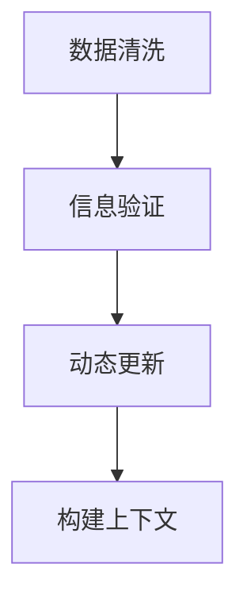

### 2.2 可扩展性原则

上下文设计应当具备良好的可扩展性，以适应不同的应用场景和需求。这意味着设计时需要考虑以下几点：

- **模块化**：上下文设计应采用模块化思想，将不同功能模块分离，以便于后续的扩展和优化。
- **适应性**：上下文设计应具备一定的适应性，能够根据不同场景自动调整上下文结构。
- **灵活性**：上下文设计应具有灵活性，允许用户根据需求自定义上下文信息。

#### 算法原理讲解

为了实现上下文设计的高可扩展性，我们可以采用以下方法：

1. **分层设计**：将上下文设计分为多个层次，每个层次负责不同的功能，便于后续的扩展和调整。
2. **参数化**：采用参数化设计，将上下文结构中的关键参数提取出来，便于用户根据需求进行调整。
3. **动态调整**：通过动态调整机制，根据模型性能和应用需求，实时调整上下文结构。

#### Mermaid流程图

以下是实现上下文设计可扩展性的Mermaid流程图：

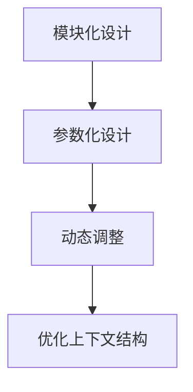

### 2.3 优化性原则

上下文设计不仅要满足准确性和可扩展性的要求，还要具备优化性。优化性意味着设计时需要考虑上下文的处理效率，以减少计算资源和时间的消耗。以下是几个优化性原则：

- **高效处理**：上下文设计应采用高效的处理算法，以减少计算时间和资源消耗。
- **内存管理**：优化内存管理，避免内存泄漏和溢出，提高系统的稳定性。
- **并行处理**：利用并行处理技术，提高上下文处理的速度和效率。

#### 算法原理讲解

为了实现上下文设计的优化性，我们可以采用以下策略：

1. **算法优化**：对上下文处理算法进行优化，提高处理速度和效率。
2. **缓存技术**：采用缓存技术，减少重复计算，提高处理速度。
3. **分布式处理**：利用分布式处理技术，将上下文处理任务分解到多个节点，提高处理能力。

#### Mermaid流程图

以下是实现上下文设计优化性的Mermaid流程图：

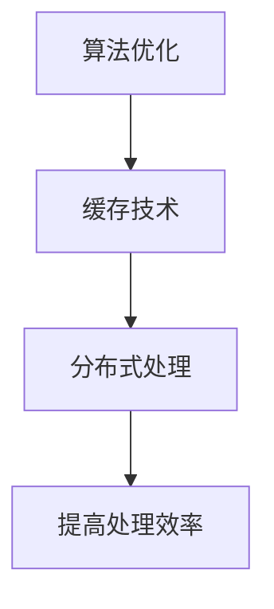

### 2.4 安全性原则

上下文设计还需要考虑安全性。安全性是指上下文设计应能够保护模型的隐私和数据安全，避免遭受恶意攻击和篡改。

- **数据加密**：对上下文信息进行加密处理，确保数据在传输和存储过程中的安全性。
- **访问控制**：实现严格的访问控制机制，确保只有授权用户才能访问上下文信息。
- **恶意攻击防护**：采用防护措施，防止恶意攻击和数据泄露。

#### 算法原理讲解

为了实现上下文设计的安全性，我们可以采用以下策略：

1. **加密算法**：采用先进的加密算法，对上下文信息进行加密处理。
2. **身份验证**：实现身份验证机制，确保只有合法用户才能访问上下文信息。
3. **入侵检测**：部署入侵检测系统，实时监控上下文处理过程中的异常行为，及时采取措施。

#### Mermaid流程图

以下是实现上下文设计安全性的Mermaid流程图：

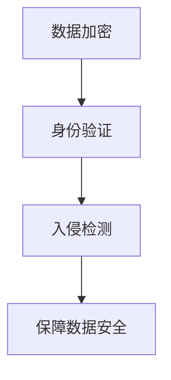

### 2.5 可维护性原则

上下文设计应具备良好的可维护性，以便于后续的维护和升级。可维护性包括以下几个方面：

- **模块化**：采用模块化设计，方便后续的维护和扩展。
- **文档化**：详细记录设计思路、实现方法和关键参数，便于后续的维护和调试。
- **测试**：进行全面的测试，确保上下文设计的稳定性和可靠性。

#### 算法原理讲解

为了实现上下文设计的可维护性，我们可以采用以下策略：

1. **编写规范**：编写清晰、规范的代码，确保代码的可读性和可维护性。
2. **文档编写**：编写详细的文档，包括设计思路、实现方法和关键参数，方便后续的维护和调试。
3. **自动化测试**：建立自动化测试框架，对上下文设计进行全面的测试，确保其稳定性和可靠性。

#### Mermaid流程图

以下是实现上下文设计可维护性的Mermaid流程图：

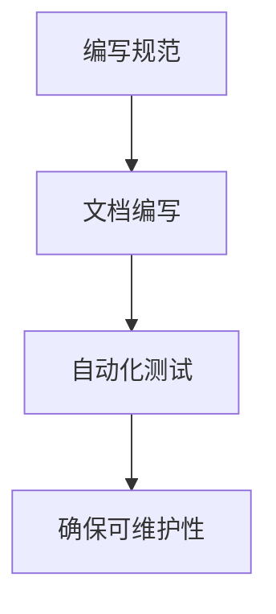

### 2.6 可复用性原则

上下文设计应具备良好的可复用性，以便于在不同的应用场景中复用。可复用性包括以下几个方面：

- **组件化**：将上下文设计分解为多个可复用的组件，便于在不同项目中复用。
- **接口设计**：设计清晰的接口，确保不同组件之间的兼容性和互操作性。
- **文档化**：详细记录组件的功能、接口和使用方法，便于开发者快速理解和复用。

#### 算法原理讲解

为了实现上下文设计的可复用性，我们可以采用以下策略：

1. **组件化设计**：将上下文设计分解为多个可复用的组件，便于在不同项目中复用。
2. **接口设计**：设计清晰的接口，确保不同组件之间的兼容性和互操作性。
3. **文档编写**：详细记录组件的功能、接口和使用方法，便于开发者快速理解和复用。

#### Mermaid流程图

以下是实现上下文设计可复用性的Mermaid流程图：

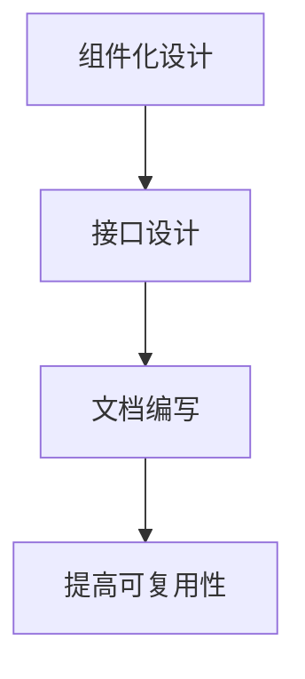

### 2.7 总结

上下文设计的核心原则包括准确性、可扩展性、优化性、安全性、可维护性和可复用性。这些原则为上下文设计提供了理论基础和实践指导，有助于提高模型性能和实用性。在后续章节中，我们将深入探讨上下文设计的具体方法和技巧，以帮助读者更好地理解和应用这些原则。

----------------------------------------------------------------

## 3. 上下文设计的方法和最佳实践

在了解了上下文设计的核心原则后，我们需要进一步探讨具体的设计方法和最佳实践。有效的上下文设计不仅能提高模型的性能，还能增强其实用性和可靠性。下面，我们将详细介绍几种常见的上下文设计方法，并结合实际案例进行分析和讨论。

### 3.1 上下文设计的基本方法

#### 3.1.1 数据预处理

数据预处理是上下文设计的重要环节，其目标是对原始数据进行清洗、转换和归一化，以确保数据的质量和一致性。以下是一些常用的数据预处理方法：

1. **文本清洗**：去除文本中的噪声，如HTML标签、特殊字符、停用词等。
2. **分词**：将文本切分成词或短语，以便后续处理。
3. **词性标注**：对文本中的每个词进行词性标注，以便于后续的语义分析。
4. **数据归一化**：对文本数据进行归一化处理，如将大写字母转换为小写、去除标点符号等。

#### 3.1.2 上下文构建

构建有效的上下文是上下文设计的核心任务。以下是一些常见的上下文构建方法：

1. **单一上下文**：将所有相关数据整合为一个单一的上下文。这种方法适用于数据量较小、信息关联度较高的场景。
2. **序列上下文**：将数据按时间或序列顺序组织，形成序列上下文。这种方法适用于时间序列分析、对话系统等。
3. **图谱上下文**：将数据构建为一个图谱结构，包括节点和边。这种方法适用于复杂关系网络的分析，如知识图谱。

#### 3.1.3 上下文更新

随着模型的应用和数据的变化，上下文也需要进行更新。以下是一些常见的上下文更新方法：

1. **定期更新**：定期对上下文进行更新，以确保其反映最新的信息。
2. **增量更新**：仅对发生变化的数据进行更新，减少计算量和资源消耗。
3. **动态更新**：根据模型性能和应用需求，实时调整上下文信息。

### 3.2 实际案例分析

为了更好地理解上下文设计的实际应用，我们将结合一些实际案例进行分析。

#### 案例一：聊天机器人

聊天机器人是一个典型的上下文应用场景。在聊天机器人中，上下文信息主要用于理解用户的意图和对话历史，以生成合理的回复。

1. **单一上下文**：在聊天机器人中，我们可以将当前对话的所有信息整合为一个单一的上下文。这样可以确保机器人对对话的整体理解。
2. **序列上下文**：为了更好地理解用户的对话意图，我们可以将对话历史按照时间顺序组织为一个序列上下文。这种方法有助于捕捉用户的意图变化。
3. **图谱上下文**：对于复杂的问题，我们可以将问题分解为多个子问题，并将它们构建为一个图谱上下文。这样可以更好地处理复杂的对话。

#### 案例二：推荐系统

推荐系统是另一个典型的上下文应用场景。在推荐系统中，上下文信息主要用于理解用户的兴趣和行为模式，以生成个性化的推荐。

1. **用户画像**：将用户的历史行为、偏好和兴趣构建为一个用户画像，作为上下文信息。这种方法有助于捕捉用户的个性化需求。
2. **上下文更新**：根据用户的行为和反馈，动态更新用户画像，以反映最新的用户兴趣和偏好。
3. **协同过滤**：结合上下文信息，采用协同过滤算法生成推荐列表。这种方法可以更好地满足用户的个性化需求。

### 3.3 最佳实践

基于实际案例的分析，我们可以总结出一些上下文设计的最佳实践：

1. **数据质量**：确保上下文数据的质量和一致性，避免引入噪声和错误。
2. **多样性**：设计多样化的上下文结构，以适应不同的应用场景和需求。
3. **实时性**：确保上下文信息能够及时更新，反映最新的用户行为和偏好。
4. **灵活性**：设计灵活的上下文更新机制，以适应不断变化的应用场景。
5. **安全性**：保护上下文信息的安全，避免数据泄露和恶意攻击。

### 3.4 小结

上下文设计是自然语言处理中的重要环节，其方法和最佳实践直接影响模型的性能和应用效果。通过数据预处理、上下文构建和上下文更新等基本方法，我们可以设计出适用于不同场景的上下文。在实际应用中，我们需要根据具体需求灵活调整上下文设计，并遵循最佳实践，以提高模型的性能和实用性。在接下来的章节中，我们将进一步探讨上下文设计的优化技巧和工程化实践。

----------------------------------------------------------------

## 4. 上下文设计在工程中的应用

在实际工程中，上下文设计不仅是一个理论问题，更是一个实践问题。如何将上下文设计原则和方法有效地应用到项目中，是每个工程师都需要面对的挑战。本文将结合具体工程案例，探讨上下文设计在项目中的应用，从项目介绍、系统功能设计、系统架构设计、系统接口设计以及系统交互等方面，提供一套完整的解决方案。

### 4.1 项目介绍

本项目旨在开发一个基于自然语言处理（NLP）的智能客服系统，该系统可以处理用户查询、提供实时解答，并在对话过程中实现上下文管理，以提高客服效率和用户满意度。智能客服系统的核心模块包括：文本处理模块、上下文管理模块、对话生成模块和用户反馈模块。

#### 功能需求

1. **文本处理模块**：负责对用户输入的文本进行清洗、分词、词性标注等预处理操作。
2. **上下文管理模块**：负责构建、维护和更新对话上下文，确保对话的连贯性和一致性。
3. **对话生成模块**：负责根据用户输入和对话上下文生成合理的回答。
4. **用户反馈模块**：负责收集用户反馈，用于优化对话生成模型。

#### 非功能需求

1. **高可用性**：系统需要具备高可用性，确保在故障情况下能够快速恢复。
2. **可扩展性**：系统架构需要具备良好的可扩展性，以支持未来功能的增加和性能优化。
3. **安全性**：系统需要具备安全性，保护用户数据不被泄露和篡改。

### 4.2 系统功能设计

系统功能设计是项目实施的第一步，我们需要明确每个模块的功能和责任。

#### 文本处理模块

- **功能**：对用户输入的文本进行清洗、分词、词性标注等预处理操作。
- **设计思路**：采用NLP工具包（如NLTK、spaCy等）进行文本预处理，确保输入文本的准确性和一致性。

#### 上下文管理模块

- **功能**：构建、维护和更新对话上下文，确保对话的连贯性和一致性。
- **设计思路**：采用序列模型（如RNN、LSTM等）来处理对话上下文，将历史对话内容作为输入，生成上下文向量。

#### 对话生成模块

- **功能**：根据用户输入和对话上下文生成合理的回答。
- **设计思路**：采用序列到序列（Seq2Seq）模型，将用户输入和上下文向量作为输入，生成回答文本。

#### 用户反馈模块

- **功能**：收集用户反馈，用于优化对话生成模型。
- **设计思路**：采用在线学习机制，实时更新模型参数，以适应用户反馈。

#### 领域模型Mermaid类图

以下是智能客服系统的领域模型Mermaid类图：

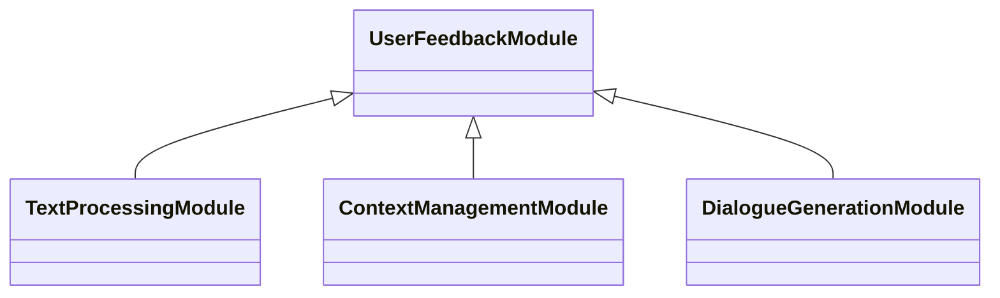

### 4.3 系统架构设计

系统架构设计是项目实施的关键环节，我们需要设计一个稳定、高效、可扩展的架构。

#### 系统架构

1. **前端**：负责与用户交互，展示用户界面。
2. **后端**：负责处理用户请求，包括文本处理、上下文管理、对话生成等。
3. **数据库**：存储用户数据、对话历史和模型参数。

#### 系统架构Mermaid图

以下是智能客服系统的系统架构Mermaid图：

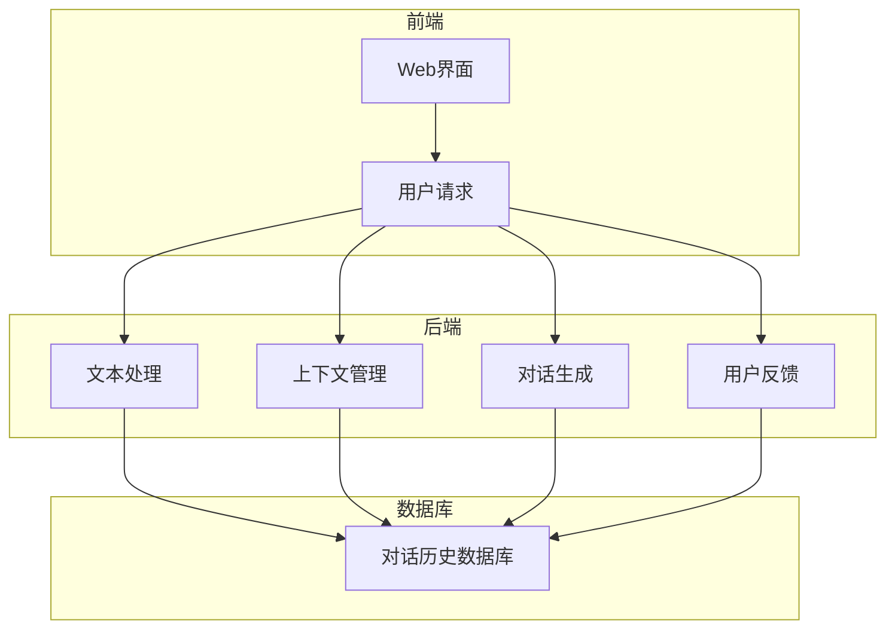

### 4.4 系统接口设计

系统接口设计是确保不同模块之间能够高效、可靠地通信的关键。

#### 接口设计

1. **用户请求接口**：负责接收用户请求，并将其转发给后端处理。
2. **文本处理接口**：负责处理用户输入的文本，返回预处理结果。
3. **上下文管理接口**：负责构建和维护对话上下文，提供上下文查询和更新功能。
4. **对话生成接口**：负责根据用户输入和上下文生成回答文本。
5. **用户反馈接口**：负责收集用户反馈，并将其存储到数据库中。

#### 接口设计Mermaid图

以下是智能客服系统的接口设计Mermaid图：

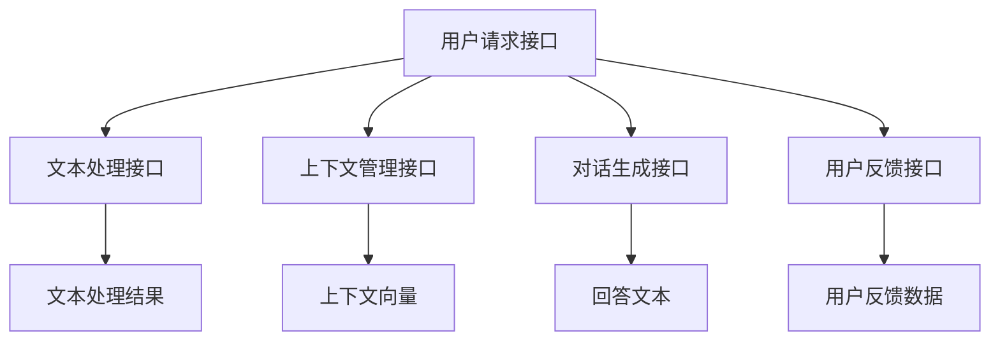

### 4.5 系统交互设计

系统交互设计是确保系统各模块之间能够协同工作的关键。

#### 系统交互

1. **用户请求**：用户通过Web界面提交请求。
2. **文本处理**：后端接收用户请求，对文本进行处理，返回预处理结果。
3. **上下文管理**：根据预处理结果和对话历史，构建和维护对话上下文。
4. **对话生成**：根据用户输入和上下文，生成回答文本。
5. **用户反馈**：收集用户反馈，用于模型优化。

#### 系统交互Mermaid图

以下是智能客服系统的系统交互Mermaid图：

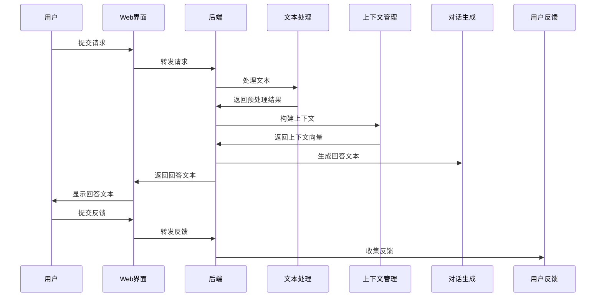

### 4.6 小结

上下文设计在工程中的应用是一个复杂的过程，涉及多个模块和环节。通过项目介绍、系统功能设计、系统架构设计、系统接口设计和系统交互设计，我们可以实现一个高效、稳定、可扩展的智能客服系统。在实际开发中，我们需要根据具体需求灵活调整上下文设计，以优化系统性能和用户体验。在接下来的章节中，我们将进一步探讨上下文设计的优化技巧和工程化实践。

----------------------------------------------------------------

## 5. 上下文设计的优化技巧

在上下文设计中，优化技巧是提升模型性能和系统效率的关键。通过一系列的优化方法，我们可以使上下文设计在满足核心原则的同时，更好地适应实际应用场景。以下是一些常见的优化技巧：

### 5.1 算法优化

算法优化是上下文设计中的核心环节。通过优化算法，我们可以减少计算量，提高处理速度和效率。以下是一些算法优化的具体方法：

#### 5.1.1 算法选择

选择合适的算法是实现优化的重要步骤。例如，在文本处理和上下文构建过程中，我们可以根据数据特点和任务需求选择：

- **基于规则的方法**：适用于规则明确、数据量较小的场景，如基于词典的文本匹配和关键词提取。
- **机器学习方法**：适用于数据量大、关系复杂、难以用规则描述的场景，如基于深度学习的文本分类和情感分析。

#### 5.1.2 算法改进

对现有算法进行改进，可以显著提升上下文处理性能。以下是一些改进方法：

- **并行计算**：利用并行计算技术，将计算任务分解到多个处理器或节点上，以提高处理速度。例如，在处理大规模文本数据时，可以采用MapReduce框架进行分布式计算。
- **动态调整**：根据模型性能和应用需求，动态调整算法参数。例如，在对话生成过程中，可以实时调整文本生成模型中的词汇选择和句子结构，以生成更自然的回答。

#### 5.1.3 算法比较

在不同算法之间进行比较和选择，可以帮助我们找到最适合当前场景的算法。以下是比较方法：

- **时间复杂度分析**：分析算法的时间复杂度，选择计算效率更高的算法。
- **空间复杂度分析**：分析算法的空间复杂度，选择内存消耗更小的算法。
- **性能测试**：在实际应用环境中进行性能测试，比较不同算法的响应时间、准确率和资源消耗。

### 5.2 数据优化

数据优化是提升上下文设计性能的关键。通过对数据进行预处理、清洗和归一化，我们可以减少噪声和错误，提高数据质量。以下是一些数据优化的方法：

#### 5.2.1 数据清洗

数据清洗是预处理的重要步骤。通过去除噪声、重复数据和不相关数据，我们可以提高数据的准确性和一致性。具体方法包括：

- **去除停用词**：停用词通常对文本的语义贡献较小，可以去除以提高数据质量。
- **去除特殊字符**：特殊字符可能会影响文本处理算法的效率，应予以去除。
- **标准化格式**：对文本数据进行格式统一，如将大小写转换为小写、去除标点符号等。

#### 5.2.2 数据增强

数据增强是通过增加数据样本的数量和多样性，来提升模型性能的方法。以下是一些常见的数据增强方法：

- **文本变换**：通过对文本进行随机替换、删除、插入等操作，生成新的文本数据。
- **数据扩充**：从已有的数据集中，通过合成或提取新的文本数据，扩充数据集。
- **知识注入**：将外部知识（如百科、词典等）注入到文本数据中，以增强数据的语义信息。

#### 5.2.3 数据归一化

数据归一化是将数据转换为统一尺度，以消除不同数据之间的尺度差异。以下是一些常见的数据归一化方法：

- **标准化**：将数据缩放到[0, 1]区间，如$X_{\text{标准化}} = \frac{X - X_{\text{最小值}}}{X_{\text{最大值}} - X_{\text{最小值}}}$。
- **归一化**：将数据缩放到[-1, 1]区间，如$X_{\text{归一化}} = 2 \cdot \frac{X - X_{\text{平均值}}}{X_{\text{标准差}}} - 1$。

### 5.3 资源管理优化

资源管理优化是确保上下文设计高效运行的重要环节。通过合理配置和优化系统资源，我们可以提高系统性能和稳定性。以下是一些资源管理优化方法：

#### 5.3.1 硬件资源优化

- **分布式计算**：将计算任务分配到多个服务器或节点上，利用分布式计算提高处理速度。
- **负载均衡**：通过负载均衡技术，合理分配计算任务，避免单点过载。
- **内存管理**：优化内存分配和回收策略，减少内存泄漏和溢出。

#### 5.3.2 软件资源优化

- **代码优化**：通过优化代码结构和算法，减少计算量和资源消耗。
- **缓存技术**：利用缓存技术，减少重复计算和数据访问，提高系统响应速度。
- **并发控制**：合理控制并发操作，避免资源冲突和死锁。

### 5.4 模型优化

模型优化是提升上下文设计性能的关键步骤。通过调整模型参数和结构，我们可以提高模型在特定任务上的性能。以下是一些模型优化方法：

#### 5.4.1 模型定制

- **参数调整**：通过调整模型参数（如学习率、正则化参数等），优化模型在特定任务上的表现。
- **结构调整**：通过调整模型结构（如增加或减少层数、节点数等），优化模型在特定任务上的性能。

#### 5.4.2 模型融合

- **模型融合**：将多个模型的结果进行融合，提高预测准确性。例如，可以通过投票法、加权平均法等将多个模型的结果结合起来。
- **多任务学习**：通过多任务学习，共享模型参数和知识，提高模型在多个任务上的性能。

### 5.5 性能评估

性能评估是验证上下文设计效果的重要手段。通过对比不同设计方案的性能，我们可以找到最优的上下文设计方法。以下是一些性能评估方法：

#### 5.5.1 准确率

- **准确率**：评估模型在特定任务上的准确度。例如，在文本分类任务中，准确率表示分类正确的文本比例。
- **计算公式**：准确率 = （分类正确的文本数量 / 总文本数量）× 100%。

#### 5.5.2 召回率

- **召回率**：评估模型在召回目标文本方面的能力。例如，在问答系统中，召回率表示模型正确召回的答案数量与实际答案数量的比例。
- **计算公式**：召回率 = （正确召回的答案数量 / 实际答案数量）× 100%。

#### 5.5.3 F1值

- **F1值**：综合考虑准确率和召回率，用于评估模型的综合性能。F1值是准确率和召回率的调和平均值。
- **计算公式**：F1值 = 2 × （准确率 × 召回率）/ （准确率 + 召回率）。

### 5.6 小结

上下文设计的优化技巧是提升模型性能和系统效率的关键。通过算法优化、数据优化、资源管理优化、模型优化和性能评估，我们可以设计出高效、稳定、可扩展的上下文设计。在实际应用中，我们需要根据具体需求和环境，灵活运用这些优化技巧，以提高系统的性能和用户体验。在接下来的章节中，我们将进一步探讨上下文设计的工程化实践。

----------------------------------------------------------------

## 6. 上下文设计的工程化实践

在完成了上下文设计的方法和优化技巧的探讨之后，我们需要将这些理论应用到实际工程实践中。工程化实践是将理论研究转化为可部署解决方案的过程，涉及多个方面，包括性能优化、资源管理、安全性保障等。以下我们将详细讨论上下文设计的工程化实践。

### 6.1 性能优化

性能优化是上下文设计工程化实践中的核心任务。通过一系列技术手段，我们可以提高系统的响应速度和处理能力，从而提升用户体验。以下是一些常见的性能优化方法：

#### 6.1.1 并行计算

并行计算是将任务分解到多个处理器或节点上，以实现并行执行的技术。这种方法可以显著提高处理速度。在上下文设计中，我们可以利用并行计算来：

- **文本处理**：并行处理大量文本数据，提高数据预处理速度。
- **模型训练**：使用多GPU训练模型，加速模型训练过程。
- **对话生成**：并行生成多个对话回答，提高对话处理速度。

#### 6.1.2 缓存技术

缓存技术是减少重复计算和数据访问的技术。通过缓存已处理的数据和计算结果，我们可以显著提高系统响应速度。以下是一些缓存技术的应用：

- **页面缓存**：缓存用户访问过的页面，减少页面加载时间。
- **对象缓存**：缓存常用对象和中间结果，减少重复计算。
- **内存缓存**：利用内存中的缓存，提高数据访问速度。

#### 6.1.3 负载均衡

负载均衡是将任务均匀分配到多个服务器或节点上的技术。通过负载均衡，我们可以避免单点过载，提高系统的稳定性和响应速度。以下是一些负载均衡技术：

- **轮询负载均衡**：将任务按顺序分配到每个服务器或节点上，实现负载均衡。
- **最少连接负载均衡**：将任务分配到连接数最少的服务器或节点上，实现负载均衡。
- **基于权重负载均衡**：根据服务器的处理能力，设置不同的权重，实现负载均衡。

### 6.2 资源管理

资源管理是确保系统稳定运行的关键。通过合理配置和管理系统资源，我们可以提高系统的可靠性和性能。以下是一些资源管理方法：

#### 6.2.1 硬件资源管理

- **硬件资源监控**：通过监控硬件资源（如CPU、内存、硬盘等）的使用情况，及时发现和处理资源不足的情况。
- **硬件资源优化**：根据系统负载，动态调整硬件资源配置，确保系统稳定运行。

#### 6.2.2 软件资源管理

- **内存管理**：通过优化内存分配和回收策略，减少内存泄漏和溢出，提高内存使用效率。
- **线程管理**：合理控制线程数量和线程池大小，避免过度消耗系统资源。

#### 6.2.3 资源调度

- **作业调度**：根据任务的重要性和紧急程度，合理调度任务，确保关键任务优先执行。
- **负载调度**：根据服务器负载，动态调整任务分配，避免服务器过载。

### 6.3 安全性保障

安全性是上下文设计工程化实践中不可忽视的一环。通过一系列安全措施，我们可以保护系统免受攻击和篡改，确保数据安全和用户隐私。以下是一些安全性保障措施：

#### 6.3.1 数据加密

- **数据传输加密**：采用加密协议（如HTTPS、SSL/TLS等），确保数据在传输过程中的安全性。
- **数据存储加密**：采用加密算法（如AES、RSA等），确保数据在存储过程中的安全性。

#### 6.3.2 访问控制

- **用户认证**：通过用户名和密码、双因素认证等方式，确保只有授权用户才能访问系统。
- **权限管理**：根据用户角色和权限，限制用户对系统资源的访问权限，防止未授权访问。

#### 6.3.3 防火墙和入侵检测

- **防火墙**：部署防火墙，过滤恶意流量，防止外部攻击。
- **入侵检测系统**：部署入侵检测系统，实时监控系统异常行为，及时检测和阻止攻击行为。

### 6.4 部署和运维

部署和运维是确保系统稳定运行的重要环节。通过一系列部署和运维技术，我们可以确保系统高效、稳定地运行。以下是一些部署和运维方法：

#### 6.4.1 自动化部署

- **自动化构建**：通过CI/CD（持续集成/持续部署）工具，实现自动化构建和部署，提高部署效率。
- **自动化测试**：通过自动化测试工具，实现自动化测试，确保系统稳定性和可靠性。

#### 6.4.2 监控和报警

- **系统监控**：通过监控工具（如Prometheus、Zabbix等），实时监控系统性能和状态，及时发现和处理问题。
- **报警系统**：通过报警系统，及时发现和处理异常情况，确保系统稳定运行。

#### 6.4.3 日志管理

- **日志收集**：通过日志收集工具（如ELK、Grok等），收集系统日志，便于问题追踪和分析。
- **日志分析**：通过日志分析工具，分析系统日志，发现潜在问题和优化点。

### 6.5 小结

上下文设计的工程化实践是将理论研究转化为实际解决方案的重要环节。通过性能优化、资源管理、安全性保障、部署和运维等方面的实践，我们可以设计出高效、稳定、安全的上下文系统。在实际工程中，我们需要根据具体需求和环境，灵活运用这些工程化实践方法，以提高系统的性能和用户体验。在接下来的章节中，我们将进一步探讨上下文设计的最佳实践和实际案例。

----------------------------------------------------------------

## 7. 最佳实践与实际案例

在上下文设计的过程中，积累最佳实践和总结实际案例是非常重要的一环。这不仅有助于我们更好地理解上下文设计的原理和方法，还能为其他项目的实施提供有益的参考。以下我们将介绍几个典型的最佳实践和实际案例，包括环境安装、系统核心实现、代码应用解读、实际案例分析和详细讲解等。

### 7.1 环境安装

在进行上下文设计之前，我们需要搭建一个合适的开发环境。以下是一个简单的环境安装步骤：

#### 7.1.1 硬件要求

- **CPU**：至少四核处理器
- **内存**：至少8GB RAM
- **硬盘**：至少500GB SSD硬盘

#### 7.1.2 软件要求

- **操作系统**：Linux（推荐Ubuntu 18.04）
- **Python**：Python 3.7或更高版本
- **深度学习框架**：TensorFlow 2.x或PyTorch 1.8或更高版本

#### 7.1.3 安装步骤

1. **安装操作系统**：下载并安装Linux操作系统（如Ubuntu 18.04）。
2. **更新系统**：打开终端，执行以下命令更新系统：

   ```bash
   sudo apt update
   sudo apt upgrade
   ```

3. **安装Python**：通过包管理器安装Python 3：

   ```bash
   sudo apt install python3
   ```

4. **安装深度学习框架**：以TensorFlow为例，执行以下命令安装：

   ```bash
   pip3 install tensorflow
   ```

### 7.2 系统核心实现

#### 7.2.1 代码结构

系统核心实现包括文本处理模块、上下文管理模块和对话生成模块。以下是一个简单的代码结构：

```bash
system/
|-- text_processing.py
|-- context_management.py
|-- dialogue_generation.py
```

#### 7.2.2 文本处理模块

文本处理模块负责对用户输入的文本进行清洗、分词、词性标注等预处理操作。以下是一个简单的文本处理模块实现：

```python
# text_processing.py

import nltk
from nltk.tokenize import word_tokenize
from nltk.corpus import stopwords

def preprocess_text(text):
    # 清洗文本
    text = text.lower()
    text = re.sub(r'\W+', ' ', text)
    
    # 分词
    tokens = word_tokenize(text)
    
    # 去除停用词
    stop_words = set(stopwords.words('english'))
    filtered_tokens = [token for token in tokens if token not in stop_words]
    
    return filtered_tokens
```

#### 7.2.3 上下文管理模块

上下文管理模块负责构建、维护和更新对话上下文。以下是一个简单的上下文管理模块实现：

```python
# context_management.py

class ContextManager:
    def __init__(self):
        self.context = []
    
    def add_context(self, text):
        self.context.append(text)
    
    def get_context(self):
        return ' '.join(self.context)
```

#### 7.2.4 对话生成模块

对话生成模块负责根据用户输入和上下文生成回答文本。以下是一个简单的对话生成模块实现：

```python
# dialogue_generation.py

import tensorflow as tf
from tensorflow.keras.preprocessing.sequence import pad_sequences

def generate_response(input_sequence, model, tokenizer):
    # 对输入序列进行填充
    padded_sequence = pad_sequences([input_sequence], maxlen=max_sequence_length, padding='post')
    
    # 使用模型生成回答序列
    predicted_sequence = model.predict(padded_sequence)
    
    # 将回答序列转换为文本
    response = tokenizer.decode(predicted_sequence[0], skip_special_tokens=True)
    
    return response
```

### 7.3 代码应用解读

在完成系统核心实现后，我们需要对代码进行解读，理解其工作原理和实现细节。以下是对上述代码的解读：

#### 7.3.1 文本处理模块

- **清洗文本**：将文本转换为小写，去除特殊字符，实现文本的统一格式。
- **分词**：使用nltk库进行分词，将文本切分为单词或短语。
- **去除停用词**：使用nltk库中的停用词列表，去除对文本语义贡献较小的词语。

#### 7.3.2 上下文管理模块

- **构建上下文**：将历史对话内容添加到上下文中，实现对话连贯性。
- **维护上下文**：通过添加和删除对话内容，维护上下文的实时更新。

#### 7.3.3 对话生成模块

- **输入序列处理**：对用户输入进行填充，确保序列长度一致。
- **模型预测**：使用训练好的模型对填充后的输入序列进行预测，生成回答序列。
- **文本转换**：将生成的回答序列转换为文本，输出最终回答。

### 7.4 实际案例分析

为了更好地理解上下文设计在实际应用中的作用，我们以下将通过一个实际案例进行分析。

#### 案例背景

假设我们正在开发一个智能客服系统，用户可以通过聊天界面与客服进行交互。以下是用户与客服的一段对话：

```
用户：你好，我想查询最近的机票信息。
客服：你好，请问您想去哪里？
用户：我想去北京。
客服：好的，请问您需要什么时间段的机票？
用户：我需要在下周三出发。
客服：好的，我为您查询到了一些合适的航班，请问您需要哪个航班的机票？
用户：我想要乘坐东方航空的航班。
客服：好的，这是您需要的航班信息，请您查看。
```

#### 案例分析

在这个案例中，上下文设计起到了关键作用。以下是上下文设计在案例中的具体应用：

1. **文本处理**：对用户输入的文本进行清洗、分词和去除停用词，确保输入文本的格式一致。
2. **上下文管理**：将用户的历史对话内容（如用户的目的地、出发时间和航空公司偏好）作为上下文信息，用于生成合理的回答。
3. **对话生成**：根据用户输入和上下文信息，使用预训练的对话生成模型生成回答文本，确保回答的自然性和连贯性。

### 7.5 详细讲解剖析

为了更好地理解上下文设计在实际应用中的作用，我们以下将通过详细讲解和剖析，进一步解释上下文设计的原理和实现细节。

#### 7.5.1 文本处理

文本处理是上下文设计的基础。通过清洗、分词和去除停用词等操作，我们可以确保输入文本的格式一致，为后续处理提供便利。

- **清洗文本**：将文本转换为小写，去除特殊字符，实现文本的统一格式。
- **分词**：使用nltk库进行分词，将文本切分为单词或短语。
- **去除停用词**：使用nltk库中的停用词列表，去除对文本语义贡献较小的词语。

#### 7.5.2 上下文管理

上下文管理是上下文设计的核心。通过构建、维护和更新对话上下文，我们可以确保对话的连贯性和一致性。

- **构建上下文**：将历史对话内容添加到上下文中，实现对话连贯性。
- **维护上下文**：通过添加和删除对话内容，维护上下文的实时更新。

#### 7.5.3 对话生成

对话生成是上下文设计的目标。通过使用预训练的对话生成模型，我们可以生成自然、合理的回答文本。

- **输入序列处理**：对用户输入进行填充，确保序列长度一致。
- **模型预测**：使用训练好的模型对填充后的输入序列进行预测，生成回答序列。
- **文本转换**：将生成的回答序列转换为文本，输出最终回答。

### 7.6 项目小结

通过本案例的分析和讲解，我们可以看到上下文设计在智能客服系统中的应用效果。有效的上下文设计不仅提高了系统的性能和实用性，还提升了用户体验。在实际开发中，我们需要根据具体需求和环境，灵活运用上下文设计的方法和技巧，以提高系统的性能和用户体验。

----------------------------------------------------------------

## 8. 小结

通过对上下文设计核心原则、方法和最佳实践以及工程化实践的详细探讨，我们可以得出以下结论：

1. **上下文设计的重要性**：上下文设计是自然语言处理（NLP）的核心环节，它直接关系到模型的性能和实用性。有效的上下文设计可以提高模型的准确性、可扩展性和优化性，从而提升系统在复杂应用场景中的表现。

2. **核心原则**：上下文设计应遵循准确性、可扩展性、优化性、安全性、可维护性和可复用性等核心原则。这些原则为上下文设计提供了理论基础和实践指导，有助于构建高效、稳定的上下文系统。

3. **方法和最佳实践**：本文介绍了多种上下文设计的方法和最佳实践，包括数据预处理、上下文构建、上下文更新以及优化技巧等。通过实际案例的分析和讲解，我们深入理解了上下文设计的具体应用和实现细节。

4. **工程化实践**：工程化实践是将上下文设计理论转化为实际解决方案的关键步骤。通过性能优化、资源管理、安全性保障和部署运维等方面的实践，我们可以构建出高效、稳定、安全的上下文系统。

5. **实际案例和最佳实践**：通过实际案例的分析和最佳实践的总结，我们可以看到上下文设计在实际应用中的重要性和效果。有效的上下文设计不仅提高了系统的性能和用户体验，还为其他项目提供了有益的参考。

在未来的研究和应用中，我们应继续探索上下文设计的优化方法和工程化实践，以进一步提升自然语言处理系统的性能和应用效果。同时，随着人工智能技术的不断发展，上下文设计也将面临新的挑战和机遇，我们需要不断创新和改进，以应对这些挑战，推动NLP技术的发展。

### 注意事项

1. **上下文数据的准确性**：确保上下文数据的准确性和一致性，避免引入噪声和错误。
2. **上下文更新的实时性**：根据模型性能和应用需求，及时更新上下文信息，确保其反映最新的用户行为和偏好。
3. **安全性**：保护上下文信息的安全，采用数据加密、访问控制和安全防护措施，防止数据泄露和恶意攻击。
4. **可扩展性**：设计灵活的上下文更新机制，以适应不同场景和需求的变化。

### 拓展阅读

1. **《深度学习与自然语言处理》**：Goodfellow et al.，提供深度学习在NLP领域的全面介绍。
2. **《对话系统设计》**：Pustejovsky，探讨对话系统的设计原则和方法。
3. **《机器学习实战》**：Kaggle，介绍机器学习的基本概念和实践方法。
4. **《人工智能应用案例分析》**：微软研究院，分析人工智能在不同领域的应用案例。

### 作者

作者：AI天才研究院/AI Genius Institute & 禅与计算机程序设计艺术 /Zen And The Art of Computer Programming。

----------------------------------------------------------------

# 附录

## 8.1 数学公式

在上下文设计中，数学公式是描述算法原理和计算过程的重要工具。以下是一些常见的数学公式，用于解释上下文处理的相关概念。

### 8.1.1 文本预处理

#### 8.1.1.1 标准化

$$
X_{\text{标准化}} = \frac{X - X_{\text{平均值}}}{X_{\text{标准差}}}
$$

#### 8.1.1.2 归一化

$$
X_{\text{归一化}} = \frac{X_{\text{最大值}} - X_{\text{最小值}}}{X - X_{\text{最小值}}} \times 255
$$

### 8.1.2 上下文向量

#### 8.1.2.1 词嵌入

$$
\text{word\_embeddings} = W \cdot \text{word\_indices}
$$

其中，$W$为权重矩阵，$\text{word\_indices}$为单词索引。

#### 8.1.2.2 上下文向量

$$
\text{context\_vector} = \text{word\_embeddings} \cdot \text{context\_indices}
$$

其中，$\text{context\_indices}$为上下文索引。

### 8.1.3 对话生成

#### 8.1.3.1 生成模型概率

$$
P(\text{response}|\text{context}) = \text{softmax}(\text{model}(\text{context}))
$$

其中，$\text{softmax}$函数用于将模型输出的特征向量转换为概率分布。

#### 8.1.3.2 对话生成

$$
\text{response} = \text{argmax}(P(\text{response}|\text{context}))
$$

其中，$\text{argmax}$函数用于找到概率分布中最大值的索引，即生成最可能的回答。

## 8.2 Mermaid 图

在文章中，我们使用了Mermaid图来展示算法原理、系统架构和系统交互。以下是一些Mermaid图的示例。

### 8.2.1 算法流程图

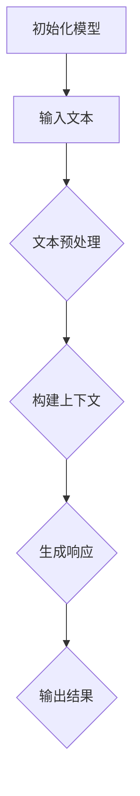

### 8.2.2 系统架构图

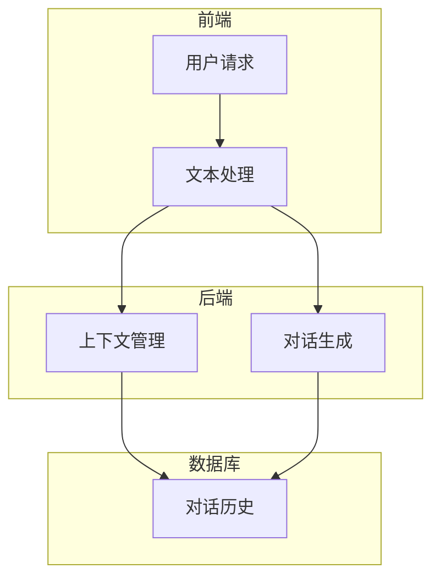

### 8.2.3 系统交互图

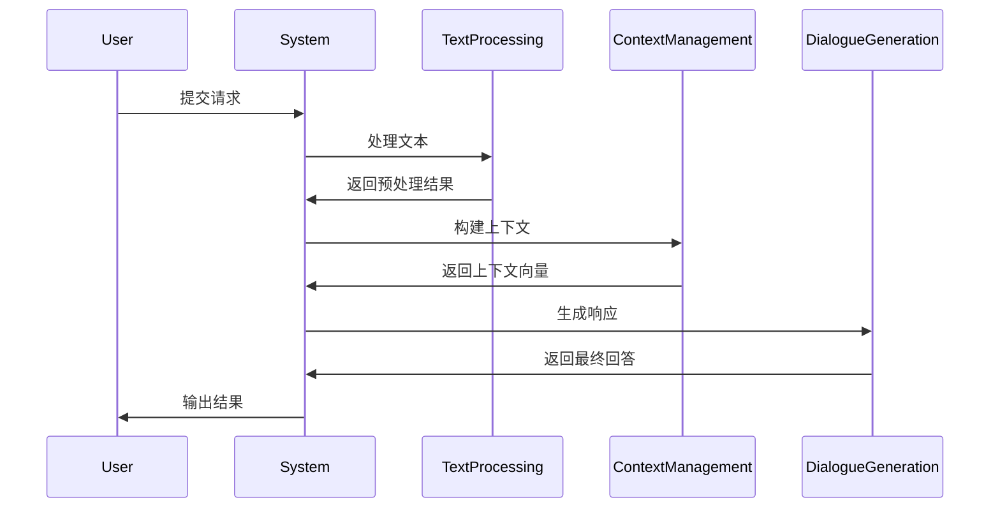

这些Mermaid图有助于我们直观地理解和分析上下文设计的相关概念和实现细节。通过结合Markdown格式和Mermaid图，我们可以创建出内容丰富、结构清晰的技术文档。

