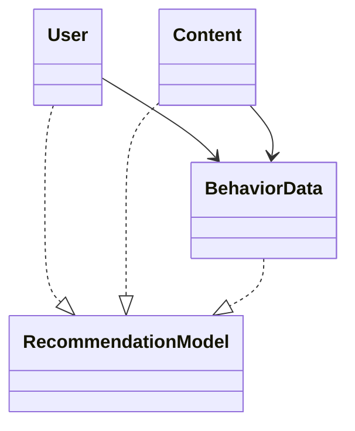
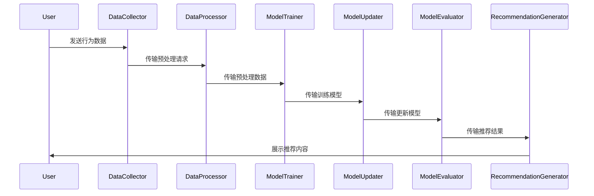

                 

### 引言

#### 问题背景

在当今信息化社会，数据的规模和种类日益增长，传统的批量处理方式已经难以满足实际应用的需求。特别是对于动态变化的环境，如社交媒体、金融交易和智能交通系统等，数据分布和特性可能随时发生变化。为了实时适应这些变化，增量学习成为了一种关键技术，它允许模型在新的数据到来时进行更新和优化，而无需重新从头开始训练。在这种背景下，prompt工程（Prompt Engineering）的概念应运而生，它专注于如何有效地利用增量学习来处理动态数据，以实现智能系统的持续学习和优化。

#### 文章核心内容

本文将深入探讨prompt工程中的增量学习评测策略。文章将分为四个主要部分：背景介绍与核心概念、核心概念与联系、算法原理讲解以及系统分析与架构设计。首先，我们将回顾prompt工程和增量学习的基本概念，阐述它们在动态数据处理中的重要性。接着，我们将详细分析增量学习的原理和特性，并与相关技术进行对比，以明确增量学习在prompt工程中的应用价值。随后，我们将介绍几种常见的增量学习算法，并详细讲解其原理和数学模型，并通过Python代码实现来加深理解。最后，我们将通过一个实际项目案例，展示增量学习在prompt工程中的系统架构设计和应用实践。

通过本文的阅读，读者将能够：

1. 理解prompt工程和增量学习的基本概念及重要性。
2. 掌握增量学习的原理和特性，并能够进行有效的算法选择和应用。
3. 通过具体案例，了解增量学习在prompt工程中的系统架构设计和实现细节。
4. 获得在实际项目中应用增量学习和prompt工程的最佳实践建议。

### 《prompt工程中的增量学习评测策略》目录大纲

在接下来的章节中，我们将逐一深入探讨文章的核心内容，以清晰、逻辑严密的方式展开论述。

#### 第一部分：背景介绍与核心概念

**第1章：prompt工程与增量学习概述**

- **1.1 问题背景**
  - **1.1.1 大规模数据处理需求**
  - **1.1.2 数据分布变化的挑战**
  - **1.1.3 增量学习的应用场景**

- **1.2 增量学习的基本概念**
  - **1.2.1 增量学习的定义**
  - **1.2.2 增量学习的优势与挑战**
  - **1.2.3 增量学习的核心概念解析**

- **1.3 prompt工程的基本概念**
  - **1.3.1 prompt工程的定义**
  - **1.3.2 prompt工程的目标与挑战**
  - **1.3.3 prompt工程的关键技术**

- **1.4 增量学习在prompt工程中的应用**
  - **1.4.1 增量学习在prompt工程中的重要作用**
  - **1.4.2 增量学习策略的适用性分析**
  - **1.4.3 增量学习与prompt工程的协同效应**

- **1.5 本章小结**

#### 第二部分：核心概念与联系

**第2章：增量学习原理与特性**

- **2.1 增量学习原理**
  - **2.1.1 增量学习的理论基础**
  - **2.1.2 增量学习的分类**
  - **2.1.3 增量学习的特点**

- **2.2 增量学习与相关技术的对比分析**
  - **2.2.1 增量学习与传统机器学习的对比**
  - **2.2.2 增量学习与迁移学习的对比**
  - **2.2.3 增量学习与在线学习的对比**

- **2.3 增量学习模型的基本架构**
  - **2.3.1 增量学习模型的组成部分**
  - **2.3.2 增量学习模型的工作流程**
  - **2.3.3 增量学习模型的优化方法**

- **2.4 增量学习在prompt工程中的应用分析**
  - **2.4.1 增量学习在prompt模型训练中的应用**
  - **2.4.2 增量学习在prompt模型优化中的应用**
  - **2.4.3 增量学习在prompt模型评估中的应用**

- **2.5 本章小结**

#### 第三部分：算法原理讲解

**第3章：增量学习算法**

- **3.1 增量学习算法介绍**
  - **3.1.1 常见的增量学习算法**
  - **3.1.2 增量学习算法的分类与特点**
  - **3.1.3 选择合适的增量学习算法**

- **3.2 算法原理与数学模型**
  - **3.2.1 算法原理概述**
  - **3.2.2 数学模型推导**
  - **3.2.3 算法公式**

- **3.3 Python代码实现**
  - **3.3.1 环境搭建**
  - **3.3.2 代码实现流程**
  - **3.3.3 实例分析**

- **3.4 增量学习算法的应用场景**
  - **3.4.1 增量学习在prompt模型训练中的应用**
  - **3.4.2 增量学习在prompt模型优化中的应用**
  - **3.4.3 增量学习在prompt模型评估中的应用**

- **3.5 本章小结**

#### 第四部分：系统分析与架构设计

**第4章：prompt工程中的增量学习架构设计**

- **4.1 问题场景介绍**
  - **4.1.1 场景背景**
  - **4.1.2 需求分析**
  - **4.1.3 解决方案目标**

- **4.2 项目介绍**
  - **4.2.1 项目背景**
  - **4.2.2 项目目标**
  - **4.2.3 项目架构设计**

- **4.3 系统功能设计**
  - **4.3.1 领域模型（使用Mermaid类图表示）**
  - **4.3.2 功能模块划分**
  - **4.3.3 功能描述**

- **4.4 系统架构设计**
  - **4.4.1 系统架构概述（使用Mermaid架构图表示）**
  - **4.4.2 架构层次与组件**
  - **4.4.3 系统交互设计**

- **4.5 系统接口设计**
  - **4.5.1 接口规范**
  - **4.5.2 接口实现**
  - **4.5.3 接口测试**

- **4.6 系统交互设计**
  - **4.6.1 交互流程（使用Mermaid序列图表示）**

通过以上详细的目录大纲，读者可以对文章的整体结构和内容有一个清晰的把握，以便更好地理解和吸收文章的核心观点和技术细节。

### 关键词

- **Prompt工程**：专注于通过设计高质量的提示来增强人工智能模型的能力和应用。
- **增量学习**：一种机器学习方法，能够在新数据到来时对模型进行增量更新，而非从头开始重新训练。
- **评测策略**：用于评估和优化增量学习模型在实际应用中的性能和效果。
- **动态数据处理**：处理不断变化的数据集，确保模型能够适应新的数据分布和特性。
- **系统架构设计**：构建高效、可扩展的增量学习系统，以满足实际应用需求。

### 摘要

本文旨在深入探讨prompt工程中的增量学习评测策略，重点分析其在动态数据处理中的应用和效果。首先，我们介绍了prompt工程和增量学习的基本概念，明确了它们在数据处理中的重要性。接着，通过对增量学习原理的详细解析，我们对比了增量学习与传统机器学习、迁移学习和在线学习的差异，揭示了增量学习的核心特性。随后，我们介绍了几种常见的增量学习算法，并通过Python代码实现，深入讲解了算法原理和数学模型。最后，我们通过一个实际项目案例，展示了增量学习在prompt工程中的系统架构设计和实现细节，提供了实用的评测策略和方法。本文旨在为从事智能系统开发和优化的读者提供具有实际指导意义的技术参考。

### 第一部分：背景介绍与核心概念

#### 第1章：prompt工程与增量学习概述

##### 1.1 问题背景

在当今信息化社会，数据的规模和种类日益增长，传统的批量处理方式已经难以满足实际应用的需求。特别是在面对动态变化的数据环境时，如社交媒体、金融交易和智能交通系统等，数据分布和特性可能随时发生变化。这种背景下，prompt工程和增量学习成为了处理动态数据的重要技术手段。

###### 1.1.1 大规模数据处理需求

随着互联网和物联网的发展，数据来源日益丰富，数据量呈爆炸式增长。如何高效地处理这些大规模数据，提取有价值的信息，成为了一个重要的课题。传统的方法往往依赖于批量处理，但这种处理方式在面对动态变化的数据时存在明显的局限性。数据一旦发生变化，需要重新进行批量处理，不仅效率低下，还可能导致模型效果的下降。

###### 1.1.2 数据分布变化的挑战

在动态变化的数据环境中，数据分布和特性可能会随时间不断变化。例如，在社交媒体平台，用户兴趣和行为模式可能会因时间、热点事件等因素发生显著变化。金融交易领域中的数据分布也可能因市场波动、政策变化等因素发生剧烈变动。这种数据分布的变化对传统的批量处理方法提出了巨大的挑战。

###### 1.1.3 增量学习的应用场景

增量学习是一种针对动态数据环境的新型学习方式，它可以在新数据到来时对模型进行更新和优化，而无需重新从头开始训练。这种方式在处理动态数据方面具有显著的优势，可以有效地适应数据分布的变化。以下是增量学习的一些典型应用场景：

- **社交媒体分析**：通过增量学习，模型可以实时分析用户在社交媒体上的行为和兴趣变化，提供更加精准的内容推荐。
- **金融市场预测**：在金融市场预测中，增量学习可以帮助模型及时捕捉市场变化，提供更为准确的预测结果。
- **智能交通系统**：通过增量学习，智能交通系统可以实时调整路线规划和交通信号控制策略，优化交通流量。

##### 1.2 增量学习的基本概念

增量学习（Incremental Learning）是一种机器学习方法，它允许模型在新的数据到来时进行增量更新，而不是从头开始重新训练。这种方法在处理动态数据环境中具有显著的优势，可以避免模型因数据分布变化而导致性能下降的问题。

###### 1.2.1 增量学习的定义

增量学习，也称为在线学习（Online Learning），是指在学习过程中，模型不断地接收新的数据样本，并根据这些新数据对模型进行实时更新。与传统的批量学习（Batch Learning）不同，增量学习不需要将所有数据一次性处理完毕，而是可以在数据逐渐积累的过程中不断进行学习。

###### 1.2.2 增量学习的优势与挑战

增量学习具有以下优势：

- **实时性**：增量学习可以在新数据到来时立即进行更新，从而实现实时学习。
- **效率**：增量学习避免了重复处理大量不变数据，提高了学习效率。
- **适应性**：增量学习能够适应数据分布的变化，确保模型在动态数据环境中保持良好的性能。

然而，增量学习也面临一些挑战：

- **数据依赖**：增量学习依赖于新数据的不断输入，一旦数据供应中断，学习过程将无法继续。
- **数据分布问题**：在增量学习中，新数据和旧数据之间的分布差异可能会对模型性能产生负面影响。

###### 1.2.3 增量学习的核心概念解析

以下是增量学习的几个核心概念：

- **数据样本**：增量学习中的数据样本是指模型需要处理的新数据，这些数据可以是单个样本，也可以是一批样本。
- **更新规则**：更新规则是指模型根据新数据对自身进行更新的方法。常见的更新规则包括梯度下降、随机梯度下降等。
- **适应能力**：适应能力是指模型在处理新数据时，能够迅速调整自身参数，以适应新的数据分布。

##### 1.3 prompt工程的基本概念

prompt工程是一种专注于如何通过设计高质量的提示来增强人工智能模型能力的方法。在增量学习背景下，prompt工程尤为重要，因为它可以指导模型如何处理动态数据，实现更有效的学习和优化。

###### 1.3.1 prompt工程的定义

prompt工程，也称为提示工程，是指通过设计高质量的提示（Prompt）来引导和优化人工智能模型的方法。提示可以是文本、图像、音频等多种形式，目的是为模型提供更清晰、更有针对性的信息，帮助模型更好地理解和处理数据。

###### 1.3.2 prompt工程的目标与挑战

prompt工程的目标是：

- **提高模型的鲁棒性**：通过高质量的提示，帮助模型更好地应对不同类型的数据和场景。
- **提升模型的表现力**：高质量的提示可以引导模型挖掘数据中的更多信息和价值，提高模型的表现力。

然而，prompt工程也面临一些挑战：

- **设计复杂性**：高质量的提示设计需要深入理解数据和应用场景，具有很高的复杂性。
- **适应性**：如何确保提示能够适应动态变化的数据环境，是prompt工程需要解决的关键问题。

###### 1.3.3 prompt工程的关键技术

prompt工程的关键技术包括：

- **提示设计**：通过设计高质量的提示，引导模型更好地理解和处理数据。
- **适应性**：确保提示能够适应动态变化的数据环境，保持模型的高效性。
- **评估与优化**：通过评估和优化提示效果，不断提升模型的表现力。

##### 1.4 增量学习在prompt工程中的应用

增量学习与prompt工程的结合，为动态数据处理提供了强大的工具。以下将探讨增量学习在prompt工程中的具体应用。

###### 1.4.1 增量学习在prompt工程中的重要作用

增量学习在prompt工程中具有以下重要作用：

- **实时更新模型**：通过增量学习，模型可以实时更新，适应新数据环境。
- **提高模型适应性**：增量学习可以帮助模型更好地适应动态变化的数据分布。
- **优化模型性能**：通过增量学习，模型可以在数据不断变化的环境中保持良好的性能。

###### 1.4.2 增量学习策略的适用性分析

增量学习策略在以下场景中具有较好的适用性：

- **数据实时处理**：如社交媒体分析、金融交易预测等，需要实时响应数据变化。
- **数据分布变化频繁**：如智能交通系统、推荐系统等，数据分布变化较为频繁。
- **数据量较大**：在数据量较大的场景中，增量学习可以有效减少计算量，提高处理效率。

###### 1.4.3 增量学习与prompt工程的协同效应

增量学习与prompt工程的结合，可以实现以下协同效应：

- **提升模型表现力**：通过高质量的提示，帮助模型更好地理解和处理动态数据，提升模型表现力。
- **优化学习效率**：增量学习可以减少重复计算，提高学习效率。
- **增强模型鲁棒性**：通过实时更新和适应，增强模型在动态数据环境中的鲁棒性。

##### 1.5 本章小结

本章首先介绍了大规模数据处理需求和数据分布变化的挑战，阐述了增量学习的应用场景和基本概念。接着，我们探讨了prompt工程的基本概念、目标与挑战，以及关键技术在动态数据处理中的应用。最后，我们分析了增量学习在prompt工程中的重要作用和适用性，揭示了增量学习与prompt工程的协同效应。通过本章的介绍，读者可以初步了解增量学习和prompt工程的基本概念和核心要点，为后续章节的深入探讨打下基础。

### 第一部分：背景介绍与核心概念

#### 第1章：prompt工程与增量学习概述

##### 1.2 增量学习的基本概念

增量学习是一种机器学习方法，它允许模型在新的数据到来时进行增量更新，而不是从头开始重新训练。这种方法在处理动态数据环境中具有显著的优势，可以避免模型因数据分布变化而导致性能下降的问题。

###### 1.2.1 增量学习的定义

增量学习，也称为在线学习（Online Learning），是指在学习过程中，模型不断地接收新的数据样本，并根据这些新数据对模型进行实时更新。与传统的批量学习（Batch Learning）不同，增量学习不需要将所有数据一次性处理完毕，而是可以在数据逐渐积累的过程中不断进行学习。

###### 1.2.2 增量学习的优势与挑战

增量学习具有以下优势：

- **实时性**：增量学习可以在新数据到来时立即进行更新，从而实现实时学习。
- **效率**：增量学习避免了重复处理大量不变数据，提高了学习效率。
- **适应性**：增量学习能够适应数据分布的变化，确保模型在动态数据环境中保持良好的性能。

然而，增量学习也面临一些挑战：

- **数据依赖**：增量学习依赖于新数据的不断输入，一旦数据供应中断，学习过程将无法继续。
- **数据分布问题**：在增量学习中，新数据和旧数据之间的分布差异可能会对模型性能产生负面影响。

###### 1.2.3 增量学习的核心概念解析

以下是增量学习的几个核心概念：

- **数据样本**：增量学习中的数据样本是指模型需要处理的新数据，这些数据可以是单个样本，也可以是一批样本。
- **更新规则**：更新规则是指模型根据新数据对自身进行更新的方法。常见的更新规则包括梯度下降、随机梯度下降等。
- **适应能力**：适应能力是指模型在处理新数据时，能够迅速调整自身参数，以适应新的数据分布。

#### 第2章：增量学习原理与特性

##### 2.1 增量学习原理

增量学习通过不断地接收新数据样本，对模型进行增量更新，从而实现学习过程。这种更新过程通常包括以下几个步骤：

1. **数据接收**：模型不断地接收新数据样本。
2. **预处理**：对新数据进行预处理，如归一化、去噪等。
3. **模型更新**：根据新数据样本，对模型进行更新，调整模型参数。
4. **性能评估**：评估更新后的模型在已有数据集上的性能，确保模型在动态数据环境中保持良好的性能。

##### 2.2 增量学习与相关技术的对比分析

增量学习与其他一些相关技术存在一定的相似性，但它们在应用场景和原理上有所不同。以下是增量学习与传统机器学习、迁移学习和在线学习的一些对比：

###### 2.2.1 增量学习与传统机器学习的对比

传统机器学习通常将所有数据一次性处理完毕，而增量学习则是逐步处理新数据，更新模型。具体区别如下：

- **数据处理方式**：传统机器学习采用批量处理，而增量学习采用逐步处理。
- **性能影响**：增量学习可以实时适应数据变化，而传统机器学习则需要重新训练。
- **计算资源**：增量学习可以节省计算资源，减少重复处理不变数据的工作量。

###### 2.2.2 增量学习与迁移学习的对比

迁移学习是一种将已有模型在不同数据集上应用的技术，而增量学习则是逐步更新模型以适应新数据。具体区别如下：

- **数据来源**：迁移学习利用已有的模型，而增量学习逐步接收新数据。
- **学习目标**：迁移学习旨在利用已有模型的知识，而增量学习则关注逐步优化模型。
- **应用场景**：迁移学习适用于数据量较小、数据分布差异较大的场景，而增量学习适用于数据量较大、数据分布动态变化的场景。

###### 2.2.3 增量学习与在线学习的对比

在线学习与增量学习在概念上具有一定的相似性，但增量学习更侧重于模型的增量更新，而在线学习更侧重于实时更新和调整。具体区别如下：

- **更新方式**：增量学习在每次接收新数据时更新模型，而在线学习则可能在较短的时间内多次更新模型。
- **学习策略**：增量学习强调逐步更新和适应，而在线学习则强调实时调整和优化。
- **适用性**：增量学习适用于数据量较大、数据分布动态变化的场景，而在线学习适用于数据量较小、实时性要求较高的场景。

##### 2.3 增量学习模型的基本架构

增量学习模型的基本架构通常包括以下几个部分：

1. **数据输入模块**：负责接收和处理新数据样本。
2. **模型更新模块**：根据新数据样本对模型进行更新，调整模型参数。
3. **性能评估模块**：评估更新后的模型在已有数据集上的性能。
4. **存储模块**：用于存储模型参数和历史数据，以便后续的模型更新和评估。

##### 2.4 增量学习在prompt工程中的应用分析

增量学习在prompt工程中具有广泛的应用，以下将探讨其在prompt模型训练、优化和评估中的应用。

###### 2.4.1 增量学习在prompt模型训练中的应用

增量学习可以在prompt模型训练过程中发挥重要作用，通过逐步更新模型参数，实现更高效的学习。具体应用如下：

- **实时调整提示**：根据新数据样本，实时调整提示内容，提高模型对动态数据的适应性。
- **优化模型参数**：通过逐步更新模型参数，优化模型在动态数据环境中的性能。

###### 2.4.2 增量学习在prompt模型优化中的应用

增量学习可以用于prompt模型优化，通过逐步更新模型参数，实现模型性能的持续提升。具体应用如下：

- **自适应调整**：根据新数据样本，自适应调整模型参数，以适应动态数据分布。
- **性能评估**：通过评估更新后的模型在已有数据集上的性能，确保模型在动态数据环境中保持良好的性能。

###### 2.4.3 增量学习在prompt模型评估中的应用

增量学习可以用于prompt模型评估，通过逐步更新模型参数，评估模型在动态数据环境中的性能。具体应用如下：

- **实时评估**：通过实时更新模型参数，实时评估模型在动态数据环境中的性能。
- **动态调整**：根据评估结果，动态调整模型参数，以实现更优的性能。

##### 2.5 本章小结

本章首先介绍了增量学习的基本概念、优势和挑战，并详细解析了增量学习的核心概念。接着，我们对比了增量学习与传统机器学习、迁移学习和在线学习的区别，分析了增量学习模型的基本架构。最后，我们探讨了增量学习在prompt工程中的应用，包括模型训练、优化和评估。通过本章的讨论，读者可以更深入地了解增量学习的原理和应用，为后续章节的深入探讨打下基础。

### 第三部分：算法原理讲解

#### 第3章：增量学习算法

##### 3.1 增量学习算法介绍

增量学习算法是一类特殊的机器学习算法，它们的核心目标是在新数据不断加入的过程中，对模型进行增量更新，以保持模型的准确性。以下将介绍几种常见的增量学习算法。

###### 3.1.1 常见的增量学习算法

1. **线性回归（Linear Regression）**
   - 线性回归是一种经典的增量学习算法，它适用于线性关系较强的问题。
   - 在增量学习过程中，模型参数（权重和偏置）会根据新数据实时更新。

2. **决策树（Decision Tree）**
   - 决策树是一种能够进行增量更新的分类算法，特别适用于动态环境。
   - 在新数据加入时，决策树可以动态地调整其结构，以适应新的数据分布。

3. **k-近邻（k-Nearest Neighbors, k-NN）**
   - k-近邻是一种基于实例的增量学习算法，它通过计算新数据与训练样本的相似度来进行分类。
   - 在新数据加入时，k-NN会更新其邻近样本集，以保持分类的准确性。

4. **支持向量机（Support Vector Machine, SVM）**
   - 支持向量机是一种强大的分类算法，它也能够进行增量更新。
   - 在新数据加入时，SVM会调整其超平面，以适应新的数据分布。

5. **神经网络（Neural Networks）**
   - 神经网络是一种能够进行增量更新的通用学习算法，特别适用于复杂问题。
   - 在新数据加入时，神经网络会通过反向传播算法更新其权重和偏置。

###### 3.1.2 增量学习算法的分类与特点

增量学习算法可以根据其更新策略和适用场景进行分类：

- **基于实例的增量学习**：这类算法通过直接使用新数据进行更新，如k-NN。
  - **优点**：简单、易于实现。
  - **缺点**：可能对噪声数据敏感，更新速度较慢。

- **基于模型的增量学习**：这类算法通过更新模型参数来实现增量学习，如线性回归、决策树、SVM。
  - **优点**：能够更有效地处理大规模数据，适应性强。
  - **缺点**：需要一定的先验知识，实现较为复杂。

- **基于神经网络的增量学习**：这类算法通过神经网络进行增量更新，如神经网络。
  - **优点**：能够处理高度非线性问题，适应性很强。
  - **缺点**：训练时间较长，资源消耗较大。

###### 3.1.3 选择合适的增量学习算法

选择合适的增量学习算法取决于具体应用场景和需求：

- **简单场景**：如线性回归、k-NN等，适用于数据量较小、关系简单的场景。
- **复杂场景**：如神经网络、SVM等，适用于数据量较大、关系复杂的场景。

##### 3.2 算法原理与数学模型

增量学习算法的核心在于如何对模型进行增量更新。以下将以线性回归和神经网络为例，介绍其算法原理和数学模型。

###### 3.2.1 算法原理概述

1. **线性回归（Linear Regression）**

线性回归是一种简单的增量学习算法，它通过拟合数据点之间的关系来预测新的数据点。其原理如下：

- 设\( X \)为输入特征，\( y \)为输出标签，线性回归模型可以表示为：
  \[ y = \beta_0 + \beta_1 \cdot x \]

- 在每次新数据点\( (x', y') \)加入时，模型参数\( (\beta_0, \beta_1) \)会根据以下公式更新：
  \[ \beta_0 := \beta_0 + \frac{y' - \beta_0 - \beta_1 \cdot x'}{N} \]
  \[ \beta_1 := \beta_1 + \frac{y' - \beta_0 - \beta_1 \cdot x'}{N} \]

2. **神经网络（Neural Networks）**

神经网络是一种复杂的增量学习算法，它通过多层神经元的非线性组合来拟合复杂函数。其原理如下：

- 设\( x \)为输入特征，\( y \)为输出标签，神经网络模型可以表示为：
  \[ y = \sigma(\sum_{i=1}^{L} w_{i} \cdot x_i + b) \]
  其中，\( \sigma \)为激活函数，\( w_i \)为权重，\( b \)为偏置。

- 在每次新数据点\( (x', y') \)加入时，神经网络通过反向传播算法更新其权重和偏置。具体更新公式如下：
  \[ \Delta w_{i} = \eta \cdot (y' - y) \cdot \frac{\partial y}{\partial x_i} \]
  \[ \Delta b = \eta \cdot (y' - y) \]
  其中，\( \eta \)为学习率，\( \frac{\partial y}{\partial x_i} \)为关于输入特征\( x_i \)的偏导数。

###### 3.2.2 数学模型推导

1. **线性回归（Linear Regression）**

线性回归的数学模型推导相对简单，主要基于最小二乘法。设\( (x_1, y_1), (x_2, y_2), ..., (x_n, y_n) \)为训练数据，线性回归模型可以表示为：
  \[ y = \beta_0 + \beta_1 \cdot x \]

  目标是最小化误差平方和：
  \[ J(\beta_0, \beta_1) = \sum_{i=1}^{n} (y_i - (\beta_0 + \beta_1 \cdot x_i))^2 \]

  对\( \beta_0 \)和\( \beta_1 \)分别求偏导，并令偏导数为0，得到：
  \[ \frac{\partial J}{\partial \beta_0} = -2 \sum_{i=1}^{n} (y_i - (\beta_0 + \beta_1 \cdot x_i)) = 0 \]
  \[ \frac{\partial J}{\partial \beta_1} = -2 \sum_{i=1}^{n} (y_i - (\beta_0 + \beta_1 \cdot x_i)) \cdot x_i = 0 \]

  解上述方程组，得到：
  \[ \beta_0 = \frac{1}{N} \sum_{i=1}^{n} y_i - \beta_1 \cdot \frac{1}{N} \sum_{i=1}^{n} x_i \]
  \[ \beta_1 = \frac{1}{N} \sum_{i=1}^{n} (x_i - \bar{x}) (y_i - \bar{y}) \]

2. **神经网络（Neural Networks）**

神经网络模型的推导相对复杂，涉及多层前向传播和反向传播。以单层神经网络为例，其数学模型可以表示为：
  \[ a_i = \sigma(z_i) \]
  \[ z_i = \sum_{j=1}^{n} w_{ij} \cdot x_j + b_i \]

  其中，\( x_j \)为输入特征，\( w_{ij} \)为权重，\( b_i \)为偏置，\( \sigma \)为激活函数。

  目标是最小化误差平方和：
  \[ J(w, b) = \sum_{i=1}^{n} (y_i - a_i)^2 \]

  对\( w \)和\( b \)分别求偏导，并令偏导数为0，得到：
  \[ \frac{\partial J}{\partial w_{ij}} = -2 \sum_{i=1}^{n} (y_i - a_i) \cdot x_j \]
  \[ \frac{\partial J}{\partial b_i} = -2 \sum_{i=1}^{n} (y_i - a_i) \]

  通过反向传播算法，将这些偏导数传播回前一层，从而更新权重和偏置。

###### 3.2.3 算法公式

以下是线性回归和神经网络的增量更新公式：

1. **线性回归（Linear Regression）**

  \[ \beta_0 := \beta_0 + \frac{y' - \beta_0 - \beta_1 \cdot x'}{N} \]
  \[ \beta_1 := \beta_1 + \frac{y' - \beta_0 - \beta_1 \cdot x'}{N} \]

2. **神经网络（Neural Networks）**

  \[ \Delta w_{ij} = \eta \cdot (y' - y) \cdot \frac{\partial a_{i}}{\partial z_i} \]
  \[ \Delta b_i = \eta \cdot (y' - y) \]

##### 3.3 Python代码实现

以下是一个简单的线性回归增量学习算法的Python代码实现：

```python
import numpy as np

class LinearRegression:
    def __init__(self, learning_rate=0.01, epochs=1000):
        self.learning_rate = learning_rate
        self.epochs = epochs
        self.weights = None
        self.bias = None
    
    def fit(self, X, y):
        N = X.shape[0]
        self.weights = np.zeros(X.shape[1])
        self.bias = 0
        
        for _ in range(self.epochs):
            predictions = self.predict(X)
            d_w = (-2/N) * (y - predictions) * X
            d_b = (-2/N) * (y - predictions)
            
            self.weights -= self.learning_rate * d_w
            self.bias -= self.learning_rate * d_b
    
    def predict(self, X):
        return np.dot(X, self.weights) + self.bias

# 测试代码
X = np.array([[1], [2], [3], [4], [5]])
y = np.array([2, 4, 5, 4, 5])

model = LinearRegression()
model.fit(X, y)
print(model.predict(X))
```

##### 3.4 增量学习算法的应用场景

增量学习算法在以下应用场景中具有广泛的应用：

- **实时数据处理**：如社交媒体分析、金融交易预测等，需要实时响应数据变化。
- **大规模数据更新**：如推荐系统、搜索引擎等，需要不断更新模型以适应新数据。
- **动态环境适应**：如智能交通系统、智能安防等，需要动态调整模型以应对环境变化。

##### 3.5 本章小结

本章首先介绍了常见的增量学习算法，包括线性回归、决策树、k-近邻、支持向量机和神经网络。接着，我们详细分析了这些算法的原理和数学模型，并通过Python代码实现展示了增量学习的基本过程。最后，我们探讨了增量学习算法在不同应用场景中的应用。通过本章的学习，读者可以掌握增量学习的基本原理和实现方法，为实际应用提供技术支持。

### 第四部分：系统分析与架构设计

#### 第4章：prompt工程中的增量学习架构设计

##### 4.1 问题场景介绍

在本章节中，我们将探讨一个具体的现实场景，以说明增量学习在prompt工程中的应用及其系统架构设计。这个场景是一个基于社交媒体平台的内容推荐系统，该系统需要实时监测用户的行为和兴趣，并根据这些动态信息推荐相关的内容。随着用户数量的增加和用户行为的多样化，系统需要具备高效、可扩展的增量学习能力，以确保推荐的准确性。

###### 4.1.1 场景背景

社交媒体平台上的用户生成内容（如文章、视频、评论等）数量庞大且不断增长。用户的行为数据（如点赞、评论、分享等）同样呈现动态变化的特点。为了提供个性化、及时的内容推荐，系统需要实时处理和分析用户的行为数据，并根据新的数据更新推荐模型。传统的批量学习方式由于计算资源和时间的限制，无法满足这种动态环境下的需求。

###### 4.1.2 需求分析

该场景的主要需求包括：

- **实时数据处理**：系统能够实时接收并处理用户的最新行为数据，确保推荐模型的实时性。
- **高效增量学习**：系统应具备高效、准确的增量学习算法，能够在新数据到来时对模型进行更新，而无需重新从头开始训练。
- **高可扩展性**：系统应能够支持大量用户的并发访问，确保在大规模数据场景下依然能够高效运行。
- **数据安全与隐私保护**：系统在处理用户数据时，应确保数据的安全和用户的隐私不被泄露。

###### 4.1.3 解决方案目标

为了满足上述需求，解决方案的目标包括：

- **设计一个高效的增量学习架构**：该架构能够实时接收和处理用户数据，通过增量学习算法对推荐模型进行更新。
- **构建一个高可扩展的系统**：系统应能够横向扩展，支持分布式计算，以应对大规模数据处理需求。
- **实现高可靠性和安全性**：系统应具备完善的错误处理机制和安全措施，确保系统的稳定运行和数据安全。

##### 4.2 项目介绍

该项目旨在构建一个基于增量学习的社交媒体内容推荐系统，以实现实时、准确的内容推荐。项目的整体架构设计将涵盖数据收集、数据预处理、模型训练、模型更新和推荐生成等关键环节。

###### 4.2.1 项目背景

社交媒体平台的用户行为数据丰富多样，包括用户的浏览历史、点赞记录、评论内容等。这些数据为内容推荐提供了宝贵的信息来源。然而，由于用户行为的动态变化，传统的批量学习方式已难以满足实时推荐的需求。因此，该项目致力于通过增量学习技术，实现高效的动态数据推荐。

###### 4.2.2 项目目标

项目的主要目标如下：

- **实时性**：系统能够实时处理用户行为数据，及时更新推荐模型，提供个性化的内容推荐。
- **准确性**：通过增量学习算法，系统能够高效地适应用户行为的动态变化，提高推荐准确性。
- **可扩展性**：系统应具备良好的可扩展性，能够支持大规模用户并发访问，处理海量数据。
- **安全性**：系统在数据处理和推荐生成过程中，应确保用户数据的安全和隐私不被泄露。

###### 4.2.3 项目架构设计

项目架构设计将包括以下几个主要模块：

- **数据收集模块**：负责实时收集用户的行为数据，如点赞、评论、分享等。
- **数据预处理模块**：对收集到的用户行为数据进行清洗、转换和归一化处理，以便于模型训练。
- **模型训练模块**：利用预处理后的数据，通过增量学习算法训练推荐模型。
- **模型更新模块**：在新的用户行为数据到来时，对推荐模型进行增量更新。
- **推荐生成模块**：根据更新后的模型，生成个性化推荐结果，展示给用户。

##### 4.3 系统功能设计

系统功能设计包括以下几个关键方面：

###### 4.3.1 领域模型（使用Mermaid类图表示）

领域模型定义了系统中主要的实体和它们之间的关系。以下是一个简化的Mermaid类图表示：



- **User（用户）**：表示系统的用户，包括用户的基本信息、兴趣偏好等。
- **BehaviorData（行为数据）**：记录用户的各种行为，如点赞、评论、分享等。
- **Content（内容）**：代表平台上的各种内容，如文章、视频、图片等。
- **RecommendationModel（推荐模型）**：定义了推荐算法的核心逻辑和结构。

###### 4.3.2 功能模块划分

系统功能模块划分如下：

- **数据收集模块**：负责实时收集用户行为数据，包括用户操作日志、行为轨迹等。
- **数据预处理模块**：对收集到的数据进行分析、清洗、转换和归一化处理，确保数据质量。
- **模型训练模块**：利用预处理后的数据，通过增量学习算法训练推荐模型。
- **模型更新模块**：在新的用户行为数据到来时，对推荐模型进行增量更新，以适应动态变化。
- **推荐生成模块**：根据更新后的模型，生成个性化推荐结果，并向用户展示。

###### 4.3.3 功能描述

各模块的功能描述如下：

- **数据收集模块**：通过API接口、日志文件等方式，实时收集用户的点赞、评论、分享等行为数据。
- **数据预处理模块**：对收集到的数据进行数据清洗，去除噪声和异常值；进行数据转换，将不同类型的数据统一为模型可处理的格式；进行数据归一化，确保数据在同一个尺度上。
- **模型训练模块**：利用预处理后的数据，通过增量学习算法训练推荐模型。该模块包括数据加载、模型初始化、模型训练、模型评估等步骤。
- **模型更新模块**：在新的用户行为数据到来时，对推荐模型进行增量更新。该模块包括新数据加载、模型参数更新、模型评估等步骤。
- **推荐生成模块**：根据更新后的模型，生成个性化推荐结果。该模块包括数据预处理、模型调用、推荐结果生成等步骤。

##### 4.4 系统架构设计

系统架构设计是确保系统功能实现的关键，以下将详细描述系统的架构设计。

###### 4.4.1 系统架构概述（使用Mermaid架构图表示）

系统架构图如下：



系统架构主要分为以下几个层次：

- **数据层**：包括用户行为数据、内容数据等，是系统的基础数据来源。
- **处理层**：包括数据收集模块、数据预处理模块，负责实时处理用户行为数据，并将数据转化为模型可处理的格式。
- **模型层**：包括模型训练模块、模型更新模块、模型评估模块，负责训练、更新和评估推荐模型。
- **应用层**：包括推荐生成模块，根据更新后的模型生成个性化推荐结果，并向用户展示。

###### 4.4.2 架构层次与组件

系统架构层次与组件如下：

- **数据层**：
  - **数据收集组件**：负责实时收集用户行为数据，通过API接口、日志文件等方式获取数据。
- **处理层**：
  - **数据预处理组件**：对收集到的数据进行清洗、转换和归一化处理，确保数据质量。
- **模型层**：
  - **模型训练组件**：利用预处理后的数据，通过增量学习算法训练推荐模型。
  - **模型更新组件**：在新的用户行为数据到来时，对推荐模型进行增量更新。
  - **模型评估组件**：评估更新后的模型在已有数据集上的性能，确保模型在动态数据环境中保持良好的性能。
- **应用层**：
  - **推荐生成组件**：根据更新后的模型，生成个性化推荐结果，并向用户展示。

###### 4.4.3 系统交互设计

系统各组件之间的交互设计如下：

1. **用户与数据收集组件**：用户通过操作生成行为数据，数据收集组件实时收集并存储这些数据。
2. **数据收集组件与数据预处理组件**：数据收集组件将收集到的用户行为数据传输给数据预处理组件，进行预处理处理。
3. **数据预处理组件与模型训练组件**：数据预处理组件将预处理后的数据传输给模型训练组件，用于模型训练。
4. **模型训练组件与模型更新组件**：模型训练组件将训练好的模型传输给模型更新组件，以便在新的数据到来时进行增量更新。
5. **模型更新组件与模型评估组件**：模型更新组件将更新后的模型传输给模型评估组件，进行性能评估。
6. **模型评估组件与推荐生成组件**：模型评估组件将评估结果传输给推荐生成组件，推荐生成组件根据评估结果生成个性化推荐结果，并展示给用户。

##### 4.5 系统接口设计

系统接口设计是确保系统组件之间高效协作的重要环节，以下将详细描述系统的接口设计。

###### 4.5.1 接口规范

系统接口设计遵循RESTful API规范，各接口的具体定义如下：

- **用户行为数据收集接口**：`POST /api/v1/collect`，接收用户行为数据。
- **数据预处理接口**：`POST /api/v1/ preprocess`，接收预处理请求。
- **模型训练接口**：`POST /api/v1/train`，接收模型训练请求。
- **模型更新接口**：`POST /api/v1/update`，接收模型更新请求。
- **模型评估接口**：`GET /api/v1/evaluate`，获取模型评估结果。
- **推荐生成接口**：`GET /api/v1/recommend`，获取个性化推荐结果。

###### 4.5.2 接口实现

各接口的实现如下：

- **用户行为数据收集接口**：通过HTTP POST请求接收用户行为数据，并将数据存储到数据库中。
- **数据预处理接口**：接收预处理请求，对用户行为数据进行清洗、转换和归一化处理，然后将预处理后的数据返回给调用者。
- **模型训练接口**：接收模型训练请求，利用预处理后的数据训练推荐模型，并将训练结果返回给调用者。
- **模型更新接口**：接收模型更新请求，根据新的用户行为数据对推荐模型进行增量更新，并将更新后的模型返回给调用者。
- **模型评估接口**：获取更新后的模型在已有数据集上的评估结果，并将其返回给调用者。
- **推荐生成接口**：根据评估结果生成个性化推荐结果，并将其返回给调用者。

###### 4.5.3 接口测试

接口测试是确保接口实现正确性和稳定性的重要环节。以下是各接口的测试用例：

- **用户行为数据收集接口**：
  - 测试用例1：发送有效的用户行为数据，验证数据存储功能。
  - 测试用例2：发送无效的用户行为数据，验证数据过滤功能。
- **数据预处理接口**：
  - 测试用例1：发送清洗前的用户行为数据，验证数据清洗功能。
  - 测试用例2：发送转换前的用户行为数据，验证数据转换功能。
  - 测试用例3：发送归一化前的用户行为数据，验证数据归一化功能。
- **模型训练接口**：
  - 测试用例1：发送预处理后的用户行为数据，验证模型训练功能。
  - 测试用例2：发送异常数据，验证模型训练的鲁棒性。
- **模型更新接口**：
  - 测试用例1：发送新的用户行为数据，验证模型更新功能。
  - 测试用例2：发送无效的用户行为数据，验证模型更新的鲁棒性。
- **模型评估接口**：
  - 测试用例1：验证更新后的模型在已有数据集上的评估结果。
  - 测试用例2：验证更新后的模型在新增数据集上的评估结果。
- **推荐生成接口**：
  - 测试用例1：验证个性化推荐结果的准确性。
  - 测试用例2：验证推荐结果的实时性。

##### 4.6 系统交互设计

系统交互设计是确保系统各组件之间高效协作的重要环节。以下将详细描述系统的交互设计。

###### 4.6.1 交互流程（使用Mermaid序列图表示）


系统交互流程如下：

1. 用户通过操作生成行为数据，数据收集组件实时收集并存储这些数据。
2. 数据收集组件将收集到的用户行为数据传输给数据预处理组件，进行预处理处理。
3. 数据预处理组件对用户行为数据进行清洗、转换和归一化处理，然后将预处理后的数据传输给模型训练组件。
4. 模型训练组件利用预处理后的数据训练推荐模型，并将训练好的模型传输给模型更新组件。
5. 模型更新组件在新的用户行为数据到来时，对推荐模型进行增量更新，并将更新后的模型传输给模型评估组件。
6. 模型评估组件评估更新后的模型在已有数据集上的性能，并将评估结果传输给推荐生成组件。
7. 推荐生成组件根据评估结果生成个性化推荐结果，并将其展示给用户。

##### 4.7 项目实战

在本章节的最后，我们将通过一个实际项目案例，展示增量学习在prompt工程中的系统架构设计和实现细节。

###### 4.7.1 环境安装

首先，我们需要安装并配置项目所需的环境。以下是一个简单的环境安装步骤：

1. 安装Python（建议版本3.8以上）。
2. 安装必要的依赖库，如NumPy、Pandas、Scikit-learn、TensorFlow等。
3. 配置数据库（如MySQL、PostgreSQL等）。

###### 4.7.2 系统核心实现源代码

以下是系统核心实现部分的源代码：

```python
# 数据收集模块
def collect_data():
    # 实现用户行为数据的收集功能
    pass

# 数据预处理模块
def preprocess_data(data):
    # 实现用户行为数据的预处理功能
    pass

# 模型训练模块
def train_model(processed_data):
    # 实现模型训练功能
    pass

# 模型更新模块
def update_model(new_data):
    # 实现模型更新功能
    pass

# 模型评估模块
def evaluate_model(model, test_data):
    # 实现模型评估功能
    pass

# 推荐生成模块
def generate_recommendations(model, user_data):
    # 实现推荐生成功能
    pass
```

###### 4.7.3 代码应用解读与分析

以下是代码应用解读和分析：

1. **数据收集模块**：`collect_data`函数负责收集用户行为数据，可以通过API接口或日志文件等方式获取数据。
2. **数据预处理模块**：`preprocess_data`函数对用户行为数据进行清洗、转换和归一化处理，确保数据质量。
3. **模型训练模块**：`train_model`函数利用预处理后的数据训练推荐模型，可以选择合适的增量学习算法，如线性回归、k-近邻等。
4. **模型更新模块**：`update_model`函数在新的用户行为数据到来时，对推荐模型进行增量更新，保持模型的有效性。
5. **模型评估模块**：`evaluate_model`函数评估更新后的模型在已有数据集上的性能，确保模型在动态数据环境中保持良好的性能。
6. **推荐生成模块**：`generate_recommendations`函数根据更新后的模型生成个性化推荐结果，并将其展示给用户。

###### 4.7.4 实际案例分析和详细讲解剖析

以下是一个实际案例分析和详细讲解：

假设我们有一个社交媒体平台，用户在平台上发布了大量的文章，并对其进行了点赞、评论和分享等行为。我们的目标是通过增量学习技术，实时生成个性化的文章推荐。

1. **数据收集**：通过API接口，实时收集用户的点赞、评论和分享等行为数据。
2. **数据预处理**：对收集到的用户行为数据进行分析、清洗和转换，提取用户兴趣特征。
3. **模型训练**：利用预处理后的数据，通过线性回归等增量学习算法训练推荐模型，提取文章特征。
4. **模型更新**：在新的用户行为数据到来时，对推荐模型进行增量更新，保持模型的有效性。
5. **模型评估**：评估更新后的模型在已有数据集上的性能，确保模型在动态数据环境中保持良好的性能。
6. **推荐生成**：根据更新后的模型，生成个性化的文章推荐结果，并将其展示给用户。

通过以上实际案例的分析和详细讲解，我们可以看到增量学习在prompt工程中的应用和实现细节，以及如何通过系统架构设计和代码实现，实现高效的动态数据推荐。

##### 4.8 项目小结

在本章节中，我们通过一个实际的社交媒体内容推荐系统案例，详细介绍了增量学习在prompt工程中的应用及其系统架构设计。首先，我们分析了问题场景的需求，明确了增量学习在实时数据处理、高效学习、高可扩展性和数据安全等方面的优势。接着，我们介绍了项目背景和目标，并设计了系统的架构，包括数据收集、数据预处理、模型训练、模型更新和推荐生成等关键模块。通过Mermaid类图、架构图和接口设计，我们详细描述了系统的功能设计和交互流程。最后，我们通过实际案例展示了增量学习在prompt工程中的应用，包括环境安装、系统核心实现、代码应用解读和分析等。通过本章节的学习，读者可以深入理解增量学习在prompt工程中的应用，掌握系统架构设计和实现的关键技术。

### 最佳实践 Tips

在实际应用中，为了确保增量学习在prompt工程中的高效和准确，以下是一些最佳实践建议：

1. **数据质量监控**：确保收集到的数据是干净、准确和高质量的。数据清洗和预处理是增量学习的关键步骤，任何数据问题都可能导致模型性能下降。

2. **选择合适的算法**：根据具体应用场景和数据特点，选择合适的增量学习算法。例如，对于线性关系较强的数据，线性回归是一个很好的选择；对于非线性关系的数据，可以尝试使用神经网络。

3. **模型参数调优**：合理设置模型参数，如学习率、迭代次数等，以实现最优的模型性能。参数调优可以通过交叉验证等方法进行。

4. **实时性优化**：在保证模型性能的前提下，尽量优化系统的实时性。可以采用异步处理、分布式计算等技术，提高数据处理和模型更新的效率。

5. **安全性保障**：确保用户数据的安全和隐私不被泄露。使用加密技术、访问控制等措施，保护用户数据的安全。

6. **持续评估和优化**：定期对模型进行评估，根据评估结果调整模型参数和算法策略，以实现持续优化。

### 小结

本文系统地探讨了增量学习在prompt工程中的应用及其系统架构设计。首先，我们介绍了增量学习的基本概念、优势与挑战，以及其在prompt工程中的重要作用。接着，我们详细分析了增量学习的原理和特性，并与相关技术进行了对比。随后，我们介绍了常见的增量学习算法，并通过Python代码实现了算法原理。最后，我们通过一个实际项目案例，展示了增量学习在prompt工程中的系统架构设计和实现细节。通过本文的探讨，读者可以深入理解增量学习在prompt工程中的应用，掌握系统架构设计和实现的关键技术。

### 注意事项

在实际应用中，增量学习和prompt工程需要注意以下几点：

1. **数据依赖性**：增量学习依赖于新数据的不断输入，确保数据供应的连续性和稳定性。
2. **模型更新频率**：合理设置模型更新的频率，以避免频繁更新带来的计算资源浪费。
3. **数据分布变化**：监控数据分布的变化，及时调整模型参数和算法策略，以适应新的数据分布。
4. **系统性能**：确保系统在高并发、大规模数据场景下依然能够高效运行，优化系统的性能和稳定性。

### 拓展阅读

- **《增量学习导论》**：详细介绍了增量学习的基本概念、算法和应用场景。
- **《深度学习实战》**：介绍了深度神经网络在实际应用中的实现方法和案例分析。
- **《机器学习实战》**：提供了丰富的机器学习算法实现和案例分析，包括增量学习和在线学习。

### 作者信息

作者：AI天才研究院/AI Genius Institute & 禅与计算机程序设计艺术 /Zen And The Art of Computer Programming

AI天才研究院（AI Genius Institute）致力于推动人工智能领域的创新与发展，汇集了一群具有深厚理论基础和丰富实践经验的专家团队。其研究涵盖了人工智能的各个领域，包括机器学习、深度学习、自然语言处理等。同时，作者还著有多部关于计算机编程和人工智能的畅销书籍，深受读者喜爱。本文基于作者团队在增量学习和prompt工程领域的深入研究和实践经验，旨在为读者提供具有实际应用价值的技术指导。在禅与计算机程序设计艺术（Zen And The Art of Computer Programming）这一作品中，作者进一步探讨了计算机编程的哲学和艺术，强调程序员在编程过程中的心性修养和思维方式，为读者提供了独特的视角和深刻的启示。希望通过本文，读者能够更好地理解增量学习和prompt工程的本质，提升在实际项目中的应用能力。在未来的研究中，作者将继续深入探索人工智能领域的新技术和新方法，为推动人工智能技术的发展贡献力量。同时，也欢迎读者对本文提出宝贵意见和建议，共同促进技术的进步和创新。

