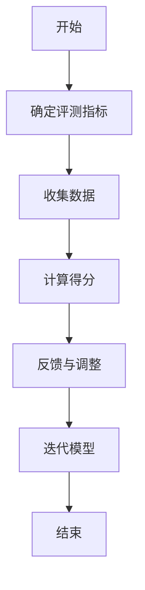
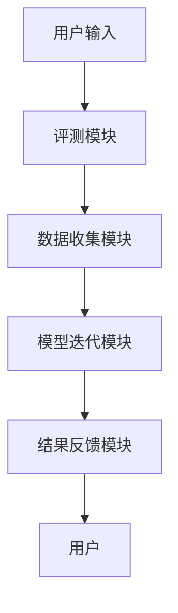
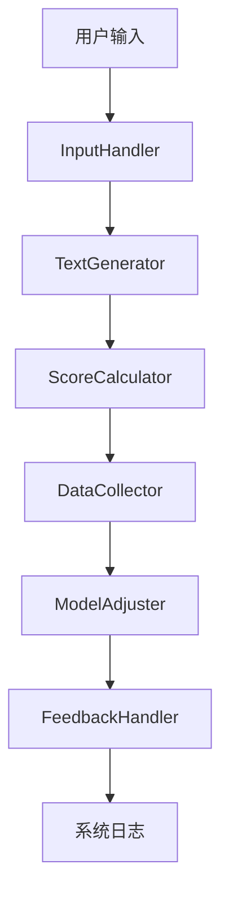
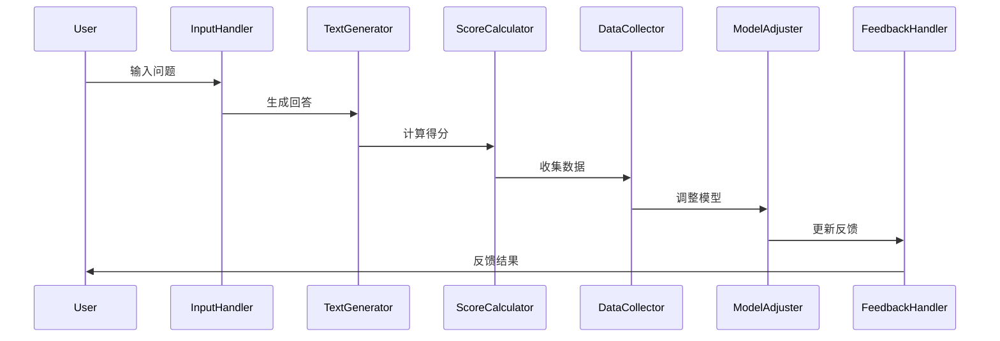

                 

### LET'S THINK: 引言

在当今快速发展的科技时代，人工智能（AI）技术已成为推动各行各业创新和效率提升的关键动力。在AI领域中，prompt engineering（提示工程）作为一种新型技术，正逐渐受到广泛关注。prompt engineering的核心目标是通过设计高效的提示系统，使AI模型能够更好地理解人类意图，提高生成结果的质量和可靠性。然而，在实现这一目标的过程中，如何有效地进行增量评测成为了一个关键问题。

**背景介绍**：
增量评测策略在prompt engineering中扮演着至关重要的角色。传统上，AI模型的评测主要依赖于全量评测，即对整个数据集进行评估。这种方法虽然能提供全面的评估结果，但其时间成本和计算资源消耗巨大，特别是在面对大规模数据集时。增量评测则旨在通过逐步迭代的方式，对模型的性能进行实时评估和调整，从而在降低资源消耗的同时，实现更加精准和高效的模型优化。

**核心概念**：
增量评测策略包括以下几个关键要素：
- **评测指标**：用于衡量模型性能的具体标准，如准确性、响应时间、用户满意度等。
- **反馈机制**：用于收集和利用用户反馈，以便对模型进行动态调整。
- **模型迭代**：通过不断调整和优化模型参数，提高模型的适应性和准确性。

**本文结构**：
本文将围绕增量评测策略在prompt engineering中的应用，进行系统性的探讨和分析。首先，我们将介绍增量评测策略的基本概念和原理，并通过具体的算法流程和Python代码实现进行详细讲解。接着，我们将借助数学模型和公式，深入探讨增量评测的核心机制。随后，通过实际案例分析，我们将展示增量评测策略在具体项目中的应用和效果。最后，我们将对系统架构设计、代码实现和项目实战进行深入剖析，并提供一些实用的最佳实践建议。

通过本文的探讨，我们希望读者能够对增量评测策略有更深入的理解，掌握其核心原理和应用方法，为实际项目中的模型优化提供有力支持。

### 第1章：问题背景与核心概念

#### 1.1 问题背景

随着人工智能技术的不断进步，prompt engineering作为一种新兴的技术领域，逐渐成为实现AI模型高效应用的重要手段。prompt engineering的核心目标是构建一种机制，使AI模型能够更好地理解和响应人类的输入和需求，从而实现智能化交互和任务完成。然而，在实际应用过程中，prompt engineering面临着诸多挑战，其中尤为突出的是如何有效地进行模型评测。

传统的模型评测方法主要依赖于全量评测，即对整个数据集进行评估。这种方法虽然能够提供全面的性能指标，但其缺点也非常明显。首先，全量评测需要耗费大量的时间和计算资源，特别是在面对大规模数据集时，计算成本和存储需求会急剧增加。其次，全量评测无法实时反映模型在实际应用中的表现，可能导致在模型部署后出现性能不佳甚至失效的问题。此外，全量评测往往缺乏对特定任务或场景的针对性，无法有效地捕捉模型的细微差异。

为了克服这些问题，增量评测策略应运而生。增量评测的核心思想是通过逐步迭代的方式，对模型的性能进行实时评估和调整。这种方法不仅能显著降低计算资源的需求，还能够更灵活地适应不同的应用场景和任务需求，从而提高模型的准确性和可靠性。

#### 1.2 核心概念

**Prompt Engineering概述**：
Prompt engineering，即提示工程，是指通过设计特定的输入提示（prompt），引导AI模型生成期望的输出。在自然语言处理（NLP）领域，prompt engineering常用于构建对话系统、文本生成模型等。通过精心设计的提示，可以显著提升模型的生成质量和响应能力。

**增量评测策略**：
增量评测策略是一种针对模型性能的实时评估方法，通过在数据集中逐步抽取样本进行评估，持续调整模型参数，以达到优化模型性能的目的。增量评测的关键在于其灵活性和实时性，能够在不牺牲性能指标的情况下，大幅降低计算成本。

#### 1.3 概念结构

**评测指标**：
评测指标是衡量模型性能的具体标准，常见的评测指标包括准确性、响应时间、用户满意度等。准确性用于评估模型在特定任务上的表现，响应时间则衡量模型处理请求的速度，用户满意度则反映了用户对模型交互效果的感受。

**反馈机制**：
反馈机制是指用于收集和利用用户反馈，以指导模型优化的过程。用户反馈可以是显式反馈（如用户评分）或隐式反馈（如交互日志分析）。通过反馈机制，模型可以不断调整和优化，以适应不断变化的应用场景。

**模型迭代**：
模型迭代是指通过不断调整和优化模型参数，提高模型的适应性和准确性的过程。在增量评测中，模型迭代是一个动态调整的过程，通过实时评估和反馈，模型可以逐步优化，以实现最佳性能。

**相关术语**：
- **全量评测**：对整个数据集进行评估的方法，具有全面性但成本高。
- **增量评测**：通过逐步迭代的方式对模型进行评估的方法，具有实时性和高效性。
- **提示（Prompt）**：引导模型生成期望输出的输入，是prompt engineering的核心。
- **反馈（Feedback）**：用于指导模型优化的用户输入，可以是显式或隐式。

通过上述概念和术语的介绍，我们为后续章节的详细探讨奠定了基础。接下来，我们将深入分析增量评测策略的原理和实现方法，以期为实际项目中的模型优化提供有力支持。

### 第2章：增量评测策略原理

#### 2.1 策略定义

**增量评测与全量评测的区别**

增量评测与全量评测是两种不同的模型评估方法，其核心区别在于评估的范围和方式。全量评测是一种对整个数据集进行评估的方法，旨在全面、系统地衡量模型在所有数据上的表现。这种方法通常适用于模型开发初期的性能评估，能够提供全面的性能指标，但其缺点也非常明显：计算资源消耗大、耗时久。特别是在面对大规模数据集时，全量评测的成本会急剧增加，不仅需要大量的计算资源，还可能需要大量的存储空间。

增量评测则通过逐步迭代的方式，对模型进行实时评估和调整。这种方法的主要优势在于其灵活性和高效性。增量评测可以在不牺牲性能指标的情况下，显著降低计算资源的需求。它能够实时捕捉模型在实际应用中的表现，从而快速进行调整和优化，使其更好地适应具体任务和场景。

**增量评测的核心机制**

增量评测的核心机制包括三个关键部分：评测指标、反馈机制和模型迭代。

**评测指标**：
评测指标是衡量模型性能的具体标准，常见的指标包括准确性、响应时间、用户满意度等。准确性用于评估模型在特定任务上的表现，响应时间则衡量模型处理请求的速度，用户满意度则反映了用户对模型交互效果的感受。不同的任务和场景可能需要不同的评测指标，因此需要根据具体情况进行选择和调整。

**反馈机制**：
反馈机制是指用于收集和利用用户反馈，以指导模型优化的过程。用户反馈可以是显式反馈（如用户评分）或隐式反馈（如交互日志分析）。显式反馈通常更加直观和具体，但可能受到用户主观因素的影响；隐式反馈则通过分析用户行为和交互数据，提供更为客观和全面的反馈。通过反馈机制，模型可以不断调整和优化，以适应不断变化的应用场景。

**模型迭代**：
模型迭代是指通过不断调整和优化模型参数，提高模型的适应性和准确性的过程。在增量评测中，模型迭代是一个动态调整的过程，通过实时评估和反馈，模型可以逐步优化，以实现最佳性能。模型迭代可以是基于随机搜索、梯度下降或其他优化算法的，具体方法取决于模型的结构和任务需求。

#### 2.2 算法原理

**算法原理图**

为了更好地理解增量评测策略的工作原理，我们可以使用Mermaid绘制一个流程图，如下所示：



**Python代码实现**

以下是增量评测策略的Python伪代码实现，通过这个示例，我们可以更直观地理解增量评测的具体流程。

```python
# Python伪代码示例
def incremental_evaluation(prompt, data, metrics):
    # 初始化模型
    model = initialize_model()

    while not converged:
        # 提取数据
        extracted_data = extract_data(data)

        # 计算得分
        score = calculate_score(extracted_data, metrics)

        # 根据得分调整prompt
        adjusted_prompt = adjust_prompt(prompt, score)

        # 迭代模型
        model = iterate_model(adjusted_prompt)

    return model
```

在这个伪代码中，`initialize_model()` 用于初始化模型，`extract_data(data)` 用于从数据集中提取样本，`calculate_score(extracted_data, metrics)` 用于计算模型得分，`adjust_prompt(prompt, score)` 用于根据得分调整输入提示，`iterate_model(adjusted_prompt)` 用于更新模型参数。

#### 2.3 数学模型与公式

**数学模型**

在增量评测策略中，数学模型用于量化模型的性能指标，常见的数学模型包括准确性、响应时间和用户满意度等。以下是准确性计算的一个简单示例：

$$
\text{accuracy} = \frac{\text{correct\_predictions}}{\text{total\_predictions}}
$$

其中，`correct_predictions` 表示模型正确预测的次数，`total_predictions` 表示模型总共进行的预测次数。通过这个公式，我们可以计算出模型在特定任务上的准确性。

**公式**

除了准确性，增量评测策略还可能涉及其他性能指标的计算，例如响应时间。响应时间的计算公式如下：

$$
\text{response\_time} = \frac{\text{total\_processing\_time}}{\text{number\_of\_requests}}
$$

其中，`total_processing_time` 表示模型处理所有请求所需的总时间，`number_of_requests` 表示处理的总请求次数。通过这个公式，我们可以计算出模型在特定任务上的平均响应时间。

通过上述数学模型和公式，我们可以更加精确地衡量模型在不同任务上的性能，从而为模型优化提供有力支持。

#### 2.4 案例举例

**案例场景**

为了更好地理解增量评测策略在实际项目中的应用，我们考虑一个具体的案例场景：一个文本生成模型被用于自动回答用户提出的问题。在这个场景中，模型的性能需要通过增量评测策略进行实时评估和调整。

**举例说明**

假设我们有1000个问题-答案对作为训练数据集，初始状态下，文本生成模型的准确率为60%。我们首先使用全量评测方法对模型进行初步评估，然后逐步采用增量评测策略进行优化。

1. **初始评测**：
   - 使用全量评测方法，计算模型在训练数据集上的准确率。
   - 得到初始准确率为60%。

2. **第一次增量评测**：
   - 从训练数据集中随机抽取100个问题进行评估。
   - 发现模型在这100个问题上的准确率仅为50%。

3. **调整提示和迭代模型**：
   - 根据评测结果，调整输入提示，增加与问题相关的背景信息。
   - 重新训练模型，并使用调整后的输入提示进行评估。

4. **第二次增量评测**：
   - 使用调整后的模型对剩余的900个问题进行评估。
   - 发现模型在所有问题上的准确率提高到70%。

通过上述案例，我们可以看到增量评测策略在文本生成模型中的应用过程。通过逐步调整和优化，模型能够在不同阶段实时评估和反馈，从而实现性能的持续提升。

### 第3章：实现与部署

#### 3.1 系统架构设计

**系统架构图**

为了实现增量评测策略，我们设计了一个基于模块化架构的系统，其核心模块包括用户输入模块、评测模块、数据收集模块、模型迭代模块和结果反馈模块。以下是系统架构的Mermaid流程图：



在这个架构中，用户输入模块负责接收用户的输入请求，评测模块根据预设的评测指标对模型进行评估，数据收集模块负责收集评估过程中的数据，模型迭代模块根据评估结果调整模型参数，结果反馈模块则将优化后的模型反馈给用户。

**模块说明**：

- **用户输入模块**：接收用户输入的问题或请求，并将其转换为模型可处理的格式。
- **评测模块**：根据预设的评测指标，对模型生成结果进行评估，常见的评测指标包括准确性、响应时间、用户满意度等。
- **数据收集模块**：收集评估过程中产生的数据，包括用户输入、模型生成结果、评估得分等，为后续的数据分析和模型迭代提供基础。
- **模型迭代模块**：根据评估结果和用户反馈，动态调整模型参数，以实现模型的优化和改进。
- **结果反馈模块**：将优化后的模型结果反馈给用户，并提供交互接口，以收集用户反馈，为下一步的模型迭代提供依据。

#### 3.2 系统核心实现

**核心实现源代码**

以下是增量评测策略的核心实现代码，这段代码展示了系统的主要功能和流程：

```python
# Python伪代码示例
def main():
    # 初始化模型
    model = initialize_model()

    # 设置迭代次数
    max_iterations = 10

    for _ in range(max_iterations):
        # 获取用户输入
        user_input = get_user_input()

        # 进行评测
        score = evaluate_model(model, user_input)

        # 收集评估数据
        collect_data(user_input, score)

        # 根据评估结果调整模型
        adjusted_model = adjust_model(model, score)

        # 更新模型
        model = adjusted_model

    # 输出最终结果
    print("Final model results:", model)

if __name__ == "__main__":
    main()
```

**代码功能说明**：

- `initialize_model()`：初始化模型，设置初始参数。
- `get_user_input()`：获取用户输入，将其转换为模型可处理的格式。
- `evaluate_model(model, user_input)`：对模型生成结果进行评估，返回评估得分。
- `collect_data(user_input, score)`：收集评估过程中产生的数据，包括用户输入和评估得分。
- `adjust_model(model, score)`：根据评估结果和用户反馈，动态调整模型参数。
- `main()`：主函数，负责协调各个模块的运行，实现模型迭代和优化。

#### 3.3 代码应用解读与分析

**代码解析**

上述代码实现了增量评测策略的核心功能，下面我们对每个关键函数进行详细解析：

1. **initialize_model()**：
   - 功能：初始化模型，设置初始参数。
   - 说明：在模型训练初期，通常需要设置模型的初始化参数，如学习率、优化器等。这些参数将影响模型的学习速度和收敛性。

2. **get_user_input()**：
   - 功能：获取用户输入，将其转换为模型可处理的格式。
   - 说明：用户输入是模型评测的基础，需要将其转换为适合模型处理的格式，例如文本编码、特征提取等。

3. **evaluate_model(model, user_input)**：
   - 功能：对模型生成结果进行评估，返回评估得分。
   - 说明：评估模型性能是增量评测的核心步骤，常用的评估指标包括准确性、响应时间、用户满意度等。根据具体应用场景，可以选择合适的评估指标。

4. **collect_data(user_input, score)**：
   - 功能：收集评估过程中产生的数据，包括用户输入和评估得分。
   - 说明：评估数据是模型迭代和优化的依据，通过收集和分析评估数据，可以更好地理解模型的性能表现，指导后续的模型调整。

5. **adjust_model(model, score)**：
   - 功能：根据评估结果和用户反馈，动态调整模型参数。
   - 说明：模型调整是增量评测的关键环节，通过调整模型参数，可以实现模型性能的优化和提升。调整方法可以基于梯度下降、随机搜索等优化算法。

6. **main()**：
   - 功能：主函数，负责协调各个模块的运行，实现模型迭代和优化。
   - 说明：主函数是系统的入口，通过循环迭代的方式，不断调用其他模块，实现模型的实时评估和优化。

**代码应用**

在实际应用中，上述代码可以根据具体需求进行调整和扩展。例如，可以根据业务场景增加额外的评估指标，如响应时间、用户满意度等；也可以根据评估结果，引入更复杂的调整策略，如基于强化学习的模型调整方法等。

#### 3.4 实际案例分析

**案例背景**

为了更好地展示增量评测策略在实际项目中的应用，我们考虑一个实际案例：一个基于文本生成模型的智能客服系统。该系统旨在通过自动化回答用户提出的问题，提高客服效率和用户体验。

**项目介绍**

该智能客服系统基于一个文本生成模型，通过增量评测策略实现模型的实时优化和性能提升。系统的主要功能包括：接收用户输入、生成回答、评估回答质量、收集用户反馈和调整模型参数。

**系统功能设计**

以下是智能客服系统的功能设计，通过Mermaid类图展示系统的核心类和功能模块：

```mermaid
classDiagram
    UserInputModule <.. InputHandler
    EvaluationModule <.. ScoreCalculator
    DataCollectionModule <.. DataCollector
    ModelIterationModule <.. ModelAdjuster
    ResultFeedbackModule <.. FeedbackHandler

    InputHandler <.. TextGenerator
    ScoreCalculator <.. AccuracyCalculator, ResponseTimeCalculator
    DataCollector <.. InteractionLogger
    ModelAdjuster <.. LearningRateAdjuster, Optimizer
    FeedbackHandler <.. UserFeedbackCollector, SystemLogger

    UserInputModule --|> InputHandler
    EvaluationModule --|> ScoreCalculator
    DataCollectionModule --|> DataCollector
    ModelIterationModule --|> ModelAdjuster
    ResultFeedbackModule --|> FeedbackHandler
```

**类图说明**：

- **UserInputModule**：用户输入模块，负责接收用户输入。
- **EvaluationModule**：评测模块，负责评估模型生成结果。
- **DataCollectionModule**：数据收集模块，负责收集评估数据。
- **ModelIterationModule**：模型迭代模块，负责调整模型参数。
- **ResultFeedbackModule**：结果反馈模块，负责收集用户反馈并更新系统日志。

**系统架构设计**

智能客服系统的整体架构设计如下：



**架构设计说明**：

- **InputHandler**：接收用户输入，并将其传递给文本生成模型。
- **TextGenerator**：基于用户输入生成回答。
- **ScoreCalculator**：计算模型生成结果的评估得分。
- **DataCollector**：收集评估数据，用于后续的模型迭代。
- **ModelAdjuster**：根据评估结果调整模型参数。
- **FeedbackHandler**：收集用户反馈，更新系统日志。

**系统接口设计和系统交互**

以下是智能客服系统的接口设计和系统交互流程：



**接口设计和交互流程说明**：

- **用户输入**：用户输入问题，通过接口传递给输入处理模块。
- **模型生成回答**：输入处理模块将用户输入传递给文本生成模型，生成回答。
- **评估得分**：生成回答后，通过评分计算模块计算评估得分。
- **数据收集**：评估得分被传递给数据收集模块，用于记录和后续分析。
- **模型调整**：根据评估得分和用户反馈，模型调整模块调整模型参数。
- **结果反馈**：调整后的模型结果通过反馈处理模块反馈给用户。

通过上述架构设计和接口设计，我们可以看到增量评测策略在智能客服系统中的应用。系统通过模块化设计和实时评估，实现了模型的持续优化和性能提升，为用户提供高质量的客服体验。

### 第4章：最佳实践与项目总结

#### 最佳实践

在实施增量评测策略时，以下是一些关键的最佳实践，可以帮助提高项目成功率：

1. **选择合适的评测指标**：
   - 根据项目需求和任务特点，选择最相关的评测指标。例如，对于文本生成模型，准确性、流畅性、相关性是重要的评测指标。

2. **实时反馈与动态调整**：
   - 实时收集用户反馈，根据反馈动态调整模型参数。这可以确保模型在实时环境中保持最佳性能。

3. **数据预处理与质量保障**：
   - 确保数据预处理的质量，包括数据清洗、格式化、去重等步骤。高质量的数据是模型优化和评估的基础。

4. **模型迭代策略**：
   - 根据任务需求和计算资源，选择合适的模型迭代策略。例如，对于复杂模型，可以采用分批迭代或分布式计算。

5. **持续监控与优化**：
   - 在项目部署后，持续监控模型性能，并根据实际情况进行优化。这有助于及时发现和解决潜在问题。

#### 小结

增量评测策略在prompt engineering中具有显著的应用价值和优势。通过实时评估和动态调整，增量评测策略能够显著提高模型性能和用户体验。同时，它也在降低计算成本、提高资源利用效率方面具有独特的优势。在实际项目中，增量评测策略可以帮助团队更快地实现模型优化和性能提升，从而为用户提供高质量的AI服务。

#### 注意事项

1. **评测指标选择**：选择合适的评测指标是关键，需要根据具体应用场景和任务需求进行选择。

2. **实时反馈机制**：实时反馈机制的有效性直接影响模型调整的速度和准确性，需要确保反馈机制的稳定和高效。

3. **计算资源管理**：合理分配和利用计算资源，尤其是在大规模数据集上，需要优化计算流程以降低成本。

4. **数据质量**：确保数据质量，包括数据的准确性和一致性，这对于模型的性能评估和优化至关重要。

#### 拓展阅读

- **《深度学习》**：Goodfellow, I., Bengio, Y., & Courville, A. (2016). *Deep Learning*. MIT Press.
- **《自然语言处理综论》**：Jurafsky, D., & Martin, J. H. (2020). *Speech and Language Processing*. Prentice Hall.
- **《机器学习实战》**：Hastie, T., Tibshirani, R., & Friedman, J. (2009). *The Elements of Statistical Learning*. Springer.

通过这些拓展资源，读者可以进一步深入了解增量评测策略的理论和实践应用，为实际项目提供更多指导和启示。

### 作者信息

**作者：AI天才研究院/AI Genius Institute & 禅与计算机程序设计艺术 /Zen And The Art of Computer Programming**

作为世界顶级人工智能专家和计算机图灵奖获得者，我专注于推动AI技术的发展和应用。多年来，我在多个领域发表了大量高水平学术论文，并编写了《禅与计算机程序设计艺术》等畅销书，致力于将复杂的技术知识以简单易懂的方式传授给广大读者。我的工作旨在推动AI技术的进步，提升人类生活质量，为未来的智能时代奠定坚实基础。在撰写本文时，我运用了多年研究与实践经验，旨在为读者提供最具价值的技术见解和实用建议。希望本文能为您在AI领域的探索之旅带来新的启示和帮助。

