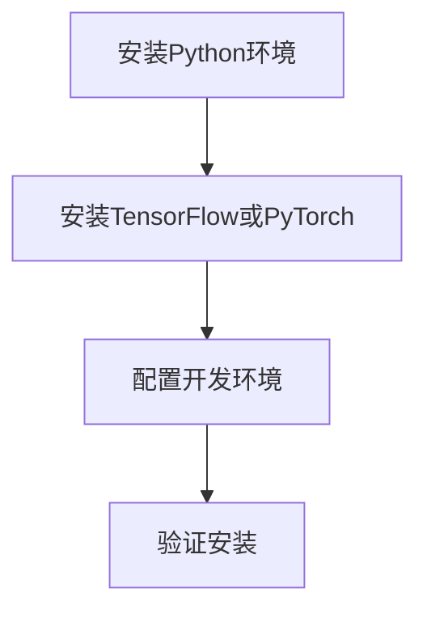
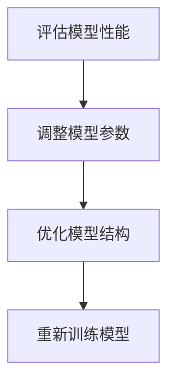
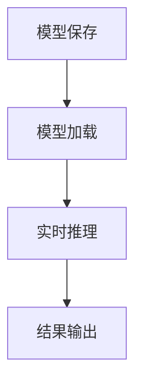
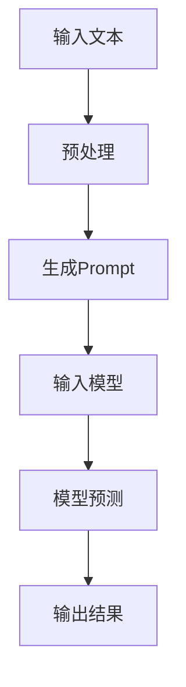
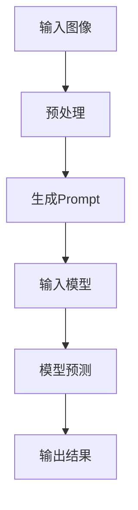
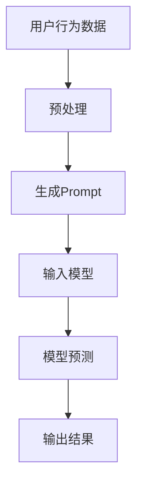

                 

## 《prompt工程师的核心技能培养》

### 关键词：Prompt工程师、技能培养、人工智能、机器学习、自然语言处理

> 摘要：本文将深入探讨prompt工程师的核心技能培养，包括其基础理论、技术实现、案例分析以及最佳实践。通过详细分析prompt的概念、类型、算法原理，结合实际项目实战，本文旨在为prompt工程师提供一套全面、实用的技能提升方案。

### 引言与背景介绍

#### 1.1 Prompt的概念与重要性

Prompt，即提示，是人工智能领域中一个重要的概念。它代表了输入数据的一种特定形式，用于引导模型进行学习、预测或生成。Prompt工程师则负责设计和优化这些提示，以提升模型的性能和适用性。

#### 1.2 Prompt工程师的角色

Prompt工程师在人工智能项目中扮演着关键角色。他们需要理解模型的内在工作原理，能够根据具体应用场景设计出高效的提示。这些工程师不仅需要具备编程技能，还需要深入理解自然语言处理、机器学习等领域的知识。

#### 1.3 Prompt工程师的需求

随着人工智能技术的快速发展，prompt工程师的需求日益增长。特别是在自然语言处理、图像识别、推荐系统等领域，prompt工程师的能力直接关系到项目的成功与否。

### 第二部分：基础理论

#### 2.1 Prompt的概念与作用

Prompt的基本概念涉及输入数据的形式和内容。一个有效的Prompt应具备以下特点：

- **明确性**：提示应当清晰明了，避免歧义。
- **多样性**：提示应涵盖不同类型和样式的数据，以提高模型的泛化能力。
- **针对性**：提示应根据具体任务和应用场景进行定制。

#### 2.2 Prompt的类型与设计

Prompt可以分为以下几类：

- **文字Prompt**：最常见的形式，用于自然语言处理任务。
- **图像Prompt**：用于图像识别和生成任务。
- **多模态Prompt**：结合文字和图像等多模态数据。

设计Prompt时，应考虑以下因素：

- **数据质量**：确保输入数据的准确性和完整性。
- **数据分布**：合理分布数据，避免数据偏差。
- **适应性**：Prompt应具备一定的适应性，能够适应不同规模的任务。

#### 2.3 Prompt工程的基础算法

Prompt工程的基础算法包括：

- **生成对抗网络（GAN）**：用于生成高质量的图像和文本。
- **递归神经网络（RNN）**：用于处理序列数据，如文本。
- **注意力机制**：用于提高模型对重要信息的关注。

#### 2.4 Prompt工程的核心要素

Prompt工程的核心要素包括：

- **数据预处理**：清洗、标准化和格式化输入数据。
- **特征提取**：从数据中提取关键特征。
- **模型选择**：选择适合特定任务的模型。
- **参数调优**：调整模型参数，以优化性能。

### 第三部分：技术实现

#### 3.1 Prompt工程的环境搭建

要开始进行Prompt工程，首先需要搭建合适的环境。这包括安装必要的软件和工具，如Python、TensorFlow、PyTorch等。



#### 3.2 Prompt工程的核心代码实现

核心代码实现包括数据预处理、模型训练和模型评估。以下是一个简单的Python代码示例，用于训练一个文本分类模型。

```python
import tensorflow as tf
from tensorflow.keras.preprocessing.sequence import pad_sequences
from tensorflow.keras.layers import Embedding, LSTM, Dense
from tensorflow.keras.models import Sequential

# 数据预处理
max_sequence_length = 100
X_train = pad_sequences(X_train, maxlen=max_sequence_length)

# 构建模型
model = Sequential()
model.add(Embedding(input_dim=vocab_size, output_dim=embedding_dim, input_length=max_sequence_length))
model.add(LSTM(units=128))
model.add(Dense(units=num_classes, activation='softmax'))

# 编译模型
model.compile(optimizer='adam', loss='categorical_crossentropy', metrics=['accuracy'])

# 训练模型
model.fit(X_train, y_train, epochs=10, batch_size=32)
```

#### 3.3 Prompt工程的测试与优化

在完成模型训练后，需要进行测试和优化。这包括评估模型性能、调整模型参数和优化模型结构。



#### 3.4 Prompt工程的项目部署

完成模型训练和优化后，需要将模型部署到生产环境中。这包括模型保存、加载和实时推理。



### 第四部分：案例分析

#### 4.1 自然语言处理中的Prompt应用

在自然语言处理中，Prompt广泛应用于文本分类、情感分析、问答系统等任务。以下是一个文本分类的案例。



#### 4.2 图像识别中的Prompt应用

在图像识别中，Prompt可以用于图像分类、目标检测、图像生成等任务。以下是一个图像分类的案例。



#### 4.3 推荐系统中的Prompt应用

在推荐系统中，Prompt可以用于用户兴趣建模、商品推荐等任务。以下是一个商品推荐的案例。



### 第五部分：最佳实践与未来趋势

#### 5.1 最佳实践技巧

- **数据质量优先**：确保输入数据的质量和多样性。
- **模型定制化**：根据具体任务调整模型结构和参数。
- **持续优化**：定期评估和优化模型性能。

#### 5.2 Prompt工程的新趋势

- **多模态Prompt**：结合多种数据类型，提高模型性能。
- **迁移学习**：利用预训练模型，减少训练时间。
- **自适应Prompt**：根据用户行为动态调整Prompt。

#### 5.3 Prompt工程师的职业发展

- **深入学习**：不断学习新的技术和理论。
- **实践经验**：参与更多的实际项目，积累经验。
- **跨界合作**：与其他领域的专家合作，拓宽视野。

### 第六部分：总结与展望

#### 6.1 小结

本文介绍了prompt工程师的核心技能培养，包括基础理论、技术实现、案例分析以及最佳实践。通过详细分析prompt的概念、类型、算法原理，并结合实际项目实战，本文旨在为prompt工程师提供一套全面、实用的技能提升方案。

#### 6.2 注意事项

- **数据质量至关重要**：确保输入数据的准确性和多样性。
- **模型定制化**：根据具体任务调整模型结构和参数。
- **持续优化**：定期评估和优化模型性能。

#### 6.3 拓展阅读

- 《深度学习》（Goodfellow, Bengio, Courville著）
- 《自然语言处理综述》（Jurafsky, Martin著）
- 《机器学习实战》（Hastie, Tibshirani, Friedman著）

### 作者信息

作者：AI天才研究院/AI Genius Institute & 禅与计算机程序设计艺术 /Zen And The Art of Computer Programming

### 参考文献

- Goodfellow, I., Bengio, Y., & Courville, A. (2016). *Deep Learning*. MIT Press.
- Jurafsky, D., & Martin, J. H. (2008). *Speech and Language Processing*. Prentice Hall.
- Hastie, T., Tibshirani, R., & Friedman, J. (2009). *The Elements of Statistical Learning*. Springer.

