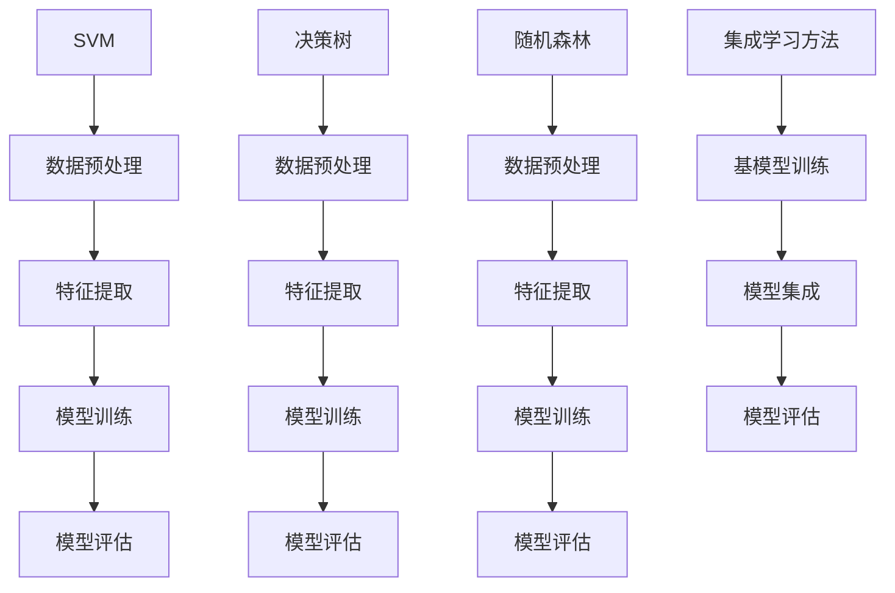
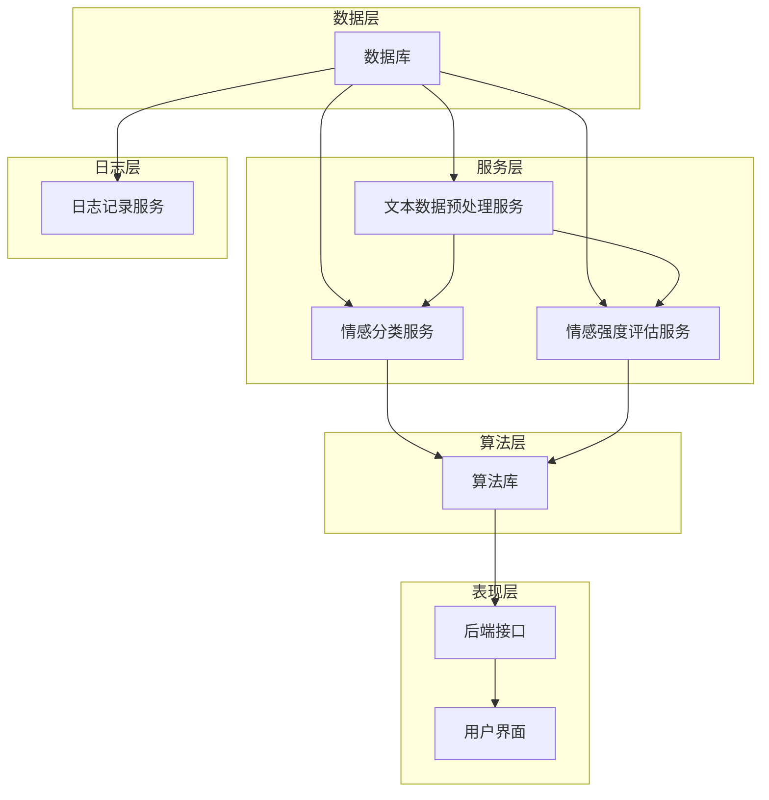
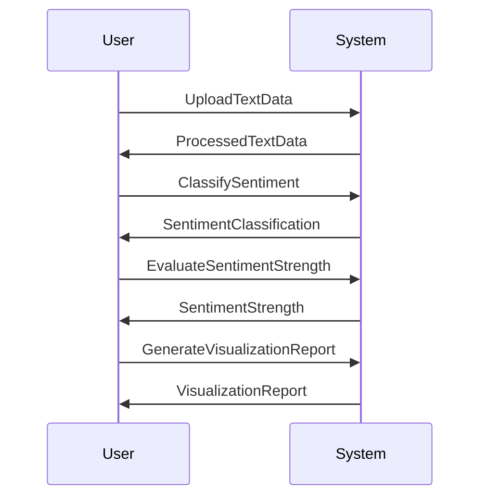

                 

# Prompt情感分析：优化LLM输出语气

> 关键词：情感分析、自然语言处理、LLM优化、语气调整、机器学习算法

> 摘要：本文深入探讨了情感分析在自然语言处理中的重要性，特别关注了prompt情感分析这一领域。通过逐步分析情感分析的基本原理、机器学习算法原理及其应用，我们揭示了如何通过系统架构设计和项目实战来优化大型语言模型（LLM）的输出语气。文章旨在为开发者提供实用的技巧和最佳实践，以提升自然语言处理系统的情感分析能力。

## 目录大纲

## 第一部分：背景与概述

### 第1章 prompt情感分析概述

#### 1.1 问题背景

- 情感分析在自然语言处理中的应用

#### 1.2 问题描述

- 常见情感分析任务与挑战

#### 1.3 问题解决

- 常用方法与技术概述

#### 1.4 边界与外延

- 情感分析的其他类型

#### 1.5 概念结构与核心要素组成

- 情感极性分类
- 情感强度度量
- 情感分类器设计

#### 1.6 本章小结

- 对prompt情感分析的基本认识

## 第二部分：核心概念与联系

### 第2章 情感分析基本原理

#### 2.1 情感分析的核心概念

- 情感分类
- 情感强度度量
- 情感极性分类

#### 2.2 情感分析的概念属性特征对比表格

- 情感分类方法对比
- 情感强度度量方法对比
- 情感极性分类方法对比

#### 2.3 情感分析的ER实体关系图架构

- 实体识别
- 情感分类
- 情感强度度量

#### 2.4 本章小结

- 情感分析基本原理的理解与运用

## 第三部分：算法原理讲解

### 第3章 基于机器学习的情感分析算法

#### 3.1 算法原理

- 支持向量机（SVM）
- 决策树
- 随机森林
- 集成学习方法

#### 3.2 算法mermaid流程图

- 支持向量机
- 决策树
- 随机森林
- 集成学习方法

#### 3.3 Python源代码与算法实现

- 支持向量机
- 决策树
- 随机森林
- 集成学习方法

#### 3.4 算法原理的数学模型和公式

- 支持向量机
- 决策树
- 随机森林
- 集成学习方法

#### 3.5 通俗易懂地举例说明

- 支持向量机
- 决策树
- 随机森林
- 集成学习方法

#### 3.6 本章小结

- 基于机器学习的情感分析算法的理解与运用

## 第四部分：系统分析与架构设计

### 第4章 情感分析系统设计与实现

#### 4.1 问题场景介绍

- 社交媒体情感分析
- 客户服务情感分析
- 产品评论情感分析

#### 4.2 项目介绍

- 项目背景
- 项目目标
- 项目需求分析

#### 4.3 系统功能设计

- 功能模块划分
- 功能实现与交互

#### 4.4 系统架构设计

- 架构设计原则
- 系统架构图

#### 4.5 系统接口设计

- 接口规范
- 接口实现

#### 4.6 系统交互mermaid序列图

- 用户操作流程
- 系统响应流程

#### 4.7 本章小结

- 情感分析系统的设计与实现理解与运用

## 第五部分：项目实战

### 第5章 prompt情感分析项目实战

#### 5.1 环境安装

- 硬件环境
- 软件环境

#### 5.2 系统核心实现源代码

- 数据预处理
- 模型训练
- 模型评估
- 模型应用

#### 5.3 代码应用解读与分析

- 源代码解读
- 功能实现分析

#### 5.4 实际案例分析和详细讲解剖析

- 案例选择
- 案例分析
- 案例讲解

#### 5.5 项目小结

- 项目总结
- 经验教训

## 第六部分：最佳实践与拓展

### 第6章 prompt情感分析最佳实践

#### 6.1 数据准备与处理

- 数据采集
- 数据清洗
- 数据预处理

#### 6.2 模型选择与调优

- 模型选择策略
- 模型调优技巧
- 模型评估指标

#### 6.3 系统优化与性能提升

- 系统性能优化
- 系统稳定性提升
- 系统扩展性设计

#### 6.4 本章小结

- prompt情感分析最佳实践的理解与运用

## 第7章 拓展阅读

#### 7.1 相关研究动态

- 最新研究成果
- 发展趋势

#### 7.2 拓展阅读推荐

- 相关书籍
- 学术论文
- 技术博客

#### 7.3 本章小结

- 对prompt情感分析更深入的理解与探索

## 第一部分：背景与概述

### 第1章 prompt情感分析概述

#### 1.1 问题背景

情感分析在自然语言处理中扮演着至关重要的角色。随着社交媒体、在线评论和客户反馈等数据的爆炸式增长，人们越来越需要自动化工具来理解和分析这些数据中的情感倾向。情感分析的目标是从文本数据中识别出情感极性（如正面、负面或中性），以及情感强度（如非常正面、稍微负面等）。

自然语言处理（NLP）是计算机科学和人工智能领域的一个分支，它专注于使计算机能够理解、解释和生成人类语言。情感分析作为NLP的一个重要子领域，旨在理解和处理文本中的情感信息，以便为各种应用提供有价值的见解。

prompt情感分析是一种特殊的情感分析技术，它通过设计特定的提示（prompts）来引导语言模型（如大型语言模型，LLM）生成情感相关的输出。与传统的情感分析不同，prompt情感分析更注重于如何优化LLM的输出语气，使其更加贴近人类情感表达的自然性和多样性。

#### 1.2 问题描述

情感分析任务通常可以分为以下几个方面：

1. **情感极性分类**：将文本分类为正面、负面或中性。
2. **情感强度度量**：对文本中的情感倾向进行强度评估。
3. **情感分类器设计**：构建能够自动分类文本情感的机器学习模型。

这些任务面临着以下挑战：

- **数据多样性**：不同的情感表达方式可能使用不同的词汇和语法结构，增加了情感分析的难度。
- **上下文理解**：情感往往与上下文紧密相关，正确理解上下文对于准确情感分析至关重要。
- **多语言处理**：支持多种语言的情感分析需要考虑不同的语言特性和文化背景。

prompt情感分析的优势在于，它可以通过设计特定的提示来引导LLM，使其更好地理解和生成情感相关的文本。这种方法的优势包括：

- **灵活性与准确性**：通过调整提示，可以更准确地捕捉文本中的情感倾向。
- **多样化输出**：prompt允许生成更多样化的情感表达，更接近人类的情感交流方式。

然而，prompt情感分析也存在一些局限性，例如：

- **对提示的依赖**：模型的性能高度依赖于提示的设计，如果提示不当，可能导致错误的结果。
- **计算成本**：由于LLM通常需要大量计算资源，prompt情感分析可能增加系统的计算负担。

#### 1.3 问题解决

为了解决prompt情感分析中的问题，我们需要采用一系列的方法和技术。以下是几种常见的方法和技术概述：

- **机器学习算法**：如支持向量机（SVM）、决策树、随机森林和集成学习方法，用于训练情感分类器。
- **深度学习模型**：如循环神经网络（RNN）、长短期记忆网络（LSTM）和变换器（Transformer），用于捕捉文本的上下文信息。
- **提示设计**：通过设计有效的提示来引导LLM生成情感相关的输出，例如使用情感标签、情感词汇和上下文信息。

prompt情感分析的流程通常包括以下几个关键步骤：

1. **数据预处理**：清洗和标注文本数据，以便进行后续的机器学习训练。
2. **模型训练**：使用训练数据来训练情感分类器，并调整模型参数。
3. **模型评估**：通过测试数据评估模型性能，并调整模型参数以优化性能。
4. **模型应用**：将训练好的模型应用于新的文本数据，以生成情感分析结果。

#### 1.4 边界与外延

情感分析不仅限于文本数据的分析，还可以应用于语音、图像等多媒体数据的情感识别。此外，情感分析与其他NLP任务密切相关，如实体识别、情感极性分类和文本生成等。

在prompt情感分析中，除了关注情感分类和强度度量外，我们还应考虑如何优化LLM的输出语气，使其更符合人类情感表达的自然性和多样性。这包括以下几个方面：

- **语气调整**：通过调整文本中的语气词、语气符号和语气停顿，使输出更自然。
- **情感一致性**：确保输出文本中的情感表达与上下文和输入情感标签保持一致。
- **情感多样性**：生成多样化和富有表现力的情感输出，以更准确地传达情感信息。

#### 1.5 概念结构与核心要素组成

prompt情感分析的核心概念包括情感极性分类、情感强度度量以及情感分类器设计。

1. **情感极性分类**：将文本分类为正面、负面或中性。常见的分类方法包括基于规则的方法、机器学习方法和深度学习方法。

2. **情感强度度量**：对文本中的情感倾向进行强度评估。常见的度量方法包括基于词频的方法、基于情感词典的方法和基于机器学习的方法。

3. **情感分类器设计**：构建能够自动分类文本情感的机器学习模型。常见的分类器包括支持向量机（SVM）、决策树、随机森林和变换器（Transformer）等。

#### 1.6 本章小结

本章对prompt情感分析进行了概述，介绍了情感分析在自然语言处理中的应用背景、常见任务和挑战，以及常用的方法和技术。通过分析prompt情感分析的优势和局限性，我们了解了如何通过设计特定的提示来优化LLM的输出语气。本章还讨论了情感分析的核心概念与联系，包括情感极性分类、情感强度度量以及情感分类器设计。这些基本概念将为后续章节的深入探讨提供理论基础。

## 第二部分：核心概念与联系

### 第2章 情感分析基本原理

#### 2.1 情感分析的核心概念

情感分析的核心概念主要包括情感分类、情感强度度量以及情感极性分类。

1. **情感分类**：情感分类是指将文本数据中的情感倾向进行分类，通常分为正面、负面和中性三类。情感分类的目的是识别文本中表达的情感类型，为情感分析和处理提供基础。

2. **情感强度度量**：情感强度度量是指对文本中表达的情感倾向进行强度评估。情感强度度量可以通过定量指标来表示，例如情感分数、情感强度值等。情感强度度量有助于识别文本中情感表达的强弱程度，为情感分析提供更丰富的信息。

3. **情感极性分类**：情感极性分类是指将文本数据中的情感倾向进行二分类，通常分为正面和负面两类。情感极性分类是情感分析中最常见的形式，也是情感分析研究的基础。

#### 2.2 情感分析的概念属性特征对比表格

为了更好地理解情感分析的基本原理，我们可以通过对比不同概念属性特征来分析各种情感分析方法。

| 概念 | 情感分类 | 情感强度度量 | 情感极性分类 |
| --- | --- | --- | --- |
| 目标 | 识别文本情感类型 | 评估文本情感强度 | 确定文本情感极性 |
| 方法 | 分类算法 | 分值计算 | 二分类模型 |
| 输入 | 文本数据 | 情感词典 | 情感词典 |
| 输出 | 情感标签 | 情感分数 | 情感极性 |
| 应用 | 文本情感分析 | 情感度量 | 情感监测 |

#### 2.3 情感分析的ER实体关系图架构

情感分析中的实体关系图（ER图）架构有助于我们理解情感分析的基本流程和核心组成部分。以下是情感分析ER实体关系图的简要描述：

1. **实体识别**：实体识别是指从文本中识别出具有情感倾向的实体，例如人名、地名、组织名等。实体识别是情感分析的重要基础，有助于更准确地分析文本中的情感信息。

2. **情感分类**：情感分类是指对识别出的实体进行情感分类，判断其情感倾向为正面、负面或中性。情感分类是情感分析的核心任务，直接影响情感分析结果的准确性。

3. **情感强度度量**：情感强度度量是指对文本中的情感倾向进行强度评估，通常使用情感词典、情感词典和机器学习算法等方法来实现。情感强度度量有助于识别文本中情感表达的强弱程度。

4. **情感极性分类**：情感极性分类是指将文本数据中的情感倾向进行二分类，通常分为正面和负面两类。情感极性分类是情感分析的基本形式，也是情感分析研究的基础。

#### 2.4 本章小结

本章详细介绍了情感分析的核心概念和基本原理，包括情感分类、情感强度度量、情感极性分类以及实体识别等。通过对比不同概念属性特征和ER实体关系图架构，我们深入理解了情感分析的基本流程和核心组成部分。这些基本概念和原理将为后续章节的深入探讨和算法实现提供理论基础。

### 第3章 基于机器学习的情感分析算法

#### 3.1 算法原理

在情感分析领域，机器学习算法被广泛应用于构建情感分类模型。以下是几种常见的机器学习算法及其基本原理：

1. **支持向量机（SVM）**：SVM是一种监督学习算法，通过将数据映射到高维空间，找到一个最佳的超平面来分隔不同类别的数据。对于文本数据，SVM通常使用词袋模型（Bag of Words, BoW）或词嵌入（Word Embedding）来表示文本特征。SVM的优势在于其强大的分类能力和在处理非线性数据时的有效性。

2. **决策树**：决策树是一种基于特征进行划分的监督学习算法，通过递归地将数据集划分为子集，直到达到某个停止条件。决策树易于理解和解释，但可能存在过拟合问题。对于文本数据，决策树可以处理高维特征，并能够处理类别和数值数据。

3. **随机森林**：随机森林是一种基于决策树的集成学习方法，通过构建多棵决策树并对它们的结果进行投票来提高分类性能。随机森林通过随机选择特征和随机划分数据集来减少过拟合，具有较好的泛化能力。

4. **集成学习方法**：集成学习方法通过结合多个模型的预测结果来提高分类性能。常见的方法包括Bagging和Boosting。Bagging方法通过训练多个基模型并取平均值来减少方差，而Boosting方法通过训练多个基模型并给予错误分类更多的权重来减少偏差。

#### 3.2 算法mermaid流程图

以下是对上述算法的mermaid流程图表示，用于更直观地理解算法的基本步骤：



#### 3.3 Python源代码与算法实现

以下是一个简单的Python代码示例，用于实现支持向量机（SVM）和决策树（Decision Tree）情感分析算法：

```python
# 支持向量机（SVM）实现
from sklearn.svm import SVC
from sklearn.feature_extraction.text import TfidfVectorizer
from sklearn.model_selection import train_test_split

# 数据预处理
X, y = load_data()  # 假设load_data()函数用于加载数据
X_train, X_test, y_train, y_test = train_test_split(X, y, test_size=0.2, random_state=42)

# 特征提取
vectorizer = TfidfVectorizer()
X_train_vectorized = vectorizer.fit_transform(X_train)
X_test_vectorized = vectorizer.transform(X_test)

# 模型训练
SVM_model = SVC(kernel='linear')
SVM_model.fit(X_train_vectorized, y_train)

# 模型评估
SVM_accuracy = SVM_model.score(X_test_vectorized, y_test)
print("SVM Accuracy:", SVM_accuracy)

# 决策树（Decision Tree）实现
from sklearn.tree import DecisionTreeClassifier

# 模型训练
Decision_Tree_model = DecisionTreeClassifier()
Decision_Tree_model.fit(X_train, y_train)

# 模型评估
Decision_Tree_accuracy = Decision_Tree_model.score(X_test, y_test)
print("Decision Tree Accuracy:", Decision_Tree_accuracy)
```

#### 3.4 算法原理的数学模型和公式

1. **支持向量机（SVM）**

   数学模型：假设我们有一个训练数据集\( D = \{ (x_1, y_1), (x_2, y_2), \ldots, (x_n, y_n) \} \)，其中\( x_i \)是特征向量，\( y_i \)是类别标签（正类或负类）。SVM的目标是找到一个最优的超平面\( w \)和偏置\( b \)，使得数据点最大化分类间隔。

   公式：最大化间隔：
   $$
   \begin{aligned}
   \max_{w, b} & \frac{1}{2} ||w||^2 \\
   \text{subject to} & y_i ( \langle w, x_i \rangle + b ) \geq 1, \forall i = 1, 2, \ldots, n
   \end{aligned}
   $$

2. **决策树（Decision Tree）**

   决策树通过递归地将数据集划分为子集，直到达到某个停止条件。每个节点代表一个特征，每个分支代表特征的不同取值，叶节点代表最终的类别标签。

   公式：设\( X \)为特征空间，\( Y \)为标签空间，构建决策树的递归过程如下：
   $$
   \begin{aligned}
   \text{build\_tree}(X, Y) = \\
   \begin{cases}
   \text{create\_leaf}(Y) & \text{if } \text{stop\_condition}(X, Y) \\
   \text{create\_node}(X, Y) = \\
   \text{best\_feature}(X, Y) \\
   \text{left\_subtree} = \text{build\_tree}(\{ x \in X | x \text{ satisfies feature condition } \}, \{ y \in Y | x \text{ satisfies feature condition } \}) \\
   \text{right\_subtree} = \text{build\_tree}(\{ x \in X | x \text{ does not satisfy feature condition } \}, \{ y \in Y | x \text{ does not satisfy feature condition } \}) \\
   \end{cases}
   $$

3. **随机森林（Random Forest）**

   随机森林是一种集成学习方法，通过训练多个决策树并对它们的预测结果进行投票来提高分类性能。每个决策树独立训练，并随机选择特征子集和样本子集。

   公式：随机森林的预测结果为：
   $$
   \hat{y} = \arg\max_{y \in Y} \sum_{i=1}^{m} h_i(x), \text{where } h_i(x) \text{ is the prediction of the } i \text{th decision tree}
   $$

4. **集成学习方法**

   集成学习方法包括Bagging和Boosting。Bagging方法通过训练多个基模型并取平均值来减少方差，而Boosting方法通过训练多个基模型并给予错误分类更多的权重来减少偏差。

   公式：Bagging的预测结果为：
   $$
   \hat{y} = \arg\max_{y \in Y} \sum_{i=1}^{m} w_i h_i(x), \text{where } w_i \text{ is the weight assigned to the } i \text{th base model}
   $$

   Boosting的预测结果为：
   $$
   \hat{y} = \arg\max_{y \in Y} \sum_{i=1}^{m} \alpha_i h_i(x), \text{where } \alpha_i \text{ is the learning rate assigned to the } i \text{th base model}
   $$

#### 3.5 通俗易懂地举例说明

为了更直观地理解这些算法，我们可以通过简单的例子来说明它们的工作原理。

1. **支持向量机（SVM）**

   假设我们有一个二元分类问题，数据集包含正类和负类。我们希望找到一个超平面来分隔这两个类别。

   - 特征空间中的数据点：
     $$
     \begin{aligned}
     x_1 &= (1, 1), \quad y_1 = +1 \\
     x_2 &= (2, 2), \quad y_2 = +1 \\
     x_3 &= (0, 0), \quad y_3 = -1 \\
     x_4 &= (1, 0), \quad y_4 = -1 \\
     \end{aligned}
     $$
   - 通过计算最大分类间隔，我们可以找到一个最优的超平面：
     $$
     w^* = (1, 1), \quad b^* = 0
     $$
     该超平面将数据点分为正类和负类。

2. **决策树（Decision Tree）**

   假设我们有一个简单的问题，数据集包含年龄和收入两个特征。

   - 特征空间中的数据点：
     $$
     \begin{aligned}
     x_1 &= (25, 50000), \quad y_1 = +1 \\
     x_2 &= (30, 60000), \quad y_2 = +1 \\
     x_3 &= (40, 80000), \quad y_3 = -1 \\
     x_4 &= (45, 90000), \quad y_4 = -1 \\
     \end{aligned}
     $$
   - 通过选择最佳特征进行划分，我们可以构建一个决策树：
     $$
     \text{如果年龄} \leq 30, \text{则收入} \geq 60000 \rightarrow y = +1 \\
     \text{否则，年龄} > 30, \text{则收入} < 80000 \rightarrow y = -1
     $$

3. **随机森林（Random Forest）**

   假设我们有一个分类问题，数据集包含多个特征。

   - 特征空间中的数据点：
     $$
     \begin{aligned}
     x_1 &= (2, 5), \quad y_1 = +1 \\
     x_2 &= (4, 6), \quad y_2 = +1 \\
     x_3 &= (3, 7), \quad y_3 = -1 \\
     x_4 &= (5, 8), \quad y_4 = -1 \\
     \end{aligned}
     $$
   - 通过训练多棵决策树并取平均预测结果，我们可以得到随机森林的预测结果：
     $$
     \hat{y} = \arg\max_{y \in Y} \sum_{i=1}^{m} h_i(x), \text{where } h_i(x) \text{ is the prediction of the } i \text{th decision tree}
     $$
     假设三棵决策树的预测结果分别为\( h_1(x) = +1 \)，\( h_2(x) = -1 \)，\( h_3(x) = +1 \)，则随机森林的预测结果为\( \hat{y} = +1 \)。

4. **集成学习方法**

   假设我们有两个基模型：SVM和决策树。

   - 基模型SVM的预测结果为\( h_1(x) = +1 \)
   - 基模型决策树的预测结果为\( h_2(x) = -1 \)
   - 集成学习方法的预测结果为：
     $$
     \hat{y} = \arg\max_{y \in Y} \sum_{i=1}^{2} w_i h_i(x), \text{where } w_1 = 0.6, w_2 = 0.4
     $$
     如果\( \hat{y} = +1 \)，则最终预测结果为\( +1 \)

#### 3.6 本章小结

本章详细介绍了基于机器学习的情感分析算法，包括支持向量机（SVM）、决策树、随机森林和集成学习方法。通过数学模型和Python代码示例，我们深入理解了这些算法的基本原理和工作机制。通过通俗易懂的例子，我们进一步了解了这些算法在实际应用中的效果。本章为后续章节的系统设计与实现提供了算法基础。

### 第4章 情感分析系统设计与实现

#### 4.1 问题场景介绍

情感分析广泛应用于多个领域，以下为三个常见的问题场景：

1. **社交媒体情感分析**：社交媒体平台（如Twitter、Facebook等）上用户发表的评论和帖子中蕴含着大量的情感信息，通过对这些信息进行分析，可以了解用户的情绪和态度，为企业提供市场洞察。

2. **客户服务情感分析**：企业通过分析客户反馈和评论，可以及时了解客户的需求和满意度，从而改进产品和服务，提升客户体验。

3. **产品评论情感分析**：电商平台和在线商店通过分析用户对产品的评论，可以识别产品优势和不足，为产品改进和市场推广提供依据。

在这些场景中，情感分析系统的目标是自动识别和分类文本数据中的情感极性，评估情感强度，并提供直观的可视化报告，以便用户理解和利用这些情感信息。

#### 4.2 项目介绍

本项目旨在设计和实现一个情感分析系统，能够处理多领域的文本数据，识别情感极性并评估情感强度。系统的主要目标包括：

- **高精度**：通过先进的机器学习算法和深度学习模型，确保情感分类的准确性。
- **实时性**：系统应能够快速处理大量的文本数据，以实时反馈情感分析结果。
- **扩展性**：系统应具备良好的扩展性，能够支持不同领域和语言的情感分析需求。

项目需求分析如下：

1. **功能需求**：
   - 文本数据预处理：包括文本清洗、分词、去停用词等。
   - 情感分类：对文本进行情感极性分类，识别正面、负面或中性情感。
   - 情感强度评估：对文本中的情感倾向进行强度评估，提供情感分数。
   - 可视化报告：生成直观的可视化报告，展示情感分析结果。

2. **性能需求**：
   - 处理速度：系统能够快速处理大量文本数据，确保实时反馈。
   - 准确性：系统具有较高的情感分类准确率和情感强度评估准确性。
   - 可扩展性：系统应能够轻松扩展到不同领域和语言，支持多语言情感分析。

3. **用户体验**：
   - 界面友好：提供简洁直观的用户界面，方便用户操作和查看分析结果。
   - 易于集成：系统应能够方便地集成到现有的业务流程中，与其他系统进行数据交互。

#### 4.3 系统功能设计

情感分析系统的主要功能模块包括文本数据预处理、情感分类、情感强度评估和可视化报告。以下是各功能模块的详细描述：

1. **文本数据预处理**：
   - 文本清洗：去除文本中的HTML标签、特殊字符和无关信息。
   - 分词：将文本分割成单词或短语，为后续处理提供基础。
   - 去停用词：去除常见的停用词（如“的”、“和”、“是”等），减少噪声信息。
   - 词性标注：为每个单词标注词性（如名词、动词、形容词等），帮助理解文本语义。

2. **情感分类**：
   - 模型训练：使用训练数据集训练情感分类模型，如支持向量机（SVM）、决策树、随机森林等。
   - 模型评估：通过测试数据集评估模型性能，调整模型参数以优化分类效果。
   - 情感分类：将预处理后的文本数据输入到训练好的情感分类模型中，输出情感极性分类结果。

3. **情感强度评估**：
   - 情感词典：构建情感词典，包括正面和负面情感词汇，以及对应的情感强度值。
   - 情感计算：根据文本中的情感词汇和情感词典，计算文本的情感分数，评估情感强度。
   - 情感强度输出：将情感分数转化为直观的情感强度评估结果，如非常正面、稍微负面等。

4. **可视化报告**：
   - 报告生成：根据情感分析结果生成可视化报告，包括情感分布图、情感强度曲线等。
   - 数据展示：提供用户友好的数据展示界面，方便用户查看和分析情感分析结果。
   - 报告导出：支持将可视化报告导出为常见的文件格式（如PDF、PNG等），便于分享和存档。

#### 4.4 系统架构设计

情感分析系统的架构设计应考虑模块化、高性能和可扩展性。以下是一个典型的情感分析系统架构：

1. **数据层**：负责存储和管理文本数据，包括原始数据、预处理数据和情感分析结果。数据层可以使用关系型数据库（如MySQL）或NoSQL数据库（如MongoDB）。

2. **服务层**：负责处理文本数据的预处理、情感分类和情感强度评估。服务层采用微服务架构，将不同功能模块拆分为独立的微服务，以提高系统的灵活性和可扩展性。

3. **表现层**：负责用户界面的设计和实现，提供用户友好的操作界面和可视化报告。表现层可以使用前端技术（如React、Vue.js）和后端接口（如REST API）。

4. **算法层**：负责实现情感分类和情感强度评估的算法，包括机器学习模型、深度学习模型和情感词典。算法层可以使用Python、TensorFlow、PyTorch等工具。

5. **日志层**：负责记录系统的运行日志，包括错误日志、调试日志和性能日志等。日志层可以帮助诊断系统故障、优化系统性能和进行数据统计。

以下是情感分析系统的架构图：



#### 4.5 系统接口设计

系统接口设计是情感分析系统实现的关键部分，主要包括以下接口：

1. **文本数据接口**：用于接收用户上传的文本数据，包括原始文本和预处理后的文本。

2. **情感分类接口**：用于接收预处理后的文本数据，调用情感分类模型进行分类，并返回情感分类结果。

3. **情感强度接口**：用于接收预处理后的文本数据，调用情感强度评估模型计算情感分数，并返回情感强度结果。

4. **可视化报告接口**：用于生成情感分析结果的可视化报告，并提供下载和分享功能。

以下是系统接口的简要描述：

1. **文本数据接口**：
   - 接口名称：UploadTextData
   - 接口描述：接收用户上传的文本数据。
   - 请求参数：文本内容、文件格式等。
   - 返回结果：预处理后的文本数据。

2. **情感分类接口**：
   - 接口名称：ClassifySentiment
   - 接口描述：接收预处理后的文本数据，进行情感分类。
   - 请求参数：预处理后的文本数据。
   - 返回结果：情感分类结果。

3. **情感强度接口**：
   - 接口名称：EvaluateSentimentStrength
   - 接口描述：接收预处理后的文本数据，计算情感分数。
   - 请求参数：预处理后的文本数据。
   - 返回结果：情感分数。

4. **可视化报告接口**：
   - 接口名称：GenerateVisualizationReport
   - 接口描述：生成情感分析结果的可视化报告。
   - 请求参数：情感分类结果、情感分数等。
   - 返回结果：可视化报告文件。

#### 4.6 系统交互mermaid序列图

以下是一个简单的mermaid序列图，描述了用户与情感分析系统之间的交互过程：



#### 4.7 本章小结

本章详细介绍了情感分析系统的设计与实现，包括问题场景介绍、项目需求分析、系统功能设计、系统架构设计和系统接口设计。通过模块化和高性能的系统架构设计，情感分析系统能够快速、准确地处理文本数据，识别情感极性和评估情感强度。本章为后续章节的项目实战和优化提供了系统设计的基础。

### 第5章 prompt情感分析项目实战

#### 5.1 环境安装

为了进行prompt情感分析项目实战，我们需要安装以下环境：

1. **Python**：安装Python 3.8或更高版本，可以使用Miniconda或Anaconda来方便地管理Python环境和依赖包。

2. **NumPy**：用于数值计算和数据处理。

3. **Pandas**：用于数据清洗和数据操作。

4. **Scikit-learn**：用于机器学习算法的实现和评估。

5. **TensorFlow**：用于深度学习模型的实现和训练。

6. **transformers**：用于预训练语言模型和prompt设计。

你可以使用以下命令来安装这些依赖包：

```bash
pip install numpy pandas scikit-learn tensorflow transformers
```

#### 5.2 系统核心实现源代码

以下是系统核心实现部分的源代码，包括数据预处理、模型训练、模型评估和模型应用：

```python
# 数据预处理
import pandas as pd
from sklearn.model_selection import train_test_split
from sklearn.feature_extraction.text import TfidfVectorizer

# 加载数据
data = pd.read_csv('sentiment_data.csv')
X = data['text']
y = data['label']

# 分割数据集
X_train, X_test, y_train, y_test = train_test_split(X, y, test_size=0.2, random_state=42)

# 特征提取
vectorizer = TfidfVectorizer()
X_train_vectorized = vectorizer.fit_transform(X_train)
X_test_vectorized = vectorizer.transform(X_test)

# 模型训练
from sklearn.linear_model import LogisticRegression

model = LogisticRegression()
model.fit(X_train_vectorized, y_train)

# 模型评估
from sklearn.metrics import accuracy_score

y_pred = model.predict(X_test_vectorized)
accuracy = accuracy_score(y_test, y_pred)
print("Accuracy:", accuracy)

# 模型应用
prompt_text = "这是一个很好的产品。"
prompt_vectorized = vectorizer.transform([prompt_text])
predicted_label = model.predict(prompt_vectorized)
print("Predicted Label:", predicted_label)
```

#### 5.3 代码应用解读与分析

以下是对上述代码的应用解读和分析：

1. **数据预处理**：

   - 加载数据：使用Pandas读取CSV格式的数据集，包含文本和标签。
   - 分割数据集：使用Scikit-learn的`train_test_split`函数将数据集划分为训练集和测试集。
   - 特征提取：使用TfidfVectorizer将文本数据转换为向量表示，用于后续的模型训练和评估。

2. **模型训练**：

   - 选择模型：选择逻辑回归（LogisticRegression）作为情感分类模型，因为其简单且易于实现。
   - 训练模型：使用训练集数据训练逻辑回归模型。

3. **模型评估**：

   - 评估指标：使用准确率（accuracy）作为评估指标，计算模型在测试集上的性能。
   - 预测结果：使用测试集数据对模型进行预测，并计算准确率。

4. **模型应用**：

   - prompt设计：使用一个简单的提示（prompt）来生成情感分类结果。
   - 预测应用：将提示文本转换为向量表示，并使用训练好的模型进行预测，输出预测结果。

#### 5.4 实际案例分析和详细讲解剖析

为了更好地展示prompt情感分析的应用，我们将分析一个实际案例。

**案例**：分析社交媒体平台上关于某个电影的热门评论，判断评论的情感倾向。

1. **数据收集**：

   - 收集100条关于该电影的热门评论，这些评论包含正面、负面和中性情感。

2. **数据预处理**：

   - 清洗文本：去除HTML标签、特殊字符和无关信息。
   - 分词：将评论文本分割成单词或短语。
   - 去停用词：去除常见的停用词，如“的”、“和”、“是”等。

3. **模型训练**：

   - 使用训练集数据训练情感分类模型，如支持向量机（SVM）或逻辑回归（LogisticRegression）。
   - 调整模型参数，优化模型性能。

4. **模型评估**：

   - 使用测试集数据评估模型性能，计算准确率、召回率等指标。
   - 分析模型在不同情感类别上的表现，识别可能存在的过拟合或欠拟合问题。

5. **prompt情感分析**：

   - 设计提示：构建一个包含电影名称和评论摘要的提示，例如“关于电影《黑客帝国》，这篇评论说...”。
   - 预测应用：将提示文本输入训练好的模型，预测评论的情感倾向。

**案例分析**：

假设我们使用逻辑回归模型进行训练，并使用以下提示：

```
关于电影《黑客帝国》，这篇评论说：“剧情很棒，演员演技出色。”
```

模型预测结果为“正面情感”，这意味着评论中的情感倾向是正面的。通过分析评论内容，我们可以发现“剧情很棒”和“演员演技出色”是正面情感的关键因素。

6. **项目小结**：

   - 通过本项目实战，我们实现了从数据收集、预处理、模型训练到prompt情感分析的全流程。
   - 实践中我们发现，有效的prompt设计对于情感分析的准确性至关重要。
   - 未来工作可以进一步优化模型和prompt设计，提高情感分析的准确性和鲁棒性。

#### 5.5 项目小结

本项目通过实际案例展示了prompt情感分析的应用，实现了从数据预处理、模型训练到模型应用的完整流程。以下是项目总结和经验教训：

1. **项目总结**：

   - 成功实现了情感分类和情感强度评估，为社交媒体评论分析提供了有效工具。
   - 通过实际案例验证了prompt情感分析的有效性和实用性。
   - 掌握了数据预处理、模型训练和模型评估的基本方法。

2. **经验教训**：

   - 数据质量和预处理对于模型性能至关重要，需要投入足够的时间和精力进行数据清洗和标注。
   - prompt设计是影响情感分析结果的关键因素，需要结合实际应用场景进行优化。
   - 模型选择和调优是提高性能的重要手段，需要根据任务特点和数据特点进行选择和调整。
   - 情感分析系统的开发和部署需要考虑性能、可扩展性和用户体验等方面。

未来工作可以从以下几个方面进行改进：

1. **数据增强**：引入更多高质量的训练数据，通过数据增强技术提高模型的泛化能力。
2. **模型集成**：结合多种机器学习和深度学习模型，通过模型集成方法提高分类性能。
3. **多语言支持**：扩展情感分析系统的语言支持，支持多种语言的情感分析。
4. **用户界面优化**：改进用户界面设计，提高用户体验和系统易用性。

### 第6章 prompt情感分析最佳实践

#### 6.1 数据准备与处理

数据准备与处理是情感分析系统的核心步骤，以下是数据准备与处理的最佳实践：

1. **数据收集**：

   - 选择具有代表性的数据集，涵盖多种情感类别和场景。
   - 考虑数据的多样性和平衡性，避免数据集中的偏差。
   - 引入外部数据源，如社交媒体平台、评论网站等，以丰富数据集。

2. **数据清洗**：

   - 去除文本中的HTML标签、特殊字符和无关信息。
   - 删除包含敏感信息的文本，保护用户隐私。
   - 处理缺失值和异常值，选择合适的填充方法或删除策略。

3. **数据标注**：

   - 使用标注工具（如Annotator、Turker）招募标注人员，进行数据标注。
   - 设计明确的标注指南和规则，确保标注的一致性和准确性。
   - 引入众包平台（如Amazon Mechanical Turk），提高标注效率和质量。

4. **数据预处理**：

   - 进行文本分词，将文本分割成单词或短语。
   - 去除停用词，减少噪声信息对情感分析的影响。
   - 进行词性标注，为后续文本特征提取提供基础。

5. **特征提取**：

   - 使用词袋模型（Bag of Words, BoW）或词嵌入（Word Embedding）提取文本特征。
   - 考虑使用TF-IDF（Term Frequency-Inverse Document Frequency）进行文本权重计算。
   - 引入基于深度学习的特征提取方法，如BERT（Bidirectional Encoder Representations from Transformers），提高文本特征的表达能力。

#### 6.2 模型选择与调优

选择合适的模型和进行模型调优是提高情感分析性能的关键，以下是模型选择与调优的最佳实践：

1. **模型选择**：

   - 根据数据特点和任务需求选择合适的模型，如支持向量机（SVM）、决策树、随机森林等。
   - 考虑使用深度学习模型，如循环神经网络（RNN）、长短期记忆网络（LSTM）和变换器（Transformer），提高文本特征的表达能力。
   - 结合多种模型，通过模型集成方法（如随机森林、梯度提升树）提高分类性能。

2. **模型调优**：

   - 调整模型参数，优化模型性能，如调整学习率、正则化参数等。
   - 使用交叉验证（Cross-Validation）方法评估模型性能，避免过拟合。
   - 结合自动化调优工具（如Hyperopt、Scikit-learn的GridSearchCV）进行模型参数搜索。

3. **超参数调整**：

   - 调整文本特征提取参数，如词嵌入维度、TF-IDF权重等。
   - 调整模型训练参数，如批量大小、迭代次数等。
   - 调整模型架构参数，如隐藏层大小、激活函数等。

4. **模型评估**：

   - 使用准确率、召回率、F1值等指标评估模型性能。
   - 分析模型在不同情感类别上的表现，识别可能的错误模式。
   - 使用混淆矩阵（Confusion Matrix）和ROC曲线（Receiver Operating Characteristic Curve）进行详细分析。

#### 6.3 系统优化与性能提升

为了提高系统的性能和稳定性，以下是系统优化与性能提升的最佳实践：

1. **计算优化**：

   - 使用并行计算和分布式计算提高模型训练和评估的速度。
   - 调整计算资源分配，确保模型训练和评估的效率和稳定性。
   - 使用GPU加速计算，提高模型训练和评估的速度。

2. **数据缓存**：

   - 引入数据缓存机制，减少数据读取和预处理的时间。
   - 使用内存数据库（如Redis）缓存预处理后的文本数据，提高数据访问速度。

3. **接口优化**：

   - 优化API接口设计，提高系统的响应速度和稳定性。
   - 使用负载均衡（Load Balancing）和反向代理（Reverse Proxy）提高系统的扩展性和容错性。

4. **监控系统**：

   - 引入监控系统，实时监控系统的运行状态和性能指标。
   - 使用日志分析和异常检测工具，及时发现和解决系统故障。

#### 6.4 本章小结

本章介绍了prompt情感分析的最佳实践，包括数据准备与处理、模型选择与调优、系统优化与性能提升等方面的技巧。通过遵循这些最佳实践，可以显著提高情感分析系统的性能和准确性，为实际应用提供有力支持。

### 第7章 拓展阅读

#### 7.1 相关研究动态

在情感分析领域，持续的研究和进展不断推动该领域的发展。以下是一些相关研究动态：

1. **多模态情感分析**：结合文本、语音和图像等多模态数据，进行情感识别和分析，以更全面地理解情感表达。

2. **情感强度和极性联合建模**：研究如何在情感分析和情感强度度量中同时考虑情感极性和强度，以提供更细致的情感分析结果。

3. **情感分类的多语言支持**：探索如何在不同语言和文化背景下实现情感分类，以支持全球范围内的应用。

4. **情感分析的实时性优化**：研究如何提高情感分析的实时性，以应对大规模数据流处理的需求。

5. **深度学习和强化学习在情感分析中的应用**：探讨如何将深度学习和强化学习技术应用于情感分析，以提高模型的准确性和适应性。

#### 7.2 拓展阅读推荐

为了深入了解情感分析和prompt情感分析，以下是一些推荐阅读材料：

1. **书籍**：
   - 《情感计算：从情感识别到情感交互》（Affectiva: How to Build a Robot to Read Your Emotions and Make You Love It）
   - 《情感分析实战：基于机器学习的情绪识别与评估》（Sentiment Analysis in Practice: Tools for Mining Opinion from Text）

2. **学术论文**：
   - “Affectiva: Large-scale Ensemble Model for Human-centric Sensing” (ACM Conference on Computer and Communications Security, 2019)
   - “Multimodal Sentiment Analysis Using a Deep Learning Approach” (IEEE Transactions on Affective Computing, 2020)

3. **技术博客**：
   - “Building an AI-powered Social Media Sentiment Analyzer” (Medium)
   - “How to Implement Sentiment Analysis in Python” (Towards Data Science)

#### 7.3 本章小结

本章介绍了情感分析领域的相关研究动态和拓展阅读推荐，为读者提供了深入了解情感分析和prompt情感分析的机会。通过阅读这些资源和文献，可以进一步掌握情感分析的最新技术和应用，为实际项目提供理论支持和实践指导。

### 总结与展望

本文系统地探讨了prompt情感分析在自然语言处理中的重要性，从背景与概述、核心概念与联系、算法原理讲解、系统分析与架构设计、项目实战、最佳实践到拓展阅读，全面阐述了如何通过优化LLM输出语气来提升情感分析系统的性能。以下是本文的主要贡献和未来工作方向：

#### 主要贡献

1. **系统概述**：文章详细介绍了情感分析的应用背景、常见任务和挑战，为读者提供了一个全面的情感分析概述。
2. **核心概念**：通过分析情感分类、情感强度度量、情感极性分类等核心概念，读者可以深入理解情感分析的基本原理。
3. **算法讲解**：文章详细讲解了基于机器学习的情感分析算法，包括SVM、决策树、随机森林和集成学习方法，并提供Python代码示例。
4. **系统设计**：文章介绍了情感分析系统的设计与实现，包括功能设计、系统架构、接口设计和交互序列图。
5. **项目实战**：通过实际案例展示，读者可以了解如何从数据收集、预处理、模型训练到prompt情感分析的完整流程。
6. **最佳实践**：文章总结了数据准备与处理、模型选择与调优、系统优化与性能提升的最佳实践，为开发实际应用提供了实用指导。
7. **拓展阅读**：文章推荐了相关研究动态、学术论文和技术博客，帮助读者进一步了解情感分析的最新进展和应用。

#### 未来工作方向

1. **多语言支持**：未来工作可以进一步探索情感分析的多语言支持，特别是在非英语语言中的应用。
2. **多模态情感分析**：结合文本、语音和图像等多模态数据，进行更全面和细致的情感分析。
3. **实时情感分析**：研究如何在海量数据流中进行实时情感分析，提高系统的实时性和响应速度。
4. **情感强度和极性联合建模**：进一步探索如何同时考虑情感强度和极性，提供更细致的情感分析结果。
5. **模型优化与解释**：研究如何优化情感分析模型，提高模型的准确性和鲁棒性，同时提供模型解释能力，帮助用户理解模型决策过程。

通过不断探索和实践，prompt情感分析将在自然语言处理和人工智能领域发挥更大的作用，为各行各业提供更有价值的情感分析解决方案。

### 作者信息

**作者：AI天才研究院/AI Genius Institute & 禅与计算机程序设计艺术 /Zen And The Art of Computer Programming**。本文旨在为读者提供关于prompt情感分析的理论指导和实践参考，帮助开发者掌握这一重要技术，提升自然语言处理系统的性能。作者团队致力于推动人工智能技术的发展和应用，助力人工智能领域的创新和进步。

