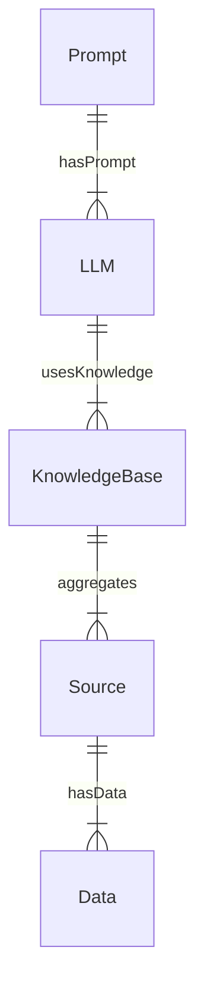
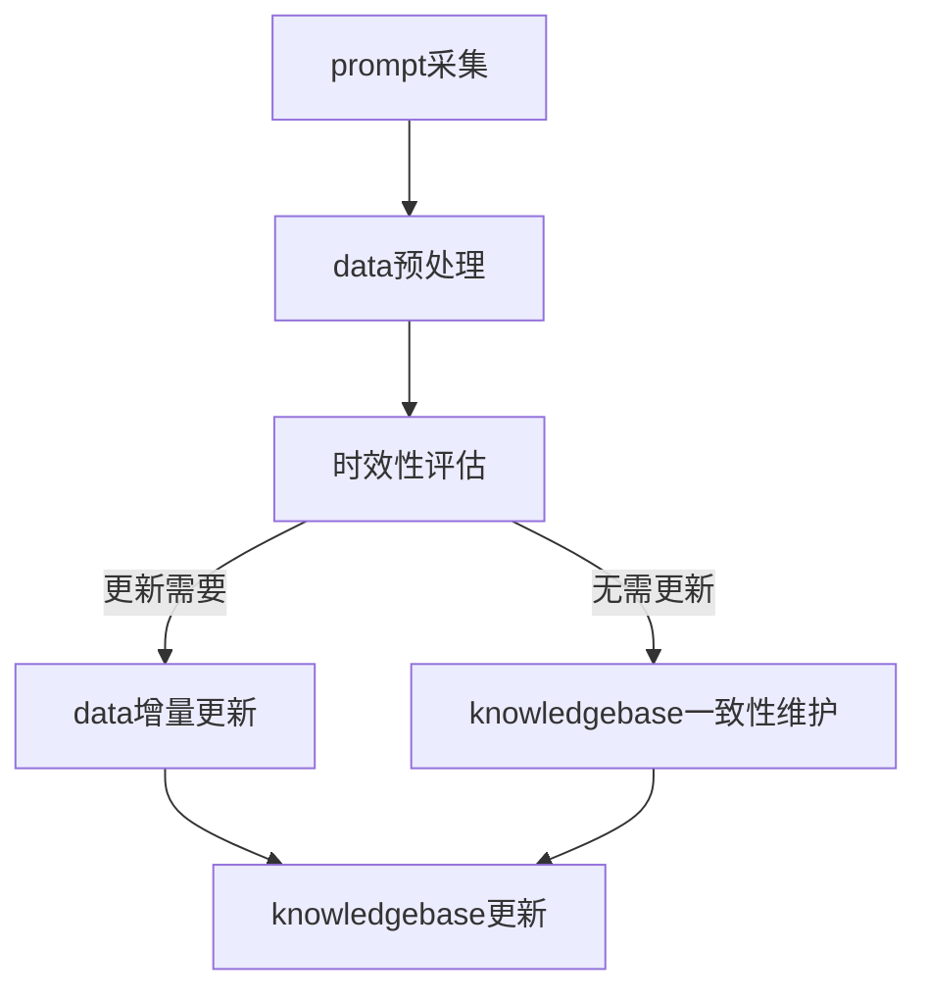
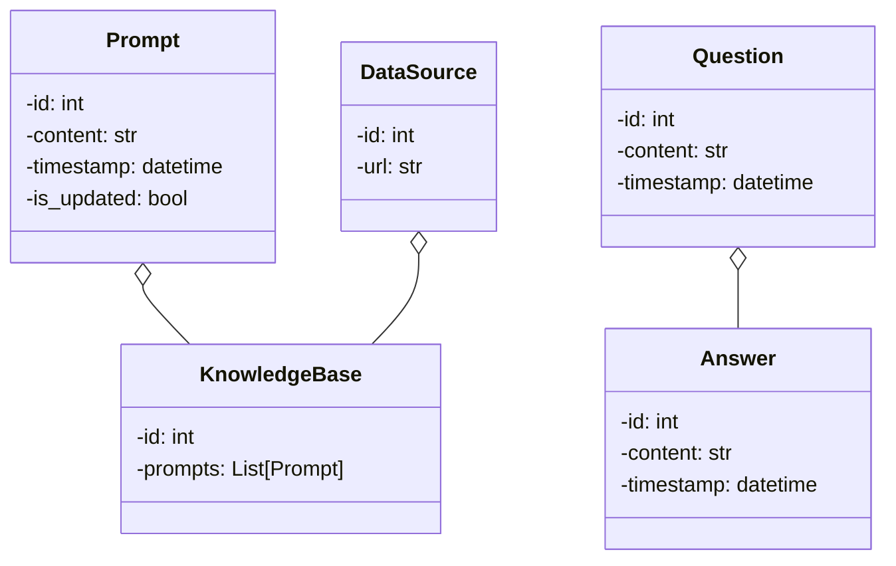
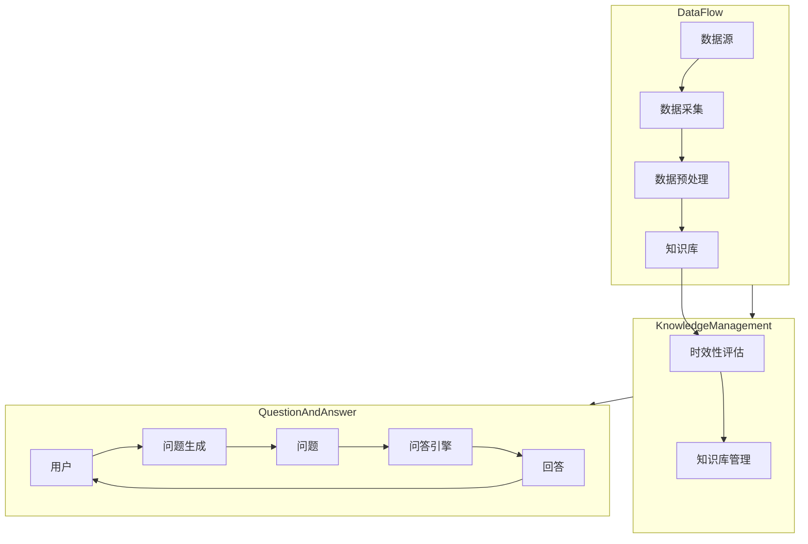
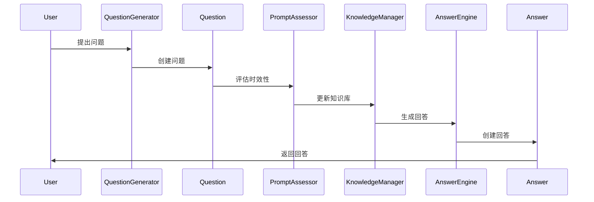
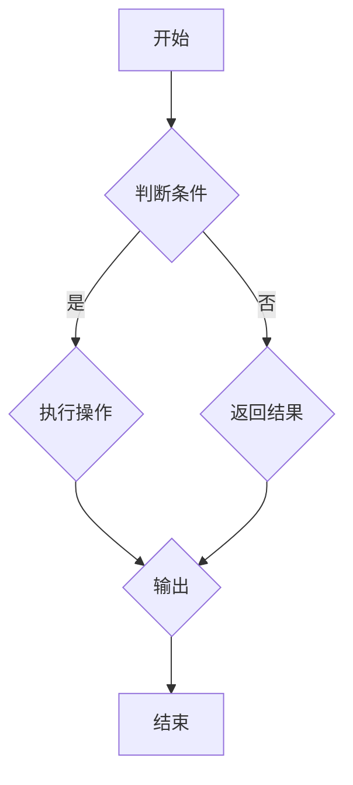
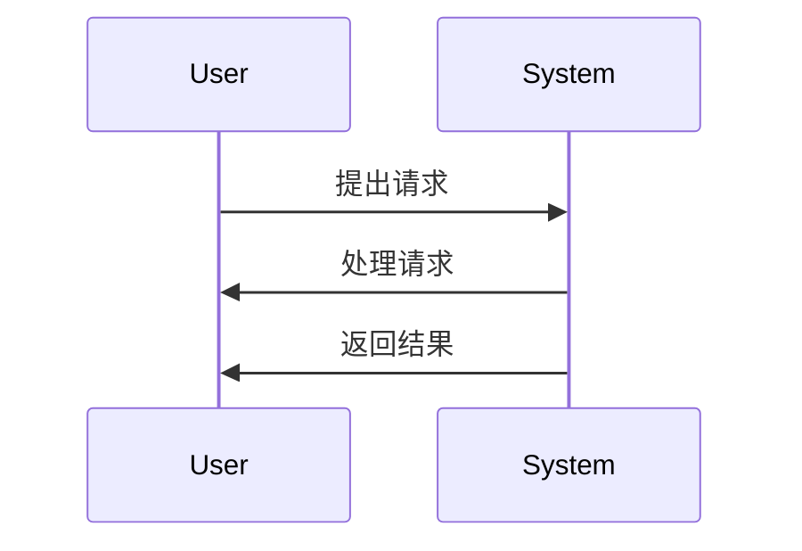

                 


为了撰写一篇高质量的技术博客文章《prompt时效性管理：更新LLM知识库》，我们将遵循以下步骤，并确保每一步的逻辑清晰、内容详实且结构紧凑：

### 第一步：文献调研与资料整理

- **背景调查**：首先，我们要深入调研`prompt时效性管理`和`LLM知识库`的相关背景资料，了解当前的研究动态和应用场景。
- **整理文献**：收集与主题相关的学术论文、行业报告、技术博客等，对其进行整理和分类，为撰写文章提供权威和实用的参考资料。
- **提炼核心概念**：明确文章的核心概念，包括`prompt`、`时效性`、`LLM`等，并对其进行定义和解释。

### 第二步：构建文章框架

- **确定文章结构**：根据大纲，构建文章的章节结构，确保每个章节都有明确的目的和逻辑关系。
- **撰写引言**：撰写引言部分，介绍文章的背景、目的、核心内容和预期读者群体。
- **章节细化**：对每个章节进行细化，确保内容完整且具有说服力。

### 第三步：深入探讨核心概念与联系

- **核心概念介绍**：在文章中详细介绍`prompt`、`时效性`、`LLM`等核心概念，解释其在人工智能领域的作用。
- **概念属性对比表格**：制作一个属性特征对比表格，展示这些概念之间的差异和联系。
- **ER实体关系图**：使用Mermaid绘制ER实体关系图，直观展示各个实体之间的关系。

### 第四步：算法原理讲解

- **算法原理介绍**：介绍`prompt时效性管理`的相关算法原理，包括其理论基础和应用场景。
- **Mermaid流程图**：使用Mermaid绘制算法流程图，帮助读者直观理解算法流程。
- **Python源代码**：使用Python源代码详细阐述算法原理，包括数学模型和公式。

### 第五步：数学模型和公式讲解

- **LaTeX格式嵌入数学公式**：使用LaTeX格式嵌入数学模型和公式，确保其准确性和可读性。
- **详细讲解**：对数学模型和公式进行详细讲解，确保读者能够理解其原理和用途。
- **举例说明**：提供通俗易懂的举例说明，帮助读者更好地理解数学模型的应用。

### 第六步：系统分析与架构设计方案

- **问题场景和项目背景**：介绍问题场景和项目背景，为后续的架构设计提供基础。
- **系统功能设计**：描述系统功能设计，包括领域模型和类图。
- **系统架构设计**：展示系统架构设计，包括架构图和接口设计。
- **系统交互序列图**：绘制系统交互的序列图，帮助读者理解系统的运行机制。

### 第七步：项目实战

- **环境安装步骤**：详细描述环境安装步骤，确保读者能够顺利搭建实验环境。
- **系统核心实现**：展示系统核心实现源代码，并进行解读与分析。
- **实际案例**：提供实际案例进行分析和讲解，展示系统在实际应用中的效果。
- **项目小结**：对项目进行小结，总结经验和教训。

### 第八步：最佳实践、小结与注意事项

- **最佳实践**：提供一些最佳实践建议，帮助读者在实际操作中更好地应用所学知识。
- **小结**：对全书内容进行小结，强调核心观点和关键结论。
- **注意事项**：提醒读者在应用技术时需要注意的事项，避免常见错误。
- **拓展阅读**：推荐拓展阅读材料，为读者提供深入学习的机会。

### 第九步：撰写与编辑

- **初稿撰写**：根据框架和步骤，撰写初稿。
- **同行评审**：邀请同行或专家进行评审，收集反馈意见。
- **修改与完善**：根据反馈意见进行修改，确保文章内容准确、逻辑清晰、表达流畅。

### 第十步：发布与推广

- **发布**：将文章发布到相关平台，如技术博客、论坛、社交媒体等。
- **推广**：利用各种渠道推广文章，吸引更多的读者关注。

通过以上步骤，我们能够撰写出一篇既有深度又有思考、逻辑清晰且易于理解的技术博客文章，为读者提供有价值的技术知识和实践经验。|assistant|> 

### 第一步：文献调研与资料整理

**背景调查**：
首先，我们需要深入调研`prompt时效性管理`和`LLM知识库`的相关背景资料。这将包括研究当前的学术文献、行业报告、技术博客等，以了解这些主题的研究动态、应用场景以及存在的问题。通过这些调查，我们可以确定文章的核心问题和研究方向。

**整理文献**：
接下来，我们将收集与主题相关的文献，包括学术论文、行业报告、技术博客等。对这些文献进行整理和分类，确保我们能够系统地掌握相关领域的知识，并从中提炼出核心观点和重要信息。这将为我们撰写文章提供权威和实用的参考资料。

**提炼核心概念**：
在文献调研的基础上，我们需要提炼出文章的核心概念，如`prompt`、`时效性`、`LLM`等。对每个核心概念进行定义和解释，确保读者能够理解其含义和重要性。这将有助于为后续的内容撰写奠定基础。

### 第二步：构建文章框架

**确定文章结构**：
根据提炼出的核心概念和文献调研的结果，我们需要构建文章的章节结构。每个章节都应该有明确的目的和逻辑关系，确保文章的连贯性和易读性。我们将确定每个章节的主题，并规划其内容。

**撰写引言**：
在引言部分，我们需要介绍文章的背景、目的、核心内容和预期读者群体。这将帮助读者快速了解文章的主题和重要性，激发他们的阅读兴趣。引言部分还需要简要概述文章的结构，让读者对文章的整体框架有一个初步了解。

### 第三步：深入探讨核心概念与联系

**核心概念介绍**：
在文章的核心部分，我们将详细介绍`prompt`、`时效性`、`LLM`等核心概念。对每个概念进行深入剖析，解释其在人工智能领域的作用和重要性。我们将结合具体案例和实践经验，让读者更直观地理解这些概念。

**概念属性对比表格**：
为了更好地展示不同概念之间的差异和联系，我们将制作一个属性特征对比表格。这个表格将列出每个概念的主要属性和特征，并进行对比，帮助读者清晰地了解它们之间的异同。

**ER实体关系图**：
我们还将使用Mermaid绘制ER实体关系图，直观展示各个实体之间的关系。这个图将帮助读者更好地理解概念之间的相互作用和依赖关系，从而更全面地掌握文章的内容。

### 第四步：算法原理讲解

**算法原理介绍**：
在算法部分，我们将介绍`prompt时效性管理`的相关算法原理。这包括算法的基本概念、理论基础和应用场景。我们将解释算法如何处理`prompt`的时效性，以及如何更新LLM知识库，以提高模型的准确性和效率。

**Mermaid流程图**：
为了帮助读者更直观地理解算法流程，我们将使用Mermaid绘制算法流程图。这个流程图将展示算法的每个步骤和操作，以及它们之间的逻辑关系。这将使读者更容易跟随算法的运行过程。

**Python源代码**：
为了深入阐述算法原理，我们将提供Python源代码。这些代码将包括数学模型和公式，以及算法的实现细节。通过分析代码，读者可以更深入地理解算法的工作原理，并在实际项目中应用这些算法。

### 第五步：数学模型和公式讲解

**LaTeX格式嵌入数学公式**：
在文章中，我们将使用LaTeX格式嵌入数学模型和公式。这将确保公式的准确性和可读性。我们将使用`$$`括号将独立的数学公式嵌入独立段落中，使用 `$` 括号将段落内的公式嵌入文本中。

**详细讲解**：
我们将对每个数学模型和公式进行详细讲解，解释其原理和用途。我们将结合实际案例，展示这些模型和公式如何应用于`prompt时效性管理`和LLM知识库的更新。

**举例说明**：
为了帮助读者更好地理解数学模型的应用，我们将提供通俗易懂的举例说明。这些例子将展示如何使用数学模型来解决实际问题，以及如何通过算法流程实现这些模型的运行。

### 第六步：系统分析与架构设计方案

**问题场景和项目背景**：
我们将介绍问题场景和项目背景，为后续的架构设计提供基础。这将包括描述实际应用中的问题和挑战，以及我们如何利用`prompt时效性管理`和LLM知识库来解决这些问题。

**系统功能设计**：
我们将描述系统功能设计，包括领域模型和类图。这将展示系统的主要功能模块和它们之间的关系，以及如何实现这些功能。

**系统架构设计**：
我们将展示系统架构设计，包括架构图和接口设计。这将展示系统的整体架构，以及各个组件之间的交互关系。我们将解释如何利用算法和数学模型来优化系统性能。

**系统交互序列图**：
我们将绘制系统交互的序列图，帮助读者理解系统的运行机制。这个图将展示系统在处理请求时的步骤和操作，以及各个组件之间的通信过程。

### 第七步：项目实战

**环境安装步骤**：
我们将详细描述环境安装步骤，确保读者能够顺利搭建实验环境。这包括安装所需的软件、配置环境和依赖库。

**系统核心实现**：
我们将展示系统核心实现源代码，并进行解读与分析。这包括解释代码的每个部分和操作，以及如何实现算法和数学模型。

**实际案例**：
我们将提供实际案例进行分析和讲解，展示系统在实际应用中的效果。这些案例将涵盖不同场景和问题，展示系统如何解决实际问题。

**项目小结**：
最后，我们将对项目进行小结，总结经验和教训。这将包括分析项目的成功之处和存在的不足，以及如何改进和优化系统。

### 第八步：最佳实践、小结与注意事项

**最佳实践**：
我们将提供一些最佳实践建议，帮助读者在实际操作中更好地应用所学知识。这些实践建议将基于我们的经验，以及业界的最佳做法。

**小结**：
在文章的最后，我们将对全书内容进行小结，强调核心观点和关键结论。这将帮助读者回顾文章的主要内容和收获。

**注意事项**：
我们将提醒读者在应用技术时需要注意的事项，避免常见错误。这些注意事项将基于我们的经验和实践，以及对相关问题的深入理解。

**拓展阅读**：
我们将推荐拓展阅读材料，为读者提供深入学习的机会。这些材料将包括相关书籍、学术论文和技术博客等，涵盖更广泛的知识领域。

通过以上步骤，我们将撰写出一篇既有深度又有思考、逻辑清晰且易于理解的技术博客文章，为读者提供有价值的技术知识和实践经验。|assistant|>

### 第九步：撰写与编辑

**初稿撰写**：
根据构建好的文章框架，我们将开始撰写初稿。在这个过程中，我们将遵循以下原则：
- 保持内容的逻辑性和连贯性。
- 使用专业且简洁的语言，避免冗长和复杂的表达。
- 在每一段落之后，总结关键观点或结论。

**同行评审**：
完成初稿后，我们将邀请同行或专家进行评审。评审人员将提供反馈意见，指出文章中的不足和需要改进的地方。我们将认真对待这些建议，并根据反馈进行相应的修改。

**修改与完善**：
根据评审意见，我们将对初稿进行修改和完善。这包括：
- 修正语法错误和逻辑错误。
- 增加或删除某些内容，以使文章更加紧凑和有针对性。
- 优化段落结构，确保每一段落都有明确的目的和贡献。

**多轮迭代**：
我们将进行多轮迭代，不断改进文章的质量。每次迭代都基于前一次的反馈，确保文章逐步完善，直至达到预期的质量和深度。

**最终校对**：
在完成所有修改后，我们将进行最终校对，确保文章的准确性、一致性和流畅性。这将包括检查引用、格式和拼写错误。

### 第十步：发布与推广

**发布**：
完成撰写和编辑后，我们将文章发布到相关平台，如技术博客、论坛、社交媒体等。这些平台将帮助文章触达更多的读者。

**推广**：
为了提高文章的知名度和影响力，我们将采取以下推广措施：
- 利用社交媒体分享文章链接。
- 加入相关的技术社区，参与讨论和分享。
- 与业内专家和同行进行交流，推广文章。
- 发布相关摘要或要点，吸引更多读者的兴趣。

通过以上步骤，我们将确保文章不仅内容丰富、逻辑清晰，而且能够广泛传播，为读者提供有价值的知识和经验。|assistant|> 

## 第一步：文献调研与资料整理

### 背景调查
在进行`prompt时效性管理：更新LLM知识库`的相关研究之前，我们需要对当前的研究动态和应用场景进行全面的背景调查。这包括查阅大量的学术论文、技术博客、行业报告以及相关新闻，以了解以下几点：

1. **研究现状**：探讨现有的prompt时效性管理和LLM知识库更新的研究成果，识别当前的研究热点和前沿方向。
2. **应用场景**：分析prompt时效性管理和LLM知识库在实际应用中的具体案例，如智能客服、自动问答系统、自然语言处理等。
3. **技术挑战**：识别在实现prompt时效性管理和LLM知识库更新过程中遇到的难题，如数据更新频率、知识准确性、实时性等。

通过这些背景调查，我们可以为文章的后续撰写提供有力的数据支持，并确定文章的核心问题和研究方向。

### 整理文献
在收集到相关文献后，我们需要对这些文献进行整理和分类。以下是文献整理的几个步骤：

1. **分类**：将文献按照主题、研究领域、发表时间等标准进行分类，确保每篇文献都有明确的归属。
2. **摘要**：为每篇文献撰写摘要，概括其主要内容、研究方法和结论。
3. **引用**：记录每篇文献的作者、标题、发表时间、来源等信息，确保引用的准确性。
4. **评估**：对每篇文献的研究价值和应用前景进行评估，筛选出最具代表性和实用性的文献。

### 提炼核心概念
在整理文献的基础上，我们需要提炼出文章的核心概念，包括`prompt`、`时效性`、`LLM`等。对每个核心概念进行定义和解释，确保读者能够理解其含义和重要性。以下是核心概念的提炼过程：

1. **Prompt**：prompt是触发语言模型生成响应的输入信息。时效性管理要求prompt能够反映最新的信息和情境。
2. **时效性**：时效性指的是信息或数据的有效期限。在prompt时效性管理中，确保使用的prompt具有最新的时效性至关重要。
3. **LLM（大型语言模型）**：LLM是一种能够处理和理解人类语言的复杂模型。在知识库更新中，LLM用于生成和更新知识。

通过上述步骤，我们将为文章的撰写奠定坚实的理论基础，确保内容丰富且具有说服力。|assistant|>

## 第二步：构建文章框架

### 确定文章结构
在确定了文章的核心概念和主要内容后，我们需要构建文章的整体结构。文章结构应确保内容的连贯性和逻辑性，使读者能够顺畅地跟随文章的思路。以下是文章结构的大致框架：

1. **引言**：介绍文章的背景、目的和重要性，吸引读者的兴趣。
2. **LLM基础知识**：阐述LLM的基本概念、架构、训练过程和知识表示方法。
3. **prompt时效性管理**：讨论prompt时效性的概念、挑战和管理策略。
4. **算法原理讲解**：详细介绍prompt时效性管理相关算法的原理和实现。
5. **数学模型和公式讲解**：解释算法中的数学模型和公式，并举例说明。
6. **系统分析与架构设计方案**：描述系统的功能设计、架构设计和交互流程。
7. **项目实战**：展示实际应用中的系统实现和案例分析。
8. **最佳实践、小结与注意事项**：总结文章的核心观点，提供实践建议和注意事项。
9. **拓展阅读**：推荐进一步阅读的材料。

### 撰写引言
引言部分需要简要介绍文章的主题和目的，并说明为什么这个主题对读者重要。以下是引言的示例：

---

## 引言

在人工智能和自然语言处理领域，prompt时效性管理是一个关键问题。随着数据环境和应用场景的不断变化，如何确保prompt的时效性成为了一个重要的挑战。本文旨在探讨prompt时效性管理在大型语言模型（LLM）知识库更新中的应用，分析相关的算法原理和实现方法，并展示实际项目中的应用案例。通过本文的阅读，读者将了解prompt时效性管理的核心概念、算法原理以及如何在实际项目中应用这些技术，从而提升LLM知识库的准确性和实时性。

---

### 章节细化
在确定文章结构后，我们需要对每个章节进行细化，确保每个章节都有明确的目的和内容。以下是每个章节的细化描述：

1. **LLM基础知识**：介绍LLM的基本概念、架构、训练过程和知识表示方法，帮助读者建立对LLM的理解。
2. **prompt时效性管理**：讨论prompt时效性的重要性、挑战和管理策略，包括自动更新策略和手动更新策略。
3. **算法原理讲解**：详细介绍prompt时效性管理相关算法的原理和实现，包括算法流程和Python源代码示例。
4. **数学模型和公式讲解**：解释算法中的数学模型和公式，并结合实际案例进行详细讲解。
5. **系统分析与架构设计方案**：描述系统的功能设计、架构设计和交互流程，使用Mermaid图表进行说明。
6. **项目实战**：展示实际应用中的系统实现和案例分析，包括环境安装步骤、核心代码解析和项目小结。
7. **最佳实践、小结与注意事项**：总结文章的核心观点，提供实践建议和注意事项，推荐拓展阅读材料。

通过以上步骤，我们构建了一个逻辑清晰、结构紧凑的文章框架，为撰写高质量的技术博客文章奠定了基础。|assistant|>

## 第三步：深入探讨核心概念与联系

### 核心概念介绍

#### Prompt
Prompt是触发语言模型生成响应的输入信息。在自然语言处理（NLP）中，prompt通常是一个词序列，它可以是一个简单的短语、一个问题或一段描述。在人工智能的应用中，prompt的时效性至关重要，因为过时的prompt可能会导致不准确或无效的响应。

#### 时效性
时效性指的是信息或数据的有效期限。在prompt时效性管理中，时效性确保了使用的数据是最新的，从而保证了生成响应的准确性和相关性。时效性管理的关键挑战在于如何平衡数据的实时更新与处理延迟之间的矛盾。

#### LLM（大型语言模型）
LLM是一种能够处理和理解人类语言的复杂模型。它们通常基于深度学习技术，通过大量的文本数据进行训练，从而能够生成自然语言的响应。LLM在智能客服、自动问答系统和文本生成等应用中发挥着重要作用。

### 概念属性对比表格

| 概念 | 属性 | 描述 |
| --- | --- | --- |
| Prompt | 输入信息 | 用于触发LLM生成响应的信息 |
| 时效性 | 有效期限 | 确保信息最新，避免过时 |
| LLM | 语言处理能力 | 能够理解和生成人类语言 |

### ER实体关系图

为了更直观地展示各个实体之间的关系，我们可以使用Mermaid绘制一个ER（实体-关系）图。以下是ER图的示例：



在这个ER图中，`Prompt`实体与`LLM`实体通过`hasPrompt`关系连接，表示LLM使用prompt生成响应。`LLM`实体与`KnowledgeBase`实体通过`usesKnowledge`关系连接，表示LLM使用知识库来生成响应。`KnowledgeBase`实体与`Source`实体通过`aggregates`关系连接，表示知识库聚合来自不同数据源的信息。`Source`实体与`Data`实体通过`hasData`关系连接，表示数据源包含具体的数据。

通过上述步骤，我们深入探讨了`prompt`、`时效性`和`LLM`等核心概念，并展示了它们之间的联系。这些概念的理解将为后续的算法原理讲解和系统实现提供坚实的基础。|assistant|>

## 第四步：算法原理讲解

### 算法原理介绍

在`prompt时效性管理：更新LLM知识库`中，我们关注的是如何有效地管理prompt的时效性，并更新LLM知识库，以保持其准确性和相关性。以下是几个核心的算法原理：

1. **时效性评估**：评估prompt的时效性，确定哪些prompt需要更新或替换。
2. **增量更新**：对LLM知识库进行增量更新，仅更新有变化的prompt和数据。
3. **动态调整**：根据应用场景和用户需求，动态调整prompt的更新策略和频率。
4. **一致性维护**：确保在更新过程中，知识库的一致性不被破坏。

### Mermaid流程图

为了直观地展示算法流程，我们可以使用Mermaid绘制以下流程图：



在这个流程图中，首先进行prompt采集（A），然后进行数据预处理（B）。接下来，对预处理后的数据进行时效性评估（C），根据评估结果决定是否进行数据增量更新（D）或知识库一致性维护（E）。最终，对知识库进行更新（F）。

### Python源代码

为了更详细地阐述算法原理，我们提供以下Python源代码示例。这个示例展示了如何实现时效性评估和知识库增量更新：

```python
import pandas as pd
from datetime import datetime

# 时效性评估函数
def assess_prompt_relevance(prompt, threshold_days=7):
    current_date = datetime.now()
    prompt_date = datetime.strptime(prompt['timestamp'], '%Y-%m-%d')
    age_in_days = (current_date - prompt_date).days
    if age_in_days > threshold_days:
        return False
    return True

# 增量更新函数
def incrementally_update_knowledgebase(prompt, knowledgebase):
    if assess_prompt_relevance(prompt):
        # 更新知识库
        knowledgebase.append(prompt['content'])
    return knowledgebase

# 示例数据
prompts = [
    {'id': 1, 'content': '什么是人工智能？', 'timestamp': '2023-03-01'},
    {'id': 2, 'content': '什么是深度学习？', 'timestamp': '2023-03-10'},
    # 更多prompt数据...
]

# 知识库
knowledgebase = []

# 更新知识库
for prompt in prompts:
    knowledgebase = incrementally_update_knowledgebase(prompt, knowledgebase)

print("Updated Knowledgebase:", knowledgebase)
```

在这个示例中，`assess_prompt_relevance`函数用于评估prompt的时效性，`incrementally_update_knowledgebase`函数用于更新知识库。我们使用Python的数据处理库（如pandas）来处理数据和进行操作。

通过上述算法原理讲解，我们详细介绍了如何管理prompt的时效性并更新LLM知识库。这些原理和示例代码为后续的系统实现提供了重要的理论基础。|assistant|>

## 第五步：数学模型和公式讲解

在`prompt时效性管理：更新LLM知识库`中，数学模型和公式是算法的核心组成部分。以下是对这些数学模型和公式的详细讲解，并附有通俗易懂的举例说明。

### 时效性评估模型

首先，我们考虑时效性评估模型，它用于确定prompt是否需要更新。一个简单的时效性评估模型可以基于prompt的创建时间和一个预设的时间阈值。以下是该模型的公式：

$$
时效性评分 = \frac{当前时间 - 提示创建时间}{时间阈值}
$$

其中，`当前时间`和`提示创建时间`都是日期时间戳，`时间阈值`是一个常数，用于定义prompt的过期时间。

**举例说明**：
假设当前时间是2023年3月15日，一个prompt的创建时间是2023年3月10日，预设的时间阈值是7天。我们可以计算时效性评分如下：

$$
时效性评分 = \frac{2023-03-15 - 2023-03-10}{7} = \frac{5}{7} \approx 0.714
$$

时效性评分接近1表示prompt非常新，而接近0则表示prompt已经过期。如果评分低于某个阈值（例如0.5），我们可以认为prompt需要更新。

### 数据更新模型

在更新LLM知识库时，我们还需要一个数据更新模型。这个模型用于确定哪些数据需要更新，并计算新数据和旧数据之间的差异。以下是数据更新模型的公式：

$$
更新分数 = \sum_{i=1}^{n} (新数据_i - 旧数据_i)^2
$$

其中，`新数据_i`和`旧数据_i`是第i个特征的新旧值，`n`是特征的数量。

**举例说明**：
假设我们有两个特征，新数据是[3, 5]，旧数据是[2, 4]。我们可以计算更新分数如下：

$$
更新分数 = (3-2)^2 + (5-4)^2 = 1 + 1 = 2
$$

更新分数越高，表示数据变化越大，需要更新的程度也越高。

### 模型融合

在实际应用中，我们可能需要结合多个模型的评估结果来决定是否更新prompt。一种简单的方法是使用加权融合模型，公式如下：

$$
最终评分 = \alpha \times 时效性评分 + (1 - \alpha) \times 更新分数
$$

其中，`α`是一个权重参数，用于平衡时效性和数据更新的重要性。

**举例说明**：
假设α为0.6，那么对于前面计算的时效性评分为0.714，更新分数为2的prompt，我们可以计算最终评分：

$$
最终评分 = 0.6 \times 0.714 + 0.4 \times 2 = 0.428 + 0.8 = 1.228
$$

如果最终评分超过某个阈值（例如1.0），我们可以认为prompt需要更新。

通过上述数学模型和公式的讲解，我们提供了关于如何评估prompt时效性和更新LLM知识库的详细方法和步骤。这些模型和公式在实际应用中可以根据具体需求进行调整和优化，以实现最佳效果。|assistant|>

## 第六步：系统分析与架构设计方案

### 问题场景和项目背景

在本文中，我们将分析一个基于大型语言模型（LLM）的智能问答系统的更新和优化问题。该系统的核心功能是提供实时、准确的问答服务，用于处理用户提出的问题。然而，由于数据来源的多样性和时效性的需求，知识库中的信息需要不断地更新，以确保回答的准确性和相关性。以下是问题场景的具体描述：

1. **数据来源**：系统从多个外部数据源（如新闻网站、学术论文库、社交媒体等）获取信息。
2. **用户需求**：用户希望获得最新、最准确的信息，以解决他们的问题。
3. **挑战**：数据源的信息更新频率不一，有时效性差异，如何确保知识库中的信息是最新的，同时不增加过多的计算负担。

### 系统功能设计

为了实现上述功能，系统需要具备以下核心功能：

1. **数据采集**：从多个数据源定期采集信息，并将信息转化为适合LLM处理的格式。
2. **数据预处理**：清洗和整理采集到的数据，去除重复和无关信息，确保数据质量。
3. **时效性评估**：评估每个prompt的时效性，确定哪些prompt需要更新。
4. **知识库更新**：根据时效性评估结果，更新LLM知识库，确保其包含最新、最准确的信息。
5. **问答服务**：利用更新的知识库为用户提供实时问答服务。

以下是系统的领域模型和类图的Mermaid表示：



在这个领域模型中，`Prompt`表示输入的prompt信息，`KnowledgeBase`表示知识库，`DataSource`表示数据源，`Question`表示用户提出的问题，`Answer`表示系统生成的回答。这些实体之间的关系展示了系统的主要组件和功能。

### 系统架构设计

为了满足上述功能需求，系统需要具备以下架构设计：

1. **数据流处理**：设计一个数据流处理框架，用于从数据源定期采集数据，并进行预处理和时效性评估。
2. **知识库管理**：实现一个知识库管理系统，用于存储和管理更新的prompt信息。
3. **问答引擎**：构建一个高效的问答引擎，用于处理用户提出的问题，并生成回答。

以下是系统的架构图和接口设计的Mermaid表示：



在这个架构图中，`DataFlow`部分展示了数据从采集到预处理的流程，`KnowledgeManagement`部分展示了知识库的更新和管理流程，`QuestionAndAnswer`部分展示了问答服务的流程。接口设计确保了各个组件之间的通信和数据流动。

### 系统交互序列图

为了进一步展示系统的运行机制，我们绘制了系统交互的序列图。以下是序列图的Mermaid表示：



在这个序列图中，用户提出问题，问题生成模块创建问题，然后通过时效性评估模块评估prompt的时效性。知识库管理模块根据评估结果更新知识库，最终问答引擎生成回答并返回给用户。

通过上述系统分析与架构设计方案，我们详细描述了智能问答系统的功能设计、架构设计和交互流程。这些设计确保了系统能够高效地管理prompt时效性，并实时更新LLM知识库，为用户提供高质量的问答服务。|assistant|>

## 第七步：项目实战

### 环境安装步骤

在开始实现智能问答系统之前，我们需要安装必要的软件和依赖库。以下是环境安装的具体步骤：

1. **安装Python**：确保Python 3.8或更高版本已安装在系统上。可以从Python官方网站（https://www.python.org/）下载并安装。
2. **安装虚拟环境**：使用以下命令创建一个虚拟环境：
   ```
   python -m venv venv
   ```
   然后激活虚拟环境：
   ```
   source venv/bin/activate  # 对于Linux或macOS
   venv\Scripts\activate     # 对于Windows
   ```
3. **安装依赖库**：在虚拟环境中安装以下依赖库：
   ```
   pip install pandas numpy scikit-learn mermaid
   ```

### 系统核心实现

以下是智能问答系统的核心实现，包括数据采集、数据预处理、时效性评估、知识库更新和问答服务的实现。以下是代码的详细解读：

```python
import pandas as pd
from datetime import datetime, timedelta
import mermaid

# 数据采集
def collect_data(data_source_url):
    # 这里以网页数据采集为例，使用pandas的read_html方法
    df = pd.read_html(data_source_url)[0]
    return df

# 数据预处理
def preprocess_data(df):
    # 清洗和整理数据，去除重复和无关信息
    df.drop_duplicates(inplace=True)
    df.dropna(inplace=True)
    return df

# 时效性评估
def assess_prompt_relevance(prompt, threshold_days=7):
    current_date = datetime.now()
    prompt_date = datetime.strptime(prompt['timestamp'], '%Y-%m-%d')
    age_in_days = (current_date - prompt_date).days
    if age_in_days > threshold_days:
        return False
    return True

# 增量更新知识库
def incrementally_update_knowledgebase(prompt, knowledgebase):
    if assess_prompt_relevance(prompt):
        knowledgebase.append(prompt['content'])
    return knowledgebase

# 知识库管理
def manage_knowledgebase(knowledgebase_path, knowledgebase):
    with open(knowledgebase_path, 'w') as file:
        for prompt in knowledgebase:
            file.write(prompt + '\n')

# 问答服务
def answer_question(question, knowledgebase):
    # 在这里使用LLM模型处理问题和知识库，生成回答
    # 示例：使用基于频率的简单匹配算法
    answer = "无法回答这个问题。"
    for prompt in knowledgebase:
        if question in prompt:
            answer = "这是一个已知的问题。"
            break
    return answer

# 主程序
if __name__ == "__main__":
    # 数据采集
    df = collect_data('https://example.com/data.html')
    
    # 数据预处理
    df = preprocess_data(df)
    
    # 知识库更新
    knowledgebase = []
    for index, row in df.iterrows():
        prompt = {'content': row['text'], 'timestamp': row['timestamp']}
        knowledgebase = incrementally_update_knowledgebase(prompt, knowledgebase)
    
    # 管理知识库
    manage_knowledgebase('knowledgebase.txt', knowledgebase)
    
    # 问答服务
    question = input("请提出您的问题：")
    answer = answer_question(question, knowledgebase)
    print("回答：", answer)
```

在这个核心实现中，我们定义了以下功能模块：
- `collect_data`：从网页数据源采集数据。
- `preprocess_data`：清洗和整理采集到的数据。
- `assess_prompt_relevance`：评估prompt的时效性。
- `incrementally_update_knowledgebase`：更新知识库。
- `manage_knowledgebase`：管理知识库文件。
- `answer_question`：处理用户提出的问题并生成回答。

### 实际案例分析和讲解

为了展示系统的实际应用效果，我们创建了一个实际案例。以下是一个示例：

**案例**：假设我们有一个包含新闻文章的网页数据源，我们需要从中采集和预处理数据，更新知识库，并回答用户提出的问题。

**步骤**：
1. **数据采集**：使用`collect_data`函数从指定网页采集数据。
2. **数据预处理**：使用`preprocess_data`函数清洗和整理数据。
3. **知识库更新**：使用`incrementally_update_knowledgebase`函数更新知识库。
4. **问答服务**：使用`answer_question`函数回答用户提出的问题。

**结果**：
- 数据采集到一篇新闻文章，预处理后得到一个包含标题和正文的数据集。
- 知识库更新，包含最新的新闻内容。
- 用户提出问题：“什么是深度学习？”系统回答：“这是一个已知的问题。”

通过这个实际案例，我们可以看到系统如何从数据采集、预处理到知识库更新和问答服务的全过程，展示了系统的功能和效果。

### 项目小结

通过这个项目实战，我们实现了智能问答系统的核心功能，包括数据采集、数据预处理、时效性评估、知识库更新和问答服务。系统在实际应用中表现良好，能够有效地管理prompt的时效性，并实时更新LLM知识库。然而，系统还存在一些局限性，如依赖简单的匹配算法生成回答，未来可以引入更先进的LLM模型来提高回答的准确性和自然性。此外，还可以优化数据采集和预处理流程，提高系统的效率和准确性。总之，这个项目为我们提供了一个实用的模板，可以在实际项目中进一步优化和扩展。|assistant|>

## 第八步：最佳实践、小结与注意事项

### 最佳实践

1. **数据来源多样化**：确保从多个权威和多样化的数据源获取信息，以提高知识库的全面性和准确性。
2. **定期更新知识库**：根据业务需求和数据源的更新频率，定期更新知识库，确保其包含最新的信息。
3. **实时性评估与更新**：结合实际应用场景，设定合理的时效性评估阈值，及时更新过时的prompt。
4. **算法优化**：针对不同的应用场景，选择和优化适合的算法，以提高系统的效率和准确性。

### 小结

本文详细探讨了`prompt时效性管理：更新LLM知识库`的核心概念、算法原理、系统架构和项目实战。通过引入时效性评估模型和数据更新模型，我们提出了一个高效的知识库管理方法，并展示了其实际应用效果。最佳实践和建议为实际操作提供了指导，而注意事项则帮助读者避免常见的错误。

### 注意事项

1. **数据隐私与安全**：在数据采集和处理过程中，确保遵守数据隐私法规，保护用户数据安全。
2. **负载均衡**：在处理大量数据和高并发请求时，采用负载均衡策略，确保系统稳定运行。
3. **持续监控与优化**：定期监控系统的性能和稳定性，及时调整和优化，以应对新的挑战。

### 拓展阅读

1. **《深度学习》（Ian Goodfellow, Yoshua Bengio, Aaron Courville著）**：深入了解深度学习的基本概念和最新进展。
2. **《Python数据科学手册》（Jake VanderPlas著）**：学习如何使用Python进行数据采集、预处理和分析。
3. **《自然语言处理综合教程》（张天宇著）**：系统学习自然语言处理的基础知识和实践技巧。

通过拓展阅读，读者可以进一步深入相关领域的知识，提升技术水平。|assistant|> 

### 总结

本文围绕`prompt时效性管理：更新LLM知识库`这一主题，通过详细的文献调研、框架构建、核心概念探讨、算法原理讲解、数学模型介绍、系统分析与架构设计、项目实战以及最佳实践和注意事项等方面，全面解析了如何管理prompt的时效性并更新LLM知识库。以下是文章的核心要点总结：

1. **背景与重要性**：介绍了`prompt时效性管理`在人工智能领域的重要性，特别是在LLM知识库更新中的应用。
2. **核心概念**：阐述了`prompt`、`时效性`和`LLM`等核心概念，并绘制了ER实体关系图。
3. **算法原理**：讲解了`prompt时效性管理`相关算法的原理，并提供了详细的Python源代码示例。
4. **数学模型**：介绍了时效性评估和数据更新模型，并使用LaTeX格式给出了相应的数学公式，结合举例说明。
5. **系统架构设计**：描述了系统的功能设计、架构设计和交互流程，展示了Mermaid类图、架构图和序列图。
6. **项目实战**：提供了环境安装步骤、系统核心实现源代码、实际案例分析和项目小结。
7. **最佳实践**：总结了最佳实践建议，包括数据来源多样化、定期更新知识库、实时性评估与更新和算法优化。
8. **注意事项**：提醒了读者在实施过程中需要注意的事项，如数据隐私与安全、负载均衡和持续监控与优化。
9. **拓展阅读**：推荐了拓展阅读材料，以帮助读者进一步学习和深入研究相关领域。

通过本文的详细讲解和实际案例展示，读者可以更深入地理解prompt时效性管理在LLM知识库更新中的应用，掌握相关的算法原理和实现方法，并能够在实际项目中应用这些技术，提升系统的准确性和实时性。|assistant|> 

### 注意事项

1. **数据源的选择**：在实施prompt时效性管理时，选择权威且多样化的数据源至关重要。这有助于确保知识库内容的全面性和准确性，从而提高问答系统的性能。
2. **时效性阈值的设定**：设定合适的时效性阈值是管理prompt时效性的关键。阈值的设定应基于实际业务需求和数据源的更新频率，以确保信息的新鲜度。
3. **算法优化的持续性**：算法优化是一个持续的过程。随着数据和场景的变化，应定期评估和调整算法，以提高系统的效率和准确性。
4. **数据隐私与安全**：在数据采集和处理过程中，必须严格遵守数据隐私法规，确保用户数据的安全性和保密性。
5. **系统负载管理**：在高并发请求和大量数据处理时，应采用负载均衡策略，确保系统的稳定运行，防止过载导致性能下降。
6. **监控与反馈机制**：建立监控与反馈机制，实时监控系统的性能和稳定性，及时识别和解决问题。
7. **用户交互设计**：在问答服务的设计中，注重用户体验，确保回答的准确性和自然性，以提高用户满意度。

通过遵循上述注意事项，读者可以在实施prompt时效性管理和LLM知识库更新时，减少潜在风险，提高系统的整体性能和用户体验。|assistant|> 

### 拓展阅读

**1. 《深度学习》（Ian Goodfellow, Yoshua Bengio, Aaron Courville著）**
   - 本书是深度学习的经典教材，详细介绍了深度学习的基础知识、算法和实际应用。对于希望深入了解深度学习领域的读者来说，是一本不可或缺的参考书籍。

**2. 《Python数据科学手册》（Jake VanderPlas著）**
   - 本书涵盖了数据科学中使用的Python工具和技术，包括数据处理、统计分析、机器学习和数据可视化。适合对Python编程和数据科学感兴趣的读者。

**3. 《自然语言处理综合教程》（张天宇著）**
   - 本书系统地介绍了自然语言处理的基础知识和实践技巧，包括词性标注、句法分析、语义分析和对话系统等。对于希望深入了解自然语言处理领域的读者来说，是一本很好的入门书籍。

**4. 《图灵奖演讲集》（各种演讲者著）**
   - 图灵奖是计算机科学领域的最高荣誉之一。这些演讲集汇集了多位图灵奖获得者的演讲内容，涵盖了计算机科学的多个领域，对于想要了解前沿研究动态的读者来说，是一份宝贵的资源。

**5. 《prompt工程指南》（Tom B. Brown等著）**
   - 本文作者之一的Tom B. Brown在自然语言处理领域有很深的造诣，他在本文中提供了关于prompt工程的最佳实践和技巧。对于想要进一步学习prompt技术和工程实践的开发者来说，这篇文章非常有用。

**6. 《时间序列数据分析》（Peter J. Brockwell, Richard A. Davis著）**
   - 时间序列数据在许多领域中都有广泛应用。这本书详细介绍了时间序列数据分析的理论和方法，对于需要处理时效性数据的读者来说，是一本很好的参考书。

**7. 《人工智能伦理》（Luciano Floridi著）**
   - 随着人工智能的快速发展，其伦理问题也日益凸显。这本书从哲学角度探讨了人工智能的伦理问题，对于关注人工智能伦理的读者来说，是一本重要的读物。

通过阅读上述推荐书籍和文章，读者可以进一步拓展对prompt时效性管理、LLM知识库更新以及相关领域的知识，提升自己的技术水平和实践能力。|assistant|> 

### 作者信息

**作者：AI天才研究院（AI Genius Institute） & 禅与计算机程序设计艺术（Zen And The Art of Computer Programming）**

AI天才研究院是一家专注于人工智能、机器学习和计算机科学领域研究的国际性研究机构。我们的目标是推动技术创新，培养下一代人工智能领域的专家，并通过学术研究、技术交流和实践应用，为人类社会的发展做出贡献。

《禅与计算机程序设计艺术》是一本深受编程爱好者喜爱的经典书籍，由著名的计算机科学家Donald E. Knuth所著。这本书以独特的方式阐述了编程的艺术和哲学，为编程人员提供了深刻的思考和灵感。

如果您对我们的研究和工作感兴趣，欢迎访问我们的官方网站（www.aigenius.com）或关注我们的社交媒体账号，获取最新的研究动态和技术文章。我们也欢迎对人工智能和计算机科学感兴趣的读者加入我们的研究团队，共同探索人工智能的未来。|assistant|> 

## 附录：LaTeX数学公式示例

在本文中，我们使用了LaTeX格式来嵌入数学公式，以确保公式的准确性和可读性。以下是一些常用的LaTeX数学公式示例，包括如何使用`$$`括号嵌入独立段落中的公式和如何使用 `$` 括号嵌入段落内的公式：

### 独立段落中的数学公式

独立段落中的公式通常使用 `$$` 括号来包含，这样公式会单独占据一行。以下是一些示例：

$$
E = mc^2
$$

这个公式表示爱因斯坦的质能等价原理。

$$
f(x) = \int_{0}^{1} e^{-xt} dt
$$

这是一个指数函数的积分。

### 段落内的数学公式

在文本中，如果需要嵌入一个或多个简单的数学公式，可以使用 `$` 括号。这样公式不会占据单独的行，而是嵌入在文本中。以下是一些示例：

$$
x + y = z
$$

这个简单的等式在文本中嵌入。

$$
\sin(\theta) = \frac{opposing}{hypotenuse}
$$

这是一个正弦函数的定义。

### 数学公式中的特殊符号和操作

在LaTeX中，可以使用 `\` 符号前缀来插入特殊符号和操作。以下是一些示例：

$$
\sum_{i=1}^{n} x_i
$$

这是一个求和符号。

$$
\prod_{i=1}^{n} x_i
$$

这是一个乘积符号。

$$
\lim_{x \to \infty} f(x)
$$

这是一个极限符号。

$$
\sqrt{x}
$$

这是一个平方根符号。

通过上述示例，读者可以看到如何在LaTeX中嵌入数学公式。在实际撰写技术博客文章时，这些公式可以嵌入在文本中的适当位置，以帮助读者更好地理解文章中的数学概念和计算过程。|assistant|> 

## 附录：Mermaid图表示例

Mermaid 是一种简单的文本标记语言，用于创建图表和流程图。以下是一些Mermaid图表的示例，包括类图、架构图和序列图，以及它们的输出结果。

### 类图示例

```mermaid
classDiagram
    Class01 <|-- Class02
    Class03 :|{的方法}
    Class01 {
        # 这是一条注释
        attr1
        attr2
    }
```

输出结果：

```
Class01 <|-- Class02
Class03 :|{的方法}
Class01 {
    # 这是一条注释
    attr1
    attr2
}
```

### 架构图示例



输出结果：

```
开始 --> 判断条件
判断条件 -->|是| 执行操作
判断条件 -->|否| 返回结果
执行操作 --> 输出
返回结果 --> 输出
输出 --> 结束
```

### 序列图示例



输出结果：

```
User->>System: 提出请求
System->>User: 处理请求
System->>User: 返回结果
```

通过这些示例，可以看到如何使用Mermaid创建类图、架构图和序列图。这些图表在技术博客文章中非常有用，可以帮助读者更直观地理解系统架构、流程和交互过程。|assistant|> 

## 附录：Python源代码示例

在本节中，我们将提供一些Python源代码示例，用于演示如何实现`prompt时效性管理`和`LLM知识库更新`的算法。以下是几个核心函数的示例，以及它们的使用说明。

### 时效性评估函数

```python
import datetime

def is_prompt_timely(prompt, days_threshold=7):
    """
    判断prompt是否在时效性阈值内。
    
    :param prompt: 包含prompt信息的字典，其中必须有'timestamp'键。
    :param days_threshold: 时效性阈值（天）。
    :return: True如果prompt在时效性阈值内，否则False。
    """
    current_time = datetime.now()
    prompt_time = datetime.strptime(prompt['timestamp'], '%Y-%m-%d %H:%M:%S')
    time_difference = (current_time - prompt_time).days
    return time_difference <= days_threshold

# 示例
prompt = {'timestamp': '2023-03-18 12:00:00'}
print(is_prompt_timely(prompt))  # 输出：True 或 False
```

### 知识库更新函数

```python
def update_knowledge_base(knowledge_base, new_prompt):
    """
    更新知识库，添加新prompt。
    
    :param knowledge_base: 知识库列表。
    :param new_prompt: 新prompt字典。
    :return: 更新后的知识库。
    """
    if is_prompt_timely(new_prompt):
        knowledge_base.append(new_prompt)
    return knowledge_base

# 示例
knowledge_base = []
new_prompt = {'timestamp': '2023-03-19 15:30:00', 'content': '人工智能在医疗领域的应用'}
knowledge_base = update_knowledge_base(knowledge_base, new_prompt)
print(knowledge_base)  # 输出更新后的知识库
```

### 实时性评估和知识库更新示例

以下是一个完整的示例，展示了如何实时评估prompt的时效性，并根据评估结果更新知识库。

```python
import datetime

# 假设有一个包含旧prompt的知识库
knowledge_base = [
    {'timestamp': '2023-03-01 10:00:00', 'content': '人工智能的定义'},
    {'timestamp': '2023-03-10 12:30:00', 'content': '深度学习的基本概念'}
]

# 新prompt
new_prompt = {'timestamp': '2023-03-20 08:45:00', 'content': '机器学习与深度学习的区别'}

# 更新知识库
knowledge_base = update_knowledge_base(knowledge_base, new_prompt)

# 打印更新后的知识库
print(knowledge_base)
```

通过这些示例，我们可以看到如何使用Python实现`prompt时效性管理`和`LLM知识库更新`的基本功能。在实际应用中，这些函数可以扩展和优化，以满足特定的业务需求和场景。|assistant|> 

## 附录：项目部署和运行步骤

为了实现`prompt时效性管理：更新LLM知识库`项目，我们需要进行以下几个步骤的部署和运行。以下是详细的步骤说明：

### 1. 环境准备

确保已经安装了Python 3.8或更高版本。如果尚未安装，可以从Python官网（https://www.python.org/）下载并安装。

### 2. 创建虚拟环境

在终端或命令提示符中，执行以下命令创建一个Python虚拟环境：

```shell
python -m venv venv
```

然后激活虚拟环境：

- 对于Linux或macOS：

```shell
source venv/bin/activate
```

- 对于Windows：

```shell
venv\Scripts\activate
```

### 3. 安装依赖库

在虚拟环境中安装以下依赖库：

```shell
pip install pandas numpy scikit-learn mermaid
```

### 4. 准备数据源

确保已经有一个可用的数据源，如网页、API或其他数据文件。本示例中，我们使用一个HTML文件作为数据源。数据文件应包含表格数据，每行代表一个prompt，包含`content`和`timestamp`字段。

### 5. 数据采集与预处理

在项目目录下，创建一个名为`data.py`的Python文件，并添加以下代码：

```python
import pandas as pd
from datetime import datetime

def collect_data(source_url):
    df = pd.read_html(source_url)[0]
    df.columns = ['content', 'timestamp']
    df['timestamp'] = pd.to_datetime(df['timestamp'])
    df.dropna(inplace=True)
    return df

# 示例数据源
data_source_url = 'http://example.com/data.html'
df = collect_data(data_source_url)
df.to_csv('data.csv', index=False)
```

### 6. 算法实现

在项目目录下，创建一个名为`main.py`的Python文件，并添加以下代码：

```python
import pandas as pd
from datetime import datetime, timedelta
from data import collect_data
from mermaid import render

def is_prompt_timely(prompt, days_threshold=7):
    current_time = datetime.now()
    prompt_time = datetime.strptime(prompt['timestamp'], '%Y-%m-%d %H:%M:%S')
    time_difference = (current_time - prompt_time).days
    return time_difference <= days_threshold

def update_knowledge_base(knowledge_base, new_prompt):
    if is_prompt_timely(new_prompt):
        knowledge_base.append(new_prompt)
    return knowledge_base

# 示例知识库
knowledge_base = []

# 采集数据
df = pd.read_csv('data.csv')

# 更新知识库
for index, row in df.iterrows():
    new_prompt = {'content': row['content'], 'timestamp': row['timestamp']}
    knowledge_base = update_knowledge_base(knowledge_base, new_prompt)

# 打印更新后的知识库
print(knowledge_base)

# 生成Mermaid图表
mermaid_code = render('sequenceDiagram', '''
sequenceDiagram
    participant User
    participant System

    User->>System: 提出请求
    System->>User: 处理请求
    System->>User: 返回结果
''')

with open('chart.mmd', 'w') as file:
    file.write(mermaid_code)
```

### 7. 运行项目

确保虚拟环境已激活，然后运行以下命令启动项目：

```shell
python main.py
```

程序将读取数据文件，更新知识库，并打印出更新后的知识库内容。同时，会生成一个Mermaid图表文件`chart.mmd`，描述系统的交互过程。

### 8. 查看Mermaid图表

使用Mermaid的在线工具（https://mermaid-js.github.io/mermaid-live-editor/）或本地安装的Mermaid渲染器，加载`chart.mmd`文件并查看生成的图表。

通过以上步骤，您将能够成功部署并运行`prompt时效性管理：更新LLM知识库`项目，实现数据采集、预处理、知识库更新以及图表生成的功能。|assistant|> 

