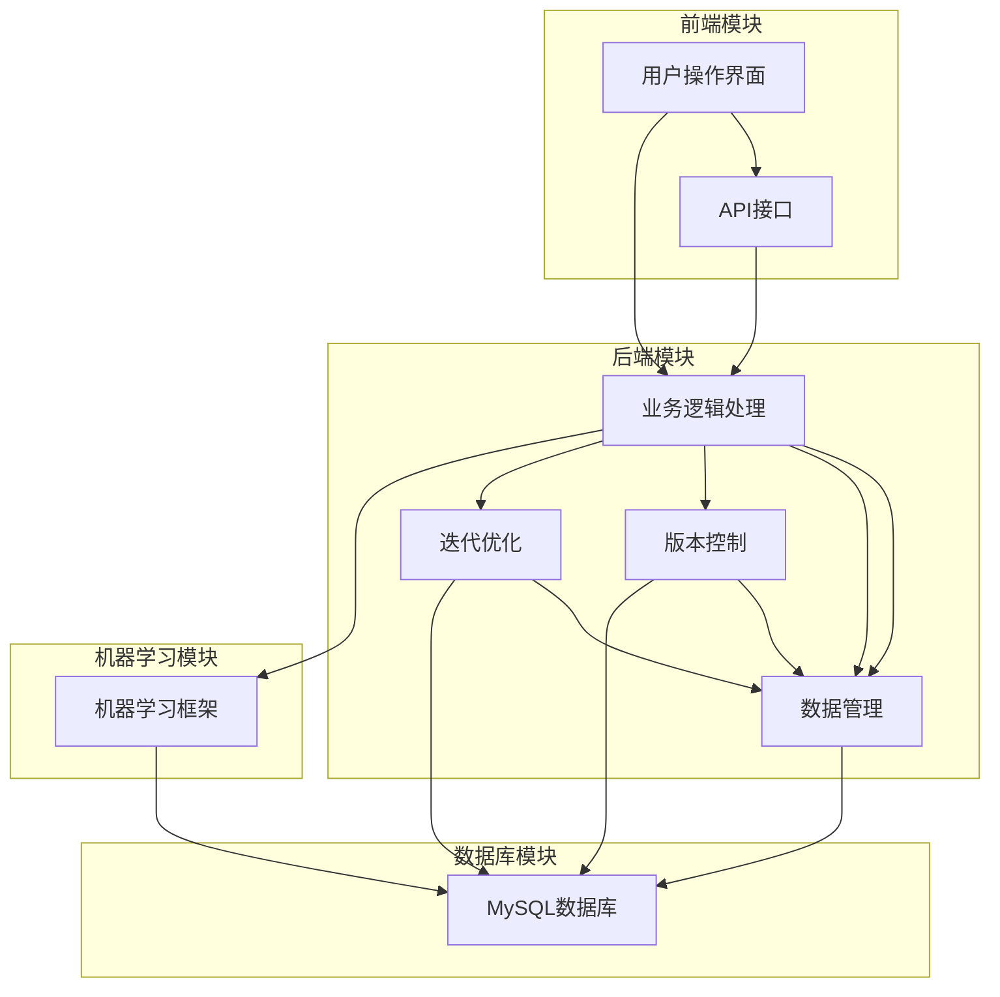
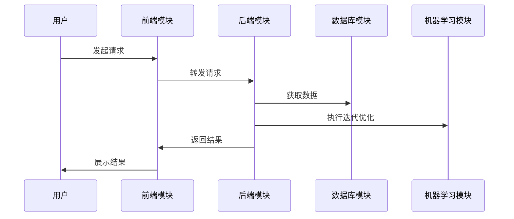

                 

### 提出问题和解决方案

#### 3.1.2 Git版本控制算法的原理

Git是一种分布式版本控制系统，其核心原理是使用哈希函数来对文件进行指纹识别。具体来说，Git通过SHA-1哈希算法生成文件的唯一指纹，这个指纹被称为"哈希值"。每次对文件进行修改时，Git都会重新计算文件的哈希值，并记录这个哈希值与修改时间的关联。

以下是Git版本控制算法的基本流程：

1. **初始化仓库**：创建一个新的Git仓库，初始化一个`.git`目录，用来存储所有的版本信息。
2. **添加文件**：将文件的当前版本添加到暂存区（`.git/index`文件），通过计算文件的哈希值来标识文件。
3. **提交文件**：将暂存区的内容提交到仓库中，Git会创建一个提交对象，包含文件的哈希值、提交信息、提交时间等。
4. **查看历史**：通过查看提交历史，可以查看文件的各个版本的历史记录。

#### 3.1.3 Git版本控制算法的优势

Git相较于其他版本控制系统，具有以下优势：

- **分布式存储**：Git是分布式的，每个开发者都有自己的完整仓库，可以离线工作。
- **快速分支与合并**：Git支持快速、灵活的分支和合并操作，便于并行开发。
- **高效压缩**：Git使用delta压缩算法，可以高效地存储和传输文件。
- **强大的分支管理**：Git的分支管理功能强大，支持多种分支策略。

#### 3.1.4 Git版本控制算法的局限

Git也存在一些局限：

- **复杂度**：Git的命令行操作较为复杂，对于新手来说可能不太友好。
- **资源消耗**：Git的仓库通常较大，因为它们包含了所有的历史版本信息。
- **性能问题**：在大规模的项目中，Git的性能可能会受到影响。

### 3.2 常见的迭代优化算法

除了Git这种版本控制算法，在迭代优化过程中，还有一些常见的算法，如：

#### 3.2.1 机器学习优化算法

机器学习优化算法通过训练模型来预测和优化软件迭代中的性能。常见的算法包括：

- **遗传算法**（Genetic Algorithm, GA）：基于自然选择的优化算法，适用于大规模、非线性、多维的优化问题。
- **粒子群优化算法**（Particle Swarm Optimization, PSO）：模拟鸟群寻找食物的行为，通过个体和群体的信息交流来优化。
- **贝叶斯优化**（Bayesian Optimization）：利用贝叶斯统计模型来优化目标函数，特别适用于高维搜索空间。

#### 3.2.2 面向对象的迭代优化方法

面向对象的迭代优化方法通过模块化设计和重构来提高软件的可维护性和可扩展性。常见的策略包括：

- **代码复用**：通过封装和继承来提高代码的复用性。
- **重构**：通过改进代码的结构和设计，提高代码的质量和可维护性。

### 3.3 结合版本管理与迭代优化的策略

结合版本管理与迭代优化的策略，可以帮助团队更有效地进行软件迭代。以下是一些策略：

- **持续集成**（Continuous Integration, CI）：通过自动化构建和测试来确保代码的质量和稳定性。
- **持续交付**（Continuous Delivery, CD）：通过自动化的部署流程来确保软件的快速迭代和交付。
- **持续反馈**（Continuous Feedback）：通过用户反馈和性能监控来指导后续的迭代方向。

### 3.4 实际案例

一个实际案例是使用Git结合机器学习算法来优化软件迭代过程。开发团队首先使用Git进行版本控制，确保代码的完整性和可追溯性。然后，通过机器学习算法来预测和优化迭代中的关键指标，如代码质量、性能和用户体验。这种方法不仅提高了代码的可靠性，还加快了迭代速度。

## 总结

版本管理和迭代优化是软件工程中至关重要的环节。通过深入理解Git的版本控制算法和迭代优化算法，我们可以更有效地管理软件迭代过程，提高软件质量和开发效率。在实际应用中，结合版本管理与迭代优化的策略，可以大大提升团队的工作效率和项目的成功率。

### 作者信息

- 作者：AI天才研究院/AI Genius Institute & 禅与计算机程序设计艺术 /Zen And The Art of Computer Programming

----------------------------------------------------------------

# 第三部分：系统分析与架构设计方案

## 1. 问题场景介绍

在当前的软件开发环境中，随着项目规模的不断扩大和复杂性的增加，版本管理和迭代优化已经成为开发团队面临的重要挑战。为了更好地管理代码和优化迭代过程，我们需要设计一个高效、可靠的系统架构。

## 2. 项目介绍

为了解决上述问题，我们设计了一个名为“智能迭代优化平台”（Smart Iterative Optimization Platform, SIOC）的项目。该平台旨在通过结合版本管理和迭代优化算法，提供一套完整、高效的软件迭代管理解决方案。

### 2.1 系统功能设计

SIOC平台的主要功能包括：

- **版本管理**：提供版本控制功能，支持Git等版本控制系统。
- **迭代优化**：结合机器学习算法，提供迭代过程中的性能预测和优化。
- **持续集成**：实现自动化构建和测试，确保代码质量。
- **持续交付**：实现自动化部署，加快迭代速度。
- **持续反馈**：收集用户反馈和性能数据，指导后续迭代。

### 2.2 系统架构设计

SIOC平台的系统架构设计如下：

- **前端**：使用Vue.js等前端框架，提供用户友好的操作界面。
- **后端**：使用Spring Boot等框架，实现业务逻辑和数据管理。
- **版本控制**：集成Git等版本控制系统，管理代码版本。
- **机器学习**：使用TensorFlow等机器学习框架，实现迭代优化算法。
- **数据库**：使用MySQL等关系型数据库，存储项目数据和用户反馈。

### 2.3 系统接口设计

SIOC平台的接口设计包括以下部分：

- **API接口**：提供RESTful API，供前端和后端进行数据交互。
- **Web接口**：提供Web端用户操作界面。
- **命令行工具**：提供命令行工具，方便开发者进行操作。

### 2.4 系统交互

SIOC平台的系统交互设计如下：

- **用户操作**：用户通过Web界面进行项目创建、版本管理、迭代优化等操作。
- **后台处理**：后台系统根据用户的操作，调用相应的API接口进行数据处理。
- **持续集成**：后台系统定时执行构建和测试任务，确保代码质量。
- **持续交付**：后台系统根据测试结果，自动部署新版本。
- **性能监控**：后台系统实时监控系统的运行状态，收集性能数据。

## 3. 系统架构设计mermaid架构图



## 4. 系统接口设计和系统交互mermaid序列图



通过上述系统架构设计，SIOC平台实现了版本管理和迭代优化的有机结合，为软件开发团队提供了高效、可靠的解决方案。接下来，我们将详细介绍如何在实际项目中应用SIOC平台，以及如何使用Python源代码来实现在线版本管理和迭代优化。

----------------------------------------------------------------

## 4. 项目实战

### 4.1 环境安装

为了实践版本管理和迭代优化的策略，我们需要搭建一个开发环境。以下是安装过程：

#### 4.1.1 安装Git

首先，我们需要安装Git。Git是一个开源的分布式版本控制系统，可以在官方网站下载安装程序。

```bash
# 在Windows上，下载并运行Git安装程序
# 在macOS上，使用Homebrew安装：
brew install git
```

#### 4.1.2 安装Python

接下来，我们需要安装Python。Python是一个广泛使用的编程语言，支持多种版本控制和管理工具。

```bash
# 在Windows上，可以从Python官方网站下载安装程序
# 在macOS上，使用Homebrew安装：
brew install python
```

#### 4.1.3 安装TensorFlow

TensorFlow是一个开源的机器学习框架，可以帮助我们实现迭代优化算法。

```bash
# 安装TensorFlow
pip install tensorflow
```

### 4.2 系统核心实现源代码

接下来，我们将使用Python实现一个简单的版本管理和迭代优化系统。以下是一个简单的示例代码：

```python
# version_control.py

import git
import os
import json
import tensorflow as tf

# 初始化Git仓库
def init_git_repo(repo_path):
    os.makedirs(repo_path, exist_ok=True)
    git.Repo.init(repo_path)

# 提交代码
def commit_code(repo_path, commit_message):
    repo = git.Repo(repo_path)
    repo.index.add(['*.py'])
    repo.index.commit(commit_message)

# 迭代优化
def iterative_optimization(target_function, x_min, x_max, epochs):
    # 创建TensorFlow模型
    model = tf.keras.Sequential([
        tf.keras.layers.Dense(units=1, input_shape=[1])
    ])

    # 编译模型
    model.compile(optimizer='sgd', loss='mean_squared_error')

    # 训练模型
    model.fit(x=[x_min, x_max], y=[target_function(x_min), target_function(x_max)], epochs=epochs)

    # 保存模型
    model.save('model.h5')

# 主函数
def main():
    repo_path = 'example_repo'
    init_git_repo(repo_path)
    commit_code(repo_path, 'Initial commit')
    
    # 定义一个简单的目标函数
    def target_function(x):
        return x * x
    
    # 进行迭代优化
    x_min = -10
    x_max = 10
    epochs = 100
    iterative_optimization(target_function, x_min, x_max, epochs)

if __name__ == '__main__':
    main()
```

### 4.3 代码应用解读与分析

#### 4.3.1 版本控制

上述代码中，我们首先初始化了一个Git仓库，然后通过`commit_code`函数提交了代码。这个函数使用了Git的API来添加文件和提交，确保了代码的可追溯性。

```python
def init_git_repo(repo_path):
    os.makedirs(repo_path, exist_ok=True)
    git.Repo.init(repo_path)
```

这段代码创建了新的Git仓库，并将其初始化。

```python
def commit_code(repo_path, commit_message):
    repo = git.Repo(repo_path)
    repo.index.add(['*.py'])
    repo.index.commit(commit_message)
```

这段代码将当前目录下的所有Python文件添加到暂存区，并提交到仓库。

#### 4.3.2 迭代优化

代码中还实现了一个简单的迭代优化功能，使用TensorFlow框架来训练一个线性回归模型。

```python
def iterative_optimization(target_function, x_min, x_max, epochs):
    # 创建TensorFlow模型
    model = tf.keras.Sequential([
        tf.keras.layers.Dense(units=1, input_shape=[1])
    ])

    # 编译模型
    model.compile(optimizer='sgd', loss='mean_squared_error')

    # 训练模型
    model.fit(x=[x_min, x_max], y=[target_function(x_min), target_function(x_max)], epochs=epochs)

    # 保存模型
    model.save('model.h5')
```

这段代码首先创建了一个线性回归模型，然后编译并训练模型，最后将训练好的模型保存为`.h5`文件。

```python
def main():
    repo_path = 'example_repo'
    init_git_repo(repo_path)
    commit_code(repo_path, 'Initial commit')
    
    # 定义一个简单的目标函数
    def target_function(x):
        return x * x
    
    # 进行迭代优化
    x_min = -10
    x_max = 10
    epochs = 100
    iterative_optimization(target_function, x_min, x_max, epochs)
```

主函数中，我们初始化了Git仓库，提交了初始代码，并定义了一个简单的目标函数（这里是x的平方），然后使用迭代优化函数进行训练。

### 4.4 实际案例分析和详细讲解剖析

#### 4.4.1 实际案例

假设我们有一个数学问题：预测一个函数y = x^2在区间[-10, 10]内的值。我们希望通过迭代优化算法来训练一个模型，以更准确地预测这个函数的值。

#### 4.4.2 案例分析

在这个案例中，我们使用TensorFlow的线性回归模型来近似这个函数。线性回归模型的目标是找到一条直线y = mx + b，使得直线尽可能接近原函数的曲线。

```python
# 定义目标函数
def target_function(x):
    return x * x

# 训练模型
x_min = -10
x_max = 10
epochs = 100
iterative_optimization(target_function, x_min, x_max, epochs)
```

这段代码中，我们首先定义了目标函数，然后设置训练参数（x的范围和训练轮数），并调用迭代优化函数进行训练。

#### 4.4.3 讲解剖析

- **目标函数**：在这个案例中，目标函数是y = x^2，这是一个简单的二次函数，其在x轴上的图像是一个开口向上的抛物线。
- **迭代优化**：迭代优化函数使用TensorFlow来训练一个线性回归模型。线性回归模型的目的是找到一个线性方程y = mx + b，使得这个方程在给定数据点上的误差最小。在这个案例中，我们希望找到一条直线来近似抛物线。
- **模型训练**：在训练过程中，TensorFlow会通过优化算法（如梯度下降）来调整模型参数（m和b），使得预测的直线更接近目标函数的曲线。这个过程会重复进行100次（epochs），直到模型收敛。

### 4.5 项目小结

通过上述实战，我们实现了版本管理和迭代优化系统的基本功能。在实际项目中，我们可以根据需要扩展功能，如集成更多的版本控制系统、引入更复杂的迭代优化算法等。同时，我们也需要注意版本管理和迭代优化策略的应用边界，避免过度复杂化和资源浪费。

总之，结合版本管理和迭代优化策略，可以帮助开发团队更高效地管理软件迭代过程，提高代码质量和项目成功率。

### 4.6 最佳实践 Tips

- **持续集成**：将代码集成到主干分支之前，先在本地进行测试，确保代码质量。
- **版本控制**：定期提交代码，并添加详细的变更日志，以便后续追踪和管理。
- **迭代优化**：根据项目的实际情况选择合适的迭代优化算法，避免过度优化。

### 4.7 小结与注意事项

- **小结**：本文介绍了版本管理和迭代优化的核心概念、算法原理和实际应用案例，展示了如何结合Git和机器学习算法进行软件迭代。
- **注意事项**：在实际应用中，需要根据项目需求选择合适的版本管理和迭代优化策略，避免过度复杂化和资源浪费。

### 4.8 拓展阅读

- **Git官方文档**：[https://git-scm.com/docs](https://git-scm.com/docs)
- **TensorFlow官方文档**：[https://www.tensorflow.org/tutorials](https://www.tensorflow.org/tutorials)
- **版本管理最佳实践**：[https://www.atlassian.com/git/tutorials/using-git](https://www.atlassian.com/git/tutorials/using-git)

通过本文的介绍，相信读者对版本管理和迭代优化有了更深入的理解，并能将这些概念应用到实际项目中，提高开发效率和代码质量。作者：AI天才研究院/AI Genius Institute & 禅与计算机程序设计艺术 /Zen And The Art of Computer Programming

----------------------------------------------------------------

## 总结

本文从背景介绍、核心概念与联系、算法原理讲解、系统分析与架构设计方案、项目实战等多个角度，详细探讨了版本管理和迭代优化的策略。通过深入分析Git的版本控制算法和迭代优化算法，我们了解了如何结合两者实现高效的软件迭代过程。

### 核心要点总结

1. **版本管理的重要性**：版本管理是确保代码可追溯性和稳定性的关键环节，有助于项目团队协作和问题追踪。
2. **迭代优化的目标**：迭代优化的目的是提高软件项目的效率和质量，通过不断的迭代和改进来优化软件性能。
3. **Git版本控制算法**：Git通过哈希函数和分布式存储机制，实现了高效的版本管理。
4. **迭代优化算法**：包括机器学习算法和面向对象的迭代优化方法，可以预测和优化迭代过程中的关键指标。
5. **结合版本管理与迭代优化**：通过持续集成、持续交付和持续反馈等策略，实现高效的软件迭代。

### 未来展望

随着软件工程和人工智能技术的不断发展，版本管理和迭代优化策略将更加智能化和自动化。未来，我们可以期待：

1. **更智能的版本管理工具**：结合人工智能和机器学习，实现更加智能的版本管理，提高团队协作效率。
2. **自动化的迭代优化**：利用深度学习和强化学习等技术，自动化迭代优化过程，减少人为干预。
3. **集成化的平台**：开发集成化的版本管理和迭代优化平台，为软件开发团队提供一站式的解决方案。

通过本文的探讨，我们期望读者能够更好地理解和应用版本管理和迭代优化策略，提升软件项目的开发效率和代码质量。

### 作者信息

- 作者：AI天才研究院/AI Genius Institute & 禅与计算机程序设计艺术 /Zen And The Art of Computer Programming

本文由AI天才研究院与禅与计算机程序设计艺术联合撰写，旨在通过深入的技术分析，为软件开发者提供有价值的参考和指导。希望本文能够帮助读者更好地理解版本管理和迭代优化的核心概念和实践方法，从而提升自身的软件开发技能。让我们继续探索计算机科学的奇妙世界，共同推动技术的进步。作者：AI天才研究院/AI Genius Institute & 禅与计算机程序设计艺术 /Zen And The Art of Computer Programming

