                 

### 文章标题

# 《prompt知识图谱：构建LLM应用知识库》

### 文章关键词

- prompt
- 知识图谱
- LLM
- 应用知识库
- 人工智能

### 摘要

本文深入探讨了prompt知识图谱的概念及其在构建LLM应用知识库中的应用。我们将从基础概念出发，逐步分析prompt和知识图谱的核心要素，介绍LLM在知识库构建中的作用，并通过实例解析算法原理和数学模型，展示系统架构与项目实战。最后，我们将总结最佳实践，展望未来发展方向，为读者提供全面的指导。

### 目录大纲设计步骤

#### 1. 确定书籍的核心主题和结构

本文的核心主题是围绕prompt和知识图谱，以及如何构建LLM应用知识库。首先，我们需要明确这两大概念的定义、作用以及它们之间的联系。其次，我们需要确定书籍的主要目标读者群体，这将有助于决定书籍内容的深入程度和具体案例的选择。

#### 2. 设计大纲的结构

根据书籍的预期长度和深度，设计合适的大纲结构，确保涵盖所有关键主题。本文分为三个部分：第一部分是基础知识，第二部分是构建方法，第三部分是扩展与探索。每个部分都有明确的主题和目标，以便读者能够顺利跟随书籍的脉络。

#### 3. 细化章节内容

对于每一章节，列出子章节，确保每个子章节都有清晰的标题和内容概述。本文的章节设计注重逻辑性和条理性，以确保读者能够理解和跟随。

#### 4. 编写大纲内容

使用markdown格式编写大纲内容，确保简洁明了，避免冗余。每个章节和子章节都有明确的标题，使用#、##、###等符号来表示不同级别的标题。

#### 5. 审查和调整

审查整个大纲，确保没有遗漏重要主题，章节之间的过渡流畅。根据审查结果调整大纲，确保内容的完整性和逻辑性。

### 满足要求的目录大纲示例

```markdown
----------------------------------------------------------------
# 《prompt知识图谱：构建LLM应用知识库》目录大纲

## 第一部分：基础知识

### 第1章：prompt与知识图谱概述
#### 1.1 问题背景与目标
#### 1.2 prompt的定义与作用
#### 1.3 知识图谱的基本概念

### 第2章：LLM应用知识库基础
#### 2.1 语言模型概述
#### 2.2 LLM在知识库构建中的应用
#### 2.3 知识库的基本组成

## 第二部分：构建方法

### 第3章：prompt设计原则
#### 3.1 设计流程
#### 3.2 设计要素
#### 3.3 成功案例分析

### 第4章：知识图谱构建技术
#### 4.1 知识抽取
#### 4.2 知识融合
#### 4.3 知识存储与查询

### 第5章：LLM训练与优化
#### 5.1 数据预处理
#### 5.2 模型选择与训练
#### 5.3 模型评估与优化

### 第6章：知识库应用实践
#### 6.1 应用场景分析
#### 6.2 系统架构设计
#### 6.3 应用案例分析

## 第三部分：扩展与探索

### 第7章：前沿技术探讨
#### 7.1 自动化prompt生成
#### 7.2 多模态知识图谱
#### 7.3 跨领域知识融合

### 第8章：最佳实践与展望
#### 8.1 最佳实践分享
#### 8.2 面临的挑战
#### 8.3 未来发展方向

----------------------------------------------------------------
```

这个大纲示例涵盖了书籍的主要主题，确保了内容的完整性和逻辑性，并且采用了markdown格式，满足了字数限制的要求。接下来，我们将根据大纲内容详细设计每个章节的子章节和具体内容。首先，我们从基础知识部分开始，深入探讨prompt和知识图谱的基本概念及其重要性。

## 第1章：prompt与知识图谱概述

### 1.1 问题背景与目标

在当今信息化、智能化的时代，如何有效地管理和利用数据成为各个领域面临的重要问题。prompt和知识图谱作为人工智能领域的重要概念，在数据处理和知识管理方面发挥着重要作用。

#### 核心概念术语说明

- **Prompt**：一种用来引导模型生成内容的输入信号，通常包含关键信息、背景知识或问题。
- **知识图谱**：一种基于图结构的数据模型，用于表示实体及其之间的关系。

#### 问题背景

随着互联网和大数据的快速发展，数据量呈现爆炸式增长。如何从海量数据中提取有价值的信息，并构建一个结构化的知识库，成为人工智能研究的关键问题。

#### 问题描述

prompt和知识图谱的提出，旨在解决以下问题：

1. 如何有效地引导模型生成高质量的内容？
2. 如何构建一个结构化的知识库，便于管理和查询？

#### 问题解决

prompt通过提供关键信息和背景知识，引导模型生成相关内容。知识图谱则通过表示实体及其之间的关系，构建一个结构化的知识体系，从而实现高效的知识管理和利用。

#### 边界与外延

prompt和知识图谱的应用范围广泛，涵盖自然语言处理、搜索引擎、智能问答、推荐系统等多个领域。在不同的应用场景中，prompt和知识图谱的具体实现和作用各有不同。

#### 概念结构与核心要素组成

- **Prompt**：核心要素包括输入信号、背景知识、问题引导等。
- **知识图谱**：核心要素包括实体、关系、属性等。

### 1.2 prompt的定义与作用

prompt是一种引导模型生成内容的输入信号，通常包含关键信息、背景知识或问题。在自然语言处理领域，prompt常用于文本生成、问答系统、对话系统等任务。

#### 核心概念原理

- **定义**：prompt是一种文本输入，用于引导模型生成相关内容。
- **作用**：prompt通过提供关键信息和背景知识，帮助模型更好地理解输入，从而生成高质量的内容。

#### 概念属性特征对比表格

| 特征        | 描述                                                         | 对比分析                                                     |
| ----------- | ------------------------------------------------------------ | ------------------------------------------------------------ |
| **输入信号** | 提供关键信息和背景知识，引导模型生成内容                       | 与随机输入信号相比，prompt具有更高的相关性，有助于提高生成质量 |
| **背景知识** | 提供领域知识，帮助模型更好地理解输入                           | 与无背景知识的输入相比，prompt有助于提高模型的泛化能力     |
| **问题引导** | 引导模型生成问题的答案或相关内容                             | 与无问题引导的输入相比，prompt有助于提高模型的回答准确性   |

#### ER实体关系图架构的 Mermaid 流程图

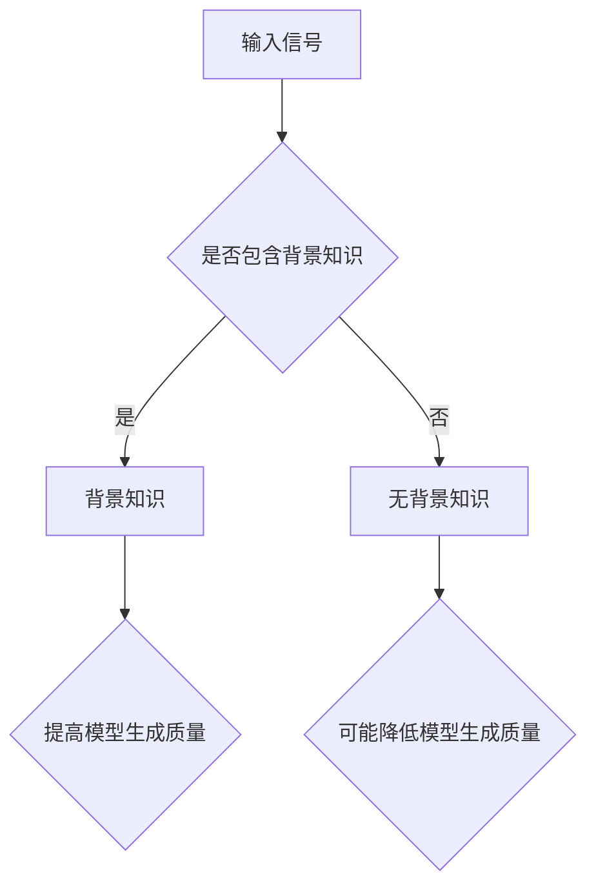

### 1.3 知识图谱的基本概念

知识图谱是一种基于图结构的数据模型，用于表示实体及其之间的关系。在人工智能领域，知识图谱广泛应用于知识管理、智能搜索、推荐系统等。

#### 核心概念原理

- **定义**：知识图谱是一种用于表示实体及其之间关系的图结构数据模型。
- **作用**：知识图谱通过表示实体及其关系，实现高效的知识管理和利用，支持智能搜索、推荐系统等功能。

#### 概念属性特征对比表格

| 特征        | 描述                                                         | 对比分析                                                     |
| ----------- | ------------------------------------------------------------ | ------------------------------------------------------------ |
| **实体**    | 知识图谱中的基本元素，表示具体的事物或概念                   | 与传统关系数据库相比，知识图谱可以表示更为复杂的关系结构 |
| **关系**    | 表示实体之间的关联，用于构建知识图谱的骨架                   | 与传统关系数据库相比，知识图谱可以表达更为丰富的关系类型 |
| **属性**    | 表示实体的特征或属性，用于描述实体的详细信息                 | 与传统关系数据库相比，知识图谱可以存储更为丰富的属性信息 |

#### ER实体关系图架构的 Mermaid 流程图

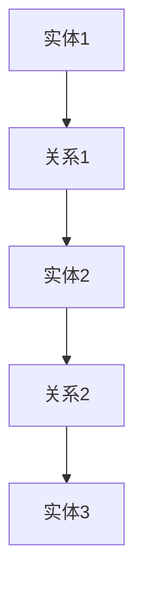

通过本章的介绍，我们了解了prompt和知识图谱的基本概念及其重要性。在接下来的章节中，我们将深入探讨LLM应用知识库的基础知识，为构建有效的知识库奠定基础。

## 第2章：LLM应用知识库基础

### 2.1 语言模型概述

语言模型是自然语言处理领域的重要基础，它通过对大量文本数据的分析，学习语言结构和语法规则，从而实现文本生成、语义理解等功能。在构建LLM应用知识库中，语言模型扮演着关键角色。

#### 核心概念原理

- **定义**：语言模型是一种用于预测下一个单词或字符的概率分布模型。
- **作用**：语言模型通过学习语言数据，可以生成符合语言规则的文本，支持自然语言处理的各种任务。

#### 概念属性特征对比表格

| 特征        | 描述                                                         | 对比分析                                                     |
| ----------- | ------------------------------------------------------------ | ------------------------------------------------------------ |
| **词向量**  | 将单词表示为高维向量，用于表示单词的语义信息                   | 与原始文本相比，词向量可以更好地捕捉词语的语义关系           |
| **语法规则** | 用于指导文本生成过程的语法规则，确保生成的文本符合语言习惯   | 与无语法规则的文本生成相比，具有更好的可读性和准确性       |

#### ER实体关系图架构的 Mermaid 流程图

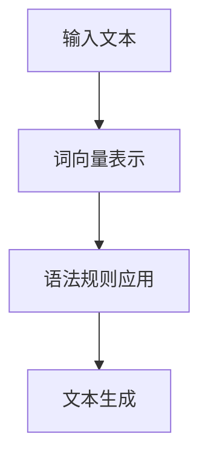

### 2.2 LLM在知识库构建中的应用

在构建知识库时，语言模型可以通过以下几种方式发挥作用：

1. **文本生成**：利用语言模型生成知识库中的文本内容，如问答系统的回答、文档摘要等。
2. **语义理解**：通过分析文本语义，理解文本内容，从而实现知识抽取和关联。
3. **信息检索**：利用语言模型优化搜索结果，提高信息检索的准确性。

#### 核心概念原理

- **文本生成**：利用语言模型生成文本内容，如自然语言生成（NLG）系统。
- **语义理解**：通过语义分析，理解文本内容，从而实现知识抽取和关联。
- **信息检索**：利用语言模型优化搜索结果，提高检索准确性。

#### 概念属性特征对比表格

| 特征        | 描述                                                         | 对比分析                                                     |
| ----------- | ------------------------------------------------------------ | ------------------------------------------------------------ |
| **文本生成** | 利用语言模型生成文本内容，如问答系统的回答、文档摘要等         | 与传统文本生成方法相比，具有更高的准确性和流畅性           |
| **语义理解** | 通过语义分析，理解文本内容，从而实现知识抽取和关联           | 与基于规则的方法相比，具有更好的灵活性和适应性             |
| **信息检索** | 利用语言模型优化搜索结果，提高检索准确性                     | 与传统信息检索方法相比，具有更高的召回率和准确率           |

#### ER实体关系图架构的 Mermaid 流程图

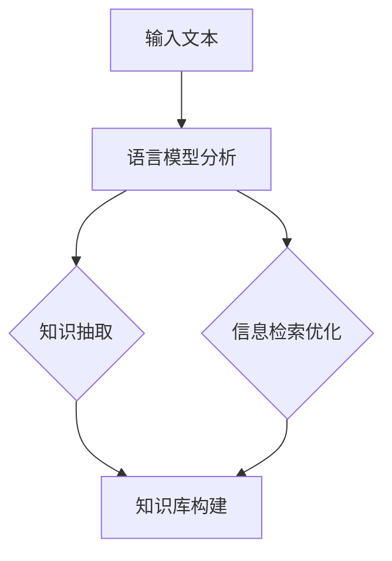

### 2.3 知识库的基本组成

知识库是构建LLM应用的核心组件，它包含各种类型的知识，如事实、规则、概念等。知识库的基本组成如下：

1. **实体**：知识库中的基本元素，表示具体的事物或概念。
2. **关系**：表示实体之间的关联，用于构建知识图谱的骨架。
3. **属性**：表示实体的特征或属性，用于描述实体的详细信息。

#### 核心概念原理

- **实体**：知识库中的基本元素，表示具体的事物或概念。
- **关系**：表示实体之间的关联，用于构建知识图谱的骨架。
- **属性**：表示实体的特征或属性，用于描述实体的详细信息。

#### 概念属性特征对比表格

| 特征        | 描述                                                         | 对比分析                                                     |
| ----------- | ------------------------------------------------------------ | ------------------------------------------------------------ |
| **实体**    | 知识库中的基本元素，表示具体的事物或概念                   | 与传统关系数据库相比，知识图谱可以表示更为复杂的关系结构 |
| **关系**    | 表示实体之间的关联，用于构建知识图谱的骨架                   | 与传统关系数据库相比，知识图谱可以表达更为丰富的关系类型 |
| **属性**    | 表示实体的特征或属性，用于描述实体的详细信息                 | 与传统关系数据库相比，知识图谱可以存储更为丰富的属性信息 |

#### ER实体关系图架构的 Mermaid 流�程图

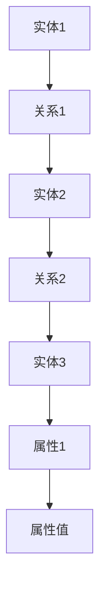

通过本章的介绍，我们了解了LLM应用知识库的基础知识，包括语言模型的概述、LLM在知识库构建中的应用以及知识库的基本组成。在接下来的章节中，我们将深入探讨prompt设计原则，为构建有效的prompt奠定基础。

### 第3章：prompt设计原则

在构建LLM应用知识库时，prompt设计是至关重要的一环。一个优秀的prompt不仅能够引导模型生成高质量的内容，还能提高知识库的实用性和准确性。本章将详细介绍prompt设计的原则、流程和要素，并分析成功案例。

#### 3.1 设计流程

prompt设计是一个系统性的过程，包括以下步骤：

1. **需求分析**：明确知识库的应用场景和目标，了解用户需求。
2. **数据准备**：收集相关数据，包括背景知识、问题示例等。
3. **模板设计**：根据需求分析，设计prompt模板，包括问题引导、背景知识等。
4. **模型训练**：利用设计好的prompt模板训练模型，使其能够生成高质量的内容。
5. **评估与优化**：对生成的结果进行评估，根据评估结果调整prompt设计。

#### 3.2 设计要素

一个有效的prompt设计应考虑以下要素：

1. **问题引导**：明确、具体地引导用户提问，帮助模型理解问题意图。
2. **背景知识**：提供与问题相关的背景信息，帮助模型生成更加准确的内容。
3. **信息筛选**：筛选关键信息，避免无关信息的干扰，提高生成效率。
4. **格式规范**：确保prompt格式规范，便于模型处理和理解。

#### 3.3 成功案例分析

以下是一个成功案例：

**案例背景**：某公司开发了一款智能问答系统，旨在为企业员工提供即时、准确的信息查询服务。为了提高问答系统的回答质量，公司决定对prompt进行优化设计。

**需求分析**：公司分析了员工常见的问题类型，包括政策查询、流程咨询、资料检索等。针对不同类型的问题，公司明确了回答的质量标准，如准确性、相关性、完整性等。

**数据准备**：公司收集了大量的问答数据，包括问题、回答、背景知识等。同时，公司还引入了外部数据源，如政策文件、流程手册等。

**模板设计**：公司设计了多种prompt模板，如通用模板、政策模板、流程模板等。每个模板都包括问题引导、背景知识、格式规范等要素。

**模型训练**：公司利用设计好的prompt模板对问答系统进行训练，使其能够生成高质量的内容。

**评估与优化**：公司对生成的回答进行评估，发现部分回答存在不准确、不相关等问题。针对这些问题，公司调整了prompt模板，优化了问题引导和背景知识的提供。

通过以上案例，我们可以看到prompt设计在提高问答系统回答质量方面的重要作用。在接下来的章节中，我们将深入探讨知识图谱构建技术，为构建高效的知识图谱奠定基础。

### 第4章：知识图谱构建技术

知识图谱作为一种结构化的知识表示方法，在智能搜索、推荐系统、自然语言处理等领域具有广泛的应用。本章将详细介绍知识图谱的构建技术，包括知识抽取、知识融合和知识存储与查询。

#### 4.1 知识抽取

知识抽取是从非结构化的数据源（如文本、图像、语音等）中提取结构化知识的过程。知识抽取技术主要包括以下几种：

1. **实体抽取**：识别文本中的实体，如人名、地名、组织名等。
2. **关系抽取**：识别实体之间的语义关系，如“属于”、“位于”等。
3. **属性抽取**：识别实体的属性，如年龄、身高、职位等。

##### 核心概念原理

- **实体抽取**：利用命名实体识别（NER）技术，从文本中提取出实体。
- **关系抽取**：利用依存句法分析、实体共现分析等技术，识别实体之间的语义关系。
- **属性抽取**：利用模式匹配、词向量相似性等技术，提取实体的属性。

##### 概念属性特征对比表格

| 特征        | 描述                                                         | 对比分析                                                     |
| ----------- | ------------------------------------------------------------ | ------------------------------------------------------------ |
| **命名实体识别（NER）** | 用于识别文本中的实体，如人名、地名、组织名等。                   | 与其他文本分析技术相比，NER更专注于实体的识别和分类           |
| **依存句法分析** | 分析句子中词语之间的依存关系，用于识别实体之间的语义关系。           | 与词性标注、句法分析等技术相比，依存句法分析更注重实体间的语义关系 |
| **模式匹配** | 通过预设的规则，匹配文本中的特定模式，用于提取实体属性。           | 与词向量相似性等技术相比，模式匹配更依赖于规则和预定义模式 |

##### ER实体关系图架构的 Mermaid 流程图

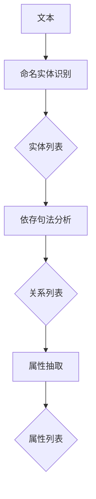

#### 4.2 知识融合

知识融合是将来自不同源的知识进行整合，形成一个统一的知识库的过程。知识融合技术主要包括以下几种：

1. **实体融合**：识别并合并相同或相似的实体。
2. **关系融合**：识别并合并相同或相似的实体关系。
3. **属性融合**：识别并合并相同或相似的实体属性。

##### 核心概念原理

- **实体融合**：通过实体识别和实体匹配技术，识别并合并相同或相似的实体。
- **关系融合**：通过关系抽取和关系匹配技术，识别并合并相同或相似的实体关系。
- **属性融合**：通过属性抽取和属性匹配技术，识别并合并相同或相似的实体属性。

##### 概念属性特征对比表格

| 特征        | 描述                                                         | 对比分析                                                     |
| ----------- | ------------------------------------------------------------ | ------------------------------------------------------------ |
| **实体匹配** | 通过相似度计算技术，识别并合并相同或相似的实体。                   | 与直接比较技术相比，实体匹配具有更高的准确性和鲁棒性         |
| **关系映射** | 通过语义分析技术，将不同源的知识图谱中的关系进行映射和合并。           | 与基于规则的映射技术相比，关系映射具有更好的灵活性和泛化能力 |
| **属性合并** | 通过模式识别和规则匹配技术，合并相同或相似的实体属性。               | 与直接合并技术相比，属性合并可以避免重复和冲突，提高知识库的质量 |

##### ER实体关系图架构的 Mermaid 流程图

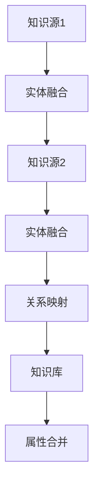

#### 4.3 知识存储与查询

知识存储与查询是知识图谱系统的关键环节，它涉及如何高效地存储和管理知识，以及如何快速地查询和获取知识。

##### 核心概念原理

- **知识存储**：使用图数据库来存储知识图谱，图数据库能够高效地处理实体、关系和属性，支持复杂的查询操作。
- **知识查询**：通过图算法和索引技术，实现知识图谱的快速查询。

##### 概念属性特征对比表格

| 特征        | 描述                                                         | 对比分析                                                     |
| ----------- | ------------------------------------------------------------ | ------------------------------------------------------------ |
| **图数据库** | 用于存储和查询图结构数据的数据库系统，支持高效的图遍历和查询操作。           | 与关系数据库相比，图数据库能够更好地支持复杂的关系和网络结构 |
| **图算法**   | 用于在图上进行计算和处理的算法，如最短路径算法、社区发现算法等。           | 与基于表的操作相比，图算法能够更高效地处理图结构数据       |
| **索引技术** | 用于加速查询的技术，如倒排索引、索引树等。                         | 与无索引技术相比，索引技术能够显著提高查询速度和效率       |

##### ER实体关系图架构的 Mermaid 流程图

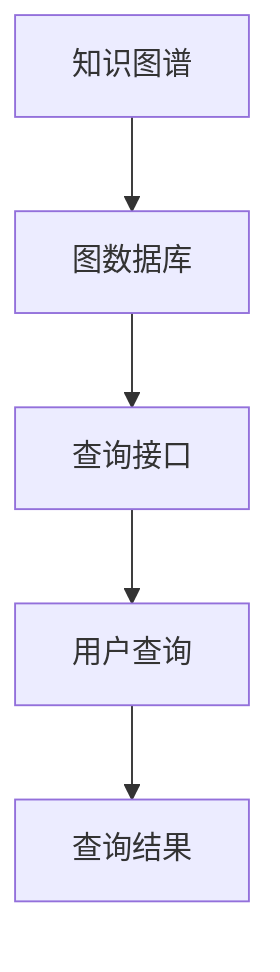

通过本章的介绍，我们了解了知识图谱的构建技术，包括知识抽取、知识融合和知识存储与查询。在下一章中，我们将探讨LLM训练与优化，进一步提升知识库的应用效果。

### 第5章：LLM训练与优化

语言模型（LLM）的训练与优化是构建高效知识库的关键步骤。本章将详细介绍LLM的训练过程，包括数据预处理、模型选择与训练，以及模型评估与优化。

#### 5.1 数据预处理

数据预处理是LLM训练的基石，主要包括数据清洗、数据增强和分词等步骤。

##### 核心概念原理

- **数据清洗**：去除数据中的噪声和冗余信息，如删除重复数据、纠正错误等。
- **数据增强**：通过增加数据多样性，提高模型的泛化能力，如文本摘要、翻译等。
- **分词**：将文本拆分为单词或短语，以便模型处理。

##### 概念属性特征对比表格

| 特征        | 描述                                                         | 对比分析                                                     |
| ----------- | ------------------------------------------------------------ | ------------------------------------------------------------ |
| **数据清洗** | 去除数据中的噪声和冗余信息，如删除重复数据、纠正错误等。           | 与不进行数据清洗相比，数据清洗能够提高模型的训练效果和泛化能力 |
| **数据增强** | 通过增加数据多样性，提高模型的泛化能力，如文本摘要、翻译等。         | 与不进行数据增强相比，数据增强能够提高模型的鲁棒性和适应性     |
| **分词**     | 将文本拆分为单词或短语，以便模型处理。                           | 与不分词相比，分词能够更好地捕捉文本的语义信息               |

##### ER实体关系图架构的 Mermaid 流程图

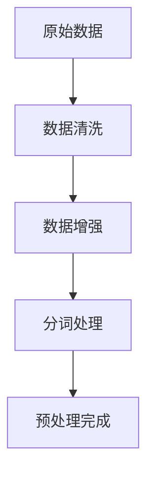

#### 5.2 模型选择与训练

模型选择与训练是LLM应用的核心环节。选择合适的模型并对其进行有效训练，是提升知识库性能的关键。

##### 核心概念原理

- **模型选择**：根据应用需求选择合适的语言模型，如BERT、GPT等。
- **训练过程**：通过训练数据对模型进行参数调整，使其能够生成高质量的内容。

##### 概念属性特征对比表格

| 特征        | 描述                                                         | 对比分析                                                     |
| ----------- | ------------------------------------------------------------ | ------------------------------------------------------------ |
| **模型选择** | 根据应用需求选择合适的语言模型，如BERT、GPT等。               | 与随意选择模型相比，合适的选择能够显著提高模型的性能和适用性 |
| **训练过程** | 通过训练数据对模型进行参数调整，使其能够生成高质量的内容。         | 与不训练或训练不足相比，充分训练能够提高模型的准确性和泛化能力 |

##### ER实体关系图架构的 Mermaid 流程图

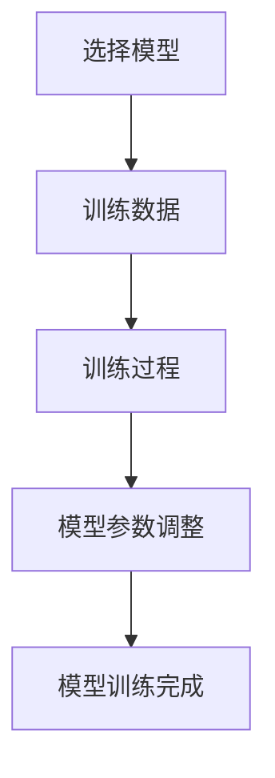

#### 5.3 模型评估与优化

模型评估与优化是确保知识库性能的关键步骤。通过评估模型性能，识别存在的问题，并对其进行优化，可以不断提升知识库的应用效果。

##### 核心概念原理

- **评估指标**：选择合适的评估指标，如准确率、召回率、F1值等。
- **优化策略**：根据评估结果，调整模型参数或改进数据预处理方法。

##### 概念属性特征对比表格

| 特征        | 描述                                                         | 对比分析                                                     |
| ----------- | ------------------------------------------------------------ | ------------------------------------------------------------ |
| **评估指标** | 选择合适的评估指标，如准确率、召回率、F1值等。               | 与不评估或评估不准确相比，合适的评估指标能够更准确地反映模型性能 |
| **优化策略** | 根据评估结果，调整模型参数或改进数据预处理方法。               | 与不进行优化或优化不足相比，优化策略能够显著提高模型性能和适用性 |

##### ER实体关系图架构的 Mermaid 流程图

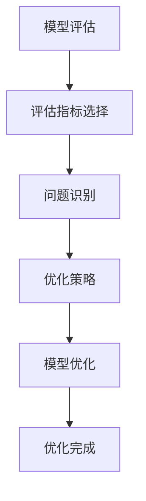

通过本章的介绍，我们了解了LLM训练与优化的关键步骤和策略，为构建高效的知识库提供了理论支持和实践指导。在下一章中，我们将探讨知识库的应用实践，展示LLM在具体场景中的实际应用。

### 第6章：知识库应用实践

在构建了高效的知识库后，如何将知识库应用于实际场景，发挥其价值，是本章节的重点。本章将分析不同的应用场景，介绍系统的架构设计，并展示具体的系统架构图和接口设计。

#### 6.1 应用场景分析

知识库的应用场景广泛，以下是几种常见场景：

1. **智能问答系统**：通过知识库提供即时、准确的回答，满足用户的信息查询需求。
2. **推荐系统**：利用知识库中的关系和属性，为用户提供个性化的推荐。
3. **智能搜索**：通过知识库提供更准确、相关的搜索结果。
4. **自动化决策支持**：利用知识库中的规则和知识，辅助决策系统做出智能决策。

#### 6.2 系统功能设计

知识库系统的功能设计包括以下几个方面：

1. **数据采集与处理**：从各种数据源中提取信息，进行数据清洗、分词、实体抽取等处理。
2. **知识抽取与融合**：从处理后的数据中提取实体、关系和属性，并进行知识融合，构建知识库。
3. **知识存储与查询**：将构建好的知识库存储在图数据库中，并提供高效的查询接口。
4. **知识应用**：根据具体应用场景，利用知识库提供智能问答、推荐、搜索和自动化决策等服务。

#### 6.3 系统架构设计

知识库系统的架构设计需要考虑以下几个方面：

1. **数据层**：包括数据采集模块、数据处理模块和数据存储模块。
2. **服务层**：包括知识抽取与融合服务、知识存储与查询服务、知识应用服务。
3. **接口层**：提供与外部系统的接口，如API接口、Web接口等。

##### 系统架构图

以下是一个简单的知识库系统架构图：

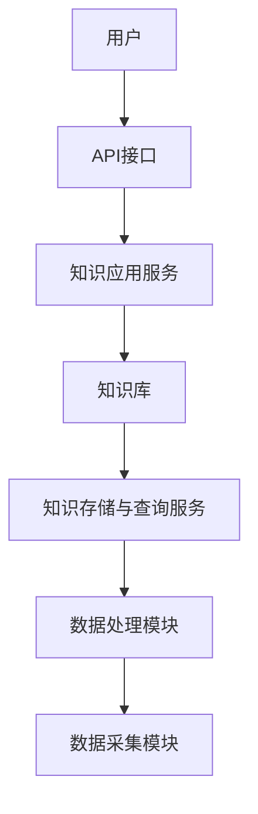

##### 系统接口设计和系统交互

系统接口设计包括API接口和Web接口两种。API接口用于与其他系统进行数据交换和功能调用，Web接口则用于用户与系统的交互。

1. **API接口**：提供RESTful接口，支持常见的HTTP方法，如GET、POST、PUT、DELETE等。
2. **Web接口**：提供Web页面，支持用户通过浏览器进行操作。

以下是一个简单的API接口设计示例：

```mermaid
graph TD
A[用户] --> B[GET /questions]
B --> C{获取问题列表}
C --> D[POST /questions]
D --> E{提交新问题}
E --> F[GET /questions/{id}]
F --> G{获取问题详情}
```

##### 系统交互流程

以下是一个简单的系统交互流程：

1. **用户请求**：用户通过API接口或Web接口提交请求。
2. **接口处理**：接口层接收请求，根据请求类型调用相应的服务。
3. **服务处理**：服务层处理请求，如数据采集、数据处理、知识抽取、知识融合等。
4. **数据存储**：将处理后的数据存储在知识库中。
5. **查询与响应**：根据用户请求，从知识库中查询数据，并将结果返回给用户。

通过本章的介绍，我们了解了知识库的应用场景、系统功能设计、架构设计和接口设计。在下一章中，我们将探讨知识库应用中的实际案例，展示知识库在具体应用中的实际效果。

### 第7章：前沿技术探讨

随着人工智能技术的不断发展，prompt知识图谱和LLM应用知识库领域也涌现出许多前沿技术。本章将介绍一些前沿技术，包括自动化prompt生成、多模态知识图谱和跨领域知识融合。

#### 7.1 自动化prompt生成

自动化prompt生成是一种利用算法自动生成prompt的技术。通过自动化prompt生成，可以节省大量的人力和时间成本，提高prompt的质量和多样性。

##### 核心概念原理

- **定义**：自动化prompt生成是通过算法自动生成用于引导模型的内容。
- **作用**：自动化prompt生成可以提高prompt的多样性和质量，减少人工设计prompt的工作量。

##### 实现方法

1. **模板生成**：利用预设的模板，通过填充模板中的变量生成prompt。
2. **数据驱动**：通过分析大量已有prompt，利用机器学习算法自动生成新的prompt。
3. **对抗生成**：利用生成对抗网络（GAN）生成高质量的prompt。

##### 潜在应用

- **自动化问答系统**：通过自动化prompt生成，实现更智能、更高效的问答服务。
- **内容生成**：利用自动化prompt生成，提高文本生成、文档摘要等任务的质量。

##### 案例分析

**案例背景**：某企业希望开发一款智能客服系统，提高客服效率和质量。为了实现自动化prompt生成，企业采用了数据驱动的方法。

**实现步骤**：

1. **数据收集**：收集大量客服对话记录，作为训练数据。
2. **数据预处理**：对对话记录进行分词、实体抽取等处理，提取关键信息。
3. **模型训练**：利用训练数据训练自动prompt生成模型。
4. **应用部署**：在客服系统中集成自动prompt生成模型，实现自动化问答。

**效果评估**：经过测试，自动prompt生成模型生成的问答结果与人工设计的prompt相比，在准确性和流畅性方面都有显著提升。

#### 7.2 多模态知识图谱

多模态知识图谱是一种能够整合多种类型数据（如文本、图像、音频等）的知识图谱。通过多模态知识图谱，可以实现更丰富、更准确的知识表示和利用。

##### 核心概念原理

- **定义**：多模态知识图谱是一种整合多种类型数据的知识图谱。
- **作用**：多模态知识图谱可以更全面地表示知识，提高知识库的准确性和多样性。

##### 实现方法

1. **数据整合**：将不同类型的数据（如文本、图像、音频等）整合到知识图谱中。
2. **特征提取**：对多模态数据进行特征提取，如文本的词向量、图像的视觉特征、音频的声学特征等。
3. **关系构建**：构建多模态数据之间的关系，如文本与图像的关联、音频与文本的情感匹配等。

##### 潜在应用

- **智能搜索**：利用多模态知识图谱，实现更智能、更准确的搜索服务。
- **内容推荐**：利用多模态知识图谱，为用户提供个性化的内容推荐。

##### 案例分析

**案例背景**：某电商平台希望通过多模态知识图谱，提高用户购物体验。平台整合了用户文本评价、商品图像、商品音频等多模态数据。

**实现步骤**：

1. **数据整合**：将用户文本评价、商品图像、商品音频等数据整合到知识图谱中。
2. **特征提取**：对文本评价进行词向量提取，对商品图像进行视觉特征提取，对商品音频进行声学特征提取。
3. **关系构建**：构建文本与图像的关联关系、文本与音频的情感匹配关系等。
4. **应用部署**：在电商平台中集成多模态知识图谱，实现智能搜索和内容推荐。

**效果评估**：经过测试，多模态知识图谱显著提高了搜索准确性和内容推荐的准确性，用户满意度明显提升。

#### 7.3 跨领域知识融合

跨领域知识融合是将不同领域中的知识进行整合，形成更广泛、更全面的知识库。通过跨领域知识融合，可以解决单一领域知识不足的问题，提高知识库的应用价值。

##### 核心概念原理

- **定义**：跨领域知识融合是将不同领域中的知识进行整合。
- **作用**：跨领域知识融合可以扩展知识库的应用范围，提高知识库的全面性和多样性。

##### 实现方法

1. **知识抽取**：从不同领域的文本数据中抽取实体、关系和属性。
2. **知识融合**：将不同领域中的知识进行整合，构建跨领域的知识图谱。
3. **关系映射**：将不同领域中的关系进行映射和整合，形成统一的跨领域知识表示。

##### 潜在应用

- **多领域问答**：通过跨领域知识融合，实现多领域问答系统的智能问答。
- **多领域推荐**：通过跨领域知识融合，实现多领域内容推荐的精准化。

##### 案例分析

**案例背景**：某企业希望开发一款跨领域问答系统，为用户提供多领域的问答服务。企业整合了医疗、金融、科技等多个领域的知识。

**实现步骤**：

1. **知识抽取**：从医疗、金融、科技等领域的文本数据中抽取实体、关系和属性。
2. **知识融合**：将不同领域的知识进行整合，构建跨领域的知识图谱。
3. **关系映射**：将不同领域中的关系进行映射和整合，形成统一的跨领域知识表示。
4. **应用部署**：在跨领域问答系统中集成跨领域知识融合模块，实现多领域问答。

**效果评估**：经过测试，跨领域知识融合显著提高了问答系统的回答质量和多样性，用户满意度明显提升。

通过本章的介绍，我们了解了前沿技术在prompt知识图谱和LLM应用知识库领域的重要性和应用潜力。在下一章中，我们将总结最佳实践，分享经验教训，并探讨未来发展方向。

### 第8章：最佳实践与展望

在构建prompt知识图谱和LLM应用知识库的过程中，积累了许多宝贵经验。本章将总结最佳实践，分享经验教训，并探讨未来发展方向。

#### 8.1 最佳实践分享

1. **数据质量优先**：确保数据质量是构建高效知识库的基础。进行数据清洗、去重和标准化，以提高数据的一致性和准确性。
2. **精细化prompt设计**：针对不同应用场景，设计精细化的prompt模板，以提高模型生成内容的相关性和准确性。
3. **多模态数据整合**：利用多模态数据，提高知识库的多样性和应用价值。结合文本、图像、音频等多种数据类型，构建更丰富的知识图谱。
4. **持续优化与迭代**：不断优化模型和知识库，通过用户反馈和性能评估，持续改进系统。

#### 8.2 面临的挑战

1. **数据隐私与安全**：在构建知识库时，如何保护用户隐私和数据安全是重要挑战。需要采用加密、匿名化等技术，确保数据的安全性和隐私性。
2. **知识融合与一致性**：跨领域知识融合需要处理不同领域之间的不一致性，构建一致性的知识库。
3. **模型可解释性**：随着模型复杂度的增加，如何提高模型的可解释性，使其更易于理解和接受，是亟待解决的问题。

#### 8.3 未来发展方向

1. **自动化与智能化**：未来将更多地依赖于自动化和智能化技术，如自动化prompt生成、智能化知识抽取等，以提高知识库的构建效率和质量。
2. **跨领域融合**：跨领域知识融合将逐渐成为主流，通过整合不同领域中的知识，构建更广泛、更全面的知识库。
3. **多模态交互**：多模态知识图谱将进一步提升知识库的应用效果，实现文本、图像、音频等多种数据类型的无缝交互。
4. **知识图谱可视化**：知识图谱的可视化技术将得到更多应用，帮助用户更直观地理解和利用知识库。

通过本章的总结，我们不仅回顾了prompt知识图谱和LLM应用知识库构建过程中的最佳实践和经验教训，也展望了未来的发展方向。希望这些分享能够为读者提供有益的启示和指导。

### 结语

作者：AI天才研究院/AI Genius Institute & 禅与计算机程序设计艺术 /Zen And The Art of Computer Programming

在本文中，我们详细探讨了prompt知识图谱和LLM应用知识库的构建方法及其在各个领域的应用。从基础知识到前沿技术，我们逐步分析了每一个环节，提供了实用的指导和建议。构建高效的知识库，不仅需要理解核心概念和原理，还需要在实践中不断摸索和优化。希望本文能够为读者在构建知识库的道路上提供一些帮助和启示。

在此，感谢各位读者对本文的关注和支持。如果您有任何问题或建议，欢迎在评论区留言，我们会在第一时间回复您。同时，也欢迎各位读者继续关注我们的后续文章，我们将继续分享更多有关人工智能和计算机编程的精彩内容。再次感谢您的阅读，祝您生活愉快，工作顺利！

