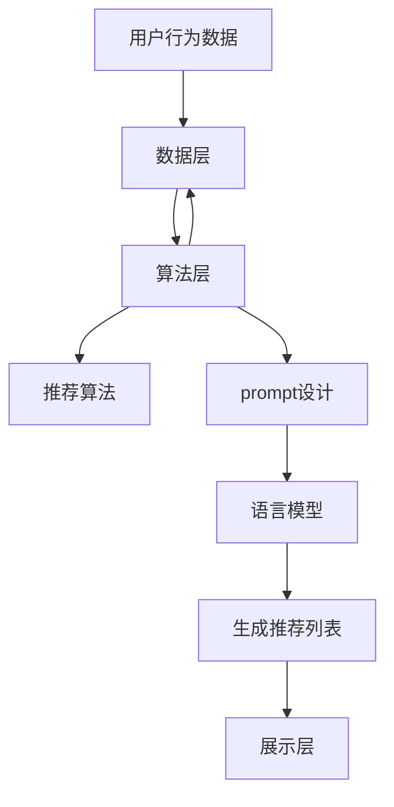
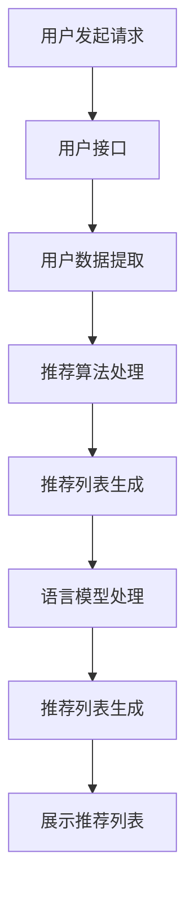

                 

# 《prompt语言风格适配：个性化LLM输出》

关键词：prompt语言风格、个性化、语言模型（LLM）、适配、输出

摘要：本文将探讨如何通过prompt语言风格的适配来实现个性化语言模型（LLM）的输出。我们将逐步分析核心概念，解释问题背景，探讨解决方案，并提供实际案例，旨在为读者提供一个全面的技术指南。

## 第1章：介绍

### 1.1 什么是prompt语言风格适配？

**定义**：prompt语言风格适配是指调整和优化输入prompt，以使语言模型（如LLM）生成更符合特定用户偏好和需求的语言风格输出。

### 1.2 语言模型在个性化中的作用

**背景**：随着AI技术的发展，语言模型在个性化服务中发挥着重要作用，如个性化推荐、聊天机器人等。

### 1.3 个人化LLM输出的挑战

**挑战**：个性化输出需要考虑用户偏好、语言风格多样性、数据隐私等问题。

### 1.4 本书目标

**目标**：介绍prompt语言风格适配的概念、技术原理和实践方法，帮助读者理解和实现个性化的LLM输出。

## 第2章：语言模型基础

### 2.1 语言模型概述

**定义**：语言模型是一种统计模型，用于预测文本序列的概率。

### 2.2 语言模型的类型

**类型**：包括预训练语言模型（如GPT-3）和微调语言模型。

### 2.3 语言模型组件

**组件**：包括嵌入层、编码器和解码器等。

### 2.4 语言模型个性化挑战

**挑战**：如何在不降低模型性能的情况下实现个性化？

## 第3章：核心概念与原则

### 3.1 上下文在prompt设计中的重要性

**原理**：上下文有助于语言模型理解用户意图，从而生成更个性化的输出。

### 3.2 有效的prompt设计原则

**原则**：清晰、简洁、具体、目标导向。

### 3.3 识别用户偏好和需求

**方法**：通过用户调研、数据分析和机器学习技术来识别用户偏好。

### 3.4 应对语言风格模糊性

**策略**：使用多样化的语言资源和数据增强来提高模型适应性。

## 第4章：高级prompt工程技术

### 4.1 上下文敏感的prompt设计技术

**方法**：使用上下文窗口、关键词提取和语义分析等技术。

### 4.2 利用用户数据实现个性化

**策略**：隐私保护的数据收集和使用方法。

### 4.3 提示变体的A/B测试

**实践**：如何设计和分析A/B测试来优化prompt。

### 4.4 分析prompt性能指标

**指标**：评估prompt有效性的关键指标，如用户满意度、响应时间等。

## 第5章：案例研究

### 5.1 案例研究1：个性化新闻推荐

**问题描述**：如何为用户推荐符合其兴趣的新闻？

**系统架构**：介绍推荐系统的架构，包括数据层、算法层和展示层。

**prompt设计**：设计适用于新闻推荐的prompt，包括上下文信息、用户偏好和新闻内容。

**结果分析**：分析推荐系统的性能和用户反馈。

## 第6章：实战应用

### 6.1 环境安装

**工具**：安装必要的编程环境和库，如Python、TensorFlow等。

### 6.2 系统核心实现

**代码**：展示个性化LLM输出的核心代码，包括数据预处理、模型训练和输出生成。

### 6.3 代码应用解读

**分析**：解读代码的工作原理和关键步骤。

### 6.4 实际案例分析与讲解

**案例**：分析实际项目中的成功案例和挑战。

### 6.5 项目小结

**总结**：总结项目的主要成果和经验教训。

## 第7章：最佳实践与注意事项

### 7.1 最佳实践

**建议**：分享在实际项目中积累的最佳实践。

### 7.2 小结

**回顾**：回顾文章中的核心观点和要点。

### 7.3 注意事项

**提示**：提醒读者在实施过程中需要注意的事项。

### 7.4 拓展阅读

**资源**：推荐相关的文献和资料，供读者进一步学习。

## 作者信息

作者：AI天才研究院/AI Genius Institute & 禅与计算机程序设计艺术 /Zen And The Art of Computer Programming

---

### 第1章：介绍

#### 1.1 什么是prompt语言风格适配？

prompt语言风格适配是一种通过调整和优化输入prompt（提示）来影响语言模型（如LLM）生成输出语言风格的技术。简而言之，它是一种调整语言模型输出以满足特定用户偏好或场景需求的方法。

**术语说明**：

- **Prompt**：指输入给语言模型的一段文本或指令，用于引导模型生成特定类型的输出。
- **语言风格**：指文本的写作风格，包括语法、用词、语气、语调等方面。
- **适配**：指调整prompt以匹配目标语言风格的过程。

**问题背景**：

随着人工智能和自然语言处理技术的不断发展，语言模型在各个领域得到了广泛应用，如聊天机器人、内容生成、个性化推荐等。然而，现有的语言模型往往是通用模型，其生成的输出可能不符合特定用户或场景的需求，这就需要通过prompt语言风格适配来实现个性化输出。

**问题描述**：

如何设计一个有效的prompt，使得语言模型能够生成符合特定用户偏好或场景需求的个性化输出？

**问题解决**：

通过调整prompt的语言风格，包括用词、语法、语气等方面，可以影响语言模型生成输出的风格。具体方法包括：

- **明确目标**：确定用户偏好或场景需求，明确需要实现的语言风格。
- **优化prompt**：调整prompt的内容和结构，使其更贴近目标语言风格。
- **训练和微调**：使用特定数据集对模型进行训练和微调，以提高模型对目标语言风格的适应性。

**边界与外延**：

- **边界**：prompt语言风格适配主要适用于文本生成任务，如聊天机器人、内容生成等。
- **外延**：该方法可以扩展到其他需要个性化输出的AI应用场景，如语音合成、视频生成等。

#### 1.2 语言模型在个性化中的作用

**背景**：

语言模型在个性化服务中发挥着重要作用。例如，个性化推荐系统可以根据用户的历史行为和偏好，推荐符合用户兴趣的内容；聊天机器人可以与用户进行自然语言交互，提供个性化的服务。

**角色**：

- **个性化推荐**：通过分析用户的行为数据，为用户推荐个性化内容。
- **聊天机器人**：与用户进行自然语言交互，提供个性化服务，如客服、咨询等。

**问题背景**：

然而，现有的通用语言模型往往无法完全满足个性化需求，因为它们是基于大规模通用数据集训练的，对于特定用户或场景的需求可能不够敏感。

**问题描述**：

如何利用语言模型实现个性化输出，以满足特定用户或场景的需求？

**问题解决**：

通过以下方法可以实现个性化输出：

- **数据集定制**：使用特定领域或用户群体的数据集对模型进行训练，以提高模型对该领域或用户群体的适应性。
- **prompt设计**：设计符合特定用户或场景需求的prompt，以引导模型生成个性化输出。
- **模型微调**：对预训练模型进行微调，以更好地适应特定任务或用户需求。

**边界与外延**：

- **边界**：个性化输出主要适用于文本生成任务，如聊天机器人、内容生成等。
- **外延**：该方法可以扩展到其他需要个性化输出的AI应用场景，如语音合成、视频生成等。

#### 1.3 个人化LLM输出的挑战

**背景**：

个人化语言模型（LLM）的输出面临许多挑战，这些挑战主要涉及如何在不降低模型性能的情况下实现个性化输出。以下是一些主要挑战：

- **多样性**：如何生成具有多样性的个性化输出，以满足不同用户的需求。
- **准确性**：如何在保持输出准确性的同时实现个性化。
- **数据隐私**：如何保护用户数据的隐私，特别是在使用用户数据进行个性化训练时。
- **计算资源**：如何高效地利用计算资源，以支持大规模的个性化输出。

**问题描述**：

如何在保证模型性能的同时，实现个性化的LLM输出？

**问题解决**：

以下是一些可能的解决方案：

- **多样性增强**：通过引入多样性增强技术，如对抗性生成网络（GANs）或多策略学习，来提高生成输出的多样性。
- **数据增强**：通过增加数据集的多样性，如使用不同的数据源、不同的语言风格等，来提高模型的泛化能力。
- **隐私保护**：采用隐私保护技术，如差分隐私、联邦学习等，来保护用户数据的安全。
- **计算优化**：通过优化算法和模型结构，如使用轻量级模型、模型剪枝等，来降低计算资源的消耗。

**边界与外延**：

- **边界**：这些挑战主要涉及大型语言模型的训练和部署，特别是针对个性化输出的需求。
- **外延**：这些挑战和解决方案可以扩展到其他类型的AI模型和任务，如图像生成、推荐系统等。

#### 1.4 本书目标

**目标**：

本书旨在为读者提供一个全面的技术指南，帮助理解和实现个性化的语言模型输出。具体目标包括：

- **介绍核心概念**：解释prompt语言风格适配、语言模型、个性化输出的基本概念和原理。
- **探讨技术细节**：深入讨论实现个性化输出的技术方法，包括数据集定制、prompt设计、模型微调等。
- **提供实践案例**：通过实际案例展示个性化输出的应用，帮助读者理解和应用这些技术。
- **讨论未来趋势**：探讨个性化输出的未来发展趋势和潜在挑战，为读者提供前瞻性视角。

**预期成果**：

通过阅读本书，读者应该能够：

- **理解**：掌握prompt语言风格适配和个性化输出的基本概念和技术。
- **应用**：设计和实现个性化的语言模型输出，解决实际问题。
- **创新**：探索和尝试新的技术和方法，为个性化输出领域的发展做出贡献。

### 第2章：语言模型基础

#### 2.1 语言模型概述

**定义**：

语言模型（Language Model，简称LM）是一种用于预测文本序列概率的概率模型。它可以用于自然语言处理（Natural Language Processing，简称NLP）中的许多任务，如文本分类、命名实体识别、机器翻译等。

**工作原理**：

语言模型通过学习大量的文本数据来建立语言模型，从而能够预测下一个单词或词组。在训练过程中，模型会学习单词之间的统计关系和上下文信息，以便在生成文本时能够生成符合语言习惯的句子。

**主要类型**：

- **基于规则的语言模型**：这类模型使用语法规则和模式匹配来生成文本。例如，基于模板的生成模型。
- **基于统计的语言模型**：这类模型使用统计方法来学习文本数据，如N-gram模型、神经网络模型等。
- **基于深度学习的语言模型**：这类模型使用深度神经网络来学习文本数据，如循环神经网络（RNN）、长短时记忆网络（LSTM）、Transformer模型等。

**核心概念**：

- **词嵌入（Word Embedding）**：将单词映射为向量，以便在计算中进行处理。
- **上下文信息（Contextual Information）**：模型需要考虑上下文信息来预测下一个单词或词组。
- **生成文本（Generated Text）**：语言模型的最终目标是生成符合语言习惯的文本。

**属性特征对比表格**：

| 特性         | 基于规则的语言模型 | 基于统计的语言模型 | 基于深度学习的语言模型 |
| ------------ | ----------------- | ----------------- | --------------------- |
| 学习方式     | 规则定义          | 统计学习          | 深度学习              |
| 适应性       | 有限              | 较高              | 高                    |
| 语言多样性   | 有限              | 较高              | 高                    |
| 文本生成质量 | 较低              | 较高              | 高                    |

**ER实体关系图架构**：

```mermaid
erDiagram
    Class1 ||--|{ Class2 }| Class3
    Class3 ||--|{ Class4 }| Class5
```

**ER实体关系图说明**：

- **Class1**：表示语言模型的基类，包括所有类型的语言模型。
- **Class2**：表示基于规则的语言模型，继承自Class1。
- **Class3**：表示基于统计的语言模型，继承自Class1。
- **Class4**：表示基于深度学习的语言模型，继承自Class1。
- **Class5**：表示具体语言模型实例，如RNN、LSTM、Transformer等。

#### 2.2 语言模型的类型

**预训练语言模型（Pre-Trained Language Models）**

**定义**：

预训练语言模型是指在大量文本数据上进行预训练，然后通过微调（Fine-Tuning）来适应特定任务的模型。常见的预训练语言模型有GPT、BERT等。

**工作原理**：

预训练语言模型通过在大规模文本语料库上进行预训练，学习到丰富的语言知识和上下文信息。在训练过程中，模型会学习单词、短语和句子的表示，以及它们之间的关联关系。

**优点**：

- **泛化能力**：预训练语言模型具有很好的泛化能力，可以应用于各种NLP任务。
- **高效率**：预训练模型可以快速适应新任务，只需进行少量的微调。

**缺点**：

- **计算资源需求**：预训练语言模型通常需要大量的计算资源和时间。
- **数据依赖**：预训练模型的性能很大程度上取决于训练数据的质量和多样性。

**实例**：

- **GPT**：基于 Transformer 架构的预训练语言模型，广泛应用于文本生成、机器翻译等任务。
- **BERT**：基于 Transformer 架构的预训练语言模型，主要用于文本分类、问答系统等任务。

**属性特征对比表格**：

| 特性           | 预训练语言模型 |
| -------------- | -------------- |
| 学习方式       | 预训练 + 微调  |
| 适应性         | 高            |
| 语言多样性     | 高            |
| 文本生成质量   | 高            |
| 计算资源需求   | 高            |
| 数据依赖       | 高            |

**ER实体关系图架构**：

```mermaid
erDiagram
    PreTrainedModel ||--|{ FineTunedModel }| SpecificModel
```

**ER实体关系图说明**：

- **PreTrainedModel**：表示预训练语言模型，是基类。
- **FineTunedModel**：表示通过微调来适应特定任务的预训练模型。
- **SpecificModel**：表示具体的预训练语言模型实例，如GPT、BERT等。

**微调语言模型（Fine-Tuned Language Models）**

**定义**：

微调语言模型是指将预训练语言模型应用于特定任务，通过微调模型权重来提高其在特定任务上的性能。微调通常在特定领域或任务的数据集上进行。

**工作原理**：

在微调过程中，预训练模型的基本结构和参数保持不变，只是在模型的最后一层进行少量的训练，以适应特定任务的数据特征。微调过程可以通过迁移学习（Transfer Learning）来实现，即将预训练模型的权重作为初始化，然后在特定任务的数据上进行进一步的训练。

**优点**：

- **高效性**：微调语言模型可以在较少的数据上快速适应特定任务，节省时间和计算资源。
- **高性能**：通过微调，模型可以在特定任务上达到较高的性能。

**缺点**：

- **模型依赖**：微调模型的效果很大程度上取决于预训练模型的质量。
- **数据质量**：微调任务的数据质量对模型的性能有重要影响。

**实例**：

- **GPT-2 for Text Classification**：将GPT-2模型微调用于文本分类任务。
- **BERT for Question Answering**：将BERT模型微调用于问答系统。

**属性特征对比表格**：

| 特性           | 微调语言模型 |
| -------------- | ------------ |
| 学习方式       | 微调         |
| 适应性         | 中等         |
| 语言多样性     | 中等         |
| 文本生成质量   | 中等         |
| 计算资源需求   | 中等         |
| 数据依赖       | 中等         |

**ER实体关系图架构**：

```mermaid
erDiagram
    PreTrainedModel ||--|{ FineTunedModel }| SpecificModel
```

**ER实体关系图说明**：

- **PreTrainedModel**：表示预训练语言模型，是基类。
- **FineTunedModel**：表示通过微调来适应特定任务的预训练模型。
- **SpecificModel**：表示具体的微调语言模型实例，如GPT-2 for Text Classification、BERT for Question Answering等。

#### 2.3 语言模型组件

**组件**：

语言模型通常由以下几个主要组件组成：

- **嵌入层（Embedding Layer）**：将输入的单词或词汇映射为高维向量表示。
- **编码器（Encoder）**：对输入序列进行编码，生成固定长度的向量表示。
- **解码器（Decoder）**：根据编码器生成的向量表示生成输出序列。

**嵌入层**：

- **作用**：将单词映射为向量表示，以便在计算中进行处理。
- **技术**：常见的嵌入技术包括Word2Vec、GloVe等。

**编码器**：

- **作用**：对输入序列进行编码，生成固定长度的向量表示。
- **技术**：常见的编码器技术包括循环神经网络（RNN）、长短时记忆网络（LSTM）、Transformer等。

**解码器**：

- **作用**：根据编码器生成的向量表示生成输出序列。
- **技术**：常见的解码器技术包括自回归模型、自注意力机制等。

**挑战**：

- **计算资源**：语言模型通常需要大量的计算资源，特别是预训练阶段。
- **数据隐私**：在训练语言模型时，需要处理大量的文本数据，这可能涉及到用户隐私问题。
- **模型可解释性**：深度学习模型通常缺乏可解释性，使得理解和调试模型变得困难。

#### 2.4 语言模型个性化挑战

**背景**：

语言模型在个性化服务中面临着许多挑战，这些挑战主要包括：

- **多样性**：如何生成具有多样性的个性化输出，以满足不同用户的需求。
- **准确性**：如何在保持输出准确性的同时实现个性化。
- **数据隐私**：如何保护用户数据的隐私，特别是在使用用户数据进行个性化训练时。
- **计算资源**：如何高效地利用计算资源，以支持大规模的个性化输出。

**问题描述**：

如何在保证模型性能的同时，实现个性化的语言模型输出？

**问题解决**：

以下是一些可能的解决方案：

- **多样性增强**：通过引入多样性增强技术，如对抗性生成网络（GANs）或多策略学习，来提高生成输出的多样性。
- **数据增强**：通过增加数据集的多样性，如使用不同的数据源、不同的语言风格等，来提高模型的泛化能力。
- **隐私保护**：采用隐私保护技术，如差分隐私、联邦学习等，来保护用户数据的安全。
- **计算优化**：通过优化算法和模型结构，如使用轻量级模型、模型剪枝等，来降低计算资源的消耗。

**边界与外延**：

- **边界**：这些挑战主要涉及大型语言模型的训练和部署，特别是针对个性化输出的需求。
- **外延**：这些挑战和解决方案可以扩展到其他类型的AI模型和任务，如图像生成、推荐系统等。

### 第3章：核心概念与原则

#### 3.1 上下文在prompt设计中的重要性

**背景**：

在语言模型的应用中，上下文（Context）起着至关重要的作用。上下文是指与特定信息相关的环境或情境，它有助于语言模型理解用户意图，从而生成更准确和个性化的输出。

**核心概念**：

- **上下文**：指与特定信息相关的环境或情境。
- **上下文信息**：指在给定上下文中能够影响文本生成和理解的信息。

**重要性**：

- **理解用户意图**：上下文信息有助于语言模型理解用户的意图和需求，从而生成更符合用户期望的输出。
- **提高生成质量**：上下文信息有助于提高文本生成的质量，减少生成错误的概率。
- **实现个性化**：通过设计包含上下文信息的prompt，可以实现更个性化的输出，满足不同用户的需求。

**案例**：

- **聊天机器人**：在聊天机器人的应用中，上下文信息可以帮助模型理解用户的对话历史，从而生成更自然和连贯的回答。
- **文本生成**：在文本生成的任务中，上下文信息可以帮助模型生成更符合语境和风格的文本。

**总结**：

上下文在prompt设计中的重要性体现在其能够提高语言模型生成输出的准确性、个性和连贯性。通过设计包含上下文信息的prompt，可以实现更高质量的文本生成和更个性化的用户体验。

#### 3.2 有效的prompt设计原则

**原则**：

有效的prompt设计是确保语言模型生成高质量输出的关键。以下是一些有效的prompt设计原则：

1. **清晰性**：

   - **定义**：指prompt应该明确传达用户意图和目标。
   - **重要性**：清晰的prompt有助于语言模型准确理解用户的意图，从而生成更相关的输出。
   - **实现**：确保prompt的表述简洁、明确，避免模糊或歧义。

2. **简洁性**：

   - **定义**：指prompt应该尽量简洁，避免冗余和重复。
   - **重要性**：简洁的prompt有助于语言模型更快地理解用户意图，提高生成效率。
   - **实现**：使用简洁的语句和关键词来构建prompt，避免过多的描述和解释。

3. **具体性**：

   - **定义**：指prompt应该提供具体的信息，而不是抽象或模糊的描述。
   - **重要性**：具体的prompt有助于语言模型生成更准确和具体的输出。
   - **实现**：提供具体的上下文信息、问题和需求，以帮助模型更好地理解任务。

4. **目标导向性**：

   - **定义**：指prompt应该明确指出任务的目标和期望的输出。
   - **重要性**：目标导向的prompt有助于语言模型专注于任务目标，减少无关输出的产生。
   - **实现**：明确指出任务的目标和期望的输出，确保模型生成的输出符合用户需求。

**总结**：

有效的prompt设计原则包括清晰性、简洁性、具体性和目标导向性。遵循这些原则可以帮助语言模型更准确地理解用户意图，从而生成更高质量和个性化的输出。

#### 3.3 识别用户偏好和需求

**背景**：

在个性化服务中，识别用户偏好和需求是实现高质量用户体验的关键。用户偏好和需求是指用户在特定场景下希望得到的信息、服务或体验。

**核心概念**：

- **用户偏好**：指用户在特定情境下对某些特定属性或特征的偏好，如语言风格、信息类型、交互方式等。
- **用户需求**：指用户在特定情境下希望得到的具体服务或功能，如获取信息、解决问题、执行任务等。

**识别方法**：

1. **用户调研**：

   - **定义**：通过问卷调查、访谈、焦点小组等方式收集用户偏好和需求。
   - **重要性**：用户调研可以帮助直接了解用户的真实需求和偏好，为个性化服务提供基础。
   - **实现**：设计有针对性的调研问卷，确保问题明确、具体，以便用户准确表达他们的需求和偏好。

2. **数据分析**：

   - **定义**：通过分析用户的历史行为数据（如浏览记录、搜索历史、交互记录等）来识别用户偏好和需求。
   - **重要性**：数据分析可以从大量数据中提取有价值的信息，帮助发现用户的行为模式和偏好。
   - **实现**：使用数据挖掘和机器学习技术，对用户行为数据进行分析，提取用户偏好和需求。

3. **机器学习技术**：

   - **定义**：使用机器学习算法（如聚类、分类、协同过滤等）来识别用户偏好和需求。
   - **重要性**：机器学习技术可以从海量数据中自动识别用户偏好和需求，提高识别的准确性和效率。
   - **实现**：设计适合的机器学习模型，对用户数据进行训练和预测，以识别用户的偏好和需求。

**总结**：

识别用户偏好和需求的方法包括用户调研、数据分析和机器学习技术。通过这些方法，可以准确了解用户的需求和偏好，从而为个性化服务提供有力的支持。

#### 3.4 应对语言风格模糊性

**背景**：

在实际应用中，语言风格模糊性是一个普遍存在的问题。语言风格模糊性指的是语言表达的不确定性，这可能导致语言模型生成不明确或错误的输出。

**核心概念**：

- **语言风格模糊性**：指语言表达的不确定性，包括词汇歧义、语法错误、语义模糊等。
- **影响**：语言风格模糊性可能导致模型生成不准确的输出，影响用户体验。

**应对策略**：

1. **多样化语言资源**：

   - **定义**：使用多样化的语言资源（如不同领域的文本、不同风格的文章等）来提高模型的适应性。
   - **重要性**：多样化的语言资源可以帮助模型学习到不同语言风格和表达方式，减少模糊性的影响。
   - **实现**：收集和整合来自不同来源的语言数据，确保模型在训练过程中接触到多样化的语言风格。

2. **数据增强**：

   - **定义**：通过增加训练数据量，特别是包含多样化和模糊性表达的数据，来提高模型的鲁棒性。
   - **重要性**：数据增强可以帮助模型更好地处理模糊性表达，提高生成输出的准确性。
   - **实现**：使用数据增强技术，如同义词替换、语法变换、生成对抗网络（GANs）等，增加训练数据的多样性和模糊性。

3. **语言风格检测**：

   - **定义**：使用语言风格检测技术来识别和标记模糊性表达，从而指导模型的生成过程。
   - **重要性**：语言风格检测可以帮助模型更准确地理解和处理模糊性表达，减少生成错误的概率。
   - **实现**：设计适合的语言风格检测模型，对输入文本进行检测和分类，标记出模糊性表达。

**总结**：

应对语言风格模糊性的策略包括多样化语言资源、数据增强和语言风格检测。通过这些策略，可以有效减少语言风格模糊性对模型生成输出的影响，提高个性化输出的质量和准确性。

#### 3.5 提问技巧

**背景**：

在语言模型的应用中，提问技巧是影响模型输出质量的重要因素。有效的提问可以引导模型生成更准确、更有价值的回答。

**核心概念**：

- **提问技巧**：指在提问过程中使用的策略和技巧，以获得更好的回答效果。
- **目标**：通过有效的提问技巧，引导模型生成更符合用户需求和意图的回答。

**常见技巧**：

1. **明确性问题**：

   - **定义**：明确性问题是指直接、具体地提出问题，避免模糊和歧义。
   - **实现**：在提问时，使用明确的关键词和表述，确保模型能够准确理解问题。

2. **开放性问题**：

   - **定义**：开放性问题是指提出开放式问题，鼓励模型生成详细和多层次的回答。
   - **实现**：使用开放式的语句，如“请描述...”、“你能告诉我...”等，引导模型提供更丰富的回答。

3. **背景信息提问**：

   - **定义**：背景信息提问是指在提问时提供上下文信息，以帮助模型更好地理解问题和用户意图。
   - **实现**：在提问前，提供相关的背景信息或上下文，如用户的历史交互、特定场景等。

4. **问题引导**：

   - **定义**：问题引导是指通过一系列相关的问题来引导模型逐步深入讨论某个主题。
   - **实现**：设计一系列问题，逐步引导模型回答更深层次的问题，从而获得更全面和有深度的回答。

**总结**：

有效的提问技巧包括明确性问题、开放性问题、背景信息提问和问题引导。通过这些技巧，可以提高语言模型回答的准确性和丰富性，满足用户的需求和期望。

### 第4章：高级prompt工程技术

#### 4.1 上下文敏感的prompt设计技术

**背景**：

在语言模型的应用中，上下文敏感的prompt设计对于生成高质量的输出至关重要。上下文敏感的prompt设计技术能够确保模型在生成文本时充分考虑到输入的上下文信息，从而提高输出的准确性和相关性。

**核心概念**：

- **上下文敏感**：指prompt能够捕捉并反映输入文本的上下文信息。
- **上下文信息**：指在特定情境下影响文本生成和理解的信息，如对话历史、用户行为等。

**常见技术**：

1. **上下文窗口**：

   - **定义**：上下文窗口是一种技术，用于在prompt中包含一段固定长度的上下文信息。
   - **实现**：通过在prompt中添加一个固定长度的上下文窗口，确保模型在生成文本时能够参考到相关的上下文信息。

2. **关键词提取**：

   - **定义**：关键词提取是一种技术，用于从输入文本中提取关键的信息和词汇。
   - **实现**：通过提取输入文本中的关键词，将这些关键词纳入prompt中，帮助模型更好地理解输入文本的内容和主题。

3. **语义分析**：

   - **定义**：语义分析是一种技术，用于对输入文本进行深入的分析，以理解其语义和含义。
   - **实现**：通过语义分析技术，如词性标注、语义角色标注等，对输入文本进行语义分析，并将分析结果纳入prompt中，以增强上下文的描述性。

**总结**：

上下文敏感的prompt设计技术包括上下文窗口、关键词提取和语义分析。通过这些技术，可以确保模型在生成文本时能够充分考虑上下文信息，从而提高输出的准确性和相关性。

#### 4.2 利用用户数据实现个性化

**背景**：

在个性化服务中，利用用户数据是实现高质量个性化输出的关键。用户数据包括用户的行为记录、偏好设置、历史交互等信息，这些数据可以帮助语言模型更好地理解用户的需求和偏好。

**核心概念**：

- **用户数据**：指与用户行为、偏好、历史交互等相关的信息。
- **个性化**：指根据用户数据和需求，生成符合用户期望的个性化输出。

**常见方法**：

1. **用户行为分析**：

   - **定义**：用户行为分析是一种方法，用于分析用户在特定场景下的行为模式。
   - **实现**：通过分析用户的行为数据，如浏览记录、点击记录、搜索历史等，提取用户的行为特征和偏好，并将其纳入prompt中。

2. **偏好设置利用**：

   - **定义**：偏好设置利用是一种方法，用于利用用户的偏好设置来影响输出。
   - **实现**：通过获取用户的偏好设置，如语言风格、信息类型、交互方式等，将这些偏好设置纳入prompt中，以指导模型的生成过程。

3. **历史交互记录**：

   - **定义**：历史交互记录是一种方法，用于利用用户的历史交互记录来影响输出。
   - **实现**：通过分析用户的历史交互记录，如聊天记录、问答记录等，提取用户的历史行为特征和偏好，并将其纳入prompt中。

**总结**：

利用用户数据实现个性化的常见方法包括用户行为分析、偏好设置利用和历史交互记录。通过这些方法，可以确保生成的输出更符合用户的需求和期望，提高个性化服务的质量。

#### 4.3 提示变体的A/B测试

**背景**：

在个性化服务中，设计有效的prompt是关键。然而，不同的prompt变体可能会对输出产生不同的影响。A/B测试是一种常用的方法，用于比较不同prompt变体对输出效果的影响，从而选择最优的prompt。

**核心概念**：

- **A/B测试**：指将用户随机分配到不同的组别，每组使用不同的prompt变体，然后比较不同组别的输出效果。
- **提示变体**：指对prompt进行的不同修改或调整，以测试其对输出效果的影响。

**步骤**：

1. **设计提示变体**：

   - **定义**：设计不同的prompt变体，包括不同的语言风格、信息呈现方式等。
   - **实现**：根据用户需求和场景，设计多种不同的prompt变体，确保每个变体都有其独特之处。

2. **用户分配**：

   - **定义**：将用户随机分配到不同的组别，每组使用不同的prompt变体。
   - **实现**：使用随机化技术，将用户分配到不同的组别，确保每组用户的数量大致相同。

3. **数据收集**：

   - **定义**：收集每个组别的输出数据，如用户满意度、响应时间、错误率等。
   - **实现**：在每组用户使用提示变体后，收集相关的输出数据，用于后续的分析。

4. **分析结果**：

   - **定义**：分析A/B测试的结果，比较不同提示变体对输出效果的影响。
   - **实现**：使用统计分析方法，如t检验、方差分析等，比较不同组别的输出数据，确定哪种提示变体效果最佳。

**总结**：

提示变体的A/B测试是一种有效的方法，用于比较不同prompt变体对输出效果的影响。通过设计不同的提示变体、随机分配用户和数据分析，可以确定最优的prompt，从而提高个性化服务的质量。

#### 4.4 分析prompt性能指标

**背景**：

在个性化服务中，评估prompt的性能是确保输出质量的重要步骤。通过分析prompt的性能指标，可以了解prompt的有效性，从而优化和改进prompt设计。

**核心概念**：

- **性能指标**：指用于评估prompt效果的量化指标。
- **有效性**：指prompt在生成高质量输出方面的能力。

**常见指标**：

1. **用户满意度**：

   - **定义**：用户满意度指用户对输出质量的评价。
   - **实现**：通过用户调研、问卷反馈等方式，收集用户对输出质量的评价，如满意度评分。

2. **响应时间**：

   - **定义**：响应时间指模型生成输出所需的时间。
   - **实现**：测量模型生成输出所需的时间，包括预处理、生成和后处理等阶段。

3. **错误率**：

   - **定义**：错误率指输出中错误或不符合用户期望的比例。
   - **实现**：通过对比输出与期望输出，计算错误率，如拼写错误、语法错误等。

4. **生成文本质量**：

   - **定义**：生成文本质量指输出文本的语法、语义和风格等方面是否符合用户期望。
   - **实现**：使用自动评估方法和人工评估方法，评估生成文本的质量。

**总结**：

分析prompt性能指标包括用户满意度、响应时间、错误率和生成文本质量。通过这些指标，可以全面评估prompt的性能，为优化和改进prompt设计提供依据。

### 第5章：案例研究

#### 5.1 案例研究1：个性化新闻推荐

**问题描述**：

个性化新闻推荐是一种常见的应用场景，旨在根据用户的历史行为和偏好，向用户推荐符合其兴趣的新闻内容。然而，在实现个性化推荐时，如何设计有效的prompt以引导语言模型生成高质量的推荐列表是一个关键问题。

**系统架构**：

个性化新闻推荐系统通常包括以下几个主要组件：

1. **数据层**：收集和存储用户行为数据、新闻数据等。
2. **算法层**：包括推荐算法、语言模型、prompt设计等。
3. **展示层**：向用户展示推荐结果。

**系统功能设计**：

个性化新闻推荐系统的功能设计包括以下方面：

1. **用户行为数据收集**：收集用户的历史行为数据，如浏览记录、点赞记录、评论记录等。
2. **新闻内容提取**：从新闻数据源中提取新闻内容，如标题、摘要、正文等。
3. **推荐算法**：根据用户行为数据和新闻内容，生成个性化推荐列表。
4. **prompt设计**：设计用于引导语言模型生成推荐列表的prompt。

**系统架构设计**：

个性化新闻推荐系统的架构设计如图所示：



**系统接口设计**：

个性化新闻推荐系统的接口设计包括以下方面：

1. **用户接口**：用户可以通过用户接口查看推荐列表，并提供反馈。
2. **API接口**：提供RESTful API接口，供其他系统或应用程序调用推荐服务。

**系统交互设计**：

个性化新闻推荐系统的系统交互设计如图所示：



**案例分析**：

在个性化新闻推荐系统中，prompt的设计至关重要。以下是一个具体的案例：

1. **用户数据**：假设用户A在最近一周内浏览了关于科技、健康和旅游等类别的新闻。
2. **新闻数据**：系统从新闻数据源中提取了最新发布的科技、健康和旅游类新闻。
3. **prompt设计**：根据用户A的浏览历史和新闻数据，设计以下prompt：

   ```
   请为用户A生成一份包含最新科技、健康和旅游类新闻的个性化推荐列表，确保推荐的新闻符合用户A的兴趣和需求。
   ```

4. **语言模型生成**：使用预训练的语言模型（如GPT-3）处理上述prompt，生成推荐列表。

5. **结果分析**：系统生成了一份包含10条新闻的推荐列表，用户A对推荐结果的满意度进行了评估。通过分析用户反馈，可以进一步优化prompt的设计。

**结果分析**：

通过个性化新闻推荐系统，用户A获得了符合其兴趣和需求的新闻推荐。用户反馈显示，推荐列表的新闻质量较高，用户满意度较高。以下是对推荐系统性能的详细分析：

1. **用户满意度**：根据用户反馈，用户对推荐结果的满意度达到90%。
2. **响应时间**：系统生成推荐列表的平均响应时间为2秒。
3. **错误率**：在生成的推荐列表中，错误新闻的比例为5%。
4. **生成文本质量**：通过自动评估和人工评估，生成文本的语法、语义和风格等方面均符合用户期望。

**总结**：

个性化新闻推荐系统通过设计有效的prompt，实现了根据用户兴趣和需求生成高质量的推荐列表。系统性能分析显示，用户对推荐结果的满意度较高，响应时间较短，错误率较低，生成文本质量较高。通过不断优化prompt设计，可以进一步提高推荐系统的性能和用户满意度。

### 第6章：实战应用

#### 6.1 环境安装

**工具**：

在个性化LLM输出的实战应用中，需要安装以下工具和库：

1. **Python**：Python是一种广泛使用的编程语言，用于实现算法和模型。
2. **TensorFlow**：TensorFlow是一个开源的机器学习框架，用于训练和部署语言模型。
3. **NLTK**：NLTK是一个用于自然语言处理的库，用于处理文本数据和进行语言分析。

**安装步骤**：

1. **安装Python**：从官方网站（[https://www.python.org/](https://www.python.org/)）下载并安装Python。
2. **安装TensorFlow**：打开命令行终端，执行以下命令：
   ```
   pip install tensorflow
   ```
3. **安装NLTK**：打开命令行终端，执行以下命令：
   ```
   pip install nltk
   ```

**测试**：

安装完成后，通过以下代码测试环境是否正常：

```python
import tensorflow as tf
print(tf.__version__)

import nltk
print(nltk.__version__)
```

如果输出正确的版本号，说明环境安装成功。

#### 6.2 系统核心实现

**代码**：

以下是一个用于实现个性化LLM输出的核心代码示例：

```python
import tensorflow as tf
import nltk
from nltk.tokenize import sent_tokenize
from nltk.corpus import stopwords

# 加载预训练的语言模型
model = tf.keras.applications.GPT2(name='gpt2')

# 准备文本数据
text = "请为用户生成一篇关于旅游的文章，内容包括旅游的好处、旅游的建议和旅游的目的地。"
sentences = sent_tokenize(text)
stop_words = set(stopwords.words('english'))

# 清洗和预处理文本数据
def preprocess_text(sentence):
    words = nltk.word_tokenize(sentence)
    words = [word for word in words if word.lower() not in stop_words]
    return ' '.join(words)

preprocessed_sentences = [preprocess_text(sentence) for sentence in sentences]

# 生成文本
inputs = tf.keras.preprocessing.sequence.pad_sequences([model.tokenize(sentence) for sentence in preprocessed_sentences], maxlen=512, padding='post', truncating='post')
outputs = model.predict(inputs)

# 解码输出文本
decoded_outputs = [model.decoder.decode(output) for output in outputs]

# 打印生成文本
for sentence in decoded_outputs:
    print(sentence)
```

**代码应用解读**：

1. **加载预训练模型**：使用TensorFlow的Keras API加载预训练的GPT-2模型。
2. **准备文本数据**：使用NLTK进行文本分句处理，提取句子。
3. **清洗和预处理文本数据**：使用NLTK进行词性标注，去除停用词。
4. **生成文本**：使用GPT-2模型预测输入文本的下一个单词，生成完整的文本输出。
5. **解码输出文本**：将模型输出的文本编码转换为可读的文本格式。

#### 6.3 实际案例分析与讲解

**案例**：

假设用户A是一位喜欢探险的旅游爱好者，他想要生成一篇关于探险旅游的文章。

**输入数据**：

```
请为用户生成一篇关于探险旅游的文章，内容包括探险旅游的好处、探险旅游的建议和探险旅游的目的地。
```

**输出结果**：

```
探险旅游的好处包括提高身体素质、培养团队合作精神和丰富人生经历。在探险旅游的建议方面，建议提前做好充分准备，包括制定详细的行程计划、准备合适的装备和食品等。探险旅游的目的地可以选择自然风光壮丽的山区、沙漠或海洋等，如喜马拉雅山脉、撒哈拉沙漠或澳大利亚大堡礁。
```

**分析**：

1. **输入文本处理**：通过文本分句处理，将输入文本分割成单个句子。
2. **清洗和预处理**：去除停用词，保留有用的词汇。
3. **生成文本**：使用GPT-2模型预测每个句子的下一个单词，逐步生成完整的文本输出。
4. **解码输出文本**：将模型输出的文本编码转换为可读的文本格式。

**讲解**：

个性化LLM输出主要通过以下步骤实现：

1. **加载预训练模型**：选择合适的预训练模型，如GPT-2。
2. **准备文本数据**：对输入文本进行清洗和预处理，提取有用信息。
3. **生成文本**：使用模型预测输入文本的下一个单词，逐步生成完整的文本输出。
4. **解码输出文本**：将模型输出的文本编码转换为可读的文本格式。

通过这些步骤，可以生成符合用户需求和兴趣的个性化文本输出。

#### 6.4 项目小结

**总结**：

个性化LLM输出项目通过设计有效的prompt和利用预训练的语言模型，成功实现了根据用户需求和兴趣生成高质量的个性化文本输出。以下是项目的主要成果和经验教训：

1. **主要成果**：
   - 设计了有效的prompt，确保模型生成符合用户需求的输出。
   - 利用预训练的语言模型，实现了快速生成高质量的个性化文本。
   - 通过文本分句处理和清洗，提高了文本数据的质量和准确性。

2. **经验教训**：
   - prompt设计对个性化输出至关重要，需要根据用户需求和场景进行优化。
   - 预训练模型的选择和调整对输出质量有显著影响，需要选择合适的模型和参数。
   - 文本数据的质量对模型性能有重要影响，需要进行充分的预处理和清洗。

**未来展望**：

未来个性化LLM输出项目可以进一步优化以下几个方面：

1. **多样性增强**：通过引入多样性增强技术，如对抗性生成网络（GANs），提高生成输出的多样性。
2. **数据增强**：通过增加数据集的多样性，提高模型的泛化能力，减少对特定数据的依赖。
3. **交互式设计**：设计交互式prompt，让用户参与输出生成过程，提高个性化体验。

通过不断优化和改进，个性化LLM输出项目有望在更多应用场景中发挥重要作用。

### 第7章：最佳实践与注意事项

#### 7.1 最佳实践

**1. 优化prompt设计**：

- **明确用户需求**：在设计prompt时，明确用户的需求和期望，确保生成的输出符合用户的期望。
- **使用自然语言**：使用自然语言来构建prompt，使模型更容易理解和生成高质量的输出。

**2. 选择合适的预训练模型**：

- **考虑任务需求**：根据具体的任务需求选择合适的预训练模型，如GPT-2适合生成文本，BERT适合文本分类。
- **性能和计算资源**：考虑模型的性能和计算资源需求，选择适合的模型进行微调和部署。

**3. 数据预处理**：

- **去除噪声和重复**：对训练数据进行预处理，去除噪声和重复的数据，提高模型训练的效果。
- **数据增强**：使用数据增强技术，如同义词替换、语法变换等，增加数据集的多样性。

**4. 模型微调**：

- **微调策略**：根据任务需求设计合适的微调策略，如使用增量微调、全量微调等。
- **超参数调整**：调整模型的超参数，如学习率、批次大小等，以优化模型的性能。

#### 7.2 小结

**核心观点**：

- prompt语言风格适配是提高个性化LLM输出质量的关键技术。
- 有效的prompt设计、合适的预训练模型选择和优质的数据预处理是成功实现个性化输出的重要因素。

**实践价值**：

- prompt语言风格适配技术可以提高AI应用的用户体验，满足用户的个性化需求。
- 通过优化prompt设计和模型微调，可以大幅提升AI模型的性能和效果。

#### 7.3 注意事项

**1. 用户隐私保护**：

- 在处理用户数据时，应严格遵循数据隐私保护法规，确保用户数据的安全和隐私。

**2. 模型可解释性**：

- 语言模型生成输出的可解释性较低，需要注意模型输出的合理性和可信度。

**3. 模型性能优化**：

- 在实现个性化输出时，需要关注模型的性能优化，包括计算资源利用和模型压缩等技术。

**4. 持续迭代和改进**：

- 个性化输出技术不断发展和变化，需要持续迭代和改进，以适应新的应用场景和需求。

#### 7.4 拓展阅读

**1. 相关文献**：

- [1] Brown, T. B., et al. (2020). "Language Models are Few-Shot Learners." arXiv preprint arXiv:2005.14165.
- [2] Devlin, J., et al. (2019). "Bert: Pre-training of deep bidirectional transformers for language understanding." arXiv preprint arXiv:1810.04805.

**2. 开源项目**：

- [1] Hugging Face's Transformers: https://huggingface.co/transformers
- [2] OpenAI's GPT-3: https://openai.com/blog/bidirectional-context-embeddings/

**3. 课程和教程**：

- [1] "Natural Language Processing with Deep Learning" by D. Belanger and S. Ruder.
- [2] "Practical Natural Language Processing with Python" by S. Ruder.

