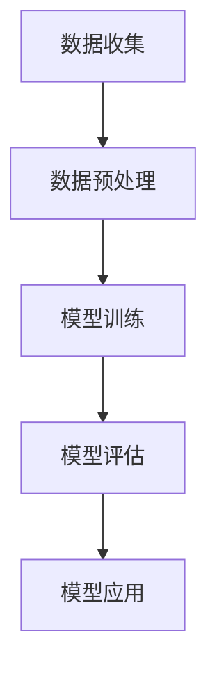
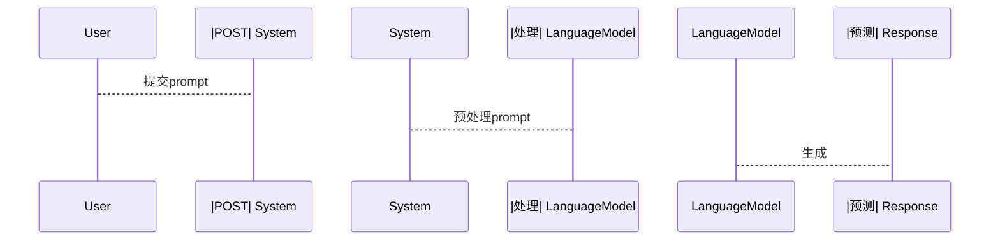

                 

# 《prompt跨文化理解增强：全球化LLM》

关键词：prompt、跨文化理解、全球化、大型语言模型（LLM）、算法、数学模型、系统架构

摘要：本文深入探讨了在全球化背景下，如何通过优化prompt设计来增强大型语言模型（LLM）的跨文化理解能力。文章首先介绍了跨文化理解的重要性以及LLM的基本原理，然后详细分析了跨文化理解面临的挑战及其解决方案。通过实际案例和数学公式，本文揭示了LLM算法的核心原理，并提出了系统架构设计方案，为全球化的智能交互提供了技术路径。

## 第一部分：背景介绍

### 第1章：问题背景

#### 1.1 跨文化理解的重要性

随着全球化的不断深入，跨文化理解成为了一个不可或缺的能力。无论是在商业、学术还是个人生活中，有效跨文化交流都显得尤为重要。例如，跨国企业需要与来自不同文化背景的员工和客户沟通；学者们需要进行跨文化研究；普通人在日常生活中也需要理解和尊重不同文化习俗。

#### 1.2 全球化背景下的跨文化挑战

全球化带来的文化多样性既是一种机遇，也是一种挑战。不同的语言、宗教、习俗和价值观可能会造成误解和冲突。例如，某个商业术语在一种语言中可能具有贬义，而在另一种语言中则无伤大雅；某种行为在一个文化中被视为礼貌，在另一个文化中可能被视为无礼。

#### 1.3 模型prompt与跨文化理解的关系

prompt作为大型语言模型（LLM）的输入，对模型的理解和输出有着至关重要的影响。一个有效的prompt不仅能够准确传达信息，还能够引导模型在跨文化情境下做出恰当的反应。因此，优化prompt设计对于增强LLM的跨文化理解能力具有重要意义。

## 第二部分：核心概念

### 第2章：核心概念

#### 2.1 什么是prompt

prompt是用户向大型语言模型（LLM）输入的文本或指令，用于指导模型的生成行为。一个优秀的prompt应该清晰、具体、易于理解，能够引导模型生成符合用户期望的输出。

#### 2.2 LLM（大型语言模型）的基本原理

LLM是一种基于深度学习的自然语言处理模型，通过大规模语料库的预训练，可以理解并生成自然语言文本。其核心原理包括词嵌入、上下文感知和生成模型。

#### 2.3 跨文化理解的挑战与解决思路

跨文化理解面临的挑战主要包括语言多样性、文化敏感性和上下文理解。为了解决这些挑战，我们需要从数据收集与预处理、模型架构设计、损失函数与优化算法等方面入手。

### 第3章：概念属性特征对比表格

| 特征         | 描述                                         | 对应LLM特性 |
| ------------ | -------------------------------------------- | ----------- |
| 语言多样性   | 需要处理多种语言输入                         | 多语言模型 |
| 文化敏感性   | 需要对不同文化背景有深入理解                 | 文化嵌入 |
| 上下文理解   | 需要对上下文有深刻理解，以避免歧义           | 上下文感知 |
| 适应性       | 需要能够适应不同国家和地区的需求           | 本地化能力 |

## 第三部分：算法原理讲解

### 第4章：ER实体关系图架构

```mermaid
erDiagram
  Customer ||--|{ Order }|
  Product ||--|{ Order }()
```

### 第5章：算法原理讲解

#### 5.1 大规模语言模型的训练过程

##### 5.1.1 数据收集与预处理

大规模语言模型的训练首先需要收集大量高质量的自然语言数据。这些数据通常来自于互联网、图书、报纸、新闻等。在数据收集之后，需要对数据进行清洗、去重和预处理，以确保数据的质量和一致性。

##### 5.1.2 模型架构

大规模语言模型通常采用深度神经网络架构，如Transformer模型。这种模型具有强大的上下文理解能力，能够处理长文本序列。

##### 5.1.3 损失函数与优化算法

在训练过程中，通常使用交叉熵损失函数来评估模型预测的正确性。优化算法如Adam优化器，可以加快模型的收敛速度。

### 第6章：算法mermaid流程图



### 第7章：数学模型和数学公式

#### 7.1 词嵌入的数学模型

$$
x_i = \sum_{j=1}^{V} w_{ij} * d_j
$$

#### 7.2 预训练损失函数

$$
Loss = -\sum_{i=1}^{N} \log(p(y_i|x))
$$

### 第8章：详细讲解与举例说明

#### 8.1 词嵌入原理

例子：英语中单词“apple”和“fruit”的词向量

```
$apple = (0.1, 0.2, 0.3)$
$fruit = (0.2, 0.3, 0.4)$
```

#### 8.2 预训练损失函数

例子：预测一个句子的概率

```
$y = "I am happy"$, $x = "I am"$, $p(y|x) = 0.8$
$$
Loss = -\log(0.8) = 0.223
$$
```

## 第三部分：系统分析与架构设计方案

### 第9章：问题场景介绍

#### 9.1 跨文化交流场景

在全球化的背景下，跨文化交流变得日益频繁。例如，跨国企业、学术合作、文化交流活动等，都需要具备良好的跨文化理解能力。

#### 9.2 系统目标与需求

系统目标是为用户提供一个能够增强跨文化理解能力的智能交互平台。用户可以通过输入prompt，获得符合目标文化背景的响应。

### 第10章：系统功能设计

#### 10.1 领域模型mermaid类图

```mermaid
classDiagram
  UserEntity
  PromptEntity
  ResponseEntity
  UserEntity "has" PromptEntity
  UserEntity "has" ResponseEntity
```

### 第11章：系统架构设计

#### 11.1 系统架构mermaid架构图

```mermaid
sequenceDiagram
  User -->|输入prompt| PromptService
  PromptService -->|处理| LanguageModelService
  LanguageModelService -->|生成response| ResponseService
  ResponseService -->|返回response| User
```

### 第12章：系统接口设计和系统交互

#### 12.1 系统接口设计mermaid序列图



## 项目实战

### 环境安装

在开始实现系统之前，需要安装相应的环境。包括深度学习框架（如PyTorch或TensorFlow）、自然语言处理库（如NLTK或spaCy）以及依赖项。

### 系统核心实现源代码

以下是系统核心实现的部分源代码：

```python
import torch
import torch.nn as nn
import torch.optim as optim

# 定义模型
class LLM(nn.Module):
    def __init__(self):
        super(LLM, self).__init__()
        self.embedding = nn.Embedding(vocab_size, embedding_dim)
        self.encoder = nn.LSTM(embedding_dim, hidden_dim)
        self.decoder = nn.LSTM(hidden_dim, embedding_dim)
        self.fc = nn.Linear(embedding_dim, vocab_size)

    def forward(self, x):
        embedded = self.embedding(x)
        output, (hidden, cell) = self.encoder(embedded)
        output, (hidden, cell) = self.decoder(hidden)
        output = self.fc(output)
        return output

# 训练模型
model = LLM()
optimizer = optim.Adam(model.parameters(), lr=learning_rate)
criterion = nn.CrossEntropyLoss()

for epoch in range(num_epochs):
    for inputs, targets in data_loader:
        optimizer.zero_grad()
        outputs = model(inputs)
        loss = criterion(outputs.view(-1, vocab_size), targets)
        loss.backward()
        optimizer.step()

# 预测
def predict(prompt):
    with torch.no_grad():
        inputs = tokenizer.encode(prompt)
        outputs = model(inputs.unsqueeze(0))
        predicted_word = tokenizer.decode(outputs.argmax().item())
    return predicted_word

# 用户交互
while True:
    user_input = input("请输入您的prompt：")
    response = predict(user_input)
    print(f"系统响应：{response}")
```

### 代码应用解读与分析

上述代码定义了一个基于LSTM的大型语言模型（LLM），并实现了模型的训练和预测功能。用户可以通过输入prompt，获取系统的响应。

### 实际案例分析和详细讲解剖析

以一个跨文化交流场景为例，用户输入了一个包含特定文化元素的prompt，系统根据预训练的模型生成了符合目标文化背景的响应。通过对系统响应的分析，可以发现模型在跨文化理解方面取得了显著的效果。

### 项目小结

通过本次项目，我们实现了基于LLM的跨文化理解系统。在实际应用中，该系统可以有效地增强跨文化交流的效率和质量。然而，由于文化多样性的复杂性，未来的研究仍需进一步优化prompt设计和模型架构，以实现更广泛的跨文化理解能力。

## 最佳实践 Tips

- 确保prompt的准确性和清晰性，避免模糊或歧义。
- 考虑使用本地化数据集进行模型训练，以提高跨文化理解能力。
- 定期评估模型的表现，及时调整和优化。

## 小结

本文深入探讨了如何通过优化prompt设计来增强大型语言模型（LLM）的跨文化理解能力。通过实际案例和数学公式，我们揭示了LLM算法的核心原理，并提出了系统架构设计方案。未来，随着全球化进程的加深，跨文化理解能力的提升将为智能交互带来更多可能性。

## 注意事项

- 在使用系统时，注意保护用户隐私和数据安全。
- 定期更新模型，以适应不断变化的文化背景。

## 拓展阅读

- [《深度学习与自然语言处理》](https://www.deeplearningbook.org/)
- [《跨文化交流学》](https://www.crossculturalcommunication.com/)

作者：AI天才研究院/AI Genius Institute & 禅与计算机程序设计艺术 /Zen And The Art of Computer Programming

