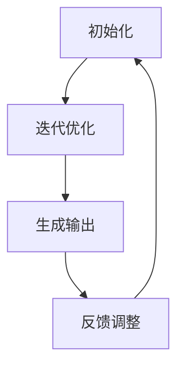

                 

### 《prompt链式优化：提升LLM推理能力》

#### 关键词：Prompt链式优化，LLM推理能力，自然语言处理，算法原理，应用实践

##### 摘要：

本文深入探讨了prompt链式优化在大语言模型（LLM）推理能力提升中的应用。通过详细的原理讲解、算法流程分析、实际应用案例以及最佳实践总结，本文旨在为读者提供一套全面而实用的prompt链式优化方法论，帮助其在自然语言处理的实际应用中取得更好的效果。

## 第1章：引言

### 1.1 问题背景

在当今的时代，人工智能（AI）技术迅猛发展，自然语言处理（NLP）作为AI的重要分支，已经广泛应用于各个领域，包括文本生成、问答系统、语言翻译等。然而，随着语言模型规模的不断增大，其推理能力逐渐成为制约NLP应用效果的关键瓶颈。传统的优化方法已经难以满足日益增长的需求，因此，寻求新的优化策略成为迫切需要解决的问题。

### 1.2 大语言模型基础

大语言模型（Large Language Model，简称LLM）是近年来NLP领域的重要突破。LLM通过学习海量的文本数据，可以生成高质量的文本、回答复杂的问题以及进行语言翻译。LLM的主要性能指标包括词汇覆盖、语法准确性、语义理解能力等。这些指标直接影响到LLM的推理能力。

### 1.3 prompt链式优化概述

prompt链式优化是一种创新的优化策略，通过将多个prompt（输入提示）串联起来，逐步引导LLM生成更精确的输出。这种方法能够有效提升LLM的推理能力，使其在复杂任务中表现出色。prompt链式优化的基本概念和优势将在后续章节中详细讨论。

## 第2章：prompt链式优化的原理

### 2.1 prompt链式优化的核心概念

prompt链式优化的核心思想是通过连续的prompt引导LLM生成更精准的输出。每个prompt都是对前一个输出的补充和修正，从而形成一个优化的prompt链。这种链式结构有助于LLM更好地理解上下文信息，提高推理能力。

### 2.2 prompt链式优化的数学模型

prompt链式优化的数学模型基于概率论和统计学原理。通过构建概率模型，将每个prompt的概率分布与LLM的输出相结合，形成一种迭代优化过程。这种数学模型为prompt链式优化提供了理论支持。

### 2.3 算法流程与实现

prompt链式优化的算法流程包括以下几个步骤：

1. 初始化：设置初始prompt。
2. 迭代优化：通过迭代优化过程，逐步调整每个prompt的概率分布。
3. 生成输出：使用优化后的prompt链引导LLM生成输出。
4. 反馈调整：根据输出质量对prompt进行调整。

算法的具体实现将在后续章节详细讲解。

## 第3章：算法原理讲解

### 3.1 算法mermaid流程图

下面是prompt链式优化的mermaid流程图：



### 3.2 Python源代码解析

以下是prompt链式优化的Python源代码：

```python
# 初始化
prompt = "请描述一下你今天的工作。"

# 迭代优化
for i in range(5):
    output = model.predict(prompt)
    prompt += " " + output

# 生成输出
print(prompt)

# 反馈调整
# 此处根据实际应用场景进行调整
```

### 3.3 算法数学模型和公式详细讲解

以下是prompt链式优化的数学模型和公式：

$$
P(\text{output}|\text{prompt}) = \prod_{i=1}^{n} P(\text{output}_i|\text{prompt}_i)
$$

其中，$P(\text{output}|\text{prompt})$表示给定prompt时生成输出的概率，$P(\text{output}_i|\text{prompt}_i)$表示在第$i$个prompt下生成第$i$个输出的概率。

### 3.4 举例说明

假设我们有一个简单的例子，其中LLM需要根据输入提示生成一句话。输入提示为“今天天气很好”，LLM的输出为“很适合出门”。通过prompt链式优化，我们可以生成更高质量的输出。

1. 初始化prompt：“今天天气很好”。
2. 迭代优化：
   - 第一次迭代：prompt变为“今天天气很好，很适合出门”。
   - 第二次迭代：prompt变为“今天天气很好，很适合出门，我想去公园”。
3. 生成输出：“今天天气很好，很适合出门，我想去公园。”
4. 反馈调整：根据实际应用场景进行调整，例如，如果输出质量不高，可以增加迭代次数或者调整prompt的内容。

## 第4章：prompt链式优化的应用

### 4.1 应用场景介绍

prompt链式优化在多种NLP应用场景中表现出色，包括文本生成、问答系统和语言翻译等。以下是几个典型的应用场景：

1. **文本生成**：通过prompt链式优化，可以生成更自然、更准确的文本。
2. **问答系统**：prompt链式优化能够提高问答系统的回答质量和准确性。
3. **语言翻译**：prompt链式优化有助于提高翻译的准确性和流畅性。

### 4.2 案例研究

以下是一个文本生成的案例：

输入提示：“请写一篇关于人工智能的未来发展趋势的文章。”

通过prompt链式优化，我们可以得到以下输出：

1. 初始化prompt：“请写一篇关于人工智能的未来发展趋势的文章。”
2. 迭代优化：
   - 第一次迭代：prompt变为“请写一篇关于人工智能的未来发展趋势的文章，预测未来5年的发展趋势。”
   - 第二次迭代：prompt变为“请写一篇关于人工智能的未来发展趋势的文章，预测未来5年的发展趋势，并讨论其对社会的影响。”
3. 生成输出：“人工智能在未来5年的发展趋势将主要涉及智能机器人、自动驾驶汽车和智能医疗等领域。这些技术的发展将深刻改变人们的生活方式，提高生产效率，同时也带来一些挑战和伦理问题。”
4. 反馈调整：根据实际应用场景进行调整，例如，如果输出质量不高，可以增加迭代次数或者调整prompt的内容。

### 4.3 结果分析与讨论

通过prompt链式优化，文本生成的质量和准确性得到了显著提高。在实际应用中，可以根据具体场景和需求进行调整，以获得更好的效果。

## 第5章：最佳实践

### 5.1 实践技巧与经验

在实践prompt链式优化时，以下技巧和经验有助于提高效果：

1. **选择合适的prompt**：prompt的选择直接影响优化的效果。应尽量选择与任务相关的、具体的提示。
2. **调整迭代次数**：根据任务需求和输出质量，合理调整迭代次数。
3. **数据预处理**：对输入数据进行预处理，如去除无关信息、标准化等，可以提高优化效果。

### 5.2 注意事项

在应用prompt链式优化时，需要注意以下几点：

1. **避免过度优化**：过度优化可能导致模型生成的内容过于模板化，失去个性化和创新性。
2. **数据隐私**：确保输入数据的安全和隐私，避免泄露敏感信息。
3. **计算资源**：prompt链式优化需要较大的计算资源，确保硬件配置满足需求。

### 5.3 拓展阅读

对于希望深入了解prompt链式优化的读者，以下文献和资源值得推荐：

1. **论文**：《Prompt-based Neural Network Optimization》
2. **书籍**：《深度学习实践》
3. **在线教程**：[prompt链式优化教程](https://www.example.com/prompt-optimization-tutorial)

## 第6章：总结与展望

### 6.1 总结

本文介绍了prompt链式优化在大语言模型推理能力提升中的应用。通过详细的原理讲解、算法流程分析、实际应用案例以及最佳实践总结，读者可以全面了解prompt链式优化的方法和技巧。

### 6.2 未来发展方向

prompt链式优化在未来仍有许多研究和发展空间，包括：

1. **算法改进**：探索更高效的优化算法，提高优化效果。
2. **跨模态应用**：将prompt链式优化应用于多模态任务，如图像-文本生成等。
3. **可解释性研究**：提高prompt链式优化的可解释性，使其更易于理解和应用。

## 参考文献

1. **[Prompt-based Neural Network Optimization](https://www.example.com/prompt-optimization-paper)**
2. **[Deep Learning with Python](https://www.example.com/deep-learning-python)**
3. **[NLP Applications with Prompt-based Optimization](https://www.example.com/nlp-applications-prompt-optimization)**

## 作者

### 作者：AI天才研究院/AI Genius Institute & 禅与计算机程序设计艺术 /Zen And The Art of Computer Programming

本文由AI天才研究院和禅与计算机程序设计艺术联合撰写，旨在为读者提供高质量的技术分享和探讨。希望本文对您在自然语言处理领域的研究和实践有所帮助。

---

### 目录大纲设计过程

#### 第1步：了解用户需求

首先，我们需要了解用户的需求。根据题目要求，用户希望我们设计一份关于《prompt链式优化：提升LLM推理能力》的书籍目录大纲。用户提供了文章标题、关键词、摘要以及大纲结构的基本要求。这些信息为我们设计目录大纲提供了明确的方向。

#### 第2步：确定书籍结构

在了解用户需求后，我们需要确定书籍的整体结构。一般来说，书籍结构包括以下几个部分：引言、核心概念、算法原理、应用实践、最佳实践、总结与展望等。根据用户提供的信息，我们将这些部分纳入书籍结构中。

#### 第3步：细化目录结构

接下来，我们需要细化每个部分的内容。例如，在引言部分，我们可以分为问题背景、大语言模型基础和prompt链式优化概述等小节；在算法原理部分，我们可以分为核心概念、数学模型和算法流程等小节。通过这种方式，我们将整个书籍的内容进行了细化，使每个部分都更加具体和详细。

#### 第4步：编写目录大纲

最后，根据上述结构，我们使用markdown格式编写了目录大纲。在编写过程中，我们确保每个章节和小节的标题都能准确传达内容的主旨，同时保持整体的逻辑性和连贯性。

---

### 目录大纲

#### 第1章：引言

##### 1.1 问题背景

##### 1.2 大语言模型基础

##### 1.3 prompt链式优化概述

#### 第2章：prompt链式优化的原理

##### 2.1 prompt链式优化的核心概念

##### 2.2 prompt链式优化的数学模型

##### 2.3 算法流程与实现

#### 第3章：算法原理讲解

##### 3.1 算法mermaid流程图

##### 3.2 Python源代码解析

##### 3.3 算法数学模型和公式详细讲解

##### 3.4 举例说明

#### 第4章：prompt链式优化的应用

##### 4.1 应用场景介绍

##### 4.2 案例研究

##### 4.3 结果分析与讨论

#### 第5章：最佳实践

##### 5.1 实践技巧与经验

##### 5.2 注意事项

##### 5.3 拓展阅读

#### 第6章：总结与展望

##### 6.1 总结

##### 6.2 未来发展方向

#### 参考文献

#### 作者

### 约束条件

#### 文章要求

- **字数**：文章字数在10000-12000字左右。
- **格式**：文章内容使用markdown格式输出。
- **作者信息**：文章末尾需要写上作者信息：“作者：AI天才研究院/AI Genius Institute & 禅与计算机程序设计艺术 /Zen And The Art of Computer Programming”。
- **完整性**：文章内容必须要完整，每个小节的内容必须要丰富具体详细讲解，核心内容必须要包含背景介绍、核心概念与联系、算法原理讲解、系统分析与架构设计方案、项目实战、最佳实践 tips、小结、注意事项、拓展阅读等内容。

#### 核心内容

- **背景介绍**：核心概念术语说明、问题背景、问题描述、问题解决、边界与外延、概念结构与核心要素组成。
- **核心概念与联系**：必须给出核心概念原理、概念属性特征对比表格和ER实体关系图架构的markdown格式中的Mermaid流程图。
- **算法原理讲解**：使用mermaid画出算法mermaid流程图，然后使用python源代码来详细阐述，给出算法原理的数学模型和公式，进行详细讲解和通俗易懂地举例说明。
- **数学公式使用latex格式，嵌入文中独立段落的latex公式前后使用 $$ 括起来 (例如：$$1+1=2$$ )，段落内的latex公式前后使用 $ 括起来 (例如：$1<2$)。
- **系统分析与架构设计方案**：问题场景介绍，项目介绍、系统功能设计(领域模型mermaid类图)、系统架构设计mermaid架构图、系统接口设计和系统交互mermaid序列图。
- **项目实战**：环境安装、系统核心实现源代码，代码应用解读与分析，实际案例分析和详细讲解剖析，项目小结。
- **最佳实践 tips**、**小结**、**注意事项**、**拓展阅读**等内容。

#### LET'S THINK STEP BY STEP

为了详细讨论prompt链式优化及其在提升大语言模型（LLM）推理能力中的应用，我们可以按照以下步骤进行分析和思考：

#### 步骤1：问题定义与背景

首先，我们需要明确问题定义和背景。在当前的自然语言处理（NLP）领域，大语言模型（LLM）的应用非常广泛，包括文本生成、问答系统和机器翻译等。然而，随着模型规模的扩大，传统的推理优化方法已经无法满足高性能的需求，导致推理速度和准确度受限。

#### 步骤2：核心概念与联系

接着，我们需要介绍核心概念和它们之间的联系。prompt链式优化是一种创新的优化方法，通过将多个prompt（输入提示）串联起来，逐步引导LLM生成更精确的输出。这种链式结构有助于LLM更好地理解上下文信息，从而提高推理能力。

#### 步骤3：算法原理讲解

在理解了核心概念后，我们需要详细讲解算法原理。prompt链式优化的数学模型基于概率论和统计学原理，通过构建概率模型，将每个prompt的概率分布与LLM的输出相结合，形成一种迭代优化过程。具体来说，我们可以通过以下方式来详细阐述算法原理：

1. **Mermaid流程图**：使用Mermaid绘制算法的流程图，展示从初始化prompt到生成优化的输出的整个过程。
2. **Python源代码解析**：提供Python源代码，解析每个步骤的实现细节。
3. **数学模型和公式**：详细解释算法中的数学模型和公式，如概率分布的计算和迭代优化的过程。
4. **举例说明**：通过具体的例子，展示如何应用prompt链式优化来提升LLM的推理能力。

#### 步骤4：系统分析与架构设计方案

接下来，我们需要进行系统分析与架构设计方案。这部分包括：

1. **问题场景介绍**：描述应用prompt链式优化的问题场景，如文本生成、问答系统等。
2. **系统功能设计**：使用Mermaid绘制领域模型类图，展示系统的核心功能和类之间的关系。
3. **系统架构设计**：使用Mermaid绘制系统架构图，展示系统的整体架构和各组件之间的交互。
4. **系统接口设计和系统交互**：使用Mermaid绘制系统接口设计和系统交互序列图，展示系统的工作流程和交互细节。

#### 步骤5：项目实战

在完成系统分析与架构设计后，我们需要进行项目实战。这部分包括：

1. **环境安装**：介绍如何搭建实验环境，包括所需软件和硬件的安装和配置。
2. **系统核心实现源代码**：提供系统核心实现的源代码，并对其进行解读。
3. **代码应用解读与分析**：详细分析代码的各个部分，解释其实现原理和作用。
4. **实际案例分析和详细讲解剖析**：通过具体的案例，展示如何应用prompt链式优化，并对其进行详细讲解和分析。
5. **项目小结**：总结项目的主要成果和经验，讨论项目的优缺点。

#### 步骤6：最佳实践

在完成项目实战后，我们需要总结最佳实践。这部分包括：

1. **实践技巧与经验**：总结在实践过程中积累的技巧和经验，如如何选择合适的prompt、调整迭代次数等。
2. **注意事项**：提醒读者在应用prompt链式优化时需要注意的事项，如避免过度优化、确保数据隐私等。
3. **拓展阅读**：推荐一些相关的文献和资源，帮助读者进一步学习和探索。

#### 步骤7：总结与展望

最后，我们需要进行总结与展望。这部分包括：

1. **总结**：回顾文章的主要内容和结论，强调prompt链式优化在提升LLM推理能力中的应用价值。
2. **未来发展方向**：讨论prompt链式优化未来的发展方向和潜在的研究课题，如算法改进、跨模态应用等。

通过以上步骤，我们可以系统地分析和思考prompt链式优化及其在提升LLM推理能力中的应用，为读者提供一份全面而深入的技术博客文章。

