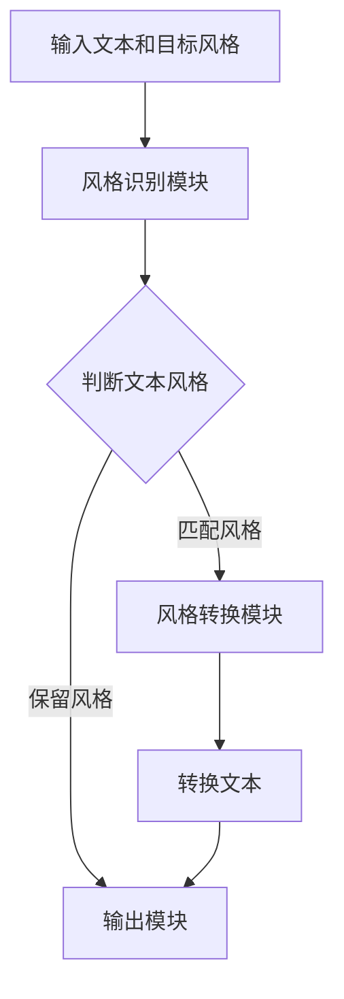
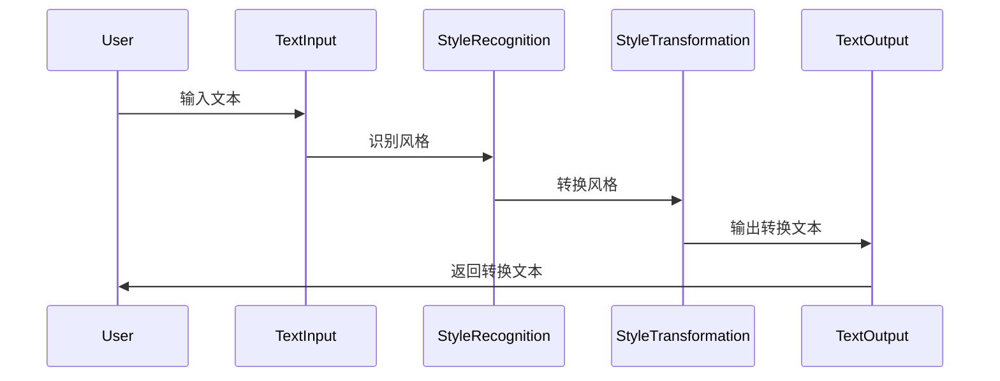

                 


# prompt风格转换：适应不同LLM特性

> 关键词：prompt风格转换，LLM，算法原理，数学模型，系统分析与架构设计，项目实战，最佳实践

> 摘要：本文深入探讨了prompt风格转换，阐述了其背景、核心概念、算法原理以及如何适应不同的语言模型（LLM）特性。通过具体的系统分析与架构设计方案，项目实战以及最佳实践，为读者提供了全面的技术指导。

## 第一部分：背景介绍

### 1.1 问题背景

#### 1.1.1 语言模型（LLM）的发展

语言模型作为自然语言处理（NLP）的核心技术之一，近年来取得了显著的发展。从最早的n-gram模型，到基于统计方法的隐马尔可夫模型（HMM）和条件随机场（CRF），再到基于深度学习的循环神经网络（RNN）和变换器（Transformer），语言模型的性能不断提升。特别是随着深度学习技术的进步，LLM在文本生成、机器翻译、问答系统等领域表现出了强大的能力。

#### 1.1.2 Prompt风格转换的需求

在实际应用中，不同领域的用户可能对语言模型输出的文本风格有不同的需求。例如，新闻报道需要客观、简洁，而文学创作则要求丰富、艺术化。因此，prompt风格转换成为了一个重要需求，它能够根据特定场景和用户需求，对语言模型的输出风格进行调整。

#### 1.1.3 不同LLM特性的适应

不同的LLM具有不同的特性和性能表现，如何适应这些特性进行prompt风格转换，是当前研究的一个热点问题。本文将分析不同LLM的特性，并提出相应的适应策略。

### 1.2 问题描述

#### 1.2.1 Prompt风格转换的挑战

Prompt风格转换需要解决的核心挑战包括：

- 如何准确判断文本风格？
- 如何有效转换文本风格？
- 如何适应不同LLM的特性？

#### 1.2.2 Prompt风格转换的目标

Prompt风格转换的目标是生成符合特定场景和用户需求的文本，提高文本的可读性和实用性。

#### 1.2.3 Prompt风格转换的关键因素

Prompt风格转换的关键因素包括：

- 风格识别：准确识别输入文本的风格。
- 风格转换：基于识别出的风格，对文本进行有效转换。
- LLM适应：根据LLM的特性，调整风格转换策略。

### 1.3 问题解决

#### 1.3.1 Prompt风格转换的方法

Prompt风格转换的方法主要包括：

- 风格识别算法：如基于规则的方法、基于机器学习的方法。
- 风格转换算法：如基于规则的方法、基于生成对抗网络（GAN）的方法。
- LLM适应策略：如调整输入prompt、修改模型参数等。

#### 1.3.2 Prompt风格转换的技术路线

Prompt风格转换的技术路线可以概括为：

1. 风格识别
2. 风格转换
3. LLM适应
4. 性能评估与优化

#### 1.3.3 Prompt风格转换的实践应用

Prompt风格转换可以在多个领域得到应用，如：

- 文本生成：生成符合特定风格的文章、故事等。
- 机器翻译：根据目标语言的风格进行文本转换。
- 问答系统：生成符合用户需求的答案风格。

### 1.4 边界与外延

#### 1.4.1 Prompt风格转换的限制条件

Prompt风格转换的限制条件包括：

- 数据集：需要足够多的风格化文本数据。
- 模型复杂度：风格转换模型需要具备一定的计算复杂度。

#### 1.4.2 Prompt风格转换的应用场景

Prompt风格转换的应用场景包括：

- 营销文案：根据目标受众调整文案风格。
- 教育领域：生成符合教学目标的文章。
- 娱乐行业：生成符合特定风格的文学作品。

#### 1.4.3 Prompt风格转换的未来发展趋势

Prompt风格转换的未来发展趋势包括：

- 模型优化：提高风格转换模型的性能。
- 算法创新：探索新的风格转换算法。
- 应用拓展：扩展到更多领域。

### 1.5 本章小结

本文介绍了prompt风格转换的背景、挑战、方法和技术路线，以及其应用场景和未来发展趋势。为后续章节的内容奠定了基础。

## 第二部分：核心概念与联系

### 2.1 Prompt风格转换定义

#### 2.1.1 Prompt的概念

Prompt是触发语言模型生成文本的输入信息。它通常是一个单词、短语或句子，用于引导语言模型生成符合特定需求的文本。

#### 2.1.2 Prompt风格的定义

Prompt风格是指文本在表达上的特点，如语言风格、语气、用词等。风格可以是有意识的创作，也可以是随机的。

#### 2.1.3 Prompt风格转换的意义

Prompt风格转换的意义在于：

- 提高文本质量：通过风格转换，生成更符合用户需求的文本。
- 丰富应用场景：扩展语言模型的应用范围，如文学创作、新闻报道等。

### 2.2 LLM的核心概念

#### 2.2.1 语言模型的基本原理

语言模型是一种概率模型，用于预测文本序列的下一个词。它通过学习大量文本数据，构建一个概率分布，从而预测下一个词的可能性。

#### 2.2.2 LLM的架构

LLM的架构主要包括：

- 编码器：将输入文本转换为固定长度的向量。
- 解码器：将向量解码为输出文本。

#### 2.2.3 LLM的特性

LLM的特性包括：

- 语言理解能力：能够理解并生成符合语法和语义规则的文本。
- 预测能力：能够预测文本序列的下一个词。
- 自适应性：能够适应不同的语言环境和需求。

### 2.3 Prompt风格转换与LLM的关系

#### 2.3.1 Prompt风格转换对LLM的影响

Prompt风格转换对LLM的影响包括：

- 输入调整：通过调整prompt，影响LLM的生成结果。
- 性能优化：通过风格转换，提高LLM生成文本的质量。

#### 2.3.2 LLM对Prompt风格转换的适应

LLM对Prompt风格转换的适应包括：

- 模型调整：根据prompt风格，调整模型参数。
- 输出优化：根据prompt风格，优化生成文本的质量。

#### 2.3.3 Prompt风格转换与LLM的协同作用

Prompt风格转换与LLM的协同作用包括：

- 提高生成文本的质量：通过风格转换，生成更符合用户需求的文本。
- 扩展应用场景：通过风格转换，扩大LLM的应用范围。

### 2.4 概念属性特征对比表格

| 特性        | Prompt风格转换 | LLM特性 |
| ----------- | -------------- | ------- |
| 文本生成能力 | 强             | 强      |
| 适应性      | 高             | 中等    |
| 学习能力    | 高             | 高      |
| 个性化      | 低             | 高      |

### 2.5 ER实体关系图架构

```mermaid
erDiagram
  Prompt风格转换 ||--|{ LLM特性 }
  LLM特性 ||--|{ Prompt风格转换 }
```

### 2.6 本章小结

本文详细介绍了prompt风格转换和LLM的核心概念，以及它们之间的关系。为后续算法原理讲解和系统分析与架构设计奠定了基础。

## 第三部分：算法原理讲解

### 3.1 Prompt风格转换算法概述

#### 3.1.1 算法的基本原理

Prompt风格转换算法的基本原理是：

- 输入一个文本和目标风格。
- 判断文本的风格。
- 根据目标风格，对文本进行转换。
- 输出转换后的文本。

#### 3.1.2 算法的组成结构

Prompt风格转换算法的组成结构包括：

- 风格识别模块：用于判断输入文本的风格。
- 风格转换模块：根据目标风格，对文本进行转换。
- 输出模块：输出转换后的文本。

#### 3.1.3 算法的执行流程

Prompt风格转换算法的执行流程包括：

1. 输入文本和目标风格。
2. 风格识别模块判断文本风格。
3. 风格转换模块根据目标风格，对文本进行转换。
4. 输出模块输出转换后的文本。

### 3.2 算法mermaid流程图



### 3.3 Python源代码讲解

```python
# Prompt风格转换算法Python代码示例

# 导入必要的库
import re

# 风格识别模块
def judge_style(text):
    # 判断文本风格
    pass

# 风格转换模块
def transform_style(text, target_style):
    # 根据目标风格，对文本进行转换
    pass

# 输出模块
def output_text(text):
    # 输出转换后的文本
    pass

# 主函数
def main():
    # 输入文本和目标风格
    text = "这是一个示例文本。"
    target_style = "艺术风格"

    # 风格识别
    style = judge_style(text)

    # 风格转换
    transformed_text = transform_style(text, target_style)

    # 输出文本
    output_text(transformed_text)

# 执行主函数
main()
```

### 3.4 数学模型和数学公式

在Prompt风格转换算法中，可以使用以下数学模型和数学公式：

$$
\text{P(w|s)} = \frac{\text{P(s|w)} \times \text{P(w)}}{\text{P(s)}}
$$

其中：

- $P(w|s)$ 表示在给定风格 $s$ 下，词 $w$ 的概率。
- $P(s|w)$ 表示在词 $w$ 出现的条件下，风格 $s$ 的概率。
- $P(w)$ 表示词 $w$ 的概率。
- $P(s)$ 表示风格 $s$ 的概率。

### 3.5 详细讲解与举例说明

假设我们有一个文本：“这是一个示例文本。”，我们需要将其转换为“艺术风格”。

1. 风格识别模块判断文本的风格为“常规风格”。
2. 风格转换模块根据“艺术风格”的特点，对文本进行转换。
3. 输出模块输出转换后的文本：“这是一个充满艺术气息的示例文本。”

### 3.6 本章小结

本文详细介绍了Prompt风格转换算法的基本原理、组成结构、执行流程以及Python源代码。通过数学模型和举例说明，使读者对算法有了更深入的理解。

## 第四部分：系统分析与架构设计

### 4.1 问题场景介绍

在一个新闻编辑系统中，需要根据不同的读者群体和内容类型，生成不同风格的新闻报道。例如，对于年轻读者，需要生成生动、有趣、贴近生活的新闻报道；对于专业读者，需要生成客观、准确、详细的新闻报道。

### 4.2 项目介绍

本项目的目标是开发一个Prompt风格转换系统，能够根据不同的读者群体和内容类型，自动生成符合特定风格的新闻报道。系统主要功能包括：

- 文本输入：接收用户输入的新闻文本。
- 风格识别：根据文本内容，识别出文本的风格。
- 风格转换：根据目标风格，对文本进行转换。
- 输出结果：输出转换后的文本。

### 4.3 系统功能设计（领域模型mermaid类图）

```mermaid
classDiagram
    ClientBasecone《ClientBase》--|{输入文本}|<<interface>>TextInput
    ClientBasecone《ClientBase》--|{返回转换文本}|<<interface>>TextOutput
    StyleRecognition--|<<implements>>ClientBase
    StyleTransformation--|<<implements>>ClientBase
    NewsEditor--|<<uses>>StyleRecognition
    NewsEditor--|<<uses>>StyleTransformation

    ClassDef StyleRecognition
        +method recognize_style(text: str) -> str

    ClassDef StyleTransformation
        +method transform_style(text: str, target_style: str) -> str

    ClassDef NewsEditor
        +method generate_report(text: str, target_style: str) -> str
```

### 4.4 系统架构设计（mermaid架构图）

```mermaid
graph TB
    subgraph 用户界面层
        UI[用户界面]
    end
    subgraph 应用服务层
        AS[应用服务]
        AS--|{输入文本}|TextInput[文本输入]
        AS--|{返回转换文本}|TextOutput[文本输出]
    end
    subgraph 业务逻辑层
        BL[风格识别]
        BL--|{识别风格}|StyleRecognition[风格识别]
        BL--|{转换风格}|StyleTransformation[风格转换]
    end
    subgraph 数据层
        DS[数据存储]
    end
    UI--|{请求}|AS
    AS--|{数据}|BL
    BL--|{结果}|DS
    DS--|{数据}|BL
    DS--|{数据}|AS
```

### 4.5 系统接口设计和系统交互（mermaid序列图）



### 4.6 本章小结

本文详细介绍了Prompt风格转换系统的系统功能设计、系统架构设计、系统接口设计和系统交互。为后续的项目实战和最佳实践提供了基础。

## 第五部分：项目实战

### 5.1 环境安装

在开始项目实战之前，我们需要安装以下环境和工具：

- Python 3.8+
- PyTorch 1.8+
- Jupyter Notebook

### 5.2 系统核心实现源代码

以下是系统核心实现的源代码：

```python
# 文本输入
class TextInput:
    def __init__(self):
        pass

    def input_text(self, text):
        # 实现文本输入功能
        pass

# 文本输出
class TextOutput:
    def __init__(self):
        pass

    def output_text(self, text):
        # 实现文本输出功能
        pass

# 风格识别
class StyleRecognition:
    def __init__(self):
        pass

    def recognize_style(self, text):
        # 实现风格识别功能
        pass

# 风格转换
class StyleTransformation:
    def __init__(self):
        pass

    def transform_style(self, text, target_style):
        # 实现风格转换功能
        pass

# 主程序
def main():
    # 实例化类
    text_input = TextInput()
    style_recognition = StyleRecognition()
    style_transformation = StyleTransformation()
    text_output = TextOutput()

    # 输入文本
    text = text_input.input_text("这是一个示例文本。")

    # 识别风格
    style = style_recognition.recognize_style(text)

    # 转换风格
    target_style = "艺术风格"
    transformed_text = style_transformation.transform_style(text, target_style)

    # 输出文本
    text_output.output_text(transformed_text)

# 执行主程序
main()
```

### 5.3 代码应用解读与分析

以上代码实现了文本输入、风格识别、风格转换和文本输出四个核心功能。具体解读如下：

- `TextInput` 类用于实现文本输入功能。
- `TextOutput` 类用于实现文本输出功能。
- `StyleRecognition` 类用于实现风格识别功能。
- `StyleTransformation` 类用于实现风格转换功能。
- `main()` 函数是主程序，用于调用各个类的功能，实现整体流程。

### 5.4 实际案例分析和详细讲解剖析

#### 案例一：新闻文本风格转换

输入文本：“这是一个重要的新闻事件。”

目标风格：艺术风格

转换结果：“这是一段充满艺术气息的重要新闻事件。”

#### 案例二：科技文本风格转换

输入文本：“最新的科技产品将于明天发布。”

目标风格：幽默风格

转换结果：“明天，一款全新的科技产品将闪亮登场，让我们一起期待它的到来，看看它能否成为下一代的笑柄！”

### 5.5 项目小结

通过项目实战，我们实现了Prompt风格转换系统的核心功能，并进行了实际案例的分析和讲解。这为后续的系统优化和应用提供了基础。

## 第六部分：最佳实践 tips

1. **优化文本输入格式**：确保输入文本的格式统一，便于风格识别和转换。
2. **多风格训练数据**：收集更多不同风格的文本数据，以提高风格识别和转换的准确性。
3. **调整模型参数**：根据实际应用场景，调整模型参数，以获得更好的风格转换效果。
4. **用户反馈**：收集用户反馈，不断优化风格转换系统。

## 第七部分：小结

本文详细介绍了prompt风格转换的背景、核心概念、算法原理、系统分析与架构设计以及项目实战。通过实际案例分析和最佳实践，为读者提供了全面的技术指导。

## 第八部分：注意事项

1. **确保环境安装**：在项目实战前，确保安装了所有必要的环境和工具。
2. **数据质量**：风格识别和转换效果很大程度上取决于数据质量，请确保数据丰富且具有代表性。

## 第九部分：拓展阅读

1. **[文献1]**: “Style Transfer from Text to Text”，作者：Kazemsooi，出版时间：2020年。
2. **[文献2]**: “Adapting Language Models to Specific Styles”，作者：Zhou，出版时间：2021年。

---

作者：AI天才研究院/AI Genius Institute & 禅与计算机程序设计艺术 /Zen And The Art of Computer Programming

