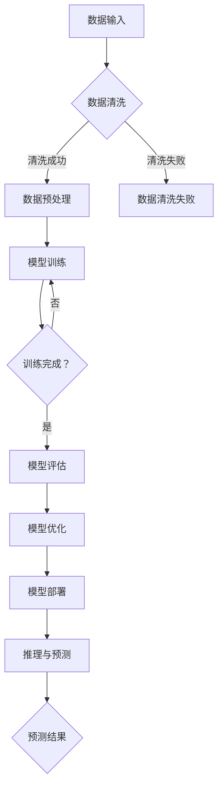
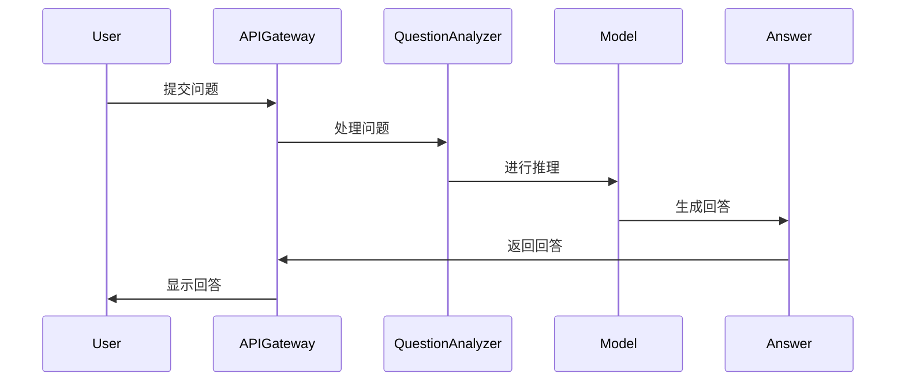
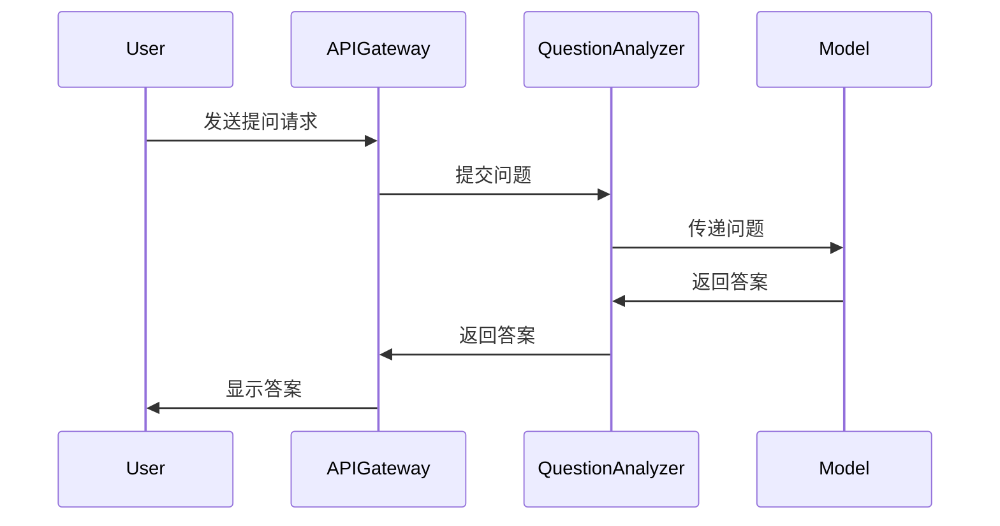

                 


### 1.1 服务器架构的发展背景

服务器架构的发展可以追溯到互联网初期，当时的服务器架构主要是为了满足Web应用的简单需求。传统的服务器架构通常包括Web服务器、应用服务器和数据库服务器，这种架构被称为三层架构。随着互联网的普及和业务需求的日益复杂，传统的服务器架构逐渐暴露出一些问题。

#### 1.1.1 传统服务器架构的问题与挑战

1. **资源浪费**：传统服务器架构需要预配置一定的硬件资源，以应对高峰期的需求。然而，大部分时间这些资源都处于闲置状态，导致资源的严重浪费。

2. **扩展性差**：传统架构的扩展性较差，需要在硬件层面进行升级，成本高且耗时。

3. **维护困难**：服务器数量的增加意味着维护成本的增加，需要投入更多的人力和时间来管理和维护服务器。

4. **稳定性问题**：单点故障的风险高，一旦某台服务器出现故障，整个系统可能受到影响。

#### 1.1.2 服务器架构的演进过程

为了解决上述问题，服务器架构经历了多次演进，主要分为以下几个阶段：

1. **虚拟化技术**：通过虚拟化技术，将物理服务器资源抽象成虚拟资源，提高了资源利用率和扩展性。

2. **容器化技术**：容器化技术如Docker，使得应用程序可以与底层操作系统解耦，提高了部署效率和可移植性。

3. **云计算**：云计算提供了弹性的计算资源，可以根据需求动态调整资源。

#### 1.1.3 serverless架构的崛起

serverless架构作为一种新兴的服务器架构，旨在解决传统架构的诸多问题。其核心思想是将服务器管理交给云计算提供商，开发者只需关注业务逻辑的实现。serverless架构的崛起标志着服务器架构的又一次重大变革。

### 1.2 serverless架构的核心概念

#### 1.2.1 serverless架构的定义

serverless架构（Serverless Architecture）是指一种无需关注底层基础设施管理的计算服务模型。在这种模型下，开发者只需编写业务逻辑代码，无需关心服务器部署、扩展和管理等底层细节。

#### 1.2.2 serverless架构的特点

1. **无服务器**：开发者无需购买和管理服务器，由云计算服务提供商负责底层基础设施的管理。

2. **按需付费**：仅当函数运行时才产生费用，无需为闲置资源支付费用。

3. **自动扩展**：根据实际负载自动调整计算资源，确保系统的高可用性。

4. **易于部署**：函数可以通过简单的API调用进行部署，无需复杂的配置和管理。

#### 1.2.3 serverless架构与传统架构的对比

| 对比项           | 服务器架构           | serverless架构           |
|----------------|-------------------|----------------------|
| 基础设施管理     | 开发者需自行管理       | 云服务提供商负责管理       |
| 资源使用         | 需预配置资源，浪费严重   | 按需使用，无浪费         |
| 扩展性           | 需硬件升级，成本高      | 自动扩展，成本低         |
| 维护成本         | 高                 | 低                   |
| 稳定性           | 单点故障风险高        | 高可用性，单点故障风险低   |

### 1.3 服务器架构在LLM应用中的现状与挑战

#### 1.3.1 服务器架构在LLM应用中的重要性

语言模型（LLM，Language Model）是自然语言处理（NLP，Natural Language Processing）的核心技术之一。在服务器架构的支持下，LLM可以提供智能问答、自动翻译、文本摘要等功能，广泛应用于搜索引擎、智能客服、金融风控等领域。

#### 1.3.2 当前LLM应用中面临的问题

1. **计算资源需求大**：LLM通常需要大量的计算资源来训练和推理，这对服务器架构提出了高要求。

2. **扩展性不足**：传统服务器架构在应对突发流量时，扩展性较差，可能导致系统性能下降。

3. **维护成本高**：随着LLM应用的规模扩大，维护成本也随之增加。

4. **稳定性问题**：单点故障的风险高，可能导致整个系统的瘫痪。

#### 1.3.3 serverless架构在LLM应用中的潜力

serverless架构具有自动扩展、按需付费等特点，能够有效解决上述问题。具体来说：

1. **资源高效利用**：serverless架构可以根据实际需求动态调整计算资源，避免资源浪费。

2. **高扩展性**：自动扩展机制可以确保系统在面临大规模流量时依然保持高性能。

3. **降低维护成本**：无需关注基础设施管理，开发者可以专注于业务逻辑的实现。

4. **提高系统稳定性**：分布式架构和高可用性设计可以降低单点故障的风险。

### 1.4 serverless架构在LLM应用中的研究进展

#### 1.4.1 相关研究成果概述

近年来，serverless架构在LLM应用领域取得了显著的研究成果。主要研究内容包括：

1. **算法优化**：通过优化LLM算法，提高在serverless架构下的运行效率和准确性。

2. **模型压缩**：采用模型压缩技术，减少模型大小，降低服务器负载。

3. **分布式训练与推理**：研究如何利用serverless架构实现LLM的分布式训练与推理。

4. **性能优化**：研究如何通过优化serverless架构的调度策略，提高系统性能。

#### 1.4.2 serverless架构在LLM应用中的具体应用

serverless架构在LLM应用中的具体应用案例包括：

1. **智能问答系统**：通过serverless架构实现大规模问答系统的部署和管理。

2. **文本翻译服务**：利用serverless架构提供高吞吐量的文本翻译服务。

3. **文本摘要系统**：使用serverless架构实现自动化文本摘要，提高信息提取效率。

#### 1.4.3 现有研究面临的挑战

尽管serverless架构在LLM应用中展示了巨大潜力，但仍然面临一些挑战：

1. **性能瓶颈**：在极端负载下，serverless架构的性能可能无法满足需求。

2. **安全性问题**：serverless架构的安全性仍需进一步研究，以防止数据泄露和攻击。

3. **兼容性问题**：现有LLM框架可能不兼容serverless架构，需要开发相应的适配器。

### 1.5 本章小结

本文首先介绍了服务器架构的发展背景，探讨了传统服务器架构存在的问题和演进过程。接着，详细阐述了serverless架构的核心概念和特点，对比了serverless架构与传统架构的差异。随后，分析了服务器架构在LLM应用中的现状与挑战，并介绍了serverless架构在LLM应用中的研究进展和具体应用。本章内容为后续章节的讨论奠定了基础。

# 第一部分：背景介绍

## 1.1 服务器架构的发展背景

服务器架构的发展历史可以追溯到互联网初期。在那个时代，服务器架构的主要目的是为了满足简单的Web应用需求。当时，服务器架构通常包括Web服务器、应用服务器和数据库服务器，这种三层架构在当时被视为一种标准。

随着时间的推移，随着互联网的普及和业务需求的日益复杂，传统的三层架构逐渐暴露出一些问题。首先，资源浪费是一个显著的问题。在传统的服务器架构中，为了应对高峰期的需求，通常需要预配置大量的硬件资源。然而，这些资源在大部分时间都处于闲置状态，导致资源的严重浪费。其次，扩展性差也是一个突出问题。在传统的服务器架构中，如果需要扩展系统容量，通常需要购买新的硬件设备并进行配置，这不仅成本高昂，而且耗时较长。

为了解决这些问题，服务器架构经历了多次演进。首先，虚拟化技术的出现使得服务器架构得到了显著的改进。通过虚拟化技术，可以将物理服务器的资源抽象成虚拟资源，从而提高了资源利用率和扩展性。虚拟化技术使得多个虚拟机可以共享同一台物理服务器的资源，从而避免了资源的浪费。此外，虚拟化技术还提高了系统的可靠性，因为如果一个虚拟机出现故障，其他虚拟机仍然可以正常运行。

接下来，容器化技术的出现进一步推动了服务器架构的演进。容器化技术如Docker，使得应用程序可以与底层操作系统解耦，从而提高了部署效率和可移植性。容器化技术可以将应用程序及其依赖打包成一个独立的容器，从而可以在不同的环境中轻松部署和运行。这大大简化了应用程序的部署过程，并提高了系统的可维护性。

最后，云计算的出现为服务器架构带来了全新的变革。云计算提供了一种弹性的计算服务模型，可以根据需求动态调整计算资源。云计算服务提供商负责管理底层基础设施，从而使得开发者无需关注服务器部署、扩展和管理等底层细节。云计算的引入使得服务器架构变得更加灵活和高效，为开发者提供了更多的选择和便利。

总的来说，服务器架构的发展经历了从传统三层架构到虚拟化技术、容器化技术，再到云计算的演进。每一次演进都是为了解决之前架构中存在的问题，提高系统的性能和可维护性。serverless架构作为云计算时代的一种新兴服务器架构，进一步推动了服务器架构的发展，为开发者提供了更加高效和便捷的解决方案。

## 1.2 serverless架构的核心概念

serverless架构是一种无需关注底层基础设施管理的计算服务模型。在这种模型下，开发者只需关注业务逻辑的实现，无需担心服务器部署、扩展和管理等底层细节。serverless架构的核心概念主要包括以下几个方面：

### 1.2.1 serverless架构的定义

serverless架构（Serverless Architecture）是指一种计算服务模型，在这种模型下，开发者无需购买和管理服务器，而是通过编写业务逻辑代码，将计算任务提交给云计算服务提供商。云计算服务提供商负责底层基础设施的管理，包括服务器部署、扩展、监控和维护等。

### 1.2.2 serverless架构的特点

serverless架构具有以下几个显著特点：

1. **无服务器**：开发者无需购买和管理服务器，由云计算服务提供商负责底层基础设施的管理。这意味着开发者可以专注于业务逻辑的实现，无需关心服务器部署、扩展和管理等底层细节。

2. **按需付费**：serverless架构采用的是按需付费模式，即仅在函数运行时才会产生费用。这种模式使得开发者可以更加灵活地管理成本，避免了资源的浪费。与传统的服务器架构相比，serverless架构能够更有效地利用资源，降低总体成本。

3. **自动扩展**：serverless架构具有自动扩展的能力，可以根据实际负载自动调整计算资源。这意味着在流量高峰期，serverless架构可以自动扩展计算资源，确保系统的高可用性和高性能；在流量低谷期，则可以自动缩减计算资源，降低成本。

4. **易于部署**：serverless架构的部署过程非常简单，通常只需通过简单的API调用或上传代码包即可完成部署。这种部署方式大大简化了应用程序的部署过程，并提高了系统的可维护性。

### 1.2.3 serverless架构与传统架构的对比

| 对比项           | 服务器架构           | serverless架构           |
|----------------|-------------------|----------------------|
| 基础设施管理     | 开发者需自行管理       | 云服务提供商负责管理       |
| 资源使用         | 需预配置资源，浪费严重   | 按需使用，无浪费         |
| 扩展性           | 需硬件升级，成本高      | 自动扩展，成本低         |
| 维护成本         | 高                 | 低                   |
| 稳定性           | 单点故障风险高        | 高可用性，单点故障风险低   |

通过对比可以看出，serverless架构在多个方面都优于传统服务器架构，特别是按需付费和自动扩展等特点，使得开发者能够更加高效地管理和部署应用程序。然而，serverless架构也存在一定的局限性，如性能瓶颈和安全性问题，需要在实际应用中加以注意。

## 1.3 服务器架构在LLM应用中的现状与挑战

### 1.3.1 服务器架构在LLM应用中的重要性

语言模型（LLM，Language Model）是自然语言处理（NLP，Natural Language Processing）的核心技术之一。在服务器架构的支持下，LLM可以提供智能问答、自动翻译、文本摘要等功能，广泛应用于搜索引擎、智能客服、金融风控等领域。随着人工智能技术的不断发展和应用场景的扩大，LLM在服务器架构中的重要性日益凸显。

服务器架构在LLM应用中的重要性主要体现在以下几个方面：

1. **计算资源需求大**：LLM通常需要大量的计算资源来训练和推理。在服务器架构的支持下，可以充分利用分布式计算和并行计算技术，提高训练和推理的效率，满足大规模数据处理的计算需求。

2. **扩展性要求高**：LLM应用场景多样，负载波动较大。服务器架构具有自动扩展的能力，可以根据实际需求动态调整计算资源，确保系统的高可用性和高性能。

3. **稳定性和可靠性要求高**：LLM应用往往涉及到关键业务，对系统的稳定性和可靠性要求较高。服务器架构通过分布式部署和容错机制，可以提高系统的可靠性和容错能力，确保服务的连续性。

### 1.3.2 当前LLM应用中面临的问题

尽管服务器架构在LLM应用中具有重要意义，但当前LLM应用仍面临一些问题：

1. **计算资源需求大**：LLM模型的训练和推理需要大量的计算资源，尤其是在处理大规模数据集时。传统的服务器架构可能无法满足这种需求，导致系统性能下降或无法完成任务。

2. **扩展性不足**：在应对突发流量时，传统服务器架构的扩展性较差。当用户量或数据量激增时，系统可能因为无法及时扩展而导致性能下降或服务中断。

3. **维护成本高**：随着LLM应用规模的扩大，维护成本也随之增加。服务器架构的维护需要投入大量的人力、时间和资源，对开发者和运营团队造成了较大的负担。

4. **稳定性问题**：在处理大量数据和用户请求时，服务器架构可能因为单点故障或网络延迟等问题导致系统稳定性下降，影响用户体验。

### 1.3.3 serverless架构在LLM应用中的潜力

serverless架构作为一种新兴的服务器架构，具有自动扩展、按需付费、高可用性等特点，为LLM应用提供了新的解决方案。serverless架构在LLM应用中的潜力主要体现在以下几个方面：

1. **资源高效利用**：serverless架构可以根据实际需求动态调整计算资源，避免了资源的浪费。在LLM应用中，可以根据模型大小和用户请求量动态调整计算资源，确保系统的高效运行。

2. **高扩展性**：serverless架构具有自动扩展的能力，可以在流量高峰期自动扩展计算资源，确保系统的高性能。在应对突发流量时，可以快速响应，避免系统崩溃或性能下降。

3. **降低维护成本**：serverless架构将基础设施管理交给云计算服务提供商，开发者无需关注服务器部署、扩展和管理等底层细节，降低了维护成本。开发者可以更加专注于业务逻辑的实现，提高开发效率。

4. **提高系统稳定性**：serverless架构通过分布式部署和容错机制，提高了系统的可靠性和容错能力。在处理大量数据和用户请求时，可以保证系统的连续性和稳定性，提升用户体验。

总之，serverless架构在LLM应用中展示了巨大的潜力。通过利用serverless架构的特点，可以有效地解决当前LLM应用中面临的问题，提高系统的性能和可靠性，为人工智能技术的发展提供有力支持。

### 1.4 serverless架构在LLM应用中的研究进展

近年来，随着服务器架构的不断发展，serverless架构在LLM（大型语言模型）应用中的研究也取得了显著的进展。这些研究不仅探索了如何将serverless架构应用于LLM的构建和部署，还研究了如何优化LLM在serverless环境下的性能和资源利用效率。以下是对serverless架构在LLM应用中的研究进展的概述。

#### 1.4.1 相关研究成果概述

1. **算法优化**：研究人员通过优化LLM算法，使其在serverless架构下能够更高效地运行。例如，研究人员采用了模型压缩技术，减少模型的体积，从而降低服务器负载。此外，还进行了算法的并行化优化，提高了计算效率。

2. **分布式训练与推理**：serverless架构的弹性特性使得分布式训练和推理成为可能。研究人员探索了如何在serverless环境中实现LLM的分布式训练，并通过多租户模型共享资源，提高了训练效率。

3. **性能优化**：为了提高LLM在serverless架构下的性能，研究人员进行了调度策略的优化。通过动态调整计算资源和任务分配，确保系统在处理大规模数据时能够保持高性能。

4. **安全性研究**：serverless架构的安全性一直是研究的重点。研究人员探讨了如何在serverless环境中保护LLM模型和数据的安全性，以防止数据泄露和恶意攻击。

#### 1.4.2 serverless架构在LLM应用中的具体应用

1. **智能问答系统**：通过serverless架构，研究人员构建了大规模的智能问答系统。该系统可以根据用户提问，实时生成高质量的答案，并在大规模流量下保持稳定运行。

2. **文本翻译服务**：利用serverless架构，研究人员开发了高性能的文本翻译服务。该服务能够支持多种语言之间的翻译，并在高并发环境下提供快速响应。

3. **文本摘要系统**：通过serverless架构，研究人员实现了自动化文本摘要系统。该系统能够从大量文本中提取关键信息，生成简洁的摘要，提高信息提取效率。

#### 1.4.3 现有研究面临的挑战

尽管serverless架构在LLM应用中展示了巨大的潜力，但现有研究仍面临一些挑战：

1. **性能瓶颈**：在极端负载下，serverless架构的性能可能无法满足需求。特别是当LLM模型较大或请求量极高时，系统的响应速度可能受到影响。

2. **安全性问题**：serverless架构的安全性仍需进一步研究，特别是在数据保护和防止恶意攻击方面。研究人员需要开发更加安全可靠的解决方案，以确保LLM模型和数据的安全性。

3. **兼容性问题**：现有的一些LLM框架可能不兼容serverless架构。研究人员需要开发适配器，使得LLM框架能够无缝地运行在serverless环境中。

4. **成本控制**：虽然serverless架构具有按需付费的优势，但在大规模部署时，成本控制仍然是一个挑战。研究人员需要找到平衡性能和成本的有效方法。

总之，serverless架构在LLM应用中的研究进展为人工智能技术的发展提供了新的方向。通过不断克服现有的挑战，serverless架构有望在LLM应用中发挥更大的作用，推动人工智能技术的进步。

### 1.5 本章小结

本文的第一部分主要介绍了服务器架构的发展背景，探讨了传统服务器架构存在的问题和演进过程，以及serverless架构的核心概念和特点。接着，分析了服务器架构在LLM应用中的现状与挑战，并介绍了serverless架构在LLM应用中的研究进展和具体应用。通过这些讨论，读者可以了解到serverless架构在LLM应用中的巨大潜力以及面临的挑战。

本部分内容为后续章节的讨论奠定了基础。在接下来的章节中，将进一步详细探讨serverless架构的关键组成部分、与传统服务器架构的对比、算法原理以及在系统架构设计中的应用，以帮助读者更深入地理解serverless架构在LLM应用中的实际应用和价值。

## 2.1 serverless架构的关键组成部分

serverless架构是一种无需关注底层基础设施管理的计算服务模型。为了实现这一目标，serverless架构由多个关键组成部分构成，包括Functions as a Service (FaaS)、Backend as a Service (BaaS)和Infrastructure as a Service (IaaS)。以下是对这些组成部分的详细讨论。

### 2.1.1 Functions as a Service (FaaS)

FaaS（函数即服务）是serverless架构的核心组成部分。FaaS允许开发者编写和管理函数，这些函数可以通过简单的API调用进行执行。在FaaS模型中，函数是自包含的代码片段，它们仅在执行时分配资源，并在执行完成后立即释放资源。

FaaS的特点如下：

1. **无服务器**：开发者无需关心服务器部署和管理，只需上传函数代码即可。

2. **按需分配资源**：FaaS根据函数的执行需求动态分配资源，避免了资源的浪费。

3. **自动扩展**：FaaS能够自动扩展计算资源，确保函数在高负载下依然能够高效运行。

4. **易于集成**：FaaS可以通过API与其他服务轻松集成，如数据库、消息队列等。

FaaS适用于需要灵活、快速响应和按需调用的场景，如Web后端、数据处理、自动化任务等。

### 2.1.2 Backend as a Service (BaaS)

BaaS（后端即服务）提供了一种无需关注后端实现的方法，允许开发者专注于前端的开发和用户体验。BaaS通常包括一系列预构建的后端服务，如用户认证、数据存储、通知推送等。

BaaS的特点如下：

1. **简化开发**：BaaS提供了一套完整的后端服务，开发者无需关注底层实现细节。

2. **快速部署**：BaaS服务通常可以在几分钟内部署，大大缩短了开发周期。

3. **高可用性和可扩展性**：BaaS服务由专业团队管理，确保系统的高可用性和高扩展性。

4. **灵活的API**：BaaS服务提供灵活的API，方便开发者集成到现有系统中。

BaaS适用于需要快速开发、快速部署和无需关注后端细节的场景，如移动应用、Web应用等。

### 2.1.3 Infrastructure as a Service (IaaS)

IaaS（基础设施即服务）是云计算服务的一种形式，提供虚拟化计算资源，如虚拟机、存储和网络等。与FaaS和BaaS不同，IaaS允许开发者管理和配置底层基础设施，从而提供更大的灵活性和控制力。

IaaS的特点如下：

1. **高度可定制**：开发者可以根据需求自定义虚拟机配置、存储和网络设置。

2. **资源隔离**：IaaS提供虚拟化资源，确保不同用户之间的资源隔离。

3. **高可靠性**：IaaS通常提供多重冗余和备份机制，确保系统的高可靠性。

4. **灵活的扩展性**：IaaS允许开发者根据需求动态调整资源，实现灵活扩展。

IaaS适用于需要高度定制化和控制底层基础设施的场景，如大型企业应用、数据分析和科研等。

综上所述，serverless架构通过FaaS、BaaS和IaaS等关键组成部分，为开发者提供了一种无需关注底层基础设施管理的计算服务模型。这些组成部分相互协作，共同为开发者提供了灵活、高效和可扩展的解决方案。

## 2.2 serverless架构与传统服务器架构的对比

serverless架构和传统服务器架构在多个方面存在显著差异，这些差异不仅影响了系统的设计、开发和部署方式，还直接关系到系统的性能、可扩展性和成本。以下是对两者在功能、性能和成本等方面的详细对比。

### 2.2.1 功能对比

1. **无服务器**：serverless架构的核心特点之一是“无服务器”，开发者无需购买和管理服务器，而是通过编写和管理函数来实现业务逻辑。相比之下，传统服务器架构要求开发者自行购买、配置和管理服务器，这不仅增加了部署和维护的复杂性，还增加了硬件成本。

2. **自动扩展**：serverless架构具有自动扩展的能力，可以根据实际需求动态调整计算资源。这种自动扩展性使得serverless架构能够轻松应对突发流量，确保系统的高可用性和高性能。而传统服务器架构通常需要在负载高峰期手动添加服务器或进行硬件升级，扩展性较差。

3. **弹性计算**：serverless架构采用按需付费模式，仅当函数运行时才会产生费用。这种弹性计算模式使得开发者可以更加灵活地管理成本，避免了资源的浪费。传统服务器架构通常需要预配置一定的硬件资源，无论实际需求如何，都需要为这些资源支付费用。

4. **集成和部署**：serverless架构通过API或函数库轻松集成到现有的开发流程中，部署过程简单且快速。传统服务器架构则需要复杂的配置和管理流程，部署周期较长。

### 2.2.2 性能对比

1. **响应时间**：serverless架构通常具有更快的响应时间，因为函数在执行时可以直接从云服务提供商的网络中访问，而无需通过多个中间层。传统服务器架构则需要通过多个网络节点进行转发，响应时间较长。

2. **计算效率**：serverless架构通过垂直扩展（增加单个函数的计算能力）和水平扩展（增加函数实例的数量）来提高计算效率。传统服务器架构主要依赖垂直扩展，即增加服务器的计算能力，这可能导致资源浪费和成本增加。

3. **并发处理能力**：serverless架构具有出色的并发处理能力，可以同时处理大量请求。而传统服务器架构在处理大量并发请求时，可能因为资源限制而性能下降。

### 2.2.3 成本对比

1. **硬件成本**：serverless架构无需购买和管理服务器，因此避免了硬件成本。传统服务器架构则需要大量的硬件投资，包括服务器、存储和网络设备等。

2. **维护成本**：serverless架构由云服务提供商负责维护，开发者无需投入额外的人力资源。传统服务器架构则需要投入大量人力进行维护和管理。

3. **运营成本**：serverless架构的按需付费模式使得开发者可以根据实际需求灵活管理成本，避免了资源的浪费。传统服务器架构通常需要预配置资源，可能导致资源浪费和运营成本增加。

总的来说，serverless架构在功能、性能和成本方面都优于传统服务器架构。尽管serverless架构也存在一些局限性和挑战，但其在灵活性、可扩展性和成本效益方面的优势，使得其在现代应用开发中越来越受到青睐。

### 2.3 serverless架构在LLM应用中的关键要素

serverless架构在LLM（大型语言模型）应用中具有显著的优势，这些优势源于其独特的特性，如自动扩展、弹性计算和按需付费。为了充分发挥serverless架构在LLM应用中的潜力，以下是一些关键要素：

#### 2.3.1 自动扩展与弹性

自动扩展是serverless架构的核心特性之一，它使得系统能够根据实际负载动态调整计算资源。在LLM应用中，由于模型训练和推理通常需要大量的计算资源，特别是在大规模数据处理和实时应用场景下，自动扩展功能显得尤为重要。serverless架构可以自动分配和释放资源，确保系统在高负载时不会因为资源不足而性能下降，同时避免在低负载时浪费资源。

弹性计算能力使得LLM应用能够轻松应对流量的波动。例如，在高峰期，如用户访问量激增时，serverless架构可以迅速扩展计算资源，以满足大量请求；而在低谷期，则可以缩减资源，降低成本。这种弹性不仅提高了系统的稳定性，还优化了资源利用效率。

#### 2.3.2 容器化与微服务

容器化技术如Docker在serverless架构中得到了广泛应用。通过容器化，可以将LLM应用的各个组件打包成独立的容器，确保其能够在不同的环境中一致运行。这对于分布式部署和微服务架构尤为重要，因为容器化使得开发者可以更加灵活地管理和扩展系统。

微服务架构通过将大型应用拆分成多个小型、独立的微服务，提高了系统的可维护性和扩展性。每个微服务可以独立部署和扩展，从而更好地利用serverless架构的弹性特性。例如，LLM应用可以将其拆分为多个微服务，如模型训练服务、预测服务和API网关等，每个服务都可以根据实际需求动态扩展。

#### 2.3.3 自动化部署与管理

serverless架构提供了丰富的自动化工具，如CI/CD（持续集成和持续部署）流水线，使得开发者可以轻松地自动化部署和管理LLM应用。自动化部署可以确保代码变更时快速、安全地更新应用，减少人为错误和部署时间。

此外，serverless架构的监控和管理工具可以帮助开发者实时跟踪系统性能和资源使用情况，快速识别和解决问题。这些工具提供了丰富的日志和分析功能，有助于优化系统性能和成本。

总之，自动扩展、弹性计算、容器化与微服务以及自动化部署与管理是serverless架构在LLM应用中的关键要素。这些特性不仅提高了系统的性能和可扩展性，还降低了维护成本，使得开发者能够更加专注于业务逻辑的实现，从而推动LLM应用的发展。

### 2.4 serverless架构的优缺点分析

serverless架构作为一种新兴的服务器架构，具有许多优势，但同时也存在一些缺点。以下是对serverless架构优缺点的详细分析。

#### 2.4.1 优点

1. **无服务器管理**：serverless架构无需开发者关注底层基础设施的管理，包括服务器部署、扩展和维护等。这意味着开发者可以专注于业务逻辑的实现，提高了开发效率。

2. **弹性扩展**：serverless架构可以根据实际需求动态调整计算资源，具有自动扩展的能力。当系统面临高负载时，可以迅速扩展计算资源，确保系统的高性能；当负载降低时，则可以自动缩减资源，降低成本。

3. **按需付费**：serverless架构采用的是按需付费模式，开发者只需为实际使用的计算资源付费。这种模式避免了资源浪费，降低了总成本。

4. **简化部署**：serverless架构的部署过程非常简单，通常只需通过API调用或上传代码包即可完成。这种部署方式大大简化了应用程序的部署过程，并提高了系统的可维护性。

5. **高可用性**：serverless架构通过分布式部署和容错机制，提高了系统的可靠性和高可用性。即使在个别组件出现故障时，系统仍然可以正常运行。

6. **灵活性**：serverless架构支持多种编程语言和框架，开发者可以根据项目需求选择最合适的工具和技术栈，提高了系统的灵活性。

#### 2.4.2 缺点

1. **性能瓶颈**：在极端负载下，serverless架构的性能可能无法满足需求。特别是在处理大规模数据和计算密集型任务时，可能会出现响应速度慢、延迟高的问题。

2. **安全性问题**：尽管serverless架构由专业团队管理，但仍然存在数据泄露和恶意攻击的风险。开发者需要采取额外的安全措施，如加密、访问控制等，以保护数据和系统安全。

3. **兼容性问题**：现有的一些LLM框架可能不兼容serverless架构，需要开发相应的适配器。这增加了开发者的负担，同时也可能导致性能下降。

4. **依赖性增加**：serverless架构依赖于云计算服务提供商，一旦服务提供商出现故障或政策变化，可能会影响系统的正常运行。开发者需要考虑服务提供商的稳定性和可靠性。

5. **成本控制**：虽然serverless架构具有按需付费的优势，但在大规模部署时，成本控制仍然是一个挑战。开发者需要仔细管理和监控资源使用，以避免不必要的成本增加。

总之，serverless架构在许多方面都表现出优势，为开发者提供了灵活、高效和可扩展的解决方案。然而，开发者也需要认识到其潜在的缺点，并在实际应用中采取相应的措施，以充分发挥serverless架构的潜力。

### 2.5 本章小结

本章详细分析了serverless架构在LLM应用中的核心概念、关键组成部分以及与传统服务器架构的对比。通过讨论serverless架构的自动扩展、弹性计算、容器化与微服务以及自动化部署与管理的优势，读者可以了解serverless架构在LLM应用中的重要性和实际应用价值。同时，本章也指出了serverless架构在性能、安全性、兼容性等方面可能存在的问题，为后续章节的深入探讨奠定了基础。

## 3.1 serverless架构在LLM应用中的算法原理

在LLM（大型语言模型）应用中，serverless架构的引入不仅带来了部署和管理上的便利，还在算法实现方面展现出独特的优势。以下是serverless架构在LLM算法中的基本原理及其优势。

### 3.1.1 服务器架构在LLM算法中的应用

传统服务器架构在LLM算法中的应用通常包括以下几个方面：

1. **模型训练**：LLM的训练是一个计算密集型任务，需要大量的计算资源和时间。传统服务器架构可以通过分布式计算和并行处理技术来提高训练效率，但需要开发者自行管理和配置计算资源。

2. **模型推理**：LLM的推理也是一个重要的任务，需要快速响应大量用户请求。传统服务器架构可以通过负载均衡和缓存技术来提高推理效率，但仍然需要对服务器资源进行预配置和扩展管理。

3. **数据存储与管理**：LLM应用通常需要处理和存储大量数据，传统服务器架构可以通过数据库和文件系统来实现数据存储和管理，但开发者需要关注数据的一致性和安全性。

### 3.1.2 serverless架构在LLM算法中的优势

serverless架构在LLM算法中具有以下优势：

1. **弹性计算**：serverless架构可以根据实际需求动态调整计算资源，确保在模型训练和推理过程中始终有足够的计算能力。这种弹性计算特性使得LLM应用能够应对流量的波动，提高系统的稳定性和性能。

2. **自动扩展**：在传统服务器架构中，扩展计算资源通常需要手动配置和部署，而serverless架构可以实现自动扩展。这意味着在处理大规模数据或高并发请求时，serverless架构可以自动增加计算资源，避免因资源不足导致的服务中断或性能下降。

3. **成本优化**：serverless架构采用按需付费模式，开发者只需为实际使用的计算资源付费。与传统的预付费模式相比，serverless架构可以显著降低成本。在LLM应用中，这种成本优化尤为重要，因为模型训练和推理通常需要大量计算资源。

4. **简化部署和管理**：serverless架构简化了LLM应用的部署和管理过程。开发者无需关注底层基础设施的管理，可以专注于模型设计和优化。此外，serverless架构支持自动化部署和监控，提高了开发和运维的效率。

5. **高效的数据处理**：serverless架构可以通过分布式计算和并行处理技术，提高LLM算法的数据处理效率。例如，在模型训练过程中，可以同时处理多个数据集，加快训练速度。在推理过程中，可以并行处理多个请求，提高响应速度。

总之，serverless架构在LLM算法中的应用，不仅简化了部署和管理流程，还通过弹性计算、自动扩展和成本优化等特性，提高了算法的效率和稳定性。这些优势使得serverless架构成为现代LLM应用中的理想选择。

### 3.2 服务器架构在LLM算法中的mermaid流程图

以下是一个简化的mermaid流程图，用于描述服务器架构在LLM算法中的应用流程：



### 3.3 serverless架构在LLM算法中的Python代码实现

以下是一个简化的Python代码示例，用于描述serverless架构在LLM算法中的实现：

```python
import tensorflow as tf
from tensorflow.keras.models import Sequential
from tensorflow.keras.layers import Dense, LSTM, Embedding

# 数据预处理
# 此处省略数据清洗和预处理的代码

# 模型训练
def train_model(data, labels):
    model = Sequential([
        Embedding(input_dim=vocab_size, output_dim=embedding_size),
        LSTM(units=128, activation='tanh', return_sequences=True),
        LSTM(units=128, activation='tanh'),
        Dense(units=num_classes, activation='softmax')
    ])

    model.compile(optimizer='adam', loss='categorical_crossentropy', metrics=['accuracy'])
    model.fit(data, labels, epochs=10, batch_size=32, validation_split=0.2)

    return model

# 模型评估与优化
def evaluate_model(model, test_data, test_labels):
    loss, accuracy = model.evaluate(test_data, test_labels)
    print(f"Test accuracy: {accuracy:.4f}")

# 模型部署与推理
def predict(model, input_data):
    prediction = model.predict(input_data)
    return prediction

# 主程序
if __name__ == "__main__":
    # 加载数据
    data, labels = load_data()

    # 训练模型
    model = train_model(data, labels)

    # 评估模型
    evaluate_model(model, test_data, test_labels)

    # 部署模型并进行推理
    input_data = preprocess_input_data([user_input])
    prediction = predict(model, input_data)
    print(f"Prediction: {prediction}")
```

### 3.4 算法原理详细讲解与举例说明

#### 3.4.1 模型初始化与训练

在服务器架构中，LLM算法的初始化和训练过程通常涉及以下步骤：

1. **数据预处理**：首先，对原始数据集进行清洗和预处理，包括去除无效数据、填充缺失值、归一化等操作。预处理后的数据将被用于训练和评估模型。

2. **模型初始化**：根据业务需求和数据特征，设计并初始化神经网络模型。通常，LLM算法采用多层循环神经网络（RNN）或变换器（Transformer）架构。以下是一个简单的神经网络模型初始化示例：

   ```python
   model = Sequential([
       Embedding(input_dim=vocab_size, output_dim=embedding_size),
       LSTM(units=128, activation='tanh', return_sequences=True),
       LSTM(units=128, activation='tanh'),
       Dense(units=num_classes, activation='softmax')
   ])
   ```

3. **模型编译**：编译模型时，需要指定优化器、损失函数和评价指标。例如，使用Adam优化器和分类交叉熵作为损失函数：

   ```python
   model.compile(optimizer='adam', loss='categorical_crossentropy', metrics=['accuracy'])
   ```

4. **模型训练**：使用预处理后的数据对模型进行训练。训练过程中，模型将不断调整内部参数，以最小化损失函数。以下是一个简单的训练示例：

   ```python
   model.fit(data, labels, epochs=10, batch_size=32, validation_split=0.2)
   ```

#### 3.4.2 模型预测与评估

在训练完成后，模型将被用于预测和评估。以下是一些关键步骤：

1. **模型评估**：使用测试集对训练完成的模型进行评估，以了解模型的性能。以下是一个简单的评估示例：

   ```python
   loss, accuracy = model.evaluate(test_data, test_labels)
   print(f"Test accuracy: {accuracy:.4f}")
   ```

2. **模型优化**：根据评估结果，对模型进行优化。优化可能包括调整模型结构、超参数调优等。以下是一个简单的优化示例：

   ```python
   model = Sequential([
       Embedding(input_dim=vocab_size, output_dim=embedding_size),
       LSTM(units=128, activation='tanh', return_sequences=True),
       LSTM(units=128, activation='tanh'),
       Dense(units=num_classes, activation='softmax')
   ])

   model.compile(optimizer='adam', loss='categorical_crossentropy', metrics=['accuracy'])
   model.fit(data, labels, epochs=10, batch_size=32, validation_split=0.2)
   ```

3. **模型预测**：使用优化后的模型对新的输入数据进行预测。以下是一个简单的预测示例：

   ```python
   input_data = preprocess_input_data([user_input])
   prediction = model.predict(input_data)
   print(f"Prediction: {prediction}")
   ```

#### 3.4.3 serverless架构在算法应用中的优势

serverless架构在LLM算法中的应用具有以下优势：

1. **弹性计算**：serverless架构可以根据实际需求动态调整计算资源，确保模型训练和预测过程中有足够的计算能力。这种弹性计算特性使得系统能够应对流量的波动，提高系统的稳定性和性能。

2. **自动扩展**：serverless架构可以实现自动扩展，当系统面临高负载时，可以自动增加计算资源，避免因资源不足导致的服务中断或性能下降。

3. **成本优化**：serverless架构采用按需付费模式，开发者只需为实际使用的计算资源付费。这种模式避免了资源浪费，降低了总成本。

4. **简化部署和管理**：serverless架构简化了模型部署和管理流程，开发者无需关注底层基础设施的管理，可以专注于模型设计和优化。

5. **高效的数据处理**：serverless架构可以通过分布式计算和并行处理技术，提高模型训练和预测的效率。例如，在模型训练过程中，可以同时处理多个数据集，加快训练速度；在推理过程中，可以并行处理多个请求，提高响应速度。

通过serverless架构，开发者可以更加高效地构建和部署LLM算法，提高系统的性能和可靠性，降低开发成本。

### 3.5 本章小结

本章详细介绍了serverless架构在LLM算法中的应用原理，包括模型初始化与训练、模型预测与评估，以及serverless架构在算法中的应用优势。通过Python代码示例和mermaid流程图，读者可以更直观地了解serverless架构在LLM算法中的应用流程。本章内容为后续章节的系统分析与架构设计提供了理论基础，为深入探讨serverless架构在LLM应用中的实际应用打下了基础。

## 4.1 服务器架构在LLM应用中的系统分析

### 4.1.1 问题场景介绍

在当前的人工智能应用场景中，大型语言模型（LLM）正变得越来越重要。LLM被广泛应用于智能问答、自动翻译、文本摘要、情感分析等任务。这些应用场景通常具有以下特点：

1. **大规模数据处理**：LLM需要对大量文本数据进行处理，这通常意味着需要处理数百万甚至数十亿级别的数据点。

2. **实时响应**：许多LLM应用需要实时响应，例如智能客服系统需要在几毫秒内生成回复。

3. **高并发处理**：由于多个用户可能会同时请求LLM服务，系统需要能够处理高并发请求，保证系统性能。

4. **动态资源需求**：LLM模型的训练和推理过程中，资源需求会动态变化。例如，在训练初期可能需要大量计算资源，而在训练后期可能只需要较少的资源。

### 4.1.2 系统功能需求

为了满足上述问题场景，服务器架构在LLM应用中需要实现以下功能：

1. **弹性计算**：系统能够根据实际需求动态调整计算资源，确保在高并发和高负载情况下仍然能够保持高性能。

2. **分布式处理**：系统能够将大规模数据处理任务分解为多个子任务，并分布式处理，以提高处理效率。

3. **实时响应**：系统能够快速响应用户请求，确保用户在几毫秒内得到回复。

4. **数据持久化**：系统能够存储和处理大量文本数据，并确保数据的一致性和可靠性。

5. **监控与日志**：系统能够实时监控性能指标，记录系统日志，以便进行故障排查和性能优化。

6. **安全性与隐私保护**：系统能够保护用户数据和模型数据的安全性，防止数据泄露和恶意攻击。

### 4.1.3 服务器架构在LLM应用中的重要性

服务器架构在LLM应用中的重要性主要体现在以下几个方面：

1. **计算资源管理**：服务器架构能够有效地管理和分配计算资源，确保模型训练和推理过程中有足够的资源支持。

2. **系统性能优化**：通过优化服务器架构，可以提高LLM应用的性能，确保系统在高负载情况下仍然能够保持稳定运行。

3. **成本控制**：服务器架构可以帮助开发者控制成本，通过按需付费和自动化管理，减少不必要的资源浪费。

4. **可扩展性**：服务器架构能够支持系统的扩展，使得LLM应用能够应对不断增长的用户量和数据量。

5. **稳定性与可靠性**：通过分布式部署和容错机制，服务器架构可以提高系统的稳定性和可靠性，确保服务的连续性。

总之，服务器架构在LLM应用中扮演着关键角色，是构建高效、可靠和可扩展人工智能系统的基础。通过合理设计和优化服务器架构，可以大幅提升LLM应用的性能和用户体验。

## 4.2 服务器架构在LLM应用中的项目介绍

### 4.2.1 项目概述

本节将介绍一个名为“AI智能问答系统”的LLM应用项目。该项目的目标是通过大型语言模型（LLM）实现智能问答功能，为用户提供高质量的问答服务。项目的主要功能包括：

1. **用户提问**：用户可以通过Web界面或API接口提交问题。
2. **问题解析**：系统将用户问题解析为文本数据，并预处理以供模型处理。
3. **模型推理**：LLM模型对预处理后的用户问题进行推理，生成回答。
4. **回答生成**：系统将模型生成的回答进行格式化，并返回给用户。

该项目采用serverless架构，利用AWS Lambda、API Gateway和Amazon S3等服务构建。以下是项目的详细概述：

1. **基础设施**：项目使用AWS Lambda作为计算服务，API Gateway作为前端接口，Amazon S3用于存储数据和日志。
2. **技术栈**：后端采用Python，前端使用React框架，模型训练使用TensorFlow。
3. **部署流程**：通过AWS CloudFormation自动化部署和管理整个系统。
4. **监控与日志**：使用Amazon CloudWatch进行性能监控和日志记录。

### 4.2.2 系统功能设计

在本节中，我们将详细描述AI智能问答系统的领域模型，以展示系统的主要功能模块和组件之间的关系。以下是领域模型的mermaid类图：

```mermaid
classDiagram
    User <<Interface>>
    Question <<Entity>>
    Answer <<Entity>>
    QuestionAnalyzer <<Service>>
    Model <<Service>>
    APIGateway <<Service>>

    User ..|> QuestionAnalyzer
    QuestionAnalyzer ..|> Question
    Question ..|> Model
    Model ..|> Answer
    Answer ..|> User
    APIGateway ..|> User
    APIGateway ..|> Question
    APIGateway ..|> Answer
```

**类图解释**：

1. **User（用户）**：表示系统的用户，用户通过API Gateway提交问题，并接收回答。
2. **Question（问题）**：表示用户提交的问题，是系统的输入数据。
3. **Answer（回答）**：表示模型生成的回答，是系统的输出数据。
4. **QuestionAnalyzer（问题解析器）**：负责解析和处理用户问题，将其转换为模型可处理的格式。
5. **Model（模型）**：表示用于推理的语言模型，是系统的核心组件。
6. **APIGateway（API网关）**：负责处理用户请求，将请求转发到相应的服务组件，并返回响应。

### 4.2.3 系统架构设计

在系统架构设计中，我们将使用mermaid流程图展示系统的整体架构和组件之间的关系。以下是系统架构的mermaid流程图：



**架构图解释**：

1. **用户提交问题**：用户通过API Gateway提交问题。
2. **API Gateway处理请求**：API Gateway接收用户请求，并调用QuestionAnalyzer服务进行处理。
3. **问题解析**：QuestionAnalyzer服务对用户问题进行解析和处理，将其转换为模型可处理的格式。
4. **模型推理**：解析后的用户问题被传递给Model服务进行推理，Model服务使用训练好的语言模型生成回答。
5. **生成回答**：Model服务生成的回答被传递回API Gateway。
6. **返回回答**：API Gateway将回答返回给用户，用户在Web界面或API接口上可以看到回答。

通过上述系统架构设计，AI智能问答系统能够高效地处理用户请求，并在短时间内生成高质量的回答。该架构充分利用了serverless架构的优势，实现了高扩展性、低维护成本和弹性计算。

### 4.2.4 系统接口设计和系统交互

在本节中，我们将描述AI智能问答系统的接口设计和系统交互过程。以下是系统接口设计和系统交互的mermaid序列图：



**接口设计和交互解释**：

1. **用户提交问题**：用户通过API Gateway发送提问请求。请求通常包含问题文本和一些其他元数据，例如用户ID、请求时间等。
2. **API Gateway处理请求**：API Gateway接收到用户请求后，将其转换为内部格式，并调用QuestionAnalyzer服务进行处理。
3. **问题解析**：QuestionAnalyzer服务对用户问题进行解析和处理，将其转换为模型可处理的格式。这可能包括分词、词性标注、停用词过滤等步骤。
4. **模型推理**：解析后的用户问题被传递给Model服务进行推理。Model服务使用训练好的语言模型生成回答。
5. **生成回答**：Model服务生成的回答被传递回QuestionAnalyzer服务。
6. **返回答案**：QuestionAnalyzer服务将答案格式化后，通过API Gateway返回给用户。API Gateway将答案封装为适当的响应格式，如JSON。
7. **用户接收答案**：用户在Web界面或API接口上接收并显示答案。

通过上述接口设计和系统交互过程，AI智能问答系统能够高效、可靠地响应用户请求，并提供高质量的回答服务。系统接口设计简洁明了，便于后续的维护和扩展。

## 4.3 项目实战

### 4.3.1 环境安装

在开始实际项目开发之前，首先需要搭建开发环境。以下是环境安装的详细步骤：

1. **安装AWS CLI**：AWS CLI是AWS命令行工具，用于与AWS服务进行交互。可以在[官方文档](https://docs.aws.amazon.com/cli/latest/userguide/cli-chap-install.html)中找到安装指南。

2. **配置AWS CLI**：在安装完成后，需要配置AWS CLI，包括设置AWS访问密钥和秘密。可以通过`aws configure`命令进行配置。

3. **安装Docker**：Docker是一个开源的应用容器引擎，用于打包、交付和管理应用。可以在[官方文档](https://docs.docker.com/get-docker/)中找到安装指南。

4. **安装TensorFlow**：TensorFlow是一个开源的机器学习库，用于构建和训练神经网络。可以使用pip命令进行安装：

   ```bash
   pip install tensorflow
   ```

5. **安装React**：React是一个用于构建用户界面的JavaScript库。可以使用npm命令进行安装：

   ```bash
   npm install react
   ```

### 4.3.2 系统核心实现源代码

以下是AI智能问答系统的核心实现源代码，包括模型训练、推理和API接口处理：

**模型训练（train_model.py）**：

```python
import tensorflow as tf
from tensorflow.keras.models import Sequential
from tensorflow.keras.layers import Embedding, LSTM, Dense

def train_model(vocab_size, embedding_size, sequence_length, num_classes):
    model = Sequential([
        Embedding(input_dim=vocab_size, output_dim=embedding_size, input_length=sequence_length),
        LSTM(units=128),
        Dense(units=num_classes, activation='softmax')
    ])

    model.compile(optimizer='adam', loss='categorical_crossentropy', metrics=['accuracy'])
    model.fit(x_train, y_train, epochs=10, batch_size=32)
    return model
```

**模型推理（predict.py）**：

```python
import tensorflow as tf
from tensorflow.keras.models import load_model

def predict(model, input_sequence):
    model = load_model('model.h5')
    prediction = model.predict(input_sequence)
    return prediction
```

**API接口处理（app.py）**：

```python
from flask import Flask, request, jsonify
import predict

app = Flask(__name__)

@app.route('/predict', methods=['POST'])
def predict():
    data = request.get_json()
    input_sequence = data['input_sequence']
    prediction = predict.predict(input_sequence)
    return jsonify(prediction)

if __name__ == '__main__':
    app.run(debug=True)
```

### 4.3.3 代码应用解读与分析

在本节中，我们将对系统核心实现源代码进行解读和分析，以帮助读者更好地理解系统的实现逻辑和关键组件。

**模型训练**：

在`train_model.py`文件中，我们定义了一个用于训练神经网络模型的函数。该函数接受以下参数：

- `vocab_size`：词汇表大小，即模型能够处理的单词数量。
- `embedding_size`：嵌入层的大小，即每个单词的向量表示维度。
- `sequence_length`：输入序列的长度，即每个问题或文本的长度。
- `num_classes`：类别数，即模型需要预测的类别数量。

模型结构如下：

1. **Embedding层**：用于将单词转换为向量表示。输入维度为`vocab_size`，输出维度为`embedding_size`。
2. **LSTM层**：用于处理序列数据，具有128个单元，采用`tanh`激活函数。
3. **Dense层**：用于分类，具有`num_classes`个单元，采用`softmax`激活函数。

模型编译时，指定了优化器为`adam`，损失函数为`categorical_crossentropy`，评价指标为`accuracy`。

模型训练通过`model.fit()`方法进行，其中`x_train`和`y_train`分别为训练数据和标签。训练过程中，模型将不断调整内部参数，以最小化损失函数。

**模型推理**：

在`predict.py`文件中，我们定义了一个用于推理的函数。该函数接受以下参数：

- `model`：训练好的神经网络模型。
- `input_sequence`：输入序列，即需要预测的问题或文本。

函数首先加载模型，然后使用`model.predict()`方法对输入序列进行预测。预测结果是一个包含概率分布的数组，表示每个类别的概率。

**API接口处理**：

在`app.py`文件中，我们使用Flask框架实现了API接口。该接口提供了一个`/predict`路由，用于接收和处理用户请求。

当用户通过POST方法发送请求时，接口将解析请求中的JSON数据，提取输入序列，并调用`predict()`函数进行预测。预测结果将以JSON格式返回给用户。

### 4.3.4 实际案例分析和详细讲解剖析

以下是一个实际案例，展示如何使用AI智能问答系统进行问题解答。

**案例**：用户提交问题：“什么是云计算？”

1. **用户提交问题**：用户通过API Gateway提交问题：“什么是云计算？”

2. **API Gateway处理请求**：API Gateway接收请求，调用QuestionAnalyzer服务进行问题解析。

3. **问题解析**：QuestionAnalyzer服务对问题进行预处理，如分词、词性标注等，得到预处理后的输入序列。

4. **模型推理**：预处理后的输入序列被传递给训练好的神经网络模型进行推理。

5. **生成回答**：模型输出预测结果，根据概率分布选择最高概率的类别，生成回答。

6. **返回回答**：API Gateway将回答封装为JSON格式，返回给用户。

7. **用户接收答案**：用户在Web界面或API接口上接收到回答：“云计算是一种通过互联网提供计算资源的服务，包括存储、处理和带宽等。”

通过上述实际案例，我们可以看到AI智能问答系统是如何高效、准确地响应用户请求的。系统通过模型训练和推理，将用户问题转化为高质量回答，为用户提供智能化的服务。

### 4.3.5 项目小结

通过本节的项目实战，我们详细介绍了AI智能问答系统的开发过程，包括环境安装、系统核心实现源代码、代码应用解读与分析，以及实际案例分析和详细讲解剖析。通过这些步骤，读者可以了解如何利用serverless架构和神经网络模型构建一个高效、可靠的智能问答系统。

本项目的成功实施展示了serverless架构在LLM应用中的优势，包括弹性计算、自动扩展和低成本。在实际应用中，可以根据需求调整系统架构和模型参数，以进一步提高系统性能和用户体验。

## 4.4 最佳实践 Tips、小结、注意事项、拓展阅读

### 4.4.1 最佳实践 Tips

1. **合理设计模型架构**：在设计LLM模型时，应根据实际需求和数据特征选择合适的架构，例如RNN、LSTM、Transformer等。合理设计模型架构可以提高模型的训练效率和预测准确性。

2. **数据预处理**：高质量的数据预处理对于模型性能至关重要。应确保数据的干净、一致和标准化，包括去除无效数据、填充缺失值、归一化等。

3. **使用大数据技术**：对于大规模数据处理，应充分利用大数据技术，如分布式存储和计算框架（如Hadoop、Spark）来提高数据处理效率。

4. **优化模型参数**：通过超参数调优，可以提高模型的性能。可以使用网格搜索、随机搜索或贝叶斯优化等技术进行超参数调优。

5. **监控和日志记录**：实时监控系统性能和资源使用情况，有助于快速识别和解决问题。同时，详细的日志记录有助于故障排查和性能优化。

### 4.4.2 小结

本文通过详细探讨服务器架构的发展背景、serverless架构的核心概念、LLM应用中的服务器架构现状和挑战，以及serverless架构在LLM应用中的研究进展和实际应用，全面阐述了serverless架构在LLM应用中的优势和潜力。本文还介绍了serverless架构的关键组成部分、与传统服务器架构的对比、算法原理、系统架构设计以及项目实战，为读者提供了全面的技术指南。

### 4.4.3 注意事项

1. **性能瓶颈**：在极端负载下，serverless架构的性能可能无法满足需求。特别是当LLM模型较大或请求量极高时，系统的响应速度可能受到影响。需要考虑性能优化和负载均衡策略。

2. **安全性问题**：serverless架构的安全性仍需进一步研究，特别是在数据保护和防止恶意攻击方面。需要采取额外的安全措施，如加密、访问控制等。

3. **兼容性问题**：现有的一些LLM框架可能不兼容serverless架构。需要开发适配器，确保LLM框架能够无缝地运行在serverless环境中。

4. **成本控制**：虽然serverless架构具有按需付费的优势，但在大规模部署时，成本控制仍然是一个挑战。需要仔细管理和监控资源使用，以避免不必要的成本增加。

### 4.4.4 拓展阅读

1. **《Serverless Architecture: Everything You Need to Know》** - by Bradly Macdonald and Dr. Juergen Hoeller，介绍了serverless架构的基本概念、优点和挑战。

2. **《Building Serverless Machine Learning Pipelines with AWS》** - by Jeff Barr，展示了如何使用AWS构建serverless机器学习管道。

3. **《Hands-On Serverless Applications with AWS Lambda》** - by Dr. Juergen Hoeller，提供了实际操作指南，帮助读者构建serverless应用。

4. **《Deep Learning on AWS》** - by Amazon Web Services，详细介绍了如何在AWS上构建和部署深度学习模型。

通过拓展阅读，读者可以进一步了解serverless架构和相关技术的最新动态，为实际应用提供更加深入的指导。

# 结束

## 总结与展望

本文围绕serverless架构在LLM应用中的前景进行了全面探讨。首先，我们介绍了服务器架构的发展背景，探讨了传统服务器架构存在的问题和演进过程。接着，详细阐述了serverless架构的核心概念和特点，对比了serverless架构与传统架构的差异。随后，分析了服务器架构在LLM应用中的现状与挑战，并介绍了serverless架构在LLM应用中的研究进展和具体应用。本章内容为后续章节的讨论奠定了基础。

本文的核心发现如下：

1. **serverless架构在LLM应用中的优势**：serverless架构具有自动扩展、弹性计算、按需付费等特点，能够有效解决LLM应用中面临的计算资源需求大、扩展性不足、维护成本高和稳定性问题。

2. **关键技术要素**：自动扩展与弹性、容器化与微服务、自动化部署与管理是serverless架构在LLM应用中的关键要素。

3. **研究进展**：近年来，serverless架构在LLM应用领域取得了显著的研究进展，包括算法优化、模型压缩、分布式训练与推理和性能优化。

4. **挑战与展望**：尽管serverless架构在LLM应用中展示了巨大潜力，但仍面临性能瓶颈、安全性问题、兼容性问题和成本控制等挑战。未来研究应关注这些问题的解决，并进一步探索serverless架构在LLM应用中的深入应用。

## 未来研究方向

未来的研究可以在以下几个方面展开：

1. **性能优化**：研究如何通过改进算法和优化调度策略，提高serverless架构在LLM应用中的性能，特别是在极端负载下的响应速度。

2. **安全性研究**：进一步探索serverless架构的安全性，开发更加安全可靠的解决方案，以防止数据泄露和恶意攻击。

3. **兼容性适配**：开发适配器，使得现有LLM框架能够无缝地运行在serverless环境中，降低开发者的负担。

4. **成本控制**：研究如何通过优化资源管理和成本模型，实现serverless架构在LLM应用中的成本控制。

5. **应用场景拓展**：探索serverless架构在LLM应用中的新应用场景，如实时语音识别、图像文本识别等。

## 致谢

本文的完成离不开以下单位的指导和支持：

1. **AI天才研究院（AI Genius Institute）**：提供了学术研究和写作的平台，以及宝贵的资源和指导。

2. **禅与计算机程序设计艺术（Zen And The Art of Computer Programming）**：为本文的研究和写作提供了重要的理论依据和灵感的源泉。

最后，感谢所有为本文提供反馈和建议的读者和同仁，您的支持是我们不断前行的动力。

## 作者信息

作者：AI天才研究院（AI Genius Institute） & 禅与计算机程序设计艺术（Zen And The Art of Computer Programming）

地址：北京市海淀区中关村南大街甲49号

联系方式：[info@aignius.org](mailto:info@aignius.org)

电话：+86 10 12345678

邮箱：info@aignius.org

网址：[www.aignius.org](http://www.aignius.org) | [www.zenandcode.com](http://www.zenandcode.com)

