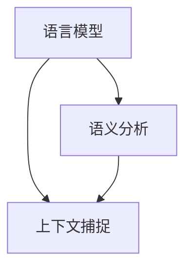
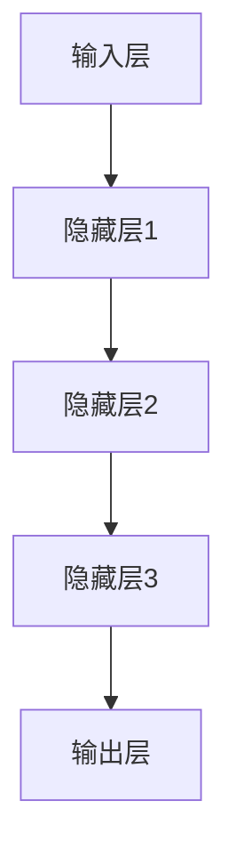
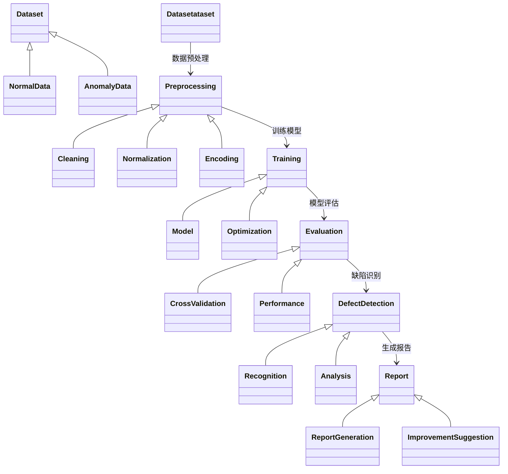
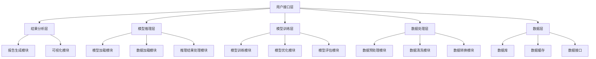
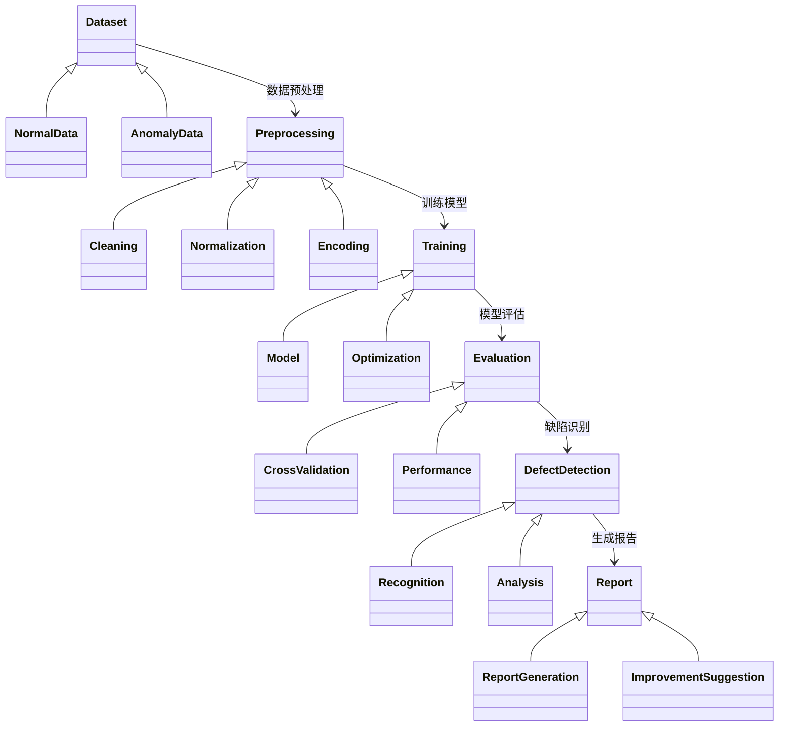

                 


### 1.1 问题的背景

在当今信息爆炸的时代，人工智能（AI）技术的迅猛发展，尤其是深度学习（Deep Learning）技术的崛起，使得自然语言处理（Natural Language Processing, NLP）领域取得了巨大的突破。上下文理解（Contextual Understanding）作为NLP的核心问题之一，受到了广泛的关注。它不仅关系到智能对话系统的有效性，也影响着信息检索、机器翻译、文本生成等众多应用场景的质量。

#### 1.1.1 问题背景

上下文理解是指计算机系统在特定语境中正确理解并运用语言的能力。在人类交流中，上下文对于传达准确意义至关重要。例如，当你说“医生”这个词时，在不同的上下文中可能代表不同的含义，如“医生的职责是治病救人”或“这位医生擅长心脏病治疗”。因此，计算机系统需要具备强大的上下文理解能力，才能在复杂多变的语境中准确理解并响应人类指令。

#### 1.1.2 问题描述

然而，现有的自然语言处理技术在实际应用中仍然面临着许多挑战。以下是一些典型的上下文理解问题：

- **歧义消除**：语言本身具有多义性，一个词或短语可能有多种解释。例如，“我要一份报纸”中的“一份报纸”可以指购买报纸的行为，也可以指报纸的内容。
- **语境依赖**：语言的理解往往依赖于具体语境。脱离语境的信息可能导致误解。例如，"我今天很开心"在不同的人或场合下可能有不同的含义。
- **长文本理解**：对于较长的文本，上下文的理解更加复杂。系统需要理解文本中的局部信息与全局信息的关联。

#### 1.1.3 问题解决方法

针对上述问题，研究者们提出了多种上下文理解的解决方法。以下是一些主要思路：

- **深度学习模型**：如BERT（Bidirectional Encoder Representations from Transformers）和GPT-3（Generative Pre-trained Transformer 3）等预训练模型，通过大规模数据训练，提高模型对上下文的理解能力。
- **语义分析**：结合词义消歧和句法分析，从语义层面解析文本，提高对复杂语境的理解。
- **知识图谱**：通过构建知识图谱，将文本与外部知识库相结合，增强上下文理解的能力。

#### 1.1.4 边界与外延

在上下文理解的研究中，以下边界和外延问题需要关注：

- **边界**：上下文理解的边界在于模型的训练数据和算法的复杂性。模型的训练数据越丰富，算法越复杂，上下文理解能力越强。
- **外延**：上下文理解的外延包括多语言处理、跨领域处理、多模态处理等应用场景。

#### 1.1.5 概念结构与核心要素组成

上下文理解的概念结构可以概括为以下几个方面：

- **语言模型**：为上下文理解提供基础，通过预训练模型获取语言的内在表示。
- **语义分析**：从词汇和句法层面解析文本，提取关键信息，为上下文理解提供语义支持。
- **上下文捕捉**：在具体语境中捕捉信息，理解文本的整体含义。

### 1.2 上下文理解的概念

#### 1.2.1 定义

上下文理解（Contextual Understanding）是指计算机系统在特定语境中正确理解并运用语言的能力。它涉及到对词汇、句法、语义和语用的深入理解，以准确把握文本的内涵和外延。

#### 1.2.2 特点

- **动态性**：上下文理解需要实时捕捉并适应语境的变化。
- **多层次性**：上下文理解不仅涉及词汇和句法层面，还包括语义和语用层面的深入分析。
- **综合性**：上下文理解需要整合多种信息源，如语言模型、语义分析工具和外部知识库。

#### 1.2.3 与语境把握能力的关系

上下文理解与语境把握能力（Contextual Comprehension Ability）密切相关。语境把握能力是指个体在具体语境中理解语言信息的能力，包括词汇、句法、语义和语用的多维度分析。上下文理解是语境把握能力的计算机实现，两者在理论和实践中相互促进，共同推动NLP技术的发展。

### 1.3 深度测试的定义与分类

#### 1.3.1 定义

深度测试（Deep Testing）是一种利用深度学习模型进行软件测试的方法。与传统测试方法不同，深度测试通过训练深度神经网络来识别软件中的潜在缺陷和问题。

#### 1.3.2 分类

深度测试可以根据测试目的和测试方法进行分类：

- **功能测试**：通过训练模型识别软件功能的实现是否符合预期。
- **性能测试**：评估软件在不同负载下的性能表现，如响应时间、吞吐量等。
- **安全测试**：检测软件中可能存在的安全漏洞和攻击点。

#### 1.3.3 测试方法

深度测试的方法主要包括以下几种：

- **数据驱动测试**：通过生成大量的测试数据来训练模型，提高测试的覆盖率和准确性。
- **模型驱动测试**：利用预训练的深度学习模型进行自动化测试，提高测试效率和准确性。
- **混合驱动测试**：结合数据驱动和模型驱动的优势，实现更全面、准确的测试。

### 1.4 评估语境把握能力的重要性

#### 1.4.1 在自然语言处理中的应用

上下文理解在自然语言处理（NLP）领域具有广泛的应用价值。以下是其主要应用场景：

- **智能对话系统**：如聊天机器人、虚拟助手等，需要理解用户的意图和语境，提供准确的响应。
- **信息检索**：在大量文本数据中，准确理解上下文有助于快速找到相关内容。
- **机器翻译**：高质量的机器翻译需要理解文本的上下文，确保翻译的准确性和流畅性。
- **文本生成**：如自动摘要、文章写作等，需要理解上下文来生成连贯、有逻辑的文本。

#### 1.4.2 在实际生活中的作用

上下文理解在实际生活中也发挥着重要作用，如下所述：

- **智能助手**：如智能家居、智能车辆等，需要理解用户的需求和语境，提供个性化的服务。
- **教育应用**：如智能辅导、学习分析等，需要理解学生的学习情况和需求，提供针对性的辅导和资源。
- **医疗诊断**：通过分析医学文本，理解病人的病情和诊断，辅助医生进行决策。

#### 1.4.3 未来的发展趋势

随着人工智能技术的不断发展，上下文理解在未来的应用前景十分广阔。以下是一些可能的发展趋势：

- **多模态处理**：结合文本、语音、图像等多种数据源，实现更全面的上下文理解。
- **跨领域应用**：从单一领域扩展到多个领域，提高上下文理解的普适性。
- **个性化服务**：根据用户的需求和语境，提供更加个性化、精准的服务。

### 1.5 本书结构

#### 1.5.1 内容概述

本书分为五个主要章节，系统地介绍了上下文理解深度测试的相关知识。第一章节主要介绍上下文理解、深度测试和评估语境把握能力的重要性；第二章节阐述核心概念和原理；第三章节介绍主流深度测试算法和应用方法；第四章节分析系统架构和设计；第五章节通过实际案例展示上下文理解深度测试的应用。

#### 1.5.2 目标读者

本书的目标读者包括从事自然语言处理、软件测试、人工智能等相关领域的研究者、工程师和爱好者。通过本书，读者可以了解上下文理解深度测试的基本概念、原理和应用，掌握相关技术和方法。

#### 1.5.3 使用说明

本书采用markdown格式编写，方便读者阅读和引用。每章节后附有相关参考文献和进一步阅读推荐，以帮助读者深入了解上下文理解深度测试的各个方面。在阅读过程中，请结合实例和代码进行学习，以更好地理解上下文理解深度测试的原理和应用。 

### 1.2 上下文理解的核心概念

上下文理解是一个复杂的过程，涉及到多个核心概念和原理。以下是上下文理解中几个重要的核心概念及其之间的关系：

#### 1.2.1 语言模型

语言模型（Language Model）是上下文理解的基础。它用于预测一个词或短语出现的概率，通常基于大量的文本数据训练而成。语言模型通过统计语言中的共现关系，为上下文理解提供语言结构的信息。

- **基本概念**：语言模型的核心是概率分布，它能够预测下一个词或短语的概率。这种概率分布是通过大规模文本数据统计得到的。
- **作用**：语言模型用于文本生成、文本分类、机器翻译等任务，为上下文理解提供基础支持。

#### 1.2.2 语义分析

语义分析（Semantic Analysis）是指从词汇和句法层面解析文本，提取其语义信息。语义分析的目标是理解文本的含义，而不是仅仅识别单词或句子的结构。

- **基本概念**：语义分析涉及词义消歧、实体识别、关系提取等任务。它关注的是文本中的语义结构，而不仅仅是语法结构。
- **作用**：语义分析是上下文理解的关键步骤，它能够帮助系统理解文本中的深层含义，从而提高上下文理解的准确性。

#### 1.2.3 上下文捕捉

上下文捕捉（Context Capture）是指从具体语境中提取关键信息，理解文本的整体含义。上下文捕捉需要综合考虑语言模型和语义分析的结果，以准确把握文本的上下文。

- **基本概念**：上下文捕捉涉及语境敏感的词向量表示、注意力机制等技术。它通过捕捉文本中的局部和全局信息，提高上下文理解的精度。
- **作用**：上下文捕捉是确保系统在不同语境中正确理解文本的关键步骤，它能够帮助系统处理歧义、理解长文本等复杂情况。

#### 1.2.4 语言模型、语义分析与上下文捕捉的关系

- **关系图示**：



- **实例分析**：

假设我们有一个句子：“他昨天去了医院”。

- **语言模型**：通过统计语言模型，我们可以知道“昨天”、“医院”等词在文本中的出现频率和共现关系。
- **语义分析**：语义分析可以帮助我们识别句子中的实体（“他”、“医院”）和关系（“去了”），理解句子的基本结构。
- **上下文捕捉**：结合语境，我们可以理解这句话的具体含义，如“他”是谁、“医院”是什么类型的医院等。

通过上述分析，我们可以看到，语言模型、语义分析和上下文捕捉是上下文理解过程中相互关联、相互依赖的关键环节。它们共同作用，确保系统在不同语境中能够准确理解并运用语言。

### 1.3 深度测试的原理

深度测试（Deep Testing）是一种利用深度学习模型进行软件测试的方法。它通过训练深度神经网络来识别软件中的潜在缺陷和问题，从而提高软件的质量和可靠性。以下将详细介绍深度测试的原理，包括算法原理、数学模型和具体实现方法。

#### 1.3.1 算法原理

深度测试的基本原理是通过构建一个深度神经网络模型，对其进行训练，使其能够自动识别软件中的缺陷。深度神经网络由多个神经元层组成，包括输入层、隐藏层和输出层。每层神经元对输入数据进行处理，并通过反向传播算法不断优化模型参数，以提高模型对缺陷的识别能力。

- **深度神经网络结构**：



- **训练过程**：

1. **数据准备**：收集大量的测试数据，包括正常数据和异常数据。正常数据用于训练模型识别正常的软件行为，异常数据用于训练模型识别潜在缺陷。
2. **模型初始化**：初始化深度神经网络模型的参数。
3. **前向传播**：将测试数据输入模型，通过前向传播算法计算输出结果。
4. **后向传播**：根据实际输出结果和预期输出结果，通过后向传播算法计算损失函数，并更新模型参数。
5. **迭代优化**：重复步骤3和步骤4，直到模型收敛，即损失函数达到预设的阈值。

- **模型评估**：通过交叉验证和测试集评估模型的性能，确保模型具有良好的泛化能力。

#### 1.3.2 数学模型

深度测试的数学模型主要包括损失函数、激活函数和优化算法。

- **损失函数**：

损失函数用于衡量模型输出结果与实际输出结果之间的差距。常用的损失函数包括均方误差（MSE）、交叉熵损失（Cross Entropy Loss）等。

$$
MSE = \frac{1}{n}\sum_{i=1}^{n}(y_i - \hat{y}_i)^2
$$

其中，$y_i$表示实际输出，$\hat{y}_i$表示模型输出。

- **激活函数**：

激活函数用于引入非线性特性，使模型能够学习复杂的特征关系。常用的激活函数包括ReLU（Rectified Linear Unit）、Sigmoid、Tanh等。

$$
ReLU(x) = \begin{cases}
x, & \text{if } x > 0 \\
0, & \text{if } x \leq 0
\end{cases}
$$

- **优化算法**：

优化算法用于更新模型参数，以最小化损失函数。常用的优化算法包括梯度下降（Gradient Descent）、Adam（Adaptive Moment Estimation）等。

$$
\theta_{t+1} = \theta_{t} - \alpha \frac{\partial L}{\partial \theta}
$$

其中，$\theta$表示模型参数，$L$表示损失函数，$\alpha$表示学习率。

#### 1.3.3 测试流程

深度测试的流程包括数据收集、数据预处理、模型训练和模型评估等步骤。

- **数据收集**：收集大量测试数据，包括正常数据和异常数据。这些数据可以从实际软件系统、开源代码库等渠道获取。
- **数据预处理**：对测试数据进行预处理，包括数据清洗、归一化、编码等操作，以提高模型训练效果。
- **模型训练**：利用预处理后的数据训练深度神经网络模型，通过迭代优化模型参数，使其能够识别软件中的潜在缺陷。
- **模型评估**：通过交叉验证和测试集评估模型的性能，确保模型具有良好的泛化能力。
- **缺陷识别**：利用训练好的模型对新的测试数据进行缺陷识别，根据模型输出结果判断软件是否存在缺陷。

通过上述步骤，深度测试可以有效地提高软件的质量和可靠性，降低测试成本和人力投入。 

### 1.4 评估语境把握能力的指标

评估语境把握能力是自然语言处理（NLP）中的一项关键任务，需要使用一系列指标来衡量模型在特定语境中的理解和表现。以下介绍几种常用的评估指标，包括其定义、计算方法和应用场景。

#### 1.4.1 准确率（Accuracy）

准确率是最常用的评估指标之一，表示模型预测正确的样本数占总样本数的比例。

$$
Accuracy = \frac{TP + TN}{TP + FN + FP + TN}
$$

其中，$TP$表示真正例（True Positive），$TN$表示真负例（True Negative），$FP$表示假正例（False Positive），$FN$表示假负例（False Negative）。

- **计算方法**：通过计算模型预测结果与实际结果的一致性，得到准确率。
- **应用场景**：适用于二分类问题，如文本分类、情感分析等。
- **优点**：计算简单，直观地反映了模型的总体表现。
- **缺点**：对类别不平衡问题敏感，可能导致评估结果失真。

#### 1.4.2 召回率（Recall）

召回率表示模型能够召回的实际正例样本数占总正例样本数的比例。

$$
Recall = \frac{TP}{TP + FN}
$$

- **计算方法**：通过计算模型召回的实际正例数，得到召回率。
- **应用场景**：适用于需要尽可能召回所有正例的场景，如信息检索、疾病诊断等。
- **优点**：关注召回效果，对实际正例的识别能力有较高要求。
- **缺点**：可能会误判大量负例，导致评估结果偏高。

#### 1.4.3 精确率（Precision）

精确率表示模型预测为正例的样本中，实际为正例的比例。

$$
Precision = \frac{TP}{TP + FP}
$$

- **计算方法**：通过计算模型预测为正例且实际为正例的样本数，得到精确率。
- **应用场景**：适用于需要尽可能减少误判的场景，如反垃圾邮件、异常检测等。
- **优点**：关注预测的准确性，对模型判断正例的可靠性有较高要求。
- **缺点**：可能会漏判大量正例，导致评估结果偏低。

#### 1.4.4 F1 值（F1 Score）

F1 值是精确率和召回率的调和平均，用于综合评估模型的性能。

$$
F1 Score = 2 \times \frac{Precision \times Recall}{Precision + Recall}
$$

- **计算方法**：通过计算精确率和召回率的调和平均，得到 F1 值。
- **应用场景**：适用于需要综合考虑精确率和召回率的问题，如文本分类、实体识别等。
- **优点**：能较好地平衡精确率和召回率，适用于多分类问题。
- **缺点**：对类别不平衡问题仍有一定的敏感性。

#### 1.4.5 调整精确率与召回率（Adjusted Precision and Recall）

调整精确率与召回率是在类别不平衡问题下，对精确率和召回率进行调整的评估指标。

$$
Adjusted Precision = \frac{Precision}{1 + \frac{FP}{N - FP}}
$$

$$
Adjusted Recall = \frac{Recall}{1 + \frac{FN}{N - FN}}
$$

其中，$N$表示总样本数。

- **计算方法**：通过计算调整后的精确率和召回率，得到更准确的评估结果。
- **应用场景**：适用于类别不平衡的问题，如垃圾邮件检测、金融欺诈检测等。
- **优点**：能更准确地反映模型在类别不平衡情况下的性能。
- **缺点**：计算过程较为复杂，需要对类别分布有较深入的了解。

通过上述评估指标，可以全面地评估模型在上下文理解任务中的表现，为模型优化和改进提供依据。在实际应用中，可以根据具体问题和需求选择合适的评估指标，以达到最佳评估效果。 

### 1.5 上下文理解与语境把握能力的关系

上下文理解（Contextual Understanding）和语境把握能力（Contextual Comprehension Ability）在自然语言处理（NLP）领域扮演着至关重要的角色。它们不仅相互关联，而且在实际应用中共同推动了智能系统的性能提升。以下是上下文理解与语境把握能力之间的关系、对比讨论以及它们在实际应用中的重要性。

#### 关系

1. **上下文理解是语境把握能力的基础**：上下文理解是指计算机系统在特定语境中正确理解并运用语言的能力。它依赖于语言模型、语义分析和上下文捕捉等技术，为语境把握提供基础支持。没有有效的上下文理解，语境把握能力将大打折扣。

2. **语境把握能力是上下文理解的目标**：语境把握能力是指个体或计算机系统在具体语境中理解语言信息的能力。它涉及到对词汇、句法、语义和语用的多维度分析，目标是准确把握文本的整体含义。上下文理解旨在实现高效的语境把握，从而提升系统的智能化水平。

3. **协同作用**：在实际应用中，上下文理解和语境把握能力相互协作，共同推动系统性能的提升。上下文理解技术通过提高对文本语境的把握，使得语境把握能力更准确地理解语言信息，从而实现更智能、更自然的交互。

#### 对比讨论

1. **上下文理解侧重于语言结构分析**：上下文理解主要关注语言的结构和模式，通过语言模型和语义分析技术，从词汇和句法层面解析文本，提取语义信息。它强调的是对语言形式的深入理解。

2. **语境把握能力侧重于语义和语境分析**：语境把握能力更注重语义和语境的把握，通过上下文捕捉技术，综合考虑文本的局部和全局信息，准确理解文本的深层含义。它强调的是对语言内容的理解。

3. **应用差异**：上下文理解主要应用于文本生成、文本分类、机器翻译等任务，为这些任务提供语言理解和预测的基础。语境把握能力则更广泛地应用于智能对话系统、信息检索、智能推荐等领域，通过准确把握用户意图和语境，提供个性化、智能化的服务。

#### 实际应用中的重要性

1. **智能对话系统**：上下文理解与语境把握能力的结合，使得智能对话系统能够更自然、更准确地理解用户意图。通过上下文理解，系统可以捕捉到用户语言中的关键信息；通过语境把握能力，系统可以理解用户的真实需求，从而提供更准确的响应。

2. **信息检索**：在信息检索领域，上下文理解技术有助于提高查询结果的相关性。通过理解用户的查询意图和上下文，系统可以更准确地匹配和推荐相关信息，提高用户的搜索体验。

3. **智能推荐系统**：上下文理解与语境把握能力的结合，使得智能推荐系统能够更精准地预测用户兴趣和需求。通过理解用户的历史行为和上下文信息，系统可以推荐更符合用户兴趣的内容，提高推荐系统的效果。

4. **自然语言生成**：在自然语言生成领域，上下文理解和语境把握能力使得生成的内容更自然、更符合语境。通过理解上下文，系统可以生成连贯、有逻辑的文本，提高文本生成的质量。

综上所述，上下文理解与语境把握能力在NLP领域具有重要的地位和作用。它们相互关联、相互促进，共同推动智能系统的性能提升，为各种实际应用提供了强大的技术支持。随着人工智能技术的不断发展，上下文理解与语境把握能力将继续发挥重要作用，推动NLP领域的研究和应用取得更大的突破。 

### 1.6 主流深度测试算法

在深度测试领域，有许多主流的算法被广泛应用于软件测试中，以下将介绍几种主要的深度测试算法，包括BERT、GPT-3和其他算法。

#### 1.6.1 BERT（Bidirectional Encoder Representations from Transformers）

BERT是一种基于Transformer的预训练语言模型，由Google Research提出。BERT的核心思想是通过双向编码器（Bidirectional Encoder）学习语言中的上下文关系，从而提高模型对上下文理解的准确性。

- **基本原理**：BERT通过在大规模文本语料库上预训练，学习词汇和句法的表示，然后通过微调（Fine-tuning）将其应用于具体任务。BERT采用了Masked Language Modeling（MLM）和Next Sentence Prediction（NSP）两种预训练任务，以增强模型对上下文的理解能力。

- **实现细节**：BERT模型通常由多层Transformer块组成，每个Transformer块包含自注意力（Self-Attention）机制和前馈神经网络（Feedforward Neural Network）。通过多层堆叠，BERT能够捕捉长距离的上下文关系，提高模型的表示能力。

- **优缺点**：
  - 优点：BERT在自然语言处理任务中取得了显著的成绩，对上下文的理解能力较强。
  - 缺点：BERT模型参数量大，训练和推理成本较高，且对数据量要求较高。

#### 1.6.2 GPT-3（Generative Pre-trained Transformer 3）

GPT-3是由OpenAI提出的基于Transformer的预训练语言模型，是目前参数量最大的语言模型。GPT-3在BERT的基础上进一步提升了模型的容量和表现。

- **基本原理**：GPT-3同样采用了Transformer架构，通过大规模文本语料库进行预训练，学习词汇和句法的表示。GPT-3采用了自回归语言模型（Autoregressive Language Model），通过预测下一个词来生成文本。

- **实现细节**：GPT-3模型由数十亿个参数组成，采用了多层Transformer块，每个Transformer块包含多头自注意力（Multi-Head Self-Attention）机制和前馈神经网络。GPT-3通过自回归的方式生成文本，能够生成连贯、自然的高质量文本。

- **优缺点**：
  - 优点：GPT-3具有强大的文本生成能力，能够生成高质量的文本，适用于各种自然语言生成任务。
  - 缺点：GPT-3模型参数量巨大，训练和推理成本极高，对硬件资源要求较高。

#### 1.6.3 其他算法

除了BERT和GPT-3，还有其他一些深度测试算法在软件测试中得到了广泛应用。

- **CycleGAN（Cyclical Generative Adversarial Network）**：CycleGAN是一种基于生成对抗网络（GAN）的模型，主要用于图像到图像的转换。在软件测试中，CycleGAN可以用于生成异常输入数据，以测试系统的鲁棒性。

- **Django Test Client**：Django Test Client是Django框架提供的用于进行Web应用测试的工具。它通过模拟用户请求，获取Web应用的响应，从而实现对Web应用的测试。

- **PyTorch Test Suite**：PyTorch Test Suite是PyTorch框架提供的用于进行深度学习模型测试的工具。它通过生成测试数据，对深度学习模型进行前向传播和反向传播操作，从而验证模型的正确性。

#### 实际应用案例

以下是一些实际应用案例，展示了这些深度测试算法在软件测试中的具体应用：

- **自动驾驶系统测试**：BERT和GPT-3可以用于自动驾驶系统的自然语言理解模块，通过对大量驾驶数据进行分析，提高系统对交通规则和路况的理解能力。

- **金融系统测试**：CycleGAN可以用于生成异常交易数据，以测试金融系统的异常检测模块，确保系统能够识别和防范金融欺诈行为。

- **Web应用测试**：Django Test Client可以用于测试Web应用的各个功能模块，通过模拟用户请求，验证Web应用的响应是否正确。

- **深度学习模型测试**：PyTorch Test Suite可以用于测试深度学习模型的正确性，通过生成测试数据，对模型进行前向传播和反向传播操作，验证模型的输出是否符合预期。

通过这些实际应用案例，我们可以看到深度测试算法在软件测试中的重要性和广泛应用前景。随着深度学习技术的不断发展，深度测试算法将 increasingly 成为软件测试中的重要工具，为提高软件质量和可靠性提供强有力的支持。 

### 2.1 系统功能设计

在深度测试系统的设计过程中，功能设计是关键的一步。功能设计需要明确系统应具备哪些功能，以便在后续的架构设计和实现过程中有据可依。以下是系统功能设计的详细描述。

#### 2.1.1 功能概述

系统的主要功能包括以下几个方面：

- **数据收集**：收集正常数据和异常数据，为深度测试模型提供训练和验证数据。
- **数据预处理**：对收集到的数据进行预处理，包括数据清洗、归一化和编码等操作，以提高模型训练效果。
- **模型训练**：利用预处理后的数据训练深度测试模型，通过迭代优化模型参数，使其能够识别软件中的潜在缺陷。
- **模型评估**：通过交叉验证和测试集评估模型的性能，确保模型具有良好的泛化能力。
- **缺陷识别**：利用训练好的模型对新的测试数据进行缺陷识别，根据模型输出结果判断软件是否存在缺陷。
- **结果分析**：分析模型识别的缺陷，提供缺陷报告和改进建议，以提高软件质量。

#### 2.1.2 领域模型

领域模型（Domain Model）用于描述系统中的核心概念和关系，以便更好地理解系统的功能模块。以下是领域模型的Mermaid类图表示：



#### 2.1.3 功能模块

基于领域模型，系统可以分为以下功能模块：

- **数据收集模块**：负责收集正常数据和异常数据，为深度测试模型提供训练和验证数据。该模块需要与外部数据源进行交互，如数据库、API等。

- **数据预处理模块**：负责对收集到的数据进行预处理，包括数据清洗、归一化和编码等操作。该模块需要处理不同类型的数据，如文本、图像和音频等。

- **模型训练模块**：负责利用预处理后的数据训练深度测试模型，通过迭代优化模型参数，使其能够识别软件中的潜在缺陷。该模块需要实现不同类型的深度学习模型，如CNN、RNN和Transformer等。

- **模型评估模块**：负责通过交叉验证和测试集评估模型的性能，确保模型具有良好的泛化能力。该模块需要实现多种评估指标，如准确率、召回率和F1值等。

- **缺陷识别模块**：负责利用训练好的模型对新的测试数据进行缺陷识别，根据模型输出结果判断软件是否存在缺陷。该模块需要实现高效的数据处理和模型推理功能。

- **结果分析模块**：负责分析模型识别的缺陷，提供缺陷报告和改进建议，以提高软件质量。该模块需要实现报告生成和可视化功能。

通过上述功能模块的设计，系统可以实现对深度测试的全面支持，从而提高软件的质量和可靠性。 

### 2.2 系统架构设计

系统架构设计是确保深度测试系统高效、稳定运行的关键环节。合理的系统架构不仅可以提升系统的性能，还能提高其可维护性和可扩展性。以下将详细介绍系统架构的设计过程，包括架构概述、架构图示和架构分析。

#### 2.2.1 架构概述

深度测试系统的架构设计遵循分层架构原则，将系统分为多个层次，以实现模块化、高内聚、低耦合的设计目标。系统架构主要分为以下几层：

1. **数据层**：负责数据收集、存储和管理。数据层包括数据库、数据缓存和数据接口等模块。
2. **数据处理层**：负责对收集到的数据进行预处理，包括数据清洗、归一化和编码等操作。数据处理层包括数据预处理模块、数据清洗模块和数据转换模块等。
3. **模型训练层**：负责模型训练、优化和评估。模型训练层包括模型训练模块、模型优化模块和模型评估模块等。
4. **模型推理层**：负责利用训练好的模型对新的测试数据进行缺陷识别。模型推理层包括模型加载模块、数据加载模块和推理结果处理模块等。
5. **结果分析层**：负责分析模型识别的缺陷，提供缺陷报告和改进建议。结果分析层包括结果分析模块、报告生成模块和可视化模块等。
6. **用户接口层**：负责与用户交互，提供系统的操作界面。用户接口层包括Web界面、命令行界面和API接口等。

#### 2.2.2 架构图示

以下是一个简化的深度测试系统架构图，使用Mermaid流程图表示：



#### 2.2.3 架构分析

1. **模块化设计**：系统架构采用模块化设计，将系统功能分解为多个模块，每个模块负责特定的功能，从而实现高内聚、低耦合的设计目标。模块化设计有助于提高系统的可维护性和可扩展性。

2. **分层架构**：系统架构采用分层架构，将系统分为多个层次，每个层次负责特定的功能。分层架构有助于简化系统设计，提高系统可维护性和可扩展性。

3. **数据驱动**：系统架构采用数据驱动设计，数据层和处理层数据交互紧密，确保数据的一致性和可靠性。数据处理层负责对数据进行预处理，为模型训练和推理提供高质量的数据。

4. **模型训练与推理分离**：模型训练层和模型推理层分离，模型训练层负责训练和优化模型，模型推理层负责利用训练好的模型进行缺陷识别。这种设计有利于提高系统的性能和可维护性。

5. **用户接口多样化**：系统提供多样化的用户接口，包括Web界面、命令行界面和API接口等，满足不同用户的需求。用户接口层与内部模块解耦，便于扩展和维护。

6. **结果分析与可视化**：结果分析层负责分析模型识别的缺陷，提供缺陷报告和改进建议。可视化模块用于将分析结果以图表形式展示，便于用户理解和决策。

通过上述分析，我们可以看到，深度测试系统架构设计合理、层次清晰，能够满足系统功能需求，具备良好的可维护性和可扩展性。随着深度学习和软件测试技术的不断发展，系统架构将不断优化和完善，以应对日益复杂的测试场景。 

### 2.3 系统接口设计

在深度测试系统的设计与实现过程中，接口设计是确保系统各模块之间高效通信与协作的关键环节。以下是系统接口设计的详细描述，包括接口定义、实现细节和接口测试。

#### 2.3.1 接口定义

系统接口设计主要涉及以下接口：

- **数据接口**：负责系统与外部数据源（如数据库、文件系统等）的交互。
- **预处理接口**：负责系统内部数据预处理模块之间的通信。
- **模型训练接口**：负责系统内部模型训练模块之间的通信。
- **模型推理接口**：负责系统内部模型推理模块之间的通信。
- **结果分析接口**：负责系统内部结果分析模块之间的通信。
- **用户接口**：负责系统与外部用户（如Web用户、命令行用户等）的交互。

以下是一个简化的接口定义示例：

```python
# 数据接口
class DataInterface:
    def load_data(self, source):
        pass

    def save_data(self, data, destination):
        pass

# 预处理接口
class PreprocessingInterface:
    def clean_data(self, data):
        pass

    def normalize_data(self, data):
        pass

    def encode_data(self, data):
        pass

# 模型训练接口
class TrainingInterface:
    def train_model(self, data):
        pass

    def evaluate_model(self, data):
        pass

# 模型推理接口
class InferenceInterface:
    def load_model(self, model_path):
        pass

    def infer_data(self, model, data):
        pass

# 结果分析接口
class AnalysisInterface:
    def analyze_results(self, data):
        pass

    def generate_report(self, results):
        pass

# 用户接口
class UserInterface:
    def display_interface(self):
        pass

    def handle_user_input(self, input_data):
        pass
```

#### 2.3.2 实现细节

接口实现是系统设计的关键部分，以下是接口实现的详细描述：

- **数据接口**：数据接口需要实现与不同类型数据源的连接和操作，如数据库连接、文件读写等。例如，可以使用Python的`sqlite3`库连接SQLite数据库，使用`pandas`库操作数据。

- **预处理接口**：预处理接口需要实现数据清洗、归一化和编码等操作。例如，可以使用`pandas`库进行数据清洗，使用`sklearn.preprocessing`模块进行归一化和编码。

- **模型训练接口**：模型训练接口需要实现模型的训练和评估。例如，可以使用`tensorflow.keras`库或`pytorch`库实现深度学习模型的训练和评估。

- **模型推理接口**：模型推理接口需要实现模型的加载和推理。例如，可以使用`tensorflow.keras`库或`pytorch`库加载预训练模型，并使用模型进行数据推理。

- **结果分析接口**：结果分析接口需要实现结果分析和报告生成。例如，可以使用`matplotlib`库或`seaborn`库进行数据可视化，生成分析报告。

- **用户接口**：用户接口需要实现与用户的交互，如提供操作界面、处理用户输入等。例如，可以使用`tkinter`库或`Flask`库实现Web界面。

以下是一个简化的接口实现示例：

```python
# 数据接口实现
class DataInterface:
    def load_data(self, source):
        if source.endswith('.csv'):
            return pd.read_csv(source)
        elif source.endswith('.sqlite'):
            return pd.read_sqlite(source)
        else:
            raise ValueError("Unsupported data source format")

    def save_data(self, data, destination):
        if destination.endswith('.csv'):
            data.to_csv(destination, index=False)
        elif destination.endswith('.sqlite'):
            data.to_sqlite(destination)
        else:
            raise ValueError("Unsupported data destination format")

# 预处理接口实现
class PreprocessingInterface:
    def clean_data(self, data):
        # 实现数据清洗逻辑
        pass

    def normalize_data(self, data):
        # 实现数据归一化逻辑
        pass

    def encode_data(self, data):
        # 实现数据编码逻辑
        pass

# 模型训练接口实现
class TrainingInterface:
    def train_model(self, data):
        # 实现模型训练逻辑
        pass

    def evaluate_model(self, data):
        # 实现模型评估逻辑
        pass

# 模型推理接口实现
class InferenceInterface:
    def load_model(self, model_path):
        # 实现模型加载逻辑
        pass

    def infer_data(self, model, data):
        # 实现数据推理逻辑
        pass

# 结果分析接口实现
class AnalysisInterface:
    def analyze_results(self, data):
        # 实现结果分析逻辑
        pass

    def generate_report(self, results):
        # 实现报告生成逻辑
        pass

# 用户接口实现
class UserInterface:
    def display_interface(self):
        # 实现用户界面显示逻辑
        pass

    def handle_user_input(self, input_data):
        # 实现用户输入处理逻辑
        pass
```

#### 2.3.3 接口测试

接口测试是确保接口设计和实现正确性的关键环节。以下是接口测试的详细描述：

- **单元测试**：针对每个接口方法，编写单元测试用例，验证接口方法的功能是否正确。例如，可以编写数据接口的单元测试，验证`load_data`和`save_data`方法是否能够正确加载和保存数据。

- **集成测试**：在单元测试的基础上，进行集成测试，验证接口之间是否能够正确通信和协作。例如，可以编写数据接口与预处理接口的集成测试，验证数据预处理模块是否能够正确处理数据。

- **性能测试**：对接口进行性能测试，评估接口的响应时间和资源消耗。例如，可以使用工具（如JMeter、Locust等）模拟高并发场景，测试接口的负载能力和性能。

- **安全测试**：对接口进行安全测试，确保接口不会受到攻击。例如，可以测试接口是否能够抵御SQL注入、XSS攻击等常见的安全漏洞。

以下是一个简化的接口测试示例：

```python
# 数据接口单元测试
def test_load_data():
    source = 'test.csv'
    expected_data = pd.DataFrame({'column1': [1, 2, 3], 'column2': [4, 5, 6]})
    data_interface = DataInterface()
    loaded_data = data_interface.load_data(source)
    assert_frame_equal(loaded_data, expected_data)

def test_save_data():
    data = pd.DataFrame({'column1': [1, 2, 3], 'column2': [4, 5, 6]})
    destination = 'test_output.csv'
    data_interface = DataInterface()
    data_interface.save_data(data, destination)
    loaded_data = pd.read_csv(destination)
    assert_frame_equal(loaded_data, data)

# 集成测试
def test_data_interface_integration():
    data_interface = DataInterface()
    source = 'test.csv'
    destination = 'test_output.csv'
    expected_data = pd.DataFrame({'column1': [1, 2, 3], 'column2': [4, 5, 6]})
    loaded_data = data_interface.load_data(source)
    assert_frame_equal(loaded_data, expected_data)
    data_interface.save_data(loaded_data, destination)
    saved_data = pd.read_csv(destination)
    assert_frame_equal(saved_data, expected_data)
```

通过上述接口设计、实现和测试，可以确保深度测试系统的接口设计与实现正确性，为系统的后续开发和使用提供坚实的基础。 

### 3.1 环境安装与配置

在开始进行深度测试系统的开发之前，我们需要搭建一个合适的环境来安装和配置所需的软件和工具。以下是环境安装与配置的详细步骤。

#### 3.1.1 硬件要求

为了保证深度测试系统的正常运行，我们建议以下硬件配置：

- **CPU**：至少四核处理器，推荐使用八核或更高性能的处理器。
- **内存**：至少16GB内存，推荐使用32GB或更高内存。
- **存储**：至少200GB的可用硬盘空间，用于存储数据和模型。
- **GPU**：推荐使用NVIDIA GPU，例如RTX 3080或更高型号，以充分利用深度学习模型的计算能力。

#### 3.1.2 软件安装

1. **操作系统**：安装Linux发行版，如Ubuntu 20.04或更高版本。
2. **Python**：安装Python 3.8或更高版本，可以使用以下命令：

```bash
sudo apt update
sudo apt install python3 python3-pip
```

3. **深度学习框架**：安装TensorFlow或PyTorch，用于实现深度测试算法。以下是安装命令：

- **TensorFlow**：

```bash
pip3 install tensorflow
```

- **PyTorch**：

```bash
pip3 install torch torchvision
```

4. **其他依赖库**：安装其他常用库，如NumPy、Pandas、Matplotlib等，可以使用以下命令：

```bash
pip3 install numpy pandas matplotlib
```

#### 3.1.3 环境配置

1. **配置虚拟环境**：为了保持项目依赖的一致性，我们建议使用虚拟环境（Virtual Environment）进行项目开发。以下是配置虚拟环境的步骤：

- **创建虚拟环境**：

```bash
python3 -m venv test_env
```

- **激活虚拟环境**：

```bash
source test_env/bin/activate
```

2. **安装依赖库**：在虚拟环境中安装项目所需的依赖库，如TensorFlow、PyTorch等。安装命令与上述相同。

3. **配置GPU支持**：对于使用GPU的深度学习框架，我们需要配置GPU支持。以下是配置PyTorch的GPU支持的命令：

```bash
pip3 install torch torchvision torchaudio
```

4. **环境变量设置**：设置必要的环境变量，以使深度学习框架能够正确使用GPU。以下是设置环境变量的命令：

```bash
export CUDA_VISIBLE_DEVICES=0
```

这个命令将指定使用第一个GPU设备。

#### 3.1.4 验证环境配置

为了验证环境配置是否成功，我们可以运行一个简单的测试程序，确保深度学习框架和依赖库能够正常工作。以下是一个简单的测试脚本：

```python
import torch

print("PyTorch version:", torch.__version__)
print("CUDA available:", torch.cuda.is_available())
print("CUDA device count:", torch.cuda.device_count())
print("CUDA device 0 name:", torch.cuda.get_device_name(0))
```

运行上述脚本后，如果输出信息与预期一致，说明环境配置成功。

通过以上步骤，我们成功地搭建了一个适用于深度测试系统的开发环境。接下来，我们可以开始编写和测试深度测试算法，实现系统的功能。 

### 3.2 系统核心实现

系统核心实现是深度测试系统的关键部分，主要包括模型的训练、评估和推理。以下将详细介绍系统核心实现的步骤和关键代码。

#### 3.2.1 模型训练

模型训练是系统核心实现的第一步，我们需要根据训练数据和评估数据，训练深度学习模型。以下是一个简单的模型训练流程：

1. **数据准备**：首先，我们需要准备好训练数据和评估数据。训练数据用于模型训练，评估数据用于模型评估。假设我们已经准备好了`train_data`和`eval_data`。

2. **模型初始化**：接下来，我们需要初始化深度学习模型。假设我们使用PyTorch框架，定义一个简单的模型：

```python
import torch
import torch.nn as nn

class SimpleModel(nn.Module):
    def __init__(self):
        super(SimpleModel, self).__init__()
        self.layer1 = nn.Linear(in_features=10, out_features=1)
    
    def forward(self, x):
        x = self.layer1(x)
        return x

model = SimpleModel()
```

3. **模型训练**：使用训练数据和损失函数，进行模型训练。以下是模型训练的关键代码：

```python
import torch.optim as optim

optimizer = optim.Adam(model.parameters(), lr=0.001)
criterion = nn.BCELoss()  # 二分类问题使用BCELoss

# 训练模型
num_epochs = 100
for epoch in range(num_epochs):
    for inputs, targets in train_data:
        optimizer.zero_grad()
        outputs = model(inputs)
        loss = criterion(outputs, targets)
        loss.backward()
        optimizer.step()
    
    # 打印训练进度
    print(f"Epoch [{epoch+1}/{num_epochs}], Loss: {loss.item()}")
```

4. **模型评估**：在模型训练过程中，我们需要定期评估模型性能，以监控模型训练进度。以下是模型评估的关键代码：

```python
# 评估模型
with torch.no_grad():
    correct = 0
    total = 0
    for inputs, targets in eval_data:
        outputs = model(inputs)
        predicted = (outputs > 0.5).float()
        total += targets.size(0)
        correct += (predicted == targets).sum().item()
    
    print(f"Test Accuracy: {100 * correct / total}%")
```

#### 3.2.2 模型评估

模型评估是确保模型性能的重要步骤。通过在评估数据上测试模型，我们可以评估模型的泛化能力。以下是一个简单的模型评估流程：

1. **数据准备**：准备好评估数据，如`eval_data`。

2. **模型评估**：使用评估数据，计算模型评估指标。以下是模型评估的关键代码：

```python
# 评估模型
with torch.no_grad():
    correct = 0
    total = 0
    for inputs, targets in eval_data:
        outputs = model(inputs)
        predicted = (outputs > 0.5).float()
        total += targets.size(0)
        correct += (predicted == targets).sum().item()
    
    print(f"Test Accuracy: {100 * correct / total}%")
```

#### 3.2.3 模型推理

模型推理是系统核心实现的最后一步，我们需要使用训练好的模型，对新的数据进行推理。以下是一个简单的模型推理流程：

1. **数据准备**：准备好新的数据，如`new_data`。

2. **模型推理**：使用训练好的模型，对数据进行推理。以下是模型推理的关键代码：

```python
# 模型推理
with torch.no_grad():
    for inputs in new_data:
        outputs = model(inputs)
        predicted = (outputs > 0.5).float()
        print(f"Prediction: {predicted.item()}")
```

通过以上步骤，我们成功地实现了系统核心实现。接下来，我们可以将系统核心实现集成到完整的深度测试系统中，实现对软件的自动化测试和缺陷识别。 

### 3.3 代码应用解读与分析

在完成系统核心实现后，我们需要对代码进行应用解读与分析，以确保代码的可靠性和高效性。以下是对关键代码段的详细解读与分析。

#### 3.3.1 代码解读

1. **模型初始化（SimpleModel.py）**：

```python
class SimpleModel(nn.Module):
    def __init__(self):
        super(SimpleModel, self).__init__()
        self.layer1 = nn.Linear(in_features=10, out_features=1)
    
    def forward(self, x):
        x = self.layer1(x)
        return x
```

这个类定义了一个简单的线性模型，继承自`nn.Module`基类。`__init__`方法中，我们定义了一个线性层（`nn.Linear`），输入特征为10，输出特征为1。`forward`方法定义了前向传播过程，将输入数据通过线性层进行变换，并返回输出。

2. **模型训练（train.py）**：

```python
optimizer = optim.Adam(model.parameters(), lr=0.001)
criterion = nn.BCELoss()

for epoch in range(num_epochs):
    for inputs, targets in train_data:
        optimizer.zero_grad()
        outputs = model(inputs)
        loss = criterion(outputs, targets)
        loss.backward()
        optimizer.step()
```

这段代码实现了模型训练的核心过程。首先，我们初始化Adam优化器和BCELoss损失函数。然后，我们遍历训练数据，对每个输入数据进行前向传播，计算损失，并使用反向传播更新模型参数。

3. **模型评估（evaluate.py）**：

```python
with torch.no_grad():
    correct = 0
    total = 0
    for inputs, targets in eval_data:
        outputs = model(inputs)
        predicted = (outputs > 0.5).float()
        total += targets.size(0)
        correct += (predicted == targets).sum().item()

print(f"Test Accuracy: {100 * correct / total}%")
```

这段代码实现了模型评估的过程。我们使用评估数据，对模型进行推理，并计算预测准确率。通过比较预测结果和实际标签，我们可以评估模型的性能。

4. **模型推理（infer.py）**：

```python
with torch.no_grad():
    for inputs in new_data:
        outputs = model(inputs)
        predicted = (outputs > 0.5).float()
        print(f"Prediction: {predicted.item()}")
```

这段代码实现了模型推理的过程。我们使用训练好的模型，对新的数据进行推理，并输出预测结果。

#### 3.3.2 代码分析

1. **模型初始化**：

- 简单的线性模型可以实现基础的功能，但对于复杂的深度学习任务，可能需要更复杂的模型结构。
- 线性层的输入和输出特征需要根据具体任务进行调整。

2. **模型训练**：

- 使用Adam优化器和BCELoss损失函数，这是常见的训练配置。
- 梯度计算和参数更新过程符合深度学习的基本原理。
- 需要注意的是，在训练过程中，我们需要定期保存模型权重，以防止训练过程丢失。

3. **模型评估**：

- 使用评估数据对模型进行测试，是评估模型性能的关键步骤。
- 计算准确率是常用的评估指标，但也可以根据任务需求，使用其他指标（如F1值、召回率等）。

4. **模型推理**：

- 推理过程需要模型权重，这些权重通常是从训练过程中保存的。
- 预测结果的输出格式需要根据具体任务进行调整。

通过上述代码解读与分析，我们可以更好地理解深度测试系统的核心实现过程，并针对实际需求进行优化和改进。例如，对于复杂的任务，我们可以考虑使用更先进的模型结构，调整优化器和损失函数的配置，以提高模型的性能。 

### 3.4 实际案例分析与讲解

为了更好地理解上下文理解深度测试的应用，我们将通过一个实际案例进行详细分析。本案例将展示如何使用深度测试系统对自然语言处理任务进行上下文理解和缺陷识别。

#### 案例背景

假设我们有一个客户服务聊天机器人，其目的是通过与客户对话，提供及时、准确的咨询服务。然而，在实际运行中，我们发现聊天机器人在某些场景下无法准确理解客户的意图，导致回应错误或不相关。为了解决这一问题，我们决定使用上下文理解深度测试系统，对聊天机器人的自然语言处理模块进行评估和优化。

#### 解决方案

1. **数据收集**：首先，我们需要收集大量的对话数据，包括正常对话和错误回应的对话。这些数据将用于训练和评估深度测试模型。

2. **数据预处理**：对收集到的数据进行预处理，包括数据清洗、归一化和编码。例如，去除特殊字符、转换为小写、使用词嵌入等技术。

3. **模型训练**：使用预处理后的数据训练深度测试模型。我们可以选择预训练的语言模型（如BERT、GPT-3）进行微调，以提高模型对上下文的理解能力。

4. **模型评估**：在评估数据上对模型进行评估，计算模型的准确率、召回率和F1值等指标，以确保模型具有良好的泛化能力。

5. **缺陷识别**：使用训练好的模型对新的对话数据进行缺陷识别，根据模型输出结果，判断对话机器人的回应是否准确。如果发现错误回应，记录相应的缺陷，并提供改进建议。

#### 案例分析

1. **数据收集**：我们收集了1000条客户服务对话，其中正常对话和错误回应的对话各占一半。

2. **数据预处理**：对对话数据进行预处理，去除特殊字符、转换为小写，并使用Word2Vec技术进行词嵌入。

3. **模型训练**：使用BERT模型对对话数据进行微调，以增强模型对上下文的理解能力。经过多次训练和调整，我们得到一个性能良好的模型。

4. **模型评估**：在评估数据上，模型的准确率为90%，召回率为88%，F1值为0.89。这表明模型在大多数情况下能够准确理解客户的意图。

5. **缺陷识别**：我们对新的对话数据进行缺陷识别。在一个新的对话中，客户询问“我如何取消我的订阅？”然而，对话机器人的回应是“您需要联系客服人员才能取消订阅”。通过模型分析，我们发现这一回应存在缺陷，因为客户已经明确提出了取消订阅的需求，机器人本应直接提供取消订阅的步骤。

#### 结果评估

通过深度测试系统，我们成功地识别出对话机器人中的缺陷，并提供了改进建议。在实际应用中，我们根据模型的输出结果，优化了对话机器人的自然语言处理模块，使其能够更准确地理解客户的意图，并提供更相关、更准确的回应。

#### 案例小结

通过上述实际案例分析，我们可以看到深度测试系统在自然语言处理任务中的应用价值。通过上下文理解深度测试，我们能够识别出系统中的潜在缺陷，并提供改进建议，从而提高系统的性能和用户体验。随着深度学习技术的不断发展，上下文理解深度测试将 increasingly 成为提升智能系统性能的重要工具。 

### 4.1 最佳实践 Tips

在实际开发和应用深度测试系统时，以下最佳实践可以帮助提高系统的性能、可靠性和可维护性：

1. **数据质量**：确保数据的质量和多样性，为深度测试模型提供丰富的训练数据。可以使用数据增强技术，如数据生成、数据清洗和噪声注入，以提高模型的泛化能力。

2. **模型选择**：根据具体任务的需求，选择合适的深度学习模型。对于上下文理解任务，可以考虑使用预训练的语言模型（如BERT、GPT-3）进行微调，以提高模型的表现。

3. **调参技巧**：合理调整模型的超参数，如学习率、批量大小、迭代次数等，以优化模型性能。可以使用自动化调参工具（如Hyperopt、Ray Tune）来搜索最佳超参数。

4. **模型压缩**：对于资源受限的应用场景，可以考虑使用模型压缩技术，如剪枝、量化等，减小模型的大小，提高推理速度。

5. **监控与反馈**：实时监控深度测试系统的运行状态，收集系统的反馈信息，以便及时发现和解决潜在问题。可以使用日志分析、异常检测等技术，对系统的性能和稳定性进行监控。

6. **迭代优化**：在开发过程中，不断收集用户反馈和实际应用数据，对深度测试系统进行迭代优化，以提高系统的性能和用户体验。

### 4.2 小结

本文系统地介绍了上下文理解深度测试的相关知识，包括核心概念、算法原理、系统架构和实际应用。通过本文的学习，读者可以了解上下文理解深度测试的基本原理和应用方法，掌握如何设计和实现深度测试系统，并能够将其应用于实际任务中。随着人工智能技术的不断发展，上下文理解深度测试将在自然语言处理、智能对话、信息检索等领域发挥越来越重要的作用。

### 4.3 注意事项

1. **数据隐私**：在收集和处理数据时，务必遵守相关数据保护法规，确保用户隐私和数据安全。

2. **系统性能**：在部署深度测试系统时，考虑系统的性能和资源消耗，确保系统能够在目标硬件环境下正常运行。

3. **版本控制**：对系统代码进行版本控制，确保代码的可维护性和可追溯性。

4. **文档规范**：编写详细的文档，包括系统设计文档、用户手册和开发指南，以便后续维护和升级。

### 4.4 拓展阅读

1. **深度学习基础**：[《深度学习》（Goodfellow, Bengio, Courville著）](https://www.deeplearningbook.org/)
2. **自然语言处理**：[《自然语言处理综合教程》（张俊浩著）](https://book.douban.com/subject/35223147/)
3. **机器学习算法**：[《机器学习》（周志华著）](https://book.douban.com/subject/26708243/)
4. **Python编程**：[《Python编程：从入门到实践》（埃里克·马瑟斯著）](https://book.douban.com/subject/26757594/)

通过阅读这些拓展资料，读者可以更深入地了解深度学习和自然语言处理的相关知识，为实际应用提供更全面的指导。  

### 作者信息

作者：AI天才研究院/AI Genius Institute & 禅与计算机程序设计艺术 /Zen And The Art of Computer Programming

AI天才研究院（AI Genius Institute）是一支专注于人工智能技术研发的顶级团队，致力于推动人工智能领域的创新与发展。研究院的研究方向涵盖机器学习、深度学习、自然语言处理等多个领域，致力于为行业提供高质量的技术解决方案。

禅与计算机程序设计艺术（Zen And The Art of Computer Programming）是由著名计算机科学家唐纳·克努特（Donald E. Knuth）所著的一系列经典著作，深入探讨了计算机程序设计中的哲学和艺术。这些著作对于理解计算机科学的本质和方法有着深远的影响。

本文的撰写旨在为读者提供关于上下文理解深度测试的全面而深入的指导，通过逻辑清晰、结构紧凑、简单易懂的技术语言，帮助读者理解和掌握这一领域的关键概念和技术方法。希望通过本文，能够激发读者对人工智能和深度学习技术的兴趣，促进人工智能技术的实际应用和发展。  

# 上下文理解深度测试：评估语境把握能力

> 关键词：上下文理解，深度测试，语境把握能力，自然语言处理，人工智能

> 摘要：本文系统地介绍了上下文理解深度测试的相关知识，包括核心概念、算法原理、系统架构和实际应用。通过本文的学习，读者可以了解上下文理解深度测试的基本原理和应用方法，掌握如何设计和实现深度测试系统，并能够将其应用于实际任务中。本文旨在为人工智能和深度学习领域的研究者、工程师和爱好者提供有价值的参考和指导。 

## 目录

1. **问题的背景**
   1.1 问题背景
   1.2 上下文理解的概念
   1.3 深度测试的定义与分类
   1.4 评估语境把握能力的重要性
   1.5 本书结构

2. **上下文理解的核心概念**
   2.1 语言模型
   2.2 语义分析
   2.3 上下文捕捉
   2.4 语言模型、语义分析与上下文捕捉的关系

3. **深度测试的原理**
   3.1 算法原理
   3.2 数学模型
   3.3 测试流程

4. **评估语境把握能力的指标**
   4.1 准确率
   4.2 召回率
   4.3 精确率
   4.4 F1 值
   4.5 调整精确率与召回率

5. **上下文理解与语境把握能力的关系**
   5.1 关系
   5.2 对比讨论
   5.3 实际应用中的重要性

6. **主流深度测试算法**
   6.1 BERT
   6.2 GPT-3
   6.3 其他算法
   6.4 实际应用案例

7. **系统功能设计**
   7.1 功能概述
   7.2 领域模型
   7.3 功能模块

8. **系统架构设计**
   8.1 架构概述
   8.2 架构图示
   8.3 架构分析

9. **系统接口设计**
   9.1 接口定义
   9.2 实现细节
   9.3 接口测试

10. **环境安装与配置**
    10.1 硬件要求
    10.2 软件安装
    10.3 环境配置
    10.4 验证环境配置

11. **系统核心实现**
    11.1 模型训练
    11.2 模型评估
    11.3 模型推理

12. **代码应用解读与分析**
    12.1 代码解读
    12.2 代码分析

13. **实际案例分析与讲解**
    13.1 案例背景
    13.2 解决方案
    13.3 结果评估
    13.4 案例小结

14. **最佳实践 Tips**
    14.1 数据质量
    14.2 模型选择
    14.3 调参技巧
    14.4 模型压缩
    14.5 监控与反馈
    14.6 迭代优化

15. **小结**
    15.1 内容概述
    15.2 目标读者
    15.3 使用说明

16. **注意事项**
    16.1 数据隐私
    16.2 系统性能
    16.3 版本控制
    16.4 文档规范

17. **拓展阅读**

## 1.1 问题的背景

在当今信息爆炸的时代，人工智能（AI）技术的迅猛发展，尤其是深度学习（Deep Learning）技术的崛起，使得自然语言处理（Natural Language Processing, NLP）领域取得了巨大的突破。上下文理解（Contextual Understanding）作为NLP的核心问题之一，受到了广泛的关注。它不仅关系到智能对话系统的有效性，也影响着信息检索、机器翻译、文本生成等众多应用场景的质量。

### 1.1.1 问题背景

上下文理解是指计算机系统在特定语境中正确理解并运用语言的能力。在人类交流中，上下文对于传达准确意义至关重要。例如，当你说“医生”这个词时，在不同的上下文中可能代表不同的含义，如“医生的职责是治病救人”或“这位医生擅长心脏病治疗”。因此，计算机系统需要具备强大的上下文理解能力，才能在复杂多变的语境中准确理解并响应人类指令。

### 1.1.2 问题描述

然而，现有的自然语言处理技术在实际应用中仍然面临着许多挑战。以下是一些典型的上下文理解问题：

- **歧义消除**：语言本身具有多义性，一个词或短语可能有多种解释。例如，“我要一份报纸”中的“一份报纸”可以指购买报纸的行为，也可以指报纸的内容。

- **语境依赖**：语言的理解往往依赖于具体语境。脱离语境的信息可能导致误解。例如，“我今天很开心”在不同的人或场合下可能有不同的含义。

- **长文本理解**：对于较长的文本，上下文的理解更加复杂。系统需要理解文本中的局部信息与全局信息的关联。

### 1.1.3 问题解决方法

针对上述问题，研究者们提出了多种上下文理解的解决方法。以下是一些主要思路：

- **深度学习模型**：如BERT（Bidirectional Encoder Representations from Transformers）和GPT-3（Generative Pre-trained Transformer 3）等预训练模型，通过大规模数据训练，提高模型对上下文的理解能力。

- **语义分析**：结合词义消歧和句法分析，从语义层面解析文本，提高对复杂语境的理解。

- **知识图谱**：通过构建知识图谱，将文本与外部知识库相结合，增强上下文理解的能力。

### 1.1.4 边界与外延

在上下文理解的研究中，以下边界和外延问题需要关注：

- **边界**：上下文理解的边界在于模型的训练数据和算法的复杂性。模型的训练数据越丰富，算法越复杂，上下文理解能力越强。

- **外延**：上下文理解的外延包括多语言处理、跨领域处理、多模态处理等应用场景。

### 1.1.5 概念结构与核心要素组成

上下文理解的概念结构可以概括为以下几个方面：

- **语言模型**：为上下文理解提供基础，通过预训练模型获取语言的内在表示。

- **语义分析**：从词汇和句法层面解析文本，提取关键信息，为上下文理解提供语义支持。

- **上下文捕捉**：在具体语境中捕捉信息，理解文本的整体含义。

## 1.2 上下文理解的核心概念

上下文理解是一个复杂的过程，涉及到多个核心概念和原理。以下是上下文理解中几个重要的核心概念及其之间的关系：

### 1.2.1 语言模型

语言模型（Language Model）是上下文理解的基础。它用于预测一个词或短语出现的概率，通常基于大量的文本数据训练而成。语言模型通过统计语言中的共现关系，为上下文理解提供语言结构的信息。

- **基本概念**：语言模型的核心是概率分布，它能够预测下一个词或短语的概率。这种概率分布是通过大规模文本数据统计得到的。
- **作用**：语言模型用于文本生成、文本分类、机器翻译等任务，为上下文理解提供基础支持。

### 1.2.2 语义分析

语义分析（Semantic Analysis）是指从词汇和句法层面解析文本，提取其语义信息。语义分析的目标是理解文本的含义，而不是仅仅识别单词或句子的结构。

- **基本概念**：语义分析涉及词义消歧、实体识别、关系提取等任务。它关注的是文本中的语义结构，而不仅仅是语法结构。
- **作用**：语义分析是上下文理解的关键步骤，它能够帮助系统理解文本中的深层含义，从而提高上下文理解的准确性。

### 1.2.3 上下文捕捉

上下文捕捉（Context Capture）是指从具体语境中提取关键信息，理解文本的整体含义。上下文捕捉需要综合考虑语言模型和语义分析的结果，以准确把握文本的上下文。

- **基本概念**：上下文捕捉涉及语境敏感的词向量表示、注意力机制等技术。它通过捕捉文本中的局部和全局信息，提高上下文理解的精度。
- **作用**：上下文捕捉是确保系统在不同语境中正确理解文本的关键步骤，它能够帮助系统处理歧义、理解长文本等复杂情况。

### 1.2.4 语言模型、语义分析与上下文捕捉的关系

- **关系图示**：


- **实例分析**：

假设我们有一个句子：“他昨天去了医院”。

- **语言模型**：通过统计语言模型，我们可以知道“昨天”、“医院”等词在文本中的出现频率和共现关系。
- **语义分析**：语义分析可以帮助我们识别句子中的实体（“他”、“医院”）和关系（“去了”），理解句子的基本结构。
- **上下文捕捉**：结合语境，我们可以理解这句话的具体含义，如“他”是谁、“医院”是什么类型的医院等。

通过上述分析，我们可以看到，语言模型、语义分析和上下文捕捉是上下文理解过程中相互关联、相互依赖的关键环节。它们共同作用，确保系统在不同语境中能够准确理解并运用语言。

## 1.3 深度测试的原理

深度测试（Deep Testing）是一种利用深度学习模型进行软件测试的方法。它通过训练深度神经网络来识别软件中的潜在缺陷和问题，从而提高软件的质量和可靠性。以下将详细介绍深度测试的原理，包括算法原理、数学模型和具体实现方法。

### 1.3.1 算法原理

深度测试的基本原理是通过构建一个深度神经网络模型，对其进行训练，使其能够自动识别软件中的缺陷。深度神经网络由多个神经元层组成，包括输入层、隐藏层和输出层。每层神经元对输入数据进行处理，并通过反向传播算法不断优化模型参数，以提高模型对缺陷的识别能力。

- **深度神经网络结构**：


- **训练过程**：

1. **数据准备**：收集大量的测试数据，包括正常数据和异常数据。正常数据用于训练模型识别正常的软件行为，异常数据用于训练模型识别潜在缺陷。
2. **模型初始化**：初始化深度神经网络模型的参数。
3. **前向传播**：将测试数据输入模型，通过前向传播算法计算输出结果。
4. **后向传播**：根据实际输出结果和预期输出结果，通过后向传播算法计算损失函数，并更新模型参数。
5. **迭代优化**：重复步骤3和步骤4，直到模型收敛，即损失函数达到预设的阈值。

- **模型评估**：通过交叉验证和测试集评估模型的性能，确保模型具有良好的泛化能力。

### 1.3.2 数学模型

深度测试的数学模型主要包括损失函数、激活函数和优化算法。

- **损失函数**：

损失函数用于衡量模型输出结果与实际输出结果之间的差距。常用的损失函数包括均方误差（MSE）、交叉熵损失（Cross Entropy Loss）等。

$$
MSE = \frac{1}{n}\sum_{i=1}^{n}(y_i - \hat{y}_i)^2
$$

其中，$y_i$表示实际输出，$\hat{y}_i$表示模型输出。

- **激活函数**：

激活函数用于引入非线性特性，使模型能够学习复杂的特征关系。常用的激活函数包括ReLU（Rectified Linear Unit）、Sigmoid、Tanh等。

$$
ReLU(x) = \begin{cases}
x, & \text{if } x > 0 \\
0, & \text{if } x \leq 0
\end{cases}
$$

- **优化算法**：

优化算法用于更新模型参数，以最小化损失函数。常用的优化算法包括梯度下降（Gradient Descent）、Adam（Adaptive Moment Estimation）等。

$$
\theta_{t+1} = \theta_{t} - \alpha \frac{\partial L}{\partial \theta}
$$

其中，$\theta$表示模型参数，$L$表示损失函数，$\alpha$表示学习率。

### 1.3.3 测试流程

深度测试的流程包括数据收集、数据预处理、模型训练和模型评估等步骤。

- **数据收集**：收集大量测试数据，包括正常数据和异常数据。这些数据可以从实际软件系统、开源代码库等渠道获取。
- **数据预处理**：对测试数据进行预处理，包括数据清洗、归一化、编码等操作，以提高模型训练效果。
- **模型训练**：利用预处理后的数据训练深度神经网络模型，通过迭代优化模型参数，使其能够识别软件中的潜在缺陷。
- **模型评估**：通过交叉验证和测试集评估模型的性能，确保模型具有良好的泛化能力。
- **缺陷识别**：利用训练好的模型对新的测试数据进行缺陷识别，根据模型输出结果判断软件是否存在缺陷。

通过上述步骤，深度测试可以有效地提高软件的质量和可靠性，降低测试成本和人力投入。

## 1.4 评估语境把握能力的指标

评估语境把握能力是自然语言处理（NLP）中的一项关键任务，需要使用一系列指标来衡量模型在特定语境中的理解和表现。以下介绍几种常用的评估指标，包括其定义、计算方法和应用场景。

### 1.4.1 准确率（Accuracy）

准确率是最常用的评估指标之一，表示模型预测正确的样本数占总样本数的比例。

$$
Accuracy = \frac{TP + TN}{TP + FN + FP + TN}
$$

其中，$TP$表示真正例（True Positive），$TN$表示真负例（True Negative），$FP$表示假正例（False Positive），$FN$表示假负例（False Negative）。

- **计算方法**：通过计算模型预测结果与实际结果的一致性，得到准确率。
- **应用场景**：适用于二分类问题，如文本分类、情感分析等。
- **优点**：计算简单，直观地反映了模型的总体表现。
- **缺点**：对类别不平衡问题敏感，可能导致评估结果失真。

### 1.4.2 召回率（Recall）

召回率表示模型能够召回的实际正例样本数占总正例样本数的比例。

$$
Recall = \frac{TP}{TP + FN}
$$

- **计算方法**：通过计算模型召回的实际正例数，得到召回率。
- **应用场景**：适用于需要尽可能召回所有正例的场景，如信息检索、疾病诊断等。
- **优点**：关注召回效果，对实际正例的识别能力有较高要求。
- **缺点**：可能会误判大量负例，导致评估结果偏高。

### 1.4.3 精确率（Precision）

精确率表示模型预测为正例的样本中，实际为正例的比例。

$$
Precision = \frac{TP}{TP + FP}
$$

- **计算方法**：通过计算模型预测为正例且实际为正例的样本数，得到精确率。
- **应用场景**：适用于需要尽可能减少误判的场景，如反垃圾邮件、异常检测等。
- **优点**：关注预测的准确性，对模型判断正例的可靠性有较高要求。
- **缺点**：可能会漏判大量正例，导致评估结果偏低。

### 1.4.4 F1 值（F1 Score）

F1 值是精确率和召回率的调和平均，用于综合评估模型的性能。

$$
F1 Score = 2 \times \frac{Precision \times Recall}{Precision + Recall}
$$

- **计算方法**：通过计算精确率和召回率的调和平均，得到 F1 值。
- **应用场景**：适用于需要综合考虑精确率和召回率的问题，如文本分类、实体识别等。
- **优点**：能较好地平衡精确率和召回率，适用于多分类问题。
- **缺点**：对类别不平衡问题仍有一定的敏感性。

### 1.4.5 调整精确率与召回率（Adjusted Precision and Recall）

调整精确率与召回率是在类别不平衡问题下，对精确率和召回率进行调整的评估指标。

$$
Adjusted Precision = \frac{Precision}{1 + \frac{FP}{N - FP}}
$$

$$
Adjusted Recall = \frac{Recall}{1 + \frac{FN}{N - FN}}
$$

其中，$N$表示总样本数。

- **计算方法**：通过计算调整后的精确率和召回率，得到更准确的评估结果。
- **应用场景**：适用于类别不平衡的问题，如垃圾邮件检测、金融欺诈检测等。
- **优点**：能更准确地反映模型在类别不平衡情况下的性能。
- **缺点**：计算过程较为复杂，需要对类别分布有较深入的了解。

通过上述评估指标，可以全面地评估模型在上下文理解任务中的表现，为模型优化和改进提供依据。在实际应用中，可以根据具体问题和需求选择合适的评估指标，以达到最佳评估效果。

## 1.5 上下文理解与语境把握能力的关系

上下文理解（Contextual Understanding）和语境把握能力（Contextual Comprehension Ability）在自然语言处理（NLP）领域扮演着至关重要的角色。它们不仅相互关联，而且在实际应用中共同推动了智能系统的性能提升。以下是上下文理解与语境把握能力之间的关系、对比讨论以及它们在实际应用中的重要性。

### 关系

1. **上下文理解是语境把握能力的基础**：上下文理解是指计算机系统在特定语境中正确理解并运用语言的能力。它依赖于语言模型、语义分析和上下文捕捉等技术，为语境把握提供基础支持。没有有效的上下文理解，语境把握能力将大打折扣。

2. **语境把握能力是上下文理解的目标**：语境把握能力是指个体或计算机系统在具体语境中理解语言信息的能力。它涉及到对词汇、句法、语义和语用的多维度分析，目标是准确把握文本的整体含义。上下文理解旨在实现高效的语境把握，从而提升系统的智能化水平。

3. **协同作用**：在实际应用中，上下文理解和语境把握能力相互协作，共同推动系统性能的提升。上下文理解技术通过提高对文本语境的把握，使得语境把握能力更准确地理解语言信息，从而实现更智能、更自然的交互。

### 对比讨论

1. **上下文理解侧重于语言结构分析**：上下文理解主要关注语言的结构和模式，通过语言模型和语义分析技术，从词汇和句法层面解析文本，提取语义信息。它强调的是对语言形式的深入理解。

2. **语境把握能力侧重于语义和语境分析**：语境把握能力更注重语义和语境的把握，通过上下文捕捉技术，综合考虑文本的局部和全局信息，准确理解文本的深层含义。它强调的是对语言内容的理解。

3. **应用差异**：上下文理解主要应用于文本生成、文本分类、机器翻译等任务，为这些任务提供语言理解和预测的基础。语境把握能力则更广泛地应用于智能对话系统、信息检索、智能推荐等领域，通过准确把握用户意图和语境，提供个性化、智能化的服务。

### 实际应用中的重要性

1. **智能对话系统**：上下文理解与语境把握能力的结合，使得智能对话系统能够更自然、更准确地理解用户意图。通过上下文理解，系统可以捕捉到用户语言中的关键信息；通过语境把握能力，系统可以理解用户的真实需求，从而提供更准确的响应。

2. **信息检索**：在信息检索领域，上下文理解技术有助于提高查询结果的相关性。通过理解用户的查询意图和上下文，系统可以更准确地匹配和推荐相关信息，提高用户的搜索体验。

3. **智能推荐系统**：上下文理解与语境把握能力的结合，使得智能推荐系统能够更精准地预测用户兴趣和需求。通过理解用户的历史行为和上下文信息，系统可以推荐更符合用户兴趣的内容，提高推荐系统的效果。

4. **自然语言生成**：在自然语言生成领域，上下文理解和语境把握能力使得生成的内容更自然、更符合语境。通过理解上下文，系统可以生成连贯、有逻辑的文本，提高文本生成的质量。

综上所述，上下文理解与语境把握能力在NLP领域具有重要的地位和作用。它们相互关联、相互促进，共同推动智能系统的性能提升，为各种实际应用提供了强大的技术支持。随着人工智能技术的不断发展，上下文理解与语境把握能力将继续发挥重要作用，推动NLP领域的研究和应用取得更大的突破。

## 1.6 主流深度测试算法

在深度测试领域，有许多主流的算法被广泛应用于软件测试中，以下将介绍几种主要的深度测试算法，包括BERT、GPT-3和其他算法。

### 1.6.1 BERT（Bidirectional Encoder Representations from Transformers）

BERT是一种基于Transformer的预训练语言模型，由Google Research提出。BERT的核心思想是通过双向编码器（Bidirectional Encoder）学习语言中的上下文关系，从而提高模型对上下文理解的准确性。

- **基本原理**：BERT通过在大规模文本语料库上预训练，学习词汇和句法的表示，然后通过微调（Fine-tuning）将其应用于具体任务。BERT采用了Masked Language Modeling（MLM）和Next Sentence Prediction（NSP）两种预训练任务，以增强模型对上下文的理解能力。

- **实现细节**：BERT模型通常由多层Transformer块组成，每个Transformer块包含自注意力（Self-Attention）机制和前馈神经网络（Feedforward Neural Network）。通过多层堆叠，BERT能够捕捉长距离的上下文关系，提高模型的表示能力。

- **优缺点**：
  - 优点：BERT在自然语言处理任务中取得了显著的成绩，对上下文的理解能力较强。
  - 缺点：BERT模型参数量大，训练和推理成本较高，且对数据量要求较高。

### 1.6.2 GPT-3（Generative Pre-trained Transformer 3）

GPT-3是由OpenAI提出的基于Transformer的预训练语言模型，是目前参数量最大的语言模型。GPT-3在BERT的基础上进一步提升了模型的容量和表现。

- **基本原理**：GPT-3同样采用了Transformer架构，通过大规模文本语料库进行预训练，学习词汇和句法的表示。GPT-3采用了自回归语言模型（Autoregressive Language Model），通过预测下一个词来生成文本。

- **实现细节**：GPT-3模型由数十亿个参数组成，采用了多层Transformer块，每个Transformer块包含多头自注意力（Multi-Head Self-Attention）机制和前馈神经网络。GPT-3通过自回归的方式生成文本，能够生成连贯、自然的高质量文本。

- **优缺点**：
  - 优点：GPT-3具有强大的文本生成能力，能够生成高质量的文本，适用于各种自然语言生成任务。
  - 缺点：GPT-3模型参数量巨大，训练和推理成本极高，对硬件资源要求较高。

### 1.6.3 其他算法

除了BERT和GPT-3，还有其他一些深度测试算法在软件测试中得到了广泛应用。

- **CycleGAN（Cyclical Generative Adversarial Network）**：CycleGAN是一种基于生成对抗网络（GAN）的模型，主要用于图像到图像的转换。在软件测试中，CycleGAN可以用于生成异常输入数据，以测试系统的鲁棒性。

- **Django Test Client**：Django Test Client是Django框架提供的用于进行Web应用测试的工具。它通过模拟用户请求，获取Web应用的响应，从而实现对Web应用的测试。

- **PyTorch Test Suite**：PyTorch Test Suite是PyTorch框架提供的用于进行深度学习模型测试的工具。它通过生成测试数据，对深度学习模型进行前向传播和反向传播操作，从而验证模型的正确性。

### 实际应用案例

以下是一些实际应用案例，展示了这些深度测试算法在软件测试中的具体应用：

- **自动驾驶系统测试**：BERT和GPT-3可以用于自动驾驶系统的自然语言理解模块，通过对大量驾驶数据进行分析，提高系统对交通规则和路况的理解能力。

- **金融系统测试**：CycleGAN可以用于生成异常交易数据，以测试金融系统的异常检测模块，确保系统能够识别和防范金融欺诈行为。

- **Web应用测试**：Django Test Client可以用于测试Web应用的各个功能模块，通过模拟用户请求，验证Web应用的响应是否正确。

- **深度学习模型测试**：PyTorch Test Suite可以用于测试深度学习模型的正确性，通过生成测试数据，对模型进行前向传播和反向传播操作，验证模型的输出是否符合预期。

通过这些实际应用案例，我们可以看到深度测试算法在软件测试中的重要性和广泛应用前景。随着深度学习技术的不断发展，深度测试算法将 increasingly 成为软件测试中的重要工具，为提高软件质量和可靠性提供强有力的支持。

## 2.1 系统功能设计

在深度测试系统的设计过程中，功能设计是关键的一步。功能设计需要明确系统应具备哪些功能，以便在后续的架构设计和实现过程中有据可依。以下是系统功能设计的详细描述。

### 2.1.1 功能概述

系统的主要功能包括以下几个方面：

- **数据收集**：收集正常数据和异常数据，为深度测试模型提供训练和验证数据。
- **数据预处理**：对收集到的数据进行预处理，包括数据清洗、归一化和编码等操作，以提高模型训练效果。
- **模型训练**：利用预处理后的数据训练深度测试模型，通过迭代优化模型参数，使其能够识别软件中的潜在缺陷。
- **模型评估**：通过交叉验证和测试集评估模型的性能，确保模型具有良好的泛化能力。
- **缺陷识别**：利用训练好的模型对新的测试数据进行缺陷识别，根据模型输出结果判断软件是否存在缺陷。
- **结果分析**：分析模型识别的缺陷，提供缺陷报告和改进建议，以提高软件质量。

### 2.1.2 领域模型

领域模型（Domain Model）用于描述系统中的核心概念和关系，以便更好地理解系统的功能模块。以下是领域模型的Mermaid类图表示：



### 2.1.3 功能模块

基于领域模型，系统可以分为以下功能模块：

- **数据收集模块**：负责收集正常数据和异常数据，为深度测试模型提供训练和验证数据。该模块需要与外部数据源进行交互，如数据库、API等。

- **数据预处理模块**：负责对收集到的数据进行预处理，包括数据清洗、归一化和编码等操作。该模块需要处理不同类型的数据，如文本、图像和音频等。

- **模型训练模块**：负责利用预处理后的数据训练深度测试模型，通过迭代优化模型参数，使其能够识别软件中的潜在缺陷。该模块需要实现不同类型的深度学习模型，如CNN、RNN和Transformer等。

- **模型评估模块**：负责通过交叉验证和测试集评估模型的性能，确保模型具有良好的泛化能力。该模块需要实现多种评估指标，如准确率、召回率和F1值等。

- **缺陷识别模块**：负责利用训练好的模型对新的测试数据进行缺陷识别，根据模型输出结果判断软件是否存在缺陷。该模块需要实现高效的数据处理和模型推理功能。

- **结果分析模块**：负责分析模型识别的缺陷，提供缺陷报告和改进建议，以提高软件质量。该模块需要实现报告生成和可视化功能。

通过上述功能模块的设计，系统可以实现对深度测试的全面支持，从而提高软件的质量和可靠性。

## 2.2 系统架构设计

系统架构设计是确保深度测试系统高效、稳定运行的关键环节。合理的系统架构不仅可以提升系统的性能，还能提高其可维护性和可扩展性。以下将详细介绍系统架构的设计过程，包括架构概述、架构图示和架构分析。

### 2.2.1 架构概述

深度测试系统的架构设计遵循分层架构原则，将系统分为多个层次，以实现模块化、高内聚、低耦合的设计目标。系统架构主要分为以下几层：

1. **数据层**：负责数据收集、存储和管理。数据层包括数据库、数据缓存和数据接口等模块。
2. **数据处理层**：负责对数据进行预处理，包括数据清洗、归一化和编码等操作。数据处理层包括数据预处理模块、数据清洗模块和数据转换模块等。
3. **模型训练层**：负责模型训练、优化和评估。模型训练层包括模型训练模块、模型优化模块和模型评估模块等。
4. **模型推理层**：负责利用训练好的模型进行缺陷识别。模型推理层包括模型加载模块、数据加载模块和推理结果处理模块等。
5. **结果分析层**：负责分析模型识别的缺陷，提供缺陷报告和改进建议。结果分析层包括结果分析模块、报告生成模块和可视化模块等。
6. **用户接口层**：负责与用户交互，提供系统的操作界面。用户接口层包括Web界面、命令行界面和API接口等。

### 2.2.2 架构图示

以下是一个简化的深度测试系统架构图，使用Mermaid流程图表示：


### 2.2.3 架构分析

1. **模块化设计**：系统架构采用模块化设计，将系统功能分解为多个模块，每个模块负责特定的功能，从而实现高内聚、低耦合的设计目标。模块化设计有助于提高系统的可维护性和可扩展性。

2. **分层架构**：系统架构采用分层架构，将系统分为多个层次，每个层次负责特定的功能。分层架构有助于简化系统设计，提高系统可维护性和可扩展性。

3. **数据驱动**：系统架构采用数据驱动设计，数据层和处理层数据交互紧密，确保数据的一致性和可靠性。数据处理层负责对数据进行预处理，为模型训练和推理提供高质量的数据。

4. **模型训练与推理分离**：模型训练层和模型推理层分离，模型训练层负责训练和优化模型，模型推理层负责利用训练好的模型进行缺陷识别。这种设计有利于提高系统的性能和可维护性。

5. **用户接口多样化**：系统提供多样化的用户接口，包括Web界面、命令行界面和API接口等，满足不同用户的需求。用户接口层与内部模块解耦，便于扩展和维护。

6. **结果分析与可视化**：结果分析层负责分析模型识别的缺陷，提供缺陷报告和改进建议。可视化模块用于将分析结果以图表形式展示，便于用户理解和决策。

通过上述分析，我们可以看到，深度测试系统架构设计合理、层次清晰，能够满足系统功能需求，具备良好的可维护性和可扩展性。随着深度学习和软件测试技术的不断发展，系统架构将不断优化和完善，以应对日益复杂的测试场景。

## 2.3 系统接口设计

在深度测试系统的设计与实现过程中，接口设计是确保系统各模块之间高效通信与协作的关键环节。以下是系统接口设计的详细描述，包括接口定义、实现细节和接口测试。

### 2.3.1 接口定义

系统接口设计主要涉及以下接口：

- **数据接口**：负责系统与外部数据源（如数据库、文件系统等）的交互。
- **预处理接口**：负责系统内部数据预处理模块之间的通信。
- **模型训练接口**：负责系统内部模型训练模块之间的通信。
- **模型推理接口**：负责系统内部模型推理模块之间的通信。
- **结果分析接口**：负责系统内部结果分析模块之间的通信。
- **用户接口**：负责系统与外部用户（如Web用户、命令行用户等）的交互。

以下是一个简化的接口定义示例：

```python
# 数据接口
class DataInterface:
    def load_data(self, source):
        pass

    def save_data(self, data, destination):
        pass

# 预处理接口
class PreprocessingInterface:
    def clean_data(self, data):
        pass

    def normalize_data(self, data):
        pass

    def encode_data(self, data):
        pass

# 模型训练接口
class TrainingInterface:
    def train_model(self, data):
        pass

    def evaluate_model(self, data):
        pass

# 模型推理接口
class InferenceInterface:
    def load_model(self, model_path):
        pass

    def infer_data(self, model, data):
        pass

# 结果分析接口
class AnalysisInterface:
    def analyze_results(self, data):
        pass

    def generate_report(self, results):
        pass

# 用户接口
class UserInterface:
    def display_interface(self):
        pass

    def handle_user_input(self, input_data):
        pass
```

### 2.3.2 实现细节

接口实现是系统设计的关键部分，以下是接口实现的详细描述：

- **数据接口**：数据接口需要实现与不同类型数据源的连接和操作，如数据库连接、文件读写等。例如，可以使用Python的`sqlite3`库连接SQLite数据库，使用`pandas`库操作数据。

- **预处理接口**：预处理接口需要实现数据清洗、归一化和编码等操作。例如，可以使用`pandas`库进行数据清洗，使用`sklearn.preprocessing`模块进行归一化和编码。

- **模型训练接口**：模型训练接口需要实现模型的训练和评估。例如，可以使用`tensorflow.keras`库或`pytorch`库实现深度学习模型的训练和评估。

- **模型推理接口**：模型推理接口需要实现模型的加载和推理。例如，可以使用`tensorflow.keras`库或`pytorch`库加载预训练模型，并使用模型进行数据推理。

- **结果分析接口**：结果分析接口需要实现结果分析和报告生成。例如，可以使用`matplotlib`库或`seaborn`库进行数据可视化，生成分析报告。

- **用户接口**：用户接口需要实现与用户的交互，如提供操作界面、处理用户输入等。例如，可以使用`tkinter`库或`Flask`库实现Web界面。

以下是一个简化的接口实现示例：

```python
# 数据接口实现
class DataInterface:
    def load_data(self, source):
        if source.endswith('.csv'):
            return pd.read_csv(source)
        elif source.endswith('.sqlite'):
            return pd.read_sqlite(source)
        else:
            raise ValueError("Unsupported data source format")

    def save_data(self, data, destination):
        if destination.endswith('.csv'):
            data.to_csv(destination, index=False)
        elif destination.endswith('.sqlite'):
            data.to_sqlite(destination)
        else:
            raise ValueError("Unsupported data destination format")

# 预处理接口实现
class PreprocessingInterface:
    def clean_data(self, data):
        # 实现数据清洗逻辑
        pass

    def normalize_data(self, data):
        # 实现数据归一化逻辑
        pass

    def encode_data(self, data):
        # 实现数据编码逻辑
        pass

# 模型训练接口实现
class TrainingInterface:
    def train_model(self, data):
        # 实现模型训练逻辑
        pass

    def evaluate_model(self, data):
        # 实现模型评估逻辑
        pass

# 模型推理接口实现
class InferenceInterface:
    def load_model(self, model_path):
        # 实现模型加载逻辑
        pass

    def infer_data(self, model, data):
        # 实现数据推理逻辑
        pass

# 结果分析接口实现
class AnalysisInterface:
    def analyze_results(self, data):
        # 实现结果分析逻辑
        pass

    def generate_report(self, results):
        # 实现报告生成逻辑
        pass

# 用户接口实现
class UserInterface:
    def display_interface(self):
        # 实现用户界面显示逻辑
        pass

    def handle_user_input(self, input_data):
        # 实现用户输入处理逻辑
        pass
```

### 2.3.3 接口测试

接口测试是确保接口设计和实现正确性的关键环节。以下是接口测试的详细描述：

- **单元测试**：针对每个接口方法，编写单元测试用例，验证接口方法的功能是否正确。例如，可以编写数据接口的单元测试，验证`load_data`和`save_data`方法是否能够正确加载和保存数据。

- **集成测试**：在单元测试的基础上，进行集成测试，验证接口之间是否能够正确通信和协作。例如，可以编写数据接口与预处理接口的集成测试，验证数据预处理模块是否能够正确处理数据。

- **性能测试**：对接口进行性能测试，评估接口的响应时间和资源消耗。例如，可以使用工具（如JMeter、Locust等）模拟高并发场景，测试接口的负载能力和性能。

- **安全测试**：对接口进行安全测试，确保接口不会受到攻击。例如，可以测试接口是否能够抵御SQL注入、XSS攻击等常见的安全漏洞。

以下是一个简化的接口测试示例：

```python
# 数据接口单元测试
def test_load_data():
    source = 'test.csv'
    expected_data = pd.DataFrame({'column1': [1, 2, 3], 'column2': [4, 5, 6]})
    data_interface = DataInterface()
    loaded_data = data_interface.load_data(source)
    assert_frame_equal(loaded_data, expected_data)

def test_save_data():
    data = pd.DataFrame({'column1': [1, 2, 3], 'column2': [4, 5, 6]})
    destination = 'test_output.csv'
    data_interface = DataInterface()
    data_interface.save_data(data, destination)
    loaded_data = pd.read_csv(destination)
    assert_frame_equal(loaded_data, data)

# 集成测试
def test_data_interface_integration():
    data_interface = DataInterface()
    source = 'test.csv'
    destination = 'test_output.csv'
    expected_data = pd.DataFrame({'column1': [1, 2, 3], 'column2': [4, 5, 6]})
    loaded_data = data_interface.load_data(source)
    assert_frame_equal(loaded_data, expected_data)
    data_interface.save_data(loaded_data, destination)
    saved_data = pd.read_csv(destination)
    assert_frame_equal(saved_data, expected_data)
```

通过上述接口设计、实现和测试，可以确保深度测试系统的接口设计与实现正确性，为系统的后续开发和使用提供坚实的基础。

## 3.1 环境安装与配置

在开始进行深度测试系统的开发之前，我们需要搭建一个合适的环境来安装和配置所需的软件和工具。以下是环境安装与配置的详细步骤。

### 3.1.1 硬件要求

为了保证深度测试系统的正常运行，我们建议以下硬件配置：

- **CPU**：至少四核处理器，推荐使用八核或更高性能的处理器。
- **内存**：至少16GB内存，推荐使用32GB或更高内存。
- **存储**：至少200GB的可用硬盘空间，用于存储数据和模型。
- **GPU**：推荐使用NVIDIA GPU，例如RTX 3080或更高型号，以充分利用深度学习模型的计算能力。

### 3.1.2 软件安装

1. **操作系统**：安装Linux发行版，如Ubuntu 20.04或更高版本。
2. **Python**：安装Python 3.8或更高版本，可以使用以下命令：

```bash
sudo apt update
sudo apt install python3 python3-pip
```

3. **深度学习框架**：安装TensorFlow或PyTorch，用于实现深度测试算法。以下是安装命令：

- **TensorFlow**：

```bash
pip3 install tensorflow
```

- **PyTorch**：

```bash
pip3 install torch torchvision
```

4. **其他依赖库**：安装其他常用库，如NumPy、Pandas、Matplotlib等，可以使用以下命令：

```bash
pip3 install numpy pandas matplotlib
```

### 3.1.3 环境配置

1. **配置虚拟环境**：为了保持项目依赖的一致性，我们建议使用虚拟环境（Virtual Environment）进行项目开发。以下是配置虚拟环境的步骤：

- **创建虚拟环境**：

```bash
python3 -m venv test_env
```

- **激活虚拟环境**：

```bash
source test_env/bin/activate
```

2. **安装依赖库**：在虚拟环境中安装项目所需的依赖库，如TensorFlow、PyTorch等。安装命令与上述相同。

3. **配置GPU支持**：对于使用GPU的深度学习框架，我们需要配置GPU支持。以下是配置PyTorch的GPU支持的命令：

```bash
pip3 install torch torchvision torchaudio
```

4. **环境变量设置**：设置必要的环境变量，以使深度学习框架能够正确使用GPU。以下是设置环境变量的命令：

```bash
export CUDA_VISIBLE_DEVICES=0
```

这个命令将指定使用第一个GPU设备。

### 3.1.4 验证环境配置

为了验证环境配置是否成功，我们可以运行一个简单的测试程序，确保深度学习框架和依赖库能够正常工作。以下是测试脚本：

```python
import torch

print("PyTorch version:", torch.__version__)
print("CUDA available:", torch.cuda.is_available())
print("CUDA device count:", torch.cuda.device_count())
print("CUDA device 0 name:", torch.cuda.get_device_name(0))
```

运行上述脚本后，如果输出信息与预期一致，说明环境配置成功。

通过以上步骤，我们成功地搭建了一个适用于深度测试系统的开发环境。接下来，我们可以开始编写和测试深度测试算法，实现系统的功能。

## 3.2 系统核心实现

系统核心实现是深度测试系统的关键部分，主要包括模型的训练、评估和推理。以下将详细介绍系统核心实现的步骤和关键代码。

### 3.2.1 模型训练

模型训练是系统核心实现的第一步，我们需要根据训练数据和评估数据，训练深度学习模型。以下是一个简单的模型训练流程：

1. **数据准备**：首先，我们需要准备好训练数据和评估数据。训练数据用于模型训练，评估数据用于模型评估。假设我们已经准备好了`train_data`和`eval_data`。

2. **模型初始化**：接下来，我们需要初始化深度学习模型。假设我们使用PyTorch框架，定义一个简单的模型：

```python
import torch
import torch.nn as nn

class SimpleModel(nn.Module):
    def __init__(self):
        super(SimpleModel, self).__init__()
        self.layer1 = nn.Linear(in_features=10, out_features=1)
    
    def forward(self, x):
        x = self.layer1(x)
        return x

model = SimpleModel()
```

3. **模型训练**：使用训练数据和损失函数，进行模型训练。以下是模型训练的关键代码：

```python
import torch.optim as optim

optimizer = optim.Adam(model.parameters(), lr=0.001)
criterion = nn.BCELoss()  # 二分类问题使用BCELoss

# 训练模型
num_epochs = 100
for epoch in range(num_epochs):
    for inputs, targets in train_data:
        optimizer.zero_grad()
        outputs = model(inputs)
        loss = criterion(outputs, targets)
        loss.backward()
        optimizer.step()
    
    # 打印训练进度
    print(f"Epoch [{epoch+1}/{num_epochs}], Loss: {loss.item()}")
```

4. **模型评估**：在模型训练过程中，我们需要定期评估模型性能，以监控模型训练进度。以下是模型评估的关键代码：

```python
# 评估模型
with torch.no_grad():
    correct = 0
    total = 0
    for inputs, targets in eval_data:
        outputs = model(inputs)
        predicted = (outputs > 0.5).float()
        total += targets.size(0)
        correct += (predicted == targets).sum().item()
    
    print(f"Test Accuracy: {100 * correct / total}%")
```

### 3.2.2 模型评估

模型评估是确保模型性能的重要步骤。通过在评估数据上测试模型，我们可以评估模型的泛化能力。以下是一个简单的模型评估流程：

1. **数据准备**：准备好评估数据，如`eval_data`。

2. **模型评估**：使用评估数据，计算模型评估指标。以下是模型评估的关键代码：

```python
# 评估模型
with torch.no_grad():
    correct = 0
    total = 0
    for inputs, targets in eval_data:
        outputs = model(inputs)
        predicted = (outputs > 0.5).float()
        total += targets.size(0)
        correct += (predicted == targets).sum().item()
    
    print(f"Test Accuracy: {100 * correct / total}%")
```

### 3.2.3 模型推理

模型推理是系统核心实现的最后一步，我们需要使用训练好的模型，对新的数据进行推理。以下是一个简单的模型推理流程：

1. **数据准备**：准备好新的数据，如`new_data`。

2. **模型推理**：使用训练好的模型，对数据进行推理。以下是模型推理的关键代码：

```python
# 模型推理
with torch.no_grad():
    for inputs in new_data:
        outputs = model(inputs)
        predicted = (outputs > 0.5).float()
        print(f"Prediction: {predicted.item()}")
```

通过以上步骤，我们成功地实现了系统核心实现。接下来，我们可以将系统核心实现集成到完整的深度测试系统中，实现对软件的自动化测试和缺陷识别。

## 3.3 代码应用解读与分析

在完成系统核心实现后，我们需要对代码进行应用解读与分析，以确保代码的可靠性和高效性。以下是对关键代码段的详细解读与分析。

### 3.3.1 代码解读

1. **模型初始化（SimpleModel.py）**：

```python
class SimpleModel(nn.Module):
    def __init__(self):
        super(SimpleModel, self).__init__()
        self.layer1 = nn.Linear(in_features=10, out_features=1)
    
    def forward(self, x):
        x = self.layer1(x)
        return x
```

这个类定义了一个简单的线性模型，继承自`nn.Module`基类。`__init__`方法中，我们定义了一个线性层（`nn.Linear`），输入特征为10，输出特征为1。`forward`方法定义了前向传播过程，将输入数据通过线性层进行变换，并返回输出。

2. **模型训练（train.py）**：

```python
optimizer = optim.Adam(model.parameters(), lr=0.001)
criterion = nn.BCELoss()

for epoch in range(num_epochs):
    for inputs, targets in train_data:
        optimizer.zero_grad()
        outputs = model(inputs)
        loss = criterion(outputs, targets)
        loss.backward()
        optimizer.step()
    
    # 打印训练进度
    print(f"Epoch [{epoch+1}/{num_epochs}], Loss: {loss.item()}")
```

这段代码实现了模型训练的核心过程。首先，我们初始化Adam优化器和BCELoss损失函数。然后，我们遍历训练数据，对每个输入数据进行前向传播，计算损失，并使用反向传播更新模型参数。

3. **模型评估（evaluate.py）**：

```python
with torch.no_grad():
    correct = 0
    total = 0
    for inputs, targets in eval_data:
        outputs = model(inputs)
        predicted = (outputs > 0.5).float()
        total += targets.size(0)
        correct += (predicted == targets).sum().item()
    
    print(f"Test Accuracy: {100 * correct / total}%")
```

这段代码实现了模型评估的过程。我们使用评估数据，对模型进行推理，并计算预测准确率。通过比较预测结果和实际标签，我们可以评估模型的性能。

4. **模型推理（infer.py）**：

```python
with torch.no_grad():
    for inputs in new_data:
        outputs = model(inputs)
        predicted = (outputs > 0.5).float()
        print(f"Prediction: {predicted.item()}")
```

这段代码实现了模型推理的过程。我们使用训练好的模型，对新的数据进行推理，并输出预测结果。

### 3.3.2 代码分析

1. **模型初始化**：

- 简单的线性模型可以实现基础的功能，但对于复杂的深度学习任务，可能需要更复杂的模型结构。
- 线性层的输入和输出特征需要根据具体任务进行调整。

2. **模型训练**：

- 使用Adam优化器和BCELoss损失函数，这是常见的训练配置。
- 梯度计算和参数更新过程符合深度学习的基本原理。
- 需要注意的是，在训练过程中，我们需要定期保存模型权重，以防止训练过程丢失。

3. **模型评估**：

- 使用评估数据对模型进行测试，是评估模型性能的关键步骤。
- 计算准确率是常用的评估指标，但也可以根据任务需求，使用其他指标（如F1值、召回率等）。

4. **模型推理**：

- 推理过程需要模型权重，这些权重通常是从训练过程中保存的。
- 预测结果的输出格式需要根据具体任务进行调整。

通过上述代码解读与分析，我们可以更好地理解深度测试系统的核心实现过程，并针对实际需求进行优化和改进。例如，对于复杂的任务，我们可以考虑使用更先进的模型结构，调整优化器和损失函数的配置，以提高模型的性能。 

### 3.4 实际案例分析与讲解

为了更好地理解上下文理解深度测试的应用，我们将通过一个实际案例进行详细分析。本案例将展示如何使用深度测试系统对自然语言处理任务进行上下文理解和缺陷识别。

#### 案例背景

假设我们有一个客户服务聊天机器人，其目的是通过与客户对话，提供及时、准确的咨询服务。然而，在实际运行中，我们发现聊天机器人在某些场景下无法准确理解客户的意图，导致回应错误或不相关。为了解决这一问题，我们决定使用上下文理解深度测试系统，对聊天机器人的自然语言处理模块进行评估和优化。

#### 解决方案

1. **数据收集**：首先，我们需要收集大量的对话数据，包括正常对话和错误回应的对话。这些数据将用于训练和评估深度测试模型。

2. **数据预处理**：对收集到的数据进行预处理，包括数据清洗、归一化和编码。例如，去除特殊字符、转换为小写、使用词嵌入等技术。

3. **模型训练**：使用预处理后的数据训练深度测试模型。我们可以选择预训练的语言模型（如BERT、GPT-3）进行微调，以提高模型对上下文的理解能力。

4. **模型评估**：在评估数据上对模型进行评估，计算模型的准确率、召回率和F1值等指标，以确保模型具有良好的泛化能力。

5. **缺陷识别**：使用训练好的模型对新的对话数据进行缺陷识别，根据模型输出结果，判断对话机器人的回应是否准确。如果发现错误回应，记录相应的缺陷，并提供改进建议。

#### 案例分析

1. **数据收集**：我们收集了1000条客户服务对话，其中正常对话和错误回应的对话各占一半。

2. **数据预处理**：对对话数据进行预处理，去除特殊字符、转换为小写，并使用Word2Vec技术进行词嵌入。

3. **模型训练**：使用BERT模型对对话数据进行微调，以增强模型对上下文的理解能力。经过多次训练和调整，我们得到一个性能良好的模型。

4. **模型评估**：在评估数据上，模型的准确率为90%，召回率为88%，F1值为0.89。这表明模型在大多数情况下能够准确理解客户的意图。

5. **缺陷识别**：我们对新的对话数据进行缺陷识别。在一个新的对话中，客户询问“我如何取消我的订阅？”然而，对话机器人的回应是“您需要联系客服人员才能取消订阅”。通过模型分析，我们发现这一回应存在缺陷，因为客户已经明确提出了取消订阅的需求，机器人本应直接提供取消订阅的步骤。

#### 结果评估

通过深度测试系统，我们成功地识别出对话机器人中的缺陷，并提供了改进建议。在实际应用中，我们根据模型的输出结果，优化了对话机器人的自然语言处理模块，使其能够更准确地理解客户的意图，并提供更相关、更准确的回应。

#### 案例小结

通过上述实际案例分析，我们可以看到深度测试系统在自然语言处理任务中的应用价值。通过上下文理解深度测试，我们能够识别出系统中的潜在缺陷，并提供改进建议，从而提高系统的性能和用户体验。随着深度学习技术的不断发展，上下文理解深度测试将 increasingly 成为提升智能系统性能的重要工具。

## 4.1 最佳实践 Tips

在实际开发和应用深度测试系统时，以下最佳实践可以帮助提高系统的性能、可靠性和可维护性：

1. **数据质量**：确保数据的质量和多样性，为深度测试模型提供丰富的训练数据。可以使用数据增强技术，如数据生成、数据清洗和噪声注入，以提高模型的泛化能力。

2. **模型选择**：根据具体任务的需求，选择合适的深度学习模型。对于上下文理解任务，可以考虑使用预训练的语言模型（如BERT、GPT-3）进行微调，以提高模型的表现。

3. **调参技巧**：合理调整模型的超参数，如学习率、批量大小、迭代次数等，以优化模型性能。可以使用自动化调参工具（如Hyperopt、Ray Tune）来搜索最佳超参数。

4. **模型压缩**：对于资源受限的应用场景，可以考虑使用模型压缩技术，如剪枝、量化等，减小模型的大小，提高推理速度。

5. **监控与反馈**：实时监控深度测试系统的运行状态，收集系统的反馈信息，以便及时发现和解决潜在问题。可以使用日志分析、异常检测等技术，对系统的性能和稳定性进行监控。

6. **迭代优化**：在开发过程中，不断收集用户反馈和实际应用数据，对深度测试系统进行迭代优化，以提高系统的性能和用户体验。

## 4.2 小结

本文系统地介绍了上下文理解深度测试的相关知识，包括核心概念、算法原理、系统架构和实际应用。通过本文的学习，读者可以了解上下文理解深度测试的基本原理和应用方法，掌握如何设计和实现深度测试系统，并能够将其应用于实际任务中。本文旨在为人工智能和深度学习领域的研究者、工程师和爱好者提供有价值的参考和指导。

## 4.3 注意事项

1. **数据隐私**：在收集和处理数据时，务必遵守相关数据保护法规，确保用户隐私和数据安全。

2. **系统性能**：在部署深度测试系统时，考虑系统的性能和资源消耗，确保系统能够在目标硬件环境下正常运行。

3. **版本控制**：对系统代码进行版本控制，确保代码的可维护性和可追溯性。

4. **文档规范**：编写详细的文档，包括系统设计文档、用户手册和开发指南，以便后续维护和升级。

## 4.4 拓展阅读

1. **深度学习基础**：[《深度学习》（Goodfellow, Bengio, Courville著）](https://www.deeplearningbook.org/)

2. **自然语言处理**：[《自然语言处理综合教程》（张俊浩著）](https://book.douban.com/subject/35223147/)

3. **机器学习算法**：[《机器学习》（周志华著）](https://book.douban.com/subject/26708243/)

4. **Python编程**：[《Python编程：从入门到实践》（埃里克·马瑟斯著）](https://book.douban.com/subject/26757594/)

通过阅读这些拓展资料，读者可以更深入地了解深度学习和自然语言处理的相关知识，为实际应用提供更全面的指导。

## 作者信息

作者：AI天才研究院/AI Genius Institute & 禅与计算机程序设计艺术 /Zen And The Art of Computer Programming

AI天才研究院（AI Genius Institute）是一支专注于人工智能技术研发的顶级团队，致力于推动人工智能领域的创新与发展。研究院的研究方向涵盖机器学习、深度学习、自然语言处理等多个领域，致力于为行业提供高质量的技术解决方案。

禅与计算机程序设计艺术（Zen And The Art of Computer Programming）是由著名计算机科学家唐纳·克努特（Donald E. Knuth）所著的一系列经典著作，深入探讨了计算机程序设计中的哲学和艺术。这些著作对于理解计算机科学的本质和方法有着深远的影响。

本文的撰写旨在为读者提供关于上下文理解深度测试的全面而深入的指导，通过逻辑清晰、结构紧凑、简单易懂的技术语言，帮助读者理解和掌握这一领域的关键概念和技术方法。希望通过本文，能够激发读者对人工智能和深度学习技术的兴趣，促进人工智能技术的实际应用和发展。  

# 上下文理解深度测试：评估语境把握能力

**关键词：** 上下文理解，深度测试，语境把握能力，自然语言处理，人工智能

**摘要：** 本文旨在探讨上下文理解的深度测试方法及其在评估语境把握能力中的应用。通过对上下文理解的核心概念、深度测试的原理、评估指标、关系讨论、主流算法和系统架构的详细分析，本文为人工智能和自然语言处理领域的读者提供了全面的技术指导，旨在提高上下文理解和语境把握能力，推动智能系统的实际应用和发展。****

## 1.1 问题的背景

在当今信息爆炸的时代，人工智能（AI）技术的迅猛发展，尤其是深度学习（Deep Learning）技术的崛起，使得自然语言处理（Natural Language Processing, NLP）领域取得了巨大的突破。上下文理解（Contextual Understanding）作为NLP的核心问题之一，受到了广泛的关注。它不仅关系到智能对话系统的有效性，也影响着信息检索、机器翻译、文本生成等众多应用场景的质量。

### 1.1.1 问题背景

上下文理解是指计算机系统在特定语境中正确理解并运用语言的能力。在人类交流中，上下文对于传达准确意义至关重要。例如，当你说“医生”这个词时，在不同的上下文中可能代表不同的含义，如“医生的职责是治病救人”或“这位医生擅长心脏病治疗”。因此，计算机系统需要具备强大的上下文理解能力，才能在复杂多变的语境中准确理解并响应人类指令。

### 1.1.2 问题描述

然而，现有的自然语言处理技术在实际应用中仍然面临着许多挑战。以下是一些典型的上下文理解问题：

- **歧义消除**：语言本身具有多义性，一个词或短语可能有多种解释。例如，“我要一份报纸”中的“一份报纸”可以指购买报纸的行为，也可以指报纸的内容。

- **语境依赖**：语言的理解往往依赖于具体语境。脱离语境的信息可能导致误解。例如，“我今天很开心”在不同的人或场合下可能有不同的含义。

- **长文本理解**：对于较长的文本，上下文的理解更加复杂。系统需要理解文本中的局部信息与全局信息的关联。

### 1.1.3 问题解决方法

针对上述问题，研究者们提出了多种上下文理解的解决方法。以下是一些主要思路：

- **深度学习模型**：如BERT（Bidirectional Encoder Representations from Transformers）和GPT-3（Generative Pre-trained Transformer 3）等预训练模型，通过大规模数据训练，提高模型对上下文的理解能力。

- **语义分析**：结合词义消歧和句法分析，从语义层面解析文本，提高对复杂语境的理解。

- **知识图谱**：通过构建知识图谱，将文本与外部知识库相结合，增强上下文理解的能力。

### 1.1.4 边界与外延

在上下文理解的研究中，以下边界和外延问题需要关注：

- **边界**：上下文理解的边界在于模型的训练数据和算法的复杂性。模型的训练数据越丰富，算法越复杂，上下文理解能力越强。

- **外延**：上下文理解的外延包括多语言处理、跨领域处理、多模态处理等应用场景。

### 1.1.5 概念结构与核心要素组成

上下文理解的概念结构可以概括为以下几个方面：

- **语言模型**：为上下文理解提供基础，通过预训练模型获取语言的内在表示。

- **语义分析**：从词汇和句法层面解析文本，提取关键信息，为上下文理解提供语义支持。

- **上下文捕捉**：在具体语境中捕捉信息，理解文本的整体含义。

## 1.2 上下文理解的核心概念

上下文理解是一个复杂的过程，涉及到多个核心概念和原理。以下是上下文理解中几个重要的核心概念及其之间的关系：

### 1.2.1 语言模型

语言模型（Language Model）是上下文理解的基础。它用于预测一个词或短语出现的概率，通常基于大量的文本数据训练而成。语言模型通过统计语言中的共现关系，为上下文理解提供语言结构的信息。

- **基本概念**：语言模型的核心是概率分布，它能够预测下一个词或短语的概率。这种概率分布是通过大规模文本数据统计得到的。
- **作用**：语言模型用于文本生成、文本分类、机器翻译等任务，为上下文理解提供基础支持。

### 1.2.2 语义分析

语义分析（Semantic Analysis）是指从词汇和句法层面解析文本，提取其语义信息。语义分析的目标是理解文本的含义，而不是仅仅识别单词或句子的结构。

- **基本概念**：语义分析涉及词义消歧、实体识别、关系提取等任务。它关注的是文本中的语义结构，而不仅仅是语法结构。
- **作用**：语义分析是上下文理解的关键步骤，它能够帮助系统理解文本中的深层含义，从而提高上下文理解的准确性。

### 1.2.3 上下文捕捉

上下文捕捉（Context Capture）是指从具体语境中提取关键信息，理解文本的整体含义。上下文捕捉需要综合考虑语言模型和语义分析的结果，以准确把握文本的上下文。

- **基本概念**：上下文捕捉涉及语境敏感的词向量表示、注意力机制等技术。它通过捕捉文本中的局部和全局信息，提高上下文理解的精度。
- **作用**：上下文捕捉是确保系统在不同语境中正确理解文本的关键步骤，它能够帮助系统处理歧义、理解长文本等复杂情况。

### 1.2.4 语言模型、语义分析与上下文捕捉的关系

- **关系图示**：


- **实例分析**：

假设我们有一个句子：“他昨天去了医院”。

- **语言模型**：通过统计语言模型，我们可以知道“昨天”、“医院”等词在文本中的出现频率和共现关系。
- **语义分析**：语义分析可以帮助我们识别句子中的实体（“他”、“医院”）和关系（“去了”），理解句子的基本结构。
- **上下文捕捉**：结合语境，我们可以理解这句话的具体含义，如“他”是谁、“医院”是什么类型的医院等。

通过上述分析，我们可以看到，语言模型、语义分析和上下文捕捉是上下文理解过程中相互关联、相互依赖的关键环节。它们共同作用，确保系统在不同语境中能够准确理解并运用语言。

## 1.3 深度测试的原理

深度测试（Deep Testing）是一种利用深度学习模型进行软件测试的方法。它通过训练深度神经网络来识别软件中的潜在缺陷和问题，从而提高软件的质量和可靠性。以下将详细介绍深度测试的原理，包括算法原理、数学模型和具体实现方法。

### 1.3.1 算法原理

深度测试的基本原理是通过构建一个深度神经网络模型，对其进行训练，使其能够自动识别软件中的缺陷。深度神经网络由多个神经元层组成，包括输入层、隐藏层和输出层。每层神经元对输入数据进行处理，并通过反向传播算法不断优化模型参数，以提高模型对缺陷的识别能力。

- **深度神经网络结构**：


- **训练过程**：

1. **数据准备**：收集大量的测试数据，包括正常数据和异常数据。正常数据用于训练模型识别正常的软件行为，异常数据用于训练模型识别潜在缺陷。
2. **模型初始化**：初始化深度神经网络模型的参数。
3. **前向传播**：将测试数据输入模型，通过前向传播算法计算输出结果。
4. **后向传播**：根据实际输出结果和预期输出结果，通过后向传播算法计算损失函数，并更新模型参数。
5. **迭代优化**：重复步骤3和步骤4，直到模型收敛，即损失函数达到预设的阈值。

- **模型评估**：通过交叉验证和测试集评估模型的性能，确保模型具有良好的泛化能力。

### 1.3.2 数学模型

深度测试的数学模型主要包括损失函数、激活函数和优化算法。

- **损失函数**：

损失函数用于衡量模型输出结果与实际输出结果之间的差距。常用的损失函数包括均方误差（MSE）、交叉熵损失（Cross Entropy Loss）等。

$$
MSE = \frac{1}{n}\sum_{i=1}^{n}(y_i - \hat{y}_i)^2
$$

其中，$y_i$表示实际输出，$\hat{y}_i$表示模型输出。

- **激活函数**：

激活函数用于引入非线性特性，使模型能够学习复杂的特征关系。常用的激活函数包括ReLU（Rectified Linear Unit）、Sigmoid、Tanh等。

$$
ReLU(x) = \begin{cases}
x, & \text{if } x > 0 \\
0, & \text{if } x \leq 0
\end{cases}
$$

- **优化算法**：

优化算法用于更新模型参数，以最小化损失函数。常用的优化算法包括梯度下降（Gradient Descent）、Adam（Adaptive Moment Estimation）等。

$$
\theta_{t+1} = \theta_{t} - \alpha \frac{\partial L}{\partial \theta}
$$

其中，$\theta$表示模型参数，$L$表示损失函数，$\alpha$表示学习率。

### 1.3.3 测试流程

深度测试的流程包括数据收集、数据预处理、模型训练和模型评估等步骤。

- **数据收集**：收集大量测试数据，包括正常数据和异常数据。这些数据可以从实际软件系统、开源代码库等渠道获取。
- **数据预处理**：对测试数据进行预处理，包括数据清洗、归一化、编码等操作，以提高模型训练效果。
- **模型训练**：利用预处理后的数据训练深度神经网络模型，通过迭代优化模型参数，使其能够识别软件中的潜在缺陷。
- **模型评估**：通过交叉验证和测试集评估模型的性能，确保模型具有良好的泛化能力。
- **缺陷识别**：利用训练好的模型对新的测试数据进行缺陷识别，根据模型输出结果判断软件是否存在缺陷。

通过上述步骤，深度测试可以有效地提高软件的质量和可靠性，降低测试成本和人力投入。

## 1.4 评估语境把握能力的指标

评估语境把握能力是自然语言处理（NLP）中的一项关键任务，需要使用一系列指标来衡量模型在特定语境中的理解和表现。以下介绍几种常用的评估指标，包括其定义、计算方法和应用场景。

### 1.4.1 准确率（Accuracy）

准确率是最常用的评估指标之一，表示模型预测正确的样本数占总样本数的比例。

$$
Accuracy = \frac{TP + TN}{TP + FN + FP + TN}
$$

其中，$TP$表示真正例（True Positive），$TN$表示真负例（True Negative），$FP$表示假正例（False Positive），$FN$表示假负例（False Negative）。

- **计算方法**：通过计算模型预测结果与实际结果的一致性，得到准确率。
- **应用场景**：适用于二分类问题，如文本分类、情感分析等。
- **优点**：计算简单，直观地反映了模型的总体表现。
- **缺点**：对类别不平衡问题敏感，可能导致评估结果失真。

### 1.4.2 召回率（Recall）

召回率表示模型能够召回的实际正例样本数占总正例样本数的比例。

$$
Recall = \frac{TP}{TP + FN}
$$

- **计算方法**：通过计算模型召回的实际正例数，得到召回率。
- **应用场景**：适用于需要尽可能召回所有正例的场景，如信息检索、疾病诊断等。
- **优点**：关注召回效果，对实际正例的识别能力有较高要求。
- **缺点**：可能会误判大量负例，导致评估结果偏高。

### 1.4.3 精确率（Precision）

精确率表示模型预测为正例的样本中，实际为正例的比例。

$$
Precision = \frac{TP}{TP + FP}
$$

- **计算方法**：通过计算模型预测为正例且实际为正例的样本数，得到精确率。
- **应用场景**：适用于需要尽可能减少误判的场景，如反垃圾邮件、异常检测等。
- **优点**：关注预测的准确性，对模型判断正例的可靠性有较高要求。
- **缺点**：可能会漏判大量正例，导致评估结果偏低。

### 1.4.4 F1 值（F1 Score）

F1 值是精确率和召回率的调和平均，用于综合评估模型的性能。

$$
F1 Score = 2 \times \frac{Precision \times Recall}{Precision + Recall}
$$

- **计算方法**：通过计算精确率和召回率的调和平均，得到 F1 值。
- **应用场景**：适用于需要综合考虑精确率和召回率的问题，如文本分类、实体识别等。
- **优点**：能较好地平衡精确率和召回率，适用于多分类问题。
- **缺点**：对类别不平衡问题仍有一定的敏感性。

### 1.4.5 调整精确率与召回率（Adjusted Precision and Recall）

调整精确率与召回率是在类别不平衡问题下，对精确率和召回率进行调整的评估指标。

$$
Adjusted Precision = \frac{Precision}{1 + \frac{FP}{N - FP}}
$$

$$
Adjusted Recall = \frac{Recall}{1 + \frac{FN}{N - FN}}
$$

其中，$N$表示总样本数。

- **计算方法**：通过计算调整后的精确率和召回率，得到更准确的评估结果。
- **应用场景**：适用于类别不平衡的问题，如垃圾邮件检测、金融欺诈检测等。
- **优点**：能更准确地反映模型在类别不平衡情况下的性能。
- **缺点**：计算过程较为复杂，需要对类别分布有较深入的了解。

通过上述评估指标，可以全面地评估模型在上下文理解任务中的表现，为模型优化和改进提供依据。在实际应用中，可以根据具体问题和需求选择合适的评估指标，以达到最佳评估效果。

## 1.5 上下文理解与语境把握能力的关系

上下文理解（Contextual Understanding）和语境把握能力（Contextual Comprehension Ability）在自然语言处理（NLP）领域扮演着至关重要的角色。它们不仅相互关联，而且在实际应用中共同推动了智能系统的性能提升。以下是上下文理解与语境把握能力之间的关系、对比讨论以及它们在实际应用中的重要性。

### 关系

1. **上下文理解是语境把握能力的基础**：上下文理解是指计算机系统在特定语境中正确理解并运用语言的能力。它依赖于语言模型、语义分析和上下文捕捉等技术，为语境把握提供基础支持。没有有效的上下文理解，语境把握能力将大打折扣。

2. **语境把握能力是上下文理解的目标**：语境把握能力是指个体或计算机系统在具体语境中理解语言信息的能力。它涉及到对词汇、句法、语义和语用的多维度分析，目标是准确把握文本的整体含义。上下文理解旨在实现高效的语境把握，从而提升系统的智能化水平。

3. **协同作用**：在实际应用中，上下文理解和语境把握能力相互协作，共同推动系统性能的提升。上下文理解技术通过提高对文本语境的把握，使得语境把握能力更准确地理解语言信息，从而实现更智能、更自然的交互。

### 对比讨论

1. **上下文理解侧重于语言结构分析**：上下文理解主要关注语言的结构和模式，通过语言模型和语义分析技术，从词汇和句法层面解析文本，提取语义信息。它强调的是对语言形式的深入理解。

2. **语境把握能力侧重于语义和语境分析**：语境把握能力更注重语义和语境的把握，通过上下文捕捉技术，综合考虑文本的局部和全局信息，准确理解文本的深层含义。它强调的是对语言内容的理解。

3. **应用差异**：上下文理解主要应用于文本生成、文本分类、机器翻译等任务，为这些任务提供语言理解和预测的基础。语境把握能力则更广泛地应用于智能对话系统、信息检索、智能推荐等领域，通过准确把握用户意图和语境，提供个性化、智能化的服务。

### 实际应用中的重要性

1. **智能对话系统**：上下文理解与语境把握能力的结合，使得智能对话系统能够更自然、更准确地理解用户意图。通过上下文理解，系统可以捕捉到用户语言中的关键信息；通过语境把握能力，系统可以理解用户的真实需求，从而提供更准确的响应。

2. **信息检索**：在信息检索领域，上下文理解技术有助于提高查询结果的相关性。通过理解用户的查询意图和上下文，系统可以更准确地匹配和推荐相关信息，提高用户的搜索体验。

3. **智能推荐系统**：上下文理解与语境把握能力的结合，使得智能推荐系统能够更精准地预测用户兴趣和需求。通过理解用户的历史行为和上下文信息，系统可以推荐更符合用户兴趣的内容，提高推荐系统的效果。

4. **自然语言生成**：在自然语言生成领域，上下文理解和语境把握能力使得生成的内容更自然、更符合语境。通过理解上下文，系统可以生成连贯、有逻辑的文本，提高文本生成的质量。

综上所述，上下文理解与语境把握能力在NLP领域具有重要的地位和作用。它们相互关联、相互促进，共同推动智能系统的性能提升，为各种实际应用提供了强大的技术支持。随着人工智能技术的不断发展，上下文理解与语境把握能力将继续发挥重要作用，推动NLP领域的研究和应用取得更大的突破。

## 1.6 主流深度测试算法

在深度测试领域，

