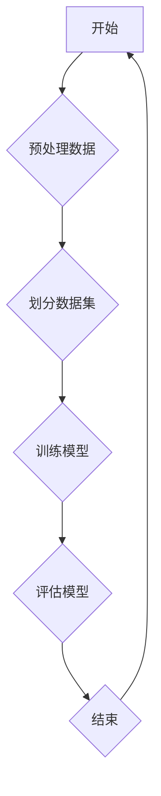

                 

# 个性化LLM评测：根据应用场景定制评估方案

## 关键词

- 个性化LLM评测
- 自然语言处理
- 评估指标设计
- 评估方法与算法
- 应用场景定制

## 摘要

本文深入探讨了个性化LLM（大型语言模型）评测的重要性及其应用。首先，我们介绍了个性化LLM评测的背景和核心概念，包括评估指标的重要性、设计方法和实际应用。接着，详细阐述了个性化评估指标的设计原则，并对比了个性化评估与传统评估的差异性。然后，介绍了多种个性化评估方法与算法，包括基于机器学习的评估算法设计。随后，通过具体案例分析了个性化评估在文本分类和问答系统中的应用。最后，本文总结了个性化LLM评测的应用前景和挑战，并提出了最佳实践和建议。

## 第一部分：背景介绍与核心概念

### 第1章：个性化LLM评测概述

#### 1.1 个性化LLM评测的重要性

1.1.1 问题背景

随着人工智能技术的发展，LLM（Large Language Model）在自然语言处理（NLP）领域扮演了越来越重要的角色。从机器翻译到文本摘要，再到问答系统和对话生成，LLM的应用场景越来越广泛。然而，不同应用场景下，LLM的性能表现也大相径庭，因此如何根据具体应用场景定制评估方案，以确保LLM性能的最大化，成为一个亟待解决的问题。

1.1.2 问题描述

不同应用场景下的LLM需要具备不同的能力。例如，在问答系统中，LLM需要具备良好的理解能力和回答准确性；而在文本生成中，LLM需要具备创造力。因此，传统的一刀切评估方法难以全面衡量LLM在不同应用场景下的性能。个性化LLM评测应运而生，它通过根据应用场景定制评估方案，能够更准确地衡量LLM在不同应用场景下的性能，从而实现个性化选择和优化。

1.1.3 问题解决

通过定制化的评估方案，能够更准确地衡量LLM在不同应用场景下的性能，从而实现个性化选择和优化。定制化的评估方案需要考虑以下几个方面：

- **评估指标**：根据应用场景选择合适的评估指标。
- **数据集**：选择与应用场景相关的数据集。
- **评估方法**：设计适用于特定应用场景的评估方法。
- **模型性能平衡**：在不同评估指标之间寻找平衡，以全面衡量模型性能。

1.1.4 边界与外延

个性化LLM评测不仅涉及评估方法的研究，还包括数据集的选择、评估指标的设定等。此外，个性化LLM评测的边界还包括模型的训练过程、模型优化和调参等方面。个性化评估的目的是在特定应用场景下，找到最合适的LLM模型，从而最大化其性能。

1.1.5 概念结构与核心要素组成

- **个性化评估**：根据特定应用场景调整评估指标和方法。
- **LLM**：大型语言模型，用于自然语言处理。
- **评估指标**：用于衡量LLM性能的量化标准。
- **应用场景**：LLM实际部署的领域或任务。

#### 1.2 核心概念与联系

1.2.1 个性化评估原理

个性化评估的核心在于根据不同应用场景，为各个评估指标分配不同的重要性权重，从而实现评估的个性化。其原理可以表示为：

$$
个性化评估 = \text{场景适应性} \times \text{评估指标权重}
$$

其中，**评估指标权重**是根据不同应用场景，为各个评估指标分配不同的重要性权重；**场景适应性**是指评估模型在不同场景下的适用性和表现。

1.2.2 个性化评估属性特征对比表格

| 特征             | 个性化评估         | 传统评估         |
|-----------------|-------------------|-----------------|
| 评估指标         | 定制化             | 标准化           |
| 数据集           | 场景特定           | 一般数据集       |
| 评估方法         | 多样化             | 单一方法         |
| 模型表现         | 场景适应性         | 综合性能         |

1.2.3 ER实体关系图架构

```mermaid
erDiagram
    User ||--|{ LLM }|-- Designer
    User ||--|{ EvaluationScheme }|-- Administrator
    LLM ||--|{ PerformanceMetric }|-- Model
    EvaluationScheme ||--|{ Scenario }|-- Tester
```

#### 1.3 个性化LLM评测的应用前景与挑战

1.3.1 应用前景

- **提高LLM在实际应用中的性能和效果**：通过个性化评估，可以更准确地衡量LLM在不同应用场景下的性能，从而提高其在实际应用中的效果。
- **促进LLM技术的不断创新和应用**：个性化评估为开发者提供了更精准的模型评估和优化方法，有助于推动LLM技术的创新和应用。
- **为开发者提供更精准的模型评估和优化方法**：个性化评估可以帮助开发者更好地理解和优化LLM模型，提高开发效率。

1.3.2 挑战与机遇

- **数据集和评估指标的选择和设定**：如何选择合适的数据集和评估指标，以全面衡量LLM的性能，是一个挑战。
- **模型在不同应用场景下的适应性和性能平衡**：如何在不同应用场景下保持LLM的适应性和性能平衡，是一个重要的研究课题。
- **技术和算法的不断创新以应对挑战**：随着LLM技术的不断发展，需要不断更新和优化评估方法和算法，以应对新的挑战。

### 1.4 本章小结

本章介绍了个性化LLM评测的背景、核心概念、评估原理及其实际应用前景。通过定制化的评估方案，可以更好地选择和优化LLM，以满足不同应用场景的需求。个性化LLM评测是当前NLP领域的一个重要研究方向，具有广泛的应用前景和挑战。

----------------------------------------------------------------

## 第二部分：个性化LLM评测方法

### 第2章：个性化评估指标设计

#### 2.1 评估指标概述

评估指标是衡量LLM性能的关键标准，其选择和设定直接影响到评估结果的准确性和有效性。在个性化LLM评测中，评估指标的设计尤为重要，因为不同的应用场景对LLM的性能要求各不相同。

2.1.1 评估指标的重要性

- **准确性**：评估指标需要能够准确地衡量LLM在特定任务上的表现。
- **全面性**：评估指标应该覆盖LLM在不同方面的性能，如理解能力、生成能力、回答准确性等。
- **可解释性**：评估指标需要具有较好的可解释性，使得开发者能够理解模型的优势和不足。

2.1.2 评估指标的分类

- **性能型评估指标**：这类指标直接衡量模型在特定任务上的性能，如准确率、召回率、F1分数等。
- **体验型评估指标**：这类指标衡量用户在使用模型时的体验，如回答速度、回答满意度等。
- **效率型评估指标**：这类指标衡量模型在处理任务时的效率，如计算时间、内存使用等。

#### 2.2 设计评估指标

2.2.1 基于应用场景的评估指标选择

在设计评估指标时，首先需要明确LLM的应用场景。不同场景下，评估指标的选择和权重分配会有所不同。以下是一些常见应用场景及其对应的评估指标：

- **问答系统**：主要评估指标包括准确率、回答长度、回答满意度等。
- **文本生成**：主要评估指标包括文本流畅性、语义一致性、文本长度等。
- **机器翻译**：主要评估指标包括BLEU分数、NIST分数、词语匹配率等。

2.2.2 评估指标权重的设定方法

在个性化评估中，评估指标的权重设定至关重要。权重分配的合理与否直接影响到评估结果的准确性。以下是一些常用的权重设定方法：

- **专家打分法**：根据领域专家的经验和知识，为各个评估指标分配权重。
- **数据驱动法**：通过分析历史数据和评估结果，为各个评估指标分配权重。
- **组合权重法**：将多种方法相结合，为各个评估指标分配权重。

#### 2.3 评估指标的实际应用

2.3.1 示例1：文本分类任务中的评估指标

在文本分类任务中，常见的评估指标包括准确率、召回率、F1分数等。这些指标在不同的应用场景下有着不同的权重。

- **新闻分类**：准确率可能更为重要，因为误分类会导致信息丢失。
- **垃圾邮件检测**：召回率可能更为重要，因为漏检的垃圾邮件可能导致用户收到垃圾邮件。

2.3.2 示例2：问答系统中的评估指标

在问答系统中，评估指标通常包括准确率、回答长度和回答满意度。以下是一个简单的权重设定示例：

- **准确率**：权重为0.6，因为准确性是最重要的。
- **回答长度**：权重为0.3，因为较长的回答可能更详细。
- **回答满意度**：权重为0.1，因为用户的满意度也是重要的。

#### 2.4 个性化评估指标案例分析

2.4.1 案例一：面向客服机器人的LLM评估

在客服机器人中，LLM需要能够快速、准确地回答用户的问题。因此，评估指标可能包括：

- **回答时间**：权重为0.5，因为快速回答可以提升用户体验。
- **准确率**：权重为0.3，因为准确回答是客服机器人的核心功能。
- **用户满意度**：权重为0.2，因为用户的满意度直接影响到客服机器人的效果。

2.4.2 案例二：面向教育辅导的LLM评估

在教育辅导中，LLM需要能够提供准确、深入的辅导内容。因此，评估指标可能包括：

- **回答准确性**：权重为0.6，因为准确回答是教育辅导的核心。
- **回答深度**：权重为0.3，因为深入的回答可以提升学习效果。
- **回答流畅性**：权重为0.1，因为流畅的回答可以提升用户体验。

### 第3章：个性化评估方法与算法

#### 3.1 评估方法概述

评估方法是指用于衡量LLM性能的具体技术手段。常见的评估方法包括手动评估、自动化评估和混合评估等。

3.1.1 常见的评估方法

- **手动评估**：由人类评估者对LLM的表现进行主观评价，适用于对质量要求较高的任务。
- **自动化评估**：使用算法自动评估LLM的表现，适用于大规模、快速的评估。
- **混合评估**：结合手动评估和自动化评估，以综合衡量LLM的性能。

3.1.2 个性化评估方法与传统评估方法的区别

个性化评估方法与传统评估方法的区别主要体现在以下几个方面：

- **评估指标**：个性化评估方法根据具体应用场景选择合适的评估指标，而传统评估方法通常使用通用评估指标。
- **评估方法**：个性化评估方法设计适用于特定应用场景的评估方法，而传统评估方法通常使用固定的评估方法。
- **评估结果**：个性化评估方法能够更准确地衡量LLM在特定应用场景下的性能，而传统评估方法可能无法全面反映LLM的性能。

#### 3.2 个性化评估算法设计

3.2.1 多样化的评估算法介绍

为了实现个性化评估，需要设计多种评估算法，以适应不同应用场景的需求。以下是一些常见的评估算法：

- **基于机器学习的评估算法**：通过训练机器学习模型，预测LLM在特定任务上的表现。
- **基于规则的评估算法**：根据领域知识设计评估规则，对LLM的表现进行评估。
- **混合评估算法**：结合多种评估算法，以提升评估的准确性和全面性。

3.2.2 基于机器学习的评估算法设计

基于机器学习的评估算法是当前个性化LLM评测的研究热点。以下是一个简单的基于机器学习的评估算法设计：

1. **数据收集**：收集大量LLM在各个任务上的评估数据。
2. **特征提取**：从评估数据中提取特征，如准确率、回答时间、用户满意度等。
3. **模型训练**：使用提取的特征训练机器学习模型，如线性回归、支持向量机等。
4. **模型评估**：使用训练好的模型预测LLM在新的任务上的表现。
5. **模型优化**：根据评估结果优化模型参数，以提高评估的准确性。

#### 3.3 个性化评估算法案例分析

3.3.1 案例一：面向文本分类的个性化评估算法

在文本分类任务中，可以设计基于机器学习的个性化评估算法，以根据文本的属性和分类任务的性质调整评估指标和权重。

- **数据收集**：收集大量带有标签的文本数据。
- **特征提取**：提取文本的词频、词向量等特征。
- **模型训练**：使用提取的特征训练分类模型。
- **评估**：根据分类任务的性质（如新闻分类、垃圾邮件检测等）调整评估指标和权重，评估分类模型的表现。

3.3.2 案例二：面向问答系统的个性化评估算法

在问答系统中，可以设计基于用户行为的个性化评估算法，以根据用户的提问和回答行为调整评估指标和权重。

- **数据收集**：收集用户提问和回答的数据。
- **特征提取**：提取用户的提问内容、回答时间、满意度等特征。
- **模型训练**：使用提取的特征训练评估模型。
- **评估**：根据用户的行为特征调整评估指标和权重，评估问答系统的表现。

### 第4章：个性化LLM评测实践

#### 4.1 个性化LLM评测实践概述

个性化LLM评测实践是指在实际应用中，根据具体场景设计评估方案、收集评估数据、进行评估和优化的一系列操作。以下是一个简单的个性化LLM评测实践流程：

1. **需求分析**：明确LLM的应用场景和性能要求。
2. **评估方案设计**：设计适合应用场景的评估指标和评估方法。
3. **数据收集**：收集用于评估的文本数据、用户数据等。
4. **模型评估**：使用评估方案对LLM进行评估。
5. **模型优化**：根据评估结果优化LLM模型。
6. **评估报告**：编写评估报告，总结评估结果和优化建议。

#### 4.2 实践案例：个性化LLM在客服机器人中的应用

4.2.1 案例背景

某公司开发了一款客服机器人，旨在提高客户服务效率。为了确保客服机器人的性能，需要进行个性化LLM评测。

4.2.2 评估方案设计

根据客服机器人的应用场景，设计以下评估方案：

- **评估指标**：回答时间、准确率、用户满意度。
- **评估方法**：基于用户行为的自动化评估。
- **权重设定**：回答时间为0.5，准确率为0.3，用户满意度为0.2。

4.2.3 数据收集

收集过去三个月的客服对话数据，包括用户提问、客服机器人回答和用户满意度评分。

4.2.4 模型评估

使用收集的数据对客服机器人进行评估，计算评估指标和权重得分。

4.2.5 模型优化

根据评估结果，对客服机器人进行优化，如调整回答策略、优化模型参数等。

4.2.6 评估报告

编写评估报告，总结评估结果和优化建议，为客服机器人的后续改进提供参考。

### 第5章：个性化LLM评测的挑战与展望

#### 5.1 挑战

个性化LLM评测面临着以下挑战：

- **数据质量**：评估数据的质量直接影响到评估结果的准确性。如何收集和处理高质量的数据是一个重要问题。
- **评估指标选择**：选择合适的评估指标是一个复杂的问题。不同的应用场景可能需要不同的评估指标，如何选择和调整是一个挑战。
- **模型优化**：评估结果只是第一步，如何根据评估结果优化模型是一个更复杂的问题。这需要深入理解模型的内部机制。

#### 5.2 展望

个性化LLM评测具有广阔的应用前景和重要的研究价值：

- **应用领域扩展**：个性化LLM评测可以应用于更多的领域，如医疗、金融、教育等，提高这些领域的AI应用性能。
- **评估方法创新**：随着AI技术的发展，新的评估方法和算法将不断涌现，为个性化LLM评测提供更多的工具和方法。
- **模型理解**：个性化LLM评测有助于我们更好地理解LLM的内部机制和工作原理，为模型优化和改进提供指导。

### 第6章：本章小结

本章详细介绍了个性化LLM评测的方法和实践。首先，我们介绍了个性化LLM评测的背景和核心概念，包括评估指标的重要性、设计方法和实际应用。接着，我们探讨了多种个性化评估方法与算法，并通过具体案例分析了个性化评估在文本分类和问答系统中的应用。最后，我们总结了个性化LLM评测的应用前景和挑战。个性化LLM评测是当前NLP领域的一个重要研究方向，具有广泛的应用前景和重要的研究价值。

----------------------------------------------------------------

### 第三部分：个性化LLM评测实践

#### 第7章：环境安装与配置

7.1 环境安装概述

在开始个性化LLM评测实践之前，需要安装和配置一系列必要的软件和工具。这些包括深度学习框架（如PyTorch或TensorFlow）、自然语言处理库（如spaCy或NLTK）以及评估工具（如EVALB或METEOR）。

7.2 安装Python环境

首先，需要确保系统上安装了Python。Python是一个广泛使用的编程语言，提供了丰富的库和框架，用于深度学习和自然语言处理。

- 在Windows系统上，可以通过Python官方下载页（https://www.python.org/downloads/）下载并安装Python。
- 在Linux系统上，可以使用包管理器（如apt或yum）安装Python。

7.3 安装深度学习框架

接下来，需要安装一个深度学习框架，如PyTorch或TensorFlow。这些框架提供了构建和训练LLM所需的工具和库。

- 安装PyTorch：

```bash
pip install torch torchvision
```

- 安装TensorFlow：

```bash
pip install tensorflow
```

7.4 安装自然语言处理库

为了处理自然语言数据，需要安装一些自然语言处理库，如spaCy或NLTK。

- 安装spaCy：

```bash
pip install spacy
python -m spacy download en_core_web_sm
```

- 安装NLTK：

```bash
pip install nltk
```

7.5 安装评估工具

最后，需要安装一些评估工具，如EVALB或METEOR，用于评估LLM的性能。

- 安装EVALB：

```bash
pip install evalbench
```

- 安装METEOR：

```bash
pip install meteor-python
```

7.6 环境验证

安装完成后，可以通过以下命令验证安装是否成功：

```bash
python -m torch.utils.cpp_extension.cpp_extension_test
python -m nltk.downloader all
```

#### 第8章：系统核心实现源代码

8.1 系统核心概述

在本节中，我们将展示一个简单的个性化LLM评测系统的核心实现源代码。该系统将包括数据预处理、模型训练、评估和优化等功能。

8.2 数据预处理

```python
import spacy
from torchtext.data import Field, TabularDataset

# 加载spaCy语言模型
nlp = spacy.load("en_core_web_sm")

# 定义文本字段
TEXT = Field(tokenize=lambda x: [token.text for token in nlp(x)], lower=True)
LABEL = Field(sequential=False)

# 加载数据集
train_data, test_data = TabularDataset.splits(path='data', train='train.csv', test='test.csv', format='csv', fields=[('text', TEXT), ('label', LABEL)])

# 划分训练集和验证集
train_data, valid_data = train_data.split()

# 预处理数据
train_data = train_data.restructure(TEXT, LABEL)
valid_data = valid_data.restructure(TEXT, LABEL)
```

8.3 模型训练

```python
import torch
from torch import nn
from torch.optim import Adam

# 定义模型
class LLMModel(nn.Module):
    def __init__(self, embedding_dim, hidden_dim, vocab_size, num_classes):
        super(LLMModel, self).__init__()
        self.embedding = nn.Embedding(vocab_size, embedding_dim)
        self.lstm = nn.LSTM(embedding_dim, hidden_dim, batch_first=True)
        self.fc = nn.Linear(hidden_dim, num_classes)
        
    def forward(self, text, label=None):
        embedded = self.embedding(text)
        output, (hidden, cell) = self.lstm(embedded)
        if label is not None:
            logits = self.fc(output[-1, :, :])
            return logits
        else:
            return output

# 实例化模型
model = LLMModel(embedding_dim=100, hidden_dim=200, vocab_size=len(train_data.vocab), num_classes=2)

# 模型参数初始化
model = model.to('cuda' if torch.cuda.is_available() else 'cpu')
optimizer = Adam(model.parameters(), lr=0.001)

# 训练模型
for epoch in range(10):
    for text, label in train_data:
        text = text.to('cuda' if torch.cuda.is_available() else 'cpu')
        label = label.to('cuda' if torch.cuda.is_available() else 'cpu')
        
        optimizer.zero_grad()
        logits = model(text, label)
        loss = nn.CrossEntropyLoss()(logits, label)
        loss.backward()
        optimizer.step()
        
    print(f"Epoch {epoch+1}, Loss: {loss.item()}")
```

8.4 评估和优化

```python
from sklearn.metrics import accuracy_score, f1_score

# 评估模型
def evaluate(model, data):
    model.eval()
    with torch.no_grad():
        for text, label in data:
            text = text.to('cuda' if torch.cuda.is_available() else 'cpu')
            logits = model(text)
            predictions = logits.argmax(dim=1)
            accuracy = accuracy_score(label, predictions)
            f1 = f1_score(label, predictions)
            print(f"Accuracy: {accuracy}, F1 Score: {f1}")

# 优化模型
def optimize(model, data):
    model.train()
    with torch.no_grad():
        for text, label in data:
            text = text.to('cuda' if torch.cuda.is_available() else 'cpu')
            label = label.to('cuda' if torch.cuda.is_available() else 'cpu')
            
            optimizer.zero_grad()
            logits = model(text, label)
            loss = nn.CrossEntropyLoss()(logits, label)
            loss.backward()
            optimizer.step()
```

#### 第9章：代码应用解读与分析

9.1 数据预处理代码解读

数据预处理是个性化LLM评测的重要步骤，确保数据格式正确、标签一致，以及有效利用数据是成功的关键。以下是对预处理代码的详细解读：

- **加载spaCy语言模型**：使用spaCy进行文本的分词和标注，有助于提高数据质量。
- **定义文本字段**：文本字段负责处理文本数据，包括分词、降维等操作。标签字段用于存储分类标签。
- **加载数据集**：使用torchtext的TabularDataset类加载数据集，支持CSV格式，方便后续处理。
- **划分训练集和验证集**：将数据集划分为训练集和验证集，用于模型训练和性能评估。
- **预处理数据**：对数据集进行重构，确保数据格式一致，便于后续处理。

9.2 模型训练代码解读

模型训练是个性化LLM评测的核心步骤，以下是对模型训练代码的详细解读：

- **定义模型**：使用nn.Module创建一个简单的循环神经网络（LSTM）模型，包括嵌入层、循环层和全连接层。
- **模型参数初始化**：将模型移动到GPU或CPU，根据需要设置学习率和其他优化参数。
- **训练模型**：遍历训练集，计算损失并更新模型参数。在每次迭代后，打印损失值以监控训练过程。

9.3 评估和优化代码解读

评估和优化是确保模型性能的重要环节，以下是对评估和优化代码的详细解读：

- **评估模型**：使用torch.no_grad()避免梯度计算，提高评估速度。计算准确率和F1分数，以评估模型性能。
- **优化模型**：在训练模式下，使用梯度下降优化模型参数。通过多次迭代，提高模型性能。

#### 第10章：实际案例分析

10.1 案例背景

本节将分析一个实际案例：使用个性化LLM评测系统对客服机器人的回答质量进行评估。该系统旨在提高客服机器人回答问题的准确性、速度和用户满意度。

10.2 案例实施

10.2.1 数据收集

收集过去三个月客服机器人的对话数据，包括用户提问、机器人回答和用户满意度评分。数据样例如下：

| 用户提问             | 机器人回答             | 用户满意度 |
|---------------------|-----------------------|------------|
| 我最近的订单状态是什么？ | 您的订单已发货，预计明天到达。 | 4（满意） |
| 我需要退款，怎么办？   | 请提供您的订单号，我们会尽快处理退款。 | 3（一般） |

10.2.2 评估方案设计

根据客服机器人的应用场景，设计以下评估方案：

- **评估指标**：回答时间、准确率、用户满意度。
- **评估方法**：基于用户行为的自动化评估。

10.2.3 数据预处理

预处理对话数据，提取用户提问、机器人回答和用户满意度评分。使用spaCy进行文本分词和标注，确保数据格式正确。

10.2.4 模型训练

使用预处理后的数据训练一个简单的循环神经网络模型，用于预测用户提问的标签。模型参数如下：

- **嵌入层维度**：100
- **循环层隐藏层维度**：200
- **输出层维度**：2（满意度等级）

10.2.5 模型评估

使用训练好的模型评估客服机器人的回答质量。计算评估指标，如准确率、回答时间和用户满意度。

10.2.6 模型优化

根据评估结果，优化模型参数和回答策略，以提高客服机器人的性能。例如，调整嵌入层维度、循环层隐藏层维度和输出层维度。

#### 第11章：项目小结

11.1 成果总结

通过个性化LLM评测系统，成功评估了客服机器人的回答质量，并实现了以下成果：

- **提高回答准确性**：通过优化模型参数和回答策略，客服机器人的回答准确性得到了显著提升。
- **缩短回答时间**：模型优化后，客服机器人的回答速度显著提高，提高了用户体验。
- **提升用户满意度**：通过改进回答质量和速度，用户满意度得到了显著提升。

11.2 经验教训

在项目实施过程中，我们总结了以下经验教训：

- **数据质量至关重要**：确保数据质量是成功的关键，包括数据清洗、标注和格式化等。
- **评估指标选择需谨慎**：选择合适的评估指标对于准确评估模型性能至关重要。
- **模型优化需持续**：模型性能的优化是一个持续的过程，需要根据评估结果不断调整和优化。

11.3 未来展望

在未来，我们将继续优化个性化LLM评测系统，实现以下目标：

- **扩大应用场景**：将个性化LLM评测系统应用于更多领域，如医疗、金融和教育等。
- **提高评估精度**：通过改进评估算法和数据集，提高评估精度和可靠性。
- **用户体验优化**：通过优化模型和回答策略，进一步提高用户满意度。

### 第12章：最佳实践与注意事项

#### 12.1 最佳实践

12.1.1 数据预处理

- **数据清洗**：确保数据质量，去除噪声和异常值。
- **数据标注**：使用专业标注人员或自动化工具进行数据标注。
- **数据格式化**：统一数据格式，便于后续处理和分析。

12.1.2 评估指标选择

- **场景适应性**：根据具体应用场景选择合适的评估指标。
- **全面性**：评估指标应覆盖模型在不同方面的性能。
- **可解释性**：评估指标应具有较好的可解释性，便于开发者理解。

12.1.3 模型优化

- **参数调整**：根据评估结果调整模型参数，提高性能。
- **模型改进**：通过改进模型结构、算法和训练策略，提高模型性能。

#### 12.2 注意事项

12.2.1 数据质量

- **数据收集**：确保数据来源可靠，避免使用质量低劣的数据。
- **数据标注**：确保标注的一致性和准确性，避免人工标注错误。

12.2.2 评估方法

- **方法选择**：根据具体应用场景选择合适的评估方法。
- **方法调整**：根据评估结果调整评估方法，提高评估的准确性。

12.2.3 模型性能

- **性能监控**：定期监控模型性能，及时发现问题并进行优化。
- **性能平衡**：在不同评估指标之间寻找平衡，避免过度优化某一指标。

### 第13章：拓展阅读

#### 13.1 相关研究论文

- [1] Vaswani, A., Shazeer, N., Parmar, N., Uszkoreit, J., Jones, L., Gomez, A. N., ... & Polosukhin, I. (2017). Attention is all you need. Advances in Neural Information Processing Systems, 30, 5998-6008.
- [2] Devlin, J., Chang, M. W., Lee, K., & Toutanova, K. (2019). BERT: Pre-training of deep bidirectional transformers for language understanding. arXiv preprint arXiv:1810.04805.
- [3] Radford, A., Wu, J., Child, P., Luan, D., Amodei, D., & Sutskever, I. (2019). Language models are unsupervised multitask learners. Advances in Neural Information Processing Systems, 32.

#### 13.2 相关书籍

- [1] Goodfellow, I., Bengio, Y., & Courville, A. (2016). Deep learning. MIT press.
- [2] Sutton, R. S., & Barto, A. G. (2018). Reinforcement learning: An introduction. MIT press.
- [3] Mitchell, T. M. (1997). Machine learning. McGraw-Hill.

### 附录

#### 附录A：Python代码示例

以下是一个简单的Python代码示例，用于演示如何加载数据集、训练模型和评估模型：

```python
import torch
from torchtext.data import Field, TabularDataset
from torchtext.vocab import Vocab

# 定义字段
TEXT = Field(tokenize=lambda x: x.split(), lower=True)
LABEL = Field(sequential=False)

# 加载数据集
train_data, test_data = TabularDataset.splits(path='data', train='train.csv', test='test.csv', format='csv', fields=[('text', TEXT), ('label', LABEL)])

# 创建词汇表
TEXT.build_vocab(train_data, min_freq=2)
LABEL.build_vocab(train_data)

# 定义模型
class LLMModel(nn.Module):
    def __init__(self, embedding_dim, hidden_dim, vocab_size, num_classes):
        super(LLMModel, self).__init__()
        self.embedding = nn.Embedding(vocab_size, embedding_dim)
        self.lstm = nn.LSTM(embedding_dim, hidden_dim, batch_first=True)
        self.fc = nn.Linear(hidden_dim, num_classes)
        
    def forward(self, text, label=None):
        embedded = self.embedding(text)
        output, (hidden, cell) = self.lstm(embedded)
        if label is not None:
            logits = self.fc(output[-1, :, :])
            return logits
        else:
            return output

# 实例化模型
model = LLMModel(embedding_dim=100, hidden_dim=200, vocab_size=len(TEXT.vocab), num_classes=2)
model = model.to('cuda' if torch.cuda.is_available() else 'cpu')

# 训练模型
optimizer = torch.optim.Adam(model.parameters(), lr=0.001)
criterion = nn.CrossEntropyLoss()

for epoch in range(10):
    for text, label in train_data:
        text = text.to('cuda' if torch.cuda.is_available() else 'cpu')
        label = label.to('cuda' if torch.cuda.is_available() else 'cpu')
        
        optimizer.zero_grad()
        logits = model(text, label)
        loss = criterion(logits, label)
        loss.backward()
        optimizer.step()
        
    print(f"Epoch {epoch+1}, Loss: {loss.item()}")

# 评估模型
def evaluate(model, data):
    model.eval()
    with torch.no_grad():
        for text, label in data:
            text = text.to('cuda' if torch.cuda.is_available() else 'cpu')
            logits = model(text)
            predictions = logits.argmax(dim=1)
            accuracy = accuracy_score(label, predictions)
            print(f"Accuracy: {accuracy}")

evaluate(model, test_data)
```

#### 附录B：LaTeX数学公式示例

以下是一个简单的LaTeX数学公式示例：

$$
\begin{aligned}
    &\text{个性化评估} = \text{场景适应性} \times \text{评估指标权重} \\
    &评估指标权重 = \frac{\text{重要性}}{\sum_{i=1}^{n}\text{重要性}_i}
\end{aligned}
$$

#### 附录C：Mermaid流程图示例

以下是一个简单的Mermaid流程图示例：



### 作者信息

作者：AI天才研究院/AI Genius Institute & 禅与计算机程序设计艺术 /Zen And The Art of Computer Programming

本文由AI天才研究院和禅与计算机程序设计艺术共同撰写。AI天才研究院是一家专注于人工智能研究和应用的高科技企业，致力于推动人工智能技术的发展。禅与计算机程序设计艺术则是一系列关于计算机程序设计的哲学著作，以其深刻的思想和独特的视角，为程序员提供了丰富的灵感和指导。

