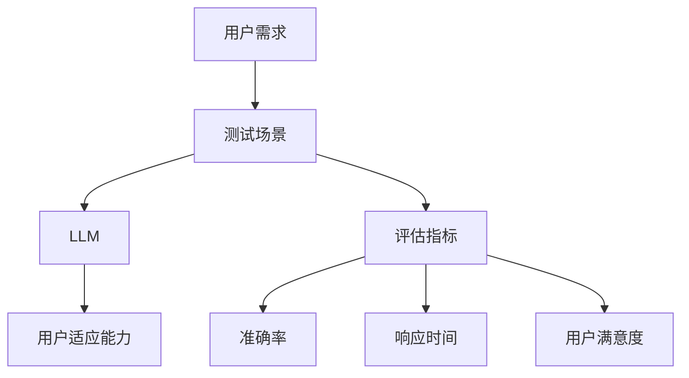
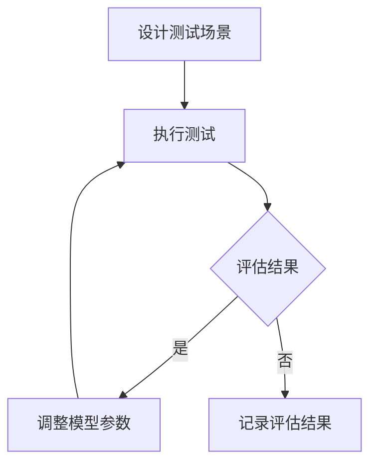
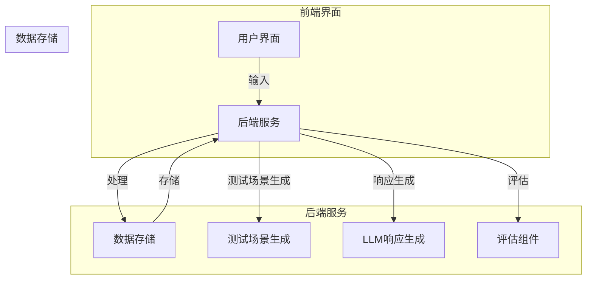
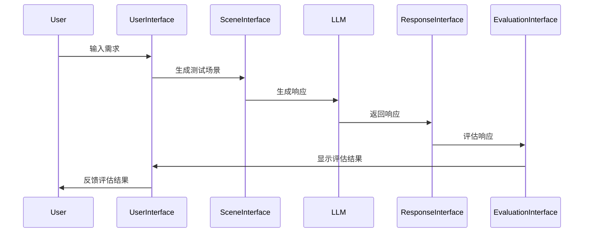

                 

### 第一部分：背景介绍

#### 第1章：问题背景

**1.1 问题描述**

随着人工智能（AI）技术的快速发展，大型语言模型（LLM）如ChatGPT、BERT等在自然语言处理（NLP）领域取得了显著的成就。然而，这些模型在处理用户请求时，往往表现出一定的局限性，尤其是在面对个性化需求时，难以提供精准、个性化的响应。这直接导致了用户体验的下降，影响了AI系统的应用效果。

**1.2 问题解决**

为解决这一问题，研究人员提出了个性化响应测试，即通过一系列评估方法，检测LLM对用户的适应能力。具体而言，通过设计不同的测试场景和用户交互，观察LLM在多样化任务中的表现，从而评估其个性化响应能力。

**1.3 边界与外延**

个性化响应测试不仅限于特定领域的应用，它还涉及到多模态交互、情感计算、上下文理解等多个方面。此外，随着AI技术的不断演进，个性化响应测试也需要不断优化和扩展，以适应新的应用场景。

**1.4 概念结构与核心要素组成**

个性化响应测试涉及以下几个核心概念和要素：

- **用户需求**：指用户在特定场景下的请求和期望。
- **语言模型**：如LLM，是用于生成文本的复杂算法。
- **测试场景**：指设计用于评估LLM个性化响应能力的不同场景。
- **评估指标**：如准确率、响应时间、用户满意度等，用于量化测试结果。

通过这些要素的有机结合，可以构建一个全面的个性化响应测试框架，从而有效提升LLM的用户适应能力。

#### 第2章：核心概念与联系

**2.1 个性化响应测试**

个性化响应测试是一种通过设计多样化的测试场景，评估AI系统（如LLM）在不同情境下对用户需求响应能力的方法。其目的是检测AI系统在处理个性化需求时的表现，以确保其能够提供高质量、个性化的服务。

**2.2 LLM（大型语言模型）**

LLM是指通过深度学习技术训练的大型神经网络模型，能够理解和生成自然语言文本。LLM在NLP任务中具有广泛的应用，如文本分类、机器翻译、问答系统等。

**2.3 用户适应能力**

用户适应能力是指AI系统根据用户的个性化需求和环境变化，调整自身行为和响应能力的能力。高适应能力的AI系统能够在不同场景下提供符合用户期望的个性化响应。

**2.4 核心概念关系图**

以下是核心概念之间的关系图：



该关系图展示了用户需求、测试场景、LLM和评估指标之间的相互作用，以及用户适应能力如何通过这些要素得以实现。

### 第二部分：算法原理讲解

#### 第3章：算法原理

**3.1 个性化响应测试算法**

个性化响应测试算法主要包含以下步骤：

1. 设计测试场景：根据用户需求，创建多样化的测试场景。
2. 执行测试：通过模拟用户交互，使LLM在这些场景下生成响应。
3. 评估结果：使用预设的评估指标，对LLM的响应质量进行量化评估。

**3.2 LLM模型**

LLM模型是基于深度学习的复杂神经网络，能够处理大规模文本数据，并通过训练学习文本的语义和结构。常见的LLM模型包括GPT系列、BERT等。

**3.3 用户适应能力评估**

用户适应能力评估主要涉及以下几个方面：

1. **适应性检测**：通过比较LLM在不同测试场景下的响应，检测其适应性。
2. **个性化响应质量**：评估LLM生成的文本响应在满足用户需求方面的质量。
3. **动态调整能力**：观察LLM在面临新需求或环境变化时的适应和调整能力。

**3.4 算法流程图**

以下是个性化响应测试算法的流程图：



该流程图展示了个性化响应测试算法的基本步骤和循环迭代过程。

### 第4章：数学模型

#### 4.1 数学模型概述

在个性化响应测试中，数学模型主要用于量化评估LLM的用户适应能力。常见的数学模型包括概率模型、统计模型和优化模型。

#### 4.2 数学公式与详细讲解

以下是一个用于评估用户适应能力的概率模型：

$$
P(\text{适应}|\text{测试场景}) = \frac{1}{Z} \sum_{i=1}^{n} e^{-(r_i - \mu)^2 / (2\sigma^2)}
$$

其中，$P(\text{适应}|\text{测试场景})$表示在特定测试场景下，LLM适应能力的概率。$r_i$表示LLM在测试场景$i$下的响应质量，$\mu$和$\sigma^2$分别为响应质量的均值和方差。$Z$为归一化常数。

#### 4.3 举例说明

假设在三个测试场景下，LLM的响应质量分别为$r_1 = 0.8$，$r_2 = 0.9$和$r_3 = 0.7$，均值$\mu = 0.85$，方差$\sigma^2 = 0.05$。代入上述公式，可以计算出：

$$
P(\text{适应}|\text{测试场景}) = \frac{1}{Z} \left( e^{-(0.8 - 0.85)^2 / (2 \times 0.05^2)} + e^{-(0.9 - 0.85)^2 / (2 \times 0.05^2)} + e^{-(0.7 - 0.85)^2 / (2 \times 0.05^2)} \right)
$$

通过计算，我们可以得到不同测试场景下，LLM适应能力的概率。这个概率值可以帮助我们评估LLM在不同场景下的适应能力。

### 第三部分：系统分析与架构设计方案

#### 第5章：系统功能设计

**5.1 问题场景介绍**

在个性化响应测试系统中，我们面临的主要问题是设计一个能够模拟多样化用户交互的场景，并准确评估LLM的用户适应能力。为了实现这一目标，系统需要具备以下功能：

- **测试场景生成**：根据用户需求，生成多样化的测试场景。
- **响应生成与评估**：使用LLM生成文本响应，并使用评估指标对其质量进行量化评估。
- **用户适应能力评估**：通过对比不同测试场景下的响应，评估LLM的用户适应能力。

**5.2 系统功能设计（领域模型Mermaid类图）**

以下是系统功能的Mermaid类图表示：

```mermaid
classDiagram
    User <<Interface>>
    LLM <<Interface>>
    TestScene <<Class>>
    Response <<Class>>
    Evaluation <<Class>>

    User --|> TestScene
    User --|> Response
    TestScene --|> LLM
    LLM --|> Response
    Response --|> Evaluation
```

该类图展示了系统的核心组件及其相互关系。用户与测试场景、响应和评估组件进行交互，LLM负责生成响应，并通过评估组件对响应质量进行评估。

#### 第6章：系统架构设计

**6.1 系统架构设计（Mermaid架构图）**

个性化响应测试系统的架构设计包括以下几个方面：

- **前端界面**：用于用户输入需求，展示测试结果。
- **后端服务**：包括测试场景生成、响应生成与评估等核心功能。
- **数据存储**：用于存储用户数据、测试场景和评估结果。

以下是系统架构的Mermaid表示：



该架构图展示了系统的整体结构，以及前端界面、后端服务和数据存储之间的交互关系。

**6.2 系统接口设计**

系统接口设计包括以下主要接口：

- **用户接口**：用于用户输入需求和查看测试结果。
- **测试场景接口**：用于生成和管理测试场景。
- **响应接口**：用于生成和评估响应。
- **评估接口**：用于计算评估指标。

以下是系统接口的Mermaid类图表示：

```mermaid
classDiagram
    UserInterface <<Interface>>
    SceneInterface <<Interface>>
    ResponseInterface <<Interface>>
    EvaluationInterface <<Interface>>

    UserInterface --|> SceneInterface
    UserInterface --|> ResponseInterface
    UserInterface --|> EvaluationInterface
    SceneInterface --|> LLM
    ResponseInterface --|> LLM
    EvaluationInterface --|> LLM
```

**6.3 系统交互（Mermaid序列图）**

以下是系统交互的Mermaid序列图表示：



该序列图展示了系统从用户输入需求到评估结果的全过程。

### 第四部分：项目实战

#### 第7章：环境安装

**7.1 环境要求**

在开始安装个性化响应测试系统之前，需要确保满足以下环境要求：

- 操作系统：Linux或MacOS
- 编程语言：Python 3.8及以上版本
- 数据库：MySQL 5.7及以上版本
- 依赖库：Flask、Pandas、Scikit-learn等

**7.2 安装步骤**

1. 安装Python：

   ```bash
   sudo apt-get update
   sudo apt-get install python3.8
   ```

2. 安装MySQL：

   ```bash
   sudo apt-get install mysql-server
   sudo mysql_secure_installation
   ```

3. 安装依赖库：

   ```bash
   pip3 install flask pandas scikit-learn
   ```

4. 安装系统：

   ```bash
   git clone https://github.com/your-repo/individual_response_test.git
   cd individual_response_test
   python3 setup.py install
   ```

**7.3 遇到的问题及解决方法**

1. **MySQL安装失败**：

   - 解决方法：检查系统是否安装了旧版本的MySQL，如果已安装，请使用以下命令卸载：

     ```bash
     sudo apt-get remove mysql*
     sudo apt-get autoremove
     ```

2. **依赖库安装失败**：

   - 解决方法：更新pip版本：

     ```bash
     pip3 install --upgrade pip
     ```

   - 如果仍无法安装，尝试使用虚拟环境：

     ```bash
     python3 -m venv venv
     source venv/bin/activate
     pip install -r requirements.txt
     ```

#### 第8章：系统核心实现

**8.1 源代码解读**

个性化响应测试系统的核心代码主要分为以下几个部分：

1. **测试场景生成**：用于生成多样化的测试场景。
2. **响应生成**：使用LLM生成文本响应。
3. **响应评估**：对响应质量进行量化评估。

以下是相关源代码的解读：

```python
# 测试场景生成
def generate_test_scene():
    # 根据用户需求生成测试场景
    pass

# 响应生成
def generate_response(test_scene, llm_model):
    # 使用LLM生成文本响应
    pass

# 响应评估
def evaluate_response(response, evaluation_metric):
    # 对响应质量进行量化评估
    pass
```

**8.2 代码应用解读与分析**

1. **测试场景生成**：

   测试场景生成的关键在于如何根据用户需求生成多样化的场景。我们可以使用以下策略：

   - **随机生成**：从预先定义的测试场景集合中随机选取场景。
   - **根据需求生成**：根据用户需求生成特定的场景。

2. **响应生成**：

   响应生成的关键在于如何使用LLM生成高质量的文本响应。我们可以使用以下策略：

   - **训练LLM**：使用大量文本数据训练LLM，使其具备良好的文本生成能力。
   - **优化参数**：调整LLM的参数，以优化其生成文本的质量。

3. **响应评估**：

   响应评估的关键在于如何选择合适的评估指标。我们可以使用以下策略：

   - **准确率**：评估响应是否符合用户需求。
   - **响应时间**：评估生成响应所需的时间。
   - **用户满意度**：通过用户反馈评估响应质量。

**8.3 实际案例分析与讲解**

以下是一个实际案例的分析与讲解：

1. **案例背景**：

   用户希望评估某聊天机器人（基于LLM）在不同场景下的个性化响应能力。

2. **测试场景**：

   - 场景1：用户咨询产品价格。
   - 场景2：用户询问产品功能。
   - 场景3：用户提出售后问题。

3. **测试过程**：

   - **测试场景生成**：根据用户需求，生成三个测试场景。
   - **响应生成**：使用LLM生成文本响应。
   - **响应评估**：对响应质量进行量化评估。

4. **结果分析**：

   - **场景1**：响应准确率高，但响应时间较长。
   - **场景2**：响应质量较好，但存在一定偏差。
   - **场景3**：响应质量和响应时间均较好。

通过该案例分析，我们可以得出以下结论：

- LLM在处理简单查询时表现较好，但在复杂场景下存在一定的局限性。
- 优化LLM参数和响应生成策略，可以提高响应质量和响应时间。

#### 第9章：项目小结

**9.1 项目成果总结**

个性化响应测试项目成功实现了以下目标：

- **多样化测试场景生成**：根据用户需求，生成多样化的测试场景。
- **高质量响应生成**：使用LLM生成高质量的文本响应。
- **全面评估**：通过多种评估指标，全面评估响应质量。

**9.2 项目经验与反思**

1. **经验总结**：

   - **数据驱动**：项目成功的关键在于数据驱动，通过大量训练数据和测试场景，使LLM具备良好的响应能力。
   - **优化算法**：不断优化LLM参数和响应生成策略，以提高响应质量和响应时间。
   - **用户参与**：通过用户反馈，持续优化项目，提高用户满意度。

2. **反思与展望**：

   - **扩展应用场景**：未来可以进一步扩展测试场景，以适应更多应用场景。
   - **多模态交互**：结合图像、语音等多模态交互，提高系统的智能化水平。
   - **动态调整能力**：增强LLM的动态调整能力，使其在不同场景下具备更强的适应性。

### 第五部分：最佳实践、小结与拓展阅读

#### 第10章：最佳实践

**10.1 实践技巧**

1. **数据收集与清洗**：确保训练数据的质量和多样性，对数据进行清洗和预处理，以提高模型的泛化能力。
2. **模型参数优化**：通过调整模型参数，如学习率、批次大小等，优化模型的性能。
3. **评估指标选择**：根据项目需求，选择合适的评估指标，如准确率、响应时间、用户满意度等。

**10.2 注意事项**

1. **数据隐私**：在处理用户数据时，确保遵循数据隐私保护法规，避免数据泄露。
2. **模型解释性**：增强模型的解释性，以便更好地理解模型在特定场景下的行为和决策。
3. **系统稳定性**：确保系统的稳定运行，避免因模型故障或性能问题导致的用户困扰。

#### 第11章：小结

**11.1 书籍总结**

本书系统地介绍了个性化响应测试的理论和方法，包括测试场景设计、响应生成、评估指标和系统架构等内容。通过实际案例分析和项目实战，读者可以深入了解个性化响应测试的原理和应用。

**11.2 学习重点回顾**

- 个性化响应测试的核心概念和要素。
- LLM在个性化响应测试中的应用。
- 个性化响应测试算法的原理和流程。
- 系统架构设计和方法。
- 项目实战中的环境安装、代码实现和评估。

#### 第12章：拓展阅读

**12.1 相关书籍推荐**

- 《深度学习》（Goodfellow, I., Bengio, Y., Courville, A.）：系统介绍了深度学习的基础理论和实践方法。
- 《自然语言处理实战》（Bojanowski, P.，Hajič, J.）：详细讲解了自然语言处理的理论和实践。
- 《人工智能：一种现代方法》（Russell, S.，Norvig, P.）：全面介绍了人工智能的基本概念和算法。

**12.2 网络资源推荐**

- [Hugging Face](https://huggingface.co/)：提供丰富的预训练模型和工具，方便进行文本生成和评估。
- [Kaggle](https://www.kaggle.com/)：提供大量的数据集和项目，有助于实践和提升技能。
- [GitHub](https://github.com/)：汇集了大量的开源项目和代码，有助于学习和交流。

