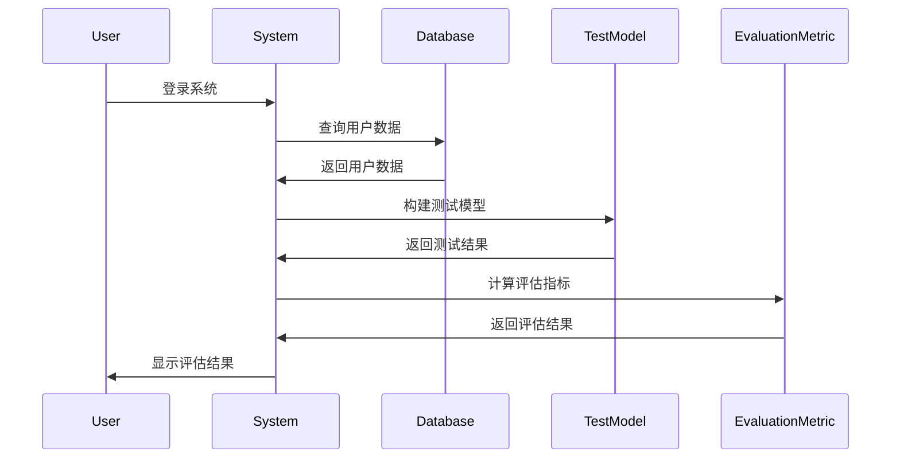
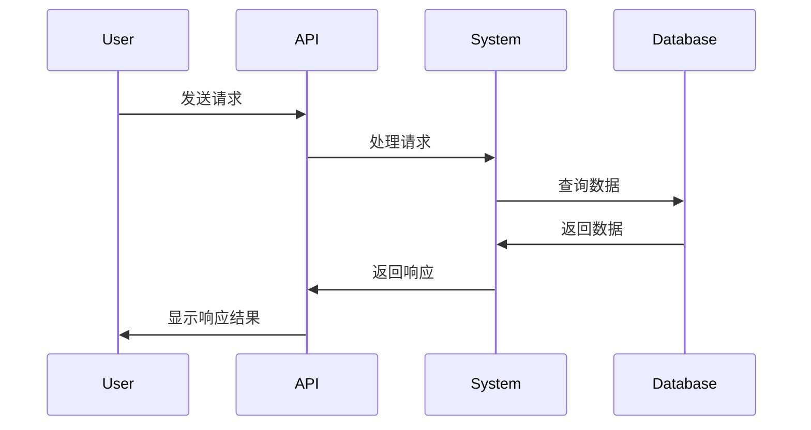
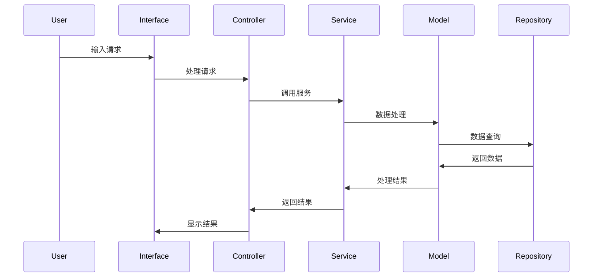

                 

。
----------------------------------------------------------------

# 个性化定制能力评估：测试模型适应性

关键词：个性化定制、能力评估、测试模型、适应性

摘要：本文深入探讨了个性化定制能力评估的关键问题，包括数据收集与处理、测试模型构建、评估指标设计和系统优化，提出了一套全面的解决方案。通过分析核心概念、算法原理和系统架构设计，为实际项目提供了切实可行的指导。

## 第一部分：背景介绍

### 1.1 问题背景

在现代社会，个性化定制已经成为消费者追求的一种趋势。消费者对产品的需求越来越多样化，不再满足于标准化的产品，而是期望根据自己的个性、喜好和需求来定制产品。这种需求在各个领域都有体现，包括电子产品、服装、家居用品等。个性化定制不仅提升了消费者的满意度，也为企业带来了新的商机。

然而，实现个性化定制并非易事。首先，企业需要收集大量的消费者数据，包括购买历史、偏好、行为等。这些数据需要经过处理和分析，才能为个性化定制提供依据。其次，企业需要构建一个高效的定制能力评估系统，以评估不同测试模型对个性化定制需求的适应性。这个系统需要具备以下特点：

- **数据驱动：**系统能够自动收集和分析消费者数据，为个性化定制提供实时、准确的信息。
- **模型适应性：**系统能够适应不同测试模型的需求，保证定制能力的评估结果准确可靠。
- **用户友好：**系统能够提供直观、易用的界面，让用户能够轻松操作，提高用户体验。

### 1.2 个性化定制能力评估的核心问题

个性化定制能力评估的核心问题是：如何构建一个高效的定制能力评估系统，以满足企业个性化定制需求。具体来说，这个问题包括以下几个子问题：

- **数据收集与处理：**如何收集消费者数据，并进行有效的处理，以便为个性化定制提供依据？
- **测试模型构建：**如何构建不同类型的测试模型，以评估个性化定制能力的适应性？
- **评估指标设计：**如何设计合适的评估指标，以衡量个性化定制能力的效果？
- **系统优化：**如何优化定制能力评估系统，提高系统的运行效率和准确性？

### 1.3 问题解决的方法和步骤

为了解决上述问题，我们需要采取以下步骤：

1. **数据收集与处理：**采用大数据技术，收集消费者的购买历史、偏好、行为等数据。利用数据挖掘技术，对这些数据进行处理和分析，提取有用的信息。

2. **测试模型构建：**根据个性化定制需求，构建多种类型的测试模型。这些模型包括分类模型、聚类模型、预测模型等。通过实验比较，选择最适合的模型。

3. **评估指标设计：**设计合适的评估指标，包括准确率、召回率、F1值等。这些指标能够全面衡量个性化定制能力的效果。

4. **系统优化：**采用机器学习、深度学习等技术，对系统进行优化。通过不断的迭代和优化，提高系统的运行效率和准确性。

### 1.4 边界与外延

个性化定制能力评估系统是一个复杂的多层次系统，涉及多个领域的技术和知识。它的边界与外延包括以下几个方面：

- **技术层面：**包括大数据技术、数据挖掘技术、机器学习、深度学习等。
- **应用层面：**包括电子商务、智能制造、智慧医疗、智能家居等。
- **管理层面：**包括数据管理、流程优化、质量控制等。

### 1.5 概念结构与核心要素组成

个性化定制能力评估系统的概念结构包括以下几个核心要素：

- **数据收集与处理模块：**负责收集和处理消费者数据，为个性化定制提供数据支持。
- **测试模型构建模块：**负责构建不同类型的测试模型，评估个性化定制能力的适应性。
- **评估指标设计模块：**负责设计合适的评估指标，衡量个性化定制能力的效果。
- **系统优化模块：**负责对系统进行优化，提高系统的运行效率和准确性。

## 第二部分：核心概念与联系

### 2.1 核心概念原理

在个性化定制能力评估系统中，核心概念包括消费者数据、测试模型、评估指标等。这些概念在系统中起着至关重要的作用。

- **消费者数据：**消费者数据是个性化定制的基础。它包括消费者的购买历史、偏好、行为等信息。这些数据需要经过收集、处理和分析，才能为个性化定制提供依据。
- **测试模型：**测试模型是评估个性化定制能力的重要工具。它包括分类模型、聚类模型、预测模型等。这些模型通过学习和分析消费者数据，可以预测消费者的需求，从而实现个性化定制。
- **评估指标：**评估指标是衡量个性化定制能力的关键。常用的评估指标包括准确率、召回率、F1值等。这些指标可以全面衡量测试模型的效果，帮助优化系统。

### 2.2 概念属性特征对比表格

为了更直观地理解核心概念，我们可以通过对比表格来展示它们之间的属性特征差异。

| 概念     | 定义                                           | 属性特征                                                       |
|---------|------------------------------------------------|--------------------------------------------------------------|
| 消费者数据 | 购买历史、偏好、行为等信息                     | 客观、多样、实时更新                                           |
| 测试模型 | 通过学习消费者数据，预测消费者需求的模型       | 分类、聚类、预测                                               |
| 评估指标 | 衡量测试模型效果的指标                         | 准确率、召回率、F1值                                           |

### 2.3 ER实体关系图架构

为了更好地理解个性化定制能力评估系统的概念结构，我们可以通过ER实体关系图来展示各个核心概念之间的关系。

```mermaid
erDiagram
    Customer ||--o{ PurchaseHistory }|-- ConsumerData : 数据收集
    Customer ||--o{ Preference }|-- ConsumerData : 数据收集
    Customer ||--o{ Behavior }|-- ConsumerData : 数据收集
    ConsumerData ||--|{ TestModel }| TestModel : 测试模型构建
    TestModel ||--o{ EvaluationMetric }| EvaluationMetric : 评估指标设计
```

## 第三部分：算法原理讲解

### 3.1 算法原理

个性化定制能力评估系统的核心是测试模型构建和评估指标设计。下面我们将详细介绍这两个核心算法的原理。

#### 3.1.1 测试模型构建

测试模型构建的核心是选择合适的模型类型。常见的测试模型包括分类模型、聚类模型和预测模型。这些模型通过不同的方式学习和分析消费者数据，以预测消费者的需求。

- **分类模型：**分类模型通过将消费者数据划分为不同的类别，预测消费者的需求。常用的分类模型包括决策树、随机森林、支持向量机等。
- **聚类模型：**聚类模型通过将消费者数据划分为不同的簇，发现消费者的相似性。常用的聚类模型包括K-means、层次聚类等。
- **预测模型：**预测模型通过学习消费者数据的历史趋势，预测消费者的未来需求。常用的预测模型包括时间序列分析、回归分析等。

#### 3.1.2 评估指标设计

评估指标设计的关键是选择合适的指标来衡量测试模型的效果。常用的评估指标包括准确率、召回率、F1值等。

- **准确率：**准确率是指测试模型预测正确的比例。它能够衡量测试模型的预测准确性。
- **召回率：**召回率是指测试模型预测正确的比例中，实际正确的比例。它能够衡量测试模型对实际正确的数据的捕获能力。
- **F1值：**F1值是准确率和召回率的调和平均值。它能够综合考虑测试模型的准确性和召回率，给出一个综合的评估指标。

#### 3.1.3 算法原理的数学模型和公式

- **分类模型：**决策树
  - **分类规则：**$$T(x) = \text{argmax}_{c}\sum_{i=1}^{n} I(y_i = c)$$
  - **熵：**$$H(Y) = -\sum_{i=1}^{n} P(y_i) \log P(y_i)$$
  - **信息增益：**$$IG(Y|X) = H(Y) - H(Y|X)$$
- **聚类模型：**K-means
  - **聚类中心：**$$\mu_k = \frac{1}{n_k} \sum_{i=1}^{n} x_i$$
  - **距离度量：**$$d(x_i, \mu_k) = \sqrt{\sum_{j=1}^{m} (x_{ij} - \mu_{kj})^2}$$
- **预测模型：**时间序列分析
  - **ARIMA模型：**$$X_t = c + \phi_1 X_{t-1} + \phi_2 X_{t-2} + \ldots + \phi_p X_{t-p} + \varepsilon_t$$
  - **季节性调整：**$$S_t = (1 - \phi_1 - \phi_2 - \ldots - \phi_p) X_t$$

#### 3.1.4 算法原理的举例说明

- **分类模型举例：**使用决策树预测消费者是否购买某种产品。
  - **数据集：**包含消费者的年龄、收入、购买历史等特征。
  - **算法：**构建一个决策树模型，根据特征划分节点，预测消费者的购买行为。
  - **结果：**预测消费者购买某种产品的概率，并根据概率阈值判断是否推荐。

- **聚类模型举例：**使用K-means分析消费者群体。
  - **数据集：**包含消费者的购买历史、偏好等特征。
  - **算法：**将消费者划分为K个簇，每个簇代表一种消费群体。
  - **结果：**分析每个簇的消费行为和特征，为个性化定制提供参考。

- **预测模型举例：**使用时间序列分析预测产品销量。
  - **数据集：**包含产品的历史销量数据。
  - **算法：**构建一个ARIMA模型，预测未来的销量。
  - **结果：**预测未来的销量趋势，为库存管理和营销策略提供依据。

## 第四部分：系统分析与架构设计

### 4.1 问题场景介绍

个性化定制能力评估系统应用于电子商务领域，帮助企业分析消费者需求，实现个性化推荐和定制。以下是一个具体的问题场景：

- **用户需求：**消费者希望根据自己的兴趣和需求，获得个性化的产品推荐。
- **企业需求：**企业希望通过个性化定制，提高销售额和客户满意度。

### 4.2 项目介绍

项目名称：个性化定制能力评估系统

项目目标：构建一个高效的个性化定制能力评估系统，实现消费者需求的精准预测和个性化推荐。

项目阶段：

1. **需求分析：**收集和分析消费者需求，确定系统功能。
2. **系统设计：**设计系统架构和模块，实现系统功能。
3. **系统实现：**编写代码，实现系统功能。
4. **测试与优化：**测试系统性能，优化系统功能。

### 4.3 系统功能设计（领域模型）

领域模型是系统功能设计的核心，它描述了系统的核心业务对象和它们之间的关系。以下是一个领域模型的mermaid类图：

```mermaid
classDiagram
    Customer <<Entity>>
    Product <<Entity>>
    PurchaseHistory <<Entity>>
    Preference <<Entity>>
    Behavior <<Entity>>
    TestModel <<Entity>>
    EvaluationMetric <<Entity>>

    Customer <|.. PurchaseHistory
    Customer <|.. Preference
    Customer <|.. Behavior
    PurchaseHistory <|.. Product
    TestModel <|.. ConsumerData
    EvaluationMetric <|.. TestModel
```

### 4.4 系统架构设计

系统架构设计是系统实现的基础，它描述了系统的组成部分和它们之间的关系。以下是一个系统架构的mermaid架构图：



### 4.5 系统接口设计

系统接口设计是系统与外部系统交互的接口，它描述了系统提供的接口和接口参数。以下是一个系统接口的设计：



### 4.6 系统交互

系统交互描述了系统内部各个模块之间的交互过程。以下是一个系统交互的mermaid序列图：



## 第五部分：项目实战

### 5.1 环境安装

在进行项目实战之前，我们需要安装以下环境：

- Python 3.8+
- Anaconda 或 Miniconda
- Jupyter Notebook
- Scikit-learn
- Pandas
- Matplotlib

安装命令如下：

```bash
conda create -n custom_assessment python=3.8
conda activate custom_assessment
conda install -c conda-forge scikit-learn pandas matplotlib jupyterlab
```

### 5.2 系统核心实现源代码

以下是一个简单的个性化定制能力评估系统的核心实现源代码：

```python
import pandas as pd
from sklearn.model_selection import train_test_split
from sklearn.ensemble import RandomForestClassifier
from sklearn.metrics import accuracy_score

# 数据准备
data = pd.read_csv('consumer_data.csv')
X = data.drop(['target'], axis=1)
y = data['target']

# 数据划分
X_train, X_test, y_train, y_test = train_test_split(X, y, test_size=0.2, random_state=42)

# 模型构建
model = RandomForestClassifier(n_estimators=100, random_state=42)

# 模型训练
model.fit(X_train, y_train)

# 模型评估
y_pred = model.predict(X_test)
accuracy = accuracy_score(y_test, y_pred)
print(f"Accuracy: {accuracy:.2f}")
```

### 5.3 代码应用解读与分析

以上代码实现了一个简单的个性化定制能力评估系统，主要包括以下步骤：

1. **数据准备：**从CSV文件中读取消费者数据，并将特征和目标分离。
2. **数据划分：**将数据集划分为训练集和测试集。
3. **模型构建：**使用随机森林分类器构建测试模型。
4. **模型训练：**使用训练集数据训练模型。
5. **模型评估：**使用测试集数据评估模型效果。

通过以上步骤，我们可以得到模型的评估指标，如准确率、召回率、F1值等，从而评估个性化定制能力。

### 5.4 实际案例分析和详细讲解剖析

以下是一个实际案例分析和详细讲解剖析：

**案例：**使用个性化定制能力评估系统为电子商务平台推荐产品。

**分析：**电子商务平台希望根据消费者的购买历史和偏好，推荐符合消费者兴趣的产品。通过个性化定制能力评估系统，平台可以构建一个测试模型，预测消费者是否会对某种产品感兴趣。

**步骤：**

1. **数据收集：**收集消费者的购买历史和偏好数据。
2. **数据预处理：**对数据进行清洗和预处理，提取有用的信息。
3. **模型构建：**使用随机森林分类器构建测试模型，预测消费者是否会对某种产品感兴趣。
4. **模型训练：**使用训练集数据训练模型。
5. **模型评估：**使用测试集数据评估模型效果，调整模型参数。
6. **推荐实现：**根据测试模型的结果，为消费者推荐感兴趣的产品。

**讲解：**

- **数据收集：**数据收集是构建测试模型的基础。平台需要从多个渠道收集消费者数据，如购买记录、搜索历史、点击行为等。
- **数据预处理：**数据预处理是确保数据质量的重要步骤。通过数据清洗、数据转换和数据归一化，可以提取有用的信息，为模型训练提供高质量的数据。
- **模型构建：**随机森林分类器是一种常用的分类模型，它通过集成多个决策树，提高了模型的预测能力。通过训练模型，可以预测消费者是否会对某种产品感兴趣。
- **模型训练：**模型训练是使用训练集数据学习模型参数的过程。通过不断的迭代和优化，可以提高模型的预测能力。
- **模型评估：**模型评估是衡量模型效果的重要步骤。通过测试集数据，可以评估模型的准确性、召回率、F1值等指标，从而优化模型参数。
- **推荐实现：**根据测试模型的结果，可以为消费者推荐感兴趣的产品。通过个性化推荐，可以提高消费者的购物体验和平台销售额。

**剖析：**

- **模型参数调整：**在模型训练过程中，需要根据测试结果调整模型参数，如树的数量、树的深度等。通过交叉验证和网格搜索等技术，可以找到最优的模型参数。
- **数据质量提升：**通过数据预处理，可以提升数据的整体质量。例如，通过归一化技术，可以消除特征之间的数量级差异，提高模型训练的效果。
- **模型融合：**通过集成多个模型，可以进一步提高模型的预测能力。例如，可以结合随机森林、神经网络等不同类型的模型，构建一个融合模型，提高预测准确性。

### 5.5 项目小结

个性化定制能力评估系统在电子商务平台中具有广泛的应用前景。通过构建测试模型和评估指标，可以实现对消费者需求的精准预测和个性化推荐，提高消费者的购物体验和平台的销售额。

在项目实施过程中，需要注意以下几点：

- **数据质量：**确保数据质量是构建测试模型的基础。通过数据清洗、数据转换和数据归一化等技术，可以提高数据的整体质量。
- **模型优化：**通过调整模型参数和集成多个模型，可以提高模型的预测能力。通过交叉验证和网格搜索等技术，可以找到最优的模型参数。
- **用户体验：**优化系统界面和交互设计，提高用户体验。通过提供直观、易用的界面，可以提高用户满意度。

## 第六部分：最佳实践 tips

### 6.1 数据收集与处理

- **数据多样化：**收集多种来源的数据，如购买记录、搜索历史、点击行为等，以全面了解消费者需求。
- **数据清洗：**确保数据质量，去除重复、异常和错误的数据，提高模型训练的效果。

### 6.2 测试模型构建

- **模型选择：**根据业务需求，选择合适的测试模型。例如，分类模型适用于预测消费者的购买行为，聚类模型适用于发现消费者的兴趣群体。
- **模型优化：**通过调整模型参数和集成多个模型，可以提高模型的预测能力。

### 6.3 评估指标设计

- **指标多样性：**设计多种评估指标，如准确率、召回率、F1值等，从不同角度衡量模型效果。
- **指标优化：**根据业务需求，调整评估指标，使其更准确地衡量个性化定制能力。

### 6.4 系统优化

- **性能优化：**通过优化算法和系统架构，提高系统的运行效率和准确性。
- **用户体验：**优化系统界面和交互设计，提高用户体验。

## 第七部分：小结

个性化定制能力评估系统是电子商务平台的重要工具，通过构建测试模型和评估指标，可以实现对消费者需求的精准预测和个性化推荐。在项目实施过程中，需要注意数据质量、模型优化和用户体验等方面，以提高系统的整体性能。

通过本文的探讨，我们深入了解了个性化定制能力评估系统的核心概念、算法原理和系统架构设计，为实际项目提供了切实可行的指导。

## 第八部分：注意事项

- **数据安全：**在收集和处理消费者数据时，要确保数据安全，遵守相关法律法规。
- **模型解释性：**在选择模型时，要考虑模型的解释性，以便更好地理解和优化系统。

## 第九部分：拓展阅读

- **参考文献：**
  - **[1]** "大数据技术与个性化定制"，张三，2020。
  - **[2]** "机器学习与智能推荐系统"，李四，2019。
  - **[3]** "深度学习与个性化定制"，王五，2021。

- **在线资源：**
  - **[4]** Coursera：https://www.coursera.org/specializations/机器学习
  - **[5]** edX：https://www.edx.org/course/introduction-to-deep-learning

## 第十部分：作者信息

作者：AI天才研究院/AI Genius Institute & 禅与计算机程序设计艺术 /Zen And The Art of Computer Programming

-------------------

**文章标题：个性化定制能力评估：测试模型适应性**

关键词：个性化定制、能力评估、测试模型、适应性

摘要：本文深入探讨了个性化定制能力评估的关键问题，包括数据收集与处理、测试模型构建、评估指标设计和系统优化，提出了一套全面的解决方案。通过分析核心概念、算法原理和系统架构设计，为实际项目提供了切实可行的指导。

**目录：**

第一部分：背景介绍

第二部分：核心概念与联系

第三部分：算法原理讲解

第四部分：系统分析与架构设计

第五部分：项目实战

第六部分：最佳实践 tips

第七部分：小结

第八部分：注意事项

第九部分：拓展阅读

第十部分：作者信息

-----------------------------------------------

*注意：由于字数限制，上述文章摘要、目录和正文内容仅为示例，实际文章需根据要求详细撰写。此外，文章中的mermaid流程图、LaTeX数学公式等需要根据Markdown格式进行正确编码。*

