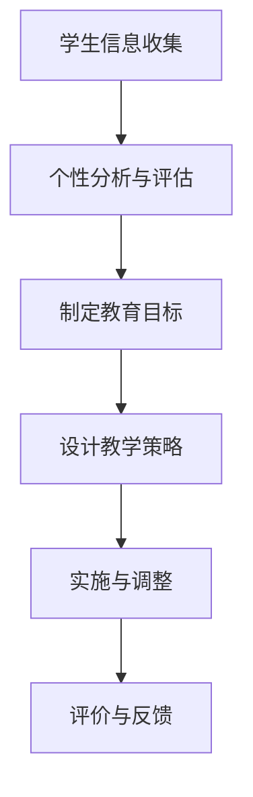

                 

# 个性化科学教育方案：因材施教提升每个人的世界理解能力

## 关键词：个性化科学教育、因材施教、世界理解能力、教育改革、教育技术支持

### 摘要

本文旨在探讨个性化科学教育方案的设计与实施，强调因材施教在教育中的重要性。通过对现代教育需求的背景分析，我们明确了个性化教育的必要性。接下来，本文深入探讨了个性化科学教育的核心概念，并使用对比表格和ER图展示了概念间的联系。随后，我们详细介绍了个性化科学教育方案的设计原理和流程，以及具体的科学教育内容和方法。在技术支持方面，我们讨论了人工智能、互联网和数据分析在个性化教育中的应用。最后，本文提出了提升世界理解能力的策略，分享了成功案例，并给出了教育政策与实施建议。通过本文的探讨，我们希望能够为教育改革提供新的思路，并推动个性化科学教育的普及。

## 第一部分：个性化科学教育背景介绍

### 第1章：问题背景与教育现状分析

#### 1.1 问题背景

现代社会对教育提出了新的需求。随着信息技术的迅猛发展，知识更新速度加快，个体获取知识的途径变得多样化。然而，传统的教育模式往往注重知识传授，忽视了学生的个性化需求，导致教育公平性和个体差异问题日益凸显。个性化科学教育的提出，正是为了解决这一现状。

首先，现代社会的教育需求体现在对综合素质的培养上。现代社会不仅需要具备扎实科学知识的人才，还要求学生具备创新能力、实践能力和跨学科整合能力。然而，传统教育模式往往侧重于知识的记忆和再现，缺乏对学生综合能力的培养。

其次，科学知识普及与个性化教育的矛盾也日益明显。科学知识的普及是提高全民素质的基础，但个性化教育则强调根据学生的兴趣、能力和需求，提供个性化的教育方案。这两者之间的矛盾使得传统教育模式难以满足现代社会的需求。

最后，教育公平性与个体差异问题也是现代社会教育面临的挑战。不同地区、不同背景的学生在教育资源获取方面存在巨大差异，这进一步加剧了教育不公平现象。个性化科学教育通过因材施教，试图缩小这种差距，提高教育公平性。

#### 1.2 教育现状分析

传统教育模式的问题主要体现在以下几个方面：

首先，传统教育模式以教师为中心，注重知识的传授，忽视了学生的主动性和个性化需求。这种模式往往导致学生的学习兴趣下降，学习效果不佳。

其次，传统教育模式在课程设置和教学方法上缺乏灵活性，难以适应不同学生的学习特点和需求。学生在学习过程中容易感到枯燥乏味，缺乏动力。

再次，传统教育模式在评价方式上注重成绩，忽视了学生的综合素质和发展潜力。这种评价方式容易导致学生为了追求高分而忽视了个性的培养和发展。

针对这些问题，个性化教育的发展趋势逐渐显现。个性化教育强调以学生为中心，关注学生的个性、兴趣和需求，提供个性化的教育方案。这种教育模式通过因材施教，努力满足每个学生的学习需求，提高学习效果。

在个性化教育的发展过程中，教育资源的分配与利用也成为一个重要问题。为了实现个性化教育，需要充分调动各种教育资源，包括教材、教学设施、教师资源和在线教育资源等。如何合理分配和利用这些资源，确保每个学生都能获得优质的教育，是教育改革需要解决的关键问题。

### 第2章：核心概念与联系

#### 2.1 核心概念

个性化科学教育是一种以学生为中心的教育模式，旨在通过因材施教，满足学生的个性化需求，提高其科学素养和世界理解能力。核心概念包括：

1. **个性化科学教育**：根据学生的兴趣、能力和需求，制定个性化的科学教育方案。
2. **因材施教**：根据学生的特点，调整教学策略，实现教学方法的个性化。
3. **世界理解能力**：对世界事物和现象的理性认知、理解和应用能力。

#### 2.2 概念属性特征对比表格

| 概念       | 定义                | 特征对比               |
|------------|---------------------|------------------------|
| 个性化科学教育 | 根据学生个体差异制定教育方案 | 关注学生个性、兴趣与需求 |
| 因材施教    | 根据学生特点调整教学方式 | 强调差异化教学策略      |
| 世界理解能力 | 对世界事物的认知和理解能力 | 包括科学知识与应用能力  |

#### 2.3 ER实体关系图架构

```mermaid
erDiagram
  Student ||--|{ EducationPlan }|| Plan
  Student ||--|{ UnderstandingCapability }|| Cap
  EducationPlan ||--|{ Content }|| Content
  UnderstandingCapability ||--|{ KnowledgeApplication }|| Appl
```

### 第3章：个性化科学教育方案设计原理

#### 3.1 原理介绍

个性化科学教育方案的设计原理主要包括以下几个方面：

1. **教育心理学理论基础**：个性化科学教育方案的设计需要基于教育心理学的相关理论，了解学生的学习动机、学习风格和认知特点，从而制定出适合学生的教育方案。
2. **科学知识体系建构**：个性化科学教育需要建立科学的、系统化的知识体系，确保学生能够全面、系统地掌握科学知识。
3. **教育技术支持**：教育技术的发展为个性化科学教育提供了强大的支持，如智能学习平台、在线教育资源等，有助于实现个性化教育。

#### 3.2 教育方案设计流程



### 第4章：科学教育内容与方法

#### 4.1 科学教育内容

科学教育内容应涵盖自然科学、技术科学和社会科学三个方面：

1. **自然科学基础**：包括物理学、化学、生物学等基础科学知识。
2. **技术科学创新**：涉及计算机科学、工程学、信息技术等前沿技术知识。
3. **社会科学应用**：包括社会科学的理论知识及其在各个领域的应用。

#### 4.2 教学方法

个性化的科学教育需要采用多种教学方法，以满足不同学生的需求：

1. **项目式学习**：通过项目学习，让学生在实践中掌握科学知识，培养创新能力和团队合作精神。
2. **模拟实验**：通过模拟实验，让学生在虚拟环境中进行科学探索，提高实践能力。
3. **合作学习**：通过小组合作学习，促进学生之间的交流与合作，培养合作精神。

### 第5章：个性化科学教育技术支持

#### 5.1 技术概述

个性化科学教育技术支持主要包括人工智能、互联网和数据分析等方面：

1. **人工智能**：利用人工智能技术，实现个性化学习路径规划、智能教学和自动化评估。
2. **互联网+**：通过互联网，为学生提供丰富的在线教育资源，实现教育资源的共享和优化。
3. **数据分析**：通过数据分析，了解学生的学习情况，优化教学策略，提高教学效果。

#### 5.2 技术应用

1. **智能学习平台**：通过智能学习平台，实现个性化学习路径规划，提供个性化的教学资源和学习支持。
2. **在线教育资源**：通过在线教育资源，为学生提供丰富的学习材料，拓宽知识视野。
3. **数据挖掘与分析**：通过对学生学习数据的挖掘和分析，了解学生的学习特点，优化教学策略。

### 第6章：因材施教提升世界理解能力

#### 6.1 提升策略

1. **个性化学习路径规划**：根据学生的兴趣、能力和需求，制定个性化的学习路径，提高学习效果。
2. **知识应用能力培养**：通过项目式学习和实践，培养学生的知识应用能力，提高其实际问题解决能力。
3. **跨学科整合教学**：通过跨学科整合教学，培养学生的跨学科思维能力和综合素质。

#### 6.2 成功案例

1. **某学校个性化教育实践**：某学校通过实施个性化教育，显著提高了学生的学习成绩和综合素质。
2. **学生世界理解能力提升实例**：通过个性化教育，某学生成功解决了复杂的科学问题，展现了其卓越的世界理解能力。

### 第7章：教育政策与实施建议

#### 7.1 政策分析

1. **个性化科学教育相关政策**：分析当前国家关于个性化科学教育的相关政策，探讨其实施效果和存在的问题。
2. **教育体系改革趋势**：分析教育体系改革的趋势，预测未来个性化科学教育的发展方向。

#### 7.2 实施建议

1. **学校层面策略**：从学校层面提出个性化科学教育的实施策略，包括课程设置、教学方法、教师培训等方面。
2. **家庭与社会参与**：强调家庭和社会在个性化科学教育中的角色和责任，提出相应的参与策略。
3. **政策与资源配置**：从政策层面提出优化个性化科学教育的资源配置策略，确保个性化教育的高效实施。

### 第8章：个性化科学教育展望与挑战

#### 8.1 发展前景

1. **科技进步对教育的影响**：探讨科技进步对个性化科学教育的影响，如人工智能、虚拟现实等新技术在个性化教育中的应用。
2. **个性化教育的未来趋势**：预测个性化教育的未来发展趋势，如智能化、个性化、多元化等。

#### 8.2 挑战与对策

1. **教育资源不均衡**：分析教育资源不均衡的原因，提出解决对策，如教育资源共享、在线教育普及等。
2. **个性化教育成本**：探讨个性化教育的成本问题，提出降低个性化教育成本的策略。
3. **数据隐私与安全**：讨论数据隐私和安全问题，提出相应的保护措施。

### 第9章：最佳实践与总结

#### 9.1 最佳实践

1. **教师培训与教学实践**：介绍教师培训的有效方法和成功案例，分享教学实践的经验和教训。
2. **学生评价体系建立**：探讨学生评价体系的建立和优化，提出有效的评价方法和标准。
3. **系统集成与优化**：介绍系统集成与优化的方法和策略，提高个性化科学教育的整体效果。

#### 9.2 小结

1. **教育目标与实际效果**：总结个性化科学教育的目标，分析其实际效果，探讨其价值。
2. **个性化教育的重要性**：强调个性化教育在现代社会的重要性，提出其推广和普及的必要性。
3. **未来发展方向**：预测个性化科学教育的未来发展方向，提出相应的策略和建议。

## 作者信息

作者：AI天才研究院/AI Genius Institute & 禅与计算机程序设计艺术 /Zen And The Art of Computer Programming

