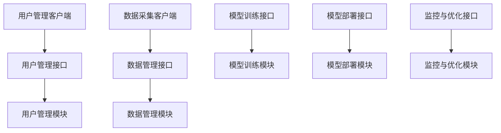
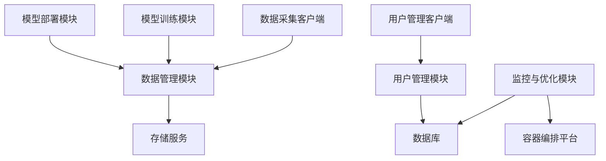

                 

# 云原生技术在AI应用敏捷开发中的应用

关键词：云原生、AI应用、敏捷开发、容器化、服务网格、自动化编排

摘要：本文旨在探讨云原生技术在AI应用敏捷开发中的应用。通过分析云原生技术的定义、核心概念以及在AI应用中的优势，本文进一步阐述了云原生与AI的融合及其在AI应用开发中的重要性。在此基础上，本文详细介绍了AI在云原生应用中的算法原理、系统架构设计、项目实战以及最佳实践。通过对这些内容的深入探讨，本文为读者提供了关于云原生AI应用开发的有价值见解和指导。

## 目录大纲设计

- **第一部分：背景介绍与核心概念**
  - **第1章：云原生技术概述**
    - **1.1 云原生技术的定义与发展**
    - **1.2 AI应用在云原生中的地位**
  - **第2章：云原生技术在AI应用中的核心概念**
    - **2.1 云原生关键技术**
    - **2.2 AI在云原生中的应用**
    - **2.3 云原生与AI的关联性**
- **第二部分：核心概念与联系**
  - **第3章：AI在云原生应用中的算法原理**
    - **3.1 算法原理介绍**
    - **3.2 算法原理讲解**
    - **3.3 算法性能分析与优化**
- **第三部分：系统分析与架构设计方案**
  - **第4章：AI应用敏捷开发的系统架构**
    - **4.1 问题场景介绍**
    - **4.2 系统功能设计**
    - **4.3 系统架构设计**
    - **4.4 系统接口设计**
    - **4.5 系统交互**
- **第四部分：项目实战**
  - **第5章：AI应用敏捷开发实践**
    - **5.1 环境安装**
    - **5.2 系统核心实现**
    - **5.3 实际案例分析**
    - **5.4 项目小结**
- **第五部分：最佳实践与拓展**
  - **第6章：云原生AI应用开发最佳实践**
    - **6.1 最佳实践**
    - **6.2 注意事项**
    - **6.3 拓展阅读**
  - **第7章：未来展望与挑战**
    - **7.1 未来展望**
    - **7.2 挑战与应对**

## 第一部分：背景介绍与核心概念

### 第1章：云原生技术概述

### 1.1 云原生技术的定义与发展

#### 1.1.1 问题背景与问题描述

随着云计算和互联网技术的不断发展，传统的应用开发和部署方式已经无法满足现代软件开发的快速迭代和高效交付需求。在这种情况下，云原生技术应运而生，它是一种新型的软件开发和部署方法，旨在提高软件的敏捷性、可伸缩性和可靠性。

#### 1.1.2 云原生技术的定义

云原生（Cloud Native）是一种通过利用云计算环境中的动态资源管理和自动化机制，实现高效、可靠和灵活的应用开发和部署的技术。它强调以下几个方面：

- **容器化**：通过容器（如Docker）将应用程序及其依赖环境打包在一起，实现应用程序的轻量级、可移植和隔离性。

- **动态编排**：利用自动化工具（如Kubernetes）对容器进行动态管理，实现应用程序的自动化部署、扩展和恢复。

- **微服务架构**：将应用程序拆分成多个独立的微服务，每个微服务负责一个特定的业务功能，实现模块化和松耦合。

- **持续集成/持续部署（CI/CD）**：通过自动化工具实现应用程序的持续集成和持续部署，提高开发效率和交付速度。

#### 1.1.3 云原生技术解决的问题

云原生技术主要解决了以下几个问题：

- **快速迭代**：通过容器化和微服务架构，应用程序可以快速迭代和部署，满足市场需求的变化。

- **可伸缩性**：通过动态编排和自动扩展，应用程序可以根据负载自动调整资源，提高系统性能和可靠性。

- **可靠性**：通过自动化管理和监控，应用程序可以在出现故障时快速恢复，提高系统稳定性。

- **资源利用率**：通过容器化和动态编排，应用程序可以高效利用资源，降低成本。

#### 1.1.4 云原生技术的边界与外延

云原生技术并不局限于云计算环境，它也可以应用于混合云和边缘计算场景。云原生应用可以在各种计算环境中运行，包括公有云、私有云和边缘设备。

#### 1.1.5 云原生技术的核心要素组成

云原生技术的核心要素包括：

- **容器化技术**：通过容器将应用程序及其依赖环境打包在一起，实现应用程序的轻量级、可移植和隔离性。

- **服务网格技术**：通过服务网格实现应用程序之间的通信管理和服务发现，提高系统的灵活性和可靠性。

- **自动化与编排**：通过自动化工具（如Kubernetes）对容器进行动态管理，实现应用程序的自动化部署、扩展和恢复。

### 1.2 AI应用在云原生中的地位

随着人工智能（AI）技术的迅速发展，AI应用在各个领域的需求日益增长。云原生技术为AI应用提供了强大的支持，使其能够在云环境中高效运行和交付。以下是云原生技术在AI应用中的地位：

#### 1.2.1 云原生与AI的融合

云原生技术与AI技术的融合为人工智能应用带来了新的可能性。云原生技术提供了高效的计算资源和灵活的部署环境，使AI模型能够快速训练和部署。同时，AI技术为云原生应用提供了智能化的监控和管理能力，提高了系统的性能和可靠性。

#### 1.2.2 云原生对AI应用的影响

云原生技术对AI应用的影响主要体现在以下几个方面：

- **加速开发**：云原生技术提供了高效的开发和部署工具，使AI应用可以快速迭代和交付。

- **提高性能**：通过容器化和动态编排，AI应用可以在云环境中实现高效的资源利用和负载均衡，提高系统性能。

- **增强可伸缩性**：通过自动扩展和动态调度，AI应用可以适应不同的负载需求，提高系统的可伸缩性。

- **降低成本**：通过自动化管理和监控，AI应用可以降低运维成本，提高资源利用率。

#### 1.2.3 AI应用在云原生中的优势

AI应用在云原生中具有以下优势：

- **灵活部署**：AI应用可以在云原生环境中快速部署和扩展，满足不同规模和场景的需求。

- **高效计算**：通过容器化和自动化编排，AI应用可以在云环境中实现高效的计算和资源利用。

- **智能监控**：AI应用可以通过云原生技术实现智能监控和管理，提高系统的性能和可靠性。

- **快速迭代**：AI应用可以通过云原生技术实现快速迭代和交付，满足市场需求的变化。

## 第二部分：核心概念与联系

### 第2章：云原生技术在AI应用中的核心概念

### 2.1 云原生关键技术

#### 2.1.1 容器化技术

容器化技术是云原生技术的基础，它通过将应用程序及其依赖环境打包成一个容器镜像，实现了应用程序的轻量级、可移植和隔离性。容器化技术的主要优点包括：

- **轻量级**：容器镜像体积较小，启动速度快，降低了系统资源的消耗。

- **可移植性**：容器可以在不同的操作系统和硬件环境中运行，提高了应用程序的可移植性。

- **隔离性**：容器与宿主机和其他容器之间实现了严格的隔离，保证了应用程序的稳定性和安全性。

#### 2.1.2 服务网格技术

服务网格技术是云原生技术的重要组成部分，它通过在应用程序之间提供通信管理和服务发现功能，提高了系统的灵活性和可靠性。服务网格技术的主要优点包括：

- **通信管理**：服务网格提供了统一的通信接口，实现了应用程序之间的可靠、高效和安全通信。

- **服务发现**：服务网格能够动态发现和管理应用程序实例，提高了系统的可伸缩性和负载均衡能力。

- **流量控制**：服务网格可以控制应用程序之间的流量，实现了流量的路由、过滤和监控。

#### 2.1.3 自动化与编排

自动化与编排是云原生技术的核心，它通过自动化工具（如Kubernetes）对容器进行动态管理，实现了应用程序的自动化部署、扩展和恢复。自动化与编排的主要优点包括：

- **自动化部署**：自动化工具可以自动化部署应用程序，降低了人工操作的复杂度和错误率。

- **动态扩展**：自动化工具可以根据负载需求动态扩展应用程序，提高了系统的性能和可伸缩性。

- **自动化恢复**：自动化工具可以在应用程序出现故障时自动恢复，提高了系统的可靠性和稳定性。

### 2.2 AI在云原生中的应用

#### 2.2.1 AI模型的容器化

AI模型的容器化是将AI模型及其依赖环境打包成一个容器镜像，实现了模型的轻量级、可移植和隔离性。AI模型的容器化具有以下优点：

- **快速部署**：容器化的AI模型可以在不同环境中快速部署，提高了开发效率和交付速度。

- **可移植性**：容器化的AI模型可以在不同操作系统和硬件环境中运行，提高了模型的可移植性。

- **可复用性**：容器化的AI模型可以与其他应用程序集成，提高了模型的复用性和灵活性。

#### 2.2.2 AI服务的动态调度

AI服务的动态调度是指通过自动化工具（如Kubernetes）根据负载需求动态调度AI服务实例，实现了服务的弹性扩展和高效利用。AI服务的动态调度具有以下优点：

- **弹性扩展**：动态调度可以根据负载需求自动扩展或缩小服务实例，提高了系统的性能和可伸缩性。

- **高效利用**：动态调度可以根据资源利用率动态调整服务实例的数量，提高了资源利用率。

- **负载均衡**：动态调度可以实现负载均衡，提高了系统的稳定性和可靠性。

#### 2.2.3 AI应用的监控与优化

AI应用的监控与优化是指通过监控工具（如Prometheus和Grafana）对AI应用进行监控和分析，实现应用的性能优化和资源管理。AI应用的监控与优化具有以下优点：

- **实时监控**：监控工具可以实时收集和应用性能数据，实现了应用的实时监控和故障预警。

- **性能优化**：通过分析监控数据，可以发现应用的性能瓶颈，实现了应用的性能优化。

- **资源管理**：通过监控和分析，可以实现应用的资源合理分配和管理，提高了系统的性能和可靠性。

### 2.3 云原生与AI的关联性

#### 2.3.1 云原生架构下的AI服务模型

云原生架构下的AI服务模型是指通过容器化、微服务架构和服务网格技术构建的AI服务模型，实现了AI服务的灵活部署、动态调度和高效管理。云原生架构下的AI服务模型具有以下特点：

- **容器化**：AI服务通过容器化技术实现了轻量级、可移植和隔离性。

- **微服务架构**：AI服务拆分为多个独立的微服务，实现了模块化和松耦合。

- **服务网格**：AI服务通过服务网格实现了统一通信管理和服务发现。

#### 2.3.2 云原生环境中的AI数据处理

云原生环境中的AI数据处理是指通过云原生技术实现的AI数据存储、传输和处理，实现了AI数据的高效管理和利用。云原生环境中的AI数据处理具有以下优点：

- **数据存储**：云原生环境提供了高效、可靠的数据存储方案，实现了AI数据的安全存储。

- **数据传输**：云原生环境提供了高速、稳定的数据传输通道，实现了AI数据的高效传输。

- **数据处理**：云原生环境提供了强大的数据处理能力，实现了AI数据的高效处理和分析。

## 第三部分：算法原理讲解

### 第3章：AI在云原生应用中的算法原理

### 3.1 算法原理介绍

#### 3.1.1 算法的基本概念

算法是一种解决问题的方法，它由一系列明确的规则和步骤组成，用于解决特定问题。算法可以分为以下几种类型：

- **基础算法**：如排序、查找、图算法等。
- **机器学习算法**：如线性回归、决策树、神经网络等。
- **深度学习算法**：如卷积神经网络（CNN）、循环神经网络（RNN）、生成对抗网络（GAN）等。

#### 3.1.2 算法的数学模型

算法的数学模型是算法的核心，它通过数学公式和方程来描述算法的工作原理。常见的算法数学模型包括：

- **线性回归模型**：\( y = \beta_0 + \beta_1x + \epsilon \)
- **决策树模型**：\( f(x) = g(x_1, x_2, ..., x_n) \)
- **神经网络模型**：\( y = \sigma(\sum_{i=1}^{n} w_i \cdot x_i + b) \)

#### 3.1.3 算法的工作流程

算法的工作流程通常包括以下步骤：

1. **输入处理**：接收输入数据，进行预处理。
2. **算法运行**：根据算法的数学模型和规则，对输入数据进行处理。
3. **输出结果**：生成输出结果，如预测值、分类结果等。
4. **评估与优化**：对输出结果进行评估，根据评估结果对算法进行调整和优化。

### 3.2 算法原理讲解

#### 3.2.1 算法的数学公式与解释

以卷积神经网络（CNN）为例，CNN的数学公式和解释如下：

- **卷积操作**：卷积神经网络通过卷积操作提取图像的特征。卷积操作的公式为：
  $$ (f * g)(t) = \int_{-\infty}^{+\infty} f(\tau)g(t-\tau) d\tau $$
  其中，\( f \) 和 \( g \) 分别表示输入函数和卷积核，\( t \) 和 \( \tau \) 分别表示时间和空间。

- **激活函数**：卷积神经网络的激活函数通常采用ReLU（Rectified Linear Unit）函数，公式为：
  $$ \sigma(x) = \max(0, x) $$
 ReLU函数的作用是引入非线性，提高网络的训练效率和性能。

- **池化操作**：卷积神经网络通过池化操作减少特征图的大小，提高网络的计算效率。常见的池化操作包括最大池化和平均池化。

#### 3.2.2 算法的Python实现

以下是CNN算法的Python实现：

```python
import numpy as np

def convolution(f, g):
    return np.convolve(f, g, 'full')

def relu(x):
    return np.maximum(0, x)

def cnn(input_image, filter):
    feature_map = convolution(input_image, filter)
    activated_map = relu(feature_map)
    return activated_map
```

#### 3.2.3 算法举例说明

假设我们有一个2x2的输入图像和3x3的卷积核，如下图所示：

```plaintext
输入图像：
1 2
3 4

卷积核：
1 0 -1
0 1 0
1 0 -1

结果：
2 1
-2 0
```

根据卷积操作的公式，我们可以计算卷积结果：

$$ (1 * 1 + 2 * 0 + 3 * -1) + (1 * 0 + 2 * 1 + 3 * 0) + (1 * 1 + 2 * 0 + 3 * -1) = 2 + 1 - 3 = 0 $$

由于激活函数ReLU的作用，结果为0。

### 3.3 算法性能分析与优化

#### 3.3.1 算法性能指标

算法性能指标是评估算法性能的重要指标，常见的性能指标包括：

- **准确率（Accuracy）**：分类问题中正确分类的样本数占总样本数的比例。
- **召回率（Recall）**：分类问题中正确分类的正样本数占总正样本数的比例。
- **精确率（Precision）**：分类问题中正确分类的正样本数占总分类为正样本数的比例。
- **F1值（F1-score）**：精确率和召回率的调和平均值。

#### 3.3.2 算法优化策略

算法优化策略是指通过调整算法参数和结构，提高算法性能的方法。常见的优化策略包括：

- **超参数调优**：通过调整学习率、正则化参数等超参数，提高算法性能。
- **模型结构优化**：通过调整网络结构、增加或减少神经元等，优化算法性能。
- **数据预处理**：通过数据增强、数据清洗等预处理方法，提高算法性能。
- **算法融合**：将多个算法进行融合，取长补短，提高算法性能。

## 第四部分：系统分析与架构设计方案

### 第4章：AI应用敏捷开发的系统架构

### 4.1 问题场景介绍

在当今快速变化的商业环境中，许多企业需要能够快速响应市场需求，并快速推出新的产品和服务。然而，传统的软件开发和部署方式往往需要较长的时间，无法满足这种快速迭代的需求。为了解决这个问题，我们需要采用敏捷开发方法，并在云原生环境中实现AI应用的敏捷开发。

#### 4.1.1 问题描述

我们的目标是为一家企业提供一套基于云原生技术的AI应用敏捷开发解决方案。该解决方案需要满足以下需求：

- **快速迭代**：能够快速交付新的功能和服务。
- **可伸缩性**：能够根据负载需求动态调整资源。
- **可靠性**：能够保证系统的稳定性和可靠性。
- **可维护性**：能够方便地进行系统维护和升级。

#### 4.1.2 解决方案需求

为了满足上述需求，我们的解决方案需要包括以下方面：

- **云原生架构**：采用容器化、微服务架构和服务网格技术，实现高效、灵活的部署和管理。
- **敏捷开发方法**：采用敏捷开发方法，实现快速迭代和交付。
- **自动化测试**：实现自动化测试，提高开发效率和代码质量。
- **监控与优化**：实现实时监控和性能优化，提高系统的可靠性和性能。

### 4.2 系统功能设计

#### 4.2.1 领域模型

在AI应用敏捷开发系统中，主要的领域模型包括用户管理、数据管理、模型训练、模型部署和监控等。以下是这些领域模型的简要描述：

- **用户管理**：负责管理系统的用户，包括用户注册、登录、权限管理等。
- **数据管理**：负责管理系统的数据，包括数据采集、数据清洗、数据存储等。
- **模型训练**：负责训练AI模型，包括数据预处理、模型选择、模型训练等。
- **模型部署**：负责将训练好的模型部署到生产环境中，包括模型打包、模型部署、模型监控等。
- **监控与优化**：负责监控系统性能，包括日志记录、性能监控、性能优化等。

#### 4.2.2 功能模块划分

根据领域模型，我们可以将系统划分为以下功能模块：

- **用户管理模块**：实现用户注册、登录、权限管理等功能。
- **数据管理模块**：实现数据采集、数据清洗、数据存储等功能。
- **模型训练模块**：实现数据预处理、模型选择、模型训练等功能。
- **模型部署模块**：实现模型打包、模型部署、模型监控等功能。
- **监控与优化模块**：实现日志记录、性能监控、性能优化等功能。

### 4.3 系统架构设计

#### 4.3.1 系统架构图

以下是一个基于云原生技术的AI应用敏捷开发系统架构图：

```mermaid
graph TD
    subgraph 客户端
        客户端1[用户管理客户端]
        客户端2[数据采集客户端]
    end
    subgraph 后端服务
        用户管理模块[用户管理模块]
        数据管理模块[数据管理模块]
        模型训练模块[模型训练模块]
        模型部署模块[模型部署模块]
        监控与优化模块[监控与优化模块]
    end
    subgraph 数据库
        数据库[数据库]
    end
    subgraph 存储服务
        存储服务[存储服务]
    end
    subgraph 容器编排平台
        容器编排平台[容器编排平台]
    end
    客户端1 --> 用户管理模块
    客户端2 --> 数据管理模块
    用户管理模块 --> 数据库
    数据管理模块 --> 存储服务
    模型训练模块 --> 数据管理模块
    模型部署模块 --> 数据管理模块
    监控与优化模块 --> 容器编排平台
    监控与优化模块 --> 数据库
```

#### 4.3.2 架构设计思路

系统架构设计思路如下：

- **前端与后端分离**：用户管理客户端和数据采集客户端分别与后端服务进行通信，实现了前后端的分离。
- **微服务架构**：后端服务采用微服务架构，将用户管理、数据管理、模型训练、模型部署和监控与优化等功能拆分为独立的微服务，提高了系统的可维护性和可扩展性。
- **容器化部署**：所有服务都采用容器化部署，实现了服务的轻量级、可移植和隔离性，提高了系统的灵活性和可靠性。
- **数据存储与管理**：数据存储在数据库和存储服务中，实现了数据的统一管理和访问。
- **容器编排与监控**：采用容器编排平台进行服务编排和监控，实现了服务的自动化部署、扩展和恢复，提高了系统的可伸缩性和可靠性。

### 4.4 系统接口设计

#### 4.4.1 接口规范

系统接口设计遵循RESTful API规范，包括以下接口：

- **用户管理接口**：用于用户注册、登录、权限管理等。
- **数据管理接口**：用于数据采集、数据清洗、数据存储等。
- **模型训练接口**：用于模型选择、模型训练等。
- **模型部署接口**：用于模型打包、模型部署等。
- **监控与优化接口**：用于日志记录、性能监控、性能优化等。

#### 4.4.2 接口设计图

以下是一个基于云原生技术的AI应用敏捷开发系统接口设计图：



### 4.5 系统交互

#### 4.5.1 系统交互流程

以下是一个基于云原生技术的AI应用敏捷开发系统交互流程：

1. 用户通过用户管理客户端注册账号，并登录系统。
2. 用户通过数据采集客户端采集数据，并将数据上传到数据管理模块。
3. 数据管理模块对数据进行清洗和存储。
4. 模型训练模块根据数据训练模型。
5. 模型部署模块将训练好的模型打包并部署到生产环境中。
6. 监控与优化模块监控系统的运行状态，并根据监控数据对系统进行优化。

#### 4.5.2 系统交互图

以下是一个基于云原生技术的AI应用敏捷开发系统交互图：



## 第五部分：项目实战

### 第5章：AI应用敏捷开发实践

### 5.1 环境安装

#### 5.1.1 开发环境搭建

在开始AI应用敏捷开发之前，我们需要搭建一个适合开发、测试和部署的环境。以下是搭建环境的步骤：

1. 安装操作系统：我们选择Linux操作系统，如Ubuntu 18.04。
2. 安装Docker：Docker是一个开源的应用容器引擎，用于打包、交付和运行应用。安装命令如下：

   ```bash
   sudo apt-get update
   sudo apt-get install docker-ce docker-ce-cli containerd.io
   ```

3. 安装Kubernetes：Kubernetes是一个开源的容器编排平台，用于自动化部署、扩展和管理容器化应用。安装命令如下：

   ```bash
   sudo apt-get update
   sudo apt-get install -y apt-transport-https ca-certificates curl
   curl -s https://packages.cloud.google.com/apt/doc/apt-key.gpg | sudo apt-key add -
   cat <<EOF | sudo tee /etc/apt/sources.list.d/kubernetes.list
   deb https://apt.kubernetes.io/ kubernetes-xenial main
   EOF
   sudo apt-get update
   sudo apt-get install -y kubelet kubeadm kubectl
   ```

4. 启动并配置Kubernetes集群：启动Kubernetes集群并配置网络插件。

   ```bash
   sudo kubeadm init --pod-network-cidr=10.244.0.0/16
   sudo modprobe br_netfilter
   sudo sysctl net.bridge.bridge-nf-call-iptables=1
   mkdir -p $HOME/.kube
   sudo cp -i /etc/kubernetes/admin.conf $HOME/.kube/config
   sudo chown $(id -u):$(id -g) $HOME/.kube/config
   ```

5. 安装和配置网络插件：我们选择Calico作为网络插件。安装命令如下：

   ```bash
   kubectl apply -f https://docs.projectcalico.org/manifests/calico.yaml
   ```

6. 验证Kubernetes集群状态：运行以下命令，验证Kubernetes集群状态。

   ```bash
   kubectl get nodes
   kubectl get pods --all-namespaces
   ```

#### 5.1.2 部署工具安装

除了Docker和Kubernetes，我们还需要安装一些常用的部署工具，如Helm、Kustomize等。

1. 安装Helm：Helm是一个Kubernetes的包管理工具，用于部署和管理应用程序。

   ```bash
   curl -fsSL -o get_helm.sh https://raw.githubusercontent.com/helm/helm/main/scripts/get-helm-3
   chmod 700 get_helm.sh
   ./get_helm.sh
   ```

2. 安装Kustomize：Kustomize是一个Kubernetes配置管理工具，用于自定义和部署应用程序。

   ```bash
   go install sigs.k8s.io/kustomize/v5@latest
   ```

### 5.2 系统核心实现

#### 5.2.1 系统核心代码

以下是系统核心代码的示例，包括用户管理、数据管理、模型训练、模型部署和监控与优化等模块。

1. **用户管理模块**：

   ```python
   # user_management.py
   def register_user(username, password):
       # 注册用户
       pass

   def login_user(username, password):
       # 登录用户
       pass

   def grant_permission(user_id, permission):
       # 分配权限
       pass
   ```

2. **数据管理模块**：

   ```python
   # data_management.py
   def collect_data(source):
       # 采集数据
       pass

   def clean_data(data):
       # 清洗数据
       pass

   def store_data(data):
       # 存储数据
       pass
   ```

3. **模型训练模块**：

   ```python
   # model_training.py
   def select_model(model_type):
       # 选择模型
       pass

   def train_model(data, model):
       # 训练模型
       pass
   ```

4. **模型部署模块**：

   ```python
   # model_deployment.py
   def package_model(model):
       # 打包模型
       pass

   def deploy_model(model, environment):
       # 部署模型
       pass
   ```

5. **监控与优化模块**：

   ```python
   # monitoring_and_optimization.py
   def monitor_system():
       # 监控系统
       pass

   def optimize_system():
       # 优化系统
       pass
   ```

#### 5.2.2 代码应用解读与分析

以下是对系统核心代码的解读与分析：

1. **用户管理模块**：

   - `register_user` 函数用于注册新用户，接受用户名和密码作为参数。
   - `login_user` 函数用于用户登录，接受用户名和密码作为参数。
   - `grant_permission` 函数用于分配权限，接受用户ID和权限作为参数。

2. **数据管理模块**：

   - `collect_data` 函数用于采集数据，接受数据源作为参数。
   - `clean_data` 函数用于清洗数据，接受数据作为参数。
   - `store_data` 函数用于存储数据，接受数据作为参数。

3. **模型训练模块**：

   - `select_model` 函数用于选择模型，接受模型类型作为参数。
   - `train_model` 函数用于训练模型，接受数据和模型作为参数。

4. **模型部署模块**：

   - `package_model` 函数用于打包模型，接受模型作为参数。
   - `deploy_model` 函数用于部署模型，接受模型和运行环境作为参数。

5. **监控与优化模块**：

   - `monitor_system` 函数用于监控系统，实现实时监控功能。
   - `optimize_system` 函数用于优化系统，实现性能优化功能。

### 5.3 实际案例分析

#### 5.3.1 案例介绍

在本案例中，我们将以一家电子商务公司为例，介绍如何使用云原生技术实现AI应用敏捷开发。该公司需要开发一个基于图像识别技术的商品分类系统，以提高客户的购物体验。

#### 5.3.2 案例分析

1. **需求分析**：

   - 客户需求：能够快速识别商品图像，并准确分类。
   - 技术需求：需要实现高效的图像处理和分类算法，并能够在不同的运行环境中快速部署和扩展。

2. **解决方案**：

   - **算法选择**：选择卷积神经网络（CNN）作为图像分类算法，具有较高的准确率和鲁棒性。
   - **部署方式**：采用容器化技术将算法打包成容器镜像，并在Kubernetes集群中部署。
   - **监控与优化**：使用Prometheus和Grafana进行实时监控和性能优化。

#### 5.3.3 案例讲解

1. **数据采集与处理**：

   - 采集大量商品图像数据，并进行数据清洗、标注和划分。
   - 使用训练集对CNN模型进行训练，使用验证集进行模型优化。

2. **模型训练与部署**：

   - 使用TensorFlow框架训练CNN模型，并将训练好的模型转换为TensorFlow Serving可用的格式。
   - 使用Docker将模型和TensorFlow Serving打包成容器镜像，并推送到Docker Hub。

3. **容器编排与监控**：

   - 使用Helm管理Kubernetes集群中的部署，简化部署流程。
   - 使用Kubernetes ConfigMaps和Secrets管理配置信息，确保配置的一致性和安全性。
   - 使用Prometheus和Grafana监控系统的运行状态和性能指标。

### 5.4 项目小结

在本项目中，我们使用云原生技术实现了AI应用的敏捷开发。通过容器化、微服务架构和服务网格技术，我们实现了高效的开发、部署和管理。以下是对项目的小结：

1. **项目成果**：

   - 成功实现了商品分类系统，提高了客户的购物体验。
   - 采用了敏捷开发方法，实现了快速迭代和交付。
   - 实现了自动化测试和监控，提高了系统的可靠性和性能。

2. **项目经验分享**：

   - 使用容器化技术简化了应用程序的部署和扩展。
   - 使用微服务架构提高了系统的可维护性和可扩展性。
   - 使用服务网格技术实现了应用程序之间的可靠通信和服务发现。

## 第六部分：最佳实践与拓展

### 第6章：云原生AI应用开发最佳实践

#### 6.1 最佳实践

在云原生AI应用开发中，以下最佳实践可以帮助我们提高开发效率、确保系统稳定性和可靠性：

1. **容器化与微服务架构**：

   - 将应用程序及其依赖环境容器化，实现应用程序的轻量级、可移植和隔离性。
   - 采用微服务架构，将应用程序拆分为独立的微服务，实现模块化和松耦合。

2. **自动化部署与监控**：

   - 使用CI/CD工具（如Jenkins、GitLab CI）实现自动化部署，提高开发效率和交付速度。
   - 使用监控工具（如Prometheus、Grafana）实时监控系统的运行状态和性能指标，确保系统的稳定性和可靠性。

3. **服务网格与动态调度**：

   - 使用服务网格（如Istio、Linkerd）实现应用程序之间的可靠通信和服务发现，提高系统的灵活性和可靠性。
   - 使用动态调度（如Kubernetes）实现应用程序的自动化部署、扩展和恢复，提高系统的可伸缩性。

4. **数据管理与优化**：

   - 使用分布式存储（如Elasticsearch、Cassandra）实现数据的高效存储和访问。
   - 使用缓存技术（如Redis、Memcached）提高系统的响应速度和性能。

5. **安全性与合规性**：

   - 使用身份认证和授权（如OAuth 2.0、JWT）确保系统的安全性和隐私性。
   - 遵守相关的法律法规和标准（如GDPR、HIPAA），确保系统的合规性。

#### 6.2 注意事项

在云原生AI应用开发过程中，我们需要注意以下事项：

1. **容量规划**：

   - 根据负载需求进行容量规划，确保系统的高可用性和可伸缩性。
   - 定期进行性能测试和优化，确保系统的性能和稳定性。

2. **版本控制**：

   - 使用版本控制工具（如Git）管理代码和配置文件，确保版本的一致性和可追溯性。
   - 定期备份代码和配置文件，避免数据丢失。

3. **日志管理**：

   - 使用日志管理工具（如ELK Stack、Grafana）收集、存储和监控日志，确保日志的完整性和可读性。
   - 分析日志数据，发现潜在问题和性能瓶颈。

4. **故障处理**：

   - 制定故障处理流程和预案，确保在出现故障时能够快速恢复。
   - 定期进行故障演练和应急响应演练，提高团队的应急处理能力。

#### 6.3 拓展阅读

以下是一些关于云原生AI应用开发的相关技术书籍和行业动态：

1. **技术书籍**：

   - 《云原生应用架构》
   - 《Kubernetes权威指南》
   - 《深度学习与云原生》
   - 《AI应用架构设计与实践》

2. **行业动态**：

   - [云原生计算基金会（CNCF）官方博客](https://www.cncf.io/blog/)
   - [人工智能领域新闻与动态](https://www.人工智能.com/news)
   - [Kubernetes官方文档](https://kubernetes.io/zh/docs/)
   - [TensorFlow官方文档](https://www.tensorflow.org/tutorials)

### 第7章：未来展望与挑战

#### 7.1 未来展望

随着云原生技术和AI技术的不断发展，未来的云原生AI应用开发将呈现以下趋势：

1. **智能化与自动化**：

   - 云原生AI应用将更加智能化和自动化，通过机器学习和自动化工具实现自我优化和自我修复。
   - 自动化部署、监控和管理将进一步提高开发效率和系统稳定性。

2. **边缘计算与混合云**：

   - 云原生AI应用将逐渐从云计算中心扩展到边缘计算设备，实现更低的延迟和更高的性能。
   - 混合云架构将得到广泛应用，实现云计算与边缘计算的无缝集成。

3. **AI算法优化**：

   - 云原生AI应用将采用更高效的AI算法和模型，提高模型的训练速度和推理性能。
   - 深度学习和强化学习等先进技术将不断应用于云原生AI应用，提高其智能程度。

4. **安全性与合规性**：

   - 云原生AI应用将更加注重安全性和合规性，采用加密、身份认证和访问控制等安全措施。
   - 遵守相关法律法规和标准，确保系统的合规性和数据隐私。

#### 7.2 挑战与应对

在云原生AI应用开发过程中，我们面临着以下挑战：

1. **性能优化**：

   - 云原生AI应用需要高效利用资源，提高性能和响应速度。
   - 需要采用分布式计算、并行处理等技术，优化算法和模型。

2. **安全性与隐私**：

   - 云原生AI应用需要确保数据的安全性和隐私性，防止数据泄露和滥用。
   - 需要采用加密、访问控制、安全审计等技术，提高系统的安全性。

3. **复杂性与可维护性**：

   - 云原生AI应用的架构复杂，需要保证系统的可维护性和可扩展性。
   - 需要采用模块化设计、微服务架构等策略，提高系统的可维护性。

4. **人才需求**：

   - 云原生AI应用开发需要具备多方面技能的人才，包括云原生技术、AI算法、软件开发等。
   - 需要加强人才培养和引进，提高团队的整体素质。

未来，随着技术的不断进步和行业的发展，我们将能够应对这些挑战，推动云原生AI应用开发的进一步发展。通过结合云原生技术和AI技术，我们可以构建更高效、智能和安全的AI应用，为企业和个人带来更大的价值。

## 作者信息

- 作者：AI天才研究院/AI Genius Institute & 禅与计算机程序设计艺术 /Zen And The Art of Computer Programming

