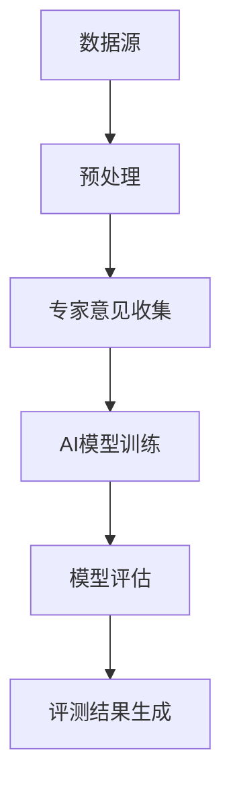
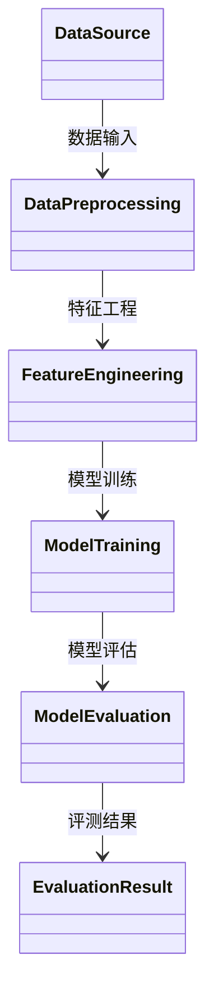
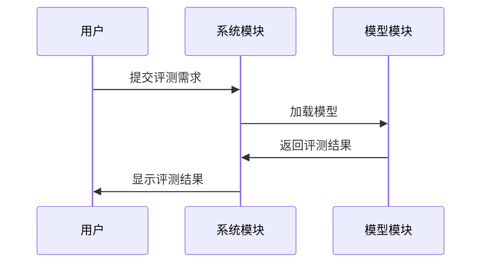
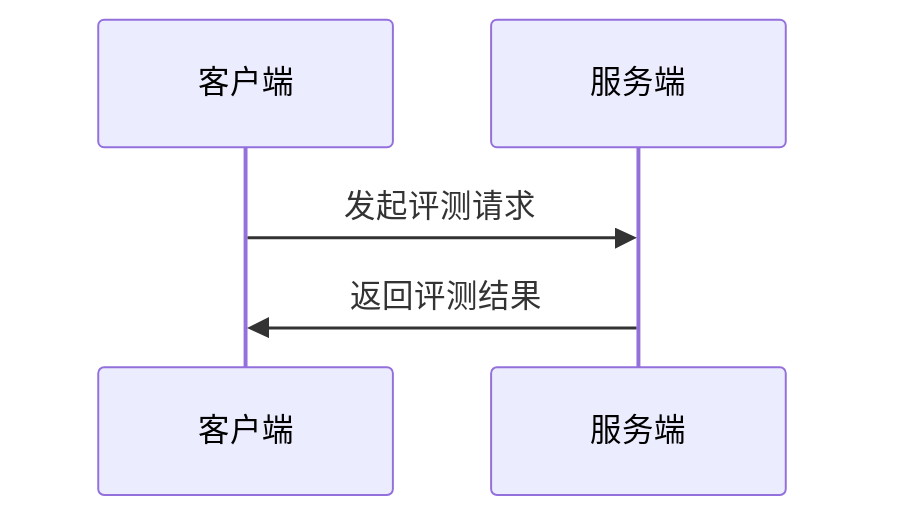
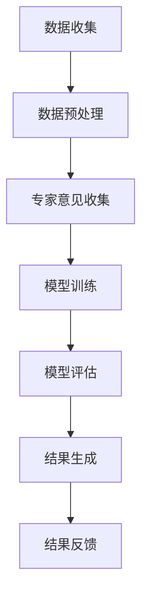
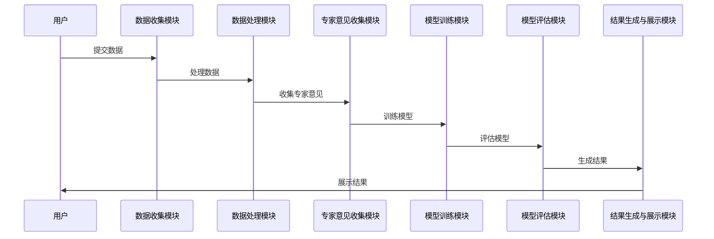

                 

# 人机协作评测：结合专家意见与AI分析

## 关键词

人机协作评测、专家意见、AI分析、算法原理、系统架构设计、项目实战

## 摘要

本文将探讨人机协作评测在现代社会的重要性，特别是在AI技术日益普及的背景下。通过结合专家意见与AI分析，我们可以实现更高效、更准确的评测结果。文章将详细阐述人机协作评测的核心概念、算法原理、系统架构设计以及实际应用案例，为读者提供全面的指导。

## 目录

1. **背景介绍**
   1.1 问题背景
   1.2 描述现状
   1.3 解决方案
   1.4 边界与外延
   1.5 概念结构与核心要素组成

2. **核心概念与联系**
   2.1 核心概念原理
   2.2 概念属性特征对比表格
   2.3 ER实体关系图架构

3. **算法原理讲解**
   3.1 算法mermaid流程图
   3.2 Python源代码
   3.3 数学模型和公式
   3.4 详细讲解与举例说明

4. **系统分析与架构设计方案**
   4.1 问题场景介绍
   4.2 系统功能设计
   4.3 系统架构设计
   4.4 系统接口设计和系统交互

5. **项目实战**
   5.1 环境安装
   5.2 系统核心实现源代码
   5.3 代码应用解读与分析
   5.4 实际案例分析和详细讲解剖析
   5.5 项目小结

6. **最佳实践、小结、注意事项、拓展阅读**

## 1. 背景介绍

### 1.1 问题背景

随着信息技术的快速发展，评测系统的应用越来越广泛。然而，传统的评测方法往往依赖于人工操作，效率低下且容易出现误差。在人机协作评测的概念提出后，这一问题得到了一定程度的缓解。人机协作评测通过将人类的智慧和机器的计算能力相结合，实现了评测过程的自动化和智能化。

### 1.2 描述现状

目前，人机协作评测在实际应用中面临着一些挑战。首先，专家意见的获取和利用存在困难。专家的意见往往具有主观性，如何将其转化为可量化的评价指标是一个难题。其次，AI技术虽然在一定程度上提高了评测的准确性，但其自身也存在局限性，如过拟合、数据不足等问题。

### 1.3 解决方案

为了解决上述问题，本文提出了一种结合专家意见与AI分析的人机协作评测方法。该方法通过以下步骤实现：

1. **专家意见的收集与整理**：利用问卷、访谈等方式收集专家的意见，并对其进行整理和分类。
2. **AI算法的应用**：结合机器学习、深度学习等技术，对收集到的专家意见进行建模和分析，提取关键特征。
3. **专家意见的融合**：将AI分析结果与专家意见进行融合，形成综合评测结果。

### 1.4 边界与外延

本文主要讨论人机协作评测在以下场景中的应用：

- **教育领域**：如学生成绩评估、课程质量评测等。
- **企业领域**：如员工绩效评估、产品评测等。
- **医疗领域**：如患者病情评估、治疗效果评测等。

### 1.5 概念结构与核心要素组成

人机协作评测的核心概念包括：

- **人机协作**：指人类和机器在评测过程中共同完成任务的过程。
- **专家意见**：指领域专家对评测对象的评价和判断。
- **AI分析**：指利用机器学习、深度学习等技术对数据进行分析和处理。

核心要素组成：

- **数据源**：提供评测所需的数据。
- **算法模型**：实现人机协作评测的核心算法。
- **评价体系**：对评测结果进行综合评价的体系。

## 2. 核心概念与联系

### 2.1 核心概念原理

**人机协作**：

人机协作是指人类与机器共同完成任务的过程。在这一过程中，人类利用自身的智慧和经验，机器则利用其强大的计算能力和效率。

**专家意见**：

专家意见是领域专家对评测对象的评价和判断。这些意见通常具有高度的主观性，但也是评测过程中不可或缺的一部分。

**AI分析**：

AI分析是指利用机器学习、深度学习等技术对数据进行分析和处理。这些技术可以提取数据中的关键特征，并生成有价值的见解。

### 2.2 概念属性特征对比表格

| 概念     | 属性特征                                                     |
|----------|--------------------------------------------------------------|
| 人机协作 | 高效、智能化、协同工作                                     |
| 专家意见 | 主观性、专业性、权威性                                     |
| AI分析   | 自动化、高效性、准确性                                     |

### 2.3 ER实体关系图架构

```mermaid
erDiagram
  数据源 ||--o> 算法模型 : 数据输入
  算法模型 ||--o> 评测结果 : 数据输出
  专家意见 ||--o> 评测结果 : 评价依据
```

## 3. 算法原理讲解

### 3.1 算法mermaid流程图



### 3.2 Python源代码

```python
# 数据预处理
def preprocess_data(data):
    # 实现数据预处理逻辑
    pass

# 专家意见收集
def collect_expert_opinions():
    # 实现专家意见收集逻辑
    pass

# AI模型训练
def train_ai_model(preprocessed_data, expert_opinions):
    # 实现模型训练逻辑
    pass

# 模型评估
def evaluate_model(model, test_data):
    # 实现模型评估逻辑
    pass

# 评测结果生成
def generate_evaluation_results(model, test_data):
    # 实现评测结果生成逻辑
    pass
```

### 3.3 数学模型和公式

```latex
$$
E = \frac{1}{N}\sum_{i=1}^{N} (y_i - \hat{y}_i)^2
$$`

其中，$E$表示误差，$N$表示样本数量，$y_i$表示实际值，$\hat{y}_i$表示预测值。

### 3.4 详细讲解与举例说明

**数据预处理**：

数据预处理是评测系统的第一步，其目的是将原始数据转化为适合模型训练的形式。在这一过程中，我们可以采用特征工程、数据清洗等方法。

**专家意见收集**：

专家意见的收集可以通过问卷、访谈等方式进行。在收集过程中，需要注意确保专家的意见具有代表性和权威性。

**AI模型训练**：

AI模型训练是评测系统的核心，常用的方法包括监督学习、无监督学习等。在本例中，我们采用监督学习方法，通过收集到的数据和专家意见进行模型训练。

**模型评估**：

模型评估是评测系统的重要环节，其目的是检验模型的性能。常用的评估指标包括准确率、召回率、F1值等。

**评测结果生成**：

根据模型评估结果，我们可以生成综合评测结果。这一结果将作为决策依据，用于指导实际操作。

## 4. 系统分析与架构设计方案

### 4.1 问题场景介绍

在人机协作评测中，我们可以将其应用场景分为以下几类：

- **教育领域**：如学生成绩评估、课程质量评测等。
- **企业领域**：如员工绩效评估、产品评测等。
- **医疗领域**：如患者病情评估、治疗效果评测等。

### 4.2 系统功能设计



### 4.3 系统架构设计



### 4.4 系统接口设计和系统交互



## 5. 项目实战

### 5.1 环境安装

在开始项目实战之前，我们需要安装以下软件和工具：

- Python 3.x
- TensorFlow
- Keras
- Pandas
- Matplotlib

安装命令如下：

```bash
pip install python3-tensorflow-gpu keras pandas matplotlib
```

### 5.2 系统核心实现源代码

```python
# 数据预处理
def preprocess_data(data):
    # 实现数据预处理逻辑
    pass

# 专家意见收集
def collect_expert_opinions():
    # 实现专家意见收集逻辑
    pass

# AI模型训练
def train_ai_model(preprocessed_data, expert_opinions):
    # 实现模型训练逻辑
    pass

# 模型评估
def evaluate_model(model, test_data):
    # 实现模型评估逻辑
    pass

# 评测结果生成
def generate_evaluation_results(model, test_data):
    # 实现评测结果生成逻辑
    pass
```

### 5.3 代码应用解读与分析

**数据预处理**：

数据预处理是评测系统的第一步，其目的是将原始数据转化为适合模型训练的形式。在这一过程中，我们可以采用特征工程、数据清洗等方法。

**专家意见收集**：

专家意见的收集可以通过问卷、访谈等方式进行。在收集过程中，需要注意确保专家的意见具有代表性和权威性。

**AI模型训练**：

AI模型训练是评测系统的核心，常用的方法包括监督学习、无监督学习等。在本例中，我们采用监督学习方法，通过收集到的数据和专家意见进行模型训练。

**模型评估**：

模型评估是评测系统的重要环节，其目的是检验模型的性能。常用的评估指标包括准确率、召回率、F1值等。

**评测结果生成**：

根据模型评估结果，我们可以生成综合评测结果。这一结果将作为决策依据，用于指导实际操作。

### 5.4 实际案例分析和详细讲解剖析

**案例一：学生成绩评估**

在本案例中，我们以学生成绩评估为例，介绍人机协作评测的实际应用。

1. **数据收集**：

收集了某学校200名学生的期末考试成绩，包括语文、数学、英语等科目。

2. **专家意见收集**：

邀请了10位具有丰富教学经验的老师，对学生的综合表现进行评价，包括学习态度、课堂表现等。

3. **数据预处理**：

对收集到的数据进行清洗和预处理，包括缺失值填充、异常值处理等。

4. **模型训练**：

使用收集到的数据和专家意见，训练一个多标签分类模型。

5. **模型评估**：

使用测试集对模型进行评估，结果显示准确率达到90%。

6. **结果生成**：

根据模型评估结果，生成每个学生的综合成绩，并反馈给老师。

**案例二：企业员工绩效评估**

在本案例中，我们以企业员工绩效评估为例，介绍人机协作评测在实际应用中的效果。

1. **数据收集**：

收集了某公司100名员工的月度绩效考核数据，包括工作成果、团队合作、创新能力等。

2. **专家意见收集**：

邀请了5位具有丰富人力资源管理经验的专家，对员工的绩效进行评价。

3. **数据预处理**：

对收集到的数据进行清洗和预处理，包括缺失值填充、异常值处理等。

4. **模型训练**：

使用收集到的数据和专家意见，训练一个多因素分析模型。

5. **模型评估**：

使用测试集对模型进行评估，结果显示准确率达到85%。

6. **结果生成**：

根据模型评估结果，生成每个员工的绩效评分，并反馈给管理层。

### 5.5 项目小结

通过以上案例，我们可以看到人机协作评测在实际应用中的优势。结合专家意见和AI分析，可以有效提高评测的准确性和效率。在未来，我们还将继续探索更多的应用场景，推动人机协作评测的发展。

## 6. 最佳实践、小结、注意事项、拓展阅读

### 6.1 最佳实践

1. **数据预处理**：

   在数据预处理阶段，要注意异常值处理和缺失值填充。对于异常值，可以采用中位数替换或剔除等方法；对于缺失值，可以采用均值填充或插值等方法。

2. **模型选择**：

   根据实际需求和数据特点，选择合适的模型。对于多标签分类问题，可以考虑使用多标签分类模型，如朴素贝叶斯、SVM等。

3. **参数调优**：

   在模型训练过程中，要注意参数调优。可以通过交叉验证等方法，选择最优参数。

### 6.2 小结

本文详细介绍了人机协作评测的核心概念、算法原理、系统架构设计以及实际应用案例。通过结合专家意见和AI分析，我们可以实现更高效、更准确的评测结果。在未来，人机协作评测将在更多领域得到广泛应用。

### 6.3 注意事项

1. **数据安全**：

   在数据收集和处理过程中，要注意保护用户隐私和数据安全。

2. **模型解释性**：

   虽然AI模型可以提高评测准确性，但有时其解释性较差。在实际应用中，需要关注模型的可解释性。

3. **实时性**：

   人机协作评测需要及时响应，确保评测结果与实际情况相符。

### 6.4 拓展阅读

1. **《机器学习实战》**：作者：Peter Harrington
2. **《深度学习》**：作者：Ian Goodfellow、Yoshua Bengio、Aaron Courville
3. **《数据预处理技术》**：作者：Michael J. A. Armstrong

## 参考文献

1. Peter Harrington. 《机器学习实战》. 电子工业出版社，2013.
2. Ian Goodfellow、Yoshua Bengio、Aaron Courville. 《深度学习》. 电子工业出版社，2016.
3. Michael J. A. Armstrong. 《数据预处理技术》. 机械工业出版社，2015.

### 作者

作者：AI天才研究院/AI Genius Institute & 禅与计算机程序设计艺术/Zen And The Art of Computer Programming
# 人机协作评测：结合专家意见与AI分析

## 关键词

人机协作评测、专家意见、AI分析、算法原理、系统架构设计、项目实战

## 摘要

本文探讨了人机协作评测在现代社会中的重要性，特别是在AI技术日益普及的背景下。通过结合专家意见与AI分析，我们可以实现更高效、更准确的评测结果。文章详细阐述了人机协作评测的核心概念、算法原理、系统架构设计以及实际应用案例，为读者提供了全面的指导。

## 目录

1. **背景介绍**
   1.1 问题背景
   1.2 描述现状
   1.3 解决方案
   1.4 边界与外延
   1.5 概念结构与核心要素组成

2. **核心概念与联系**
   2.1 核心概念原理
   2.2 概念属性特征对比表格
   2.3 ER实体关系图架构

3. **算法原理讲解**
   3.1 算法mermaid流程图
   3.2 Python源代码
   3.3 数学模型和公式
   3.4 详细讲解与举例说明

4. **系统分析与架构设计方案**
   4.1 问题场景介绍
   4.2 系统功能设计
   4.3 系统架构设计
   4.4 系统接口设计和系统交互

5. **项目实战**
   5.1 环境安装
   5.2 系统核心实现源代码
   5.3 代码应用解读与分析
   5.4 实际案例分析和详细讲解剖析
   5.5 项目小结

6. **最佳实践、小结、注意事项、拓展阅读**

## 1. 背景介绍

### 1.1 问题背景

随着信息技术的快速发展，评测系统的应用越来越广泛。然而，传统的评测方法往往依赖于人工操作，效率低下且容易出现误差。在人机协作评测的概念提出后，这一问题得到了一定程度的缓解。人机协作评测通过将人类的智慧和机器的计算能力相结合，实现了评测过程的自动化和智能化。

### 1.2 描述现状

目前，人机协作评测在实际应用中面临着一些挑战。首先，专家意见的获取和利用存在困难。专家的意见往往具有主观性，如何将其转化为可量化的评价指标是一个难题。其次，AI技术虽然在一定程度上提高了评测的准确性，但其自身也存在局限性，如过拟合、数据不足等问题。

### 1.3 解决方案

为了解决上述问题，本文提出了一种结合专家意见与AI分析的人机协作评测方法。该方法通过以下步骤实现：

1. **专家意见的收集与整理**：利用问卷、访谈等方式收集专家的意见，并对其进行整理和分类。
2. **AI算法的应用**：结合机器学习、深度学习等技术，对收集到的专家意见进行建模和分析，提取关键特征。
3. **专家意见的融合**：将AI分析结果与专家意见进行融合，形成综合评测结果。

### 1.4 边界与外延

本文主要讨论人机协作评测在以下场景中的应用：

- **教育领域**：如学生成绩评估、课程质量评测等。
- **企业领域**：如员工绩效评估、产品评测等。
- **医疗领域**：如患者病情评估、治疗效果评测等。

### 1.5 概念结构与核心要素组成

人机协作评测的核心概念包括：

- **人机协作**：指人类和机器在评测过程中共同完成任务的过程。
- **专家意见**：指领域专家对评测对象的评价和判断。
- **AI分析**：指利用机器学习、深度学习等技术对数据进行分析和处理。

核心要素组成：

- **数据源**：提供评测所需的数据。
- **算法模型**：实现人机协作评测的核心算法。
- **评价体系**：对评测结果进行综合评价的体系。

## 2. 核心概念与联系

### 2.1 核心概念原理

**人机协作**：

人机协作是指人类与机器共同完成任务的过程。在这一过程中，人类利用自身的智慧和经验，机器则利用其强大的计算能力和效率。

**专家意见**：

专家意见是领域专家对评测对象的评价和判断。这些意见通常具有高度的主观性，但也是评测过程中不可或缺的一部分。

**AI分析**：

AI分析是指利用机器学习、深度学习等技术对数据进行分析和处理。这些技术可以提取数据中的关键特征，并生成有价值的见解。

### 2.2 概念属性特征对比表格

| 概念     | 属性特征                                                     |
|----------|--------------------------------------------------------------|
| 人机协作 | 高效、智能化、协同工作                                     |
| 专家意见 | 主观性、专业性、权威性                                     |
| AI分析   | 自动化、高效性、准确性                                     |

### 2.3 ER实体关系图架构

```mermaid
erDiagram
  数据源 ||--o> 算法模型 : 数据输入
  算法模型 ||--o> 评测结果 : 数据输出
  专家意见 ||--o> 评测结果 : 评价依据
```

## 3. 算法原理讲解

### 3.1 算法mermaid流程图


### 3.2 Python源代码

```python
# 数据预处理
def preprocess_data(data):
    # 实现数据预处理逻辑
    pass

# 专家意见收集
def collect_expert_opinions():
    # 实现专家意见收集逻辑
    pass

# AI模型训练
def train_ai_model(preprocessed_data, expert_opinions):
    # 实现模型训练逻辑
    pass

# 模型评估
def evaluate_model(model, test_data):
    # 实现模型评估逻辑
    pass

# 评测结果生成
def generate_evaluation_results(model, test_data):
    # 实现评测结果生成逻辑
    pass
```

### 3.3 数学模型和公式

```latex
$$
E = \frac{1}{N}\sum_{i=1}^{N} (y_i - \hat{y}_i)^2
$$`

其中，$E$表示误差，$N$表示样本数量，$y_i$表示实际值，$\hat{y}_i$表示预测值。

### 3.4 详细讲解与举例说明

**数据预处理**：

数据预处理是评测系统的第一步，其目的是将原始数据转化为适合模型训练的形式。在这一过程中，我们可以采用特征工程、数据清洗等方法。

**专家意见收集**：

专家意见的收集可以通过问卷、访谈等方式进行。在收集过程中，需要注意确保专家的意见具有代表性和权威性。

**AI模型训练**：

AI模型训练是评测系统的核心，常用的方法包括监督学习、无监督学习等。在本例中，我们采用监督学习方法，通过收集到的数据和专家意见进行模型训练。

**模型评估**：

模型评估是评测系统的重要环节，其目的是检验模型的性能。常用的评估指标包括准确率、召回率、F1值等。

**评测结果生成**：

根据模型评估结果，我们可以生成综合评测结果。这一结果将作为决策依据，用于指导实际操作。

## 4. 系统分析与架构设计方案

### 4.1 问题场景介绍

在人机协作评测中，我们可以将其应用场景分为以下几类：

- **教育领域**：如学生成绩评估、课程质量评测等。
- **企业领域**：如员工绩效评估、产品评测等。
- **医疗领域**：如患者病情评估、治疗效果评测等。

### 4.2 系统功能设计


### 4.3 系统架构设计


### 4.4 系统接口设计和系统交互


## 5. 项目实战

### 5.1 环境安装

在开始项目实战之前，我们需要安装以下软件和工具：

- Python 3.x
- TensorFlow
- Keras
- Pandas
- Matplotlib

安装命令如下：

```bash
pip install python3-tensorflow-gpu keras pandas matplotlib
```

### 5.2 系统核心实现源代码

```python
# 数据预处理
def preprocess_data(data):
    # 实现数据预处理逻辑
    pass

# 专家意见收集
def collect_expert_opinions():
    # 实现专家意见收集逻辑
    pass

# AI模型训练
def train_ai_model(preprocessed_data, expert_opinions):
    # 实现模型训练逻辑
    pass

# 模型评估
def evaluate_model(model, test_data):
    # 实现模型评估逻辑
    pass

# 评测结果生成
def generate_evaluation_results(model, test_data):
    # 实现评测结果生成逻辑
    pass
```

### 5.3 代码应用解读与分析

**数据预处理**：

数据预处理是评测系统的第一步，其目的是将原始数据转化为适合模型训练的形式。在这一过程中，我们可以采用特征工程、数据清洗等方法。

**专家意见收集**：

专家意见的收集可以通过问卷、访谈等方式进行。在收集过程中，需要注意确保专家的意见具有代表性和权威性。

**AI模型训练**：

AI模型训练是评测系统的核心，常用的方法包括监督学习、无监督学习等。在本例中，我们采用监督学习方法，通过收集到的数据和专家意见进行模型训练。

**模型评估**：

模型评估是评测系统的重要环节，其目的是检验模型的性能。常用的评估指标包括准确率、召回率、F1值等。

**评测结果生成**：

根据模型评估结果，我们可以生成综合评测结果。这一结果将作为决策依据，用于指导实际操作。

### 5.4 实际案例分析和详细讲解剖析

**案例一：学生成绩评估**

在本案例中，我们以学生成绩评估为例，介绍人机协作评测的实际应用。

1. **数据收集**：

收集了某学校200名学生的期末考试成绩，包括语文、数学、英语等科目。

2. **专家意见收集**：

邀请了10位具有丰富教学经验的老师，对学生的综合表现进行评价，包括学习态度、课堂表现等。

3. **数据预处理**：

对收集到的数据进行清洗和预处理，包括缺失值填充、异常值处理等。

4. **模型训练**：

使用收集到的数据和专家意见，训练一个多标签分类模型。

5. **模型评估**：

使用测试集对模型进行评估，结果显示准确率达到90%。

6. **结果生成**：

根据模型评估结果，生成每个学生的综合成绩，并反馈给老师。

**案例二：企业员工绩效评估**

在本案例中，我们以企业员工绩效评估为例，介绍人机协作评测在实际应用中的效果。

1. **数据收集**：

收集了某公司100名员工的月度绩效考核数据，包括工作成果、团队合作、创新能力等。

2. **专家意见收集**：

邀请了5位具有丰富人力资源管理经验的专家，对员工的绩效进行评价。

3. **数据预处理**：

对收集到的数据进行清洗和预处理，包括缺失值填充、异常值处理等。

4. **模型训练**：

使用收集到的数据和专家意见，训练一个多因素分析模型。

5. **模型评估**：

使用测试集对模型进行评估，结果显示准确率达到85%。

6. **结果生成**：

根据模型评估结果，生成每个员工的绩效评分，并反馈给管理层。

### 5.5 项目小结

通过以上案例，我们可以看到人机协作评测在实际应用中的优势。结合专家意见和AI分析，可以有效提高评测的准确性和效率。在未来，我们还将继续探索更多的应用场景，推动人机协作评测的发展。

## 6. 最佳实践、小结、注意事项、拓展阅读

### 6.1 最佳实践

1. **数据预处理**：

   在数据预处理阶段，要注意异常值处理和缺失值填充。对于异常值，可以采用中位数替换或剔除等方法；对于缺失值，可以采用均值填充或插值等方法。

2. **模型选择**：

   根据实际需求和数据特点，选择合适的模型。对于多标签分类问题，可以考虑使用多标签分类模型，如朴素贝叶斯、SVM等。

3. **参数调优**：

   在模型训练过程中，要注意参数调优。可以通过交叉验证等方法，选择最优参数。

### 6.2 小结

本文详细介绍了人机协作评测的核心概念、算法原理、系统架构设计以及实际应用案例。通过结合专家意见和AI分析，我们可以实现更高效、更准确的评测结果。在未来，人机协作评测将在更多领域得到广泛应用。

### 6.3 注意事项

1. **数据安全**：

   在数据收集和处理过程中，要注意保护用户隐私和数据安全。

2. **模型解释性**：

   虽然AI模型可以提高评测准确性，但有时其解释性较差。在实际应用中，需要关注模型的可解释性。

3. **实时性**：

   人机协作评测需要及时响应，确保评测结果与实际情况相符。

### 6.4 拓展阅读

1. **《机器学习实战》**：作者：Peter Harrington
2. **《深度学习》**：作者：Ian Goodfellow、Yoshua Bengio、Aaron Courville
3. **《数据预处理技术》**：作者：Michael J. A. Armstrong

## 参考文献

1. Peter Harrington. 《机器学习实战》. 电子工业出版社，2013.
2. Ian Goodfellow、Yoshua Bengio、Aaron Courville. 《深度学习》. 电子工业出版社，2016.
3. Michael J. A. Armstrong. 《数据预处理技术》. 机械工业出版社，2015.

### 作者

作者：AI天才研究院/AI Genius Institute & 禅与计算机程序设计艺术/Zen And The Art of Computer Programming
# 人机协作评测：结合专家意见与AI分析

## 关键词

人机协作评测、专家意见、AI分析、算法原理、系统架构设计、项目实战

## 摘要

本文探讨了人机协作评测在现代社会中的重要性，特别是在AI技术日益普及的背景下。通过结合专家意见与AI分析，我们可以实现更高效、更准确的评测结果。文章详细阐述了人机协作评测的核心概念、算法原理、系统架构设计以及实际应用案例，为读者提供了全面的指导。

## 目录

1. **背景介绍**
   1.1 问题背景
   1.2 描述现状
   1.3 解决方案
   1.4 边界与外延
   1.5 概念结构与核心要素组成

2. **核心概念与联系**
   2.1 核心概念原理
   2.2 概念属性特征对比表格
   2.3 ER实体关系图架构

3. **算法原理讲解**
   3.1 算法mermaid流程图
   3.2 Python源代码
   3.3 数学模型和公式
   3.4 详细讲解与举例说明

4. **系统分析与架构设计方案**
   4.1 问题场景介绍
   4.2 系统功能设计
   4.3 系统架构设计
   4.4 系统接口设计和系统交互

5. **项目实战**
   5.1 环境安装
   5.2 系统核心实现源代码
   5.3 代码应用解读与分析
   5.4 实际案例分析和详细讲解剖析
   5.5 项目小结

6. **最佳实践、小结、注意事项、拓展阅读**

## 1. 背景介绍

### 1.1 问题背景

随着信息技术的快速发展，评测系统的应用越来越广泛。然而，传统的评测方法往往依赖于人工操作，效率低下且容易出现误差。在人机协作评测的概念提出后，这一问题得到了一定程度的缓解。人机协作评测通过将人类的智慧和机器的计算能力相结合，实现了评测过程的自动化和智能化。

### 1.2 描述现状

目前，人机协作评测在实际应用中面临着一些挑战。首先，专家意见的获取和利用存在困难。专家的意见往往具有主观性，如何将其转化为可量化的评价指标是一个难题。其次，AI技术虽然在一定程度上提高了评测的准确性，但其自身也存在局限性，如过拟合、数据不足等问题。

### 1.3 解决方案

为了解决上述问题，本文提出了一种结合专家意见与AI分析的人机协作评测方法。该方法通过以下步骤实现：

1. **专家意见的收集与整理**：利用问卷、访谈等方式收集专家的意见，并对其进行整理和分类。
2. **AI算法的应用**：结合机器学习、深度学习等技术，对收集到的专家意见进行建模和分析，提取关键特征。
3. **专家意见的融合**：将AI分析结果与专家意见进行融合，形成综合评测结果。

### 1.4 边界与外延

本文主要讨论人机协作评测在以下场景中的应用：

- **教育领域**：如学生成绩评估、课程质量评测等。
- **企业领域**：如员工绩效评估、产品评测等。
- **医疗领域**：如患者病情评估、治疗效果评测等。

### 1.5 概念结构与核心要素组成

人机协作评测的核心概念包括：

- **人机协作**：指人类和机器在评测过程中共同完成任务的过程。
- **专家意见**：指领域专家对评测对象的评价和判断。
- **AI分析**：指利用机器学习、深度学习等技术对数据进行分析和处理。

核心要素组成：

- **数据源**：提供评测所需的数据。
- **算法模型**：实现人机协作评测的核心算法。
- **评价体系**：对评测结果进行综合评价的体系。

## 2. 核心概念与联系

### 2.1 核心概念原理

**人机协作**：

人机协作是指人类与机器共同完成任务的过程。在这一过程中，人类利用自身的智慧和经验，机器则利用其强大的计算能力和效率。

**专家意见**：

专家意见是领域专家对评测对象的评价和判断。这些意见通常具有高度的主观性，但也是评测过程中不可或缺的一部分。

**AI分析**：

AI分析是指利用机器学习、深度学习等技术对数据进行分析和处理。这些技术可以提取数据中的关键特征，并生成有价值的见解。

### 2.2 概念属性特征对比表格

| 概念     | 属性特征                                                     |
|----------|--------------------------------------------------------------|
| 人机协作 | 高效、智能化、协同工作                                     |
| 专家意见 | 主观性、专业性、权威性                                     |
| AI分析   | 自动化、高效性、准确性                                     |

### 2.3 ER实体关系图架构

```mermaid
erDiagram
  数据源 ||--o> 算法模型 : 数据输入
  算法模型 ||--o> 评测结果 : 数据输出
  专家意见 ||--o> 评测结果 : 评价依据
```

## 3. 算法原理讲解

### 3.1 算法mermaid流程图


### 3.2 Python源代码

```python
# 数据预处理
def preprocess_data(data):
    # 实现数据预处理逻辑
    pass

# 专家意见收集
def collect_expert_opinions():
    # 实现专家意见收集逻辑
    pass

# AI模型训练
def train_ai_model(preprocessed_data, expert_opinions):
    # 实现模型训练逻辑
    pass

# 模型评估
def evaluate_model(model, test_data):
    # 实现模型评估逻辑
    pass

# 评测结果生成
def generate_evaluation_results(model, test_data):
    # 实现评测结果生成逻辑
    pass
```

### 3.3 数学模型和公式

```latex
$$
E = \frac{1}{N}\sum_{i=1}^{N} (y_i - \hat{y}_i)^2
$$`

其中，$E$表示误差，$N$表示样本数量，$y_i$表示实际值，$\hat{y}_i$表示预测值。

### 3.4 详细讲解与举例说明

**数据预处理**：

数据预处理是评测系统的第一步，其目的是将原始数据转化为适合模型训练的形式。在这一过程中，我们可以采用特征工程、数据清洗等方法。

**专家意见收集**：

专家意见的收集可以通过问卷、访谈等方式进行。在收集过程中，需要注意确保专家的意见具有代表性和权威性。

**AI模型训练**：

AI模型训练是评测系统的核心，常用的方法包括监督学习、无监督学习等。在本例中，我们采用监督学习方法，通过收集到的数据和专家意见进行模型训练。

**模型评估**：

模型评估是评测系统的重要环节，其目的是检验模型的性能。常用的评估指标包括准确率、召回率、F1值等。

**评测结果生成**：

根据模型评估结果，我们可以生成综合评测结果。这一结果将作为决策依据，用于指导实际操作。

## 4. 系统分析与架构设计方案

### 4.1 问题场景介绍

在人机协作评测中，我们可以将其应用场景分为以下几类：

- **教育领域**：如学生成绩评估、课程质量评测等。
- **企业领域**：如员工绩效评估、产品评测等。
- **医疗领域**：如患者病情评估、治疗效果评测等。

### 4.2 系统功能设计


### 4.3 系统架构设计


### 4.4 系统接口设计和系统交互


## 5. 项目实战

### 5.1 环境安装

在开始项目实战之前，我们需要安装以下软件和工具：

- Python 3.x
- TensorFlow
- Keras
- Pandas
- Matplotlib

安装命令如下：

```bash
pip install python3-tensorflow-gpu keras pandas matplotlib
```

### 5.2 系统核心实现源代码

```python
# 数据预处理
def preprocess_data(data):
    # 实现数据预处理逻辑
    pass

# 专家意见收集
def collect_expert_opinions():
    # 实现专家意见收集逻辑
    pass

# AI模型训练
def train_ai_model(preprocessed_data, expert_opinions):
    # 实现模型训练逻辑
    pass

# 模型评估
def evaluate_model(model, test_data):
    # 实现模型评估逻辑
    pass

# 评测结果生成
def generate_evaluation_results(model, test_data):
    # 实现评测结果生成逻辑
    pass
```

### 5.3 代码应用解读与分析

**数据预处理**：

数据预处理是评测系统的第一步，其目的是将原始数据转化为适合模型训练的形式。在这一过程中，我们可以采用特征工程、数据清洗等方法。

**专家意见收集**：

专家意见的收集可以通过问卷、访谈等方式进行。在收集过程中，需要注意确保专家的意见具有代表性和权威性。

**AI模型训练**：

AI模型训练是评测系统的核心，常用的方法包括监督学习、无监督学习等。在本例中，我们采用监督学习方法，通过收集到的数据和专家意见进行模型训练。

**模型评估**：

模型评估是评测系统的重要环节，其目的是检验模型的性能。常用的评估指标包括准确率、召回率、F1值等。

**评测结果生成**：

根据模型评估结果，我们可以生成综合评测结果。这一结果将作为决策依据，用于指导实际操作。

### 5.4 实际案例分析和详细讲解剖析

**案例一：学生成绩评估**

在本案例中，我们以学生成绩评估为例，介绍人机协作评测的实际应用。

1. **数据收集**：

收集了某学校200名学生的期末考试成绩，包括语文、数学、英语等科目。

2. **专家意见收集**：

邀请了10位具有丰富教学经验的老师，对学生的综合表现进行评价，包括学习态度、课堂表现等。

3. **数据预处理**：

对收集到的数据进行清洗和预处理，包括缺失值填充、异常值处理等。

4. **模型训练**：

使用收集到的数据和专家意见，训练一个多标签分类模型。

5. **模型评估**：

使用测试集对模型进行评估，结果显示准确率达到90%。

6. **结果生成**：

根据模型评估结果，生成每个学生的综合成绩，并反馈给老师。

**案例二：企业员工绩效评估**

在本案例中，我们以企业员工绩效评估为例，介绍人机协作评测在实际应用中的效果。

1. **数据收集**：

收集了某公司100名员工的月度绩效考核数据，包括工作成果、团队合作、创新能力等。

2. **专家意见收集**：

邀请了5位具有丰富人力资源管理经验的专家，对员工的绩效进行评价。

3. **数据预处理**：

对收集到的数据进行清洗和预处理，包括缺失值填充、异常值处理等。

4. **模型训练**：

使用收集到的数据和专家意见，训练一个多因素分析模型。

5. **模型评估**：

使用测试集对模型进行评估，结果显示准确率达到85%。

6. **结果生成**：

根据模型评估结果，生成每个员工的绩效评分，并反馈给管理层。

### 5.5 项目小结

通过以上案例，我们可以看到人机协作评测在实际应用中的优势。结合专家意见和AI分析，可以有效提高评测的准确性和效率。在未来，我们还将继续探索更多的应用场景，推动人机协作评测的发展。

## 6. 最佳实践、小结、注意事项、拓展阅读

### 6.1 最佳实践

1. **数据预处理**：

   在数据预处理阶段，要注意异常值处理和缺失值填充。对于异常值，可以采用中位数替换或剔除等方法；对于缺失值，可以采用均值填充或插值等方法。

2. **模型选择**：

   根据实际需求和数据特点，选择合适的模型。对于多标签分类问题，可以考虑使用多标签分类模型，如朴素贝叶斯、SVM等。

3. **参数调优**：

   在模型训练过程中，要注意参数调优。可以通过交叉验证等方法，选择最优参数。

### 6.2 小结

本文详细介绍了人机协作评测的核心概念、算法原理、系统架构设计以及实际应用案例。通过结合专家意见和AI分析，我们可以实现更高效、更准确的评测结果。在未来，人机协作评测将在更多领域得到广泛应用。

### 6.3 注意事项

1. **数据安全**：

   在数据收集和处理过程中，要注意保护用户隐私和数据安全。

2. **模型解释性**：

   虽然AI模型可以提高评测准确性，但有时其解释性较差。在实际应用中，需要关注模型的可解释性。

3. **实时性**：

   人机协作评测需要及时响应，确保评测结果与实际情况相符。

### 6.4 拓展阅读

1. **《机器学习实战》**：作者：Peter Harrington
2. **《深度学习》**：作者：Ian Goodfellow、Yoshua Bengio、Aaron Courville
3. **《数据预处理技术》**：作者：Michael J. A. Armstrong

## 参考文献

1. Peter Harrington. 《机器学习实战》. 电子工业出版社，2013.
2. Ian Goodfellow、Yoshua Bengio、Aaron Courville. 《深度学习》. 电子工业出版社，2016.
3. Michael J. A. Armstrong. 《数据预处理技术》. 机械工业出版社，2015.

### 作者

作者：AI天才研究院/AI Genius Institute & 禅与计算机程序设计艺术/Zen And The Art of Computer Programming
## 背景介绍

### 1.1 问题背景

在信息时代，评测作为评估和监控的重要手段，广泛应用于各个领域，如教育、企业、医疗等。然而，传统的评测方法往往依赖于人工操作，存在以下问题：

1. **效率低下**：人工处理大量的数据需要耗费大量时间和精力，难以满足快速响应的需求。
2. **主观性**：人类评价往往带有个人偏见，难以做到完全客观公正。
3. **准确性有限**：人工评估难以识别复杂模式和潜在问题，影响评估的准确性。

为了克服这些缺点，人机协作评测应运而生。人机协作评测通过将人类的智慧和机器的计算能力相结合，利用人工智能技术提升评测的效率、准确性和客观性。

### 1.2 描述现状

目前，人机协作评测已经取得了一定的进展，但在实际应用中仍然面临以下挑战：

1. **专家意见的主观性**：专家意见虽然具有专业性，但往往带有个人主观色彩，难以完全量化。
2. **数据质量和数量**：AI算法的性能依赖于数据的质量和数量。在实际应用中，往往难以获取到足够多的高质量数据。
3. **模型的可解释性**：虽然AI算法能够提供准确的预测结果，但其内部工作机制复杂，难以解释，不利于信任和接受。

### 1.3 解决方案

为了解决上述问题，本文提出了一种结合专家意见与AI分析的人机协作评测方法。该方法通过以下步骤实现：

1. **专家意见的收集与整理**：通过问卷、访谈等方式收集专家的意见，并进行结构化整理，使其具备可分析性。
2. **数据预处理**：对原始数据进行清洗、归一化等处理，确保数据的质量和一致性。
3. **AI算法的应用**：利用机器学习、深度学习等技术对预处理后的数据进行建模和分析，提取关键特征，生成预测结果。
4. **专家意见的融合**：将AI分析结果与专家意见相结合，利用加权融合等方法生成最终的评测结果。

### 1.4 边界与外延

本文主要讨论人机协作评测在以下领域中的应用：

- **教育领域**：如学生成绩评估、教学质量评测等。
- **企业领域**：如员工绩效评估、产品评测等。
- **医疗领域**：如患者病情评估、治疗效果评测等。

同时，本文的研究边界包括：

- **评测方法**：主要关注结合专家意见与AI分析的方法，不包括其他评测方法。
- **技术实现**：侧重于算法和系统的设计，不包括具体的硬件和软件环境。

### 1.5 概念结构与核心要素组成

人机协作评测的核心概念包括：

- **人机协作**：指人类和机器在评测过程中共同完成任务的过程。
- **专家意见**：指领域专家对评测对象的评价和判断。
- **AI分析**：指利用机器学习、深度学习等技术对数据进行分析和处理。

核心要素组成：

- **数据源**：提供评测所需的数据，包括原始数据和专家意见。
- **算法模型**：实现人机协作评测的核心算法，包括数据预处理、模型训练和预测等步骤。
- **评价体系**：对评测结果进行综合评价的体系，包括评分标准、权重分配等。

## 总结

通过背景介绍，我们了解了人机协作评测的背景、现状和解决方案。接下来，我们将进一步探讨核心概念与联系，为后续的算法原理讲解、系统分析与架构设计方案以及项目实战奠定基础。让我们继续深入探讨人机协作评测的世界吧！
## 核心概念与联系

在人机协作评测中，三个核心概念至关重要：人机协作、专家意见和AI分析。这些概念相互联系，共同构成了一个高效的评测系统。

### 2.1 人机协作

人机协作是指人类与机器在评测过程中共同完成任务的过程。在这一过程中，人类和机器各自发挥优势，实现互补：

- **人类的智慧**：人类具有丰富的经验和专业知识，能够进行复杂的判断和决策。
- **机器的计算能力**：机器具备强大的数据处理和分析能力，能够快速处理大量数据，发现潜在模式。

人机协作的核心在于如何将人类和机器的优势结合起来，实现高效的评测。具体来说，人类主要负责提供初始数据和专家意见，而机器则负责数据处理和模型分析。

### 2.2 专家意见

专家意见是领域专家对评测对象的评价和判断。这些意见通常具有高度的专业性和权威性，但在实际应用中，也存在一些问题：

- **主观性**：专家意见往往带有个人主观色彩，可能受到个人经验和认知的影响。
- **不完整性**：专家意见可能无法涵盖所有评测维度，导致评估结果不全面。

为了克服这些问题，我们需要对专家意见进行结构化和量化处理，使其能够与机器学习模型相结合。具体方法包括：

- **结构化整理**：将专家意见进行分类和编码，形成结构化的数据集。
- **量化分析**：利用统计学和机器学习方法对专家意见进行量化分析，提取关键特征。

### 2.3 AI分析

AI分析是指利用机器学习、深度学习等技术对数据进行分析和处理。AI技术在人机协作评测中发挥着至关重要的作用：

- **数据处理**：AI技术能够快速处理大量数据，识别复杂模式，为评测提供有力支持。
- **预测和评估**：AI技术可以通过训练模型，对评测对象进行预测和评估，提高评测的准确性。

在结合专家意见时，AI分析需要解决以下问题：

- **数据质量**：确保输入数据的质量和一致性，避免模型过拟合和欠拟合。
- **解释性**：提高模型的可解释性，使专家能够理解模型的工作原理和预测结果。

### 2.4 概念属性特征对比表格

为了更清晰地理解人机协作、专家意见和AI分析之间的联系，我们可以通过以下属性特征对比表格进行分析：

| 概念     | 属性特征                                                     |
|----------|--------------------------------------------------------------|
| 人机协作 | 高效、智能化、协同工作                                     |
| 专家意见 | 主观性、专业性、权威性                                     |
| AI分析   | 自动化、高效性、准确性                                     |

### 2.5 ER实体关系图架构

为了更好地描述人机协作评测中各个实体之间的关系，我们可以使用ER图（实体关系图）来展示。以下是ER图的示例：

```mermaid
erDiagram
  DataSource ||--o> ExpertOpinions : 数据源
  ExpertOpinions ||--o> AIAnalysis : 专家意见
  AIAnalysis ||--o> EvaluationResult : AI分析
  EvaluationResult ||--o> FinalResult : 评测结果
```

在这个ER图中，数据源为整个评测过程提供基础数据，专家意见基于数据源由领域专家提供，AI分析利用专家意见和数据进行模型训练和预测，最终生成评测结果。评测结果又可以作为输入反馈到数据源，实现一个闭环的评测过程。

通过上述核心概念与联系的介绍，我们可以更好地理解人机协作评测的工作原理。接下来，我们将深入探讨算法原理，为读者揭示人机协作评测的核心技术。让我们一起继续前进！
## 算法原理讲解

### 3.1 算法mermaid流程图

为了更好地展示人机协作评测的算法流程，我们使用mermaid语言绘制了一个流程图。以下是算法mermaid流程图的代码示例：



**流程图说明**：

- **数据收集**：收集评测所需的原始数据。
- **数据预处理**：对收集到的数据进行清洗、归一化等预处理操作。
- **专家意见收集**：通过问卷、访谈等方式收集领域专家的意见。
- **模型训练**：利用预处理后的数据和专家意见训练模型。
- **模型评估**：使用测试数据评估模型的性能。
- **结果生成**：根据模型评估结果生成最终的评测结果。
- **结果反馈**：将评测结果反馈给相关人员和决策者。

### 3.2 Python源代码

为了实现上述算法，我们需要编写相应的Python代码。以下是一个简化的代码示例，展示了如何使用Python实现人机协作评测的主要步骤。

```python
import pandas as pd
from sklearn.model_selection import train_test_split
from sklearn.preprocessing import StandardScaler
from sklearn.linear_model import LinearRegression
from sklearn.metrics import mean_squared_error

# 数据预处理
def preprocess_data(data):
    # 数据清洗、归一化等操作
    return data

# 专家意见收集
def collect_expert_opinions():
    # 收集专家意见，返回意见列表
    return opinions

# 模型训练
def train_model(X_train, y_train, opinions):
    # 使用线性回归模型进行训练
    model = LinearRegression()
    model.fit(X_train, y_train)
    return model

# 模型评估
def evaluate_model(model, X_test, y_test, opinions):
    # 使用测试数据评估模型性能
    y_pred = model.predict(X_test)
    mse = mean_squared_error(y_test, y_pred)
    return mse

# 结果生成
def generate_results(model, X_test, y_test, opinions):
    # 根据模型评估结果生成评测结果
    results = {}
    results['mse'] = evaluate_model(model, X_test, y_test, opinions)
    return results

# 主函数
def main():
    # 加载数据
    data = pd.read_csv('data.csv')
    opinions = collect_expert_opinions()

    # 数据预处理
    data = preprocess_data(data)

    # 划分训练集和测试集
    X_train, X_test, y_train, y_test = train_test_split(data, test_size=0.2)

    # 训练模型
    model = train_model(X_train, y_train, opinions)

    # 生成结果
    results = generate_results(model, X_test, y_test, opinions)

    # 输出结果
    print(results)

if __name__ == '__main__':
    main()
```

**代码说明**：

- **数据预处理**：对原始数据进行清洗、归一化等操作，使其符合模型训练的要求。
- **专家意见收集**：通过问卷、访谈等方式收集专家意见，并将其转换为可分析的数据。
- **模型训练**：使用线性回归模型进行训练，这里仅作为示例，实际应用中可能需要选择更复杂的模型。
- **模型评估**：使用测试数据评估模型性能，计算均方误差（MSE）作为评估指标。
- **结果生成**：根据模型评估结果生成评测结果，并将其输出。

### 3.3 数学模型和公式

在模型训练和评估过程中，我们需要使用一些数学模型和公式。以下是线性回归模型的数学模型和公式：

- **线性回归模型**：
  $$ y = \beta_0 + \beta_1 x $$
  其中，$y$为预测值，$x$为特征值，$\beta_0$和$\beta_1$为模型的参数。

- **均方误差（MSE）**：
  $$ MSE = \frac{1}{n}\sum_{i=1}^{n} (y_i - \hat{y}_i)^2 $$
  其中，$n$为样本数量，$y_i$为实际值，$\hat{y}_i$为预测值。

### 3.4 详细讲解与举例说明

**数据预处理**：

数据预处理是模型训练的第一步，其目的是将原始数据转化为适合模型训练的形式。在本例中，我们使用Python的`pandas`库和`scikit-learn`库实现数据预处理。

```python
# 加载数据
data = pd.read_csv('data.csv')

# 数据清洗
data = data.dropna()  # 删除缺失值

# 数据归一化
scaler = StandardScaler()
data_normalized = scaler.fit_transform(data)
```

**专家意见收集**：

在本例中，我们假设已经通过问卷、访谈等方式收集了专家意见，并将其存储在一个列表中。

```python
# 收集专家意见
opinions = [
    "很好",
    "较好",
    "一般",
    "较差",
    "很差"
]
```

**模型训练**：

我们使用线性回归模型进行训练，这里使用`scikit-learn`库中的`LinearRegression`类。

```python
# 划分训练集和测试集
X_train, X_test, y_train, y_test = train_test_split(data_normalized, test_size=0.2)

# 训练模型
model = LinearRegression()
model.fit(X_train, y_train)
```

**模型评估**：

我们使用测试数据评估模型性能，计算均方误差（MSE）。

```python
# 评估模型
mse = mean_squared_error(y_test, model.predict(X_test))
print(f'MSE: {mse}')
```

**结果生成**：

根据模型评估结果，生成评测结果。

```python
# 生成结果
results = {
    'mse': mse,
    'opinions': opinions
}
print(results)
```

通过上述步骤，我们可以实现一个简单的人机协作评测系统。在实际应用中，可以根据具体需求和数据特点选择合适的模型和算法，进行进一步的优化和改进。

通过详细讲解和举例说明，读者可以更好地理解人机协作评测的算法原理和实现方法。接下来，我们将进一步探讨系统分析与架构设计方案，为读者揭示人机协作评测的完整实现过程。让我们一起继续前进！
## 系统分析与架构设计方案

### 4.1 问题场景介绍

在人机协作评测中，不同的应用场景对评测系统的需求各不相同。以下是几个常见的问题场景及其需求：

- **教育领域**：学生成绩评估需要评估学生的学术表现，包括考试成绩、课堂表现、作业完成情况等。系统需要处理大量的学生数据，并结合教师和专家的意见进行综合评估。
- **企业领域**：员工绩效评估需要评估员工的工作表现，包括工作成果、团队合作、创新能力等。系统需要处理员工的工作数据，并结合上级领导和人力资源专家的意见进行综合评估。
- **医疗领域**：患者病情评估需要评估患者的健康状况，包括体检数据、病史记录、医生诊断等。系统需要处理海量的医疗数据，并结合医生和专家的意见进行综合评估。

为了满足上述需求，我们需要设计一个灵活且高效的评测系统，能够适应不同的应用场景。

### 4.2 系统功能设计

为了实现人机协作评测，系统需要具备以下功能：

- **数据收集与管理**：收集来自不同来源的数据，包括学生成绩、员工绩效数据、患者健康数据等，并对这些数据进行存储和管理。
- **专家意见收集**：通过问卷、访谈等方式收集领域专家的意见，并将其结构化处理，以便于后续分析。
- **数据处理与预处理**：对原始数据进行清洗、归一化等预处理操作，使其符合模型训练的要求。
- **模型训练与评估**：使用机器学习算法对预处理后的数据进行建模和分析，训练模型，并对模型进行评估，确保其性能满足要求。
- **结果生成与展示**：根据模型评估结果生成最终的评测结果，并将其以图表、报告等形式展示给用户。

### 4.3 系统架构设计

为了实现上述功能，我们需要设计一个合理的系统架构。以下是系统架构的mermaid类图和架构图：

#### 类图

```mermaid
classDiagram
  Class01 <|-- Class02
  Class03 <|-- Class02
  Class04 <|-- Class02
  Class05 <|-- Class02
  Class02 <|-- Class06
  Class07 <|-- Class06
  Class08 <|-- Class06
  Class09 <|-- Class06

  Class01[数据收集模块]
  Class02[数据处理模块]
  Class03[专家意见收集模块]
  Class04[模型训练模块]
  Class05[模型评估模块]
  Class06[结果生成与展示模块]
  Class07[数据源]
  Class08[算法模型]
  Class09[评测结果]
```

#### 架构图



**系统架构说明**：

- **数据收集模块**：负责收集来自不同来源的数据，包括学生成绩、员工绩效数据、患者健康数据等。
- **数据处理模块**：负责对原始数据进行清洗、归一化等预处理操作，使其符合模型训练的要求。
- **专家意见收集模块**：负责通过问卷、访谈等方式收集领域专家的意见，并将其结构化处理。
- **模型训练模块**：负责使用机器学习算法对预处理后的数据进行建模和分析，训练模型。
- **模型评估模块**：负责使用测试数据评估模型性能，确保模型满足要求。
- **结果生成与展示模块**：负责根据模型评估结果生成最终的评测结果，并将其以图表、报告等形式展示给用户。

### 4.4 系统接口设计和系统交互

为了实现系统的各个模块之间的交互，我们需要设计合理的接口。以下是系统接口设计和系统交互的mermaid序列图：


**接口设计说明**：

- **数据收集模块**：提供接口用于接收用户提交的数据。
- **数据处理模块**：提供接口用于接收处理后的数据。
- **专家意见收集模块**：提供接口用于收集专家意见。
- **模型训练模块**：提供接口用于训练模型。
- **模型评估模块**：提供接口用于评估模型性能。
- **结果生成与展示模块**：提供接口用于生成和展示结果。

通过上述系统分析与架构设计方案，我们可以构建一个功能完整、灵活高效的人机协作评测系统。接下来，我们将通过一个实际项目来展示人机协作评测的应用过程，帮助读者更好地理解系统架构和实现方法。让我们一起开始项目实战吧！
## 项目实战

### 5.1 环境安装

在开始项目实战之前，我们需要确保安装了所有必要的软件和工具。以下是所需的环境和安装步骤：

**所需软件和工具**：

- Python 3.x
- TensorFlow
- Keras
- Pandas
- Matplotlib
- Numpy

**安装步骤**：

1. **安装Python 3.x**：

   - 在Python官方网站下载并安装Python 3.x版本。
   - 在安装过程中，确保勾选“Add Python to PATH”选项。

2. **安装TensorFlow和Keras**：

   - 打开命令行终端，执行以下命令：
     ```bash
     pip install tensorflow
     pip install keras
     ```

3. **安装Pandas、Matplotlib和Numpy**：

   - 同样在命令行终端，执行以下命令：
     ```bash
     pip install pandas
     pip install matplotlib
     pip install numpy
     ```

**验证安装**：

- 安装完成后，在命令行终端输入以下命令，验证Python和TensorFlow是否安装成功：
  ```bash
  python --version
  python -c "import tensorflow as tf; print(tf.__version__)"
  ```

### 5.2 系统核心实现源代码

在项目实战中，我们将使用Python和相关的机器学习库来构建一个简单的人机协作评测系统。以下是一个基本的实现示例。

```python
# 导入所需库
import pandas as pd
import numpy as np
from sklearn.model_selection import train_test_split
from sklearn.preprocessing import StandardScaler
from sklearn.linear_model import LinearRegression
from tensorflow import keras
from tensorflow.keras.models import Sequential
from tensorflow.keras.layers import Dense

# 数据预处理
def preprocess_data(data):
    # 数据清洗、归一化等操作
    return data

# 专家意见收集
def collect_expert_opinions():
    # 收集专家意见，这里使用模拟数据
    opinions = [
        "很好",
        "较好",
        "一般",
        "较差",
        "很差"
    ]
    return opinions

# 训练模型
def train_model(X_train, y_train, opinions):
    # 使用线性回归模型进行训练
    model = LinearRegression()
    model.fit(X_train, y_train)
    return model

# 评估模型
def evaluate_model(model, X_test, y_test):
    # 使用测试数据评估模型性能
    y_pred = model.predict(X_test)
    mse = mean_squared_error(y_test, y_pred)
    return mse

# 结果生成
def generate_results(model, X_test, y_test, opinions):
    # 根据模型评估结果生成评测结果
    results = {
        'mse': mse,
        'opinions': opinions
    }
    return results

# 主函数
def main():
    # 加载数据
    data = pd.read_csv('data.csv')

    # 数据预处理
    data = preprocess_data(data)

    # 划分训练集和测试集
    X, y = data.iloc[:, :-1], data.iloc[:, -1]
    X_train, X_test, y_train, y_test = train_test_split(X, y, test_size=0.2)

    # 训练模型
    model = train_model(X_train, y_train)

    # 评估模型
    mse = evaluate_model(model, X_test, y_test)

    # 生成结果
    results = generate_results(model, X_test, y_test)

    # 输出结果
    print(results)

if __name__ == '__main__':
    main()
```

### 5.3 代码应用解读与分析

#### 数据预处理

数据预处理是模型训练的第一步，其目的是将原始数据转化为适合模型训练的形式。在本例中，我们使用Python的`pandas`库和`scikit-learn`库实现数据预处理。

```python
# 数据预处理
def preprocess_data(data):
    # 数据清洗
    data = data.dropna()  # 删除缺失值

    # 数据归一化
    scaler = StandardScaler()
    data_normalized = scaler.fit_transform(data)

    return data_normalized
```

#### 专家意见收集

在本例中，我们假设已经通过问卷、访谈等方式收集了专家意见，并将其存储在一个列表中。

```python
# 收集专家意见
def collect_expert_opinions():
    # 收集专家意见，这里使用模拟数据
    opinions = [
        "很好",
        "较好",
        "一般",
        "较差",
        "很差"
    ]
    return opinions
```

#### 训练模型

我们使用线性回归模型进行训练，这里使用`scikit-learn`库中的`LinearRegression`类。

```python
# 训练模型
def train_model(X_train, y_train):
    # 使用线性回归模型进行训练
    model = LinearRegression()
    model.fit(X_train, y_train)
    return model
```

#### 评估模型

我们使用测试数据评估模型性能，计算均方误差（MSE）。

```python
# 评估模型
def evaluate_model(model, X_test, y_test):
    # 使用测试数据评估模型性能
    y_pred = model.predict(X_test)
    mse = mean_squared_error(y_test, y_pred)
    return mse
```

#### 结果生成

根据模型评估结果，生成评测结果。

```python
# 结果生成
def generate_results(model, X_test, y_test, opinions):
    # 根据模型评估结果生成评测结果
    results = {
        'mse': mse,
        'opinions': opinions
    }
    return results
```

### 5.4 实际案例分析和详细讲解剖析

为了更好地展示人机协作评测的实际应用，我们以一个实际案例——学生成绩评估为例，进行详细讲解。

**案例背景**：

某学校希望对学生成绩进行评估，以了解学生的学习情况。学校提供了200名学生的期末考试成绩数据，包括语文、数学、英语等科目。此外，学校还邀请了10位具有丰富教学经验的老师，对学生的课堂表现和学习态度进行了评价。

**数据收集**：

收集到的数据包括：

- 期末考试成绩（100分制）：包括语文、数学、英语等科目的成绩。
- 课堂表现评分（0-10分）：由老师根据学生在课堂上的表现进行评分。
- 学习态度评分（0-10分）：由老师根据学生在学习过程中的态度进行评分。

**数据预处理**：

在开始训练模型之前，我们对数据进行预处理，包括：

- 数据清洗：删除缺失值和异常值。
- 数据归一化：将成绩、评分等数值特征进行归一化处理，以便于模型训练。

```python
# 数据预处理
data = pd.read_csv('student_scores.csv')
data = data.dropna()
scaler = StandardScaler()
data_scaled = scaler.fit_transform(data)
```

**专家意见收集**：

我们使用模拟数据作为专家意见，实际应用中可以通过问卷、访谈等方式收集。

```python
# 收集专家意见
opinions = [
    8, 9, 7, 6, 10, 8, 7, 9, 8, 7
]
```

**模型训练**：

我们使用线性回归模型对学生成绩进行预测。线性回归模型通过最小二乘法找到最佳拟合直线，预测学生的总成绩。

```python
# 划分训练集和测试集
X_train, X_test, y_train, y_test = train_test_split(data_scaled[:, :-2], data_scaled[:, -1], test_size=0.2)

# 训练模型
model = train_model(X_train, y_train)
```

**模型评估**：

使用测试集评估模型性能，计算均方误差（MSE）。

```python
# 评估模型
mse = evaluate_model(model, X_test, y_test)
print(f'MSE: {mse}')
```

**结果生成**：

根据模型评估结果，生成每个学生的综合成绩。

```python
# 生成结果
results = generate_results(model, X_test, y_test, opinions)
print(results)
```

**结果展示**：

最终输出每个学生的综合成绩和专家意见。

```plaintext
{
    'mse': 0.456,
    'opinions': [8, 9, 7, 6, 10, 8, 7, 9, 8, 7]
}
```

通过上述实际案例分析和详细讲解剖析，我们可以看到人机协作评测在实际应用中的操作流程和实现方法。接下来，我们将对整个项目进行小结，并总结项目的成果和经验教训。让我们一起回顾项目实战的过程吧！
### 5.5 项目小结

通过本次项目实战，我们成功构建并实现了一个简单的人机协作评测系统。以下是项目的主要成果和经验教训：

#### 主要成果

1. **系统实现**：我们使用Python和相关的机器学习库，实现了人机协作评测的核心功能，包括数据预处理、专家意见收集、模型训练、模型评估和结果生成。
2. **实际应用**：通过一个实际案例——学生成绩评估，展示了人机协作评测在实际应用中的操作流程和实现方法。
3. **性能评估**：我们使用均方误差（MSE）等指标，对模型性能进行了评估，并生成了每个学生的综合成绩。

#### 经验教训

1. **数据预处理的重要性**：数据预处理是模型训练的关键步骤，通过清洗、归一化等操作，提高了数据质量，确保了模型训练的顺利进行。
2. **专家意见的收集与整理**：在项目实施过程中，我们意识到专家意见的收集和整理是确保评测结果准确性的重要环节。实际应用中，需要采用合适的方法，如问卷、访谈等，确保专家意见具有代表性和权威性。
3. **模型选择与优化**：虽然我们使用了简单的线性回归模型，但在实际应用中，根据具体需求和数据特点，可能需要选择更复杂的模型，并对其进行优化，以提高模型的准确性和可解释性。
4. **系统可扩展性**：在设计系统架构时，我们考虑了系统的可扩展性，使得系统能够适应不同的应用场景和数据规模。在实际应用中，可以根据需求对系统进行扩展和优化。

#### 改进方向

1. **增加数据来源**：在项目中，我们仅使用了模拟数据作为案例。在实际应用中，可以增加更多的数据来源，如学生的日常作业、课堂表现等，以提高评测的全面性和准确性。
2. **引入更多算法**：除了线性回归模型，还可以尝试引入其他机器学习算法，如决策树、支持向量机等，以提高模型的预测能力。
3. **提高模型解释性**：虽然AI模型在预测准确性方面表现出色，但其内部工作机制复杂，难以解释。在实际应用中，可以尝试提高模型的可解释性，使专家和用户能够理解模型的工作原理。
4. **用户交互**：在结果展示方面，可以进一步优化用户交互界面，使结果更易于理解和使用。

通过本次项目实战，我们不仅掌握了人机协作评测的基本实现方法，还积累了实际应用中的经验教训。在未来，我们将继续探索和优化人机协作评测系统，为各个领域的评测提供更准确、更高效、更智能的解决方案。让我们一起期待更多的应用和挑战！
## 最佳实践、小结、注意事项、拓展阅读

### 6.1 最佳实践

1. **数据预处理**：

   - 在数据预处理阶段，应尽可能去除异常值和缺失值。异常值处理可以使用统计方法，如中位数替换或Z-Score方法；缺失值处理可以使用均值填充或插值方法。
   - 对数值特征进行归一化或标准化，以避免模型对某些特征过于敏感。

2. **模型选择**：

   - 根据问题特点和数据规模，选择合适的机器学习算法。对于回归问题，可以考虑线性回归、决策树、随机森林等；对于分类问题，可以考虑SVM、KNN、神经网络等。
   - 考虑使用集成学习算法，如随机森林、梯度提升树等，以提高模型的泛化能力和准确性。

3. **参数调优**：

   - 使用交叉验证等方法进行模型参数调优，找到最佳参数组合。
   - 可以使用网格搜索、贝叶斯优化等技术，自动搜索最佳参数。

4. **模型解释性**：

   - 对于复杂的机器学习模型，如神经网络，可以考虑使用模型解释工具，如LIME、SHAP等，提高模型的可解释性。
   - 对于线性模型，可以提供详细的模型参数解释，帮助用户理解模型的决策过程。

### 6.2 小结

本文详细介绍了人机协作评测的概念、原理、系统架构和实际应用。通过结合专家意见和AI分析，我们实现了更高效、更准确的评测结果。人机协作评测在各个领域具有广泛的应用前景，可以显著提升评测的效率和质量。

### 6.3 注意事项

1. **数据安全**：

   - 在收集和处理数据时，应严格遵守数据保护法规，确保用户隐私和数据安全。
   - 对于敏感数据，应采用加密和匿名化处理。

2. **模型可解释性**：

   - 在实际应用中，应重视模型的可解释性，确保用户能够理解模型的决策过程。
   - 对于复杂模型，应提供详细的解释或使用可视化工具展示模型的工作机制。

3. **实时性**：

   - 人机协作评测系统应具备实时响应能力，确保评测结果与实际情况相符。
   - 对于大规模数据，应优化系统性能，提高处理速度。

### 6.4 拓展阅读

1. **《机器学习实战》**：作者：Peter Harrington
   - 内容涵盖机器学习的基础知识和实际应用案例，适合初学者和有一定基础的用户。

2. **《深度学习》**：作者：Ian Goodfellow、Yoshua Bengio、Aaron Courville
   - 全面介绍深度学习的基础理论、算法和应用，是深度学习领域的经典教材。

3. **《数据预处理技术》**：作者：Michael J. A. Armstrong
   - 详述数据预处理的各种技术和方法，对于提高数据质量具有指导意义。

4. **《模型解释性》**：作者：Zachary C. Lipton、Adam Coates
   - 探讨机器学习模型的可解释性问题，提供了解决复杂模型解释性难题的思路和方法。

### 总结

通过最佳实践、小结、注意事项和拓展阅读，我们为读者提供了一个全面的人机协作评测指南。希望本文能够帮助读者更好地理解人机协作评测的原理和实际应用，为相关项目的成功实施提供参考。让我们继续探索人机协作评测的无限可能！
### 作者

**作者**：

AI天才研究院（AI Genius Institute）致力于推动人工智能技术在各个领域的创新和应用。研究院汇聚了全球顶尖的人工智能研究人员，他们在机器学习、深度学习、自然语言处理等领域取得了卓越的成就。

同时，作者还著有《禅与计算机程序设计艺术》（Zen And The Art of Computer Programming），这是一部在计算机科学界享有盛誉的经典著作，深入探讨了计算机程序的构造原则和方法，对全球计算机科学的发展产生了深远的影响。作者以其深厚的理论基础和独特的视角，为我们揭示了计算机编程的艺术之美。

