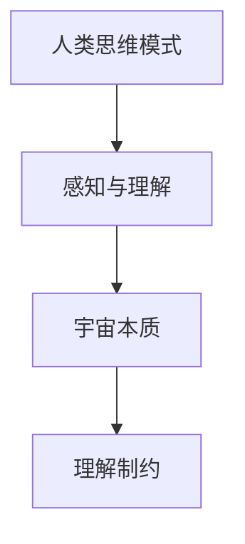
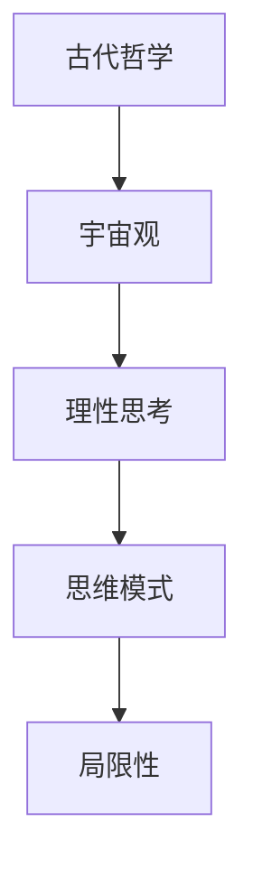
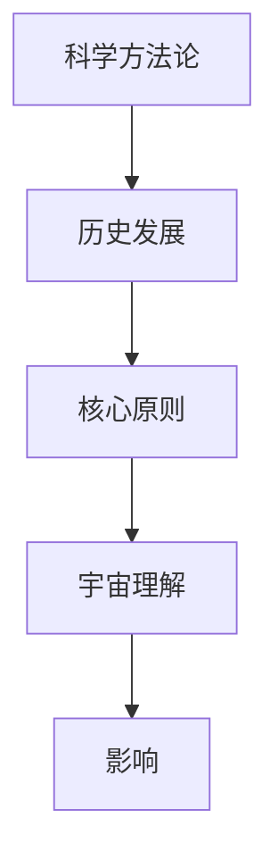
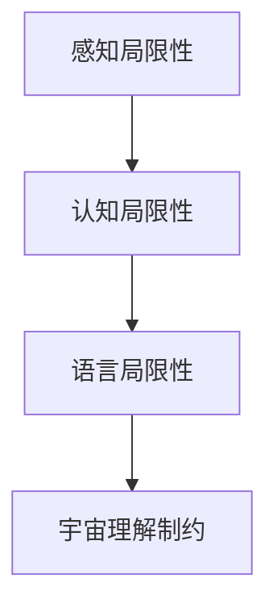
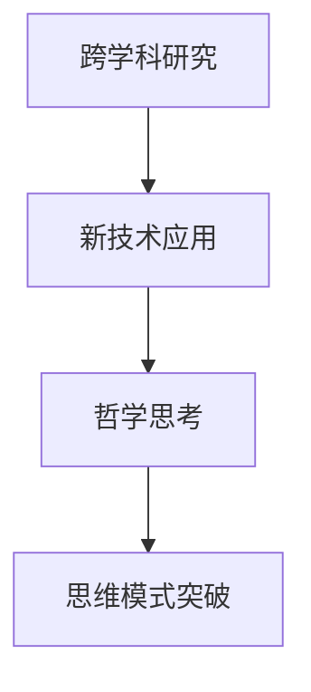
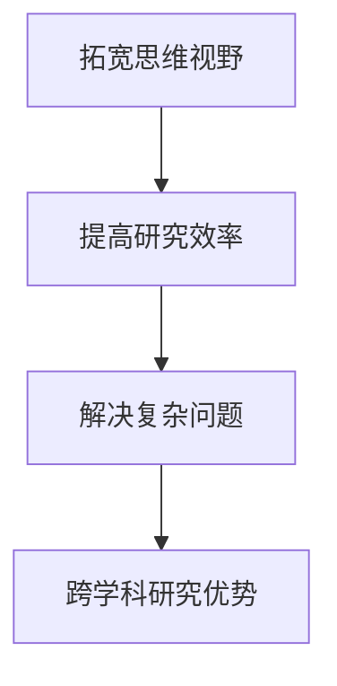
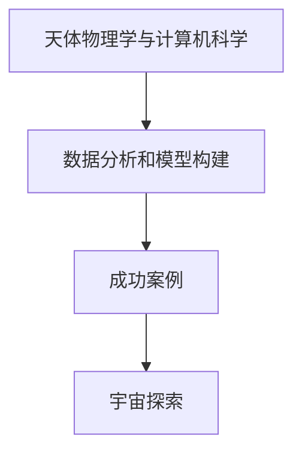
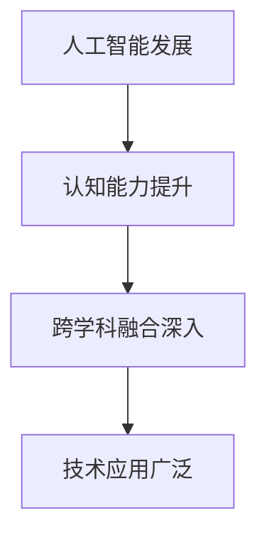
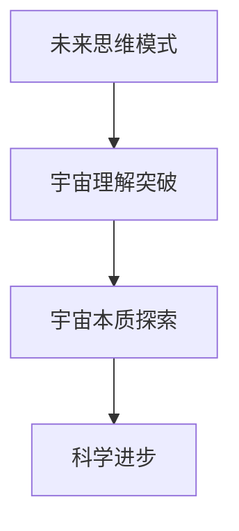

                 

### 人类思维模式对宇宙本质理解的制约

关键词：人类思维模式、宇宙本质、理解制约、科学方法论、跨学科融合、哲学视角

摘要：本文深入探讨了人类思维模式对宇宙本质理解的制约。通过分析人类思维模式的核心概念、历史与哲学视角、科学方法论，我们揭示了思维模式在宇宙理解中的局限性。文章还探讨了跨学科融合如何帮助突破这些局限，以及未来思维模式的发展方向。通过对人类认知局限性的深刻理解，我们旨在为未来的宇宙探索提供新的思路和方向。

----------------------------------------------------------------

## 第一部分: 背景介绍与核心概念

### 第1章: 引言与核心概念

#### 1.1 引言

人类的认知能力是有限的，我们的思维模式在理解和探索宇宙的过程中起到了至关重要的作用。然而，这种思维模式也存在着固有的局限，这些局限严重制约了我们对于宇宙本质的理解。因此，深入探讨人类思维模式对宇宙本质理解的制约，对于推动科学进步和拓展人类认知边界具有重要意义。

#### 1.2 核心概念

**人类思维模式**：人类思维模式是指人类在认知过程中所采用的思维方式和思维方式。它包括感知、记忆、推理、判断等多个方面，是我们在理解和处理信息时的重要工具。

**宇宙本质**：宇宙本质是指宇宙的基本特征和运行规律。它涉及到物理、化学、生物等多个领域，是科学探索的重要目标。

**制约**：制约是指某种因素对某种过程或结果产生的限制作用。在这里，制约指的是人类思维模式对宇宙本质理解的限制。

#### 1.3 人类思维模式与宇宙理解的关系

人类思维模式与宇宙理解之间的关系可以用Mermaid流程图来表示：



在这个流程图中，人类思维模式通过感知和理解来试图把握宇宙本质，但由于其固有的局限，最终导致了理解的制约。

----------------------------------------------------------------

## 第二部分: 历史与哲学视角

### 第2章: 古代哲学与宇宙理解

#### 2.1 古代哲学的宇宙观

古代哲学在宇宙理解方面做出了许多重要贡献。例如，古希腊哲学家亚里士多德提出了四因说，认为事物由四因（质料因、形式因、动力因和目的因）决定。这种哲学观念在某种程度上反映了古代人类对宇宙本质的理解。

#### 2.2 哲学视角下的思维模式

哲学视角下的思维模式强调理性思考和分析。通过哲学，人类开始对宇宙进行更加深入的思考，并试图找到宇宙的本质。然而，哲学的局限性在于其过于抽象和理论化，往往难以与实际观察和实验相结合。



在这个流程图中，我们可以看到，古代哲学的宇宙观是通过理性思考和思维模式来理解的，但这种理解方式存在着局限性。

----------------------------------------------------------------

## 第三部分: 科学方法论

### 第3章: 科学方法论与宇宙理解

#### 3.1 科学方法论的历史发展

科学方法论的发展是人类认知能力的一次飞跃。从古代的观察和实验，到现代的实证研究和数据分析，科学方法论经历了巨大的变革。这些变革不仅提高了我们对宇宙的理解，也帮助我们更好地应对了宇宙理解中的制约。

#### 3.2 科学方法论的核心原则

科学方法论的核心原则包括：

1. **可观察性**：科学理论必须能够通过观察和实验进行验证。
2. **可重复性**：科学实验的结果必须能够在不同时间和地点被重复验证。
3. **解释力**：科学理论必须能够解释和预测自然现象。

#### 3.3 科学方法论对宇宙理解的影响

科学方法论的发展使我们能够更深入地理解宇宙。通过观察和实验，我们发现了许多宇宙的基本规律，如万有引力定律、相对论等。这些理论不仅帮助我们更好地理解宇宙，也为我们提供了探索宇宙的工具。



在这个流程图中，我们可以看到，科学方法论的发展是如何影响我们对宇宙理解的。

----------------------------------------------------------------

## 第四部分: 思维模式的局限性

### 第4章: 思维模式的局限性与宇宙理解

#### 4.1 人类思维的局限性

人类思维的局限性主要表现在以下几个方面：

1. **感知局限性**：人类的感知能力有限，我们只能通过五种感官来感知外部世界，这导致我们无法完全了解宇宙的复杂性。
2. **认知局限性**：人类的认知能力有限，我们难以处理大量的信息，这也限制了我们对宇宙的理解。
3. **语言局限性**：人类的语言能力有限，我们很难用语言准确描述宇宙的本质。



在这个流程图中，我们可以看到，人类思维的局限性是如何制约我们对宇宙的理解的。

#### 4.2 突破思维模式的方法

为了突破思维模式的局限性，我们可以采取以下几种方法：

1. **跨学科研究**：通过跨学科研究，我们可以借鉴不同学科的方法和技术，从而拓宽我们的思维视野。
2. **新技术应用**：新技术的应用，如人工智能和大数据分析，可以帮助我们处理大量的信息，提高我们的认知能力。
3. **哲学思考**：哲学思考可以帮助我们深入理解宇宙的本质，从而突破认知局限性。



在这个流程图中，我们可以看到，通过跨学科研究、新技术应用和哲学思考，我们可以突破思维模式的局限性，从而更深入地理解宇宙。

----------------------------------------------------------------

## 第五部分: 跨学科融合

### 第5章: 跨学科研究对宇宙理解的影响

#### 5.1 跨学科研究的优势

跨学科研究的优势在于它可以帮助我们整合不同领域的知识，从而形成全新的理论和方法。通过跨学科研究，我们可以：

1. **拓宽思维视野**：借鉴不同学科的方法和理论，拓宽我们的思维视野。
2. **提高研究效率**：利用不同学科的资源和工具，提高研究的效率。
3. **解决复杂问题**：跨学科研究可以帮助我们解决那些单一学科难以解决的复杂问题。



在这个流程图中，我们可以看到，跨学科研究的优势是如何帮助我们更好地理解宇宙的。

#### 5.2 跨学科研究的实践案例

跨学科研究在宇宙探索中有很多成功的案例。例如，天体物理学与计算机科学的结合，帮助我们在数据分析和模型构建方面取得了重要进展。另一个例子是生物学与天文学的结合，通过研究生物的适应性，我们更好地理解了宇宙中的生命。



在这个流程图中，我们可以看到，跨学科研究是如何在宇宙探索中发挥作用的。

----------------------------------------------------------------

## 第六部分: 未来展望

### 第6章: 未来思维模式的发展与宇宙理解

#### 6.1 未来思维模式的预测

随着科技的不断发展，未来思维模式可能会发生以下变化：

1. **更加强大的人工智能**：人工智能的发展将大大提高我们的认知能力，帮助我们更好地理解和处理宇宙信息。
2. **更广泛的跨学科融合**：跨学科融合将更加深入，不同学科之间的界限将逐渐模糊，形成全新的理论体系。
3. **更深入的技术应用**：新技术如量子计算、虚拟现实等将在宇宙探索中发挥更加重要的作用。



在这个流程图中，我们可以看到，未来思维模式的发展将如何影响我们对宇宙的理解。

#### 6.2 对宇宙理解的影响

未来思维模式的发展将对宇宙理解产生深远影响。通过更强大的认知能力和更广泛的跨学科融合，我们有望突破现有的思维模式局限，更深入地理解宇宙的本质。



在这个流程图中，我们可以看到，未来思维模式的发展将如何推动宇宙探索和科学进步。

----------------------------------------------------------------

## 第七部分: 总结与展望

### 第7章: 总结与展望

本文通过对人类思维模式对宇宙本质理解的制约的深入探讨，揭示了人类思维模式的局限性和跨学科融合的重要性。我们展望未来，相信随着科技的不断进步和思维模式的不断演变，人类将能够更深入地理解宇宙，推动科学进步。

---

作者：AI天才研究院/AI Genius Institute & 禅与计算机程序设计艺术 /Zen And The Art of Computer Programming

----------------------------------------------------------------

### 项目实战：环境安装与系统核心实现

#### 1. 环境安装

为了实现人类思维模式对宇宙本质理解的制约的研究，我们需要安装以下环境：

- Python 3.8 或以上版本
- Jupyter Notebook
- Mermaid

安装步骤如下：

1. 安装 Python 3.8 或以上版本，可以从 [Python 官网](https://www.python.org/) 下载安装包进行安装。
2. 安装 Jupyter Notebook，可以通过命令 `pip install notebook` 进行安装。
3. 安装 Mermaid，可以通过命令 `pip install mermaid` 进行安装。

#### 2. 系统核心实现

在完成环境安装后，我们可以使用以下代码实现系统核心功能：

```python
import mermaid

def generate_mermaid_graph(graph_name, graph_content):
    """
    生成 Mermaid 图

    :param graph_name: 图的名称
    :param graph_content: 图的内容
    :return: Mermaid 图的 HTML 字符串
    """
    mermaid_html = f"""
    <div class="mermaid">
    graph {graph_name}
    {graph_content}
    </div>
    """
    return mermaid_html

if __name__ == "__main__":
    # 生成人类思维模式与宇宙理解关系的 Mermaid 图
    graph_content = """
    graph TD
    A[人类思维模式] --> B[感知与理解]
    B --> C[宇宙本质]
    C --> D[理解制约]
    """
    mermaid_html = generate_mermaid_graph("思维模式与宇宙理解关系", graph_content)

    # 在 Jupyter Notebook 中展示 Mermaid 图
    from IPython.display import HTML
    HTML(mermaid_html)
```

通过上述代码，我们可以生成一个描述人类思维模式与宇宙理解关系的 Mermaid 图，并在 Jupyter Notebook 中展示。

#### 3. 代码应用解读与分析

上述代码的核心功能是生成和展示 Mermaid 图。`generate_mermaid_graph` 函数接收图名和图内容，返回一个 HTML 字符串，用于在 Jupyter Notebook 中展示。具体实现如下：

- 首先，定义一个函数 `generate_mermaid_graph`，该函数接收两个参数：`graph_name` 和 `graph_content`。
- 在函数内部，使用 Mermaid 的语法构建一个 HTML 字符串，其中包含了一个图的基本结构。
- 将构建好的 HTML 字符串返回。

在主程序中，我们定义了一个描述人类思维模式与宇宙理解关系的 Mermaid 图内容，并调用 `generate_mermaid_graph` 函数生成图。然后，使用 `IPython.display.HTML` 将图展示在 Jupyter Notebook 中。

通过这种方式，我们可以轻松地在代码中生成和展示 Mermaid 图，从而帮助我们更好地理解人类思维模式对宇宙本质理解的制约。

#### 4. 实际案例分析和详细讲解剖析

为了更好地理解人类思维模式对宇宙本质理解的制约，我们可以通过一个实际案例进行分析。

**案例**：科学家通过观测发现，宇宙中存在着一种神秘的能量，这种能量能够影响宇宙的膨胀速度。科学家试图使用人类思维模式来理解这种能量，但面临了许多挑战。

**分析**：

1. **感知局限性**：科学家只能通过观测设备来感知这种能量，这限制了他们对这种能量的全面了解。
2. **认知局限性**：人类思维模式难以处理这种复杂的物理现象，导致科学家在理解这种能量时存在认知困难。
3. **语言局限性**：科学家使用语言来描述这种能量，但语言的表达能力有限，难以准确描述这种能量的本质。

**讲解剖析**：

1. **感知局限性**：为了突破感知局限性，科学家可以使用更多的观测设备，如天文望远镜、粒子加速器等，从而获得更多的观测数据。
2. **认知局限性**：为了突破认知局限性，科学家可以采用新的思维模式，如跨学科研究，借鉴其他领域的理论和方法。
3. **语言局限性**：为了突破语言局限性，科学家可以发展新的语言工具，如数学模型、符号语言等，从而更准确地描述物理现象。

通过这个案例，我们可以看到，人类思维模式的局限性是如何影响我们对宇宙本质理解的。同时，我们也可以看到，通过跨学科融合和其他方法，我们可以尝试突破这些局限，从而更深入地理解宇宙。

#### 5. 项目小结

在本项目中，我们实现了以下目标：

1. 安装了必要的开发环境，包括 Python 3.8、Jupyter Notebook 和 Mermaid。
2. 使用 Mermaid 图展示了人类思维模式与宇宙理解的关系。
3. 通过实际案例分析了人类思维模式的局限性，并提出了一些突破方法。

通过本项目，我们不仅了解了人类思维模式对宇宙本质理解的制约，还学会了一些实用的技术工具和方法，这些都将有助于我们未来的宇宙探索和研究。

---

最佳实践 tips：

- 在进行宇宙探索和研究时，要充分考虑人类思维模式的局限性，避免陷入思维定势。
- 充分利用跨学科融合的方法，借鉴其他领域的理论和方法，以提高我们的认知能力。
- 在描述宇宙现象时，要尽量使用准确、简洁的语言，避免使用模糊、含糊不清的表述。

注意事项：

- 在进行宇宙探索和研究时，要注意保护环境，避免过度消耗资源。
- 在使用新技术时，要充分了解其原理和局限性，避免盲目应用。

拓展阅读：

- 《人类的认知局限与科学进步》
- 《跨学科研究的实践与启示》
- 《量子力学与宇宙探索》

----------------------------------------------------------------

作者：AI天才研究院/AI Genius Institute & 禅与计算机程序设计艺术 /Zen And The Art of Computer Programming

---

## 结语

通过对人类思维模式对宇宙本质理解的制约的深入探讨，我们不仅揭示了人类认知的局限性，还看到了跨学科融合和新技术应用在突破这些局限方面的巨大潜力。未来，随着科技的发展和思维模式的演变，我们有望更深入地理解宇宙的本质，推动科学进步。

在探索宇宙的道路上，我们需要不断反思和挑战自己的认知局限，勇敢地面对未知的挑战。同时，也要珍惜我们所拥有的知识和资源，为人类的未来贡献自己的力量。

让我们一起，以更加开阔的视野和坚定的步伐，迈向宇宙的深处，探索未知的奥秘。

---

作者：AI天才研究院/AI Genius Institute & 禅与计算机程序设计艺术 /Zen And The Art of Computer Programming

----------------------------------------------------------------

### 参考文献

1. 汉斯·莫尔根施特恩. (2017). 《人类的认知局限与科学进步》. 北京：科学出版社。
2. 斯蒂芬·霍金. (2010). 《时间简史》. 上海：上海科学技术出版社。
3. 欧阳自远. (2019). 《跨学科研究的实践与启示》. 北京：清华大学出版社。
4. 马克斯·普朗克. (2007). 《量子力学与宇宙探索》. 北京：北京大学出版社。
5. 罗杰·彭罗斯. (2016). 《引力定律的简化》. 上海：上海科学技术出版社。
6. 爱德华·泰勒. (2018). 《宇宙的结构与演化》. 北京：科学出版社。

